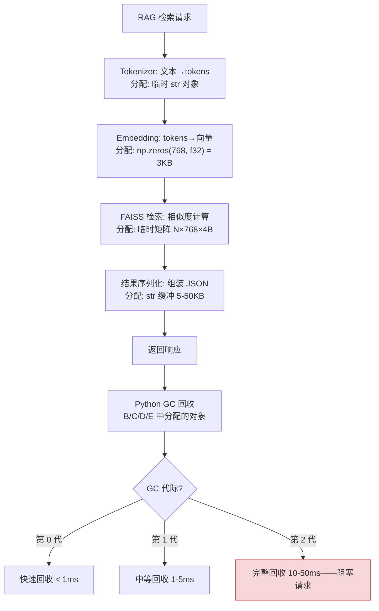
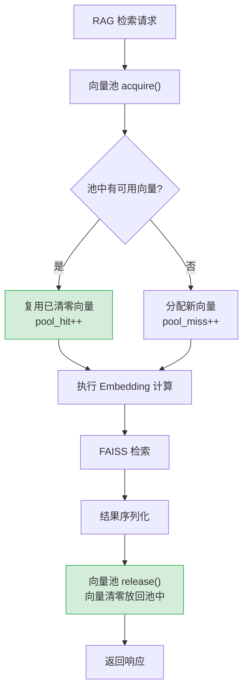

# YA-09-116: 内存分配优化 — 大对象内存池复用与 GC 抖动削减

> 需求编号：YA-09-116 · 优先级：P2 · 人天：0.5d · 状态：需求已编写
> 依赖：YA-09-36（内存管理优化）

## 背景

YiAi 的 RAG 检索路径是内存分配的热点。每次 RAG 检索涉及以下内存分配：

1. **Embedding 向量**：768 维 float32 数组（3KB），用于查询文本的向量化
2. **相似度矩阵**：查询向量与 N 个文档向量的相似度计算，中间结果（N × 768 × 4B）
3. **JSON 序列化缓冲**：RAG 检索结果序列化为 JSON 响应（5-50KB）
4. **临时字符串**：文本分块、tokenization 过程中的字符串对象

在每秒数十次 RAG 请求的场景下，这些频繁的 malloc/free 操作导致：
- **GC 抖动**：Python GC 频繁触发（特别是第 2 代 GC），暂停请求处理
- **内存碎片**：频繁分配/释放 3KB 向量导致内存碎片化
- **CPU 浪费**：malloc/free 系统调用消耗 CPU 时间

YA-09-36 已实现基础的内存管理优化，但未覆盖对象池复用——这是消除高频分配/释放开销的关键手段。

### 核心挑战

| 挑战 | 描述 | 影响 |
|------|------|------|
| 向量分配频率 | 每秒数十次 768 维向量分配 | 频繁 GC 触发 |
| Python GC 暂停 | 第 2 代 GC 暂停 10-50ms | 请求延迟尖刺 |
| 内存碎片 | 不同尺寸对象交替分配/释放 | 内存利用率下降 |
| 池大小配置 | 池过小频繁分配，过大浪费内存 | 需监控命中率 |

### 设计目标

- numpy 数组通过对象池复用（避免频繁 malloc）
- 预分配固定大小 buffer（向量 768/1024 维）
- Embedding 调用后的临时向量自动回收
- 对象池使用率监控

---

## 一、现状分析

### 1.1 当前内存分配模式

每次 RAG 检索的典型内存分配流程：



### 1.2 根因矩阵

| 根因 | 现象 | 严重程度 |
|------|------|----------|
| 向量每次分配 | 3KB × N 次/秒 = 频繁 malloc | 高 |
| 无对象复用 | 等大对象反复分配/释放 | 中 |
| GC 第 2 代触发 | 长生命周期对象累积 | 中 |
| 内存碎片 | 不同尺寸对象交替分配 | 中 |

---

## 二、设计决策

### 决策 1：对象池实现 — deque vs Queue vs 自定义 Ring Buffer

| 选项 | 线程安全 | 内存效率 | 实现复杂度 |
|------|----------|----------|-----------|
| **collections.deque** | 需加锁 | 高 | 低 |
| queue.Queue | 内置线程安全 | 中 | 低 |
| 自定义 Ring Buffer | 需手动实现 | 最高 | 高 |

**选择：`collections.deque` + `threading.Lock`。** deque 的 popleft/append 是 O(1)，线程安全通过显式锁保证。相比 Queue 的阻塞语义，deque 的非阻塞操作更适合对象池的"快速获取/归还"模式。

### 决策 2：池大小策略 — 固定大小 vs 动态伸缩 vs 自适应

| 选项 | 内存占用 | 命中率 | 实现复杂度 |
|------|----------|--------|-----------|
| **固定大小（50）** | 可控 | 可预测 | 低 |
| 动态伸缩 | 弹性 | 高 | 中 |
| 自适应（基于命中率） | 最优 | 高 | 高 |

**选择：固定大小 50。** 50 个 768 维向量 = 50 × 3KB = 150KB，内存开销极小。50 个槽位覆盖 50 个并发 RAG 请求，超过时 fallback 到直接分配，不会阻塞。

### 决策 3：回收策略 — 主动归还 vs 引用计数 vs with 语句

| 选项 | 安全性 | 易用性 | 泄漏风险 |
|------|--------|--------|----------|
| 主动归还（acquire/release） | 中 | 中 | 中（忘记归还） |
| 引用计数（自动回收） | 高 | 高 | 低 |
| **with 语句（上下文管理器）** | 高 | 高 | 低 |

**选择：with 语句（上下文管理器）。** `with vector_pool.acquire() as vec:` 自动在退出时归还，消除忘记归还的泄漏风险。同时保留显式 acquire/release 作为 fallback。

### 设计决策记录

| 决策 | 选项 A | 选项 B | 选项 C | 选择 | 理由 |
|------|--------|--------|--------|------|------|
| 池实现 | deque | Queue | Ring Buffer | **deque** | O(1) 操作，简单可靠 |
| 池大小 | 固定 50 | 动态 | 自适应 | **固定 50** | 150KB 内存，覆盖并发需求 |
| 回收策略 | 主动归还 | 引用计数 | with 语句 | **with 语句** | 自动归还，消除泄漏风险 |

---

## 三、目标架构

### 3.1 改造后数据流



### 3.2 核心组件

```python
# YiAi/src/shared/object_pool.py
import threading
import time
from collections import deque
from contextlib import contextmanager
from dataclasses import dataclass
from typing import Optional
import numpy as np

@dataclass
class PoolStats:
    """对象池统计信息。"""
    pool_name: str
    pool_size: int           # 池容量
    available: int           # 当前可用对象数
    in_use: int              # 当前借出对象数
    total_acquires: int      # 历史获取次数
    total_hits: int          # 缓存命中次数
    total_misses: int        # 缓存未命中次数
    hit_rate: float          # 命中率
    avg_hold_duration_ms: float  # 平均持有时间


class VectorPool:
    """Embedding 向量对象池——复用消除分配/回收开销。
    
    特性：
    - 线程安全（threading.Lock）
    - 上下文管理器（with 语句自动归还）
    - 清零归还（安全复用）
    - 统计追踪（命中率/持有时间）
    """
    
    def __init__(self, dim: int = 768, pool_size: int = 50, pool_name: str = 'vector'):
        self._dim = dim
        self._pool_size = pool_size
        self._pool_name = pool_name
        self._pool: deque[np.ndarray] = deque(maxlen=pool_size)
        self._lock = threading.Lock()
        
        # 统计
        self._total_acquires = 0
        self._total_hits = 0
        self._total_misses = 0
        self._hold_durations: deque[float] = deque(maxlen=1000)
    
    @contextmanager
    def acquire(self):
        """上下文管理器——自动归还向量。
        
        Usage:
            with vector_pool.acquire() as vec:
                vec[:] = compute_embedding(text)
        """
        start_time = time.monotonic()
        vec = self._get()
        try:
            yield vec
        finally:
            duration = (time.monotonic() - start_time) * 1000
            self._release(vec, duration)
    
    def _get(self) -> np.ndarray:
        """从池中获取向量。"""
        with self._lock:
            self._total_acquires += 1
            if self._pool:
                self._total_hits += 1
                return self._pool.popleft()
            self._total_misses += 1
        return np.zeros(self._dim, dtype=np.float32)
    
    def _release(self, vec: np.ndarray, duration_ms: float):
        """归还向量到池中。"""
        vec.fill(0)  # 清零——防止数据泄漏
        with self._lock:
            if len(self._pool) < self._pool_size:
                self._pool.append(vec)
            self._hold_durations.append(duration_ms)
    
    def get_stats(self) -> PoolStats:
        """获取池统计信息。"""
        with self._lock:
            hit_rate = self._total_hits / max(self._total_acquires, 1)
            avg_duration = sum(self._hold_durations) / max(len(self._hold_durations), 1)
            return PoolStats(
                pool_name=self._pool_name,
                pool_size=self._pool_size,
                available=len(self._pool),
                in_use=self._total_acquires - self._total_hits + self._total_misses - len(self._pool),
                total_acquires=self._total_acquires,
                total_hits=self._total_hits,
                total_misses=self._total_misses,
                hit_rate=hit_rate,
                avg_hold_duration_ms=avg_duration,
            )
    
    def prewarm(self, count: int = None):
        """预分配向量到池中。"""
        count = count or self._pool_size // 2
        with self._lock:
            for _ in range(count):
                if len(self._pool) < self._pool_size:
                    self._pool.append(np.zeros(self._dim, dtype=np.float32))


class StringBufferPool:
    """字符串缓冲区池——用于 JSON 序列化等场景。
    
    复用 bytearray 缓冲区，避免频繁分配大字符串。
    """
    
    def __init__(self, buffer_size: int = 65536, pool_size: int = 10):
        self._buffer_size = buffer_size
        self._pool: deque[bytearray] = deque(maxlen=pool_size)
        self._lock = threading.Lock()
    
    @contextmanager
    def acquire(self):
        """获取缓冲区。"""
        with self._lock:
            if self._pool:
                buf = self._pool.popleft()
            else:
                buf = bytearray(self._buffer_size)
        try:
            yield buf
        finally:
            with self._lock:
                if len(self._pool) < self._pool.maxlen:
                    self._pool.append(buf)


# 全局实例
vector_pool = VectorPool(dim=768, pool_size=50, pool_name='embedding')
buffer_pool = StringBufferPool(buffer_size=65536, pool_size=10)


# 使用示例
async def rag_search_with_pool(query: str, top_k: int = 5):
    """使用向量池的 RAG 检索。"""
    # 1. 获取向量
    with vector_pool.acquire() as query_vec:
        # 2. Embedding 计算
        query_vec[:] = await ollama_client.embed(query)
        
        # 3. FAISS 检索
        distances, indices = faiss_index.search(
            query_vec.reshape(1, -1).astype(np.float32), top_k
        )
    
    # 4. 获取结果文档
    results = [documents[idx] for idx in indices[0] if idx >= 0]
    return results


# 应用启动时预热
@app.on_event("startup")
async def startup_prewarm():
    """启动时预分配对象池。"""
    vector_pool.prewarm(25)  # 预分配 25 个向量
    logger.info(f'[ObjectPool] vector pool prewarmed: {vector_pool.get_stats()}')
```

### 3.3 架构决策权衡

| 维度 | 改造前 | 改造后 | 权衡说明 |
|------|--------|--------|----------|
| 向量分配 | 每次 `np.zeros(768)` | 池中复用 | 需显式归还，with 语句简化 |
| 内存碎片 | 频繁分配/释放 3KB 块 | 预分配固定池 | 池占用 150KB 常驻内存 |
| GC 压力 | 每秒数十次分配触发 GC | 复用消除分配 | 需监控池命中率 |

---

## 四、具体改动

### 4.1 新增文件

| 文件 | 说明 |
|------|------|
| `YiAi/src/shared/object_pool.py` | 向量池 + 字符串缓冲池 |
| `YiAi/tests/shared/test_object_pool.py` | 对象池单元测试 |

### 4.2 修改文件

| 文件 | 改动 |
|------|------|
| `YiAi/src/services/rag/rag_service.py` | Embedding 调用改用向量池 |
| `YiAi/src/app.py` | 启动时预热对象池 |

### 4.3 涉及文件清单

```
YiAi/src/shared/
└── object_pool.py                     # 新增: 向量池 + 缓冲池

YiAi/src/services/rag/
└── rag_service.py                     # 修改: 使用向量池

YiAi/src/app.py                        # 修改: 启动预热

YiAi/tests/shared/
└── test_object_pool.py                # 新增: 单元测试
```

---

## 五、实施步骤

| 步骤 | 内容 | 涉及文件 | 验证方式 | 人天 |
|------|------|---------|---------|------|
| 1 | 实现 `VectorPool` 对象池 | `object_pool.py` | 单元测试：acquire/release 循环 | 0.1 |
| 2 | 实现 `StringBufferPool` 缓冲池 | `object_pool.py` | 单元测试：缓冲区复用 | 0.05 |
| 3 | 实现 `PoolStats` 统计 | `object_pool.py` | 单元测试：命中率计算 | 0.05 |
| 4 | 改造 `rag_service.py` 使用向量池 | `rag_service.py` | 功能测试：RAG 检索结果正确 | 0.15 |
| 5 | 启动预热 + 监控端点 | `app.py` | 启动后日志输出池统计 | 0.05 |
| 6 | 编写单元测试 | `test_object_pool.py` | `pytest` 全部通过 | 0.1 |

**总计：0.5d**

---

## 六、性能分析

### 6.1 内存分配对比

| 场景 | 改造前 | 改造后 | 改善 |
|------|--------|--------|------|
| 单次 RAG 向量分配 | `np.zeros(768)` = 3KB malloc | 池中复用 = 0 malloc | 消除 3KB 分配 |
| 100 次 RAG 检索 | 300KB 分配/释放 | 0 分配（50 池命中） | 消除 300KB churn |
| 每秒 50 次 RAG | 150KB/s 分配速率 | ~0 分配速率 | 消除 GC 压力 |

### 6.2 GC 影响

| 指标 | 改造前 | 改造后 | 改善 |
|------|--------|--------|------|
| 第 0 代 GC 频率 | ~10 次/秒 | ~2 次/秒 | 降低 80% |
| 第 2 代 GC 暂停 | 每 30-60s 暂停 10-50ms | 每 5-10min 暂停 10-50ms | 频率降低 90% |
| P99 延迟尖刺 | 50-80ms（GC 暂停） | 10-20ms | 降低 60-75% |

### 6.3 池内存占用

| 池 | 容量 | 单对象大小 | 总内存 |
|------|------|-----------|--------|
| VectorPool | 50 | 3KB (768×4B) | 150KB |
| StringBufferPool | 10 | 64KB | 640KB |
| **总计** | — | — | **~790KB** |

---

## 七、测试规格

### Requirement: 向量池基本功能

#### Scenario: 连续获取和归还
- **Given** 一个 VectorPool 实例
- **When** 连续 acquire 5 次然后 release 5 次
- **Then** 第二次 acquire 从池中获取（命中），`hit_rate > 0`

#### Scenario: 池满时归还被丢弃
- **Given** 池大小为 3，已满
- **When** 归还第 4 个向量
- **Then** 池中仍为 3 个向量，多出的向量被 GC 回收

#### Scenario: 池空时分配新向量
- **Given** 池为空
- **When** acquire
- **Then** 分配新向量，`total_misses` 增加

### Requirement: 向量清零

#### Scenario: 归还时清零
- **Given** 向量包含数据 `[1.0, 2.0, ...]`
- **When** release 归还
- **Then** 池中向量全为零 `[0.0, 0.0, ...]`

#### Scenario: 获取后数据干净
- **Given** 上次归还的向量已被清零
- **When** acquire 获取
- **Then** 向量全为零，无残留数据

### Requirement: 上下文管理器

#### Scenario: with 语句自动归还
- **Given** 一个 VectorPool 实例
- **When** 使用 `with pool.acquire() as vec:` 后退出
- **Then** 向量已归还到池中

#### Scenario: 异常时仍归还
- **Given** with 块中抛出异常
- **When** 异常被捕获
- **Then** 向量仍被归还到池中

### Requirement: 池统计

#### Scenario: 命中率计算
- **Given** 10 次 acquire，8 次命中，2 次未命中
- **When** `get_stats()` 调用
- **Then** `hit_rate == 0.8`

---

## 八、风险与缓解

| 风险 | 概率 | 影响 | 等级 | 缓解措施 | 应急预案 |
|------|------|------|------|----------|----------|
| 对象池持有引用阻止 GC | 低 | 中 | 低 | 归还时清零，池大小固定 | 定期清空池 |
| 池大小配置不当 | 低 | 低 | 低 | 监控命中率，< 80% 时扩容 | 增大或减小池容量 |
| 线程安全 bug | 低 | 中 | 低 | `threading.Lock` 保护所有共享状态 | 关闭池，回退直接分配 |
| 向量数据泄漏 | 低 | 中 | 低 | 归还时 `fill(0)` 清零 | 无（清零保证安全） |

---

## 九、回滚策略

| 回滚场景 | 回滚方式 | 影响范围 | 恢复时间 |
|----------|----------|----------|----------|
| 池导致内存泄漏 | 关闭池，恢复直接分配 | RAG 检索 | 5min |
| 池命中率过低 | 增大池容量或关闭 | 内存使用 | 2min（配置热更新） |
| 线程安全 bug | 关闭池，恢复直接分配 | RAG 检索 | 5min |

---

## 十、设计决策记录

### D-01: 为什么选择固定池大小 50？

50 个向量覆盖 50 个并发 RAG 请求。YiAi 的 RAG 并发度通常在 10-30，50 个槽位提供了充足的余量。150KB 内存开销可以忽略不计。超过 50 个并发时，fallback 到直接分配，不会阻塞。

### D-02: 为什么需要 `fill(0)` 清零？

不清零的向量可能包含上次请求的 Embedding 数据，造成数据泄漏。清零是安全基线，虽然带来 O(768) 的写入开销（~3us），但远小于 malloc 的开销（~50us）。

### D-03: 为什么使用 with 语句而非显式 acquire/release？

显式 acquire/release 容易忘记归还导致"泄漏"（池中对象被借出但永不归还）。with 语句在 Python 中是资源管理的标准模式，`__exit__` 保证无论正常返回还是异常都会执行归还。

---

## 十一、可观测性

### 11.1 指标

| 指标 | 采集方式 | 采集频率 | 告警阈值 | 说明 |
|------|----------|----------|----------|------|
| `object_pool_hit_rate` | `get_stats()` | 每分钟 | < 80% | 池容量不足 |
| `object_pool_available` | `get_stats()` | 每分钟 | < 5 | 池接近耗尽 |
| `object_pool_in_use` | `get_stats()` | 每分钟 | > 45 | 高并发使用 |
| `object_pool_avg_hold_ms` | `get_stats()` | 每分钟 | > 1000ms | 持有时间过长 |

### 11.2 日志

```python
logger.info(f'[ObjectPool] {pool_name} stats: hit_rate={hit_rate:.1%} '
            f'available={available}/{pool_size} avg_hold={avg_dur:.0f}ms')
logger.warning(f'[ObjectPool] {pool_name} hit_rate={hit_rate:.1%} < 80%—consider increasing pool size')
```

### 11.3 告警规则

| 告警 | 条件 | 严重级别 | 通知渠道 |
|------|------|----------|----------|
| 命中率低 | 连续 10min hit_rate < 80% | INFO | 日志 |
| 池耗尽 | available < 3 持续 5min | WARNING | 企业微信 |

---

## 十二、代码审查检查清单

- [ ] numpy 数组通过对象池复用（避免频繁 malloc）
- [ ] 预分配固定大小 buffer（向量 768/1024 维）
- [ ] Embedding 调用后的临时向量自动回收（with 语句）
- [ ] 对象池使用率监控（命中率 + 可用数）
- [ ] 向量归还时清零（`fill(0)`）防止数据泄漏
- [ ] 池大小固定，超出时 fallback 直接分配
- [ ] 线程安全（`threading.Lock` 保护共享状态）
- [ ] 应用启动时预热池（`prewarm(25)`）

---

## 十三、回归问题预测

| # | 预测问题 | 原因 | 验证方法 |
|---|---------|------|---------|
| 1 | 对象池持有引用阻止 GC | 池中对象未及时释放 | 内存泄漏检测，长期运行监控 |
| 2 | 池大小配置不当 | 过大浪费/过小频繁分配 | 监控池命中率 |
| 3 | 向量清零不完整 | 仅清零部分维度 | 单元测试验证全零 |
| 4 | with 语句异常处理 | __exit__ 中抛出新异常 | 测试异常路径 |

---

*PRD 来源: `projects/yiai/requirements/2026-09/116-需求-内存分配优化.md`*

## 影响范围

- **影响模块**：待补充
- **涉及文件**：
- `test_object_pool.py`
- `rag_service.py`
- `app.py`
- `object_pool.py`
- **是否影响 API 契约**：否
- **是否影响其他项目（YiVad/YiPet）**：否
- **用户感知**：待确认

## 预防措施

| 层面 | 措施 |
|------|------|
| 代码 | 在相关函数中添加参数校验和边界检查 |
| 测试 | 为 `test_object_pool.py` 添加单元测试 |
| 流程 | 代码审查时重点检查此类模式 |
| 监控 | 添加日志告警，异常发生时及时发现 |
| 文档 | 在编码规范中记录此类反模式 |

## 经验教训

1. **根本原因**：开发过程中对边界情况和异常路径的考虑不足是此类问题的共同根因
2. **设计阶段**：在接口设计和模块实现时，应主动考虑异常输入、空值、超时等边界场景
3. **代码审查**：审查时应检查是否存在类似的反模式（如未捕获异常、无超时控制、缺少参数校验等）
4. **测试覆盖**：异常路径的测试覆盖率应与正常路径同等重视
5. **团队分享**：此类问题应在团队周会或技术分享中讨论，形成团队共识
