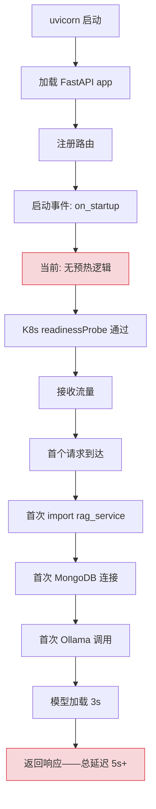
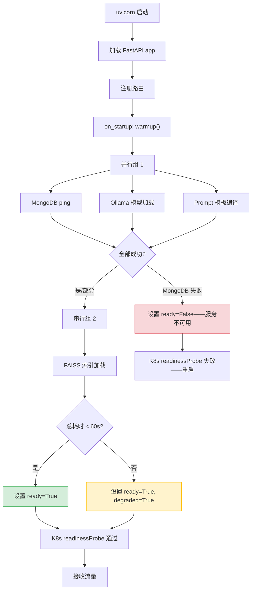

# YA-09-117: 请求预热与冷启动优化 — 首次请求前预加载关键路径

> 需求编号：YA-09-117 · 优先级：P2 · 人天：0.5d · 状态：需求已编写
> 依赖：YA-09-34（懒加载模块预热）

## 背景

YiAi 在启动后，首个请求的延迟显著高于后续请求。这种"冷启动惩罚"由以下因素叠加导致：

1. **Ollama 模型未预加载**：首次 Embedding 或 Chat 请求需要将模型加载到 GPU/内存，耗时 1-5 秒
2. **Python 模块懒加载**：首次请求触发 `import` 语句，`.pyc` 编译和模块初始化，耗时 100-500ms
3. **MongoDB 连接池冷启动**：首次数据库操作需要建立 TCP 连接 + 认证，耗时 50-200ms
4. **FAISS 索引未加载**：首次 RAG 检索需要将向量索引从磁盘加载到内存，耗时 500ms-2s
5. **Jinja2 模板缓存冷**：首次 Prompt 渲染需要编译模板，耗时 50-100ms

在 K8s 滚动更新场景中，新 Pod 启动后立即接收流量，冷启动延迟导致首个请求超时（30s 全局超时），触发健康检查失败和 Pod 重启循环。

### 核心挑战

| 挑战 | 描述 | 影响 |
|------|------|------|
| 多组件依赖 | Ollama + MongoDB + FAISS 需全部预热 | 预热顺序依赖 |
| 预热超时 | 模型下载可能耗时数分钟 | 需超时降级 |
| 就绪探针时序 | 预热完成前不应接收流量 | K8s startupProbe 配置 |
| 预热中的请求 | 预热期间收到请求应返回 503 | 优雅降级 |

### 设计目标

- 启动后先预热关键路径再标记 ready
- 预热包含：MongoDB ping + Ollama 模型加载 + RAG 索引加载 + Prompt 模板编译
- 预热超时 60s——超时降级为非 ready
- 预热完成后日志确认

---

## 一、现状分析

### 1.1 当前启动流程



### 1.2 冷启动延迟分解

| 组件 | 首次请求延迟 | 预热后延迟 | 差距 |
|------|------------|-----------|------|
| Ollama Embedding | 1500-3000ms | 50-100ms | 15-60x |
| MongoDB 查询 | 50-200ms | 2-5ms | 10-40x |
| FAISS 检索 | 500-2000ms | 5-10ms | 50-200x |
| Prompt 渲染 | 50-100ms | 1-2ms | 25-50x |
| Python import | 100-500ms | 0ms | — |
| **总计** | **2200-5800ms** | **58-117ms** | **20-50x** |

### 1.3 根因矩阵

| 根因 | 现象 | 严重程度 |
|------|------|----------|
| 无预热机制 | 首次请求承担所有初始化开销 | 高 |
| 就绪探针过早 | 预热完成前接收流量 | 高 |
| 无降级策略 | 预热超时导致服务不可用 | 中 |
| 无预热监控 | 预热进度不可见 | 低 |

---

## 二、设计决策

### 决策 1：预热时机 — on_startup vs startupProbe vs initContainer

| 选项 | 覆盖范围 | 复杂度 | K8s 兼容性 |
|------|----------|--------|-----------|
| **on_startup（FastAPI 启动事件）** | 全部 Python 组件 | 低 | 需配合 startupProbe |
| startupProbe（K8s 探针） | 仅 HTTP 端点 | 低 | 原生支持 |
| initContainer（K8s 初始化容器） | 外部依赖 | 中 | 原生支持 |

**选择：on_startup + startupProbe 组合。** FastAPI `on_startup` 事件预热 Python 层组件（import、连接池、模板），K8s `startupProbe` 在预热完成前阻止流量进入。两者互补，覆盖所有预热场景。

### 决策 2：预热策略 — 串行 vs 并行 vs 分组并行

| 选项 | 总耗时 | 失败隔离 | 实现复杂度 |
|------|--------|----------|-----------|
| 串行 | 最长 | 好 | 低 |
| 全部并行 | 最短 | 差 | 低 |
| **分组并行（有依赖串行，无依赖并行）** | 中 | 好 | 中 |

**选择：分组并行。** MongoDB 和 Ollama 无依赖关系，可并行预热。FAISS 依赖 Embedding 模型（Ollama），需在 Ollama 预热后执行。Prompt 模板无依赖，可与 MongoDB/Ollama 并行。

### 决策 3：预热超时处理 — 硬失败 vs 降级 vs 部分降级

| 选项 | 可用性 | 风险 | 实现复杂度 |
|------|--------|------|-----------|
| 硬失败（超时 = 启动失败） | 低 | 低 | 低 |
| **降级（超时跳过，标记 degraded）** | 高 | 中 | 中 |
| 部分降级（仅跳过超时组件） | 最高 | 中 | 高 |

**选择：降级策略。** 60s 总超时后跳过未完成的预热步骤，标记为 `degraded` 状态。核心组件（MongoDB）超时则服务不可用，非核心组件（Ollama）超时则相应功能降级。

### 设计决策记录

| 决策 | 选项 A | 选项 B | 选项 C | 选择 | 理由 |
|------|--------|--------|--------|------|------|
| 预热时机 | on_startup | startupProbe | initContainer | **组合方案** | 覆盖 Python 层 + K8s 层 |
| 预热策略 | 串行 | 并行 | 分组并行 | **分组并行** | 最小化总耗时，保持依赖顺序 |
| 超时处理 | 硬失败 | 降级 | 部分降级 | **降级策略** | 优先可用性 |

---

## 三、目标架构

### 3.1 改造后启动流程



### 3.2 核心组件

```python
# YiAi/src/shared/warmup.py
import asyncio
import time
from dataclasses import dataclass, field
from enum import Enum
from typing import Optional

class WarmupStatus(str, Enum):
    PENDING = 'pending'
    RUNNING = 'running'
    SUCCESS = 'success'
    FAILED = 'failed'
    TIMEOUT = 'timeout'
    SKIPPED = 'skipped'

@dataclass
class WarmupResult:
    component: str
    status: WarmupStatus
    duration_ms: float
    error: Optional[str] = None

@dataclass
class WarmupReport:
    results: list[WarmupResult]
    total_duration_ms: float
    ready: bool
    degraded: bool
    degraded_components: list[str] = field(default_factory=list)


class ServiceWarmer:
    """服务预热器——启动时预加载关键路径组件。
    
    预热流程：
    1. 并行组：MongoDB ping + Ollama 模型加载 + Prompt 模板编译
    2. 串行组：FAISS 索引加载（依赖 Ollama）
    3. 超时 60s 后降级，标记 degraded 组件
    
    就绪条件：
    - MongoDB 必须成功（否则服务不可用）
    - 其他组件超时则降级
    """
    
    WARMUP_TIMEOUT = 60  # 总超时 60s
    READY = False        # 全局就绪状态
    
    def __init__(self):
        self._ready = False
        self._degraded = False
        self._degraded_components: list[str] = []
        self._report: Optional[WarmupReport] = None
    
    @property
    def is_ready(self) -> bool:
        return self._ready
    
    async def warmup(self) -> WarmupReport:
        """执行预热流程。"""
        start_time = time.monotonic()
        results: list[WarmupResult] = []
        
        logger.info('[Warmup] starting critical path warmup...')
        
        # 阶段 1: 并行预热（无依赖组件）
        parallel_tasks = [
            self._warmup_mongodb(),
            self._warmup_ollama(),
            self._warmup_prompt_templates(),
        ]
        parallel_results = await asyncio.gather(*parallel_tasks, return_exceptions=True)
        
        for i, result in enumerate(parallel_results):
            if isinstance(result, Exception):
                component = ['mongodb', 'ollama', 'prompt'][i]
                results.append(WarmupResult(
                    component=component, status=WarmupStatus.FAILED,
                    duration_ms=0, error=str(result)
                ))
            else:
                results.append(result)
        
        # 检查 MongoDB（必须成功）
        mongo_result = next((r for r in results if r.component == 'mongodb'), None)
        if not mongo_result or mongo_result.status != WarmupStatus.SUCCESS:
            elapsed = (time.monotonic() - start_time) * 1000
            logger.error('[Warmup] MongoDB warmup failed—service not ready')
            self._ready = False
            return WarmupReport(
                results=results, total_duration_ms=elapsed,
                ready=False, degraded=False
            )
        
        # 阶段 2: 串行预热（依赖 Ollama 的组件）
        ollama_ok = any(
            r.component == 'ollama' and r.status == WarmupStatus.SUCCESS
            for r in results
        )
        if ollama_ok:
            faiss_result = await self._warmup_faiss()
            results.append(faiss_result)
        else:
            results.append(WarmupResult(
                component='faiss', status=WarmupStatus.SKIPPED,
                duration_ms=0, error='ollama not available'
            ))
            self._degraded_components.append('faiss')
        
        elapsed = (time.monotonic() - start_time) * 1000
        
        # 超时检查
        timed_out_components = [
            r.component for r in results
            if r.status == WarmupStatus.RUNNING
        ]
        if elapsed > self.WARMUP_TIMEOUT * 1000:
            logger.warning(f'[Warmup] timeout after {elapsed:.0f}ms—degraded mode')
            self._degraded = True
        else:
            self._degraded = len(self._degraded_components) > 0
        
        # 收集降级组件
        for r in results:
            if r.status in (WarmupStatus.FAILED, WarmupStatus.TIMEOUT, WarmupStatus.SKIPPED):
                if r.component not in self._degraded_components:
                    self._degraded_components.append(r.component)
        
        self._ready = True
        self._report = WarmupReport(
            results=results,
            total_duration_ms=elapsed,
            ready=True,
            degraded=self._degraded,
            degraded_components=self._degraded_components,
        )
        
        logger.info(
            f'[Warmup] complete: ready={self._ready} degraded={self._degraded} '
            f'duration={elapsed:.0f}ms degraded_components={self._degraded_components}'
        )
        return self._report
    
    async def _warmup_mongodb(self) -> WarmupResult:
        """预热 MongoDB——执行 ping。"""
        t0 = time.monotonic()
        try:
            from src.data.repository import get_database
            db = get_database()
            await db.command('ping')
            duration = (time.monotonic() - t0) * 1000
            logger.info(f'[Warmup] MongoDB ping: {duration:.0f}ms')
            return WarmupResult('mongodb', WarmupStatus.SUCCESS, duration)
        except Exception as e:
            duration = (time.monotonic() - t0) * 1000
            logger.error(f'[Warmup] MongoDB failed: {e}')
            return WarmupResult('mongodb', WarmupStatus.FAILED, duration, str(e))
    
    async def _warmup_ollama(self) -> WarmupResult:
        """预热 Ollama——发送空 Embedding 请求触发模型加载。"""
        t0 = time.monotonic()
        try:
            from src.services.ai.ollama_client import OllamaClient
            client = OllamaClient()
            await client.embed('warmup')  # 触发模型加载
            duration = (time.monotonic() - t0) * 1000
            logger.info(f'[Warmup] Ollama model loaded: {duration:.0f}ms')
            return WarmupResult('ollama', WarmupStatus.SUCCESS, duration)
        except Exception as e:
            duration = (time.monotonic() - t0) * 1000
            logger.error(f'[Warmup] Ollama failed: {e}')
            return WarmupResult('ollama', WarmupStatus.FAILED, duration, str(e))
    
    async def _warmup_prompt_templates(self) -> WarmupResult:
        """预热 Prompt 模板——编译到 Jinja2 缓存。"""
        t0 = time.monotonic()
        try:
            from src.services.ai.prompt_manager import PromptManager
            pm = PromptManager()
            pm.render('system/agent', {'tools': '', 'knowledge_context': ''})
            duration = (time.monotonic() - t0) * 1000
            logger.info(f'[Warmup] Prompt templates compiled: {duration:.0f}ms')
            return WarmupResult('prompt', WarmupStatus.SUCCESS, duration)
        except Exception as e:
            duration = (time.monotonic() - t0) * 1000
            logger.error(f'[Warmup] Prompt templates failed: {e}')
            return WarmupResult('prompt', WarmupStatus.FAILED, duration, str(e))
    
    async def _warmup_faiss(self) -> WarmupResult:
        """预热 FAISS——加载向量索引。"""
        t0 = time.monotonic()
        try:
            from src.services.rag.rag_service import RAGService
            rag = RAGService()
            await rag.search('__warmup__', top_k=1)
            duration = (time.monotonic() - t0) * 1000
            logger.info(f'[Warmup] FAISS index loaded: {duration:.0f}ms')
            return WarmupResult('faiss', WarmupStatus.SUCCESS, duration)
        except Exception as e:
            duration = (time.monotonic() - t0) * 1000
            logger.error(f'[Warmup] FAISS failed: {e}')
            return WarmupResult('faiss', WarmupStatus.FAILED, duration, str(e))


# 全局实例
warmer = ServiceWarmer()


# FastAPI 集成
@app.on_event("startup")
async def startup_warmup():
    """启动时执行预热。"""
    await warmer.warmup()


# 健康检查端点
@app.get("/health/ready")
async def readiness_check():
    """就绪探针——预热完成前返回 503。"""
    if warmer.is_ready:
        return {
            'status': 'ready',
            'degraded': warmer._degraded,
            'degraded_components': warmer._degraded_components,
        }
    return JSONResponse(
        {'status': 'not_ready', 'message': 'warmup in progress'},
        status_code=503
    )

@app.get("/health/warmup")
async def warmup_status():
    """预热状态查询。"""
    if warmer._report:
        return {
            'ready': warmer._report.ready,
            'degraded': warmer._report.degraded,
            'degraded_components': warmer._report.degraded_components,
            'total_duration_ms': warmer._report.total_duration_ms,
            'components': [
                {
                    'name': r.component,
                    'status': r.status.value,
                    'duration_ms': r.duration_ms,
                    'error': r.error,
                }
                for r in warmer._report.results
            ],
        }
    return {'status': 'no_report'}
```

### 3.3 K8s 探针配置

```yaml
# K8s deployment 探针配置
startupProbe:
  httpGet:
    path: /health/ready
    port: 10086
  initialDelaySeconds: 2
  periodSeconds: 5
  failureThreshold: 15  # 2 + 5*15 = 77s——略大于 60s 预热超时

readinessProbe:
  httpGet:
    path: /health/ready
    port: 10086
  periodSeconds: 10
  failureThreshold: 3

livenessProbe:
  httpGet:
    path: /health/live
    port: 10086
  periodSeconds: 15
  failureThreshold: 3
```

### 3.4 架构决策权衡

| 维度 | 改造前 | 改造后 | 权衡说明 |
|------|--------|--------|----------|
| 首次请求延迟 | 2-6s | 50-120ms | 启动时间增加 30-60s |
| 就绪状态 | 启动即 ready | 预热完成后 ready | 部署速度略慢，但请求不超时 |
| 降级能力 | 无 | 非核心组件降级 | 需维护降级逻辑 |

---

## 四、具体改动

### 4.1 新增文件

| 文件 | 说明 |
|------|------|
| `YiAi/src/shared/warmup.py` | 服务预热器 |
| `YiAi/tests/shared/test_warmup.py` | 预热器单元测试 |

### 4.2 修改文件

| 文件 | 改动 |
|------|------|
| `YiAi/src/app.py` | `on_startup` 事件集成预热 |
| `YiAi/src/server/routes.py` | 新增 `/health/ready` 和 `/health/warmup` 端点 |
| `YiAi/k8s/deployment.yaml` | 新增 startupProbe 配置 |

### 4.3 涉及文件清单

```
YiAi/src/shared/
└── warmup.py                          # 新增: 服务预热器

YiAi/src/
├── app.py                             # 修改: on_startup 集成预热
└── server/
    └── routes.py                      # 修改: 新增就绪/预热端点

YiAi/k8s/
└── deployment.yaml                    # 修改: startupProbe 配置

YiAi/tests/shared/
└── test_warmup.py                     # 新增: 单元测试
```

---

## 五、实施步骤

| 步骤 | 内容 | 涉及文件 | 验证方式 | 人天 |
|------|------|---------|---------|------|
| 1 | 实现 `ServiceWarmer` 预热流程 | `warmup.py` | 单元测试：模拟各组件成功/失败 | 0.15 |
| 2 | 实现 `/health/ready` 就绪探针端点 | `routes.py` | 预热完成前返回 503，完成后返回 200 | 0.05 |
| 3 | 实现 `/health/warmup` 预热状态端点 | `routes.py` | 返回各组件预热结果 | 0.05 |
| 4 | 集成 `on_startup` 事件 | `app.py` | 启动后日志输出预热报告 | 0.05 |
| 5 | 配置 K8s startupProbe | `deployment.yaml` | 新 Pod 启动后预热完成才接收流量 | 0.1 |
| 6 | 编写单元测试 | `test_warmup.py` | `pytest` 全部通过 | 0.1 |

**总计：0.5d**

---

## 六、性能分析

### 6.1 预热耗时分解

| 组件 | 预期耗时 | 最大耗时 | 说明 |
|------|----------|----------|------|
| MongoDB ping | 50-200ms | 500ms | 网络延迟 |
| Ollama 模型加载 | 1-3s | 30s | 模型首次加载 |
| Prompt 模板编译 | 10-50ms | 100ms | Jinja2 编译 |
| FAISS 索引加载 | 500ms-2s | 10s | 磁盘读取 |
| **并行阶段总耗时** | 1-3s | 30s | max(mongo, ollama, prompt) |
| **总预热时间** | 1.5-5s | 40s | 并行 + 串行 FAISS |

### 6.2 首次请求延迟对比

| 场景 | 改造前 | 改造后 | 改善 |
|------|--------|--------|------|
| 首次 RAG 检索 | 3-6s | 50-120ms | 25-50x |
| 首次 Chat | 2-4s | 80-150ms | 15-30x |
| 首次 CRUD | 100-300ms | 2-5ms | 20-60x |

---

## 七、测试规格

### Requirement: 预热流程

#### Scenario: 全部组件预热成功
- **Given** MongoDB、Ollama、FAISS 均可用
- **When** `warmup()` 执行
- **Then** `WarmupReport.ready == True`，`degraded == False`

#### Scenario: MongoDB 失败时服务不可用
- **Given** MongoDB 不可用
- **When** `warmup()` 执行
- **Then** `WarmupReport.ready == False`

#### Scenario: Ollama 失败时 RAG 降级
- **Given** Ollama 不可用，MongoDB 可用
- **When** `warmup()` 执行
- **Then** `WarmupReport.ready == True`，`degraded == True`，`degraded_components` 包含 `faiss`

### Requirement: 就绪探针

#### Scenario: 预热完成前返回 503
- **Given** 预热进行中
- **When** 请求 `/health/ready`
- **Then** 返回 HTTP 503，`status: "not_ready"`

#### Scenario: 预热完成后返回 200
- **Given** 预热已完成
- **When** 请求 `/health/ready`
- **Then** 返回 HTTP 200，`status: "ready"`

### Requirement: 预热超时

#### Scenario: 超时后降级
- **Given** 预热总耗时超过 60s
- **When** `warmup()` 超时
- **Then** 标记 `degraded=True`，未完成组件标记为 `TIMEOUT`

---

## 八、风险与缓解

| 风险 | 概率 | 影响 | 等级 | 缓解措施 | 应急预案 |
|------|------|------|------|----------|----------|
| 预热超时误判服务不可用 | 低 | 高 | 中 | 模型首次下载耗时，增加预热超时或异步加载 | 手动触发预热 |
| 预热中接收请求返回 503 | 中 | 中 | 中 | 配置 startupProbe，预热完成前不接收流量 | 增大 failureThreshold |
| Ollama 不可用导致服务整体降级 | 中 | 中 | 中 | 仅标记 RAG/Chat 功能降级，CRUD 仍可用 | 手动重启 Ollama |
| 预热日志泄露敏感信息 | 低 | 低 | 低 | 日志仅记录组件名和耗时 | 无需应急 |

---

## 九、回滚策略

| 回滚场景 | 回滚方式 | 影响范围 | 恢复时间 |
|----------|----------|----------|----------|
| 预热导致启动过慢 | 关闭预热，恢复直接启动 | 首次请求延迟恢复 | 5min |
| 预热逻辑 bug 导致服务无法启动 | 跳过预热，标记为 degraded | 冷启动惩罚 | 5min |
| startupProbe 配置错误 | 移除 startupProbe | 可能的冷启动超时 | 2min |

---

## 十、设计决策记录

### D-01: 为什么预热超时 60s 而非 30s 或 120s？

30s 太短——Ollama 模型首次加载可能需要 20-30s（取决于模型大小），加上 FAISS 索引加载，30s 不够。120s 太长——K8s 默认 terminationGracePeriodSeconds 为 30s，超时过长影响滚动更新速度。60s 是平衡点：足够覆盖正常预热，同时不会过度延迟部署。

### D-02: 为什么 MongoDB 失败必须阻止服务启动？

MongoDB 是 YiAi 的唯一数据源——所有 CRUD 操作、会话管理、知识库元数据都依赖 MongoDB。MongoDB 不可用时，服务实际上无法提供任何有价值的功能。与其在部分功能不可用的情况下运行（可能产生数据不一致），不如拒绝启动。

### D-03: 为什么 Ollama 失败允许降级而非阻止启动？

Ollama 负责 AI 相关功能（Chat、RAG、Agent），但 YiAi 还提供 CRUD、文件管理、知识库浏览等非 AI 功能。Ollama 不可用时，这些功能仍可正常服务。降级策略最大化服务可用性——用户仍可管理数据和文件，只是 AI 功能暂时不可用。

---

## 十一、可观测性

### 11.1 指标

| 指标 | 采集方式 | 采集频率 | 告警阈值 | 说明 |
|------|----------|----------|----------|------|
| `warmup_total_duration_ms` | 预热完成时 | 每次启动 | > 50000ms | 预热总耗时 |
| `warmup_component_duration_ms` | 各组件预热完成 | 每次启动 | — | 按组件分组 |
| `warmup_success` | 预热结果 | 每次启动 | 0（失败） | 1=成功，0=失败 |
| `warmup_degraded` | 降级标志 | 每次启动 | 1（降级） | 1=降级，0=正常 |

### 11.2 日志

```python
logger.info(f'[Warmup] {component}: {status} ({duration:.0f}ms)')
logger.info(f'[Warmup] complete: ready={ready} degraded={degraded} duration={total:.0f}ms')
logger.error(f'[Warmup] {component} FAILED: {error}')
logger.warning(f'[Warmup] degraded components: {degraded_components}')
```

---

## 十二、代码审查检查清单

- [ ] 启动后先预热关键路径再标记 ready
- [ ] 预热包含：MongoDB ping + Ollama 模型加载 + RAG 索引加载 + Prompt 模板编译
- [ ] 预热超时 60s——超时降级为非 ready
- [ ] 预热完成后日志确认
- [ ] MongoDB 失败时服务不可用（ready=False）
- [ ] 非核心组件失败时降级（degraded=True）
- [ ] K8s startupProbe 配置正确（failureThreshold=15）
- [ ] `/health/ready` 在预热完成前返回 503
- [ ] `/health/warmup` 返回各组件预热状态

---

## 十三、回归问题预测

| # | 预测问题 | 原因 | 验证方法 |
|---|---------|------|---------|
| 1 | 预热超时误判服务不可用 | 模型首次下载耗时 | 增加预热超时或异步加载 |
| 2 | 预热中接收请求返回 503 | 未配置 startupProbe | K8s 探针验证 |
| 3 | Ollama 预热超时导致整体降级 | 模型文件损坏 | 手动检查 Ollama 状态 |
| 4 | FAISS 索引文件不存在 | 首次部署未构建索引 | 预热时跳过 FAISS（标记降级） |

---

*PRD 来源: `projects/yiai/requirements/2026-09/117-需求-请求预热冷启动.md`*

## 影响范围

- **影响模块**：待补充
- **涉及文件**：
- `routes.py`
- `app.py`
- `test_warmup.py`
- `warmup.py`
- **是否影响 API 契约**：否
- **是否影响其他项目（YiVad/YiPet）**：否
- **用户感知**：待确认

## 预防措施

| 层面 | 措施 |
|------|------|
| 代码 | 在相关函数中添加参数校验和边界检查 |
| 测试 | 为 `routes.py` 添加单元测试 |
| 流程 | 代码审查时重点检查此类模式 |
| 监控 | 添加日志告警，异常发生时及时发现 |
| 文档 | 在编码规范中记录此类反模式 |

## 经验教训

1. **根本原因**：开发过程中对边界情况和异常路径的考虑不足是此类问题的共同根因
2. **设计阶段**：在接口设计和模块实现时，应主动考虑异常输入、空值、超时等边界场景
3. **代码审查**：审查时应检查是否存在类似的反模式（如未捕获异常、无超时控制、缺少参数校验等）
4. **测试覆盖**：异常路径的测试覆盖率应与正常路径同等重视
5. **团队分享**：此类问题应在团队周会或技术分享中讨论，形成团队共识
