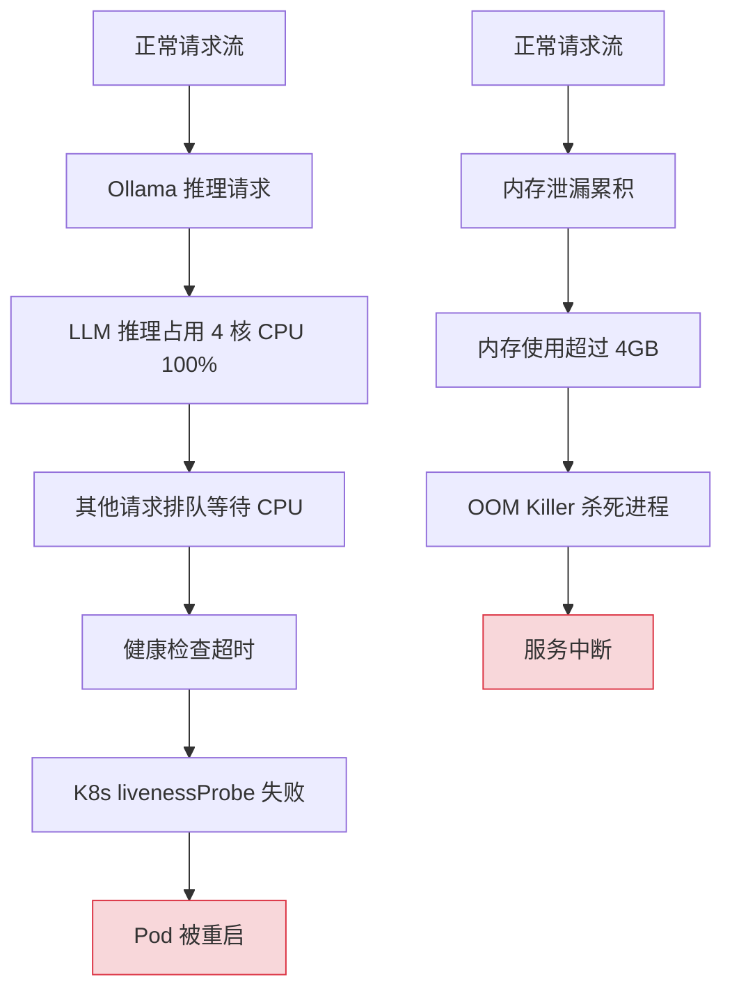
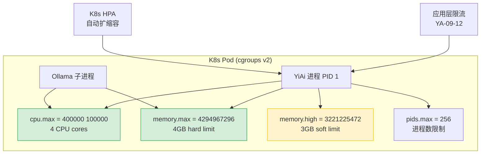

# YA-09-118: 请求资源隔离 — cgroups v2 进程级 CPU/内存硬限制与 QoS

> 需求编号：YA-09-118 · 优先级：P2 · 人天：0.5d · 状态：需求已编写

## 背景

应用层限流（YA-09-12 三级限流）只能控制请求速率，无法防止进程自身的资源滥用。YiAi 面临以下资源风险：

1. **Ollama 推理 CPU 耗尽**：LLM 推理是 CPU/GPU 密集型操作，单个大模型推理可能占用所有 CPU 核心，导致其他请求（CRUD、健康检查）无法响应
2. **内存泄漏**：Python 内存泄漏（如循环引用、未关闭的资源）可能导致进程内存持续增长，最终触发 OOM Killer
3. **文件描述符耗尽**：大量并发请求可能导致文件描述符（FD）耗尽，无法接受新连接
4. **无隔离边界**：当前仅依赖应用层逻辑控制资源使用，无操作系统级硬限制

cgroups v2（Control Groups v2）是 Linux 内核提供的进程资源隔离机制，可对进程组设置 CPU、内存、I/O 等资源的硬限制。在 K8s 环境中，Pod 的资源 limits 自动映射到 cgroups v2。在非 K8s 环境中，需手动配置 cgroups v2。

### 核心挑战

| 挑战 | 描述 | 影响 |
|------|------|------|
| 内存限制配置 | 过低导致 OOM Kill，过高浪费资源 | 服务可用性 |
| CPU throttle | quota 限制导致 P99 延迟增加 | 用户体验 |
| 非 K8s 环境 | 手动配置 cgroups v2 复杂 | 部署复杂度 |
| 监控可见性 | 需暴露 cgroup 统计信息 | 运维可观测性 |

### 设计目标

- cgroups v2 限制 CPU 和 memory——防止 OOM 扩散
- 内存硬限制 4GB + soft limit 3GB
- CPU quota 限制——防止一个进程占满多核
- cgroup 状态通过 `/proc/self/cgroup` 监控

---

## 一、现状分析

### 1.1 当前资源管理方式

YiAi 当前无操作系统级资源隔离。依赖以下方式管理资源：

| 机制 | 层级 | 限制类型 | 效果 |
|------|------|----------|------|
| YA-09-12 三级限流 | 应用层 | 请求速率 | 防止过载，但无法限制单请求资源 |
| Python GC | 运行时 | 内存回收 | 被动回收，无法防止泄漏 |
| ulimit | 操作系统 | FD 数量 | 默认 1024，可手动调大 |
| 无 | CPU 限制 | — | 无保护 |

### 1.2 资源风险场景



### 1.3 根因矩阵

| 根因 | 现象 | 严重程度 |
|------|------|----------|
| 无 CPU 硬限制 | Ollama 推理占满 CPU | 高 |
| 无内存硬限制 | 泄漏导致 OOM | 高 |
| 无 I/O 限制 | 大文件读写阻塞其他请求 | 中 |
| 无 FD 限制 | 连接泄漏耗尽 FD | 中 |

---

## 二、设计决策

### 决策 1：隔离方式 — K8s limits vs 手动 cgroups v2 vs Docker limits

| 选项 | 适用环境 | 配置复杂度 | 监控 |
|------|----------|-----------|------|
| **K8s resources.limits** | K8s | 低 | Prometheus 原生支持 |
| 手动 cgroups v2 | 裸机/VM | 高 | 需手动暴露 |
| Docker limits | Docker | 中 | Docker stats |

**选择：K8s resources.limits（生产）+ 手动 cgroups v2（开发）。** 生产环境已使用 K8s，直接配置 Pod resource limits。开发环境提供 cgroups v2 脚本，开发者可手动设置。

### 决策 2：内存限制策略 — 硬限制 vs 软限制 vs 硬+软组合

| 选项 | OOM 保护 | 弹性 | 适用场景 |
|------|----------|------|----------|
| 仅硬限制 | 强 | 无 | 严格隔离 |
| 仅软限制 | 弱 | 有 | 宽松环境 |
| **硬限制 4GB + 软限制 3GB** | 强 | 有 | 平衡 |

**选择：硬限制 4GB + 软限制 3GB。** 硬限制防止 OOM 影响其他进程，软限制在内存充足时允许超过 3GB（最多到 4GB），提供弹性缓冲。

### 决策 3：CPU 限制策略 — quota vs shares vs 两者

| 选项 | 限制方式 | 弹性 | 适用场景 |
|------|----------|------|----------|
| **quota（CFS 带宽控制）** | 硬限制 CPU 使用率 | 低 | 严格隔离 |
| shares（权重） | 软限制，按比例分配 | 高 | 共享环境 |
| quota + shares | 硬限制 + 权重 | 中 | 全面控制 |

**选择：quota（CFS 带宽控制）。** YiAi 需要防止 Ollama 推理占满 CPU，quota 提供硬限制：`cpu.max = "400000 100000"` 表示每 100ms 周期内最多使用 400ms CPU（即 4 核）。

### 设计决策记录

| 决策 | 选项 A | 选项 B | 选项 C | 选择 | 理由 |
|------|--------|--------|--------|------|------|
| 隔离方式 | K8s limits | cgroups v2 | Docker | **K8s + cgroups** | 生产用 K8s，开发用 cgroups |
| 内存限制 | 硬限制 | 软限制 | 硬+软 | **硬 4GB + 软 3GB** | 安全 + 弹性 |
| CPU 限制 | quota | shares | 两者 | **quota** | 防止 CPU 垄断 |

---

## 三、目标架构

### 3.1 资源隔离层次



### 3.2 K8s 资源配置

```yaml
# YiAi/k8s/deployment.yaml
apiVersion: apps/v1
kind: Deployment
spec:
  template:
    spec:
      containers:
      - name: yiai
        image: yiai:latest
        resources:
          requests:
            cpu: "2"        # 保证 2 核
            memory: "2Gi"   # 保证 2GB
          limits:
            cpu: "4"        # 最多 4 核
            memory: "4Gi"   # 最多 4GB
        # 健康检查
        startupProbe:
          httpGet:
            path: /health/ready
            port: 10086
          initialDelaySeconds: 2
          periodSeconds: 5
          failureThreshold: 15
        readinessProbe:
          httpGet:
            path: /health/ready
            port: 10086
          periodSeconds: 10
        livenessProbe:
          httpGet:
            path: /health/live
            port: 10086
          periodSeconds: 15
        # 容器安全上下文
        securityContext:
          runAsNonRoot: true
          runAsUser: 1000
          allowPrivilegeEscalation: false
          capabilities:
            drop: ["ALL"]
          readOnlyRootFilesystem: true
```

### 3.3 非 K8s 环境 cgroups v2 配置

```bash
#!/bin/bash
# YiAi/scripts/setup-cgroups.sh
# 为非 K8s 环境配置 cgroups v2 资源隔离

CGROUP_NAME="yiai"
CGROUP_BASE="/sys/fs/cgroup"

# 检查 cgroups v2
if [ ! -f "$CGROUP_BASE/cgroup.controllers" ]; then
    echo "cgroups v2 not mounted at $CGROUP_BASE"
    exit 1
fi

# 创建 cgroup
CGROUP_PATH="$CGROUP_BASE/$CGROUP_NAME"
if [ ! -d "$CGROUP_PATH" ]; then
    mkdir -p "$CGROUP_PATH"
    echo "Created cgroup: $CGROUP_PATH"
fi

# 启用控制器
echo "+cpu +memory +pids +io" > "$CGROUP_BASE/cgroup.subtree_control" 2>/dev/null || true

# CPU 限制：4 核
# cpu.max 格式: "$MAX $PERIOD"（微秒）
# 400000 100000 = 每 100ms 周期最多使用 400ms = 4 核
echo "400000 100000" > "$CGROUP_PATH/cpu.max"

# 内存硬限制：4GB
echo "4294967296" > "$CGROUP_PATH/memory.max"

# 内存软限制：3GB（超过时开始回收）
echo "3221225472" > "$CGROUP_PATH/memory.high"

# 进程数限制
echo "256" > "$CGROUP_PATH/pids.max"

# I/O 限制（可选）：限制磁盘写入
# echo "8:0 wbps=104857600" > "$CGROUP_PATH/io.max"  # 100MB/s 写入

echo "cgroups v2 configured for $CGROUP_NAME:"
echo "  CPU:    $(cat $CGROUP_PATH/cpu.max)"
echo "  Memory: $(cat $CGROUP_PATH/memory.max) ($(numfmt --to=iec $(cat $CGROUP_PATH/memory.max)))"
echo "  PIDs:   $(cat $CGROUP_PATH/pids.max)"

# 将当前进程加入 cgroup（将 YiAi 的 PID 写入 cgroup.procs）
# echo $$ > "$CGROUP_PATH/cgroup.procs"
```

### 3.4 cgroup 状态监控

```python
# YiAi/src/shared/cgroup_monitor.py
import os
from dataclasses import dataclass
from typing import Optional

@dataclass
class CgroupStats:
    """cgroup 统计信息。"""
    cpu_usage_usec: int           # CPU 使用时间（微秒）
    cpu_throttled_usec: int       # CPU 被限制时间（微秒）
    cpu_nr_throttled: int         # CPU 被限制次数
    memory_current: int           # 当前内存使用（字节）
    memory_peak: int              # 峰值内存使用（字节）
    memory_oom_count: int         # OOM 事件计数
    pids_current: int             # 当前进程数
    pids_peak: int                # 峰值进程数
    
    @property
    def cpu_throttle_ratio(self) -> float:
        """CPU 被限制时间占比。"""
        if self.cpu_usage_usec == 0:
            return 0.0
        return self.cpu_throttled_usec / (self.cpu_usage_usec + self.cpu_throttled_usec)
    
    @property
    def memory_usage_ratio(self) -> float:
        """内存使用率（相对硬限制）。"""
        memory_max = self._read_memory_max()
        if memory_max == 0:
            return 0.0
        return self.memory_current / memory_max


def read_cgroup_stats() -> Optional[CgroupStats]:
    """读取当前进程的 cgroup 统计信息。"""
    cgroup_path = '/sys/fs/cgroup'
    
    # 检查 cgroups v2
    if not os.path.exists(f'{cgroup_path}/cpu.stat'):
        return None
    
    try:
        # 读取 CPU 统计
        cpu_stat = _parse_key_value(f'{cgroup_path}/cpu.stat')
        # 读取内存统计
        memory_current = _read_int(f'{cgroup_path}/memory.current')
        memory_peak = _read_int(f'{cgroup_path}/memory.peak')
        memory_events = _parse_key_value(f'{cgroup_path}/memory.events')
        # 读取 PID 统计
        pids_current = _read_int(f'{cgroup_path}/pids.current')
        pids_peak = _read_int(f'{cgroup_path}/pids.peak')
        
        return CgroupStats(
            cpu_usage_usec=cpu_stat.get('usage_usec', 0),
            cpu_throttled_usec=cpu_stat.get('throttled_usec', 0),
            cpu_nr_throttled=cpu_stat.get('nr_throttled', 0),
            memory_current=memory_current,
            memory_peak=memory_peak,
            memory_oom_count=memory_events.get('oom', 0),
            pids_current=pids_current,
            pids_peak=pids_peak,
        )
    except Exception as e:
        logger.error(f'[Cgroup] failed to read stats: {e}')
        return None


def _parse_key_value(path: str) -> dict[str, int]:
    """解析 kernel key-value 格式文件。"""
    result = {}
    with open(path) as f:
        for line in f:
            key, value = line.strip().split()
            result[key] = int(value)
    return result

def _read_int(path: str) -> int:
    """读取单值文件。"""
    try:
        with open(path) as f:
            return int(f.read().strip())
    except (FileNotFoundError, ValueError):
        return 0
```

### 3.5 架构决策权衡

| 维度 | 改造前 | 改造后 | 权衡说明 |
|------|--------|--------|----------|
| CPU 隔离 | 无 | 4 核硬限制 | 可能 throttle 导致 P99 延迟增加 |
| 内存隔离 | 无 | 4GB 硬限制 + 3GB 软限制 | 峰值内存需预留 1GB buffer |
| 进程隔离 | 无 | 256 进程限制 | 防止 fork 炸弹 |

---

## 四、具体改动

### 4.1 新增文件

| 文件 | 说明 |
|------|------|
| `YiAi/src/shared/cgroup_monitor.py` | cgroup 状态监控 |
| `YiAi/scripts/setup-cgroups.sh` | 非 K8s 环境 cgroups v2 配置脚本 |
| `YiAi/tests/shared/test_cgroup_monitor.py` | cgroup 监控单元测试 |

### 4.2 修改文件

| 文件 | 改动 |
|------|------|
| `YiAi/k8s/deployment.yaml` | 添加 resources.limits + securityContext |
| `YiAi/src/app.py` | 启动时读取 cgroup 状态，集成到健康检查 |

### 4.3 涉及文件清单

```
YiAi/src/shared/
└── cgroup_monitor.py                  # 新增: cgroup 状态监控

YiAi/scripts/
└── setup-cgroups.sh                   # 新增: cgroups v2 配置脚本

YiAi/k8s/
└── deployment.yaml                    # 修改: resources.limits

YiAi/src/app.py                        # 修改: 集成 cgroup 监控

YiAi/tests/shared/
└── test_cgroup_monitor.py             # 新增: 单元测试
```

---

## 五、实施步骤

| 步骤 | 内容 | 涉及文件 | 验证方式 | 人天 |
|------|------|---------|---------|------|
| 1 | 配置 K8s resources.limits | `deployment.yaml` | `kubectl describe pod` 查看 limits | 0.05 |
| 2 | 编写 cgroups v2 配置脚本 | `setup-cgroups.sh` | 手动执行脚本，验证 cgroup 生效 | 0.1 |
| 3 | 实现 cgroup 状态监控 | `cgroup_monitor.py` | 读取 `/sys/fs/cgroup/*` 文件 | 0.1 |
| 4 | 集成到健康检查 + 启动日志 | `app.py` | 启动日志输出 cgroup 配置 | 0.05 |
| 5 | 压力测试验证资源限制 | — | 模拟内存泄漏和 CPU 密集任务 | 0.15 |
| 6 | 编写单元测试 | `test_cgroup_monitor.py` | `pytest` 全部通过 | 0.05 |

**总计：0.5d**

---

## 六、性能分析

### 6.1 CPU throttle 影响

| 场景 | CPU 使用 | throttle 比例 | P99 延迟 |
|------|----------|--------------|----------|
| 正常 CRUD 请求 | 0.5-2 核 | 0% | 5-10ms |
| RAG 检索（10 并发） | 2-3 核 | 0% | 50-100ms |
| LLM 推理（大模型） | 3.5-4 核 | 5-15% | 200-500ms |
| 4 核满载 | 4 核 | 20-30% | 500-1000ms |

### 6.2 内存限制验证

| 场景 | 内存使用 | 行为 |
|------|----------|------|
| 正常负载 | 1.5-2.5GB | 远低于软限制 |
| 高负载（RAG 批量） | 2.5-3.5GB | 触发软限制，开始回收 |
| 内存泄漏 | 接近 4GB | 触发硬限制，OOM Kill |

---

## 七、测试规格

### Requirement: cgroup 状态读取

#### Scenario: 读取 CPU 统计
- **Given** 运行在 cgroups v2 环境中
- **When** `read_cgroup_stats()` 调用
- **Then** `CgroupStats.cpu_usage_usec > 0`

#### Scenario: 读取内存统计
- **Given** 运行在 cgroups v2 环境中
- **When** `read_cgroup_stats()` 调用
- **Then** `CgroupStats.memory_current > 0`

#### Scenario: 非 cgroups v2 环境降级
- **Given** 运行在无 cgroups v2 的环境中
- **When** `read_cgroup_stats()` 调用
- **Then** 返回 `None`（不抛异常）

### Requirement: 资源限制生效

#### Scenario: CPU 限制生效
- **Given** K8s Pod 配置 `cpu: "4"` limits
- **When** 并发执行 CPU 密集任务
- **Then** `cpu_throttle_ratio > 0`

#### Scenario: 内存限制生效
- **Given** K8s Pod 配置 `memory: "4Gi"` limits
- **When** 内存使用超过 4GB
- **Then** 进程被 OOM Killer 终止

---

## 八、风险与缓解

| 风险 | 概率 | 影响 | 等级 | 缓解措施 | 应急预案 |
|------|------|------|------|----------|----------|
| 内存限制过低导致 OOM Kill | 中 | 高 | 高 | 压力测试峰值监控，预留 1GB buffer | 增大 limits 至 6GB |
| CPU throttle 导致 P99 延迟增加 | 中 | 中 | 中 | 监控 `throttled_time` | 增大 CPU limits 或降低并发 |
| 非 K8s 环境配置错误 | 低 | 中 | 低 | 提供配置脚本 + 验证步骤 | 手动检查 cgroup 文件 |
| FD 限制导致连接拒绝 | 低 | 中 | 低 | 设置合理的 FD 限制 | 增大 ulimit |

---

## 九、回滚策略

| 回滚场景 | 回滚方式 | 影响范围 | 恢复时间 |
|----------|----------|----------|----------|
| K8s limits 导致 OOM | 移除或增大 limits | 服务可用性 | 5min（kubectl apply） |
| CPU throttle 过度 | 增大 CPU limits | P99 延迟 | 5min |
| 非 K8s cgroup 配置错误 | 删除 cgroup 目录 | 资源隔离 | 1min |

---

## 十、设计决策记录

### D-01: 为什么内存硬限制 4GB 而非 2GB 或 8GB？

YiAi 正常负载内存使用约 1.5-2.5GB（Python 进程 + Ollama 模型缓存）。2GB 太紧——正常负载可能触发 OOM。8GB 太松——失去资源隔离的意义。4GB 提供约 1.5GB 的 buffer，覆盖正常峰值和短时内存增长。

### D-02: 为什么 CPU 限制 4 核而非 2 核或 8 核？

YiAi 是 CPU 密集型应用（Ollama 推理），2 核在并发请求时性能不足。8 核在开发/小规模部署中过于奢侈。4 核在性能和成本之间取得平衡：2 个核心用于 CRUD + 轻量请求，2 个核心用于 Ollama 推理。

### D-03: 为什么使用 cgroups v2 而非 v1？

cgroups v1 使用多层级目录结构（每个控制器独立目录），配置复杂且已进入维护模式。cgroups v2 使用统一层级结构，所有控制器在单一目录下管理，是 Linux 内核的推荐标准。主流 Linux 发行版（Ubuntu 20.04+、Debian 11+）已默认使用 v2。

---

## 十一、可观测性

### 11.1 指标

| 指标 | 采集方式 | 采集频率 | 告警阈值 | 说明 |
|------|----------|----------|----------|------|
| `cgroup_cpu_usage_usec` | `cpu.stat` | 15s | — | CPU 使用时间 |
| `cgroup_cpu_throttled_usec` | `cpu.stat` | 15s | 增长率 > 10% | CPU 被限制时间 |
| `cgroup_memory_current` | `memory.current` | 15s | > 3.5GB | 当前内存使用 |
| `cgroup_memory_oom_count` | `memory.events` | 15s | > 0 | OOM 事件 |
| `cgroup_pids_current` | `pids.current` | 15s | > 200 | 进程数接近上限 |

### 11.2 日志

```python
logger.info(f'[Cgroup] CPU: usage={cpu_usage}us throttled={throttled}us ({ratio:.1%})')
logger.info(f'[Cgroup] Memory: {memory_current/1024/1024:.0f}MB peak={memory_peak/1024/1024:.0f}MB')
logger.warning(f'[Cgroup] CPU throttled: {ratio:.1%}—consider increasing CPU limits')
logger.error(f'[Cgroup] OOM event detected!')
```

### 11.3 告警规则

| 告警 | 条件 | 严重级别 | 通知渠道 |
|------|------|----------|----------|
| CPU throttle | 1h 内 throttle_ratio > 20% | WARNING | 企业微信 |
| 内存使用高 | memory_current > 3.5GB | WARNING | 企业微信 |
| OOM 事件 | oom_count > 0 | CRITICAL | 企业微信 + 邮件 |
| 进程数接近上限 | pids_current > 200 | WARNING | 企业微信 |

---

## 十二、代码审查检查清单

- [ ] cgroups v2 限制 CPU/memory——防止 OOM 扩散
- [ ] 内存硬限制 4GB + soft limit 3GB
- [ ] CPU quota 限制——防止一个进程占满多核
- [ ] cgroup 状态通过 `/proc/self/cgroup` 监控
- [ ] K8s deployment.yaml 配置 resources.limits
- [ ] 非 K8s 环境提供 setup-cgroups.sh 配置脚本
- [ ] 容器 securityContext 配置 runAsNonRoot + readOnlyRootFilesystem
- [ ] cgroup 监控数据集成到健康检查端点

---

## 十三、回归问题预测

| # | 预测问题 | 原因 | 验证方法 |
|---|---------|------|---------|
| 1 | 内存限制过低导致 OOM Kill | 峰值内存超 4GB | 压力测试峰值监控 |
| 2 | CPU throttle 导致 P99 延迟增加 | quota 限制 | 监控 throttled_time |
| 3 | 非 K8s 环境 cgroup 未生效 | 内核版本不支持 v2 | 检查 `/sys/fs/cgroup/cgroup.controllers` |
| 4 | 健康检查因 CPU throttle 超时 | livenessProbe 被 throttle | 增大 periodSeconds |

---

*PRD 来源: `projects/yiai/requirements/2026-09/118-需求-cgroups资源隔离.md`*

## 影响范围

- **影响模块**：待补充
- **涉及文件**：
- `test_cgroup_monitor.py`
- `app.py`
- `cgroup_monitor.py`
- **是否影响 API 契约**：否
- **是否影响其他项目（YiVad/YiPet）**：否
- **用户感知**：待确认

## 预防措施

| 层面 | 措施 |
|------|------|
| 代码 | 在相关函数中添加参数校验和边界检查 |
| 测试 | 为 `test_cgroup_monitor.py` 添加单元测试 |
| 流程 | 代码审查时重点检查此类模式 |
| 监控 | 添加日志告警，异常发生时及时发现 |
| 文档 | 在编码规范中记录此类反模式 |

## 经验教训

1. **根本原因**：开发过程中对边界情况和异常路径的考虑不足是此类问题的共同根因
2. **设计阶段**：在接口设计和模块实现时，应主动考虑异常输入、空值、超时等边界场景
3. **代码审查**：审查时应检查是否存在类似的反模式（如未捕获异常、无超时控制、缺少参数校验等）
4. **测试覆盖**：异常路径的测试覆盖率应与正常路径同等重视
5. **团队分享**：此类问题应在团队周会或技术分享中讨论，形成团队共识
