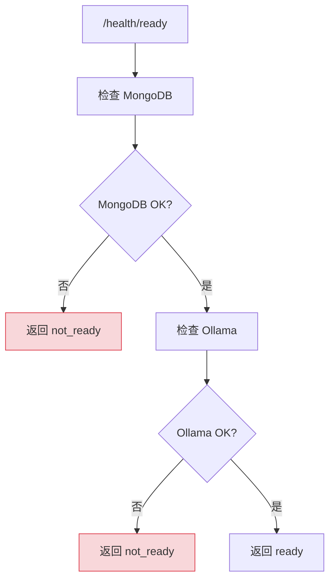
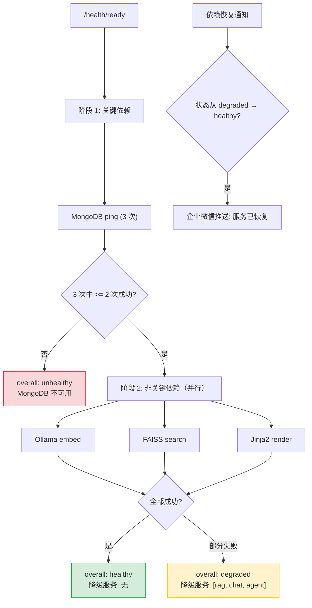

# YA-09-119: 依赖健康检查编排 — 级联状态评估与部分降级

> 需求编号：YA-09-119 · 优先级：P2 · 人天：0.5d · 状态：需求已编写
> 依赖：YA-09-16（健康检查）、YA-09-47（健康度评分卡）

## 背景

YA-09-16 为 YiAi 实现了 `/health/ready` 端点，当前返回二进制的 ready/not_ready 状态。但这种"全有或全无"的健康检查模式存在缺陷：

1. **过度敏感**：Ollama 暂时不可用时，服务标记为 not_ready，但 CRUD 功能完全正常
2. **无降级信息**：前端无法知道哪些功能可用、哪些不可用
3. **无依赖拓扑**：不知道依赖之间的影响关系——Ollama 不可用影响 RAG 和 Chat，但不影响数据管理
4. **无恢复追踪**：依赖恢复后，无自动通知机制

实际场景中，YiAi 的依赖关系如下：

```
MongoDB ──→ ALL（核心依赖，不可用时服务完全不可用）
Ollama  ──→ RAG, Chat, Agent（AI 功能依赖）
FAISS   ──→ RAG（向量检索依赖）
Jinja2  ──→ Prompt 渲染（模板引擎依赖）
```

### 核心挑战

| 挑战 | 描述 | 影响 |
|------|------|------|
| 级联影响分析 | 单点依赖失败影响哪些功能 | 过度降级或降级不足 |
| 部分降级决策 | 哪些功能可降级、哪些必须保持 | 架构决策 |
| 瞬态故障误判 | 单次检查失败导致误判 | 误报 ready 状态 |
| 恢复检测 | 依赖恢复后自动通知 | 运维盲区 |

### 设计目标

- 依赖健康检查按依赖链拓扑排序执行
- MongoDB -> Ollama -> FAISS 逐级检查
- 单点依赖失败不影响其他检查继续
- 检查结果汇总 + 最慢依赖标注

---

## 一、现状分析

### 1.1 当前健康检查



**问题**：Ollama 不可用时，整个服务标记为 not_ready——但 CRUD、文件管理、知识库浏览等非 AI 功能完全正常。

### 1.2 依赖影响矩阵

| 依赖 | 影响服务 | 关键程度 | 不可用时行为 |
|------|----------|----------|-------------|
| MongoDB | ALL | Critical | 服务完全不可用 |
| Ollama | RAG, Chat, Agent | Non-critical | AI 功能降级 |
| FAISS | RAG | Non-critical | RAG 降级为关键词搜索 |
| Jinja2 | Prompt 渲染 | Non-critical | 使用默认模板 |

### 1.3 根因矩阵

| 根因 | 现象 | 严重程度 |
|------|------|----------|
| 二进制健康检查 | Ollama 不可用导致整体 not_ready | 高 |
| 无降级信息 | 前端不知道哪些功能可用 | 中 |
| 无依赖拓扑 | 不清楚依赖影响范围 | 中 |
| 无恢复通知 | 依赖恢复后无感知 | 低 |

---

## 二、设计决策

### 决策 1：健康检查模式 — 二进制 vs 分级 vs 级联拓扑

| 选项 | 粒度 | 复杂度 | 前端适配 |
|------|------|--------|----------|
| 二进制（ready/not_ready） | 粗 | 低 | 低 |
| 分级（healthy/degraded/unhealthy） | 中 | 中 | 中 |
| **级联拓扑（依赖树 + 影响服务）** | 细 | 高 | 高 |

**选择：分级 + 级联拓扑。** 返回 `healthy/degraded/unhealthy` 三级状态 + 依赖检查详情 + 受影响的降级服务列表。前端可根据降级列表动态禁用功能。

### 决策 2：检查策略 — 串行 vs 并行 vs 分组并行

| 选项 | 总耗时 | 失败隔离 | 依赖顺序 |
|------|--------|----------|----------|
| 串行 | 最长 | 好 | 保持 |
| 全部并行 | 最短 | 差 | 丢失 |
| **分组并行（关键先检，非关键并行）** | 中 | 好 | 保持 |

**选择：分组并行。** MongoDB 先检查（关键依赖），其他非关键依赖并行检查。单点失败不影响其他检查。

### 决策 3：瞬态故障处理 — 单次检查 vs 重试 vs 多数判定

| 选项 | 准确性 | 延迟 | 实现复杂度 |
|------|--------|------|-----------|
| 单次检查 | 低 | 低 | 低 |
| 重试 3 次 | 中 | 中 | 中 |
| **多数判定（3 次中 2 次成功）** | 高 | 中 | 中 |

**选择：重试 3 次 + 多数判定。** 单次检查可能因网络抖动而误判。3 次检查中 2 次成功即为健康，避免瞬态故障导致误报。

### 设计决策记录

| 决策 | 选项 A | 选项 B | 选项 C | 选择 | 理由 |
|------|--------|--------|--------|------|------|
| 健康模式 | 二进制 | 分级 | 级联拓扑 | **分级+级联** | 细粒度 + 降级信息 |
| 检查策略 | 串行 | 并行 | 分组并行 | **分组并行** | 保持依赖顺序 + 最小化耗时 |
| 瞬态处理 | 单次 | 重试 | 多数判定 | **多数判定** | 避免误判 |

---

## 三、目标架构

### 3.1 改造后健康检查流程



### 3.2 核心组件

```python
# YiAi/src/shared/dependency_health.py
import asyncio
import time
from dataclasses import dataclass, field
from enum import Enum
from typing import Optional

class HealthStatus(str, Enum):
    HEALTHY = 'healthy'
    DEGRADED = 'degraded'
    UNHEALTHY = 'unhealthy'

class DependencyCriticality(str, Enum):
    CRITICAL = 'critical'        # 失败 → unhealthy
    NON_CRITICAL = 'non_critical'  # 失败 → degraded

@dataclass
class DependencyConfig:
    name: str
    criticality: DependencyCriticality
    affected_services: list[str]
    check_timeout_ms: int = 5000
    retry_count: int = 3
    retry_majority: int = 2  # 多数判定阈值

@dataclass
class DependencyResult:
    name: str
    status: HealthStatus
    duration_ms: float
    attempts: int
    successes: int
    error: Optional[str] = None

@dataclass
class HealthReport:
    overall: HealthStatus
    degraded_services: list[str]
    dependencies: list[DependencyResult]
    total_duration_ms: float
    slowest_dependency: str
    checked_at: float

# 依赖配置
DEPENDENCIES: list[DependencyConfig] = [
    DependencyConfig(
        name='mongodb',
        criticality=DependencyCriticality.CRITICAL,
        affected_services=['ALL'],
        check_timeout_ms=3000,
    ),
    DependencyConfig(
        name='ollama',
        criticality=DependencyCriticality.NON_CRITICAL,
        affected_services=['rag_query', 'rag_chat', 'chat', 'agent'],
        check_timeout_ms=5000,
    ),
    DependencyConfig(
        name='faiss',
        criticality=DependencyCriticality.NON_CRITICAL,
        affected_services=['rag_query', 'rag_chat'],
        check_timeout_ms=3000,
    ),
    DependencyConfig(
        name='jinja2',
        criticality=DependencyCriticality.NON_CRITICAL,
        affected_services=['chat', 'agent'],
        check_timeout_ms=1000,
    ),
]


class DependencyHealthChecker:
    """级联依赖健康检查编排器。
    
    检查流程：
    1. 阶段 1: 检查关键依赖（MongoDB）——失败则整体 unhealthy
    2. 阶段 2: 并行检查非关键依赖——收集降级服务列表
    3. 每项依赖重试 3 次，多数判定（2/3）
    4. 汇总结果 + 标注最慢依赖
    """
    
    def __init__(self):
        self._last_status: Optional[HealthStatus] = None
        self._checkers: dict[str, callable] = {}
        self._register_checkers()
    
    def _register_checkers(self):
        """注册各依赖的检查函数。"""
        self._checkers = {
            'mongodb': self._check_mongodb,
            'ollama': self._check_ollama,
            'faiss': self._check_faiss,
            'jinja2': self._check_jinja2,
        }
    
    async def check_all(self) -> HealthReport:
        """执行完整的级联健康检查。"""
        start_time = time.monotonic()
        results: list[DependencyResult] = []
        degraded_services: list[str] = []
        overall = HealthStatus.HEALTHY
        
        # 阶段 1: 检查关键依赖（串行，按依赖顺序）
        critical_deps = [d for d in DEPENDENCIES if d.criticality == DependencyCriticality.CRITICAL]
        for dep in critical_deps:
            result = await self._check_with_retry(dep)
            results.append(result)
            if result.status == HealthStatus.UNHEALTHY:
                # 关键依赖失败——整体 unhealthy
                elapsed = (time.monotonic() - start_time) * 1000
                return HealthReport(
                    overall=HealthStatus.UNHEALTHY,
                    degraded_services=dep.affected_services,
                    dependencies=results,
                    total_duration_ms=elapsed,
                    slowest_dependency=dep.name,
                    checked_at=time.time(),
                )
        
        # 阶段 2: 并行检查非关键依赖
        non_critical_deps = [d for d in DEPENDENCIES if d.criticality == DependencyCriticality.NON_CRITICAL]
        if non_critical_deps:
            tasks = [self._check_with_retry(dep) for dep in non_critical_deps]
            non_critical_results = await asyncio.gather(*tasks)
            results.extend(non_critical_results)
            
            for dep, result in zip(non_critical_deps, non_critical_results):
                if result.status == HealthStatus.UNHEALTHY:
                    degraded_services.extend(dep.affected_services)
        
        # 汇总
        if degraded_services:
            overall = HealthStatus.DEGRADED
        
        elapsed = (time.monotonic() - start_time) * 1000
        slowest = max(results, key=lambda r: r.duration_ms)
        
        # 检测状态转换（恢复通知）
        if self._last_status == HealthStatus.DEGRADED and overall == HealthStatus.HEALTHY:
            logger.info('[HealthCheck] all dependencies recovered!')
            # 触发恢复通知
            await self._notify_recovery()
        
        self._last_status = overall
        
        return HealthReport(
            overall=overall,
            degraded_services=list(set(degraded_services)),
            dependencies=results,
            total_duration_ms=elapsed,
            slowest_dependency=slowest.name,
            checked_at=time.time(),
        )
    
    async def _check_with_retry(self, dep: DependencyConfig) -> DependencyResult:
        """带重试的依赖检查（多数判定）。"""
        checker = self._checkers[dep.name]
        t0 = time.monotonic()
        successes = 0
        last_error = None
        
        for attempt in range(dep.retry_count):
            try:
                await asyncio.wait_for(checker(), timeout=dep.check_timeout_ms / 1000)
                successes += 1
            except Exception as e:
                last_error = str(e)
                if attempt < dep.retry_count - 1:
                    await asyncio.sleep(0.5)  # 重试间隔
        
        duration = (time.monotonic() - t0) * 1000
        is_healthy = successes >= dep.retry_majority
        
        return DependencyResult(
            name=dep.name,
            status=HealthStatus.HEALTHY if is_healthy else HealthStatus.UNHEALTHY,
            duration_ms=duration,
            attempts=dep.retry_count,
            successes=successes,
            error=last_error if not is_healthy else None,
        )
    
    async def _check_mongodb(self):
        """检查 MongoDB 连接。"""
        from src.data.repository import get_database
        db = get_database()
        await db.command('ping')
    
    async def _check_ollama(self):
        """检查 Ollama 服务。"""
        from src.services.ai.ollama_client import OllamaClient
        client = OllamaClient()
        await client.list_models()  # 轻量级检查——列出模型
    
    async def _check_faiss(self):
        """检查 FAISS 索引。"""
        import os
        index_path = os.environ.get('FAISS_INDEX_PATH', 'data/faiss_index.bin')
        if not os.path.exists(index_path):
            raise FileNotFoundError(f'FAISS index not found: {index_path}')
    
    async def _check_jinja2(self):
        """检查 Jinja2 模板引擎。"""
        from jinja2 import Environment, BaseLoader
        env = Environment(loader=BaseLoader())
        env.from_string('{{ test }}').render(test='ok')
    
    async def _notify_recovery(self):
        """推送恢复通知。"""
        try:
            # 企业微信通知
            # await wework.send('YiAi 所有依赖已恢复——服务 healthy')
            logger.info('[HealthCheck] recovery notification sent')
        except Exception as e:
            logger.error(f'[HealthCheck] failed to send recovery notification: {e}')


# 全局实例
health_checker = DependencyHealthChecker()


# FastAPI 端点
@app.get("/health/ready")
async def cascading_health():
    """级联依赖健康检查端点。"""
    report = await health_checker.check_all()
    
    status_code = 200
    if report.overall == HealthStatus.UNHEALTHY:
        status_code = 503
    elif report.overall == HealthStatus.DEGRADED:
        status_code = 200  # 仍返回 200，但标记 degraded
    
    return JSONResponse(
        content={
            'status': report.overall.value,
            'degraded_services': report.degraded_services,
            'dependencies': [
                {
                    'name': r.name,
                    'status': r.status.value,
                    'duration_ms': r.duration_ms,
                    'attempts': r.attempts,
                    'successes': r.successes,
                    'error': r.error,
                }
                for r in report.dependencies
            ],
            'total_duration_ms': report.total_duration_ms,
            'slowest_dependency': report.slowest_dependency,
            'checked_at': report.checked_at,
        },
        status_code=status_code,
    )
```

### 3.3 架构决策权衡

| 维度 | 改造前 | 改造后 | 权衡说明 |
|------|--------|--------|----------|
| 健康状态 | 二进制 ready/not_ready | 三级 + 降级列表 | 响应体积增大 |
| 检查耗时 | 串行 ~300ms | 分组并行 ~200ms | 逻辑复杂度增加 |
| 故障处理 | 单次检查 | 重试 3 次 + 多数判定 | 检查耗时增加 |

---

## 四、具体改动

### 4.1 新增文件

| 文件 | 说明 |
|------|------|
| `YiAi/src/shared/dependency_health.py` | 级联依赖健康检查编排器 |
| `YiAi/tests/shared/test_dependency_health.py` | 依赖健康检查单元测试 |

### 4.2 修改文件

| 文件 | 改动 |
|------|------|
| `YiAi/src/server/routes.py` | `/health/ready` 改用电联检查编排器 |

### 4.3 涉及文件清单

```
YiAi/src/shared/
└── dependency_health.py               # 新增: 级联依赖健康检查

YiAi/src/server/
└── routes.py                          # 修改: /health/ready 端点

YiAi/tests/shared/
└── test_dependency_health.py          # 新增: 单元测试
```

---

## 五、实施步骤

| 步骤 | 内容 | 涉及文件 | 验证方式 | 人天 |
|------|------|---------|---------|------|
| 1 | 实现依赖配置 + 检查函数注册 | `dependency_health.py` | 单元测试：各检查函数正确执行 | 0.1 |
| 2 | 实现重试 + 多数判定逻辑 | `dependency_health.py` | 模拟 3 次中 2 次成功 | 0.1 |
| 3 | 实现级联编排（关键串行 + 非关键并行） | `dependency_health.py` | 集成测试：模拟各依赖状态 | 0.1 |
| 4 | 实现降级服务列表汇总 | `dependency_health.py` | 单元测试：Ollama 失败时降级列表正确 | 0.05 |
| 5 | 修改 `/health/ready` 端点 | `routes.py` | 请求端点验证响应格式 | 0.05 |
| 6 | 编写单元测试 | `test_dependency_health.py` | `pytest` 全部通过 | 0.1 |

**总计：0.5d**

---

## 六、性能分析

### 6.1 检查耗时分解

| 依赖 | 单次检查耗时 | 重试 3 次最大耗时 | 说明 |
|------|------------|-----------------|------|
| MongoDB ping | 5-50ms | 150ms + 1s 间隔 | 网络延迟 |
| Ollama list_models | 10-100ms | 300ms + 1s 间隔 | API 调用 |
| FAISS 文件检查 | < 1ms | < 3ms | 本地文件 stat |
| Jinja2 渲染 | < 1ms | < 3ms | 本地模板编译 |
| **总耗时（关键串行 + 非关键并行）** | — | ~200ms | 并行缩短总耗时 |

### 6.2 健康检查对系统的影响

| 指标 | 影响 | 说明 |
|------|------|------|
| CPU | < 0.001 核 | 仅在检查时使用 |
| 内存 | < 1MB | 依赖配置 + 结果对象 |
| 网络 | 每 10s 2 次 TCP 连接 | MongoDB + Ollama |

---

## 七、测试规格

### Requirement: 级联依赖检查

#### Scenario: 所有依赖健康
- **Given** MongoDB、Ollama、FAISS、Jinja2 均可用
- **When** `check_all()` 调用
- **Then** `overall == healthy`，`degraded_services == []`

#### Scenario: 关键依赖失败 → unhealthy
- **Given** MongoDB 不可用
- **When** `check_all()` 调用
- **Then** `overall == unhealthy`，非关键依赖不检查

#### Scenario: 非关键依赖失败 → degraded
- **Given** Ollama 不可用，其他依赖正常
- **When** `check_all()` 调用
- **Then** `overall == degraded`，`degraded_services` 包含 rag_query, rag_chat, chat, agent

### Requirement: 重试 + 多数判定

#### Scenario: 3 次中 2 次成功 → healthy
- **Given** MongoDB 第 1 次超时，第 2/3 次成功
- **When** `_check_with_retry()` 调用
- **Then** 返回 `status == healthy`，`successes == 2`

#### Scenario: 3 次中仅 1 次成功 → unhealthy
- **Given** MongoDB 仅第 1 次成功，第 2/3 次失败
- **When** `_check_with_retry()` 调用
- **Then** 返回 `status == unhealthy`

### Requirement: 恢复通知

#### Scenario: 从 degraded 恢复到 healthy 时通知
- **Given** 上次检查为 degraded
- **When** 本次检查所有依赖恢复
- **Then** 触发恢复通知（企业微信推送）

---

## 八、风险与缓解

| 风险 | 概率 | 影响 | 等级 | 缓解措施 | 应急预案 |
|------|------|------|------|----------|----------|
| 依赖检查串行导致 ready 延迟 | 中 | 低 | 低 | 非关键依赖并行检查，K8s readinessProbe 周期 10s | 增大 periodSeconds |
| 瞬态故障导致误判 | 中 | 中 | 中 | 重试 3 次 + 多数判定 | 增大重试次数 |
| 检查函数超时 | 低 | 低 | 低 | 每个检查设置独立超时 | 增大超时或移除慢检查 |
| 检查自身引入故障 | 低 | 高 | 低 | 检查函数使用 try/except，异常不传播 | 关闭健康检查 |

---

## 九、回滚策略

| 回滚场景 | 回滚方式 | 影响范围 | 恢复时间 |
|----------|----------|----------|----------|
| 级联检查逻辑 bug | 回退到二进制健康检查 | 健康检查 | 5min |
| 检查超时导致 ready 延迟 | 减少重试次数或移除慢检查 | 就绪探针 | 2min（配置热更新） |
| 检查导致依赖压力 | 增大检查间隔 | 依赖负载 | 2min |

---

## 十、设计决策记录

### D-01: 为什么 MongoDB 是关键依赖而 Ollama 不是？

MongoDB 是 YiAi 的唯一数据源——所有 CRUD、会话、知识库元数据都依赖它。MongoDB 不可用时，服务无法提供任何有价值的功能。Ollama 仅负责 AI 功能——Chat、RAG、Agent——这些功能不可用时，用户仍可管理数据和文件，服务仍可提供核心价值。

### D-02: 为什么多数判定是 2/3 而非 3/3 或 1/3？

3/3 要求全部成功，对瞬态故障过于敏感（网络抖动 1 次即判定失败）。1/3 过于宽松（1 次成功即判定健康），可能掩盖持续性问题。2/3 是标准多数判定，在敏感性和鲁棒性之间取得平衡。

### D-03: 为什么非关键依赖并行检查？

串行检查总耗时 = sum(各依赖耗时)，并行检查总耗时 = max(各依赖耗时)。非关键依赖之间无依赖关系（Ollama 和 FAISS 不互相依赖），并行检查可显著缩短总耗时（从 ~400ms 降至 ~200ms）。

---

## 十一、可观测性

### 11.1 指标

| 指标 | 采集方式 | 采集频率 | 告警阈值 | 说明 |
|------|----------|----------|----------|------|
| `health_check_duration_ms` | 每次检查 | 10s | > 1000ms | 检查总耗时 |
| `health_check_status` | 每次检查 | 10s | degraded/unhealthy | 总体健康状态 |
| `dependency_status` | 每次检查 | 10s | — | 按依赖分组 |
| `dependency_check_duration_ms` | 每次检查 | 10s | — | 按依赖分组的检查耗时 |

### 11.2 日志

```python
logger.info(f'[HealthCheck] overall={overall} degraded={degraded_services} duration={total_ms:.0f}ms')
logger.warning(f'[HealthCheck] {dep_name} UNHEALTHY: {error}')
logger.info(f'[HealthCheck] recovery detected: all dependencies healthy')
```

### 11.3 告警规则

| 告警 | 条件 | 严重级别 | 通知渠道 |
|------|------|----------|----------|
| 服务 unhealthy | MongoDB 不可用 | CRITICAL | 企业微信 + 邮件 |
| 服务 degraded | 非关键依赖不可用 | WARNING | 企业微信 |
| 服务恢复 | degraded → healthy | INFO | 企业微信 |
| 检查耗时过长 | 总耗时 > 1000ms | WARNING | 企业微信 |

---

## 十二、代码审查检查清单

- [ ] 依赖健康检查按依赖链拓扑排序执行
- [ ] MongoDB -> Ollama -> FAISS 逐级检查
- [ ] 单点依赖失败不影响其他检查继续
- [ ] 检查结果汇总 + 最慢依赖标注
- [ ] 关键依赖失败 → unhealthy，非关键 → degraded
- [ ] 重试 3 次 + 多数判定（2/3）
- [ ] 降级服务列表包含具体受影响的功能
- [ ] 恢复通知（degraded → healthy 时推送）

---

## 十三、回归问题预测

| # | 预测问题 | 原因 | 验证方法 |
|---|---------|------|---------|
| 1 | 依赖检查串行导致 ready 延迟 | 逐个检查耗时累积 | 并行检查非强依赖 |
| 2 | 瞬态故障导致误判 | 单次检查失败 | 3 次重试 + 多数判定 |
| 3 | 新增依赖未注册检查函数 | 配置遗漏 | 启动时校验所有依赖有对应检查函数 |
| 4 | 降级服务列表不完整 | affected_services 配置遗漏 | 单元测试覆盖所有依赖 |

---

*PRD 来源: `projects/yiai/requirements/2026-09/119-需求-依赖健康检查编排.md`*

## 影响范围

- **影响模块**：待补充
- **涉及文件**：
- `dependency_health.py`
- `routes.py`
- `test_dependency_health.py`
- **是否影响 API 契约**：否
- **是否影响其他项目（YiVad/YiPet）**：否
- **用户感知**：待确认

## 预防措施

| 层面 | 措施 |
|------|------|
| 代码 | 在相关函数中添加参数校验和边界检查 |
| 测试 | 为 `dependency_health.py` 添加单元测试 |
| 流程 | 代码审查时重点检查此类模式 |
| 监控 | 添加日志告警，异常发生时及时发现 |
| 文档 | 在编码规范中记录此类反模式 |

## 经验教训

1. **根本原因**：开发过程中对边界情况和异常路径的考虑不足是此类问题的共同根因
2. **设计阶段**：在接口设计和模块实现时，应主动考虑异常输入、空值、超时等边界场景
3. **代码审查**：审查时应检查是否存在类似的反模式（如未捕获异常、无超时控制、缺少参数校验等）
4. **测试覆盖**：异常路径的测试覆盖率应与正常路径同等重视
5. **团队分享**：此类问题应在团队周会或技术分享中讨论，形成团队共识
