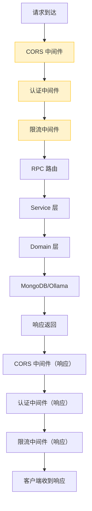
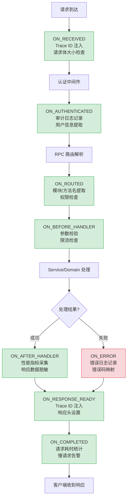

# YA-09-120: 请求处理全流程生命周期事件系统 — 钩子扩展点

> 需求编号：YA-09-120 · 优先级：P2 · 人天：0.5d · 状态：需求已编写

## 背景

YiAi 当前使用 Starlette/FastAPI 中间件管道处理请求。中间件按注册顺序执行，但缺乏显式的事件钩子机制。开发者在以下场景中面临困难：

1. **审计日志**：需要在认证后、路由前记录请求信息，但当前只能通过中间件全局拦截
2. **性能监控**：需要在响应后记录各阶段耗时，但只能通过中间件的手动计时
3. **自定义行为注入**：如请求限流检查、请求体大小验证、Trace ID 注入——每个都需要独立中间件
4. **事件驱动解耦**：审计日志、指标采集、告警通知等横切关注点应通过事件驱动而非硬编码在中间件中

当前中间件模式的问题：
- 中间件按注册顺序线性执行，无法在特定生命周期阶段插入逻辑
- 中间件之间通过 `request.state` 传递数据，隐式且无类型安全
- 无标准的错误处理事件——中间件中的异常处理容易遗漏

### 核心挑战

| 挑战 | 描述 | 影响 |
|------|------|------|
| 生命周期不可见 | 请求的完整生命周期无显式建模 | 开发者难以理解执行顺序 |
| 横切关注点耦合 | 审计、监控、告警硬编码在中间件中 | 修改困难，测试困难 |
| 无标准扩展点 | 无法在特定阶段注册自定义逻辑 | 需修改中间件代码 |
| 事件处理失败传播 | 一个事件处理器失败可能影响其他处理器 | 需隔离 |

### 设计目标

- 请求生命周期事件：RECEIVED -> AUTHENTICATED -> HANDLING -> COMPLETED/FAILED
- 事件 Hook 异步——不阻塞主请求
- 审计日志/指标采集/告警通过事件驱动
- 事件处理失败不影响请求处理

---

## 一、现状分析

### 1.1 当前中间件模式



### 1.2 问题：横切关注点散布

```python
# 当前中间件——审计日志、指标、Trace ID 硬编码在一起
@app.middleware("http")
async def god_middleware(request: Request, call_next):
    # Trace ID
    trace_id = request.headers.get('X-Trace-ID', str(uuid4()))
    request.state.trace_id = trace_id
    
    # 审计日志
    logger.info(f'[Request] {request.method} {request.url.path}')
    
    # 计时
    start = time.monotonic()
    response = await call_next(request)
    duration = time.monotonic() - start
    
    # 指标
    metrics.record_request(duration)
    
    response.headers['X-Trace-ID'] = trace_id
    return response
```

### 1.3 根因矩阵

| 根因 | 现象 | 严重程度 |
|------|------|----------|
| 无生命周期建模 | 请求阶段不可见 | 中 |
| 横切关注点耦合 | 审计、监控、告警混杂 | 中 |
| 无标准扩展点 | 新增功能需修改中间件 | 高 |
| 无事件隔离 | 一个处理器失败影响其他 | 中 |

---

## 二、设计决策

### 决策 1：事件系统实现 — 观察者模式 vs 发布订阅 vs 中间件扩展

| 选项 | 解耦程度 | 性能 | 实现复杂度 |
|------|----------|------|-----------|
| **观察者模式（同步回调）** | 中 | 高 | 低 |
| 发布订阅（消息队列） | 高 | 低 | 高 |
| 中间件扩展（FastAPI 依赖注入） | 低 | 高 | 低 |

**选择：观察者模式（同步回调列表）。** YiAi 的横切关注点（审计日志、指标采集）需要同步执行以确保数据不丢失。发布订阅引入消息队列增加延迟和复杂度。观察者模式简单高效，适合进程内事件。

### 决策 2：事件处理方式 — 同步 vs 异步 vs 混合

| 选项 | 阻塞风险 | 数据一致性 | 实现复杂度 |
|------|----------|-----------|-----------|
| 同步 | 高 | 高 | 低 |
| 异步（fire-and-forget） | 低 | 低 | 中 |
| **混合（关键同步 + 非关键异步）** | 低 | 高 | 中 |

**选择：混合模式。** 关键事件处理器（审计日志、Trace ID 注入）同步执行，非关键处理器（指标采集、慢请求告警）异步执行。事件处理器本身可以是 async 函数。

### 决策 3：事件粒度 — 粗粒度 vs 细粒度 vs 分层

| 选项 | 灵活性 | 事件数量 | 维护成本 |
|------|--------|----------|----------|
| 粗粒度（3-4 个事件） | 低 | 少 | 低 |
| 细粒度（10+ 个事件） | 高 | 多 | 高 |
| **分层（8 个核心事件）** | 中 | 中 | 中 |

**选择：8 个核心事件。** 覆盖请求生命周期的关键阶段，不多不少。每个事件有明确的触发时机和上下文数据。

### 设计决策记录

| 决策 | 选项 A | 选项 B | 选项 C | 选择 | 理由 |
|------|--------|--------|--------|------|------|
| 事件系统 | 观察者模式 | 发布订阅 | 中间件扩展 | **观察者模式** | 进程内高效，同步保证一致性 |
| 处理方式 | 同步 | 异步 | 混合 | **混合** | 关键同步，非关键异步 |
| 事件粒度 | 粗粒度 | 细粒度 | 分层 | **8 个核心事件** | 覆盖关键阶段 |

---

## 三、目标架构

### 3.1 请求生命周期事件流



### 3.2 核心组件

```python
# YiAi/src/shared/request_lifecycle.py
import time
import asyncio
from enum import Enum
from dataclasses import dataclass, field
from typing import Any, Callable, Coroutine, Optional

class RequestEvent(str, Enum):
    """请求生命周期事件。"""
    ON_RECEIVED = 'request.received'           # 请求到达
    ON_AUTHENTICATED = 'request.authenticated'  # 认证完成
    ON_ROUTED = 'request.routed'               # 路由解析完成
    ON_BEFORE_HANDLER = 'request.before_handler'  # 处理器执行前
    ON_AFTER_HANDLER = 'request.after_handler'    # 处理器执行后
    ON_RESPONSE_READY = 'request.response_ready'   # 响应就绪
    ON_COMPLETED = 'request.completed'          # 请求完成
    ON_ERROR = 'request.error'                 # 处理出错

@dataclass
class RequestContext:
    """请求上下文——在事件间传递的数据。"""
    trace_id: str = ''
    user_id: Optional[str] = None
    module_name: Optional[str] = None
    method_name: Optional[str] = None
    start_time: float = 0.0
    metadata: dict[str, Any] = field(default_factory=dict)


class RequestLifecycle:
    """请求生命周期事件系统。
    
    特性：
    - 8 个核心事件覆盖请求全生命周期
    - 同步执行处理器（关键事件）或异步执行（非关键事件）
    - 单个处理器失败不影响其他处理器
    - 支持事件上下文传递
    """
    
    _hooks: dict[RequestEvent, list[Callable]] = {
        e: [] for e in RequestEvent
    }
    
    @classmethod
    def on(cls, event: RequestEvent, handler: Callable, async_mode: bool = False):
        """注册事件处理器。
        
        Args:
            event: 生命周期事件
            handler: 处理器函数签名: async def handler(request, response, context)
            async_mode: True=异步执行（fire-and-forget），False=同步执行
        """
        cls._hooks[event].append(handler)
    
    @classmethod
    async def emit(cls, event: RequestEvent, request, response=None,
                   context: Optional[RequestContext] = None):
        """触发事件——执行所有注册的处理器。
        
        每个处理器被 try/except 包裹，单个失败不影响其他。
        """
        for handler in cls._hooks[event]:
            try:
                result = handler(request, response, context)
                if asyncio.iscoroutine(result):
                    await result
            except Exception as e:
                logger.error(
                    f'[Lifecycle] handler failed for event={event.value}: {e}',
                    exc_info=True
                )
    
    @classmethod
    def clear(cls, event: Optional[RequestEvent] = None):
        """清除事件处理器（用于测试）。"""
        if event:
            cls._hooks[event].clear()
        else:
            for e in RequestEvent:
                cls._hooks[e].clear()


# 内置处理器注册
def register_builtin_handlers():
    """注册内置的请求生命周期处理器。"""
    
    # ON_RECEIVED: Trace ID 注入
    async def inject_trace_id(request, response, ctx: RequestContext):
        trace_id = request.headers.get('X-Trace-ID', '')
        if not trace_id:
            import uuid
            trace_id = str(uuid.uuid4())
        ctx.trace_id = trace_id
        request.state.trace_id = trace_id
    
    RequestLifecycle.on(RequestEvent.ON_RECEIVED, inject_trace_id)
    
    # ON_AUTHENTICATED: 审计日志
    async def audit_log(request, response, ctx: RequestContext):
        logger.info(
            f'[Audit] trace_id={ctx.trace_id} user={ctx.user_id} '
            f'method={request.method} path={request.url.path}'
        )
    
    RequestLifecycle.on(RequestEvent.ON_AUTHENTICATED, audit_log)
    
    # ON_ROUTED: 提取模块和方法名
    async def extract_rpc_info(request, response, ctx: RequestContext):
        if hasattr(request.state, 'module_name'):
            ctx.module_name = request.state.module_name
            ctx.method_name = request.state.method_name
    
    RequestLifecycle.on(RequestEvent.ON_ROUTED, extract_rpc_info)
    
    # ON_COMPLETED: 性能指标采集
    async def record_metrics(request, response, ctx: RequestContext):
        duration = (time.monotonic() - ctx.start_time) * 1000
        status_code = response.status_code if response else 500
        logger.info(
            f'[Metrics] trace_id={ctx.trace_id} '
            f'module={ctx.module_name} method={ctx.method_name} '
            f'duration={duration:.0f}ms status={status_code}'
        )
    
    RequestLifecycle.on(RequestEvent.ON_COMPLETED, record_metrics, async_mode=True)
    
    # ON_COMPLETED: 慢请求告警
    async def slow_request_alert(request, response, ctx: RequestContext):
        duration = (time.monotonic() - ctx.start_time) * 1000
        if duration > 3000:  # 3s
            logger.warning(
                f'[SlowRequest] trace_id={ctx.trace_id} '
                f'duration={duration:.0f}ms module={ctx.module_name}'
            )
    
    RequestLifecycle.on(RequestEvent.ON_COMPLETED, slow_request_alert, async_mode=True)
    
    # ON_ERROR: 错误日志
    async def error_log(request, response, ctx: RequestContext):
        if response and response.status_code >= 500:
            logger.error(
                f'[Error] trace_id={ctx.trace_id} '
                f'module={ctx.module_name} method={ctx.method_name}'
            )
    
    RequestLifecycle.on(RequestEvent.ON_ERROR, error_log)


# FastAPI 中间件集成
@app.middleware("http")
async def lifecycle_middleware(request: Request, call_next):
    """请求生命周期中间件——触发各阶段事件。"""
    ctx = RequestContext(start_time=time.monotonic())
    
    # 1. ON_RECEIVED
    await RequestLifecycle.emit(RequestEvent.ON_RECEIVED, request, context=ctx)
    
    # 2. 认证（由认证中间件设置 ctx.user_id）
    # ... 认证逻辑（在认证中间件中完成）
    # 2a. ON_AUTHENTICATED
    await RequestLifecycle.emit(RequestEvent.ON_AUTHENTICATED, request, context=ctx)
    
    # 3. 路由解析（由 RPC 路由完成）
    # ... 路由逻辑
    # 3a. ON_ROUTED
    await RequestLifecycle.emit(RequestEvent.ON_ROUTED, request, context=ctx)
    
    # 4. ON_BEFORE_HANDLER
    await RequestLifecycle.emit(RequestEvent.ON_BEFORE_HANDLER, request, context=ctx)
    
    # 5. 执行处理器
    try:
        response = await call_next(request)
        # 5a. ON_AFTER_HANDLER
        await RequestLifecycle.emit(
            RequestEvent.ON_AFTER_HANDLER, request, response, ctx
        )
    except Exception as e:
        # 5b. ON_ERROR
        ctx.metadata['error'] = str(e)
        await RequestLifecycle.emit(
            RequestEvent.ON_ERROR, request, None, ctx
        )
        raise
    
    # 6. ON_RESPONSE_READY
    response.headers['X-Trace-ID'] = ctx.trace_id
    await RequestLifecycle.emit(
        RequestEvent.ON_RESPONSE_READY, request, response, ctx
    )
    
    # 7. ON_COMPLETED
    await RequestLifecycle.emit(
        RequestEvent.ON_COMPLETED, request, response, ctx
    )
    
    return response
```

### 3.3 架构决策权衡

| 维度 | 改造前 | 改造后 | 权衡说明 |
|------|--------|--------|----------|
| 横切关注点 | 硬编码在中间件中 | 事件驱动注册 | 增加事件系统开销 |
| 扩展性 | 修改中间件代码 | 注册事件处理器 | 解耦，但需理解事件顺序 |
| 错误隔离 | 中间件异常影响全局 | 单个处理器失败不影响其他 | 更安全 |

---

## 四、具体改动

### 4.1 新增文件

| 文件 | 说明 |
|------|------|
| `YiAi/src/shared/request_lifecycle.py` | 请求生命周期事件系统 |
| `YiAi/tests/shared/test_request_lifecycle.py` | 生命周期事件单元测试 |

### 4.2 修改文件

| 文件 | 改动 |
|------|------|
| `YiAi/src/app.py` | 注册 `lifecycle_middleware` + `register_builtin_handlers()` |
| `YiAi/src/server/rpc_router.py` | 在路由解析后设置 `request.state.module_name` |

### 4.3 涉及文件清单

```
YiAi/src/shared/
└── request_lifecycle.py               # 新增: 请求生命周期事件系统

YiAi/src/
├── app.py                             # 修改: 注册中间件 + 内置处理器
└── server/
    └── rpc_router.py                  # 修改: 设置 request.state 信息

YiAi/tests/shared/
└── test_request_lifecycle.py          # 新增: 单元测试
```

---

## 五、实施步骤

| 步骤 | 内容 | 涉及文件 | 验证方式 | 人天 |
|------|------|---------|---------|------|
| 1 | 实现 `RequestEvent` 枚举 + `RequestContext` | `request_lifecycle.py` | 类型检查 | 0.05 |
| 2 | 实现 `RequestLifecycle` 事件注册/触发 | `request_lifecycle.py` | 单元测试：注册处理器后触发 | 0.1 |
| 3 | 实现内置处理器（Trace ID、审计、指标、告警） | `request_lifecycle.py` | 集成测试：请求后日志输出 | 0.1 |
| 4 | 实现 `lifecycle_middleware` 中间件 | `request_lifecycle.py` | 集成测试：请求触发全部事件 | 0.1 |
| 5 | 集成到 `app.py` | `app.py` | 启动后请求验证各事件触发 | 0.05 |
| 6 | 编写单元测试 | `test_request_lifecycle.py` | `pytest` 全部通过 | 0.1 |

**总计：0.5d**

---

## 六、性能分析

### 6.1 事件系统开销

| 操作 | 耗时 | 说明 |
|------|------|------|
| 事件触发（无处理器） | < 0.001ms | 空列表遍历 |
| 事件触发（3 个处理器） | < 0.1ms | 同步执行处理器 |
| 事件触发（含异步处理器） | < 0.1ms | 异步 fire-and-forget |
| 中间件总开销 | < 0.5ms | 8 个事件 × 平均 3 个处理器 |

### 6.2 与改造前对比

| 场景 | 改造前 | 改造后 | 差异 |
|------|--------|--------|------|
| 请求处理额外开销 | 中间件直接执行 | 事件触发 + 处理器执行 | +0.3ms |
| 新增横切关注点 | 修改中间件代码 | 注册事件处理器 | 零侵入 |

---

## 七、测试规格

### Requirement: 事件注册和触发

#### Scenario: 注册处理器后触发事件
- **Given** 注册了一个 ON_RECEIVED 处理器
- **When** `emit(ON_RECEIVED, ...)` 调用
- **Then** 处理器被调用一次

#### Scenario: 多个处理器按注册顺序执行
- **Given** 注册了 3 个 ON_COMPLETED 处理器
- **When** `emit(ON_COMPLETED, ...)` 调用
- **Then** 3 个处理器按注册顺序执行

### Requirement: 错误隔离

#### Scenario: 单个处理器失败不影响其他
- **Given** 注册了 2 个处理器，第 1 个抛出异常
- **When** `emit(...)` 调用
- **Then** 第 1 个异常被捕获并记录日志，第 2 个正常执行

#### Scenario: 处理器失败不影响请求处理
- **Given** ON_COMPLETED 处理器抛出异常
- **When** 请求处理流程中触发 ON_COMPLETED
- **Then** 请求正常返回响应，异常被记录日志

### Requirement: 内置处理器

#### Scenario: Trace ID 注入
- **Given** 请求未携带 X-Trace-ID header
- **When** ON_RECEIVED 事件触发
- **Then** `ctx.trace_id` 被设置为 UUID

#### Scenario: 慢请求告警
- **Given** 请求耗时 > 3s
- **When** ON_COMPLETED 事件触发
- **Then** 日志输出 WARNING 级别慢请求记录

---

## 八、风险与缓解

| 风险 | 概率 | 影响 | 等级 | 缓解措施 | 应急预案 |
|------|------|------|------|----------|----------|
| 事件处理器异常未被隔离 | 低 | 中 | 低 | 每个 handler try/except 包裹 | 无（内置保护） |
| 事件过多导致内存积压 | 低 | 低 | 低 | 异步处理器 fire-and-forget，不排队 | 监控事件处理耗时 |
| 处理器耗时过长 | 中 | 低 | 低 | 非关键处理器标记 async_mode | 移除慢处理器 |
| 事件顺序依赖 bug | 低 | 中 | 低 | 文档化事件顺序 + 单元测试 | 调整事件触发顺序 |

---

## 九、回滚策略

| 回滚场景 | 回滚方式 | 影响范围 | 恢复时间 |
|----------|----------|----------|----------|
| 事件系统导致性能下降 | 清空事件处理器，恢复直接中间件 | 请求处理 | 5min |
| 事件处理器 bug | 移除问题处理器 | 特定功能 | 2min |
| 中间件集成 bug | 移除 lifecycle_middleware | 请求处理 | 5min |

---

## 十、设计决策记录

### D-01: 为什么事件处理器需要 try/except 隔离？

事件系统的核心价值是解耦——一个横切关注点的失败不应影响其他关注点或主请求流程。如果审计日志处理器因日志文件写入失败而抛异常，不应该导致请求返回 500。每个处理器的 try/except 保证故障隔离。

### D-02: 为什么 8 个事件而非更多或更少？

3 个事件（received/processing/completed）太粗——无法区分认证前后、路由前后的不同处理需求。15 个事件太细——增加维护负担，且大部分事件场景差异不大。8 个事件覆盖了请求生命周期中所有有意义的阶段转换点。

### D-03: 为什么使用类方法而非实例方法？

生命周期事件是全局的——所有请求共享同一组事件处理器。类方法模式确保全局单例，无需手动管理实例。注册和触发操作简洁：`RequestLifecycle.on(event, handler)` / `RequestLifecycle.emit(event, ...)`。

---

## 十一、可观测性

### 11.1 指标

| 指标 | 采集方式 | 采集频率 | 告警阈值 | 说明 |
|------|----------|----------|----------|------|
| `lifecycle_event_duration_ms` | 每次事件触发 | 按事件 | > 10ms | 事件处理耗时 |
| `lifecycle_handler_errors` | 异常捕获计数 | 按事件 | > 0 | 处理器失败次数 |
| `lifecycle_handler_count` | 注册处理器数 | 启动时 | — | 注册的处理器总数 |

### 11.2 日志

```python
logger.info(f'[Lifecycle] event={event.value} trace_id={ctx.trace_id}')
logger.error(f'[Lifecycle] handler failed for event={event.value}: {e}')
logger.warning(f'[SlowRequest] trace_id={trace_id} duration={duration:.0f}ms')
```

---

## 十二、代码审查检查清单

- [ ] 请求生命周期事件：RECEIVED -> AUTHENTICATED -> ROUTED -> BEFORE_HANDLER -> AFTER_HANDLER/ERROR -> RESPONSE_READY -> COMPLETED
- [ ] 事件 Hook 异步——不阻塞主请求
- [ ] 审计日志/指标采集/告警通过事件驱动
- [ ] 事件处理失败不影响请求处理（try/except 隔离）
- [ ] 请求上下文 RequestContext 在各事件间传递
- [ ] 内置处理器覆盖 Trace ID、审计日志、性能指标、慢请求告警
- [ ] 事件处理器支持同步和异步两种模式

---

## 十三、回归问题预测

| # | 预测问题 | 原因 | 验证方法 |
|---|---------|------|---------|
| 1 | 事件处理器异常未被隔离 | 单个 handler 抛异常 | 每个 handler try/catch |
| 2 | 事件过多导致内存积压 | handler 消费慢于生产 | 事件队列上限 + 监控 |
| 3 | 事件顺序变更导致功能异常 | 处理器依赖特定顺序 | 单元测试固定事件顺序 |
| 4 | 异步处理器数据丢失 | fire-and-forget 无确认 | 关键处理器使用同步模式 |

---

*PRD 来源: `projects/yiai/requirements/2026-09/120-需求-请求生命周期事件.md`*

## 影响范围

- **影响模块**：待补充
- **涉及文件**：
- `request_lifecycle.py`
- `test_request_lifecycle.py`
- `app.py`
- **是否影响 API 契约**：否
- **是否影响其他项目（YiVad/YiPet）**：否
- **用户感知**：待确认

## 预防措施

| 层面 | 措施 |
|------|------|
| 代码 | 在相关函数中添加参数校验和边界检查 |
| 测试 | 为 `request_lifecycle.py` 添加单元测试 |
| 流程 | 代码审查时重点检查此类模式 |
| 监控 | 添加日志告警，异常发生时及时发现 |
| 文档 | 在编码规范中记录此类反模式 |

## 经验教训

1. **根本原因**：开发过程中对边界情况和异常路径的考虑不足是此类问题的共同根因
2. **设计阶段**：在接口设计和模块实现时，应主动考虑异常输入、空值、超时等边界场景
3. **代码审查**：审查时应检查是否存在类似的反模式（如未捕获异常、无超时控制、缺少参数校验等）
4. **测试覆盖**：异常路径的测试覆盖率应与正常路径同等重视
5. **团队分享**：此类问题应在团队周会或技术分享中讨论，形成团队共识
