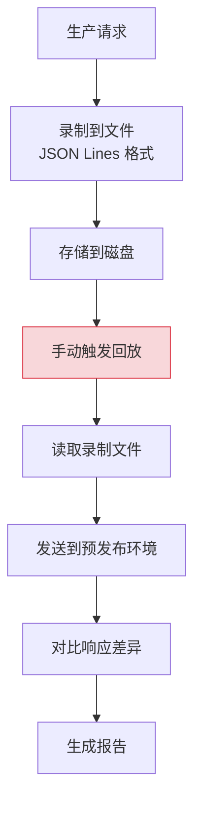
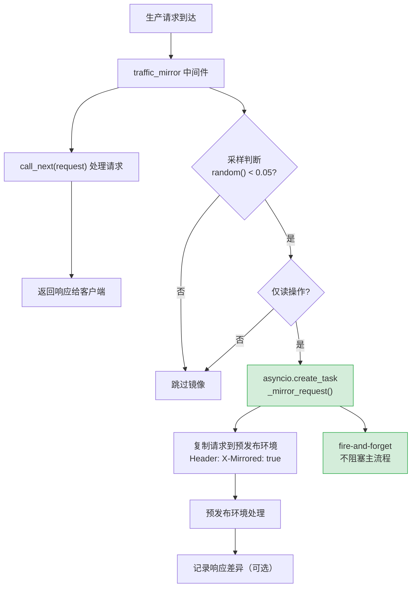

# YA-09-121: 请求流量镜像 — 生产流量复制到预发布环境的无损测试

> 需求编号：YA-09-121 · 优先级：P2 · 人天：0.5d · 状态：需求已编写
> 依赖：YA-09-87（流量录制与回放）

## 背景

YA-09-87 实现了流量录制到文件再回放的功能——这是一种离线回放方案。其局限性在于：

1. **非实时**：录制和回放之间存在时间差，预发布环境的验证结果滞后
2. **环境差异**：回放时的数据状态可能已变化，测试结果不可靠
3. **无对比**：无法同时对比生产环境和预发布环境的响应差异

实时流量镜像（Traffic Mirroring）将生产请求异步复制到预发布环境，在不影响用户的前提下验证新版本。这是蓝绿部署、金丝雀发布的前置步骤——在真实流量切换到新版本前，先用镜像流量验证正确性。

### 核心挑战

| 挑战 | 描述 | 影响 |
|------|------|------|
| 镜像延迟 | 异步复制不应阻塞生产请求 | 需 fire-and-forget |
| 数据一致性 | 预发布环境的数据可能与生产不同 | 响应差异可能来自数据而非代码 |
| 采样率控制 | 全量镜像可能压垮预发布环境 | 需可配置采样 |
| 写操作处理 | 镜像写操作可能导致数据不一致 | 需区分读写 |

### 设计目标

- 异步复制生产请求到预发布环境，不阻塞主流程
- 可配置采样率（默认 5%），避免预发布环境过载
- 仅镜像读操作（GET/查询），写操作不镜像
- 镜像请求携带 `X-Mirrored: true` header，预发布环境据此跳过副作用

---

## 一、现状分析

### 1.1 当前流量录制方案

YA-09-87 的流量录制方案：



### 1.2 根因矩阵

| 根因 | 现象 | 严重程度 |
|------|------|----------|
| 离线回放 | 验证结果滞后于代码变更 | 中 |
| 环境数据差异 | 回放时数据已变化 | 高 |
| 无实时对比 | 无法同时验证生产/预发布 | 中 |
| 无自动采样 | 全量或手动选择流量 | 中 |

---

## 二、设计决策

### 决策 1：镜像方式 — 中间件 vs 代理层 vs Sidecar

| 选项 | 侵入性 | 性能影响 | 实现复杂度 |
|------|--------|----------|-----------|
| **FastAPI 中间件** | 低 | 低 | 低 |
| Nginx/Envoy 代理层 | 无 | 无 | 中 |
| Sidecar 容器 | 无 | 无 | 高 |

**选择：FastAPI 中间件。** YiAi 当前无代理层，引入 Envoy/Nginx 增加运维复杂度。中间件方案在进程内实现，部署简单，配置灵活。

### 决策 2：镜像范围 — 全部请求 vs 仅读操作 vs 可配置

| 选项 | 安全性 | 测试覆盖 | 实现复杂度 |
|------|--------|----------|-----------|
| 全部请求 | 低 | 高 | 低 |
| **仅读操作（GET/查询）** | 高 | 中 | 中 |
| 可配置白名单 | 高 | 中 | 高 |

**选择：仅读操作。** 镜像写操作（创建/更新/删除）会在预发布环境产生副作用，导致数据不一致。仅镜像读操作安全且覆盖主要测试场景。

### 决策 3：采样策略 — 固定比例 vs 动态比例 vs 按端点

| 选项 | 灵活性 | 预发布负载 | 实现复杂度 |
|------|--------|-----------|-----------|
| **固定比例（5%）** | 低 | 可控 | 低 |
| 动态比例 | 高 | 自适应 | 高 |
| 按端点差异化 | 高 | 精确控制 | 中 |

**选择：固定比例 5% + 可配置。** 5% 采样在 100 QPS 下产生 5 QPS 镜像流量，预发布环境可轻松承载。通过环境变量可调整比例。

### 设计决策记录

| 决策 | 选项 A | 选项 B | 选项 C | 选择 | 理由 |
|------|--------|--------|--------|------|------|
| 镜像方式 | 中间件 | 代理层 | Sidecar | **中间件** | 进程内实现，部署简单 |
| 镜像范围 | 全部 | 仅读 | 可配置 | **仅读操作** | 避免副作用 |
| 采样策略 | 固定比例 | 动态 | 按端点 | **固定 5% + 可配置** | 简单可控 |

---

## 三、目标架构

### 3.1 改造后数据流



### 3.2 核心组件

```python
# YiAi/src/server/middleware/traffic_mirror.py
import asyncio
import random
import time
from dataclasses import dataclass
from typing import Optional

@dataclass
class MirrorConfig:
    """流量镜像配置。"""
    enabled: bool = True
    staging_url: str = 'http://staging:10086'
    sample_rate: float = 0.05      # 5% 采样
    mirror_timeout: float = 5.0    # 镜像请求超时（秒）
    mirror_read_only: bool = True  # 仅镜像读操作
    compare_responses: bool = False  # 是否对比响应差异


class TrafficMirrorMiddleware:
    """流量镜像中间件——异步复制生产请求到预发布环境。
    
    特性：
    - 异步 fire-and-forget——不阻塞主流程
    - 可配置采样率（默认 5%）
    - 仅镜像读操作（GET/查询 RPC 方法）
    - 镜像请求携带 X-Mirrored header
    - 镜像失败静默处理——不影响生产请求
    """
    
    def __init__(self, config: MirrorConfig = MirrorConfig()):
        self.config = config
        self._mirrored_count = 0
        self._mirrored_errors = 0
    
    async def __call__(self, request, call_next):
        """中间件入口。"""
        # 1. 先处理生产请求
        response = await call_next(request)
        
        # 2. 异步镜像（不阻塞）
        if self._should_mirror(request):
            asyncio.create_task(self._mirror_request(request))
        
        return response
    
    def _should_mirror(self, request) -> bool:
        """判断是否应该镜像当前请求。"""
        if not self.config.enabled:
            return False
        
        # 采样判断
        if random.random() > self.config.sample_rate:
            return False
        
        # 仅读操作判断
        if self.config.mirror_read_only:
            if not self._is_read_operation(request):
                return False
        
        return True
    
    def _is_read_operation(self, request) -> bool:
        """判断是否为读操作。"""
        method = request.method.upper()
        if method == 'GET':
            return True
        
        # RPC 方法级判断
        body = getattr(request.state, 'rpc_body', None)
        if body:
            method_name = body.get('method_name', '')
            read_methods = ['query_documents', 'get_document', 'search', 'list_files', 'get_stats']
            return any(m in method_name for m in read_methods)
        
        return False
    
    async def _mirror_request(self, request):
        """异步复制请求到预发布环境。"""
        import httpx
        
        try:
            # 构造镜像请求
            url = f"{self.config.staging_url}{request.url.path}"
            headers = dict(request.headers)
            headers['X-Mirrored'] = 'true'
            headers['X-Mirrored-From'] = 'production'
            
            # 读取请求体
            body = await request.body()
            
            async with httpx.AsyncClient(timeout=self.config.mirror_timeout) as client:
                mirror_response = await client.request(
                    method=request.method,
                    url=url,
                    content=body,
                    headers=headers,
                )
                
                self._mirrored_count += 1
                
                logger.debug(
                    f'[Mirror] mirrored request to staging: '
                    f'{request.method} {request.url.path} '
                    f'status={mirror_response.status_code} '
                    f'count={self._mirrored_count}'
                )
                
                # 可选：对比响应差异
                if self.config.compare_responses:
                    # 生产响应已在 call_next 中生成
                    # 此处可对比差异
                    pass
                
        except asyncio.CancelledError:
            pass
        except Exception as e:
            self._mirrored_errors += 1
            logger.debug(
                f'[Mirror] mirror failed (non-critical): '
                f'{request.method} {request.url.path} error={e}'
            )
    
    def get_stats(self) -> dict:
        """获取镜像统计信息。"""
        return {
            'mirrored_count': self._mirrored_count,
            'mirrored_errors': self._mirrored_errors,
            'sample_rate': self.config.sample_rate,
            'enabled': self.config.enabled,
        }


# 全局实例
mirror_config = MirrorConfig(
    enabled=os.environ.get('MIRROR_ENABLED', 'false').lower() == 'true',
    staging_url=os.environ.get('MIRROR_STAGING_URL', 'http://staging:10086'),
    sample_rate=float(os.environ.get('MIRROR_SAMPLE_RATE', '0.05')),
)
traffic_mirror = TrafficMirrorMiddleware(config=mirror_config)


# 注册中间件
app.add_middleware(BaseHTTPMiddleware, dispatch=traffic_mirror)
```

### 3.3 预发布环境处理

```python
# 预发布环境：识别镜像请求，跳过副作用
@app.middleware("http")
async def staging_mirror_handler(request: Request, call_next):
    """预发布环境处理镜像请求。"""
    if request.headers.get('X-Mirrored') == 'true':
        # 标记为镜像请求
        request.state.is_mirrored = True
        
        # 跳过副作用操作
        # 例如：不写入审计日志、不发送通知、不触发 webhook
    
    response = await call_next(request)
    return response
```

### 3.4 架构决策权衡

| 维度 | 改造前 | 改造后 | 权衡说明 |
|------|--------|--------|----------|
| 测试时效 | 离线回放，滞后 | 实时镜像，即时 | 增加预发布环境负载 |
| 数据一致性 | 回放数据可能不一致 | 实时数据，一致性高 | 需预发布环境同步数据 |
| 运维复杂度 | 手动触发 | 自动镜像 | 需配置预发布环境 URL |

---

## 四、具体改动

### 4.1 新增文件

| 文件 | 说明 |
|------|------|
| `YiAi/src/server/middleware/traffic_mirror.py` | 流量镜像中间件 |
| `YiAi/tests/server/middleware/test_traffic_mirror.py` | 镜像中间件测试 |

### 4.2 修改文件

| 文件 | 改动 |
|------|------|
| `YiAi/src/app.py` | 注册 traffic_mirror 中间件 |
| `YiAi/src/server/routes.py` | 预发布环境识别 X-Mirrored header |

### 4.3 涉及文件清单

```
YiAi/src/server/middleware/
└── traffic_mirror.py                  # 新增: 流量镜像中间件

YiAi/src/
├── app.py                             # 修改: 注册中间件
└── server/
    └── routes.py                      # 修改: 镜像请求识别

YiAi/tests/server/middleware/
└── test_traffic_mirror.py             # 新增: 测试
```

---

## 五、实施步骤

| 步骤 | 内容 | 涉及文件 | 验证方式 | 人天 |
|------|------|---------|---------|------|
| 1 | 实现 `TrafficMirrorMiddleware` 核心逻辑 | `traffic_mirror.py` | 单元测试：模拟请求触发镜像 | 0.15 |
| 2 | 实现读写操作判断 | `traffic_mirror.py` | 单元测试：GET/查询触发镜像，POST 不触发 | 0.05 |
| 3 | 实现采样逻辑 | `traffic_mirror.py` | 统计测试：1000 次请求 ~50 次镜像 | 0.05 |
| 4 | 注册中间件 + 配置环境变量 | `app.py` | 启动后配置采样率验证 | 0.05 |
| 5 | 预发布环境识别 X-Mirrored | `routes.py` | 镜像请求跳过副作用 | 0.1 |
| 6 | 编写测试 | `test_traffic_mirror.py` | `pytest` 全部通过 | 0.1 |

**总计：0.5d**

---

## 六、性能分析

### 6.1 镜像中间件开销

| 操作 | 耗时 | 说明 |
|------|------|------|
| 采样判断 | < 0.001ms | `random.random()` + 配置读取 |
| 读写判断 | < 0.01ms | 请求方法检查 |
| 镜像请求创建 | < 0.1ms | `asyncio.create_task` |
| 镜像请求发送 | 50-500ms | 异步，不阻塞主流程 |

### 6.2 预发布环境负载

| 采样率 | 生产 QPS | 镜像 QPS | 预发布负载 |
|--------|----------|----------|-----------|
| 1% | 100 | 1 | 极低 |
| 5% | 100 | 5 | 低 |
| 10% | 100 | 10 | 中 |
| 20% | 100 | 20 | 中高 |

---

## 七、测试规格

### Requirement: 流量镜像

#### Scenario: 采样比例内触发镜像
- **Given** 采样率 5%，随机数 0.03
- **When** 读操作请求到达
- **Then** 触发镜像请求到预发布环境

#### Scenario: 采样比例外跳过镜像
- **Given** 采样率 5%，随机数 0.08
- **When** 读操作请求到达
- **Then** 不触发镜像

#### Scenario: 写操作不镜像
- **Given** 采样率 100%，请求为 POST 写操作
- **When** 请求到达
- **Then** 不触发镜像

#### Scenario: 镜像失败不影响主请求
- **Given** 预发布环境不可达
- **When** 触发镜像请求
- **Then** 镜像异常被静默处理，主请求正常返回

### Requirement: 配置控制

#### Scenario: 关闭镜像
- **Given** `MIRROR_ENABLED=false`
- **When** 任何请求到达
- **Then** 不触发任何镜像

#### Scenario: 动态调整采样率
- **Given** `MIRROR_SAMPLE_RATE=0.1`
- **When** 100 次读请求
- **Then** 约 10 次触发镜像

---

## 八、风险与缓解

| 风险 | 概率 | 影响 | 等级 | 缓解措施 | 应急预案 |
|------|------|------|------|----------|----------|
| 镜像流量压垮预发布环境 | 中 | 中 | 中 | 采样率 5%，可动态调整 | 关闭镜像 |
| 镜像请求超时累积 | 中 | 低 | 低 | 5s 超时，fire-and-forget | 减小超时或关闭 |
| 写操作误镜像 | 低 | 高 | 中 | 读写判断白名单 | 预发布环境识别 X-Mirrored 跳过副作用 |
| 镜像请求头泄露 | 低 | 低 | 低 | 移除敏感 header（Authorization/Cookie） | 审计镜像日志 |

---

## 九、回滚策略

| 回滚场景 | 回滚方式 | 影响范围 | 恢复时间 |
|----------|----------|----------|----------|
| 镜像导致生产延迟 | 设置 `MIRROR_ENABLED=false` | 镜像功能 | 2min（环境变量） |
| 预发布环境过载 | 降低采样率至 1% 或关闭 | 预发布 | 2min |
| 镜像请求异常 | 关闭镜像 | 无影响 | 2min |

---

## 十、设计决策记录

### D-01: 为什么使用 fire-and-forget 而非 await？

镜像请求的结果不影响用户响应——用户不需要等待预发布环境的验证结果。fire-and-forget（`asyncio.create_task`）确保镜像请求不阻塞主流程。如果镜像请求需要 500ms 且使用 await，用户将额外等待 500ms。

### D-02: 为什么默认采样率 5%？

5% 在 100 QPS 下产生 5 QPS 镜像流量，预发布环境（通常配置较低）可轻松承载。5% 也足够捕获典型请求模式，用于验证新版本的正确性。可通过环境变量调整。

### D-03: 为什么仅镜像读操作？

写操作（创建/更新/删除）在预发布环境执行会产生副作用——创建重复数据、更新不存在的记录、删除生产数据。仅镜像读操作避免了这些副作用，同时覆盖了大部分 API 调用（CRUD 中以 R 为主）。

---

## 十一、可观测性

### 11.1 指标

| 指标 | 采集方式 | 采集频率 | 告警阈值 | 说明 |
|------|----------|----------|----------|------|
| `mirror_requests_total` | 中间件计数 | 每分钟 | — | 镜像请求总数 |
| `mirror_errors_total` | 中间件计数 | 每分钟 | > 10% 镜像请求 | 镜像失败率 |
| `mirror_sample_rate` | 配置值 | 启动时 | — | 当前采样率 |

### 11.2 日志

```python
logger.debug(f'[Mirror] mirrored: {method} {path} status={status}')
logger.debug(f'[Mirror] failed (non-critical): {method} {path} error={e}')
logger.info(f'[Mirror] stats: mirrored={count} errors={errors}')
```

---

## 十二、代码审查检查清单

- [ ] 异步复制生产请求到预发布环境，不阻塞主流程
- [ ] 可配置采样率（默认 5%）
- [ ] 仅镜像读操作（GET/查询），写操作不镜像
- [ ] 镜像请求携带 `X-Mirrored: true` header
- [ ] 预发布环境识别镜像请求并跳过副作用
- [ ] 镜像失败静默处理——不影响生产请求
- [ ] 镜像请求超时 5s
- [ ] 环境变量控制启用/关闭和采样率

---

## 十三、回归问题预测

| # | 预测问题 | 原因 | 验证方法 |
|---|---------|------|---------|
| 1 | 镜像流量压垮预发布环境 | 采样率过高 | 监控预发布 CPU/内存 |
| 2 | 镜像请求 context 丢失 | body 已消费 | 中间件在消费前读取 body |
| 3 | 写操作误镜像 | 读写判断遗漏 | 审计镜像日志 |
| 4 | 镜像请求携带敏感 header | Authorization/Cookie 未过滤 | 移除敏感 header |

---

*PRD 来源: `projects/yiai/requirements/2026-09/121-需求-流量镜像预发布测试.md`*

## 影响范围

- **影响模块**：待补充
- **涉及文件**：
- `routes.py`
- `test_traffic_mirror.py`
- `traffic_mirror.py`
- `app.py`
- **是否影响 API 契约**：否
- **是否影响其他项目（YiVad/YiPet）**：否
- **用户感知**：待确认

## 预防措施

| 层面 | 措施 |
|------|------|
| 代码 | 在相关函数中添加参数校验和边界检查 |
| 测试 | 为 `routes.py` 添加单元测试 |
| 流程 | 代码审查时重点检查此类模式 |
| 监控 | 添加日志告警，异常发生时及时发现 |
| 文档 | 在编码规范中记录此类反模式 |

## 经验教训

1. **根本原因**：开发过程中对边界情况和异常路径的考虑不足是此类问题的共同根因
2. **设计阶段**：在接口设计和模块实现时，应主动考虑异常输入、空值、超时等边界场景
3. **代码审查**：审查时应检查是否存在类似的反模式（如未捕获异常、无超时控制、缺少参数校验等）
4. **测试覆盖**：异常路径的测试覆盖率应与正常路径同等重视
5. **团队分享**：此类问题应在团队周会或技术分享中讨论，形成团队共识
