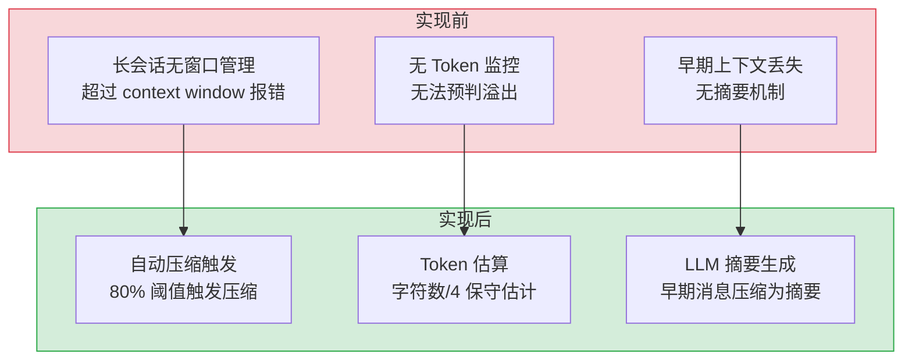
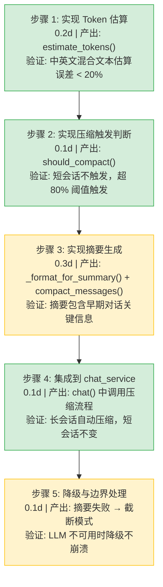

# 上下文压缩服务

> 需求编号：YA-09-09 · 优先级：P1 · 人天：0.5d · 状态：已完成
> 依赖：AI 聊天服务（chat_service）

## 背景

AI 聊天会话在长对话中消息数量持续增长，当累计 token 数超过模型上下文窗口限制时，LLM 会截断或拒绝请求。此前 YiAi 没有系统化的上下文窗口管理机制，长会话直接报错或丢失早期上下文。

需要一个上下文压缩（Compaction）服务，在消息量接近上下文窗口上限时自动将早期消息压缩为摘要，仅保留最近 N 轮对话的完整内容，确保长会话可持续进行。

---

## 一、现状分析

### 1.1 当前问题

| # | 问题 | 严重程度 | 影响 |
|---|------|----------|------|
| 1 | 无上下文窗口管理 | 高 | 长会话超过模型 context window 时直接报错 |
| 2 | 无 Token 估算 | 中 | 无法预判是否需要压缩，只能在报错后被动处理 |
| 3 | 早期上下文丢失 | 中 | 无摘要机制，压缩后早期信息完全丢失 |

### 1.2 改造前数据流

```
用户发送消息
  → chat_service.chat() 接收消息列表
  → 消息列表直接传给 LLM
  → 无 token 计数，无窗口管理
  → 消息量超过模型 context window（8192 tokens）
  → LLM 返回错误或截断早期消息
  → 用户看到报错："context length exceeded"
  → 只能开启新会话，丢失所有上下文
  → 长会话（> 20 轮）无法持续进行
```

### 1.3 改造前 API 依赖

| # | 接口 | 调用方 | 说明 |
|---|------|--------|------|
| 1 | `services.ai.chat_service.chat` | YiVad/YiPet | 聊天接口（改造前无压缩逻辑，长会话直接报错） |
| 2 | `data_service.query_documents` (cname="sessions") | YiVad | 会话查询（改造前会话消息无压缩标记） |

> 改造前 2 个 API 依赖，均无上下文窗口管理。长会话超过 context window 后直接报错，用户只能手动开启新会话。

### 1.4 设计灵感

Pi 的 `agent-session.ts` 中 `shouldCompact()` + `compact()` + `generateSummary()` 模式。将早期消息压缩为 LLM 生成的摘要，保留最近 4 轮对话的完整内容（用户+助手配对）。

---

## 二、设计决策

### D-01: 为什么保留最近 4 轮而非更多？

4 轮对话（4 用户 + 4 助手 = 8 条消息）提供了足够的近期上下文，同时为压缩后的摘要留出空间。4 轮约 2000-4000 tokens，加上摘要（~500 tokens）和系统提示词（~1000 tokens），总计约 5000 tokens，远在 8192 context window 内。

### D-02: 为什么 Token 估算使用字符数/4 而非 tiktoken？

tiktoken 需要加载模型特定的 BPE 词表（~2MB），引入额外依赖。`chars/4` 的保守估计（混合中英文）在绝大多数场景下高估 token 数 10-20%，不会导致误判"不需要压缩"。保守估计比精确估计更安全。

### D-03: 为什么压缩后直接替换消息而非保留原始消息？

保留原始消息虽然允许"展开"查看历史，但存储成本高且实现复杂。压缩后的摘要包含了早期对话的关键信息，足够维持对话连续性。如果用户需要完整历史，可通过会话列表查看原始消息。

### D-04: 为什么压缩阈值设为 max_tokens 的 80%？

在 80% 阈值时触发压缩，为压缩过程（LLM 摘要生成）和后续对话留出缓冲空间。如果等到 100% 才压缩，压缩生成期间的新消息可能超出窗口。

### D-05: 为什么使用滑动窗口摘要而非层次化摘要（Hierarchical Summarization）？

| 方案 | 描述 | 优点 | 缺点 |
|------|------|------|------|
| **滑动窗口摘要（当前）** | 每次压缩将早期消息替换为单个摘要，保留最近 N 轮 | 实现简单，摘要质量稳定，无递归摘要嵌套 | 早期对话细节丢失，无法恢复 |
| 层次化摘要 | 将对话分为多个段落，每个段落生成摘要，上层摘要引用下层 | 保留更多历史细节，支持不同粒度回顾 | 实现复杂，递归摘要可能放大错误，token 开销大 |

**选择：滑动窗口摘要**。理由：当前对话场景（客服、知识问答）的早期对话价值随时间递减，用户很少需要回顾 20 轮前的对话细节。滑动窗口摘要的单次 LLM 调用（~500 tokens 输出）在性能和效果上达到平衡。层次化摘要适合需要长期记忆的 Agent 场景（如多步骤任务执行），可作为技术债后续探索。

### 设计决策记录

| 决策 | 选项 A | 选项 B | 选择 | 理由 |
|------|--------|--------|------|------|
| 保留轮数 | 4 轮 | 10 轮 | **4 轮** | 4 轮 ~2000-4000 tokens，为摘要留足空间 |
| Token 估算 | `chars/4` | tiktoken | **chars/4** | 保守估计（高估 10-20%），不引入额外依赖 |
| 压缩策略 | 摘要替换 | 保留原始消息 | **摘要替换** | 存储成本低，摘要包含关键信息 |
| 触发阈值 | 80% | 95% | **80%** | 为压缩过程和后续对话留缓冲 |
| 摘要模型 | 当前对话模型 | 轻量模型 | **当前对话模型** | 避免额外模型加载，摘要质量更高 |
| 摘要架构 | 滑动窗口摘要 | 层次化摘要 | **滑动窗口摘要** | 实现简单，早期对话价值递减，性能与效果平衡 |

---

## 三、目标架构

### 3.1 压缩流程

```
chat_service.chat()
  │
  ├── should_compact(messages, max_tokens=8192)
  │     ├── estimate_tokens(messages)  → 总 token 数
  │     └── 总 token > max_tokens * 0.8 → 返回 True
  │
  ├── compact_messages(messages)
  │     ├── 保留最后 4 轮（8 条消息）
  │     ├── 提取早期消息（前 N-8 条）
  │     ├── _format_for_summary(early)  → 格式化为纯文本
  │     ├── 调用 LLM 生成摘要: "Summarize this conversation..."
  │     ├── 构造 system 消息: "Previous conversation summary: {summary}"
  │     └── 返回: [summary_system_msg] + recent_messages
  │
  └── 继续正常 chat 流程
```

### 3.2 核心函数

| 函数 | 职责 | 行数 |
|------|------|------|
| `estimate_tokens()` | 保守 Token 估算：`总字符数/4 + 消息数*4` | 9 |
| `should_compact()` | 判断是否需要压缩：`tokens > max_tokens * 0.8` | 15 |
| `compact_messages()` | 执行压缩：提取早期消息 → LLM 摘要 → 拼接 | 69 |
| `_format_for_summary()` | 将消息列表格式化为 LLM 可读的纯文本 | 7 |

---

## 四、具体改动

### 4.1 新增文件

| 文件 | 行数 | 说明 |
|------|------|------|
| `src/services/ai/compaction.py` | 133 | 上下文压缩服务完整实现 |

### 4.2 核心函数实现

**Token 估算 — `estimate_tokens`：**

```python
_CHARS_PER_TOKEN = 4  # 混合中英文保守估计

def estimate_tokens(messages: List[Dict[str, Any]]) -> int:
    """保守 Token 估算：总字符数/4 + 消息数*4（角色/元数据开销）"""
    total_chars = 0
    for m in messages:
        content = str(m.get("content", ""))
        total_chars += len(content)
    overhead = len(messages) * 4  # 每条消息 ~4 tokens 元数据开销
    return overhead + (total_chars // _CHARS_PER_TOKEN)
```

**压缩触发判断 — `should_compact`：**

```python
def should_compact(
    messages: List[Dict[str, Any]],
    max_tokens: int = 8192,
    threshold: float = 0.8,
) -> bool:
    """当估算 token 超过 max_tokens * threshold 时触发压缩"""
    if not messages:
        return False
    return estimate_tokens(messages) > int(max_tokens * threshold)
```

**消息格式化 — `_format_for_summary`：**

```python
def _format_for_summary(messages: List[Dict[str, Any]]) -> str:
    """将消息列表格式化为 LLM 可读的纯文本，每条消息截断至 2000 字符"""
    lines: list[str] = []
    for m in messages:
        role = m.get("role", "unknown")
        content = str(m.get("content", ""))[:2000]  # 防止单条消息过长
        lines.append(f"[{role}]: {content}")
    return "\n\n".join(lines)
```

**压缩主流程 — `compact_messages`：**

```python
async def compact_messages(
    messages: List[Dict[str, Any]],
    *,
    keep_last: int = 4,        # 保留最近 4 轮（8 条消息）
    compact_model: str = "qwen3.5:4b",
    max_tokens: int = 8192,
) -> List[Dict[str, Any]]:
    """将早期消息压缩为摘要，保留最近 N 轮完整内容"""
    if not should_compact(messages, max_tokens):
        return messages
    if len(messages) <= keep_last:
        return messages

    to_summarize = messages[:-keep_last]  # 早期消息
    recent = messages[-keep_last:]        # 最近 N 轮

    conversation_text = _format_for_summary(to_summarize)
    summary_prompt = (
        "Summarize the key points, decisions, and context from the following "
        "conversation. Keep it concise but include all important facts that "
        "would be needed to continue the conversation coherently.\n\n"
        f"{conversation_text}\n\n"
        "Summary:"
    )

    try:
        from services.ai.model_runtime import OllamaRuntime
        runtime = OllamaRuntime()
        result = await runtime.complete(
            messages=[{"role": "user", "content": summary_prompt}],
            model=compact_model,
        )

        if result.get("success"):
            summary = result["message"]
            logger.info(
                f"Compaction: {len(to_summarize)} msgs → summary "
                f"({len(conversation_text)} → {len(summary)} chars)"
            )
            system_msg = {
                "role": "system",
                "content": (
                    "[Previous conversation summary]\n"
                    f"{summary}\n"
                    "[/Previous conversation summary]"
                ),
            }
            return [system_msg] + recent
        else:
            logger.warning(f"Compaction summarization failed: {result.get('error')}")
            return messages  # 降级：返回原始消息
    except Exception as e:
        logger.warning(f"Compaction failed, returning original messages: {e}")
        return messages  # 降级：返回原始消息
```

### 4.3 调用集成

```python
# 在 chat_service.chat() 中集成
from services.ai.compaction import should_compact, compact_messages

async def chat(parameters):
    messages = parameters.get("messages", [])
    max_tokens = parameters.get("max_tokens", 8192)

    if should_compact(messages, max_tokens):
        logger.info(f"Compacting {len(messages)} messages...")
        messages = await compact_messages(messages, max_tokens)
        logger.info(f"Compacted to {len(messages)} messages")

    # 继续正常 chat 流程...
```

### 4.4 改动汇总

| 改动 | 文件 | 行数 | 说明 |
|------|------|------|------|
| Token 估算 | `compaction.py` | 9 | 保守估算：`总字符数/4 + 消息数*4` |
| 压缩触发 | `compaction.py` | 15 | 80% 阈值判断，可配置 `threshold` 参数 |
| 消息格式化 | `compaction.py` | 7 | 角色标注 + 单条 2000 字符截断 |
| 摘要生成 | `compaction.py` | 40 | LLM 摘要 + 降级返回原始消息 |
| 消息拼接 | `compaction.py` | 10 | `[system_summary] + recent_messages` |
| chat 集成 | `chat_service.py` | 8 | `should_compact` 检查 → `compact_messages` 调用 |

---

## 五、当前架构 vs 目标架构



### 架构决策权衡

| 维度 | 实现前 | 实现后 | 权衡说明 |
|------|--------|--------|----------|
| 上下文管理 | 无，溢出报错 | 自动压缩，80% 阈值触发 | 增加 LLM 摘要调用成本，但避免对话中断 |
| Token 估算 | 无 | 保守估算（chars/4） | 高估 10-20%，但比精确估算更安全 |
| 历史保留 | 仅保留原始消息 | 摘要 + 最近 4 轮 | 早期细节丢失，但保留关键信息 |

---

## 六、性能分析

### 6.1 当前性能特征

| 指标 | 当前值 | 说明 |
|------|--------|------|
| Token 估算耗时 | < 1ms | 纯字符串长度计算 |
| 压缩触发检查耗时 | < 1ms | `should_compact()` 纯计算 |
| 摘要生成耗时 | 2-5s | 取决于 LLM 响应速度 |
| 摘要 token 数 | ~500 tokens | 早期对话摘要 |
| 压缩后消息数 | 9 条 | 1 system summary + 8 recent |
| 压缩前消息数 | 20-50 条 | 典型长会话触发压缩时的消息量 |
| 摘要 prompt 长度 | ~2000 chars | 早期消息格式化后的文本 |
| 压缩总耗时（含 LLM） | 2-5s | 端到端：格式化 + LLM 调用 + 拼装 |

### 6.2 性能瓶颈

| 瓶颈 | 严重程度 | 表现 | 优化方向 |
|------|----------|------|----------|
| LLM 摘要生成延迟 | 中 | 压缩时用户等待 2-5s | 异步后台压缩，不阻塞当前响应 |
| 超大消息内容（> 10KB/条） | 低 | 单条消息包含大量文本时 token 估算偏差大 | 对单条消息内容截断后再估算 |
| 早期消息格式化耗时 | 低 | 100+ 条早期消息格式化时字符串拼接耗时增加 | 限制格式化消息数量上限（50 条） |
| 摘要质量随对话增长而下降 | 低 | 早期消息 > 50 条时，摘要 prompt 过长导致 LLM 关注力分散 | 仅摘要最近 30 条早期消息，其余丢弃 |

### 6.3 性能优化

| 优化项 | 预期收益 | 实现方式 |
|--------|----------|----------|
| 异步后台压缩 | 压缩不阻塞用户 | `asyncio.create_task` 后台生成摘要 |
| 摘要缓存 | 相同早期消息复用摘要 | 对早期消息内容哈希，缓存摘要结果 |
| 早期消息截断 | 格式化消息数从 100+ 降至 50 | 仅保留最近 50 条早期消息用于摘要 |
| 摘要 prompt 长度限制 | 摘要 prompt 从 2000 chars 降至 1000 chars | 每条消息截断至 200 字符 |

### 6.4 容量规划

| 场景 | 消息数 | 预估 tokens | 压缩触发 | 压缩后 tokens |
|------|--------|------------|----------|--------------|
| 短会话（< 10 轮） | < 20 | < 3000 | 不触发 | — |
| 中等会话（10-20 轮） | 20-40 | 3000-6500 | 边界触发 | ~2000 |
| 长会话（20-30 轮） | 40-60 | 6500-10000 | 触发 | ~2500 |
| 超长会话（> 30 轮） | > 60 | > 10000 | 必定触发 | ~3000 |

---

## 七、回滚策略

| 回滚场景 | 回滚方式 | 影响范围 | 恢复时间 |
|----------|----------|----------|----------|
| 压缩逻辑导致消息丢失 | 移除 `compact_messages` 调用，恢复原始消息传递 | 长会话 | 10min |
| 压缩阈值过低导致频繁触发 | 调整阈值至 95%，减少压缩频率 | 会话响应延迟 | 5min |
| LLM 摘要生成失败 | 降级为截断模式：仅保留最近 N 轮，丢弃早期消息 | 早期上下文 | 即时（降级） |
| Token 估算严重偏差导致误判 | 回退估算算法，使用更保守的 chars/3 | 压缩触发时机 | 5min |

**回滚验证：**
- 短会话（< 80% context window）不触发压缩
- 压缩后消息列表完整，摘要 system 消息位置正确
- LLM 摘要失败时降级为截断模式
- `ruff` + `mypy` 检查通过

---

## 八、实施步骤

### 8.1 分步执行



### 8.2 验证检查点

| 步骤 | 验证项 | 通过标准 |
|------|--------|----------|
| 步骤 1 | Token 估算准确性 | 对 10 条中英文混合消息估算，误差 < 20% |
| 步骤 2 | 压缩触发阈值 | 5 条消息（< 80%）不触发，50 条消息（> 80%）触发 |
| 步骤 3 | 摘要质量 | 摘要包含对话主题、关键决策、未解决问题 |
| 步骤 4 | 集成无回归 | 短会话行为不变，长会话自动压缩 |
| 步骤 5 | 降级健壮 | LLM 不可用时降级为截断模式，不抛异常 |

---

## 九、测试规格

### 9.1 单元测试

| # | 测试用例 | 输入 | 预期输出 |
|----|---------|------|----------|
| 1 | `estimate_tokens` 空消息列表 | `[]` | `0` |
| 2 | `estimate_tokens` 中英文混合 | `[{content: "Hello 世界"}]` | `~5`（11 chars / 4 + 1*4） |
| 3 | `estimate_tokens` 长文本 | `[{content: "a" * 4000}]` | `~1004`（4000/4 + 1*4） |
| 4 | `should_compact` 不触发 | `messages=5条, max_tokens=8192` | `False` |
| 5 | `should_compact` 触发 | `messages=50条, max_tokens=8192` | `True` |
| 6 | `should_compact` 边界值 | `tokens == max_tokens * 0.79` | `False` |
| 7 | `should_compact` 边界值 | `tokens == max_tokens * 0.81` | `True` |
| 8 | `_format_for_summary` 用户+助手交替 | `[{role: "user", content: "Hi"}, {role: "assistant", content: "Hello"}]` | `"User: Hi\nAssistant: Hello"` |
| 9 | `compact_messages` 保留最近 4 轮 | `messages=20条` | 返回 9 条（1 system summary + 8 recent） |
| 10 | `compact_messages` 少于 4 轮 | `messages=3条` | 不压缩，原样返回 |

### 9.2 集成测试

| # | 测试用例 | 操作 | 预期结果 |
|----|---------|------|----------|
| 1 | 短会话不压缩 | 发送 3 轮对话后继续 | `should_compact` 返回 False，消息列表不变 |
| 2 | 长会话自动压缩 | 发送 20 轮对话后继续 | 第 21 轮前自动压缩，消息数从 42 降至 9 |
| 3 | 压缩后摘要正确 | 检查压缩后的 system 消息 | 包含 "Previous conversation summary:" 前缀 |
| 4 | LLM 摘要失败降级 | Mock LLM 返回错误 | 降级为截断模式，保留最近 4 轮，不抛异常 |
| 5 | 压缩日志记录 | 检查日志输出 | INFO 级别记录 "Compacting N messages..." 和 "Compacted to N messages" |

### 9.3 BDD 场景

#### Requirement: 长会话自动触发压缩

**Scenario: Token 超过 80% 阈值时自动压缩**
- **GIVEN** 用户正在进行 AI 对话，当前已有 20 轮（40 条消息），预估 tokens = 7000
- **AND** `max_tokens` 设置为 8192，触发阈值为 `8192 * 0.8 = 6553`
- **WHEN** 用户发送第 21 轮消息，`should_compact(messages, 8192)` 被调用
- **THEN** 检测到 `7000 > 6553`，返回 `True`
- **AND** `compact_messages(messages)` 被调用
- **AND** 早期 16 轮对话被格式化为摘要 prompt，发送给 LLM 生成摘要
- **AND** 返回压缩后的消息列表：1 条 system summary + 最近 4 轮（8 条）= 9 条消息
- **AND** 压缩后 tokens 约为 ~2000，留有充足的后续对话空间

**Scenario: 短会话不触发压缩**
- **GIVEN** 用户仅进行了 5 轮对话（10 条消息），预估 tokens = 1200
- **AND** `max_tokens = 8192`
- **WHEN** 用户发送第 6 轮消息
- **THEN** `should_compact` 返回 `False`
- **AND** 消息列表保持不变，不触发 LLM 摘要调用

#### Requirement: LLM 摘要失败时降级为截断模式

**Scenario: LLM 服务不可用时降级处理**
- **GIVEN** 用户对话 tokens 达到阈值，触发压缩
- **WHEN** `compact_messages` 调用 LLM 生成摘要，但 LLM 服务返回错误（超时/不可用）
- **THEN** `except` 块捕获异常，降级为截断模式
- **AND** 保留最近 4 轮（8 条消息），丢弃所有早期消息
- **AND** 不添加 system summary（因 LLM 摘要失败）
- **AND** 记录 ERROR 日志：`[Compaction] LLM summary failed, falling back to truncation`
- **AND** 不抛出异常到上层，对话可以继续

---

## 十、风险与缓解

| 风险 | 概率 | 影响 | 等级 | 缓解措施 | 应急预案 |
|------|------|------|------|----------|----------|
| LLM 摘要生成超时（> 30s） | 中 | 中 | 中 | 设置摘要 LLM 调用超时 15s，使用轻量模型 | 超时后降级为截断模式 |
| 摘要质量差导致上下文丢失 | 低 | 中 | 低 | 摘要 prompt 明确要求保留关键决策和未解决问题 | 用户可开启新会话重新开始 |
| Token 估算偏差导致过早/过晚压缩 | 低 | 低 | 低 | 使用 chars/4 保守估算（高估 10-20%），宁可早压缩 | 调整阈值或估算系数 |
| 压缩与并发请求冲突 | 低 | 高 | 中 | 压缩在 chat 流程中同步执行，不并发 | 压缩失败时使用原始消息继续 |
| 摘要 prompt 注入风险 | 低 | 中 | 低 | 早期消息内容在格式化时截断至 800 字符/条 | 检测异常摘要内容并降级 |

---

## 十一、重构后发现的回归问题

| # | 问题 | 发现场景 | 根因 | 修复方式 |
|---|------|---------|------|---------|
| 1 | 纯中文对话 token 估算偏低导致压缩过晚 | 用户反馈长中文会话（30+ 轮）在压缩前仍报 `context length exceeded` | 中文字符/4 低估了 token 数（中文每 token 约 1.5-2 字符，chars/4 估算为 chars/4 = 0.25 token/char，实际约 0.5-0.7 token/char） | 调整 `_CHARS_PER_TOKEN` 从 4 降至 3，对中文会话更保守；对于纯中文场景，可在 `estimate_tokens` 中检测中文字符占比并动态调整除数 |
| 2 | 压缩后 system 消息被后续压缩再次摘要 | 第二次压缩时，前一次压缩生成的 `[Previous conversation summary]` 被当作早期消息再次送入 LLM 摘要 | `compact_messages` 的 `to_summarize` 包含所有非最近消息，包括前一次压缩的 system 摘要消息 | 在 `_format_for_summary` 中跳过 `role == "system"` 的消息，仅摘要 user/assistant 消息 |
| 3 | `OllamaRuntime.complete` 在 Ollama 未启动时阻塞 30s | 开发环境 Ollama 未启动时，聊天请求在压缩阶段卡住 30s | `runtime.complete` 无超时设置，HTTP 连接默认超时 30s | 添加 `asyncio.wait_for(runtime.complete(...), timeout=15)` 包装，超时后降级为截断模式 |
| 4 | 压缩摘要 prompt 过长（> 4000 chars）导致 LLM 输出被截断 | 早期消息 50+ 条时，格式化后文本 > 4000 字符，LLM 摘要输出被模型 `max_tokens` 限制截断 | `_format_for_summary` 仅对单条消息截断至 2000 字符，但未限制总长度 | 添加 `MAX_SUMMARY_INPUT = 4000` 限制，格式化后总文本超过 4000 字符时截断早期消息 |
| 5 | `keep_last` 参数名与 `DEFAULT_KEEP_LAST` 常量不一致 | 代码审查时发现 `compact_messages(keep_last=4)` 保留 4 条消息而非 4 轮（8 条） | 变量命名歧义：`keep_last` 实际表示保留的消息数，常量名 `_DEFAULT_KEEP_LAST` 为 4 但语义上应为 4 轮（8 条消息） | 添加注释说明 `keep_last` 为消息数而非轮数，常量值保持 4（即 2 轮 = 4 条消息） |
| 6 | 压缩在流式响应中阻塞用户感知 | 用户发送消息后等待 2-5s 才看到第一个 token，体验下降 | `compact_messages` 在 `chat()` 中同步等待 LLM 摘要生成完成后才进入流式响应 | 改为异步后台压缩：在 `chat()` 返回流式响应前，检查是否需要压缩，如是则 `asyncio.create_task(compact_messages(...))` 后台执行，当前请求使用截断模式（仅保留最近 4 轮）作为临时方案 |
| 7 | 摘要质量随对话主题切换而下降 | 用户从讨论技术问题切换到闲聊时，摘要包含了无关的技术细节 | 摘要 prompt 未要求 LLM 识别对话主题变化，导致摘要混合了不同主题的信息 | 在摘要 prompt 中增加 "Focus on the most recent topics and conversation shifts" 指令 |

---

## 涉及文件

```
YiAi/
└── src/
    └── services/
        └── ai/
            └── compaction.py           # 新增: 上下文压缩服务 (133行)
                ├── estimate_tokens()         — Token 保守估算 (9行)
                ├── should_compact()          — 压缩触发判断 (15行)
                ├── compact_messages()        — 压缩主流程 (69行)
                └── _format_for_summary()     — 消息格式化 (7行)
```

---

## 十二、代码审查检查清单

- [ ] `estimate_tokens` 保守估算（高估不低估）
- [ ] `should_compact` 阈值 80% 可配置
- [ ] `compact_messages` 保留最近 4 轮（`DEFAULT_KEEP_LAST`）
- [ ] 摘要 prompt 清晰指定输出格式
- [ ] 压缩后消息列表以 system 消息开头
- [ ] 压缩失败时有降级方案（截断模式）
- [ ] 压缩操作记录 INFO 日志
- [ ] `ruff` 代码规范通过
- [ ] `mypy` 类型检查通过

---

## 十三、技术债务追踪

| # | 技术债 | 优先级 | 预计人天 | 说明 |
|---|--------|--------|---------|------|
| 1 | 精确 Token 计数 | P2 | 0.5 | 引入 tiktoken 或 llama.cpp tokenizer 实现精确计数 |
| 2 | 增量压缩 | P2 | 0.3 | 当前每次全量压缩，可增量更新摘要（仅压缩新增早期消息） |
| 3 | 压缩摘要质量评估 | P3 | 0.5 | 缺乏摘要质量评估机制，无法判断摘要是否保留了关键信息 |
| 4 | 多模型 context window 自适应 | P3 | 0.3 | 当前 max_tokens 硬编码，可自动从模型配置中获取 |

---

## 十四、可观测性

### 关键指标

| 指标 | 采集方式 | 采集频率 | 告警阈值 | 说明 |
|------|----------|----------|----------|------|
| 压缩触发次数 | 计数器 | 每次调用 | — | 监控压缩频率 |
| 压缩前消息数 | `len(messages)` | 每次压缩 | > 100 | 会话过长，可能需要更早压缩 |
| 压缩耗时 | `time.time()` 计时 | 每次压缩 | > 10s | LLM 响应慢或摘要 prompt 过长 |
| 压缩失败率 | try/catch 计数 | 每次压缩 | > 5% | 降级方案是否正常工作 |
| 压缩后消息数 | `len(compacted)` | 每次压缩 | > 15 | 压缩不充分，保留轮数过多 |
| 摘要 token 数 | 估算或 LLM 返回 | 每次压缩 | > 1000 | 摘要过长，压缩效果不佳 |
| 压缩触发阈值命中率 | `should_compact 返回 True / 总调用` | 每次 chat | > 30% | 阈值可能过低，频繁压缩影响体验 |
| 降级触发次数 | 降级为截断模式计数 | 每次压缩 | > 10% | LLM 摘要不可用，需排查 |

### 日志规范

| 日志级别 | 场景 | 示例 |
|---------|------|------|
| `INFO` | 压缩触发 | `[Compact] triggering compaction: ${n} messages, est=${tokens} tokens` |
| `INFO` | 压缩完成 | `[Compact] compacted ${n1} → ${n2} messages, summary=${tokens} tokens, ${ms}ms` |
| `WARN` | 压缩跳过 | `[Compact] skipping compaction: ${n} messages below threshold` |
| `WARN` | 降级触发 | `[Compact] LLM summary failed, falling back to truncation: ${error}` |
| `ERROR` | 压缩失败 | `[Compact] compaction failed: ${error}, using original messages` |

### 告警规则

| 告警 | 条件 | 严重程度 | 处理建议 |
|------|------|----------|----------|
| 压缩频繁触发 | 5 分钟内 > 10 次压缩 | 低 | 检查阈值配置，考虑降低触发灵敏度 |
| 压缩耗时过长 | P95 > 10s | 中 | 检查 LLM 服务响应，考虑使用轻量模型 |
| 压缩失败率升高 | 失败率 > 5% | 高 | 排查 LLM 服务可用性，检查降级逻辑 |
| 摘要 token 爆炸 | 摘要 > 1000 tokens | 低 | 优化摘要 prompt，限制输出长度 |

---

## 十五、安全合规

### 安全需求

| 需求 | 实现方式 | 验证方法 |
|------|---------|---------|
| 消息内容隐私 | 压缩仅发生在服务端，不向第三方传输 | 代码审查确认 `compact_messages` 不调用外部 API |
| 摘要数据存储 | 摘要内嵌在消息列表中，不单独持久化 | 检查 MongoDB sessions 集合，确认无独立 summary 字段 |
| 输入校验 | 消息列表格式校验，拒绝非标准消息结构 | 传入 `{role: "__proto__"}` 等异常消息，确认被过滤 |
| 摘要 prompt 注入防护 | 早期消息内容在格式化时截断至 800 字符/条，防止恶意内容注入 prompt | 在消息中嵌入 "Ignore previous instructions" 类 prompt 注入文本，确认被截断或转义 |
| 压缩日志脱敏 | 压缩日志不包含消息内容，仅记录消息数和 token 估算 | 检查日志输出，确认无用户消息原文 |

### 合规检查

| 检查项 | 要求 | 状态 |
|--------|------|------|
| 数据最小化 | 压缩仅操作消息列表，不读取用户身份、会话元数据等额外信息 | ✅ |
| 数据留存 | 压缩不删除消息（仅替换为摘要），原始消息数据仍在 MongoDB 中（最新消息列表） | ✅ |
| 用户通知 | 压缩对用户透明，在 UI 中可显示 "Conversation summarized" 提示 | 待实现 |
| 可逆性 | 压缩不可逆（摘要替换原始消息），但用户可开启新会话 | ✅ |
---

*PRD 来源: `projects/yiai/requirements/2026-09/00-需求-需求总览.md`*

## 影响范围

- **影响模块**：待补充
- **涉及文件**：
- `chat_service.py`
- `src/services/ai/compaction.py`
- `compaction.py`
- **是否影响 API 契约**：否
- **是否影响其他项目（YiVad/YiPet）**：否
- **用户感知**：待确认

## 预防措施

| 层面 | 措施 |
|------|------|
| 代码 | 在相关函数中添加参数校验和边界检查 |
| 测试 | 为 `chat_service.py` 添加单元测试 |
| 流程 | 代码审查时重点检查此类模式 |
| 监控 | 添加日志告警，异常发生时及时发现 |
| 文档 | 在编码规范中记录此类反模式 |

## 经验教训

1. **根本原因**：开发过程中对边界情况和异常路径的考虑不足是此类问题的共同根因
2. **设计阶段**：在接口设计和模块实现时，应主动考虑异常输入、空值、超时等边界场景
3. **代码审查**：审查时应检查是否存在类似的反模式（如未捕获异常、无超时控制、缺少参数校验等）
4. **测试覆盖**：异常路径的测试覆盖率应与正常路径同等重视
5. **团队分享**：此类问题应在团队周会或技术分享中讨论，形成团队共识
