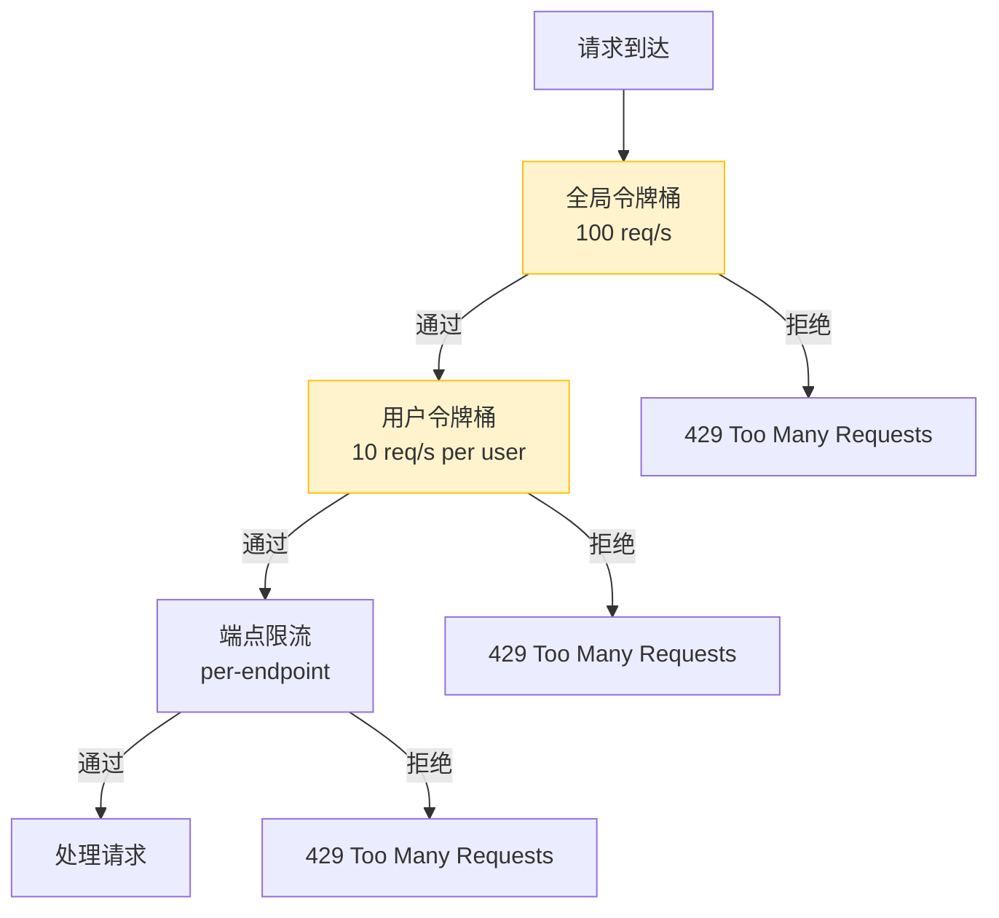
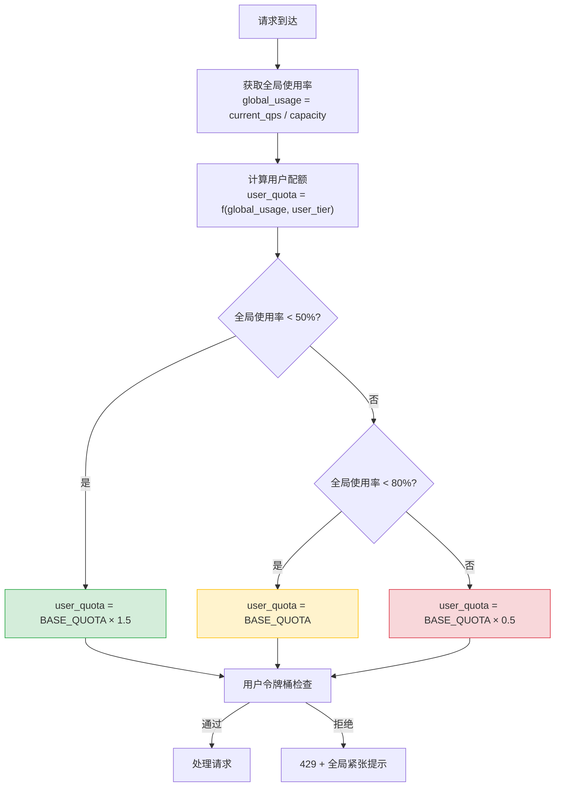

# YA-09-122: 全局限流与用户限流协同 — 双重令牌桶嵌套配额

> 需求编号：YA-09-122 · 优先级：P2 · 人天：0.5d · 状态：需求已编写
> 依赖：YA-09-12（三级限流）、YA-09-69（资源配额隔离）

## 背景

YA-09-12 为 YiAi 实现了三级限流体系（全局 QPS 限制、用户级别限制、端点级别限制），但全局限流和用户限流独立运作，缺乏协调机制。这导致以下问题：

1. **全局空闲时用户受限**：全局 QPS 仅使用 20%，但某个用户达到个人配额（10 req/s）后被限流，浪费全局容量
2. **全局紧张时用户不受限**：全局 QPS 已达 90%，但用户仍以个人配额（10 req/s）全速请求，加剧全局压力
3. **无公平分配**：当全局容量紧张时，无法按用户优先级或历史使用量公平分配剩余容量
4. **无动态调整**：个人配额是固定值，不随全局负载变化

嵌套配额模型的核心思想：个人配额 = f(全局剩余容量)。全局宽裕时个人配额宽松，全局紧张时个人配额收紧。

### 核心挑战

| 挑战 | 描述 | 影响 |
|------|------|------|
| 配额协调 | 全局和个人配额独立决策 | 资源浪费或过载 |
| 公平性 | 繁忙用户挤占空闲用户配额 | 用户体验不均 |
| 动态调整 | 固定配额不适应负载变化 | 限流决策不准确 |
| 优先级 | 不同用户应有不同优先级 | VIP 用户需保障 |

### 设计目标

- 全局容量使用率 < 50% 时：个人配额等于基准值
- 全局容量使用率 50-80% 时：个人配额按比例缩减
- 全局容量使用率 > 80% 时：个人配额降至最低保障值
- VIP 用户最低保障配额高于普通用户

---

## 一、现状分析

### 1.1 当前限流架构



**问题**：全局桶和用户桶独立决策，无信息交换。全局使用率 20% 时用户仍被限流在 10 req/s。

### 1.2 根因矩阵

| 根因 | 现象 | 严重程度 |
|------|------|----------|
| 双层独立 | 全局空闲时用户受限 | 中 |
| 固定配额 | 不随全局负载调整 | 高 |
| 无优先级 | 所有用户一视同仁 | 中 |
| 无配额回收 | 空闲配额无法转移 | 低 |

---

## 二、设计决策

### 决策 1：协调方式 — 独立 vs 嵌套 vs 加权

| 选项 | 资源利用率 | 公平性 | 实现复杂度 |
|------|-----------|--------|-----------|
| 独立（现状） | 低 | 低 | 低 |
| **嵌套（个人配额 = f(全局使用率)）** | 高 | 中 | 中 |
| 加权（全局剩余按权重分配） | 最高 | 高 | 高 |

**选择：嵌套配额。** 个人配额根据全局使用率动态调整，简单有效。加权分配需要维护用户权重，初期复杂度高。

### 决策 2：配额调整函数 — 线性 vs 阶梯 vs 平滑

| 选项 | 平滑性 | 可预测性 | 实现复杂度 |
|------|--------|----------|-----------|
| 线性递减 | 中 | 高 | 低 |
| **阶梯函数** | 低 | 高 | 低 |
| 平滑曲线（sigmoid） | 高 | 低 | 高 |

**选择：阶梯函数。** 3 个阶梯（< 50%, 50-80%, > 80%）简单明确，可预测性强。平滑曲线增加复杂度但收益有限。

### 决策 3：用户优先级 — 无 vs 二级 vs 多级

| 选项 | 公平性 | 复杂度 | 适用场景 |
|------|--------|--------|----------|
| 无优先级 | 低 | 低 | 简单场景 |
| **二级（VIP/普通）** | 中 | 中 | 区分内部/外部用户 |
| 多级（金/银/铜） | 高 | 高 | 复杂场景 |

**选择：二级优先级。** YiAi 的用户分为内部服务（YiVad/YiPet）和外部 API 调用，二级优先足以区分。内部服务享有更高基础配额。

### 设计决策记录

| 决策 | 选项 A | 选项 B | 选项 C | 选择 | 理由 |
|------|--------|--------|--------|------|------|
| 协调方式 | 独立 | 嵌套 | 加权 | **嵌套** | 简单有效 |
| 调整函数 | 线性 | 阶梯 | 平滑 | **阶梯** | 可预测性强 |
| 优先级 | 无 | 二级 | 多级 | **二级** | 区分内部/外部 |

---

## 三、目标架构

### 3.1 改造后限流流程



### 3.2 核心组件

```python
# YiAi/src/shared/nested_rate_limiter.py
import time
from dataclasses import dataclass
from enum import Enum
from typing import Optional

class UserTier(str, Enum):
    VIP = 'vip'       # 内部服务（YiVad/YiPet）
    NORMAL = 'normal' # 外部 API 调用

@dataclass
class NestedQuotaConfig:
    """嵌套配额配置。"""
    global_capacity: int = 100          # 全局 QPS 容量
    global_high_threshold: float = 0.8  # 全局高负载阈值
    global_low_threshold: float = 0.5   # 全局低负载阈值
    
    # 用户基准配额
    vip_base_quota: int = 20     # VIP 用户基准配额
    normal_base_quota: int = 10  # 普通用户基准配额
    
    # 配额调整系数
    low_load_multiplier: float = 1.5   # 低负载时配额放大系数
    high_load_multiplier: float = 0.5  # 高负载时配额缩减系数
    min_quota: int = 2                 # 最低保障配额（所有用户）


class NestedRateLimiter:
    """双重令牌桶嵌套配额限流器。
    
    个人配额 = f(全局使用率, 用户等级):
    - 全局使用率 < 50%: 配额 = BASE × 1.5（鼓励使用）
    - 全局使用率 50-80%: 配额 = BASE（正常）
    - 全局使用率 > 80%: 配额 = BASE × 0.5（收紧）
    - 最低保障: 2 req/s（防止完全饥饿）
    """
    
    def __init__(self, config: NestedQuotaConfig = NestedQuotaConfig()):
        self.config = config
        self._global_tokens = config.global_capacity
        self._global_last_refill = time.monotonic()
        self._user_buckets: dict[str, dict] = {}  # user_id -> {tokens, last_refill}
    
    def get_global_usage_ratio(self) -> float:
        """获取全局令牌使用率（0.0-1.0）。"""
        self._refill_global()
        return 1.0 - (self._global_tokens / self.config.global_capacity)
    
    def get_user_quota(self, user_id: str, tier: UserTier = UserTier.NORMAL) -> int:
        """根据全局使用率和用户等级计算个人配额。
        
        Args:
            user_id: 用户标识
            tier: 用户等级
        
        Returns:
            当前有效的个人 QPS 配额
        """
        global_usage = self.get_global_usage_ratio()
        
        # 基础配额
        base_quota = (
            self.config.vip_base_quota
            if tier == UserTier.VIP
            else self.config.normal_base_quota
        )
        
        # 阶梯调整
        if global_usage < self.config.global_low_threshold:
            # 全局低负载——鼓励使用
            quota = int(base_quota * self.config.low_load_multiplier)
        elif global_usage < self.config.global_high_threshold:
            # 全局中等负载——正常配额
            quota = base_quota
        else:
            # 全局高负载——收紧配额
            quota = int(base_quota * self.config.high_load_multiplier)
        
        # 最低保障
        quota = max(quota, self.config.min_quota)
        
        return quota
    
    def try_acquire(self, user_id: str, tier: UserTier = UserTier.NORMAL) -> bool:
        """尝试获取令牌（全局 + 用户双层检查）。
        
        Returns:
            True=获取成功，False=被限流
        """
        # 1. 全局令牌检查
        if not self._try_acquire_global():
            return False
        
        # 2. 用户令牌检查（使用动态配额）
        quota = self.get_user_quota(user_id, tier)
        return self._try_acquire_user(user_id, quota)
    
    def _try_acquire_global(self) -> bool:
        """全局令牌桶——尝试获取 1 个令牌。"""
        self._refill_global()
        if self._global_tokens >= 1:
            self._global_tokens -= 1
            return True
        return False
    
    def _try_acquire_user(self, user_id: str, quota: int) -> bool:
        """用户令牌桶——尝试获取 1 个令牌（动态配额）。"""
        if user_id not in self._user_buckets:
            self._user_buckets[user_id] = {
                'tokens': quota,
                'last_refill': time.monotonic(),
                'max_tokens': quota,
            }
        
        bucket = self._user_buckets[user_id]
        self._refill_user_bucket(bucket, quota)
        
        if bucket['tokens'] >= 1:
            bucket['tokens'] -= 1
            return True
        return False
    
    def _refill_global(self):
        """全局令牌桶——按时间补充令牌。"""
        now = time.monotonic()
        elapsed = now - self._global_last_refill
        refill = int(elapsed * self.config.global_capacity)
        if refill > 0:
            self._global_tokens = min(
                self._global_tokens + refill,
                self.config.global_capacity
            )
            self._global_last_refill = now
    
    def _refill_user_bucket(self, bucket: dict, quota: int):
        """用户令牌桶——按时间补充令牌（动态更新容量）。"""
        now = time.monotonic()
        elapsed = now - bucket['last_refill']
        refill = int(elapsed * quota)
        if refill > 0:
            bucket['tokens'] = min(bucket['tokens'] + refill, quota)
            bucket['last_refill'] = now
        bucket['max_tokens'] = quota
    
    def get_stats(self) -> dict:
        """获取限流器统计信息。"""
        return {
            'global_usage_ratio': self.get_global_usage_ratio(),
            'global_tokens': self._global_tokens,
            'global_capacity': self.config.global_capacity,
            'active_users': len(self._user_buckets),
        }


# 全局实例
nested_limiter = NestedRateLimiter()


# 中间件集成
@app.middleware("http")
async def nested_rate_limit_middleware(request: Request, call_next):
    """嵌套限流中间件。"""
    user_id = request.headers.get('X-User-ID', 'anonymous')
    tier = UserTier.VIP if request.headers.get('X-Internal') == 'true' else UserTier.NORMAL
    
    if not nested_limiter.try_acquire(user_id, tier):
        global_usage = nested_limiter.get_global_usage_ratio()
        return JSONResponse(
            {
                'code': 4003,
                'message': f'请求过于频繁——当前全局使用率 {global_usage:.0%}',
                'data': {
                    'retry_after': 1,
                    'global_usage': f'{global_usage:.0%}',
                    'user_quota': nested_limiter.get_user_quota(user_id, tier),
                }
            },
            status_code=429
        )
    
    return await call_next(request)
```

### 3.3 配额调整示例

| 全局使用率 | VIP 用户配额 | 普通用户配额 | 说明 |
|-----------|-------------|-------------|------|
| 20% | 30 req/s (20 × 1.5) | 15 req/s (10 × 1.5) | 低负载，鼓励使用 |
| 60% | 20 req/s | 10 req/s | 正常负载 |
| 90% | 10 req/s (20 × 0.5) | 5 req/s (10 × 0.5) | 高负载，收紧 |
| 95% | 2 req/s (最低保障) | 2 req/s (最低保障) | 极高负载，仅保障最低 |

### 3.4 架构决策权衡

| 维度 | 改造前 | 改造后 | 权衡说明 |
|------|--------|--------|----------|
| 配额协调 | 独立双层 | 嵌套动态调整 | 增加配额计算开销 |
| 公平性 | 先到先得 | 按等级 + 全局负载 | 需维护用户等级 |
| 资源利用率 | 低（空闲时用户受限） | 高（空闲时放大配额） | 需监控全局使用率 |

---

## 四、具体改动

### 4.1 新增文件

| 文件 | 说明 |
|------|------|
| `YiAi/src/shared/nested_rate_limiter.py` | 嵌套配额限流器 |
| `YiAi/tests/shared/test_nested_rate_limiter.py` | 嵌套限流单元测试 |

### 4.2 修改文件

| 文件 | 改动 |
|------|------|
| `YiAi/src/server/middleware/rate_limit_middleware.py` | 集成嵌套限流逻辑 |

### 4.3 涉及文件清单

```
YiAi/src/shared/
└── nested_rate_limiter.py             # 新增: 嵌套配额限流器

YiAi/src/server/middleware/
└── rate_limit_middleware.py           # 修改: 集成嵌套限流

YiAi/tests/shared/
└── test_nested_rate_limiter.py        # 新增: 单元测试
```

---

## 五、实施步骤

| 步骤 | 内容 | 涉及文件 | 验证方式 | 人天 |
|------|------|---------|---------|------|
| 1 | 实现全局令牌桶（含使用率计算） | `nested_rate_limiter.py` | 单元测试：令牌消耗和补充 | 0.1 |
| 2 | 实现嵌套配额计算（阶梯函数） | `nested_rate_limiter.py` | 单元测试：不同全局使用率下配额正确 | 0.1 |
| 3 | 实现用户令牌桶（动态容量） | `nested_rate_limiter.py` | 单元测试：配额变化时桶容量更新 | 0.1 |
| 4 | 集成到限流中间件 | `rate_limit_middleware.py` | 集成测试：不同负载下配额变化 | 0.1 |
| 5 | 编写单元测试 | `test_nested_rate_limiter.py` | `pytest` 全部通过 | 0.1 |

**总计：0.5d**

---

## 六、性能分析

### 6.1 限流器开销

| 操作 | 耗时 | 说明 |
|------|------|------|
| 全局令牌获取 | < 0.01ms | 整数加减 + 时间差计算 |
| 用户配额计算 | < 0.01ms | 阶梯判断 + 乘法 |
| 用户令牌获取 | < 0.01ms | 字典查找 + 整数加减 |
| 总限流检查 | < 0.05ms | 全局 + 用户双层 |

### 6.2 资源利用率提升

| 场景 | 改造前 | 改造后 | 提升 |
|------|--------|--------|------|
| 全局 20% 负载，10 个用户 | 每用户 10 req/s = 100 req/s 上限，但全局仅 20 req/s 实际 | 每用户 15 req/s，充分利用全局容量 | +50% |
| 全局 90% 负载，10 个用户 | 每用户 10 req/s = 100 req/s 上限，全局过载 | 每用户 5 req/s = 50 req/s 上限，保护全局 | 降低过载风险 |

---

## 七、测试规格

### Requirement: 嵌套配额

#### Scenario: 全局低负载时配额放大
- **Given** 全局使用率 20%
- **When** 普通用户请求 `get_user_quota()`
- **Then** 返回 15 req/s（10 × 1.5）

#### Scenario: 全局正常负载时配额不变
- **Given** 全局使用率 60%
- **When** 普通用户请求 `get_user_quota()`
- **Then** 返回 10 req/s

#### Scenario: 全局高负载时配额收紧
- **Given** 全局使用率 90%
- **When** 普通用户请求 `get_user_quota()`
- **Then** 返回 5 req/s（10 × 0.5）

#### Scenario: VIP 用户享有更高配额
- **Given** 全局使用率 60%
- **When** VIP 用户请求 `get_user_quota(tier=VIP)`
- **Then** 返回 20 req/s

#### Scenario: 最低保障配额
- **Given** 全局使用率 95%，普通用户基准配额 10
- **When** 配额计算
- **Then** 返回 min(2, 10 × 0.5) = 2 req/s（最低保障）

### Requirement: 双层令牌检查

#### Scenario: 全局令牌耗尽时拒绝
- **Given** 全局令牌桶已空
- **When** `try_acquire()` 调用
- **Then** 返回 False（全局级别拒绝）

#### Scenario: 用户令牌耗尽时拒绝
- **Given** 全局令牌充足，用户令牌桶已空
- **When** `try_acquire()` 调用
- **Then** 返回 False（用户级别拒绝）

---

## 八、风险与缓解

| 风险 | 概率 | 影响 | 等级 | 缓解措施 | 应急预案 |
|------|------|------|------|----------|----------|
| 最低保障配额仍导致过载 | 低 | 中 | 低 | 全局令牌桶作为硬限制 | 降低最低保障至 1 req/s |
| 用户桶内存泄漏 | 低 | 低 | 低 | 定期清理不活跃用户桶 | 限制桶数量上限 |
| 配额计算频繁导致性能问题 | 低 | 低 | 低 | 配额计算 O(1)，无外部依赖 | 缓存配额计算结果 |

---

## 九、回滚策略

| 回滚场景 | 回滚方式 | 影响范围 | 恢复时间 |
|----------|----------|----------|----------|
| 嵌套逻辑导致意外限流 | 关闭嵌套，恢复固定配额 | 限流策略 | 5min |
| 配额计算 bug | 回退到固定配额 | 限流策略 | 2min |
| 用户桶内存泄漏 | 清空用户桶 | 短暂限流重置 | 1min |

---

## 十、设计决策记录

### D-01: 为什么阶梯函数分 3 级而非更多？

3 级阶梯（< 50%, 50-80%, > 80%）覆盖了低/中/高负载三种典型场景。更多级别（如 5 级）增加复杂度但收益递减——用户通常感知不到 50% 和 60% 之间的配额差异（10 vs 9 req/s）。3 级足够清晰且可预测。

### D-02: 为什么最低保障 2 req/s 而非 1 或 5？

1 req/s 太低——在全局高负载时，用户可能连最基本的页面加载都困难（需要 2-3 个 API 调用）。5 req/s 太高——在全局接近满载时，给每个用户 5 req/s 可能导致全局过载。2 req/s 是饥饿和过载之间的平衡点。

### D-03: 为什么 VIP 基准配额是普通用户的 2 倍？

内部服务（YiVad/YiPet）是 YiAi 的核心消费者，前端页面的正常渲染需要 5-10 个 API 调用。VIP 配额 20 req/s 确保前端页面秒级加载。外部 API 调用通常是批量或自动化脚本，10 req/s 已经足够。

---

## 十一、可观测性

### 11.1 指标

| 指标 | 采集方式 | 采集频率 | 告警阈值 | 说明 |
|------|----------|----------|----------|------|
| `nested_global_usage_ratio` | `get_global_usage_ratio()` | 15s | > 80% | 全局使用率 |
| `nested_user_quota` | `get_user_quota()` | 按请求 | — | 动态用户配额 |
| `nested_rate_limited_total` | 限流拒绝计数 | 按事件 | 增长率 > 10/min | 限流拒绝次数 |
| `nested_active_users` | `len(_user_buckets)` | 每分钟 | — | 活跃用户数 |

### 11.2 日志

```python
logger.info(f'[NestedLimiter] global_usage={ratio:.1%} user={user_id} quota={quota}')
logger.warning(f'[NestedLimiter] rate_limited: user={user_id} global_usage={ratio:.1%}')
```

### 11.3 告警规则

| 告警 | 条件 | 严重级别 | 通知渠道 |
|------|------|----------|----------|
| 全局高负载 | 持续 5min usage > 80% | WARNING | 企业微信 |
| 全局接近满载 | 持续 1min usage > 95% | CRITICAL | 企业微信 + 邮件 |
| 限流拒绝率飙升 | 1h 内 > 20% | WARNING | 企业微信 |

---

## 十二、代码审查检查清单

- [ ] 全局使用率 < 50% 时配额放大 1.5x
- [ ] 全局使用率 50-80% 时配额保持基准
- [ ] 全局使用率 > 80% 时配额缩减至 0.5x
- [ ] VIP 用户基准配额为普通用户 2x
- [ ] 最低保障配额 2 req/s 防止饥饿
- [ ] 全局令牌桶作为硬限制
- [ ] 用户桶动态更新容量（配额变化时）
- [ ] 不活跃用户桶定期清理

---

## 十三、回归问题预测

| # | 预测问题 | 原因 | 验证方法 |
|---|---------|------|---------|
| 1 | 配额震荡——全局使用率在阈值附近波动 | 配额变化导致请求量变化 | 设置 hysteresis 区间 |
| 2 | 用户桶清理导致活跃用户被误删 | 清理阈值设置不当 | 设置较长的清理间隔 |
| 3 | VIP 用户被误判为普通用户 | X-Internal header 未正确设置 | 审计限流日志 |

---

*PRD 来源: `projects/yiai/requirements/2026-09/122-需求-双重令牌桶嵌套配额.md`*

## 影响范围

- **影响模块**：待补充
- **涉及文件**：
- `test_nested_rate_limiter.py`
- `rate_limit_middleware.py`
- `nested_rate_limiter.py`
- **是否影响 API 契约**：否
- **是否影响其他项目（YiVad/YiPet）**：否
- **用户感知**：待确认

## 预防措施

| 层面 | 措施 |
|------|------|
| 代码 | 在相关函数中添加参数校验和边界检查 |
| 测试 | 为 `test_nested_rate_limiter.py` 添加单元测试 |
| 流程 | 代码审查时重点检查此类模式 |
| 监控 | 添加日志告警，异常发生时及时发现 |
| 文档 | 在编码规范中记录此类反模式 |

## 经验教训

1. **根本原因**：开发过程中对边界情况和异常路径的考虑不足是此类问题的共同根因
2. **设计阶段**：在接口设计和模块实现时，应主动考虑异常输入、空值、超时等边界场景
3. **代码审查**：审查时应检查是否存在类似的反模式（如未捕获异常、无超时控制、缺少参数校验等）
4. **测试覆盖**：异常路径的测试覆盖率应与正常路径同等重视
5. **团队分享**：此类问题应在团队周会或技术分享中讨论，形成团队共识
