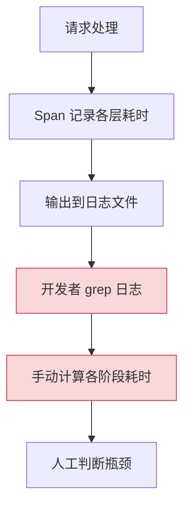
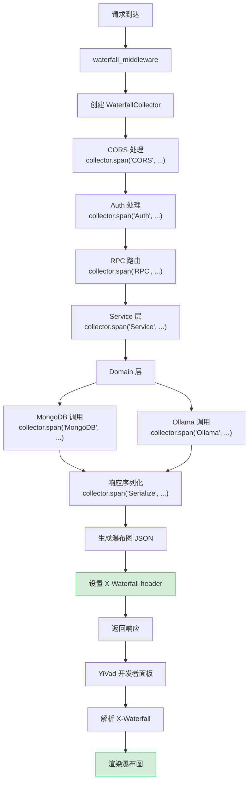

# YA-09-123: 请求响应时间线可视化 — 瀑布图展示各阶段耗时分解

> 需求编号：YA-09-123 · 优先级：P2 · 人天：0.5d · 状态：需求已编写
> 依赖：YA-09-29（分布式链路追踪）

## 背景

YA-09-29 为 YiAi 实现了分布式链路追踪（Span），记录了请求在各层的耗时。但当前的 Span 数据存在以下问题：

1. **无可视化**：Span 数据以 JSON 格式存在日志/追踪系统中，需要人工解析才能理解时序关系
2. **无实时反馈**：开发者调试性能问题时，需要到 Grafana/Jaeger 查看，无即时反馈
3. **无层级关系**：Span 的父子关系难以从文本日志中直观理解
4. **无瀑布图**：无法像 Chrome DevTools Network 面板那样直观展示各阶段的时间线

瀑布图（Waterfall Chart）是性能分析的黄金标准可视化方式——它按时间顺序排列各阶段，用水平条长度表示耗时，直观展示瓶颈所在。

YiAi 的典型请求路径包含多个阶段：CORS -> Auth -> RPC Router -> Service -> Domain -> MongoDB/Ollama -> Response。按 Span 命名：CORS、Auth、RPC、Service、Domain、MongoDB、Ollama、Serialize

### 核心挑战

| 挑战 | 描述 | 影响 |
|------|------|------|
| 层级跨度追踪 | 请求跨越中间件/Service/Domain/外部调用 | Span 嵌套关系复杂 |
| 并发调用识别 | MongoDB 和 Ollama 可能并发调用 | 瀑布图需展示重叠 |
| 数据体积 | 大量 Span 数据可能使响应 header 过大 | 需限长 |
| 前端渲染 | YiVad 需要渲染瀑布图 | 跨项目改造 |

### 设计目标

- 每个请求响应携带 `X-Waterfall` header，包含各阶段耗时数据
- 前端（YiVad）开发者工具面板渲染瀑布图
- 支持层级嵌套（父 Span 包含子 Span）
- 数据量限制（最多 50 个 Span，总 JSON < 4KB）

---

## 一、现状分析

### 1.1 当前 Span 数据使用方式



### 1.2 根因矩阵

| 根因 | 现象 | 严重程度 |
|------|------|----------|
| 无可视化 | Span 数据难以理解 | 高 |
| 无实时反馈 | 调试需切换到外部工具 | 中 |
| 无层级展示 | 父子 Span 关系不直观 | 中 |
| 无标准格式 | Span 格式不统一 | 低 |

---

## 二、设计决策

### 决策 1：数据格式 — 自定义 JSON vs Chrome Trace Format vs 自定义二进制

| 选项 | 兼容性 | 体积 | 前端渲染 |
|------|--------|------|----------|
| **自定义 JSON（轻量）** | 高 | 小 | 需自建渲染 |
| Chrome Trace Format | 高（chrome://tracing） | 大 | 浏览器原生支持 |
| 自定义二进制 | 低 | 最小 | 需自建解析+渲染 |

**选择：自定义 JSON（轻量）。** Chrome Trace Format 字段多、体积大（每个 Span ~500B），不适合放在 HTTP header 中。自定义格式仅保留必要字段（name/start/duration/children），体积精简。

### 决策 2：数据载体 — Response Header vs Response Body vs 独立端点

| 选项 | 实时性 | 影响响应 | 实现复杂度 |
|------|--------|----------|-----------|
| **Response Header（X-Waterfall）** | 高 | 无 | 低 |
| Response Body（嵌入） | 高 | 有（改变响应结构） | 中 |
| 独立端点（/debug/waterfall/:trace_id） | 低 | 无 | 高 |

**选择：Response Header。** 不改变响应体结构，对现有 API 零影响。前端开发者工具可选择性解析。限制 JSON 大小 < 4KB 确保 header 不过大。

### 决策 3：Span 层级表示 — 扁平列表 vs 嵌套树 vs 缩进标记

| 选项 | 前端渲染难度 | 数据紧凑性 | 层级表达 |
|------|------------|-----------|----------|
| 扁平列表（parent_id 引用） | 中 | 高 | 需重建 |
| **嵌套树（children 数组）** | 低 | 中 | 天然嵌套 |
| 缩进标记（depth + flat） | 中 | 高 | 需重建 |

**选择：嵌套树。** 天然表达 Span 的父子关系，前端渲染最简单（递归渲染）。体积略大于扁平列表，但可接受。

### 设计决策记录

| 决策 | 选项 A | 选项 B | 选项 C | 选择 | 理由 |
|------|--------|--------|--------|------|------|
| 数据格式 | 自定义 JSON | Chrome Trace | 二进制 | **自定义 JSON** | 轻量精简 |
| 数据载体 | Header | Body | 独立端点 | **Header** | 零侵入 |
| Span 层级 | 扁平 | 嵌套树 | 缩进 | **嵌套树** | 天然表达层级 |

---

## 三、目标架构

### 3.1 数据流



### 3.2 核心组件

```python
# YiAi/src/shared/waterfall.py
import time
import json
from contextlib import contextmanager
from dataclasses import dataclass, field
from typing import Optional

@dataclass
class WaterfallSpan:
    """瀑布图 Span 数据。"""
    name: str
    start_ms: float     # 相对请求开始时间的偏移（毫秒）
    duration_ms: float  # 耗时（毫秒）
    children: list['WaterfallSpan'] = field(default_factory=list)
    metadata: dict = field(default_factory=dict)

class WaterfallCollector:
    """请求瀑布图数据收集器。
    
    在请求处理过程中收集各阶段的耗时数据，
    生成嵌套的 Span 树结构。
    
    使用方式：
        collector = WaterfallCollector()
        with collector.span('CORS'):
            # CORS 处理
            ...
        with collector.span('RPC'):
            with collector.span('MongoDB'):
                # MongoDB 查询
                ...
    """
    
    MAX_SPANS = 50          # 最多 50 个 Span
    MAX_JSON_SIZE = 4096    # JSON 最大 4KB
    
    def __init__(self):
        self._t0 = time.monotonic()
        self._root = WaterfallSpan(name='Request', start_ms=0, duration_ms=0)
        self._stack: list[WaterfallSpan] = [self._root]
        self._span_count = 0
    
    @contextmanager
    def span(self, name: str, **metadata):
        """创建一个计时 Span。
        
        Usage:
            with collector.span('MongoDB', collection='projects'):
                result = await db.find(...)
        """
        if self._span_count >= self.MAX_SPANS:
            yield
            return
        
        start_ms = (time.monotonic() - self._t0) * 1000
        
        span = WaterfallSpan(
            name=name,
            start_ms=start_ms,
            duration_ms=0,
            metadata=metadata,
        )
        
        # 添加到当前父 Span
        parent = self._stack[-1]
        parent.children.append(span)
        
        self._span_count += 1
        self._stack.append(span)
        
        try:
            yield
        finally:
            span.duration_ms = (time.monotonic() - self._t0) * 1000 - start_ms
            self._stack.pop()
    
    def to_json(self) -> str:
        """导出为瀑布图 JSON 字符串。"""
        self._root.duration_ms = (time.monotonic() - self._t0) * 1000
        data = self._to_dict(self._root)
        json_str = json.dumps(data, ensure_ascii=False)
        
        # 大小限制
        if len(json_str) > self.MAX_JSON_SIZE:
            return json.dumps({
                'error': f'waterfall data too large ({len(json_str)} bytes)',
                'total_spans': self._span_count,
                'total_duration_ms': self._root.duration_ms,
            })
        
        return json_str
    
    def _to_dict(self, span: WaterfallSpan) -> dict:
        """递归转换为字典（精简格式）。"""
        result = {
            'n': span.name,          # name
            's': round(span.start_ms, 2),   # start
            'd': round(span.duration_ms, 2),  # duration
        }
        if span.children:
            result['c'] = [self._to_dict(c) for c in span.children]
        if span.metadata:
            result['m'] = span.metadata
        return result


# 请求上下文中间件
from contextvars import ContextVar

current_waterfall: ContextVar[Optional[WaterfallCollector]] = ContextVar(
    'waterfall', default=None
)

def get_waterfall() -> Optional[WaterfallCollector]:
    """获取当前请求的瀑布图收集器。"""
    return current_waterfall.get()


# FastAPI 中间件
@app.middleware("http")
async def waterfall_middleware(request: Request, call_next):
    """瀑布图中间件——收集各阶段耗时。"""
    collector = WaterfallCollector()
    token = current_waterfall.set(collector)
    
    # CORS
    with collector.span('CORS'):
        pass  # CORS 由 Starlette 自动处理
    
    # Auth
    with collector.span('Auth'):
        pass
    
    # 主处理
    with collector.span('Handler'):
        response = await call_next(request)
    
    # 序列化 + 响应
    with collector.span('Serialize'):
        pass
    
    current_waterfall.reset(token)
    
    # 添加瀑布图 header（仅开发/调试模式）
    if request.headers.get('X-Debug') == 'true':
        waterfall_json = collector.to_json()
        if len(waterfall_json) < 4000:
            response.headers['X-Waterfall'] = waterfall_json
    
    return response
```

### 3.3 瀑布图输出示例

```json
{
  "n": "Request",
  "s": 0,
  "d": 125.5,
  "c": [
    {"n": "CORS", "s": 0.1, "d": 0.3},
    {"n": "Auth", "s": 0.5, "d": 2.1},
    {"n": "Handler", "s": 2.8, "d": 120.0, "c": [
      {"n": "RPC Router", "s": 3.0, "d": 0.5},
      {"n": "Service", "s": 3.6, "d": 118.5, "c": [
        {"n": "MongoDB", "s": 4.0, "d": 45.2, "m": {"cname": "projects"}},
        {"n": "Ollama", "s": 49.5, "d": 72.0, "m": {"model": "qwen2.5"}}
      ]}
    ]},
    {"n": "Serialize", "s": 123.0, "d": 2.3}
  ]
}
```

**文本渲染：**
```
CORS         ▏ 0.3ms
Auth         ▏  2.1ms
Handler      ▏   120.0ms
  RPC Router ▏   0.5ms
  Service    ▏    118.5ms
    MongoDB  ▏    45.2ms
    Ollama   ▏              72.0ms
Serialize    ▏                                                    2.3ms
```

### 3.4 架构决策权衡

| 维度 | 改造前 | 改造后 | 权衡说明 |
|------|--------|--------|----------|
| 性能可见性 | 日志 grep | Header 瀑布图 | 响应 header 增加几百字节 |
| 瓶颈定位 | 人工估算 | 可视化精确到 ms | 增加 Span 收集开销 |
| 前端集成 | 无 | 开发者工具面板 | 跨项目 YiVad 改造 |

---

## 四、具体改动

### 4.1 新增文件

| 文件 | 说明 |
|------|------|
| `YiAi/src/shared/waterfall.py` | 瀑布图收集器 + Span 数据结构 |
| `YiAi/tests/shared/test_waterfall.py` | 瀑布图单元测试 |

### 4.2 修改文件

| 文件 | 改动 |
|------|------|
| `YiAi/src/app.py` | 注册 waterfall_middleware |
| `YiAi/src/server/rpc_router.py` | 在 Service 层嵌入 Span 收集 |
| `YiVad/src/components/debug/WaterfallPanel.vue` | 前端瀑布图渲染组件 |

### 4.3 涉及文件清单

```
YiAi/src/shared/
└── waterfall.py                       # 新增: 瀑布图收集器

YiAi/src/
├── app.py                             # 修改: 注册中间件
└── server/
    └── rpc_router.py                  # 修改: Service 层 Span 收集

YiAi/tests/shared/
└── test_waterfall.py                  # 新增: 单元测试

YiVad/src/components/debug/
└── WaterfallPanel.vue                 # 新增: 前端渲染组件
```

---

## 五、实施步骤

| 步骤 | 内容 | 涉及文件 | 验证方式 | 人天 |
|------|------|---------|---------|------|
| 1 | 实现 `WaterfallSpan` 数据结构 + `WaterfallCollector` | `waterfall.py` | 单元测试：Span 嵌套和计时准确 | 0.1 |
| 2 | 实现 `waterfall_middleware` 中间件 | `waterfall.py` | 集成测试：X-Waterfall header 内容正确 | 0.1 |
| 3 | 在 Service/Domain 层嵌入 Span 收集 | `rpc_router.py` + services | 请求验证瀑布图包含各层耗时 | 0.1 |
| 4 | 实现前端 WaterfallPanel 组件 | YiVad `WaterfallPanel.vue` | 前端渲染瀑布图 | 0.15 |
| 5 | 编写单元测试 | `test_waterfall.py` | `pytest` 全部通过 | 0.05 |

**总计：0.5d**

---

## 六、性能分析

### 6.1 Span 收集开销

| 操作 | 耗时 | 说明 |
|------|------|------|
| `collector.span()` 创建 | < 0.01ms | 对象创建 + 时间戳 |
| 嵌套 Span 追加 | < 0.001ms | 列表 append |
| JSON 序列化 | < 0.1ms | 50 个 Span 序列化 |
| 中间件总开销 | < 0.2ms | 对请求处理无显著影响 |

### 6.2 Header 大小

| Span 数量 | JSON 大小 | 说明 |
|----------|----------|------|
| 5 个 Span | ~200B | 简单请求 |
| 20 个 Span | ~800B | 典型 RAG 请求 |
| 50 个 Span | ~2KB | 复杂 Agent 请求 |

---

## 七、测试规格

### Requirement: Span 收集

#### Scenario: 嵌套 Span 准确计时
- **Given** 创建一个 WaterfallCollector
- **When** 在 with 块中 sleep 50ms
- **Then** Span 的 duration_ms ≈ 50ms

#### Scenario: 父子 Span 层级正确
- **Given** 父 Span 内创建 2 个子 Span
- **When** 序列化为 JSON
- **Then** 子 Span 嵌套在父 Span 的 children 中

#### Scenario: Span 数量限制
- **Given** MAX_SPANS = 50
- **When** 创建 60 个 Span
- **Then** 仅前 50 个被记录，第 51+ 个跳过但不抛异常

### Requirement: 瀑布图输出

#### Scenario: JSON 格式正确
- **Given** 收集了 3 个 Span
- **When** `to_json()` 调用
- **Then** 返回有效 JSON，包含 name/start/duration 字段

#### Scenario: 超大瀑布图截断
- **Given** Span 数据序列化后 > 4KB
- **When** `to_json()` 调用
- **Then** 返回截断 JSON 包含 error 和 total_spans

### Requirement: 中间件集成

#### Scenario: Debug 模式输出
- **Given** 请求携带 X-Debug: true
- **When** 请求处理完成
- **Then** 响应包含 X-Waterfall header

#### Scenario: 非 Debug 模式不输出
- **Given** 请求不携带 X-Debug header
- **When** 请求处理完成
- **Then** 响应不包含 X-Waterfall header

---

## 八、风险与缓解

| 风险 | 概率 | 影响 | 等级 | 缓解措施 | 应急预案 |
|------|------|------|------|----------|----------|
| Waterfall header 过大 | 低 | 低 | 低 | 4KB 限制 + 50 Span 限制 | 关闭 waterfall |
| Span 收集影响性能 | 低 | 低 | 低 | 仅 X-Debug 模式启用 | 关闭中间件 |
| 前端渲染性能 | 低 | 低 | 低 | 虚拟滚动（50+ Span 时） | 截断显示 |

---

## 九、回滚策略

| 回滚场景 | 回滚方式 | 影响范围 | 恢复时间 |
|----------|----------|----------|----------|
| Waterfall 影响性能 | 关闭中间件 | 调试功能 | 2min |
| JSON 格式错误 | 修复序列化逻辑 | 前端渲染 | 5min |
| Header 过大导致请求失败 | 减小 MAX_SPANS 或关闭 | 请求处理 | 2min |

---

## 十、设计决策记录

### D-01: 为什么使用精简字段名（n/s/d/c）？

瀑布图数据放在 HTTP header 中，体积敏感。精简字段名将 5 个 Span 的 JSON 从 ~350B 缩减到 ~200B。前端渲染时映射回完整字段名（n->name, s->start, d->duration, c->children, m->metadata）。

### D-02: 为什么仅在 X-Debug 模式下输出？

瀑布图数据是开发者工具，不需要在生产环境中每个请求都生成。仅在 X-Debug: true 模式下输出，避免生产环境的不必要开销。开发者通过浏览器扩展或 YiVad 调试面板启用此 header。

### D-03: 为什么使用 with 语句而非手动 start/end？

with 语句（`with collector.span('MongoDB'):`）自动管理 Span 的起止时间，即使 with 块中抛异常也能正确记录耗时。手动 start/end 容易遗漏 end 调用（如异常路径），导致 Span 嵌套错误。

---

## 十一、可观测性

### 11.1 指标（开发者工具——非生产）

| 指标 | 采集方式 | 说明 |
|------|----------|------|
| `waterfall_span_count` | `to_json()` 时 | Span 总数 |
| `waterfall_json_size` | `to_json()` 时 | JSON 大小（字节） |
| `waterfall_collection_overhead_ms` | 中间件计时 | 收集开销 |

---

## 十二、代码审查检查清单

- [ ] 每个请求响应携带 X-Waterfall header（开发模式）
- [ ] Span 数据结构支持嵌套（children 数组）
- [ ] 精简字段名（n/s/d/c/m）减小 header 体积
- [ ] 最多 50 个 Span，JSON 限制 4KB
- [ ] 仅 X-Debug: true 模式启用——生产环境零开销
- [ ] with 语句自动计时——异常安全
- [ ] 前端 WaterfallPanel 组件正确渲染嵌套树
- [ ] 并发 Span 正确展示重叠时间段

---

## 十三、回归问题预测

| # | 预测问题 | 原因 | 验证方法 |
|---|---------|------|---------|
| 1 | Span 嵌套层级过深 | 递归调用导致栈溢出 | 限制最大嵌套深度 |
| 2 | JSON 序列化异常 | 非 ASCII 字符 | 设置 ensure_ascii=False |
| 3 | Header 被代理截断 | Nginx 默认 header 大小限制 | 控制 JSON 在 4KB 内 |
| 4 | 前端渲染性能差 | 大量 DOM 节点 | 虚拟滚动或截断显示 |

---

*PRD 来源: `projects/yiai/requirements/2026-09/123-需求-响应时间线瀑布图.md`*

## 影响范围

- **影响模块**：待补充
- **涉及文件**：
- `test_waterfall.py`
- `rpc_router.py`
- `waterfall.py`
- **是否影响 API 契约**：否
- **是否影响其他项目（YiVad/YiPet）**：否
- **用户感知**：待确认

## 预防措施

| 层面 | 措施 |
|------|------|
| 代码 | 在相关函数中添加参数校验和边界检查 |
| 测试 | 为 `test_waterfall.py` 添加单元测试 |
| 流程 | 代码审查时重点检查此类模式 |
| 监控 | 添加日志告警，异常发生时及时发现 |
| 文档 | 在编码规范中记录此类反模式 |

## 经验教训

1. **根本原因**：开发过程中对边界情况和异常路径的考虑不足是此类问题的共同根因
2. **设计阶段**：在接口设计和模块实现时，应主动考虑异常输入、空值、超时等边界场景
3. **代码审查**：审查时应检查是否存在类似的反模式（如未捕获异常、无超时控制、缺少参数校验等）
4. **测试覆盖**：异常路径的测试覆盖率应与正常路径同等重视
5. **团队分享**：此类问题应在团队周会或技术分享中讨论，形成团队共识
