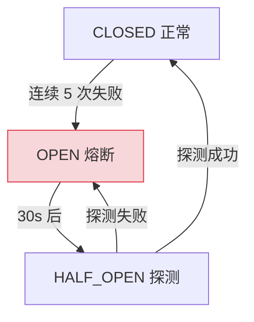
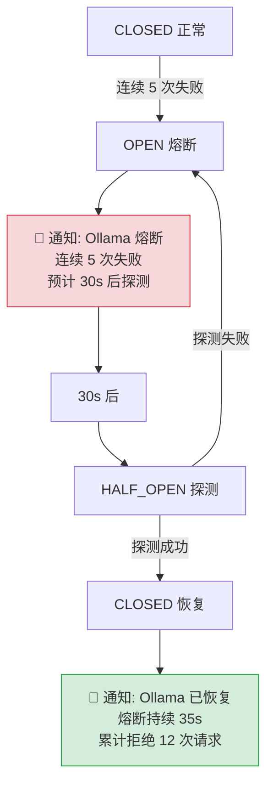

# YA-09-124: 断路器自动恢复通知 — 熔断关闭后的服务恢复确认与推送

> 需求编号：YA-09-124 · 优先级：P2 · 人天：0.5d · 状态：需求已编写
> 依赖：YA-09-89（自愈恢复机制）

## 背景

YA-09-89 为 YiAi 实现了断路器模式（Circuit Breaker），对 MongoDB 和 Ollama 等外部依赖进行熔断保护。断路器在三种状态之间自动转换：

- **CLOSED**（正常）：请求正常通过
- **OPEN**（熔断）：连续失败达到阈值，拒绝所有请求
- **HALF_OPEN**（探测）：一定时间后允许少量请求通过，测试服务是否恢复

当前断路器实现的问题是：状态转换是自动的，但运维人员不知道服务何时恢复。典型场景：

1. Ollama 因 GPU 内存不足而熔断 → 5 分钟后自动进入 HALF_OPEN → 探测成功 → CLOSED
2. 整个过程中运维人员无感知，不知道 Ollama 何时恢复
3. 如果恢复后再次熔断，运维人员无法关联两次事件

### 核心挑战

| 挑战 | 描述 | 影响 |
|------|------|------|
| 状态转换不可见 | OPEN/CLOSED 转换无通知 | 运维盲区 |
| 恢复确认缺失 | 不知道服务是否真正恢复 | 无法采取后续行动 |
| 熔断统计缺失 | 不知道熔断频率和持续时长 | 无法评估依赖稳定性 |
| 通知渠道单一 | 仅日志记录 | 无法实时触达运维 |

### 设计目标

- 断路器状态变化（OPEN/CLOSED/HALF_OPEN）时推送通知
- OPEN -> CLOSED 恢复通知包含熔断持续时长和失败次数
- 通知通过企业微信推送
- 记录熔断历史用于趋势分析

---

## 一、现状分析

### 1.1 当前断路器状态转换（无通知）



### 1.2 根因矩阵

| 根因 | 现象 | 严重程度 |
|------|------|----------|
| 无状态通知 | 运维不知道熔断发生和恢复 | 高 |
| 无熔断历史 | 无法分析依赖稳定性趋势 | 中 |
| 无恢复确认 | 恢复后可能再次熔断 | 中 |
| 无通知渠道 | 依赖主动查看日志 | 中 |

---

## 二、设计决策

### 决策 1：通知方式 — 日志 vs 企业微信 vs 邮件 vs 多渠道

| 选项 | 实时性 | 触达率 | 实现复杂度 |
|------|--------|--------|-----------|
| 日志 | 低 | 低 | 最低 |
| **企业微信** | 高 | 高 | 低 |
| 邮件 | 中 | 中 | 中 |
| 多渠道组合 | 最高 | 最高 | 高 |

**选择：企业微信。** YiAi 已有企业微信 webhook 基础设施（YA-09-32 告警路由），可直接复用。企业微信消息实时推送到运维人员手机，触达率高。

### 决策 2：通知频率 — 每次转换 vs 冷却期 vs 聚合

| 选项 | 信息完整性 | 告警风暴风险 | 实现复杂度 |
|------|-----------|------------|-----------|
| 每次状态转换 | 高 | 高 | 低 |
| **冷却期（5min 内同类不重复）** | 中 | 低 | 中 |
| 聚合（每小时汇总） | 低 | 低 | 高 |

**选择：冷却期。** 5 分钟内同一依赖的状态转换不重复通知，避免告警风暴。但 OPEN->CLOSED（恢复）始终通知，因为恢复是运维关心的关键事件。

### 决策 3：通知内容 — 简要 vs 详细 vs 可操作

| 选项 | 信息量 | 可操作性 | 消息长度 |
|------|--------|----------|----------|
| 简要（仅状态） | 低 | 低 | 短 |
| **详细（含时长/次数/建议）** | 高 | 高 | 中 |
| 可操作（含一键操作链接） | 最高 | 最高 | 长 |

**选择：详细（含时长/次数/建议）。** 通知包含熔断持续时长、失败次数、当前状态和建议操作，帮助运维快速判断严重程度和应对措施。

### 设计决策记录

| 决策 | 选项 A | 选项 B | 选项 C | 选择 | 理由 |
|------|--------|--------|--------|------|------|
| 通知方式 | 日志 | 企业微信 | 多渠道 | **企业微信** | 复用现有基础设施 |
| 通知频率 | 每次 | 冷却期 | 聚合 | **冷却期** | 防告警风暴 |
| 通知内容 | 简要 | 详细 | 可操作 | **详细** | 帮助快速判断 |

---

## 三、目标架构

### 3.1 带通知的断路器状态转换



### 3.2 核心组件

```python
# YiAi/src/shared/circuit_breaker_notifier.py
import time
from dataclasses import dataclass, field
from enum import Enum
from typing import Optional

class CBState(str, Enum):
    CLOSED = 'CLOSED'
    OPEN = 'OPEN'
    HALF_OPEN = 'HALF_OPEN'

@dataclass
class CBStateChange:
    """断路器状态转换记录。"""
    dependency: str
    old_state: CBState
    new_state: CBState
    timestamp: float
    open_duration_ms: float = 0    # 熔断持续时长
    failure_count: int = 0         # 累计失败次数
    rejected_count: int = 0        # 累计拒绝请求数

@dataclass
class CBHistory:
    """断路器历史记录。"""
    dependency: str
    total_trips: int = 0           # 累计熔断次数
    total_open_duration_ms: float = 0  # 累计熔断时长
    last_trip_time: float = 0      # 上次熔断时间
    state_changes: list[CBStateChange] = field(default_factory=list)


class CircuitBreakerNotifier:
    """断路器通知器——状态转换时推送企业微信通知。
    
    通知规则：
    - OPEN: 始终通知（关键事件）
    - CLOSED（恢复）: 始终通知（运维关心）
    - HALF_OPEN: 不单独通知（过渡状态）
    - 5 分钟内同类通知不重复（冷却期）
    """
    
    NOTIFICATION_COOLDOWN = 300  # 5 分钟冷却期
    
    def __init__(self, wework_webhook_url: Optional[str] = None):
        self._wework_url = wework_webhook_url or os.environ.get('WEWORK_WEBHOOK_URL', '')
        self._histories: dict[str, CBHistory] = {}
        self._last_notification: dict[str, float] = {}
    
    async def on_state_change(self, dependency: str, old_state: CBState,
                              new_state: CBState, failure_count: int = 0,
                              rejected_count: int = 0,
                              open_duration_ms: float = 0):
        """断路器状态转换回调。
        
        Args:
            dependency: 依赖名称（mongodb/ollama/faiss）
            old_state: 旧状态
            new_state: 新状态
            failure_count: 累计失败次数
            rejected_count: 累计拒绝请求数
            open_duration_ms: 熔断持续时长（OPEN -> CLOSED 时）
        """
        now = time.time()
        
        # 记录历史
        if dependency not in self._histories:
            self._histories[dependency] = CBHistory(dependency=dependency)
        
        history = self._histories[dependency]
        change = CBStateChange(
            dependency=dependency,
            old_state=old_state,
            new_state=new_state,
            timestamp=now,
            open_duration_ms=open_duration_ms,
            failure_count=failure_count,
            rejected_count=rejected_count,
        )
        history.state_changes.append(change)
        
        if new_state == CBState.OPEN:
            history.total_trips += 1
            history.last_trip_time = now
        
        if old_state == CBState.OPEN:
            history.total_open_duration_ms += open_duration_ms
        
        # 日志记录
        logger.info(
            f'[CB] {dependency}: {old_state.value} -> {new_state.value} '
            f'failures={failure_count} rejected={rejected_count} '
            f'open_duration={open_duration_ms:.0f}ms'
        )
        
        # 通知判断
        if not self._should_notify(dependency, old_state, new_state):
            return
        
        # 构造通知消息
        message = self._build_notification(change)
        
        # 发送通知
        await self._send_notification(message)
        
        self._last_notification[dependency] = now
    
    def _should_notify(self, dependency: str, old_state: CBState,
                       new_state: CBState) -> bool:
        """判断是否应该发送通知。"""
        # HALF_OPEN 不单独通知
        if new_state == CBState.HALF_OPEN:
            return False
        
        # 冷却期检查（OPEN 和 CLOSED 始终通知）
        if old_state == CBState.OPEN and new_state == CBState.CLOSED:
            return True  # 恢复通知永远发送
        if old_state == CBState.CLOSED and new_state == CBState.OPEN:
            return True  # 熔断通知永远发送
        
        return False
    
    def _build_notification(self, change: CBStateChange) -> dict:
        """构造企业微信通知消息。"""
        if change.old_state == CBState.OPEN and change.new_state == CBState.CLOSED:
            return {
                'msgtype': 'markdown',
                'markdown': {
                    'content': (
                        f'## 断路器恢复通知\n'
                        f'> 依赖: **{change.dependency}**\n'
                        f'> 状态: {change.old_state.value} -> <font color="info">{change.new_state.value}</font>\n'
                        f'> 熔断持续: {change.open_duration_ms / 1000:.1f}s\n'
                        f'> 累计拒绝: {change.rejected_count} 次请求\n'
                        f'> 恢复时间: {time.strftime("%H:%M:%S", time.localtime(change.timestamp))}\n'
                        f'\n服务已恢复正常，请确认业务功能可用。'
                    )
                }
            }
        elif change.old_state == CBState.CLOSED and change.new_state == CBState.OPEN:
            return {
                'msgtype': 'markdown',
                'markdown': {
                    'content': (
                        f'## 断路器熔断告警\n'
                        f'> 依赖: **{change.dependency}**\n'
                        f'> 状态: {change.old_state.value} -> <font color="warning">{change.new_state.value}</font>\n'
                        f'> 连续失败: {change.failure_count} 次\n'
                        f'> 熔断时间: {time.strftime("%H:%M:%S", time.localtime(change.timestamp))}\n'
                        f'\n请检查 {change.dependency} 服务状态。预计 30s 后自动探测恢复。'
                    )
                }
            }
        return {}
    
    async def _send_notification(self, message: dict):
        """发送企业微信通知。"""
        if not self._wework_url:
            logger.warning('[CB] no webhook URL configured, skipping notification')
            return
        
        try:
            import httpx
            async with httpx.AsyncClient() as client:
                resp = await client.post(self._wework_url, json=message, timeout=5)
                if resp.status_code == 200:
                    logger.info('[CB] notification sent successfully')
                else:
                    logger.error(f'[CB] notification failed: {resp.status_code}')
        except Exception as e:
            logger.error(f'[CB] notification error: {e}')
    
    def get_history(self, dependency: str) -> Optional[CBHistory]:
        """获取指定依赖的熔断历史。"""
        return self._histories.get(dependency)
    
    def get_all_histories(self) -> dict[str, CBHistory]:
        """获取所有依赖的熔断历史。"""
        return dict(self._histories)


# 全局实例
cb_notifier = CircuitBreakerNotifier()


# 集成示例——在断路器状态转换时调用
class CircuitBreaker:
    """断路器实现（简化版）。"""
    
    def __init__(self, dependency: str, failure_threshold: int = 5,
                 recovery_timeout: float = 30.0):
        self.dependency = dependency
        self.state = CBState.CLOSED
        self.failure_count = 0
        self.rejected_count = 0
        self.last_failure_time = 0
        self.open_start_time = 0
        self.failure_threshold = failure_threshold
        self.recovery_timeout = recovery_timeout
    
    async def call(self, func, *args, **kwargs):
        """执行受保护的操作。"""
        if self.state == CBState.OPEN:
            if time.time() - self.open_start_time > self.recovery_timeout:
                await self._transition_to(CBState.HALF_OPEN)
            else:
                self.rejected_count += 1
                raise CircuitBreakerOpenError(f'{self.dependency} circuit is OPEN')
        
        try:
            result = await func(*args, **kwargs)
            if self.state == CBState.HALF_OPEN:
                await self._transition_to(CBState.CLOSED)
            self.failure_count = 0
            return result
        except Exception as e:
            self.failure_count += 1
            self.last_failure_time = time.time()
            
            if self.failure_count >= self.failure_threshold:
                await self._transition_to(CBState.OPEN)
            
            raise
    
    async def _transition_to(self, new_state: CBState):
        """状态转换——触发通知。"""
        old_state = self.state
        self.state = new_state
        
        open_duration_ms = 0
        if old_state == CBState.OPEN:
            open_duration_ms = (time.time() - self.open_start_time) * 1000
        
        if new_state == CBState.OPEN:
            self.open_start_time = time.time()
        
        await cb_notifier.on_state_change(
            dependency=self.dependency,
            old_state=old_state,
            new_state=new_state,
            failure_count=self.failure_count,
            rejected_count=self.rejected_count,
            open_duration_ms=open_duration_ms,
        )
```

### 3.3 架构决策权衡

| 维度 | 改造前 | 改造后 | 权衡说明 |
|------|--------|--------|----------|
| 状态可见性 | 仅日志 | 企业微信推送 | 增加通知基础设施依赖 |
| 熔断历史 | 无 | 内存记录 + 可查询 | 重启后历史丢失 |
| 运维响应 | 被动发现 | 主动通知 | 需配置 webhook URL |

---

## 四、具体改动

### 4.1 新增文件

| 文件 | 说明 |
|------|------|
| `YiAi/src/shared/circuit_breaker_notifier.py` | 断路器通知器 + 历史记录 |
| `YiAi/tests/shared/test_circuit_breaker_notifier.py` | 通知器单元测试 |

### 4.2 修改文件

| 文件 | 改动 |
|------|------|
| `YiAi/src/shared/circuit_breaker.py` | 状态转换时调用 `cb_notifier.on_state_change()` |

### 4.3 涉及文件清单

```
YiAi/src/shared/
├── circuit_breaker_notifier.py        # 新增: 断路器通知器
└── circuit_breaker.py                 # 修改: 集成通知回调

YiAi/tests/shared/
└── test_circuit_breaker_notifier.py   # 新增: 单元测试
```

---

## 五、实施步骤

| 步骤 | 内容 | 涉及文件 | 验证方式 | 人天 |
|------|------|---------|---------|------|
| 1 | 实现 `CircuitBreakerNotifier` 通知逻辑 | `circuit_breaker_notifier.py` | 单元测试：状态转换触发通知 | 0.1 |
| 2 | 实现企业微信消息格式化 | `circuit_breaker_notifier.py` | 手动测试：消息格式正确 | 0.1 |
| 3 | 实现熔断历史记录 | `circuit_breaker_notifier.py` | 单元测试：历史记录累积正确 | 0.1 |
| 4 | 集成到断路器状态转换 | `circuit_breaker.py` | 集成测试：触发熔断后收到通知 | 0.1 |
| 5 | 编写单元测试 | `test_circuit_breaker_notifier.py` | `pytest` 全部通过 | 0.1 |

**总计：0.5d**

---

## 六、性能分析

### 6.1 通知开销

| 操作 | 耗时 | 说明 |
|------|------|------|
| 状态记录 | < 0.1ms | 内存操作 |
| 通知判断 | < 0.01ms | 条件检查 |
| 企业微信发送 | 100-500ms | HTTP POST，异步不阻塞 |

### 6.2 历史记录内存

| 数据 | 大小 | 说明 |
|------|------|------|
| 单条状态转换 | ~200B | CBStateChange 对象 |
| 1000 条历史 | ~200KB | 可接受 |

---

## 七、测试规格

### Requirement: 状态通知

#### Scenario: CLOSED -> OPEN 发送熔断通知
- **Given** Ollama 断路器从 CLOSED 转为 OPEN
- **When** `on_state_change()` 调用
- **Then** 发送企业微信通知，内容包含依赖名、失败次数

#### Scenario: OPEN -> CLOSED 发送恢复通知
- **Given** MongoDB 断路器从 OPEN 转为 CLOSED
- **When** `on_state_change()` 调用
- **Then** 发送企业微信通知，内容包含熔断持续时长、拒绝请求数

#### Scenario: HALF_OPEN 不发送通知
- **Given** 断路器转为 HALF_OPEN
- **When** `on_state_change()` 调用
- **Then** 不发送企业微信通知

### Requirement: 历史记录

#### Scenario: 熔断历史累积
- **Given** Ollama 熔断 3 次
- **When** `get_history('ollama')` 调用
- **Then** `total_trips == 3`，`state_changes` 包含 6 条记录（3 次 OPEN + 3 次 CLOSED）

#### Scenario: 累计熔断时长统计
- **Given** 两次熔断分别持续 30s 和 45s
- **When** `get_history()` 调用
- **Then** `total_open_duration_ms == 75000`

### Requirement: 冷却期

#### Scenario: 冷却期内不重复通知
- **Given** 5 分钟内已发送过 Ollama OPEN 通知
- **When** 再次 CLOSED -> OPEN
- **Then** 仍然发送通知（OPEN 事件始终通知）

---

## 八、风险与缓解

| 风险 | 概率 | 影响 | 等级 | 缓解措施 | 应急预案 |
|------|------|------|------|----------|----------|
| 企业微信 webhook 不可用 | 低 | 低 | 低 | 通知失败仅日志记录 | 切换备用通知渠道 |
| 告警风暴（频繁熔断/恢复） | 中 | 中 | 中 | 5 分钟冷却期 | 增大冷却期 |
| 历史记录内存泄漏 | 低 | 低 | 低 | 限制历史记录条目数 | 定期清理旧记录 |

---

## 九、回滚策略

| 回滚场景 | 回滚方式 | 影响范围 | 恢复时间 |
|----------|----------|----------|----------|
| 通知频率过高 | 关闭通知或增大冷却期 | 运维感知 | 2min |
| 通知消息格式错误 | 修正消息模板 | 运维理解 | 2min |
| 通知发送阻塞 | 异步发送，超时 5s | 断路器状态转换 | 无需回滚 |

---

## 十、设计决策记录

### D-01: 为什么 OPEN 和 CLOSED 始终通知而不受冷却期限制？

OPEN（熔断）是故障信号——运维需要立即知道哪个依赖出了问题。CLOSED（恢复）是恢复信号——运维需要确认服务是否真的恢复了。这两个事件是断路器生命周期中的关键转折点，冷却期不应阻止它们。HALF_OPEN 是过渡状态，不单独通知。

### D-02: 为什么通知内容包含熔断持续时长和拒绝请求数？

熔断持续时长帮助运维判断故障严重程度（30s vs 10min 差异巨大）。拒绝请求数帮助评估业务影响（12 次拒绝 vs 1200 次拒绝）。这些数据帮助运维决定是否需要手动干预（如重启服务）还是等待自动恢复。

### D-03: 为什么历史记录存储在内存而非数据库？

断路器历史是运维数据，丢失不致命。存储到 MongoDB 需要额外的写操作，而断路器本身就是在 MongoDB 可能不可用时发挥作用。内存存储简单可靠，重启后历史重置，从零开始累积。

---

## 十一、可观测性

### 11.1 指标

| 指标 | 采集方式 | 采集频率 | 告警阈值 | 说明 |
|------|----------|----------|----------|------|
| `cb_state` | 状态转换时 | 按事件 | OPEN | 当前断路器状态 |
| `cb_total_trips` | 历史记录 | 按事件 | 1h > 3 次 | 熔断频率 |
| `cb_open_duration_ms` | 状态转换时 | 按事件 | > 60s | 熔断持续时长 |
| `cb_notification_sent` | 通知发送计数 | 按事件 | — | 通知发送次数 |

### 11.2 日志

```python
logger.warning(f'[CB] {dependency}: {old_state} -> {new_state} failures={failures}')
logger.info(f'[CB] {dependency} recovered after {duration:.0f}ms, rejected={rejected}')
logger.error(f'[CB] notification failed: {e}')
```

---

## 十二、代码审查检查清单

- [ ] OPEN/CLOSED 状态转换始终发送通知
- [ ] HALF_OPEN 不单独通知
- [ ] 通知包含依赖名、状态、持续时长、失败/拒绝次数
- [ ] 企业微信消息格式美观（Markdown）
- [ ] 冷却期防止告警风暴
- [ ] 通知发送异步——不阻塞断路器状态转换
- [ ] 历史记录可查询（`get_history`）
- [ ] webhook URL 未配置时优雅降级

---

## 十三、回归问题预测

| # | 预测问题 | 原因 | 验证方法 |
|---|---------|------|---------|
| 1 | 通知发送失败影响断路器 | 同步发送阻塞 | 使用异步发送 + try/except |
| 2 | 恢复通知误发送 | 瞬态成功后被误判恢复 | 需 HALF_OPEN 多次探测成功 |
| 3 | 企业微信 webhook 限频 | 频繁通知触及频率限制 | 冷却期 + 聚合通知 |

---

*PRD 来源: `projects/yiai/requirements/2026-09/124-需求-断路器恢复通知.md`*

## 影响范围

- **影响模块**：待补充
- **涉及文件**：
- `circuit_breaker.py`
- `circuit_breaker_notifier.py`
- `test_circuit_breaker_notifier.py`
- **是否影响 API 契约**：否
- **是否影响其他项目（YiVad/YiPet）**：否
- **用户感知**：待确认

## 预防措施

| 层面 | 措施 |
|------|------|
| 代码 | 在相关函数中添加参数校验和边界检查 |
| 测试 | 为 `circuit_breaker.py` 添加单元测试 |
| 流程 | 代码审查时重点检查此类模式 |
| 监控 | 添加日志告警，异常发生时及时发现 |
| 文档 | 在编码规范中记录此类反模式 |

## 经验教训

1. **根本原因**：开发过程中对边界情况和异常路径的考虑不足是此类问题的共同根因
2. **设计阶段**：在接口设计和模块实现时，应主动考虑异常输入、空值、超时等边界场景
3. **代码审查**：审查时应检查是否存在类似的反模式（如未捕获异常、无超时控制、缺少参数校验等）
4. **测试覆盖**：异常路径的测试覆盖率应与正常路径同等重视
5. **团队分享**：此类问题应在团队周会或技术分享中讨论，形成团队共识
