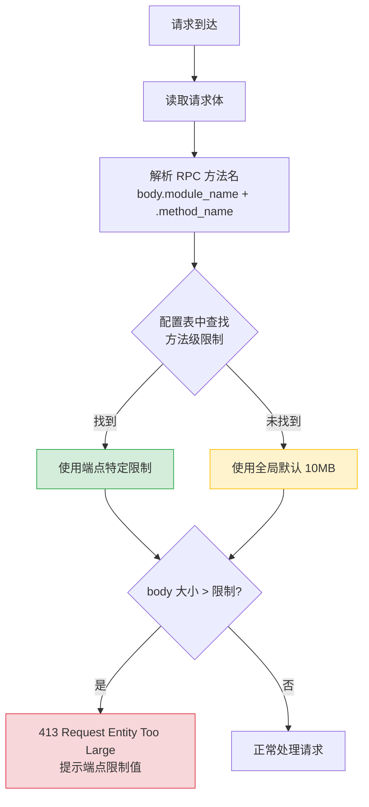

# YA-09-125: 请求大小限制按端点差异化 — 不同 API 的独立上限配置

> 需求编号：YA-09-125 · 优先级：P2 · 人天：0.5d · 状态：需求已编写
> 依赖：YA-09-46（请求体大小限制）

## 背景

YA-09-46 为 YiAi 设置了全局 10MB 的请求体大小限制。虽然这防止了大请求攻击，但"一刀切"的策略存在以下问题：

1. **Agent prompt 无保护**：`agent_service.run_agent` 的 prompt 可能被客户端发送超长内容，导致 LLM Token 超限（2002 错误），但 10MB 限制太宽松
2. **大文件上传被限制**：`knowledge.write_file` 上传大知识库文件（如整个项目的 markdown 归档），100MB+ 的文件被 10MB 限制拒绝
3. **Dashboard 查询无保护**：Dashboard 统计查询本应只需几个参数（< 1KB），10MB 限制形同虚设
4. **安全性不一致**：敏感端点（如 Agent 执行）应更严格限制，非敏感端点（如数据查询）可适当宽松

不同端点的请求体大小需求差异极大：Agent prompt（< 50KB）vs 文件上传（< 100MB）vs 数据查询（< 10KB）。

### 核心挑战

| 挑战 | 描述 | 影响 |
|------|------|------|
| 粒度控制 | 不同端点需求差异 1000 倍 | 全局限制过松或过紧 |
| 安全性 | 宽松端点可能被滥用 | DoS 风险 |
| 可用性 | 严格端点阻止合法大请求 | 功能不可用 |
| 配置管理 | 20+ 端点需维护限制值 | 运维成本 |

### 设计目标

- 每个端点（RPC 方法）有独立的大小限制
- 全局默认限制 10MB（兜底）
- Agent/LLM 端点限制在 50-100KB（防 Token 超限）
- 文件写入端点限制在 100MB（支持大文件）
- 配置通过字典维护，支持环境变量覆盖

---

## 一、现状分析

### 1.1 当前全局限制

```python
# YA-09-46 当前实现
from starlette.middleware.base import BaseHTTPMiddleware

class RequestSizeLimitMiddleware(BaseHTTPMiddleware):
    MAX_SIZE = 10 * 1024 * 1024  # 10MB 全局
    
    async def dispatch(self, request, call_next):
        body = await request.body()
        if len(body) > self.MAX_SIZE:
            return JSONResponse({'code': 4004, 'message': '请求体过大'}, status_code=413)
        return await call_next(request)
```

### 1.2 端点大小需求差异

| 端点 | 当前限制 | 实际需求 | 合理限制 | 差距 |
|------|----------|----------|----------|------|
| `chat_service.chat` | 10MB | 5-50KB | 50KB | 200x 过松 |
| `agent_service.run_agent` | 10MB | 10-100KB | 100KB | 100x 过松 |
| `data_service.query` | 10MB | 1-10KB | 10KB | 1000x 过松 |
| `data_service.create` | 10MB | 100KB-5MB | 5MB | 2x 过松 |
| `knowledge.write_file` | 10MB | 1KB-100MB | 100MB | 10x 过紧 |
| `/read-file` | 10MB | < 1KB | 10KB | — |
| Dashboard 统计 | 10MB | < 1KB | 5KB | 2000x 过松 |

### 1.3 根因矩阵

| 根因 | 现象 | 严重程度 |
|------|------|----------|
| 全局一刀切 | 部分端点过松/过紧 | 高 |
| 粒度不足 | 无法按端点差异化 | 高 |
| 无默认兜底 | 新增端点易遗漏配置 | 中 |

---

## 二、设计决策

### 决策 1：配置方式 — 硬编码字典 vs 配置文件 vs 注解/装饰器

| 选项 | 可发现性 | 修改便利性 | 实现复杂度 |
|------|----------|-----------|-----------|
| **硬编码字典** | 高（集中查看） | 中（需改代码） | 低 |
| 配置文件（YAML/JSON） | 中 | 高（热更新） | 中 |
| 装饰器注解 | 高（在函数上） | 低（需改代码） | 中 |

**选择：硬编码字典 + 环境变量覆盖。** 字典集中管理，一目了然。环境变量支持运行时覆盖（如 `LIMIT_CHAT_SERVICE=200000`），兼顾灵活性。

### 决策 2：限制粒度 — 模块级 vs 方法级 vs 路径级

| 选项 | 粒度 | 配置复杂度 | 适用场景 |
|------|------|-----------|----------|
| 模块级（如 data_service） | 粗 | 低 | 同模块内方法需求相似 |
| **方法级（如 data_service.query）** | 细 | 中 | 需求差异大 |
| 路径级（如 /write-file） | 中 | 中 | REST 端点 |

**选择：方法级。** YiAi 使用 RPC 信封（`module_name.method_name`），同一模块内不同方法的需求差异大（如 `data_service.query` 10KB vs `data_service.create` 5MB）。方法级粒度精确匹配实际需求。

### 决策 3：未配置端点处理 — 拒绝 vs 默认限制 vs 宽松限制

| 选项 | 安全性 | 可用性 | 实现复杂度 |
|------|--------|--------|-----------|
| 拒绝 | 高 | 低 | 低 |
| **默认 10MB** | 中 | 高 | 低 |
| 宽松限制 | 低 | 最高 | 低 |

**选择：默认 10MB。** 新增端点自动继承全局默认限制，避免遗漏配置导致拒绝合法请求。同时 10MB 提供了基本的安全保护。

### 设计决策记录

| 决策 | 选项 A | 选项 B | 选项 C | 选择 | 理由 |
|------|--------|--------|--------|------|------|
| 配置方式 | 硬编码字典 | 配置文件 | 装饰器 | **字典 + 环境变量** | 可发现性 + 可覆盖 |
| 限制粒度 | 模块级 | 方法级 | 路径级 | **方法级** | 精确匹配需求 |
| 未配置处理 | 拒绝 | 默认 10MB | 宽松 | **默认 10MB** | 安全兜底 |

---

## 三、目标架构

### 3.1 改造后数据流



### 3.2 核心组件

```python
# YiAi/src/server/middleware/per_endpoint_limit.py
import os
import json
from starlette.requests import Request
from starlette.responses import JSONResponse

# 按端点差异化大小限制（字节）
PER_ENDPOINT_LIMITS: dict[str, int] = {
    # Chat/Agent——LLM 端点，严格限制防止 Token 超限
    'chat_service.chat':         50_000,      # 50KB
    'chat_service.stream_chat':  50_000,      # 50KB
    'agent_service.run_agent':  100_000,      # 100KB
    'agent_service.continue':   100_000,      # 100KB
    
    # RAG——检索端点，查询文本较小
    'rag_service.rag_query':     10_000,      # 10KB
    'rag_service.rag_chat':      50_000,      # 50KB
    'rag_service.embed':         50_000,      # 50KB
    
    # Data——CRUD 端点
    'data_service.query_documents': 10_000,   # 10KB
    'data_service.get_document':    10_000,   # 10KB
    'data_service.create_document': 5_000_000,  # 5MB（批量导入）
    'data_service.update_document': 1_000_000,  # 1MB
    'data_service.delete_document': 10_000,     # 10KB
    
    # Knowledge——文件端点
    'knowledge.write_file':    100_000_000,   # 100MB
    'knowledge.read_file':          10_000,   # 10KB
    'knowledge.list_files':         10_000,   # 10KB
    'knowledge.search':             50_000,   # 50KB
    
    # Dashboard/Stats
    'dashboard.get_stats':           5_000,   # 5KB
    'dashboard.get_metrics':         5_000,   # 5KB
    
    # Auth
    'auth.login':                  10_000,    # 10KB
    'auth.refresh_token':          10_000,    # 10KB
    
    # 全局默认
    'default':                 10_000_000,    # 10MB
}

def _apply_env_overrides(limits: dict) -> dict:
    """应用环境变量覆盖——支持运行时调整限制值。
    
    环境变量格式: LIMIT_<UPPER_METHOD> = <bytes>
    例: LIMIT_DATA_SERVICE_CREATE = 10485760
    """
    for key in list(limits.keys()):
        if key == 'default':
            env_key = 'LIMIT_DEFAULT'
        else:
            env_key = 'LIMIT_' + key.replace('.', '_').upper()
        
        env_value = os.environ.get(env_key)
        if env_value:
            try:
                limits[key] = int(env_value)
                logger.info(f'[Limit] override {key} -> {limits[key]} bytes (from env)')
            except ValueError:
                logger.warning(f'[Limit] invalid env value for {env_key}: {env_value}')
    
    return limits

# 应用环境变量覆盖
PER_ENDPOINT_LIMITS = _apply_env_overrides(PER_ENDPOINT_LIMITS)


def get_endpoint_limit(request: Request) -> int:
    """根据请求获取对应的端点大小限制。
    
    Args:
        request: Starlette Request
    
    Returns:
        字节数限制
    """
    # 尝试从 RPC 信封获取方法名
    try:
        # 需要在不消费 body 的情况下读取
        # 使用 request.state 预解析的 RPC 信息
        if hasattr(request.state, 'rpc_method'):
            method = request.state.rpc_method  # 如 'data_service.query_documents'
            if method in PER_ENDPOINT_LIMITS:
                return PER_ENDPOINT_LIMITS[method]
    except Exception:
        pass
    
    return PER_ENDPOINT_LIMITS['default']


async def per_endpoint_limit_middleware(request: Request, call_next):
    """按端点差异化请求体大小限制中间件。
    
    必须在 body 被消费前执行。建议在 RPC 路由解析后执行。
    """
    # 此中间件应在 rpc_router 解析 module_name + method_name 后执行
    # 由 rpc_router 将完整方法名设置到 request.state.rpc_method
    
    limit = PER_ENDPOINT_LIMITS['default']
    
    if hasattr(request.state, 'rpc_method'):
        method = request.state.rpc_method
        limit = PER_ENDPOINT_LIMITS.get(method, PER_ENDPOINT_LIMITS['default'])
    
    # 获取 Content-Length header（快速路径，无需消费 body）
    content_length = request.headers.get('Content-Length')
    if content_length:
        size = int(content_length)
        if size > limit:
            return JSONResponse(
                status_code=413,
                content={
                    'code': 4004,
                    'message': (
                        f'请求体过大——此端点限制 {_format_size(limit)}，'
                        f'收到 {_format_size(size)}'
                    ),
                    'data': {
                        'endpoint': getattr(request.state, 'rpc_method', 'unknown'),
                        'limit_bytes': limit,
                        'received_bytes': size,
                    }
                }
            )
    
    return await call_next(request)


def _format_size(bytes_val: int) -> str:
    """格式化字节大小为可读字符串。"""
    if bytes_val < 1024:
        return f'{bytes_val}B'
    elif bytes_val < 1024 * 1024:
        return f'{bytes_val / 1024:.0f}KB'
    else:
        return f'{bytes_val / (1024 * 1024):.0f}MB'


# 在 RPC 路由中设置 request.state.rpc_method
# YiAi/src/server/rpc_router.py
async def rpc_router(request: Request):
    body = await request.json()
    module_name = body.get('module_name', '')
    method_name = body.get('method_name', '')
    
    # 设置到 request.state 供后续中间件使用
    request.state.rpc_method = f'{module_name}.{method_name}' if module_name else 'unknown'
    request.state.rpc_body = body
    
    # ... 路由分发逻辑
```

### 3.3 架构决策权衡

| 维度 | 改造前 | 改造后 | 权衡说明 |
|------|--------|--------|----------|
| 限制粒度 | 全局 10MB | 每个端点独立 | 配置字典需维护 |
| 安全性 | 部分端点过松 | 精确匹配需求 | 需审计所有端点 |
| 可用性 | 文件上传被拒绝 | 100MB 支持 | 大文件上传需充足磁盘 |

---

## 四、具体改动

### 4.1 新增文件

| 文件 | 说明 |
|------|------|
| `YiAi/src/server/middleware/per_endpoint_limit.py` | 按端点限流中间件 + 配置表 |
| `YiAi/tests/server/middleware/test_per_endpoint_limit.py` | 端点限制测试 |

### 4.2 修改文件

| 文件 | 改动 |
|------|------|
| `YiAi/src/app.py` | 注册 per_endpoint_limit 中间件 |
| `YiAi/src/server/rpc_router.py` | 设置 `request.state.rpc_method` |

### 4.3 涉及文件清单

```
YiAi/src/server/middleware/
└── per_endpoint_limit.py              # 新增: 按端点限制中间件

YiAi/src/
├── app.py                             # 修改: 注册中间件
└── server/
    └── rpc_router.py                  # 修改: 设置 rpc_method

YiAi/tests/server/middleware/
└── test_per_endpoint_limit.py         # 新增: 测试
```

---

## 五、实施步骤

| 步骤 | 内容 | 涉及文件 | 验证方式 | 人天 |
|------|------|---------|---------|------|
| 1 | 整理所有 RPC 端点的合理大小限制 | `per_endpoint_limit.py` | 审查 CLAUDE.md 中所有 RPC 方法 | 0.1 |
| 2 | 实现 `get_endpoint_limit()` + 配置表 | `per_endpoint_limit.py` | 单元测试：各端点返回正确限制 | 0.1 |
| 3 | 实现中间件（Content-Length 快速路径） | `per_endpoint_limit.py` | 集成测试：超限请求返回 413 | 0.1 |
| 4 | 修改 rpc_router 设置 `request.state.rpc_method` | `rpc_router.py` | 请求验证：request.state 包含方法名 | 0.05 |
| 5 | 注册中间件 | `app.py` | 启动后请求验证 | 0.05 |
| 6 | 编写测试 | `test_per_endpoint_limit.py` | `pytest` 全部通过 | 0.1 |

**总计：0.5d**

---

## 六、性能分析

### 6.1 中间件开销

| 操作 | 耗时 | 说明 |
|------|------|------|
| Content-Length 读取 | < 0.001ms | Header 直接读取 |
| 字典查找 | < 0.001ms | O(1) 哈希查找 |
| 大小比较 | < 0.001ms | 整数比较 |

### 6.2 限制值分布

| 限制范围 | 端点数量 | 示例 |
|----------|----------|------|
| 5KB | 2 | Dashboard 统计 |
| 10KB | 7 | 查询、列表 |
| 50KB | 4 | Chat、RAG |
| 100KB | 2 | Agent |
| 1-5MB | 3 | 批量导入、更新 |
| 100MB | 1 | 文件写入 |

---

## 七、测试规格

### Requirement: 端点差异化限制

#### Scenario: Chat 端点限制 50KB
- **Given** 请求 `chat_service.chat`，body 大小为 80KB
- **When** 中间件检查
- **Then** 返回 413，提示限制 50KB

#### Scenario: 文件写入端点限制 100MB
- **Given** 请求 `knowledge.write_file`，body 大小为 80MB
- **When** 中间件检查
- **Then** 请求正常通过

#### Scenario: 未配置端点使用默认 10MB
- **Given** 请求未知端点，body 大小为 8MB
- **When** 中间件检查
- **Then** 请求正常通过（8MB < 10MB）

### Requirement: 环境变量覆盖

#### Scenario: 环境变量覆盖默认限制
- **Given** `LIMIT_DEFAULT=5242880`（5MB）
- **When** 请求未知端点，body 大小为 6MB
- **Then** 返回 413，提示限制 5MB

### Requirement: Content-Length 快速路径

#### Scenario: 无 Content-Length header 时不提前拦截
- **Given** 请求无 Content-Length header
- **When** 中间件检查
- **Then** 继续处理（不提前拦截）

---

## 八、风险与缓解

| 风险 | 概率 | 影响 | 等级 | 缓解措施 | 应急预案 |
|------|------|------|------|----------|----------|
| 端点限制配置遗漏 | 中 | 低 | 低 | 默认 10MB 兜底 | 补充配置 |
| 大文件上传占用内存 | 中 | 中 | 中 | 流式上传（后续优化） | 降低限制 |
| 环境变量覆盖误配置 | 低 | 低 | 低 | 配置值范围校验 | 移除环境变量 |

---

## 九、回滚策略

| 回滚场景 | 回滚方式 | 影响范围 | 恢复时间 |
|----------|----------|----------|----------|
| 限制过严导致功能不可用 | 增大特定端点限制或设默认值 | 特定端点 | 2min |
| 中间件 bug 导致所有请求失败 | 移除中间件 | 所有请求 | 5min |
| 环境变量误覆盖 | 清除环境变量 | 特定端点 | 1min |

---

## 十、设计决策记录

### D-01: 为什么使用 Content-Length 而非消费 body？

消费 body（`await request.body()`）会消耗请求体流，导致后续处理器无法读取 body。Content-Length header 是 HTTP 标准头，提供快速的 body 大小检查且不消费流。缺点是非标准客户端可能不发送此 header，此时 fallback 到默认逻辑（不提前拦截）。

### D-02: 为什么 Agent 端点限制 100KB 而非 50KB？

Agent 执行需要完整的 Prompt 模板（System prompt + Tool definitions + Context），通常 30-80KB。50KB 可能在 Prompt 模板较复杂时被触发。100KB 提供充足余量，同时仍有效防止超长 Prompt 的 Token 超限问题。

### D-03: 为什么文件写入限制 100MB 而非更大？

100MB 是 HTTP 上传的实用上限——超过 100MB 应使用分块上传或对象存储直传。单次 HTTP 上传 100MB+ 在慢速网络下容易超时，且内存占用高。后续可升级为流式上传和分块传输。

---

## 十一、可观测性

### 11.1 指标

| 指标 | 采集方式 | 采集频率 | 告警阈值 | 说明 |
|------|----------|----------|----------|------|
| `endpoint_limit_rejected_total` | 中间件计数 | 按事件 | 增长率 > 5/min | 被拒绝的请求数 |
| `endpoint_limit_rejected_size` | 中间件记录 | 按事件 | — | 被拒绝请求的大小 |

### 11.2 日志

```python
logger.warning(f'[Limit] {method}: {size}B > {limit}B—rejected')
logger.info(f'[Limit] env override: {key} -> {value}')
```

---

## 十二、代码审查检查清单

- [ ] 每个 RPC 端点有独立的大小限制
- [ ] 全局默认限制 10MB（未配置端点的兜底）
- [ ] Agent/Chat 端点限制在 50-100KB
- [ ] 文件写入端点限制在 100MB
- [ ] 使用 Content-Length header 快速路径（不消费 body）
- [ ] 环境变量支持运行时覆盖（`LIMIT_<METHOD>`）
- [ ] 请求被拒时返回 413 + 限制值提示
- [ ] `request.state.rpc_method` 在 rpc_router 中设置

---

## 十三、回归问题预测

| # | 预测问题 | 原因 | 验证方法 |
|---|---------|------|---------|
| 1 | 新增端点遗漏配置 | 配置表未更新 | 默认 10MB 兜底，但需审计 |
| 2 | Content-Length 不准确 | 代理层修改了 body | 非关键——仅快速路径失效 |
| 3 | 文件写入 100MB 占用内存 | 整体读取 body 到内存 | 后续改为流式上传 |

---

*PRD 来源: `projects/yiai/requirements/2026-09/125-需求-请求大小按端点差异化.md`*

## 影响范围

- **影响模块**：待补充
- **涉及文件**：
- `per_endpoint_limit.py`
- `app.py`
- `test_per_endpoint_limit.py`
- `rpc_router.py`
- **是否影响 API 契约**：否
- **是否影响其他项目（YiVad/YiPet）**：否
- **用户感知**：待确认

## 预防措施

| 层面 | 措施 |
|------|------|
| 代码 | 在相关函数中添加参数校验和边界检查 |
| 测试 | 为 `per_endpoint_limit.py` 添加单元测试 |
| 流程 | 代码审查时重点检查此类模式 |
| 监控 | 添加日志告警，异常发生时及时发现 |
| 文档 | 在编码规范中记录此类反模式 |

## 经验教训

1. **根本原因**：开发过程中对边界情况和异常路径的考虑不足是此类问题的共同根因
2. **设计阶段**：在接口设计和模块实现时，应主动考虑异常输入、空值、超时等边界场景
3. **代码审查**：审查时应检查是否存在类似的反模式（如未捕获异常、无超时控制、缺少参数校验等）
4. **测试覆盖**：异常路径的测试覆盖率应与正常路径同等重视
5. **团队分享**：此类问题应在团队周会或技术分享中讨论，形成团队共识
