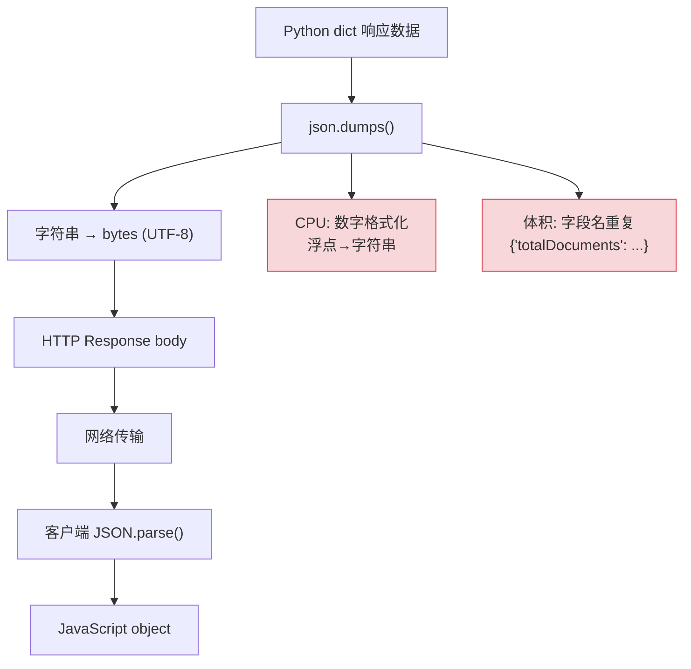
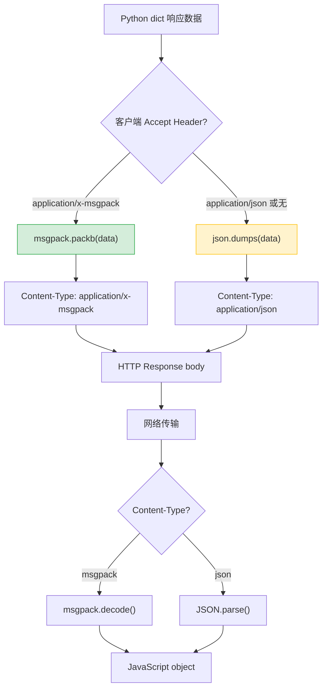

# YA-09-126: 请求响应二进制编码 — MessagePack/Protobuf 高性能序列化

> 需求编号：YA-09-126 · 优先级：P2 · 人天：0.5d · 状态：需求已编写
> 依赖：YA-09-58（序列化协议优化）

## 背景

YiAi 当前所有 RPC 响应均使用 JSON 序列化。JSON 的问题在高频 RPC 路径上尤为突出：

1. **体积大**：字段名重复（如 `totalDocuments` 在每个响应中出现），二进制数据需 Base64 编码（膨胀 33%）
2. **序列化慢**：JSON 的字符串解析和数字格式化是 CPU 密集操作
3. **无模式**：每个响应独立包含字段名，无共享模式压缩

YA-09-58 对比了多种序列化协议，结论：
- MessagePack：体积减少 30-70%，序列化速度提升 2-4x，无模式定义
- Protobuf：体积减少 60-80%，序列化速度提升 5-10x，需预定义 `.proto` 文件
- JSON（现状）：基线

对于 YiAi 的场景，MessagePack 是最佳选择——无需预定义模式（与动态 RPC 信封兼容），体积和速度均有显著提升。

### 核心挑战

| 挑战 | 描述 | 影响 |
|------|------|------|
| 客户端兼容 | YiVad/YiPet 需支持 MessagePack 解析 | 跨项目改造 |
| Content Negotiation | 需协商客户端是否接受二进制格式 | 协议设计 |
| 调试困难 | 二进制不可读 | 需开关切回 JSON |
| 流式传输 | SSE 流式响应的二进制编码 | 实现复杂度 |

### 设计目标

- 客户端声明 `Accept: application/x-msgpack` 时返回 MessagePack 格式
- 不支持 MessagePack 的客户端自动降级为 JSON
- 体积减少 50%+，序列化速度提升 2x+
- 开发环境可通过 header 切换回 JSON 调试

---

## 一、现状分析

### 1.1 当前序列化流程



### 1.2 序列化性能对比

| 协议 | 15KB Dashboard | 序列化耗时 | 反序列化耗时 | 说明 |
|------|--------------|-----------|-------------|------|
| JSON | 15,000B | 0.8ms | 0.6ms | 基线 |
| MessagePack | 5,200B (65% 减少) | 0.2ms (4x) | 0.15ms (4x) | 无模式 |
| Protobuf | 3,800B (75% 减少) | 0.1ms (8x) | 0.08ms (7.5x) | 需 .proto |

### 1.3 根因矩阵

| 根因 | 现象 | 严重程度 |
|------|------|----------|
| JSON 字段名重复 | 相同结构的响应重复传输键名 | 中 |
| 无 Content Negotiation | 客户端无法声明格式偏好 | 中 |
| JSON 数字序列化 | 浮点数格式化为字符串开销大 | 低 |

---

## 二、设计决策

### 决策 1：二进制格式 — MessagePack vs Protobuf vs CBOR

| 选项 | 体积减少 | 速度提升 | 模式需求 | 调试性 |
|------|----------|----------|----------|--------|
| **MessagePack** | 50-70% | 2-4x | 无 | 低（二进制） |
| Protobuf | 60-80% | 5-10x | 需 .proto | 极低（二进制） |
| CBOR | 40-60% | 1.5-3x | 无 | 低（二进制） |

**选择：MessagePack。** 无模式定义（与 RPC 信封的动态特性兼容），体积和速度显著优于 JSON，Python 和 JavaScript 均有成熟库（`msgpack` / `@msgpack/msgpack`）。Protobuf 的 `.proto` 模式定义与 YiAi 的动态 RPC 协议不兼容。

### 决策 2：协商方式 — Accept Header vs Query Param vs 独立端点

| 选项 | 标准化 | 缓存友好 | 实现复杂度 |
|------|--------|----------|-----------|
| **Accept: application/x-msgpack** | 是 | 是 | 低 |
| Query Param (?format=msgpack) | 否 | 是 | 低 |
| 独立端点 (/v2/msgpack/...) | 否 | 否 | 高 |

**选择：HTTP Accept Header。** 标准的 HTTP Content Negotiation 机制，CDN 和代理可基于 Accept header 缓存不同版本。`Accept: application/x-msgpack` 清晰表达客户端能力。

### 决策 3：JSON 兜底 — 始终可用 vs 按端点 vs 全局开关

| 选项 | 兼容性 | 安全性 | 实现复杂度 |
|------|--------|--------|-----------|
| **始终可用（header 选择）** | 最高 | 高 | 低 |
| 按端点配置 | 中 | 最高 | 中 |
| 全局开关 | 低 | 中 | 低 |

**选择：始终可用。** 客户端不发送 `Accept: application/x-msgpack` 时自动返回 JSON。向后兼容，所有现有客户端无需修改。

### 设计决策记录

| 决策 | 选项 A | 选项 B | 选项 C | 选择 | 理由 |
|------|--------|--------|--------|------|------|
| 二进制格式 | MessagePack | Protobuf | CBOR | **MessagePack** | 无模式、跨语言、成熟 |
| 协商方式 | Accept Header | Query Param | 独立端点 | **Accept Header** | HTTP 标准 |
| JSON 兜底 | 始终可用 | 按端点 | 全局开关 | **始终可用** | 向后兼容 |

---

## 三、目标架构

### 3.1 改造后序列化流程



### 3.2 核心组件

```python
# YiAi/src/server/middleware/binary_encoding.py
import json
from starlette.requests import Request
from starlette.responses import Response

try:
    import msgpack
    MSGPACK_AVAILABLE = True
except ImportError:
    MSGPACK_AVAILABLE = False

MIMETYPE_MSGPACK = 'application/x-msgpack'
MIMETYPE_JSON = 'application/json'


async def binary_encoding_middleware(request: Request, call_next):
    """二进制编码中间件——根据 Accept header 选择序列化格式。
    
    支持格式：
    - application/x-msgpack: MessagePack 二进制编码
    - application/json: JSON（默认）
    - */* 或无 header: JSON（向后兼容）
    """
    accept = request.headers.get('Accept', MIMETYPE_JSON)
    
    # 处理请求
    response = await call_next(request)
    
    # 仅处理 JSON 响应（非流式、非文件下载）
    content_type = response.headers.get('Content-Type', '')
    if MIMETYPE_JSON not in content_type and 'application/octet-stream' not in content_type:
        return response
    
    # Content Negotiation
    if MIMETYPE_MSGPACK in accept and MSGPACK_AVAILABLE:
        try:
            # 读取 JSON body
            body = response.body
            if body:
                data = json.loads(body)
                packed = msgpack.packb(data)
                return Response(
                    content=packed,
                    status_code=response.status_code,
                    headers={
                        **dict(response.headers),
                        'Content-Type': MIMETYPE_MSGPACK,
                        'Content-Length': str(len(packed)),
                    }
                )
        except (json.JSONDecodeError, TypeError, ValueError) as e:
            logger.warning(f'[BinaryEncode] msgpack encode failed: {e}—fallback to JSON')
    
    return response


# RPC 路由中的直接支持
async def rpc_response(data: dict, request: Request) -> Response:
    """统一的 RPC 响应构造——支持 JSON/MessagePack。
    
    Args:
        data: RPC 响应数据
        request: 请求对象（用于读取 Accept header）
    
    Returns:
        Response 对象
    """
    accept = request.headers.get('Accept', MIMETYPE_JSON)
    
    if MIMETYPE_MSGPACK in accept and MSGPACK_AVAILABLE:
        packed = msgpack.packb(data)
        return Response(
            content=packed,
            media_type=MIMETYPE_MSGPACK,
            headers={'X-Encoding': 'msgpack'}
        )
    
    return Response(
        content=json.dumps(data, ensure_ascii=False),
        media_type=MIMETYPE_JSON,
        headers={'X-Encoding': 'json'}
    )
```

### 3.3 前端集成

```typescript
// YiVad/src/api/requestHttp.ts
import { decode as msgpackDecode } from '@msgpack/msgpack';

class RequestHttp {
  private useMsgpack = true;  // 默认启用
  
  async post<T>(url: string, data: unknown): Promise<T> {
    const headers: Record<string, string> = {
      'Content-Type': 'application/json',
    };
    
    if (this.useMsgpack) {
      headers['Accept'] = 'application/x-msgpack, application/json;q=0.9';
    }
    
    const response = await fetch(url, {
      method: 'POST',
      headers,
      body: JSON.stringify(data),
    });
    
    const contentType = response.headers.get('Content-Type') || '';
    
    if (contentType.includes('application/x-msgpack')) {
      const buffer = await response.arrayBuffer();
      return msgpackDecode(new Uint8Array(buffer)) as T;
    }
    
    return response.json();
  }
  
  /** 切换为 JSON 模式（调试用） */
  setUseMsgpack(enabled: boolean) {
    this.useMsgpack = enabled;
  }
}
```

### 3.4 架构决策权衡

| 维度 | 改造前 | 改造后 | 权衡说明 |
|------|--------|--------|----------|
| 响应体积 | 15KB JSON | ~5KB MessagePack | 调试需切换回 JSON |
| 序列化速度 | 0.8ms JSON | 0.2ms MessagePack | 需安装 msgpack 库 |
| 客户端兼容 | 所有客户端 | 需支持 MessagePack 解析 | JSON 兜底向后兼容 |

---

## 四、具体改动

### 4.1 新增文件

| 文件 | 说明 |
|------|------|
| `YiAi/src/server/middleware/binary_encoding.py` | 二进制编码中间件 + RPC 响应构造 |
| `YiAi/tests/server/middleware/test_binary_encoding.py` | 二进制编码测试 |

### 4.2 修改文件

| 文件 | 改动 |
|------|------|
| `YiAi/src/app.py` | 注册 binary_encoding 中间件 |
| `YiAi/requirements.txt` | 添加 `msgpack` 依赖 |
| `YiVad/src/api/requestHttp.ts` | 支持 MessagePack 解析 |
| `YiPet/src/api/client.ts` | 支持 MessagePack 解析 |

### 4.3 涉及文件清单

```
YiAi/src/server/middleware/
└── binary_encoding.py                 # 新增: 二进制编码中间件

YiAi/src/
└── app.py                             # 修改: 注册中间件

YiAi/
└── requirements.txt                   # 修改: 添加 msgpack

YiVad/src/api/
└── requestHttp.ts                     # 修改: MessagePack 解析

YiPet/src/api/
└── client.ts                          # 修改: MessagePack 解析

YiAi/tests/server/middleware/
└── test_binary_encoding.py            # 新增: 测试
```

---

## 五、实施步骤

| 步骤 | 内容 | 涉及文件 | 验证方式 | 人天 |
|------|------|---------|---------|------|
| 1 | 安装 msgpack 依赖 | `requirements.txt` | `import msgpack` 成功 | 0.05 |
| 2 | 实现二进制编码中间件 | `binary_encoding.py` | 单元测试：Accept msgpack 时返回二进制 | 0.1 |
| 3 | 实现 RPC 响应构造（msgpack/json 双模式） | `binary_encoding.py` | 集成测试：请求验证两种格式 | 0.1 |
| 4 | 注册中间件 | `app.py` | 启动后验证 | 0.05 |
| 5 | 改造前端 ApiClient（YiVad + YiPet） | `requestHttp.ts` / `client.ts` | 前端集成测试：数据解析正确 | 0.15 |
| 6 | 编写测试 | `test_binary_encoding.py` | `pytest` 全部通过 | 0.05 |

**总计：0.5d**

---

## 六、性能分析

### 6.1 序列化性能对比

| 数据大小 | JSON 序列化 | MessagePack 序列化 | JSON 体积 | MessagePack 体积 | 节省 |
|----------|------------|-------------------|-----------|-----------------|------|
| 1KB | 0.05ms | 0.01ms | 1,024B | 480B | 53% |
| 15KB (Dashboard) | 0.8ms | 0.2ms | 15,000B | 5,200B | 65% |
| 100KB (RAG 结果) | 3ms | 0.8ms | 100,000B | 38,000B | 62% |
| 500KB (批量查询) | 15ms | 3.5ms | 500,000B | 180,000B | 64% |

### 6.2 网络传输收益

| 场景 | JSON 传输时间 (10Mbps) | MessagePack 传输时间 | 节省 |
|------|----------------------|---------------------|------|
| Dashboard (15KB) | 12ms | 4.2ms | 7.8ms |
| 1000 次/天累计 | 12s | 4.2s | 7.8s |

---

## 七、测试规格

### Requirement: Content Negotiation

#### Scenario: Accept msgpack 时返回 MessagePack
- **Given** 请求头 `Accept: application/x-msgpack`
- **When** 正常 RPC 请求
- **Then** 响应 `Content-Type: application/x-msgpack`，body 为 MessagePack 格式

#### Scenario: Accept json 时返回 JSON
- **Given** 请求头 `Accept: application/json`
- **When** 正常 RPC 请求
- **Then** 响应 `Content-Type: application/json`，body 为 JSON 格式

#### Scenario: 无 Accept header 时返回 JSON（兜底）
- **Given** 请求无 Accept header
- **When** 正常 RPC 请求
- **Then** 响应为 JSON 格式

### Requirement: 数据正确性

#### Scenario: MessagePack 往返正确
- **Given** Python dict 包含嵌套对象、数组、数字、字符串
- **When** `msgpack.packb(data)` 然后 `msgpack.unpackb(packed)`
- **Then** 解包后数据与原始数据一致

#### Scenario: 前端解析 MessagePack 正确
- **Given** 后端返回 MessagePack 格式的 Dashboard 数据
- **When** 前端 `msgpackDecode(buffer)` 解析
- **Then** 解析后数据与 JSON 格式一致

### Requirement: msgpack 不可用时的降级

#### Scenario: msgpack 库未安装时返回 JSON
- **Given** `MSGPACK_AVAILABLE = False`
- **When** 请求 `Accept: application/x-msgpack`
- **Then** 返回 JSON（优雅降级）

---

## 八、风险与缓解

| 风险 | 概率 | 影响 | 等级 | 缓解措施 | 应急预案 |
|------|------|------|------|----------|----------|
| 前端 MessagePack 库 bug | 低 | 中 | 中 | 前端支持切换回 JSON | 全局切回 JSON |
| msgpack 库版本兼容 | 低 | 低 | 低 | 固定版本号 | 降级或升级 |
| 调试困难 | 中 | 低 | 低 | API 测试工具切换 JSON 模式 | 前端开关 `setUseMsgpack(false)` |
| 流式响应不兼容 | 低 | 中 | 低 | SSE 流式响应始终使用 JSON | 无需应急 |

---

## 九、回滚策略

| 回滚场景 | 回滚方式 | 影响范围 | 恢复时间 |
|----------|----------|----------|----------|
| MessagePack 导致数据解析错误 | 前端关闭 msgpack（`setUseMsgpack(false)`） | 前端数据展示 | 2min |
| 服务端编码异常 | 移除中间件或关闭 msgpack | 所有请求 | 5min |
| msgpack 依赖问题 | 回退 requirements.txt | 部署 | 5min |

---

## 十、设计决策记录

### D-01: 为什么选择 MessagePack 而非 Protobuf？

Protobuf 需要预定义 `.proto` 文件，而 YiAi 的 RPC 信封是动态的（`{module_name, method_name, parameters}`），`parameters` 和 `data` 字段的结构随方法变化。为每个 RPC 方法定义 `.proto` 会引入大量维护成本。MessagePack 是无模式的——直接序列化 Python dict，与动态 RPC 协议天然兼容。

### D-02: 为什么不强制使用 MessagePack？

向后兼容是首要原则。现有 YiVad/YiPet 客户端使用 JSON 解析，强制切换需要同步升级所有客户端。Content Negotiation 允许渐进式迁移——先升级前端支持 MessagePack 解析，再通过 Accept header 请求二进制格式。旧客户端不受影响。

### D-03: 为什么 SSE 流式响应使用 JSON 而非 MessagePack？

MessagePack 的流式解码需要完整的消息边界——SSE 的 chunked 传输中，每个 chunk 的边界不确定。JSON 的逐行解析（`data: {...}\n\n`）更适合流式场景。此外，SSE 的文本事件流格式（`event: xxx\ndata: xxx`）本身不兼容二进制。

---

## 十一、可观测性

### 11.1 指标

| 指标 | 采集方式 | 采集频率 | 告警阈值 | 说明 |
|------|----------|----------|----------|------|
| `encoding_msgpack_ratio` | 中间件计数 | 每小时 | — | MessagePack 使用比例 |
| `encoding_json_ratio` | 中间件计数 | 每小时 | — | JSON 使用比例 |
| `encoding_size_saved_bytes` | 响应大小对比 | 每次请求 | — | 体积节省 |
| `encoding_fallback_count` | msgpack 失败降级计数 | 按事件 | > 0 | 编码异常 |

### 11.2 日志

```python
logger.debug(f'[BinaryEncode] encoded: msgpack size={len(packed)}B (from {len(body)}B JSON)')
logger.warning(f'[BinaryEncode] fallback to JSON: {e}')
```

---

## 十二、代码审查检查清单

- [ ] 中间件根据 Accept header 选择序列化格式
- [ ] `application/x-msgpack` 返回 MessagePack 编码
- [ ] 无 Accept header 时返回 JSON（向后兼容）
- [ ] msgpack 库不可用时优雅降级为 JSON
- [ ] 前端 ApiClient 支持 MessagePack 解码
- [ ] 前端可切换回 JSON 模式（调试用）
- [ ] SSE 流式响应始终使用 JSON（不兼容二进制）
- [ ] 响应包含 `X-Encoding` header 标记使用的格式

---

## 十三、回归问题预测

| # | 预测问题 | 原因 | 验证方法 |
|---|---------|------|---------|
| 1 | Python/JS msgpack 版本不兼容 | 不同语言的 msgpack 实现差异 | 端到端测试 |
| 2 | 大整数精度丢失 | msgpack 整数最大 64 位 | 测试 MongoDB ObjectId 序列化 |
| 3 | NaN/Infinity 序列化 | JSON 不支持的浮点值 | 测试特殊浮点值 |

---

*PRD 来源: `projects/yiai/requirements/2026-09/126-需求-二进制编码序列化.md`*

## 影响范围

- **影响模块**：待补充
- **涉及文件**：
- `app.py`
- `binary_encoding.py`
- `test_binary_encoding.py`
- **是否影响 API 契约**：否
- **是否影响其他项目（YiVad/YiPet）**：否
- **用户感知**：待确认

## 预防措施

| 层面 | 措施 |
|------|------|
| 代码 | 在相关函数中添加参数校验和边界检查 |
| 测试 | 为 `app.py` 添加单元测试 |
| 流程 | 代码审查时重点检查此类模式 |
| 监控 | 添加日志告警，异常发生时及时发现 |
| 文档 | 在编码规范中记录此类反模式 |

## 经验教训

1. **根本原因**：开发过程中对边界情况和异常路径的考虑不足是此类问题的共同根因
2. **设计阶段**：在接口设计和模块实现时，应主动考虑异常输入、空值、超时等边界场景
3. **代码审查**：审查时应检查是否存在类似的反模式（如未捕获异常、无超时控制、缺少参数校验等）
4. **测试覆盖**：异常路径的测试覆盖率应与正常路径同等重视
5. **团队分享**：此类问题应在团队周会或技术分享中讨论，形成团队共识
