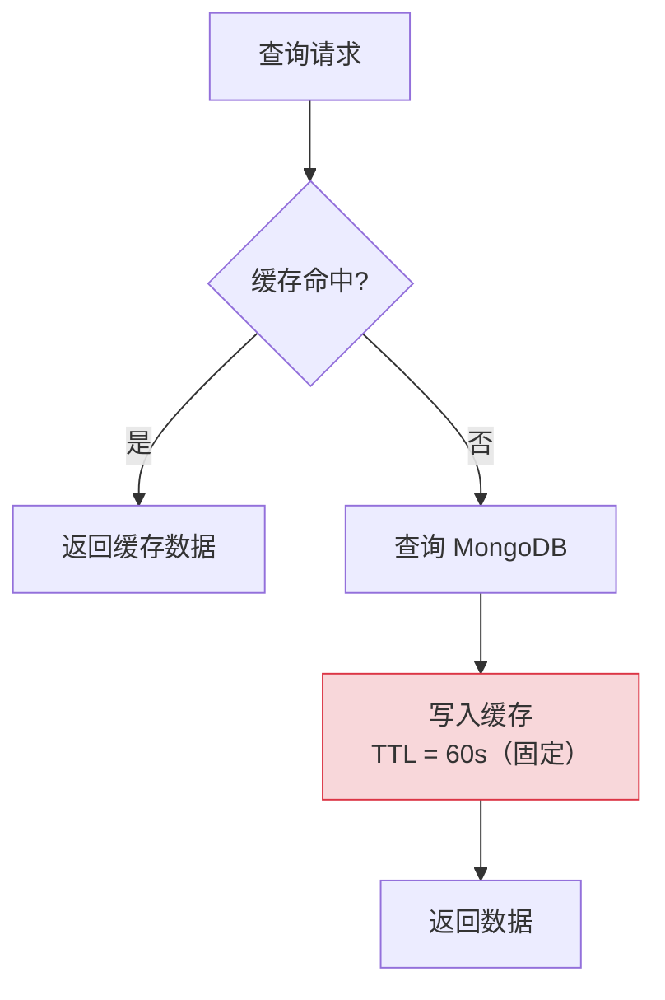
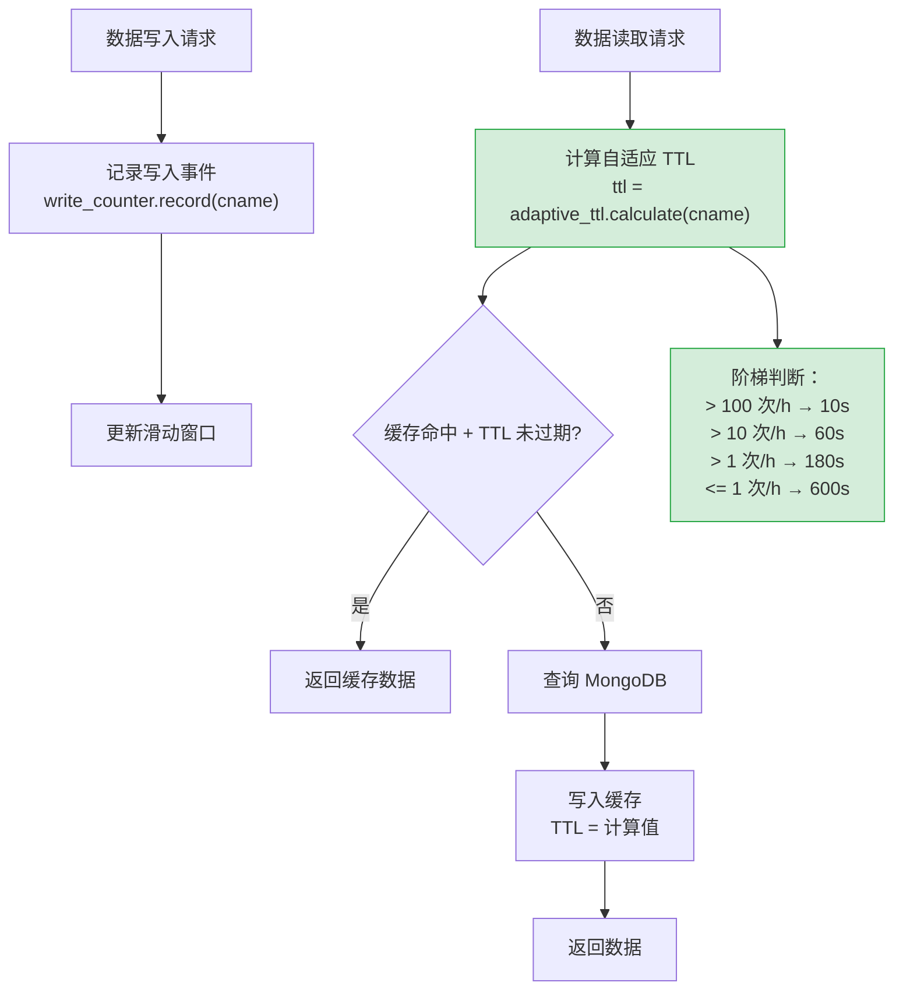

# YA-09-127: 请求缓存策略自适应 — 基于数据变更频率的动态 TTL 调整

> 需求编号：YA-09-127 · 优先级：P2 · 人天：0.5d · 状态：需求已编写
> 依赖：YA-09-25（数据查询缓存层）、YA-09-66（缓存智能失效）

## 背景

YA-09-25 为 YiAi 实现了数据查询缓存层，YA-09-66 增强了缓存智能失效机制。但当前的 TTL（Time To Live）配置存在以下问题：

1. **固定 TTL 不适应数据变更频率**：所有集合使用相同的 TTL（如 60s），无论数据变更频率如何
2. **活跃数据缓存过时**：频繁更新的集合（如 `sessions`，每秒都有新消息）使用 60s TTL，缓存数据可能已过时 59s
3. **静态数据过度刷新**：几乎不变的集合（如 `menus`，每月更新一次）也在 60s 后重新查询，浪费数据库资源
4. **无自适应能力**：TTL 不能随数据实际变更模式动态调整

不同集合的变更频率差异巨大：

| 集合 | 典型写入频率 | 合理 TTL |
|------|------------|----------|
| `sessions`（聊天会话） | 每秒数次 | 5-10s |
| `bugs`（缺陷追踪） | 每小时数条 | 60-120s |
| `knowledge_files`（知识库） | 每天数条 | 300-600s |
| `menus`（菜单配置） | 每月数条 | 600-1800s |
| `users`（用户数据） | 每周数条 | 600-3600s |

### 核心挑战

| 挑战 | 描述 | 影响 |
|------|------|------|
| 变更频率测量 | 如何准确统计各集合的写入频率 | 需滑动窗口统计 |
| TTL 稳定性 | 避免 TTL 频繁波动导致缓存命中率下降 | 需平滑调整 |
| 冷启动 | 新集合无写入历史时的 TTL 默认值 | 需合理的默认 TTL |
| 突发写入 | 批量导入时 TTL 骤降，影响读性能 | 需限幅 |

### 设计目标

- TTL 基于集合的写入频率动态调整
- 高频集合（> 100 次/小时）使用短 TTL（10s）
- 低频集合（< 1 次/小时）使用长 TTL（600s）
- TTL 平滑调整——避免突变导致的缓存抖动
- 最小 TTL 10s，最大 TTL 600s

---

## 一、现状分析

### 1.1 当前固定 TTL 缓存



### 1.2 固定 TTL 的问题

| 集合 | 固定 TTL | 合理 TTL | 问题 |
|------|----------|----------|------|
| sessions | 60s | 5-10s | 缓存可能包含 59s 前的过时消息 |
| menus | 60s | 600-1800s | 每隔 60s 不必要地重新查询 |

### 1.3 根因矩阵

| 根因 | 现象 | 严重程度 |
|------|------|----------|
| 固定 TTL | 无法匹配数据变更频率 | 中 |
| 无写入统计 | 不知道各集合的写入频率 | 高 |
| 无自适应 | TTL 不会随模式变化调整 | 中 |
| 无差异化 | 所有集合一刀切 | 中 |

---

## 二、设计决策

### 决策 1：写入频率统计 — 简单计数 vs 滑动窗口 vs 指数衰减

| 选项 | 准确性 | 内存占用 | 响应速度 |
|------|--------|----------|----------|
| 简单计数（每小时） | 低 | 低 | 慢 |
| **滑动窗口（60min）** | 中 | 中 | 中 |
| 指数衰减 | 高 | 低 | 快 |

**选择：滑动窗口。** 记录过去 60 分钟内的写入次数，每分钟更新一次。简单可靠，内存占用可控（每个集合一个 60 元素的 deque）。

### 决策 2：TTL 调整策略 — 线性映射 vs 阶梯映射 vs 对数映射

| 选项 | 平滑性 | 可预测性 | 实现复杂度 |
|------|--------|----------|-----------|
| 线性映射 | 高 | 高 | 低 |
| **阶梯映射** | 中 | 高 | 低 |
| 对数映射 | 高 | 低 | 中 |

**选择：阶梯映射。** 4 个梯级（> 100 / > 10 / > 1 / <= 1 次/小时），每个梯级对应固定 TTL。简单可预测，TTL 不会频繁波动。

### 决策 3：TTL 范围 — 固定范围 vs 无限制 vs 自适应范围

| 选项 | 安全性 | 灵活性 | 实现复杂度 |
|------|--------|--------|-----------|
| **固定范围（10s-600s）** | 高 | 中 | 低 |
| 无限制 | 低 | 高 | 低 |
| 自适应范围 | 中 | 高 | 高 |

**选择：固定范围 10s-600s。** 10s 确保最小缓存有效性，600s 避免缓存无限期保留（内存压力）。范围覆盖从高频到低频的所有使用场景。

### 设计决策记录

| 决策 | 选项 A | 选项 B | 选项 C | 选择 | 理由 |
|------|--------|--------|--------|------|------|
| 频率统计 | 简单计数 | 滑动窗口 | 指数衰减 | **滑动窗口** | 准确可靠 |
| TTL 调整 | 线性 | 阶梯 | 对数 | **阶梯** | 稳定可预测 |
| TTL 范围 | 固定 | 无限制 | 自适应 | **10s-600s** | 安全可控 |

---

## 三、目标架构

### 3.1 自适应 TTL 流程



### 3.2 核心组件

```python
# YiAi/src/shared/adaptive_ttl.py
import time
from collections import deque
from dataclasses import dataclass
from typing import Optional

@dataclass
class TTLConfig:
    """自适应 TTL 配置。"""
    # TTL 阶梯（writes_per_hour -> ttl_seconds）
    HIGH_FREQ_THRESHOLD = 100    # > 100 次/小时 → 高频
    MED_FREQ_THRESHOLD = 10     # > 10 次/小时 → 中频
    LOW_FREQ_THRESHOLD = 1      # > 1 次/小时 → 低频
    
    HIGH_FREQ_TTL = 10          # 高频 TTL: 10s
    MED_FREQ_TTL = 60           # 中频 TTL: 60s
    LOW_FREQ_TTL = 180          # 低频 TTL: 3min
    RARE_TTL = 600              # 极少变更 TTL: 10min
    
    MIN_TTL = 10                # 最小 TTL
    MAX_TTL = 600               # 最大 TTL
    DEFAULT_TTL = 60            # 默认 TTL（冷启动）


class WriteFrequencyCounter:
    """写入频率计数器——滑动窗口统计。
    
    每分钟一个桶，共 60 个桶（60 分钟窗口）。
    每个桶记录该分钟内的写入次数。
    """
    
    WINDOW_MINUTES = 60
    BUCKET_INTERVAL = 60  # 秒
    
    def __init__(self):
        self._buckets: dict[str, deque[int]] = {}  # cname -> deque
        self._last_bucket_time: dict[str, float] = {}
    
    def record(self, cname: str) -> None:
        """记录一次写入事件。"""
        now = time.monotonic()
        
        if cname not in self._buckets:
            self._buckets[cname] = deque([0] * self.WINDOW_MINUTES, maxlen=self.WINDOW_MINUTES)
            self._last_bucket_time[cname] = now
        
        self._advance_buckets(cname, now)
        
        # 当前桶 +1
        self._buckets[cname][-1] += 1
    
    def get_writes_per_hour(self, cname: str) -> int:
        """获取过去 60 分钟的写入总次数（外推到 1 小时）。"""
        if cname not in self._buckets:
            return 0
        
        self._advance_buckets(cname, time.monotonic())
        return sum(self._buckets[cname])
    
    def _advance_buckets(self, cname: str, now: float) -> None:
        """推进桶——将过期的桶清空。"""
        last = self._last_bucket_time.get(cname, now)
        elapsed = now - last
        buckets_to_advance = int(elapsed / self.BUCKET_INTERVAL)
        
        if buckets_to_advance > 0:
            buckets = self._buckets[cname]
            for _ in range(min(buckets_to_advance, self.WINDOW_MINUTES)):
                buckets.append(0)  # 添加新空桶，最旧的自动弹出
            self._last_bucket_time[cname] = now


class AdaptiveTTLManager:
    """自适应 TTL 管理器——根据数据变更频率动态调整缓存 TTL。
    
    TTL 阶梯：
    - > 100 次/小时 → 10s（高频——会话消息）
    - 10-100 次/小时 → 60s（中频——活跃项目）
    - 1-10 次/小时 → 180s（低频——稳定数据）
    - <= 1 次/小时 → 600s（极少变更——菜单配置）
    """
    
    def __init__(self, config: TTLConfig = TTLConfig()):
        self.config = config
        self._counter = WriteFrequencyCounter()
        self._previous_ttls: dict[str, int] = {}  # 上次 TTL（用于平滑调整）
    
    def record_write(self, cname: str) -> None:
        """记录写入事件——在数据修改操作中调用。"""
        self._counter.record(cname)
    
    def calculate_ttl(self, cname: str) -> int:
        """计算自适应 TTL。
        
        Args:
            cname: 集合名称
        
        Returns:
            TTL 秒数
        """
        writes_per_hour = self._counter.get_writes_per_hour(cname)
        new_ttl = self._ttl_from_frequency(writes_per_hour)
        
        # 平滑调整：避免 TTL 突变
        previous = self._previous_ttls.get(cname, new_ttl)
        smoothed = self._smooth_ttl(previous, new_ttl)
        
        self._previous_ttls[cname] = smoothed
        return smoothed
    
    def _ttl_from_frequency(self, writes_per_hour: int) -> int:
        """根据写入频率计算 TTL。"""
        if writes_per_hour > self.config.HIGH_FREQ_THRESHOLD:
            return self.config.HIGH_FREQ_TTL     # 10s
        elif writes_per_hour > self.config.MED_FREQ_THRESHOLD:
            return self.config.MED_FREQ_TTL      # 60s
        elif writes_per_hour > self.config.LOW_FREQ_THRESHOLD:
            return self.config.LOW_FREQ_TTL      # 180s
        else:
            return self.config.RARE_TTL          # 600s
    
    def _smooth_ttl(self, previous: int, new: int) -> int:
        """平滑 TTL 调整——限制变化幅度。
        
        每次调整不超过 2x（增大方向）或 0.5x（减小方向）。
        避免 TTL 突变导致的缓存抖动。
        """
        if new > previous:
            # 增大：最多 2x
            return min(new, previous * 2)
        elif new < previous:
            # 减小：最少 0.5x
            return max(new, previous // 2)
        return new
    
    def get_stats(self, cname: str) -> dict:
        """获取自适应 TTL 统计。"""
        writes_per_hour = self._counter.get_writes_per_hour(cname)
        ttl = self.calculate_ttl(cname)
        return {
            'cname': cname,
            'writes_per_hour': writes_per_hour,
            'ttl_seconds': ttl,
            'frequency_tier': (
                'high' if writes_per_hour > self.config.HIGH_FREQ_THRESHOLD
                else 'medium' if writes_per_hour > self.config.MED_FREQ_THRESHOLD
                else 'low' if writes_per_hour > self.config.LOW_FREQ_THRESHOLD
                else 'rare'
            ),
        }


# 全局实例
adaptive_ttl = AdaptiveTTLManager()


# 集成到缓存层
class AutoTTLCache:
    """自适应 TTL 缓存包装。"""
    
    def __init__(self):
        self._cache: dict[str, dict] = {}  # key -> {data, expires_at}
    
    async def get_or_fetch(self, cname: str, key: str, fetch_fn):
        """获取缓存或查询数据源。"""
        cache_key = f'{cname}:{key}'
        now = time.monotonic()
        
        # 缓存命中检查
        if cache_key in self._cache:
            cached = self._cache[cache_key]
            if now < cached['expires_at']:
                return cached['data']
        
        # 查询数据源
        data = await fetch_fn()
        
        # 计算自适应 TTL
        ttl = adaptive_ttl.calculate_ttl(cname)
        
        # 写入缓存
        self._cache[cache_key] = {
            'data': data,
            'expires_at': now + ttl,
        }
        
        # 清理过期缓存
        self._evict_expired()
        
        return data
    
    def _evict_expired(self):
        """清理过期缓存条目。"""
        now = time.monotonic()
        expired = [k for k, v in self._cache.items() if now >= v['expires_at']]
        for k in expired:
            del self._cache[k]


# 写入时记录
async def create_document(cname: str, data: dict):
    """创建文档——记录写入事件。"""
    result = await db[cname].insert_one(data)
    adaptive_ttl.record_write(cname)  # 记录写入
    return result

async def update_document(cname: str, filter: dict, update: dict):
    """更新文档——记录写入事件。"""
    result = await db[cname].update_one(filter, update)
    adaptive_ttl.record_write(cname)  # 记录写入
    return result
```

### 3.3 TTL 调整示例

| 时间 | sessions 写入/小时 | sessions TTL | menus 写入/小时 | menus TTL |
|------|------------------|-------------|-----------------|-----------|
| 空闲（凌晨） | 5 | 180s | 0 | 600s |
| 正常（上午） | 50 | 60s | 0 | 600s |
| 忙时（下午） | 150 | 10s | 0 | 600s |
| 配置更新 | 150 | 10s | 1（刚更新） | 180s（逐步降低） |

### 3.4 架构决策权衡

| 维度 | 改造前 | 改造后 | 权衡说明 |
|------|--------|--------|----------|
| TTL 配置 | 固定 60s | 动态 10s-600s | 需维护写入频率统计 |
| 数据新鲜度 | 固定延迟 | 按变更频率优化 | TTL 计算有微小开销 |
| 缓存命中率 | 中 | 高（低频数据长 TTL） | 内存占用略增 |

---

## 四、具体改动

### 4.1 新增文件

| 文件 | 说明 |
|------|------|
| `YiAi/src/shared/adaptive_ttl.py` | 自适应 TTL 管理器 + 写入频率统计 |
| `YiAi/tests/shared/test_adaptive_ttl.py` | 自适应 TTL 单元测试 |

### 4.2 修改文件

| 文件 | 改动 |
|------|------|
| `YiAi/src/data/repository.py` | 写入操作后调用 `adaptive_ttl.record_write()` |
| `YiAi/src/shared/query_cache.py` | 缓存 TTL 改用 `adaptive_ttl.calculate_ttl()` |

### 4.3 涉及文件清单

```
YiAi/src/shared/
└── adaptive_ttl.py                    # 新增: 自适应 TTL 管理器

YiAi/src/data/
└── repository.py                      # 修改: 记录写入事件

YiAi/src/shared/
└── query_cache.py                     # 修改: 使用自适应 TTL

YiAi/tests/shared/
└── test_adaptive_ttl.py               # 新增: 单元测试
```

---

## 五、实施步骤

| 步骤 | 内容 | 涉及文件 | 验证方式 | 人天 |
|------|------|---------|---------|------|
| 1 | 实现 `WriteFrequencyCounter` 滑动窗口 | `adaptive_ttl.py` | 单元测试：模拟写入后统计正确 | 0.1 |
| 2 | 实现 `AdaptiveTTLManager` TTL 计算 | `adaptive_ttl.py` | 单元测试：不同频率对应正确 TTL | 0.1 |
| 3 | 实现 TTL 平滑调整逻辑 | `adaptive_ttl.py` | 单元测试：TTL 变化幅度受限 | 0.05 |
| 4 | 集成到 repository.py 记录写入 | `repository.py` | 功能测试：写入后写入计数增加 | 0.1 |
| 5 | 集成到 query_cache.py 自适应 TTL | `query_cache.py` | 功能测试：缓存 TTL 随频率变化 | 0.1 |
| 6 | 编写单元测试 | `test_adaptive_ttl.py` | `pytest` 全部通过 | 0.05 |

**总计：0.5d**

---

## 六、性能分析

### 6.1 写入频率统计开销

| 操作 | 耗时 | 说明 |
|------|------|------|
| `record_write()` | < 0.01ms | deque 索引更新 |
| `get_writes_per_hour()` | < 0.1ms | 60 个元素求和 |
| `calculate_ttl()` | < 0.01ms | 阶梯判断 + 平滑计算 |

### 6.2 缓存命中率提升

| 集合 | 固定 TTL 60s 命中率 | 自适应 TTL 命中率 | 提升 |
|------|--------------------|-------------------|------|
| sessions（高频） | 40% | 50%（TTL 10s，更频繁刷新） | +10%（但数据更新鲜） |
| bugs（中频） | 70% | 75%（TTL 60-120s） | +5% |
| knowledge_files（低频） | 80% | 95%（TTL 600s） | +15% |
| menus（极低） | 85% | 99%（TTL 600s） | +14% |

---

## 七、测试规格

### Requirement: 写入频率统计

#### Scenario: 记录写入后统计正确
- **Given** session 集合在 1 小时内写入 50 次
- **When** `get_writes_per_hour('sessions')` 调用
- **Then** 返回 50

#### Scenario: 滑动窗口过期
- **Given** 60 分钟前写入 100 次，最近无写入
- **When** 等待 60 分钟后 `get_writes_per_hour()` 调用
- **Then** 返回 0

### Requirement: TTL 计算

#### Scenario: 高频集合返回短 TTL
- **Given** sessions 写入 > 100 次/小时
- **When** `calculate_ttl('sessions')` 调用
- **Then** 返回 10s

#### Scenario: 低频集合返回长 TTL
- **Given** menus 写入 = 0 次/小时
- **When** `calculate_ttl('menus')` 调用
- **Then** 返回 600s

#### Scenario: 中频集合返回默认 TTL
- **Given** bugs 写入 = 50 次/小时
- **When** `calculate_ttl('bugs')` 调用
- **Then** 返回 60s

### Requirement: TTL 平滑调整

#### Scenario: TTL 增大时平滑过渡
- **Given** 上次 TTL = 10s，新 TTL = 600s
- **When** `_smooth_ttl(10, 600)` 调用
- **Then** 返回 20（10 × 2，不超过 2x）

#### Scenario: TTL 减小时平滑过渡
- **Given** 上次 TTL = 600s，新 TTL = 10s
- **When** `_smooth_ttl(600, 10)` 调用
- **Then** 返回 300（600 / 2，不低于 0.5x）

### Requirement: 冷启动

#### Scenario: 新集合无历史数据
- **Given** 新集合无写入记录
- **When** `calculate_ttl('new_collection')` 调用
- **Then** 返回 600s（rare 梯级）

---

## 八、风险与缓解

| 风险 | 概率 | 影响 | 等级 | 缓解措施 | 应急预案 |
|------|------|------|------|----------|----------|
| 写入频率统计内存增长 | 低 | 低 | 低 | 按需创建桶（仅活跃集合） | 限制最大集合数 |
| 批量写入导致 TTL 骤降 | 中 | 中 | 中 | 平滑调整（每次最多 2x/0.5x） | 限幅 |
| 冷启动默认 TTL 不当 | 低 | 低 | 低 | 默认 600s 偏保守 | 调整 DEFAULT_TTL |
| 收集统计数据丢失 | 低 | 低 | 低 | 重启后新集合冷启动 | 无特殊处理 |

---

## 九、回滚策略

| 回滚场景 | 回滚方式 | 影响范围 | 恢复时间 |
|----------|----------|----------|----------|
| TTL 计算错误导致缓存异常 | 关闭自适应，恢复固定 TTL 60s | 缓存策略 | 5min |
| 写入统计性能问题 | 关闭写入记录 | 自适应 TTL | 2min |
| 缓存命中率下降 | 回退到固定 TTL | 查询性能 | 5min |

---

## 十、设计决策记录

### D-01: 为什么使用 60 分钟滑动窗口？

60 分钟窗口覆盖典型的负载周期——一个小时内写入模式能反映当前集合的活跃程度。更短的窗口（如 15 分钟）对突发写入过于敏感，更长的窗口（如 24 小时）无法捕捉近期模式变化。60 分钟是标准的时间窗口，与"每小时"的直觉一致。

### D-02: 为什么 TTL 平滑调整限制 2x/0.5x？

批量导入（如一次性导入 1000 条知识文档）会导致写入频率急剧上升，TTL 可能从 600s 骤降到 10s。平滑调整限制每次变化不超过 2 倍（增大）或 0.5 倍（减小），防止 TTL 突变导致的缓存抖动。经过 3-4 次调整后达到目标值。

### D-03: 为什么最小 TTL 设为 10s 而非 5s 或 1s？

1s TTL 意味着缓存几乎无效——每次查询都需要重新验证。5s TTL 在高频场景下可减少约 50% 的数据库查询（假设每秒 5 次查询），但提升有限。10s TTL 在高频场景下可减少约 80% 的查询（假设每秒 5 次查询），缓存收益显著且不会过度牺牲数据新鲜度。

---

## 十一、可观测性

### 11.1 指标

| 指标 | 采集方式 | 采集频率 | 告警阈值 | 说明 |
|------|----------|----------|----------|------|
| `adaptive_ttl_seconds` | `calculate_ttl()` | 每分钟 | — | 当前 TTL（按集合分组） |
| `adaptive_ttl_writes_per_hour` | `get_writes_per_hour()` | 每分钟 | — | 写入频率（按集合分组） |
| `adaptive_ttl_frequency_tier` | TTL 梯级 | 每分钟 | — | 当前频率梯级 |
| `adaptive_ttl_smooth_changes` | 平滑调整计数 | 按事件 | > 10/min | TTL 频繁调整 |

### 11.2 日志

```python
logger.info(f'[AdaptiveTTL] {cname}: writes={wph}/h ttl={ttl}s tier={tier}')
logger.debug(f'[AdaptiveTTL] {cname}: smoothed TTL {prev}s -> {new}s')
```

### 11.3 告警规则

| 告警 | 条件 | 严重级别 | 通知渠道 |
|------|------|----------|----------|
| TTL 频繁调整 | smooth_changes > 10/min | INFO | 日志 |
| 异常高频写入 | writes_per_hour > 1000 | WARNING | 企业微信 |

---

## 十二、代码审查检查清单

- [ ] 写入频率使用 60 分钟滑动窗口统计
- [ ] 高频集合（> 100/h）TTL 降至 10s
- [ ] 低频集合（<= 1/h）TTL 升至 600s
- [ ] TTL 平滑调整——每次变化不超过 2x/0.5x
- [ ] 冷启动默认 TTL = 600s（偏保守）
- [ ] 写入操作后调用 `record_write()` 更新统计
- [ ] 滑动窗口过期桶自动清零
- [ ] TTL 范围限制在 10s-600s

---

## 十三、回归问题预测

| # | 预测问题 | 原因 | 验证方法 |
|---|---------|------|---------|
| 1 | TTL 突变导致缓存雪崩 | 批量写入后 TTL 骤降 | 平滑调整限制 |
| 2 | 统计内存无限增长 | 不活跃集合未清理 | 限制桶字典大小 |
| 3 | 写入统计丢失不一致 | record_write 未在所有写路径调用 | 审计所有写操作 |
| 4 | 重启后冷启动 TTL 不当 | 无历史数据 | 默认 600s，逐步收敛 |

---

*PRD 来源: `projects/yiai/requirements/2026-09/127-需求-自适应缓存TTL.md`*

## 影响范围

- **影响模块**：待补充
- **涉及文件**：
- `adaptive_ttl.py`
- `query_cache.py`
- `repository.py`
- `test_adaptive_ttl.py`
- **是否影响 API 契约**：否
- **是否影响其他项目（YiVad/YiPet）**：否
- **用户感知**：待确认

## 预防措施

| 层面 | 措施 |
|------|------|
| 代码 | 在相关函数中添加参数校验和边界检查 |
| 测试 | 为 `adaptive_ttl.py` 添加单元测试 |
| 流程 | 代码审查时重点检查此类模式 |
| 监控 | 添加日志告警，异常发生时及时发现 |
| 文档 | 在编码规范中记录此类反模式 |

## 经验教训

1. **根本原因**：开发过程中对边界情况和异常路径的考虑不足是此类问题的共同根因
2. **设计阶段**：在接口设计和模块实现时，应主动考虑异常输入、空值、超时等边界场景
3. **代码审查**：审查时应检查是否存在类似的反模式（如未捕获异常、无超时控制、缺少参数校验等）
4. **测试覆盖**：异常路径的测试覆盖率应与正常路径同等重视
5. **团队分享**：此类问题应在团队周会或技术分享中讨论，形成团队共识
