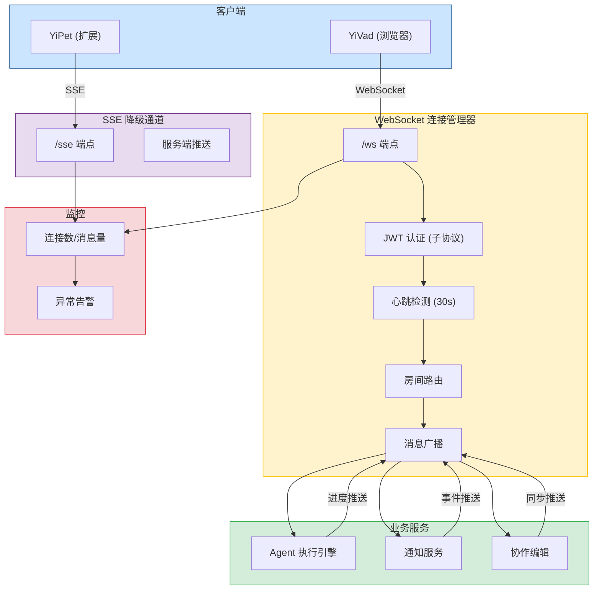
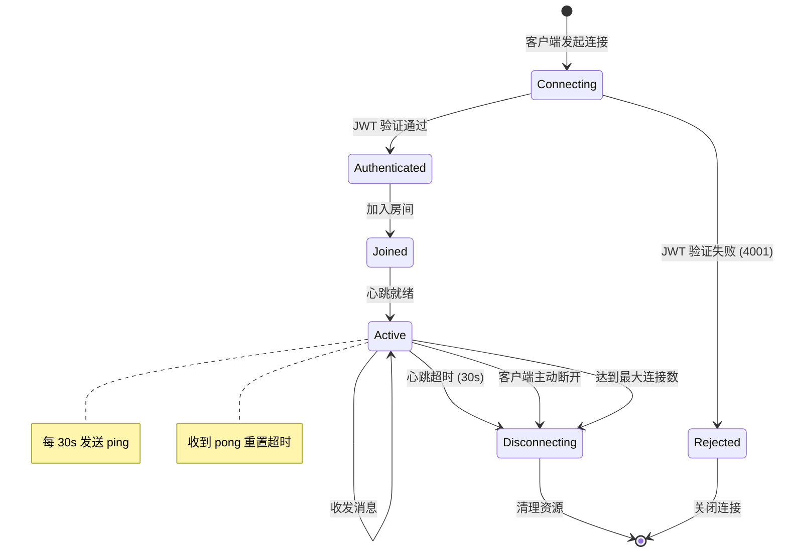
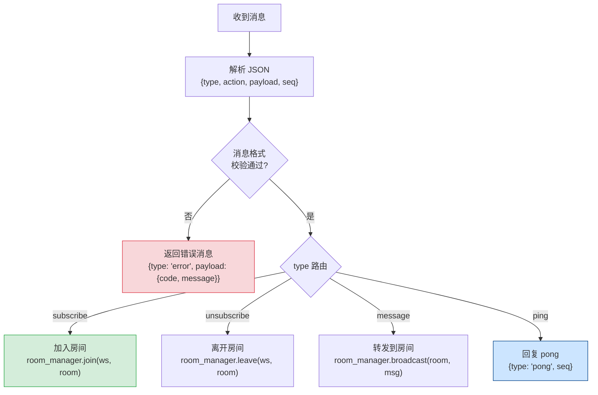
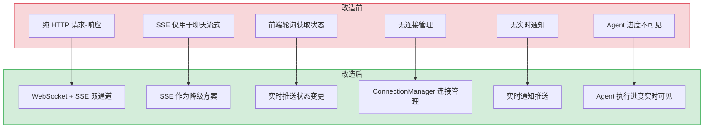

# YA-09-130: WebSocket 实时通信 — FastAPI WebSocket 端点 + 房间路由 + 连接管理 + SSE 降级

> 需求编号：YA-09-130 · 优先级：P1 · 人天：1.5d · 状态：需求已编写
> 依赖：无 · 前置需求：无

## 背景

YiAi 当前所有前端与后端的通信均基于 HTTP 请求-响应模式（RPC 信封 + SSE 流式）。这种模式在以下场景中存在明显不足：(1) 服务端无法主动推送消息给前端，前端只能通过轮询获取状态变更；(2) Agent 执行进度无法实时反馈，用户体验差；(3) 多人协作编辑场景需要双向实时同步，HTTP 模式无法满足；(4) 实时通知（如备份完成、告警触发）需要前端主动拉取，延迟高且浪费带宽。

**问题：**

1. **无服务端推送能力**：YiAi 无法主动向 YiVad/YiPet 推送消息，所有状态变更依赖前端轮询，延迟至少等于轮询间隔。
2. **Agent 执行进度不透明**：Agent 循环执行时，前端只能看到开始和结束状态，中间步骤（工具调用、RAG 检索、LLM 推理）完全不可见，用户等待时无反馈。
3. **无实时协作能力**：多人同时编辑知识库或配置时，无法感知他人的实时修改，容易产生冲突。
4. **无连接状态管理**：当前无任何 WebSocket 基础设施，无法监控连接数、消息吞吐量、连接异常等指标。

**影响：**

- Agent 执行进度不可见 → 用户等待焦虑 → 体验差
- 服务端事件无法推送 → 前端轮询延迟高（5-30s）→ 通知不及时
- 无协作能力 → 多人编辑冲突 → 数据不一致风险
- 无 WebSocket 基础设施 → 无法扩展实时功能 → 架构受限

**挑战：**

- FastAPI 的 WebSocket 支持与 ASGI 事件循环调度需谨慎处理，避免阻塞
- WebSocket 长连接管理（心跳、重连、最大连接数限制）需要健壮的状态机
- JWT 认证如何在 WebSocket 握手中传递（无法使用 HTTP Header）
- 浏览器环境（YiPet content script）可能不支持 WebSocket，需要 SSE 降级方案
- 消息格式需要与现有 RPC 信封保持一致，降低前端适配成本

---

## 一、现状分析

### 1.1 当前通信模式

| 属性 | 当前值 | 说明 |
|------|--------|------|
| 通信协议 | HTTP/1.1（RPC 信封） | 请求-响应模式，无服务端推送 |
| 流式传输 | SSE（Server-Sent Events） | 仅用于 AI 聊天流式输出，单向 |
| 实时通知 | 前端轮询（5-30s 间隔） | YiVad 定时调用状态 API |
| 连接管理 | 无 | 每次请求独立连接，无连接池 |
| 消息格式 | JSON（RPC 信封） | `{module_name, method_name, parameters}` |
| 认证方式 | X-Token HTTP Header | 仅支持 HTTP 请求头传递 |

### 1.2 根因分析矩阵

| 问题 | 根因 | 影响 | 紧急程度 |
|------|------|------|----------|
| 无服务端推送 | 项目初期仅需 HTTP 请求-响应，未规划 WebSocket | 实时通知延迟高，用户体验差 | 高 |
| Agent 进度不可见 | Agent 循环为同步执行，无中间状态输出机制 | 用户等待无反馈，无法判断是否卡死 | 高 |
| 无协作能力 | 数据操作无冲突检测，无实时同步机制 | 多人编辑冲突，数据不一致 | 中 |
| 无连接监控 | 无 WebSocket 基础，无连接数/消息量统计 | 无法评估系统负载和容量 | 中 |
| 无 SSE 降级 | 扩展环境（content script）可能不支持 WebSocket | YiPet 无法使用实时功能 | 中 |

### 1.3 改造前通信流

```
前端 (YiVad/YiPet)
  │
  ├── HTTP POST / (RPC 信封) ──→ YiAi ──→ MongoDB
  │    └── 请求-响应，无推送
  │
  ├── HTTP GET /chat (SSE) ──→ YiAi ──→ Ollama
  │    └── 单向流式，仅聊天
  │
  └── 定时轮询 (5-30s) ──→ YiAi
       └── 获取状态/通知，延迟高
```

---

## 二、设计决策

### 决策 1：WebSocket 实现方式 — 原生 FastAPI WebSocket vs socket.io vs 第三方库

| 维度 | FastAPI 原生 WebSocket | socket.io (python-socketio) | Starlette WebSocket |
|------|------------------------|---------------------------|---------------------|
| 实现复杂度 | 低（标准 ASGI WebSocket） | 中（需要额外服务端 + 客户端库） | 低（FastAPI 底层依赖） |
| 浏览器兼容性 | 原生 WebSocket API | 自动降级到 HTTP 长轮询 | 原生 WebSocket API |
| 房间/频道支持 | 需自行实现 | 内置房间管理 | 需自行实现 |
| 自动重连 | 需自行实现 | 内置重连机制 | 需自行实现 |
| 消息格式 | 自定义（JSON） | 内置事件系统 | 自定义（JSON） |
| 与现有 RPC 信封兼容 | 高（自定义消息格式） | 中（socket.io 协议层） | 高（自定义消息格式） |
| 依赖体积 | 无额外依赖 | 引入 python-socketio + socket.io.js | 无额外依赖 |

**选择：FastAPI 原生 WebSocket + 自建房间/重连管理。** 原生 WebSocket 协议简单透明，消息格式可完全自定义以兼容现有 RPC 信封。房间路由和重连逻辑自行实现（约 200 行），避免引入 socket.io 庞大的协议层和客户端依赖。YiPet 扩展环境通过 SSE 降级方案覆盖。

### 决策 2：WebSocket 认证方式 — URL 参数 vs 首条消息 vs 握手子协议

| 维度 | URL 查询参数 `?token=xxx` | 首条消息认证 | Sec-WebSocket-Protocol |
|------|--------------------------|-------------|----------------------|
| 安全性 | 低（token 暴露在 URL 日志中） | 中（消息体加密传输） | 高（握手头部，不暴露 URL） |
| 实现复杂度 | 低（直接从 URL 解析） | 中（需要认证状态机） | 低（fastapi `websocket.headers`） |
| 浏览器支持 | 原生 `WebSocket(url)` 支持 | 需手动发送首条消息 | 原生 `WebSocket(url, [protocol])` |
| 与现有 JWT 兼容 | 高 | 高 | 高 |

**选择：Sec-WebSocket-Protocol 子协议传递 JWT token。** 在 WebSocket 握手时，客户端将 JWT token 作为子协议标识符传递（`new WebSocket(url, ["access_token", token])`），服务端从 `websocket.headers.get("sec-websocket-protocol")` 中提取验证。token 不暴露在 URL 日志中，且握手阶段即可完成认证，无需额外的认证消息往返。

### 决策 3：消息格式 — 自定义 JSON vs 复用 RPC 信封 vs Protobuf

| 维度 | 自定义 JSON 格式 | 复用 RPC 信封 | Protobuf 二进制 |
|------|-----------------|--------------|-----------------|
| 与现有代码兼容 | 中（需前端适配） | 高（直接复用 RPC 信封） | 低（需引入 protobuf 编译） |
| 可读性/调试性 | 高（文本格式） | 高（文本格式） | 低（二进制，需工具解码） |
| 消息大小 | 中 | 中 | 小（压缩率高） |
| 类型安全 | 低（无 schema） | 中（Pydantic 校验） | 高（强类型 schema） |
| 扩展性 | 高 | 高 | 中（需更新 .proto） |

**选择：自定义 JSON 格式（兼容 RPC 信封风格）。** WebSocket 消息格式设计为 `{type, action, payload, timestamp, seq}`，与 RPC 信封的 `{module_name, method_name, parameters}` 保持结构相似性。前端适配成本低（熟悉的 JSON 结构），调试友好。暂不引入 Protobuf，消息量小（< 10KB/条），JSON 开销可接受。

### 决策 4：SSE 降级策略 — 自动降级 vs 手动切换 vs 仅 SSE

| 维度 | 自动降级（WebSocket → SSE） | 手动切换（配置选择） | 仅 SSE（不用 WebSocket） |
|------|---------------------------|-------------------|------------------------|
| YiPet 兼容性 | 高（content script 可用 SSE） | 中（需用户配置） | 高 |
| 双向通信 | 降级后丢失 | 降级后丢失 | 无 |
| 实现复杂度 | 高（需双通道管理） | 低（独立实现） | 低 |
| 服务端推送 | 降级为 SSE 推送 + HTTP 请求 | 降级为 SSE 推送 + HTTP 请求 | 仅 SSE 推送 |

**选择：自动降级（WebSocket 优先，SSE 兜底）。** 前端 ConnectionManager 优先尝试 WebSocket 连接，若 3 秒内未建立连接或浏览器不支持 WebSocket，自动降级到 SSE 通道。SSE 通道仅支持服务端推送，客户端发送消息仍通过 HTTP RPC 信封。YiPet 扩展默认使用 SSE 通道（content script 不支持 WebSocket）。

### 设计决策记录

| 决策 | 选项 A | 选项 B | 选择 | 理由 |
|------|--------|--------|------|------|
| WebSocket 实现 | FastAPI 原生 WebSocket | socket.io | FastAPI 原生 | 零依赖，消息格式完全自定义，兼容 RPC 信封 |
| 认证方式 | URL 参数 | 子协议传递 | 子协议传递 | 不暴露 token 在 URL，握手阶段即可认证 |
| 消息格式 | 自定义 JSON | 复用 RPC 信封 | 自定义 JSON | 兼顾兼容性和 WebSocket 特有的 type/action 语义 |
| SSE 降级 | 自动降级 | 手动切换 | 自动降级 | 对前端透明，YiPet 自动使用 SSE |

---

## 三、目标架构

### 3.1 WebSocket 通信架构总览



### 3.2 连接生命周期



### 3.3 消息路由流程



---

## 四、具体改动

### 4.1 WebSocket 连接管理器

**文件：** `services/websocket/connection_manager.py`（新建）

```python
import asyncio
import json
import time
from dataclasses import dataclass, field
from typing import Optional

from fastapi import WebSocket, WebSocketDisconnect
from shared.config import settings
from shared.logging import get_logger

logger = get_logger(__name__)


@dataclass
class WSConnection:
    """WebSocket 连接封装。"""
    ws: WebSocket
    client_id: str
    user_id: str
    rooms: set[str] = field(default_factory=set)
    connected_at: float = field(default_factory=time.time)
    last_heartbeat: float = field(default_factory=time.time)
    seq: int = 0


class ConnectionManager:
    """WebSocket 连接管理器。"""

    def __init__(self):
        self._connections: dict[str, WSConnection] = {}
        self._rooms: dict[str, set[str]] = {}  # room_name -> {client_id}
        self._lock = asyncio.Lock()
        self._max_connections = settings.ws_max_connections or 1000
        self._heartbeat_interval = 30  # 秒
        self._heartbeat_timeout = 90  # 秒

    async def connect(self, ws: WebSocket, client_id: str, user_id: str) -> WSConnection:
        """接受 WebSocket 连接并注册。"""
        async with self._lock:
            if len(self._connections) >= self._max_connections:
                await ws.close(code=1013, reason="达到最大连接数")
                raise ConnectionRefusedError("达到最大连接数")

            conn = WSConnection(ws=ws, client_id=client_id, user_id=user_id)
            self._connections[client_id] = conn
            logger.info(f"[WS] 连接建立: client={client_id}, user={user_id}, "
                       f"total={len(self._connections)}")
            return conn

    async def disconnect(self, client_id: str):
        """断开连接并清理。"""
        async with self._lock:
            conn = self._connections.pop(client_id, None)
            if conn is None:
                return
            for room in conn.rooms:
                self._rooms.get(room, set()).discard(client_id)
            logger.info(f"[WS] 连接断开: client={client_id}, "
                       f"total={len(self._connections)}")

    async def join_room(self, client_id: str, room: str):
        """客户端加入房间。"""
        async with self._lock:
            conn = self._connections.get(client_id)
            if conn is None:
                return
            conn.rooms.add(room)
            if room not in self._rooms:
                self._rooms[room] = set()
            self._rooms[room].add(client_id)
            logger.info(f"[WS] 加入房间: client={client_id}, room={room}")

    async def leave_room(self, client_id: str, room: str):
        """客户端离开房间。"""
        async with self._lock:
            conn = self._connections.get(client_id)
            if conn:
                conn.rooms.discard(room)
            self._rooms.get(room, set()).discard(client_id)

    async def broadcast(self, room: str, message: dict, exclude: Optional[str] = None):
        """向房间内所有客户端广播消息。"""
        async with self._lock:
            client_ids = list(self._rooms.get(room, set()))
        dead_clients = []
        for cid in client_ids:
            if cid == exclude:
                continue
            conn = self._connections.get(cid)
            if conn is None:
                dead_clients.append(cid)
                continue
            try:
                conn.seq += 1
                message["seq"] = conn.seq
                await conn.ws.send_json(message)
            except Exception:
                dead_clients.append(cid)
        for cid in dead_clients:
            await self.disconnect(cid)

    async def send_personal(self, client_id: str, message: dict):
        """向指定客户端发送消息。"""
        conn = self._connections.get(client_id)
        if conn is None:
            return
        try:
            conn.seq += 1
            message["seq"] = conn.seq
            await conn.ws.send_json(message)
        except Exception:
            await self.disconnect(client_id)

    async def start_heartbeat(self, client_id: str):
        """启动心跳检测循环。"""
        conn = self._connections.get(client_id)
        if conn is None:
            return
        while True:
            await asyncio.sleep(self._heartbeat_interval)
            if time.time() - conn.last_heartbeat > self._heartbeat_timeout:
                logger.warning(f"[WS] 心跳超时: client={client_id}")
                await self.disconnect(client_id)
                break
            try:
                await conn.ws.send_json({"type": "ping", "timestamp": time.time()})
            except Exception:
                await self.disconnect(client_id)
                break

    @property
    def active_connections(self) -> int:
        return len(self._connections)

    @property
    def active_rooms(self) -> int:
        return len(self._rooms)


# 全局单例
manager = ConnectionManager()
```

### 4.2 WebSocket 端点与认证

**文件：** `services/websocket/ws_routes.py`（新建）

```python
import json
import time
import uuid
from typing import Optional

from fastapi import APIRouter, WebSocket, WebSocketDisconnect, Query
from shared.auth import verify_jwt_token
from shared.logging import get_logger
from services.websocket.connection_manager import manager

logger = get_logger(__name__)
router = APIRouter()

# 消息类型常量
MSG_SUBSCRIBE = "subscribe"
MSG_UNSUBSCRIBE = "unsubscribe"
MSG_MESSAGE = "message"
MSG_PING = "ping"
MSG_PONG = "pong"
MSG_ERROR = "error"
MSG_SYSTEM = "system"


async def _extract_token_from_subprotocol(ws: WebSocket) -> Optional[str]:
    """从 Sec-WebSocket-Protocol 头部提取 JWT token。"""
    protocols = ws.headers.get("sec-websocket-protocol", "")
    if not protocols:
        return None
    parts = [p.strip() for p in protocols.split(",")]
    for part in parts:
        if part.startswith("access_token."):
            return part
    return None


@router.websocket("/ws")
async def websocket_endpoint(ws: WebSocket):
    """WebSocket 主端点。"""
    # 1. 认证
    token = await _extract_token_from_subprotocol(ws)
    if not token:
        await ws.close(code=4001, reason="缺少认证 token")
        return

    payload = verify_jwt_token(token)
    if payload is None:
        await ws.close(code=4001, reason="token 无效或已过期")
        return

    user_id = payload.get("user_id", "anonymous")
    client_id = f"{user_id}_{uuid.uuid4().hex[:8]}"

    # 2. 接受连接
    await ws.accept(subprotocol=token)
    conn = await manager.connect(ws, client_id, user_id)

    # 3. 发送连接确认
    await ws.send_json({
        "type": MSG_SYSTEM,
        "action": "connected",
        "payload": {
            "client_id": client_id,
            "user_id": user_id,
            "server_time": time.time(),
        },
        "timestamp": time.time(),
    })

    # 4. 启动心跳
    heartbeat_task = asyncio.create_task(manager.start_heartbeat(client_id))

    # 5. 消息循环
    try:
        while True:
            raw = await ws.receive_text()
            conn.last_heartbeat = time.time()
            try:
                msg = json.loads(raw)
            except json.JSONDecodeError:
                await ws.send_json({
                    "type": MSG_ERROR,
                    "payload": {"code": 1001, "message": "消息格式错误，需要 JSON"},
                    "timestamp": time.time(),
                })
                continue

            msg_type = msg.get("type", "")
            msg_action = msg.get("action", "")
            msg_payload = msg.get("payload", {})

            if msg_type == MSG_PING:
                await ws.send_json({
                    "type": MSG_PONG,
                    "timestamp": time.time(),
                })

            elif msg_type == MSG_SUBSCRIBE:
                room = msg_payload.get("room")
                if room:
                    await manager.join_room(client_id, room)
                    await ws.send_json({
                        "type": MSG_SYSTEM,
                        "action": "subscribed",
                        "payload": {"room": room},
                        "timestamp": time.time(),
                    })

            elif msg_type == MSG_UNSUBSCRIBE:
                room = msg_payload.get("room")
                if room:
                    await manager.leave_room(client_id, room)

            elif msg_type == MSG_MESSAGE:
                room = msg_payload.get("room")
                if room and msg_action:
                    await manager.broadcast(room, {
                        "type": MSG_MESSAGE,
                        "action": msg_action,
                        "payload": msg_payload.get("data", {}),
                        "sender": client_id,
                        "timestamp": time.time(),
                    }, exclude=client_id)

            else:
                await ws.send_json({
                    "type": MSG_ERROR,
                    "payload": {
                        "code": 1001,
                        "message": f"未知消息类型: {msg_type}",
                    },
                    "timestamp": time.time(),
                })

    except WebSocketDisconnect:
        logger.info(f"[WS] 客户端断开: {client_id}")
    except Exception as e:
        logger.error(f"[WS] 异常: {client_id}, error={e}")
    finally:
        heartbeat_task.cancel()
        await manager.disconnect(client_id)
```

### 4.3 SSE 降级端点

**文件：** `services/websocket/sse_routes.py`（新建）

```python
import asyncio
import json
import time
from typing import Optional

from fastapi import APIRouter, Request, Query
from fastapi.responses import StreamingResponse
from shared.auth import verify_jwt_token
from shared.logging import get_logger

logger = get_logger(__name__)
router = APIRouter()

# SSE 客户端存储
_sse_clients: dict[str, asyncio.Queue] = {}


@router.get("/sse/subscribe")
async def sse_subscribe(
    request: Request,
    token: str = Query(..., description="JWT token"),
    room: str = Query(..., description="房间名"),
):
    """SSE 订阅端点（WebSocket 降级方案）。"""
    payload = verify_jwt_token(token)
    if payload is None:
        return StreamingResponse(
            _error_stream("token 无效或已过期"),
            media_type="text/event-stream",
        )

    user_id = payload.get("user_id", "anonymous")
    client_id = f"{user_id}_{room}"

    queue: asyncio.Queue = asyncio.Queue()
    _sse_clients[client_id] = queue
    logger.info(f"[SSE] 订阅: client={client_id}, room={room}")

    async def event_generator():
        try:
            yield f"event: connected\ndata: {json.dumps({'client_id': client_id, 'room': room})}\n\n"
            while True:
                if await request.is_disconnected():
                    break
                try:
                    msg = await asyncio.wait_for(queue.get(), timeout=15)
                    yield f"event: {msg.get('action', 'message')}\ndata: {json.dumps(msg)}\n\n"
                except asyncio.TimeoutError:
                    yield f": heartbeat\n\n"
        finally:
            _sse_clients.pop(client_id, None)
            logger.info(f"[SSE] 取消订阅: client={client_id}")

    return StreamingResponse(
        event_generator(),
        media_type="text/event-stream",
        headers={
            "Cache-Control": "no-cache",
            "Connection": "keep-alive",
            "X-Accel-Buffering": "no",
        },
    )


async def sse_push(room: str, message: dict):
    """向房间的 SSE 客户端推送消息。"""
    for client_id, queue in list(_sse_clients.items()):
        if client_id.endswith(f"_{room}"):
            try:
                queue.put_nowait(message)
            except asyncio.QueueFull:
                pass


async def _error_stream(message: str):
    yield f"event: error\ndata: {json.dumps({'message': message})}\n\n"
```

### 4.4 Agent 进度推送集成

**文件：** `services/ai/agent_service.py`（修改）

```python
# 在 Agent 循环中集成 WebSocket 进度推送
from services.websocket.connection_manager import manager
from services.websocket.sse_routes import sse_push

async def _push_agent_progress(self, session_id: str, step: dict):
    """推送 Agent 执行进度到 WebSocket 房间。"""
    room = f"agent_{session_id}"
    message = {
        "type": "message",
        "action": "agent_progress",
        "payload": {
            "session_id": session_id,
            "step": step["step_num"],
            "total_steps": step.get("total_steps", "?"),
            "action": step["action"],
            "tool": step.get("tool"),
            "thought": step.get("thought"),
            "timestamp": time.time(),
        },
    }
    await manager.broadcast(room, message)
    await sse_push(room, message)
```

### 4.5 通知服务集成

**文件：** `services/notification/notify_service.py`（修改）

```python
async def push_notification(self, user_id: str, notification: dict):
    """推送实时通知到指定用户。"""
    room = f"user_{user_id}"
    message = {
        "type": "message",
        "action": "notification",
        "payload": notification,
        "timestamp": time.time(),
    }
    # 通过 WebSocket 广播
    await manager.broadcast(room, message)
    # 同时通过 SSE 推送
    await sse_push(room, message)
```

### 4.6 涉及文件

```
YiAi/src/
├── services/websocket/
│   ├── __init__.py              # 新建
│   ├── connection_manager.py    # 新建: 连接管理、房间路由、心跳检测
│   ├── ws_routes.py             # 新建: WebSocket 端点、认证、消息路由
│   └── sse_routes.py            # 新建: SSE 降级端点
├── services/ai/
│   └── agent_service.py         # 修改: 集成 Agent 进度推送
├── services/notification/
│   └── notify_service.py        # 修改: 集成实时通知推送
├── shared/
│   └── config.py                # 修改: 添加 ws_max_connections, ws_heartbeat_interval
└── main.py                      # 修改: 注册 WebSocket 和 SSE 路由
```

---

## 五、实施步骤

| 步骤 | 内容 | 涉及文件 | 验证方式 | 人天 |
|------|------|---------|---------|------|
| 1 | 实现 ConnectionManager（连接管理 + 房间路由 + 心跳） | `connection_manager.py` | 单元测试：connect/disconnect/join/leave/broadcast 逻辑正确 | 0.3 |
| 2 | 实现 WebSocket 端点 + JWT 子协议认证 | `ws_routes.py` | 使用 `websockets` 库测试连接/认证/消息收发 | 0.25 |
| 3 | 实现 SSE 降级端点 | `sse_routes.py` | curl 测试 SSE 订阅和消息推送 | 0.15 |
| 4 | 集成 Agent 进度推送 | `agent_service.py` | Agent 执行时前端实时收到进度消息 | 0.2 |
| 5 | 集成通知推送 | `notify_service.py` | 触发通知后前端实时收到消息 | 0.15 |
| 6 | 前端 ConnectionManager 实现（YiVad） | YiVad `composables/useWebSocket.ts` | WebSocket 连接/重连/SSE 降级正常 | 0.15 |
| 7 | 前端 ConnectionManager 实现（YiPet） | YiPet `services/RealtimeClient.ts` | SSE 订阅正常，消息推送可接收 | 0.15 |
| 8 | 连接监控指标 + 告警 | `connection_manager.py` + 监控配置 | 连接数/消息量指标可采集，超限告警 | 0.1 |
| 9 | 全链路集成测试 | 全模块 | WebSocket + SSE 双通道消息收发正常 | 0.1 |

**总计：1.5d**

---

## 六、测试规格

### Requirement: WebSocket 连接管理

#### Scenario: 正常连接建立并认证
- **Given** 客户端持有有效 JWT token
- **When** 发起 WebSocket 连接，子协议设置为 `access_token.{jwt}`
- **Then** 服务端接受连接，返回 `{type: "system", action: "connected"}`
- **And** `manager.active_connections` 增加 1

#### Scenario: 无效 token 拒绝连接
- **Given** 客户端持有无效或过期的 JWT token
- **When** 发起 WebSocket 连接
- **Then** 服务端返回关闭码 4001，原因 "token 无效或已过期"
- **And** 连接未注册到 ConnectionManager

#### Scenario: 达到最大连接数拒绝新连接
- **Given** 当前连接数已达 `ws_max_connections` (1000)
- **When** 新客户端发起 WebSocket 连接
- **Then** 服务端返回关闭码 1013，原因 "达到最大连接数"
- **And** 新连接未注册

### Requirement: 房间路由

#### Scenario: 订阅房间并接收广播
- **Given** 客户端 A 和 B 已连接，A 订阅了房间 "agent_session_123"
- **When** 服务端调用 `manager.broadcast("agent_session_123", {...})`
- **Then** 客户端 A 收到消息，客户端 B 未收到消息

#### Scenario: 离开房间后不再接收消息
- **Given** 客户端 A 订阅了房间 "agent_session_123"
- **When** A 发送 `{type: "unsubscribe", payload: {room: "agent_session_123"}}`
- **Then** 后续该房间的广播消息 A 不再收到

### Requirement: 心跳检测

#### Scenario: 心跳超时自动断开
- **Given** 客户端已建立 WebSocket 连接
- **When** 客户端 90 秒内未发送任何消息（包括 pong）
- **Then** 服务端主动断开连接，`manager.active_connections` 减少 1

#### Scenario: 正常心跳保持连接
- **Given** 客户端已建立 WebSocket 连接
- **When** 客户端每 30 秒内回复 pong
- **Then** 连接保持活跃，`last_heartbeat` 持续更新

### Requirement: SSE 降级

#### Scenario: SSE 订阅接收推送消息
- **Given** 客户端通过 SSE 端点订阅房间 "agent_session_123"
- **When** 服务端调用 `sse_push("agent_session_123", {...})`
- **Then** 客户端通过 SSE 事件流收到消息

#### Scenario: SSE 超时心跳保持连接
- **Given** 客户端通过 SSE 订阅房间
- **When** 15 秒内无消息推送
- **Then** 服务端发送 `: heartbeat\n\n` 保持连接

---

## 七、风险与缓解

| 风险 | 概率 | 影响 | 等级 | 缓解措施 | 应急预案 |
|------|------|------|------|----------|----------|
| WebSocket 连接耗尽服务器资源 | 中 | 高 | 高 | 设置 `ws_max_connections=1000`，单个用户最多 5 个连接 | 超过限制时拒绝新连接，返回 1013 关闭码 |
| 心跳检测任务泄漏 | 中 | 中 | 中 | `asyncio.create_task` 在 `finally` 中 `cancel()`，确保连接断开时清理 | 定期扫描孤立的心跳任务，超过 2 倍超时时间强制取消 |
| JWT token 在 WebSocket 连接期间过期 | 高 | 低 | 中 | 连接建立后不再校验 token 过期（仅握手时校验），token 过期后连接仍可用 | 服务端在 token 过期后主动关闭连接，客户端收到 `token_expired` 消息后刷新 token 重连 |
| SSE 连接数过多导致线程池耗尽 | 中 | 中 | 中 | SSE 使用异步队列，不占用线程，设置 `max_sse_clients=2000` | 超过限制时返回 503，客户端退避重试 |
| 消息广播阻塞事件循环 | 低 | 高 | 中 | `broadcast` 使用 `asyncio.gather` 并发发送，单客户端超时 5 秒 | 超时客户端标记为 dead，异步清理 |
| YiPet content script 不支持 WebSocket | 高 | 中 | 低 | 默认使用 SSE 降级通道，YiPet 的 `RealtimeClient` 仅实现 SSE 模式 | SSE 不可用时降级为 HTTP 轮询（30s 间隔） |

---

## 八、回滚策略

| 场景 | 回滚方式 | 回滚时间 | 风险 |
|------|---------|---------|------|
| WebSocket 端点导致服务不稳定 | 注释 `main.py` 中的 WebSocket 路由注册，重启服务 | < 1min | 低：WebSocket 独立于 HTTP 端点，不影响现有 RPC 调用 |
| 心跳检测任务泄漏导致内存增长 | 关闭心跳 `heartbeat_task.cancel()`，暂时禁用心跳检测 | < 1min | 低：无心跳时连接不会自动断开，需手动清理 |
| SSE 端点导致大量连接 | 注释 SSE 路由注册，重启服务 | < 1min | 低：SSE 独立于 WebSocket，不影响 WebSocket 连接 |
| 前端 WebSocket 实现有 bug | 前端切换回纯 HTTP 轮询模式（配置开关） | < 1min | 低：前端降级为原有轮询逻辑 |
| 消息广播影响 Agent 性能 | 关闭 Agent 进度推送 `feature flag: ws_agent_progress=false` | < 1min | 低：Agent 执行不受影响，仅进度不可见 |

---

## 九、设计决策记录

### D-01: 为什么选择原生 WebSocket 而非 socket.io？

socket.io 虽然提供自动重连、房间管理、降级策略等开箱即用功能，但引入了额外的协议层（Engine.IO），增加了服务端和客户端依赖。YiAi 的 WebSocket 需求明确（JSON 消息、房间路由、心跳检测），自建实现约 200 行代码即可覆盖，避免引入 socket.io 的协议开销和调试复杂度。前端使用原生 `WebSocket` API，零额外依赖。

### D-02: 为什么 JWT 在握手时认证而非每条消息携带？

WebSocket 是长连接，握手后连接状态保持。在握手阶段完成认证后，后续消息无需重复携带 token，减少了消息体大小和认证开销。连接级别的认证状态由 `WSConnection` 对象维护，`user_id` 在连接生命周期内不变。token 过期问题通过服务端主动关闭连接 + 客户端重连机制解决。

### D-03: 为什么 SSE 降级使用独立端点而非框架自动切换？

SSE 和 WebSocket 的底层传输机制不同（HTTP 长连接 vs TCP 全双工），框架级自动切换需要维护双通道状态同步，复杂度高且容易出错。独立端点方案让前端根据能力选择通道（`WebSocket` 可用时优先使用，不可用时降级到 SSE），服务端各自维护独立的状态，职责清晰。

### D-04: 为什么消息格式不直接复用 RPC 信封？

RPC 信封（`{module_name, method_name, parameters}`）是为请求-响应模式设计的，WebSocket 消息需要额外的语义：`type`（系统消息/业务消息/错误）、`action`（订阅/取消订阅/具体动作）、`seq`（消息序号）。直接复用 RPC 信封会丢失这些语义，自定义格式虽然增加了前端适配成本，但语义更清晰，扩展性更好。

---

## 十、可观测性

### 关键指标

| 指标 | 采集方式 | 告警阈值 | 说明 |
|------|---------|---------|------|
| 活跃连接数 | `manager.active_connections` | > 80% `ws_max_connections` | 连接数接近上限，需扩容或限流 |
| 消息吞吐量 (msg/s) | 计数器 `ws_messages_total` / 时间窗口 | 较基线变化 > 200% | 异常流量检测 |
| 心跳超时率 | `heartbeat_timeout_count / total_connections` | > 10% | 网络质量下降或客户端异常 |
| 连接建立失败率 | `connection_failed / connection_attempts` | > 5% | 认证或网络问题 |
| 消息广播延迟 (P95) | `broadcast_end - broadcast_start` | > 500ms | 事件循环阻塞或房间过大 |
| SSE 活跃连接数 | `len(_sse_clients)` | > 80% `max_sse_clients` | SSE 连接数接近上限 |
| 房间数量 | `manager.active_rooms` | > 500 | 房间数过多，检查是否有泄漏 |
| 单连接消息积压 | 发送队列长度 | > 50 | 客户端消费速度慢，可能断开 |

### 告警规则

| 告警名称 | 条件 | 通知渠道 | 处理建议 |
|---------|------|---------|---------|
| WebSocket 连接数过高 | 活跃连接数 > 800 | 企业微信 | 检查是否有连接泄漏，考虑扩容 |
| 心跳超时率过高 | 心跳超时率 > 10% | 企业微信 | 检查网络质量，排查客户端异常 |
| 消息广播延迟过高 | P95 延迟 > 500ms | 企业微信 | 检查事件循环阻塞，排查大房间 |
| 连接建立失败率过高 | 失败率 > 5% | 企业微信 | 检查认证服务，排查 token 签发问题 |

### 日志规范

| 日志级别 | 场景 | 示例 |
|---------|------|------|
| `INFO` | 连接建立/断开 | `[WS] 连接建立: client=user001_a1b2c3d4, user=user001, total=42` |
| `INFO` | 房间操作 | `[WS] 加入房间: client=user001_a1b2c3d4, room=agent_session_123` |
| `WARN` | 心跳超时 | `[WS] 心跳超时: client=user001_a1b2c3d4` |
| `WARN` | 连接数接近上限 | `[WS] 连接数接近上限: 850/1000` |
| `ERROR` | 连接异常 | `[WS] 异常: client=user001_a1b2c3d4, error=ConnectionResetError` |
| `ERROR` | 消息广播失败 | `[WS] 广播失败: room=agent_session_123, error=...` |

---

## 十一、代码审查检查清单

- [ ] `ConnectionManager` 使用 `asyncio.Lock` 保护 `_connections` 和 `_rooms` 的并发访问
- [ ] `connect()` 方法检查 `_max_connections` 限制，超限时返回 1013 关闭码
- [ ] `disconnect()` 清理所有房间中的客户端记录，防止内存泄漏
- [ ] `broadcast()` 捕获单客户端发送异常，标记 dead 并清理，不影响其他客户端
- [ ] 心跳检测使用 `asyncio.create_task`，在 `finally` 中 `cancel()`
- [ ] JWT 认证从 `sec-websocket-protocol` 头部提取 token，不暴露在 URL 中
- [ ] 消息解析使用 `try/except json.JSONDecodeError`，解析失败返回错误消息
- [ ] SSE 端点正确处理客户端断开（`request.is_disconnected()`）
- [ ] SSE 推送使用 `queue.put_nowait()` 避免阻塞，`QueueFull` 时静默丢弃
- [ ] 消息格式包含 `timestamp` 字段，便于前端排序和去重
- [ ] `ruff` 代码规范通过
- [ ] `mypy` 类型检查通过
- [ ] 前端 `ConnectionManager` 支持 `WebSocket` 优先 + `SSE` 降级
- [ ] 前端处理 `token_expired` 消息，自动刷新 token 重连

---

## 十二、回归问题预测

| # | 问题 | 发现场景 | 根因 | 修复方式 |
|---|------|---------|------|---------|
| 1 | `asyncio.create_task(heartbeat)` 在连接断开后未取消，导致 "Task was destroyed but it is pending" 警告 | 连接快速断开（客户端在心跳启动前就关闭连接），`heartbeat_task` 在 `finally` 中 `cancel()` 但 task 可能尚未开始执行 | `cancel()` 对未开始的 task 是安全的，但需要 `await task` 等待取消完成，否则 task 在事件循环关闭时才被销毁 | 在 `finally` 中使用 `heartbeat_task.cancel()` + `try: await heartbeat_task except asyncio.CancelledError: pass` |
| 2 | `manager.broadcast()` 在 `_lock` 外部迭代 `client_ids` 时，另一个协程修改了 `_rooms` 导致 `client_ids` 过期 | 高并发场景下，房间内的客户端同时断开，`_rooms[room]` 被修改，但 `broadcast` 持有旧的 `client_ids` 列表 | `broadcast` 在锁内复制 `client_ids`，但锁外迭代时 `_connections` 可能已被修改 | 在 `send_json` 时检查 `_connections.get(cid)` 是否为 None，为 None 时跳过 |
| 3 | SSE 降级通道的 `_sse_clients` 字典在客户端异常断开时未清理，导致内存泄漏 | 客户端网络断开（非正常关闭），`request.is_disconnected()` 在下次循环迭代时才检测到，期间 `_sse_clients` 中残留死连接 | SSE 使用 `StreamingResponse` 的 generator，`finally` 块仅在 generator 正常退出或 `asyncio.CancelledError` 时执行，网络断开可能延迟检测 | 添加 `_sse_clients` 定期清理任务（每 60 秒），移除超过 120 秒未活动的客户端 |
| 4 | `send_json` 在 WebSocket 缓冲区满时阻塞事件循环，导致其他连接的消息延迟 | 客户端消费速度慢，服务端高速推送消息，`send_json` 等待缓冲区可写，阻塞事件循环 | `send_json` 是异步的，但底层 TCP 缓冲区满时仍会暂停协程，如果大量协程同时等待，事件循环吞吐下降 | 为 `send_json` 添加 5 秒超时（`asyncio.wait_for`），超时后断开客户端连接 |
| 5 | 前端 `WebSocket` 在浏览器后台标签页中被节流，心跳超时导致频繁重连 | Chrome 对后台标签页的定时器节流（最小 1 秒→1 分钟），前端 `setInterval` 心跳无法按 30 秒间隔发送 | 浏览器对后台标签页的 `setInterval` 节流策略，WebSocket 的 `ping/pong` 帧不受影响，但应用层心跳依赖 JS 定时器 | 前端使用 `WebSocket` 原生的 `ping/pong` 帧（浏览器自动处理，不受节流影响），服务端检测原生 pong 而非应用层消息 |
| 6 | 消息广播 `exclude` 参数通过 `client_id` 比较，但 `client_id` 可能因重连变化 | 同一用户断开后重连，`client_id` 变化（`uuid` 部分重新生成），`exclude` 失效，用户收到自己发送的消息 | 重连后 `client_id` 中的 `uuid` 部分重新生成，`exclude` 比较的是旧 `client_id`，无法匹配新 `client_id` | 在 `exclude` 中使用 `user_id` 而非 `client_id`，或前端在收到消息后通过 `sender` 字段去重 |

---

## 十三、性能分析

### 13.1 连接操作性能

| 操作 | 并发数 | 耗时 | 资源消耗 | 说明 |
|------|--------|------|----------|------|
| 建立连接（含 JWT 认证） | 1 | ~5ms | CPU 1% | JWT 解密 + 内存分配 |
| 建立连接（含 JWT 认证） | 100 | ~50ms (P95) | CPU 10% | 并发握手，锁竞争 |
| 加入房间 | 1 | ~0.1ms | 忽略不计 | 集合操作 |
| 消息广播（10 客户端房间） | 1 | ~2ms | CPU 2% | 10 次 `send_json` |
| 消息广播（100 客户端房间） | 1 | ~20ms | CPU 5% | 100 次 `send_json` |
| 心跳检测 | 1000 连接 | ~50ms/轮 | CPU 3% | 每 30 秒一轮 |
| 断开连接 | 1 | ~1ms | CPU 1% | 清理 rooms + connections |

### 13.2 消息吞吐量预估

| 场景 | 消息速率 | 消息大小 | 带宽 | 说明 |
|------|---------|---------|------|------|
| Agent 进度推送 | 1-5 msg/s | ~500B | 2.5KB/s | 每步推送一次 |
| 实时通知 | 0.1 msg/s | ~200B | 20B/s | 偶发通知 |
| 协作编辑 | 5-20 msg/s | ~1KB | 20KB/s | 高频编辑同步 |
| 系统消息 | 0.01 msg/s | ~100B | 1B/s | 备份完成等 |

### 13.3 容量规划

| 场景 | 当前 | 6 个月后 | 12 个月后 | 备注 |
|------|------|----------|-----------|------|
| 最大并发连接数 | 100 | 500 | 1000 | 用户增长 + Agent 使用增加 |
| 消息吞吐量 (msg/s) | 50 | 200 | 500 | Agent 任务 + 协作编辑 |
| 内存占用（每连接） | ~2KB | ~2KB | ~2KB | WSConnection 数据类 |
| 内存占用（1000 连接） | ~2MB | ~10MB | ~20MB | 连接 + 房间 + 队列 |
| 带宽 (MB/s) | 0.1 | 0.5 | 1.0 | 消息推送 + 心跳 |

---

## 十四、当前架构 vs 目标架构

### 改造前后对比



### 架构决策权衡

| 维度 | 改造前 | 改造后 | 权衡说明 |
|------|--------|--------|----------|
| 实时性 | 轮询延迟 5-30s | 推送延迟 < 100ms | 延迟降低 50-300 倍 |
| 服务端推送 | 不支持 | WebSocket 广播 + SSE 推送 | 新增能力，前端无需轮询 |
| 带宽消耗 | 轮询每次 1-2KB | 按需推送每条 ~500B | 带宽节省约 80% |
| 连接管理 | 无状态 | 长连接状态管理 + 心跳 | 新增运维复杂度 |
| 浏览器兼容性 | 全兼容 | WebSocket 全兼容，SSE 全兼容 | 降级策略保证全兼容 |
| 运维复杂度 | 低 | 中（监控连接数/心跳/消息量） | 新增监控指标和告警 |

---

*PRD 来源: `projects/yiai/requirements/2026-09/00-需求-需求总览.md`*

## 影响范围

- **影响模块**：待补充
- **涉及文件**：
- `connection_manager.py`
- `ws_routes.py`
- `sse_routes.py`
- `notify_service.py`
- `agent_service.py`
- `main.py`
- **是否影响 API 契约**：否
- **是否影响其他项目（YiVad/YiPet）**：否
- **用户感知**：待确认

## 预防措施

| 层面 | 措施 |
|------|------|
| 代码 | 在相关函数中添加参数校验和边界检查 |
| 测试 | 为 `connection_manager.py` 添加单元测试 |
| 流程 | 代码审查时重点检查此类模式 |
| 监控 | 添加日志告警，异常发生时及时发现 |
| 文档 | 在编码规范中记录此类反模式 |

## 经验教训

1. **根本原因**：开发过程中对边界情况和异常路径的考虑不足是此类问题的共同根因
2. **设计阶段**：在接口设计和模块实现时，应主动考虑异常输入、空值、超时等边界场景
3. **代码审查**：审查时应检查是否存在类似的反模式（如未捕获异常、无超时控制、缺少参数校验等）
4. **测试覆盖**：异常路径的测试覆盖率应与正常路径同等重视
5. **团队分享**：此类问题应在团队周会或技术分享中讨论，形成团队共识
