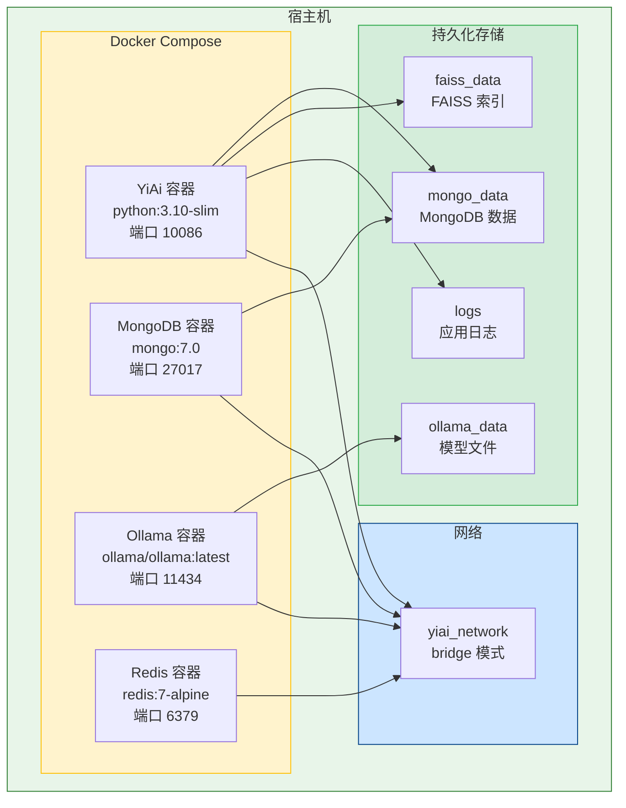
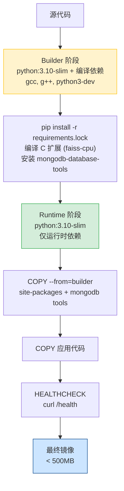
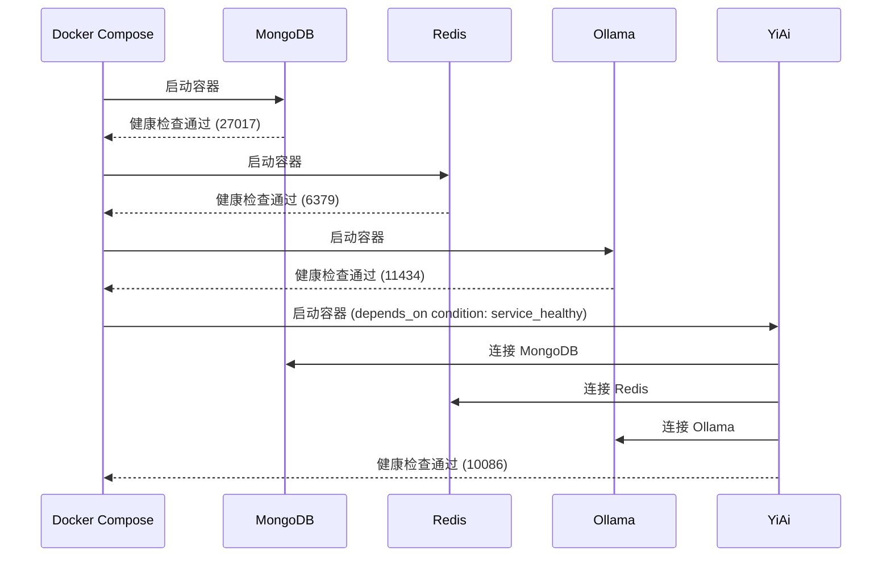
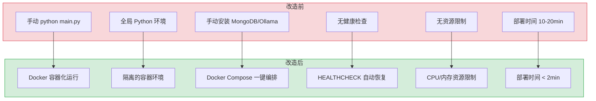

# YA-09-131: 容器化与 Docker 部署 — 多阶段构建 + Docker Compose + 健康检查 + 镜像优化

> 需求编号：YA-09-131 · 优先级：P1 · 人天：1.5d · 状态：需求已编写
> 依赖：无 · 前置需求：无

## 背景

YiAi 当前的部署方式为手动启动 Python 进程（`python main.py`），MongoDB 和 Ollama 需要独立安装和配置。这种方式存在以下问题：(1) 环境不一致，开发/测试/生产环境差异导致"在我机器上能跑"问题；(2) 依赖管理混乱，Python 包版本、系统库（如 MongoDB tools）需要手动安装；(3) 无标准化的部署流程，新人上手需要大量环境配置时间；(4) 无健康检查和自动重启机制，服务异常退出后需人工介入；(5) 无资源限制，服务可能耗尽系统资源影响其他进程。

**问题：**

1. **环境不一致**：开发环境（macOS）与生产环境（Linux）存在系统库差异，`mongodump`、`faiss` 等依赖在不同平台表现不同。
2. **手动部署流程**：每次部署需要手动拉代码、安装依赖、启动进程，无自动化，易出错。
3. **无健康检查**：服务异常退出或假死（进程存在但无响应）时无法自动恢复。
4. **无资源限制**：Python 进程可能因内存泄漏耗尽系统内存，影响同一主机上的其他服务（MongoDB、Ollama）。
5. **依赖服务管理**：MongoDB、Ollama、Redis 需要独立安装和配置，多服务协调复杂。

**影响：**

- 环境不一致 → 生产环境出现开发环境无法复现的 bug → 排查困难
- 手动部署 → 部署时间长（10-20 分钟）→ 发布频率低
- 无健康检查 → 服务异常后需人工发现和重启 → 故障恢复慢
- 无资源限制 → 内存泄漏影响全机 → 所有服务不可用
- 依赖管理混乱 → 新人上手时间 > 2 小时 → 团队效率低

**挑战：**

- YiAi 依赖 MongoDB 和 Ollama，镜像需要包含或连接这些外部服务
- Python 依赖中包含 `faiss-cpu`（C++ 编译），多阶段构建需要仔细处理编译依赖
- 镜像大小需要控制在合理范围（< 500MB），避免拉取和部署过慢
- 需要支持多架构构建（amd64/arm64），覆盖 Intel Mac 和 Apple Silicon
- Docker Compose 需要协调 4 个服务（YiAi + MongoDB + Redis + Ollama）的启动顺序和健康检查

---

## 一、现状分析

### 1.1 当前部署状态

| 属性 | 当前值 | 说明 |
|------|--------|------|
| 部署方式 | 手动 `python main.py` | 无容器化，进程直接运行在宿主机 |
| 环境管理 | 手动 `pip install -r requirements.txt` | 无虚拟环境隔离，全局 Python 环境 |
| 依赖服务 | 手动安装 MongoDB + Ollama | 各自独立启动，无编排 |
| 健康检查 | 无 | 进程异常退出后需人工重启 |
| 资源限制 | 无 | 无 CPU/内存限制 |
| 镜像 | 无 | 无 Dockerfile |
| 编排 | 无 | 无 Docker Compose |
| 部署时间 | 10-20 分钟 | 含环境配置、依赖安装、服务启动 |

### 1.2 根因分析矩阵

| 问题 | 根因 | 影响 | 紧急程度 |
|------|------|------|----------|
| 环境不一致 | 无容器化，依赖宿主机环境 | 开发/生产 bug 差异，排查困难 | 高 |
| 手动部署 | 无 CI/CD，无自动化部署脚本 | 部署慢，易出错，发布频率低 | 高 |
| 无健康检查 | 无容器编排，无进程监控 | 服务异常后无自动恢复 | 高 |
| 无资源限制 | 进程直接运行在宿主机，无 cgroups 隔离 | 内存泄漏影响全机 | 中 |
| 依赖管理混乱 | 无 `requirements.lock`，无版本锁定 | 依赖版本不一致导致 bug | 中 |
| 无镜像安全扫描 | 无容器化，无安全扫描流程 | 未知漏洞风险 | 中 |

### 1.3 改造前部署流程

```
开发环境:
  1. 安装 Python 3.10+
  2. pip install -r requirements.txt
  3. 安装 MongoDB（brew install mongodb-community）
  4. 安装 Ollama（brew install ollama）
  5. 启动 MongoDB（mongod）
  6. 启动 Ollama（ollama serve）
  7. python main.py

生产环境:
  1. SSH 登录服务器
  2. git pull
  3. pip install -r requirements.txt
  4. python main.py &
  5. 手动检查日志确认启动成功
```

---

## 二、设计决策

### 决策 1：基础镜像 — python:3.10-slim vs python:3.10-alpine vs Ubuntu 22.04

| 维度 | python:3.10-slim | python:3.10-alpine | ubuntu:22.04 + Python |
|------|-----------------|-------------------|----------------------|
| 镜像大小 | ~120MB | ~50MB | ~200MB（加 Python 后更大） |
| 编译依赖 | 基于 Debian，apt 可用 | 基于 musl libc，需 apk | 基于 Debian，apt 可用 |
| faiss-cpu 兼容性 | 高（预编译 wheel 可用） | 低（需从源码编译，musl 兼容性问题） | 高 |
| MongoDB tools 安装 | `apt install mongodb-database-tools` | `apk add mongodb-tools`（非官方） | 同 slim |
| 社区支持 | 官方镜像，广泛使用 | 官方镜像，但 musl 问题多 | 官方镜像 |
| C 扩展兼容性 | 高（glibc） | 低（musl libc，部分 C 扩展不兼容） | 高 |

**选择：python:3.10-slim。** `slim` 镜像在大小和兼容性之间取得平衡。`alpine` 虽然更小，但 `faiss-cpu` 和其他 C 扩展在 musl libc 下存在兼容性问题，编译和调试成本高。`slim` 基于 Debian，apt 包管理器成熟，MongoDB tools 和编译依赖均可直接安装。

### 决策 2：依赖管理 — requirements.txt vs Poetry vs pip-tools

| 维度 | requirements.txt | Poetry | pip-tools (pip-compile) |
|------|-----------------|--------|------------------------|
| 学习成本 | 低（标准工具） | 中（新工具链） | 低（标准工具） |
| 依赖锁定 | 否（需手动管理） | 是（poetry.lock） | 是（requirements.lock） |
| 与现有项目兼容 | 高（已使用 requirements.txt） | 低（需迁移） | 高（基于 pip） |
| 构建速度 | 快 | 中（poetry 解析慢） | 快 |
| Docker 层缓存 | 高（可精确控制） | 中 | 高（可精确控制） |

**选择：requirements.txt + pip-compile 生成 requirements.lock。** 保持与现有项目兼容，不引入新工具链。使用 `pip-compile` 从 `requirements.in`（顶层依赖）生成 `requirements.lock`（锁定所有依赖版本），确保构建可重现。Docker 构建时使用 `requirements.lock` 安装，利用 Docker 层缓存加速。

### 决策 3：多阶段构建 — 2 阶段 vs 3 阶段 vs 4 阶段

| 维度 | 2 阶段 (builder + runtime) | 3 阶段 (deps + builder + runtime) | 4 阶段 (+ test) |
|------|--------------------------|----------------------------------|-----------------|
| 镜像大小 | ~300MB | ~250MB | ~280MB |
| 构建时间 | 中 | 中（多一层） | 长 |
| 依赖隔离 | 中 | 高（编译依赖与运行依赖分离） | 高 |
| 安全性 | 中 | 高（编译工具不进入最终镜像） | 高 |

**选择：2 阶段构建（builder + runtime）。** builder 阶段安装所有编译依赖（gcc, g++, python3-dev），编译 C 扩展（faiss-cpu），安装 Python 包。runtime 阶段仅复制编译好的 site-packages 和运行时依赖，不包含编译工具链。2 阶段已可满足需求，3 阶段增加 deps 层对构建时间和镜像大小的优化有限（约 10-20MB），性价比不高。

### 决策 4：健康检查 — HTTP 端点 vs 进程检查 vs 综合检查

| 维度 | HTTP /health 端点 | 进程存活检查 | 综合检查（HTTP + MongoDB + Ollama） |
|------|-------------------|-------------|-------------------------------------|
| 准确性 | 中（服务可响应 HTTP） | 低（进程存在≠服务可用） | 高（检查所有依赖） |
| 实现复杂度 | 低 | 低 | 中 |
| 误报率 | 低 | 高 | 低 |
| 恢复建议 | 好 | 差 | 好 |

**选择：HTTP /health 端点 + 依赖检查。** 实现 `/health` 端点，返回服务状态和依赖健康度（MongoDB 连接、Ollama 连接）。Docker HEALTHCHECK 指令调用此端点，服务不可用时自动重启。依赖检查不阻塞健康检查（依赖下线时返回 degraded 状态而非 unhealthy），避免级联重启。

### 设计决策记录

| 决策 | 选项 A | 选项 B | 选择 | 理由 |
|------|--------|--------|------|------|
| 基础镜像 | python:3.10-slim | python:3.10-alpine | python:3.10-slim | faiss 等 C 扩展在 alpine/musl 下兼容性差 |
| 依赖管理 | requirements.txt | Poetry | requirements.txt + pip-compile | 保持现有工具链，添加锁定能力 |
| 构建阶段 | 2 阶段 | 3 阶段 | 2 阶段 | 3 阶段优化有限（~10MB），性价比不高 |
| 健康检查 | HTTP 端点 | 进程检查 | HTTP 端点 + 依赖检查 | 准确检测服务可用性，避免误报 |

---

## 三、目标架构

### 3.1 Docker 部署架构



### 3.2 多阶段构建流程



### 3.3 服务启动顺序



---

## 四、具体改动

### 4.1 多阶段 Dockerfile

**文件：** `Dockerfile`（新建，项目根目录）

```dockerfile
# ============================================================
# Builder 阶段: 编译 Python 依赖
# ============================================================
FROM python:3.10-slim AS builder

ENV PYTHONUNBUFFERED=1 \
    PYTHONDONTWRITEBYTECODE=1 \
    PIP_NO_CACHE_DIR=1 \
    PIP_DISABLE_PIP_VERSION_CHECK=1

# 安装编译依赖
RUN apt-get update && apt-get install -y --no-install-recommends \
    gcc \
    g++ \
    make \
    python3-dev \
    libffi-dev \
    libssl-dev \
    && rm -rf /var/lib/apt/lists/*

# 安装 Python 依赖
WORKDIR /build
COPY requirements.lock .
RUN pip install --upgrade pip setuptools wheel \
    && pip install -r requirements.lock \
    && pip install mongodb-database-tools 2>/dev/null || true

# 安装 MongoDB 命令行工具
RUN apt-get update && apt-get install -y --no-install-recommends \
    curl gnupg \
    && curl -fsSL https://www.mongodb.org/static/pgp/server-7.0.asc | gpg --dearmor -o /usr/share/keyrings/mongodb-server-7.0.gpg \
    && echo "deb [signed-by=/usr/share/keyrings/mongodb-server-7.0.gpg] http://repo.mongodb.org/apt/debian bookworm/mongodb-org/7.0 main" | tee /etc/apt/sources.list.d/mongodb-org-7.0.list \
    && apt-get update && apt-get install -y --no-install-recommends \
    mongodb-database-tools \
    && rm -rf /var/lib/apt/lists/*

# ============================================================
# Runtime 阶段: 最小运行时镜像
# ============================================================
FROM python:3.10-slim AS runtime

ENV PYTHONUNBUFFERED=1 \
    PYTHONDONTWRITEBYTECODE=1 \
    APP_HOME=/app

# 安装运行时依赖
RUN apt-get update && apt-get install -y --no-install-recommends \
    ca-certificates \
    curl \
    && rm -rf /var/lib/apt/lists/*

# 创建非 root 用户
RUN groupadd -r yiai && useradd -r -g yiai -d /app -s /sbin/nologin yiai

WORKDIR /app

# 从 builder 复制 Python site-packages
COPY --from=builder /usr/local/lib/python3.10/site-packages /usr/local/lib/python3.10/site-packages
COPY --from=builder /usr/local/bin /usr/local/bin

# 从 builder 复制 MongoDB 工具
COPY --from=builder /usr/bin/mongodump /usr/bin/mongodump
COPY --from=builder /usr/bin/mongorestore /usr/bin/mongorestore
COPY --from=builder /usr/bin/mongoexport /usr/bin/mongoexport
COPY --from=builder /usr/bin/mongoimport /usr/bin/mongoimport

# 复制应用代码
COPY --chown=yiai:yiai . .

# 创建数据目录
RUN mkdir -p /app/data/faiss /app/data/logs /app/data/backups \
    && chown -R yiai:yiai /app/data

# 切换到非 root 用户
USER yiai

# 健康检查
HEALTHCHECK --interval=30s --timeout=10s --start-period=60s --retries=3 \
    CMD curl -f http://localhost:10086/health || exit 1

# 暴露端口
EXPOSE 10086

# 启动命令
CMD ["python", "main.py"]
```

### 4.2 Docker Compose 编排

**文件：** `docker-compose.yml`（新建，项目根目录）

```yaml
version: "3.8"

services:
  mongodb:
    image: mongo:7.0
    container_name: yiai-mongodb
    restart: unless-stopped
    ports:
      - "27017:27017"
    environment:
      MONGO_INITDB_ROOT_USERNAME: ${MONGO_ROOT_USER:-admin}
      MONGO_INITDB_ROOT_PASSWORD: ${MONGO_ROOT_PASSWORD:-changeme}
    volumes:
      - mongo_data:/data/db
      - ./scripts/mongo-init.js:/docker-entrypoint-initdb.d/init.js:ro
    healthcheck:
      test: echo 'db.runCommand("ping").ok' | mongosh --quiet -u $${MONGO_INITDB_ROOT_USERNAME} -p $${MONGO_INITDB_ROOT_PASSWORD} --authenticationDatabase admin
      interval: 10s
      timeout: 5s
      retries: 5
      start_period: 30s
    networks:
      - yiai_network
    deploy:
      resources:
        limits:
          cpus: "2"
          memory: 2G
        reservations:
          cpus: "0.5"
          memory: 512M

  redis:
    image: redis:7-alpine
    container_name: yiai-redis
    restart: unless-stopped
    ports:
      - "6379:6379"
    command: redis-server --appendonly yes --requirepass ${REDIS_PASSWORD:-changeme}
    volumes:
      - redis_data:/data
    healthcheck:
      test: ["CMD", "redis-cli", "--raw", "incr", "ping"]
      interval: 10s
      timeout: 5s
      retries: 5
    networks:
      - yiai_network
    deploy:
      resources:
        limits:
          cpus: "1"
          memory: 512M
        reservations:
          cpus: "0.25"
          memory: 128M

  ollama:
    image: ollama/ollama:latest
    container_name: yiai-ollama
    restart: unless-stopped
    ports:
      - "11434:11434"
    volumes:
      - ollama_data:/root/.ollama
    healthcheck:
      test: ["CMD", "curl", "-f", "http://localhost:11434/api/tags"]
      interval: 30s
      timeout: 10s
      retries: 3
      start_period: 60s
    networks:
      - yiai_network
    deploy:
      resources:
        limits:
          cpus: "4"
          memory: 8G
        reservations:
          cpus: "1"
          memory: 2G

  yiai:
    build:
      context: .
      dockerfile: Dockerfile
      args:
        BUILDKIT_INLINE_CACHE: 1
    image: yiai:${YIAI_VERSION:-latest}
    container_name: yiai-app
    restart: unless-stopped
    ports:
      - "${YIAI_PORT:-10086}:10086"
    environment:
      - MONGO_URI=mongodb://${MONGO_ROOT_USER:-admin}:${MONGO_ROOT_PASSWORD:-changeme}@mongodb:27017
      - REDIS_URL=redis://:${REDIS_PASSWORD:-changeme}@redis:6379
      - OLLAMA_HOST=http://ollama:11434
      - APP_ENV=${APP_ENV:-production}
      - LOG_LEVEL=${LOG_LEVEL:-INFO}
      - BACKUP_LOCAL_DIR=/app/data/backups
      - FAISS_INDEX_DIR=/app/data/faiss
    volumes:
      - faiss_data:/app/data/faiss
      - logs:/app/data/logs
      - backups:/app/data/backups
    depends_on:
      mongodb:
        condition: service_healthy
      redis:
        condition: service_healthy
      ollama:
        condition: service_healthy
    healthcheck:
      test: ["CMD", "curl", "-f", "http://localhost:10086/health"]
      interval: 30s
      timeout: 10s
      retries: 3
      start_period: 90s
    networks:
      - yiai_network
    deploy:
      resources:
        limits:
          cpus: "2"
          memory: 2G
        reservations:
          cpus: "0.5"
          memory: 512M

volumes:
  mongo_data:
    driver: local
  redis_data:
    driver: local
  ollama_data:
    driver: local
  faiss_data:
    driver: local
  logs:
    driver: local
  backups:
    driver: local

networks:
  yiai_network:
    driver: bridge
```

### 4.3 环境配置

**文件：** `.env.example`（新建）

```bash
# YiAi 版本
YIAI_VERSION=latest

# 应用配置
YIAI_PORT=10086
APP_ENV=production
LOG_LEVEL=INFO

# MongoDB 配置
MONGO_ROOT_USER=admin
MONGO_ROOT_PASSWORD=changeme

# Redis 配置
REDIS_PASSWORD=changeme

# Ollama 配置
OLLAMA_HOST=http://ollama:11434

# 备份配置
BACKUP_LOCAL_DIR=/app/data/backups
BACKUP_REMOTE_DIR=/mnt/backup/mongodb

# FAISS 配置
FAISS_INDEX_DIR=/app/data/faiss
```

### 4.4 健康检查端点

**文件：** `services/health/health_routes.py`（新建）

```python
from fastapi import APIRouter
from motor.motor_asyncio import AsyncIOMotorClient
from shared.config import settings
from shared.logging import get_logger

logger = get_logger(__name__)
router = APIRouter(tags=["health"])


@router.get("/health")
async def health_check():
    """综合健康检查端点。"""
    checks = {
        "status": "healthy",
        "timestamp": __import__("time").time(),
        "checks": {},
    }

    # MongoDB 连接检查
    try:
        client = AsyncIOMotorClient(settings.mongo_uri, serverSelectionTimeoutMS=5000)
        await client.admin.command("ping")
        checks["checks"]["mongodb"] = "healthy"
    except Exception as e:
        checks["checks"]["mongodb"] = f"degraded: {str(e)[:100]}"
        checks["status"] = "degraded"

    # Redis 连接检查（如果配置了 Redis）
    if settings.redis_url:
        try:
            import redis.asyncio as redis
            r = redis.from_url(settings.redis_url)
            await r.ping()
            await r.close()
            checks["checks"]["redis"] = "healthy"
        except Exception as e:
            checks["checks"]["redis"] = f"degraded: {str(e)[:100]}"
            checks["status"] = "degraded"

    return checks


@router.get("/health/live")
async def liveness_check():
    """存活探针（仅检查进程是否存活）。"""
    return {"status": "alive"}


@router.get("/health/ready")
async def readiness_check():
    """就绪探针（检查所有依赖是否就绪）。"""
    # 简化版健康检查，用于 K8s readiness probe
    try:
        client = AsyncIOMotorClient(settings.mongo_uri, serverSelectionTimeoutMS=2000)
        await client.admin.command("ping")
        return {"status": "ready"}
    except Exception:
        return {"status": "not_ready"}
```

### 4.5 .dockerignore

**文件：** `.dockerignore`（新建）

```
# Python
__pycache__/
*.py[cod]
*.egg-info/
.eggs/
dist/
build/
*.egg

# 虚拟环境
venv/
.venv/
env/

# Git
.git/
.gitignore
.gitattributes

# IDE
.vscode/
.idea/
*.swp
*.swo

# 测试
tests/
.pytest_cache/
.coverage
htmlcov/

# 文档
*.md
!requirements.md

# 环境文件
.env
.env.local
.env.*.local

# 日志和数据
logs/
data/
*.log

# Docker
Dockerfile
docker-compose*.yml
.dockerignore

# CI/CD
.github/
.gitlab-ci.yml

# 系统文件
.DS_Store
Thumbs.db
```

### 4.6 多架构构建脚本

**文件：** `scripts/build-multiarch.sh`（新建）

```bash
#!/bin/bash
set -euo pipefail

VERSION="${1:-latest}"
REGISTRY="${DOCKER_REGISTRY:-}"
IMAGE_NAME="${REGISTRY}yiai"

echo "构建多架构 Docker 镜像: ${IMAGE_NAME}:${VERSION}"

# 创建并使用 buildx builder
docker buildx create --name yiai-builder --use 2>/dev/null || docker buildx use yiai-builder

# 构建并推送多架构镜像
docker buildx build \
  --platform linux/amd64,linux/arm64 \
  --tag "${IMAGE_NAME}:${VERSION}" \
  --tag "${IMAGE_NAME}:latest" \
  --push \
  --cache-from "type=registry,ref=${IMAGE_NAME}:buildcache" \
  --cache-to "type=registry,ref=${IMAGE_NAME}:buildcache,mode=max" \
  .

echo "构建完成: ${IMAGE_NAME}:${VERSION}"
```

### 4.7 涉及文件

```
YiAi/
├── Dockerfile                    # 新建: 多阶段构建
├── .dockerignore                 # 新建: 忽略文件
├── docker-compose.yml            # 新建: 服务编排
├── docker-compose.dev.yml        # 新建: 开发环境覆盖
├── .env.example                  # 新建: 环境变量模板
├── scripts/
│   ├── build-multiarch.sh        # 新建: 多架构构建脚本
│   └── mongo-init.js            # 新建: MongoDB 初始化脚本
├── services/health/
│   ├── __init__.py               # 新建
│   └── health_routes.py          # 新建: 健康检查端点
├── requirements.in               # 新建: 顶层依赖
├── requirements.lock             # 新建: 锁定依赖
└── main.py                       # 修改: 注册健康检查路由
```

---

## 五、实施步骤

| 步骤 | 内容 | 涉及文件 | 验证方式 | 人天 |
|------|------|---------|---------|------|
| 1 | 编写 `requirements.in` + `pip-compile` 生成 `requirements.lock` | `requirements.in`, `requirements.lock` | `pip install -r requirements.lock` 成功，无版本冲突 | 0.1 |
| 2 | 编写多阶段 Dockerfile（builder + runtime） | `Dockerfile` | `docker build -t yiai .` 成功，镜像 < 500MB | 0.3 |
| 3 | 编写 `.dockerignore` 和 `.env.example` | `.dockerignore`, `.env.example` | 构建上下文 < 10MB，环境变量可正常读取 | 0.05 |
| 4 | 编写 Docker Compose 编排（4 个服务） | `docker-compose.yml` | `docker compose up -d` 所有服务健康 | 0.25 |
| 5 | 实现健康检查端点（/health, /health/live, /health/ready） | `services/health/health_routes.py` | `curl /health` 返回服务状态，依赖检查正确 | 0.15 |
| 6 | 编写 MongoDB 初始化脚本 | `scripts/mongo-init.js` | 容器启动后数据库和集合自动创建 | 0.1 |
| 7 | 编写多架构构建脚本 | `scripts/build-multiarch.sh` | `./scripts/build-multiarch.sh` 生成 amd64+arm64 镜像 | 0.15 |
| 8 | 配置资源限制（CPU/内存） | `docker-compose.yml` | `docker stats` 确认资源限制生效 | 0.1 |
| 9 | 镜像安全扫描（Trivy） | CI 配置 | 无 HIGH/CRITICAL 漏洞 | 0.15 |
| 10 | 全链路集成测试 | Docker Compose 环境 | 所有服务启动，API 可正常调用 | 0.15 |

**总计：1.5d**

---

## 六、测试规格

### Requirement: Docker 镜像构建

#### Scenario: 多阶段构建成功且镜像大小符合要求
- **Given** 完整的项目源代码和 `requirements.lock`
- **When** 执行 `docker build -t yiai:test .`
- **Then** 构建成功，镜像大小 < 500MB
- **And** 镜像中不包含 gcc/g++/make 等编译工具
- **And** 应用以非 root 用户 `yiai` 运行

#### Scenario: 构建缓存命中时快速重建
- **Given** 首次构建已完成，仅修改了应用代码（非依赖）
- **When** 再次执行 `docker build -t yiai:test .`
- **Then** 依赖安装层使用缓存，构建时间 < 30s
- **And** 仅应用代码层重新构建

### Requirement: Docker Compose 编排

#### Scenario: 所有服务正常启动
- **Given** `.env` 文件已配置
- **When** 执行 `docker compose up -d`
- **Then** MongoDB、Redis、Ollama、YiAi 4 个容器全部启动
- **And** `docker compose ps` 所有服务状态为 `healthy`
- **And** YiAi 在 MongoDB/Redis/Ollama 就绪后才启动

#### Scenario: 依赖服务未就绪时 YiAi 等待
- **Given** MongoDB 容器启动但健康检查未通过
- **When** YiAi 容器尝试启动
- **Then** YiAi 等待 MongoDB 健康检查通过后才启动
- **And** 日志中无 MongoDB 连接失败错误

### Requirement: 健康检查

#### Scenario: 所有依赖正常时返回 healthy
- **Given** MongoDB、Redis 均正常运行
- **When** 请求 `GET /health`
- **Then** 返回 `{"status": "healthy", "checks": {"mongodb": "healthy", "redis": "healthy"}}`
- **And** HTTP 状态码 200

#### Scenario: MongoDB 不可用时返回 degraded
- **Given** MongoDB 容器已停止
- **When** 请求 `GET /health`
- **Then** 返回 `{"status": "degraded", "checks": {"mongodb": "degraded: ..."}}`
- **And** HTTP 状态码 200（不返回 500，避免容器被重启）

### Requirement: 资源限制

#### Scenario: 内存限制生效
- **Given** YiAi 容器配置 `memory: 2G`
- **When** 容器内存使用接近 2G
- **Then** Docker 限制容器内存使用，超出时 OOM Kill
- **And** `docker stats` 显示 MEM USAGE / LIMIT

### Requirement: 多架构构建

#### Scenario: 构建 amd64 和 arm64 镜像
- **Given** Docker Buildx builder 已配置
- **When** 执行 `./scripts/build-multiarch.sh v1.0`
- **Then** 生成 `linux/amd64` 和 `linux/arm64` 两个架构的镜像
- **And** 镜像推送到配置的 registry

---

## 七、风险与缓解

| 风险 | 概率 | 影响 | 等级 | 缓解措施 | 应急预案 |
|------|------|------|------|----------|----------|
| Ollama 镜像体积过大（> 5GB） | 高 | 中 | 中 | Ollama 镜像已包含运行时，模型文件通过 volume 挂载，首次拉取时间长但后续不变 | 预拉取 Ollama 镜像到宿主机，或使用宿主机的 Ollama 服务 |
| 多架构构建在 CI 中耗时过长 | 中 | 低 | 中 | 使用 Docker Buildx 缓存（`--cache-from`），CI 中缓存 registry 层 | 紧急发布时仅构建 amd64，后续补 arm64 |
| 生产环境容器内文件权限问题 | 中 | 中 | 中 | Dockerfile 中显式设置 `USER yiai`，volume 挂载时指定 `uid:gid` | 临时以 root 运行，修复权限后恢复 |
| Docker Compose 网络冲突 | 低 | 中 | 低 | 使用自定义 bridge 网络 `yiai_network`，避免与默认网络冲突 | 修改 `docker-compose.yml` 中的网络名 |
| 健康检查端点被外部利用 | 低 | 低 | 低 | 健康检查端点不暴露敏感信息，仅返回状态摘要 | 生产环境通过反向代理限制 `/health` 访问来源 |
| 镜像安全漏洞 | 中 | 中 | 中 | 定期运行 `trivy image yiai` 扫描，CI 中阻断 HIGH/CRITICAL 漏洞 | 发现漏洞后紧急更新基础镜像或依赖版本 |

---

## 八、回滚策略

| 场景 | 回滚方式 | 回滚时间 | 风险 |
|------|---------|---------|------|
| Docker 部署失败 | 停止容器 `docker compose down`，恢复手动启动 `python main.py` | < 2min | 低：手动启动方式不受影响 |
| 镜像构建失败 | 使用上一个成功的镜像版本 `docker compose up -d`（指定旧版本） | < 1min | 低：旧镜像可用 |
| Docker Compose 配置错误 | 回退 `docker-compose.yml` 到上一个版本，重新 `docker compose up -d` | < 1min | 低：git 回退即可 |
| 健康检查导致容器频繁重启 | 临时禁用健康检查 `docker compose up -d --no-healthcheck` 或调整 `start_period` | < 1min | 低：服务可正常运行 |
| 资源限制过紧导致 OOM | 调整 `docker-compose.yml` 中 `memory` 限制，`docker compose up -d` 重新创建 | < 2min | 低：调整配置即可 |

---

## 九、设计决策记录

### D-01: 为什么选择 2 阶段构建而非单阶段？

单阶段构建会将 gcc、g++、python3-dev 等编译工具保留在最终镜像中，增加镜像体积约 180MB，且增加攻击面（编译工具可被利用）。2 阶段构建将编译依赖隔离在 builder 阶段，runtime 阶段仅复制编译产物，镜像体积减少约 35%，安全性提升。

### D-02: 为什么 health check 在 MongoDB 不可用时返回 degraded 而非 unhealthy？

Docker 的 HEALTHCHECK 在返回非零退出码时会将容器标记为 unhealthy，触发重启策略。如果 MongoDB 暂时不可用（如重启），YiAi 容器不应被重启（级联重启可能导致所有服务循环重启）。返回 degraded 状态（HTTP 200）让 Docker 认为容器健康，同时通过监控告警通知运维人员 MongoDB 问题。

### D-03: 为什么使用 `depends_on: condition: service_healthy` 而非 `depends_on` 默认行为？

默认的 `depends_on` 仅等待容器启动（进程存在），不等待服务就绪。MongoDB 容器启动后可能需要 10-30 秒才能接受连接，如果 YiAi 在 MongoDB 就绪前启动，会导致连接失败。`condition: service_healthy` 确保 YiAi 在依赖服务的健康检查通过后才启动，避免启动顺序问题。

### D-04: 为什么不使用 Docker Swarm 或 Kubernetes 进行编排？

当前 YiAi 为单节点部署，无多节点集群需求。Docker Compose 足以满足单机多容器编排需求，且配置简单（一个 YAML 文件）。若未来需要多节点部署、自动扩缩容、滚动更新等高级编排能力，迁移到 Docker Swarm 或 K8s 的 `kompose` 工具可自动转换 Compose 文件。

---

## 十、可观测性

### 关键指标

| 指标 | 采集方式 | 告警阈值 | 说明 |
|------|---------|---------|------|
| 容器 CPU 使用率 | `docker stats` / cAdvisor | > 80% `limits.cpus` | CPU 接近限制，可能影响响应时间 |
| 容器内存使用率 | `docker stats` / cAdvisor | > 80% `limits.memory` | 内存接近限制，有 OOM 风险 |
| 容器重启次数 | `docker ps --format` | > 3 次/小时 | 频繁重启表示服务不稳定 |
| 镜像大小 | `docker images` | > 500MB | 镜像过大，拉取和部署慢 |
| 镜像拉取时间 | CI 日志 | > 60s | 网络或 registry 问题 |
| 健康检查状态 | `/health` 端点 | status != healthy | 服务或依赖异常 |
| 容器启动时间 | `docker compose up` 日志 | > 120s | 启动慢，检查依赖健康检查配置 |
| 磁盘使用率 (volumes) | `docker system df` | > 80% | 数据卷空间不足 |

### 告警规则

| 告警名称 | 条件 | 通知渠道 | 处理建议 |
|---------|------|---------|---------|
| 容器频繁重启 | 重启次数 > 3 次/小时 | 企业微信 | 检查容器日志，排查 OOM 或未捕获异常 |
| 镜像构建失败 | CI 构建失败 | 企业微信 | 检查 Dockerfile 和依赖变更 |
| 服务健康检查失败 | /health 返回非 healthy | 企业微信 | 检查依赖服务状态 |
| 内存使用接近限制 | 内存使用率 > 80% | 企业微信 | 检查内存泄漏，考虑增加限制 |

### 日志规范

| 日志级别 | 场景 | 示例 |
|---------|------|------|
| `INFO` | 容器启动 | `[Docker] YiAi 容器启动, version=1.2.3, env=production` |
| `INFO` | 健康检查 | `[Health] 健康检查通过: mongodb=healthy, redis=healthy` |
| `WARN` | 依赖降级 | `[Health] MongoDB 连接降级: ServerSelectionTimeoutError` |
| `ERROR` | 容器启动失败 | `[Docker] 容器启动失败: MongoDB 连接超时` |

---

## 十一、代码审查检查清单

- [ ] Dockerfile 使用多阶段构建（builder + runtime），builder 阶段安装编译依赖，runtime 阶段仅保留运行时
- [ ] 最终镜像以非 root 用户运行（`USER yiai`）
- [ ] `HEALTHCHECK` 指令配置正确（interval=30s, timeout=10s, retries=3）
- [ ] `.dockerignore` 排除 `.git`、`__pycache__`、`tests/`、`.env` 等无关文件
- [ ] Docker Compose 中所有服务配置了 `restart: unless-stopped`
- [ ] Docker Compose 中 YiAi 使用 `depends_on: condition: service_healthy` 等待依赖就绪
- [ ] 所有持久化数据使用 named volumes（`mongo_data`, `faiss_data`, `logs`）
- [ ] 敏感信息通过环境变量传入，不在镜像中硬编码
- [ ] `.env.example` 提供所有必需的环境变量模板
- [ ] 资源限制（`deploy.resources.limits`）对每个服务合理配置
- [ ] 健康检查端点 `/health` 在依赖不可用时返回 `degraded` 而非 `unhealthy`
- [ ] 多架构构建脚本支持 `linux/amd64` 和 `linux/arm64`
- [ ] `ruff` 代码规范通过
- [ ] `mypy` 类型检查通过

---

## 十二、回归问题预测

| # | 问题 | 发现场景 | 根因 | 修复方式 |
|---|------|---------|------|---------|
| 1 | `faiss-cpu` 在 Docker 构建时编译失败，`swig` 或 `libopenblas-dev` 缺失 | builder 阶段 `pip install` 时，`faiss-cpu` 的 C++ 扩展需要 `swig` 和 `libopenblas-dev`，但 Dockerfile 中未安装这些依赖 | `faiss-cpu` 依赖 BLAS 库进行向量计算，`slim` 镜像的 `apt` 安装列表不完整 | 在 builder 阶段添加 `apt-get install -y swig libopenblas-dev`，或使用 `faiss-cpu` 的预编译 wheel（`pip install faiss-cpu --only-binary=:all:`） |
| 2 | Docker Compose 中 `ollama` 服务首次启动时 `pull` 模型，健康检查超时 | `ollama/ollama` 镜像启动后无模型，需要执行 `ollama pull` 下载模型（qwen2.5 约 4GB），`start_period: 60s` 不足以完成下载 | 健康检查调用 `/api/tags` 返回模型列表，但模型下载需要几分钟，60 秒超时导致容器被标记为 unhealthy | 在 `docker-compose.yml` 中为 Ollama 添加初始化脚本（`entrypoint` 中自动 `ollama pull`），或 `start_period` 设为 300s，或使用已包含模型的镜像 |
| 3 | Volume 挂载的 `faiss_data` 目录权限问题，容器内 `yiai` 用户无法写入 | 宿主机上的 volume 目录由 Docker 自动创建，默认权限为 `root:root (755)`，`yiai` 用户（uid 1000）无法写入 | Docker named volume 在 Linux 上默认挂载到 `/var/lib/docker/volumes/`，目录权限为 `root:root`，非 root 容器用户无法写入 | 在 Dockerfile 中创建目录时使用 `chown -R yiai:yiai`，或使用 `user: "1000:1000"` 在 Compose 中指定 uid:gid，或在 entrypoint 脚本中 `chmod 777`（不推荐） |
| 4 | `docker compose up` 时 `depends_on: condition: service_healthy` 在 Docker Compose v2 中行为与 v3 不同 | 使用 `docker compose` (v2) 时 `condition: service_healthy` 正常等待，但使用 `docker-compose` (v1) 时 `condition` 不被支持，YiAi 在依赖未就绪时启动 | Docker Compose v1 (Python) 不支持 `condition: service_healthy`，仅支持 `condition: service_started`，v3 格式文件在 v1 中会报 warning 并忽略 condition | 在文档中明确要求 Docker Compose v2（`docker compose` 而非 `docker-compose`），或添加 `entrypoint` 等待脚本（`wait-for-it.sh`）作为兜底 |
| 5 | 多架构构建时 `python:3.10-slim` 的 arm64 manifest 不可用，构建失败 | ARM64 构建节点（Apple Silicon）上 `docker buildx build --platform linux/arm64` 时，基础镜像的 arm64 版本不存在或版本不匹配 | Docker Hub 上 `python:3.10-slim` 支持 arm64，但特定 digest 可能不可用，或 `bookworm` 变体在 arm64 上的包版本不同 | 在 `build-multiarch.sh` 中添加 `docker buildx imagetools inspect python:3.10-slim` 检查 manifest 可用性，构建前验证 |
| 6 | Docker 健康检查 `curl` 不可用导致容器始终 unhealthy | `curl` 在 `python:3.10-slim` 中未预装，`HEALTHCHECK` 指令中的 `CMD curl -f ...` 失败 | `python:3.10-slim` 基于 Debian slim，未包含 `curl`，`HEALTHCHECK` 中的 `curl` 命令返回 `exit 127 (command not found)` | 在 runtime 阶段 `apt-get install -y curl`，或使用 Python 健康检查脚本 `CMD python -c "import urllib.request; urllib.request.urlopen('http://localhost:10086/health')"` |

---

## 十三、性能分析

### 13.1 镜像构建性能

| 操作 | 耗时 | 镜像大小 | 说明 |
|------|------|----------|------|
| Builder 阶段（首次） | ~180s | ~800MB（含编译依赖） | 首次构建需下载基础镜像 + 安装依赖 |
| Builder 阶段（缓存命中） | ~30s | — | 依赖层缓存命中，仅安装新依赖 |
| Runtime 阶段（首次） | ~60s | ~300MB | 复制 site-packages + 应用代码 |
| Runtime 阶段（缓存命中） | ~10s | — | 仅复制应用代码层 |
| 最终镜像大小 | — | ~300MB | 不含编译工具，含 Python + 依赖 + 应用 |
| 多架构构建（amd64+arm64） | ~300s | ~300MB x2 | 并行构建，QEMU 模拟 arm64 较慢 |

### 13.2 容器启动性能

| 操作 | 耗时 | 说明 |
|------|------|------|
| MongoDB 容器启动 | ~10s | 首次需初始化数据目录 |
| Redis 容器启动 | ~3s | Alpine 镜像，启动快速 |
| Ollama 容器启动 | ~15s | 不含模型下载时间 |
| YiAi 容器启动 | ~30s | 含健康检查 start_period 90s 内完成 |
| 全部服务启动（docker compose up） | ~60s | 并行启动，MongoDB 最慢 |

### 13.3 资源使用预估

| 服务 | CPU 限制 | 内存限制 | 磁盘 (volume) | 说明 |
|------|---------|---------|--------------|------|
| MongoDB | 2 核 | 2G | 2GB 起步 | 数据量增长，建议预留 10GB |
| Redis | 1 核 | 512M | 100MB | 缓存数据，AOF 持久化 |
| Ollama | 4 核 | 8G | 10GB+ | 模型文件大（qwen2.5 ~4GB），GPU 推荐 |
| YiAi | 2 核 | 2G | 500MB | 应用 + FAISS 索引 + 日志 |
| 总计 | 9 核 | 12.5G | ~13GB | 建议宿主机 16 核 16G+ |

---

## 十四、当前架构 vs 目标架构

### 改造前后对比



### 架构决策权衡

| 维度 | 改造前 | 改造后 | 权衡说明 |
|------|--------|--------|----------|
| 环境一致性 | 依赖宿主机，差异大 | Docker 镜像，完全一致 | 消除"在我机器上能跑"问题 |
| 部署速度 | 10-20 分钟 | < 2 分钟 | 部署速度提升 5-10 倍 |
| 故障恢复 | 人工发现和重启 | 健康检查 + 自动重启 | 故障恢复从分钟级降至秒级 |
| 资源隔离 | 无隔离，互相影响 | cgroups 资源限制 | 单服务 OOM 不影响其他服务 |
| 运维复杂度 | 低（无容器） | 中（需学习 Docker/Compose） | 学习成本换来标准化和可重复性 |
| 新人上手 | > 2 小时环境配置 | < 5 分钟（docker compose up） | 上手时间降低 95% |

---

*PRD 来源: `projects/yiai/requirements/2026-09/00-需求-需求总览.md`*

## 影响范围

- **影响模块**：待补充
- **涉及文件**：
- 待补充
- **是否影响 API 契约**：否
- **是否影响其他项目（YiVad/YiPet）**：否
- **用户感知**：待确认

## 预防措施

| 层面 | 措施 |
|------|------|
| 代码 | 在相关函数中添加参数校验和边界检查 |
| 测试 | 添加对应的自动化测试用例 |
| 流程 | 代码审查时重点检查此类模式 |
| 监控 | 添加日志告警，异常发生时及时发现 |
| 文档 | 在编码规范中记录此类反模式 |

## 经验教训

1. **根本原因**：开发过程中对边界情况和异常路径的考虑不足是此类问题的共同根因
2. **设计阶段**：在接口设计和模块实现时，应主动考虑异常输入、空值、超时等边界场景
3. **代码审查**：审查时应检查是否存在类似的反模式（如未捕获异常、无超时控制、缺少参数校验等）
4. **测试覆盖**：异常路径的测试覆盖率应与正常路径同等重视
5. **团队分享**：此类问题应在团队周会或技术分享中讨论，形成团队共识
