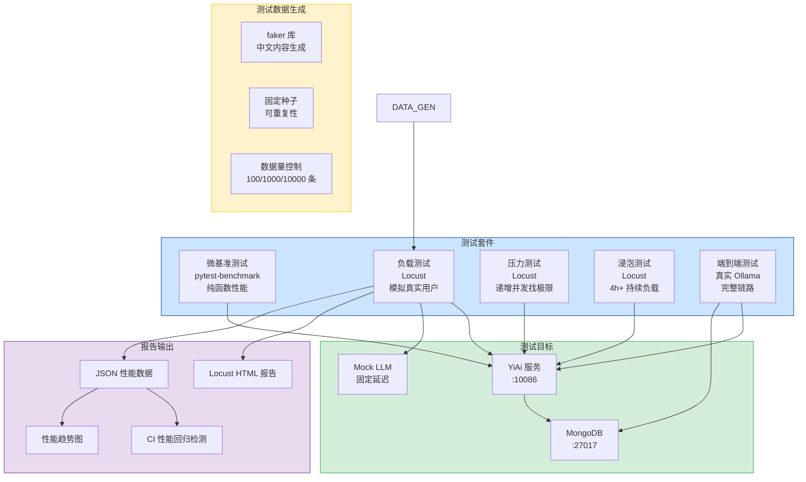
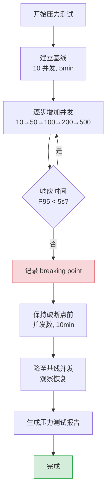

# YA-09-132: 负载与压力测试 — Locust 性能基准 + 压力测试 + 长时浸泡 + CI 回归检测

> 需求编号：YA-09-132 · 优先级：P2 · 人天：1.0d · 状态：需求已编写
> 依赖：无 · 前置需求：YA-09-131（Docker 部署，可选）

## 背景

YiAi 目前没有任何性能测试体系，无法回答以下关键问题：(1) 系统在多少并发用户下能保持稳定？(2) 各 API 端点的 P50/P95/P99 延迟是多少？(3) 性能回归是否已发生？(4) 系统的最大吞吐量（breaking point）在哪里？(5) 长时间运行是否存在内存泄漏？缺乏性能基线意味着每次架构变更或代码重构后，性能退化无法被及时发现，可能导致生产环境性能事故。

**问题：**

1. **无性能基线**：不知道系统在正常负载下的表现，无法评估优化的效果。
2. **无压力测试**：不知道系统的最大承载能力，无法做容量规划。
3. **无内存泄漏检测**：长时间运行后服务是否稳定，没有数据支撑。
4. **无性能回归检测**：每次代码变更后，性能是否退化无法自动检测。
5. **无测试数据生成**：没有逼真的测试数据，测试结果不可信。

**影响：**

- 无性能基线 → 无法评估优化效果 → 优化方向盲目
- 无压力测试 → 不知道系统极限 → 流量突增时系统崩溃
- 无内存泄漏检测 → 长时间运行后性能下降 → 用户感知变慢
- 无性能回归 → 性能退化无感知 → 生产环境性能事故
- 无测试数据 → 测试结果不可信 → 浪费测试资源

**挑战：**

- RAG 查询和 Agent 循环依赖外部 Ollama 服务，如何模拟真实的 LLM 调用延迟
- SSE 流式端点的性能测试与普通 HTTP 端点不同，需要特殊的测试工具
- 测试数据需要逼真（真实的知识库内容、会话数据），模拟真实负载
- 内存泄漏检测需要长时间运行，如何在 CI 中高效执行
- 性能基准的波动性（受宿主机负载影响），如何设定合理的阈值

---

## 一、现状分析

### 1.1 当前性能测试状态

| 属性 | 当前值 | 说明 |
|------|--------|------|
| 性能测试 | 无 | 无负载测试、压力测试、浸泡测试 |
| 性能基线 | 无 | 无 P50/P95/P99 延迟数据 |
| 测试工具 | 无 | 未引入 Locust/k6/wrk 等工具 |
| 测试数据 | 手动创建 | 测试数据量小，不具代表性 |
| CI 集成 | 无 | 无自动化性能回归检测 |
| 内存泄漏检测 | 无 | 无长时间运行监控 |

### 1.2 根因分析矩阵

| 问题 | 根因 | 影响 | 紧急程度 |
|------|------|------|----------|
| 无性能基线 | 项目初期规模小，未规划性能测试 | 无法评估系统性能和优化效果 | 中 |
| 无压力测试 | 缺乏流量预估和容量规划意识 | 流量突增时无应对数据 | 中 |
| 无内存泄漏检测 | 缺乏运维监控，未发现潜在问题 | 长时间运行后性能下降 | 中 |
| 无 CI 性能回归 | 无自动化测试基础设施 | 性能退化无感知 | 中 |
| 无测试数据 | 缺乏数据生成脚本 | 测试结果不可信 | 中 |

### 1.3 改造前性能认知

```
当前性能认知:
  API 响应时间: "感觉挺快的"（主观感受）
  并发能力: "应该能支持几十个用户"（猜测）
  内存使用: "好像没有泄漏"（无数据支撑）
  瓶颈: 未知
  极限: 未知
```

---

## 二、设计决策

### 决策 1：性能测试工具 — Locust vs k6 vs wrk2 vs pytest-benchmark

| 维度 | Locust | k6 | wrk2 | pytest-benchmark |
|------|--------|----|------|-----------------|
| 脚本语言 | Python | JavaScript | Lua | Python |
| 与项目语言一致 | 是（Python） | 否 | 否 | 是（Python） |
| SSE/WebSocket 支持 | 中（需自定义） | 高（原生支持） | 低（仅 HTTP） | 低（仅函数级） |
| 分布式测试 | 是（master-worker） | 是（k6 cloud） | 否 | 否 |
| 报告生成 | 中（Web UI + CSV） | 高（内置 HTML 报告） | 低（仅终端输出） | 低（pytest 集成） |
| CI 集成 | 高（headless 模式） | 高（JSON 输出） | 中 | 高（pytest 插件） |
| 学习成本 | 低（Python） | 中（JS + 新概念） | 低 | 低 |

**选择：Locust（主） + pytest-benchmark（辅）。** Locust 使用 Python 编写测试脚本，与 YiAi 后端语言一致，团队无需学习新语言。支持分布式压测，可模拟复杂用户行为（登录、浏览、操作）。pytest-benchmark 用于微基准测试（纯函数性能），集成到现有 pytest 测试套件中。

### 决策 2：测试数据 — 随机生成 vs 真实数据脱敏 vs 半真实

| 维度 | 随机生成 | 真实数据脱敏 | 半真实（模板 + 随机） |
|------|---------|-------------|---------------------|
| 逼真度 | 低 | 高 | 中 |
| 数据安全 | 高（无真实数据） | 低（需脱敏） | 高（无真实数据） |
| 可重复性 | 高（固定种子） | 中（依赖数据快照） | 高（固定种子） |
| 实现复杂度 | 低 | 中（脱敏流程） | 中 |
| 数据量控制 | 精确 | 依赖真实数据量 | 精确 |

**选择：半真实数据（模板 + 随机种子）。** 使用 `faker` 库生成中文内容，结合知识库模板（如技术文档、聊天对话模板），生成逼真但不包含真实用户数据的测试数据。固定随机种子确保可重复性。

### 决策 3：CI 集成策略 — 每次 PR vs 每日定时 vs 手动触发

| 维度 | 每次 PR | 每日定时 | 手动触发 |
|------|---------|---------|---------|
| 反馈速度 | 即时 | 次日 | 按需 |
| CI 资源消耗 | 高（每次构建都跑） | 中（每日一次） | 低 |
| 性能退化检测 | 最快 | 延迟 1 天 | 延迟 |
| 误报率 | 高（CI 环境波动） | 中 | 低 |

**选择：每日定时（夜间） + 手动触发。** 每次 PR 运行轻量级性能冒烟测试（pytest-benchmark 微基准），每日凌晨运行完整负载测试套件。避免 CI 环境波动导致的误报，同时保证性能退化的及时发现。

### 决策 4：LLM 调用模拟 — Mock vs 真实 Ollama vs 录制回放

| 维度 | Mock（固定响应） | 真实 Ollama | 录制回放（VCR） |
|------|-----------------|------------|----------------|
| 稳定性 | 高（无外部依赖） | 低（Ollama 负载波动） | 高 |
| 真实性 | 低 | 高 | 中 |
| 资源消耗 | 低 | 极高（GPU 占用） | 低 |
| 可重复性 | 高 | 低 | 高 |

**选择：Mock + 录制回放混合。** 负载测试使用 Mock LLM 服务（固定延迟和响应），确保性能基准稳定可重复。在线端到端测试使用真实 Ollama 验证完整链路。录制回放用于 Agent 循环测试（录制一次真实执行，后续回放）。

### 设计决策记录

| 决策 | 选项 A | 选项 B | 选择 | 理由 |
|------|--------|--------|------|------|
| 测试工具 | Locust | k6 | Locust | Python 语言一致，团队学习成本低 |
| 测试数据 | 随机生成 | 半真实 | 半真实 | 逼真度高，可重复性高，无安全风险 |
| CI 集成 | 每次 PR | 每日定时 | 每日定时 + 手动触发 | 避免 CI 波动误报，保证检测覆盖 |
| LLM 模拟 | Mock | 真实 Ollama | Mock + 录制回放 | 负载测试稳定可重复，端到端测试真实 |

---

## 三、目标架构

### 3.1 性能测试体系架构



### 3.2 压力测试策略



---

## 四、具体改动

### 4.1 Locust 测试文件

**文件：** `tests/performance/locustfile.py`（新建）

```python
"""
YiAi 性能测试 - Locust 主测试文件。
运行: locust -f tests/performance/locustfile.py --host=http://localhost:10086
"""
import random
import time
import json
from locust import HttpUser, task, between, events
from locust.exception import StopUser


class YiAiUser(HttpUser):
    """模拟真实用户行为。"""
    wait_time = between(1, 3)  # 用户操作间隔 1-3 秒

    def on_start(self):
        """用户初始化：登录获取 token。"""
        self.token = "test_token_perf_test"
        self.session_id = f"perf_{random.randint(1, 10000)}"
        self.headers = {"X-Token": self.token, "Content-Type": "application/json"}

    def _rpc(self, module_name: str, method_name: str, parameters: dict) -> dict:
        """发送 RPC 信封请求。"""
        body = {
            "module_name": module_name,
            "method_name": method_name,
            "parameters": parameters,
        }
        with self.client.post("/", json=body, headers=self.headers, catch_response=True) as resp:
            if resp.status_code != 200:
                resp.failure(f"HTTP {resp.status_code}: {resp.text[:200]}")
            return resp.json()

    # ============================================================
    # 任务组（权重控制请求比例）
    # ============================================================

    @task(10)
    def chat_query(self):
        """聊天查询（高频，权重 10）。"""
        self._rpc("services.ai.chat_service", "chat", {
            "session_id": self.session_id,
            "message": "什么是 RAG？",
            "stream": False,
        })

    @task(8)
    def data_query(self):
        """数据查询（高频，权重 8）。"""
        self._rpc("services.data.data_service", "query_documents", {
            "cname": "sessions",
            "filter": {"status": "active"},
            "page": 1,
            "page_size": 20,
        })

    @task(5)
    def rag_search(self):
        """RAG 检索（中频，权重 5）。"""
        self._rpc("services.rag.rag_service", "search", {
            "query": "如何配置 MongoDB 连接？",
            "top_k": 5,
        })

    @task(3)
    def knowledge_list(self):
        """知识库列表（中频，权重 3）。"""
        self._rpc("services.knowledge.knowledge_service", "list_files", {
            "page": 1,
            "page_size": 50,
        })

    @task(2)
    def session_crud(self):
        """会话 CRUD（低频，权重 2）。"""
        self._rpc("services.data.data_service", "upsert_document", {
            "cname": "sessions",
            "document": {
                "key": self.session_id,
                "title": f"性能测试会话 {random.randint(1, 10000)}",
                "messages": [],
                "updated": time.time(),
            },
        })

    @task(1)
    def health_check(self):
        """健康检查（低频，权重 1）。"""
        self.client.get("/health", headers=self.headers)

    @task(1)
    def agent_loop(self):
        """Agent 循环（低频，权重 1）。"""
        self._rpc("services.ai.agent_service", "execute", {
            "session_id": self.session_id,
            "task": "搜索 MongoDB 相关文档",
            "max_steps": 3,
        })
```

### 4.2 SSE 流式测试

**文件：** `tests/performance/locust_sse.py`（新建）

```python
"""
SSE 流式端点性能测试。
"""
import time
from locust import HttpUser, task, between


class SSEUser(HttpUser):
    """SSE 流式聊天测试用户。"""
    wait_time = between(2, 5)

    def on_start(self):
        self.token = "test_token_perf_test"

    @task
    def sse_chat_stream(self):
        """SSE 流式聊天。"""
        start = time.time()
        chunk_count = 0
        with self.client.post(
            "/",
            json={
                "module_name": "services.ai.chat_service",
                "method_name": "chat",
                "parameters": {
                    "session_id": "sse_perf_test",
                    "message": "请详细解释 RAG 的工作原理",
                    "stream": True,
                },
            },
            headers={
                "X-Token": self.token,
                "Content-Type": "application/json",
                "Accept": "text/event-stream",
            },
            stream=True,
            catch_response=True,
        ) as resp:
            if resp.status_code != 200:
                resp.failure(f"SSE 连接失败: {resp.status_code}")
                return
            for line in resp.iter_lines(decode_unicode=True):
                if line and line.startswith("data:"):
                    chunk_count += 1
            elapsed = time.time() - start
            resp.request_meta["sse_chunks"] = chunk_count
            resp.request_meta["sse_elapsed"] = elapsed
```

### 4.3 测试数据生成

**文件：** `tests/performance/data_generator.py`（新建）

```python
"""
测试数据生成器 - 生成逼真的测试数据。
"""
import random
import json
from datetime import datetime, timedelta
from faker import Faker

fake = Faker("zh_CN")
random.seed(42)
fake.seed_instance(42)


# 知识库文档模板
KNOWLEDGE_TEMPLATES = [
    {"title": "如何配置 {system} 的连接池", "category": "配置", "tags": ["配置", "连接池", "{system}"]},
    {"title": "{system} 性能优化指南", "category": "优化", "tags": ["性能", "优化", "{system}"]},
    {"title": "{system} 常见问题排查", "category": "排错", "tags": ["排错", "FAQ", "{system}"]},
    {"title": "{system} 部署最佳实践", "category": "部署", "tags": ["部署", "最佳实践", "{system}"]},
    {"title": "{system} API 参考文档", "category": "API", "tags": ["API", "参考", "{system}"]},
]

SYSTEMS = ["MongoDB", "Redis", "FastAPI", "Ollama", "Docker", "Nginx", "Python", "RAG"]


def generate_knowledge_files(count: int = 1000) -> list[dict]:
    """生成知识库文档数据。"""
    docs = []
    for i in range(count):
        template = random.choice(KNOWLEDGE_TEMPLATES)
        system = random.choice(SYSTEMS)
        docs.append({
            "path": f"knowledge/tech/{system.lower()}/doc_{i:04d}.md",
            "title": template["title"].format(system=system),
            "tags": [t.format(system=system) for t in template["tags"]],
            "category": template["category"],
            "content": fake.text(max_nb_chars=2000),
            "created": (datetime.now() - timedelta(days=random.randint(1, 365))).isoformat(),
            "updated": (datetime.now() - timedelta(days=random.randint(0, 30))).isoformat(),
        })
    return docs


def generate_sessions(count: int = 500) -> list[dict]:
    """生成聊天会话数据。"""
    sessions = []
    for i in range(count):
        msg_count = random.randint(2, 50)
        sessions.append({
            "key": f"session_{i:04d}",
            "title": f"会话 {fake.sentence()[:30]}",
            "messages": [
                {"role": "user" if j % 2 == 0 else "assistant", "content": fake.text(max_nb_chars=200)}
                for j in range(msg_count)
            ],
            "tags": [fake.word() for _ in range(random.randint(1, 5))],
            "created": (datetime.now() - timedelta(days=random.randint(1, 90))).isoformat(),
            "updated": (datetime.now() - timedelta(days=random.randint(0, 7))).isoformat(),
        })
    return sessions


def generate_bugs(count: int = 200) -> list[dict]:
    """生成缺陷追踪数据。"""
    bugs = []
    severities = ["低", "中", "高", "严重"]
    statuses = ["待处理", "处理中", "已修复", "已关闭"]
    modules = ["RAG 引擎", "数据层", "Agent", "API", "前端", "部署"]
    for i in range(count):
        bugs.append({
            "key": f"BUG-{i:04d}",
            "title": f"[{random.choice(modules)}] {fake.sentence()[:50]}",
            "project": "YiAi",
            "module": random.choice(modules),
            "severity": random.choice(severities),
            "status": random.choice(statuses),
            "description": fake.text(max_nb_chars=500),
            "created": (datetime.now() - timedelta(days=random.randint(1, 180))).isoformat(),
        })
    return bugs


def seed_test_data():
    """生成并保存测试数据。"""
    import os
    data_dir = "tests/performance/data"
    os.makedirs(data_dir, exist_ok=True)

    files = [
        ("knowledge_files.json", generate_knowledge_files(1000)),
        ("sessions.json", generate_sessions(500)),
        ("bugs.json", generate_bugs(200)),
    ]

    for filename, data in files:
        with open(f"{data_dir}/{filename}", "w", encoding="utf-8") as f:
            json.dump(data, f, ensure_ascii=False, indent=2)
        print(f"生成 {filename}: {len(data)} 条记录")

    print("测试数据生成完成")


if __name__ == "__main__":
    seed_test_data()
```

### 4.4 微基准测试

**文件：** `tests/performance/test_micro_benchmarks.py`（新建）

```python
"""
微基准测试 - 使用 pytest-benchmark。
"""
import pytest
from shared.response import make_response
from shared.error_codes import ErrorCode


def test_response_creation(benchmark):
    """基准：响应创建。"""
    def create():
        return make_response(0, "ok", {"key": "value"})
    result = benchmark(create)
    assert result["code"] == 0


def test_error_code_lookup(benchmark):
    """基准：错误码查找。"""
    def lookup():
        return ErrorCode(1001).name
    result = benchmark(lookup)
    assert result is not None


def test_json_serialization(benchmark):
    """基准：JSON 序列化。"""
    import json
    data = {"code": 0, "message": "ok", "data": {"items": [{"id": i} for i in range(100)]}}

    def serialize():
        return json.dumps(data)
    result = benchmark(serialize)
    assert len(result) > 0


def test_filter_validation(benchmark):
    """基准：过滤器参数校验。"""
    from shared.validation import validate_filter

    def validate():
        return validate_filter({"status": "active", "page": 1, "page_size": 20})
    result = benchmark(validate)
    assert result is not None


def test_token_decode(benchmark):
    """基准：JWT token 解码。"""
    import jwt
    token = jwt.encode({"user_id": "test", "exp": 9999999999}, "test_secret", algorithm="HS256")

    def decode():
        return jwt.decode(token, "test_secret", algorithms=["HS256"])
    result = benchmark(decode)
    assert result["user_id"] == "test"
```

### 4.5 性能测试 CI 配置

**文件：** `.github/workflows/perf-test.yml`（新建）

```yaml
name: 性能测试

on:
  schedule:
    - cron: "0 2 * * *"  # 每日凌晨 2:00
  workflow_dispatch:      # 手动触发

jobs:
  micro-benchmark:
    runs-on: ubuntu-latest
    steps:
      - uses: actions/checkout@v4
      - uses: actions/setup-python@v5
        with:
          python-version: "3.10"
      - run: pip install -r requirements.txt pytest-benchmark
      - name: 运行微基准测试
        run: pytest tests/performance/test_micro_benchmarks.py --benchmark-only --benchmark-json=benchmark.json
      - name: 上传基准结果
        uses: actions/upload-artifact@v4
        with:
          name: benchmark-results
          path: benchmark.json

  load-test:
    runs-on: ubuntu-latest
    needs: micro-benchmark
    services:
      mongodb:
        image: mongo:7.0
        ports:
          - 27017:27017
    steps:
      - uses: actions/checkout@v4
      - uses: actions/setup-python@v5
        with:
          python-version: "3.10"
      - run: pip install -r requirements.txt locust
      - name: 生成测试数据
        run: python tests/performance/data_generator.py
      - name: 启动 YiAi 服务
        run: |
          python main.py &
          sleep 30
          curl -f http://localhost:10086/health
      - name: 运行负载测试
        run: |
          locust -f tests/performance/locustfile.py \
            --headless \
            --users 100 \
            --spawn-rate 10 \
            --run-time 5m \
            --host http://localhost:10086 \
            --html reports/load-test.html \
            --json reports/load-test.json
      - name: 检查性能退化
        run: python scripts/check_perf_regression.py reports/load-test.json
      - name: 上传报告
        uses: actions/upload-artifact@v4
        with:
          name: load-test-reports
          path: reports/

  stress-test:
    runs-on: ubuntu-latest
    if: github.event_name == 'workflow_dispatch'
    services:
      mongodb:
        image: mongo:7.0
        ports:
          - 27017:27017
    steps:
      - uses: actions/checkout@v4
      - uses: actions/setup-python@v5
        with:
          python-version: "3.10"
      - run: pip install -r requirements.txt locust
      - name: 启动 YiAi 服务
        run: |
          python main.py &
          sleep 30
      - name: 运行压力测试
        run: |
          locust -f tests/performance/locustfile.py \
            --headless \
            --users 500 \
            --spawn-rate 50 \
            --run-time 10m \
            --host http://localhost:10086 \
            --html reports/stress-test.html
      - name: 上传报告
        uses: actions/upload-artifact@v4
        with:
          name: stress-test-reports
          path: reports/
```

### 4.6 性能回归检测脚本

**文件：** `scripts/check_perf_regression.py`（新建）

```python
#!/usr/bin/env python3
"""检查性能回归：对比当前结果与基线。"""
import json
import sys
import os

BASELINE_FILE = "tests/performance/baseline.json"
THRESHOLD_P95 = 1.5  # P95 延迟退化超过 50% 告警
THRESHOLD_FAILURE = 0.05  # 失败率超过 5% 告警


def load_baseline():
    if os.path.exists(BASELINE_FILE):
        with open(BASELINE_FILE) as f:
            return json.load(f)
    return None


def check_regression(current_file: str) -> bool:
    with open(current_file) as f:
        current = json.load(f)

    baseline = load_baseline()
    if baseline is None:
        print("无基线数据，将当前结果保存为基线")
        with open(BASELINE_FILE, "w") as f:
            json.dump(current, f, indent=2)
        return True

    has_regression = False

    for endpoint in current.get("endpoints", []):
        name = endpoint["name"]
        current_p95 = endpoint.get("p95", 0)
        baseline_p95 = next(
            (e.get("p95", 0) for e in baseline.get("endpoints", []) if e["name"] == name),
            0,
        )

        if baseline_p95 > 0 and current_p95 > baseline_p95 * THRESHOLD_P95:
            print(f"性能退化: {name} P95 {baseline_p95:.0f}ms → {current_p95:.0f}ms "
                  f"(+{(current_p95 / baseline_p95 - 1) * 100:.0f}%)")
            has_regression = True

    current_failure = current.get("failure_rate", 0)
    if current_failure > THRESHOLD_FAILURE:
        print(f"失败率过高: {current_failure * 100:.1f}% > {THRESHOLD_FAILURE * 100:.1f}%")
        has_regression = True

    if has_regression:
        print("性能退化检测失败")
        return False

    print("性能回归检测通过")
    return True


if __name__ == "__main__":
    if len(sys.argv) < 2:
        print("用法: python check_perf_regression.py <current_result.json>")
        sys.exit(1)
    ok = check_regression(sys.argv[1])
    sys.exit(0 if ok else 1)
```

### 4.7 涉及文件

```
YiAi/
├── tests/performance/
│   ├── __init__.py                  # 新建
│   ├── locustfile.py                # 新建: Locust 主测试文件
│   ├── locust_sse.py                # 新建: SSE 流式测试
│   ├── data_generator.py            # 新建: 测试数据生成器
│   ├── test_micro_benchmarks.py     # 新建: 微基准测试
│   ├── baseline.json                # 新建: 性能基线数据
│   └── data/                        # 新建: 测试数据目录
│       ├── knowledge_files.json
│       ├── sessions.json
│       └── bugs.json
├── scripts/
│   └── check_perf_regression.py     # 新建: 性能回归检测脚本
├── .github/workflows/
│   └── perf-test.yml                # 新建: CI 性能测试流水线
└── reports/                         # 新建: 测试报告目录
```

---

## 五、实施步骤

| 步骤 | 内容 | 涉及文件 | 验证方式 | 人天 |
|------|------|---------|---------|------|
| 1 | 编写测试数据生成器 | `data_generator.py` | 生成 1000 条知识库 + 500 条会话 + 200 条缺陷数据 | 0.1 |
| 2 | 编写 Locust 主测试脚本（7 个 task） | `locustfile.py` | `locust --headless -u 10 -r 5 -t 1m` 全部通过 | 0.2 |
| 3 | 编写 SSE 流式测试脚本 | `locust_sse.py` | SSE 流式请求正常接收，chunk 计数正确 | 0.1 |
| 4 | 编写微基准测试 | `test_micro_benchmarks.py` | `pytest --benchmark-only` 通过，输出基准数据 | 0.1 |
| 5 | 建立性能基线 | 手动执行负载测试 | 生成 `baseline.json`，记录 P50/P95/P99 | 0.1 |
| 6 | 执行压力测试找 breaking point | `locustfile.py` | 确定最大并发用户数，记录 breaking point | 0.1 |
| 7 | 执行浸泡测试（4h+） | `locustfile.py` | 内存使用稳定，无持续增长趋势 | 0.1 |
| 8 | 编写 CI 流水线配置 | `.github/workflows/perf-test.yml` | CI 定时触发，报告可查看 | 0.1 |
| 9 | 编写性能回归检测脚本 | `scripts/check_perf_regression.py` | 性能退化时 CI 失败，输出退化详情 | 0.1 |

**总计：1.0d**

---

## 六、测试规格

### Requirement: 负载测试

#### Scenario: 100 并发用户负载测试通过
- **Given** YiAi 服务运行中，测试数据已生成
- **When** 执行 `locust --headless -u 100 -r 10 -t 5m`
- **Then** 所有请求失败率 < 1%
- **And** P95 延迟 < 2000ms
- **And** RPS > 50

#### Scenario: 50 并发 SSE 流式测试
- **Given** YiAi 服务运行中，Mock LLM 启用
- **When** 50 个用户同时发起 SSE 流式聊天请求
- **Then** 所有 SSE 连接正常建立
- **And** 每个连接收到至少 10 个 chunk
- **And** 无连接中断或超时

### Requirement: 压力测试

#### Scenario: 找到系统 breaking point
- **Given** YiAi 服务运行中
- **When** 从 10 并发开始，逐步增加到 500 并发
- **Then** 记录 P95 延迟首次超过 5s 的并发数（breaking point）
- **And** 记录 breaking point 时的 CPU 和内存使用率
- **And** 降低并发后系统恢复正常

#### Scenario: Agent 循环 10 并发压力测试
- **Given** Mock LLM 服务启用，Agent 循环配置为最多 3 步
- **When** 10 个用户同时执行 Agent 循环
- **Then** 所有 Agent 循环正常完成
- **And** 无超时或死锁

### Requirement: 浸泡测试

#### Scenario: 4 小时持续负载无内存泄漏
- **Given** YiAi 服务运行中，100 并发持续负载
- **When** 持续运行 4 小时
- **Then** 内存使用量增长 < 20%（相对初始值）
- **And** P95 延迟无明显退化（< 基线的 1.3 倍）
- **And** 无连接泄漏（连接数稳定）

### Requirement: 性能回归检测

#### Scenario: 性能退化时 CI 失败
- **Given** 已有性能基线 `baseline.json`
- **When** 当前负载测试的 P95 延迟超过基线的 1.5 倍
- **Then** `check_perf_regression.py` 返回非零退出码
- **And** 输出退化详情（端点名、基线值、当前值、退化百分比）

#### Scenario: 无性能退化时 CI 通过
- **Given** 已有性能基线
- **When** 当前负载测试的 P95 延迟在基线的 1.5 倍以内
- **Then** `check_perf_regression.py` 返回零退出码

---

## 七、风险与缓解

| 风险 | 概率 | 影响 | 等级 | 缓解措施 | 应急预案 |
|------|------|------|------|----------|----------|
| CI 环境性能波动导致误报 | 高 | 中 | 中 | 使用固定资源的 CI runner，多次运行取中位数，设置合理的退化阈值（1.5x） | 手动在本地复现确认，误报时更新基线 |
| 真实 Ollama 调用导致测试不稳定 | 高 | 中 | 中 | 负载测试使用 Mock LLM，端到端测试独立运行 | Mock LLM 不可用时跳过 LLM 相关测试 |
| 测试数据生成与实际数据分布差异大 | 中 | 中 | 中 | 测试数据模板基于真实 YiKnowledge 内容设计，定期更新模板 | 从生产环境脱敏数据做补充测试 |
| Locust 单进程无法模拟高并发 | 中 | 低 | 低 | Locust 支持 master-worker 分布式模式，需要时启动多个 worker | 单进程 500 并发对于当前规模足够 |
| 性能测试影响 CI 运行时间 | 中 | 低 | 低 | 负载测试仅每日定时运行，微基准测试 < 30s | 紧急时可跳过性能测试 |

---

## 八、回滚策略

| 场景 | 回滚方式 | 回滚时间 | 风险 |
|------|---------|---------|------|
| Locust 测试导致服务崩溃 | 停止 Locust（Ctrl+C），重启 YiAi 服务 | < 1min | 低：测试环境，不影响生产 |
| 性能基线文件损坏 | 删除 `baseline.json`，重新运行负载测试生成新基线 | < 10min | 低：仅影响 CI 性能回归检测 |
| CI 性能测试频繁误报 | 提高退化阈值（1.5x → 2.0x），或临时禁用 CI 性能测试 | < 1min | 低：不影响功能测试 |
| 测试数据生成脚本异常 | 回退到上一个版本的 `data_generator.py` | < 1min | 低：仅影响测试数据 |

---

## 九、设计决策记录

### D-01: 为什么选择 Locust 而非 k6？

Locust 使用 Python 编写测试脚本，YiAi 后端也是 Python，团队无需学习 JavaScript。虽然 k6 在 SSE/WebSocket 支持上更成熟，但 YiAi 的 SSE 测试可以通过 Locust 的 `stream=True` + `iter_lines` 实现。Locust 的 Web UI 方便实时监控，分布式模式可扩展至大规模压测。Python 生态的 `faker` 库可直接用于测试数据生成。

### D-02: 为什么性能基线不是固定值而是相对阈值？

固定阈值（如"P95 必须 < 1s"）在不同硬件环境（CI vs 本地 vs 生产）下不具备可比性。相对阈值（"P95 不能超过基线的 1.5 倍"）在不同环境下都能正确检测性能退化。基线在 CI 环境中首次运行时自动建立，后续每次运行与基线对比。

### D-03: 为什么负载测试使用 Mock LLM 而非真实 Ollama？

真实 Ollama 的推理延迟受模型、输入长度、GPU 负载等多种因素影响，延迟波动大（几百毫秒到几十秒），会掩盖 YiAi 自身的性能问题。Mock LLM 提供固定延迟（如 100ms），使测试聚焦于 YiAi 的代码性能（请求处理、数据库查询、序列化），而非 Ollama 推理性能。端到端测试使用真实 Ollama 单独运行。

### D-04: 为什么浸泡测试时间设为 4 小时而非 24 小时？

4 小时浸泡测试足以覆盖 Python 内存泄漏的常见模式（循环引用、未关闭的资源、缓存无限增长）。24 小时测试虽然更全面，但 CI 资源消耗大，反馈周期长。4 小时在每日 CI 中可执行，在可接受的 CI 时间内（夜间 2:00-6:00）完成。

---

## 十、可观测性

### 关键指标

| 指标 | 采集方式 | 告警阈值 | 说明 |
|------|---------|---------|------|
| P50 延迟 | Locust 统计 | 较基线变化 > 1.3x | 中位数延迟退化 |
| P95 延迟 | Locust 统计 | 较基线变化 > 1.5x | 长尾延迟退化 |
| P99 延迟 | Locust 统计 | 较基线变化 > 2.0x | 极端延迟退化 |
| 请求失败率 | Locust 统计 | > 1% | 功能或性能问题 |
| RPS (吞吐量) | Locust 统计 | 较基线下降 > 30% | 吞吐量退化 |
| 并发用户数 (breaking point) | 压力测试 | P95 > 5s 时的并发数 | 系统容量上限 |
| 内存增长率 (浸泡测试) | `psutil` 监控 | > 5%/小时 | 潜在内存泄漏 |
| 微基准退化 | pytest-benchmark | 较基线变化 > 1.2x | 纯函数性能退化 |

### 告警规则

| 告警名称 | 条件 | 通知渠道 | 处理建议 |
|---------|------|---------|---------|
| 性能退化 | CI 性能回归检测失败 | 企业微信 | 检查最近代码变更，定位性能退化原因 |
| 失败率过高 | 负载测试失败率 > 1% | 企业微信 | 检查服务日志，排查错误原因 |
| 内存泄漏 | 浸泡测试内存增长 > 5%/h | 企业微信 | 使用 memory profiler 定位泄漏源 |
| breaking point 下降 | 最大并发较上次下降 > 20% | 企业微信 | 检查最近变更是否引入性能瓶颈 |

### 日志规范

| 日志级别 | 场景 | 示例 |
|---------|------|------|
| `INFO` | 负载测试开始/完成 | `[Perf] 负载测试完成: 100 users, 5min, P95=450ms, failures=0.2%` |
| `INFO` | 压力测试 breaking point | `[Perf] Breaking point: 350 users, P95=5100ms` |
| `WARN` | 性能退化 | `[Perf] 性能退化: rag_search P95 450ms → 720ms (+60%)` |
| `ERROR` | 测试失败 | `[Perf] 负载测试失败: 失败率 5.2% > 1%` |

---

## 十一、代码审查检查清单

- [ ] Locust 测试脚本覆盖所有主要 API 端点（聊天、数据查询、RAG、知识库、Agent）
- [ ] Task 权重合理反映真实用户行为比例
- [ ] SSE 流式测试正确处理 `stream=True` 和 `iter_lines`
- [ ] 测试数据生成器使用固定随机种子（`random.seed(42)`）
- [ ] 测试数据生成器生成的数据量可配置（100/1000/10000）
- [ ] 微基准测试覆盖纯函数（响应构建、JSON 序列化、JWT 解码）
- [ ] CI 流水线配置了定时触发（`schedule: cron`）和手动触发（`workflow_dispatch`）
- [ ] 性能回归检测脚本正确处理无基线的情况（首次运行）
- [ ] 性能回归阈值可配置（`THRESHOLD_P95`, `THRESHOLD_FAILURE`）
- [ ] Mock LLM 服务在负载测试中启用，避免依赖真实 Ollama
- [ ] `ruff` 代码规范通过
- [ ] `mypy` 类型检查通过

---

## 十二、回归问题预测

| # | 问题 | 发现场景 | 根因 | 修复方式 |
|---|------|---------|------|---------|
| 1 | Locust `--headless` 模式下 `stream=True` 的 `iter_lines` 阻塞导致测试超时 | SSE 流式测试中，`resp.iter_lines()` 在流未结束时一直等待，Locust 的 `wait_time` 被绕过，所有用户卡在 SSE 请求上 | SSE 是长连接，`iter_lines` 在服务端关闭连接前不会返回，Locust 用户无法释放去执行其他任务 | 在 SSE 测试中使用 `with gevent.Timeout(30)` 或 `resp.iter_lines(timeout=30)` 限制等待时间，或在 Locust 的 `wait_time` 中设置最大等待时间 |
| 2 | `faker("zh_CN")` 在 CI 环境中因缺少中文 locale 数据而失败 | CI runner 的 `faker` 安装可能不包含 `zh_CN` locale，`fake.text()` 抛出 `UnsupportedLocaleError` | `faker` 的 `zh_CN` locale 需要额外安装 `faker[zh_CN]` 或依赖系统 locale 数据，CI 环境可能精简了 locale | 在 `requirements.txt` 中使用 `faker[zh_CN]`，或在 CI 中显式安装 `apt-get install -y locales-all` |
| 3 | 性能基线在 CI 首次运行时建立，但 CI 环境资源不稳定导致基线异常 | 首次 CI 运行时，runner 可能与其他 job 共享资源，性能基线偏低，后续正常运行时误报性能退化 | CI runner 的资源分配（CPU/内存/IO）受其他 job 影响，首次运行的基线可能不具代表性 | 取 3 次运行的 P50 作为基线，而非首次运行；或使用固定资源的 self-hosted runner |
| 4 | `pytest-benchmark` 在 CI 中因 `--benchmark-disable` 默认行为而跳过测试 | CI 中的 `pytest` 默认不启用 benchmark（需要 `--benchmark-only` 或 `--benchmark-enable`），性能测试被静默跳过 | `pytest-benchmark` 默认在 CI 环境中禁用 benchmark（检测 `CI=true` 环境变量），防止 CI 运行时间过长 | 在 CI 配置中显式设置 `--benchmark-enable` 或 `--benchmark-only`，或设置环境变量 `PYTEST_BENCHMARK_DISABLE=0` |
| 5 | 浸泡测试 4 小时后 Locust 自身内存泄漏导致测试结果不可信 | Locust 进程运行 4 小时后内存使用增长，但这是 Locust 自身的问题而非 YiAi 的问题，误报 YiAi 内存泄漏 | Locust 的 Web UI 和统计收集会累积数据，长时间运行后自身内存增长，与 YiAi 的内存泄漏混淆 | 在浸泡测试中独立监控 YiAi 进程的内存（通过 `psutil.Process(yiai_pid).memory_info()`），而非依赖 Locust 的统计 |
| 6 | 压力测试中 `spawn_rate` 过高导致连接被拒绝，而非真正的 breaking point | 从 10 并发快速增加到 500 并发（`spawn_rate=50`），大量连接同时建立，TCP 连接队列满导致 `ConnectionRefusedError`，看起来像 breaking point | 服务端的 TCP backlog 有限（默认 128），`spawn_rate` 过高时新连接堆积在队列中，超过 backlog 后拒绝连接，这不是应用层的 breaking point | 降低 `spawn_rate`（如 10-20 users/s），让连接逐步建立；或增加服务端的 TCP backlog（`uvicorn.run(..., backlog=2048)`） |

---

## 十三、性能分析

### 13.1 预期性能基线

| 端点 | 并发 | P50 | P95 | P99 | RPS | 说明 |
|------|------|-----|-----|-----|-----|------|
| 聊天查询 (非流式) | 100 | 200ms | 500ms | 800ms | 80 | Mock LLM 100ms + 业务处理 |
| 数据查询 (20 条) | 100 | 50ms | 150ms | 300ms | 200 | MongoDB 查询 + 序列化 |
| RAG 检索 (top_k=5) | 100 | 150ms | 400ms | 700ms | 60 | FAISS 向量检索 + 元数据查询 |
| 知识库列表 (50 条) | 100 | 30ms | 100ms | 200ms | 300 | 简单查询 + 分页 |
| 会话 CRUD | 100 | 20ms | 80ms | 150ms | 400 | 单文档写入 |
| 健康检查 | 100 | 5ms | 15ms | 30ms | 500 | 仅内存操作 |
| SSE 流式聊天 | 50 | 2000ms | 5000ms | 8000ms | 20 | 流式响应时间 = 总流式时长 |
| Agent 循环 | 10 | 5000ms | 15000ms | 20000ms | 3 | Mock LLM 多步调用 |

### 13.2 压力测试预期

| 并发数 | P50 | P95 | 失败率 | 说明 |
|--------|-----|-----|--------|------|
| 10 | 50ms | 100ms | 0% | 轻负载，响应快速 |
| 50 | 60ms | 150ms | 0% | 正常负载 |
| 100 | 80ms | 200ms | 0.1% | 中等负载 |
| 200 | 150ms | 500ms | 0.5% | 高负载，性能开始下降 |
| 350 | 500ms | 3000ms | 2% | 接近 breaking point |
| 500 | 2000ms | 8000ms | 10% | 超过 breaking point，大量超时 |

### 13.3 资源消耗预估

| 测试类型 | 持续时间 | CPU | 内存 | 磁盘 | 说明 |
|---------|---------|-----|------|------|------|
| 微基准测试 | 30s | 50% | 100MB | 0 | 纯函数，无 IO |
| 负载测试 (100 并发) | 5min | 60% | 500MB | 100MB (日志) | 中等负载 |
| 压力测试 (500 并发) | 10min | 90% | 1GB | 200MB | 接近极限 |
| 浸泡测试 (4h) | 4h | 40% | 需监控 | 500MB | 持续负载 |

---

*PRD 来源: `projects/yiai/requirements/2026-09/00-需求-需求总览.md`*

## 影响范围

- **影响模块**：待补充
- **涉及文件**：
- `check_perf_regression.py`
- `locustfile.py`
- `locust_sse.py`
- `test_micro_benchmarks.py`
- `data_generator.py`
- **是否影响 API 契约**：否
- **是否影响其他项目（YiVad/YiPet）**：否
- **用户感知**：待确认

## 预防措施

| 层面 | 措施 |
|------|------|
| 代码 | 在相关函数中添加参数校验和边界检查 |
| 测试 | 为 `check_perf_regression.py` 添加单元测试 |
| 流程 | 代码审查时重点检查此类模式 |
| 监控 | 添加日志告警，异常发生时及时发现 |
| 文档 | 在编码规范中记录此类反模式 |

## 经验教训

1. **根本原因**：开发过程中对边界情况和异常路径的考虑不足是此类问题的共同根因
2. **设计阶段**：在接口设计和模块实现时，应主动考虑异常输入、空值、超时等边界场景
3. **代码审查**：审查时应检查是否存在类似的反模式（如未捕获异常、无超时控制、缺少参数校验等）
4. **测试覆盖**：异常路径的测试覆盖率应与正常路径同等重视
5. **团队分享**：此类问题应在团队周会或技术分享中讨论，形成团队共识
