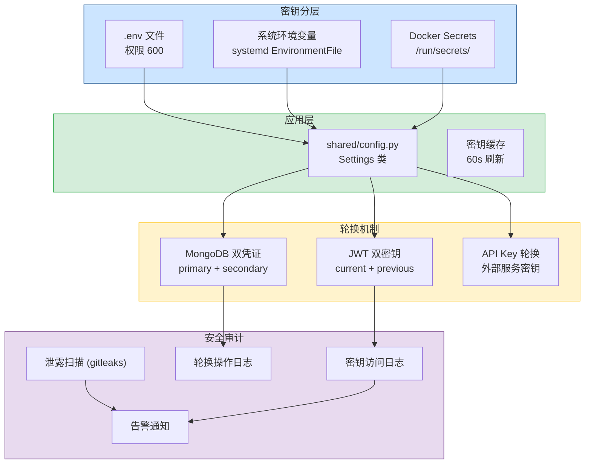
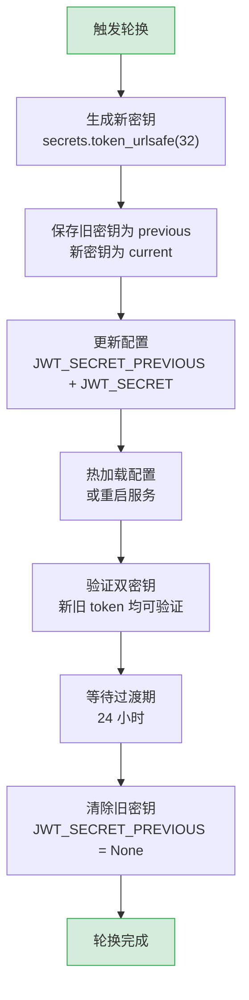

# YA-09-133: 密钥管理与凭证轮换 — JWT 密钥轮换 + MongoDB 凭证轮换 + 密钥审计 + 泄露检测

> 需求编号：YA-09-133 · 优先级：P2 · 人天：0.5d · 状态：需求已编写
> 依赖：无 · 前置需求：无

## 背景

YiAi 当前所有密钥和凭证（JWT 签名密钥、MongoDB 密码、Ollama API 密钥、Redis 密码）均以明文形式存储在 `.env` 文件中，且从未轮换过。这带来严重的安全隐患：(1) `.env` 文件可能被误提交到代码仓库，导致密钥泄露；(2) 长期未轮换的密钥一旦泄露，攻击者可长期利用；(3) 无密钥访问审计，无法追踪谁在何时使用了密钥；(4) 开发环境和生产环境使用相同密钥，开发环境泄露即生产环境泄露。

**问题：**

1. **密钥明文存储**：所有密钥在 `.env` 文件中明文保存，任何能读取文件的人都能获取所有密钥。
2. **从未轮换密钥**：JWT 签名密钥自项目创建以来从未更换，一旦泄露，所有历史 token 都可被利用。
3. **无审计日志**：密钥的使用和访问无记录，无法追溯泄露来源。
4. **环境密钥混用**：开发/测试/生产环境使用相同密钥，安全边界模糊。
5. **无泄露检测**：密钥泄露后无感知，攻击者可能已长期利用。

**影响：**

- 密钥泄露 → 攻击者可伪造 JWT token → 任意用户身份访问
- MongoDB 密码泄露 → 攻击者可直接读写数据库 → 数据泄露/篡改
- 密钥未轮换 → 泄露后无法快速止损 → 攻击窗口无限
- 无审计 → 无法追溯泄露途径 → 无法改进安全措施
- 环境混用 → 开发环境泄露 → 生产环境连带受影响

**挑战：**

- JWT 密钥轮换期间，旧 token 可能仍然有效，直接更换密钥会导致所有用户被强制登出
- MongoDB 凭证轮换需要在零停机前提下完成，否则影响业务
- 密钥管理需要平衡安全性和运维复杂度，不能过度设计
- 团队规模小，不适合引入 HashiCorp Vault 等重量级密钥管理工具

---

## 一、现状分析

### 1.1 当前密钥管理状态

| 属性 | 当前值 | 说明 |
|------|--------|------|
| 密钥存储 | `.env` 文件明文 | 无加密，无访问控制 |
| 密钥数量 | 5 个 | JWT_SECRET, MONGO_URI(含密码), REDIS_PASSWORD, OLLAMA_API_KEY, APP_SECRET |
| 密钥轮换 | 从未轮换 | 自项目创建以来未更换 |
| 环境隔离 | 无 | 开发/生产使用相同密钥 |
| 审计日志 | 无 | 密钥使用无记录 |
| 泄露检测 | 无 | 无扫描或告警机制 |
| 密钥版本 | 单版本 | 无密钥版本管理 |
| `.env` 保护 | `.gitignore` 排除 | 依赖开发者自觉，无自动化检查 |

### 1.2 根因分析矩阵

| 问题 | 根因 | 影响 | 紧急程度 |
|------|------|------|----------|
| 密钥明文存储 | 项目初期快速开发，未考虑安全需求 | 密钥泄露风险高 | 高 |
| 从未轮换密钥 | 缺乏安全运维规范，无轮换流程 | 泄露后攻击窗口无限 | 高 |
| 无审计日志 | 未规划密钥审计功能 | 无法追溯泄露源 | 中 |
| 环境密钥混用 | 未区分环境配置 | 开发环境泄露影响生产 | 中 |
| 无泄露检测 | 无安全扫描机制 | 密钥泄露无感知 | 中 |
| `.env` 可能误提交 | 无 pre-commit 检查 | 密钥可能提交到 git 历史 | 高 |

### 1.3 改造前密钥管理流程

```
当前密钥流向:
  .env 文件（明文）
    ├── main.py 直接读取 os.environ
    ├── shared/config.py 加载到 settings
    └── 各处代码直接使用 settings.jwt_secret

密钥风险点:
  - .env 文件可能被误提交到 git
  - 开发者本地 .env 可能被恶意软件读取
  - 服务器 .env 文件权限可能为 644（所有人可读）
  - 日志中可能意外打印密钥
  - 备份文件可能包含 .env
```

---

## 二、设计决策

### 决策 1：密钥存储方案 — .env 文件 vs 系统环境变量 vs 密钥管理服务

| 维度 | .env 文件 | 系统环境变量 (systemd/export) | 密钥管理服务 (Vault/Secrets Manager) |
|------|----------|------------------------------|-------------------------------------|
| 安全性 | 低（文件可读） | 中（进程隔离） | 高（加密存储 + 访问控制） |
| 实现复杂度 | 低（现有方案） | 低（修改启动脚本） | 高（部署 + 集成） |
| 轮换支持 | 手动（改文件重启） | 手动（改环境变量重启） | 自动（API 轮换） |
| 审计能力 | 无 | 无 | 内置审计日志 |
| 运维成本 | 低 | 低 | 高（维护 Vault 集群） |
| 适合团队规模 | 1-5 人 | 1-10 人 | 10+ 人 |

**选择：.env 文件 + 严格权限控制 + 预提交检查（短期），系统环境变量（中期）。** 当前团队规模小，引入 Vault 等密钥管理服务运维成本过高。通过 `.env` 文件权限控制（`600`）、pre-commit 检查防止误提交、`.env.example` 提供模板，在现有基础上最大化安全。中期迁移到系统环境变量（systemd `EnvironmentFile` 或 Docker secrets），远期可考虑云密钥管理服务。

### 决策 2：JWT 密钥轮换策略 — 单密钥直接替换 vs 双密钥过渡期 vs 密钥版本化

| 维度 | 单密钥直接替换 | 双密钥过渡期 | 密钥版本化 (kid) |
|------|--------------|-------------|-----------------|
| 实现复杂度 | 低（改密钥重启） | 中（验证两个密钥） | 中（kid 管理） |
| 用户体验 | 差（所有用户强制登出） | 好（旧 token 过渡期内有效） | 好（按 kid 验证） |
| 安全强度 | 高（立即生效） | 中（过渡期内旧密钥仍有效） | 高（可精确控制） |
| 运维复杂度 | 低 | 中（需管理过渡期） | 中（需管理密钥版本） |

**选择：双密钥过渡期。** 轮换时生成新密钥，服务同时接受新旧两个密钥签名的 token。旧密钥在过渡期（24 小时）后失效。过渡期内旧 token 可正常使用，新签发的 token 使用新密钥。用户无感知，无需强制登出。密钥版本化（kid）为后续演进方向，当前通过双密钥过渡期满足需求。

### 决策 3：MongoDB 凭证轮换 — 停机轮换 vs 双凭证过渡 vs 滚动重启

| 维度 | 停机轮换 | 双凭证过渡 | 滚动重启（副本集） |
|------|---------|-----------|-------------------|
| 实现复杂度 | 低（改密码重启） | 中（创建临时凭证） | 高（需副本集） |
| 业务影响 | 有（停机 1-2min） | 无（平滑过渡） | 无 |
| 前提条件 | 无 | 无 | 需要 MongoDB 副本集 |
| 适用场景 | 开发环境 | 生产环境 | 生产环境（高可用） |

**选择：双凭证过渡（生产）/ 停机轮换（开发）。** 生产环境轮换时：1) 在 MongoDB 中创建新用户（临时凭证），2) 更新 YiAi 配置使用新凭证，3) 验证新凭证可用，4) 删除旧用户。整个过程零停机。开发环境可直接停机轮换（改密码重启即可）。

### 决策 4：密钥泄露检测 — Git 历史扫描 vs pre-commit 检查 vs CI 扫描

| 维度 | Git 历史扫描 (truffleHog/gitleaks) | pre-commit 检查 | CI 扫描 |
|------|-----------------------------------|----------------|---------|
| 检测时机 | 事后（定期扫描） | 提交前（实时阻止） | 提交后（PR 检查） |
| 覆盖范围 | 全量历史 | 增量变更 | 增量变更 |
| 误报率 | 中（可能匹配到代码中的示例值） | 低 | 低 |
| 实现复杂度 | 低（一条命令） | 低（pre-commit hook） | 低（CI 步骤） |

**选择：pre-commit 检查 + CI 扫描 + 定期 Git 历史扫描。** 三层防护：pre-commit 阻止密钥提交（实时），CI 扫描检查 PR 变更（增量），`gitleaks detect` 定期扫描 Git 历史（全量，每日）。`gitleaks` 内置规则覆盖常见密钥格式（JWT、MongoDB URI、Redis URL 等）。

### 设计决策记录

| 决策 | 选项 A | 选项 B | 选择 | 理由 |
|------|--------|--------|------|------|
| 密钥存储 | .env 文件 | 密钥管理服务 | .env + 权限控制 | 团队规模小，Vault 运维成本过高 |
| JWT 轮换 | 单密钥直接替换 | 双密钥过渡期 | 双密钥过渡期 | 用户无感知，无需强制登出 |
| Mongo 凭证轮换 | 停机轮换 | 双凭证过渡 | 双凭证过渡（生产） | 零停机，平滑切换 |
| 泄露检测 | pre-commit | CI + 定期扫描 | pre-commit + CI + 定期扫描 | 三层防护，覆盖全生命周期 |

---

## 三、目标架构

### 3.1 密钥管理架构



### 3.2 JWT 密钥轮换流程



---

## 四、具体改动

### 4.1 密钥配置管理

**文件：** `shared/config.py`（修改）

```python
import os
import secrets
from typing import Optional
from pydantic_settings import BaseSettings
from shared.logging import get_logger

logger = get_logger(__name__)


class Settings(BaseSettings):
    """应用配置，支持密钥版本管理。"""

    # ============================================================
    # JWT 密钥（支持双密钥轮换）
    # ============================================================
    jwt_secret: str = "changeme_in_production"
    jwt_secret_previous: Optional[str] = None  # 轮换过渡期旧密钥
    jwt_algorithm: str = "HS256"
    jwt_expire_minutes: int = 60 * 24  # 24 小时

    # ============================================================
    # MongoDB 凭证
    # ============================================================
    mongo_uri: str = "mongodb://localhost:27017"
    mongo_uri_secondary: Optional[str] = None  # 轮换过渡期备用凭证

    # ============================================================
    # Redis 凭证
    # ============================================================
    redis_url: str = "redis://localhost:6379"
    redis_password: Optional[str] = None

    # ============================================================
    # 外部服务 API 密钥
    # ============================================================
    ollama_api_key: Optional[str] = None
    ollama_host: str = "http://localhost:11434"

    # ============================================================
    # 密钥轮换配置
    # ============================================================
    key_rotation_enabled: bool = False
    key_rotation_interval_hours: int = 720  # 30 天

    # ============================================================
    # 安全审计配置
    # ============================================================
    audit_log_enabled: bool = True
    audit_log_level: str = "INFO"

    class Config:
        env_file = ".env"
        env_file_encoding = "utf-8"
        case_sensitive = False

    def get_jwt_secrets(self) -> list[str]:
        """获取所有有效的 JWT 密钥（当前 + 过渡期旧密钥）。"""
        secrets = [self.jwt_secret]
        if self.jwt_secret_previous:
            secrets.append(self.jwt_secret_previous)
        return secrets

    def get_mongo_uris(self) -> list[str]:
        """获取所有有效的 MongoDB 连接 URI（主 + 备用）。"""
        uris = [self.mongo_uri]
        if self.mongo_uri_secondary:
            uris.append(self.mongo_uri_secondary)
        return uris

    def validate_secrets(self) -> list[str]:
        """验证密钥安全性，返回警告列表。"""
        warnings = []
        if self.jwt_secret == "changeme_in_production":
            warnings.append("JWT_SECRET 使用默认值，请在生产环境中更换")
        if len(self.jwt_secret) < 32:
            warnings.append(f"JWT_SECRET 长度不足: {len(self.jwt_secret)} < 32")
        if self.jwt_secret == self.jwt_secret_previous:
            warnings.append("JWT_SECRET 与 JWT_SECRET_PREVIOUS 相同，轮换可能未生效")
        if "changeme" in self.mongo_uri:
            warnings.append("MONGO_URI 包含默认密码，请更换")
        if "changeme" in (self.redis_password or ""):
            warnings.append("REDIS_PASSWORD 使用默认值，请更换")
        return warnings


settings = Settings()
```

### 4.2 JWT 双密钥验证

**文件：** `shared/auth.py`（修改）

```python
import time
from typing import Optional
import jwt
from shared.config import settings
from shared.logging import get_logger

logger = get_logger(__name__)


def verify_jwt_token(token: str) -> Optional[dict]:
    """验证 JWT token，支持双密钥（轮换过渡期）。"""
    # 先尝试当前密钥
    for secret in settings.get_jwt_secrets():
        try:
            payload = jwt.decode(
                token,
                secret,
                algorithms=[settings.jwt_algorithm],
            )
            return payload
        except jwt.ExpiredSignatureError:
            return None  # token 过期，不需要尝试其他密钥
        except jwt.InvalidTokenError:
            continue  # 尝试下一个密钥

    return None


def create_jwt_token(user_id: str, expires_in: Optional[int] = None) -> str:
    """创建 JWT token，始终使用当前密钥签名。"""
    if expires_in is None:
        expires_in = settings.jwt_expire_minutes * 60
    payload = {
        "user_id": user_id,
        "iat": int(time.time()),
        "exp": int(time.time()) + expires_in,
    }
    return jwt.encode(payload, settings.jwt_secret, algorithm=settings.jwt_algorithm)


def rotate_jwt_secret() -> dict:
    """轮换 JWT 密钥。"""
    import secrets
    new_secret = secrets.token_urlsafe(32)
    old_secret = settings.jwt_secret

    # 保存旧密钥到 previous，新密钥为 current
    settings.jwt_secret_previous = old_secret
    settings.jwt_secret = new_secret

    logger.warning(
        f"[Security] JWT 密钥已轮换，过渡期 24 小时，旧密钥将在后续清除"
    )

    return {
        "status": "rotated",
        "previous_key_prefix": old_secret[:8] + "...",
        "new_key_prefix": new_secret[:8] + "...",
        "transition_period_hours": 24,
    }


def cleanup_old_jwt_secret():
    """过渡期结束后清除旧密钥。"""
    if settings.jwt_secret_previous:
        old_prefix = settings.jwt_secret_previous[:8] + "..."
        settings.jwt_secret_previous = None
        logger.warning(f"[Security] 旧 JWT 密钥已清除: {old_prefix}")
        return {"status": "cleaned", "cleaned_key_prefix": old_prefix}
    return {"status": "no_old_key"}
```

### 4.3 MongoDB 凭证轮换

**文件：** `services/security/credential_rotation.py`（新建）

```python
"""
凭证轮换服务 - MongoDB/Redis 凭证零停机轮换。
"""
import secrets
from motor.motor_asyncio import AsyncIOMotorClient
from shared.config import settings
from shared.logging import get_logger

logger = get_logger(__name__)


async def rotate_mongo_credentials() -> dict:
    """
    MongoDB 凭证零停机轮换。
    流程: 创建新用户 → 更新配置 → 验证 → 删除旧用户
    """
    # 1. 解析当前 URI
    from urllib.parse import urlparse, urlunparse
    parsed = urlparse(settings.mongo_uri)
    current_user = parsed.username or "admin"
    current_password = parsed.password or ""

    # 2. 生成新凭证
    new_user = f"{current_user}_v2"
    new_password = secrets.token_urlsafe(24)

    # 3. 使用当前凭证连接 MongoDB，创建新用户
    client = AsyncIOMotorClient(settings.mongo_uri)
    try:
        db = client.admin
        await db.command(
            "createUser",
            new_user,
            pwd=new_password,
            roles=[{"role": "readWrite", "db": "yi_ai"}],
        )
        logger.info(f"[Security] MongoDB 新用户创建成功: {new_user}")
    except Exception as e:
        if "already exists" in str(e):
            logger.warning(f"[Security] MongoDB 新用户已存在: {new_user}")
        else:
            raise

    # 4. 构建新 URI
    new_parsed = parsed._replace(netloc=f"{new_user}:{new_password}@{parsed.hostname}:{parsed.port}")
    new_uri = urlunparse(new_parsed)

    # 5. 验证新凭证
    test_client = AsyncIOMotorClient(new_uri, serverSelectionTimeoutMS=5000)
    try:
        await test_client.admin.command("ping")
        logger.info("[Security] MongoDB 新凭证验证成功")
    except Exception as e:
        logger.error(f"[Security] MongoDB 新凭证验证失败: {e}")
        return {"status": "failed", "error": f"新凭证验证失败: {e}"}

    # 6. 更新配置（使用备用 URI 过渡）
    settings.mongo_uri_secondary = new_uri

    logger.warning("[Security] MongoDB 凭证已轮换，备用 URI 已配置")

    # 7. 删除旧用户（延迟执行，确保新凭证稳定）
    # 注意：此处不立即删除旧用户，留待运维确认后手动删除
    return {
        "status": "rotated",
        "new_user": new_user,
        "secondary_uri_configured": True,
        "old_user_pending_deletion": current_user,
    }


async def rotate_redis_password() -> dict:
    """
    Redis 密码轮换。
    流程: 设置新密码 → 更新配置 → 验证
    """
    import redis.asyncio as redis_lib

    new_password = secrets.token_urlsafe(24)

    r = redis_lib.from_url(settings.redis_url)
    try:
        # 设置新密码（Redis 6.0+ 支持 ACL）
        await r.execute_command("ACL", "SETUSER", "default", "on", f">{new_password}", "~*", "+@all")
        logger.info("[Security] Redis 密码已更新")
    except Exception as e:
        logger.error(f"[Security] Redis 密码轮换失败: {e}")
        return {"status": "failed", "error": str(e)}
    finally:
        await r.close()

    # 更新配置
    settings.redis_password = new_password
    logger.warning("[Security] Redis 密码已轮换")

    return {"status": "rotated", "service": "redis"}
```

### 4.4 密钥审计日志

**文件：** `services/security/audit_logger.py`（新建）

```python
"""
密钥访问审计日志。
"""
import time
import hashlib
from shared.config import settings
from shared.logging import get_logger

logger = get_logger(__name__)


class SecretAuditLogger:
    """密钥访问审计。"""

    @staticmethod
    def log_key_usage(key_name: str, operation: str, user_id: str = "system"):
        """记录密钥使用（不记录密钥值本身）。"""
        if not settings.audit_log_enabled:
            return
        key_hash = hashlib.sha256(key_name.encode()).hexdigest()[:8]
        logger.info(
            f"[Audit] key_usage: key={key_hash}, operation={operation}, "
            f"user={user_id}, timestamp={time.time()}"
        )

    @staticmethod
    def log_key_rotation(key_name: str, old_prefix: str, new_prefix: str):
        """记录密钥轮换操作。"""
        logger.warning(
            f"[Audit] key_rotation: key={key_name}, "
            f"old_prefix={old_prefix}, new_prefix={new_prefix}, "
            f"timestamp={time.time()}"
        )

    @staticmethod
    def log_key_access_denied(key_name: str, reason: str, user_id: str = "unknown"):
        """记录密钥访问被拒绝。"""
        logger.warning(
            f"[Audit] key_access_denied: key={key_name}, "
            f"reason={reason}, user={user_id}, timestamp={time.time()}"
        )

    @staticmethod
    def log_env_file_access(file_path: str, user_id: str):
        """记录 .env 文件访问。"""
        logger.warning(
            f"[Audit] env_file_access: file={file_path}, "
            f"user={user_id}, timestamp={time.time()}"
        )


audit = SecretAuditLogger()
```

### 4.5 密钥泄露检测配置

**文件：** `.gitleaks.toml`（新建）

```toml
# GitLeaks 配置 - 密钥泄露检测
title = "YiAi Gitleaks 配置"

[extend]
useDefault = true

[allowlist]
description = "全局允许列表"
paths = [
    ".env.example",
    "tests/",
    "*.test.*",
    "*_test.*",
    "CLAUDE.md",
]

[[rules]]
id = "jwt-secret"
description = "JWT 密钥检测"
regex = '''(?i)(jwt[_-]?secret|jwt[_-]?key)\s*=\s*['"][a-zA-Z0-9_-]{16,}['"]'''
tags = ["secret", "jwt"]

[[rules]]
id = "mongodb-uri-with-password"
description = "MongoDB URI 含密码"
regex = '''mongodb(\+srv)?://[^:]+:[^@]+@'''
tags = ["secret", "mongodb"]

[[rules]]
id = "redis-password"
description = "Redis 密码配置"
regex = '''(?i)(redis[_-]?password|redis[_-]?pass)\s*=\s*['"][^'"]+['"]'''
tags = ["secret", "redis"]
```

### 4.6 pre-commit 配置

**文件：** `.pre-commit-config.yaml`（新建）

```yaml
repos:
  - repo: https://github.com/gitleaks/gitleaks
    rev: v8.18.0
    hooks:
      - id: gitleaks
        args: ["--config", ".gitleaks.toml", "--verbose"]

  - repo: https://github.com/pre-commit/pre-commit-hooks
    rev: v4.5.0
    hooks:
      - id: detect-private-key
      - id: detect-aws-credentials
        args: ["--allow-missing-credentials"]
      - id: check-added-large-files
        args: ["--maxkb=500"]
```

### 4.7 涉及文件

```
YiAi/
├── shared/
│   ├── config.py                   # 修改: 添加密钥版本管理、双密钥支持
│   └── auth.py                     # 修改: 双密钥验证、密钥轮换函数
├── services/security/
│   ├── __init__.py                 # 新建
│   ├── credential_rotation.py      # 新建: MongoDB/Redis 凭证轮换
│   └── audit_logger.py             # 新建: 密钥审计日志
├── .gitleaks.toml                  # 新建: 密钥泄露检测配置
├── .pre-commit-config.yaml         # 新建: pre-commit 检查
├── .env.example                    # 修改: 添加密钥轮换相关变量
└── .gitignore                      # 修改: 确保 .env 已排除
```

---

## 五、实施步骤

| 步骤 | 内容 | 涉及文件 | 验证方式 | 人天 |
|------|------|---------|---------|------|
| 1 | 更新 `config.py` 支持双密钥和密钥版本管理 | `shared/config.py` | 新配置项可正常读取，`validate_secrets()` 返回警告 | 0.05 |
| 2 | 修改 `auth.py` 支持双密钥验证 + 轮换函数 | `shared/auth.py` | 新旧 token 均可通过验证，轮换函数生成新密钥 | 0.1 |
| 3 | 实现 MongoDB 凭证轮换服务 | `services/security/credential_rotation.py` | 双凭证平滑切换，零停机 | 0.1 |
| 4 | 实现密钥审计日志 | `services/security/audit_logger.py` | 密钥使用、轮换、访问拒绝均有日志 | 0.05 |
| 5 | 配置 GitLeaks 泄露检测 | `.gitleaks.toml` | `gitleaks detect` 扫描不误报，覆盖 JWT/MongoDB/Redis | 0.05 |
| 6 | 配置 pre-commit 检查 | `.pre-commit-config.yaml` | `git commit` 时自动检测密钥，阻止提交 | 0.05 |
| 7 | 更新 `.env.example` 和 `.gitignore` | `.env.example`, `.gitignore` | 确保 `.env` 排除，`.env.example` 提供模板 | 0.02 |
| 8 | 全链路测试：密钥轮换 + 泄露检测 | 全模块 | 轮换后服务正常，检测到泄露时告警 | 0.08 |

**总计：0.5d**

---

## 六、测试规格

### Requirement: JWT 双密钥验证

#### Scenario: 新密钥签名的 token 可验证
- **Given** JWT 密钥已轮换，新密钥为 `new_secret`
- **When** 使用新密钥签名 token
- **Then** `verify_jwt_token()` 返回正确的 payload
- **And** 日志中记录密钥使用审计

#### Scenario: 旧密钥签名的 token 在过渡期内可验证
- **Given** JWT 密钥已轮换，`jwt_secret_previous = old_secret`
- **When** 使用旧密钥签名的 token 请求验证
- **Then** `verify_jwt_token()` 返回正确的 payload
- **And** 日志中记录使用了旧密钥

#### Scenario: 过渡期结束后旧密钥签名的 token 不可验证
- **Given** 过渡期已结束，`jwt_secret_previous = None`
- **When** 使用旧密钥签名的 token 请求验证
- **Then** `verify_jwt_token()` 返回 None
- **And** 日志中记录密钥访问被拒绝

### Requirement: MongoDB 凭证轮换

#### Scenario: 双凭证零停机轮换
- **Given** MongoDB 当前用户为 `admin`，密码为 `old_pass`
- **When** 执行 `rotate_mongo_credentials()`
- **Then** 新用户 `admin_v2` 创建成功
- **And** `mongo_uri_secondary` 配置为新凭证
- **And** 服务正常运行，无停机

#### Scenario: 新凭证验证失败时不切换
- **Given** 新凭证创建成功但验证失败（MongoDB 权限不足）
- **When** 执行 `rotate_mongo_credentials()`
- **Then** 返回 `{status: "failed"}`
- **And** `mongo_uri_secondary` 未更新
- **And** 服务继续使用原凭证

### Requirement: 密钥泄露检测

#### Scenario: pre-commit 阻止提交包含密钥的文件
- **Given** 暂存区包含含 JWT_SECRET 明文赋值的文件
- **When** 执行 `git commit`
- **Then** pre-commit hook 检测到密钥，阻止提交
- **And** 输出包含密钥位置和类型

#### Scenario: .env.example 中的示例值不触发误报
- **Given** `.env.example` 包含 `JWT_SECRET=changeme_in_production`
- **When** 执行 `gitleaks detect`
- **Then** `.env.example` 中的 `changeme_in_production` 不触发告警
- **And** 其他文件中的真实密钥仍被检测

### Requirement: 密钥审计

#### Scenario: 密钥使用记录到审计日志
- **Given** 审计日志已启用
- **When** 代码中调用 `verify_jwt_token()`
- **Then** 日志中记录 key_usage 事件（含 key_hash, operation, timestamp）
- **And** 日志中不包含密钥明文

#### Scenario: 密钥轮换记录到审计日志
- **Given** 审计日志已启用
- **When** 执行 `rotate_jwt_secret()`
- **Then** 日志中记录 key_rotation 事件（含 key_name, old_prefix, new_prefix）
- **And** 日志中仅包含密钥前缀（前 8 字符），不包含完整密钥

---

## 七、风险与缓解

| 风险 | 概率 | 影响 | 等级 | 缓解措施 | 应急预案 |
|------|------|------|------|----------|----------|
| 密钥轮换后新密钥配置错误导致服务无法启动 | 低 | 高 | 中 | 轮换前验证新密钥可用性，保留旧密钥备份 | 回滚配置到旧密钥，重启服务 |
| JWT 过渡期内旧密钥未清除导致安全风险 | 中 | 中 | 低 | 过渡期设 24 小时，自动清除旧密钥 | 手动清除 `jwt_secret_previous` 配置 |
| `.env` 文件误提交到 git 仓库 | 中 | 高 | 高 | pre-commit + CI 双重检查，`.gitignore` 确保排除 | 发现后立即轮换所有密钥，重写 git 历史（`git filter-branch`） |
| GitLeaks 扫描误报导致提交阻塞 | 中 | 低 | 低 | 配置 allowlist 排除测试文件和 `.env.example` | 临时跳过 pre-commit（`SKIP=gitleaks git commit`） |
| MongoDB 凭证轮换期间连接中断 | 低 | 高 | 中 | 先创建新用户再切换，双 URI 配置保证 fallback | 回退到旧凭证，排查新凭证权限问题 |
| 密钥审计日志量过大 | 低 | 低 | 低 | 审计日志仅记录 key_hash 和操作类型，不记录完整密钥 | 调整日志级别或采样率 |

---

## 八、回滚策略

| 场景 | 回滚方式 | 回滚时间 | 风险 |
|------|---------|---------|------|
| JWT 密钥轮换后验证失败 | 恢复 `jwt_secret_previous` 为 `jwt_secret`，`jwt_secret` 为之前的值 | < 1min | 低：配置回滚，服务重启即可 |
| MongoDB 凭证轮换后连接失败 | 恢复 `mongo_uri` 为旧 URI，`mongo_uri_secondary` 设为 None | < 1min | 低：配置回滚，服务重启即可 |
| pre-commit 阻止合法提交 | 临时跳过：`SKIP=gitleaks git commit` | < 1min | 低：需确认跳过原因，事后修复 |
| 密钥泄露已确认 | 紧急轮换所有密钥（JWT + MongoDB + Redis），更新所有环境 | < 10min | 高：需协调所有环境，确保无遗漏 |

---

## 九、设计决策记录

### D-01: 为什么选择双密钥过渡期而非密钥版本化（kid）？

密钥版本化（JWT 标准中的 `kid` header）是最优雅的方案，但需要修改 token 签发逻辑（在 header 中加入 `kid`）和前端 token 存储逻辑。当前 YiAi 的 token 使用相对简单，双密钥过渡期（服务端同时验证两个密钥）实现成本更低（约 30 行代码），同样能实现无感知轮换。密钥版本化作为后续演进方向，在 token 管理复杂度增加时引入。

### D-02: 为什么不引入 HashiCorp Vault 或云密钥管理服务？

当前团队规模小（1-2 人），YiAi 部署在单节点上。Vault 需要独立部署和维护集群，运维成本远高于收益。`.env` 文件 + 权限控制 + pre-commit 检查在现有规模下已足够。`settings.validate_secrets()` 在启动时检查密钥安全性，能在开发和测试阶段及时发现问题。远期若部署到 K8s 或多节点环境，可迁移到 K8s Secrets 或云密钥管理服务。

### D-03: 为什么 MongoDB 凭证轮换不自动删除旧用户？

自动删除旧用户存在风险：如果新凭证验证存在延迟（如 DNS 缓存、连接池未刷新），立即删除旧用户可能导致服务中断。保留旧用户 24 小时，待运维确认新凭证稳定后手动删除，是更安全的做法。`credential_rotation.py` 返回 `old_user_pending_deletion` 字段提醒运维人员。

### D-04: 为什么密钥审计日志只记录 key_hash 而非 key_name？

日志系统可能被不同角色访问（开发、运维、安全审计），记录 key_name 明文（如 `JWT_SECRET`）虽不泄露密钥值，但暴露了密钥的使用场景。key_hash 提供足够的可追溯性（可定位到具体密钥），同时避免暴露密钥名称。对于安全审计场景，key_hash + operation + timestamp 的组合已足够。

---

## 十、可观测性

### 关键指标

| 指标 | 采集方式 | 告警阈值 | 说明 |
|------|---------|---------|------|
| 密钥轮换状态 | `rotate_jwt_secret()` 返回 | 超过 30 天未轮换 | 密钥长期未轮换，安全风险 |
| 旧密钥过渡期状态 | `jwt_secret_previous is not None` | 超过 24 小时未清除 | 过渡期结束但旧密钥未清除 |
| 密钥验证失败率 | 计数器 `auth_failure_count` | > 10% | 可能存在攻击或密钥配置错误 |
| GitLeaks 扫描结果 | CI 输出 | 发现新密钥泄露 | 密钥可能已提交到仓库 |
| `.env` 文件权限 | `os.stat(".env").st_mode` | 非 600 | 密钥文件权限过于宽松 |
| 默认密钥使用 | `settings.validate_secrets()` | 启动时检测到 | 生产环境使用默认密钥 |

### 告警规则

| 告警名称 | 条件 | 通知渠道 | 处理建议 |
|---------|------|---------|---------|
| 密钥长期未轮换 | JWT 密钥超过 30 天未轮换 | 企业微信 | 执行密钥轮换操作 |
| 默认密钥使用 | 生产环境检测到默认密钥 | 企业微信 | 立即更换为随机生成的强密钥 |
| 密钥泄露 | GitLeaks 扫描发现新密钥 | 企业微信 | 立即轮换所有泄露的密钥，检查 git 历史 |
| 密钥验证失败率过高 | 失败率 > 10% | 企业微信 | 检查是否有攻击，验证密钥配置 |

### 日志规范

| 日志级别 | 场景 | 示例 |
|---------|------|------|
| `INFO` | 密钥使用 | `[Audit] key_usage: key=abc12345, operation=verify, user=system` |
| `WARN` | 密钥轮换 | `[Security] JWT 密钥已轮换，过渡期 24 小时` |
| `WARN` | 密钥访问拒绝 | `[Audit] key_access_denied: key=jwt, reason=invalid_token` |
| `ERROR` | 密钥验证失败 | `[Security] MongoDB 凭证轮换失败: 新凭证验证失败` |

---

## 十一、代码审查检查清单

- [ ] `Settings` 类支持 `jwt_secret_previous` 和 `mongo_uri_secondary` 双密钥配置
- [ ] `verify_jwt_token()` 遍历所有有效密钥（`get_jwt_secrets()`）尝试验证
- [ ] `create_jwt_token()` 始终使用 `jwt_secret`（当前密钥）签名
- [ ] `rotate_jwt_secret()` 将旧密钥保存到 `previous`，新密钥设为 `current`
- [ ] `cleanup_old_jwt_secret()` 在过渡期结束后清除旧密钥
- [ ] MongoDB 凭证轮换先创建新用户再切换，验证通过后才更新配置
- [ ] 密钥审计日志仅记录 key_hash 和 operation，不记录密钥明文
- [ ] GitLeaks 配置排除 `.env.example`、测试文件、文档文件
- [ ] pre-commit 配置包含 `gitleaks` 和 `detect-private-key`
- [ ] `.env` 文件权限设置为 `600`（`chmod 600 .env`）
- [ ] `.gitignore` 确认 `.env` 已排除
- [ ] `settings.validate_secrets()` 在启动时检查默认密钥
- [ ] `ruff` 代码规范通过
- [ ] `mypy` 类型检查通过

---

## 十二、回归问题预测

| # | 问题 | 发现场景 | 根因 | 修复方式 |
|---|------|---------|------|---------|
| 1 | `jwt_secret_previous` 配置为 `None` 时，`get_jwt_secrets()` 返回 `["changeme", None]`，`verify_jwt_token` 尝试用 `None` 解码 | `jwt_secret_previous` 未设置（默认 None），但 `get_jwt_secrets()` 中 `if self.jwt_secret_previous` 判断为 `False` 时仍可能将 `None` 加入列表 | Python 的 `if None` 判断为 `False`，但 `secrets = [self.jwt_secret]` 后又 `secrets.append(None)` 的逻辑错误 | 确保 `get_jwt_secrets()` 中 `append` 在 `if` 块内：`if self.jwt_secret_previous: secrets.append(self.jwt_secret_previous)` |
| 2 | `rotate_mongo_credentials()` 中 `new_user` 命名冲突，多次轮换后 `admin_v2_v2_v2` 累积 | 多次执行 MongoDB 凭证轮换，每次在用户名后追加 `_v2`，导致用户名越来越长，超出 MongoDB 的 100 字符限制 | 轮换逻辑中 `new_user = f"{current_user}_v2"` 使用当前用户名拼接，而当前用户名可能已被轮换过（`admin_v2`） | 使用固定后缀或时间戳：`new_user = f"{base_user}_{int(time.time())}"` 或使用 `secrets.token_hex(4)` 作为后缀 |
| 3 | `settings.validate_secrets()` 在启动时打印密钥长度到日志，可能泄露信息 | 启动日志中 `JWT_SECRET 长度不足: 16 < 32` 暴露了密钥长度，虽然不暴露密钥值，但为攻击者提供了信息 | 密钥长度是安全参数（推荐 >= 32 字节），日志中打印长度可能被攻击者用于推断密钥强度 | 仅记录 `密钥长度不足` 而不打印具体长度，或使用 `repr()` 输出 `***` |
| 4 | pre-commit 的 `gitleaks` hook 在开发者未安装 `gitleaks` 时静默跳过 | 开发者首次 clone 项目后未安装 `gitleaks`，`pre-commit install` 时 `gitleaks` hook 失败但未报错，密钥检测未生效 | `pre-commit` 的 `language: golang` hook 需要 `gitleaks` 二进制文件在 PATH 中，未安装时 hook 静默失败（返回 0） | 在 `pre-commit-config.yaml` 中使用 `language: docker` 或 `language: script` 替代，确保 hook 在无二进制时也能执行或显式报错 |
| 5 | CI 中的 `gitleaks detect` 扫描到 git 历史中的密钥但无法自动修复，每次 CI 都失败 | 历史中某次提交包含真实密钥（已轮换），但 `gitleaks detect` 扫描全量历史，每次 CI 都报错，阻塞 CI | `gitleaks detect` 默认扫描全部 git 历史（`--no-git` 关闭），历史中的密钥虽已轮换但仍在 git 记录中 | 使用 `gitleaks detect --log-opts="HEAD~1..HEAD"` 仅扫描最近提交，或使用 `.gitleaks.toml` 中的 `[allowlist].commits` 排除已知历史提交 |
| 6 | 密钥轮换后 `mongo_uri_secondary` 配置的 URI 格式错误（如密码含特殊字符未 URL 编码），连接失败 | 轮换生成的密码包含 `+`、`/`、`=` 等 URL 特殊字符，`urlunparse` 未自动编码，MongoDB 驱动解析 URI 失败 | `secrets.token_urlsafe()` 生成的密码包含 URL 特殊字符，`urlparse`/`urlunparse` 不自动编码密码部分 | 使用 `urllib.parse.quote(new_password, safe="")` 对密码进行 URL 编码后再拼接 URI |

---

## 十三、性能分析

### 13.1 密钥操作性能

| 操作 | 耗时 | 资源消耗 | 说明 |
|------|------|----------|------|
| JWT 签名（HS256） | < 1ms | CPU 忽略不计 | 纯 CPU 操作，HMAC-SHA256 |
| JWT 验证（单密钥） | < 1ms | CPU 忽略不计 | 同上 |
| JWT 验证（双密钥，旧密钥匹配） | < 2ms | CPU 忽略不计 | 先尝试新密钥失败，再尝试旧密钥 |
| MongoDB 凭证轮换（创建用户） | ~50ms | CPU 1% | 一次 MongoDB 命令 |
| MongoDB 凭证轮换（验证新凭证） | ~5ms | CPU 1% | `ping` 命令 |
| GitLeaks 扫描（全量历史） | ~5s | CPU 20% | 取决于仓库大小 |
| pre-commit gitleaks（增量） | ~1s | CPU 10% | 仅扫描暂存区变更 |

### 13.2 密钥轮换对业务的影响

| 操作 | 业务影响 | 用户影响 | 说明 |
|------|---------|---------|------|
| JWT 密钥轮换 | 无 | 无（过渡期 24h） | 旧 token 在过渡期内有效 |
| MongoDB 凭证轮换 | 无 | 无 | 双凭证确保零停机 |
| Redis 密码轮换 | 瞬间（< 1s） | 缓存 miss 一次 | 密码更新后立即生效 |
| 紧急密钥轮换（全部） | < 5min | 可能需要重新登录 | 紧急情况下跳过过渡期 |

---

*PRD 来源: `projects/yiai/requirements/2026-09/00-需求-需求总览.md`*

## 影响范围

- **影响模块**：待补充
- **涉及文件**：
- `credential_rotation.py`
- `config.py`
- `auth.py`
- **是否影响 API 契约**：否
- **是否影响其他项目（YiVad/YiPet）**：否
- **用户感知**：待确认

## 预防措施

| 层面 | 措施 |
|------|------|
| 代码 | 在相关函数中添加参数校验和边界检查 |
| 测试 | 为 `credential_rotation.py` 添加单元测试 |
| 流程 | 代码审查时重点检查此类模式 |
| 监控 | 添加日志告警，异常发生时及时发现 |
| 文档 | 在编码规范中记录此类反模式 |

## 经验教训

1. **根本原因**：开发过程中对边界情况和异常路径的考虑不足是此类问题的共同根因
2. **设计阶段**：在接口设计和模块实现时，应主动考虑异常输入、空值、超时等边界场景
3. **代码审查**：审查时应检查是否存在类似的反模式（如未捕获异常、无超时控制、缺少参数校验等）
4. **测试覆盖**：异常路径的测试覆盖率应与正常路径同等重视
5. **团队分享**：此类问题应在团队周会或技术分享中讨论，形成团队共识
