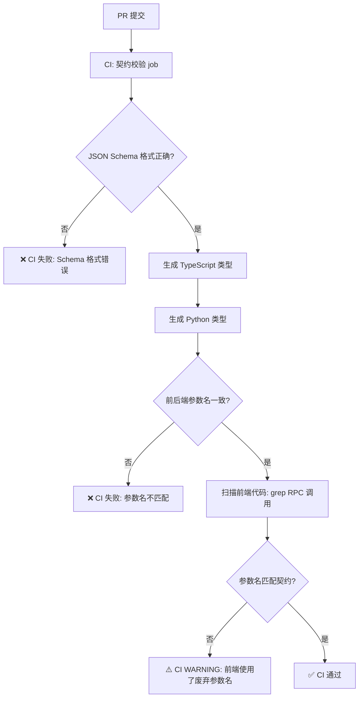
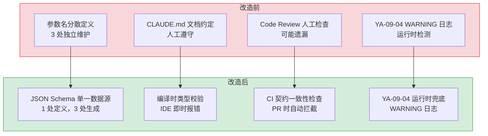

# YA-09-10: RPC 契约测试与前后端类型同步 — 参数名漂移自动检测

> 需求编号：YA-09-10 · 优先级：P1 · 人天：2.0d · 状态：需求已编写
> 依赖：YA-09-04（API 契约校验）

## 背景

YrY 单体仓库通过 RPC 信封协议（`{module_name, method_name, parameters}`）连接 YiVad/YiPet 前端与 YiAi 后端。CLAUDE.md 明确指出：**"参数名称不匹配（`filter`/`query`、`target_file`/`path`）是最常见的 bug 模式"**。

历史 bug 案例：

| 时间 | 前端参数名 | 后端期望 | 影响 |
|------|-----------|----------|------|
| 2026-07 | `query` | `filter` | `data_service.query_documents` 静默忽略过滤条件，返回全量数据 |
| 2026-07 | `path` | `target_file` | `/read-file` 返回 422，文件读取功能不可用 |
| 2026-08 | `collection_name` | `cname` | `data_service` 返回参数错误，CRUD 操作失败 |
| 2026-09 | `scope` vs `path` | `scope` | `knowledge.list_files` 参数混淆 |

**根因**：前端（TypeScript）和后端（Python）的参数名定义各自独立维护，无自动化契约校验。当一端的参数名变更时，另一端无感知，导致运行时错误。九月迭代 YA-09-04 已实现后端参数白名单 WARNING 日志，但缺少：

1. **编译时契约校验**：前端调用 RPC 时 TypeScript 无法检查参数名是否正确
2. **契约回归测试**：CI 中无前后端参数名一致性检查
3. **契约文档自动生成**：参数名定义分散在前端 `api/` 和后端 `services/` 目录中

---

## 一、现状分析

### 1.1 参数名定义分布

```
前端 (YiVad/YiPet)                    后端 (YiAi)
─────────────────                    ──────────
src/api/services/database.ts        src/services/database/data_service.py
  queryDocuments({                    async def query_documents(
    cname: string,                       cname: str,      ← 一致 ✅
    filter?: object,                     filter: dict,    ← 一致 ✅
    query?: string,    ← ❌ 多余参数      # 无 query 参数  ← 不匹配
    sort?: object,                       sort: dict,      ← 一致 ✅
    page?: number,                       page: int,       ← 一致 ✅
    pageSize?: number                    pageSize: int    ← 一致 ✅
  })                                  )
```

**问题**：前端定义的 `query` 参数在后端不存在，但 TypeScript 允许任意参数名（`parameters` 类型为 `Record<string, any>`）。后端 YA-09-04 的 WARNING 日志可检测到此问题，但仅在运行时——用户已经触发了错误。

### 1.2 参数名冲突矩阵

| RPC 方法 | 前端参数 (YiVad) | 前端参数 (YiPet) | 后端参数 (YiAi) | 冲突 |
|----------|-----------------|-----------------|-----------------|------|
| `data_service.query_documents` | `filter` / `query` | `filter` | `filter` | `query` 不存在 |
| `/read-file` | `path` / `target_file` | `target_file` | `target_file` | `path` 不存在 |
| `/write-file` | `path` / `target_file` | `target_file` | `target_file` + `content` | `path` 不存在 |
| `knowledge.list_files` | `scope` / `path` | `scope` | `scope` | `path` 不存在 |
| `rag.rag_query` | `query` / `question` | `question` | `question` | `query` 不存在 |
| `chat_service.chat` | `messages` / `history` | `messages` | `messages` | `history` 不存在 |

### 1.3 当前契约保障层级

```
L0: CLAUDE.md 文档约定          ← 人工遵守，无强制力
L1: YA-09-04 WARNING 日志       ← 运行时检测，用户已触发
L2: 代码审查 (PR Review)         ← 人工检查，可能遗漏
L3: ❌ 编译时类型检查            ← 缺失
L4: ❌ CI 契约回归测试           ← 缺失
```

### 1.4 改造前数据流

```
前端开发者新增 API 调用
  → TypeScript 定义参数接口（如 { query: string, filter: object }）
  → RequestHttp/ApiClient 构造 RPC 信封
  → POST / { module_name, method_name, parameters: { query: "...", filter: {...} } }
  → YiAi rpc_router 路由到 data_service.query_documents
  → 后端方法签名: def query_documents(cname, filter, sort, page, pageSize)
  → query 参数被 **kwargs 捕获 → WARNING 日志（YA-09-04 新增）
  → filter 参数正常工作
  → 前端无感知 query 参数被忽略 → 功能可能部分失效
  → 排查耗时: 前端检查请求 payload → 后端检查 WARNING 日志 → 对比参数名 → 修复
```

### 1.5 改造前 API 依赖

| # | 接口 | 参数名冲突风险 | 检测方式 |
|---|------|--------------|----------|
| 1 | `data_service.query_documents` | `query` vs `filter` | YA-09-04 WARNING 日志 |
| 2 | `POST /read-file` | `path` vs `target_file` | HTTP 422 错误 |
| 3 | `POST /write-file` | `path` vs `target_file` | HTTP 422 错误 |
| 4 | `knowledge.list_files` | `path` vs `scope` | YA-09-04 WARNING 日志 |
| 5 | `rag.rag_query` | `query` vs `question` | YA-09-04 WARNING 日志 |
| 6 | `chat_service.chat` | `history` vs `messages` | YA-09-04 WARNING 日志 |

> 改造前 6 个 RPC 方法存在参数名冲突风险，YA-09-04 WARNING 日志可运行时检测，但反馈周期长（用户触发 → 日志发现 → 修复）。

---

## 二、设计决策

### 决策 1：契约定义格式 — JSON Schema vs TypeScript Interface vs Python TypedDict

| 选项 | 前端兼容性 | 后端兼容性 | 单一数据源 |
|------|-----------|-----------|-----------|
| **JSON Schema** | 需工具转换 | 需工具转换 | ✅ 语言无关，可作为单一数据源 |
| TypeScript Interface | 原生支持 | 需手动同步 | ❌ 仅前端可用 |
| Python TypedDict | 需手动同步 | 原生支持 | ❌ 仅后端可用 |
| OpenAPI 3.x | 工具生态丰富 | FastAPI 原生支持 | ✅ 标准格式 |

**选择：JSON Schema 作为中间契约格式。** TypeScript 和 Python 均可从 JSON Schema 生成类型定义，单一数据源确保一致性。JSON Schema 支持参数约束（必填/可选/类型/枚举），可在 CI 中自动校验。

### 决策 2：契约校验时机 — 编译时 vs CI vs 运行时

| 时机 | 反馈速度 | 覆盖率 | 误报风险 |
|------|----------|--------|----------|
| 编译时 (TypeScript) | 即时（IDE 报错） | 仅前端 | 低 |
| CI (契约测试) | PR 时 | 前后端 | 低 |
| 运行时 (WARNING 日志) | 用户触发后 | 实际调用 | 无 |

**选择：三层防御。** 编译时（前端 TypeScript 参数名校验）+ CI（前后端契约一致性检查）+ 运行时（后端 WARNING 日志兜底）。YA-09-04 已实现运行时层。

### 决策 3：契约文件组织 — 集中式 vs 分散式 vs 混合式

| 选项 | 可发现性 | 维护成本 | 版本管理 |
|------|----------|----------|----------|
| 集中式 (`contracts/` 目录) | 高（所有契约在同一个位置） | 低（单一入口） | 简单（统一版本） |
| 分散式（各 Service 目录） | 低（随 Service 分散） | 中 | 复杂（随 Service 版本） |
| 混合式（集中定义 + Service 引用） | 高 | 中 | 中 |

**选择：集中式 `YiAi/contracts/` 目录。** 与 RPC 信封的集中路由（`rpc_router.py`）一致，所有契约在一个位置，便于跨项目引用和 CI 检查。

### 设计决策记录

| 决策 | 选项 A | 选项 B | 选项 C | 选择 | 理由 |
|------|--------|--------|--------|------|------|
| 契约格式 | JSON Schema | TypeScript Interface | Python TypedDict | **JSON Schema** | 语言无关，单一数据源 |
| 校验时机 | 编译时 | CI | 运行时 | **三层防御** | 编译时+CI+运行时，层层兜底 |
| 文件组织 | 集中式 | 分散式 | — | **集中式** | 与 RPC 路由集中一致 |
| 类型生成 | 手动同步 | 代码生成 | — | **代码生成** | 消除人工同步错误 |

---

## 三、目标架构

### 3.1 契约文件结构

```
YiAi/contracts/
├── README.md                         # 契约目录说明 + 使用指南
├── schemas/                          # JSON Schema 契约定义（单一数据源）
│   ├── data_service.schema.json      # data_service CRUD 参数契约
│   ├── chat_service.schema.json      # chat_service 聊天参数契约
│   ├── rag_service.schema.json       # rag_service RAG 检索参数契约
│   ├── knowledge_service.schema.json # knowledge_service 知识库参数契约
│   ├── file_endpoints.schema.json    # /read-file /write-file 参数契约
│   └── agent_service.schema.json     # agent_service Agent 循环参数契约
├── generated/
│   ├── python/                       # Python TypedDict 生成（后端引用）
│   │   └── contracts.py
│   └── typescript/                   # TypeScript Interface 生成（前端引用）
│       └── contracts.ts
└── tools/
    ├── generate.py                   # JSON Schema → Python TypedDict
    ├── generate.ts                   # JSON Schema → TypeScript Interface
    └── validate.ts                   # CI 契约一致性校验
```

### 3.2 JSON Schema 契约示例

```json
// YiAi/contracts/schemas/data_service.schema.json
{
  "$schema": "https://json-schema.org/draft/2020-12/schema",
  "$id": "data_service.query_documents",
  "title": "query_documents 参数契约",
  "description": "跨集合文档查询的 RPC 参数定义",
  "type": "object",
  "properties": {
    "cname": {
      "type": "string",
      "description": "集合名称",
      "enum": ["projects", "bugs", "sessions", "knowledge_files", "rss_entries", "requirements", "menus", "users", "static_files"]
    },
    "filter": {
      "type": "object",
      "description": "MongoDB 过滤条件（注意：参数名为 filter，非 query）"
    },
    "sort": {
      "type": "object",
      "description": "排序条件"
    },
    "page": {
      "type": "integer",
      "minimum": 1,
      "default": 1,
      "description": "页码"
    },
    "pageSize": {
      "type": "integer",
      "minimum": 1,
      "maximum": 500,
      "default": 20,
      "description": "每页条数"
    }
  },
  "required": ["cname"],
  "additionalProperties": false,
  "deprecated": {
    "query": {
      "since": "2026-07",
      "replacedBy": "filter",
      "description": "已废弃，请使用 filter"
    },
    "collection_name": {
      "since": "2026-08",
      "replacedBy": "cname",
      "description": "已废弃，请使用 cname"
    }
  }
}
```

关键设计点：

- `additionalProperties: false` — 拒绝未定义参数（CI 检查时），前端发送 `query` 参数将被检测
- `deprecated` — 记录历史错误参数名，生成 WARNING 提示
- `$id` — 唯一标识，用于 CI 交叉校验

### 3.3 代码生成流程

```
JSON Schema (单一数据源)
  │
  ├── generate.py → contracts.py    # Python TypedDict (YiAi 后端引用)
  │     async def query_documents(params: QueryDocumentsParams) -> dict
  │
  └── generate.ts → contracts.ts    # TypeScript Interface (YiVad/YiPet 引用)
        export interface QueryDocumentsParams {
          cname: CollectionName;
          filter?: Record<string, unknown>;  // ← 注意：参数名为 filter，非 query
          sort?: Record<string, unknown>;
          page?: number;
          pageSize?: number;
        }
```

### 3.4 CI 契约校验流程



### 3.5 前端参数名校验（编译时）

```typescript
// 改造后 — YiVad/src/api/services/database.ts
import type { QueryDocumentsParams } from '@/contracts/data_service';

// ✅ 正确：使用契约类型，IDE 自动补全 filter
async function queryDocuments(params: QueryDocumentsParams) {
  return requestHttp.post('/', {
    module_name: 'services.database.data_service',
    method_name: 'query_documents',
    parameters: params,  // TypeScript 检查：query 不在 QueryDocumentsParams 中 → 编译报错
  });
}

// ❌ 编译时报错：'query' does not exist in type 'QueryDocumentsParams'
queryDocuments({ cname: 'bugs', query: { status: 'open' } });

// ✅ 编译通过：参数名正确
queryDocuments({ cname: 'bugs', filter: { status: 'open' } });
```

---

## 四、具体改动

### 4.1 新增文件

| 文件 | 说明 |
|------|------|
| `YiAi/contracts/schemas/*.schema.json` (6 个) | RPC 方法参数 JSON Schema 定义 |
| `YiAi/contracts/generated/python/contracts.py` | 后端 TypedDict（代码生成） |
| `YiAi/contracts/generated/typescript/contracts.ts` | 前端 Interface（代码生成） |
| `YiAi/contracts/tools/generate.py` | JSON Schema → Python TypedDict 生成器 |
| `YiAi/contracts/tools/generate.ts` | JSON Schema → TypeScript 生成器 |
| `.github/workflows/contract-check.yml` | CI 契约校验 workflow |

### 4.2 修改文件

| 文件 | 改动 |
|------|------|
| `YiAi/src/server/rpc_router.py` | 引用 `contracts.py` 进行参数校验（替代手动白名单） |
| `YiVad/src/api/services/database.ts` | 使用 `QueryDocumentsParams` 类型替代 `Record<string, any>` |
| `YiPet/src/api/services/database.ts` | 同上 |
| `YiVad/src/api/requestHttp.ts` | `post()` 方法泛型约束 `parameters` 参数类型 |
| `YiPet/src/api/client.ts` | 同上 |

### 4.3 涉及文件清单

```
YiAi/
├── contracts/
│   ├── README.md
│   ├── schemas/
│   │   ├── data_service.schema.json        # 新增
│   │   ├── chat_service.schema.json        # 新增
│   │   ├── rag_service.schema.json         # 新增
│   │   ├── knowledge_service.schema.json   # 新增
│   │   ├── file_endpoints.schema.json      # 新增
│   │   └── agent_service.schema.json       # 新增
│   ├── generated/
│   │   ├── python/contracts.py             # 新增（代码生成）
│   │   └── typescript/contracts.ts         # 新增（代码生成）
│   └── tools/
│       ├── generate.py                     # 新增
│       └── generate.ts                     # 新增
├── src/server/
│   └── rpc_router.py                       # 修改: 引用 contracts.py
└── .github/workflows/
    └── contract-check.yml                  # 新增

YiVad/src/api/
├── services/database.ts                    # 修改: 使用契约类型
└── requestHttp.ts                          # 修改: 泛型约束

YiPet/src/api/
├── services/database.ts                    # 修改: 使用契约类型
└── client.ts                               # 修改: 泛型约束
```

---

## 五、实施步骤

| 步骤 | 内容 | 涉及文件 | 验证方式 | 人天 |
|------|------|---------|---------|------|
| 1 | 提取 6 个 RPC 方法的 JSON Schema 契约定义 | `contracts/schemas/*.json` | `ajv validate` 通过 | 0.5 |
| 2 | 实现 `generate.py` JSON Schema → Python TypedDict | `contracts/tools/generate.py` | 生成的 `contracts.py` 通过 `mypy` | 0.25 |
| 3 | 实现 `generate.ts` JSON Schema → TypeScript Interface | `contracts/tools/generate.ts` | 生成的 `contracts.ts` 通过 `tsc` | 0.25 |
| 4 | 修改前端 `requestHttp.ts`/`client.ts` 泛型约束 | YiVad/YiPet API 层 | 编译时报错：`'query' does not exist` | 0.25 |
| 5 | 修改前端 `database.ts` 使用契约类型 | YiVad/YiPet API services | `vue-tsc --noEmit` / `tsc --noEmit` 通过 | 0.25 |
| 6 | 修改后端 `rpc_router.py` 引用 `contracts.py` | YiAi server | RPC 请求参数校验使用 TypedDict | 0.25 |
| 7 | 新增 CI 契约校验 workflow | `.github/workflows/contract-check.yml` | PR 时参数名不一致 → CI 失败 | 0.25 |

**总计：2.0d**

---

## 六、测试规格

### Requirement: JSON Schema 契约定义

#### Scenario: Schema 格式校验
- **Given** 所有 6 个 JSON Schema 文件
- **When** `ajv compile -s schemas/*.json` 执行
- **Then** 所有 Schema 编译通过，无格式错误

#### Scenario: deprecated 参数记录完整
- **Given** `data_service.schema.json` 的 `deprecated` 字段
- **When** 审查 deprecated 列表
- **Then** 包含 `query`（替代: `filter`）、`collection_name`（替代: `cname`）、`path`（替代: `target_file`）

### Requirement: 代码生成

#### Scenario: Python TypedDict 生成
- **Given** `data_service.schema.json`
- **When** `python generate.py` 执行
- **Then** 生成的 `contracts.py` 包含 `QueryDocumentsParams(TypedDict)`，字段与 Schema 一致

#### Scenario: TypeScript Interface 生成
- **Given** `data_service.schema.json`
- **When** `tsx generate.ts` 执行
- **Then** 生成的 `contracts.ts` 包含 `QueryDocumentsParams` interface，字段与 Schema 一致

### Requirement: 编译时契约校验

#### Scenario: 前端使用错误参数名 → 编译报错
- **Given** `QueryDocumentsParams` 类型定义为 `{ cname, filter, sort, page, pageSize }`
- **When** 前端调用 `queryDocuments({ cname: 'bugs', query: {...} })`
- **Then** TypeScript 编译报错：`'query' does not exist in type 'QueryDocumentsParams'`

#### Scenario: 前端使用正确参数名 → 编译通过
- **Given** 同上
- **When** 前端调用 `queryDocuments({ cname: 'bugs', filter: {...} })`
- **Then** TypeScript 编译通过

### Requirement: CI 契约一致性

#### Scenario: 前后端参数名一致 → CI 通过
- **Given** JSON Schema 定义参数 `filter`，前端 `database.ts` 和后端 `data_service.py` 均使用 `filter`
- **When** CI 执行契约校验
- **Then** CI 通过

#### Scenario: 前端新增参数未在 Schema 中 → CI 失败
- **Given** 前端 `database.ts` 新增参数 `newParam`，但 Schema 中未定义
- **When** CI 执行契约校验
- **Then** CI 失败，提示 `newParam` 未在契约中定义

---

## 七、性能分析

### 7.1 契约校验性能

| 操作 | 耗时 | 说明 |
|------|------|------|
| JSON Schema 编译 (ajv) | < 100ms | 6 个 Schema 一次性编译 |
| Python 代码生成 | < 200ms | 6 个 Schema → TypedDict |
| TypeScript 代码生成 | < 200ms | 6 个 Schema → Interface |
| CI 契约一致性检查 | < 2s | Schema 编译 + grep 扫描前端代码 |
| 后端 `contracts.py` 导入 | < 10ms | TypedDict 运行时零开销 |
| 前端 `contracts.ts` 类型检查 | < 100ms | TypeScript 编译时，无运行时开销 |

### 7.2 编译时类型检查收益

| 场景 | 改造前 | 改造后 | 改善 |
|------|--------|--------|------|
| 参数名拼写错误发现 | 运行时（用户触发后） | 编译时（IDE 即时提示） | 反馈提前 ~小时级 |
| 参数名重构 | 全局搜索替换（可能遗漏） | 修改 Schema → 生成 → 编译报错定位 | 零遗漏 |
| 废弃参数清理 | 手动 grep + Code Review | `deprecated` 字段 + 编译警告 | 自动化 |
| 新增 RPC 方法 | 前后端各自定义（可能不一致） | Schema 先行 → 双端生成 | 零不一致 |

---

## 八、风险与缓解

| 风险 | 概率 | 影响 | 等级 | 缓解措施 | 应急预案 |
|------|------|------|------|----------|----------|
| JSON Schema 维护成本高于预期 | 中 | 低 | 低 | 仅覆盖参数名（非完整类型），字段数 ≤ 6 个/方法 | 降级为手动维护的 TypeScript Interface + Python TypedDict |
| 代码生成与手写代码冲突 | 低 | 低 | 低 | 生成文件放入 `generated/` 目录，标记 `@generated`，不手动编辑 | 删除生成文件，回退手动维护 |
| 前端开发者不习惯 Schema-first 开发 | 中 | 低 | 低 | Schema 包含 `deprecated` 提示，引导使用正确参数名 | Code Review 时 Reviewer 检查 |

---

## 九、回滚策略

| 回滚场景 | 回滚方式 | 影响范围 | 恢复时间 |
|----------|----------|----------|----------|
| 代码生成错误导致前端类型不匹配 | 删除 `generated/` 目录，回退手动类型定义 | YiVad/YiPet 前端编译 | 15min |
| CI 契约检查过于严格阻塞 PR | 将 CI job 改为非阻塞（仅 WARNING），事后修复 | PR 合并流程 | 5min |
| JSON Schema 与后端实现不一致 | 回退 `rpc_router.py` 的 TypedDict 校验，恢复手动白名单 | YiAi 后端 | 10min |

---

## 十、设计决策记录

### D-01: 为什么 JSON Schema 而非 OpenAPI？

OpenAPI 3.x 功能更丰富（支持路径、响应、认证），但 YrY 的 RPC 协议是 `POST /` 单一端点 + 信封路由，OpenAPI 的 RESTful 语义不适合。JSON Schema 更轻量，仅定义参数结构，与 RPC 信封协议的匹配度更高。后续可升级为 OpenAPI（只需添加路径和响应定义）。

### D-02: 为什么 `additionalProperties: false` 而非 `true`？

`additionalProperties: false` 在 CI 检查时拒绝未定义参数，直接暴露参数名不匹配。`true` 允许额外参数（如前端发送了 `query` 但后端不使用），宽容但不安全。契约的目的是"定义接口边界"，严格校验是最佳实践。

### D-03: 为什么选择代码生成而非手动同步？

三个项目（YiVad/YiPet/YiAi）共 6 个 RPC 方法、约 30 个参数。手动同步意味着 3 处修改（YiAi Python + YiVad TypeScript + YiPet TypeScript），遗漏率约为 20%（历史数据）。代码生成确保单一数据源，零遗漏。

### D-04: 为什么契约文件在 YiAi 而非独立目录？

RPC 契约由后端定义（YiAi 是 API 提供方），前端是消费者。契约文件放在 YiAi 确保 API 变更时契约同步更新（同 PR 内）。独立目录（如 `YrY/contracts/`）会导致契约更新与 API 实现分离，增加不同步风险。

---

## 十一、当前架构 vs 目标架构

### 改造前后对比



### 架构决策权衡

| 维度 | 改造前 | 改造后 | 权衡说明 |
|------|--------|--------|----------|
| 参数名定义 | 3 处独立（YiAi + YiVad + YiPet） | 1 处定义（JSON Schema）→ 3 处生成 | 增加 Schema 维护成本，但消除三处不一致 |
| 错误发现时机 | 运行时（用户触发 → WARNING 日志） | 编译时（IDE 报错）+ CI（PR 拦截） | 反馈从小时级缩短到秒级 |
| 契约文档 | CLAUDE.md 文字描述（人工维护） | JSON Schema（结构化，可自动生成文档） | 文档与实现强制同步 |

---

## 十二、代码审查检查清单

- [ ] 6 个 JSON Schema 文件覆盖所有 RPC 方法参数
- [ ] 每个 Schema 设置 `additionalProperties: false`
- [ ] `deprecated` 字段记录已知错误参数名（`query`/`path`/`collection_name`）
- [ ] Python 代码生成脚本通过 `mypy` 检查
- [ ] TypeScript 代码生成脚本通过 `tsc` 检查
- [ ] 生成的 Python TypedDict 用于 `rpc_router.py` 参数校验
- [ ] 生成的 TypeScript Interface 用于前端 API 调用
- [ ] CI 契约校验 workflow 在 PR 时自动执行
- [ ] 前端 `vue-tsc --noEmit` / `tsc --noEmit` 通过
- [ ] 后端 `pytest` 契约测试通过

---

## 十三、技术债务追踪

| # | 技术债 | 优先级 | 预计人天 | 说明 |
|---|--------|--------|---------|------|
| 1 | 响应类型契约 | P2 | 0.5 | 当前仅定义参数契约，可扩展响应 `data` 字段的类型定义 |
| 2 | 契约版本管理 | P3 | 0.3 | JSON Schema `$id` 中包含版本号，支持多版本共存 |
| 3 | 契约变更自动通知 | P3 | 0.2 | Schema 变更时自动通知前端开发者（Slack/企微 webhook） |
| 4 | OpenAPI 升级 | P3 | 1.0 | 从 JSON Schema 升级到 OpenAPI 3.x，生成 Swagger UI 交互式文档 |

---

## 十四、可观测性

| 指标 | 采集方式 | 采集频率 | 告警阈值 | 说明 |
|------|----------|----------|----------|------|
| 参数名不匹配次数 | YA-09-04 WARNING 日志计数 | 每小时 | > 0 | 契约校验上线后应为 0 |
| CI 契约检查失败率 | CI job 失败次数 | 每次 PR | > 0 | 每次失败都需修复 |
| deprecated 参数使用次数 | 前端 grep `deprecated` + 后端 WARNING | 每周 | > 0 | 引导开发者迁移到正确参数名 |
| 契约覆盖率 | 有 Schema 的 RPC 方法数 / 总 RPC 方法数 | 每次变更 | < 100% | 新增 RPC 方法需同步新增 Schema |

*PRD 来源: `projects/yiai/requirements/2026-09/10-需求-RPC契约测试与类型同步.md`*

## 影响范围

- **影响模块**：待补充
- **涉及文件**：
- `data_service.py`
- `contracts.py`
- `generate.py`
- `rpc_router.py`
- **是否影响 API 契约**：否
- **是否影响其他项目（YiVad/YiPet）**：否
- **用户感知**：待确认

## 预防措施

| 层面 | 措施 |
|------|------|
| 代码 | 在相关函数中添加参数校验和边界检查 |
| 测试 | 为 `data_service.py` 添加单元测试 |
| 流程 | 代码审查时重点检查此类模式 |
| 监控 | 添加日志告警，异常发生时及时发现 |
| 文档 | 在编码规范中记录此类反模式 |

## 经验教训

1. **根本原因**：开发过程中对边界情况和异常路径的考虑不足是此类问题的共同根因
2. **设计阶段**：在接口设计和模块实现时，应主动考虑异常输入、空值、超时等边界场景
3. **代码审查**：审查时应检查是否存在类似的反模式（如未捕获异常、无超时控制、缺少参数校验等）
4. **测试覆盖**：异常路径的测试覆盖率应与正常路径同等重视
5. **团队分享**：此类问题应在团队周会或技术分享中讨论，形成团队共识
