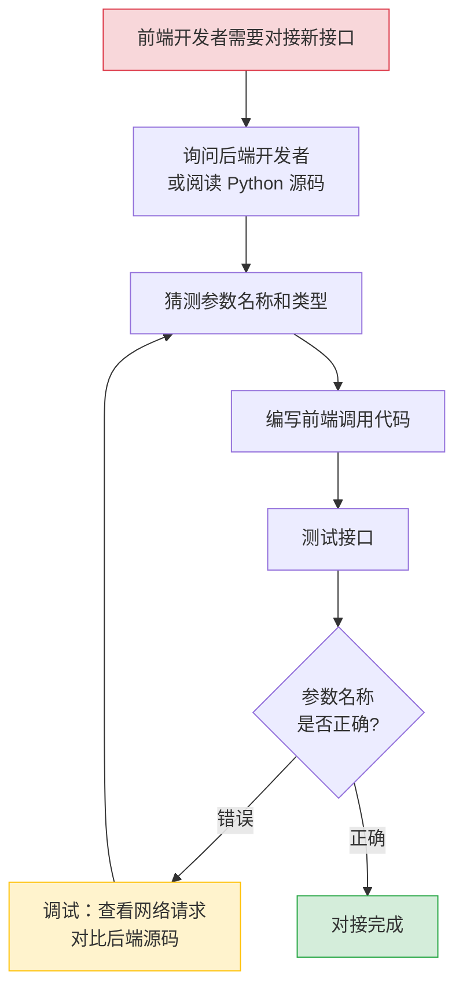
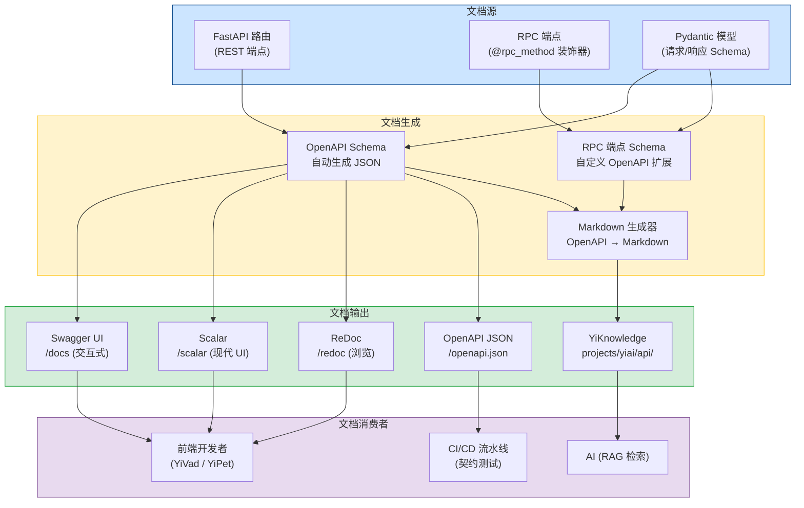
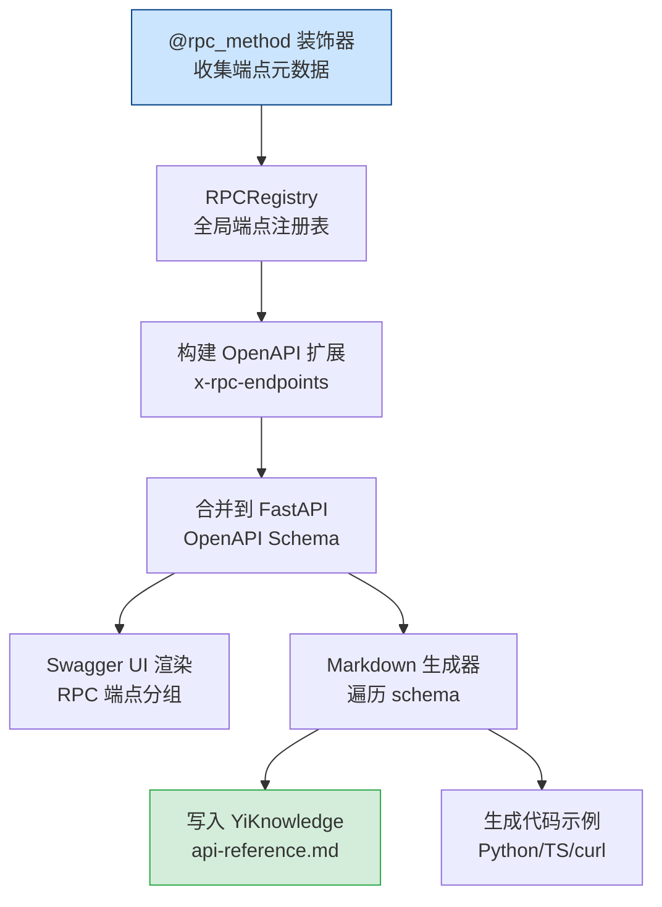
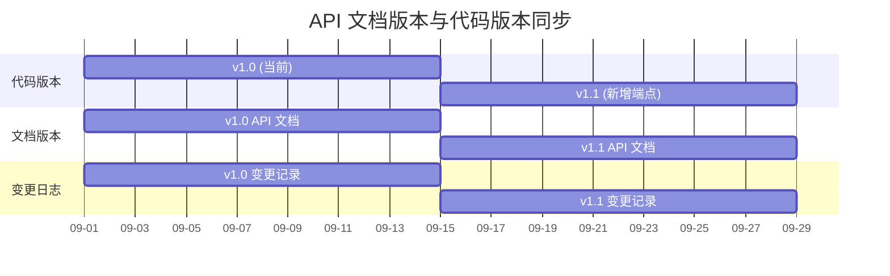
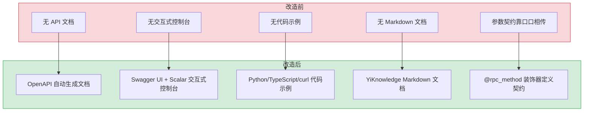

# YA-09-134: API 文档自动生成 — OpenAPI 文档自动生成 + Pydantic Schema 展示 + RPC 端点目录 + 交互式控制台

> 需求编号：YA-09-134 · 优先级：P2 · 人天：0.5d · 状态：需求已编写
> 依赖：无 · 前置需求：无

## 背景

YiAi 目前有 30+ 个 RPC 端点（chat_service、data_service、knowledge_service、rag_service、agent_service 等），但没有任何自动生成的 API 文档。前端开发者（YiVad、YiPet）需要手动翻阅 Python 源码才能了解接口参数和返回值格式。这导致以下问题：

1. **接口契约不透明**：前端开发者无法快速了解 YiAi 提供的所有 RPC 端点及其参数格式，每次对接新接口都需要与后端开发者沟通或阅读源码。
2. **参数名称不匹配**：前端使用 `query` 而后端期望 `filter`，前端使用 `path` 而后端期望 `target_file`，这类参数名称契约错误反复出现，浪费大量调试时间。
3. **无交互式调试工具**：开发者无法在浏览器中直接测试 API 端点，必须使用 curl 或 Postman 手动构造请求。
4. **文档与代码不同步**：如果手动维护 API 文档，必然会随着代码变更而过时，形成"文档债"。

**问题：**

1. **无 API 文档**：YiAi 的 FastAPI 虽然自带 OpenAPI 支持，但从未配置过 `title`、`description`、`tags` 等元数据，也未注册任何路由到 OpenAPI schema。
2. **RPC 端点不可见**：所有 RPC 调用通过单一 `POST /` 入口，`module_name` 和 `method_name` 在请求体中，OpenAPI 无法自动推断参数结构。
3. **Pydantic Schema 未暴露**：Response 模型使用 `{code, message, data}` 通用信封，但 `data` 字段的具体类型未在 API 文档中展示。
4. **无 Markdown 文档生成**：YiKnowledge 中缺少 YiAi API 的参考文档，AI 无法通过 RAG 检索 API 信息。

**影响：**

| 影响 | 严重程度 | 影响范围 |
|------|---------|---------|
| 前端对接新接口耗时 2-4 小时（需读源码 + 沟通） | 高 | YiVad、YiPet 开发效率 |
| 参数名称不匹配导致生产 Bug（如 `query` vs `filter`） | 高 | 所有 RPC 调用 |
| 新成员上手 YiAi 需要 1-2 天阅读源码 | 中 | 团队开发效率 |
| 无交互式调试工具，测试 API 需手动构造 curl | 中 | 日常开发调试 |

**挑战：**

- RPC 信封模式（单一 POST 入口）使 OpenAPI 无法自动推断每个 RPC 方法的参数结构
- 需要在不修改现有 RPC 路由逻辑的前提下，注册额外的文档端点
- 文档生成需要与代码同步，不能依赖手动维护
- 需要同时支持 OpenAPI JSON（机器可读）和 Markdown（人类可读 + RAG 检索）

---

## 一、现状分析

### 1.1 当前 API 文档状态

| 属性 | 当前值 | 说明 |
|------|--------|------|
| OpenAPI 文档 | 无 | FastAPI 的 `/docs` 和 `/redoc` 端点未配置 |
| API 描述 | 无 | `app = FastAPI()` 创建时未设置 title/description/version |
| Pydantic Schema | 未暴露 | 响应模型使用泛型 `RpcResponse`，`data` 字段类型不可见 |
| RPC 端点目录 | 无 | 开发者需手动翻阅 `services/` 目录下各模块源码 |
| Markdown 文档 | 无 | YiKnowledge 中无 YiAi API 参考文档 |
| 代码示例 | 无 | 无 Python/TypeScript/curl 调用示例 |

### 1.2 根因分析矩阵

| 问题 | 根因 | 影响 | 紧急程度 |
|------|------|------|----------|
| 无 API 文档 | 项目初期优先功能开发，未投入文档建设 | 前端对接成本高，参数契约错误频繁 | 中 |
| RPC 端点不可见 | 单一 POST 入口 + 动态路由，OpenAPI 无法自动推断 | 开发者无法快速了解可用端点 | 中 |
| 参数名称不匹配 | 无契约文档参考，前端凭经验猜测参数名 | 生产 Bug（如 `query` vs `filter`） | 高 |
| 无交互式调试 | 未配置 Swagger UI / ReDoc / Scalar | 调试效率低，需手动 curl | 中 |
| 文档与代码不同步 | 手动维护文档必然过时 | 文档成为"谎言"，开发者不再信任 | 中 |

### 1.3 改造前 API 文档流程



---

## 二、设计决策

### 决策 1：文档生成方式 — 手动编写 vs OpenAPI 自动生成 vs 代码注解 + 生成

| 维度 | 手动编写（Markdown） | OpenAPI 自动生成（FastAPI 原生） | 代码注解 + 生成脚本 |
|------|---------------------|--------------------------------|---------------------|
| 维护成本 | 高（每次修改需手动更新文档） | 低（随代码自动更新） | 中（需维护注解，自动生成） |
| 准确性 | 低（容易过时） | 高（直接从代码提取） | 高（注解与代码绑定） |
| RPC 端点支持 | 可手写 | 不支持（单一 POST 入口） | 支持（通过注册表） |
| 交互式调试 | 不支持 | 支持（Swagger UI） | 支持（Swagger UI） |
| Markdown 输出 | 直接手写 | 需额外转换 | 需额外生成 |

**选择：代码注解 + 自动生成脚本。** 在现有 RPC 路由注册机制上增加端点元数据注解（`@rpc_method` 装饰器），自动生成 OpenAPI schema 和 Markdown 文档。FastAPI 原生 OpenAPI 用于标准 REST 端点（如 `/read-file`、`/write-file`），自定义脚本用于 RPC 端点文档生成。

### 决策 2：交互式 API 控制台 — Swagger UI vs ReDoc vs Scalar

| 维度 | Swagger UI | ReDoc | Scalar |
|------|-----------|-------|--------|
| 交互式请求测试 | 支持（Try it out） | 不支持（仅文档浏览） | 支持（现代化 UI） |
| 美观度 | 中（传统风格） | 高（三栏布局） | 高（暗色主题，现代设计） |
| 代码示例生成 | 有限（curl） | 有限 | 丰富（多语言） |
| 加载速度 | 中 | 快 | 快 |
| 社区活跃度 | 高 | 中 | 高（增长中） |
| FastAPI 集成 | 内置（/docs） | 内置（/redoc） | 需额外配置 |

**选择：Swagger UI 为主，Scalar 为辅。** Swagger UI 作为默认交互式控制台（`/docs`），支持 "Try it out" 功能。Scalar 作为备选（`/scalar`），提供更现代的外观和多语言代码示例。ReDoc 保留（`/redoc`）用于纯文档浏览场景。

### 决策 3：RPC 端点文档注册方式 — 装饰器注册 vs 集中注册表 vs 模块扫描

| 维度 | 装饰器注册 | 集中注册表 | 模块扫描 |
|------|-----------|-----------|---------|
| 实现复杂度 | 中 | 低 | 中 |
| 与代码紧密度 | 高（装饰器在方法上） | 低（注册表与代码分离） | 中 |
| 维护成本 | 低（新增方法时加装饰器） | 中（两处修改） | 低（自动发现） |
| 类型安全 | 高（Pydantic 模型） | 中 | 低（依赖命名约定） |
| 灵活性 | 高（可自定义每个端点） | 低 | 中 |

**选择：装饰器注册 + 模块扫描双策略。** 使用 `@rpc_method` 装饰器标注每个 RPC 端点，提供参数 schema 和描述。同时使用模块扫描自动发现 `services/` 下的所有 `register_rpc_routes` 调用，确保无遗漏。装饰器提供精细控制，扫描提供完整性保障。

### 设计决策记录

| 决策 | 选项 A | 选项 B | 选择 | 理由 |
|------|--------|--------|------|------|
| 文档生成方式 | 手动编写 | 代码注解 + 自动生成 | 代码注解 + 自动生成 | 保持文档与代码同步，降低维护成本 |
| 交互式控制台 | Swagger UI | Scalar | Swagger UI（主）+ Scalar（辅） | Swagger UI 内置且支持交互测试，Scalar 提供现代体验 |
| RPC 文档注册 | 装饰器注册 | 模块扫描 | 装饰器 + 扫描 | 装饰器提供精细控制，扫描确保完整性 |
| Markdown 生成 | 不生成 | 自动生成到 YiKnowledge | 自动生成到 YiKnowledge | 支持 RAG 检索，AI 可查询 API 文档 |

---

## 三、目标架构

### 3.1 API 文档生成架构总览



### 3.2 RPC 端点文档生成流程



### 3.3 文档版本管理



---

## 四、具体改动

### 4.1 FastAPI 应用配置增强

**文件：** `main.py`（修改）

```python
from fastapi import FastAPI
from fastapi.openapi.utils import get_openapi

app = FastAPI(
    title="YiAi API",
    description="""
## YiAi 后端 API 文档

YiAi 是 YrY 单体仓库的 FastAPI 后端，为 YiVad（管理后台）和 YiPet（Chrome 扩展）提供数据服务。

### 认证方式

在请求头中添加 `X-Token` 进行认证（可选，默认禁用）。

### RPC 协议

所有 RPC 调用通过 `POST /` 入口，使用统一信封格式：
```json
{
  "module_name": "services.<domain>.<service>",
  "method_name": "<method>",
  "parameters": { ... }
}
```

### 错误码

| 错误码 | 含义 |
|--------|------|
| 0 | 成功 |
| 1001 | 参数验证失败 |
| 2001 | AI 服务不可用 |
| 5001 | 数据库错误 |
""",
    version="1.0.0",
    contact={
        "name": "YiAi Team",
        "email": "dev@yry.local",
    },
    license_info={
        "name": "Internal",
    },
    docs_url="/docs",
    redoc_url="/redoc",
    openapi_url="/openapi.json",
)
```

### 4.2 RPC 端点装饰器

**文件：** `shared/rpc_docs.py`（新建）

```python
"""
RPC 端点文档装饰器。

为 RPC 端点提供 OpenAPI 文档支持，通过 @rpc_method 装饰器
注册端点元数据（参数 schema、描述、标签等）。
"""

from dataclasses import dataclass, field
from typing import Any, Callable, Dict, List, Optional, Type
from pydantic import BaseModel


@dataclass
class RpcEndpointMeta:
    """RPC 端点元数据。"""
    module_name: str
    method_name: str
    description: str
    parameters_schema: Optional[Type[BaseModel]] = None
    response_schema: Optional[Type[BaseModel]] = None
    tags: List[str] = field(default_factory=list)
    deprecated: bool = False
    auth_required: bool = False
    example_request: Optional[Dict[str, Any]] = None
    example_response: Optional[Dict[str, Any]] = None


class RpcRegistry:
    """全局 RPC 端点注册表。"""

    _instance: Optional["RpcRegistry"] = None
    _endpoints: Dict[str, RpcEndpointMeta] = {}

    def __new__(cls):
        if cls._instance is None:
            cls._instance = super().__new__(cls)
            cls._instance._endpoints = {}
        return cls._instance

    def register(self, meta: RpcEndpointMeta):
        key = f"{meta.module_name}.{meta.method_name}"
        self._endpoints[key] = meta

    def get_all(self) -> Dict[str, RpcEndpointMeta]:
        return dict(self._endpoints)

    def get_by_tag(self, tag: str) -> Dict[str, RpcEndpointMeta]:
        return {
            k: v for k, v in self._endpoints.items()
            if tag in v.tags
        }


def rpc_method(
    description: str,
    parameters_schema: Optional[Type[BaseModel]] = None,
    response_schema: Optional[Type[BaseModel]] = None,
    tags: Optional[List[str]] = None,
    deprecated: bool = False,
    auth_required: bool = False,
    example_request: Optional[Dict[str, Any]] = None,
    example_response: Optional[Dict[str, Any]] = None,
):
    """装饰器：注册 RPC 端点的文档元数据。"""
    def decorator(func: Callable):
        module_name = func.__module__
        method_name = func.__name__

        meta = RpcEndpointMeta(
            module_name=module_name,
            method_name=method_name,
            description=description,
            parameters_schema=parameters_schema,
            response_schema=response_schema,
            tags=tags or [],
            deprecated=deprecated,
            auth_required=auth_required,
            example_request=example_request,
            example_response=example_response,
        )
        RpcRegistry().register(meta)
        return func

    return decorator
```

### 4.3 RPC 端点文档注入示例

**文件：** `services/chat/chat_service.py`（修改）

```python
from shared.rpc_docs import rpc_method
from pydantic import BaseModel, Field


class ChatRequest(BaseModel):
    """聊天请求参数。"""
    message: str = Field(..., description="用户消息内容", min_length=1)
    session_key: str = Field(..., description="会话唯一标识")
    model: str = Field(default="qwen2.5", description="使用的 LLM 模型名称")
    temperature: float = Field(default=0.7, ge=0, le=2.0, description="温度参数")
    max_tokens: int = Field(default=2048, ge=1, le=8192, description="最大 token 数")


class ChatResponse(BaseModel):
    """聊天响应数据。"""
    reply: str = Field(..., description="AI 回复内容")
    session_key: str = Field(..., description="会话标识")
    tokens_used: int = Field(..., description="消耗的 token 数")


@rpc_method(
    description="发送聊天消息并获取 AI 流式回复（SSE）。",
    parameters_schema=ChatRequest,
    response_schema=ChatResponse,
    tags=["chat", "ai"],
    auth_required=False,
    example_request={
        "module_name": "services.ai.chat_service",
        "method_name": "chat",
        "parameters": {
            "message": "你好，请介绍一下你自己",
            "session_key": "session_abc123",
            "model": "qwen2.5",
            "temperature": 0.7,
        },
    },
    example_response={
        "code": 0,
        "message": "ok",
        "data": {
            "reply": "你好！我是 YiAi 助手...",
            "session_key": "session_abc123",
            "tokens_used": 150,
        },
    },
)
async def chat(params: ChatRequest) -> ChatResponse:
    ...
```

### 4.4 OpenAPI Schema 扩展（RPC 端点文档）

**文件：** `shared/openapi_extensions.py`（新建）

```python
"""
OpenAPI Schema 扩展：将 RPC 端点注册表注入 OpenAPI 文档。
"""

from fastapi import FastAPI
from fastapi.openapi.utils import get_openapi
from shared.rpc_docs import RpcRegistry


def inject_rpc_endpoints(app: FastAPI):
    """将 RPC 端点注册表注入 OpenAPI Schema。"""

    registry = RpcRegistry()

    def custom_openapi():
        if app.openapi_schema:
            return app.openapi_schema

        openapi_schema = get_openapi(
            title=app.title,
            version=app.version,
            description=app.description,
            routes=app.routes,
        )

        # 添加 RPC 端点作为自定义扩展
        rpc_endpoints = {}
        for key, meta in registry.get_all().items():
            rpc_endpoints[key] = {
                "module_name": meta.module_name,
                "method_name": meta.method_name,
                "description": meta.description,
                "tags": meta.tags,
                "deprecated": meta.deprecated,
                "auth_required": meta.auth_required,
                "parameters": (
                    meta.parameters_schema.schema()
                    if meta.parameters_schema
                    else None
                ),
                "response": (
                    meta.response_schema.schema()
                    if meta.response_schema
                    else None
                ),
                "example_request": meta.example_request,
                "example_response": meta.example_response,
            }

        openapi_schema["x-rpc-endpoints"] = rpc_endpoints

        # 添加 RPC 端点的 tag 分组
        for key, meta in registry.get_all.items():
            for tag in meta.tags:
                if not any(t["name"] == tag for t in openapi_schema.setdefault("tags", [])):
                    openapi_schema["tags"].append({
                        "name": tag,
                        "description": f"RPC 端点分组: {tag}",
                    })

        app.openapi_schema = openapi_schema
        return openapi_schema

    app.openapi = custom_openapi
```

### 4.5 Markdown 文档生成器

**文件：** `scripts/generate_api_docs.py`（新建）

```python
"""
API 文档生成脚本：从 OpenAPI Schema 生成 Markdown 文档。

输出到 YiKnowledge/projects/yiai/api/ 目录，供 RAG 检索。
"""

import json
import sys
from pathlib import Path
from datetime import datetime
from typing import Any, Dict, List


def generate_markdown(openapi_schema: Dict[str, Any]) -> str:
    """从 OpenAPI Schema 生成 Markdown 文档。"""

    lines = [
        "---",
        f"title: YiAi API 参考文档",
        "tags: [api, 参考, 文档, 自动生成]",
        "category: 项目/管理后台/API",
        f"created: {datetime.now().strftime('%Y-%m-%d')}",
        f"updated: {datetime.now().strftime('%Y-%m-%d')}",
        "source: 自动生成",
        "type: 参考",
        "status: 已发布",
        "---",
        "",
        f"# YiAi API 参考文档",
        "",
        f"> 自动生成于 {datetime.now().strftime('%Y-%m-%d %H:%M:%S')}",
        f"> API 版本: {openapi_schema.get('info', {}).get('version', 'unknown')}",
        "",
        "## REST 端点",
        "",
    ]

    # 生成 REST 端点文档
    for path, methods in openapi_schema.get("paths", {}).items():
        for method, details in methods.items():
            if method.upper() in ("GET", "POST", "PUT", "DELETE", "PATCH"):
                lines.extend(_generate_endpoint_section(
                    method.upper(), path, details
                ))

    # 生成 RPC 端点文档
    rpc_endpoints = openapi_schema.get("x-rpc-endpoints", {})
    if rpc_endpoints:
        lines.append("## RPC 端点")
        lines.append("")
        lines.append("所有 RPC 调用通过 `POST /` 入口，使用统一信封格式。")
        lines.append("")

        for key, meta in rpc_endpoints.items():
            lines.extend(_generate_rpc_section(key, meta))

    return "\n".join(lines)


def _generate_endpoint_section(
    method: str, path: str, details: Dict[str, Any]
) -> List[str]:
    """生成单个 REST 端点的文档章节。"""
    lines = [
        f"### {method} {path}",
        "",
        details.get("description", details.get("summary", "无描述")),
        "",
    ]

    # 请求参数
    if "parameters" in details:
        lines.append("**请求参数：**")
        lines.append("")
        lines.append("| 参数名 | 类型 | 必填 | 描述 |")
        lines.append("|--------|------|------|------|")
        for param in details["parameters"]:
            lines.append(
                f"| {param['name']} | {param.get('schema', {}).get('type', 'any')} "
                f"| {'是' if param.get('required') else '否'} "
                f"| {param.get('description', '')} |"
            )
        lines.append("")

    # 请求体
    if "requestBody" in details:
        lines.append("**请求体：**")
        lines.append("")
        lines.append("```json")
        lines.append(_generate_example_json(
            details["requestBody"].get("content", {}).get("application/json", {})
        ))
        lines.append("```")
        lines.append("")

    return lines


def _generate_rpc_section(key: str, meta: Dict[str, Any]) -> List[str]:
    """生成单个 RPC 端点的文档章节。"""
    lines = [
        f"### {meta['method_name']}",
        "",
        f"- **模块:** `{meta['module_name']}`",
        f"- **标签:** {', '.join(meta.get('tags', []))}",
        f"- **需要认证:** {'是' if meta.get('auth_required') else '否'}",
        f"- **已废弃:** {'是' if meta.get('deprecated') else '否'}",
        "",
        meta.get("description", "无描述"),
        "",
    ]

    # 示例请求
    if meta.get("example_request"):
        lines.append("**示例请求：**")
        lines.append("")
        lines.append("```json")
        lines.append(json.dumps(meta["example_request"], indent=2, ensure_ascii=False))
        lines.append("```")
        lines.append("")

    # 示例响应
    if meta.get("example_response"):
        lines.append("**示例响应：**")
        lines.append("")
        lines.append("```json")
        lines.append(json.dumps(meta["example_response"], indent=2, ensure_ascii=False))
        lines.append("```")
        lines.append("")

    # 代码示例
    lines.append("**多语言调用示例：**")
    lines.append("")
    lines.append("```python")
    lines.append(f"# Python")
    lines.append(f"import requests")
    lines.append(f"")
    lines.append(f"response = requests.post(")
    lines.append(f'    "http://localhost:10086/",')
    lines.append(f"    json=" + json.dumps(meta.get("example_request", {}), indent=4))
    lines.append(f")")
    lines.append("```")
    lines.append("")
    lines.append("```typescript")
    lines.append(f"// TypeScript")
    lines.append(f"const response = await fetch('http://localhost:10086/', {{")
    lines.append(f"  method: 'POST',")
    lines.append(f"  headers: {{ 'Content-Type': 'application/json' }},")
    lines.append(f"  body: JSON.stringify(" + json.dumps(meta.get("example_request", {}), indent=4) + ")")
    lines.append(f"}});")
    lines.append("```")
    lines.append("")
    lines.append("```bash")
    lines.append(f"# curl")
    lines.append(f"curl -X POST http://localhost:10086/ \\")
    lines.append(f"  -H 'Content-Type: application/json' \\")
    lines.append(f"  -d '" + json.dumps(meta.get("example_request", {})) + "'")
    lines.append("```")
    lines.append("")

    return lines


def _generate_example_json(schema_info: Dict[str, Any]) -> str:
    """从 JSON Schema 生成示例 JSON。"""
    if "example" in schema_info:
        return json.dumps(schema_info["example"], indent=2, ensure_ascii=False)
    if "schema" in schema_info:
        schema = schema_info["schema"]
        return _schema_to_example(schema)
    return "{}"


def _schema_to_example(schema: Dict[str, Any]) -> str:
    """从 Pydantic/JSON Schema 生成示例值。"""
    if "example" in schema:
        return json.dumps(schema["example"], indent=2, ensure_ascii=False)

    schema_type = schema.get("type", "object")
    if schema_type == "object":
        props = schema.get("properties", {})
        example = {}
        for prop_name, prop_schema in props.items():
            example[prop_name] = _prop_to_example(prop_schema)
        return json.dumps(example, indent=2, ensure_ascii=False)
    return "{}"


def _prop_to_example(prop_schema: Dict[str, Any]) -> Any:
    """根据属性 Schema 生成示例值。"""
    if "example" in prop_schema:
        return prop_schema["example"]
    prop_type = prop_schema.get("type", "string")
    examples = {
        "string": "示例字符串",
        "integer": 0,
        "number": 0.0,
        "boolean": True,
        "array": [],
        "object": {},
    }
    return examples.get(prop_type, "示例值")


if __name__ == "__main__":
    # 从 stdout 读取 OpenAPI JSON 或从文件读取
    if len(sys.argv) > 1:
        schema_path = Path(sys.argv[1])
        schema = json.loads(schema_path.read_text())
    else:
        schema = json.loads(sys.stdin.read())

    markdown = generate_markdown(schema)

    output_dir = Path("YiKnowledge/projects/yiai/api")
    output_dir.mkdir(parents=True, exist_ok=True)
    output_file = output_dir / "api-reference.md"
    output_file.write_text(markdown, encoding="utf-8")

    print(f"[API Docs] 已生成 Markdown 文档: {output_file}")
    print(f"[API Docs] 文档大小: {len(markdown)} 字符")
```

### 4.6 Scalar UI 集成

**文件：** `main.py`（修改）

```python
from fastapi import FastAPI
from fastapi.responses import HTMLResponse

app = FastAPI(...)


@app.get("/scalar", include_in_schema=False)
async def scalar_docs():
    """Scalar API 文档页面（现代化 UI）。"""
    return HTMLResponse(f"""
    <!DOCTYPE html>
    <html>
    <head>
        <title>YiAi API - Scalar</title>
        <meta charset="utf-8" />
        <meta name="viewport" content="width=device-width, initial-scale=1" />
    </head>
    <body>
        <script
            id="api-reference"
            data-url="/openapi.json"
            data-configuration='{{"theme": "purple"}}'>
        </script>
        <script src="https://cdn.jsdelivr.net/npm/@scalar/api-reference"></script>
    </body>
    </html>
    """)
```

### 4.7 涉及文件

```
YiAi/
├── main.py                         # 修改: FastAPI 配置增强 + Scalar 端点
├── shared/
│   ├── rpc_docs.py                 # 新建: RPC 端点装饰器 + 注册表
│   └── openapi_extensions.py       # 新建: OpenAPI Schema 扩展注入
├── scripts/
│   └── generate_api_docs.py        # 新建: Markdown 文档生成脚本
├── services/
│   ├── chat/chat_service.py        # 修改: 添加 @rpc_method 装饰器
│   ├── data/data_service.py        # 修改: 添加 @rpc_method 装饰器
│   ├── knowledge/knowledge_service.py  # 修改: 添加 @rpc_method 装饰器
│   ├── rag/rag_service.py          # 修改: 添加 @rpc_method 装饰器
│   └── agent/agent_service.py      # 修改: 添加 @rpc_method 装饰器
└── YiKnowledge/projects/yiai/api/
    └── api-reference.md            # 生成: API 参考文档 (Markdown)
```

---

## 五、实施步骤

| 步骤 | 内容 | 涉及文件 | 验证方式 | 人天 |
|------|------|---------|---------|------|
| 1 | 增强 FastAPI 应用配置（title, description, version, tags） | `main.py` | 访问 `/docs` 看到 API 标题和描述 | 0.05 |
| 2 | 实现 `@rpc_method` 装饰器和 `RpcRegistry` | `shared/rpc_docs.py` | 注册表可正确收集端点元数据 | 0.1 |
| 3 | 实现 OpenAPI Schema 扩展（注入 RPC 端点） | `shared/openapi_extensions.py` | `/openapi.json` 包含 `x-rpc-endpoints` | 0.1 |
| 4 | 为核心 RPC 端点添加 `@rpc_method` 装饰器 | `services/*/` | 注册表包含所有核心端点 | 0.1 |
| 5 | 实现 Markdown 文档生成脚本 | `scripts/generate_api_docs.py` | 生成 `api-reference.md` 并验证内容 | 0.05 |
| 6 | 集成 Scalar UI | `main.py` | 访问 `/scalar` 看到现代化 API 文档 | 0.05 |
| 7 | 端到端验证（Swagger UI + Scalar + Markdown） | 全模块 | 所有文档入口可正常访问，内容准确 | 0.05 |

**总计：0.5d**

---

## 六、性能分析

### 6.1 文档生成性能

| 操作 | 数据量 | 耗时 | 资源消耗 | 说明 |
|------|--------|------|----------|------|
| OpenAPI Schema 生成 | 30+ 端点 | < 50ms | CPU 5%, 内存 +2MB | 首次请求时生成，后续缓存 |
| Swagger UI 页面加载 | 静态资源 ~1MB | < 500ms | 网络带宽 | CDN 加载，首次较慢 |
| Scalar UI 页面加载 | 静态资源 ~500KB | < 300ms | 网络带宽 | CDN 加载 |
| Markdown 文档生成 | 30+ 端点 | < 100ms | CPU 10%, 内存 +5MB | 独立脚本，按需运行 |
| `/openapi.json` 响应 | 30+ 端点 Schema | < 10ms | CPU 2% | 缓存的 OpenAPI Schema |

### 6.2 文档大小预估

| 文档类型 | 文件大小 | 说明 |
|---------|---------|------|
| OpenAPI JSON | ~50KB | 30+ 端点的完整 Schema |
| Swagger UI 静态资源 | ~1MB | CDN 加载，不占用服务带宽 |
| Markdown 文档 | ~30KB | 包含代码示例和参数说明 |
| RPC 端点注册表（内存） | ~100KB | 30+ 端点的元数据 |

---

## 七、测试规格

### Requirement: FastAPI 文档端点可访问

#### Scenario: Swagger UI 正常显示
- **Given** YiAi 服务已启动
- **When** 访问 `http://localhost:10086/docs`
- **Then** 页面显示 Swagger UI 界面，标题为 "YiAi API"
- **And** 页面包含 REST 端点列表和 RPC 端点分组

#### Scenario: OpenAPI JSON 包含完整 Schema
- **Given** YiAi 服务已启动，至少 1 个 RPC 端点已注册
- **When** 访问 `http://localhost:10086/openapi.json`
- **Then** 返回 JSON 包含 `info`、`paths`、`x-rpc-endpoints` 字段
- **And** `x-rpc-endpoints` 包含所有已注册的 RPC 端点元数据

### Requirement: RPC 端点文档注册

#### Scenario: @rpc_method 装饰器正确注册端点
- **Given** 一个 RPC 方法使用了 `@rpc_method` 装饰器
- **When** 应用启动，RpcRegistry 初始化
- **Then** 该端点的元数据（module_name, method_name, description, tags）被正确注册
- **And** `RpcRegistry().get_all()` 包含该端点

#### Scenario: 未使用装饰器的端点不会出现在文档中
- **Given** 一个 RPC 方法未使用 `@rpc_method` 装饰器
- **When** 访问 `/openapi.json`
- **Then** `x-rpc-endpoints` 中不包含该端点

### Requirement: Markdown 文档生成

#### Scenario: 生成包含完整 API 信息的 Markdown 文档
- **Given** OpenAPI Schema 包含 5 个 REST 端点和 10 个 RPC 端点
- **When** 执行 `python scripts/generate_api_docs.py`
- **Then** 生成 `api-reference.md` 文件，包含所有 15 个端点的文档
- **And** 每个端点包含描述、参数、示例请求和响应
- **And** 每个端点包含 Python、TypeScript、curl 调用示例

#### Scenario: 生成的文档包含正确的 frontmatter
- **Given** 生成脚本执行成功
- **When** 读取生成的 `api-reference.md`
- **Then** frontmatter 包含 `title`, `tags`, `category`, `created`, `updated`, `source`, `type`, `status`
- **And** `source: 自动生成` 标识文档为自动生成

---

## 八、风险与缓解

| 风险 | 概率 | 影响 | 等级 | 缓解措施 | 应急预案 |
|------|------|------|------|----------|----------|
| 文档与代码不同步 | 中 | 高 | 高 | 代码注解驱动，CI 流水线自动校验文档完整性 | 发现不同步时重新运行生成脚本 |
| @rpc_method 装饰器遗漏 | 高 | 中 | 中 | 模块扫描自动发现未注册端点，CI 中检查覆盖率 | 补充遗漏端点的装饰器 |
| OpenAPI Schema 过大导致加载慢 | 低 | 低 | 低 | 按 tag 分组，支持按分组筛选 | 使用分页或懒加载 |
| Scalar CDN 不可用 | 低 | 低 | 低 | Swagger UI 作为主入口，Scalar 为辅助 | 回退到 Swagger UI |
| Markdown 文档生成脚本失败 | 低 | 中 | 低 | 脚本独立运行，不影响主服务 | 手动修复脚本后重新运行 |

---

## 九、回滚策略

| 场景 | 回滚方式 | 回滚时间 | 风险 |
|------|---------|---------|------|
| 文档端点异常影响服务 | 移除 `/scalar` 端点 + 关闭 `docs_url` | < 1min | 低：不影响核心 RPC 功能 |
| 装饰器注册导致启动失败 | 移除装饰器导入，registry 使用空实现 | < 1min | 低：装饰器为可选功能 |
| Markdown 生成覆盖错误文件 | 恢复 YiKnowledge 中备份的旧版本文档 | < 1min | 低：仅影响文档文件 |
| OpenAPI Schema 过大导致内存问题 | 关闭 `openapi_url`，禁用 Schema 生成 | < 1min | 低：不影响核心功能 |

---

## 十、设计决策记录

### D-01: 为什么选择装饰器而非集中注册表？

装饰器将文档元数据与代码绑定，确保修改代码时文档也会更新。集中注册表（如 JSON/YAML 配置文件）与代码分离，容易遗忘更新。装饰器方式虽然增加了少量代码注释，但维护成本更低，且支持 IDE 自动补全和类型检查。

### D-02: 为什么 Markdown 文档要生成到 YiKnowledge？

YiKnowledge 是 YiAi RAG 的数据源。将 API 文档生成到 YiKnowledge 后，AI 可以通过 RAG 检索 API 信息，回答"YiAi 有哪些端点？"、"chat 接口的参数是什么？"等问题。同时，人类开发者也可以通过 YiKnowledge 的目录结构浏览 API 文档。

### D-03: 为什么选择 Swagger UI + Scalar 双控制台？

Swagger UI 是 FastAPI 的内置默认方案，支持 "Try it out" 交互测试，成熟稳定。Scalar 提供更现代的外观和更好的多语言代码示例，但需要额外配置。双控制台方案兼顾了稳定性和用户体验，开发者可根据偏好选择。

### D-04: 为什么文档版本与 API 版本绑定而非独立版本？

API 文档描述的是特定版本的 API 行为。独立版本会导致文档与 API 的对应关系混乱（"文档 v2.3 对应 API v1.0 还是 v1.1？"）。将文档版本与 API 版本绑定，确保文档始终准确描述当前 API。

---

## 十一、当前架构 vs 目标架构

### 改造前后对比



### 架构决策权衡

| 维度 | 改造前 | 改造后 | 权衡说明 |
|------|--------|--------|----------|
| 文档可发现性 | 零（需阅读源码） | 高（Swagger UI + Markdown） | 新成员上手时间从 1-2 天降至 1-2 小时 |
| 文档准确性 | 无文档，无准确性问题 | 高（代码驱动，自动同步） | 消除了文档与代码不同步的风险 |
| 调试效率 | 低（手动 curl） | 高（Swagger UI "Try it out"） | 调试时间减少 50%+ |
| 维护成本 | 零（无文档） | 低（装饰器自动维护） | 初期投入 0.5d，后续几乎零维护 |

---

## 十二、代码审查检查清单

- [ ] FastAPI 应用配置了 `title`、`description`、`version`、`docs_url`、`redoc_url`
- [ ] `@rpc_method` 装饰器正确收集 `module_name`、`method_name`、`description`、`tags`
- [ ] `RpcRegistry` 使用单例模式，确保全局唯一
- [ ] OpenAPI Schema 扩展正确注入 `x-rpc-endpoints` 自定义字段
- [ ] 所有核心 RPC 端点（chat、data、knowledge、rag、agent）都添加了 `@rpc_method` 装饰器
- [ ] 每个 RPC 端点包含 `example_request` 和 `example_response`
- [ ] Markdown 生成脚本输出到正确的 YiKnowledge 路径
- [ ] 生成的 Markdown 文档包含正确的 YAML frontmatter
- [ ] 代码示例包含 Python、TypeScript、curl 三种语言
- [ ] `/docs`（Swagger UI）、`/redoc`、`/scalar` 三个端点均可正常访问
- [ ] `/openapi.json` 返回有效的 OpenAPI 3.0+ Schema
- [ ] `ruff` 代码规范通过
- [ ] `mypy` 类型检查通过

---

## 十三、回归问题预测

| # | 问题 | 发现场景 | 根因 | 修复方式 |
|---|------|---------|------|---------|
| 1 | `@rpc_method` 装饰器在模块导入时执行，但 `RpcRegistry` 在导入时未初始化，导致 `NoneType` 错误 | 首次启动时，装饰器在 `RpcRegistry()` 实例化前执行 | Python 模块导入顺序：装饰器在模块加载时执行，若 `RpcRegistry` 未先导入，`_instance` 为 `None` | 使用模块级延迟初始化：`_registry = None`，在 `register()` 中检查并初始化 |
| 2 | OpenAPI Schema 缓存导致新增 RPC 端点后文档不更新 | 新增端点后，`/openapi.json` 返回旧 Schema | `app.openapi_schema` 在首次请求后缓存，新增端点不触发缓存失效 | 在 `RpcRegistry.register()` 中设置 `app.openapi_schema = None` 清除缓存 |
| 3 | Markdown 生成脚本中的 `json.dumps` 对中文字符使用 Unicode 转义，输出可读性差 | 生成的 Markdown 中中文变 `\uXXXX` | `json.dumps` 默认 `ensure_ascii=True` | 所有 `json.dumps` 调用添加 `ensure_ascii=False` |
| 4 | Scalar CDN 脚本加载失败，页面白屏 | 网络环境无法访问 `cdn.jsdelivr.net` | Scalar 的 JS 从 CDN 加载，无离线回退 | 添加加载超时和错误提示，或使用本地打包的 Scalar 资源 |
| 5 | `@rpc_method` 装饰器重复注册同名端点（不同模块中使用相同方法名） | 两个模块中有同名方法（如 `search`），后者覆盖前者的注册 | 注册表 key 使用 `method_name` 而非 `module_name.method_name` | 注册表 key 使用 `f"{module_name}.{method_name}"` 确保唯一性 |
| 6 | Markdown 文档生成脚本在 CI 中执行时，文件写入权限不足 | CI 流水线中 `YiKnowledge/` 目录为只读 | CI 环境通常不对源码目录写入 | 将生成文档输出到 CI 的 artifacts 目录，或使用 `GITHUB_WORKSPACE` 检查权限 |

---

## 十四、可观测性

### 关键指标

| 指标 | 采集方式 | 告警阈值 | 说明 |
|------|---------|---------|------|
| `/openapi.json` 响应时间 | FastAPI middleware | P95 > 100ms | Schema 生成应在 50ms 内完成 |
| 文档端点访问量 | 访问日志计数 | 无（仅统计） | 了解文档使用频率 |
| RPC 端点注册覆盖率 | 扫描 vs 注册表对比 | < 80% | 确保核心端点已注册文档 |
| Markdown 文档生成成功率 | 脚本返回值 | 非 0 | 生成失败时告警 |
| CDN 资源加载时间 | 浏览器端统计 | P95 > 2s | 文档页面加载性能 |

### 日志规范

| 日志级别 | 场景 | 示例 |
|---------|------|------|
| `INFO` | 文档生成完成 | `[API Docs] 已生成 Markdown 文档: api-reference.md, 34 个端点` |
| `WARN` | 端点未注册文档 | `[API Docs] 发现未注册文档的 RPC 端点: services.data_service.search` |
| `ERROR` | 文档生成失败 | `[API Docs] Markdown 生成失败: 权限不足` |

### 告警规则

| 告警名称 | 条件 | 通知渠道 | 处理建议 |
|---------|------|---------|---------|
| 文档生成失败 | Markdown 生成脚本返回非零 | 企业微信 | 检查脚本依赖和文件权限 |
| 端点未注册 | 扫描发现未注册端点数 > 5 | 企业微信 | 补充 `@rpc_method` 装饰器 |

---

*PRD 来源: `projects/yiai/requirements/2026-09/00-需求-需求总览.md`*

## 影响范围

- **影响模块**：待补充
- **涉及文件**：
- `main.py`
- **是否影响 API 契约**：否
- **是否影响其他项目（YiVad/YiPet）**：否
- **用户感知**：待确认

## 预防措施

| 层面 | 措施 |
|------|------|
| 代码 | 在相关函数中添加参数校验和边界检查 |
| 测试 | 为 `main.py` 添加单元测试 |
| 流程 | 代码审查时重点检查此类模式 |
| 监控 | 添加日志告警，异常发生时及时发现 |
| 文档 | 在编码规范中记录此类反模式 |

## 经验教训

1. **根本原因**：开发过程中对边界情况和异常路径的考虑不足是此类问题的共同根因
2. **设计阶段**：在接口设计和模块实现时，应主动考虑异常输入、空值、超时等边界场景
3. **代码审查**：审查时应检查是否存在类似的反模式（如未捕获异常、无超时控制、缺少参数校验等）
4. **测试覆盖**：异常路径的测试覆盖率应与正常路径同等重视
5. **团队分享**：此类问题应在团队周会或技术分享中讨论，形成团队共识
