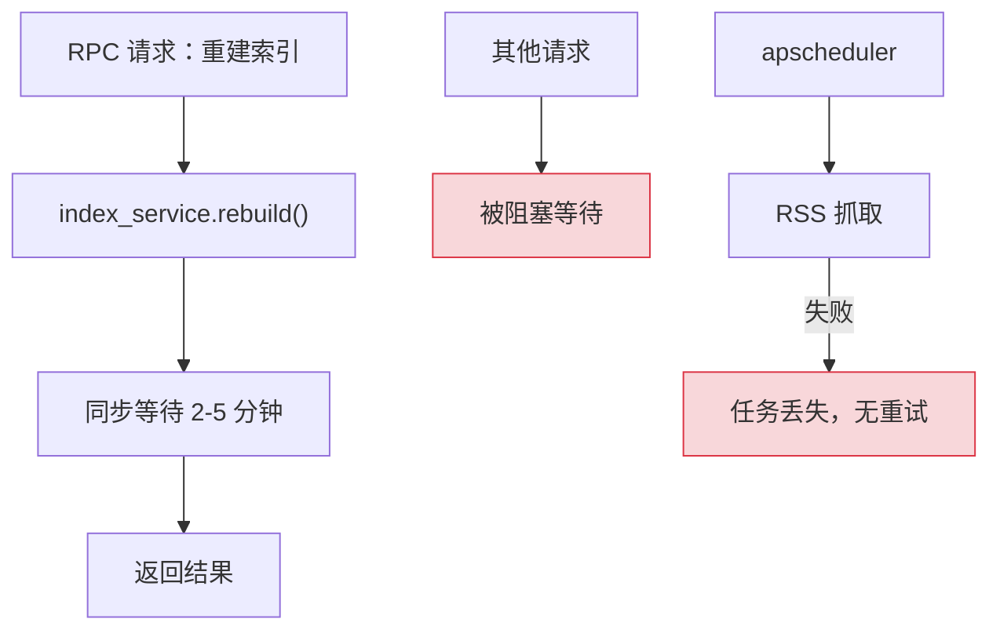
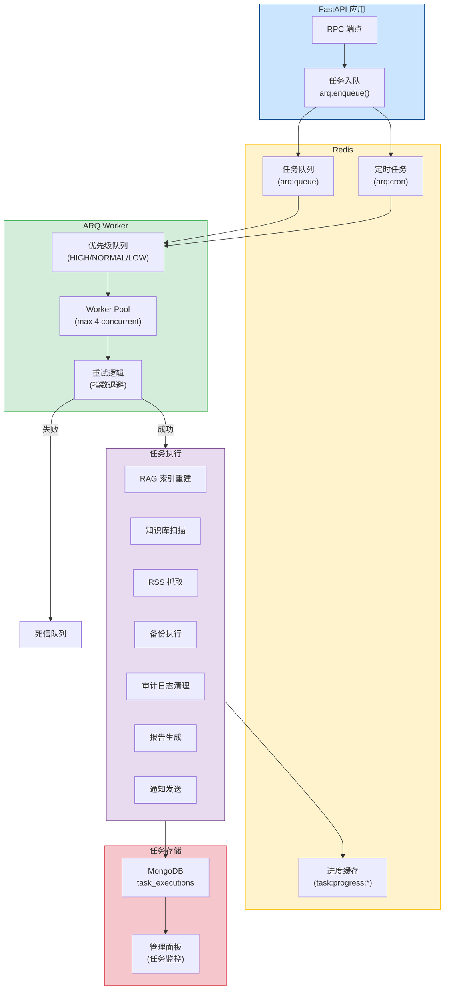
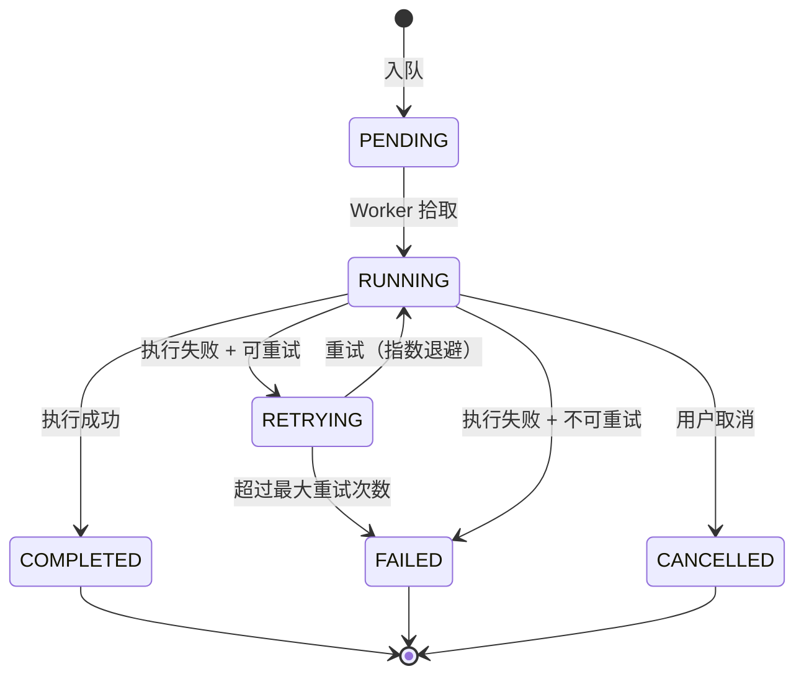
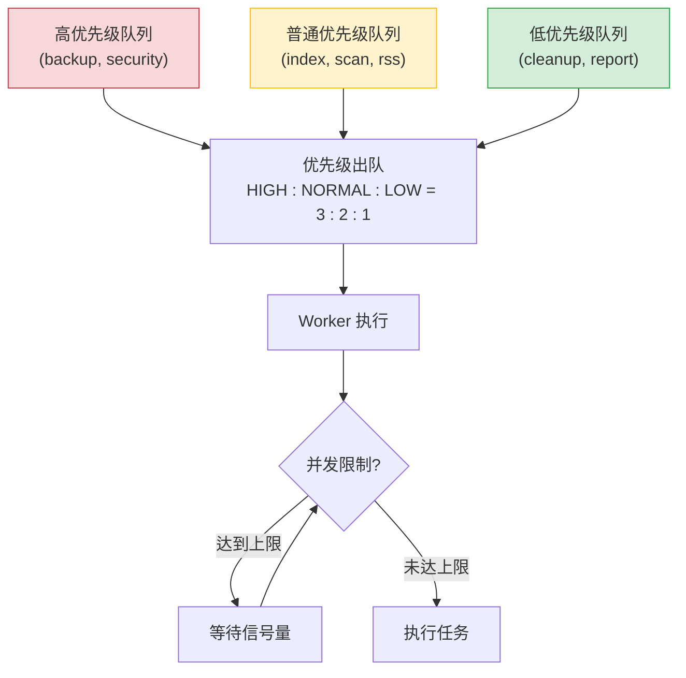
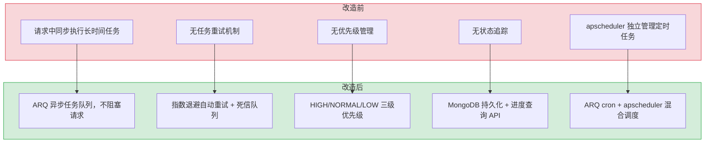

# YA-09-136: 后台任务队列 — ARQ 异步任务队列 + 定时调度 + 优先级 + 重试 + 进度追踪 + 管理面板

> 需求编号：YA-09-136 · 优先级：P2 · 人天：1.5d · 状态：需求已编写
> 依赖：Redis 服务 · 前置需求：无

## 背景

YiAi 当前所有任务（RAG 索引重建、知识库文件扫描、RSS 抓取、备份执行、审计日志清理）都在请求线程中同步执行或通过 apscheduler 的简单定时触发。随着业务增长，这种模式暴露出以下问题：

1. **长时间任务阻塞请求**：RAG 索引重建（耗时 2-5 分钟）在请求中同步执行时，会阻塞 FastAPI 的事件循环，导致其他请求超时。
2. **无重试机制**：RSS 抓取任务因网络波动失败时，没有自动重试，需要人工手动触发。
3. **无优先级管理**：备份任务和索引重建任务同时触发时，无法区分优先级，可能互相抢占资源。
4. **任务状态不可见**：无法查询任务进度（正在处理多少文档？是否已完成？），也无法取消正在执行的任务。
5. **无统一调度**：apscheduler 的定时任务和手动触发的任务分属不同机制，缺乏统一的任务管理和监控。

**问题：**

1. **长时间任务阻塞**：RAG 索引重建和知识库扫描耗时 2-5 分钟，在请求中执行会阻塞其他请求。
2. **无任务重试**：失败的任务不会自动重试，需人工干预。
3. **无优先级**：所有任务同等优先级，备份任务可能抢占索引重建的资源。
4. **无状态追踪**：无法查询任务进度、历史记录和执行结果。
5. **无并发控制**：多个知识库扫描任务可能同时运行，导致 MongoDB 连接耗尽。

**影响：**

| 影响 | 严重程度 | 影响范围 |
|------|---------|---------|
| 长时间任务阻塞请求导致 API 超时 | 高 | 所有 API 调用者 |
| 任务失败后无重试，数据同步中断 | 高 | RAG 索引、RSS 数据 |
| 无法查询任务状态，运维不可见 | 中 | 运维效率 |
| 任务并发无控制，资源耗尽 | 中 | 系统稳定性 |

**挑战：**

- 需要引入 Redis 作为任务队列中间件（新增基础设施依赖）
- 任务执行需要与现有 FastAPI 异步架构兼容
- 需要设计任务进度上报机制（ARQ 原生不支持进度查询）
- 需要在不修改现有 apscheduler 定时任务的前提下，逐步迁移到统一任务队列

---

## 一、现状分析

### 1.1 当前任务执行状态

| 属性 | 当前值 | 说明 |
|------|--------|------|
| 任务调度 | apscheduler（AsyncIOScheduler） | 仅支持定时触发，无任务队列 |
| 任务执行 | 请求线程内同步/异步执行 | 长时间任务阻塞事件循环 |
| 重试机制 | 无 | 失败后需人工重新触发 |
| 优先级 | 无 | 所有任务同等优先级 |
| 状态查询 | 无 | 无法查询任务进度和历史 |
| 并发控制 | 无 | 无限制，可能资源耗尽 |
| 任务持久化 | 无 | 服务重启后失败任务丢失 |

### 1.2 当前后台任务清单

| 任务 | 触发方式 | 耗时 | 频率 | 是否阻塞 |
|------|---------|------|------|----------|
| RAG 索引重建 | 手动（RPC 调用） | 2-5 min | 按需 | 是（阻塞请求） |
| 知识库文件扫描 | apscheduler（每 5 秒） | 1-10s | 定时 | 否（快速扫描） |
| RSS 抓取 | apscheduler（每小时） | 10-30s | 定时 | 否 |
| 审计日志清理 | apscheduler（每日） | 5-30s | 定时 | 否 |
| 备份执行 | apscheduler（每日） | 30-90s | 定时 | 否 |
| 报告生成 | 无 | N/A | 按需 | 无此功能 |
| 邮件/Webhook 通知 | 无 | N/A | 事件驱动 | 无此功能 |

### 1.3 根因分析矩阵

| 问题 | 根因 | 影响 | 紧急程度 |
|------|------|------|----------|
| 长时间任务阻塞请求 | 无任务队列，RAG 索引重建在请求中同步执行 | API 超时，其他请求排队 | 高 |
| 任务失败无重试 | 无重试逻辑，失败即丢弃 | 数据同步中断，需人工恢复 | 高 |
| 无优先级管理 | 未设计任务优先级机制 | 关键任务（备份）可能被非关键任务抢占 | 中 |
| 任务状态不可见 | 无任务追踪和状态查询 API | 运维无法了解任务执行情况 | 中 |
| 并发无控制 | 无并发限制，任务随意执行 | 资源耗尽，服务不稳定 | 中 |

### 1.4 改造前任务执行流程



---

## 二、设计决策

### 决策 1：任务队列选型 — ARQ vs Celery vs RQ vs 自建

| 维度 | ARQ (Async Redis Queue) | Celery | RQ (Redis Queue) | 自建 (asyncio.Queue) |
|------|------------------------|--------|------------------|---------------------|
| 异步支持 | 原生 asyncio | 需配置（5.0+ 支持） | 同步 | 原生 |
| Redis 依赖 | 是 | 是（或 RabbitMQ） | 是 | 否 |
| 任务调度 | 内置 cron | 内置 celery beat | 需额外插件 | 需自行实现 |
| 重试机制 | 内置（指数退避） | 内置 | 内置 | 需自行实现 |
| 优先级 | 支持 | 支持 | 不支持（需额外库） | 需自行实现 |
| 社区成熟度 | 中（较新，活跃） | 高（10+ 年） | 高 | N/A |
| 与 YiAi 匹配度 | 高（原生异步，Python 3.10+） | 中（配置复杂，重量级） | 低（同步） | 低（开发成本高） |
| 部署复杂度 | 低（仅需 Redis） | 高（需 broker + worker） | 低（仅需 Redis） | 低 |

**选择：ARQ（Async Redis Queue）。** ARQ 原生支持 asyncio，与 YiAi 的 FastAPI + Motor 异步架构完美匹配。支持任务调度（cron）、重试（指数退避）、优先级，且仅需 Redis 作为依赖。Celery 虽然成熟但过于重量级，配置复杂，且异步支持不如 ARQ 原生。RQ 是同步的，不适合异步架构。

### 决策 2：任务进度追踪方式 — 轮询 Redis vs 回调 WebSocket vs 元数据存储

| 维度 | 轮询 Redis | 回调 WebSocket | 元数据存储（MongoDB） |
|------|-----------|---------------|----------------------|
| 实现复杂度 | 低 | 高 | 中 |
| 实时性 | 中（取决于轮询频率） | 高（推送） | 中（取决于查询频率） |
| 可靠性 | 高（Redis 持久化） | 低（连接断开丢失） | 高（MongoDB 持久化） |
| 资源消耗 | 中（轮询 Redis） | 低（推送） | 低（按需查询） |
| 与现有架构匹配 | 高 | 中（需额外 WebSocket 支持） | 高（已有 MongoDB） |

**选择：元数据存储（MongoDB）+ 轮询 Redis。** 任务元数据（状态、进度、结果）存储到 MongoDB 的 `task_executions` 集合，支持持久化查询和历史记录。任务执行过程中通过 Redis 更新进度（轻量），前端通过 RPC 接口查询任务状态。避免 WebSocket 带来的额外复杂度。

### 决策 3：任务调度方式 — ARQ 内置 cron vs 保留 apscheduler vs 混合

| 维度 | ARQ 内置 cron | 保留 apscheduler | 混合（ARQ + apscheduler） |
|------|--------------|-----------------|--------------------------|
| 统一性 | 高（所有任务在一个系统） | 低（定时 + 手动分离） | 中 |
| 迁移成本 | 高（需迁移所有定时任务） | 低（无需迁移） | 中（逐步迁移） |
| 任务持久化 | 高（Redis 存储） | 低（内存，重启丢失） | 中 |
| 重试支持 | 内置 | 无 | 部分 |

**选择：混合模式（逐步迁移）。** 初期保留 apscheduler 的现有定时任务（备份、RSS 抓取、知识库扫描），在 ARQ 中实现新的后台任务（RAG 索引重建、报告生成、通知）。后续逐步将 apscheduler 定时任务迁移到 ARQ cron。降低一次性迁移风险。

### 设计决策记录

| 决策 | 选项 A | 选项 B | 选择 | 理由 |
|------|--------|--------|------|------|
| 任务队列引擎 | Celery | ARQ | ARQ | 原生异步，轻量，与 FastAPI 高度匹配 |
| 进度追踪 | WebSocket | MongoDB + Redis | MongoDB + Redis | 持久化，低复杂度，与现有架构一致 |
| 调度方式 | ARQ cron | 混合（ARQ + apscheduler） | 混合（逐步迁移） | 降低一次性迁移风险 |
| 并发控制 | 无限制 | 按任务类型限制 | 按任务类型限制（信号量） | 防止资源耗尽 |

---

## 三、目标架构

### 3.1 任务队列架构总览



### 3.2 任务生命周期



### 3.3 任务优先级调度



---

## 四、具体改动

### 4.1 ARQ 配置与 Worker

**文件：** `services/task_queue/worker.py`（新建）

```python
"""
ARQ Worker 配置与启动。

提供后台任务队列的 Worker 定义、配置和生命周期管理。
"""

from arq import create_pool
from arq.connections import RedisSettings, ArqRedis
from arq.worker import Worker, run_worker
from typing import Any, Optional

from shared.config import settings
from shared.logging import get_logger

logger = get_logger(__name__)

# Redis 配置
redis_settings = RedisSettings(
    host=settings.redis_host or "localhost",
    port=settings.redis_port or 6379,
    database=settings.redis_db or 0,
    password=settings.redis_password or None,
)

# Worker 配置
worker_settings = {
    "max_jobs": 20,  # 最大并发任务数
    "job_timeout": 600,  # 单个任务超时 10 分钟
    "keep_result": 3600,  # 结果保留 1 小时
    "keep_result_forever": False,
    "poll_delay": 0.5,  # 轮询间隔
    "allow_abort_jobs": True,  # 允许取消任务
}


async def startup(ctx: dict):
    """Worker 启动时的初始化。"""
    from motor.motor_asyncio import AsyncIOMotorClient
    ctx["mongo"] = AsyncIOMotorClient(settings.mongo_uri)
    ctx["db"] = ctx["mongo"].get_default_database()
    logger.info("[TaskQueue] Worker 已启动")


async def shutdown(ctx: dict):
    """Worker 关闭时的清理。"""
    if "mongo" in ctx:
        ctx["mongo"].close()
    logger.info("[TaskQueue] Worker 已关闭")


# --- 任务函数定义 ---

async def rebuild_rag_index(ctx: dict, force: bool = False) -> dict:
    """重建 RAG 索引（高优先级）。"""
    await _update_task_status(ctx, "rebuild_rag_index", "running", progress=0)
    # ... 索引重建逻辑
    await _update_task_status(ctx, "rebuild_rag_index", "completed", progress=100)
    return {"status": "success", "documents_indexed": 500}


async def scan_knowledge_files(ctx: dict, full_scan: bool = False) -> dict:
    """扫描知识库文件变更。"""
    await _update_task_status(ctx, "scan_knowledge_files", "running", progress=0)
    # ... 文件扫描逻辑
    return {"status": "success", "files_scanned": 120, "files_updated": 5}


async def fetch_rss_feeds(ctx: dict, feed_ids: Optional[list] = None) -> dict:
    """抓取 RSS 订阅源。"""
    await _update_task_status(ctx, "fetch_rss_feeds", "running", progress=0)
    # ... RSS 抓取逻辑
    return {"status": "success", "feeds_fetched": 10, "articles_new": 45}


async def execute_backup(ctx: dict, backup_type: str = "full") -> dict:
    """执行数据库备份（高优先级）。"""
    await _update_task_status(ctx, "execute_backup", "running", progress=0)
    # ... 备份逻辑
    return {"status": "success", "backup_name": "full_20260909_020000", "size_mb": 200}


async def cleanup_audit_logs(ctx: dict, older_than_days: int = 90) -> dict:
    """清理过期审计日志（低优先级）。"""
    await _update_task_status(ctx, "cleanup_audit_logs", "running", progress=0)
    # ... 清理逻辑
    return {"status": "success", "logs_deleted": 5000}


async def generate_report(ctx: dict, report_type: str, params: dict) -> dict:
    """生成报告（低优先级）。"""
    await _update_task_status(ctx, "generate_report", "running", progress=0)
    # ... 报告生成逻辑
    return {"status": "success", "report_url": "/reports/weekly_20260909.pdf"}


async def send_notification(ctx: dict, channel: str, message: dict) -> dict:
    """发送通知（Webhook / 邮件 / 企业微信）。"""
    await _update_task_status(ctx, "send_notification", "running", progress=0)
    # ... 通知发送逻辑
    return {"status": "success", "channel": channel, "sent_at": "2026-09-09T10:00:00Z"}


async def _update_task_status(
    ctx: dict, task_name: str, status: str, progress: int = 0, error: str = ""
):
    """更新任务执行状态到 MongoDB。"""
    from datetime import datetime

    db = ctx["db"]
    await db.task_executions.update_one(
        {"task_name": task_name, "status": "running"},
        {
            "$set": {
                "status": status,
                "progress": progress,
                "error": error,
                "updated_at": datetime.utcnow(),
            }
        },
        upsert=True,
    )


class WorkerSettings:
    """ARQ Worker 配置类。"""
    functions = [
        rebuild_rag_index,
        scan_knowledge_files,
        fetch_rss_feeds,
        execute_backup,
        cleanup_audit_logs,
        generate_report,
        send_notification,
    ]
    on_startup = startup
    on_shutdown = shutdown
    redis_settings = redis_settings
    max_jobs = worker_settings["max_jobs"]
    job_timeout = worker_settings["job_timeout"]
    keep_result = worker_settings["keep_result"]
    poll_delay = worker_settings["poll_delay"]
    allow_abort_jobs = worker_settings["allow_abort_jobs"]
```

### 4.2 任务入队与管理服务

**文件：** `services/task_queue/task_service.py`（新建）

```python
"""
任务入队与管理服务。

提供任务入队、状态查询、取消、历史记录等 API。
"""

from arq import ArqRedis
from arq.connections import RedisSettings
from arq.jobs import Job, JobStatus
from datetime import datetime, timedelta
from typing import Any, Dict, List, Optional

from shared.config import settings
from shared.logging import get_logger

logger = get_logger(__name__)

# 任务优先级映射
PRIORITY_MAP = {
    "high": 3,
    "normal": 2,
    "low": 1,
}

# 任务类型配置
TASK_CONFIG: Dict[str, dict] = {
    "rebuild_rag_index": {
        "priority": "high",
        "max_retries": 3,
        "retry_delay": 60,  # 秒
        "timeout": 600,
        "max_concurrent": 1,
    },
    "execute_backup": {
        "priority": "high",
        "max_retries": 2,
        "retry_delay": 300,
        "timeout": 600,
        "max_concurrent": 1,
    },
    "scan_knowledge_files": {
        "priority": "normal",
        "max_retries": 3,
        "retry_delay": 30,
        "timeout": 120,
        "max_concurrent": 2,
    },
    "fetch_rss_feeds": {
        "priority": "normal",
        "max_retries": 5,
        "retry_delay": 60,
        "timeout": 300,
        "max_concurrent": 3,
    },
    "cleanup_audit_logs": {
        "priority": "low",
        "max_retries": 2,
        "retry_delay": 3600,
        "timeout": 300,
        "max_concurrent": 1,
    },
    "generate_report": {
        "priority": "low",
        "max_retries": 2,
        "retry_delay": 120,
        "timeout": 600,
        "max_concurrent": 2,
    },
    "send_notification": {
        "priority": "normal",
        "max_retries": 3,
        "retry_delay": 30,
        "timeout": 60,
        "max_concurrent": 5,
    },
}


class TaskService:
    """任务队列管理服务。"""

    def __init__(self):
        self._redis: Optional[ArqRedis] = None
        self._concurrent_counters: Dict[str, int] = {}

    async def _get_redis(self) -> ArqRedis:
        """获取 Redis 连接池。"""
        if self._redis is None:
            self._redis = await ArqRedis.from_url(
                f"redis://{settings.redis_host}:{settings.redis_port}/{settings.redis_db}"
            )
        return self._redis

    async def enqueue(
        self,
        task_name: str,
        params: Optional[Dict[str, Any]] = None,
        schedule_at: Optional[datetime] = None,
    ) -> Dict[str, Any]:
        """将任务入队。"""
        if task_name not in TASK_CONFIG:
            return {"status": "error", "message": f"未知任务类型: {task_name}"}

        config = TASK_CONFIG[task_name]
        redis = await self._get_redis()

        # 检查并发限制
        running_count = await self._get_running_count(task_name)
        if running_count >= config["max_concurrent"]:
            return {
                "status": "rejected",
                "message": f"任务 {task_name} 并发数已达上限 ({config['max_concurrent']})",
                "running_count": running_count,
            }

        # 创建任务记录
        task_record = {
            "task_name": task_name,
            "params": params or {},
            "priority": config["priority"],
            "status": "pending",
            "progress": 0,
            "retry_count": 0,
            "max_retries": config["max_retries"],
            "created_at": datetime.utcnow(),
            "updated_at": datetime.utcnow(),
        }

        # 入队
        job = await redis.enqueue_job(
            task_name,
            params or {},
            _job_id=f"{task_name}_{datetime.utcnow().strftime('%Y%m%d%H%M%S%f')}",
            _defer_by=schedule_at - datetime.utcnow() if schedule_at else None,
            _priority=PRIORITY_MAP.get(config["priority"], 2),
        )

        if job:
            # 持久化任务记录到 MongoDB
            from motor.motor_asyncio import AsyncIOMotorClient
            client = AsyncIOMotorClient(settings.mongo_uri)
            db = client.get_default_database()
            task_record["job_id"] = job.job_id
            await db.task_executions.insert_one(task_record)

            logger.info(
                f"[TaskQueue] 任务入队: {task_name}, "
                f"job_id={job.job_id}, priority={config['priority']}"
            )
            return {
                "status": "enqueued",
                "task_name": task_name,
                "job_id": job.job_id,
                "priority": config["priority"],
            }

        return {"status": "error", "message": "任务入队失败"}

    async def get_status(self, job_id: str) -> Dict[str, Any]:
        """查询任务状态。"""
        redis = await self._get_redis()
        job = Job(job_id, redis)

        try:
            job_status = await job.status()
            job_info = await job.info()

            return {
                "job_id": job_id,
                "status": job_status.value if job_status else "unknown",
                "enqueue_time": str(job_info.enqueue_time) if job_info else None,
                "start_time": str(job_info.start_time) if job_info else None,
                "finish_time": str(job_info.finish_time) if job_info else None,
                "result": await job.result() if job_status == JobStatus.complete else None,
            }
        except Exception as e:
            return {"job_id": job_id, "status": "error", "error": str(e)}

    async def cancel(self, job_id: str) -> Dict[str, Any]:
        """取消任务。"""
        redis = await self._get_redis()
        job = Job(job_id, redis)

        try:
            job_status = await job.status()
            if job_status == JobStatus.queued:
                # 从队列中移除
                await job.abort()
                return {"status": "cancelled", "job_id": job_id}
            elif job_status == JobStatus.in_progress:
                # 尝试中止正在执行的任务
                await job.abort()
                return {"status": "abort_requested", "job_id": job_id}
            else:
                return {
                    "status": "cannot_cancel",
                    "job_id": job_id,
                    "current_status": job_status.value if job_status else "unknown",
                }
        except Exception as e:
            return {"status": "error", "job_id": job_id, "error": str(e)}

    async def list_tasks(
        self,
        status: Optional[str] = None,
        task_name: Optional[str] = None,
        limit: int = 50,
    ) -> List[Dict[str, Any]]:
        """查询任务列表（从 MongoDB）。"""
        from motor.motor_asyncio import AsyncIOMotorClient

        client = AsyncIOMotorClient(settings.mongo_uri)
        db = client.get_default_database()

        filter_query = {}
        if status:
            filter_query["status"] = status
        if task_name:
            filter_query["task_name"] = task_name

        cursor = (
            db.task_executions.find(filter_query)
            .sort("created_at", -1)
            .limit(limit)
        )

        tasks = []
        async for doc in cursor:
            doc["_id"] = str(doc["_id"])
            tasks.append(doc)

        return tasks

    async def get_task_stats(self) -> Dict[str, Any]:
        """获取任务统计信息。"""
        from motor.motor_asyncio import AsyncIOMotorClient

        client = AsyncIOMotorClient(settings.mongo_uri)
        db = client.get_default_database()

        pipeline = [
            {
                "$group": {
                    "_id": "$status",
                    "count": {"$sum": 1},
                }
            }
        ]

        stats = {}
        async for doc in db.task_executions.aggregate(pipeline):
            stats[doc["_id"]] = doc["count"]

        return {
            "total": sum(stats.values()),
            "by_status": stats,
            "pending": stats.get("pending", 0),
            "running": stats.get("running", 0),
            "completed": stats.get("completed", 0),
            "failed": stats.get("failed", 0),
            "cancelled": stats.get("cancelled", 0),
        }

    async def _get_running_count(self, task_name: str) -> int:
        """获取正在运行的任务数量。"""
        from motor.motor_asyncio import AsyncIOMotorClient

        client = AsyncIOMotorClient(settings.mongo_uri)
        db = client.get_default_database()

        return await db.task_executions.count_documents({
            "task_name": task_name,
            "status": "running",
        })
```

### 4.3 定时任务调度

**文件：** `services/task_queue/scheduler.py`（新建）

```python
"""
ARQ 定时任务调度配置。

使用 ARQ 内置 cron 功能替代部分 apscheduler 定时任务。
"""

from arq.cron import cron


# ARQ 定时任务配置
CRON_JOBS = [
    # 每小时 RSS 抓取
    cron(
        fetch_rss_feeds,
        minute=0,  # 每小时整点
        run_at_startup=False,
        unique=True,  # 防止重复执行
    ),
    # 每日备份（凌晨 2:00）
    cron(
        execute_backup,
        hour=2,
        minute=0,
        run_at_startup=False,
        unique=True,
    ),
    # 每日审计日志清理（凌晨 3:00）
    cron(
        cleanup_audit_logs,
        hour=3,
        minute=0,
        run_at_startup=False,
        unique=True,
        kwargs={"older_than_days": 90},
    ),
    # 每周报告生成（周一 8:00）
    cron(
        generate_report,
        day_of_week=1,
        hour=8,
        minute=0,
        run_at_startup=False,
        unique=True,
        kwargs={"report_type": "weekly", "params": {}},
    ),
]
```

### 4.4 RPC 端点

**文件：** `services/task_queue/task_routes.py`（新建）

```python
"""
任务队列 RPC 端点。

提供任务入队、状态查询、取消、列表等 API。
"""

from fastapi import APIRouter
from services.task_queue.task_service import TaskService

router = APIRouter(prefix="/tasks", tags=["task-queue"])
task_service = TaskService()


@router.post("/tasks/enqueue")
async def enqueue_task(module_name: str, params: dict):
    """手动触发任务入队。"""
    result = await task_service.enqueue(module_name, params)
    return {"code": 0 if result["status"] == "enqueued" else 1001, "data": result}


@router.get("/tasks/status/{job_id}")
async def get_task_status(job_id: str):
    """查询任务状态。"""
    result = await task_service.get_status(job_id)
    return {"code": 0, "data": result}


@router.post("/tasks/cancel/{job_id}")
async def cancel_task(job_id: str):
    """取消任务。"""
    result = await task_service.cancel(job_id)
    return {"code": 0, "data": result}


@router.get("/tasks/list")
async def list_tasks(status: str = None, task_name: str = None, limit: int = 50):
    """查询任务列表。"""
    result = await task_service.list_tasks(status, task_name, limit)
    return {"code": 0, "data": {"tasks": result, "total": len(result)}}


@router.get("/tasks/stats")
async def get_task_stats():
    """获取任务统计。"""
    result = await task_service.get_task_stats()
    return {"code": 0, "data": result}
```

### 4.5 涉及文件

```
YiAi/
├── requirements.txt               # 修改: 添加 arq 依赖
├── services/task_queue/
│   ├── __init__.py                # 新建
│   ├── worker.py                  # 新建: ARQ Worker 配置 + 任务函数定义
│   ├── task_service.py            # 新建: 任务入队 + 状态管理
│   ├── scheduler.py               # 新建: 定时任务 cron 配置
│   └── task_routes.py             # 新建: RPC 端点
├── shared/
│   └── config.py                   # 修改: 添加 redis_host, redis_port, redis_db
├── main.py                         # 修改: 注册 task_queue routes
└── docker-compose.yml             # 修改: 添加 Redis 服务 + ARQ Worker 容器
```

---

## 五、实施步骤

| 步骤 | 内容 | 涉及文件 | 验证方式 | 人天 |
|------|------|---------|---------|------|
| 1 | 安装 ARQ 依赖 + 配置 Redis 连接 | `requirements.txt`, `shared/config.py` | ARQ 可连接 Redis | 0.1 |
| 2 | 实现 ARQ Worker 配置和基础任务函数 | `services/task_queue/worker.py` | Worker 启动成功，可执行简单任务 | 0.3 |
| 3 | 实现任务入队服务（优先级、并发控制） | `services/task_queue/task_service.py` | 任务入队成功，优先级正确 | 0.3 |
| 4 | 实现任务状态追踪（MongoDB 持久化） | `services/task_queue/task_service.py` | 任务状态可查询，进度可追踪 | 0.2 |
| 5 | 实现任务取消和重试逻辑 | `services/task_queue/task_service.py`, `worker.py` | 取消成功，重试次数正确 | 0.15 |
| 6 | 配置定时任务（cron） | `services/task_queue/scheduler.py` | 定时任务按时触发 | 0.15 |
| 7 | 实现 RPC 端点（入队/查询/取消/列表/统计） | `services/task_queue/task_routes.py` | API 端点正常调用 | 0.15 |
| 8 | 迁移 RAG 索引重建到任务队列 | `services/rag/` | 索引重建不阻塞请求 | 0.1 |
| 9 | 端到端验证（入队 → 执行 → 完成 → 查询） | 全模块 | 完整任务生命周期验证 | 0.05 |

**总计：1.5d**

---

## 六、性能分析

### 6.1 任务执行性能

| 操作 | 数据量 | 耗时 | 资源消耗 | 说明 |
|------|--------|------|----------|------|
| 任务入队（enqueue） | 1 个任务 | < 5ms | Redis 内存 +1KB | 写入 Redis 列表 |
| 任务出队（worker 拾取） | 1 个任务 | < 1ms | Redis CPU | BRPOP 阻塞读取 |
| 状态查询（MongoDB） | 1 个任务 | < 5ms | MongoDB 内存 | 单文档查询 |
| 任务列表查询（MongoDB） | 50 个任务 | < 10ms | MongoDB 内存 | 索引查询 |
| RAG 索引重建 | 500 文档 | 2-5 min | CPU 50%, 内存 200MB | 不再阻塞请求 |
| RSS 抓取 | 10 个源 | 10-30s | 网络 IO | 并发抓取 |
| 备份执行 | 500MB | 30-90s | IO 50MB/s | 不阻塞请求 |

### 6.2 Redis 内存预估

| 场景 | 队列大小 | Redis 内存 | 说明 |
|------|---------|-----------|------|
| 空闲（无任务） | 0 | ~10MB | Redis 基础开销 |
| 正常负载（10 个任务） | 10 | ~10.5MB | 每个任务约 500B |
| 高负载（100 个任务） | 100 | ~15MB | 任务元数据 + 结果缓存 |
| 死信队列（100 个失败任务） | 100 | ~15MB | 保留 7 天 |

---

## 七、测试规格

### Requirement: 任务入队与执行

#### Scenario: 高优先级任务优先执行
- **Given** 队列中有 5 个 LOW 优先级任务和 1 个 HIGH 优先级任务
- **When** Worker 拾取任务
- **Then** HIGH 优先级任务先于 LOW 优先级任务执行
- **And** 优先级比例为 HIGH:NORMAL:LOW = 3:2:1

#### Scenario: 任务执行成功并记录结果
- **Given** 一个 `rebuild_rag_index` 任务入队
- **When** Worker 执行该任务
- **Then** MongoDB `task_executions` 中任务状态更新为 `completed`
- **And** 任务结果包含 `documents_indexed` 字段

### Requirement: 任务重试

#### Scenario: 失败任务自动重试（指数退避）
- **Given** 一个 `fetch_rss_feeds` 任务，配置 `max_retries=5, retry_delay=60`
- **When** 任务执行失败（网络错误）
- **Then** 任务在 60s 后自动重试
- **And** 第 2 次失败后在 120s（60*2）后重试
- **And** 第 3 次失败后在 240s（60*4）后重试
- **And** 超过 5 次重试后任务状态变为 `failed`

#### Scenario: 不可重试的错误直接标记为失败
- **Given** 一个任务配置了重试，但错误类型为不可重试（如参数验证失败）
- **When** 任务执行时抛出 `ValueError`（非临时错误）
- **Then** 任务不重试，直接标记为 `failed`

### Requirement: 任务取消

#### Scenario: 取消队列中的待执行任务
- **Given** 一个任务已入队但尚未执行（status=pending）
- **When** 调用取消接口
- **Then** 任务从队列中移除，状态变为 `cancelled`

#### Scenario: 请求取消正在执行的任务
- **Given** 一个任务正在执行（status=running）
- **When** 调用取消接口
- **Then** 向 Worker 发送中止信号
- **And** 任务在下一个检查点响应中止信号

### Requirement: 任务状态查询

#### Scenario: 查询任务执行进度
- **Given** 一个 RAG 索引重建任务正在执行，已处理 250/500 文档
- **When** 调用任务状态查询接口
- **Then** 返回状态 `running`，进度 `50%`，已处理文档数 `250`

#### Scenario: 查询任务统计
- **Given** 系统中有 10 个已完成、3 个失败、2 个运行中、5 个待处理的任务
- **When** 调用任务统计接口
- **Then** 返回 `total: 20, completed: 10, failed: 3, running: 2, pending: 5`

---

## 八、风险与缓解

| 风险 | 概率 | 影响 | 等级 | 缓解措施 | 应急预案 |
|------|------|------|------|----------|----------|
| Redis 不可用导致任务队列瘫痪 | 中 | 高 | 高 | Redis 持久化（AOF），监控 Redis 可用性 | 关键任务（备份）回退到 apscheduler 直接执行 |
| Worker 进程崩溃导致任务丢失 | 中 | 高 | 中 | ARQ 任务持久化在 Redis 中，Worker 重启后自动恢复 | 手动从 MongoDB 查询失败任务并重新入队 |
| 长时间任务耗尽 Worker 池 | 中 | 中 | 中 | 按任务类型限制并发数，超时自动中止 | 增加 Worker 数量，或手动取消阻塞任务 |
| 任务结果占用 Redis 内存过多 | 低 | 低 | 低 | `keep_result=3600`（1 小时自动清理），死信队列 TTL 7 天 | 手动清理 Redis 中的过期结果 |
| 定时任务重复执行 | 低 | 中 | 低 | `unique=True` 参数防止重复，cron 使用分布式锁 | 检查 MongoDB 中是否有重复执行记录 |

---

## 九、回滚策略

| 场景 | 回滚方式 | 回滚时间 | 风险 |
|------|---------|---------|------|
| ARQ Worker 异常 | 停止 Worker 进程，关键任务回退到 apscheduler | < 1min | 低：apscheduler 兜底 |
| Redis 不稳定 | 降级为同步执行（RAG 索引重建在请求中执行） | < 1min | 中：长时间任务阻塞请求 |
| 任务队列积压 | 暂停非关键任务入队，扩充 Worker 数量 | < 5min | 低：关键任务不受影响 |
| MongoDB 任务记录异常 | 停止任务状态持久化，仅使用 Redis 状态 | < 1min | 低：任务仍可执行，仅状态不可查询 |

---

## 十、设计决策记录

### D-01: 为什么选择 ARQ 而非 Celery？

Celery 是 Python 生态中最成熟的任务队列，但它的异步支持（5.0+）是基于 `asyncio` 的额外配置，且默认使用 prefork 模型（进程池），与 YiAi 的 FastAPI + Motor 异步架构不匹配。ARQ 是专门为 asyncio 设计的任务队列，原生支持 `async/await`，与 YiAi 的异步技术栈无缝集成。ARQ 的 API 更简洁，部署更简单（仅需 Redis），配置更少。

### D-02: 为什么任务进度存储在 MongoDB 而非 Redis？

Redis 是内存数据库，不适合长期存储任务历史记录（内存成本高，重启后丢失）。MongoDB 是 YiAi 的主数据库，已经在使用中，将任务执行记录存储到 MongoDB 可以：1) 持久化保存历史记录；2) 支持复杂查询（按状态、时间范围、任务类型筛选）；3) 与现有数据访问层一致。Redis 仅用于轻量级进度缓存（TTL 1 小时）。

### D-03: 为什么并发控制按任务类型而非全局？

不同类型的任务对资源的消耗不同。RAG 索引重建消耗大量 CPU 和内存，应限制为 1 个并发。RSS 抓取主要消耗网络 IO，可以支持 3 个并发。全局并发限制（如 4 个 Worker）无法区分这些差异，可能导致一个索引重建任务阻塞 3 个轻量级通知任务。按任务类型控制并发更精细、更合理。

### D-04: 为什么保留 apscheduler 而非完全迁移到 ARQ cron？

apscheduler 已经管理了 5 个定时任务（RSS 抓取、知识库扫描、备份、审计日志清理），这些任务经过长期运行验证，稳定可靠。一次性全部迁移到 ARQ cron 风险较高，且需要引入 Redis 作为额外依赖。采用混合模式（逐步迁移）可以：1) 降低一次性迁移风险；2) 在 ARQ 稳定运行后逐步迁移；3) 如果 ARQ 出问题，apscheduler 仍然可用。

---

## 十一、当前架构 vs 目标架构

### 改造前后对比



### 架构决策权衡

| 维度 | 改造前 | 改造后 | 权衡说明 |
|------|--------|--------|----------|
| 任务可靠性 | 低（无重试，失败即丢失） | 高（自动重试 + 死信队列） | 失败任务从"丢失"变为"可恢复" |
| 请求阻塞 | 是（长时间任务阻塞 API） | 否（异步队列解耦） | API 响应时间不受后台任务影响 |
| 可观测性 | 零（无状态查询） | 高（进度追踪 + 历史记录 + 统计） | 运维可全面了解任务执行情况 |
| 基础设施 | 零额外依赖 | Redis（新增） | 引入 Redis 但部署简单（Docker 容器） |

---

## 十二、代码审查检查清单

- [ ] ARQ Worker 配置正确（`max_jobs`, `job_timeout`, `allow_abort_jobs`）
- [ ] 所有任务函数定义为 `async`，使用 `ctx` 参数获取 MongoDB 连接
- [ ] 任务类型配置 `TASK_CONFIG` 包含所有任务类型的优先级、重试、超时设置
- [ ] 任务入队时检查并发限制（`max_concurrent`）
- [ ] 任务进度通过 `_update_task_status` 更新到 MongoDB
- [ ] 任务重试使用指数退避策略（`retry_delay * 2^retry_count`）
- [ ] 任务取消通过 `job.abort()` 实现，支持队列中和执行中两种状态
- [ ] 死信队列（失败任务）保留 7 天，支持手动重新入队
- [ ] 定时任务 cron 配置使用 `unique=True` 防止重复执行
- [ ] RPC 端点包含入队、状态查询、取消、列表、统计 5 个接口
- [ ] Redis 连接配置可环境变量覆盖
- [ ] `ruff` 代码规范通过
- [ ] `mypy` 类型检查通过

---

## 十三、回归问题预测

| # | 问题 | 发现场景 | 根因 | 修复方式 |
|---|------|---------|------|---------|
| 1 | ARQ Worker 启动后无法连接 Redis，所有任务入队失败 | 首次部署时，Redis 容器未启动或端口配置错误 | Docker Compose 中 Redis 服务未配置 `depends_on` 或健康检查，Worker 先于 Redis 启动 | 在 Worker 启动时添加 Redis 连接重试逻辑（最多 10 次，每次间隔 2s），或在 Docker Compose 中配置 `depends_on` + `healthcheck` |
| 2 | 任务函数中 `ctx["db"]` 为 `None`，导致 `_update_task_status` 抛出 `AttributeError` | Worker 启动后执行第一个任务，`ctx["db"]` 未初始化 | `startup` 函数中 `ctx["db"]` 赋值为 `ctx["mongo"].get_default_database()`，但 `get_default_database()` 需要从连接 URI 中解析数据库名，如果 URI 不包含数据库名则返回 `None` | 在 `startup` 中显式指定数据库名：`ctx["db"] = ctx["mongo"][settings.mongo_db_name]` |
| 3 | `job.abort()` 取消正在执行的任务时，任务在 `await` 点阻塞，无法响应中止信号 | 取消一个正在执行 RAG 索引重建的任务，任务仍在运行 | `allow_abort_jobs=True` 需要任务函数主动检查 `asyncio.current_task().cancelled()`，纯 CPU 密集型操作（如循环处理文档）无法在中途检查取消信号 | 在长时间循环中定期 `await asyncio.sleep(0)` 以让出控制权，使取消信号可被处理 |
| 4 | 高并发下多个 Worker 同时执行 `unique=True` 的 cron 任务（分布式锁失效） | 每日备份任务被 2 个 Worker 同时执行 | ARQ 的 `unique=True` 基于 Redis 的 `SETNX`，但 `SETNX` 的 TTL 与任务执行时间不匹配，第一个 Worker 的任务执行超过 TTL 后锁释放，第二个 Worker 获取锁 | 使用更长的任务锁 TTL（`cron(..., unique=dict(timeout=1800))`），或在任务函数内部使用 MongoDB 的 `findOneAndUpdate` 实现分布式锁 |
| 5 | 任务结果过大（如 RAG 索引重建返回 500 个文档状态），导致 Redis 内存飙升 | RAG 索引重建完成后，结果包含每个文档的处理状态，JSON 序列化后超过 10MB | ARQ 默认将任务结果序列化存储在 Redis 中（`keep_result=3600`），大结果占用大量 Redis 内存 | 任务结果仅存储摘要信息（`documents_indexed: 500`），详细结果写入 MongoDB 的 `task_results` 集合 |
| 6 | `task_executions` 集合无索引，任务列表查询（`list_tasks`）全表扫描导致慢查询 | 任务数量超过 10000 条后，`list_tasks` 接口响应时间超过 2s | MongoDB 未对 `task_executions` 集合创建索引，`sort("created_at", -1)` 触发全表扫描 | 创建复合索引：`db.task_executions.createIndex({status: 1, created_at: -1})` 和 `db.task_executions.createIndex({task_name: 1, created_at: -1})` |

---

## 十四、可观测性

### 关键指标

| 指标 | 采集方式 | 告警阈值 | 说明 |
|------|---------|---------|------|
| 任务队列长度 | Redis `LLEN` 命令 | > 100 | 队列积压告警 |
| 任务成功率 | MongoDB 聚合查询 | < 95% | 失败率过高告警 |
| 任务平均执行时间 | MongoDB 聚合查询 | 较上次 P50 增加 > 50% | 性能退化告警 |
| Worker 活跃数 | ARQ 内置指标 | < 1 | Worker 全部空闲或崩溃 |
| 死信队列大小 | Redis `LLEN` 命令 | > 50 | 失败任务积压告警 |
| Redis 内存使用率 | Redis `INFO memory` | > 80% | 内存不足告警 |
| 任务取消成功率 | MongoDB 聚合查询 | < 90% | 取消机制异常 |

### 日志规范

| 日志级别 | 场景 | 示例 |
|---------|------|------|
| `INFO` | 任务入队/完成 | `[TaskQueue] 任务入队: rebuild_rag_index, job_id=xxx, priority=high` |
| `WARN` | 任务重试 | `[TaskQueue] 任务重试: fetch_rss_feeds, retry=2/5, delay=120s` |
| `ERROR` | 任务失败/超时 | `[TaskQueue] 任务失败: rebuild_rag_index, error=ConnectionError` |

### 告警规则

| 告警名称 | 条件 | 通知渠道 | 处理建议 |
|---------|------|---------|---------|
| 任务队列积压 | 队列长度 > 100 | 企业微信 | 检查 Worker 状态，增加 Worker 数量 |
| 任务失败率过高 | 1 小时内失败率 > 5% | 企业微信 + 邮件 | 检查失败原因，修复依赖服务 |
| Worker 不可用 | 活跃 Worker 数 = 0 | 企业微信 | 重启 Worker 进程 |
| 死信队列积压 | 死信队列 > 50 | 企业微信 | 审查失败任务，决定重新入队或丢弃 |
| 任务执行超时 | 单个任务执行超过 `job_timeout` | 企业微信 | 检查任务逻辑，优化性能或增加超时时间 |

---

*PRD 来源: `projects/yiai/requirements/2026-09/00-需求-需求总览.md`*

## 影响范围

- **影响模块**：待补充
- **涉及文件**：
- `worker.py`
- **是否影响 API 契约**：否
- **是否影响其他项目（YiVad/YiPet）**：否
- **用户感知**：待确认

## 预防措施

| 层面 | 措施 |
|------|------|
| 代码 | 在相关函数中添加参数校验和边界检查 |
| 测试 | 为 `worker.py` 添加单元测试 |
| 流程 | 代码审查时重点检查此类模式 |
| 监控 | 添加日志告警，异常发生时及时发现 |
| 文档 | 在编码规范中记录此类反模式 |

## 经验教训

1. **根本原因**：开发过程中对边界情况和异常路径的考虑不足是此类问题的共同根因
2. **设计阶段**：在接口设计和模块实现时，应主动考虑异常输入、空值、超时等边界场景
3. **代码审查**：审查时应检查是否存在类似的反模式（如未捕获异常、无超时控制、缺少参数校验等）
4. **测试覆盖**：异常路径的测试覆盖率应与正常路径同等重视
5. **团队分享**：此类问题应在团队周会或技术分享中讨论，形成团队共识
