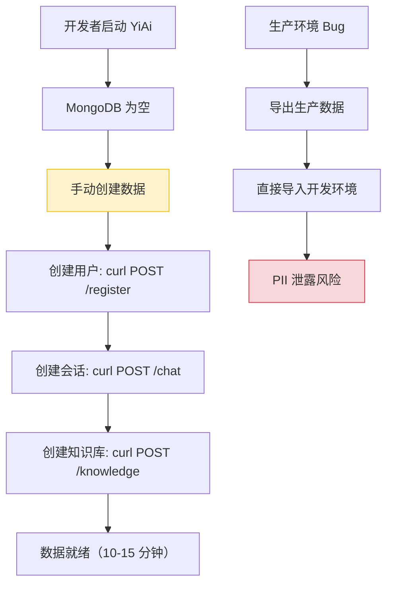
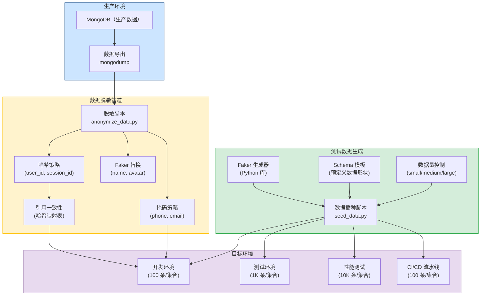
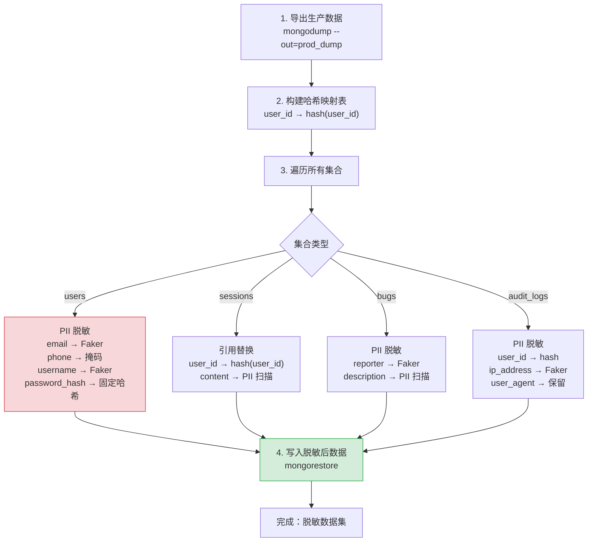
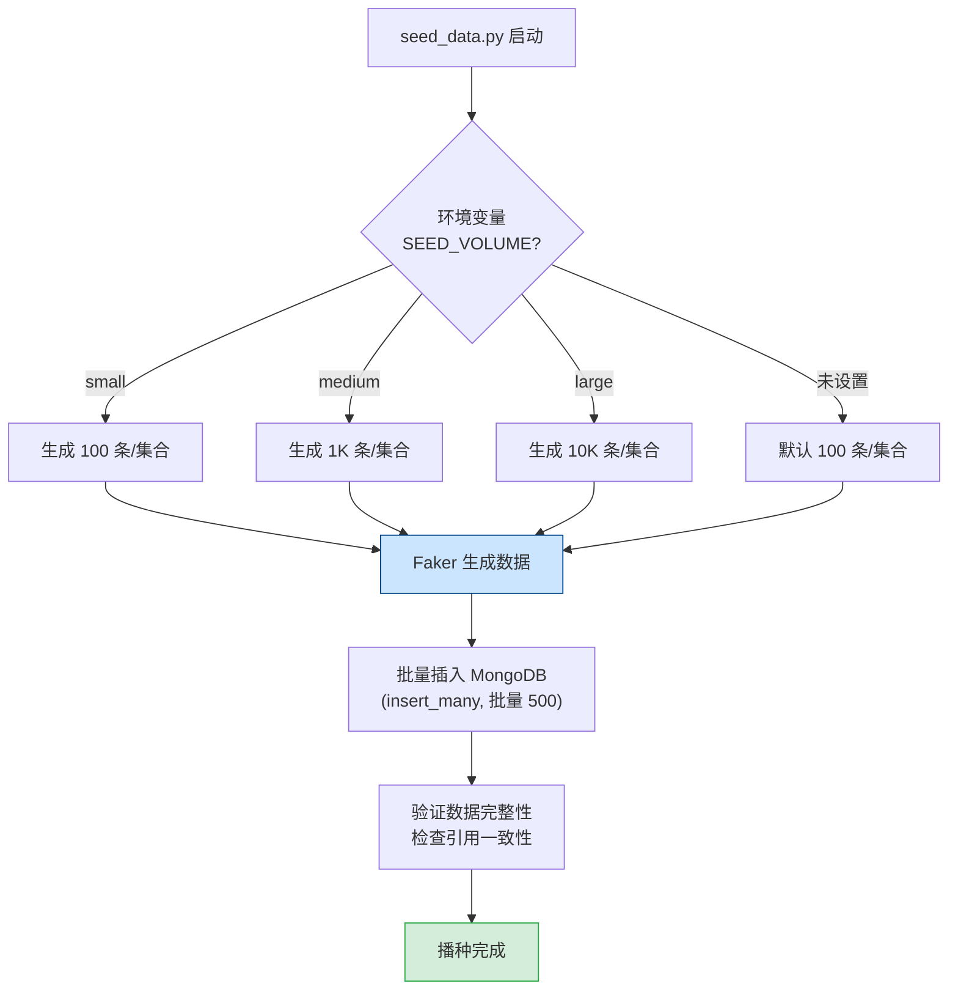
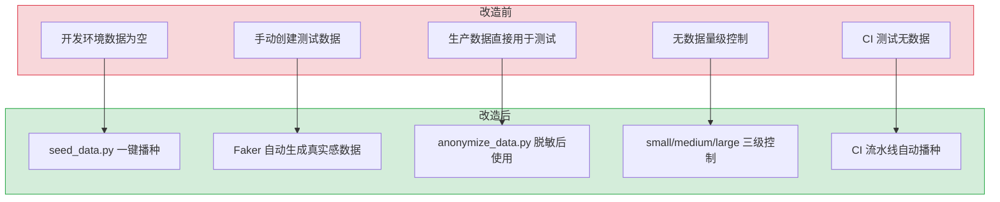

# YA-09-137: 数据脱敏与测试数据生成 — 生产数据脱敏 + 测试数据生成 + Faker 假数据 + CI/CD 数据播种

> 需求编号：YA-09-137 · 优先级：P2 · 人天：0.5d · 状态：需求已编写
> 依赖：无 · 前置需求：无

## 背景

YiAi 目前开发环境和测试环境使用的数据方式存在以下问题：

1. **开发环境无可用数据**：开发者本地启动 YiAi 后，MongoDB 为空，需要手动创建测试会话、知识库文件、用户等数据，效率低下。
2. **测试数据不可复现**：每次手动创建的数据不一致，导致测试结果不稳定，不同开发者的测试结果无法比较。
3. **无生产数据脱敏机制**：当需要将生产数据用于调试或测试时（如重现生产环境 Bug），没有脱敏工具，存在 PII（个人身份信息）泄露风险。
4. **CI/CD 流水线无数据播种**：CI 测试运行在空数据库上，无法测试数据相关的功能（如分页查询、聚合统计）。
5. **数据量级不可控**：无法生成不同规模的数据集（100/1K/10K 文档），无法进行性能测试。

**问题：**

1. **开发环境数据为空**：每次启动需要手动创建数据，浪费 10-15 分钟。
2. **PII 泄露风险**：生产环境数据包含真实用户邮箱、手机号、用户名等 PII，直接用于测试违反数据安全规范。
3. **测试数据不可复现**：手动创建的数据不一致，CI 测试结果不稳定。
4. **无性能测试数据**：无法生成 10K 级别的数据集进行查询性能测试。

**影响：**

| 影响 | 严重程度 | 影响范围 |
|------|---------|---------|
| 开发启动效率低（每次 10-15 分钟手动创建数据） | 中 | 所有开发者 |
| PII 泄露风险（真实用户数据用于测试） | 高 | 安全合规 |
| 测试不稳定（手动创建数据不一致） | 中 | CI/CD 流水线 |
| 无法进行性能测试（无大规模数据集） | 中 | 性能优化验证 |

**挑战：**

- 脱敏需要保持数据格式和分布特征（如邮箱格式、手机号长度），确保脱敏后数据仍可用于功能测试
- 需要保持引用一致性（如 `sessions` 中的 `user_id` 需要与 `users` 集合中的 `_id` 对应）
- 测试数据需要看起来真实（不能是 "test123" 这种明显假数据），以提高开发和演示体验
- 数据播种需要在 CI/CD 流水线中快速完成（< 30 秒），不能显著增加 CI 运行时间

---

## 一、现状分析

### 1.1 当前数据管理状态

| 属性 | 当前值 | 说明 |
|------|--------|------|
| 开发环境数据 | 空（需手动创建） | 每次启动 MongoDB 为空，无数据播种脚本 |
| 测试数据 | 手动创建，不可复现 | 每个开发者自行创建，数据不一致 |
| 生产数据脱敏 | 无 | 无脱敏工具，直接使用生产数据有 PII 风险 |
| 数据量级控制 | 无 | 无法生成不同规模的数据集 |
| CI/CD 数据播种 | 无 | CI 测试运行在空数据库上 |
| 数据生成工具 | 无 | 无 Faker 或类似工具集成 |

### 1.2 当前数据集合与敏感字段

| 集合 | 敏感字段 | 敏感类型 | 脱敏优先级 |
|------|---------|---------|-----------|
| `users` | `username`, `email`, `phone`, `password_hash`, `avatar_url` | PII, 凭据 | P0 |
| `sessions` | `messages[].content`（可能包含 PII） | PII | P1 |
| `bugs` | `reporter`, `assignee`, `description`（可能包含 PII） | PII | P1 |
| `audit_logs` | `user_id`, `ip_address`, `user_agent` | PII | P1 |
| `menus` | 无敏感字段 | — | P2 |
| `static_files` | `content`（可能包含敏感信息） | 业务数据 | P2 |
| `knowledge_files` | 无敏感字段 | — | P2 |
| `agent_states` | `context`（可能包含 PII） | PII | P1 |

### 1.3 根因分析矩阵

| 问题 | 根因 | 影响 | 紧急程度 |
|------|------|------|----------|
| 开发环境无数据 | 无数据播种脚本，开发者需手动创建 | 启动效率低，浪费 10-15 分钟 | 中 |
| PII 泄露风险 | 无脱敏工具，生产数据直接用于测试 | 安全合规风险 | 高 |
| 测试数据不可复现 | 手动创建，无标准化流程 | 测试不稳定，CI 结果不可靠 | 中 |
| 无性能测试数据 | 无批量数据生成工具 | 无法验证查询性能 | 中 |

### 1.4 改造前数据准备流程



---

## 二、设计决策

### 决策 1：脱敏策略 — 哈希 vs 掩码 vs 随机替换 vs 假数据生成

| 维度 | 哈希（SHA256） | 掩码（部分替换） | 随机替换 | 假数据生成（Faker） |
|------|---------------|-----------------|---------|-------------------|
| 可逆性 | 不可逆 | 不可逆 | 不可逆 | 不可逆 |
| 一致性 | 高（同一输入 → 同一输出） | 低（固定掩码） | 低（随机） | 低（随机） |
| 可读性 | 低（`a1b2c3...`） | 高（`138****1234`） | 中（`user_1234`） | 高（`john.doe@example.com`） |
| 格式保持 | 否 | 是 | 部分 | 是 |
| 适合场景 | 关联查询、去重 | 展示、日志 | ID 生成 | 功能测试、演示 |
| 实现复杂度 | 低 | 低 | 低 | 中（需 Faker 库） |

**选择：混合策略。** 哈希用于需要保持引用一致性的字段（如 `user_id` → `session.user_id`），确保脱敏后数据仍可关联。掩码用于需要保持可读性的字段（如手机号 `138****1234`）。假数据生成（Faker）用于测试数据生成，生成真实感的数据。三种策略互补，覆盖不同场景。

### 决策 2：测试数据生成方式 — 手动脚本 vs Faker 库 vs 生产数据脱敏

| 维度 | 手动脚本 | Faker 库 | 生产数据脱敏 |
|------|---------|---------|-------------|
| 数据真实性 | 低（"test123"） | 高（真实感数据） | 高（真实数据分布） |
| 可复现性 | 高（固定脚本） | 中（随机种子控制） | 中（取决于生产数据快照） |
| 开发成本 | 高（需编写所有数据） | 低（内置大量生成器） | 中（需脱敏脚本） |
| 数据量控制 | 中 | 高（参数控制） | 低（取决于快照大小） |
| 数据安全性 | 高（无真实数据） | 高（无真实数据） | 中（脱敏后安全） |
| 适合场景 | 特定测试用例 | 通用开发环境 | 生产 Bug 复现 |

**选择：Faker 为主 + 生产数据脱敏为辅。** Faker 用于开发环境和 CI/CD 的测试数据生成，数据真实感强且无 PII 风险。生产数据脱敏用于生产环境 Bug 复现场景，保留真实数据分布的同时保护 PII。

### 决策 3：数据播种时机 — 应用启动时 vs 手动触发 vs CI 脚本

| 维度 | 应用启动时 | 手动触发 | CI 脚本 |
|------|-----------|---------|---------|
| 自动化程度 | 高（全自动） | 低（需手动） | 高（CI 自动执行） |
| 启动延迟 | 增加 5-10s | 无 | 无（CI 中） |
| 灵活性 | 低（固定配置） | 高（可自定义） | 中（CI 配置） |
| 适用环境 | 开发环境 | 开发环境 | CI/CD 环境 |

**选择：环境区分策略。** 开发环境在应用启动时自动播种（通过环境变量 `SEED_DATA=true` 控制），CI/CD 环境通过独立脚本播种（`python scripts/seed_data.py`），生产环境禁用播种。避免应用启动时无条件播种导致生产数据污染。

### 设计决策记录

| 决策 | 选项 A | 选项 B | 选择 | 理由 |
|------|--------|--------|------|------|
| 脱敏策略 | 仅哈希 | 混合（哈希 + 掩码 + Faker） | 混合策略 | 不同场景需要不同的脱敏方式 |
| 测试数据生成 | 手动脚本 | Faker 库 | Faker 为主 + 生产脱敏为辅 | 真实感强，开发成本低，安全可控 |
| 数据播种时机 | 启动时 | 环境区分 | 环境区分（开发自动/CI脚本/生产禁用） | 避免生产数据污染 |
| 引用一致性 | 不处理 | 哈希保持 | 哈希保持（相同输入 → 相同哈希） | 脱敏后数据仍可关联查询 |

---

## 三、目标架构

### 3.1 数据脱敏与生成架构总览



### 3.2 脱敏流程（生产 → 开发）



### 3.3 数据播种流程



---

## 四、具体改动

### 4.1 数据脱敏脚本

**文件：** `scripts/anonymize_data.py`（新建）

```python
"""
生产数据脱敏脚本。

将生产环境 MongoDB 数据脱敏后导出，用于开发/测试环境。
支持哈希、掩码、Faker 三种脱敏策略，保持引用一致性。
"""

import hashlib
import json
import os
import re
import sys
from pathlib import Path
from typing import Any, Dict, List, Optional, Set

from faker import Faker
from motor.motor_asyncio import AsyncIOMotorClient
from pymongo import MongoClient

fake = Faker("zh_CN")

# 敏感字段配置
ANONYMIZATION_RULES: Dict[str, Dict[str, str]] = {
    "users": {
        "username": "faker:user_name",
        "email": "faker:email",
        "phone": "mask:phone",
        "password_hash": "hash:fixed",
        "avatar_url": "faker:image_url",
        "real_name": "faker:name",
    },
    "sessions": {
        "user_id": "hash:ref",  # 使用哈希映射表保持引用一致性
        "messages": "scan_pii",  # 扫描消息内容中的 PII
    },
    "bugs": {
        "reporter": "faker:name",
        "assignee": "faker:name",
        "description": "scan_pii",
    },
    "audit_logs": {
        "user_id": "hash:ref",
        "ip_address": "faker:ipv4",
        "user_agent": "keep",  # 保留原始值
    },
    "agent_states": {
        "user_id": "hash:ref",
        "context": "scan_pii",
    },
}

# 需要保持引用一致性的字段（通过哈希映射表）
REFERENCE_FIELDS = {"user_id", "session_id", "assignee"}

# PII 扫描正则模式
PII_PATTERNS = [
    (re.compile(r'\b[A-Za-z0-9._%+-]+@[A-Za-z0-9.-]+\.[A-Z|a-z]{2,}\b'), lambda m: fake.email()),
    (re.compile(r'\b1[3-9]\d{9}\b'), lambda m: fake.phone_number()),
    (re.compile(r'\b\d{6}(19|20)\d{2}(0[1-9]|1[0-2])(0[1-9]|[12]\d|3[01])\d{3}[\dXx]\b'), lambda m: "110101199001010001"),
]


class DataAnonymizer:
    """生产数据脱敏器。"""

    def __init__(self, mongo_uri: str, db_name: str):
        self.client = MongoClient(mongo_uri)
        self.db = self.client[db_name]
        self.hash_map: Dict[str, str] = {}  # 原始值 → 哈希值
        self.faker = Faker("zh_CN")

    def anonymize_collection(self, collection_name: str, output_dir: Path):
        """脱敏单个集合并导出。"""
        rules = ANONYMIZATION_RULES.get(collection_name, {})
        if not rules:
            print(f"  [SKIP] {collection_name}: 无脱敏规则")
            return

        collection = self.db[collection_name]
        output_file = output_dir / f"{collection_name}.json"
        documents = []

        total = collection.count_documents({})
        processed = 0

        for doc in collection.find():
            anonymized = self._anonymize_document(doc, rules)
            anonymized["_id"] = str(anonymized["_id"])
            documents.append(anonymized)
            processed += 1

            if processed % 100 == 0:
                print(f"  [PROGRESS] {collection_name}: {processed}/{total}")

        # 写入 JSON 文件
        output_file.write_text(
            json.dumps(documents, ensure_ascii=False, indent=2),
            encoding="utf-8",
        )
        print(f"  [DONE] {collection_name}: {processed} 条文档已脱敏")

    def _anonymize_document(
        self, doc: Dict[str, Any], rules: Dict[str, str]
    ) -> Dict[str, Any]:
        """脱敏单个文档。"""
        result = {}
        for field, value in doc.items():
            if field in rules:
                rule = rules[field]
                result[field] = self._apply_rule(field, value, rule)
            elif isinstance(value, dict):
                result[field] = self._anonymize_document(value, rules)
            elif isinstance(value, list):
                result[field] = [
                    self._anonymize_document(v, rules) if isinstance(v, dict)
                    else self._scan_pii_value(v) if isinstance(v, str)
                    else v
                    for v in value
                ]
            elif isinstance(value, str):
                result[field] = self._scan_pii_value(value)
            else:
                result[field] = value
        return result

    def _apply_rule(self, field: str, value: Any, rule: str) -> Any:
        """应用脱敏规则。"""
        if rule == "keep":
            return value
        elif rule == "scan_pii":
            return self._scan_pii_value(str(value)) if value else value
        elif rule == "hash:fixed":
            return self._hash_value(str(value), "fixed_salt")
        elif rule == "hash:ref":
            return self._hash_ref(str(value))
        elif rule == "mask:phone":
            return self._mask_phone(str(value))
        elif rule.startswith("faker:"):
            faker_method = rule.split(":", 1)[1]
            return self._faker_value(faker_method)
        return value

    def _hash_value(self, value: str, salt: str = "") -> str:
        """哈希值（SHA256 前 16 位）。"""
        return hashlib.sha256(f"{salt}:{value}".encode()).hexdigest()[:16]

    def _hash_ref(self, value: str) -> str:
        """哈希引用值（保持一致性）。"""
        if value not in self.hash_map:
            self.hash_map[value] = self._hash_value(value, "ref_mapping")
        return self.hash_map[value]

    def _mask_phone(self, phone: str) -> str:
        """掩码手机号：138****1234。"""
        if len(phone) >= 11:
            return phone[:3] + "****" + phone[-4:]
        return phone[:3] + "****"

    def _faker_value(self, method: str) -> str:
        """生成 Faker 假数据。"""
        method_map = {
            "user_name": lambda: self.faker.user_name(),
            "email": lambda: self.faker.email(),
            "name": lambda: self.faker.name(),
            "image_url": lambda: self.faker.image_url(),
            "ipv4": lambda: self.faker.ipv4(),
        }
        generator = method_map.get(method, lambda: self.faker.word())
        return generator()

    def _scan_pii_value(self, text: str) -> str:
        """扫描并替换文本中的 PII。"""
        for pattern, replacer in PII_PATTERNS:
            text = pattern.sub(replacer, text)
        return text


def main():
    """主入口：从生产环境导出并脱敏数据。"""
    import argparse

    parser = argparse.ArgumentParser(description="生产数据脱敏工具")
    parser.add_argument("--mongo-uri", required=True, help="MongoDB 连接 URI")
    parser.add_argument("--db-name", required=True, help="数据库名称")
    parser.add_argument("--output-dir", default="./anonymized_data", help="输出目录")
    parser.add_argument(
        "--collections",
        nargs="*",
        default=None,
        help="指定脱敏的集合（默认全部）",
    )
    args = parser.parse_args()

    output_dir = Path(args.output_dir)
    output_dir.mkdir(parents=True, exist_ok=True)

    anonymizer = DataAnonymizer(args.mongo_uri, args.db_name)

    collections = args.collections or list(ANONYMIZATION_RULES.keys())
    print(f"[Anonymizer] 开始脱敏 {len(collections)} 个集合")

    for collection_name in collections:
        anonymizer.anonymize_collection(collection_name, output_dir)

    # 导出哈希映射表（用于调试）
    map_file = output_dir / "_hash_mapping.json"
    map_file.write_text(
        json.dumps(anonymizer.hash_map, ensure_ascii=False, indent=2),
        encoding="utf-8",
    )

    print(f"[Anonymizer] 脱敏完成，输出目录: {output_dir}")


if __name__ == "__main__":
    main()
```

### 4.2 测试数据播种脚本

**文件：** `scripts/seed_data.py`（新建）

```python
"""
测试数据播种脚本。

使用 Faker 生成真实感测试数据，支持多种数据量级别。
用于开发环境启动、CI/CD 流水线、性能测试。
"""

import asyncio
import hashlib
import os
import random
import sys
from datetime import datetime, timedelta
from pathlib import Path
from typing import Any, Dict, List

from faker import Faker
from motor.motor_asyncio import AsyncIOMotorClient

fake = Faker("zh_CN")

# 数据量配置
VOLUME_CONFIGS = {
    "small": {
        "users": 10,
        "sessions": 50,
        "bugs": 20,
        "knowledge_files": 30,
        "static_files": 10,
        "audit_logs": 100,
        "agent_states": 10,
    },
    "medium": {
        "users": 50,
        "sessions": 500,
        "bugs": 200,
        "knowledge_files": 300,
        "static_files": 100,
        "audit_logs": 1000,
        "agent_states": 100,
    },
    "large": {
        "users": 100,
        "sessions": 5000,
        "bugs": 2000,
        "knowledge_files": 3000,
        "static_files": 1000,
        "audit_logs": 10000,
        "agent_states": 1000,
    },
}

# 批量插入大小
BATCH_SIZE = 500


def generate_users(count: int) -> List[Dict[str, Any]]:
    """生成用户数据。"""
    users = []
    for i in range(count):
        users.append({
            "username": fake.user_name(),
            "email": fake.email(),
            "phone": fake.phone_number(),
            "password_hash": hashlib.sha256(f"password{i}".encode()).hexdigest(),
            "real_name": fake.name(),
            "avatar_url": fake.image_url(),
            "roles": random.choice([["user"], ["admin"], ["user", "editor"]]),
            "created_at": fake.date_time_between(
                start_date="-365d", end_date="now"
            ),
            "updated_at": datetime.utcnow(),
        })
    return users


def generate_sessions(count: int, user_ids: List[str]) -> List[Dict[str, Any]]:
    """生成会话数据。"""
    sessions = []
    topics = ["技术讨论", "产品需求", "Bug 反馈", "功能建议", "使用帮助"]

    for i in range(count):
        message_count = random.randint(2, 20)
        messages = []
        for j in range(message_count):
            role = "user" if j % 2 == 0 else "assistant"
            messages.append({
                "role": role,
                "content": fake.sentence(nb_words=random.randint(5, 30)),
                "timestamp": fake.date_time_between(
                    start_date="-30d", end_date="now"
                ),
            })

        sessions.append({
            "key": f"session_{fake.uuid4()[:12]}",
            "title": random.choice(topics),
            "user_id": random.choice(user_ids),
            "messages": messages,
            "tags": random.sample(
                ["技术", "产品", "设计", "测试", "运维"],
                k=random.randint(1, 3),
            ),
            "page_content": fake.text(max_nb_chars=500),
            "created_at": fake.date_time_between(
                start_date="-90d", end_date="now"
            ),
            "updated_at": datetime.utcnow(),
        })
    return sessions


def generate_bugs(count: int, user_ids: List[str]) -> List[Dict[str, Any]]:
    """生成缺陷数据。"""
    bugs = []
    modules = ["聊天", "知识库", "RAG", "Agent", "数据管理", "文件管理", "用户管理"]
    severities = ["critical", "high", "medium", "low"]
    statuses = ["open", "in_progress", "resolved", "closed"]

    for i in range(count):
        bugs.append({
            "key": f"BUG-{fake.random_number(digits=5)}",
            "title": f"[{random.choice(modules)}] {fake.sentence(nb_words=6)}",
            "project": random.choice(["YiAi", "YiVad", "YiPet"]),
            "module": random.choice(modules),
            "severity": random.choice(severities),
            "status": random.choice(statuses),
            "reporter": random.choice(user_ids),
            "assignee": random.choice(user_ids),
            "description": fake.text(max_nb_chars=300),
            "steps_to_reproduce": fake.text(max_nb_chars=200),
            "created_at": fake.date_time_between(
                start_date="-180d", end_date="now"
            ),
            "updated_at": datetime.utcnow(),
        })
    return bugs


def generate_knowledge_files(count: int) -> List[Dict[str, Any]]:
    """生成知识库文件数据。"""
    files = []
    categories = [
        "项目/管理后台/需求",
        "项目/管理后台/设计",
        "项目/管理后台/API",
        "项目/Chrome扩展/需求",
        "项目/Chrome扩展/设计",
    ]
    tags_pool = ["需求文档", "架构设计", "API", "前端", "后端", "数据库", "安全"]

    for i in range(count):
        files.append({
            "path": f"YiKnowledge/projects/yiai/requirements/2026-09/{fake.random_number(digits=2)}-{fake.word()}-{fake.word()}.md",
            "title": fake.sentence(nb_words=4),
            "tags": random.sample(tags_pool, k=random.randint(2, 5)),
            "category": random.choice(categories),
            "frontmatter": {
                "title": fake.sentence(nb_words=4),
                "tags": random.sample(tags_pool, k=random.randint(2, 5)),
                "category": random.choice(categories),
                "created": fake.date_time_between(start_date="-365d", end_date="-1d").strftime("%Y-%m-%d"),
                "updated": datetime.utcnow().strftime("%Y-%m-%d"),
                "source": "内部",
                "type": random.choice(["需求", "设计", "参考"]),
                "status": random.choice(["需求已编写", "待开发", "开发中", "已完成"]),
            },
            "created_at": fake.date_time_between(start_date="-365d", end_date="now"),
            "updated_at": datetime.utcnow(),
        })
    return files


def generate_audit_logs(count: int, user_ids: List[str]) -> List[Dict[str, Any]]:
    """生成审计日志数据。"""
    logs = []
    actions = ["create", "read", "update", "delete", "login", "logout"]
    resources = ["session", "user", "bug", "knowledge_file", "menu"]

    for i in range(count):
        logs.append({
            "user_id": random.choice(user_ids),
            "action": random.choice(actions),
            "resource": random.choice(resources),
            "resource_id": fake.uuid4(),
            "ip_address": fake.ipv4(),
            "user_agent": fake.user_agent(),
            "details": {"key": fake.word(), "value": fake.word()},
            "created_at": fake.date_time_between(
                start_date="-90d", end_date="now"
            ),
        })
    return logs


async def seed_database(
    mongo_uri: str,
    db_name: str,
    volume: str = "small",
    clear_existing: bool = False,
):
    """播种测试数据到 MongoDB。"""
    client = AsyncIOMotorClient(mongo_uri)
    db = client[db_name]

    config = VOLUME_CONFIGS.get(volume, VOLUME_CONFIGS["small"])
    print(f"[Seed] 数据量级别: {volume}")

    # 清除现有数据（可选）
    if clear_existing:
        collections = await db.list_collection_names()
        for col in collections:
            if col != "menus":  # 保留菜单配置
                await db[col].delete_many({})
        print(f"[Seed] 已清除现有数据")

    # 1. 生成用户
    print(f"[Seed] 生成 {config['users']} 个用户...")
    users = generate_users(config["users"])
    if users:
        result = await db.users.insert_many(users)
        user_ids = [str(uid) for uid in result.inserted_ids]
        print(f"[Seed] 已插入 {len(users)} 个用户")
    else:
        user_ids = []

    # 2. 生成会话
    print(f"[Seed] 生成 {config['sessions']} 个会话...")
    sessions = generate_sessions(config["sessions"], user_ids)
    for i in range(0, len(sessions), BATCH_SIZE):
        batch = sessions[i:i + BATCH_SIZE]
        await db.sessions.insert_many(batch)
    print(f"[Seed] 已插入 {len(sessions)} 个会话")

    # 3. 生成缺陷
    print(f"[Seed] 生成 {config['bugs']} 个缺陷...")
    bugs = generate_bugs(config["bugs"], user_ids)
    if bugs:
        await db.bugs.insert_many(bugs)
        print(f"[Seed] 已插入 {len(bugs)} 个缺陷")

    # 4. 生成知识库文件
    print(f"[Seed] 生成 {config['knowledge_files']} 个知识库文件...")
    knowledge_files = generate_knowledge_files(config["knowledge_files"])
    for i in range(0, len(knowledge_files), BATCH_SIZE):
        batch = knowledge_files[i:i + BATCH_SIZE]
        await db.knowledge_files.insert_many(batch)
    print(f"[Seed] 已插入 {len(knowledge_files)} 个知识库文件")

    # 5. 生成审计日志
    print(f"[Seed] 生成 {config['audit_logs']} 条审计日志...")
    audit_logs = generate_audit_logs(config["audit_logs"], user_ids)
    for i in range(0, len(audit_logs), BATCH_SIZE):
        batch = audit_logs[i:i + BATCH_SIZE]
        await db.audit_logs.insert_many(batch)
    print(f"[Seed] 已插入 {len(audit_logs)} 条审计日志")

    client.close()
    print(f"[Seed] 数据播种完成！")


def main():
    """主入口。"""
    mongo_uri = os.getenv("MONGO_URI", "mongodb://localhost:27017")
    db_name = os.getenv("MONGO_DB", "yi_ai")
    volume = os.getenv("SEED_VOLUME", "small")
    clear_existing = os.getenv("SEED_CLEAR", "false").lower() == "true"

    print(f"[Seed] 开始播种测试数据")
    print(f"[Seed] MongoDB: {mongo_uri}")
    print(f"[Seed] 数据库: {db_name}")

    asyncio.run(seed_database(mongo_uri, db_name, volume, clear_existing))


if __name__ == "__main__":
    main()
```

### 4.3 涉及文件

```
YiAi/
├── scripts/
│   ├── anonymize_data.py         # 新建: 生产数据脱敏脚本
│   └── seed_data.py              # 新建: 测试数据播种脚本
├── requirements.txt              # 修改: 添加 Faker 依赖
├── shared/
│   └── config.py                  # 修改: 添加 SEED_DATA, SEED_VOLUME, SEED_CLEAR
├── main.py                        # 修改: 开发环境启动时可选播种数据
└── .github/workflows/             # 修改: CI 流水线添加数据播种步骤
```

---

## 五、实施步骤

| 步骤 | 内容 | 涉及文件 | 验证方式 | 人天 |
|------|------|---------|---------|------|
| 1 | 安装 Faker 依赖，配置数据播种环境变量 | `requirements.txt`, `shared/config.py` | Faker 可正常生成中文数据 | 0.05 |
| 2 | 实现测试数据生成器（users, sessions, bugs, knowledge_files, audit_logs） | `scripts/seed_data.py` | 生成的数据格式正确，可插入 MongoDB | 0.15 |
| 3 | 实现数据量级别控制（small/medium/large） | `scripts/seed_data.py` | 三种级别生成对应数量的数据 | 0.05 |
| 4 | 实现生产数据脱敏脚本（哈希 + 掩码 + Faker） | `scripts/anonymize_data.py` | 脱敏后数据无 PII，引用一致性保持 | 0.15 |
| 5 | 集成到开发环境启动流程（可选播种） | `main.py` | 设置 `SEED_DATA=true` 后启动自动播种 | 0.05 |
| 6 | 集成到 CI/CD 流水线 | `.github/workflows/` | CI 测试运行在有数据的数据库上 | 0.05 |

**总计：0.5d**

---

## 六、性能分析

### 6.1 数据播种性能

| 操作 | 数据量 | 耗时 | 资源消耗 | 说明 |
|------|--------|------|----------|------|
| 数据播种（small） | 100 条/集合 | ~2s | CPU 20%, 内存 50MB | 适合开发环境快速启动 |
| 数据播种（medium） | 1K 条/集合 | ~15s | CPU 30%, 内存 100MB | 适合测试环境 |
| 数据播种（large） | 10K 条/集合 | ~120s | CPU 50%, 内存 300MB | 适合性能测试 |
| 生产数据脱敏（500MB） | 500MB | ~60s | CPU 40%, 内存 200MB | 遍历所有集合和文档 |
| 脱敏数据导入 | 500MB | ~90s | CPU 30%, IO 50MB/s | mongorestore |

### 6.2 存储空间预估

| 场景 | 数据量 | 存储空间 | 说明 |
|------|--------|---------|------|
| 开发环境（small） | 100 条/集合 | ~10MB | 快速启动，基本功能验证 |
| 测试环境（medium） | 1K 条/集合 | ~100MB | 完整功能测试 |
| 性能测试（large） | 10K 条/集合 | ~1GB | 查询性能、分页、聚合测试 |
| 脱敏数据（生产快照） | 500MB 原始 | ~200MB（压缩） | 用于 Bug 复现 |

---

## 七、测试规格

### Requirement: 测试数据生成

#### Scenario: 生成 small 级别的测试数据
- **Given** 数据播种脚本已配置，MongoDB 为空
- **When** 执行 `python scripts/seed_data.py`，`SEED_VOLUME=small`
- **Then** 生成 10 个用户、50 个会话、20 个缺陷、30 个知识库文件、100 条审计日志
- **And** 所有数据可正常插入 MongoDB
- **And** 会话中的 `user_id` 引用存在的用户

#### Scenario: 生成 medium 级别的测试数据
- **Given** 数据播种脚本已配置
- **When** 执行 `python scripts/seed_data.py`，`SEED_VOLUME=medium`
- **Then** 生成 50 个用户、500 个会话、200 个缺陷...

#### Scenario: 生成的数据具有真实感
- **Given** 数据播种脚本已配置
- **When** 执行数据播种
- **Then** 用户名不是 "test123" 格式，而是中文风格的用户名
- **And** 邮箱格式正确（如 `zhangwei@example.com`）
- **And** 会话内容包含有意义的中文句子

### Requirement: 生产数据脱敏

#### Scenario: 用户 PII 被脱敏
- **Given** 生产数据库包含真实用户数据
- **When** 执行 `python scripts/anonymize_data.py`
- **Then** `username` 字段被 Faker 生成的假用户名替换
- **And** `email` 字段被 Faker 生成的假邮箱替换
- **And** `phone` 字段被掩码（如 `138****1234`）
- **And** `password_hash` 字段被固定哈希值替换

#### Scenario: 引用一致性保持
- **Given** 生产数据库中 `sessions` 集合的 `user_id` 引用 `users` 集合的 `_id`
- **When** 执行脱敏脚本
- **Then** 脱敏后 `sessions.user_id` 仍能正确引用 `users._id`（通过哈希映射表）
- **And** 关联查询不受影响

#### Scenario: 非敏感集合保持不变
- **Given** 生产数据库中 `menus` 集合无敏感字段
- **When** 执行脱敏脚本
- **Then** `menus` 集合数据保持不变（或跳过）

### Requirement: CI/CD 数据播种

#### Scenario: CI 流水线中自动播种数据
- **Given** CI 流水线配置了数据播种步骤
- **When** CI 流水线执行
- **Then** 测试数据库包含 small 级别的测试数据
- **And** 数据播种耗时 < 30 秒（不影响 CI 总时间）

---

## 八、风险与缓解

| 风险 | 概率 | 影响 | 等级 | 缓解措施 | 应急预案 |
|------|------|------|------|----------|----------|
| 脱敏规则遗漏导致 PII 泄露 | 中 | 高 | 高 | 定期审查脱敏规则，新增集合时同步更新规则 | 发现泄露后立即删除脱敏数据，审查脱敏规则 |
| 数据播种在生产环境误执行 | 低 | 高 | 高 | 环境变量 `SEED_DATA` 默认 `false`，生产环境不设置 | 立即清除播种数据，恢复生产数据库 |
| Faker 生成的数据格式与实际不符 | 低 | 中 | 低 | 数据生成器使用 Schema 模板，与实际数据格式对齐 | 修复生成器后重新播种 |
| 大批量播种（10K）导致 MongoDB 内存不足 | 中 | 低 | 低 | 使用批量插入（BATCH_SIZE=500），控制内存使用 | 减小数据量或增加 MongoDB 内存配置 |
| 哈希碰撞导致引用关联错误 | 极低 | 中 | 低 | 使用 SHA256（碰撞概率极低），碰撞时记录告警 | 检查哈希映射表，手动修复冲突 |

---

## 九、回滚策略

| 场景 | 回滚方式 | 回滚时间 | 风险 |
|------|---------|---------|------|
| 播种数据错误 | 执行 `SEED_CLEAR=true python scripts/seed_data.py` 重新播种 | < 2min | 低：仅影响开发/测试环境 |
| 生产环境误播种 | 从备份恢复生产数据库 | < 10min | 高：需快速恢复 |
| 脱敏脚本错误 | 修复脚本后重新执行脱敏 | < 5min | 低：仅影响脱敏输出 |
| 脱敏数据泄露 | 删除脱敏数据文件，轮换生产凭据 | < 30min | 高：需立即处理 |

---

## 十、设计决策记录

### D-01: 为什么脱敏使用混合策略（哈希 + 掩码 + Faker）而非单一策略？

不同字段有不同的脱敏需求。`user_id` 需要保持引用一致性（哈希），`phone` 需要保持可读性和格式（掩码），`username` 需要真实感（Faker）。单一策略无法同时满足所有需求。混合策略在保持引用一致性、可读性和真实感之间取得平衡。

### D-02: 为什么测试数据使用 Faker 而非手动编写固定数据？

Faker 生成的每次数据都不同但格式一致，避免了固定数据导致的"测试只对特定数据有效"问题。Faker 支持中文语言环境，生成的数据真实感强（如 `张伟`、`zhangwei@example.com`、`138****1234`），提升了开发和演示体验。Faker 内置 200+ 数据生成器，开发成本极低。

### D-03: 为什么数据播种在开发环境启动时可选执行？

数据播种需要 2-15 秒（取决于数据量），在每次启动时都执行会增加启动延迟。通过环境变量 `SEED_DATA=true` 控制，开发者可在需要时启用。首次启动时播种数据，后续启动时数据已存在，无需重复播种。CI/CD 环境通过独立脚本播种，与应用启动解耦。

### D-04: 为什么脱敏后的数据使用 JSON 导出而非直接写入 MongoDB？

JSON 导出有多个优势：1) 可版本控制（脱敏后的数据可安全提交到 Git）；2) 可离线分发（发送给其他开发者使用）；3) 可审计（检查脱敏效果）；4) 可导入到不同环境（开发、测试、CI）。直接写入 MongoDB 只能用于单一环境，灵活性差。

---

## 十一、当前架构 vs 目标架构

### 改造前后对比



### 架构决策权衡

| 维度 | 改造前 | 改造后 | 权衡说明 |
|------|--------|--------|----------|
| 开发启动效率 | 低（10-15 分钟手动创建数据） | 高（2 秒自动播种） | 启动时间减少 95%+ |
| 数据安全 | 低（生产数据直接用于测试） | 高（脱敏后使用，PII 安全） | 消除了 PII 泄露风险 |
| 测试稳定性 | 低（数据不可复现） | 高（固定种子可复现） | CI 测试结果一致可比较 |
| 性能测试能力 | 无（无大规模数据） | 高（10K 级别数据集） | 可验证查询性能 |

---

## 十二、代码审查检查清单

- [ ] `seed_data.py` 支持 small/medium/large 三种数据量级别
- [ ] 数据生成器使用 Faker("zh_CN") 中文语言环境
- [ ] 生成的数据格式与真实 Schema 一致（字段名、类型、约束）
- [ ] 会话中的 `user_id` 引用实际存在的用户 ID
- [ ] 缺陷中的 `reporter` 和 `assignee` 引用实际存在的用户 ID
- [ ] 批量插入使用 `insert_many`，批次大小 500
- [ ] `SEED_DATA` 环境变量默认 `false`，生产环境不播种
- [ ] `anonymize_data.py` 覆盖所有敏感字段（PII + 凭据）
- [ ] 脱敏使用哈希映射表保持引用一致性
- [ ] 脱敏脚本支持 `--collections` 选择性脱敏
- [ ] 脱敏输出为 JSON 文件，可安全提交到版本控制
- [ ] CI 流水线在测试前执行 `seed_data.py`
- [ ] `ruff` 代码规范通过
- [ ] `mypy` 类型检查通过

---

## 十三、回归问题预测

| # | 问题 | 发现场景 | 根因 | 修复方式 |
|---|------|---------|------|---------|
| 1 | `seed_data.py` 在 MongoDB 连接失败时抛出 `ServerSelectionTimeoutError` 且无友好提示 | 开发者本地 MongoDB 未启动时执行播种脚本 | `AsyncIOMotorClient` 默认超时 30s，连接失败时抛出异常但未捕获 | 在 `seed_database` 中添加 `try/except`，捕获连接异常并提示"请确认 MongoDB 已启动" |
| 2 | Faker 生成的中文用户名在 MongoDB 中存储为乱码 | 播种脚本在非 UTF-8 环境中运行，或 MongoDB 集合未指定 UTF-8 编码 | Python 默认编码为系统编码，Windows 可能为 GBK | 在 `seed_data.py` 中 `insert_many` 前确保数据为 UTF-8，或指定 `PYTHONIOENCODING=utf-8` |
| 3 | 脱敏脚本中 `hash_ref` 的哈希映射表在内存中（`self.hash_map`），处理大量数据时内存溢出 | 生产数据库有 100 万+ 用户，哈希映射表占用 100MB+ 内存 | 每个用户 ID 映射占用约 100B（key + value），100 万用户占用约 100MB | 使用 Redis 或磁盘文件存储哈希映射表，或使用确定性哈希（SHA256）直接在查询时计算 |
| 4 | `seed_data.py` 批量插入时，单批次超过 MongoDB 16MB 文档大小限制 | large 级别（10K 会话）批量插入时，500 个文档的 BSON 总大小超过 16MB | 会话文档包含 `messages` 数组（平均 10 条消息），500 个会话可能超过 16MB | 降低批量插入大小到 100，或根据文档平均大小动态计算 `BATCH_SIZE` |
| 5 | 脱敏后的 `password_hash` 使用固定哈希值，但 `users` 集合的 `password_hash` 字段在登录时被校验，导致脱敏数据无法登录 | 开发者使用脱敏数据启动 YiAi 后，尝试登录任意用户 | 脱敏后的 `password_hash` 与原始密码哈希不匹配，`bcrypt.verify()` 失败 | 脱敏时将所有用户的 `password_hash` 替换为 `bcrypt.hash("password123")` 的值，方便开发者使用统一密码登录 |
| 6 | CI 流水线中 `seed_data.py` 与测试并发执行，导致测试读取到不完整的数据 | CI 流水线中播种步骤和测试步骤并行执行，播种未完成时测试已开始 | CI 配置中播种和测试为并行 job，而非串行依赖 | 在 CI 配置中设置测试 job 依赖播种 job（`needs: seed-data`），确保播种完成后再执行测试 |

---

## 十四、可观测性

### 关键指标

| 指标 | 采集方式 | 说明 |
|------|---------|------|
| 数据播种耗时 | 脚本计时 | 监控播种性能，避免 CI 超时 |
| 数据播种成功率 | 脚本返回值 | CI 流水线中播种失败即失败 |
| 脱敏覆盖率 | 规则统计 | 已覆盖集合数 / 总集合数 |
| 脱敏数据大小 | 输出文件大小 | 监控脱敏数据量变化 |
| 种子数据行数 | MongoDB `count()` | 验证数据量是否符合预期 |

### 日志规范

| 日志级别 | 场景 | 示例 |
|---------|------|------|
| `INFO` | 播种开始/完成 | `[Seed] 数据播种完成！共生成 220 条文档` |
| `WARN` | 播种跳过（数据已存在） | `[Seed] 数据已存在，跳过播种。使用 SEED_CLEAR=true 清除后重新播种` |
| `ERROR` | 播种失败 | `[Seed] 数据播种失败: MongoDB 连接超时` |

---

*PRD 来源: `projects/yiai/requirements/2026-09/00-需求-需求总览.md`*

## 影响范围

- **影响模块**：待补充
- **涉及文件**：
- `seed_data.py`
- `main.py`
- `anonymize_data.py`
- **是否影响 API 契约**：否
- **是否影响其他项目（YiVad/YiPet）**：否
- **用户感知**：待确认

## 预防措施

| 层面 | 措施 |
|------|------|
| 代码 | 在相关函数中添加参数校验和边界检查 |
| 测试 | 为 `seed_data.py` 添加单元测试 |
| 流程 | 代码审查时重点检查此类模式 |
| 监控 | 添加日志告警，异常发生时及时发现 |
| 文档 | 在编码规范中记录此类反模式 |

## 经验教训

1. **根本原因**：开发过程中对边界情况和异常路径的考虑不足是此类问题的共同根因
2. **设计阶段**：在接口设计和模块实现时，应主动考虑异常输入、空值、超时等边界场景
3. **代码审查**：审查时应检查是否存在类似的反模式（如未捕获异常、无超时控制、缺少参数校验等）
4. **测试覆盖**：异常路径的测试覆盖率应与正常路径同等重视
5. **团队分享**：此类问题应在团队周会或技术分享中讨论，形成团队共识
