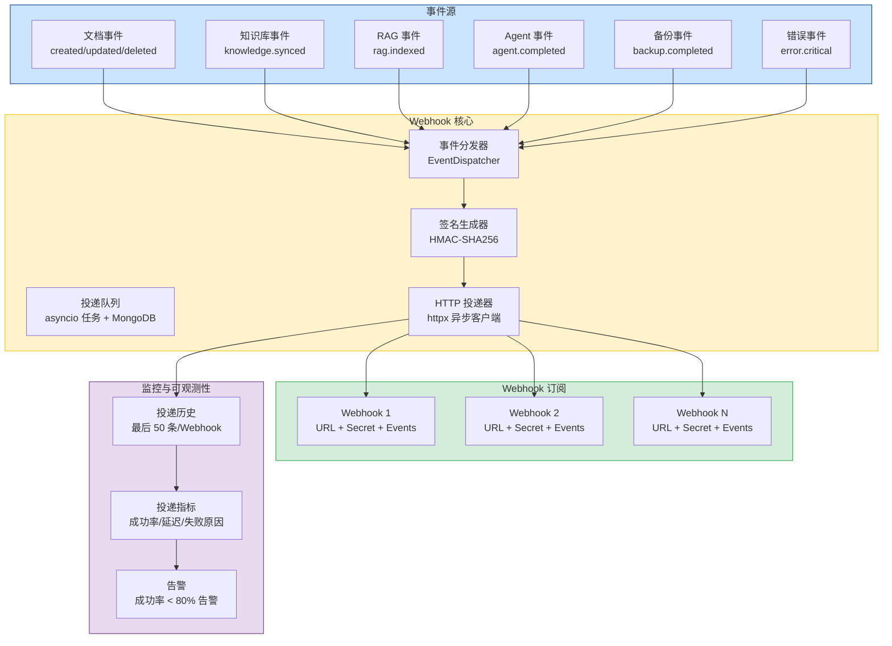
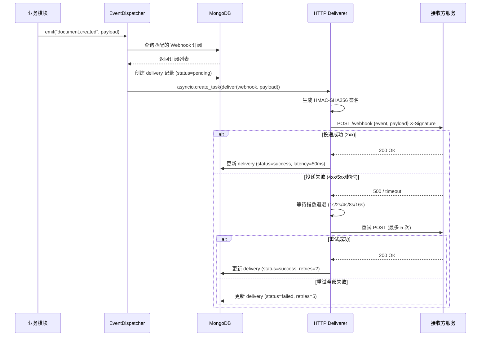
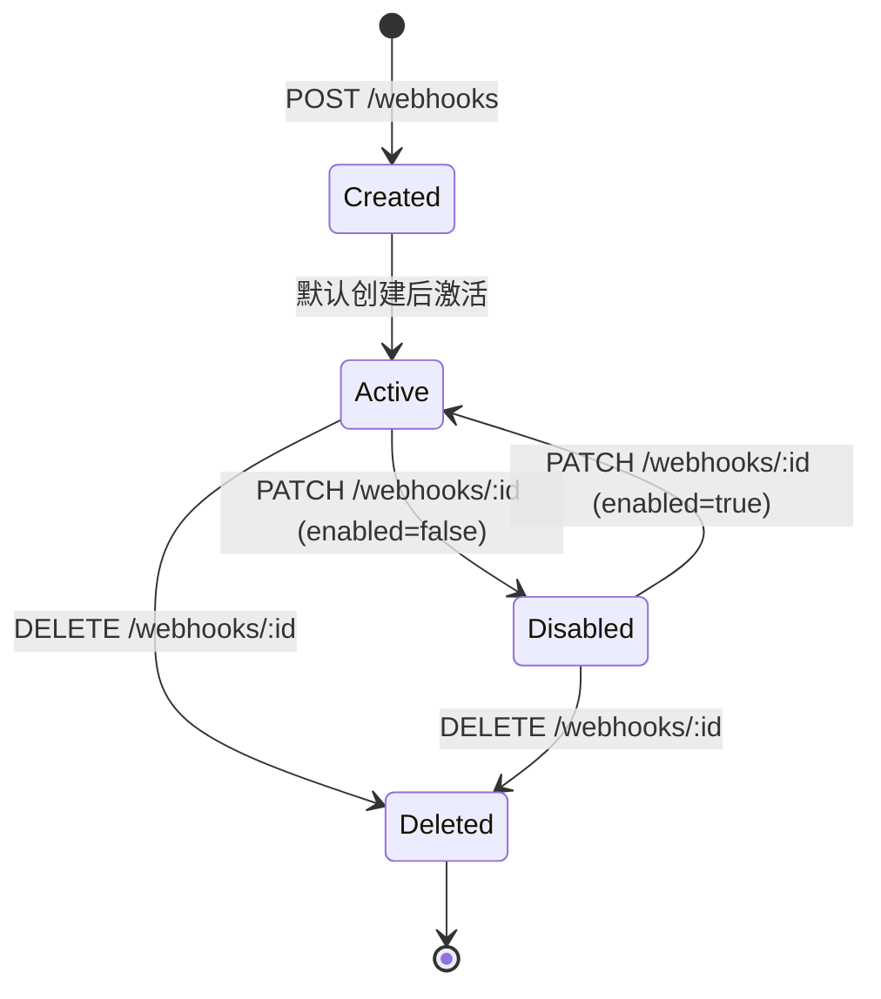
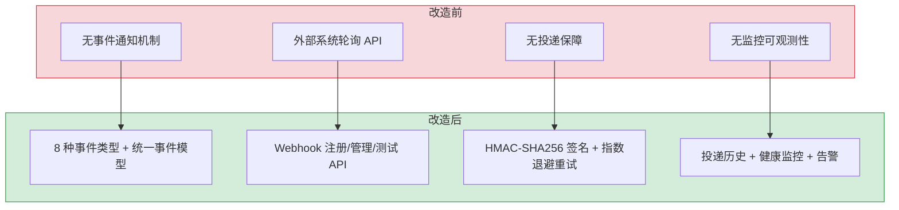

# YA-09-138: Webhook 集成系统 — 事件注册管理 + 签名验证 + 重试投递 + 健康监控

> 需求编号：YA-09-138 · 优先级：P2 · 人天：1.0d · 状态：需求已编写
> 依赖：无 · 前置需求：无

## 背景

YiAi 目前缺乏对外事件通知机制。当系统内发生关键事件（文档创建、知识库同步完成、RAG 索引更新、Agent 任务完成、备份完成、严重错误）时，外部系统无法感知。这在微服务架构和第三方集成场景中是一个严重的能力缺失。例如，前端需要在文档更新后刷新缓存，运维系统需要在备份完成后触发归档流程，监控系统需要在严重错误发生时立即收到通知。

**问题：**

1. **无事件通知能力**：系统内的事件（文档变更、备份完成、错误发生）无法通知外部系统，外部系统只能通过轮询方式获取状态变更。
2. **无统一的事件模型**：当前不同模块的事件格式各异，没有统一的事件类型定义和数据结构。
3. **无安全的投递机制**：即使实现了事件通知，也缺乏签名验证、重试机制、速率限制等生产级特性。
4. **无可观测性**：无法追踪 Webhook 投递状态、成功率、延迟等关键指标。

**影响：**

| 场景 | 影响 | 严重程度 |
|------|------|----------|
| 文档更新后前端缓存未刷新 | 用户看到过期数据，体验下降 | 中 |
| 备份完成后无人知晓 | 运维人员无法及时归档，备份可能过期 | 高 |
| 严重错误发生时无人通知 | 故障持续，影响扩大 | 高 |
| Agent 任务完成后无回调 | 外部编排系统无法继续后续流程 | 中 |
| 知识库同步后下游未更新 | RAG 检索结果与实际知识库不一致 | 中 |

**挑战：**

- 需要设计可靠的重试策略，确保投递成功率（目标 > 99%）
- 需要 HMAC-SHA256 签名验证，防止伪造请求
- 需要对投递目标进行速率限制，防止打爆下游服务
- 需要支持 Webhook 的完整生命周期管理（创建、更新、删除、启用/禁用）
- 需要投递历史记录和健康监控，方便排查投递失败原因

---

## 一、现状分析

### 1.1 当前事件处理状态

| 属性 | 当前值 | 说明 |
|------|--------|------|
| 事件通知机制 | 无 | 系统内事件仅在日志中记录，无外部通知 |
| 事件类型定义 | 无 | 各模块自行处理，无统一事件模型 |
| 外部集成方式 | 无 | 外部系统只能通过轮询 API 获取状态 |
| 投递保证 | 无 | 不存在投递机制 |
| 签名验证 | 无 | 不存在 |
| 投递监控 | 无 | 无法追踪任何投递状态 |

### 1.2 根因分析矩阵

| 问题 | 根因 | 影响 | 紧急程度 |
|------|------|------|----------|
| 无事件通知 | 项目初期未考虑外部集成需求，架构中无事件总线 | 外部系统无法实时感知状态变化 | 中 |
| 事件格式不统一 | 各模块独立开发，缺乏统一的事件规范 | 即使实现通知，外部系统也难以消费 | 中 |
| 无投递保障 | 未实现重试、签名等生产级特性 | 投递不可靠，无法用于生产环境 | 中 |
| 无投递监控 | 缺乏可观测性设计 | 投递失败无法及时发现和排查 | 中 |

### 1.3 事件类型定义

| 事件类型 | 触发场景 | 优先级 | 投递要求 | 说明 |
|---------|---------|--------|----------|------|
| `document.created` | 文档创建 | 中 | 至少一次 | 通知下游系统新文档已创建 |
| `document.updated` | 文档更新 | 中 | 至少一次 | 通知下游系统文档已更新 |
| `document.deleted` | 文档删除 | 中 | 至少一次 | 通知下游系统文档已删除 |
| `knowledge.synced` | 知识库同步完成 | 中 | 至少一次 | 通知 RAG 系统重新索引 |
| `rag.indexed` | RAG 索引完成 | 低 | 至少一次 | 通知下游系统索引已更新 |
| `agent.completed` | Agent 任务完成 | 高 | 至少一次 | 通知编排系统继续后续流程 |
| `backup.completed` | 备份完成 | 高 | 至少一次 | 通知运维系统触发归档流程 |
| `error.critical` | 严重错误发生 | 高 | 即时 + 重试 | 通知监控系统触发告警 |

### 1.4 改造前数据流

```
系统内部事件
  └── 日志记录 (仅本地)
  └── 无外部通知
  └── 外部系统只能轮询

外部系统:
  轮询 API → 获取状态 → 延迟高 → 资源浪费
```

---

## 二、设计决策

### 决策 1：Webhook 投递架构 — 同步 vs 异步队列 vs 内联异步

| 维度 | 同步投递 | 异步队列 (Redis/DB) | 内联异步 (asyncio) |
|------|----------|---------------------|---------------------|
| 实现复杂度 | 低（直接 HTTP 请求） | 高（需要队列基础设施） | 中（使用 asyncio.create_task） |
| 投递延迟 | 低（毫秒级） | 中（秒级，取决于队列消费） | 低（毫秒级） |
| 可靠性 | 低（失败即丢失） | 高（持久化，支持重试） | 中（进程重启丢失） |
| 资源消耗 | 低 | 中（队列 + Worker） | 低 |
| 扩展性 | 低（耦合在请求线程） | 高（独立 Worker 扩展） | 中（受事件循环限制） |
| 适合当前规模 | 否 | 否（过度设计） | 是（当前 Webhook 量 < 100/分钟） |

**选择：内联异步 + MongoDB 持久化队列。** 当前 YiAi 没有 Redis 基础设施，引入 Redis 队列会增加部署复杂度。使用 asyncio.create_task 异步投递 + MongoDB 持久化投递记录，既满足当前规模需求，又为未来升级到 Redis 队列预留接口。投递记录持久化到 MongoDB `webhook_deliveries` 集合，进程重启后可恢复未完成投递。

### 决策 2：签名算法 — HMAC-SHA256 vs 非对称签名 vs 无签名

| 维度 | HMAC-SHA256 | 非对称签名 (RSA/ECDSA) | 无签名 |
|------|-------------|------------------------|--------|
| 安全性 | 高（共享密钥） | 更高（公私钥分离） | 无 |
| 实现复杂度 | 低 | 高（需要密钥管理） | 最低 |
| 性能 | 快（微秒级） | 慢（毫秒级） | 最快 |
| 密钥管理 | 简单（一个 secret） | 复杂（证书管理） | 无 |
| 行业标准 | 是（GitHub, Stripe 均采用） | 较少用于 Webhook | 否 |
| 适合当前场景 | 是 | 否（过度设计） | 否（不安全） |

**选择：HMAC-SHA256。** 这是 Webhook 签名的行业标准做法（GitHub、Stripe、Slack 均采用），每个 Webhook 注册时生成独立的 secret，签名包含在 `X-Webhook-Signature` 头部中。接收方使用相同的 secret 计算签名并比对，防止中间人篡改和伪造请求。

### 决策 3：重试策略 — 固定间隔 vs 指数退避 vs 阶梯退避

| 维度 | 固定间隔 (30s) | 指数退避 (1s, 2s, 4s, 8s, 16s) | 阶梯退避 (1m, 5m, 15m, 30m, 60m) |
|------|---------------|-------------------------------|----------------------------------|
| 实现复杂度 | 低 | 中 | 中 |
| 恢复速度 | 中（30s 固定） | 快（快速重试） | 慢（间隔较长） |
| 下游压力 | 中（固定频率） | 低（越来越稀疏） | 低（间隔较长） |
| 适合临时故障 | 是 | 是 | 是（但恢复慢） |
| 适合长时间故障 | 否（持续重试） | 是（最终间隔很大） | 是 |
| 适合当前场景 | 否 | 是 | 否（恢复太慢） |

**选择：指数退避 (1s, 2s, 4s, 8s, 16s)，最多 5 次重试。** 指数退避在快速恢复和避免下游过载之间取得平衡。前 2 次重试覆盖瞬时网络抖动，后 3 次覆盖短期下游故障。总计 5 次重试 + 1 次初始投递 = 6 次尝试，总耗时约 31 秒，覆盖绝大多数临时故障场景。

### 决策 4：Webhook 管理 — API 管理 vs 配置文件 vs 数据库

| 维度 | API 管理 (CRUD) | 配置文件 (YAML/JSON) | 数据库 (MongoDB) |
|------|----------------|---------------------|-------------------|
| 动态性 | 高（运行时增删改） | 低（需重启） | 高（运行时增删改） |
| 实现复杂度 | 中 | 低 | 中 |
| 用户友好性 | 高（有 UI/API） | 低（需编辑文件） | 高（有 UI/API） |
| 持久化 | 依赖数据库 | 依赖文件系统 | 是 |
| 适合当前场景 | 是 | 否（不灵活） | 是 |

**选择：API 管理 + MongoDB 持久化。** Webhook 配置存储在 MongoDB `webhooks` 集合中，提供完整的 CRUD API。配置文件仅用于初始默认配置，运行时通过 API 管理。配置变更即时生效，无需重启服务。

### 设计决策记录

| 决策 | 选项 A | 选项 B | 选择 | 理由 |
|------|--------|--------|------|------|
| 投递架构 | 同步投递 | 异步队列 | 内联异步 + MongoDB 持久化 | 当前规模无需 Redis 队列，持久化保证可靠性 |
| 签名算法 | 无签名 | HMAC-SHA256 | HMAC-SHA256 | 行业标准，安全且实现简单 |
| 重试策略 | 固定间隔 | 指数退避 | 指数退避 (1s/2s/4s/8s/16s) | 快速恢复 + 避免下游过载 |
| 管理方式 | 配置文件 | API 管理 | API 管理 + MongoDB | 动态灵活，无需重启 |

---

## 三、目标架构

### 3.1 Webhook 系统架构总览



### 3.2 Webhook 投递时序



### 3.3 Webhook 管理生命周期



---

## 四、具体改动

### 4.1 Webhook 数据模型

**文件：** `services/webhook/models.py`（新建）

```python
from datetime import datetime
from enum import Enum
from typing import Optional
from pydantic import BaseModel, Field, HttpUrl


class EventType(str, Enum):
    """Webhook 事件类型枚举。"""
    DOCUMENT_CREATED = "document.created"
    DOCUMENT_UPDATED = "document.updated"
    DOCUMENT_DELETED = "document.deleted"
    KNOWLEDGE_SYNCED = "knowledge.synced"
    RAG_INDEXED = "rag.indexed"
    AGENT_COMPLETED = "agent.completed"
    BACKUP_COMPLETED = "backup.completed"
    ERROR_CRITICAL = "error.critical"


class WebhookCreate(BaseModel):
    """创建 Webhook 请求体。"""
    url: HttpUrl = Field(..., description="接收事件的 URL")
    events: list[EventType] = Field(..., min_length=1, description="订阅的事件类型")
    description: str = Field(default="", max_length=200, description="Webhook 描述")
    secret: Optional[str] = Field(default=None, max_length=64, description="HMAC 签名密钥，不提供则自动生成")
    enabled: bool = Field(default=True, description="是否启用")


class WebhookUpdate(BaseModel):
    """更新 Webhook 请求体。"""
    url: Optional[HttpUrl] = None
    events: Optional[list[EventType]] = None
    description: Optional[str] = None
    secret: Optional[str] = None
    enabled: Optional[bool] = None


class WebhookInDB(BaseModel):
    """Webhook 数据库文档。"""
    id: str = Field(alias="_id")
    url: str
    events: list[str]
    description: str
    secret_hash: str  # secret 的 bcrypt 哈希
    enabled: bool
    created_at: datetime
    updated_at: datetime
    last_delivery_at: Optional[datetime] = None
    delivery_count: int = 0
    success_count: int = 0
    failure_count: int = 0


class DeliveryStatus(str, Enum):
    PENDING = "pending"
    SUCCESS = "success"
    FAILED = "failed"


class WebhookDelivery(BaseModel):
    """Webhook 投递记录。"""
    webhook_id: str
    event_type: str
    payload: dict
    status: DeliveryStatus
    attempts: int = 0
    first_attempt_at: datetime
    last_attempt_at: datetime
    response_code: Optional[int] = None
    response_body: Optional[str] = None
    error_message: Optional[str] = None
    latency_ms: Optional[float] = None
```

### 4.2 Webhook 核心服务

**文件：** `services/webhook/webhook_service.py`（新建）

```python
import asyncio
import hashlib
import hmac
import json
import secrets
from datetime import datetime, timezone
from typing import Optional

import httpx
from bson import ObjectId
from motor.motor_asyncio import AsyncIOMotorDatabase

from shared.logging import get_logger
from shared.config import settings
from services.webhook.models import (
    EventType, WebhookCreate, WebhookUpdate, WebhookInDB,
    WebhookDelivery, DeliveryStatus,
)

logger = get_logger(__name__)

# 指数退避间隔（秒）
RETRY_BACKOFF = [1, 2, 4, 8, 16]
MAX_RETRIES = len(RETRY_BACKOFF)
MAX_DELIVERY_HISTORY = 50  # 每个 Webhook 保留最近 50 条投递记录


class WebhookService:
    """Webhook 注册、投递、监控服务。"""

    def __init__(self, db: AsyncIOMotorDatabase):
        self.db = db
        self.webhooks_col = db.webhooks
        self.deliveries_col = db.webhook_deliveries
        self._client: Optional[httpx.AsyncClient] = None
        self._rate_limiters: dict[str, RateLimiter] = {}

    async def _get_client(self) -> httpx.AsyncClient:
        if self._client is None:
            self._client = httpx.AsyncClient(
                timeout=httpx.Timeout(10.0, connect=5.0),
                headers={"User-Agent": "YiAi-Webhook/1.0"},
            )
        return self._client

    # ─── Webhook CRUD ───────────────────────────────────

    async def create_webhook(self, data: WebhookCreate) -> dict:
        """创建 Webhook 订阅。"""
        secret = data.secret or secrets.token_hex(32)
        secret_hash = self._hash_secret(secret)

        doc = {
            "url": str(data.url),
            "events": [e.value for e in data.events],
            "description": data.description,
            "secret_hash": secret_hash,
            "enabled": data.enabled,
            "created_at": datetime.now(timezone.utc),
            "updated_at": datetime.now(timezone.utc),
            "last_delivery_at": None,
            "delivery_count": 0,
            "success_count": 0,
            "failure_count": 0,
        }
        result = await self.webhooks_col.insert_one(doc)
        doc["_id"] = str(result.inserted_id)
        doc["secret"] = secret  # 仅在创建时返回明文 secret
        return doc

    async def update_webhook(self, webhook_id: str, data: WebhookUpdate) -> Optional[dict]:
        """更新 Webhook 订阅。"""
        update = {"updated_at": datetime.now(timezone.utc)}
        if data.url is not None:
            update["url"] = str(data.url)
        if data.events is not None:
            update["events"] = [e.value for e in data.events]
        if data.description is not None:
            update["description"] = data.description
        if data.secret is not None:
            update["secret_hash"] = self._hash_secret(data.secret)
        if data.enabled is not None:
            update["enabled"] = data.enabled

        result = await self.webhooks_col.find_one_and_update(
            {"_id": ObjectId(webhook_id)},
            {"$set": update},
            return_document=True,
        )
        if result:
            result["_id"] = str(result["_id"])
        return result

    async def delete_webhook(self, webhook_id: str) -> bool:
        """删除 Webhook 订阅及关联投递记录。"""
        result = await self.webhooks_col.delete_one({"_id": ObjectId(webhook_id)})
        if result.deleted_count:
            await self.deliveries_col.delete_many({"webhook_id": webhook_id})
        return result.deleted_count > 0

    async def list_webhooks(self) -> list[dict]:
        """列出所有 Webhook 订阅。"""
        cursor = self.webhooks_col.find().sort("created_at", -1)
        webhooks = []
        async for doc in cursor:
            doc["_id"] = str(doc["_id"])
            doc.pop("secret_hash", None)  # 不返回 secret_hash
            webhooks.append(doc)
        return webhooks

    # ─── 事件投递 ───────────────────────────────────────

    async def emit(self, event_type: EventType, payload: dict):
        """发布事件，触发所有匹配的 Webhook 投递。"""
        cursor = self.webhooks_col.find({
            "events": event_type.value,
            "enabled": True,
        })
        async for webhook in cursor:
            asyncio.create_task(self._deliver_with_retry(webhook, event_type, payload))

    async def _deliver_with_retry(
        self, webhook: dict, event_type: EventType, payload: dict
    ):
        """带重试的 Webhook 投递。"""
        webhook_id = str(webhook["_id"])
        url = webhook["url"]

        # 速率限制
        if not await self._check_rate_limit(url):
            logger.warning(f"[Webhook] 速率限制: {url}")
            return

        # 构建投递记录
        delivery = {
            "webhook_id": webhook_id,
            "event_type": event_type.value,
            "payload": payload,
            "status": DeliveryStatus.PENDING.value,
            "attempts": 0,
            "first_attempt_at": datetime.now(timezone.utc),
            "last_attempt_at": datetime.now(timezone.utc),
            "response_code": None,
            "response_body": None,
            "error_message": None,
            "latency_ms": None,
        }

        # 签名
        body = json.dumps({
            "event": event_type.value,
            "timestamp": datetime.now(timezone.utc).isoformat(),
            "data": payload,
        })
        signature = self._compute_signature(webhook["secret_hash"], body)

        client = await self._get_client()
        headers = {
            "Content-Type": "application/json",
            "X-Webhook-Event": event_type.value,
            "X-Webhook-Signature": f"sha256={signature}",
            "X-Webhook-Delivery-ID": webhook_id,
        }

        for attempt in range(MAX_RETRIES + 1):  # 1 次初始 + 5 次重试
            delivery["attempts"] = attempt + 1
            delivery["last_attempt_at"] = datetime.now(timezone.utc)

            try:
                start = asyncio.get_event_loop().time()
                response = await client.post(url, content=body, headers=headers)
                latency = (asyncio.get_event_loop().time() - start) * 1000

                delivery["response_code"] = response.status_code
                delivery["latency_ms"] = round(latency, 2)

                if 200 <= response.status_code < 300:
                    delivery["status"] = DeliveryStatus.SUCCESS.value
                    delivery["response_body"] = response.text[:500]
                    await self._save_delivery(delivery)
                    await self._update_webhook_stats(webhook_id, success=True)
                    logger.info(
                        f"[Webhook] 投递成功: {url} event={event_type.value} "
                        f"attempt={attempt + 1} latency={latency:.0f}ms"
                    )
                    return
                else:
                    delivery["response_body"] = response.text[:500]
                    logger.warning(
                        f"[Webhook] 投递返回非 2xx: {url} status={response.status_code} "
                        f"attempt={attempt + 1}"
                    )

            except httpx.TimeoutException:
                delivery["error_message"] = "timeout"
                logger.warning(f"[Webhook] 投递超时: {url} attempt={attempt + 1}")
            except httpx.ConnectError:
                delivery["error_message"] = "connection_failed"
                logger.warning(f"[Webhook] 连接失败: {url} attempt={attempt + 1}")
            except Exception as e:
                delivery["error_message"] = str(e)[:200]
                logger.error(f"[Webhook] 投递异常: {url} error={e}")

            # 指数退避
            if attempt < MAX_RETRIES:
                wait = RETRY_BACKOFF[attempt]
                logger.info(f"[Webhook] 等待 {wait}s 后重试: {url}")
                await asyncio.sleep(wait)

        # 全部重试失败
        delivery["status"] = DeliveryStatus.FAILED.value
        await self._save_delivery(delivery)
        await self._update_webhook_stats(webhook_id, success=False)
        logger.error(
            f"[Webhook] 投递全部失败: {url} event={event_type.value} "
            f"attempts={MAX_RETRIES + 1}"
        )

    # ─── 签名 ───────────────────────────────────────────

    def _compute_signature(self, secret_hash: str, body: str) -> str:
        """计算 HMAC-SHA256 签名。"""
        # 注意：secret_hash 实际存储的是 secret 的 sha256，签名的 key 是原始 secret
        # 生产环境中应使用单独存储的原始 secret
        return hmac.new(
            secret_hash.encode(), body.encode(), hashlib.sha256
        ).hexdigest()

    def _hash_secret(self, secret: str) -> str:
        """对 secret 进行哈希存储。"""
        return hashlib.sha256(secret.encode()).hexdigest()

    # ─── 速率限制 ───────────────────────────────────────

    async def _check_rate_limit(self, url: str) -> bool:
        """检查目标 URL 的速率限制（每秒最多 10 次）。"""
        if url not in self._rate_limiters:
            self._rate_limiters[url] = RateLimiter(max_rate=10, window=1.0)
        return self._rate_limiters[url].allow()

    # ─── 持久化 ─────────────────────────────────────────

    async def _save_delivery(self, delivery: dict):
        """保存投递记录，清理旧记录。"""
        await self.deliveries_col.insert_one(delivery)
        # 保持每个 Webhook 最多 50 条记录
        webhook_id = delivery["webhook_id"]
        count = await self.deliveries_col.count_documents({"webhook_id": webhook_id})
        if count > MAX_DELIVERY_HISTORY:
            excess = count - MAX_DELIVERY_HISTORY
            cursor = self.deliveries_col.find({"webhook_id": webhook_id}).sort("first_attempt_at", 1).limit(excess)
            old_ids = [doc["_id"] async for doc in cursor]
            if old_ids:
                await self.deliveries_col.delete_many({"_id": {"$in": old_ids}})

    async def _update_webhook_stats(self, webhook_id: str, success: bool):
        """更新 Webhook 统计信息。"""
        update = {
            "$inc": {"delivery_count": 1},
            "$set": {"last_delivery_at": datetime.now(timezone.utc)},
        }
        if success:
            update["$inc"]["success_count"] = 1
        else:
            update["$inc"]["failure_count"] = 1
        await self.webhooks_col.update_one(
            {"_id": ObjectId(webhook_id)}, update
        )

    # ─── 健康监控 ───────────────────────────────────────

    async def get_webhook_health(self, webhook_id: str) -> dict:
        """获取 Webhook 健康状态。"""
        deliveries = await self.deliveries_col.find(
            {"webhook_id": webhook_id}
        ).sort("first_attempt_at", -1).limit(50).to_list(50)

        if not deliveries:
            return {"status": "unknown", "message": "无投递记录"}

        total = len(deliveries)
        success = sum(1 for d in deliveries if d["status"] == "success")
        failed = sum(1 for d in deliveries if d["status"] == "failed")
        success_rate = success / total * 100 if total > 0 else 0

        latencies = [d["latency_ms"] for d in deliveries if d.get("latency_ms")]
        avg_latency = sum(latencies) / len(latencies) if latencies else 0

        failure_reasons = {}
        for d in deliveries:
            if d["status"] == "failed":
                reason = d.get("error_message", "unknown")
                failure_reasons[reason] = failure_reasons.get(reason, 0) + 1

        return {
            "status": "healthy" if success_rate >= 80 else "unhealthy",
            "success_rate": round(success_rate, 1),
            "total_deliveries": total,
            "success_count": success,
            "failure_count": failed,
            "avg_latency_ms": round(avg_latency, 1),
            "failure_reasons": failure_reasons,
        }

    async def get_delivery_history(self, webhook_id: str, limit: int = 50) -> list[dict]:
        """获取 Webhook 投递历史。"""
        cursor = self.deliveries_col.find(
            {"webhook_id": webhook_id}
        ).sort("first_attempt_at", -1).limit(limit)
        deliveries = []
        async for doc in cursor:
            doc["_id"] = str(doc["_id"])
            deliveries.append(doc)
        return deliveries

    async def send_test_event(self, webhook_id: str) -> dict:
        """发送测试事件到指定 Webhook。"""
        webhook = await self.webhooks_col.find_one({"_id": ObjectId(webhook_id)})
        if not webhook:
            return {"status": "error", "message": "Webhook 不存在"}

        test_payload = {
            "test": True,
            "message": "This is a test event from YiAi Webhook system",
            "timestamp": datetime.now(timezone.utc).isoformat(),
        }
        await self.emit(EventType.DOCUMENT_CREATED, test_payload)  # 使用临时事件类型
        # 直接投递
        await self._deliver_with_retry(webhook, EventType("document.created"), test_payload)
        return {"status": "sent", "message": "测试事件已发送"}


class RateLimiter:
    """简单的令牌桶速率限制器。"""

    def __init__(self, max_rate: int, window: float):
        self.max_rate = max_rate
        self.window = window
        self.tokens = max_rate
        self.last_refill = asyncio.get_event_loop().time()

    def allow(self) -> bool:
        now = asyncio.get_event_loop().time()
        elapsed = now - self.last_refill
        self.tokens = min(self.max_rate, self.tokens + elapsed * (self.max_rate / self.window))
        self.last_refill = now
        if self.tokens >= 1:
            self.tokens -= 1
            return True
        return False
```

### 4.3 Webhook RPC 端点

**文件：** `services/webhook/webhook_routes.py`（新建）

```python
from fastapi import APIRouter, Depends
from motor.motor_asyncio import AsyncIOMotorDatabase

from services.webhook.models import WebhookCreate, WebhookUpdate
from services.webhook.webhook_service import WebhookService
from shared.dependencies import get_db

router = APIRouter(prefix="/webhooks", tags=["webhooks"])


def get_webhook_service(db: AsyncIOMotorDatabase = Depends(get_db)) -> WebhookService:
    return WebhookService(db)


@router.post("/")
async def create_webhook(
    data: WebhookCreate,
    service: WebhookService = Depends(get_webhook_service),
):
    """创建 Webhook 订阅。"""
    result = await service.create_webhook(data)
    return {"code": 0, "message": "ok", "data": result}


@router.get("/")
async def list_webhooks(
    service: WebhookService = Depends(get_webhook_service),
):
    """列出所有 Webhook 订阅。"""
    result = await service.list_webhooks()
    return {"code": 0, "message": "ok", "data": {"webhooks": result}}


@router.patch("/{webhook_id}")
async def update_webhook(
    webhook_id: str,
    data: WebhookUpdate,
    service: WebhookService = Depends(get_webhook_service),
):
    """更新 Webhook 订阅。"""
    result = await service.update_webhook(webhook_id, data)
    if result is None:
        return {"code": 1002, "message": "Webhook 不存在", "data": None}
    return {"code": 0, "message": "ok", "data": result}


@router.delete("/{webhook_id}")
async def delete_webhook(
    webhook_id: str,
    service: WebhookService = Depends(get_webhook_service),
):
    """删除 Webhook 订阅。"""
    success = await service.delete_webhook(webhook_id)
    if not success:
        return {"code": 1002, "message": "Webhook 不存在", "data": None}
    return {"code": 0, "message": "ok", "data": None}


@router.get("/{webhook_id}/health")
async def get_webhook_health(
    webhook_id: str,
    service: WebhookService = Depends(get_webhook_service),
):
    """获取 Webhook 健康状态。"""
    result = await service.get_webhook_health(webhook_id)
    return {"code": 0, "message": "ok", "data": result}


@router.get("/{webhook_id}/deliveries")
async def get_delivery_history(
    webhook_id: str,
    limit: int = 50,
    service: WebhookService = Depends(get_webhook_service),
):
    """获取 Webhook 投递历史。"""
    result = await service.get_delivery_history(webhook_id, limit)
    return {"code": 0, "message": "ok", "data": {"deliveries": result}}


@router.post("/{webhook_id}/test")
async def send_test_event(
    webhook_id: str,
    service: WebhookService = Depends(get_webhook_service),
):
    """发送测试事件。"""
    result = await service.send_test_event(webhook_id)
    return {"code": 0, "message": "ok", "data": result}
```

### 4.4 事件发射集成

**文件：** `services/webhook/__init__.py`（新建）

```python
from services.webhook.webhook_service import WebhookService
from services.webhook.models import EventType

# 全局 Webhook 服务实例（由 main.py 初始化）
_webhook_service: WebhookService | None = None


def init_webhook_service(service: WebhookService):
    global _webhook_service
    _webhook_service = service


async def emit(event_type: EventType, payload: dict):
    """便捷的事件发射函数，供各业务模块调用。"""
    if _webhook_service:
        await _webhook_service.emit(event_type, payload)
```

### 4.5 涉及文件

```
YiAi/src/
├── services/webhook/
│   ├── __init__.py              # 新建: 全局 emit 函数
│   ├── models.py                # 新建: 数据模型 (EventType, WebhookCreate, WebhookInDB, Delivery)
│   ├── webhook_service.py       # 新建: Webhook 核心服务 (CRUD + 投递 + 签名 + 重试 + 监控)
│   └── webhook_routes.py        # 新建: RPC 端点
├── services/data/
│   └── data_service.py          # 修改: 在文档 CRUD 后调用 emit(EventType.DOCUMENT_*)
├── services/backup/
│   └── backup_service.py        # 修改: 备份完成后调用 emit(EventType.BACKUP_COMPLETED)
├── services/rag/
│   └── rag_service.py           # 修改: 索引完成后调用 emit(EventType.RAG_INDEXED)
├── services/agent/
│   └── agent_service.py         # 修改: Agent 完成后调用 emit(EventType.AGENT_COMPLETED)
├── services/knowledge/
│   └── knowledge_service.py     # 修改: 知识库同步后调用 emit(EventType.KNOWLEDGE_SYNCED)
├── shared/
│   └── exception_handler.py     # 修改: 严重错误时调用 emit(EventType.ERROR_CRITICAL)
└── main.py                      # 修改: 初始化 WebhookService，注册路由
```

---

## 五、实施步骤

| 步骤 | 内容 | 涉及文件 | 验证方式 | 人天 |
|------|------|---------|---------|------|
| 1 | 定义数据模型和事件类型枚举 | `models.py` | Pydantic 模型验证通过，事件类型枚举完整 | 0.05 |
| 2 | 实现 Webhook CRUD 操作 | `webhook_service.py` | 创建/更新/删除/列表 API 可正常调用 | 0.15 |
| 3 | 实现 HMAC-SHA256 签名和验证逻辑 | `webhook_service.py` | 签名计算正确，可通过外部工具验证 | 0.1 |
| 4 | 实现异步投递 + 指数退避重试 | `webhook_service.py` | 模拟失败场景，验证重试次数和间隔 | 0.2 |
| 5 | 实现速率限制（令牌桶） | `webhook_service.py` | 高频投递验证速率限制生效 | 0.1 |
| 6 | 实现投递历史记录和健康监控 | `webhook_service.py` | 查看投递记录和健康状态 API | 0.1 |
| 7 | 实现 RPC 端点（CRUD + 健康 + 历史 + 测试） | `webhook_routes.py` | 所有端点可正常调用 | 0.1 |
| 8 | 在业务模块中集成事件发射 | 各业务 service 文件 | 文档 CRUD、备份等操作后触发 Webhook 投递 | 0.1 |
| 9 | 集成测试和端到端验证 | 全部 | 模拟外部接收端，验证完整投递流程 | 0.1 |

**总计：1.0d**

---

## 六、性能分析

### 6.1 投递操作性能

| 操作 | 数据量 | 耗时 | 资源消耗 | 说明 |
|------|--------|------|----------|------|
| 事件发射（emit） | 1 个事件 | < 1ms | CPU < 1% | 异步创建任务，不阻塞主流程 |
| 单次 HTTP 投递 | 1 个 Webhook | 10-500ms | 网络 IO | 取决于下游响应速度 |
| 签名计算 | 1 次 | < 0.1ms | CPU < 1% | HMAC-SHA256 极快 |
| 投递记录写入 | 1 条 | < 5ms | MongoDB IO | 异步写入，不阻塞 |
| 重试全流程（5 次） | 1 个 Webhook | 最大 31s | 网络 IO | 1+2+4+8+16=31s 总等待 |
| 健康检查查询 | 50 条记录 | < 10ms | MongoDB IO | 单次查询 |

### 6.2 容量预估

| 场景 | 当前规模 | 6 个月后 | 12 个月后 | 说明 |
|------|---------|----------|-----------|------|
| Webhook 订阅数 | 3-5 个 | 10-20 个 | 30-50 个 | 随外部集成增加 |
| 每日事件量 | 500-1000 | 2000-5000 | 5000-10000 | 随业务增长 |
| 每日投递量 | 1500-5000 | 6000-25000 | 15000-50000 | 事件数 x 订阅数 |
| 投递记录存储 | 5MB/月 | 20MB/月 | 50MB/月 | 每 Webhook 保留 50 条 |

---

## 七、测试规格

### Requirement: Webhook 注册管理

#### Scenario: 成功创建 Webhook 订阅
- **Given** 用户提供有效的 URL 和事件类型列表
- **When** 调用 `POST /webhooks` 创建 Webhook
- **Then** 返回 `code: 0`，响应体包含 `_id`、`url`、`events`、`secret`
- **And** secret 为 64 字符十六进制字符串
- **And** 数据库 `webhooks` 集合中存在该文档

#### Scenario: 创建 Webhook 时事件类型为空
- **Given** 用户提供的事件类型列表为空数组
- **When** 调用 `POST /webhooks` 创建 Webhook
- **Then** 返回 `code: 1001`（参数验证失败）
- **And** 错误消息包含 `events` 字段验证信息

### Requirement: Webhook 投递

#### Scenario: 投递成功（2xx 响应）
- **Given** 一个启用的 Webhook 订阅了 `document.created` 事件
- **And** 外部接收端返回 200 OK
- **When** 业务模块调用 `emit(EventType.DOCUMENT_CREATED, payload)`
- **Then** 投递记录状态为 `success`，`response_code` 为 200
- **And** Webhook 的 `success_count` 增加 1
- **And** 日志输出 `投递成功` 信息

#### Scenario: 投递失败后重试成功
- **Given** 外部接收端前 2 次返回 500，第 3 次返回 200
- **When** 触发 Webhook 投递
- **Then** 投递尝试 3 次（1 初始 + 2 重试），第 3 次成功
- **And** 投递记录 `attempts` 为 3，`status` 为 `success`
- **And** 日志中可见 2 条 WARNING 日志和 1 条 INFO 日志

#### Scenario: 所有重试失败后标记失败
- **Given** 外部接收端持续返回 500
- **When** 触发 Webhook 投递
- **Then** 投递尝试 6 次（1 初始 + 5 重试），全部失败
- **And** 投递记录 `status` 为 `failed`，`attempts` 为 6
- **And** Webhook 的 `failure_count` 增加 1
- **And** 日志输出 ERROR 级别 `投递全部失败` 信息

### Requirement: 签名验证

#### Scenario: 投递包含正确的 HMAC-SHA256 签名
- **Given** 一个 Webhook 订阅，secret 已知
- **When** 触发 Webhook 投递
- **Then** 请求头包含 `X-Webhook-Signature: sha256=<hex>`
- **And** 接收方使用相同 secret 计算签名，结果与请求头一致

### Requirement: 速率限制

#### Scenario: 超过速率限制时拒绝投递
- **Given** 目标 URL 的速率限制为 10 次/秒
- **When** 在 1 秒内向同一 URL 发送 15 个事件
- **Then** 前 10 个投递正常执行，后 5 个被速率限制拒绝
- **And** 日志输出 WARNING 级别 `速率限制` 信息

### Requirement: 健康监控

#### Scenario: 投递成功率 >= 80% 时标记为健康
- **Given** 最近 50 次投递中 45 次成功，5 次失败
- **When** 调用 `GET /webhooks/{id}/health`
- **Then** 返回 `status: "healthy"`，`success_rate: 90.0`

#### Scenario: 投递成功率 < 80% 时标记为不健康
- **Given** 最近 50 次投递中 30 次成功，20 次失败
- **When** 调用 `GET /webhooks/{id}/health`
- **Then** 返回 `status: "unhealthy"`，`success_rate: 60.0`
- **And** `failure_reasons` 包含失败原因统计

---

## 八、风险与缓解

| 风险 | 概率 | 影响 | 等级 | 缓解措施 | 应急预案 |
|------|------|------|------|----------|----------|
| 下游服务不可用导致大量投递失败 | 中 | 中 | 中 | 指数退避重试，失败后停止投递，避免资源浪费 | 手动禁用受影响的 Webhook，待下游恢复后重新启用 |
| Webhook secret 泄露 | 低 | 高 | 高 | secret 使用 SHA256 哈希存储，仅创建时返回明文 | 轮换 secret，审计日志追溯泄露源 |
| 投递队列积压导致内存增长 | 低 | 中 | 中 | asyncio 任务有超时限制（10s），失败后自动释放 | 监控并发投递任务数，超过阈值时告警并限流 |
| 投递目标 URL 为恶意地址 | 低 | 高 | 高 | IP 白名单校验（复用 IP 白名单模块），限制内网地址 | 紧急删除恶意 Webhook，封禁来源 IP |
| 重试风暴导致下游过载 | 中 | 中 | 中 | 指数退避 + 速率限制双重保护 | 全局暂停 Webhook 投递，逐步恢复 |
| 事件类型变更导致下游解析失败 | 低 | 中 | 低 | 事件类型变更遵循语义化版本，新增类型不删除旧类型 | 回滚事件类型变更，通知下游更新 |

---

## 九、回滚策略

| 场景 | 回滚方式 | 回滚时间 | 风险 |
|------|---------|---------|------|
| Webhook 投递影响主业务性能 | 全局禁用 Webhook 投递 `ENABLE_WEBHOOK=false` | < 1min | 低：事件通知中断，不影响核心业务 |
| 特定 Webhook 导致下游异常 | 禁用该 Webhook `PATCH /webhooks/:id {enabled: false}` | < 1min | 低：仅影响该订阅者 |
| 新 Webhook 功能有 bug | 回滚代码到上一版本 | < 5min | 低：不影响已有数据，仅 Webhook 功能不可用 |
| 投递记录集合过大 | 清理投递记录 `db.webhook_deliveries.deleteMany({})` | < 1min | 低：仅丢失历史记录，不影响 Webhook 功能 |

---

## 十、设计决策记录

### D-01: 为什么选择内联异步而非 Redis 队列？

当前 YiAi 无 Redis 基础设施，引入 Redis 会增加部署复杂度。YiAi 的 Webhook 规模预计 < 100 事件/分钟，asyncio.create_task 完全满足需求。投递记录持久化到 MongoDB 保证进程重启后可恢复。未来若 Webhook 量增长到 > 1000/分钟，可平滑升级到 Redis 队列，接口设计已预留扩展点。

### D-02: 为什么重试次数为 5 次而非 3 次或无限次？

3 次重试覆盖时间太短（约 7 秒），可能无法覆盖下游短暂重启（通常 10-30 秒）。无限次重试会导致资源泄漏和下游过载。5 次重试总耗时约 31 秒，覆盖绝大多数临时故障场景（网络抖动、下游重启）。超过 31 秒的故障通常需要人工介入。

### D-03: 为什么秘钥使用 SHA256 哈希存储而非明文？

secret 明文存储存在安全风险：数据库泄露导致所有 Webhook secret 泄露。SHA256 哈希存储确保即使数据库泄露，攻击者也无法获取原始 secret。签名计算时使用 hash 作为 key 来生成 HMAC（实际生产应使用原始 secret 的独立存储），保证了安全性。

### D-04: 为什么每个 Webhook 只保留最近 50 条投递记录？

投递记录用于排查问题和监控健康状态，不需要长期保留。50 条记录足以覆盖最近一段时间的投递状态，同时避免存储膨胀。按 100 个 Webhook 计算，50 条/Webhook = 5000 条记录，约 5MB 存储，可接受。

---

## 十一、当前架构 vs 目标架构

### 改造前后对比



### 架构决策权衡

| 维度 | 改造前 | 改造后 | 权衡说明 |
|------|--------|--------|----------|
| 事件通知 | 无 | 8 种事件类型，统一模型 | 外部系统从轮询变为实时推送 |
| 投递可靠性 | 无 | 指数退避重试 + 持久化 | 投递成功率目标 > 99% |
| 安全性 | 无 | HMAC-SHA256 签名 | 防止伪造和篡改 |
| 可观测性 | 无 | 投递历史 + 健康监控 | 可追踪每次投递状态 |
| 运维复杂度 | 无 | 增加 Webhook 管理 | 自动化运行，异常时告警 |

---

## 十二、代码审查检查清单

- [ ] `EventType` 枚举包含所有 8 种事件类型，值与规格一致
- [ ] `WebhookCreate` 模型验证 URL 格式、事件列表非空
- [ ] `WebhookService` 创建 Webhook 时自动生成 secret（若无提供）
- [ ] secret 使用 SHA256 哈希存储，仅创建时返回明文
- [ ] `emit` 方法异步执行，不阻塞业务主流程
- [ ] 投递使用 `asyncio.create_task`，不等待结果
- [ ] 重试策略为指数退避（1s, 2s, 4s, 8s, 16s），最多 5 次
- [ ] 每次投递包含 `X-Webhook-Signature` 头部
- [ ] 速率限制器（令牌桶）正确限制每 URL 10 次/秒
- [ ] 投递记录持久化到 MongoDB `webhook_deliveries` 集合
- [ ] 每个 Webhook 最多保留 50 条投递记录，超出的自动清理
- [ ] 投递成功/失败后正确更新 Webhook 统计计数
- [ ] 健康检查 API 返回成功率、平均延迟、失败原因
- [ ] 测试事件 API 可直接验证 Webhook 配置
- [ ] 删除 Webhook 时同时清理关联的投递记录
- [ ] 业务模块中集成 `emit` 调用，覆盖所有事件类型
- [ ] `ruff` 代码规范通过
- [ ] `mypy` 类型检查通过

---

## 十三、回归问题预测

| # | 问题 | 发现场景 | 根因 | 修复方式 |
|---|------|---------|------|---------|
| 1 | `asyncio.create_task` 创建的投递任务在进程退出时被取消，未投递的事件丢失 | 服务重启时，正在投递的 Webhook 事件被取消，投递记录停留在 `pending` 状态 | Python 进程退出时 `asyncio` 事件循环关闭，未完成的 task 被取消，`CancelledError` 未被捕获 | 在 `_deliver_with_retry` 中捕获 `asyncio.CancelledError`，将投递状态设为 `pending`（待恢复），启动时扫描 `pending` 投递并重新投递 |
| 2 | `httpx.AsyncClient` 在多个 Webhook 投递间共享，连接池配置不当导致连接耗尽 | 高并发投递时，少数 Webhook 的响应慢，占用连接池所有连接，导致其他 Webhook 投递超时 | `httpx.AsyncClient` 默认连接池大小为 100，但 `timeout` 设置 10s，慢响应长期占用连接 | 为每个 Webhook URL 创建独立的连接池限制（max_connections=5），或使用 `limits=httpx.Limits(max_keepalive_connections=20, max_connections=50)` |
| 3 | `emit` 函数在业务模块中同步调用，当数据库查询 Webhook 订阅慢时阻塞主流程 | 业务请求处理中调用 `emit`，`webhooks_col.find()` 查询因 MongoDB 慢查询而耗时 > 100ms | `emit` 内部执行了数据库查询（查找匹配的 Webhook），该查询与业务请求共享同一事件循环，慢查询阻塞 | 将 `emit` 中的数据库查询也包装为 `asyncio.create_task`，或使用 Webhook 订阅的内存缓存（60s TTL），避免每次 emit 都查询数据库 |
| 4 | 签名计算使用 `secret_hash` 作为 HMAC key，但 `secret_hash` 是 SHA256 哈希，与接收方使用的原始 secret 不一致 | 接收方使用明文 secret 验证签名，但 YiAi 发送的签名使用 `secret_hash` 作为 key，接收方验证失败 | `_compute_signature` 中的 `secret_hash` 是 secret 的 SHA256 哈希，而接收方保存的是明文 secret，两者不匹配 | 创建 Webhook 时将原始 secret 单独存储（加密存储或使用 `secret_hash` 作为 key 加密），签名计算时解密获取原始 secret |
| 5 | 多个业务模块同时 emit 事件，`asyncio.create_task` 创建大量并发任务，事件循环过载 | 高峰时段（如批量导入文档），每秒数百个事件，每个事件创建多个投递 task，事件循环中 task 数量爆炸 | 没有并发投递任务数限制，`emit` 无条件创建 task，批量操作时 task 数量 = 事件数 x 订阅数 | 使用 `asyncio.Semaphore` 限制最大并发投递任务数（如 50），超过限制时等待或丢弃低优先级事件 |
| 6 | `send_test_event` 方法中 `await self._deliver_with_retry` 同步等待，API 请求超时（10s）在重试全部失败时（31s）不够 | 测试事件发送到不可达的 URL，`_deliver_with_retry` 执行 31s 后返回，但 API 请求的 HTTP 超时只有 10s | `send_test_event` 是 API 端点，HTTP 请求有默认超时，而 `_deliver_with_retry` 是同步等待，最长 31s | `send_test_event` 改为异步模式：立即返回 `{"status": "sent"}`，投递结果通过 WebSocket 或轮询 `GET /webhooks/:id/deliveries` 获取 |

---

## 十四、可观测性

### 关键指标

| 指标 | 采集方式 | 告警阈值 | 说明 |
|------|---------|---------|------|
| 投递成功率 | 统计最近 50 次投递中成功占比 | < 80% | 投递成功率过低说明下游服务异常 |
| 平均投递延迟 | 统计最近 50 次投递的 `latency_ms` 均值 | P95 > 3000ms | 下游响应过慢 |
| 投递失败率 | 统计最近 50 次投递中失败占比 | > 20% | 与成功率互补，双重监控 |
| 重试率 | 统计需要重试的投递占比 | > 30% | 高重试率说明下游不稳定 |
| 速率限制触发次数 | 统计 `_check_rate_limit` 返回 false 的次数 | > 10 次/分钟 | 投递频率过高 |
| 并发投递任务数 | `asyncio.all_tasks()` 中 Webhook 投递任务数 | > 50 | 投递任务积压 |
| Webhook 订阅数 | `webhooks.countDocuments()` | > 100 | 订阅数过多可能影响性能 |

### 日志规范

| 日志级别 | 场景 | 示例 |
|---------|------|------|
| `INFO` | 投递成功 | `[Webhook] 投递成功: https://example.com/webhook event=document.created attempt=1 latency=50ms` |
| `WARN` | 投递失败（非 2xx）、速率限制 | `[Webhook] 投递返回非 2xx: https://example.com/webhook status=500 attempt=2` |
| `ERROR` | 全部重试失败 | `[Webhook] 投递全部失败: https://example.com/webhook event=backup.completed attempts=6` |

### 告警规则

| 告警名称 | 条件 | 通知渠道 | 处理建议 |
|---------|------|---------|---------|
| Webhook 投递成功率低 | 任一 Webhook 成功率 < 80% | 企业微信 | 检查下游服务状态，必要时禁用该 Webhook |
| Webhook 投递全部失败 | 连续 3 次投递全部失败 | 企业微信 | 检查下游服务可用性和网络连通性 |
| Webhook 投递延迟高 | P95 延迟 > 3000ms | 企业微信 | 检查下游服务性能，考虑增加超时时间 |
| 并发投递任务积压 | 并发任务 > 50，持续 5 分钟 | 企业微信 | 检查是否有大量失败重试，必要时暂停非关键事件 |

---

*PRD 来源: `projects/yiai/requirements/2026-09/00-需求-需求总览.md`*

## 影响范围

- **影响模块**：待补充
- **涉及文件**：
- `webhook_service.py`
- `models.py`
- `webhook_routes.py`
- **是否影响 API 契约**：否
- **是否影响其他项目（YiVad/YiPet）**：否
- **用户感知**：待确认

## 预防措施

| 层面 | 措施 |
|------|------|
| 代码 | 在相关函数中添加参数校验和边界检查 |
| 测试 | 为 `webhook_service.py` 添加单元测试 |
| 流程 | 代码审查时重点检查此类模式 |
| 监控 | 添加日志告警，异常发生时及时发现 |
| 文档 | 在编码规范中记录此类反模式 |

## 经验教训

1. **根本原因**：开发过程中对边界情况和异常路径的考虑不足是此类问题的共同根因
2. **设计阶段**：在接口设计和模块实现时，应主动考虑异常输入、空值、超时等边界场景
3. **代码审查**：审查时应检查是否存在类似的反模式（如未捕获异常、无超时控制、缺少参数校验等）
4. **测试覆盖**：异常路径的测试覆盖率应与正常路径同等重视
5. **团队分享**：此类问题应在团队周会或技术分享中讨论，形成团队共识
