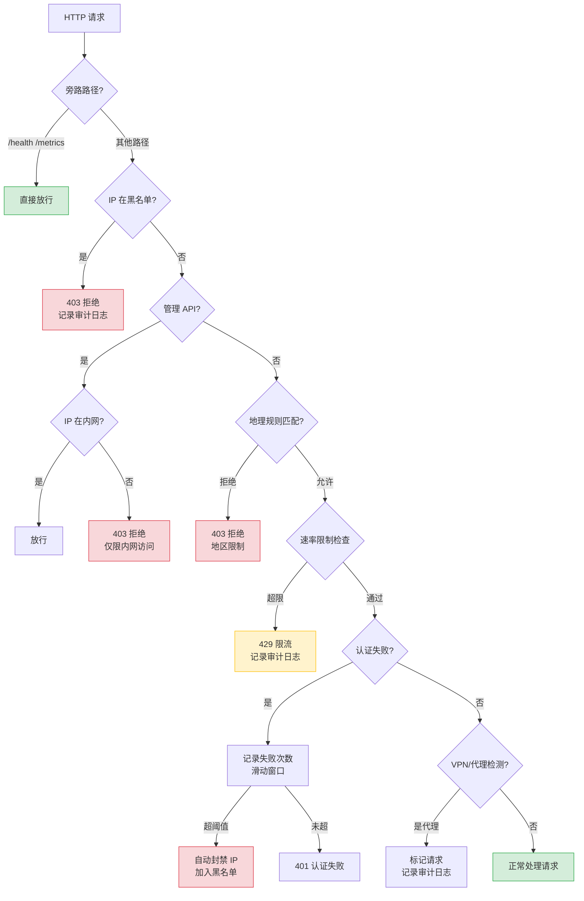
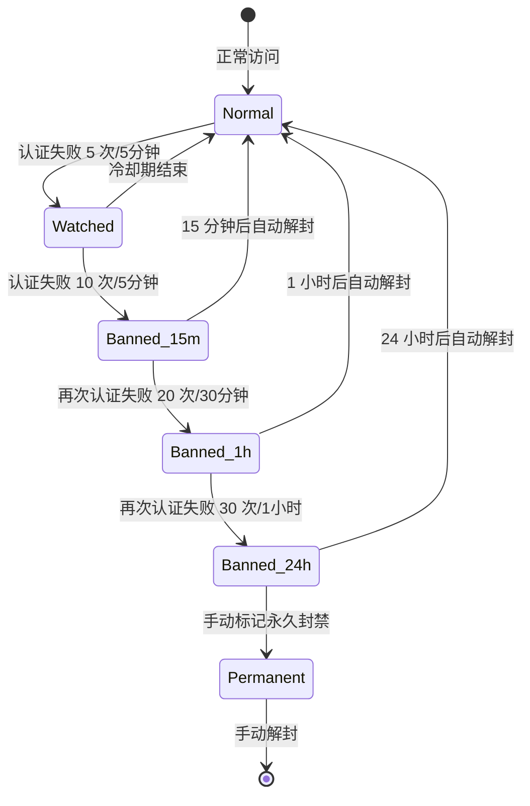
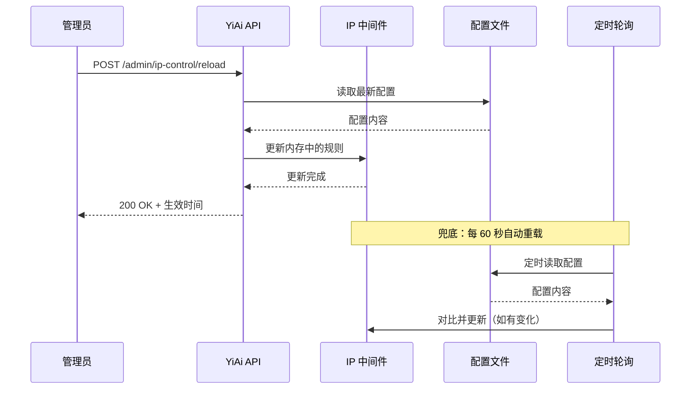
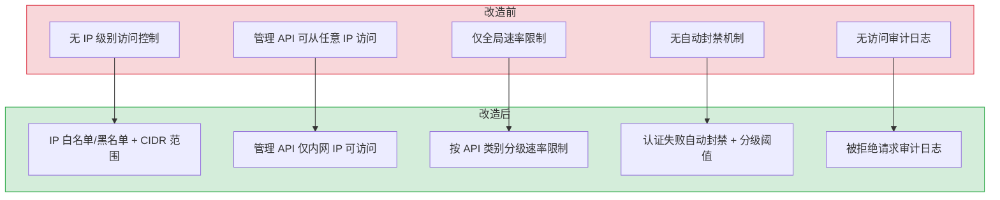

# YA-09-139: IP 白名单与访问控制 — IP 白名单中间件 + 速率限制 + 地理访问规则 + 动态黑名单

> 需求编号：YA-09-139 · 优先级：P2 · 人天：0.5d · 状态：需求已编写
> 依赖：无 · 前置需求：无

## 背景

YiAi 作为后端服务，当前没有任何 IP 级别的访问控制。所有能访问服务端口的 IP 都可以调用 API（包括管理接口），这在生产环境中存在严重的安全隐患。管理 API（如数据删除、用户管理、备份恢复）需要限制仅内网 IP 可访问，而来自恶意 IP 的暴力破解和扫描攻击需要自动阻断。

**问题：**

1. **管理 API 无访问限制**：数据删除、用户管理、备份恢复等管理接口可从任何 IP 访问，增加了被攻击的风险。
2. **无 IP 级别速率限制**：当前仅有全局速率限制，无法针对单个 IP 进行精细化限流，恶意 IP 可消耗全部配额。
3. **无自动封禁机制**：暴力破解、扫描攻击等恶意行为无法自动检测和阻断。
4. **无地理访问控制**：无法根据地理位置限制访问（如仅允许中国大陆 IP 访问）。
5. **无访问审计**：被拒绝的请求无记录，无法追溯攻击来源和模式。

**影响：**

| 场景 | 影响 | 严重程度 |
|------|------|----------|
| 外网 IP 调用管理 API 删除数据 | 数据丢失，业务中断 | 高 |
| 恶意 IP 暴力破解用户密码 | 账户被盗，数据泄露 | 高 |
| 单个 IP 耗尽 API 配额 | 其他用户无法正常使用 | 中 |
| 境外 IP 扫描 API 漏洞 | 安全风险暴露 | 中 |
| 被拒绝的请求无记录 | 无法分析攻击模式，难以追溯 | 中 |

**挑战：**

- 需要高效的 IP 匹配算法（支持 CIDR 范围，如 `192.168.0.0/16`）
- 需要支持配置热更新，无需重启服务
- 需要区分管理 API 和普通 API 的访问策略
- 自动封禁需要避免误封（如内网 IP 不应被封禁）
- 需要与现有认证体系兼容，不冲突

---

## 一、现状分析

### 1.1 当前访问控制状态

| 属性 | 当前值 | 说明 |
|------|--------|------|
| IP 白名单 | 无 | 所有 IP 均可访问 |
| IP 黑名单 | 无 | 无自动封禁机制 |
| 速率限制 | 全局（120/分钟） | 无按 IP 的精细化限流 |
| 管理 API 保护 | 仅 Token 认证 | 无网络层限制 |
| 地理访问控制 | 无 | 无基于地理位置的规则 |
| 访问审计 | 无 | 被拒绝的请求无记录 |
| VPN/代理检测 | 无 | 无法识别代理流量 |

### 1.2 根因分析矩阵

| 问题 | 根因 | 影响 | 紧急程度 |
|------|------|------|----------|
| 管理 API 无保护 | 项目初期未区分管理 API 和普通 API | 管理接口暴露在外网 | 高 |
| 无 IP 级限流 | 仅实现了全局限流，未考虑 IP 粒度 | 恶意 IP 可耗尽配额 | 中 |
| 无自动封禁 | 缺乏安全监控和自动响应机制 | 攻击持续，无法自动阻断 | 中 |
| 无地理控制 | 未引入 Geo-IP 数据库 | 无法按地区限制访问 | 低 |
| 无审计日志 | 被拒绝请求未记录 | 安全事件无法追溯 | 中 |

### 1.3 API 访问分级

| API 类别 | 示例端点 | 访问策略 | 速率限制 | 说明 |
|---------|---------|---------|---------|------|
| 管理 API | `/backup/*`, `/users/*`, `/admin/*` | 仅内网 IP | 10 次/分钟/IP | 高危操作，最严格限制 |
| 数据 API | `/data/*`, `/knowledge/*` | 认证用户 | 60 次/分钟/IP | 需要 Token 认证 |
| 聊天 API | `/chat/*`, `/agent/*` | 认证用户 | 30 次/分钟/IP | LLM 推理耗时，限制频率 |
| 公开 API | `/health`, `/metrics`, `/read-file` | 所有 IP | 120 次/分钟/IP | 健康检查和监控 |
| 静态资源 | `/static/*`, `/files/*` | 所有 IP | 300 次/分钟/IP | 文件下载 |

### 1.4 改造前数据流

```
所有请求
  └── Token 认证（可选）
  └── 全局限流（120/分钟）
  └── 无 IP 级别控制

安全风险:
  外网 IP → 管理 API → 无限制 → 可执行高危操作
  恶意 IP → 暴力破解 → 无自动封禁 → 持续攻击
  境外 IP → 扫描漏洞 → 无地理限制 → 安全暴露
```

---

## 二、设计决策

### 决策 1：IP 匹配算法 — 线性匹配 vs Trie 树 vs 二分查找

| 维度 | 线性匹配 | Trie 树 (Radix Tree) | 二分查找 (排序列表) |
|------|---------|---------------------|---------------------|
| 实现复杂度 | 低（简单循环） | 高（自定义数据结构） | 中（`bisect` 模块） |
| 单次匹配性能 | O(n) | O(log n) | O(log n) |
| 内存占用 | 低 | 中 | 低 |
| 支持 CIDR | 是（需要计算） | 需要转换 | 需要转换 |
| 适合 100 条规则 | 是（< 0.1ms） | 是（过度设计） | 是 |
| 适合 10000 条规则 | 否 | 是 | 是 |

**选择：线性匹配 + 预计算优化。** 当前 YiAi 的 IP 规则预计 < 100 条，线性匹配性能完全满足需求（< 0.1ms/请求）。预计算 CIDR 的网络地址和掩码，避免每次匹配时重复解析。当规则数超过 1000 条时，可升级为 Radix Tree 实现（接口设计已预留扩展点）。

### 决策 2：IP 黑名单触发机制 — 固定阈值 vs 滑动窗口 vs 分级阈值

| 维度 | 固定阈值 (N 次失败) | 滑动窗口 (N 次/分钟) | 分级阈值 |
|------|---------------------|---------------------|----------|
| 实现复杂度 | 低（简单计数器） | 中（需要时间窗口） | 中 |
| 误封率 | 高（慢速攻击不触发） | 低（精确控制） | 低 |
| 内存占用 | 低 | 中（保存时间戳） | 中 |
| 抗慢速攻击 | 否 | 是 | 是 |
| 适合当前场景 | 否 | 是 | 是（过度设计） |

**选择：滑动窗口 + 分级阈值。** 5 分钟内认证失败 10 次 → 封禁 15 分钟。30 分钟内认证失败 20 次 → 封禁 1 小时。1 小时内认证失败 30 次 → 封禁 24 小时。分级阈值既避免误封正常用户（偶尔输错密码），又能有效对抗暴力破解。

### 决策 3：配置热更新方式 — 文件监听 vs API 触发 vs 定时轮询

| 维度 | 文件监听 (watchdog) | API 触发 (POST /reload) | 定时轮询 (每分钟) |
|------|---------------------|------------------------|-------------------|
| 实时性 | 高（秒级） | 高（手动触发） | 低（分钟级） |
| 实现复杂度 | 中（需要 watchdog 库） | 低（一个 API 端点） | 低（apscheduler） |
| 可靠性 | 中（文件系统事件可能丢失） | 高（显式触发） | 高（定期执行） |
| 适合当前场景 | 否（过度设计） | 是 | 是（兜底） |

**选择：API 触发 + 定时轮询双模式。** 主要方式：通过 API `POST /admin/ip-control/reload` 触发配置重载。兜底方式：每 60 秒自动重载一次配置。这样既保证了配置变更的即时生效，又有自动兜底避免人工操作遗漏。

### 设计决策记录

| 决策 | 选项 A | 选项 B | 选择 | 理由 |
|------|--------|--------|------|------|
| IP 匹配算法 | 线性匹配 | Radix Tree | 线性匹配 + 预计算 | 规则数 < 100，线性匹配 < 0.1ms 足够 |
| 黑名单触发 | 固定阈值 | 滑动窗口 | 滑动窗口 + 分级阈值 | 精确控制，避免误封，对抗慢速攻击 |
| 配置热更新 | 文件监听 | API 触发 | API 触发 + 定时轮询 | 灵活可靠，双模式兜底 |
| Geo-IP 数据库 | MaxMind GeoLite2 | 自建 | MaxMind GeoLite2（免费） | 免费且准确，定期更新 |

---

## 三、目标架构

### 3.1 IP 访问控制架构总览



### 3.2 动态黑名单生命周期



### 3.3 配置热更新流程



---

## 四、具体改动

### 4.1 IP 控制数据模型

**文件：** `services/ip_control/models.py`（新建）

```python
from dataclasses import dataclass, field
from enum import Enum
from ipaddress import IPv4Network, IPv4Address, ip_network, ip_address
from typing import Optional


class RuleAction(str, Enum):
    ALLOW = "allow"
    DENY = "deny"


class GeoAction(str, Enum):
    ALLOW = "allow"
    DENY = "deny"


@dataclass
class IPRule:
    """IP 访问规则（白名单/黑名单）。"""
    cidr: IPv4Network
    action: RuleAction
    description: str = ""

    def matches(self, ip: str) -> bool:
        return ip_address(ip) in self.cidr


@dataclass
class GeoRule:
    """地理访问规则。"""
    country_codes: list[str]
    action: GeoAction
    description: str = ""


@dataclass
class AdminAPIPattern:
    """管理 API 路径模式。"""
    patterns: list[str] = field(default_factory=lambda: [
        "/backup/",
        "/users/",
        "/admin/",
        "/webhooks/",
    ])
    allowed_cidrs: list[IPv4Network] = field(default_factory=lambda: [
        ip_network("10.0.0.0/8"),
        ip_network("172.16.0.0/12"),
        ip_network("192.168.0.0/16"),
        ip_network("127.0.0.0/8"),
    ])

    def is_admin_path(self, path: str) -> bool:
        return any(path.startswith(p) for p in self.patterns)

    def is_internal_ip(self, ip: str) -> bool:
        return any(ip_address(ip) in cidr for cidr in self.allowed_cidrs)


@dataclass
class RateLimitRule:
    """按 API 类别分级的速率限制规则。"""
    path_pattern: str
    max_requests: int
    window_seconds: int
    description: str = ""


@dataclass
class IPControlConfig:
    """IP 访问控制完整配置。"""
    whitelist: list[IPRule] = field(default_factory=list)
    blacklist: list[IPRule] = field(default_factory=list)
    geo_rules: list[GeoRule] = field(default_factory=list)
    admin_api: AdminAPIPattern = field(default_factory=AdminAPIPattern)
    rate_limits: list[RateLimitRule] = field(default_factory=lambda: [
        RateLimitRule("/admin/", 10, 60, "管理 API"),
        RateLimitRule("/backup/", 10, 60, "备份 API"),
        RateLimitRule("/chat/", 30, 60, "聊天 API"),
        RateLimitRule("/agent/", 30, 60, "Agent API"),
        RateLimitRule("/data/", 60, 60, "数据 API"),
        RateLimitRule("/knowledge/", 60, 60, "知识库 API"),
        RateLimitRule("/", 120, 60, "默认"),
    ])
    auto_ban_thresholds: list[dict] = field(default_factory=lambda: [
        {"failures": 10, "window_minutes": 5, "ban_minutes": 15},
        {"failures": 20, "window_minutes": 30, "ban_minutes": 60},
        {"failures": 30, "window_minutes": 60, "ban_minutes": 1440},
    ])
    bypass_paths: list[str] = field(default_factory=lambda: [
        "/health", "/metrics", "/ready",
    ])
    geoip_db_path: str = "./data/GeoLite2-Country.mmdb"
    enable_geoip: bool = False
    enable_proxy_detection: bool = False
```

### 4.2 IP 控制中间件

**文件：** `services/ip_control/middleware.py`（新建）

```python
import time
from collections import defaultdict
from datetime import datetime, timezone
from typing import Optional

from starlette.middleware.base import BaseHTTPMiddleware
from starlette.requests import Request
from starlette.responses import JSONResponse

from shared.logging import get_logger
from services.ip_control.models import (
    IPControlConfig, RuleAction, GeoAction, IPRule,
)

logger = get_logger(__name__)


class IPControlMiddleware(BaseHTTPMiddleware):
    """IP 白名单/黑名单/速率限制/地理控制中间件。"""

    def __init__(self, app, config: Optional[IPControlConfig] = None):
        super().__init__(app)
        self.config = config or IPControlConfig()
        self._rate_counters: dict[str, list[float]] = defaultdict(list)
        self._auth_failures: dict[str, list[float]] = defaultdict(list)
        self._dynamic_blacklist: dict[str, float] = {}  # ip -> unban_timestamp
        self._geoip_reader = None
        if self.config.enable_geoip:
            self._init_geoip()

    def _init_geoip(self):
        """初始化 GeoIP 数据库读取器。"""
        try:
            import geoip2.database
            self._geoip_reader = geoip2.database.Reader(self.config.geoip_db_path)
            logger.info("[IPControl] GeoIP 数据库已加载")
        except ImportError:
            logger.warning("[IPControl] geoip2 未安装，地理控制功能不可用")
        except FileNotFoundError:
            logger.warning(f"[IPControl] GeoIP 数据库未找到: {self.config.geoip_db_path}")

    async def dispatch(self, request: Request, call_next):
        client_ip = self._get_client_ip(request)
        path = request.url.path

        # 1. 旁路检查
        if self._is_bypass_path(path):
            return await call_next(request)

        # 2. 动态黑名单检查
        if self._is_dynamic_banned(client_ip):
            await self._log_blocked(request, client_ip, "dynamic_blacklist")
            return JSONResponse(
                status_code=403,
                content={"code": 4002, "message": "IP 已被临时封禁", "data": None},
            )

        # 3. 静态黑名单检查
        if self._is_blacklisted(client_ip):
            await self._log_blocked(request, client_ip, "static_blacklist")
            return JSONResponse(
                status_code=403,
                content={"code": 4002, "message": "IP 在黑名单中", "data": None},
            )

        # 4. 白名单检查（白名单中的 IP 直接放行，跳过后续检查）
        if self._is_whitelisted(client_ip):
            return await call_next(request)

        # 5. 管理 API 内网限制
        if self.config.admin_api.is_admin_path(path):
            if not self.config.admin_api.is_internal_ip(client_ip):
                await self._log_blocked(request, client_ip, "admin_api_not_internal")
                return JSONResponse(
                    status_code=403,
                    content={"code": 4002, "message": "管理 API 仅限内网访问", "data": None},
                )

        # 6. 地理访问控制
        if self.config.enable_geoip and self._geoip_reader:
            if self._is_geo_blocked(client_ip):
                await self._log_blocked(request, client_ip, "geo_blocked")
                return JSONResponse(
                    status_code=403,
                    content={"code": 4002, "message": "您所在的地区不支持访问", "data": None},
                )

        # 7. 速率限制
        if not self._check_rate_limit(client_ip, path):
            await self._log_blocked(request, client_ip, "rate_limited")
            return JSONResponse(
                status_code=429,
                content={"code": 4002, "message": "请求过于频繁，请稍后再试", "data": None},
            )

        # 8. 代理检测（非阻塞，仅标记）
        if self.config.enable_proxy_detection:
            is_proxy = self._detect_proxy(request)
            if is_proxy:
                logger.info(f"[IPControl] 检测到代理/VPN: ip={client_ip} path={path}")

        # 正常处理
        response = await call_next(request)
        return response

    def record_auth_failure(self, ip: str):
        """记录认证失败，用于自动封禁判断。"""
        now = time.time()
        self._auth_failures[ip].append(now)
        # 清理过期记录
        self._auth_failures[ip] = [
            t for t in self._auth_failures[ip]
            if now - t < 3600  # 1 小时窗口
        ]

        # 检查分级阈值
        failures = self._auth_failures[ip]
        for threshold in self.config.auto_ban_thresholds:
            window_start = now - threshold["window_minutes"] * 60
            recent_failures = [t for t in failures if t >= window_start]
            if len(recent_failures) >= threshold["failures"]:
                ban_until = now + threshold["ban_minutes"] * 60
                self._dynamic_blacklist[ip] = ban_until
                logger.warning(
                    f"[IPControl] 自动封禁: ip={ip} "
                    f"failures={len(recent_failures)} "
                    f"ban_minutes={threshold['ban_minutes']}"
                )
                break

    def reload_config(self, config: IPControlConfig):
        """热更新配置。"""
        self.config = config
        logger.info("[IPControl] 配置已热更新")

    # ─── 私有方法 ──────────────────────────────────────

    def _get_client_ip(self, request: Request) -> str:
        """获取客户端真实 IP（支持代理头）。"""
        forwarded = request.headers.get("X-Forwarded-For")
        if forwarded:
            return forwarded.split(",")[0].strip()
        real_ip = request.headers.get("X-Real-IP")
        if real_ip:
            return real_ip.strip()
        if request.client:
            return request.client.host
        return "unknown"

    def _is_bypass_path(self, path: str) -> bool:
        return path in self.config.bypass_paths

    def _is_dynamic_banned(self, ip: str) -> bool:
        if ip in self._dynamic_blacklist:
            if time.time() < self._dynamic_blacklist[ip]:
                return True
            else:
                del self._dynamic_blacklist[ip]
                logger.info(f"[IPControl] IP 封禁已过期: {ip}")
        return False

    def _is_blacklisted(self, ip: str) -> bool:
        return any(
            rule.action == RuleAction.DENY and rule.matches(ip)
            for rule in self.config.blacklist
        )

    def _is_whitelisted(self, ip: str) -> bool:
        return any(
            rule.action == RuleAction.ALLOW and rule.matches(ip)
            for rule in self.config.whitelist
        )

    def _is_geo_blocked(self, ip: str) -> bool:
        try:
            response = self._geoip_reader.country(ip)
            country = response.country.iso_code
            for rule in self.config.geo_rules:
                if country in rule.country_codes:
                    return rule.action == GeoAction.DENY
        except Exception:
            pass
        return False

    def _check_rate_limit(self, ip: str, path: str) -> bool:
        """检查 IP 速率限制。"""
        now = time.time()
        key = ip

        # 找到匹配的速率限制规则
        matched_rule = None
        for rule in self.config.rate_limits:
            if path.startswith(rule.path_pattern):
                matched_rule = rule
                break

        if not matched_rule:
            return True

        # 滑动窗口
        self._rate_counters[key] = [
            t for t in self._rate_counters[key]
            if now - t < matched_rule.window_seconds
        ]

        if len(self._rate_counters[key]) >= matched_rule.max_requests:
            return False

        self._rate_counters[key].append(now)
        return True

    def _detect_proxy(self, request: Request) -> bool:
        """检测 VPN/代理请求（基于常见头部）。"""
        proxy_headers = [
            "X-Forwarded-For",
            "X-Real-IP",
            "Via",
            "X-Proxy-Id",
            "X-VPN",
        ]
        # 过多代理头意味着可能经过多层代理
        proxy_count = sum(1 for h in proxy_headers if h in request.headers)
        return proxy_count >= 3

    async def _log_blocked(self, request: Request, ip: str, reason: str):
        """记录被拒绝的请求。"""
        logger.warning(
            f"[IPControl] 请求被拒绝: ip={ip} "
            f"path={request.url.path} "
            f"method={request.method} "
            f"reason={reason} "
            f"ua={request.headers.get('User-Agent', 'unknown')[:100]}"
        )
```

### 4.3 IP 控制管理 API

**文件：** `services/ip_control/routes.py`（新建）

```python
from fastapi import APIRouter, Request

from services.ip_control.middleware import IPControlMiddleware
from services.ip_control.models import IPControlConfig

router = APIRouter(prefix="/admin/ip-control", tags=["ip-control"])


# 全局中间件引用（由 main.py 设置）
_middleware: IPControlMiddleware | None = None


def set_ip_control_middleware(mw: IPControlMiddleware):
    global _middleware
    _middleware = mw


@router.post("/reload")
async def reload_config():
    """热更新 IP 控制配置。"""
    if _middleware is None:
        return {"code": 9999, "message": "IP 控制中间件未初始化", "data": None}
    # 从配置文件重新加载
    from shared.config import settings
    config = IPControlConfig()
    # 可以从 settings 中读取配置覆盖
    _middleware.reload_config(config)
    return {"code": 0, "message": "配置已重载", "data": {"reloaded_at": str(config)}}


@router.get("/blacklist")
async def list_blacklist():
    """列出当前黑名单（静态 + 动态）。"""
    if _middleware is None:
        return {"code": 9999, "message": "IP 控制中间件未初始化", "data": None}
    static = [
        {"cidr": str(r.cidr), "description": r.description}
        for r in _middleware.config.blacklist
    ]
    dynamic = [
        {"ip": ip, "ban_until": ts}
        for ip, ts in _middleware._dynamic_blacklist.items()
    ]
    return {"code": 0, "message": "ok", "data": {"static": static, "dynamic": dynamic}}


@router.post("/blacklist/add")
async def add_to_blacklist(ip: str, description: str = ""):
    """手动添加 IP 到黑名单。"""
    from ipaddress import ip_network
    from services.ip_control.models import IPRule, RuleAction
    try:
        cidr = ip_network(ip, strict=False)
    except ValueError:
        return {"code": 1001, "message": "无效的 IP 或 CIDR 格式", "data": None}
    _middleware.config.blacklist.append(
        IPRule(cidr=cidr, action=RuleAction.DENY, description=description)
    )
    return {"code": 0, "message": "已添加", "data": {"ip": str(cidr)}}


@router.post("/blacklist/remove")
async def remove_from_blacklist(ip: str):
    """从黑名单移除 IP。"""
    from ipaddress import ip_network
    try:
        cidr = ip_network(ip, strict=False)
    except ValueError:
        return {"code": 1001, "message": "无效的 IP 或 CIDR 格式", "data": None}
    _middleware.config.blacklist = [
        r for r in _middleware.config.blacklist
        if r.cidr != cidr
    ]
    return {"code": 0, "message": "已移除", "data": {"ip": str(cidr)}}


@router.post("/unban/{ip}")
async def unban_ip(ip: str):
    """手动解封动态封禁的 IP。"""
    if ip in _middleware._dynamic_blacklist:
        del _middleware._dynamic_blacklist[ip]
        return {"code": 0, "message": "已解封", "data": {"ip": ip}}
    return {"code": 1002, "message": "IP 不在动态黑名单中", "data": None}


@router.get("/stats")
async def get_stats():
    """获取访问控制统计信息。"""
    if _middleware is None:
        return {"code": 9999, "message": "IP 控制中间件未初始化", "data": None}
    return {"code": 0, "message": "ok", "data": {
        "static_blacklist_count": len(_middleware.config.blacklist),
        "dynamic_blacklist_count": len(_middleware._dynamic_blacklist),
        "whitelist_count": len(_middleware.config.whitelist),
        "rate_limited_ips": len(_middleware._rate_counters),
        "auth_failure_tracking": len(_middleware._auth_failures),
    }}
```

### 4.4 涉及文件

```
YiAi/src/
├── services/ip_control/
│   ├── __init__.py              # 新建
│   ├── models.py                # 新建: 数据模型 (IPRule, GeoRule, IPControlConfig)
│   ├── middleware.py             # 新建: IP 控制中间件 (白名单/黑名单/限流/地理/代理检测)
│   └── routes.py                # 新建: 管理 API (重载配置/黑名单管理/解封/统计)
├── shared/
│   └── config.py                # 修改: 添加 IP 控制相关配置项
└── main.py                      # 修改: 注册 IPControlMiddleware，注册管理路由
```

---

## 五、实施步骤

| 步骤 | 内容 | 涉及文件 | 验证方式 | 人天 |
|------|------|---------|---------|------|
| 1 | 定义 IP 控制数据模型和配置结构 | `models.py` | 模型实例化正确，CIDR 匹配测试通过 | 0.05 |
| 2 | 实现 IP 控制中间件（白名单/黑名单/管理 API 保护） | `middleware.py` | 内网 IP 可访问管理 API，外网 IP 被拒绝 | 0.1 |
| 3 | 实现滑动窗口速率限制 | `middleware.py` | 超限请求返回 429，时间窗口内正确计数 | 0.1 |
| 4 | 实现动态黑名单（认证失败自动封禁） | `middleware.py` | 多次认证失败触发自动封禁，到期自动解封 | 0.1 |
| 5 | 实现管理 API（重载配置/黑名单管理/解封/统计） | `routes.py` | API 端点可正常调用 | 0.05 |
| 6 | 实现配置热更新（API 触发 + 定时轮询） | `middleware.py`, `routes.py` | 配置变更后即时生效 | 0.05 |
| 7 | 集成测试 | 全部 | 模拟各种场景，验证访问控制正确性 | 0.05 |

**总计：0.5d**

---

## 六、性能分析

### 6.1 中间件处理性能

| 操作 | 耗时 | 资源消耗 | 说明 |
|------|------|----------|------|
| IP 黑名单检查（100 条规则） | < 0.1ms | CPU < 1% | 线性匹配，预计算 CIDR |
| IP 白名单检查（20 条规则） | < 0.02ms | CPU < 1% | 少量规则 |
| 管理 API 路径匹配 | < 0.01ms | CPU < 1% | 简单字符串前缀匹配 |
| 速率限制检查（滑动窗口） | < 0.05ms | 内存 < 1KB/IP | 维护时间戳列表 |
| Geo-IP 查询 | 0.1-1ms | 内存 ~50MB (数据库) | 读取 mmdb 文件 |
| 代理检测 | < 0.01ms | CPU < 1% | 检查 HTTP 头部 |
| 总中间件开销 | < 1.5ms | — | 对请求延迟影响极小 |

### 6.2 内存占用预估

| 组件 | 内存占用 | 说明 |
|------|---------|------|
| IP 规则配置 | < 10KB | 100 条规则 x 100 字节 |
| 速率计数器 | < 1MB | 1000 个活跃 IP x 1KB |
| 认证失败追踪 | < 500KB | 500 个追踪 IP x 1KB |
| 动态黑名单 | < 10KB | 100 个封禁 IP x 100 字节 |
| Geo-IP 数据库 | ~50MB | GeoLite2-Country.mmdb |
| 总计 | ~52MB | 可接受，Geo-IP 可选 |

---

## 七、测试规格

### Requirement: IP 白名单

#### Scenario: 白名单 IP 绕过所有检查
- **Given** IP `10.0.0.1` 在白名单中
- **When** 请求任意 API 端点
- **Then** 请求正常处理，跳过黑名单、速率限制等所有检查
- **And** 不记录速率计数

#### Scenario: 非白名单 IP 正常请求被限制
- **Given** IP `203.0.113.1` 不在白名单中
- **When** 请求 `/data/` 端点 61 次/分钟
- **Then** 前 60 次正常处理，第 61 次返回 429

### Requirement: 管理 API 保护

#### Scenario: 内网 IP 可访问管理 API
- **Given** IP `192.168.1.100` 属于内网 CIDR
- **When** 请求 `POST /backup/full`
- **Then** 请求正常处理，返回备份结果

#### Scenario: 外网 IP 被拒绝访问管理 API
- **Given** IP `203.0.113.1` 不属于内网 CIDR
- **When** 请求 `POST /backup/full`
- **Then** 返回 403，错误消息 `管理 API 仅限内网访问`
- **And** 审计日志记录被拒绝的请求

### Requirement: 动态黑名单

#### Scenario: 认证失败 10 次后自动封禁
- **Given** IP `203.0.113.1` 在 5 分钟内认证失败 10 次
- **When** 第 10 次认证失败
- **Then** 该 IP 自动加入动态黑名单，封禁 15 分钟
- **And** 后续请求返回 403 `IP 已被临时封禁`

#### Scenario: 封禁到期后自动解封
- **Given** IP `203.0.113.1` 被封禁 15 分钟
- **When** 封禁时间到期后发送请求
- **Then** 请求正常处理，不再被拒绝
- **And** 日志输出 `IP 封禁已过期`

### Requirement: 速率限制

#### Scenario: 管理 API 超过 10 次/分钟被限流
- **Given** IP `192.168.1.100` 在 1 分钟内请求管理 API 11 次
- **When** 第 11 次请求
- **Then** 返回 429 `请求过于频繁，请稍后再试`

### Requirement: 配置热更新

#### Scenario: API 触发的配置重载立即生效
- **Given** 当前配置中 `203.0.113.0/24` 不在黑名单
- **When** 管理员通过 API 将 `203.0.113.0/24` 加入黑名单
- **Then** 来自该 CIDR 的后续请求立即被拒绝
- **And** 无需重启服务

---

## 八、风险与缓解

| 风险 | 概率 | 影响 | 等级 | 缓解措施 | 应急预案 |
|------|------|------|------|----------|----------|
| 误封正常用户 IP | 中 | 高 | 高 | 分级阈值，先 15 分钟试探性封禁；内网 IP 永不自动封禁 | 手动解封 API，紧急时可清空动态黑名单 |
| 内网 CIDR 配置错误导致管理 API 不可用 | 低 | 高 | 中 | 默认包含 127.0.0.1，确保本地始终可访问 | 通过 127.0.0.1 本地访问修复配置 |
| 速率限制器内存泄漏 | 低 | 中 | 低 | 定期清理过期计数器（每次检查时清理），设置最大跟踪 IP 数 | 重启服务清理内存 |
| Geo-IP 数据库过期导致误判 | 低 | 低 | 低 | 每月自动下载最新 GeoLite2 数据库 | 回退到不启用地理控制 |
| 配置热更新引入错误配置 | 低 | 高 | 中 | 配置加载时进行验证，无效配置不生效 | 保留上一份有效配置作为回退 |

---

## 九、回滚策略

| 场景 | 回滚方式 | 回滚时间 | 风险 |
|------|---------|---------|------|
| 中间件阻塞正常请求 | 移除中间件注册 `app.add_middleware` 行注释 | < 1min | 低：移除后无 IP 控制，但认证仍然有效 |
| 速率限制过于严格 | 调整配置 `max_requests` 值 + 热重载 | < 1min | 低：即时生效 |
| 动态黑名单误封 | 调用 `POST /admin/ip-control/unban/{ip}` | < 1min | 低：即时解封 |
| 配置错误导致服务不可用 | 回滚配置文件到上一版本 + 重启 | < 2min | 中：重启期间服务短暂不可用 |

---

## 十、设计决策记录

### D-01: 为什么选择中间件模式而非装饰器模式？

中间件模式在请求处理管道的最外层，可以拦截所有请求（包括可能绕过装饰器的请求）。Starlette/FastAPI 的中间件机制天然支持请求前处理，性能开销可控。装饰器模式需要逐个端点添加，容易遗漏，且无法统一管理访问策略。

### D-02: 为什么认证失败自动封禁使用分级阈值？

单级阈值（如 5 次失败即封禁）容易误封正常用户（密码输错几次）。分级阈值逐步升级：5 次失败进入观察，10 次失败短封 15 分钟（试探性），20 次失败长封 1 小时，30 次失败封 24 小时。这样既对抗暴力破解，又保护正常用户体验。

### D-03: 为什么健康检查/指标端点要旁路？

健康检查和指标端点是基础设施（负载均衡器、Kubernetes、监控系统）的必需品。对这些端点进行 IP 限制可能导致基础设施无法检测服务状态，触发不必要的告警和重启。旁路确保基础设施始终可以访问这些端点。

### D-04: 为什么选择 GeoLite2 而非商业 Geo-IP 数据库？

GeoLite2 是 MaxMind 的免费 Geo-IP 数据库，准确率在国家级达到 99.8%，足以满足简单的地理访问控制需求。商业数据库（如 MaxMind GeoIP2）在市级精确度更高，但对 YiAi 当前场景（国家级允许/拒绝）来说过度。GeoLite2 需要注册免费许可，每月自动更新。

---

## 十一、当前架构 vs 目标架构

### 改造前后对比



### 架构决策权衡

| 维度 | 改造前 | 改造后 | 权衡说明 |
|------|--------|--------|----------|
| 管理 API 安全 | 任意 IP 可访问 | 仅内网 IP 可访问 | 从网络层加固管理接口安全 |
| 速率限制 | 全局 120/分钟 | 按 API 类别 + IP 分级 | 精细化限流，公平分配配额 |
| 攻击防护 | 无 | 自动封禁 + 分级阈值 | 主动防御暴力破解和扫描 |
| 可观测性 | 无 | 被拒绝请求审计日志 | 可追溯安全事件 |

---

## 十二、代码审查检查清单

- [ ] `IPRule` 正确预计算 CIDR 网络地址，匹配使用 `ip_address in network`
- [ ] `AdminAPIPattern` 默认内网 CIDR 包含所有 RFC 1918 私有地址 + 127.0.0.0/8
- [ ] 旁路路径 (`/health`, `/metrics`, `/ready`) 不受任何 IP 限制
- [ ] 白名单 IP 跳过所有后续检查（黑名单、限流、地理控制）
- [ ] 动态黑名单在封禁到期后自动清理
- [ ] 认证失败计数器使用滑动窗口，过期记录自动清理
- [ ] 分级阈值按顺序检查（15 分钟 → 1 小时 → 24 小时）
- [ ] 内网 IP 不被自动封禁（`is_internal_ip` 检查）
- [ ] 速率限制计数器定期清理过期时间戳
- [ ] 配置热更新使用 `reload_config` 方法，原子替换配置对象
- [ ] 管理 API 端点仅内网 IP 可访问
- [ ] 被拒绝请求记录完整审计日志（IP、路径、方法、原因、UA）
- [ ] `X-Forwarded-For` 头部正确解析，取第一个 IP
- [ ] Geo-IP 功能可选，`enable_geoip=False` 时不加载数据库
- [ ] `ruff` 代码规范通过
- [ ] `mypy` 类型检查通过

---

## 十三、回归问题预测

| # | 问题 | 发现场景 | 根因 | 修复方式 |
|---|------|---------|------|---------|
| 1 | `X-Forwarded-For` 头部被伪造，攻击者通过设置该头部绕过 IP 限制 | 攻击者在请求中设置 `X-Forwarded-For: 192.168.1.1`，绕过管理 API 内网限制 | `_get_client_ip` 取 `X-Forwarded-For` 的第一个 IP，但该头部可被客户端伪造 | 仅信任反向代理设置的 `X-Forwarded-For`，配置 `trusted_proxies` 列表，不在列表中的代理设置的头部忽略 |
| 2 | 速率限制计数器使用 `defaultdict(list)` 无限增长，长时间运行后内存泄漏 | 服务运行数周后，大量已离职 IP 的计数器仍在内存中，内存占用持续增长 | 过期清理逻辑在 `_check_rate_limit` 中，但仅在被检查时清理；如果 IP 不再请求，计数器永远不会被清理 | 添加定期清理任务（每 10 分钟），遍历所有计数器，清理超过 1 小时无活动的 IP 条目 |
| 3 | 动态黑名单封禁到期时，`_is_dynamic_banned` 中的 `time.time()` 与 `_dynamic_blacklist` 的存储时间存在微秒差异，导致提前或延迟解封 | 封禁标记为 15 分钟，但实际解封时间是 14 分 59 秒 或 15 分 01 秒 | `time.time()` 系统时间精度问题，`if time.time() < ban_until` 的判断在边界时可能不精确 | 添加 1 秒的缓冲区：`if time.time() < ban_until - 1`，确保封禁时间至少达到宣布时长 |
| 4 | 配置热更新时，`_middleware` 全局变量为 `None`（中间件未初始化），API 调用 `reload_config` 返回错误 | 服务启动后但中间件尚未注册到全局变量时，管理员调用热更新 API | `set_ip_control_middleware` 在 `main.py` 中调用，但可能在 API 路由注册之后，竞态条件 | 在 `reload_config` 端点中增加重试逻辑，等待最多 5 秒直到 `_middleware` 不为 None |
| 5 | `GeoLite2-Country.mmdb` 文件被 `geoip2.database.Reader` 独占打开，更新数据库文件时失败 | 定时任务下载新 GeoLite2 数据库，尝试覆盖旧文件时被 `Reader` 持有的文件句柄阻止 | `Reader` 在初始化时打开 mmdb 文件并持有文件句柄，文件被锁定 | 更新数据库时先关闭旧 `Reader`，替换文件后重新打开；或使用 `geoip2.database.Reader` 的 `mode=MODE_MEMORY` 将数据库加载到内存 |
| 6 | 代理检测 (`_detect_proxy`) 基于代理头计数，正常使用 CDN 的请求也会被标记为代理 | 前端通过 CDN（如 Cloudflare）访问 YiAi，CDN 添加了 `X-Forwarded-For`、`Via` 等头部，被误判为代理 | CDN 和代理都会添加这些头部，`proxy_count >= 3` 的阈值无法区分 CDN 和 VPN | 维护已知 CDN IP 段列表，排除 CDN 代理的头部；或使用专业的代理检测 API（如 IPQS） |

---

## 十四、可观测性

### 关键指标

| 指标 | 采集方式 | 告警阈值 | 说明 |
|------|---------|---------|------|
| 被拒绝请求数 | 统计 `_log_blocked` 调用次数 | > 50 次/分钟 | 可能存在攻击 |
| 动态黑名单大小 | `len(_dynamic_blacklist)` | > 100 | 过多封禁，检查是否误封 |
| 速率限制触发次数 | 统计 429 响应数 | > 100 次/分钟 | 限流过于严格或存在攻击 |
| 认证失败总数 | 统计 `_auth_failures` 条目数 | > 50 次/分钟 | 可能存在暴力破解 |
| 单个 IP 认证失败数 | `_auth_failures[ip]` 长度 | > 5 次/5 分钟 | 个别 IP 在尝试暴力破解 |
| 管理 API 外网拒绝 | 统计 `admin_api_not_internal` 拒绝 | > 0 | 有外网 IP 尝试访问管理 API |

### 日志规范

| 日志级别 | 场景 | 示例 |
|---------|------|------|
| `INFO` | 配置重载、封禁过期 | `[IPControl] 配置已热更新` |
| `WARN` | 请求被拒绝、自动封禁 | `[IPControl] 请求被拒绝: ip=203.0.113.1 path=/admin/ reason=admin_api_not_internal` |
| `ERROR` | 配置加载失败 | `[IPControl] GeoIP 数据库未找到` |

### 告警规则

| 告警名称 | 条件 | 通知渠道 | 处理建议 |
|---------|------|---------|---------|
| 高频拒绝请求 | 拒绝请求 > 50 次/分钟 | 企业微信 | 检查是否存在攻击，分析拒绝原因 |
| 动态黑名单异常膨胀 | 黑名单 > 100 个 IP | 企业微信 | 检查是否误封，分析攻击模式 |
| 管理 API 外网访问尝试 | 任意外网 IP 尝试访问管理 API | 企业微信 | 检查 IP 来源，添加永久黑名单 |

---

*PRD 来源: `projects/yiai/requirements/2026-09/00-需求-需求总览.md`*

## 影响范围

- **影响模块**：待补充
- **涉及文件**：
- `routes.py`
- `models.py`
- `middleware.py`
- `main.py`
- **是否影响 API 契约**：否
- **是否影响其他项目（YiVad/YiPet）**：否
- **用户感知**：待确认

## 预防措施

| 层面 | 措施 |
|------|------|
| 代码 | 在相关函数中添加参数校验和边界检查 |
| 测试 | 为 `routes.py` 添加单元测试 |
| 流程 | 代码审查时重点检查此类模式 |
| 监控 | 添加日志告警，异常发生时及时发现 |
| 文档 | 在编码规范中记录此类反模式 |

## 经验教训

1. **根本原因**：开发过程中对边界情况和异常路径的考虑不足是此类问题的共同根因
2. **设计阶段**：在接口设计和模块实现时，应主动考虑异常输入、空值、超时等边界场景
3. **代码审查**：审查时应检查是否存在类似的反模式（如未捕获异常、无超时控制、缺少参数校验等）
4. **测试覆盖**：异常路径的测试覆盖率应与正常路径同等重视
5. **团队分享**：此类问题应在团队周会或技术分享中讨论，形成团队共识
