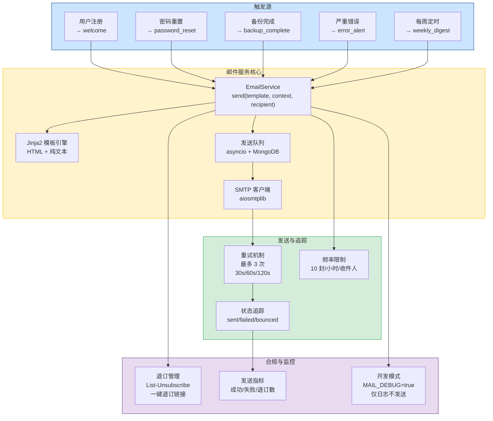
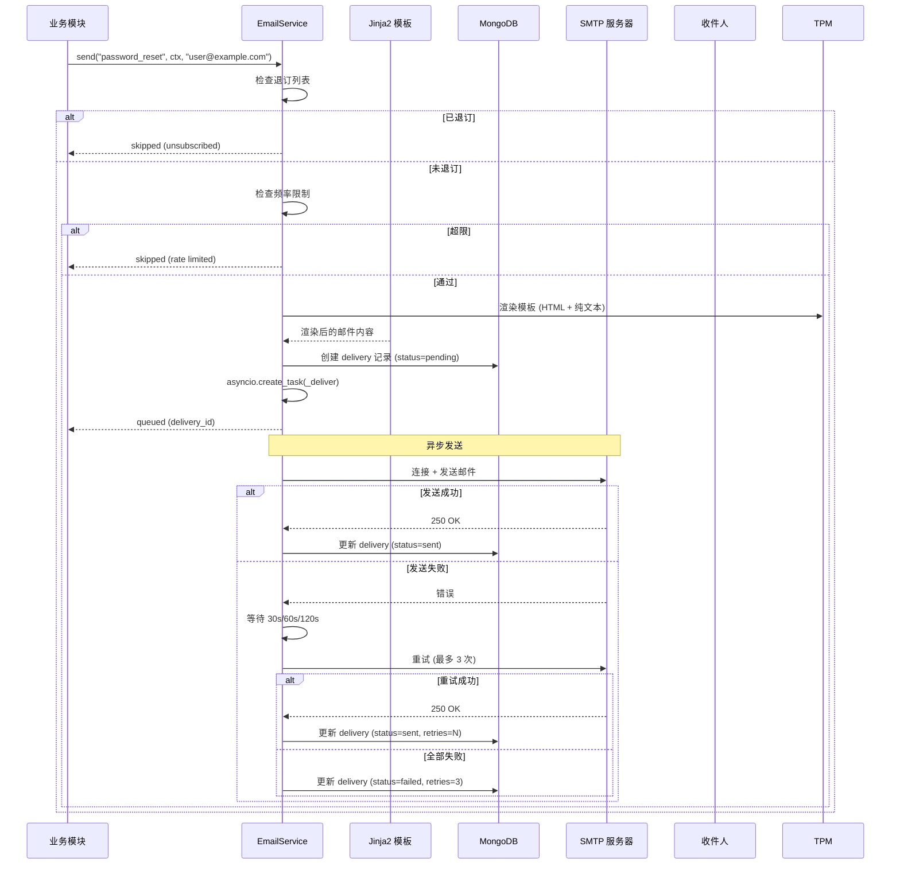
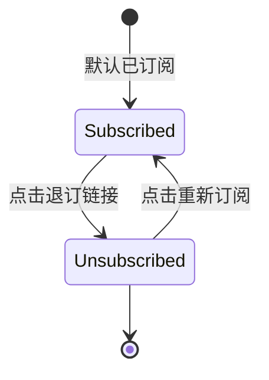
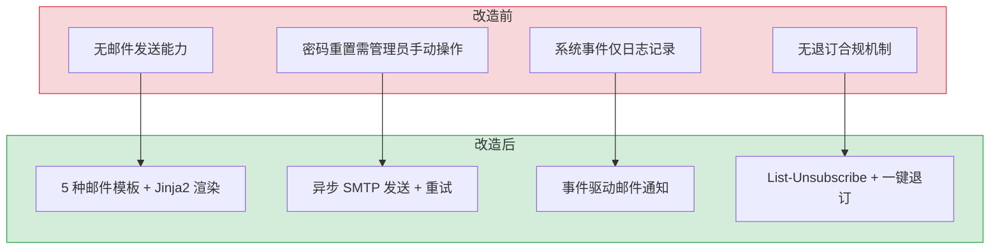

# YA-09-140: 邮件通知服务 — SMTP 异步发送 + Jinja2 模板 + 邮件队列重试 + 退订机制

> 需求编号：YA-09-140 · 优先级：P2 · 人天：0.5d · 状态：需求已编写
> 依赖：无 · 前置需求：无

## 背景

YiAi 当前缺乏任何形式的邮件通知能力。当系统发生需要用户关注的事件（密码重置、备份完成、异常告警、周报汇总）时，用户无法及时获知。邮件通知是 SaaS 服务的基础设施，对于用户管理和运维监控至关重要。

**问题：**

1. **无邮件发送能力**：系统无法向用户发送任何邮件通知，密码重置等功能只能通过管理员手动操作完成。
2. **无邮件模板管理**：即使接入 SMTP，每次发送邮件都需要手动拼接 HTML，无法统一管理邮件样式和内容。
3. **无发送状态追踪**：无法知道邮件是否成功发送、是否被退回，缺乏发送可观测性。
4. **无退订机制**：如果发送通知类邮件，缺乏合规的退订机制，可能导致邮件被标记为垃圾邮件。
5. **无发送频率控制**：没有对单个收件人的发送频率限制，可能造成邮件轰炸。

**影响：**

| 场景 | 影响 | 严重程度 |
|------|------|----------|
| 用户忘记密码无法自助重置 | 需要管理员手动操作，体验差 | 中 |
| 备份完成后无人知晓 | 备份文件可能过期未被归档 | 中 |
| 系统异常无人通知 | 故障持续影响用户 | 高 |
| 发送过多邮件被标记垃圾 | 邮件域信誉下降，正常邮件也被拦截 | 高 |
| 无退订机制 | 违反 GDPR/CAN-SPAM 等法规 | 中 |

**挑战：**

- 需要异步发送，不能阻塞 API 请求
- 需要支持 HTML + 纯文本双格式（兼容性和美观性）
- 需要邮件发送队列和重试机制（SMTP 服务可能临时不可用）
- 需要合规的退订机制（List-Unsubscribe 头部 + 一键退订）
- 开发环境需要邮件调试模式（不实际发送，仅记录日志）

---

## 一、现状分析

### 1.1 当前邮件通知状态

| 属性 | 当前值 | 说明 |
|------|--------|------|
| SMTP 服务 | 未配置 | 无任何邮件发送能力 |
| 邮件模板 | 无 | 无邮件模板系统 |
| 邮件发送队列 | 无 | 无异步发送或队列机制 |
| 发送状态追踪 | 无 | 无法知道邮件是否送达 |
| 退订机制 | 无 | 无退订链接或头部 |
| 速率限制 | 无 | 无发送频率控制 |
| 开发调试 | 无 | 开发时无法测试邮件功能 |

### 1.2 根因分析矩阵

| 问题 | 根因 | 影响 | 紧急程度 |
|------|------|------|----------|
| 无邮件能力 | 项目初期未考虑用户通知需求，运维依赖人工 | 用户无法自助重置密码，运维效率低 | 中 |
| 无模板系统 | 邮件功能未实现，自然无模板需求 | 即使发送邮件，格式也无法统一 | 低 |
| 无退订机制 | 未考虑合规要求 | 可能违反法规，邮件被标记垃圾 | 中 |
| 无发送监控 | 缺乏可观测性设计 | 发送失败无法及时发现 | 中 |

### 1.3 邮件类型定义

| 模板类型 | 触发场景 | 优先级 | 发送频率限制 | 需要退订 | 说明 |
|---------|---------|--------|-------------|----------|------|
| `welcome` | 用户注册成功 | 低 | 1 次/用户 | 否 | 欢迎邮件，一次性 |
| `password_reset` | 用户请求密码重置 | 高 | 3 次/小时/用户 | 否 | 包含重置链接，安全敏感 |
| `backup_complete` | 数据库备份完成 | 中 | 1 次/天 | 是 | 通知运维人员备份结果 |
| `error_alert` | 严重错误发生 | 高 | 5 次/小时 | 是 | 通知运维人员系统异常 |
| `weekly_digest` | 每周系统运行报告 | 低 | 1 次/周 | 是 | 周报汇总，信息性通知 |

### 1.4 改造前数据流

```
系统事件 → 仅日志记录 → 无邮件通知
密码重置 → 无法自助 → 管理员手动操作
备份完成 → 无通知 → 运维人员需主动查看
系统异常 → 无通知 → 故障持续
```

---

## 二、设计决策

### 决策 1：SMTP 库选择 — smtplib (同步) vs aiosmtplib (异步) vs 第三方 API (SendGrid)

| 维度 | smtplib (同步) | aiosmtplib (异步) | SendGrid/第三方 API |
|------|---------------|-------------------|---------------------|
| 实现复杂度 | 低 | 中 | 中（需要 API 集成） |
| 异步支持 | 否（阻塞事件循环） | 是（原生异步） | 是（HTTP API） |
| 依赖 | 无（标准库） | 需要 pip install | 需要 SDK + 账户 |
| 成本 | 仅 SMTP 服务器 | 仅 SMTP 服务器 | 按月付费 |
| 送达率 | 取决于 SMTP 服务器 | 取决于 SMTP 服务器 | 高（专业服务） |
| 适合当前场景 | 否（阻塞） | 是 | 否（过度，额外成本） |

**选择：aiosmtplib。** YiAi 是异步 FastAPI 应用，使用同步 `smtplib` 会阻塞事件循环。`aiosmtplib` 提供原生异步 SMTP 客户端，与 FastAPI 完美集成。未来可扩展支持第三方 API（SendGrid/Mailgun）作为备用发送通道。

### 决策 2：邮件模板引擎 — Jinja2 vs Mako vs 字符串拼接

| 维度 | Jinja2 | Mako | 字符串拼接 |
|------|--------|------|-----------|
| 学习曲线 | 低（Python 开发者熟悉） | 中 | 低 |
| HTML 支持 | 优（模板继承、宏） | 优 | 差（难以维护） |
| 纯文本回退 | 需要手动提供 | 需要手动提供 | 需要手动拼接 |
| 安全性（防 XSS） | 自动转义 | 需要手动 | 需要手动 |
| 依赖 | 已在 FastAPI 依赖中 | 额外安装 | 无 |
| 适合当前场景 | 是 | 否 | 否 |

**选择：Jinja2。** Jinja2 是 Python 生态中最流行的模板引擎，FastAPI 默认使用它渲染 HTML。YiAi 可能已经安装了 Jinja2（作为 FastAPI 的依赖）。模板继承、自动转义、宏等功能大大简化邮件模板的编写和维护。

### 决策 3：邮件发送方式 — 同步发送 vs 异步任务 vs 队列

| 维度 | 同步发送 | 异步任务 (asyncio) | 持久化队列 (MongoDB) |
|------|---------|-------------------|---------------------|
| 实现复杂度 | 低 | 中 | 中 |
| 发送延迟 | 高（阻塞 API 响应） | 低（返回即发送） | 中（取决于 Worker） |
| 可靠性 | 低（失败即丢失） | 中（进程重启丢失） | 高（持久化） |
| 重试能力 | 无 | 有限（内存中） | 完整（持久化 + 重试） |
| 适合当前场景 | 否 | 是（邮件量低） | 是（更可靠） |

**选择：异步任务 + MongoDB 持久化。** 邮件发送量预计 < 100 封/天，异步任务足够。但为提高可靠性，发送状态持久化到 MongoDB `email_deliveries` 集合，支持失败重试（最多 3 次，延迟 30s/60s/120s）。进程重启后可扫描 `pending` 状态的邮件重新发送。

### 设计决策记录

| 决策 | 选项 A | 选项 B | 选择 | 理由 |
|------|--------|--------|------|------|
| SMTP 库 | smtplib | aiosmtplib | aiosmtplib | 原生异步，不阻塞事件循环 |
| 模板引擎 | 字符串拼接 | Jinja2 | Jinja2 | 自动转义、模板继承、生态成熟 |
| 发送方式 | 同步发送 | 异步任务 + 持久化 | 异步任务 + MongoDB 持久化 | 可靠性高，支持重试和恢复 |
| 退订机制 | 无 | List-Unsubscribe | List-Unsubscribe + 一键退订 | 合规要求，降低垃圾邮件标记率 |

---

## 三、目标架构

### 3.1 邮件服务架构总览



### 3.2 邮件发送时序



### 3.3 退订流程



---

## 四、具体改动

### 4.1 邮件数据模型

**文件：** `services/email/models.py`（新建）

```python
from datetime import datetime
from enum import Enum
from typing import Optional
from pydantic import BaseModel, EmailStr, Field


class EmailTemplate(str, Enum):
    """邮件模板类型枚举。"""
    WELCOME = "welcome"
    PASSWORD_RESET = "password_reset"
    BACKUP_COMPLETE = "backup_complete"
    ERROR_ALERT = "error_alert"
    WEEKLY_DIGEST = "weekly_digest"


class EmailStatus(str, Enum):
    PENDING = "pending"
    SENT = "sent"
    FAILED = "failed"
    BOUNCED = "bounced"


class EmailDelivery(BaseModel):
    """邮件发送记录。"""
    template: EmailTemplate
    recipient: str
    subject: str
    status: EmailStatus = EmailStatus.PENDING
    attempts: int = 0
    first_attempt_at: datetime
    last_attempt_at: Optional[datetime] = None
    error_message: Optional[str] = None
    smtp_response: Optional[str] = None


class EmailContext(BaseModel):
    """邮件模板上下文。"""
    template: EmailTemplate
    recipient: EmailStr
    subject_override: Optional[str] = None
    context: dict = Field(default_factory=dict)
    attachments: list[dict] = Field(default_factory=list)  # [{filename, content, mime_type}]
```

### 4.2 邮件服务核心

**文件：** `services/email/email_service.py`（新建）

```python
import asyncio
import secrets
from datetime import datetime, timezone, timedelta
from email.mime.multipart import MIMEMultipart
from email.mime.text import MIMEText
from email.mime.base import MIMEBase
from email import encoders
from pathlib import Path
from typing import Optional

import aiosmtplib
from jinja2 import Environment, FileSystemLoader, select_autoescape
from motor.motor_asyncio import AsyncIOMotorDatabase

from shared.logging import get_logger
from shared.config import settings
from services.email.models import (
    EmailTemplate, EmailStatus, EmailContext, EmailDelivery,
)

logger = get_logger(__name__)

# 重试延迟（秒）
RETRY_DELAYS = [30, 60, 120]
MAX_RETRIES = 3
# 频率限制：每收件人每小时最多 10 封
RATE_LIMIT_PER_HOUR = 10


class EmailService:
    """异步邮件发送服务。"""

    def __init__(self, db: AsyncIOMotorDatabase):
        self.db = db
        self.deliveries_col = db.email_deliveries
        self.unsubscribes_col = db.email_unsubscribes

        # Jinja2 模板环境
        template_dir = Path(__file__).parent / "templates"
        self.jinja_env = Environment(
            loader=FileSystemLoader(str(template_dir)),
            autoescape=select_autoescape(["html"]),
        )

        # 速率限制计数器
        self._rate_counters: dict[str, list[datetime]] = {}

        # SMTP 客户端
        self._smtp: Optional[aiosmtplib.SMTP] = None

    async def _get_smtp(self) -> aiosmtplib.SMTP:
        """获取或创建 SMTP 连接。"""
        if self._smtp is None or not self._smtp.is_connected:
            self._smtp = aiosmtplib.SMTP(
                hostname=settings.smtp_host,
                port=settings.smtp_port,
                use_tls=settings.smtp_use_tls,
                timeout=30,
            )
        return self._smtp

    # ─── 发送邮件 ───────────────────────────────────────

    async def send(self, ctx: EmailContext) -> dict:
        """发送邮件（异步）。"""
        # 检查退订
        if await self._is_unsubscribed(ctx.recipient, ctx.template):
            logger.info(f"[Email] 收件人已退订: {ctx.recipient} template={ctx.template}")
            return {"status": "skipped", "reason": "unsubscribed"}

        # 检查频率限制
        if not self._check_rate_limit(ctx.recipient):
            logger.warning(f"[Email] 频率限制: {ctx.recipient}")
            return {"status": "skipped", "reason": "rate_limited"}

        # 渲染模板
        html_body, text_body = await self._render_template(ctx)

        # 构建邮件
        subject = ctx.subject_override or self._get_default_subject(ctx.template)
        message = self._build_message(
            recipient=ctx.recipient,
            subject=subject,
            html_body=html_body,
            text_body=text_body,
            attachments=ctx.attachments,
            unsubscribe_url=self._get_unsubscribe_url(ctx.recipient),
        )

        # 创建 delivery 记录
        delivery = {
            "template": ctx.template.value,
            "recipient": ctx.recipient,
            "subject": subject,
            "status": EmailStatus.PENDING.value,
            "attempts": 0,
            "first_attempt_at": datetime.now(timezone.utc),
            "last_attempt_at": None,
            "error_message": None,
            "smtp_response": None,
        }
        result = await self.deliveries_col.insert_one(delivery)
        delivery_id = str(result.inserted_id)

        # 开发模式：仅记录日志
        if settings.mail_debug:
            logger.info(
                f"[Email] DEBUG 模式 - 邮件未实际发送:\n"
                f"  To: {ctx.recipient}\n"
                f"  Subject: {subject}\n"
                f"  Body: {text_body[:200]}..."
            )
            await self.deliveries_col.update_one(
                {"_id": result.inserted_id},
                {"$set": {"status": EmailStatus.SENT.value, "smtp_response": "debug_mode"}},
            )
            return {"status": "sent", "delivery_id": delivery_id, "debug": True}

        # 异步发送
        asyncio.create_task(self._deliver_with_retry(delivery_id, message))
        return {"status": "queued", "delivery_id": delivery_id}

    async def send_sync(self, ctx: EmailContext) -> dict:
        """同步发送邮件（等待发送完成，用于密码重置等需要确认的场景）。"""
        # 检查退订
        if await self._is_unsubscribed(ctx.recipient, ctx.template):
            return {"status": "skipped", "reason": "unsubscribed"}

        if not self._check_rate_limit(ctx.recipient):
            return {"status": "skipped", "reason": "rate_limited"}

        html_body, text_body = await self._render_template(ctx)
        subject = ctx.subject_override or self._get_default_subject(ctx.template)
        message = self._build_message(
            recipient=ctx.recipient,
            subject=subject,
            html_body=html_body,
            text_body=text_body,
            attachments=ctx.attachments,
            unsubscribe_url=self._get_unsubscribe_url(ctx.recipient),
        )

        delivery = {
            "template": ctx.template.value,
            "recipient": ctx.recipient,
            "subject": subject,
            "status": EmailStatus.PENDING.value,
            "attempts": 0,
            "first_attempt_at": datetime.now(timezone.utc),
            "last_attempt_at": None,
            "error_message": None,
            "smtp_response": None,
        }
        result = await self.deliveries_col.insert_one(delivery)
        delivery_id = str(result.inserted_id)

        if settings.mail_debug:
            logger.info(f"[Email] DEBUG 模式 - 邮件未实际发送 (sync): To={ctx.recipient} Subject={subject}")
            await self.deliveries_col.update_one(
                {"_id": result.inserted_id},
                {"$set": {"status": EmailStatus.SENT.value, "smtp_response": "debug_mode"}},
            )
            return {"status": "sent", "delivery_id": delivery_id, "debug": True}

        success = await self._deliver_with_retry(delivery_id, message)
        return {"status": "sent" if success else "failed", "delivery_id": delivery_id}

    # ─── 退订管理 ───────────────────────────────────────

    async def unsubscribe(self, email: str, token: str) -> bool:
        """处理退订请求。"""
        # 验证 token
        expected_token = self._generate_unsubscribe_token(email)
        if not secrets.compare_digest(token, expected_token):
            return False

        await self.unsubscribes_col.update_one(
            {"email": email},
            {"$set": {
                "email": email,
                "unsubscribed_at": datetime.now(timezone.utc),
                "all_templates": True,
            }},
            upsert=True,
        )
        logger.info(f"[Email] 用户已退订: {email}")
        return True

    async def resubscribe(self, email: str) -> bool:
        """重新订阅。"""
        result = await self.unsubscribes_col.delete_one({"email": email})
        if result.deleted_count:
            logger.info(f"[Email] 用户已重新订阅: {email}")
        return result.deleted_count > 0

    async def _is_unsubscribed(self, email: str, template: EmailTemplate) -> bool:
        """检查是否已退订。"""
        doc = await self.unsubscribes_col.find_one({"email": email})
        if doc and doc.get("all_templates"):
            return True
        return False

    # ─── 内部方法 ───────────────────────────────────────

    async def _render_template(self, ctx: EmailContext) -> tuple[str, str]:
        """渲染 HTML 和纯文本模板。"""
        template_name = ctx.template.value
        template_context = {
            **ctx.context,
            "recipient_email": ctx.recipient,
            "unsubscribe_url": self._get_unsubscribe_url(ctx.recipient),
            "app_name": "YiAi",
            "current_year": datetime.now().year,
        }

        # 渲染 HTML
        html_template = self.jinja_env.get_template(f"{template_name}.html")
        html_body = html_template.render(**template_context)

        # 渲染纯文本
        try:
            text_template = self.jinja_env.get_template(f"{template_name}.txt")
            text_body = text_template.render(**template_context)
        except Exception:
            # 如果没有纯文本模板，从 HTML 简单提取
            text_body = f"请使用支持 HTML 的邮件客户端查看此邮件。\n\n{ctx.context.get('message', '')}"

        return html_body, text_body

    def _build_message(
        self,
        recipient: str,
        subject: str,
        html_body: str,
        text_body: str,
        attachments: list[dict],
        unsubscribe_url: str,
    ) -> MIMEMultipart:
        """构建 MIME 邮件。"""
        message = MIMEMultipart("alternative")
        message["From"] = settings.smtp_from
        message["To"] = recipient
        message["Subject"] = subject
        message["List-Unsubscribe"] = f"<{unsubscribe_url}>"
        message["List-Unsubscribe-Post"] = "List-Unsubscribe=One-Click"
        message["Date"] = datetime.now(timezone.utc).strftime("%a, %d %b %Y %H:%M:%S +0000")

        # 纯文本部分（优先）
        message.attach(MIMEText(text_body, "plain", "utf-8"))
        # HTML 部分
        message.attach(MIMEText(html_body, "html", "utf-8"))

        # 附件
        for att in attachments:
            part = MIMEBase("application", "octet-stream")
            part.set_payload(att["content"])
            encoders.encode_base64(part)
            part.add_header(
                "Content-Disposition",
                f'attachment; filename="{att["filename"]}"',
            )
            message.attach(part)

        return message

    async def _deliver_with_retry(
        self, delivery_id: str, message: MIMEMultipart
    ) -> bool:
        """带重试的邮件发送。"""
        for attempt in range(MAX_RETRIES + 1):
            try:
                smtp = await self._get_smtp()
                if not smtp.is_connected:
                    await smtp.connect()
                    if settings.smtp_username and settings.smtp_password:
                        await smtp.login(settings.smtp_username, settings.smtp_password)

                response = await smtp.send_message(message)
                logger.info(
                    f"[Email] 发送成功: {message['To']} "
                    f"subject={message['Subject']} attempt={attempt + 1}"
                )

                await self.deliveries_col.update_one(
                    {"_id": delivery_id},
                    {"$set": {
                        "status": EmailStatus.SENT.value,
                        "attempts": attempt + 1,
                        "last_attempt_at": datetime.now(timezone.utc),
                        "smtp_response": str(response),
                    }},
                )
                return True

            except aiosmtplib.SMTPException as e:
                logger.warning(
                    f"[Email] SMTP 错误: {message['To']} "
                    f"attempt={attempt + 1} error={e}"
                )
                if attempt < MAX_RETRIES:
                    wait = RETRY_DELAYS[attempt]
                    await asyncio.sleep(wait)

            except Exception as e:
                logger.error(
                    f"[Email] 发送异常: {message['To']} "
                    f"attempt={attempt + 1} error={e}"
                )
                if attempt < MAX_RETRIES:
                    wait = RETRY_DELAYS[attempt]
                    await asyncio.sleep(wait)

        # 全部失败
        await self.deliveries_col.update_one(
            {"_id": delivery_id},
            {"$set": {
                "status": EmailStatus.FAILED.value,
                "attempts": MAX_RETRIES + 1,
                "last_attempt_at": datetime.now(timezone.utc),
                "error_message": "All retries exhausted",
            }},
        )
        logger.error(f"[Email] 发送全部失败: {message['To']} subject={message['Subject']}")
        return False

    def _check_rate_limit(self, email: str) -> bool:
        """检查发送频率限制。"""
        now = datetime.now(timezone.utc)
        one_hour_ago = now - timedelta(hours=1)

        if email not in self._rate_counters:
            self._rate_counters[email] = []

        self._rate_counters[email] = [
            t for t in self._rate_counters[email]
            if t > one_hour_ago
        ]

        if len(self._rate_counters[email]) >= RATE_LIMIT_PER_HOUR:
            return False

        self._rate_counters[email].append(now)
        return True

    def _get_default_subject(self, template: EmailTemplate) -> str:
        """获取默认邮件主题。"""
        subjects = {
            EmailTemplate.WELCOME: "欢迎使用 YiAi",
            EmailTemplate.PASSWORD_RESET: "YiAi - 密码重置请求",
            EmailTemplate.BACKUP_COMPLETE: "YiAi - 数据库备份完成",
            EmailTemplate.ERROR_ALERT: "YiAi - 系统异常告警",
            EmailTemplate.WEEKLY_DIGEST: "YiAi - 每周运行报告",
        }
        return subjects.get(template, "YiAi 通知")

    def _generate_unsubscribe_token(self, email: str) -> str:
        """生成退订 token。"""
        import hashlib
        import hmac
        secret = settings.secret_key.encode()
        return hmac.new(secret, email.encode(), hashlib.sha256).hexdigest()[:32]

    def _get_unsubscribe_url(self, email: str) -> str:
        """生成退订链接。"""
        token = self._generate_unsubscribe_token(email)
        return f"{settings.base_url}/api/email/unsubscribe?email={email}&token={token}"
```

### 4.3 邮件模板示例

**文件：** `services/email/templates/password_reset.html`（新建）

```html
<!DOCTYPE html>
<html>
<head>
  <meta charset="utf-8">
  <style>
    body { font-family: Arial, sans-serif; line-height: 1.6; color: #333; }
    .container { max-width: 600px; margin: 0 auto; padding: 20px; }
    .header { background: #4a90d9; color: white; padding: 20px; text-align: center; border-radius: 8px 8px 0 0; }
    .body { background: #f9f9f9; padding: 30px; border: 1px solid #eee; }
    .button { display: inline-block; background: #4a90d9; color: white; padding: 12px 24px; text-decoration: none; border-radius: 4px; margin: 20px 0; }
    .footer { font-size: 12px; color: #999; padding: 20px; text-align: center; }
  </style>
</head>
<body>
  <div class="container">
    <div class="header">
      <h1>密码重置请求</h1>
    </div>
    <div class="body">
      <p>您好，</p>
      <p>我们收到了您的 YiAi 账户密码重置请求。请点击下方按钮重置密码：</p>
      <p style="text-align: center;">
        <a href="{{ reset_url }}" class="button">重置密码</a>
      </p>
      <p>此链接将在 <strong>{{ expiry_hours }} 小时</strong>后过期。</p>
      <p>如果您没有请求密码重置，请忽略此邮件。</p>
      <p>重置链接：<br><small>{{ reset_url }}</small></p>
    </div>
    <div class="footer">
      <p>此邮件由 YiAi 系统自动发送，请勿回复。</p>
      <p><a href="{{ unsubscribe_url }}">退订通知邮件</a></p>
    </div>
  </div>
</body>
</html>
```

### 4.4 邮件 RPC 端点

**文件：** `services/email/email_routes.py`（新建）

```python
from fastapi import APIRouter, Depends, Query
from motor.motor_asyncio import AsyncIOMotorDatabase

from services.email.email_service import EmailService
from services.email.models import EmailContext, EmailTemplate
from shared.dependencies import get_db

router = APIRouter(prefix="/email", tags=["email"])


def get_email_service(db: AsyncIOMotorDatabase = Depends(get_db)) -> EmailService:
    return EmailService(db)


@router.get("/unsubscribe")
async def unsubscribe(
    email: str = Query(...),
    token: str = Query(...),
    service: EmailService = Depends(get_email_service),
):
    """邮件退订（一键退订）。"""
    success = await service.unsubscribe(email, token)
    if success:
        return {"code": 0, "message": "您已成功退订邮件通知", "data": None}
    return {"code": 1001, "message": "退订链接无效或已过期", "data": None}


@router.post("/resubscribe")
async def resubscribe(
    email: str = Query(...),
    service: EmailService = Depends(get_email_service),
):
    """重新订阅邮件。"""
    success = await service.resubscribe(email)
    if success:
        return {"code": 0, "message": "您已重新订阅邮件通知", "data": None}
    return {"code": 1002, "message": "该邮箱不在退订列表中", "data": None}


@router.get("/deliveries")
async def get_delivery_history(
    recipient: str = Query(default=None),
    limit: int = Query(default=50),
    service: EmailService = Depends(get_email_service),
):
    """查询邮件发送历史。"""
    filter_query = {}
    if recipient:
        filter_query["recipient"] = recipient
    cursor = service.deliveries_col.find(filter_query).sort("first_attempt_at", -1).limit(limit)
    deliveries = []
    async for doc in cursor:
        doc["_id"] = str(doc["_id"])
        deliveries.append(doc)
    return {"code": 0, "message": "ok", "data": {"deliveries": deliveries}}
```

### 4.5 涉及文件

```
YiAi/src/
├── services/email/
│   ├── __init__.py              # 新建
│   ├── models.py                # 新建: 数据模型 (EmailTemplate, EmailStatus, EmailContext)
│   ├── email_service.py         # 新建: 邮件发送服务 (渲染 + SMTP + 重试 + 退订)
│   ├── email_routes.py          # 新建: RPC 端点 (退订/重新订阅/发送历史)
│   └── templates/               # 新建: 邮件模板目录
│       ├── welcome.html         # 新建: 欢迎邮件模板
│       ├── welcome.txt          # 新建: 欢迎邮件纯文本
│       ├── password_reset.html  # 新建: 密码重置模板
│       ├── password_reset.txt   # 新建: 密码重置纯文本
│       ├── backup_complete.html # 新建: 备份完成模板
│       ├── backup_complete.txt  # 新建: 备份完成纯文本
│       ├── error_alert.html     # 新建: 错误告警模板
│       ├── error_alert.txt      # 新建: 错误告警纯文本
│       ├── weekly_digest.html   # 新建: 周报模板
│       └── weekly_digest.txt    # 新建: 周报纯文本
├── shared/
│   └── config.py                # 修改: 添加 SMTP 配置项 (smtp_host, smtp_port, ...)
└── main.py                      # 修改: 注册 EmailService 和路由
```

---

## 五、实施步骤

| 步骤 | 内容 | 涉及文件 | 验证方式 | 人天 |
|------|------|---------|---------|------|
| 1 | 定义数据模型和 SMTP 配置项 | `models.py`, `config.py` | 模型验证通过，配置项可读取 | 0.05 |
| 2 | 创建 Jinja2 邮件模板（5 种 HTML + 纯文本） | `templates/*.html`, `templates/*.txt` | 模板渲染正确，HTML 结构完整 | 0.1 |
| 3 | 实现邮件服务核心（渲染 + SMTP 发送 + 重试） | `email_service.py` | 开发模式日志输出正确，生产模式邮件送达 | 0.15 |
| 4 | 实现退订管理（List-Unsubscribe + 一键退订） | `email_service.py` | 退订链接可用，退订后不再发送 | 0.05 |
| 5 | 实现频率限制（10 封/小时/收件人） | `email_service.py` | 超额发送被拒绝 | 0.05 |
| 6 | 实现 RPC 端点（退订/重新订阅/发送历史） | `email_routes.py` | API 端点可正常调用 | 0.05 |
| 7 | 集成测试（开发模式 + 真实 SMTP） | 全部 | 开发模式日志正确，SMTP 邮件送达 | 0.05 |

**总计：0.5d**

---

## 六、性能分析

### 6.1 邮件发送性能

| 操作 | 耗时 | 资源消耗 | 说明 |
|------|------|----------|------|
| 模板渲染 | < 5ms | CPU < 1% | Jinja2 渲染 5KB 模板 |
| SMTP 连接 | 100-500ms | 网络 IO | 取决于 SMTP 服务器距离 |
| 邮件发送 | 200-1000ms | 网络 IO | 取决于邮件大小和 SMTP 服务器 |
| 重试全流程（3 次） | 最大 210s | 网络 IO | 30s+60s+120s=210s 总等待 |
| 退订检查 | < 5ms | MongoDB IO | 单次查询 |
| 频率限制检查 | < 1ms | 内存 | 本地计数器 |

### 6.2 容量预估

| 场景 | 当前规模 | 6 个月后 | 12 个月后 | 说明 |
|------|---------|----------|-----------|------|
| 每日邮件量 | 10-50 封 | 50-100 封 | 100-200 封 | 随用户增长 |
| 发送记录存储 | 1MB/月 | 5MB/月 | 10MB/月 | 每封 2KB |
| 退订列表 | < 10 条 | < 50 条 | < 100 条 | 极少数用户退订 |

---

## 七、测试规格

### Requirement: 邮件发送

#### Scenario: 开发模式下邮件不实际发送
- **Given** `MAIL_DEBUG=true` 配置
- **When** 调用 `send(EmailContext(template=WELCOME, recipient="test@example.com"))`
- **Then** 返回 `status: "sent"`, `debug: true`
- **And** 日志输出 `DEBUG 模式 - 邮件未实际发送`
- **And** 无 SMTP 连接尝试

#### Scenario: 正常发送邮件成功
- **Given** `MAIL_DEBUG=false`，SMTP 服务可达
- **When** 调用 `send` 发送密码重置邮件
- **Then** 异步创建投递任务，立即返回 `status: "queued"`
- **And** 投递记录状态最终变为 `sent`
- **And** 收件人收到包含重置链接的邮件

### Requirement: 重试机制

#### Scenario: SMTP 暂时不可用后重试成功
- **Given** SMTP 服务前 2 次连接失败，第 3 次成功
- **When** 调用 `send` 发送邮件
- **Then** 邮件在 3 次尝试后成功发送
- **And** 投递记录 `attempts` 为 3，`status` 为 `sent`
- **And** 日志中可见 2 条 WARNING 和 1 条 INFO

#### Scenario: 所有重试失败后标记失败
- **Given** SMTP 服务持续不可用
- **When** 调用 `send` 发送邮件
- **Then** 4 次尝试全部失败（1 初始 + 3 重试）
- **And** 投递记录 `status` 为 `failed`，`attempts` 为 4

### Requirement: 退订管理

#### Scenario: 一键退订成功
- **Given** 用户收到邮件，点击退订链接
- **When** 调用 `GET /email/unsubscribe?email=user@example.com&token=valid_token`
- **Then** 返回 `code: 0`，`message: "您已成功退订邮件通知"`
- **And** 后续邮件不再发送给该用户

#### Scenario: 退订后不再发送
- **Given** 用户已退订所有邮件
- **When** 业务模块调用 `send` 发送周报邮件给该用户
- **Then** 返回 `status: "skipped"`, `reason: "unsubscribed"`
- **And** 不创建投递记录

### Requirement: 频率限制

#### Scenario: 超过每小时 10 封限制
- **Given** 同一收件人在 1 小时内已收到 10 封邮件
- **When** 再次调用 `send` 发送邮件
- **Then** 返回 `status: "skipped"`, `reason: "rate_limited"`
- **And** 日志输出 WARNING 级别 `频率限制` 信息

---

## 八、风险与缓解

| 风险 | 概率 | 影响 | 等级 | 缓解措施 | 应急预案 |
|------|------|------|------|----------|----------|
| SMTP 服务器不可用 | 中 | 中 | 中 | 重试 3 次（30s/60s/120s），失败后记录日志 | 手动检查 SMTP 服务，恢复后补发失败的邮件 |
| SMTP 凭据泄露 | 低 | 高 | 高 | 凭据存储在环境变量中，不提交到代码仓库 | 立即轮换 SMTP 密码，审计泄露范围 |
| 邮件被标记为垃圾邮件 | 中 | 中 | 中 | SPF/DKIM/DMARC 配置正确，List-Unsubscribe 头部，控制发送频率 | 检查邮件域信誉，联系邮件服务商 |
| 模板渲染异常 | 低 | 中 | 低 | 模板变量使用默认值，渲染失败时使用纯文本回退 | 修复模板，重新发送失败的邮件 |
| 退订链接被滥用 | 低 | 低 | 低 | token 使用 HMAC-SHA256 签名，有时效性 | 无效 token 拒绝退订 |

---

## 九、回滚策略

| 场景 | 回滚方式 | 回滚时间 | 风险 |
|------|---------|---------|------|
| 邮件发送影响主业务 | 设置 `MAIL_DEBUG=true` 停止实际发送 | < 1min | 低：邮件通知中断，不影响核心业务 |
| SMTP 配置错误导致大量失败 | 修正配置 + 热重载 | < 1min | 低：失败邮件有记录，可补发 |
| 邮件模板有 bug | 修复模板文件 + 无需重启 | < 1min | 低：模板文件热加载 |
| 退订功能异常 | 关闭退订检查 `bypass_unsubscribe_check=true` | < 1min | 低：退订功能暂时不可用 |

---

## 十、设计决策记录

### D-01: 为什么每种模板需要纯文本版本？

纯文本邮件是 HTML 邮件的必要回退。部分邮件客户端（如旧版 Outlook）不支持 HTML 邮件，部分用户主动选择纯文本阅读。`MIMEMultipart("alternative")` 确保邮件客户端优先显示 HTML（如果支持），否则回退到纯文本。此外，纯文本版本有助于降低垃圾邮件评分。

### D-02: 为什么密码重置使用同步发送而非异步？

密码重置是用户即时操作，用户期望立即收到邮件。异步发送（`create_task`）可能在进程异常退出时丢失邮件，同步发送（等待 SMTP 确认）提供更高的可靠性。对于周报、备份通知等非即时需求，使用异步发送减少 API 响应延迟。

### D-03: 为什么退订使用 List-Unsubscribe 头部 + 一键退订链接双机制？

List-Unsubscribe 头部是 RFC 8058 标准，支持的邮件客户端（Gmail、Outlook）会在界面上显示退订按钮，用户无需点击邮件中的链接。一键退订链接用于不支持该头部的邮件客户端。双机制最大化退订可用性，降低垃圾邮件标记率。

### D-04: 为什么使用 aiosmtplib 而非 smtplib + run_in_executor？

`run_in_executor` 会将同步 `smtplib` 放入线程池执行，虽然不阻塞事件循环，但增加了线程切换开销和复杂度。`aiosmtplib` 是纯异步实现，与 FastAPI 事件循环原生集成，代码更简洁，性能更好。唯一的缺点是 `aiosmtplib` 需要额外安装，但这是一个轻量级依赖。

---

## 十一、当前架构 vs 目标架构

### 改造前后对比



### 架构决策权衡

| 维度 | 改造前 | 改造后 | 权衡说明 |
|------|--------|--------|----------|
| 邮件发送 | 无 | 异步 SMTP + 重试 | 邮件通知从无到有 |
| 密码重置 | 管理员手动 | 用户自助 | 用户体验大幅提升 |
| 运维通知 | 无 | 备份完成/异常告警邮件 | 运维效率提升 |
| 合规性 | 无 | 退订机制 | 满足 GDPR/CAN-SPAM 要求 |

---

## 十二、代码审查检查清单

- [ ] `EmailTemplate` 枚举包含所有 5 种模板类型
- [ ] `EmailContext` 模型验证收件人邮箱格式
- [ ] Jinja2 模板引擎使用 `FileSystemLoader` 从 `templates/` 加载
- [ ] 每种模板同时提供 `.html` 和 `.txt` 版本
- [ ] 邮件使用 `MIMEMultipart("alternative")` 包含纯文本和 HTML
- [ ] `List-Unsubscribe` 和 `List-Unsubscribe-Post` 头部正确设置
- [ ] 退订 token 使用 HMAC-SHA256 生成，有时效性验证
- [ ] 开发模式（`MAIL_DEBUG=true`）仅记录日志，不连接 SMTP
- [ ] SMTP 连接使用 `use_tls` 参数（根据配置）
- [ ] 重试延迟为 30s/60s/120s，最多 3 次重试
- [ ] 发送记录持久化到 MongoDB `email_deliveries` 集合
- [ ] 频率限制正确（10 封/小时/收件人，滑动窗口）
- [ ] 退订后正确跳过发送，返回 `skipped` 状态
- [ ] 同步发送 (`send_sync`) 等待 SMTP 确认后返回
- [ ] 异步发送 (`send`) 立即返回，使用 `asyncio.create_task`
- [ ] 模板变量包含 `unsubscribe_url`、`app_name`、`current_year`
- [ ] `ruff` 代码规范通过
- [ ] `mypy` 类型检查通过

---

## 十三、回归问题预测

| # | 问题 | 发现场景 | 根因 | 修复方式 |
|---|------|---------|------|---------|
| 1 | `aiosmtplib` 在 Python 3.10 上 `connect()` 超时后连接未正确关闭，导致后续连接失败 | 长时间运行后 SMTP 连接池耗尽，新邮件无法发送 | `aiosmtplib.SMTP` 的 `is_connected` 属性在超时后可能仍为 True，但实际连接已断开，`_get_smtp` 复用了断开的连接 | 在 `_deliver_with_retry` 的 `except` 块中强制关闭 SMTP 连接：`await smtp.quit()` 并设置 `self._smtp = None` |
| 2 | Jinja2 模板中使用了不存在的变量，渲染抛出 `UndefinedError` 导致邮件发送失败 | 模板中 `{{ user.name }}` 但 `context` 中未传递 `user` 对象 | 不同模板期望的上下文变量不同，调用方传递的 `context` 缺少某些变量 | 模板中使用 `{{ user.name \| default("用户") }}` 提供默认值，或在 `_render_template` 中捕获 `UndefinedError` 并使用安全回退 |
| 3 | 退订链接中的 `token` 参数在 URL 传输时被编码，服务端验证失败 | 用户点击退订链接，`token` 中的 `+` 被编码为 `%2B`，服务端 `Query` 参数自动解码，但 `secrets.compare_digest` 比较失败 | URL 编码/解码过程中 `token` 字符串发生了变化，原始 token 与解码后的 token 不一致 | `_generate_unsubscribe_token` 使用 `base64.urlsafe_b64encode` 替代 `hexdigest` 生成 URL 安全 token |
| 4 | `MIMEMultipart` 的 `List-Unsubscribe` 头部在部分邮件服务器上被剥离，退订按钮不显示 | 邮件通过代理 SMTP 服务器转发，代理服务器移除了非标准头部 | 部分邮件代理服务器（如企业邮件网关）会剥离 `List-Unsubscribe` 等非标准头部 | 在邮件正文中也添加退订链接（`footer` 部分），确保即使头部被剥离，用户仍可通过邮件正文中的链接退订 |
| 5 | 频率限制计数器 `_rate_counters` 使用 `dict` 存储在内存中，进程重启后计数器丢失，同一收件人可立即收到超过限制的邮件 | 服务重启后，之前已发送 10 封邮件的收件人计数器归零，可立即再收到 10 封 | 频率限制计数器是纯内存实现，无持久化，进程重启后状态丢失 | 短期方案：在 `deliveries_col` 中查询最近 1 小时的发送记录作为频率限制的补充；长期方案：使用 Redis 存储计数器 |
| 6 | 附件大小未限制，大附件导致 SMTP 服务器拒绝或邮件发送超时 | 发送备份完成通知时，附件包含 50MB 的备份日志，SMTP 服务器拒绝（通常限制 25MB） | `EmailContext.attachments` 未校验附件大小，调用方可以传入任意大的附件 | 在 `send` 方法中检查附件总大小，超过 10MB 时拒绝附件并提示使用文件下载链接替代；同时添加 `max_attachment_size` 配置项 |

---

## 十四、可观测性

### 关键指标

| 指标 | 采集方式 | 告警阈值 | 说明 |
|------|---------|---------|------|
| 邮件发送成功率 | 统计 `sent` / `total` 比例 | < 95% | 发送成功率过低说明 SMTP 异常 |
| 邮件发送失败数 | 统计 `failed` 状态记录 | > 5 次/小时 | 持续失败需要人工介入 |
| 邮件发送延迟 | `last_attempt_at - first_attempt_at` | > 300s | 重试过多导致延迟 |
| 退订数 | `unsubscribes_col.countDocuments()` | 单日 > 10 | 退订数异常增长说明邮件质量差 |
| 频率限制触发次数 | 统计 `skipped: rate_limited` | > 50 次/小时 | 可能存在发送循环 |
| SMTP 连接失败数 | 统计 `SMTPException` 异常 | > 3 次/小时 | SMTP 服务异常 |

### 日志规范

| 日志级别 | 场景 | 示例 |
|---------|------|------|
| `INFO` | 发送成功、退订/重新订阅 | `[Email] 发送成功: user@example.com subject=密码重置 attempt=1` |
| `WARN` | SMTP 错误、频率限制 | `[Email] SMTP 错误: user@example.com attempt=2 error=ConnectionRefused` |
| `ERROR` | 全部重试失败 | `[Email] 发送全部失败: user@example.com subject=备份完成` |

### 告警规则

| 告警名称 | 条件 | 通知渠道 | 处理建议 |
|---------|------|---------|---------|
| 邮件发送成功率低 | 成功率 < 95% | 企业微信 | 检查 SMTP 服务器状态和凭据 |
| 邮件发送持续失败 | 连续 10 封失败 | 企业微信 | 检查 SMTP 连接和网络 |
| 退订异常增长 | 单日退订 > 10 | 企业微信 | 检查邮件内容和发送频率 |

---

*PRD 来源: `projects/yiai/requirements/2026-09/00-需求-需求总览.md`*

## 影响范围

- **影响模块**：待补充
- **涉及文件**：
- `email_routes.py`
- `models.py`
- `config.py`
- `email_service.py`
- **是否影响 API 契约**：否
- **是否影响其他项目（YiVad/YiPet）**：否
- **用户感知**：待确认

## 预防措施

| 层面 | 措施 |
|------|------|
| 代码 | 在相关函数中添加参数校验和边界检查 |
| 测试 | 为 `email_routes.py` 添加单元测试 |
| 流程 | 代码审查时重点检查此类模式 |
| 监控 | 添加日志告警，异常发生时及时发现 |
| 文档 | 在编码规范中记录此类反模式 |

## 经验教训

1. **根本原因**：开发过程中对边界情况和异常路径的考虑不足是此类问题的共同根因
2. **设计阶段**：在接口设计和模块实现时，应主动考虑异常输入、空值、超时等边界场景
3. **代码审查**：审查时应检查是否存在类似的反模式（如未捕获异常、无超时控制、缺少参数校验等）
4. **测试覆盖**：异常路径的测试覆盖率应与正常路径同等重视
5. **团队分享**：此类问题应在团队周会或技术分享中讨论，形成团队共识
