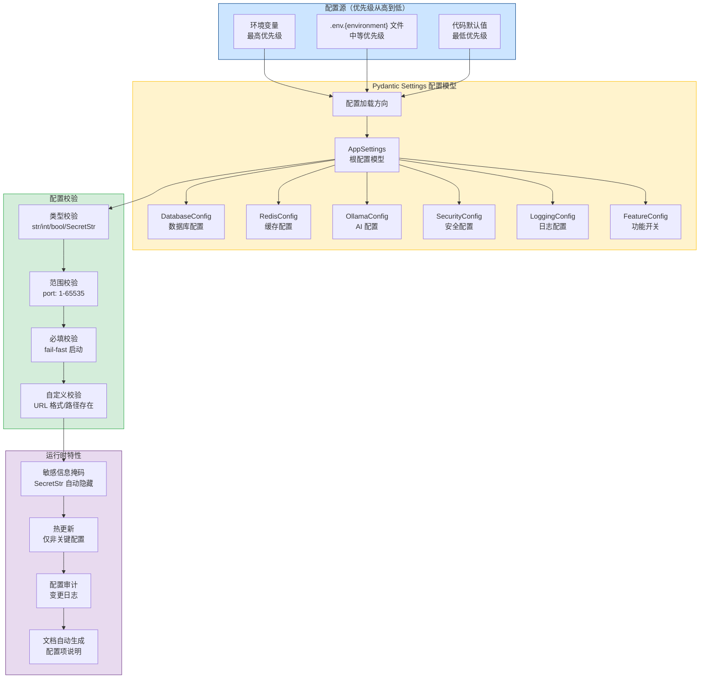
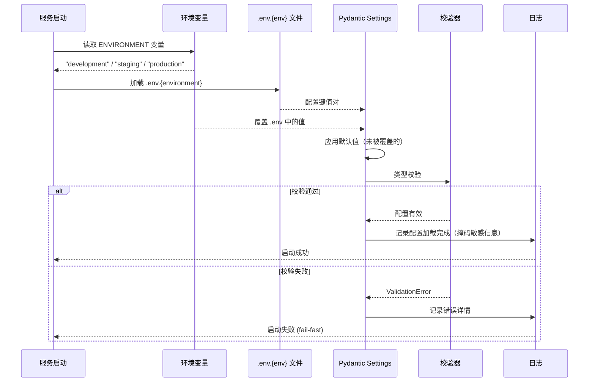
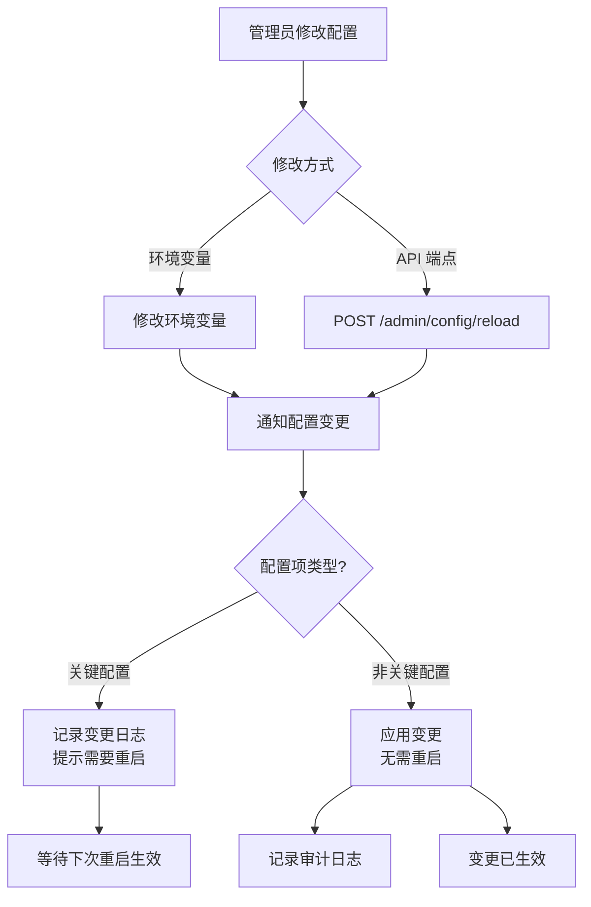
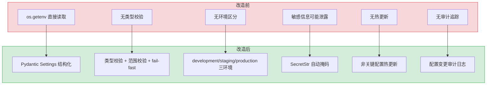

# YA-09-141: 多环境配置管理 — 环境分层 + Pydantic Settings 校验 + 敏感信息保护 + 配置热更新

> 需求编号：YA-09-141 · 优先级：P2 · 人天：0.5d · 状态：需求已编写
> 依赖：无 · 前置需求：无

## 背景

YiAi 当前使用简单的 `settings.py` 文件管理配置，所有配置项通过 `os.getenv` 直接读取，存在以下问题：无环境区分（开发/预发布/生产使用同一套配置逻辑），无配置校验（无效值在运行时才暴露），敏感信息可能被日志输出，配置变更需要重启服务，无配置审计追踪。

**问题：**

1. **无环境区分**：开发、预发布、生产环境使用同一套配置逻辑，切换环境需要手动修改代码或环境变量，容易遗漏导致配置错误。
2. **无配置校验**：使用 `os.getenv` 读取配置，类型转换靠手动，错误配置（如端口设为字符串）在运行时才暴露，排查困难。
3. **敏感信息泄露风险**：数据库密码、API Key 等敏感配置可能被日志输出或在调试信息中暴露。
4. **无配置热更新**：任何配置变更都需要重启服务，影响可用性。
5. **无配置审计**：配置变更无记录，无法追溯谁在何时修改了什么配置。

**影响：**

| 场景 | 影响 | 严重程度 |
|------|------|----------|
| 生产环境使用了开发环境的数据库连接 | 生产数据写入开发数据库，数据混乱 | 高 |
| 配置文件中的端口号被误设为字符串 | 服务启动失败，排查耗时 | 中 |
| 日志中输出了数据库密码 | 安全事件，凭据泄露 | 高 |
| 修改日志级别需要重启服务 | 排查问题时的可用性降低 | 低 |
| 配置被误修改后无法追溯 | 安全审计失败 | 中 |

**挑战：**

- 需要设计清晰的配置源优先级（环境变量 > .env 文件 > 默认值）
- 需要 Pydantic Settings 进行类型校验和范围验证
- 需要敏感信息掩码机制，确保密码等永远不会出现在日志中
- 需要支持非关键配置的热更新（如日志级别、功能开关）
- 需要在启动时 fail-fast（缺少必填配置时立即报错，而非运行时崩溃）

---

## 一、现状分析

### 1.1 当前配置管理状态

| 属性 | 当前值 | 说明 |
|------|--------|------|
| 配置方式 | `os.getenv` + `settings.py` | 简单但缺乏结构化 |
| 环境区分 | 无 | 通过环境变量手动切换 |
| 配置校验 | 无 | 值在运行时使用前手动校验 |
| 敏感信息处理 | 无 | 可能在日志中暴露 |
| 热更新 | 无 | 所有配置变更需重启 |
| 审计追踪 | 无 | 无法追溯配置变更 |
| 配置文档 | 无自动生成 | 需要手动维护 |

### 1.2 当前配置项梳理

| 配置类别 | 配置项 | 当前状态 | 问题 |
|---------|--------|---------|------|
| 数据库 | `mongo_uri` | `os.getenv` | 无校验，可能为空 |
| 服务器 | `host`, `port` | 硬编码 | 无环境区分 |
| 安全 | `secret_key` | `os.getenv` | 无默认值，缺失时静默失败 |
| AI | `ollama_host`, `ollama_model` | `os.getenv` | 无校验 |
| 日志 | `log_level` | 硬编码 `INFO` | 无法热更新 |
| 文件 | `upload_dir` | `os.getenv` | 无默认值 |
| 备份 | `backup_dir` | `os.getenv` | 无默认值 |
| 认证 | `auth_enabled` | `os.getenv` | 字符串 `"true"` 需手动转换 |
| SMTP | `smtp_host`, `smtp_port` | 无 | 邮件功能未实现 |

### 1.3 根因分析矩阵

| 问题 | 根因 | 影响 | 紧急程度 |
|------|------|------|----------|
| 无环境区分 | 项目初期只有开发环境，未考虑多环境部署 | 配置混乱，生产事故风险 | 高 |
| 无配置校验 | 使用 `os.getenv` 直接读取，无类型系统 | 运行时报错，排查困难 | 中 |
| 敏感信息泄露 | 日志配置未排除敏感字段 | 凭据可能泄露 | 高 |
| 无热更新 | 配置加载仅在启动时执行 | 配置变更需重启，影响可用性 | 低 |
| 无审计追踪 | 未设计配置变更记录机制 | 无法追溯配置变更历史 | 中 |

### 1.4 改造前数据流

```
配置加载:
  os.getenv("MONGO_URI") → 字符串 → 直接使用
  os.getenv("API_PORT") → 字符串 → 手动 int()
  os.getenv("DEBUG") → 字符串 "true" → 手动 bool()

问题:
  无类型校验 → 运行时才报错
  无默认值 → 缺失时静默失败
  无掩码 → 日志中可能输出密码
  无环境区分 → 手动切换易出错
```

---

## 二、设计决策

### 决策 1：配置方案 — 当前方案 vs Pydantic Settings vs Dynaconf

| 维度 | 当前方案 (os.getenv) | Pydantic Settings | Dynaconf |
|------|---------------------|-------------------|----------|
| 类型校验 | 无 | 优（Pydantic 原生） | 中（基本类型） |
| 环境分层 | 无 | 通过 `env_prefix` + 嵌套模型 | 原生支持（development/staging/production） |
| 配置源优先级 | 手动实现 | 内置支持（env > file > default） | 内置支持 |
| 敏感信息掩码 | 无 | 通过 `SecretStr` 类型 | 通过 `dynaconf.vault` |
| 学习成本 | 低 | 低（Pydantic 已知） | 中（新库） |
| 依赖 | 无 | 已在 FastAPI 依赖中 | 额外安装 |
| 社区活跃度 | — | 高 | 中 |
| 适合当前场景 | 否 | 是 | 是（过度设计） |

**选择：Pydantic Settings。** YiAi 已经使用 Pydantic 进行数据验证，Pydantic Settings 是 Pydantic 官方扩展，与 FastAPI 深度集成。`SecretStr`、`BaseSettings`、`SettingsConfigDict` 等特性完美满足需求。Dynaconf 功能更丰富但增加了学习成本和依赖，对于 YiAi 当前规模过度。

### 决策 2：配置热更新范围 — 全部配置 vs 仅非关键配置 vs 不热更新

| 维度 | 全部配置 | 仅非关键配置 | 不热更新 |
|------|---------|-------------|----------|
| 实现复杂度 | 高（需要重新初始化连接池等） | 中（区分关键/非关键） | 低 |
| 安全性 | 低（数据库连接等变更风险高） | 高 | 高 |
| 灵活性 | 高 | 中 | 低 |
| 适合当前场景 | 否 | 是 | 否 |

**选择：仅非关键配置支持热更新。** 数据库连接、密钥、服务端口等关键配置变更风险高，需要重启服务以确保组件正确初始化。日志级别、功能开关、速率限制阈值等非关键配置变更风险低，可以热更新以提升运维灵活性。通过 `reloadable: bool` 字段标记每个配置项是否支持热更新。

### 决策 3：环境区分方式 — 单一 .env 文件 vs 多环境文件 vs 环境变量注入

| 维度 | 单一 .env | 多环境文件 (.env.dev/.env.prod) | 环境变量注入 (Docker/K8s) |
|------|----------|-------------------------------|---------------------------|
| 本地开发 | 方便 | 方便 | 不方便 |
| 生产部署 | 容易出错 | 容易出错 | 标准做法 |
| 配置管理 | 简单 | 中 | 依赖容器平台 |
| 安全性 | 低（文件在磁盘） | 低（文件在磁盘） | 高（注入到容器） |
| 适合当前场景 | 否 | 是（开发环境） | 是（生产环境） |

**选择：多环境文件 + 环境变量注入组合。** 开发环境使用 `.env.development`、`.env.staging`、`.env.production` 文件，通过 `ENVIRONMENT` 环境变量选择加载哪个文件。生产环境通过 Docker/K8s 环境变量注入，覆盖 .env 文件中的值。环境变量优先级最高，确保生产环境的安全配置不会被文件中的默认值覆盖。

### 设计决策记录

| 决策 | 选项 A | 选项 B | 选择 | 理由 |
|------|--------|--------|------|------|
| 配置方案 | os.getenv | Pydantic Settings | Pydantic Settings | 类型安全、环境分层、与 FastAPI 深度集成 |
| 热更新范围 | 全部配置 | 仅非关键配置 | 仅非关键配置 | 关键配置变更需要重启确保安全 |
| 环境区分 | 单一 .env | 多环境文件 + 环境变量 | 多环境文件 + 环境变量注入 | 开发灵活，生产安全 |
| 敏感信息处理 | 无 | SecretStr | pydantic.SecretStr | 自动掩码，日志中不暴露 |

---

## 三、目标架构

### 3.1 配置管理架构总览



### 3.2 配置加载流程



### 3.3 配置热更新流程



---

## 四、具体改动

### 4.1 配置模型定义

**文件：** `shared/config.py`（重构）

```python
from enum import Enum
from pathlib import Path
from typing import Optional, Literal
from pydantic import (
    BaseModel, SecretStr, Field, field_validator,
    model_validator, ValidationInfo,
)
from pydantic_settings import BaseSettings, SettingsConfigDict


class Environment(str, Enum):
    """部署环境枚举。"""
    DEVELOPMENT = "development"
    STAGING = "staging"
    PRODUCTION = "production"


# ─── 配置子模型 ────────────────────────────────────────

class DatabaseConfig(BaseModel):
    """数据库配置。"""
    uri: str = Field(default="mongodb://localhost:27017", description="MongoDB 连接 URI")
    name: str = Field(default="yi_ai", description="数据库名称")
    max_pool_size: int = Field(default=50, ge=1, le=500, description="连接池最大连接数")
    min_pool_size: int = Field(default=5, ge=1, le=50, description="连接池最小连接数")
    connect_timeout_ms: int = Field(default=5000, ge=1000, le=30000, description="连接超时（毫秒）")
    server_selection_timeout_ms: int = Field(default=30000, ge=1000, le=60000, description="服务器选择超时")

    @field_validator("uri")
    @classmethod
    def uri_must_start_with_mongodb(cls, v: str) -> str:
        if not v.startswith("mongodb://") and not v.startswith("mongodb+srv://"):
            raise ValueError("MongoDB URI 必须以 mongodb:// 或 mongodb+srv:// 开头")
        return v


class RedisConfig(BaseModel):
    """Redis 配置（可选）。"""
    enabled: bool = Field(default=False, description="是否启用 Redis")
    host: str = Field(default="localhost", description="Redis 主机")
    port: int = Field(default=6379, ge=1, le=65535, description="Redis 端口")
    password: Optional[SecretStr] = Field(default=None, description="Redis 密码")
    db: int = Field(default=0, ge=0, le=15, description="Redis 数据库编号")


class OllamaConfig(BaseModel):
    """Ollama AI 配置。"""
    host: str = Field(default="http://localhost:11434", description="Ollama 服务地址")
    default_model: str = Field(default="qwen2.5:7b", description="默认模型")
    request_timeout: int = Field(default=120, ge=10, le=600, description="请求超时（秒）")
    max_concurrent: int = Field(default=3, ge=1, le=10, description="最大并发推理数")
    keep_alive: str = Field(default="5m", description="模型保持加载时间")


class SecurityConfig(BaseModel):
    """安全配置。"""
    secret_key: SecretStr = Field(description="应用密钥（JWT 签名等）")
    auth_enabled: bool = Field(default=False, description="是否启用认证")
    token_expire_minutes: int = Field(default=1440, ge=15, le=10080, description="Token 过期时间（分钟）")
    cors_origins: list[str] = Field(default=["*"], description="CORS 允许的来源")
    allowed_hosts: list[str] = Field(default=["*"], description="允许的主机名")
    max_request_size_mb: int = Field(default=10, ge=1, le=100, description="最大请求体大小（MB）")


class LoggingConfig(BaseModel):
    """日志配置（支持热更新）。"""
    level: Literal["DEBUG", "INFO", "WARNING", "ERROR", "CRITICAL"] = Field(
        default="INFO", description="日志级别"
    )
    format: str = Field(
        default="%(asctime)s [%(levelname)s] %(name)s: %(message)s",
        description="日志格式",
    )
    json_format: bool = Field(default=False, description="是否使用 JSON 格式输出")
    max_file_size_mb: int = Field(default=50, ge=1, le=500, description="日志文件最大大小")
    retention_days: int = Field(default=30, ge=1, le=365, description="日志保留天数")
    reloadable: bool = Field(default=True, description="是否支持热更新")


class FeatureFlags(BaseModel):
    """功能开关配置（支持热更新）。"""
    enable_rag: bool = Field(default=True, description="是否启用 RAG 检索")
    enable_agent: bool = Field(default=True, description="是否启用 Agent 循环")
    enable_webhook: bool = Field(default=False, description="是否启用 Webhook")
    enable_email: bool = Field(default=False, description="是否启用邮件通知")
    enable_geoip: bool = Field(default=False, description="是否启用 Geo-IP")
    enable_proxy_detection: bool = Field(default=False, description="是否启用代理检测")
    rate_limit_per_minute: int = Field(default=120, ge=1, le=10000, description="全局限流（次/分钟）")
    reloadable: bool = Field(default=True, description="是否支持热更新")


class BackupConfig(BaseModel):
    """备份配置。"""
    local_dir: str = Field(default="./backups/mongodb", description="本地备份目录")
    remote_dir: str = Field(default="/mnt/backup/mongodb", description="远程备份目录")
    local_retention_days: int = Field(default=7, ge=1, le=90, description="本地保留天数")
    remote_retention_days: int = Field(default=30, ge=7, le=365, description="远程保留天数")


class SMTPConfig(BaseModel):
    """SMTP 邮件配置。"""
    host: str = Field(default="localhost", description="SMTP 主机")
    port: int = Field(default=587, ge=1, le=65535, description="SMTP 端口")
    username: Optional[str] = Field(default=None, description="SMTP 用户名")
    password: Optional[SecretStr] = Field(default=None, description="SMTP 密码")
    use_tls: bool = Field(default=True, description="是否使用 TLS")
    from_address: str = Field(default="noreply@yiai.local", description="发件人地址")
    mail_debug: bool = Field(default=False, description="邮件调试模式（不实际发送）")


# ─── 根配置模型 ────────────────────────────────────────

class AppSettings(BaseSettings):
    """应用配置根模型。"""

    model_config = SettingsConfigDict(
        env_file=".env",
        env_file_encoding="utf-8",
        env_nested_delimiter="__",
        case_sensitive=False,
        extra="forbid",  # 禁止未定义的配置项
    )

    # 基础信息
    environment: Environment = Field(
        default=Environment.DEVELOPMENT,
        description="部署环境: development/staging/production",
    )
    app_name: str = Field(default="YiAi", description="应用名称")
    app_version: str = Field(default="1.0.0", description="应用版本")
    host: str = Field(default="0.0.0.0", description="服务监听地址")
    port: int = Field(default=10086, ge=1, le=65535, description="服务监听端口")
    base_url: str = Field(default="http://localhost:10086", description="服务基础 URL")

    # 子配置
    database: DatabaseConfig = Field(default_factory=DatabaseConfig)
    redis: RedisConfig = Field(default_factory=RedisConfig)
    ollama: OllamaConfig = Field(default_factory=OllamaConfig)
    security: SecurityConfig
    logging: LoggingConfig = Field(default_factory=LoggingConfig)
    features: FeatureFlags = Field(default_factory=FeatureFlags)
    backup: BackupConfig = Field(default_factory=BackupConfig)
    smtp: SMTPConfig = Field(default_factory=SMTPConfig)

    @field_validator("environment", mode="before")
    @classmethod
    def validate_environment(cls, v: str) -> str:
        valid = [e.value for e in Environment]
        if v not in valid:
            raise ValueError(f"环境必须是 {valid} 之一，当前值: {v}")
        return v

    @model_validator(mode="after")
    def validate_production_requires_secrets(self) -> "AppSettings":
        if self.environment == Environment.PRODUCTION:
            if self.security.secret_key.get_secret_value() == "changeme":
                raise ValueError("生产环境必须设置 SECRET_KEY，不能使用默认值")
            if self.database.uri == "mongodb://localhost:27017":
                raise ValueError("生产环境必须设置 DATABASE__URI")
        return self

    def get_env_file(self) -> str:
        """根据环境变量 ENVIRONMENT 确定加载的 .env 文件。"""
        import os
        env = os.getenv("ENVIRONMENT", self.environment.value)
        return f".env.{env}"

    def reloadable_config(self) -> dict:
        """获取支持热更新的配置项。"""
        reloadable = {}
        for name, field in self.model_fields.items():
            if isinstance(field.default, BaseModel):
                sub = getattr(self, name)
                if hasattr(sub, "reloadable") and sub.reloadable:
                    reloadable[name] = sub.model_dump()
        return reloadable

    def model_dump_safe(self, **kwargs) -> dict:
        """导出配置（掩码敏感信息）。"""
        data = self.model_dump(**kwargs)
        self._mask_secrets(data)
        return data

    def _mask_secrets(self, data: dict, prefix: str = ""):
        """递归掩码 SecretStr 字段。"""
        for key, value in data.items():
            if isinstance(value, dict):
                self._mask_secrets(value, f"{prefix}{key}.")
            elif isinstance(value, SecretStr):
                data[key] = "********"
            elif key in ("password", "secret_key", "token", "api_key"):
                data[key] = "********" if value else None


# 配置加载函数
def load_settings() -> AppSettings:
    """加载应用配置（fail-fast 模式）。"""
    import os
    env = os.getenv("ENVIRONMENT", "development")
    env_file = f".env.{env}"

    if Path(env_file).exists():
        return AppSettings(_env_file=env_file)
    else:
        # 回退到 .env 或默认值
        return AppSettings()
```

### 4.2 配置热更新服务

**文件：** `services/config/config_service.py`（新建）

```python
import copy
from datetime import datetime, timezone
from typing import Any

from motor.motor_asyncio import AsyncIOMotorDatabase

from shared.config import AppSettings, load_settings
from shared.logging import get_logger

logger = get_logger(__name__)


class ConfigService:
    """配置管理服务。"""

    def __init__(self, db: AsyncIOMotorDatabase, settings: AppSettings):
        self.db = db
        self.settings = settings
        self.audit_col = db.config_audit
        self._reloadable_cache: dict[str, Any] = {}
        self._init_reloadable_cache()

    def _init_reloadable_cache(self):
        """初始化可热更新配置缓存。"""
        self._reloadable_cache = self.settings.reloadable_config()

    async def reload(self, source: str = "api") -> dict:
        """重新加载配置（仅可热更新的部分）。"""
        old_config = copy.deepcopy(self._reloadable_cache)

        # 重新加载配置
        new_settings = load_settings()
        new_reloadable = new_settings.reloadable_config()

        # 记录变更
        changes = []
        for key, new_value in new_reloadable.items():
            if key in old_config and old_config[key] != new_value:
                changes.append({
                    "key": key,
                    "old_value": self._mask_value(old_config[key]),
                    "new_value": self._mask_value(new_value),
                })

        # 应用变更
        self._reloadable_cache = new_reloadable
        # 同步到 settings 对象
        for key, value in new_reloadable.items():
            if hasattr(self.settings, key):
                sub_config = getattr(self.settings, key)
                for k, v in value.items():
                    if hasattr(sub_config, k):
                        setattr(sub_config, k, v)

        # 记录审计日志
        if changes:
            await self.audit_col.insert_one({
                "source": source,
                "changes": changes,
                "timestamp": datetime.now(timezone.utc),
            })
            logger.info(f"[Config] 配置已热更新: {len(changes)} 项变更, source={source}")

        return {
            "reloaded": True,
            "changes": changes,
            "reloadable_keys": list(new_reloadable.keys()),
        }

    async def get_audit_log(self, limit: int = 50) -> list[dict]:
        """获取配置变更审计日志。"""
        cursor = self.audit_col.find().sort("timestamp", -1).limit(limit)
        logs = []
        async for doc in cursor:
            doc["_id"] = str(doc["_id"])
            logs.append(doc)
        return logs

    def get_current_config(self, safe: bool = True) -> dict:
        """获取当前配置（safe=True 时掩码敏感信息）。"""
        if safe:
            return self.settings.model_dump_safe()
        return self.settings.model_dump()

    def _mask_value(self, value: Any) -> str:
        """掩码敏感值。"""
        if isinstance(value, dict):
            return {k: "********" if k in ("password", "secret_key", "token") else v
                    for k, v in value.items()}
        return str(value)[:50]
```

### 4.3 配置管理 API

**文件：** `services/config/config_routes.py`（新建）

```python
from fastapi import APIRouter, Depends
from motor.motor_asyncio import AsyncIOMotorDatabase

from services.config.config_service import ConfigService
from shared.dependencies import get_db, get_settings

router = APIRouter(prefix="/admin/config", tags=["config"])


def get_config_service(
    db: AsyncIOMotorDatabase = Depends(get_db),
    settings = Depends(get_settings),
) -> ConfigService:
    return ConfigService(db, settings)


@router.get("/")
async def get_config(
    safe: bool = True,
    service: ConfigService = Depends(get_config_service),
):
    """获取当前配置。"""
    config = service.get_current_config(safe=safe)
    return {"code": 0, "message": "ok", "data": config}


@router.post("/reload")
async def reload_config(
    service: ConfigService = Depends(get_config_service),
):
    """热更新非关键配置。"""
    result = await service.reload(source="api")
    return {"code": 0, "message": "ok", "data": result}


@router.get("/audit")
async def get_config_audit(
    limit: int = 50,
    service: ConfigService = Depends(get_config_service),
):
    """获取配置变更审计日志。"""
    logs = await service.get_audit_log(limit=limit)
    return {"code": 0, "message": "ok", "data": {"audit_logs": logs}}


@router.get("/reloadable")
async def get_reloadable_keys(
    service: ConfigService = Depends(get_config_service),
):
    """获取支持热更新的配置项列表。"""
    keys = list(service._reloadable_cache.keys())
    return {"code": 0, "message": "ok", "data": {"reloadable_keys": keys}}


@router.get("/docs")
async def generate_config_docs(
    service: ConfigService = Depends(get_config_service),
):
    """自动生成配置文档。"""
    docs = []
    for name, field in service.settings.model_fields.items():
        docs.append({
            "name": name,
            "type": str(field.annotation),
            "default": str(field.default) if field.default else "必填",
            "description": field.description or "无",
            "required": field.is_required(),
        })
    return {"code": 0, "message": "ok", "data": {"config_items": docs}}
```

### 4.4 涉及文件

```
YiAi/src/
├── shared/
│   └── config.py                # 重构: Pydantic Settings 多环境配置模型
├── services/config/
│   ├── __init__.py              # 新建
│   ├── config_service.py        # 新建: 配置热更新 + 审计 + 掩码
│   └── config_routes.py         # 新建: 配置管理 API (查看/重载/审计/文档)
├── .env.development              # 新建: 开发环境配置
├── .env.staging                  # 新建: 预发布环境配置
├── .env.production.example       # 新建: 生产环境配置模板
└── main.py                      # 修改: 使用 load_settings() 初始化，注册 ConfigService
```

---

## 五、实施步骤

| 步骤 | 内容 | 涉及文件 | 验证方式 | 人天 |
|------|------|---------|---------|------|
| 1 | 定义配置子模型（Database/Redis/Ollama/Security/Logging/Features/Backup/SMTP） | `config.py` | 模型实例化正确，类型校验通过 | 0.1 |
| 2 | 定义 AppSettings 根模型 + 配置源优先级 | `config.py` | 环境变量 > .env 文件 > 默认值 | 0.05 |
| 3 | 实现 fail-fast 校验（启动时验证必填配置） | `config.py` | 缺失必填配置时启动失败，错误信息清晰 | 0.05 |
| 4 | 实现敏感信息掩码（SecretStr + model_dump_safe） | `config.py` | 日志中不出现密码等敏感信息 | 0.05 |
| 5 | 创建环境配置文件（.env.development/.env.staging/.env.production.example） | `.env.*` 文件 | 各环境配置可正常加载 | 0.05 |
| 6 | 实现配置热更新服务（仅非关键配置） | `config_service.py` | 日志级别、功能开关等可热更新 | 0.1 |
| 7 | 实现配置审计日志 | `config_service.py` | 配置变更记录到 MongoDB | 0.05 |
| 8 | 实现配置管理 API（查看/重载/审计/文档） | `config_routes.py` | 所有端点可正常调用 | 0.05 |

**总计：0.5d**

---

## 六、性能分析

### 6.1 配置操作性能

| 操作 | 耗时 | 资源消耗 | 说明 |
|------|------|----------|------|
| 配置加载（启动时） | < 10ms | CPU < 1% | Pydantic 解析 + 校验 |
| 配置热更新 | < 5ms | CPU < 1% | 仅重新加载可热更新部分 |
| 配置掩码（model_dump_safe） | < 1ms | CPU < 1% | 递归遍历配置字典 |
| 审计日志写入 | < 5ms | MongoDB IO | 异步写入 |
| 配置文档生成 | < 2ms | CPU < 1% | 遍历 model_fields |

### 6.2 存储预估

| 数据 | 存储量 | 说明 |
|------|--------|------|
| 配置文件 | < 5KB x 3 = 15KB | 3 个环境配置文件 |
| 审计日志 | < 1MB/月 | 每次配置变更约 200 字节 |

---

## 七、测试规格

### Requirement: 配置加载

#### Scenario: 环境变量优先级高于 .env 文件
- **Given** `.env.development` 中 `PORT=10086`，环境变量 `PORT=9999`
- **When** 加载配置
- **Then** `settings.port` 为 `9999`（环境变量优先）

#### Scenario: .env 文件优先级高于默认值
- **Given** 环境变量未设置 `PORT`，`.env.development` 中 `PORT=8888`
- **When** 加载配置
- **Then** `settings.port` 为 `8888`（.env 文件优先于默认值 10086）

#### Scenario: 缺失必填配置时启动失败
- **Given** 未设置 `SECRET_KEY` 环境变量，`.env` 中无此配置
- **When** 加载配置
- **Then** 抛出 `ValidationError`，错误信息包含 `secret_key` 字段
- **And** 服务启动失败，日志输出错误详情

### Requirement: 配置校验

#### Scenario: 端口号超出范围
- **Given** `PORT=99999`（超出 1-65535）
- **When** 加载配置
- **Then** 抛出 `ValidationError`，错误信息包含 `port` 超出范围

#### Scenario: MongoDB URI 格式错误
- **Given** `DATABASE__URI=mysql://localhost:3306`
- **When** 加载配置
- **Then** 抛出 `ValidationError`，错误信息包含 `mongodb://` 要求

### Requirement: 敏感信息保护

#### Scenario: 日志中不输出明文密码
- **Given** `SMTP__PASSWORD=mysecretpassword`
- **When** 调用 `settings.model_dump_safe()` 获取配置
- **Then** `smtp.password` 显示为 `********`
- **And** 日志中不出现 `mysecretpassword`

### Requirement: 配置热更新

#### Scenario: 日志级别支持热更新
- **Given** 当前日志级别为 `INFO`
- **When** 修改环境变量 `LOGGING__LEVEL=DEBUG` 并调用 `POST /admin/config/reload`
- **Then** 日志级别立即变为 `DEBUG`
- **And** 无需重启服务

#### Scenario: 数据库连接不支持热更新
- **Given** 修改环境变量 `DATABASE__URI=mongodb://new-host:27017`
- **When** 调用 `POST /admin/config/reload`
- **Then** 审计日志记录变更，但提示需要重启服务才能生效

### Requirement: 配置审计

#### Scenario: 配置变更记录到审计日志
- **Given** 管理员修改了日志级别和功能开关
- **When** 调用 `POST /admin/config/reload`
- **Then** 审计日志记录变更项、变更前后的值（掩码敏感信息）、变更来源和时间
- **And** 可通过 `GET /admin/config/audit` 查询

---

## 八、风险与缓解

| 风险 | 概率 | 影响 | 等级 | 缓解措施 | 应急预案 |
|------|------|------|------|----------|----------|
| 生产环境 secret_key 使用默认值 | 中 | 高 | 高 | 生产环境启动时校验 `secret_key != "changeme"`，使用默认值则拒绝启动 | 立即生成新密钥，轮换所有 Token |
| 配置文件被误提交到代码仓库 | 中 | 高 | 高 | `.env.production` 加入 `.gitignore`，仅提交 `.env.production.example` 模板 | 轮换所有泄露的凭据，清理 Git 历史 |
| 热更新引入错误配置导致服务异常 | 低 | 中 | 中 | 热更新前校验配置值，无效值拒绝更新 | 回滚到上一份配置，审计日志记录 |
| Pydantic Settings 与现有 `os.getenv` 调用冲突 | 中 | 中 | 中 | 迁移期间支持双模式（新旧配置共存），逐步替换 | 回退到旧配置方式，分阶段迁移 |
| 配置模型字段过多影响启动速度 | 低 | 低 | 低 | Pydantic v2 解析性能优秀，50 个字段 < 10ms | 无影响 |

---

## 九、回滚策略

| 场景 | 回滚方式 | 回滚时间 | 风险 |
|------|---------|---------|------|
| 新配置模型有 bug | 回退到旧 `settings.py` 代码 | < 5min | 低：配置文件不变，仅代码回滚 |
| 热更新导致服务异常 | 调用 `POST /admin/config/reload` 重新加载原始配置 | < 1min | 低：热更新即时生效 |
| .env 文件配置错误 | 修正 .env 文件 + 热更新 | < 1min | 低：非关键配置即时生效 |
| 生产环境配置错误导致启动失败 | 修正环境变量 + 重启服务 | < 2min | 中：重启期间服务短暂不可用 |

---

## 十、设计决策记录

### D-01: 为什么使用 Pydantic Settings 而非继续使用 os.getenv？

`os.getenv` 存在的问题：无类型校验（端口可能是字符串）、无默认值管理（每个配置项都要手动写 `or default`）、无结构化配置（所有配置项平铺）、无敏感信息保护。Pydantic Settings 通过类型注解自动校验，`SecretStr` 自动掩码，嵌套模型结构化配置，`SettingsConfigDict` 统一管理配置源优先级。迁移成本低（替换 `os.getenv` 调用），收益高（类型安全 + 启动校验）。

### D-02: 为什么区分关键配置和非关键配置？

关键配置（数据库连接、密钥、端口）变更需要重新初始化连接池、重新加载密钥等，在运行时安全地执行这些操作非常复杂（如数据库连接切换需要优雅关闭旧连接池、创建新连接池、等待旧连接归还）。非关键配置（日志级别、功能开关、限流阈值）变更只需更新内存中的值，实现简单且安全。这种区分避免过度设计，同时保持必要的灵活性。

### D-03: 为什么生产环境使用环境变量注入而非 .env 文件？

.env 文件存储在磁盘上，存在以下风险：1) 可能被误提交到代码仓库；2) 容器重启后可能丢失（如果未挂载）；3) 权限管理困难。Docker/K8s 环境变量注入（Secrets）是生产环境的标准做法，凭据加密存储，运行时注入，不落盘。K8s Secrets 支持自动轮换，审计日志完整。

### D-04: 为什么使用 `env_nested_delimiter="__"` 而非扁平配置？

Pydantic Settings 默认将配置项平铺（如 `database_uri`），但嵌套配置模型（如 `database.uri`）更清晰。`env_nested_delimiter="__"` 允许使用 `DATABASE__URI=mongodb://...` 格式的环境变量，自动映射到 `settings.database.uri`。这样既保持了环境变量的简洁性，又实现了配置的结构化。

---

## 十一、当前架构 vs 目标架构

### 改造前后对比



### 架构决策权衡

| 维度 | 改造前 | 改造后 | 权衡说明 |
|------|--------|--------|----------|
| 类型安全 | 无（运行时手动转换） | 编译时类型校验 + fail-fast | 启动时发现问题，而非运行时崩溃 |
| 环境管理 | 手动切换环境变量 | 自动加载对应环境配置 | 减少人为错误 |
| 安全性 | 敏感信息可能在日志中暴露 | SecretStr 自动掩码 | 即使日志泄露也不暴露凭据 |
| 运维灵活性 | 配置变更需重启 | 非关键配置热更新 | 日志级别调整等无需重启 |
| 可追溯性 | 无 | 配置变更审计日志 | 可追溯每次配置变更 |

---

## 十二、代码审查检查清单

- [ ] `AppSettings` 继承 `BaseSettings`，配置 `env_nested_delimiter="__"`
- [ ] 所有配置子模型使用 Pydantic `BaseModel`，字段有 `Field(description=...)` 说明
- [ ] `DatabaseConfig.uri` 校验以 `mongodb://` 或 `mongodb+srv://` 开头
- [ ] 端口类字段使用 `ge=1, le=65535` 范围校验
- [ ] 所有密码/密钥字段使用 `SecretStr` 类型
- [ ] `model_dump_safe` 方法递归掩码所有 `SecretStr` 字段
- [ ] 启动时根据 `ENVIRONMENT` 环境变量加载对应 `.env.{env}` 文件
- [ ] 生产环境额外校验：`secret_key != "changeme"`，`database.uri` 非默认值
- [ ] `extra="forbid"` 禁止未定义的配置项
- [ ] 配置加载失败时服务拒绝启动（fail-fast），日志输出清晰错误信息
- [ ] `ConfigService` 支持 `reload()` 热更新非关键配置
- [ ] 配置变更记录到 MongoDB `config_audit` 集合
- [ ] 配置管理 API 仅内网 IP 可访问（复用 IP 白名单中间件）
- [ ] `.env.production` 加入 `.gitignore`，仅提交 `.env.production.example` 模板
- [ ] 配置文档 API 自动生成所有配置项说明
- [ ] `ruff` 代码规范通过
- [ ] `mypy` 类型检查通过

---

## 十三、回归问题预测

| # | 问题 | 发现场景 | 根因 | 修复方式 |
|---|------|---------|------|---------|
| 1 | Pydantic Settings 的 `env_nested_delimiter="__"` 与某些环境变量名中的双下划线冲突，导致配置解析错误 | 配置项 `DATABASE__URI` 作为环境变量名，但某些 shell 或 CI 系统对双下划线有特殊处理 | shell 变量名中双下划线是合法的，但部分 CI 系统（如 GitHub Actions）的环境变量名转换规则可能将 `__` 处理为单下划线 | 使用 `env_prefix="YIAI_"` 前缀，配置项改为 `YIAI_DATABASE__URI`，减少与其他环境变量冲突的可能 |
| 2 | `SecretStr` 在 `model_dump_safe` 中被替换为 `"********"`，但 Python 日志的 `__repr__` 可能仍会输出原始值 | 日志中使用 `logger.info(f"Config: {settings}")` 时，`BaseModel.__repr__` 可能在 `model_dump_safe` 之前被调用 | `SecretStr.__repr__` 已返回 `"********"`，但 `BaseModel.__repr__` 调用的是 `model_dump` 而非 `model_dump_safe` | 重写 `AppSettings.__repr__` 方法，调用 `model_dump_safe()` 返回安全表示；或使用 `logger.info(f"Config: {settings.model_dump_safe()}")` |
| 3 | 配置热更新时，`FeatureFlags` 中的 `enable_rag=False` 仅更新了内存值，但已初始化的 RAG 引擎未停止，继续在后台运行 | 热更新将 `enable_rag` 从 `True` 改为 `False`，但 RAG 引擎的生命周期由 `main.py` 中的 `startup` 事件管理，未监听配置变更 | `ConfigService.reload()` 只更新了 `self.settings.features.enable_rag` 的值，未触发 RAG 引擎的停止/重启逻辑 | 在 `ConfigService.reload()` 中添加回调机制，配置变更后触发对应的组件的 `on_config_change` 回调，RAG 引擎注册回调以响应 `enable_rag` 变更 |
| 4 | `.env.development` 和 `.env.production` 中配置项数量不一致，Pydantic 的 `extra="forbid"` 导致未定义项被拒绝 | 开发环境在 `.env.development` 中添加了临时配置项，但在生产环境的 `.env.production` 中没有，启动时报错 | `extra="forbid"` 模式禁止模型中未定义的配置项，如果 .env 文件中有额外配置项，Pydantic 会抛出 `ExtraForbidden` 错误 | 将 `extra="forbid"` 改为 `extra="ignore"`（仅忽略未定义项），生产环境启动时打印 WARNING 日志列出未使用的配置项 |
| 5 | 配置审计日志中 `changes` 数组记录了所有变更的 `old_value` 和 `new_value`，但 `_mask_value` 仅掩码了已知的敏感字段，其他敏感字段仍可能暴露 | 审计日志中记录了 `rate_limit_per_minute` 从 `120` 变为 `60`，但同时也记录了某个自定义字段的值，该字段名未被 `_mask_value` 识别 | `_mask_value` 的敏感字段列表 `["password", "secret_key", "token"]` 是硬编码的，新增配置项时可能遗漏 | 使用配置项的 `json_schema_extra` 元数据标记敏感字段：`Field(json_schema_extra={"sensitive": True})`，`_mask_value` 检查元数据而非硬编码列表 |
| 6 | 服务启动时加载 `.env.{environment}` 文件，但容器化部署时配置文件可能不在容器内，启动失败 | Docker 容器中 `ENVIRONMENT=production` 但 `.env.production` 未挂载到容器中，启动时 `Path(env_file).exists()` 返回 False，回退到默认值 | 容器化部署通常通过环境变量注入配置，不依赖 .env 文件，但 `load_settings` 尝试加载文件 | 修改 `load_settings`：如果 `ENVIRONMENT` 环境变量已设置，且 `.env.{environment}` 不存在，不报错，继续使用环境变量 + 默认值；仅当 `ENVIRONMENT` 未设置且 `.env` 不存在时才报错 |

---

## 十四、可观测性

### 关键指标

| 指标 | 采集方式 | 告警阈值 | 说明 |
|------|---------|---------|------|
| 配置加载失败 | 启动时 `ValidationError` 计数 | > 0 | 配置错误导致启动失败 |
| 配置热更新次数 | 统计 `POST /admin/config/reload` 调用 | > 10 次/小时 | 频繁热更新可能说明配置不稳定 |
| 配置变更审计日志量 | 统计 `config_audit` 集合文档数 | > 100 条/天 | 异常频繁的配置变更 |
| 敏感信息泄露尝试 | 日志中扫描 `SecretStr` 明文 | > 0 | 代码中可能错误地打印了敏感信息 |

### 日志规范

| 日志级别 | 场景 | 示例 |
|---------|------|------|
| `INFO` | 配置加载成功、热更新完成 | `[Config] 配置已加载: environment=production, port=10086` |
| `WARN` | 配置项使用默认值 | `[Config] SECRET_KEY 使用默认值，生产环境应设置` |
| `ERROR` | 配置加载失败 | `[Config] 配置校验失败: port 值 99999 超出范围 1-65535` |

### 告警规则

| 告警名称 | 条件 | 通知渠道 | 处理建议 |
|---------|------|---------|---------|
| 配置加载失败 | 服务启动失败 | 企业微信 | 检查配置项，修正错误值 |
| 生产环境使用默认密钥 | `environment=production` 且 `secret_key=changeme` | 企业微信 | 立即设置生产环境 SECRET_KEY |
| 配置热更新频繁 | 1 小时内 > 10 次热更新 | 企业微信 | 检查是否存在配置摆动 |

---

*PRD 来源: `projects/yiai/requirements/2026-09/00-需求-需求总览.md`*

## 影响范围

- **影响模块**：待补充
- **涉及文件**：
- `config.py`
- `settings.py`
- `config_routes.py`
- `config_service.py`
- `main.py`
- **是否影响 API 契约**：否
- **是否影响其他项目（YiVad/YiPet）**：否
- **用户感知**：待确认

## 预防措施

| 层面 | 措施 |
|------|------|
| 代码 | 在相关函数中添加参数校验和边界检查 |
| 测试 | 为 `config.py` 添加单元测试 |
| 流程 | 代码审查时重点检查此类模式 |
| 监控 | 添加日志告警，异常发生时及时发现 |
| 文档 | 在编码规范中记录此类反模式 |

## 经验教训

1. **根本原因**：开发过程中对边界情况和异常路径的考虑不足是此类问题的共同根因
2. **设计阶段**：在接口设计和模块实现时，应主动考虑异常输入、空值、超时等边界场景
3. **代码审查**：审查时应检查是否存在类似的反模式（如未捕获异常、无超时控制、缺少参数校验等）
4. **测试覆盖**：异常路径的测试覆盖率应与正常路径同等重视
5. **团队分享**：此类问题应在团队周会或技术分享中讨论，形成团队共识
