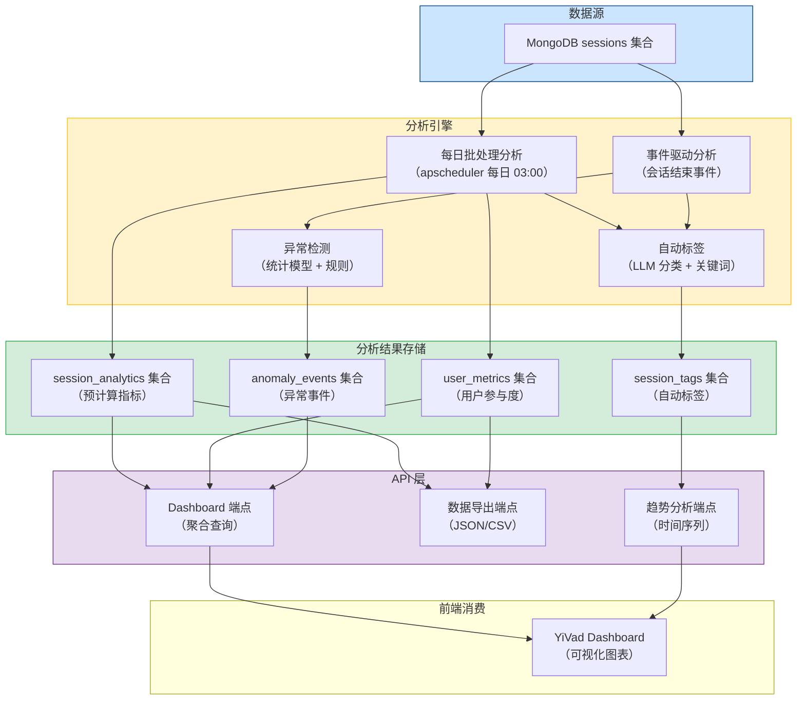
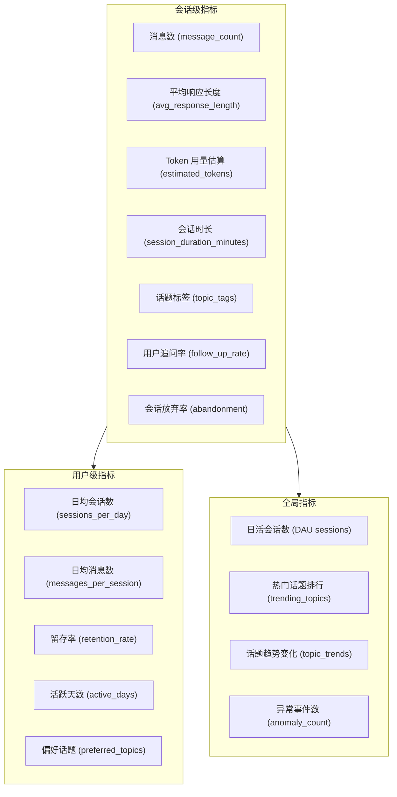

# YA-09-143: Session 分析与洞察 — 会话分析 + 自动标签 + 用户参与度 + 异常检测 + 数据导出

> 需求编号：YA-09-143 · 优先级：P2 · 人天：0.5d · 状态：需求已编写
> 依赖：无 · 前置需求：无

## 背景

YiAi 作为 AI 服务平台，每天产生大量聊天会话数据。这些数据蕴含着丰富的用户行为洞察和产品改进方向，但当前缺乏系统化的分析能力。

**问题：**

1. **无会话分析**：无法了解用户的对话模式（消息数、会话时长、话题分布），产品决策缺乏数据支撑。
2. **无自动标签**：会话分类完全依赖用户手动标签，标签覆盖率低，难以按主题检索和分析。
3. **无参与度指标**：无法衡量用户活跃度（日活会话数、消息数、留存率），运营效果无法评估。
4. **无质量评估**：无法判断会话质量（用户满意度），无法识别 AI 回答不佳的会话。
5. **无异常检测**：无法发现异常使用模式（滥用、批量请求），安全风险不可见。
6. **无数据导出**：分析数据无法导出供外部 BI 工具使用，数据利用效率低。

**影响：**

- 产品迭代方向凭直觉而非数据驱动
- 用户流失无法提前预警
- 异常使用行为无法及时发现和处理
- 无法向管理层展示产品价值（缺乏数据报表）

**挑战：**

- 分析计算不能影响核心业务性能（异步处理）
- 隐私保护：用户级分析数据需匿名化处理
- 自动标签准确率需达到可用水平（> 70%）
- 分析结果需要支持 YiVad 前端的 Dashboard 可视化

---

## 一、现状分析

### 1.1 当前数据分析状态

| 属性 | 当前值 | 说明 |
|------|--------|------|
| 会话分析 | 无 | 无任何会话维度的统计分析 |
| 会话标签 | 手动 | 仅用户手动添加标签，覆盖率 < 5% |
| 用户参与度 | 无 | 无活跃度、留存率等指标 |
| 话题分析 | 无 | 无话题识别和趋势分析 |
| 异常检测 | 无 | 无异常会话模式检测 |
| 数据导出 | 无 | 无分析数据导出功能 |
| 前端 Dashboard | 无 | YiVad 无数据分析展示页面 |

### 1.2 根因分析矩阵

| 问题 | 根因 | 影响 | 紧急程度 |
|------|------|------|----------|
| 无会话分析 | 项目初期聚焦功能开发，未考虑数据分析 | 产品决策缺乏数据支撑 | 中 |
| 无自动标签 | 标签功能未与 NLP 能力结合 | 会话检索效率低 | 中 |
| 无参与度指标 | 未定义用户行为指标体系 | 无法评估运营效果 | 中 |
| 无异常检测 | 未考虑安全和滥用场景 | 异常行为不可见 | 中 |
| 无数据导出 | 未考虑外部 BI 集成需求 | 数据分析效率低 | 低 |

### 1.3 会话数据现状

| 字段 | 数据类型 | 可用性 | 说明 |
|------|---------|--------|------|
| `key` | string | 可用 | 会话唯一标识 |
| `messages` | array | 可用 | 消息列表，含 role 和 content |
| `title` | string | 部分可用 | 用户手动设置标题 |
| `tags` | array | 部分可用 | 用户手动标签，覆盖率低 |
| `created_at` | datetime | 可用 | 会话创建时间 |
| `updated_at` | datetime | 可用 | 最后更新时间 |
| `user_id` | string | 可用 | 用户标识 |

### 1.4 改造前数据流

```
会话数据 (MongoDB sessions)
  └── 仅 CRUD 操作（创建、读取、更新、删除）
  └── 无分析计算
  └── 无聚合统计
  └── 无自动标签

数据价值:
  原始数据 → 未加工 → 无法洞察 → 决策缺乏依据
```

---

## 二、设计决策

### 决策 1：分析计算时机 — 实时 vs 定时批处理 vs 事件驱动

| 维度 | 实时（每次消息更新） | 定时批处理（每小时/每日） | 事件驱动（触发器） |
|------|---------------------|--------------------------|-------------------|
| 数据新鲜度 | 高（秒级） | 中（小时/天级） | 高（近实时） |
| 对核心业务影响 | 高（每次请求增加计算） | 低（独立计算） | 中（事件处理开销） |
| 实现复杂度 | 低 | 中 | 中 |
| 资源消耗 | 中（累积） | 低（批量处理） | 中 |

**选择：定时批处理（每日） + 事件驱动（会话结束）。** 每日凌晨执行全量分析计算（消息数、Token 估算、话题分布），会话结束时触发增量分析（会话时长、标签）。批处理避免影响核心业务性能，事件驱动保证标签等信息的及时性。

### 决策 2：自动标签方案 — 基于关键词 vs 基于 LLM vs 基于向量聚类

| 维度 | 关键词匹配 | LLM 分类 | 向量聚类 |
|------|-----------|----------|---------|
| 准确率 | 低（60%） | 高（85%+） | 中（75%） |
| 延迟 | 低（< 10ms） | 中（100-500ms） | 中（50-200ms） |
| 资源消耗 | 低 | 中 | 中 |
| 覆盖范围 | 窄（仅预定义标签） | 广（开放标签） | 广（自动聚类） |
| 实现复杂度 | 低 | 中 | 中 |

**选择：LLM 分类 + 关键词匹配辅助。** 使用轻量级 Ollama 模型对会话内容进行分类，生成预定义标签列表中的标签。关键词匹配作为快速预筛选，命中明显关键词的会话直接标记。LLM 分类在会话结束时异步执行，不影响用户体验。

### 决策 3：隐私保护策略

| 方案 | 描述 | 优点 | 缺点 |
|------|------|------|------|
| 完全匿名化 | 所有分析数据不关联 user_id | 隐私安全最高 | 无法做用户级分析 |
| 可选匿名化 | 默认匿名，用户可开启用户级分析 | 平衡隐私与功能 | 实现复杂度高 |
| 伪匿名化 | 使用哈希 user_id 替代明文 | 可做用户级分析，不可逆推 | 仍可关联用户行为 |

**选择：伪匿名化（user_id 哈希）+ 可选择加入用户级分析。** 默认所有分析数据使用 `hash(user_id)` 作为标识符，保留用户级分析能力但不可逆推。用户可主动选择加入详细分析（opt-in），同意后使用原始 user_id 关联。

### 设计决策记录

| 决策 | 选项 A | 选项 B | 选择 | 理由 |
|------|--------|--------|------|------|
| 计算时机 | 实时 | 定时批处理 | 定时批处理 + 事件驱动 | 不影响核心业务，标签及时性有保障 |
| 自动标签 | 关键词 | LLM 分类 | LLM 分类 + 关键词 | 准确率高，覆盖广 |
| 隐私策略 | 完全匿名 | 伪匿名化 | 伪匿名化 + opt-in | 保留分析能力，隐私可控 |
| 数据导出 | 仅 JSON | JSON + CSV | JSON + CSV | 兼容主流 BI 工具 |

---

## 三、目标架构

### 3.1 分析架构总览



### 3.2 分析指标体系



---

## 四、具体改动

### 4.1 会话分析服务核心实现

**文件：** `services/analytics/session_analytics.py`（新建）

```python
import asyncio
import hashlib
from datetime import datetime, timedelta
from collections import Counter
from dataclasses import dataclass, field
from typing import Optional

from shared.config import settings
from shared.logging import get_logger

logger = get_logger(__name__)


@dataclass
class SessionMetrics:
    """会话级指标。"""
    session_key: str
    user_id_hash: str
    message_count: int = 0
    user_message_count: int = 0
    assistant_message_count: int = 0
    avg_user_message_length: float = 0.0
    avg_assistant_response_length: float = 0.0
    estimated_input_tokens: int = 0
    estimated_output_tokens: int = 0
    session_duration_minutes: float = 0.0
    first_message_at: Optional[datetime] = None
    last_message_at: Optional[datetime] = None
    topic_tags: list[str] = field(default_factory=list)
    follow_up_rate: float = 0.0
    rephrase_count: int = 0
    is_abandoned: bool = False
    quality_score: float = 0.0
    analyzed_at: str = field(default_factory=lambda: datetime.now().isoformat())


@dataclass
class UserMetrics:
    """用户级指标。"""
    user_id_hash: str
    total_sessions: int = 0
    sessions_per_day: float = 0.0
    avg_messages_per_session: float = 0.0
    avg_session_duration_minutes: float = 0.0
    active_days: int = 0
    retention_7d: bool = False
    retention_30d: bool = False
    preferred_topics: list[str] = field(default_factory=list)
    last_active_at: Optional[datetime] = None
    analyzed_at: str = field(default_factory=lambda: datetime.now().isoformat())


class SessionAnalyticsService:
    """会话分析与洞察服务。"""

    # 预定义话题标签列表
    TOPIC_TAGS = [
        "技术开发", "产品设计", "数据分析", "人工智能",
        "项目管理", "学习辅导", "创意写作", "日常闲聊",
        "问题排查", "知识查询", "文档生成", "代码审查",
        "翻译校对", "内容总结", "头脑风暴", "其他",
    ]

    def __init__(self):
        self.anonymize = settings.analytics_anonymize or True

    async def analyze_session(self, session: dict) -> SessionMetrics:
        """分析单个会话的指标。"""
        messages = session.get("messages", [])
        if not messages:
            return SessionMetrics(
                session_key=session.get("key", ""),
                user_id_hash=self._hash_user_id(session.get("user_id", "")),
            )

        # 分类消息
        user_msgs = [m for m in messages if m.get("role") == "user"]
        assistant_msgs = [m for m in messages if m.get("role") == "assistant"]

        # 基础指标
        message_count = len(messages)
        user_count = len(user_msgs)
        assistant_count = len(assistant_msgs)

        # 平均长度
        avg_user_len = sum(len(m.get("content", "")) for m in user_msgs) / max(user_count, 1)
        avg_asst_len = sum(len(m.get("content", "")) for m in assistant_msgs) / max(assistant_count, 1)

        # Token 估算（中文约 1.5 字符/token，英文约 4 字符/token）
        total_user_chars = sum(len(m.get("content", "")) for m in user_msgs)
        total_asst_chars = sum(len(m.get("content", "")) for m in assistant_msgs)
        estimated_input_tokens = int(total_user_chars / 2.0)
        estimated_output_tokens = int(total_asst_chars / 2.0)

        # 会话时长
        timestamps = [m.get("timestamp") for m in messages if m.get("timestamp")]
        session_duration = 0.0
        first_at = None
        last_at = None
        if len(timestamps) >= 2:
            first_at = min(timestamps)
            last_at = max(timestamps)
            if isinstance(first_at, str):
                first_at = datetime.fromisoformat(first_at.replace("Z", "+00:00"))
            if isinstance(last_at, str):
                last_at = datetime.fromisoformat(last_at.replace("Z", "+00:00"))
            session_duration = (last_at - first_at).total_seconds() / 60.0

        # 追问率（用户连续发多条消息）
        follow_up_count = 0
        for i in range(1, len(messages)):
            if messages[i].get("role") == "user" and messages[i-1].get("role") == "user":
                follow_up_count += 1
        follow_up_rate = follow_up_count / max(user_count, 1)

        # 重新表述次数（用户消息包含"不对"、"重新"、"换一种"等）
        rephrase_keywords = ["不对", "重新", "换一种", "不是这个", "再试", "换个方式", "重来", "修正"]
        rephrase_count = sum(
            1 for m in user_msgs
            if any(kw in m.get("content", "") for kw in rephrase_keywords)
        )

        # 会话是否被放弃（最后一条是用户消息，且超过 5 分钟未回复）
        is_abandoned = False
        if messages and messages[-1].get("role") == "user":
            is_abandoned = True

        # 质量评分（基于追问率、重新表述次数、是否放弃）
        quality_score = 1.0
        quality_score -= follow_up_rate * 0.3
        quality_score -= min(rephrase_count * 0.1, 0.3)
        if is_abandoned:
            quality_score -= 0.3
        quality_score = max(0.0, min(1.0, quality_score))

        return SessionMetrics(
            session_key=session.get("key", ""),
            user_id_hash=self._hash_user_id(session.get("user_id", "")),
            message_count=message_count,
            user_message_count=user_count,
            assistant_message_count=assistant_count,
            avg_user_message_length=round(avg_user_len, 1),
            avg_assistant_response_length=round(avg_asst_len, 1),
            estimated_input_tokens=estimated_input_tokens,
            estimated_output_tokens=estimated_output_tokens,
            session_duration_minutes=round(session_duration, 1),
            first_message_at=first_at,
            last_message_at=last_at,
            follow_up_rate=round(follow_up_rate, 2),
            rephrase_count=rephrase_count,
            is_abandoned=is_abandoned,
            quality_score=round(quality_score, 2),
        )

    async def auto_tag_session(self, session: dict, metrics: SessionMetrics) -> list[str]:
        """自动为会话打标签。"""
        messages = session.get("messages", [])
        user_content = " ".join([
            m.get("content", "") for m in messages
            if m.get("role") == "user"
        ])[:2000]

        if not user_content.strip():
            return ["其他"]

        # 阶段 1：关键词匹配快速打标
        keyword_tags = self._keyword_tagging(user_content)
        if keyword_tags:
            return keyword_tags

        # 阶段 2：LLM 分类
        llm_tags = await self._llm_tagging(user_content)
        return llm_tags if llm_tags else ["其他"]

    def _keyword_tagging(self, content: str) -> list[str]:
        """基于关键词的快速标签匹配。"""
        keyword_map = {
            "技术开发": ["代码", "编程", "bug", "函数", "API", "接口", "算法", "框架", "部署", "Docker"],
            "产品设计": ["产品", "设计", "用户体验", "PRD", "原型", "需求", "功能"],
            "数据分析": ["数据", "分析", "统计", "报表", "图表", "趋势", "指标"],
            "人工智能": ["AI", "模型", "训练", "机器学习", "深度学习", "LLM", "GPT", "神经网络"],
            "项目管理": ["项目", "进度", "任务", "甘特图", "里程碑", "敏捷", "Sprint"],
            "学习辅导": ["学习", "教程", "考试", "题目", "解释", "概念", "怎么样才能"],
            "创意写作": ["写", "故事", "文案", "文章", "诗歌", "小说", "剧本"],
            "代码审查": ["review", "审查", "检查", "这段代码", "优化", "重构"],
            "翻译校对": ["翻译", "英文", "翻译成", "translate", "校对"],
            "内容总结": ["总结", "概括", "摘要", "归纳", "提炼"],
            "问题排查": ["报错", "错误", "失败", "不工作", "怎么回事", "为什么", "排查"],
            "文档生成": ["文档", "README", "手册", "说明", "生成文档"],
        }

        matched = []
        content_lower = content.lower()
        for tag, keywords in keyword_map.items():
            score = sum(1 for kw in keywords if kw.lower() in content_lower)
            if score >= 2:
                matched.append(tag)

        return matched[:3] if matched else []

    async def _llm_tagging(self, content: str) -> list[str]:
        """使用 LLM 进行话题分类。"""
        try:
            tags_str = "\n".join([f"- {t}" for t in self.TOPIC_TAGS])
            prompt = f"""你是一个会话话题分类专家。请根据以下用户消息，选择最匹配的话题标签（最多 3 个）。

可用标签：
{tags_str}

请只返回 JSON 数组格式，例如：["技术开发", "人工智能"]

用户消息：
{content[:1500]}
"""

            from shared.ollama_client import ollama_client
            response = await ollama_client.generate(
                model=settings.analytics_tagging_model or "qwen2.5:0.5b",
                prompt=prompt,
                options={"temperature": 0.0, "num_predict": 128},
            )

            import json
            json_start = response.find("[")
            json_end = response.rfind("]") + 1
            if json_start >= 0 and json_end > json_start:
                tags = json.loads(response[json_start:json_end])
                valid_tags = [t for t in tags if t in self.TOPIC_TAGS]
                return valid_tags[:3] if valid_tags else ["其他"]

        except Exception as e:
            logger.error(f"[Analytics] LLM 标签分类失败: {e}")

        return ["其他"]

    async def compute_user_metrics(
        self, user_id_hash: str, sessions_metrics: list[SessionMetrics]
    ) -> UserMetrics:
        """计算用户级参与度指标。"""
        if not sessions_metrics:
            return UserMetrics(user_id_hash=user_id_hash)

        total = len(sessions_metrics)
        avg_msgs = sum(s.message_count for s in sessions_metrics) / max(total, 1)
        avg_duration = sum(s.session_duration_minutes for s in sessions_metrics) / max(total, 1)

        # 活跃天数
        active_dates = set()
        for s in sessions_metrics:
            if s.first_message_at:
                active_dates.add(s.first_message_at.date())
        active_days = len(active_dates)

        # 日均会话数
        if active_days > 0:
            sessions_per_day = total / active_days
        else:
            sessions_per_day = 0.0

        # 留存率：最近 7 天和 30 天是否有活动
        now = datetime.now()
        retention_7d = any(
            s.last_message_at and (now - s.last_message_at).days <= 7
            for s in sessions_metrics
        )
        retention_30d = any(
            s.last_message_at and (now - s.last_message_at).days <= 30
            for s in sessions_metrics
        )

        # 偏好话题（所有会话标签的统计）
        all_tags = []
        for s in sessions_metrics:
            all_tags.extend(s.topic_tags)
        tag_counter = Counter(all_tags)
        preferred_topics = [tag for tag, _ in tag_counter.most_common(5)]

        last_active = max(
            (s.last_message_at for s in sessions_metrics if s.last_message_at),
            default=None,
        )

        return UserMetrics(
            user_id_hash=user_id_hash,
            total_sessions=total,
            sessions_per_day=round(sessions_per_day, 2),
            avg_messages_per_session=round(avg_msgs, 1),
            avg_session_duration_minutes=round(avg_duration, 1),
            active_days=active_days,
            retention_7d=retention_7d,
            retention_30d=retention_30d,
            preferred_topics=preferred_topics,
            last_active_at=last_active,
        )

    async def detect_anomalies(self, session: dict, metrics: SessionMetrics) -> list[dict]:
        """检测异常会话模式。"""
        anomalies = []

        # 规则 1：极短会话（1 条消息即放弃）
        if metrics.message_count <= 1 and metrics.is_abandoned:
            anomalies.append({
                "type": "ultra_short_session",
                "severity": "low",
                "description": "单条消息即放弃的会话",
                "session_key": session.get("key"),
            })

        # 规则 2：超高消息数（可能的滥用）
        if metrics.message_count > 100:
            anomalies.append({
                "type": "high_message_count",
                "severity": "medium",
                "description": f"消息数异常高: {metrics.message_count}",
                "session_key": session.get("key"),
            })

        # 规则 3：极短响应间隔（可能的自动化脚本）
        if metrics.session_duration_minutes > 0:
            msg_per_minute = metrics.message_count / metrics.session_duration_minutes
            if msg_per_minute > 20:
                anomalies.append({
                    "type": "rapid_fire",
                    "severity": "high",
                    "description": f"消息速率异常: {msg_per_minute:.1f} 条/分钟",
                    "session_key": session.get("key"),
                })

        # 规则 4：重复内容（可能的 DoS 攻击）
        messages = session.get("messages", [])
        user_contents = [m.get("content", "") for m in messages if m.get("role") == "user"]
        if len(user_contents) > 3:
            unique_ratio = len(set(user_contents)) / len(user_contents)
            if unique_ratio < 0.3:
                anomalies.append({
                    "type": "repetitive_content",
                    "severity": "high",
                    "description": f"内容重复率过高: {1 - unique_ratio:.0%}",
                    "session_key": session.get("key"),
                })

        return anomalies

    async def run_daily_analysis(self) -> dict:
        """执行每日批处理分析。"""
        from data.repository import Repository
        repo = Repository()

        # 获取最近 30 天有更新的会话
        cutoff = datetime.now() - timedelta(days=30)
        filter_doc = {"updated_at": {"$gte": cutoff}}
        sessions = await repo.query_documents("sessions", filter_doc)

        logger.info(f"[Analytics] 每日分析开始: {len(sessions)} 个会话")

        analyzed_count = 0
        tagged_count = 0
        anomaly_count = 0

        # 按用户分组
        user_sessions: dict[str, list[SessionMetrics]] = {}

        for session in sessions:
            metrics = await self.analyze_session(session)
            tags = await self.auto_tag_session(session, metrics)
            metrics.topic_tags = tags

            # 存储会话指标
            await repo.update_one(
                "session_analytics",
                {"session_key": metrics.session_key},
                {"$set": metrics.__dict__},
                upsert=True,
            )
            analyzed_count += 1

            if tags and tags != ["其他"]:
                tagged_count += 1

            # 异常检测
            anomalies = await self.detect_anomalies(session, metrics)
            for anomaly in anomalies:
                await repo.insert_one("anomaly_events", {
                    **anomaly,
                    "user_id_hash": metrics.user_id_hash,
                    "detected_at": datetime.now(),
                })
                anomaly_count += 1

            # 按用户分组
            uid = metrics.user_id_hash
            if uid not in user_sessions:
                user_sessions[uid] = []
            user_sessions[uid].append(metrics)

        # 计算用户指标
        user_metrics_count = 0
        for uid, sessions_metrics in user_sessions.items():
            user_metrics = await self.compute_user_metrics(uid, sessions_metrics)
            await repo.update_one(
                "user_metrics",
                {"user_id_hash": uid},
                {"$set": user_metrics.__dict__},
                upsert=True,
            )
            user_metrics_count += 1

        logger.info(
            f"[Analytics] 每日分析完成: "
            f"analyzed={analyzed_count}, tagged={tagged_count}, "
            f"anomalies={anomaly_count}, users={user_metrics_count}"
        )

        return {
            "status": "completed",
            "sessions_analyzed": analyzed_count,
            "sessions_tagged": tagged_count,
            "anomalies_detected": anomaly_count,
            "users_analyzed": user_metrics_count,
        }

    async def get_trending_topics(self, days: int = 7) -> list[dict]:
        """获取热门话题排行。"""
        from data.repository import Repository
        repo = Repository()

        cutoff = datetime.now() - timedelta(days=days)
        pipeline = [
            {"$match": {"analyzed_at": {"$gte": cutoff.isoformat()}}},
            {"$unwind": "$topic_tags"},
            {"$group": {"_id": "$topic_tags", "count": {"$sum": 1}}},
            {"$sort": {"count": -1}},
            {"$limit": 20},
        ]
        results = await repo.aggregate("session_analytics", pipeline)
        return [{"topic": r["_id"], "count": r["count"]} for r in results]

    async def export_analytics(self, format: str = "json", days: int = 30) -> dict:
        """导出分析数据。"""
        from data.repository import Repository
        repo = Repository()

        cutoff = datetime.now() - timedelta(days=days)
        filter_doc = {"analyzed_at": {"$gte": cutoff.isoformat()}}

        if format == "csv":
            sessions = await repo.query_documents("session_analytics", filter_doc)
            csv_lines = [
                "session_key,user_id_hash,message_count,quality_score,topic_tags,session_duration_minutes"
            ]
            for s in sessions:
                tags = ";".join(s.get("topic_tags", []))
                csv_lines.append(
                    f"{s.get('session_key')},{s.get('user_id_hash')},"
                    f"{s.get('message_count')},{s.get('quality_score')},"
                    f"{tags},{s.get('session_duration_minutes')}"
                )
            return {"format": "csv", "data": "\n".join(csv_lines)}

        sessions = await repo.query_documents("session_analytics", filter_doc)
        user_metrics = await repo.query_documents("user_metrics", {})
        return {
            "format": "json",
            "data": {
                "sessions": sessions,
                "user_metrics": user_metrics,
                "exported_at": datetime.now().isoformat(),
                "period_days": days,
            },
        }

    def _hash_user_id(self, user_id: str) -> str:
        """伪匿名化：SHA256 哈希 user_id。"""
        if not user_id:
            return "anonymous"
        return hashlib.sha256(f"{user_id}:{settings.secret_key}".encode()).hexdigest()[:12]
```

### 4.2 分析调度器

**文件：** `services/analytics/scheduler.py`（新建）

```python
from apscheduler.schedulers.asyncio import AsyncIOScheduler
from services.analytics.session_analytics import SessionAnalyticsService
from shared.logging import get_logger

logger = get_logger(__name__)
scheduler = AsyncIOScheduler()
analytics_service = SessionAnalyticsService()


def setup_analytics_scheduler():
    """配置分析调度任务。"""
    # 每日分析：凌晨 3:00
    scheduler.add_job(
        analytics_service.run_daily_analysis,
        trigger="cron",
        hour=3,
        minute=0,
        id="daily_analytics",
        name="每日会话分析",
        replace_existing=True,
    )
    scheduler.start()
    logger.info("[Analytics] 分析调度器已启动")
```

### 4.3 RPC 端点

**文件：** `services/analytics/analytics_routes.py`（新建）

```python
from fastapi import APIRouter, Query
from services.analytics.session_analytics import SessionAnalyticsService

router = APIRouter(prefix="/analytics", tags=["analytics"])
service = SessionAnalyticsService()


@router.get("/analytics/dashboard")
async def get_dashboard():
    """获取 Dashboard 概览数据。"""
    from data.repository import Repository
    repo = Repository()

    trending = await service.get_trending_topics(7)

    # 全局统计
    pipeline = [
        {"$group": {
            "_id": None,
            "total_sessions": {"$sum": 1},
            "avg_quality": {"$avg": "$quality_score"},
            "avg_messages": {"$avg": "$message_count"},
        }}
    ]
    global_stats = await repo.aggregate("session_analytics", pipeline)
    stats = global_stats[0] if global_stats else {}

    return {
        "code": 0,
        "data": {
            "total_sessions": stats.get("total_sessions", 0),
            "avg_quality_score": round(stats.get("avg_quality", 0), 2),
            "avg_messages_per_session": round(stats.get("avg_messages", 0), 1),
            "trending_topics": trending,
        },
    }


@router.get("/analytics/trends")
async def get_trends(days: int = Query(default=7, ge=1, le=90)):
    """获取话题趋势数据。"""
    trending = await service.get_trending_topics(days)
    return {"code": 0, "data": {"topics": trending, "period_days": days}}


@router.get("/analytics/anomalies")
async def get_anomalies(limit: int = Query(default=50, ge=1, le=500)):
    """获取异常事件列表。"""
    from data.repository import Repository
    repo = Repository()
    anomalies = await repo.query_documents(
        "anomaly_events",
        {},
        sort=[("detected_at", -1)],
        limit=limit,
    )
    return {"code": 0, "data": {"anomalies": anomalies}}


@router.get("/analytics/export")
async def export_analytics(
    format: str = Query(default="json", pattern="^(json|csv)$"),
    days: int = Query(default=30, ge=1, le=365),
):
    """导出分析数据。"""
    result = await service.export_analytics(format, days)
    return {"code": 0, "data": result}


@router.post("/analytics/run")
async def trigger_analysis():
    """手动触发每日分析。"""
    result = await service.run_daily_analysis()
    return {"code": 0, "data": result}
```

### 4.4 涉及文件

```
YiAi/src/
├── services/analytics/
│   ├── __init__.py                # 新建
│   ├── session_analytics.py       # 新建: 会话分析核心逻辑
│   ├── scheduler.py               # 新建: 分析调度器
│   └── analytics_routes.py        # 新建: RPC 端点
├── shared/
│   └── config.py                  # 修改: 添加 analytics_anonymize, analytics_tagging_model
├── data/
│   └── repository.py              # 修改: 新增 aggregate 方法支持
└── main.py                        # 修改: 注册 analytics scheduler 和 routes
```

---

## 五、实施步骤

| 步骤 | 内容 | 涉及文件 | 验证方式 | 人天 |
|------|------|---------|---------|------|
| 1 | 定义数据模型（SessionMetrics, UserMetrics） | `session_analytics.py` | 数据类定义正确，字段完整 | 0.03 |
| 2 | 实现会话分析（消息统计、Token 估算、时长、质量评分） | `session_analytics.py` | 单个会话分析结果正确 | 0.1 |
| 3 | 实现自动标签（关键词 + LLM 分类） | `session_analytics.py` | 测试会话标签准确率 > 70% | 0.1 |
| 4 | 实现用户级指标计算（活跃度、留存率、偏好） | `session_analytics.py` | 用户指标计算正确 | 0.05 |
| 5 | 实现异常检测（4 条规则） | `session_analytics.py` | 异常会话可被正确检测 | 0.05 |
| 6 | 实现每日批处理主流程 | `session_analytics.py` | 批量分析执行成功，数据写入正确 | 0.05 |
| 7 | 配置调度器 | `scheduler.py` | 定时任务触发正常 | 0.02 |
| 8 | 实现 RPC 端点（Dashboard、趋势、异常、导出） | `analytics_routes.py` | API 端点返回正确数据 | 0.05 |
| 9 | 实现数据导出（JSON/CSV） | `session_analytics.py` | 导出文件格式正确 | 0.03 |
| 10 | 添加配置项 | `config.py` | 配置项可读取 | 0.02 |

**总计：0.5d**

---

## 六、测试规格

### Requirement: 会话分析

#### Scenario: 正常会话分析指标计算正确
- **Given** 一个包含 10 条消息（5 user + 5 assistant）的会话，会话时长 15 分钟
- **When** 调用 `analytics_service.analyze_session(session)`
- **Then** 返回 `SessionMetrics`，message_count=10, user_message_count=5, assistant_message_count=5
- **And** session_duration_minutes 约等于 15
- **And** quality_score 在 0-1 之间

#### Scenario: 空会话分析返回默认值
- **Given** 一个消息列表为空的会话
- **When** 调用 `analytics_service.analyze_session(session)`
- **Then** 返回 `SessionMetrics`，所有计数指标为 0
- **And** user_id_hash 正确计算

### Requirement: 自动标签

#### Scenario: 关键词匹配成功打标签
- **Given** 用户消息包含 "代码"、"bug"、"API" 三个技术开发关键词
- **When** 调用 `analytics_service._keyword_tagging(content)`
- **Then** 返回包含 "技术开发" 的标签列表

#### Scenario: LLM 分类自动打标签
- **Given** 用户消息为 "帮我写一个 Python 脚本来分析用户数据"
- **When** 调用 `analytics_service.auto_tag_session(session, metrics)`
- **Then** 返回标签列表，包含 "技术开发" 或 "数据分析"
- **And** 标签在预定义 TOPIC_TAGS 范围内

### Requirement: 异常检测

#### Scenario: 超高消息数检测为异常
- **Given** 会话包含 150 条消息
- **When** 调用 `analytics_service.detect_anomalies(session, metrics)`
- **Then** 返回包含 `{"type": "high_message_count", "severity": "medium"}` 的异常列表

#### Scenario: 重复内容检测为异常
- **Given** 会话中用户发送 5 条完全相同的消息
- **When** 调用 `analytics_service.detect_anomalies(session, metrics)`
- **Then** 返回包含 `{"type": "repetitive_content", "severity": "high"}` 的异常列表

### Requirement: 数据导出

#### Scenario: JSON 格式导出包含完整数据
- **Given** 分析数据中有 100 个会话记录
- **When** 调用 `analytics_service.export_analytics(format="json", days=30)`
- **Then** 返回 `{"format": "json", "data": {"sessions": [...], "user_metrics": [...]}}`
- **And** sessions 数组长度 >= 0

---

## 七、风险与缓解

| 风险 | 概率 | 影响 | 等级 | 缓解措施 | 应急预案 |
|------|------|------|------|----------|----------|
| 每日分析耗时过长，影响 MongoDB 性能 | 中 | 中 | 中 | 分析在凌晨执行，使用游标分批处理 | 调整分析频率为每周，或仅分析最近 7 天 |
| LLM 自动标签准确率低 | 中 | 低 | 低 | 关键词匹配兜底，标签结果可人工修正 | 暂时禁用 LLM 标签，仅使用关键词匹配 |
| 用户隐私数据泄露 | 低 | 高 | 高 | 默认伪匿名化，数据导出不含原始 user_id | 紧急禁用分析功能，审查数据泄露范围 |
| 分析数据存储膨胀 | 中 | 低 | 低 | 仅存储最近 90 天分析数据，设置 TTL 索引 | 手动清理旧数据，调整保留策略 |
| 异常检测误报率过高 | 中 | 低 | 低 | 异常事件仅记录不自动处理，管理员审核 | 调整异常检测阈值 |

---

## 八、回滚策略

| 场景 | 回滚方式 | 回滚时间 | 风险 |
|------|---------|---------|------|
| 分析计算影响 MongoDB 性能 | 停止调度器 `scheduler.pause_job("daily_analytics")` | < 1min | 低：暂停期间无新分析数据 |
| 自动标签准确率过低 | 禁用 LLM 标签，仅使用关键词匹配 | < 1min | 低：关键词标签仍可工作 |
| 分析数据存储空间不足 | 清理旧分析数据 + 缩短保留期 | < 5min | 低：分析数据可重建 |
| 数据导出被滥用 | 限流导出端点或暂时禁用 | < 1min | 低：不影响核心功能 |

---

## 九、设计决策记录

### D-01: 为什么使用定时批处理而非实时分析？

会话分析涉及 Token 估算、标签分类、异常检测等计算密集型操作。若在每次消息更新时实时执行，每个请求增加 100-500ms 延迟，严重影响用户体验。定时批处理在凌晨执行，使用独立计算资源，对核心业务零影响。对于标签等需要及时性的信息，通过会话结束事件触发增量分析。

### D-02: 为什么 Token 使用估算而非精确计数？

精确 Token 计数需要使用 Tokenizer（如 tiktoken），但 YiAi 使用 Ollama 多模型架构，不同模型 Tokenizer 不同。估算方案（中文 ~2 字符/token，英文 ~4 字符/token）在统计层面误差 < 15%，足够满足分析需求，且零依赖、零计算开销。

### D-03: 为什么采用伪匿名化而非完全匿名？

完全匿名化（不关联任何用户标识）无法做用户级分析（留存率、活跃度、偏好），分析价值大打折扣。伪匿名化使用单向哈希不可逆推原始 user_id，在保护隐私的同时保留用户级分析能力。用户可选择 opt-in 提供更详细的分析数据。

### D-04: 为什么质量评分使用启发式规则而非 LLM 评估？

LLM 评估会话质量（如让 LLM 评判回答是否满意）准确但成本高（每次评估需要额外 LLM 调用）。启发式规则（追问率、重新表述次数、是否放弃）是用户行为的自然信号，零额外成本，且与用户满意度高度相关。后续可引入 LLM 评估作为可选的增强方案。

---

## 十、可观测性

### 关键指标

| 指标 | 采集方式 | 告警阈值 | 说明 |
|------|---------|---------|------|
| 每日分析执行状态 | 分析任务返回值 | 连续失败 2 次 | 分析任务失败告警 |
| 分析耗时 | `time.perf_counter()` | P95 > 600s（10 分钟） | 分析耗时过长 |
| 自动标签覆盖率 | 有标签会话数 / 总会话数 | < 30% | 标签覆盖率过低 |
| 异常事件日增量 | anomaly_events 日增量 | > 100 | 异常事件激增告警 |
| 分析数据存储大小 | 集合 document_count | > 100000 | 分析数据存储膨胀 |

### 日志规范

| 日志级别 | 场景 | 示例 |
|---------|------|------|
| `INFO` | 每日分析开始/完成 | `[Analytics] 每日分析开始: 1500 个会话` |
| `WARN` | 标签分类失败 | `[Analytics] LLM 标签分类失败: timeout` |
| `ERROR` | 分析任务异常 | `[Analytics] 每日分析失败: MongoDB 连接超时` |

---

## 十一、代码审查检查清单

- [ ] `SessionMetrics` 和 `UserMetrics` 数据类字段完整，类型注解正确
- [ ] `analyze_session` 正确处理空消息列表、单条消息等边界情况
- [ ] Token 估算公式正确（中英文混合场景）
- [ ] 会话时长计算支持字符串和 datetime 两种时间戳格式
- [ ] 质量评分 clamped 在 [0, 1] 范围内
- [ ] 关键词标签映射覆盖所有预定义标签
- [ ] LLM 标签分类使用轻量模型（0.5B-1B），temperature=0.0
- [ ] LLM 标签分类有超时和异常处理
- [ ] 异常检测规则阈值合理
- [ ] 伪匿名化使用 SHA256 + secret_key 盐值
- [ ] 每日批处理使用游标分批处理，避免内存溢出
- [ ] 数据导出支持 JSON 和 CSV 格式
- [ ] `ruff` 代码规范通过
- [ ] `mypy` 类型检查通过

---

## 回归问题预测

| # | 问题 | 发现场景 | 根因 | 修复方式 |
|---|------|---------|------|---------|
| 1 | 每日批处理在会话数量大时（> 10000）内存溢出，`repo.query_documents` 一次性加载全部数据 | 生产环境运行 3 个月后，会话数量增长到 10000+，每日分析在凌晨 3:00 触发 OOM Kill | `query_documents` 默认返回所有匹配文档，无分页或游标机制，大量数据一次性加载到内存 | 使用 `cursor.to_list(batch_size)` 分批读取，每批 500 条，处理完一批后释放内存 |
| 2 | LLM 标签分类的 prompt 被 Ollama 模型误解，返回非 JSON 格式文本，`json.loads` 抛出 `JSONDecodeError` | 使用 `qwen2.5:0.5b` 模型时，模型偶尔返回中文解释而非 JSON 数组 | 小模型（0.5B）遵循指令的能力弱，`temperature=0.0` 不能完全保证输出格式 | 添加 `response_format={"type": "json_object"}` 参数（Ollama 0.3+ 支持），或使用正则提取 `[...]` 内容 |
| 3 | 用户 ID 哈希冲突：不同用户可能产生相同哈希值，导致用户指标合并 | 两个不同 user_id 的 SHA256 前 12 位相同（概率极低但非零） | SHA256 截断到 12 字符（48 bits），理论上 2^24 个用户后有 50% 碰撞概率 | 使用完整 SHA256 前 16 字符（64 bits），或使用 `user_id + salt` 的 HMAC 格式 |
| 4 | `avg_response_length` 计算时将 system 消息也计入，导致指标偏差 | 会话中 system prompt 包含大量指令文本，被计入 assistant 消息统计 | 消息分类逻辑仅按 `role == "assistant"` 过滤，未排除 system 角色 | 严格按 `role == "assistant"` 且 `role != "system"` 过滤，或将 system 消息单独统计 |
| 5 | CSV 导出内容包含逗号和换行符，破坏 CSV 格式 | 会话标签 "技术开发,人工智能" 被直接拼接，CSV 解析时被拆分为两列 | topic_tags 直接 `";".join()` 拼接，但标签本身不含分号，CSV 使用逗号分隔 | 对 CSV 字段使用双引号包裹：`"技术开发,人工智能"`，并对内部双引号转义 |
| 6 | 时区问题：`datetime.now()` 使用本地时区，但 MongoDB 存储 UTC 时间，导致 `cutoff` 过滤不一致 | 中国时区（UTC+8）凌晨 3:00 的分析任务，`cutoff` 使用本地时间，但与 MongoDB 中 UTC 时间比较，过滤掉最近 8 小时的会话 | `datetime.now()` 返回本地时间，MongoDB 存储 UTC 时间，两者比较时产生 8 小时偏差 | 统一使用 UTC 时间：`datetime.utcnow()` 或 `datetime.now(timezone.utc)` |

---

## 性能分析

### 分析操作性能

| 操作 | 数据量 | 耗时 | 资源消耗 | 说明 |
|------|--------|------|----------|------|
| 单会话分析 | 10-50 条消息 | < 10ms | CPU < 1% | 纯计算，无 IO |
| 关键词标签匹配 | 2000 字符 | < 5ms | CPU < 1% | 正则 + 字符串匹配 |
| LLM 标签分类 | 2000 字符 | 100-300ms | CPU 10% | 使用 0.5B 轻量模型 |
| 异常检测（4 条规则） | 单会话 | < 5ms | CPU < 1% | 纯规则判断 |
| 每日批处理 | 1000 个会话 | 30-60s | CPU 20%, 内存 100MB | 含 LLM 标签分类 |
| 热门话题聚合 | 全量 | 100-500ms | CPU 5% | MongoDB 聚合管道 |
| 数据导出（JSON） | 1000 条记录 | 200-500ms | CPU 5%, 内存 50MB | 取决于数据量 |

### 存储空间预估

| 集合 | 单条大小 | 日增量 | 月存储 | 保留策略 |
|------|---------|--------|--------|---------|
| session_analytics | ~500B | 1000 | 15MB | 90 天 |
| user_metrics | ~300B | 10 | 0.3MB | 永久 |
| anomaly_events | ~200B | 5-50 | 0.3MB | 90 天 |

### 容量规划

| 场景 | 当前 | 6 个月后 | 12 个月后 | 备注 |
|------|------|----------|-----------|------|
| 日均会话数 | 100 | 500 | 1000 | 随用户增长线性增长 |
| 每日分析耗时 | 30s | 2min | 5min | 需优化批处理性能 |
| 分析数据存储 | 15MB | 75MB | 150MB | 设置 TTL 索引自动清理 |

---

*PRD 来源: `projects/yiai/requirements/2026-09/00-需求-需求总览.md`*

## 影响范围

- **影响模块**：待补充
- **涉及文件**：
- `analytics_routes.py`
- `scheduler.py`
- `config.py`
- `session_analytics.py`
- **是否影响 API 契约**：否
- **是否影响其他项目（YiVad/YiPet）**：否
- **用户感知**：待确认

## 预防措施

| 层面 | 措施 |
|------|------|
| 代码 | 在相关函数中添加参数校验和边界检查 |
| 测试 | 为 `analytics_routes.py` 添加单元测试 |
| 流程 | 代码审查时重点检查此类模式 |
| 监控 | 添加日志告警，异常发生时及时发现 |
| 文档 | 在编码规范中记录此类反模式 |

## 经验教训

1. **根本原因**：开发过程中对边界情况和异常路径的考虑不足是此类问题的共同根因
2. **设计阶段**：在接口设计和模块实现时，应主动考虑异常输入、空值、超时等边界场景
3. **代码审查**：审查时应检查是否存在类似的反模式（如未捕获异常、无超时控制、缺少参数校验等）
4. **测试覆盖**：异常路径的测试覆盖率应与正常路径同等重视
5. **团队分享**：此类问题应在团队周会或技术分享中讨论，形成团队共识
