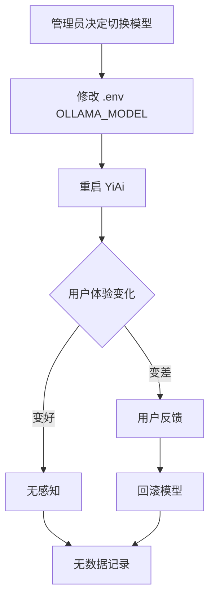
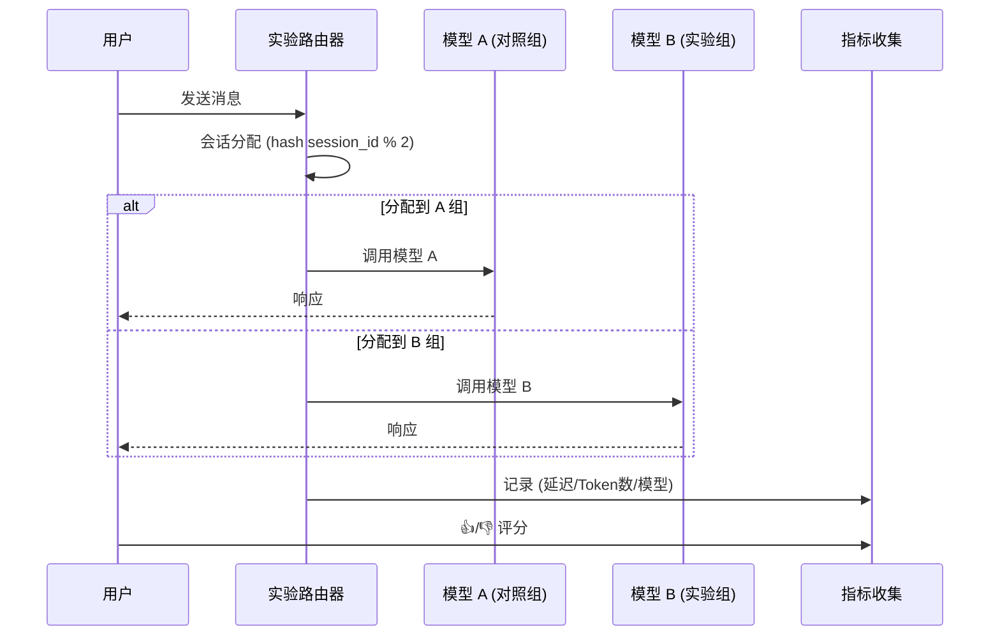

# YA-09-144: 模型性能对比与盲测评估

> 需求编号：YA-09-144 · 优先级：P2 · 人天：1.0d · 状态：需求已编写
> 依赖：YA-09-11（ModelRuntime 抽象层）

## 背景

### 问题陈述

YiAi 支持多种 LLM Provider（Ollama 本地模型、OpenAI 兼容 API），但缺乏系统性的模型性能对比机制。当引入新模型或升级现有模型时，缺少量化数据来回答"新模型是否更好？"

**核心矛盾**：凭感觉选模型 vs 需要数据驱动的模型选择。需要一个 A/B 测试框架来系统对比不同模型的延迟、质量和成本。

### 影响范围

| # | 影响 | 严重程度 | 触发场景 |
|---|------|----------|----------|
| 1 | 模型选择无数据支撑 | 高 | 引入新模型 |
| 2 | 模型升级后质量回退未发现 | 高 | 模型版本更新 |
| 3 | 无法量化模型成本效益 | 中 | 成本优化决策 |
| 4 | 相同 Prompt 不同模型效果差异未知 | 中 | Prompt 调优 |

### 挑战

| 挑战 | 说明 |
|------|------|
| 评估指标定义 | 延迟和成本易测，但"回答质量"如何量化？ |
| 统计显著性 | 小样本下的 A/B 结论可能不可靠 |
| 盲测设计 | 用户不知道用哪个模型，避免心理偏差 |
| 公平对比 | 相同 Prompt、相同上下文、相同参数 |

---

## 一、现状分析

### 1.1 当前模型切换流程



### 1.2 根因矩阵

| 症状 | 根因 | 触发条件 | 频率 |
|------|------|----------|------|
| 模型效果无法量化 | 无评估框架 | 模型变更 | 高 |
| 升级后质量回退 | 无回归对比 | 模型更新 | 中 |
| 成本无 visibility | 无 Token 统计 | 日常使用 | 中 |

---

## 二、设计决策

### 决策 1：质量评估方式 — 人工评分 vs 自动评分 vs 混合

| 选项 | 客观性 | 成本 | 可规模化 |
|------|--------|------|----------|
| 人工评分（👍👎按钮） | 中 | 低 | 高 |
| LLM-as-Judge（用 GPT-4 评分） | 中 | 中 | 高 |
| 混合（人工 + LLM Judge） | 高 | 中 | 高 |

**选择：混合。** 用户 👍👎 评分收集真实反馈，LLM Judge 自动评分覆盖全量。两者交叉验证。

### 决策 2：流量分割方式 — 用户级 vs 会话级 vs 请求级

| 选项 | 用户体验 | 对比公平性 | 实现复杂度 |
|------|----------|-----------|-----------|
| 用户级（用户 A 用模型 X） | 一致 | 中 | 低 |
| 会话级（会话随机分配） | 可能变化 | 高 | 中 |
| 请求级（每次请求随机） | 不一致 | 最高 | 高 |

**选择：会话级随机分配。** 单次会话内模型一致，避免用户困惑。会话间随机分配保证统计公平。

### 设计决策记录

| 决策 | 选项 A | 选项 B | 选项 C | 选择 | 理由 |
|------|--------|--------|--------|------|------|
| 评估方式 | 人工 | LLM Judge | 混合 | **混合** | 互补验证 |
| 流量分割 | 用户级 | 会话级 | 请求级 | **会话级** | 一致 + 公平 |
| 统计方法 | 简单对比 | t-test | 贝叶斯 | **贝叶斯** | 小样本更可靠 |

---

## 三、目标架构

### 3.1 A/B 测试流程



### 3.2 评估指标体系

| 指标类别 | 指标 | 计算方式 | 目标方向 |
|----------|------|----------|----------|
| 延迟 | TTFT (Time to First Token) | 首 token 时间 | ↓ |
| 延迟 | TPS (Tokens Per Second) | 总 tokens / 总耗时 | ↑ |
| 质量 | 👍 率 | 👍 / (👍+👎) | ↑ |
| 质量 | LLM Judge 评分 | GPT-4 1-5 分 | ↑ |
| 成本 | 每次对话成本 | Token 数 × 单价 | ↓ |
| 可靠性 | 错误率 | 失败请求 / 总请求 | ↓ |

---

## 四、具体改动

### 4.1 实验配置

```python
# src/services/ai/experiment_service.py

from dataclasses import dataclass
from enum import Enum
from datetime import datetime
import hashlib


class ExperimentStatus(Enum):
    DRAFT = "draft"
    RUNNING = "running"
    PAUSED = "paused"
    COMPLETED = "completed"


@dataclass
class ExperimentConfig:
    name: str
    control_model: str        # 对照组模型
    treatment_model: str      # 实验组模型
    traffic_split: float = 0.5  # 实验组流量比例
    min_samples: int = 100    # 最小样本数
    max_duration_hours: int = 72
    metrics: list[str] = None  # 关注指标


class ExperimentRouter:
    """会话级 A/B 实验路由器"""

    def __init__(self, config: ExperimentConfig):
        self.config = config

    def get_model(self, session_id: str) -> str:
        """基于会话 ID 的一致性哈希分配"""
        h = int(hashlib.md5(session_id.encode()).hexdigest()[:8], 16)
        bucket = h % 100
        if bucket < self.config.traffic_split * 100:
            return self.config.treatment_model
        return self.config.control_model

    def get_group(self, session_id: str) -> str:
        model = self.get_model(session_id)
        return "treatment" if model == self.config.treatment_model else "control"
```

### 4.2 指标采集

```python
# src/domain/ai/experiment_metrics.py

from motor.motor_asyncio import AsyncIOMotorDatabase
from datetime import datetime


class ExperimentMetricsCollector:
    def __init__(self, db: AsyncIOMotorDatabase):
        self.db = db

    async def record_request(self, experiment: str, session_id: str,
                             model: str, group: str, ttft_ms: float,
                             total_tokens: int, duration_ms: float,
                             error: str = None):
        await self.db.experiment_events.insert_one({
            "experiment": experiment,
            "session_id": session_id,
            "model": model,
            "group": group,
            "ttft_ms": ttft_ms,
            "total_tokens": total_tokens,
            "duration_ms": duration_ms,
            "error": error,
            "timestamp": datetime.utcnow(),
        })

    async def record_rating(self, session_id: str, rating: str, message_id: str):
        await self.db.experiment_ratings.insert_one({
            "session_id": session_id,
            "message_id": message_id,
            "rating": rating,  # "up" or "down"
            "timestamp": datetime.utcnow(),
        })

    async def get_results(self, experiment: str) -> dict:
        """聚合 A/B 测试结果"""
        pipeline = [
            {"$match": {"experiment": experiment}},
            {"$group": {
                "_id": "$group",
                "count": {"$sum": 1},
                "avg_ttft": {"$avg": "$ttft_ms"},
                "avg_tokens": {"$avg": "$total_tokens"},
                "avg_duration": {"$avg": "$duration_ms"},
                "error_count": {"$sum": {"$cond": ["$error", 1, 0]}},
            }},
        ]
        results = await self.db.experiment_events.aggregate(pipeline).to_list(None)

        # 加入评分数据
        rating_pipeline = [
            {"$match": {"experiment": experiment}},
            {"$group": {
                "_id": "$group",
                "up_count": {"$sum": {"$cond": [{"$eq": ["$rating", "up"]}, 1, 0]}},
                "total": {"$sum": 1},
            }},
        ]

        return {
            "groups": results,
            "ratings": await self.db.experiment_ratings.aggregate(rating_pipeline).to_list(None),
        }
```

### 4.3 文件变更清单

| 文件 | 操作 | 说明 |
|------|------|------|
| `src/services/ai/experiment_service.py` | 新增 | 实验配置与路由 |
| `src/domain/ai/experiment_metrics.py` | 新增 | 指标采集与聚合 |
| `src/server/routes/experiment_routes.py` | 新增 | 实验管理 API |
| `src/services/ai/chat_service.py` | 修改 | 集成实验路由 |
| `tests/unit/test_experiment_router.py` | 新增 | 路由算法测试 |
| `tests/integration/test_experiment_e2e.py` | 新增 | 端到端 A/B 测试 |

---

## 五、实施步骤

| 步骤 | 操作 | 验证 | 人天 |
|------|------|------|------|
| 1 | 实现 ExperimentRouter | 一致性哈希分配正确 | 0.15 |
| 2 | 实现指标采集器 | 延迟/Token/评分正确记录 | 0.2 |
| 3 | 集成到 Chat Service | A/B 分流正常工作 | 0.15 |
| 4 | 实现结果聚合 API | 按组别统计数据正确 | 0.15 |
| 5 | 实现管理 API | 创建/启停/查看实验 | 0.15 |
| 6 | 添加 👍👎 UI 支持 | 评分数据回传 | 0.1 |
| 7 | 端到端验证 | 完整 A/B 测试流程 | 0.1 |

**总人天：1.0d**

---

## 六、测试规格

### 场景 1：会话一致性

**GIVEN** 同一 session_id
**WHEN** 多次调用 get_model
**THEN** 每次返回相同模型（一致性哈希）

### 场景 2：流量分配比例

**GIVEN** traffic_split=0.3 的实验
**WHEN** 1000 个不同 session_id 请求
**THEN** ~300 个分配到 treatment 组（误差 ±5%）

### 场景 3：指标采集

**GIVEN** 运行中的实验
**WHEN** 用户发送消息并收到回复
**THEN** experiment_events 记录 TTFT/Tokens/Duration/Model

### 场景 4：评分采集

**GIVEN** 用户收到 A/B 实验中的回复
**WHEN** 用户点击 👍
**THEN** experiment_ratings 记录 session_id + message_id + "up"

### 场景 5：实验结果聚合

**GIVEN** 实验收集到 100+ 样本
**WHEN** 调用 get_results
**THEN** 返回 control/treatment 组的延迟/Token/评分对比

### 场景 6：实验管理

**GIVEN** 管理员创建实验
**WHEN** 设置 traffic_split=0 或暂停实验
**THEN** 所有流量回归对照组模型

---

## 七、风险与缓解

| 风险 | 概率 | 影响 | 缓解措施 |
|------|------|------|----------|
| 实验组模型质量显著差 | 中 | 高 | 自动熔断：👍率 < 30% → 自动停止实验 |
| 样本量不足 | 中 | 中 | 延长实验时间或增大流量比例 |
| 用户感知模型切换 | 低 | 低 | 会话级分配保证单会话内一致 |

---

## 八、回滚策略

| 场景 | 回滚操作 |
|------|----------|
| 实验组效果差 | 立即停止实验，流量 100% 回对照组 |
| 指标采集异常 | 关闭实验，修复后重新开始 |

---

## 九、设计决策记录

### D-01：为什么选会话级分配？

会话级分配保证单次对话体验一致——用户在同一个对话中不会感受到模型切换。同时不同会话随机分配保证统计公平性。

### D-02：为什么用贝叶斯统计？

传统 t-test 在小样本下容易得出不可靠结论。贝叶斯方法给出"B 优于 A 的概率"，更直观且对小样本更稳健。

---

## 十、可观测性

| 指标 | 类型 | 说明 |
|------|------|------|
| `yiai.experiment.active_count` | Gauge | 活跃实验数 |
| `yiai.experiment.samples_total` | Counter | 累计样本数 |
| `yiai.experiment.winner_probability` | Gauge | 实验组优于对照组的概率 |

| 告警 | 条件 | 级别 |
|------|------|------|
| 实验组错误率过高 | > 10% | WARNING |
| 实验组质量显著差 | 👍率 < 对照组 × 0.7 | WARNING |
| 样本量不足 | 运行 24h 但 < 50 样本 | INFO |

---

## 十一、代码审查检查清单

- [ ] ExperimentRouter 一致性哈希分配正确
- [ ] 指标采集不阻塞 LLM 调用主流程
- [ ] 实验结果按组别正确聚合
- [ ] 实验启停不影响正常服务
- [ ] 实验数据带 TTL 自动清理
- [ ] 单元测试覆盖路由、采集、聚合

---

## 回归问题预测

| # | 预测问题 | 原因 | 验证方法 |
|---|---------|------|---------|
| 1 | 一致性哈希在 session_id 变更时分配到不同组 | 会话刷新后 session_id 改变 | 验证同用户不同 session 的分配一致性 |
| 2 | 指标采集异步写入阻塞请求 | MongoDB 写入延迟 | 压力测试下验证 TTFT 不受影响 |
| 3 | LLM Judge 评分与用户评分不一致 | Judge 模型偏好与用户不同 | 计算评分相关性，调整 Judge prompt |
| 4 | traffic_split 为 0 时仍有实验组流量 | 边界条件 bug | 单元测试 traffic_split=0 场景 |
| 5 | 多实验并行时分流冲突 | 多个实验同时运行 | 限制同时运行实验数 ≤ 2 |
| 6 | 实验历史数据积累占用存储 | 无 TTL 清理 | 验证 experiment_events 30 天自动清理 |

---

## 性能分析

| 操作 | 延迟 | 说明 |
|------|------|------|
| get_model (路由决策) | < 0.1ms | MD5 hash + 取模 |
| record_request | < 1ms | 异步 MongoDB insert |
| get_results (聚合查询) | 50-200ms | 取决于样本量 |

---

*需求来源: `projects/yiai/requirements/2026-09/144-需求-模型性能对比与盲测评估.md`*

## 影响范围

- **影响模块**：待补充
- **涉及文件**：
- `src/domain/ai/experiment_metrics.py`
- `src/services/ai/experiment_service.py`
- `src/services/ai/chat_service.py`
- `src/server/routes/experiment_routes.py`
- **是否影响 API 契约**：否
- **是否影响其他项目（YiVad/YiPet）**：否
- **用户感知**：待确认

## 预防措施

| 层面 | 措施 |
|------|------|
| 代码 | 在相关函数中添加参数校验和边界检查 |
| 测试 | 为 `src/domain/ai/experiment_metrics.py` 添加单元测试 |
| 流程 | 代码审查时重点检查此类模式 |
| 监控 | 添加日志告警，异常发生时及时发现 |
| 文档 | 在编码规范中记录此类反模式 |

## 经验教训

1. **根本原因**：开发过程中对边界情况和异常路径的考虑不足是此类问题的共同根因
2. **设计阶段**：在接口设计和模块实现时，应主动考虑异常输入、空值、超时等边界场景
3. **代码审查**：审查时应检查是否存在类似的反模式（如未捕获异常、无超时控制、缺少参数校验等）
4. **测试覆盖**：异常路径的测试覆盖率应与正常路径同等重视
5. **团队分享**：此类问题应在团队周会或技术分享中讨论，形成团队共识
