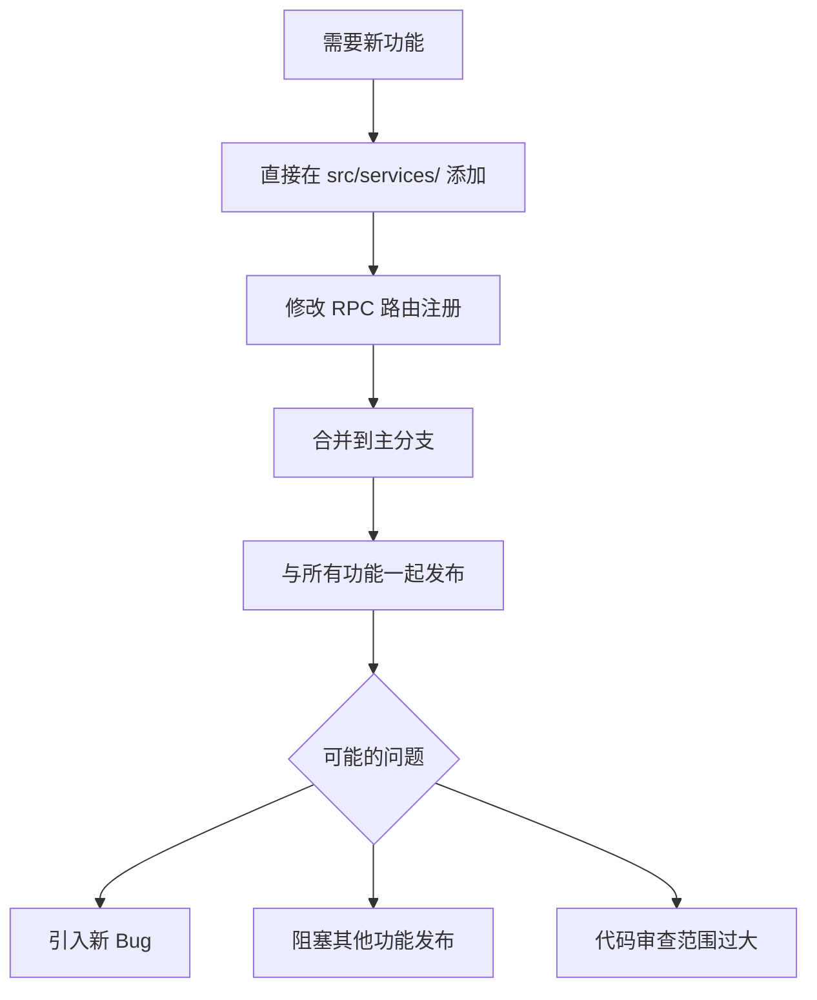
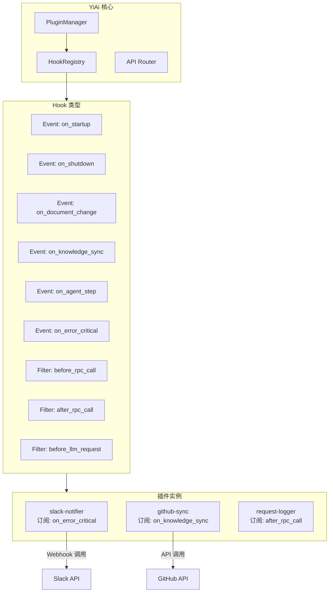
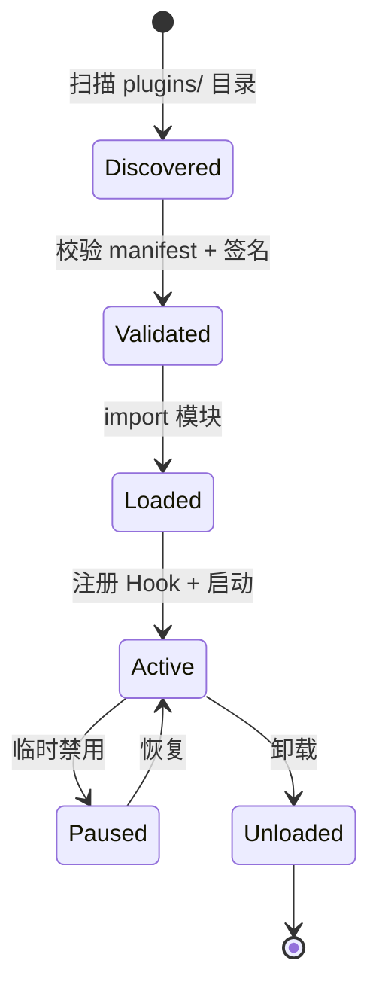

# YA-09-145: 插件化扩展系统 — Hook 机制与动态模块加载

> 需求编号：YA-09-145 · 优先级：P2 · 人天：1.5d · 状态：需求已编写
> 依赖：YA-09-18 (Agent 工具链插件化)

## 背景

### 问题陈述

YiAi 的功能边界正在快速扩展。每当需要添加新集成（Slack 通知、GitHub Webhook、Jira 同步），都需要修改核心代码并在主分支发布。这种模式导致核心代码与特定集成耦合，增加了维护成本和发布风险。

**核心矛盾**：快速增长的功能需求 vs 核心代码的稳定性要求。插件化架构允许第三方开发者（或团队内部不同小组）独立开发、测试和发布扩展功能，不干扰核心服务的稳定性。

### 影响范围

| # | 影响 | 严重程度 | 触发场景 |
|---|------|----------|----------|
| 1 | 新集成需修改核心代码 | 高 | 每次添加功能 |
| 2 | 功能间隐式耦合 | 中 | 修改一处影响多处 |
| 3 | 发布周期互相阻塞 | 中 | 多人并行开发 |

### 挑战

| 挑战 | 说明 |
|------|------|
| Python 无官方插件标准 | 需要自研插件发现和加载机制 |
| 插件安全隔离 | 防止恶意插件访问敏感数据 |
| 插件版本兼容 | 插件与 YiAi 版本矩阵管理 |
| 热加载性能 | 插件加载不应显著增加启动时间 |

---

## 一、现状分析

### 1.1 当前扩展方式



### 1.2 根因矩阵

| 症状 | 根因 | 触发条件 | 频率 |
|------|------|----------|------|
| 核心代码膨胀 | 无扩展点设计 | 添加新功能 | 高 |
| 发布阻塞 | 功能耦合 | 多人开发 | 中 |
| 测试范围过大 | 无隔离机制 | 每次 CI | 中 |

---

## 二、设计决策

### 决策 1：插件发现方式 — 配置文件 vs 目录扫描 vs 入口点

| 选项 | 灵活性 | 复杂度 | 性能 |
|------|--------|--------|------|
| YAML manifest 文件 | 高 | 低 | 高 |
| 目录自动扫描 | 最高 | 中 | 中 |
| Python entry_points | 中 | 低 | 高 |

**选择：YAML manifest + 目录扫描。** 每个插件目录包含 `plugin.yaml` 声明元数据和 Hook 订阅，系统启动时扫描 `plugins/` 目录。兼顾声明式配置的清晰度和目录组织的便利性。

### 决策 2：Hook 模型 — 事件驱动 vs 拦截器链 vs 混合

| 选项 | 适用场景 | 可中断性 | 执行顺序 |
|------|----------|----------|----------|
| 事件驱动 (fire-and-forget) | 通知类 | 不可中断 | 并行 |
| 拦截器链 (middleware pipeline) | 修改类 | 可中断 | 顺序 |
| 混合 | 全部 | 两者 | 配置决定 |

**选择：混合模型。** 提供两类 Hook：Event（通知型，并行执行）和 Filter（修改型，顺序链式执行）。插件按需订阅。

### 决策 3：插件隔离 — 进程隔离 vs 模块沙箱 vs 信任模型

| 选项 | 安全性 | 性能 | 复杂度 |
|------|--------|------|--------|
| 子进程沙箱 | 最高 | 低 | 高 |
| Python import 沙箱 | 中 | 高 | 中 |
| 代码审查 + 签名 | 低 | 最高 | 低 |

**选择：代码审查 + 签名验证。** YiAi 当前为自托管服务，插件来自可信源。通过 Manifest 中声明 `permissions` 限制插件能力，安装时人工审查。

### 设计决策记录

| 决策 | 选项 A | 选项 B | 选项 C | 选择 | 理由 |
|------|--------|--------|--------|------|------|
| 插件发现 | manifest | 目录扫描 | entry_points | **manifest + 扫描** | 声明式 + 灵活 |
| Hook 模型 | 事件 | 拦截器 | 混合 | **混合** | 覆盖通知和修改场景 |
| 隔离方案 | 进程 | 沙箱 | 审查+签名 | **审查+签名** | 自托管信任模型 |

---

## 三、目标架构

### 3.1 插件系统架构



### 3.2 插件生命周期



---

## 四、具体改动

### 4.1 插件 Manifest

```yaml
# plugins/slack-notifier/plugin.yaml

name: slack-notifier
version: 1.0.0
yiAi_version: ">=1.0.0"
author: YiAi Team
description: "发送关键错误告警到 Slack 频道"

permissions:
  - network:api.slack.com
  - read:config

hooks:
  events:
    - on_error_critical
  filters: []

config:
  webhook_url:
    type: string
    required: true
    secret: true
  channel:
    type: string
    default: "#yiAi-alerts"
  mention_users:
    type: list
    default: []
```

### 4.2 PluginManager

```python
# src/domain/plugins/manager.py

import os
import yaml
import importlib.util
from typing import Optional
from dataclasses import dataclass, field


@dataclass
class PluginManifest:
    name: str
    version: str
    yiAi_version: str
    description: str
    permissions: list[str]
    hooks: dict  # {events: [...], filters: [...]}
    config: dict = field(default_factory=dict)


class HookRegistry:
    """Hook 注册中心"""

    def __init__(self):
        self._event_handlers: dict[str, list] = {}  # hook_name → [handler, ...]
        self._filter_handlers: dict[str, list] = {}

    def register_event(self, hook_name: str, handler):
        self._event_handlers.setdefault(hook_name, []).append(handler)

    def register_filter(self, hook_name: str, handler):
        self._filter_handlers.setdefault(hook_name, []).append(handler)

    async def emit_event(self, hook_name: str, **kwargs):
        """并行触发所有事件处理器（fire-and-forget）"""
        import asyncio
        handlers = self._event_handlers.get(hook_name, [])
        tasks = [asyncio.create_task(h(**kwargs)) for h in handlers]
        # 不等待完成，不阻塞主流程

    async def apply_filters(self, hook_name: str, value, **kwargs):
        """链式应用过滤器（顺序执行）"""
        handlers = self._filter_handlers.get(hook_name, [])
        for handler in handlers:
            value = await handler(value, **kwargs)
        return value


class PluginManager:
    """插件管理器"""

    PLUGINS_DIR = "plugins"

    def __init__(self, hook_registry: HookRegistry):
        self.registry = hook_registry
        self.plugins: dict[str, dict] = {}

    def discover(self) -> list[str]:
        """扫描 plugins/ 目录发现所有插件"""
        plugin_dirs = []
        if not os.path.isdir(self.PLUGINS_DIR):
            return []

        for name in os.listdir(self.PLUGINS_DIR):
            plugin_dir = os.path.join(self.PLUGINS_DIR, name)
            manifest_path = os.path.join(plugin_dir, "plugin.yaml")
            if os.path.isdir(plugin_dir) and os.path.isfile(manifest_path):
                plugin_dirs.append(plugin_dir)

        return plugin_dirs

    def load_manifest(self, plugin_dir: str) -> PluginManifest:
        """加载并校验 manifest"""
        with open(os.path.join(plugin_dir, "plugin.yaml")) as f:
            data = yaml.safe_load(f)

        return PluginManifest(
            name=data["name"],
            version=data["version"],
            yiAi_version=data["yiAi_version"],
            description=data.get("description", ""),
            permissions=data.get("permissions", []),
            hooks=data.get("hooks", {}),
            config=data.get("config", {}),
        )

    async def load_plugin(self, plugin_dir: str) -> bool:
        """加载单个插件"""
        manifest = self.load_manifest(plugin_dir)

        # 校验 YiAi 版本兼容性
        if not self._check_version(manifest.yiAi_version):
            raise ValueError(f"Plugin {manifest.name} requires YiAi {manifest.yiAi_version}")

        # 动态导入插件模块
        module_path = os.path.join(plugin_dir, "main.py")
        spec = importlib.util.spec_from_file_location(
            f"plugin_{manifest.name}", module_path
        )
        module = importlib.util.module_from_spec(spec)
        spec.loader.exec_module(module)

        # 注册 Hook
        if hasattr(module, "register"):
            await module.register(self.registry, manifest.config)

        # 调用启动钩子
        await self.registry.emit_event("on_startup", plugin_name=manifest.name)

        self.plugins[manifest.name] = {
            "manifest": manifest,
            "module": module,
            "dir": plugin_dir,
            "status": "active",
        }

        return True

    async def load_all(self) -> list[str]:
        """加载所有已发现插件"""
        loaded = []
        for plugin_dir in self.discover():
            try:
                await self.load_plugin(plugin_dir)
                loaded.append(os.path.basename(plugin_dir))
            except Exception as e:
                print(f"Failed to load plugin {plugin_dir}: {e}")
        return loaded

    def _check_version(self, required: str) -> bool:
        """简易版本检查"""
        from packaging.version import Version
        current = Version("1.0.0")
        return current >= Version(required.replace(">=", "").strip())
```

### 4.3 内置 Hook 点

```python
# src/domain/plugins/hooks.py

# === Event Hooks (fire-and-forget) ===

# 应用启动完成
# 参数: plugin_name: str
ON_STARTUP = "on_startup"

# 应用关闭
# 参数: plugin_name: str
ON_SHUTDOWN = "on_shutdown"

# 文档变更（创建/更新/删除）
# 参数: cname: str, doc_id: str, action: str, data: dict
ON_DOCUMENT_CHANGE = "on_document_change"

# 知识库同步完成
# 参数: added: int, updated: int, deleted: int
ON_KNOWLEDGE_SYNC = "on_knowledge_sync"

# Agent 单步执行完成
# 参数: session_id: str, step: int, action: str, result: str
ON_AGENT_STEP = "on_agent_step"

# 严重错误
# 参数: error_type: str, message: str, traceback: str
ON_ERROR_CRITICAL = "on_error_critical"


# === Filter Hooks (chain) ===

# RPC 调用前（可修改参数）
# 参数: module_name: str, method_name: str, parameters: dict
# 返回: parameters: dict
BEFORE_RPC_CALL = "before_rpc_call"

# RPC 调用后（可修改响应）
# 参数: module_name, method_name, parameters, result
# 返回: result: dict
AFTER_RPC_CALL = "after_rpc_call"

# LLM 请求前（可修改消息）
# 参数: messages: list[dict], model: str
# 返回: messages: list[dict]
BEFORE_LLM_REQUEST = "before_llm_request"
```

### 4.4 文件变更清单

| 文件 | 操作 | 说明 |
|------|------|------|
| `src/domain/plugins/manager.py` | 新增 | PluginManager + HookRegistry |
| `src/domain/plugins/hooks.py` | 新增 | Hook 常量定义 |
| `src/domain/plugins/__init__.py` | 新增 | 插件模块 |
| `plugins/slack-notifier/plugin.yaml` | 新增 | 示例插件 manifest |
| `plugins/slack-notifier/main.py` | 新增 | 示例插件实现 |
| `main.py` | 修改 | 启动时加载插件 |
| `src/server/rpc_router.py` | 修改 | 集成 before/after RPC Hooks |
| `tests/unit/test_plugin_manager.py` | 新增 | PluginManager 测试 |

---

## 五、实施步骤

| 步骤 | 操作 | 验证 | 人天 |
|------|------|------|------|
| 1 | 实现 PluginManifest 数据模型 | manifest 正确解析 | 0.15 |
| 2 | 实现 HookRegistry | 事件/过滤器注册和触发 | 0.2 |
| 3 | 实现 PluginManager | 插件发现、加载、生命周期 | 0.3 |
| 4 | 定义内置 Hook 点 | 10+ Hook 覆盖核心流程 | 0.2 |
| 5 | 集成到 RPC 路由 | before/after RPC Hook 生效 | 0.2 |
| 6 | 创建示例插件 | Slack 通知器可正常工作 | 0.2 |
| 7 | 集成到启动流程 | 启动时自动加载插件 | 0.15 |
| 8 | 测试覆盖 | PluginManager + Hook 集成测试 | 0.1 |

**总人天：1.5d**

---

## 六、测试规格

### 场景 1：插件发现

**GIVEN** plugins/ 目录有 3 个有效插件
**WHEN** PluginManager.discover()
**THEN** 返回 3 个插件目录路径

### 场景 2：Manifest 解析

**GIVEN** 有效的 plugin.yaml
**WHEN** load_manifest()
**THEN** 返回正确填充的 PluginManifest 对象

### 场景 3：事件 Hook 触发

**GIVEN** 插件注册了 on_error_critical 事件处理器
**WHEN** emit_event("on_error_critical", ...)
**THEN** 插件的事件处理器被调用

### 场景 4：过滤器 Hook 链式执行

**GIVEN** 2 个插件注册了 before_rpc_call 过滤器
**WHEN** apply_filters("before_rpc_call", params)
**THEN** 参数依次经过 2 个过滤器处理

### 场景 5：插件加载失败不阻塞

**GIVEN** 1 个有效插件和 1 个无效插件
**WHEN** load_all()
**THEN** 有效插件加载成功，无效插件被跳过并记录日志

### 场景 6：插件版本不兼容

**GIVEN** 插件要求 YiAi >= 2.0.0，当前 1.0.0
**WHEN** load_plugin()
**THEN** 抛出 ValueError

---

## 七、风险与缓解

| 风险 | 概率 | 影响 | 缓解措施 |
|------|------|------|----------|
| 插件异常导致服务崩溃 | 中 | 高 | 每个 Hook 调用 try/catch，异常隔离 |
| 插件间 Hook 冲突 | 低 | 中 | Hook 执行顺序可配置 |
| 恶意插件数据泄露 | 低 | 高 | permissions 声明 + manifest 审查 |
| 插件加载拖慢启动 | 低 | 低 | 懒加载（按需激活插件） |

---

## 八、回滚策略

| 场景 | 回滚操作 |
|------|----------|
| 插件导致服务异常 | 从 plugins/ 移除插件目录，重启 |
| Hook 点影响性能 | 关闭特定 Hook 点（配置开关） |
| 全部插件功能异常 | 设置 PLUGINS_ENABLED=false 环境变量 |

---

## 九、设计决策记录

### D-01：为什么使用 YAML Manifest 而非 Python 装饰器？

YAML manifest 无需执行插件代码即可了解其元数据（名称、权限、Hook 订阅）。这支持"先审查后加载"的安全流程——管理员可以先查看 manifest 决定是否信任，再允许代码执行。

### D-02：事件 Hook 为什么是 fire-and-forget？

on_knowledge_sync 等事件可能触发多个通知插件（Slack、邮件、Webhook），每个的延迟不可控。fire-and-forget 确保主流程不被插件性能影响。如果需要确保通知已发送，应使用消息队列而非同步 Hook。

---

## 十、可观测性

| 指标 | 类型 | 说明 |
|------|------|------|
| `yiai.plugins.loaded_count` | Gauge | 已加载插件数 |
| `yiai.plugins.hook_duration_ms` | Histogram | Hook 执行耗时 |
| `yiai.plugins.error_total` | Counter | 插件异常次数 |

| 告警 | 条件 | 级别 |
|------|------|------|
| 插件加载失败 | 启动时 | WARNING |
| Hook 执行超时 | > 5s | WARNING |
| 插件异常频率高 | 5min > 10 次 | ERROR |

---

## 十一、代码审查检查清单

- [ ] PluginManager 正确扫描并发现所有插件
- [ ] Manifest 解析包含完整字段校验
- [ ] Event Hook fire-and-forget 不阻塞主流程
- [ ] Filter Hook 链式执行顺序可预测
- [ ] 插件异常隔离（不传播到核心服务）
- [ ] 版本兼容性检查生效
- [ ] 权限声明在 manifest 中明确
- [ ] 示例插件可正常运行

---

## 回归问题预测

| # | 预测问题 | 原因 | 验证方法 |
|---|---------|------|---------|
| 1 | 多个插件注册同名 Filter Hook 时执行顺序不确定 | dict 遍历顺序在 Python 3.7+ 为插入序，但跨插件加载顺序可能影响 Filter 结果 | 验证 Filter 链结果与插件加载顺序解耦（引入 priority 字段） |
| 2 | 插件中 import 核心模块形成循环引用 | 插件 import src.services.*，核心 importlib 加载插件模块，可能触发循环 | madge 检查循环依赖 |
| 3 | manifest 中 permissions 字段被忽略 | 当前版本仅记录但未校验 | 验证安装时打印权限摘要供审查 |
| 4 | 插件热加载时旧 Hook 未注销 | 重载插件时仅注册新 Hook，旧 Hook 残留 | 重载前先 unregister 所有旧 Hook |
| 5 | 插件模块卸载后 __pycache__ 缓存导致旧代码执行 | Python 字节码缓存 | 插件路径独立于 src/，不受缓存影响 |
| 6 | config 中的 secret 字段在日志中泄露 | PluginManager 打印 config 用于调试 | 验证 secret=True 的字段在日志中显示为 *** |

---

## 性能分析

| 操作 | 延迟 | 说明 |
|------|------|------|
| 目录扫描 (10 plugins) | < 5ms | os.listdir + 文件检查 |
| Manifest 解析 (单个) | < 1ms | YAML safe_load |
| 模块 import (单个) | 10-50ms | 取决于插件依赖 |
| Event emit (3 handlers) | < 5ms | asyncio.create_task |
| Filter chain (2 handlers) | 取决于插件逻辑 | 通常 < 50ms |

---

*需求来源: `projects/yiai/requirements/2026-09/145-需求-插件化扩展系统.md`*

## 影响范围

- **影响模块**：待补充
- **涉及文件**：
- `src/server/rpc_router.py`
- `src/domain/plugins/__init__.py`
- `src/domain/plugins/manager.py`
- `src/domain/plugins/hooks.py`
- `main.py`
- **是否影响 API 契约**：否
- **是否影响其他项目（YiVad/YiPet）**：否
- **用户感知**：待确认

## 预防措施

| 层面 | 措施 |
|------|------|
| 代码 | 在相关函数中添加参数校验和边界检查 |
| 测试 | 为 `src/server/rpc_router.py` 添加单元测试 |
| 流程 | 代码审查时重点检查此类模式 |
| 监控 | 添加日志告警，异常发生时及时发现 |
| 文档 | 在编码规范中记录此类反模式 |

## 经验教训

1. **根本原因**：开发过程中对边界情况和异常路径的考虑不足是此类问题的共同根因
2. **设计阶段**：在接口设计和模块实现时，应主动考虑异常输入、空值、超时等边界场景
3. **代码审查**：审查时应检查是否存在类似的反模式（如未捕获异常、无超时控制、缺少参数校验等）
4. **测试覆盖**：异常路径的测试覆盖率应与正常路径同等重视
5. **团队分享**：此类问题应在团队周会或技术分享中讨论，形成团队共识
