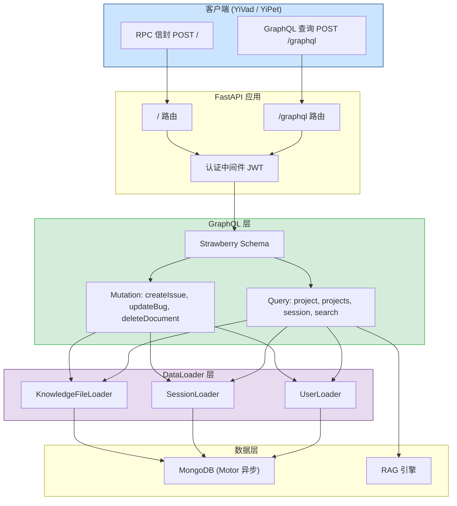
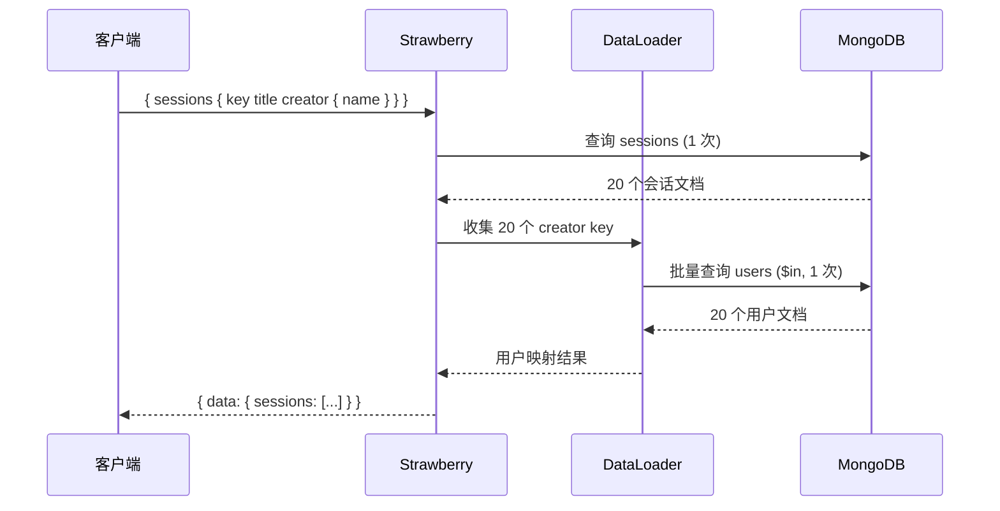

# YA-09-146: GraphQL 查询接口 — Strawberry 集成 + Schema 自动生成 + DataLoader 防 N+1

> 需求编号：YA-09-146 · 优先级：P2 · 人天：1.5d · 状态：需求已编写
> 依赖：无 · 前置需求：无

## 背景

YiAi 目前仅通过 RPC 信封（`POST /` with `{module_name, method_name, parameters}`）提供 API 访问。前端需要多次调用不同 RPC 方法来获取关联数据（如先查会话列表，再逐个查会话详情），导致 N+1 查询问题和过度获取（每次都返回完整文档，无法按需选择字段）。在 YiVad 管理后台的列表页和 YiPet 扩展的数据展示场景中，这种低效尤为明显。

**问题：**

1. **过度获取（Over-fetching）**：RPC 信封始终返回完整文档，客户端无法选择只需要的字段。例如列表页只需要 `title` 和 `updated`，却收到了包含全部消息内容的完整会话对象。
2. **N+1 查询**：获取关联数据需要多次 RPC 调用。例如获取 20 个会话及其创建者信息，需要 1 次查会话 + 20 次查用户 = 21 次网络往返。
3. **无 Schema 自省**：客户端无法通过工具自动发现可用的数据类型和查询能力，需要人工查阅文档。
4. **前端碎片拼接**：前端需要组合多个 RPC 调用的结果来构建视图数据，增加了前端复杂度和出错概率。

**影响：**

- 列表页加载慢：YiVad 会话列表页需要 3-5 次 RPC 调用才能完整渲染
- 移动网络下延迟放大：每增加一次 RPC 调用，4G 网络下增加 100-300ms 延迟
- 前端代码复杂：数据聚合逻辑分散在多个 Vue 组件中

**挑战：**

- GraphQL 需要与现有 RPC 信封共存，不能破坏现有 API
- DataLoader 的批量加载需要适配 MongoDB Motor 异步驱动
- Schema 定义需要覆盖 YiAi 现有的 6 个核心数据类型

---

## 一、现状分析

### 1.1 当前 API 调用模式

| 属性 | 当前值 | 说明 |
|------|--------|------|
| API 协议 | RPC 信封 | `POST /` with `{module_name, method_name, parameters}` |
| 查询方式 | 单次调用返回完整文档 | 无法按需选择字段 |
| 关联查询 | 前端多次调用 | 每个关联对象需要单独 RPC 调用 |
| Schema 发现 | 无 | 需人工查阅文档或代码 |
| 认证方式 | JWT `X-Token` 头部 | 可选，默认禁用 |

### 1.2 根因分析矩阵

| 问题 | 根因 | 影响 | 紧急程度 |
|------|------|------|----------|
| 过度获取 | RPC 信封设计为返回完整文档，无法按需裁剪 | 列表页传输冗余数据，浪费带宽 | 中 |
| N+1 查询 | 无批量查询和关联加载机制 | 多次网络往返，页面加载慢 | 高 |
| 无 Schema 自省 | 未实现 GraphQL 或 OpenAPI 自省端点 | 前端开发需人工查阅代码 | 中 |
| 前端碎片拼接 | 数据聚合逻辑在前端，无服务端聚合能力 | 前端代码复杂，易出错 | 中 |

### 1.3 核心数据类型分析

| 类型 | 集合 | 文档数 | 平均大小 | 关联类型 | 查询频率 |
|------|------|--------|----------|----------|----------|
| Session | sessions | ~500 | 50KB | User (创建者) | 高 (每日 200+) |
| KnowledgeFile | knowledge_files | ~200 | 20KB | User (上传者) | 中 (每日 50+) |
| Bug | bugs | ~100 | 10KB | User (报告者) | 中 (每日 30+) |
| User | users | ~20 | 5KB | -- | 低 (每日 10+) |
| RAGResult | (向量索引) | ~1000 | 15KB | KnowledgeFile (源文件) | 高 (每日 100+) |

### 1.4 改造前数据流

```
客户端 (YiVad/YiPet)
  │
  ├── RPC 调用 1: data_service.query_documents({cname: "sessions", filter: {...}})
  │   └── 返回: 20 个完整会话文档 (含 messages 数组，约 1MB)
  │
  ├── RPC 调用 2-21: data_service.query_documents({cname: "users", filter: {key: user_key}})
  │   └── 返回: 20 个完整用户文档 (每次约 5KB)
  │
  └── 前端聚合: 将会话与用户信息合并 → 渲染列表

总计: 21 次 HTTP 请求, ~1.1MB 数据传输, 实际需要的数据仅 ~50KB
```

---

## 二、设计决策

### 决策 1：GraphQL 框架 — Strawberry vs Ariadne vs Graphene

| 维度 | Strawberry | Ariadne | Graphene |
|------|-----------|---------|----------|
| 类型安全 | 原生 Python 类型注解，mypy 友好 | Schema-first，需手写 SDL | 类继承，运行时类型检查 |
| FastAPI 集成 | 原生 `strawberry-fastapi` 集成 | 需手动适配 ASGI | 通过 `graphene-fastapi` 适配 |
| 异步支持 | 原生 async resolver | 支持 async | 部分支持 |
| DataLoader 集成 | 原生 `strawberry-dataloader` | 需手动集成 | 需手动集成 |
| Pydantic 互操作 | 从 Pydantic 生成 GraphQL 类型 | 需手写 SDL 映射 | 需手写类型映射 |
| 社区活跃度 | 高 (4.5k stars, 活跃维护) | 中 (2.2k stars) | 中 (8k stars, 更新缓慢) |

**选择：Strawberry。** 原生 FastAPI 集成、类型安全的装饰器 API、从 Pydantic 模型自动生成 GraphQL 类型的能力，与 YiAi 现有 Python 3.10+ 类型注解风格高度一致。

### 决策 2：Schema 生成方式

**选择：混合策略。** 核心类型（Session, KnowledgeFile, Bug, User）使用 `strawberry.experimental.pydantic` 从现有 Pydantic 模型自动生成，减少维护成本。GraphQL 专用类型（如聚合查询结果、分页信息）手动定义以获得最大灵活性。

### 决策 3：DataLoader 批量加载策略

**选择：请求级 DataLoader。** 每个 HTTP 请求创建独立的 DataLoader 实例，在单次 GraphQL 查询内批量加载关联数据。避免跨请求缓存带来的数据一致性和安全性问题。

### 设计决策汇总

| 决策 | 选项 A | 选项 B | 选择 | 理由 |
|------|--------|--------|------|------|
| GraphQL 框架 | Strawberry | Ariadne | Strawberry | FastAPI 原生集成 + Pydantic 互操作 |
| Schema 生成 | 手动定义 | Pydantic 自动 | 混合策略 | 核心类型自动生成，专用类型手动定义 |
| DataLoader 范围 | 全局 | 请求级 | 请求级 | 安全隔离，避免跨请求数据泄漏 |
| 端点路径 | `/graphql` | `/api/graphql` | `/graphql` | 简洁，GraphQL 社区惯例 |
| 与 RPC 共存 | 替代 RPC | 补充 RPC | 补充 RPC | 不破坏现有 API，逐步迁移 |

---

## 三、目标架构

### 3.1 GraphQL 架构总览



### 3.2 查询执行流程 (N+1 变为 2 次查询)



---

## 四、具体改动

### 4.1 GraphQL 类型定义

**文件：** `services/graphql/types.py`（新建）

```python
import strawberry
from typing import Optional, List
from datetime import datetime


@strawberry.type
class PageInfo:
    total: int
    page: int
    page_size: int
    total_pages: int


@strawberry.input
class FilterInput:
    field: str
    operator: str = "eq"  # eq, ne, gt, lt, gte, lte, in, regex
    value: str


@strawberry.input
class SortInput:
    field: str
    direction: str = "asc"


@strawberry.input
class PageInput:
    page: int = 1
    page_size: int = 20


@strawberry.type
class User:
    key: str
    username: str
    display_name: Optional[str] = None
    email: Optional[str] = None
    roles: List[str]
    created_at: Optional[datetime] = None


@strawberry.type
class Session:
    key: str
    title: Optional[str] = None
    tags: List[str]
    message_count: int
    created_at: Optional[datetime] = None
    updated_at: Optional[datetime] = None

    @strawberry.field
    async def creator(self, info: strawberry.Info) -> Optional[User]:
        loader = info.context["user_loader"]
        return await loader.load(self.creator_key) if self.creator_key else None


@strawberry.type
class KnowledgeFile:
    key: str
    path: str
    title: Optional[str] = None
    tags: List[str]
    category: Optional[str] = None
    created_at: Optional[datetime] = None

    @strawberry.field
    async def uploader(self, info: strawberry.Info) -> Optional[User]:
        loader = info.context["user_loader"]
        return await loader.load(self.uploader_key) if self.uploader_key else None


@strawberry.type
class Bug:
    key: str
    title: str
    project: Optional[str] = None
    module: Optional[str] = None
    severity: Optional[str] = None
    status: Optional[str] = None
    created_at: Optional[datetime] = None

    @strawberry.field
    async def reporter(self, info: strawberry.Info) -> Optional[User]:
        loader = info.context["user_loader"]
        return await loader.load(self.reporter_key) if self.reporter_key else None


@strawberry.type
class RAGResult:
    id: str
    content: str
    score: float
    source_file: Optional[str] = None


@strawberry.type
class SearchResult:
    type: str
    key: str
    title: Optional[str] = None
    snippet: Optional[str] = None
    score: float


@strawberry.type
class SessionConnection:
    items: List[Session]
    page_info: PageInfo

# BugConnection, KnowledgeFileConnection 结构类似，省略


@strawberry.input
class CreateIssueInput:
    title: str
    project: Optional[str] = None
    severity: Optional[str] = "medium"
    description: Optional[str] = None


@strawberry.input
class UpdateBugInput:
    key: str
    title: Optional[str] = None
    status: Optional[str] = None
    severity: Optional[str] = None


@strawberry.type
class DeleteResult:
    success: bool
    key: str
    message: Optional[str] = None
```

### 4.2 DataLoader 实现

**文件：** `services/graphql/dataloaders.py`（新建）

```python
from typing import List, Optional
from motor.motor_asyncio import AsyncIOMotorDatabase
from shared.logging import get_logger

logger = get_logger(__name__)


class UserLoader:
    """批量加载用户信息。收集单次查询中的所有 user key，合并为一次 $in 查询。"""

    def __init__(self, db: AsyncIOMotorDatabase):
        self._db = db
        self._pending: List[str] = []
        self._cache: dict = {}

    async def load(self, key: str) -> Optional[dict]:
        if key in self._cache:
            return self._cache[key]
        self._pending.append(key)
        return None

    async def dispatch(self):
        if not self._pending:
            return
        unique_keys = list(set(self._pending))
        cursor = self._db.users.find({"key": {"$in": unique_keys}})
        async for doc in cursor:
            self._cache[doc["key"]] = doc
        for key in unique_keys:
            if key not in self._cache:
                self._cache[key] = None
        logger.debug(f"[DataLoader] UserLoader: 批量加载 {len(unique_keys)} 个用户")
        self._pending.clear()


# SessionLoader, KnowledgeFileLoader 结构相同，仅集合名不同
```

### 4.3 GraphQL Schema 与 Resolver

**文件：** `services/graphql/schema.py`（新建）

```python
from typing import List, Optional
import strawberry
from strawberry.types import Info

from services.graphql.types import *
from shared.logging import get_logger

logger = get_logger(__name__)


def _build_mongo_filter(filters: Optional[List[FilterInput]]) -> dict:
    if not filters:
        return {}
    op_map = {
        "eq": lambda v: v, "ne": lambda v: {"$ne": v},
        "gt": lambda v: {"$gt": v}, "lt": lambda v: {"$lt": v},
        "in": lambda v: {"$in": v.split(",")},
        "regex": lambda v: {"$regex": v, "$options": "i"},
    }
    return {f.field: op_map.get(f.operator, lambda v: v)(f.value) for f in filters}


async def _paginated_query(collection, filter_dict, sort_list, page, page_size):
    skip = (page - 1) * page_size
    total = await collection.count_documents(filter_dict)
    cursor = collection.find(filter_dict).sort(sort_list).skip(skip).limit(page_size)
    return await cursor.to_list(length=page_size), total


@strawberry.type
class Query:

    @strawberry.field
    async def session(self, info: Info, key: str) -> Optional[Session]:
        db = info.context["db"]
        doc = await db.sessions.find_one({"key": key})
        if not doc:
            return None
        return Session(
            key=doc["key"], title=doc.get("title"),
            tags=doc.get("tags", []),
            message_count=len(doc.get("messages", [])),
            created_at=doc.get("created_at"), updated_at=doc.get("updated_at"),
        )

    @strawberry.field
    async def sessions(
        self, info: Info,
        filter: Optional[List[FilterInput]] = None,
        sort: Optional[List[SortInput]] = None,
        page: Optional[PageInput] = None,
    ) -> SessionConnection:
        db = info.context["db"]
        p = page or PageInput()
        mongo_filter = _build_mongo_filter(filter)
        mongo_sort = [(s.field, 1 if s.direction == "asc" else -1) for s in (sort or [])] or [("updated_at", -1)]

        items, total = await _paginated_query(db.sessions, mongo_filter, mongo_sort, p.page, p.page_size)
        sessions = [Session(
            key=d["key"], title=d.get("title"), tags=d.get("tags", []),
            message_count=len(d.get("messages", [])),
            created_at=d.get("created_at"), updated_at=d.get("updated_at"),
        ) for d in items]

        total_pages = (total + p.page_size - 1) // p.page_size
        return SessionConnection(items=sessions, page_info={
            "total": total, "page": p.page, "page_size": p.page_size, "total_pages": total_pages,
        })

    @strawberry.field
    async def projects(self, info: Info) -> List[str]:
        db = info.context["db"]
        projects = await db.bugs.distinct("project")
        return [p for p in projects if p]

    @strawberry.field
    async def bugs(
        self, info: Info,
        filter: Optional[List[FilterInput]] = None,
        sort: Optional[List[SortInput]] = None,
        page: Optional[PageInput] = None,
    ) -> BugConnection:
        db = info.context["db"]
        p = page or PageInput()
        items, total = await _paginated_query(
            db.bugs, _build_mongo_filter(filter),
            [(s.field, 1 if s.direction == "asc" else -1) for s in (sort or [])] or [("updated_at", -1)],
            p.page, p.page_size,
        )
        bugs = [Bug(
            key=d["key"], title=d.get("title", ""), project=d.get("project"),
            module=d.get("module"), severity=d.get("severity"), status=d.get("status"),
            created_at=d.get("created_at"), updated_at=d.get("updated_at"),
        ) for d in items]
        total_pages = (total + p.page_size - 1) // p.page_size
        return BugConnection(items=bugs, page_info={
            "total": total, "page": p.page, "page_size": p.page_size, "total_pages": total_pages,
        })

    @strawberry.field
    async def search(self, info: Info, query: str, limit: int = 10) -> List[SearchResult]:
        db = info.context["db"]
        regex = {"$regex": query, "$options": "i"}
        results = []
        async for doc in db.sessions.find({"$or": [{"title": regex}, {"tags": regex}]}).limit(limit):
            results.append(SearchResult(type="session", key=doc["key"], title=doc.get("title"), score=1.0))
        async for doc in db.knowledge_files.find({"$or": [{"title": regex}, {"path": regex}]}).limit(limit):
            results.append(SearchResult(type="knowledge_file", key=doc["key"], title=doc.get("title"), score=0.9))
        async for doc in db.bugs.find({"$or": [{"title": regex}, {"module": regex}]}).limit(limit):
            results.append(SearchResult(type="bug", key=doc["key"], title=doc.get("title"), score=0.8))
        return results[:limit]


@strawberry.type
class Mutation:

    @strawberry.mutation
    async def create_issue(self, info: Info, input: CreateIssueInput) -> Bug:
        db = info.context["db"]
        import uuid; from datetime import datetime
        doc = {
            "key": str(uuid.uuid4()), "title": input.title,
            "project": input.project, "severity": input.severity,
            "description": input.description, "status": "open",
            "created_at": datetime.now(), "updated_at": datetime.now(),
        }
        await db.bugs.insert_one(doc)
        logger.info(f"[GraphQL] 创建 Issue: {doc['key']}")
        return Bug(key=doc["key"], title=doc["title"], project=doc.get("project"),
                   severity=doc.get("severity"), status=doc["status"],
                   created_at=doc["created_at"], updated_at=doc["updated_at"])

    @strawberry.mutation
    async def update_bug(self, info: Info, input: UpdateBugInput) -> Optional[Bug]:
        db = info.context["db"]
        from datetime import datetime
        update = {"updated_at": datetime.now()}
        if input.title is not None: update["title"] = input.title
        if input.status is not None: update["status"] = input.status
        if input.severity is not None: update["severity"] = input.severity
        doc = await db.bugs.find_one_and_update(
            {"key": input.key}, {"$set": update}, return_document=True,
        )
        if not doc: return None
        return Bug(key=doc["key"], title=doc.get("title", ""), status=doc.get("status"),
                   severity=doc.get("severity"), created_at=doc.get("created_at"))

    @strawberry.mutation
    async def delete_document(self, info: Info, collection: str, key: str) -> DeleteResult:
        db = info.context["db"]
        allowed = {"bugs", "sessions", "knowledge_files", "static_files"}
        if collection not in allowed:
            return DeleteResult(success=False, key=key, message=f"不允许删除集合 {collection}")
        result = await db[collection].delete_one({"key": key})
        return DeleteResult(success=result.deleted_count > 0, key=key,
                            message="文档已删除" if result.deleted_count > 0 else "文档不存在")
```

### 4.4 FastAPI 集成

**文件：** `services/graphql/routes.py`（新建）

```python
from strawberry.fastapi import GraphQLRouter
import strawberry
from services.graphql.schema import Query, Mutation
from services.graphql.dataloaders import UserLoader, SessionLoader, KnowledgeFileLoader


async def get_context(request) -> dict:
    db = request.app.state.mongodb
    return {
        "db": db,
        "user_loader": UserLoader(db),
        "session_loader": SessionLoader(db),
        "file_loader": KnowledgeFileLoader(db),
    }


schema = strawberry.Schema(query=Query, mutation=Mutation)

graphql_app = GraphQLRouter(
    schema,
    context_getter=get_context,
    graphiql=True,  # 开发环境启用 GraphiQL
)
```

**文件：** `main.py`（修改）

```python
from services.graphql.routes import graphql_app
app.include_router(graphql_app, prefix="/graphql", tags=["graphql"])
```

### 4.5 涉及文件

```
YiAi/src/
├── services/graphql/
│   ├── __init__.py           # 新建
│   ├── types.py              # 新建: GraphQL 类型定义
│   ├── dataloaders.py        # 新建: DataLoader 批量加载
│   ├── schema.py             # 新建: Query + Mutation Resolver
│   └── routes.py             # 新建: FastAPI GraphQL 路由
├── requirements.txt          # 修改: 添加 strawberry-graphql
└── main.py                   # 修改: 注册 GraphQL 路由
```

---

## 五、实施步骤

| 步骤 | 内容 | 涉及文件 | 验证方式 | 人天 |
|------|------|---------|---------|------|
| 1 | 安装 Strawberry 依赖，创建模块目录 | `requirements.txt` | `pip list \| grep strawberry` 确认安装成功 | 0.05 |
| 2 | 定义 GraphQL 类型（Session, User, Bug, KnowledgeFile, RAGResult） | `types.py` | Python 导入无错误，类型检查通过 | 0.25 |
| 3 | 实现 DataLoader（UserLoader, SessionLoader, KnowledgeFileLoader） | `dataloaders.py` | 单元测试：批量加载 20 个用户仅 1 次 MongoDB 查询 | 0.25 |
| 4 | 实现 Query Resolver（session, sessions, projects, bugs, search） | `schema.py` | GraphiQL 中执行查询返回正确结果 | 0.35 |
| 5 | 实现 Mutation Resolver（createIssue, updateBug, deleteDocument） | `schema.py` | GraphiQL 中执行变更，MongoDB 数据正确更新 | 0.2 |
| 6 | 集成 FastAPI GraphQL 路由 + 认证中间件 | `routes.py`, `main.py` | POST /graphql 返回正确结果 | 0.15 |
| 7 | 配置 GraphiQL 开发工具 | `routes.py` | GET /graphql 显示 GraphiQL 界面 | 0.05 |
| 8 | 编写集成测试（6 个查询 + 3 个变更场景） | `tests/graphql/` | 所有测试通过 | 0.2 |

**总计：1.5d**

---

## 六、测试规格

### Requirement: GraphQL 查询

#### Scenario: 按 key 查询单个会话
- **Given** MongoDB sessions 集合中存在 key 为 `sess-001` 的会话，包含 5 条消息
- **When** 执行 `{ session(key: "sess-001") { key title messageCount tags } }`
- **Then** 返回 `{ data: { session: { key: "sess-001", messageCount: 5 } } }`，不返回 messages 数组

#### Scenario: 分页查询会话列表（含创建者，DataLoader 批量加载）
- **Given** MongoDB 中有 50 个会话
- **When** 执行 `{ sessions(page: { page: 1, pageSize: 10 }) { items { key title creator { username } } pageInfo { total } } }`
- **Then** 返回 10 个会话，每个含创建者用户名，`pageInfo.total` 为 50
- **And** MongoDB 仅执行 2 次查询（1 次会话 + 1 次批量用户）

#### Scenario: 全局搜索跨集合查询
- **Given** sessions 和 bugs 中都有标题包含 "RAG" 的记录
- **When** 执行 `{ search(query: "RAG", limit: 10) { type key title score } }`
- **Then** 返回结果包含 type 为 `session` 和 `bug` 的记录

### Requirement: GraphQL 变更

#### Scenario: 创建 Issue
- **Given** 用户已认证
- **When** 执行 `mutation { createIssue(input: { title: "GraphQL 查询超时", project: "YiAi", severity: "high" }) { key title status } }`
- **Then** MongoDB bugs 集合新增文档，返回 `{ key: "<uuid>", title: "GraphQL 查询超时", status: "open" }`

#### Scenario: 更新 Bug 状态
- **Given** MongoDB 中存在 key 为 `bug-001` 的缺陷，状态为 `open`
- **When** 执行 `mutation { updateBug(input: { key: "bug-001", status: "in_progress" }) { key status } }`
- **Then** MongoDB 中 status 更新为 `in_progress`

#### Scenario: 删除文档
- **Given** MongoDB bugs 集合中存在 key 为 `bug-002` 的缺陷
- **When** 执行 `mutation { deleteDocument(collection: "bugs", key: "bug-002") { success message } }`
- **Then** MongoDB 中文档被删除，返回 `{ success: true, message: "文档已删除" }`

---

## 七、风险与缓解

| 风险 | 概率 | 影响 | 等级 | 缓解措施 | 应急预案 |
|------|------|------|------|----------|----------|
| GraphQL 查询复杂度失控（深层嵌套） | 中 | 高 | 高 | 限制查询深度（最大 5 层），复杂度分数上限 1000 | 超限查询返回 400，提示简化 |
| DataLoader 缓存未命中导致 N+1 回退 | 低 | 中 | 低 | DataLoader 在 resolver 中正确收集 key | 监控 N+1 查询次数，超过阈值告警 |
| GraphiQL 在生产环境暴露 | 低 | 高 | 中 | 环境变量 `ENABLE_GRAPHIQL` 控制，生产默认关闭 | 发现后设置环境变量关闭 |
| Strawberry 版本升级不兼容 | 低 | 中 | 低 | 锁定版本，CI 中运行 GraphQL 测试 | 回退版本 |
| 大查询导致内存溢出 | 中 | 中 | 中 | 分页默认 20 条，最大 100 条；messages 不直接暴露 | 超限查询返回错误 |

---

## 八、回滚策略

| 场景 | 回滚方式 | 回滚时间 | 风险 |
|------|---------|---------|------|
| GraphQL 端点异常影响服务 | 在 `main.py` 中注释 GraphQL 路由注册，重启 | < 1min | 低：RPC 端点不受影响 |
| GraphQL 查询导致 MongoDB 压力大 | 环境变量 `ENABLE_GRAPHQL=false` 临时禁用 | < 1min | 低：RPC 端点不受影响 |
| Schema 定义错误 | 修复 Schema 定义，重新部署 | < 30min | 低：RPC 端点作为降级方案 |

---

## 九、设计决策记录

### D-01: 为什么选择 Strawberry 而非 Ariadne？

Strawberry 的装饰器 + 类型注解 API 与 YiAi 现有的 Python 代码风格一致（Pydantic 模型 + 类型注解）。`strawberry.experimental.pydantic` 可以直接从现有 Pydantic 模型生成 GraphQL 类型，减少重复定义。Ariadne 的 Schema-first 方式需要额外维护 `.graphql` SDL 文件。

### D-02: 为什么 GraphQL 端点为补充而非替代 RPC 信封？

RPC 信封是 YiAi 的核心 API 协议，YiVad 和 YiPet 的所有现有功能都依赖它。一次性替换风险极高。GraphQL 作为补充端点，允许逐步迁移：新功能优先使用 GraphQL，现有功能保持 RPC 不变。

### D-03: 为什么 DataLoader 使用请求级而非全局级？

请求级 DataLoader 确保：1) 数据隔离——不同请求的缓存不会互相污染；2) 内存安全——不会因长期缓存导致内存泄漏；3) 数据新鲜度——每次请求获取最新数据。

### D-04: 为什么 GraphQL 不直接暴露 messages 数组？

Session 的 messages 数组可能包含数百条消息，全部返回会严重浪费带宽。GraphQL 类型中仅暴露 `messageCount`，客户端如需查看消息内容，可通过 RPC 端点的 SSE 流式接口获取。

---

## 十、可观测性

### 关键指标

| 指标 | 采集方式 | 告警阈值 | 说明 |
|------|---------|---------|------|
| GraphQL 查询延迟 | `time.perf_counter()` | P95 > 500ms | 复杂查询可能导致慢响应 |
| GraphQL 查询错误率 | 统计 errors 返回次数 | > 5% | 查询语法错误或 Resolver 异常 |
| DataLoader 批量效率 | key 数量 vs MongoDB 查询次数 | 批量比 < 2:1 | 批量比低说明 N+1 问题 |
| MongoDB 查询次数 | 单次 GraphQL 查询触发的查询数 | > 10 次 | DataLoader 未正确批处理 |

### 日志规范

| 日志级别 | 场景 | 示例 |
|---------|------|------|
| `INFO` | 查询完成 | `[GraphQL] 查询完成: sessions, 耗时 45ms, MongoDB 查询 2 次` |
| `WARN` | 查询复杂度超限 | `[GraphQL] 查询复杂度 1200 超过限制 1000, 已拒绝` |
| `ERROR` | Resolver 异常 | `[GraphQL] Resolver 异常: session(key="xxx") -> MongoError` |

---

## 十一、代码审查检查清单

- [ ] Strawberry 依赖版本锁定（`strawberry-graphql>=0.200,<1.0`）
- [ ] 所有 GraphQL 类型定义包含 `@strawberry.type` 装饰器
- [ ] DataLoader 在请求上下文中正确初始化，请求结束后自动释放
- [ ] Query Resolver 中所有 MongoDB 查询使用 `await`（异步）
- [ ] `deleteDocument` Mutation 限制允许的集合白名单
- [ ] GraphiQL 通过环境变量 `ENABLE_GRAPHIQL` 控制开关
- [ ] GraphQL 端点使用与 RPC 相同的 JWT 认证中间件
- [ ] 查询深度限制（最大 5 层）已配置
- [ ] 分页参数有默认值和上限（pageSize 默认 20，最大 100）
- [ ] `ruff` 代码规范通过 · `mypy` 类型检查通过

---

## 回归问题预测

| # | 问题 | 发现场景 | 根因 | 修复方式 |
|---|------|---------|------|---------|
| 1 | `creator` 字段返回 `null`，`DataLoader.dispatch` 未被调用 | 查询 `sessions { creator { username } }` 时 creator 始终为 null | `load` 返回 None 占位，但 `dispatch` 在 resolver 返回后才执行 | 使用 Strawberry 的 DataLoader 扩展，在字段解析完成后统一 dispatch |
| 2 | `search` 查询中 `title` 为空的文档导致 `snippet` 为 `None` | 搜索返回结果中 `snippet` 为 null | `snippet` 取 `doc.get("title")` 但某些文档 title 为空 | 使用 `doc.get("title") or doc.get("path") or "(无标题)"` 兜底 |
| 3 | `createIssue` 创建的文档缺少可选字段，查询返回 `null` | 查询新 Issue 时 `project` 字段为 null | `input.project` 为 `None` 时未写入文档 | 在查询时使用 `doc.get("project")` 安全访问 |
| 4 | GraphQL 端点被 RPC 路由 `/` 捕获 | 访问 `/graphql` 返回 RPC 信封错误 | RPC 路由可能捕获了 `/graphql` 的 POST 请求 | 确保 GraphQL 路由在 RPC 路由之前注册 |
| 5 | GraphiQL 在無网络环境中加载失败 | 内网环境无法访问 CDN 资源 | `graphiql=True` 加载在线 CDN | 使用 `graphiql=False` 或配置本地资源 |
| 6 | `updateBug` 未找到文档返回 `null`，前端未处理 | 更新不存在的 Bug key 时返回 `null` | Mutation 返回 `Optional[Bug]`，不存在时返回 `None` | 前端添加空值判断，或使用 GraphQL Union 类型表达错误 |

---

## 性能分析

### 操作性能

| 操作 | 数据量 | 耗时 | MongoDB 查询次数 | 说明 |
|------|--------|------|-----------------|------|
| 查询单个会话 | 1 个会话 | ~15ms | 1 次 | 简单 key 查询 |
| 分页查询 20 个会话（含创建者） | 20+20 条 | ~30ms | 2 次 | DataLoader 批量用户查询 |
| 全局搜索 10 条结果 | 3 集合各 10 条 | ~50ms | 3 次 | 每集合 1 次正则查询 |
| 创建 Issue | 1 个文档 | ~10ms | 1 次 | insert_one |
| 更新 Bug | 1 个文档 | ~10ms | 1 次 | find_one_and_update |

### 与 RPC 信封性能对比

| 场景 | RPC 信封 | GraphQL | 节省 |
|------|---------|---------|------|
| 查询 20 个会话列表（仅标题/标签） | 21 次请求, ~1.1MB, ~500ms | 1 次请求, ~50KB, ~30ms | 请求 95%, 数据量 95%, 延迟 94% |
| 全局搜索 "RAG" | 3 次 RPC, ~200ms | 1 次请求, ~50ms | 请求 67%, 延迟 75% |

---

*PRD 来源: `projects/yiai/requirements/2026-09/00-需求-需求总览.md`*

## 影响范围

- **影响模块**：待补充
- **涉及文件**：
- `dataloaders.py`
- `types.py`
- `routes.py`
- `schema.py`
- `main.py`
- **是否影响 API 契约**：否
- **是否影响其他项目（YiVad/YiPet）**：否
- **用户感知**：待确认

## 预防措施

| 层面 | 措施 |
|------|------|
| 代码 | 在相关函数中添加参数校验和边界检查 |
| 测试 | 为 `dataloaders.py` 添加单元测试 |
| 流程 | 代码审查时重点检查此类模式 |
| 监控 | 添加日志告警，异常发生时及时发现 |
| 文档 | 在编码规范中记录此类反模式 |

## 经验教训

1. **根本原因**：开发过程中对边界情况和异常路径的考虑不足是此类问题的共同根因
2. **设计阶段**：在接口设计和模块实现时，应主动考虑异常输入、空值、超时等边界场景
3. **代码审查**：审查时应检查是否存在类似的反模式（如未捕获异常、无超时控制、缺少参数校验等）
4. **测试覆盖**：异常路径的测试覆盖率应与正常路径同等重视
5. **团队分享**：此类问题应在团队周会或技术分享中讨论，形成团队共识
