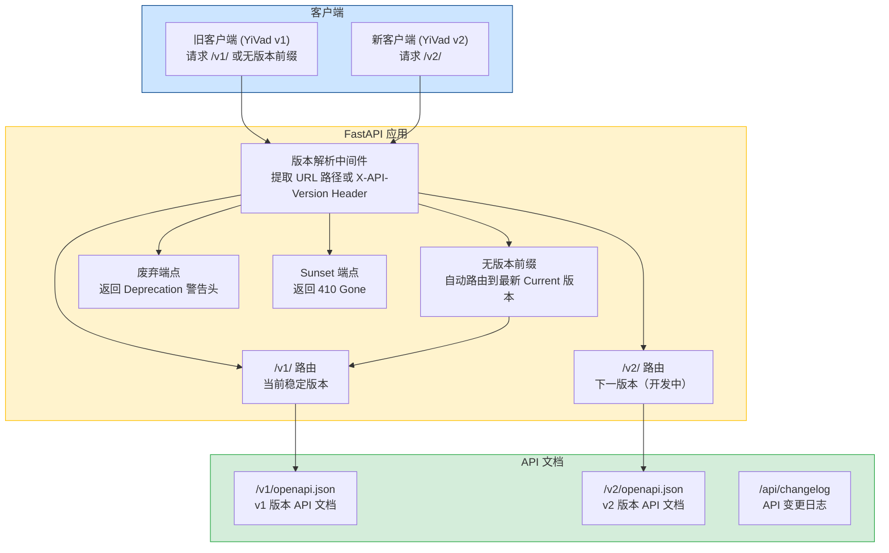
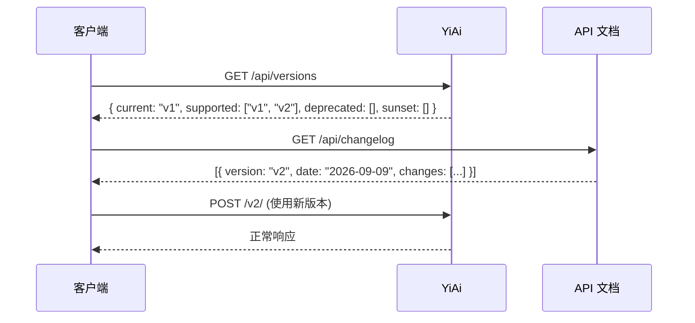

# YA-09-147: API 版本化策略 — 多版本共存 + 废弃生命周期 + 迁移指南自动生成

> 需求编号：YA-09-147 · 优先级：P2 · 人天：0.5d · 状态：需求已编写
> 依赖：无 · 前置需求：无

## 背景

YiAi 目前没有任何 API 版本化机制。所有 RPC 端点和 REST 端点（如 `/read-file`、`/write-file`）直接暴露，没有版本前缀。当需要引入破坏性变更（如修改 RPC 参数名称、移除废弃字段、变更响应格式）时，所有客户端（YiVad、YiPet）必须同步更新，否则会立即出现调用失败。这在多客户端环境中是不可接受的。

**问题：**

1. **无版本隔离**：破坏性变更直接部署到生产环境，旧客户端立即失效。
2. **无废弃通知**：客户端无法提前知道哪些 API 即将被废弃，没有迁移窗口。
3. **无 Sunset 策略**：废弃的 API 端点永久保留（代码中堆积），或突然删除（客户端报错），缺乏有序下线流程。
4. **无迁移指南**：每次 API 变更都需要手动编写迁移文档，格式不统一，容易遗漏。
5. **无版本文档**：OpenAPI 文档没有版本区分，客户端无法查看特定版本的 API 规范。

**影响：**

- 破坏性变更导致客户端调用失败，用户体验中断
- 前端团队需要与后端同步发布，增加协调成本
- 废弃代码堆积在代码库中，增加维护负担
- 新客户端无法了解 API 的版本兼容性

**挑战：**

- 需要同时支持 RPC 信封和 REST 端点的版本化
- 版本化策略不能显著增加路由复杂度
- 需要与现有的 FastAPI 路由注册方式兼容
- 废弃生命周期需要自动化，不能依赖人工记忆

---

## 一、现状分析

### 1.1 当前 API 端点状况

| 属性 | 当前值 | 说明 |
|------|--------|------|
| 版本化策略 | 无 | 所有端点无版本前缀 |
| 端点数量 | ~15 个 | RPC 信封 1 个 + REST 端点 ~14 个 |
| 客户端数量 | 2 个 | YiVad (SPA) + YiPet (Chrome 扩展) |
| 废弃机制 | 无 | 旧端点直接删除或永久保留 |
| 迁移文档 | 手动 | 在 YiKnowledge 中记录，无统一格式 |
| API 文档 | 单版本 OpenAPI | 通过 FastAPI 自动生成，无版本区分 |
| 变更通知 | 无 | 依赖团队口头沟通 |

### 1.2 根因分析矩阵

| 问题 | 根因 | 影响 | 紧急程度 |
|------|------|------|----------|
| 无版本隔离 | 项目初期只有一个客户端，无版本化需求 | 破坏性变更导致所有客户端同时受影响 | 中 |
| 无废弃通知 | 未设计 API 生命周期管理机制 | 客户端无法提前准备迁移 | 中 |
| 无 Sunset 策略 | 缺乏 API 治理规范 | 废弃代码堆积或突然删除 | 中 |
| 无迁移指南 | 未建立 API 变更文档规范 | 迁移成本高，易遗漏 | 低 |

### 1.3 现有端点分类

| 端点 | 类型 | 稳定性 | 变更频率 | 版本化优先级 |
|------|------|--------|----------|-------------|
| `POST /` (RPC 信封) | 核心 | 高 | 低 (参数偶尔新增) | P0 |
| `POST /read-file` | 文件 | 高 | 低 | P1 |
| `POST /write-file` | 文件 | 高 | 低 | P1 |
| `GET /knowledge/*` | 知识库 | 中 | 中 (新增端点) | P1 |
| `POST /rag/*` | RAG | 中 | 中 | P1 |
| `GET /health` | 健康检查 | 高 | 低 | P2 |
| `POST /graphql` (计划中) | GraphQL | — | — | P1 (新增时即版本化) |

### 1.4 改造前版本管理流程

```
开发者修改 API
  │
  └── 直接部署 → 所有客户端同时受影响
       │
       ├── 兼容变更: 旧客户端正常工作
       └── 破坏性变更: 旧客户端调用失败 → 紧急修复或回滚
```

---

## 二、设计决策

### 决策 1：版本标识方式 — URL 路径 vs Header vs 内容协商

| 维度 | URL 路径 (`/v1/`, `/v2/`) | Header (`X-API-Version`) | 内容协商 (`Accept: application/vnd.yiai.v1+json`) |
|------|--------------------------|-------------------------|---------------------------------------------------|
| 可见性 | 高（URL 中直接可见） | 低（隐藏在请求头中） | 低 |
| 路由实现 | 简单（FastAPI 原生支持） | 中等（需自定义中间件） | 复杂（需自定义内容协商） |
| 缓存友好 | 是（URL 变化自然区分缓存） | 否（同一 URL 不同版本） | 否 |
| 调试友好 | 高（URL 明确标识版本） | 低（需查看请求头） | 低 |
| REST 惯例 | 常见（Stripe, GitHub, GitLab） | 常见（AWS, Azure） | 少见 |
| 默认版本 | 需要（无版本前缀时默认最新） | 需要（无 Header 时默认最新） | 需要 |

**选择：URL 路径版本化（`/v1/`, `/v2/`）为主，Header 版本化为辅。** URL 路径是最直观、最易调试的方式，且与 FastAPI 的 `APIRouter(prefix="/v1")` 天然兼容。同时支持 `X-API-Version` Header 作为覆盖选项（当 Header 存在时优先使用 Header 指定的版本）。无版本前缀的请求自动路由到当前最新版本（保持向后兼容）。

### 决策 2：版本生命周期 — 两阶段 vs 三阶段

| 维度 | 两阶段 (Current → Sunset) | 三阶段 (Current → Deprecated → Sunset) |
|------|--------------------------|--------------------------------------|
| 迁移窗口 | 无缓冲期，直接下线 | 6 个月废弃期，给客户端迁移时间 |
| 实现复杂度 | 低 | 中 |
| 客户端体验 | 差（突然不可用） | 好（提前收到警告） |
| 行业惯例 | 不符合 | 符合（Stripe, GitHub, Google APIs） |

**选择：三阶段生命周期。** Current（当前活跃）→ Deprecated（废弃，6 个月警告期，返回 Deprecation 头部）→ Sunset（下线，返回 410 Gone）。6 个月的废弃期给客户端（YiVad、YiPet）充足的迁移时间。

### 决策 3：破坏性变更定义

| 变更类型 | 是否破坏性 | 版本策略 | 示例 |
|---------|-----------|---------|------|
| 新增可选字段 | 否 | 当前版本直接添加 | RPC 参数新增 `sort` 字段 |
| 新增必填字段 | 是 | 新版本 | 将 `filter` 从可选改为必填 |
| 删除字段 | 是 | 新版本 | 删除响应中的 `legacy_id` 字段 |
| 修改字段类型 | 是 | 新版本 | `count` 从 `int` 改为 `float` |
| 修改字段语义 | 是 | 新版本 | `status` 取值从 `open/closed` 改为 `active/inactive` |
| 新增端点 | 否 | 当前版本直接添加 | 新增 `/v1/export` 端点 |
| 删除端点 | 是 | 新版本 | 删除 `/v1/legacy-import` 端点 |
| 修改错误码含义 | 是 | 新版本 | 错误码 1001 从"参数错误"改为"认证失败" |

### 设计决策汇总

| 决策 | 选项 A | 选项 B | 选择 | 理由 |
|------|--------|--------|------|------|
| 版本标识 | URL 路径 | Header | URL 路径（主）+ Header（辅） | 可见性 + 调试友好 + FastAPI 原生支持 |
| 生命周期 | 两阶段 | 三阶段 | 三阶段 | 给客户端 6 个月迁移窗口，行业最佳实践 |
| 默认版本 | 无版本路由指向最新 | 无版本路由返回错误 | 指向最新 | 保持现有客户端兼容 |
| 废弃通知 | 仅文档 | 响应头 + 文档 | 响应头 + 文档 | 自动通知，不依赖人工查阅 |

---

## 三、目标架构

### 3.1 版本化路由架构



### 3.2 版本生命周期状态机

```mermaid
stateDiagram-v2
  [*] --> Current: 新 API 发布
  Current --> Deprecated: 宣布废弃（6 个月后 Sunset）
  Deprecated --> Sunset: 到达 Sunset 日期
  Sunset --> [*]: 移除端点代码

  note right of Current: 响应头: 无特殊标记\n所有客户端正常使用
  note right of Deprecated: 响应头: Deprecation: true\nSunset: <日期>\nLink: <迁移指南URL>
  note right of Sunset: 返回 HTTP 410 Gone\nbody: {message, migration_guide}
```

### 3.3 版本发现流程



---

## 四、具体改动

### 4.1 版本管理配置

**文件：** `shared/api_version.py`（新建）

```python
"""API 版本化配置与工具模块。"""

from enum import Enum
from datetime import datetime, timedelta
from typing import Optional, Dict, List
from dataclasses import dataclass, field


class VersionStatus(str, Enum):
    """API 版本状态。"""
    CURRENT = "current"        # 当前活跃版本
    DEPRECATED = "deprecated"  # 已废弃，6 个月后下线
    SUNSET = "sunset"          # 已下线，返回 410 Gone


@dataclass
class VersionInfo:
    """版本信息。"""
    version: str                           # 版本号，如 "v1", "v2"
    status: VersionStatus                  # 版本状态
    release_date: datetime                 # 发布日期
    sunset_date: Optional[datetime] = None # 计划下线日期
    migration_guide: Optional[str] = None  # 迁移指南 URL
    description: str = ""                  # 版本描述


@dataclass
class VersionConfig:
    """全局版本配置。"""
    versions: Dict[str, VersionInfo] = field(default_factory=dict)
    current_version: str = "v1"
    deprecation_warning_months: int = 6  # 提前 6 个月发出废弃警告

    def get_version(self, version: str) -> Optional[VersionInfo]:
        return self.versions.get(version)

    def get_current(self) -> VersionInfo:
        return self.versions[self.current_version]

    def get_deprecated_versions(self) -> List[VersionInfo]:
        return [v for v in self.versions.values() if v.status == VersionStatus.DEPRECATED]

    def get_sunset_versions(self) -> List[VersionInfo]:
        return [v for v in self.versions.values() if v.status == VersionStatus.SUNSET]

    def is_version_supported(self, version: str) -> bool:
        info = self.versions.get(version)
        return info is not None and info.status != VersionStatus.SUNSET


# 默认版本配置
version_config = VersionConfig(
    versions={
        "v1": VersionInfo(
            version="v1",
            status=VersionStatus.CURRENT,
            release_date=datetime(2025, 1, 1),
            description="初始稳定版本",
        ),
    },
    current_version="v1",
)
```

### 4.2 版本解析中间件

**文件：** `middleware/versioning.py`（新建）

```python
"""API 版本化中间件。"""

from fastapi import Request, HTTPException
from starlette.middleware.base import BaseHTTPMiddleware
from starlette.responses import JSONResponse
from datetime import datetime

from shared.api_version import version_config, VersionStatus
from shared.logging import get_logger

logger = get_logger(__name__)


class ApiVersioningMiddleware(BaseHTTPMiddleware):
    """API 版本化中间件。

    职责：
    1. 从 URL 路径或 X-API-Version Header 中解析请求的 API 版本
    2. 将版本信息注入 request.state
    3. 对废弃版本添加 Deprecation 响应头
    4. 对已下线版本返回 410 Gone
    """

    async def dispatch(self, request: Request, call_next):
        # 跳过非 API 路径（如 /health, /docs）
        path = request.url.path
        if not path.startswith(("/v1", "/v2", "/api", "/read-file", "/write-file", "/knowledge", "/rag", "/graphql")):
            return await call_next(request)

        # 解析版本
        requested_version = self._extract_version(request)
        request.state.api_version = requested_version

        # 检查版本状态
        version_info = version_config.get_version(requested_version)
        if version_info is None:
            # 未知版本，回退到当前版本
            request.state.api_version = version_config.current_version
            version_info = version_config.get_current()

        if version_info.status == VersionStatus.SUNSET:
            return JSONResponse(
                status_code=410,
                content={
                    "code": 410,
                    "message": f"API 版本 {requested_version} 已下线。"
                               f"请迁移到当前版本 {version_config.current_version}。",
                    "data": {
                        "sunset_version": requested_version,
                        "current_version": version_config.current_version,
                        "migration_guide": version_info.migration_guide,
                    },
                },
            )

        response = await call_next(request)

        # 添加版本响应头
        response.headers["X-API-Version"] = version_config.current_version

        if version_info.status == VersionStatus.DEPRECATED:
            response.headers["Deprecation"] = "true"
            if version_info.sunset_date:
                response.headers["Sunset"] = version_info.sunset_date.isoformat()
            if version_info.migration_guide:
                response.headers["Link"] = f'<{version_info.migration_guide}>; rel="deprecation"'

        return response

    def _extract_version(self, request: Request) -> str:
        """从 URL 路径或 Header 中提取 API 版本。"""
        # 优先使用 X-API-Version Header
        header_version = request.headers.get("X-API-Version")
        if header_version:
            return header_version.strip().lower()

        # 从 URL 路径中提取版本（如 /v1/sessions → v1）
        path = request.url.path
        for part in path.strip("/").split("/"):
            if part.startswith("v") and part[1:].isdigit():
                return part.lower()

        # 无版本标识，返回当前版本
        return version_config.current_version
```

### 4.3 版本化路由注册

**文件：** `services/versioned_routes.py`（新建）

```python
"""版本化路由注册辅助模块。"""

from fastapi import APIRouter, FastAPI
from typing import List, Optional

from shared.api_version import version_config, VersionInfo, VersionStatus


def create_versioned_router(version: str, prefix: str = "", tags: Optional[List[str]] = None) -> APIRouter:
    """创建带版本前缀的 APIRouter。

    用法:
        v1_router = create_versioned_router("v1", prefix="/sessions", tags=["sessions"])
        v2_router = create_versioned_router("v2", prefix="/sessions", tags=["sessions"])

        @v1_router.post("/query")
        async def query_sessions_v1(...): ...

        @v2_router.post("/query")
        async def query_sessions_v2(...): ...
    """
    full_prefix = f"/{version}{prefix}"
    return APIRouter(prefix=full_prefix, tags=tags or [])


def register_versioned_routers(
    app: FastAPI,
    routers: List[APIRouter],
):
    """批量注册版本化路由。

    同时注册无版本前缀的兼容路由（指向当前版本）。
    """
    current_version = version_config.current_version

    for router in routers:
        app.include_router(router)

        # 如果路由前缀以当前版本开头，同时注册无版本前缀的兼容路由
        if router.prefix.startswith(f"/{current_version}"):
            compat_prefix = router.prefix.replace(f"/{current_version}", "", 1) or ""
            compat_router = APIRouter(prefix=compat_prefix, tags=router.tags)
            # 复制路由
            for route in router.routes:
                compat_router.routes.append(route)
            app.include_router(compat_router)
```

### 4.4 API 变更日志端点

**文件：** `services/versioning/changelog.py`（新建）

```python
"""API 变更日志模块。"""

from datetime import datetime
from typing import List, Optional
from dataclasses import dataclass, field
from enum import Enum

from fastapi import APIRouter, Query


class ChangeType(str, Enum):
    ADDED = "added"
    CHANGED = "changed"
    DEPRECATED = "deprecated"
    REMOVED = "removed"
    FIXED = "fixed"


@dataclass
class ChangelogEntry:
    version: str
    date: datetime
    type: ChangeType
    endpoint: str
    description: str
    migration_notes: Optional[str] = None


# 预定义的变更日志
CHANGELOG: List[ChangelogEntry] = [
    ChangelogEntry(
        version="v1",
        date=datetime(2025, 1, 1),
        type=ChangeType.ADDED,
        endpoint="POST /",
        description="RPC 信封端点，统一的 API 入口",
    ),
    ChangelogEntry(
        version="v1",
        date=datetime(2025, 1, 1),
        type=ChangeType.ADDED,
        endpoint="POST /read-file",
        description="文件读取端点",
    ),
    # 后续变更在此追加
]

router = APIRouter(prefix="/api", tags=["versioning"])


@router.get("/versions")
async def list_versions():
    """列出所有 API 版本及其状态。"""
    from shared.api_version import version_config

    versions = []
    for v in version_config.versions.values():
        versions.append({
            "version": v.version,
            "status": v.status.value,
            "release_date": v.release_date.isoformat(),
            "sunset_date": v.sunset_date.isoformat() if v.sunset_date else None,
            "migration_guide": v.migration_guide,
            "description": v.description,
        })

    return {
        "code": 0,
        "data": {
            "current_version": version_config.current_version,
            "versions": versions,
        },
    }


@router.get("/changelog")
async def get_changelog(
    version: Optional[str] = Query(None, description="筛选特定版本"),
    change_type: Optional[ChangeType] = Query(None, description="筛选变更类型"),
    limit: int = Query(50, ge=1, le=200),
):
    """获取 API 变更日志。"""
    entries = CHANGELOG

    if version:
        entries = [e for e in entries if e.version == version]
    if change_type:
        entries = [e for e in entries if e.type == change_type]

    entries = sorted(entries, key=lambda e: e.date, reverse=True)[:limit]

    return {
        "code": 0,
        "data": {
            "entries": [
                {
                    "version": e.version,
                    "date": e.date.isoformat(),
                    "type": e.type.value,
                    "endpoint": e.endpoint,
                    "description": e.description,
                    "migration_notes": e.migration_notes,
                }
                for e in entries
            ],
        },
    }
```

### 4.5 版本化 OpenAPI 文档

**文件：** `main.py`（修改）

```python
# 在现有 FastAPI app 初始化后添加:

from fastapi.openapi.utils import get_openapi

# 为每个版本生成独立的 OpenAPI 文档
@app.get("/v1/openapi.json", include_in_schema=False)
async def get_v1_openapi():
    """v1 版本的 OpenAPI 文档。"""
    return get_openapi(
        title="YiAi API v1",
        version="1.0.0",
        description="YiAi API v1 - 当前稳定版本",
        routes=[r for r in app.routes if "/v1/" in getattr(r, "path", "")],
    )

# 客户端版本追踪端点
@app.get("/api/client-versions", include_in_schema=False)
async def get_client_versions():
    """获取已知客户端使用的 API 版本分布。"""
    # 从 YiVad 和 YiPet 的版本配置中获取
    return {
        "code": 0,
        "data": {
            "clients": [
                {"name": "YiVad", "current_version": "v1", "min_version": "v1"},
                {"name": "YiPet", "current_version": "v1", "min_version": "v1"},
            ],
        },
    }
```

### 4.6 涉及文件

```
YiAi/src/
├── shared/
│   └── api_version.py            # 新建: 版本配置与状态管理
├── middleware/
│   └── versioning.py             # 新建: 版本解析中间件
├── services/
│   ├── versioned_routes.py       # 新建: 版本化路由注册辅助
│   └── versioning/
│       ├── __init__.py           # 新建
│       └── changelog.py          # 新建: API 变更日志端点
└── main.py                        # 修改: 注册版本中间件 + 多版本 OpenAPI
```

---

## 五、实施步骤

| 步骤 | 内容 | 涉及文件 | 验证方式 | 人天 |
|------|------|---------|---------|------|
| 1 | 创建版本配置模块（VersionConfig, VersionInfo, VersionStatus） | `shared/api_version.py` | 单元测试：版本状态枚举和配置正确 | 0.05 |
| 2 | 实现版本解析中间件（URL 路径 + Header 解析） | `middleware/versioning.py` | 请求 `/v1/test` 正确解析为 v1，废弃版本返回 Deprecation 头 | 0.1 |
| 3 | 实现版本化路由注册辅助函数 | `services/versioned_routes.py` | 创建 v1 和 v2 版本路由，无版本前缀请求路由到 v1 | 0.1 |
| 4 | 实现 API 变更日志端点（/api/versions, /api/changelog） | `services/versioning/changelog.py` | GET /api/versions 返回版本列表，GET /api/changelog 返回变更日志 | 0.1 |
| 5 | 实现多版本 OpenAPI 文档生成 | `main.py` | GET /v1/openapi.json 返回 v1 文档，与 /openapi.json 当前版本文档一致 | 0.05 |
| 6 | 编写版本化策略文档并添加到 YiKnowledge | YiKnowledge | 文档包含版本生命周期、破坏性变更定义、迁移指南模板 | 0.05 |
| 7 | 集成测试：多版本共存 + 废弃响应 + Sunset 410 | `tests/versioning/` | 所有测试通过 | 0.05 |

**总计：0.5d**

---

## 六、测试规格

### Requirement: 版本解析

#### Scenario: 从 URL 路径解析版本
- **Given** 客户端请求 `POST /v1/sessions/query`
- **When** 版本解析中间件处理请求
- **Then** `request.state.api_version` 为 `"v1"`
- **And** 请求正常路由到 v1 版本的 handler

#### Scenario: 从 Header 解析版本（覆盖 URL 路径）
- **Given** 客户端请求 `POST /v1/sessions/query`，Header 包含 `X-API-Version: v2`
- **When** 版本解析中间件处理请求
- **Then** `request.state.api_version` 为 `"v2"`（Header 优先）
- **And** 请求路由到 v2 版本的 handler

### Requirement: 废弃版本通知

#### Scenario: 废弃版本返回 Deprecation 响应头
- **Given** API 版本 `v1` 状态为 `deprecated`，Sunset 日期为 `2027-03-09`
- **When** 客户端请求 `POST /v1/sessions/query`
- **Then** 响应头包含 `Deprecation: true`
- **And** 响应头包含 `Sunset: 2027-03-09T00:00:00`
- **And** 响应头包含 `Link: <...>; rel="deprecation"` 指向迁移指南
- **And** 业务响应正常返回（不阻断请求）

### Requirement: 已下线版本

#### Scenario: Sunset 版本返回 410 Gone
- **Given** API 版本 `v0` 状态为 `sunset`
- **When** 客户端请求 `POST /v0/sessions/query`
- **Then** HTTP 状态码为 410
- **And** 响应体包含 `message` 说明版本已下线
- **And** 响应体包含 `migration_guide` 指向迁移指南

### Requirement: 无版本前缀兼容

#### Scenario: 无版本前缀请求路由到当前版本
- **Given** 当前版本为 `v1`
- **When** 客户端请求 `POST /sessions/query`（无版本前缀）
- **Then** `request.state.api_version` 为 `"v1"`
- **And** 请求正常路由到 v1 版本的 handler
- **And** 响应头包含 `X-API-Version: v1`

### Requirement: API 变更日志

#### Scenario: 查询变更日志
- **Given** CHANGELOG 中有 3 条 v1 的变更记录
- **When** 客户端请求 `GET /api/changelog?version=v1`
- **Then** 返回 `{ code: 0, data: { entries: [...] } }`
- **And** entries 数组包含 3 条记录，按日期降序排列

---

## 七、风险与缓解

| 风险 | 概率 | 影响 | 等级 | 缓解措施 | 应急预案 |
|------|------|------|------|----------|----------|
| 中间件影响所有请求性能 | 低 | 中 | 低 | 版本解析中间件仅做简单的字符串匹配和字典查找，无 IO 操作 | 性能回归测试中监控 P95 延迟变化 |
| 版本配置错误导致所有请求路由到错误版本 | 低 | 高 | 中 | 版本配置在应用启动时加载和验证，错误配置阻止启动 | 回滚版本配置，重启服务 |
| 废弃版本被过早 Sunset（配置错误） | 低 | 中 | 低 | Sunset 日期在配置中明确指定，变更需 Code Review | 将版本状态改回 Deprecated，延长 Sunset 日期 |
| 客户端不更新导致大量请求使用废弃版本 | 高 | 低 | 低 | 通过 `X-API-Version` 响应头告知客户端当前版本，废弃版本日志中记录使用量 | 在废弃版本接近 Sunset 时主动通知客户端团队 |
| 多版本共存导致代码库膨胀 | 中 | 中 | 中 | 仅维护 2 个版本（当前 + 上一版本），Sunset 版本代码在下一个版本发布时删除 | 代码审查中严格控制版本代码的复制粘贴 |

---

## 八、回滚策略

| 场景 | 回滚方式 | 回滚时间 | 风险 |
|------|---------|---------|------|
| 版本中间件导致请求失败 | 在 `main.py` 中移除中间件注册，重启服务 | < 1min | 低：移除后请求恢复为无版本模式 |
| 版本配置错误导致路由异常 | 修正 `api_version.py` 中的配置，重启服务 | < 2min | 低：配置热修复 |
| 新版本端点有 Bug | 将新版本状态改为 `deprecated`，客户端回退到旧版本 | < 5min | 低：旧版本端点不受影响 |
| Sunset 版本误触发 | 将版本状态从 `sunset` 改回 `deprecated` 或 `current` | < 1min | 低：配置修改即时生效 |

---

## 九、设计决策记录

### D-01: 为什么选择 URL 路径版本化而非 Header 版本化？

URL 路径版本化（`/v1/`, `/v2/`）的优势在于：1) 可见性——开发者和运维人员可以直接从 URL 识别 API 版本，调试方便；2) FastAPI 原生支持——`APIRouter(prefix="/v1")` 零额外代码；3) 缓存友好——不同版本的 URL 在 CDN 和代理层自然区分。Header 版本化作为补充方案（当 Header 存在时优先使用），为需要动态切换版本的场景提供灵活性。

### D-02: 为什么废弃期设为 6 个月？

6 个月是基于 YiAi 客户端（YiVad、YiPet）的发布周期设计的。YiVad 和 YiPet 的迭代周期约为 2-4 周，6 个月提供了 6-12 个迭代周期的迁移窗口，足够客户端团队安排迁移工作。同时参考了 Stripe（12 个月）、GitHub（3-6 个月）等行业实践，取中间值。

### D-03: 为什么无版本前缀请求路由到当前版本而不是返回错误？

YiAi 的现有客户端（YiVad、YiPet）均使用无版本前缀的 URL。如果无版本前缀请求返回错误，将导致所有现有客户端立即不可用。路由到当前版本确保了向后兼容性，同时通过 `X-API-Version` 响应头逐步引导客户端迁移到显式版本化请求。

### D-04: 为什么只维护 2 个版本（当前 + 上一版本）？

维护多个版本会增加代码库膨胀、测试矩阵扩大和安全修复成本。Stripe 维护 1 个版本（最新），GitHub 维护 1 个版本（当前）。YiAi 选择维护 2 个版本（当前 + 上一废弃版本），在兼容性和维护成本之间取得平衡。6 个月后，上一版本 Sunset 并从代码中移除。

---

## 十、可观测性

### 关键指标

| 指标 | 采集方式 | 告警阈值 | 说明 |
|------|---------|---------|------|
| 各版本请求量分布 | 中间件统计 `request.state.api_version` | 废弃版本请求量 > 50% | 大量客户端未迁移 |
| 废弃版本使用率 | 废弃版本请求量 / 总请求量 | > 30% 持续 3 个月 | 客户端迁移进度慢 |
| Sunset 版本 410 响应数 | 统计 HTTP 410 响应次数 | > 0 | 有客户端使用已下线版本 |
| 无版本前缀请求量 | 统计无版本前缀的请求数 | 监控趋势 | 期望随版本化推广而下降 |
| 版本中间件延迟 | `time.perf_counter()` 测量中间件耗时 | P95 > 1ms | 中间件应极轻量 |

### 日志规范

| 日志级别 | 场景 | 示例 |
|---------|------|------|
| `INFO` | 版本化中间件初始化 | `[Versioning] 中间件已注册, 当前版本: v1, 支持版本: [v1]` |
| `WARN` | 废弃版本被大量使用 | `[Versioning] 废弃版本 v0 请求占比 45%, 建议通知客户端迁移` |
| `WARN` | Sunset 版本被访问 | `[Versioning] 已下线版本 v0 被访问, 来源 IP: 192.168.1.1` |
| `ERROR` | 版本配置加载失败 | `[Versioning] 版本配置无效: 缺少当前版本定义` |

### 告警规则

| 告警名称 | 条件 | 通知渠道 | 处理建议 |
|---------|------|---------|---------|
| 废弃版本高使用率 | 废弃版本请求占比 > 50% | 企业微信 | 通知客户端团队加速迁移 |
| Sunset 版本被访问 | 任何 410 响应 | 企业微信 | 检查是否有旧客户端仍在运行 |
| 版本配置错误 | 应用启动时配置验证失败 | 企业微信 + 阻断启动 | 修正版本配置文件 |

---

## 十一、代码审查检查清单

- [ ] 版本配置 `VersionConfig` 在应用启动时加载并验证
- [ ] 版本解析中间件仅处理 API 路径，跳过 `/health`、`/docs` 等非 API 路径
- [ ] `X-API-Version` Header 优先于 URL 路径版本
- [ ] 无版本前缀请求正确路由到 `current_version`
- [ ] 废弃版本响应包含 `Deprecation`、`Sunset`、`Link` 响应头
- [ ] Sunset 版本返回 HTTP 410 + JSON 响应体（含迁移指南链接）
- [ ] 版本化路由注册函数 `create_versioned_router` 正确拼接前缀
- [ ] API 变更日志端点支持按版本和变更类型筛选
- [ ] 多版本 OpenAPI 文档路径不冲突（`/v1/openapi.json`, `/v2/openapi.json`）
- [ ] 中间件不在响应体中修改业务数据，仅添加响应头
- [ ] `ruff` 代码规范通过
- [ ] `mypy` 类型检查通过

---

## 回归问题预测

| # | 问题 | 发现场景 | 根因 | 修复方式 |
|---|------|---------|------|---------|
| 1 | 版本中间件拦截了 `/docs` 和 `/openapi.json` 路径，导致 API 文档无法访问 | 部署后访问 `/docs` 返回 410 Gone 或版本错误 | 中间件的路径匹配规则过于宽泛，将 `/docs` 和 `/openapi.json` 也当作 API 路径处理 | 在中间件的 `dispatch` 方法中显式排除 `/docs`、`/openapi.json`、`/redoc` 等 FastAPI 内置路径 |
| 2 | 无版本前缀请求路由到当前版本，但 `X-API-Version` 响应头在 CORS 配置中未暴露 | 前端无法读取 `X-API-Version` 响应头，无法获取当前版本信息 | FastAPI CORS 中间件默认不暴露自定义响应头，前端 `fetch` 无法通过 `response.headers.get()` 读取 | 在 CORS 配置的 `expose_headers` 中添加 `X-API-Version`、`Deprecation`、`Sunset`、`Link` |
| 3 | 版本化 OpenAPI 文档生成时 `get_openapi` 的 `routes` 参数过滤逻辑有误，导致文档不完整 | 访问 `/v1/openapi.json` 时返回的文档缺少某些端点 | `getattr(r, "path", "")` 对某些路由对象返回空字符串，过滤条件 `"/v1/" in path` 遗漏了路径为空的合法路由 | 使用 `r.path if hasattr(r, "path") else ""` 安全访问，并增加调试日志记录被过滤的路由 |
| 4 | `create_versioned_router` 的无版本兼容路由复制了原始路由对象，导致 FastAPI 路由注册冲突 | 启动时报错 "Duplicate route" 或路由注册失败 | `compat_router.routes.append(route)` 直接复制了路由对象引用，FastAPI 检测到相同路径的重复路由 | 使用 `APIRouter` 的 `add_api_route` 方法重新创建路由，而非直接复制路由对象 |
| 5 | 废弃版本响应头中的 `Sunset` 日期格式不符合 HTTP RFC 7231 标准 | 客户端解析 `Sunset` 头部时失败，无法正确获取下线日期 | `datetime.isoformat()` 默认输出 `2027-03-09T00:00:00`，但 HTTP Sunset 头部要求格式为 `Sat, 09 Mar 2027 00:00:00 GMT` (RFC 1123) | 使用 `sunset_date.strftime("%a, %d %b %Y %H:%M:%S GMT")` 格式化 Sunset 头部 |
| 6 | 版本变更日志手动维护，开发者在发布新版本时忘记更新 CHANGELOG | 查询 `/api/changelog` 时缺少最新版本的变更记录 | CHANGELOG 是硬编码的 Python 列表，依赖开发者手动追加，缺乏自动化机制 | 在 CI 中添加检查：如果 `/v2/` 路由有变更但 CHANGELOG 未更新，CI 失败并提示开发者更新 |

---

## 性能分析

### 中间件性能

| 操作 | 耗时 | 说明 |
|------|------|------|
| 版本解析（URL 路径） | < 0.1ms | 简单的字符串 `startswith` 和 `split` 操作 |
| 版本解析（Header） | < 0.1ms | 字典查找 |
| 版本状态检查 | < 0.1ms | 字典查找 + 枚举比较 |
| 响应头注入 | < 0.1ms | 设置 3-4 个 HTTP 响应头 |
| 中间件总延迟 | < 0.5ms | 对请求总延迟影响可忽略不计 |

### 存储开销

| 资源 | 开销 | 说明 |
|------|------|------|
| 内存 | < 1MB | 版本配置对象 + 中间件状态 |
| 磁盘 | 0 | 无需持久化存储，配置在代码中 |
| 数据库 | 0 | 不涉及数据库操作 |

### 对现有 API 的影响

| 场景 | 影响 | 说明 |
|------|------|------|
| 无版本前缀请求 | 延迟增加 < 0.5ms | 仅中间件处理，路由行为不变 |
| 版本化请求 (`/v1/...`) | 延迟增加 < 0.5ms | 路由正常，中间件透传 |
| 废弃版本请求 | 延迟增加 < 0.5ms | 额外写入 3 个响应头 |
| 响应体大小 | 不增加 | 响应头增加约 200 字节 |

---

*PRD 来源: `projects/yiai/requirements/2026-09/00-需求-需求总览.md`*

## 影响范围

- **影响模块**：待补充
- **涉及文件**：
- `main.py`
- `api_version.py`
- **是否影响 API 契约**：否
- **是否影响其他项目（YiVad/YiPet）**：否
- **用户感知**：待确认

## 预防措施

| 层面 | 措施 |
|------|------|
| 代码 | 在相关函数中添加参数校验和边界检查 |
| 测试 | 为 `main.py` 添加单元测试 |
| 流程 | 代码审查时重点检查此类模式 |
| 监控 | 添加日志告警，异常发生时及时发现 |
| 文档 | 在编码规范中记录此类反模式 |

## 经验教训

1. **根本原因**：开发过程中对边界情况和异常路径的考虑不足是此类问题的共同根因
2. **设计阶段**：在接口设计和模块实现时，应主动考虑异常输入、空值、超时等边界场景
3. **代码审查**：审查时应检查是否存在类似的反模式（如未捕获异常、无超时控制、缺少参数校验等）
4. **测试覆盖**：异常路径的测试覆盖率应与正常路径同等重视
5. **团队分享**：此类问题应在团队周会或技术分享中讨论，形成团队共识
