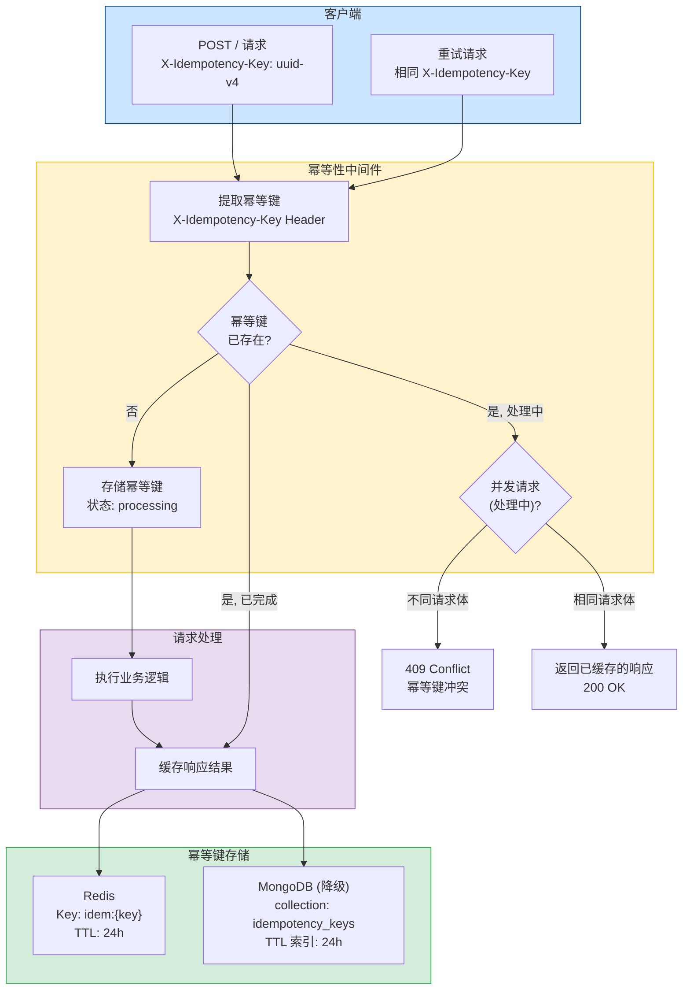
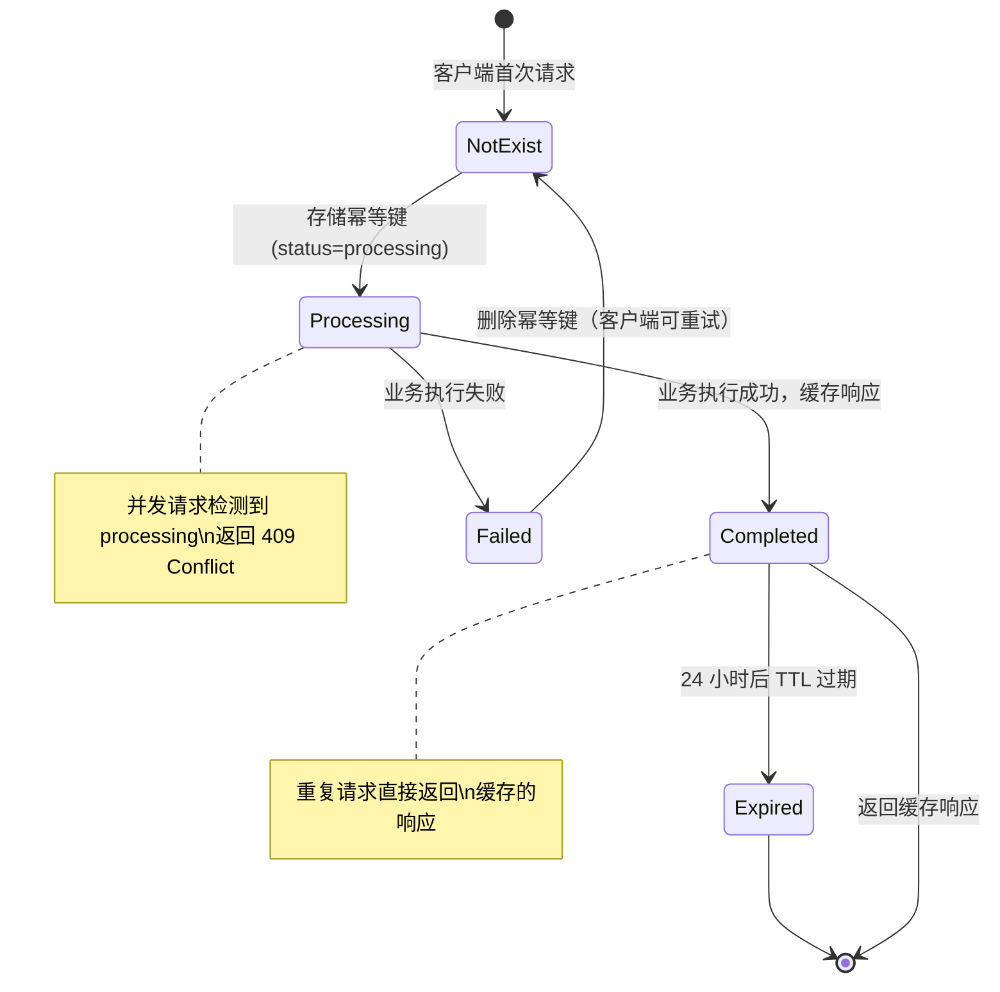
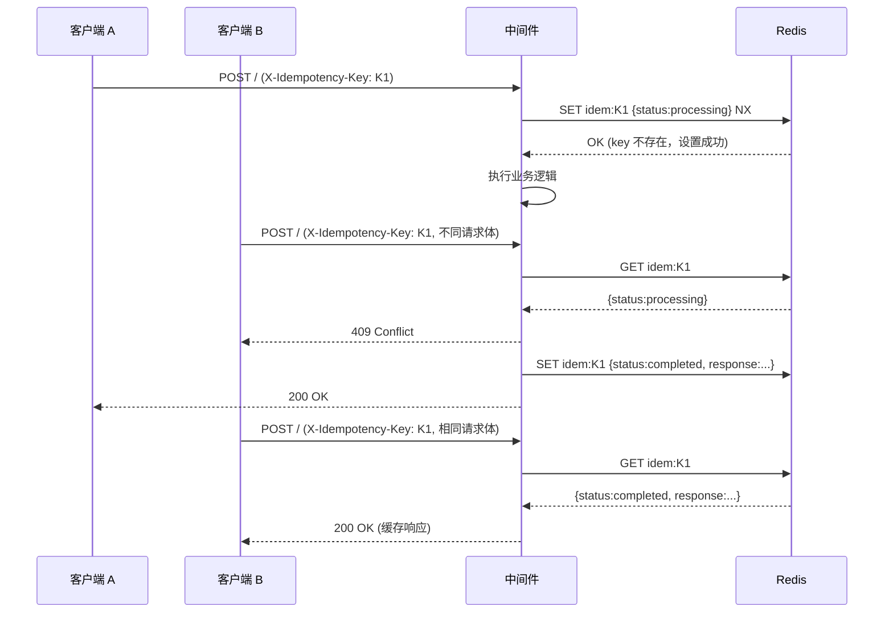

# YA-09-148: 请求重放与幂等性保护 — 幂等键机制 + Redis 缓存 + 并发冲突检测

> 需求编号：YA-09-148 · 优先级：P2 · 人天：0.5d · 状态：需求已编写
> 依赖：Redis（如未部署，可使用 MongoDB 替代） · 前置需求：无

## 背景

YiAi 当前的 RPC 信封和 REST 端点均未实现幂等性保护。在网络不稳定时，客户端（YiVad、YiPet）的重试逻辑可能导致同一操作被执行多次。例如：用户点击"创建会话"按钮后网络超时，前端自动重试，导致创建了 2 个完全相同的会话。对于数据变更类操作（创建文档、更新状态、删除记录），缺乏幂等性保护可能导致数据重复、状态不一致等问题。

**问题：**

1. **无幂等性保护**：POST 请求在网络重试时可能被重复执行，导致数据重复。
2. **无请求去重**：相同的请求可以被多次提交，服务端无法识别重复请求。
3. **无并发冲突检测**：同一幂等键的并发请求可能导致竞态条件（两个请求同时创建，都认为自己是第一个）。
4. **关键操作无保护**：创建文档、更新关键状态、发送通知等操作没有幂等性保证。

**影响：**

- 网络重试 → 重复创建会话/文档 → 数据冗余
- 用户快速双击 → 重复提交 → 业务逻辑错误
- 前端乐观更新失败回滚 → 重复请求 → 数据不一致
- 消息队列重试 → 重复处理 → 重复通知

**挑战：**

- 需要存储幂等键及其响应，引入外部存储依赖（Redis 或 MongoDB）
- 幂等键的 TTL 需要平衡存储成本和安全性
- 需要区分真正的"相同请求"和"不同请求使用相同幂等键"
- 需要与现有的限流机制协调

---

## 一、现状分析

### 1.1 当前请求处理流程

| 属性 | 当前值 | 说明 |
|------|--------|------|
| 幂等性保护 | 无 | 所有请求无幂等性检查 |
| 请求去重 | 无 | 相同请求可被多次处理 |
| 重试机制 | 仅客户端 | YiVad RequestHttp 和 YiPet ApiClient 有重试逻辑 |
| 并发控制 | 无 | 无请求级锁或排队机制 |
| 响应缓存 | 无 | 每次请求都重新执行完整逻辑 |
| 外部缓存 | 可选 | Redis 未强制部署，当前可能不存在 |

### 1.2 根因分析矩阵

| 问题 | 根因 | 影响 | 紧急程度 |
|------|------|------|----------|
| 重复创建 | 网络重试时服务端无幂等性检查 | 创建重复数据，浪费存储，混淆用户 | 中 |
| 重复更新 | 相同更新操作被多次执行 | 状态被错误覆盖，审计日志混乱 | 中 |
| 并发冲突 | 无并发控制，两个请求同时处理同一资源 | 数据不一致，竞态条件 | 中 |
| 无请求追踪 | 无法关联原始请求和重试请求 | 难以排查重复数据问题 | 低 |

### 1.3 受影响的操作分类

| 操作类型 | HTTP 方法 | 天然幂等 | 需要幂等键 | 示例 |
|---------|----------|---------|-----------|------|
| 查询 | GET | 是 | 否 | 查询会话列表 |
| 替换 | PUT | 是 | 否 | 替换文件内容 |
| 删除 | DELETE | 是 | 否 | 删除会话 |
| 创建 | POST | 否 | 是 | 创建会话、创建 Bug |
| 部分更新 | PATCH | 否 | 是 | 更新会话标签 |
| RPC 变更 | POST (RPC) | 否 | 是 | `data_service.insert_document` |

### 1.4 改造前请求处理流程

```
客户端发送 POST 请求
  │
  ├── 网络超时（无响应）
  │     └── 客户端重试 → 服务端再次处理 → 可能创建重复数据
  │
  ├── 服务端处理成功但响应丢失
  │     └── 客户端重试 → 服务端再次处理 → 重复数据
  │
  └── 用户快速双击
        └── 两个相同请求同时到达 → 竞态条件 → 重复创建
```

---

## 二、设计决策

### 决策 1：幂等键存储 — Redis vs MongoDB vs 内存

| 维度 | Redis | MongoDB | 内存 (dict) |
|------|-------|---------|-------------|
| 持久化 | 是（RDB/AOF） | 是 | 否（重启丢失） |
| TTL 支持 | 原生 `EXPIRE` | 需 TTL 索引 | 需手动清理 |
| 并发安全 | 单线程，原子操作 | 需事务或乐观锁 | 需 asyncio.Lock |
| 查询性能 | 亚毫秒级 | 毫秒级 | 微秒级 |
| 部署依赖 | 需要额外部署 Redis | 复用现有 MongoDB | 无依赖 |
| 分布式支持 | 是 | 是 | 否（单进程） |
| 适合场景 | 生产环境 | 过渡方案 | 开发环境 |

**选择：Redis 为主，MongoDB 为降级方案。** 当 Redis 可用时，使用 Redis 存储幂等键（24 小时 TTL，原子操作）。当 Redis 不可用时，自动降级为 MongoDB 存储（利用 TTL 索引自动过期）。开发环境可使用内存存储。

### 决策 2：幂等键来源 — 客户端生成 vs 服务端生成

| 维度 | 客户端生成 (X-Idempotency-Key) | 服务端生成 (请求指纹) |
|------|-------------------------------|---------------------|
| 控制力 | 客户端完全控制幂等性范围 | 服务端自动去重 |
| 灵活性 | 客户端可决定哪些请求视为"相同" | 服务端基于请求内容判断 |
| 碰撞风险 | 客户端需保证唯一性 (UUID) | 哈希碰撞风险 (极低) |
| 标准兼容 | 符合 IETF 草案标准 | 非标准方案 |
| 实现复杂度 | 低（仅需读取 Header） | 中（需计算哈希 + 处理冲突） |

**选择：客户端生成（`X-Idempotency-Key` Header），服务端指纹作为补充。** 客户端生成的幂等键符合 IETF 幂等键草案标准，且给客户端最大的灵活性。服务端同时计算请求指纹（`method + path + body_hash + user_id`）用于审计和冲突检测。

### 决策 3：并发请求处理 — 先到先得 vs 排队等待

| 维度 | 先到先得 (409 Conflict) | 排队等待 (串行执行) |
|------|------------------------|-------------------|
| 实现复杂度 | 低（检测冲突 → 返回 409） | 中（需要锁和超时机制） |
| 客户端体验 | 客户端需处理 409 并重试 | 客户端等待即可 |
| 资源消耗 | 低（不持有连接） | 中（可能长时间持有连接） |
| 死锁风险 | 无 | 有（锁超时需处理） |

**选择：先到先得（409 Conflict）。** 并发请求检测到相同幂等键时，第一个请求正常处理，后续请求返回 409 Conflict。客户端收到 409 后可以等待并重试（此时幂等键已有缓存响应，直接返回）。

### 设计决策汇总

| 决策 | 选项 A | 选项 B | 选择 | 理由 |
|------|--------|--------|------|------|
| 存储后端 | Redis | MongoDB | Redis（主）+ MongoDB（降级） | 性能优先，自动降级保证可用性 |
| 幂等键来源 | 客户端生成 | 服务端指纹 | 客户端生成（主）+ 指纹（辅） | 符合 IETF 标准，客户端灵活控制 |
| 并发处理 | 409 Conflict | 排队等待 | 409 Conflict | 简单可靠，无死锁风险 |
| TTL 策略 | 24 小时 | 7 天 | 24 小时 | 平衡存储成本和重试窗口 |

---

## 三、目标架构

### 3.1 幂等性保护架构



### 3.2 幂等键生命周期



### 3.3 并发冲突检测流程



---

## 四、具体改动

### 4.1 幂等键存储抽象层

**文件：** `services/idempotency/store.py`（新建）

```python
"""幂等键存储抽象层。支持 Redis（主）和 MongoDB（降级）。"""

import hashlib
import json
from abc import ABC, abstractmethod
from datetime import datetime, timedelta
from typing import Optional, Dict, Any
from enum import Enum

from shared.logging import get_logger

logger = get_logger(__name__)


class IdempotencyStatus(str, Enum):
    PROCESSING = "processing"
    COMPLETED = "completed"
    FAILED = "failed"


class IdempotencyRecord:
    """幂等键记录。"""

    def __init__(
        self,
        key: str,
        status: IdempotencyStatus,
        response: Optional[Dict[str, Any]] = None,
        request_fingerprint: Optional[str] = None,
        created_at: Optional[datetime] = None,
    ):
        self.key = key
        self.status = status
        self.response = response
        self.request_fingerprint = request_fingerprint
        self.created_at = created_at or datetime.now()

    def to_dict(self) -> dict:
        return {
            "key": self.key,
            "status": self.status.value,
            "response": self.response,
            "request_fingerprint": self.request_fingerprint,
            "created_at": self.created_at.isoformat(),
        }

    @classmethod
    def from_dict(cls, data: dict) -> "IdempotencyRecord":
        return cls(
            key=data["key"],
            status=IdempotencyStatus(data["status"]),
            response=data.get("response"),
            request_fingerprint=data.get("request_fingerprint"),
            created_at=datetime.fromisoformat(data["created_at"]) if data.get("created_at") else None,
        )


class IdempotencyStore(ABC):
    """幂等键存储抽象基类。"""

    @abstractmethod
    async def get(self, key: str) -> Optional[IdempotencyRecord]:
        """获取幂等键记录。"""
        ...

    @abstractmethod
    async def set(self, record: IdempotencyRecord, ttl_seconds: int = 86400) -> bool:
        """设置幂等键记录（仅当 key 不存在时）。返回 True 表示设置成功。"""
        ...

    @abstractmethod
    async def update(self, key: str, status: IdempotencyStatus, response: Optional[dict] = None):
        """更新幂等键记录状态。"""
        ...

    @abstractmethod
    async def delete(self, key: str):
        """删除幂等键记录。"""
        ...


class RedisIdempotencyStore(IdempotencyStore):
    """基于 Redis 的幂等键存储。"""

    def __init__(self, redis_client):
        self.redis = redis_client

    async def get(self, key: str) -> Optional[IdempotencyRecord]:
        data = await self.redis.get(f"idem:{key}")
        if data:
            return IdempotencyRecord.from_dict(json.loads(data))
        return None

    async def set(self, record: IdempotencyRecord, ttl_seconds: int = 86400) -> bool:
        key = f"idem:{record.key}"
        value = json.dumps(record.to_dict(), default=str)
        # SET NX: 仅当 key 不存在时设置
        result = await self.redis.set(key, value, nx=True, ex=ttl_seconds)
        return result is True

    async def update(self, key: str, status: IdempotencyStatus, response: Optional[dict] = None):
        record = await self.get(key)
        if record:
            record.status = status
            if response is not None:
                record.response = response
            await self.redis.set(
                f"idem:{key}",
                json.dumps(record.to_dict(), default=str),
                keepttl=True,
            )

    async def delete(self, key: str):
        await self.redis.delete(f"idem:{key}")


class MongoIdempotencyStore(IdempotencyStore):
    """基于 MongoDB 的幂等键存储（降级方案）。"""

    def __init__(self, db):
        self.collection = db.idempotency_keys
        # 确保 TTL 索引存在
        self._ensure_indexes()

    async def _ensure_indexes(self):
        """创建 TTL 索引（24 小时后自动过期）。"""
        try:
            await self.collection.create_index(
                "created_at",
                expireAfterSeconds=86400,
                name="idempotency_ttl",
            )
            await self.collection.create_index(
                "key",
                unique=True,
                name="idempotency_key_unique",
            )
        except Exception as e:
            logger.warning(f"[Idempotency] 索引创建失败（可能已存在）: {e}")

    async def get(self, key: str) -> Optional[IdempotencyRecord]:
        doc = await self.collection.find_one({"key": key})
        if doc:
            return IdempotencyRecord.from_dict(doc)
        return None

    async def set(self, record: IdempotencyRecord, ttl_seconds: int = 86400) -> bool:
        try:
            await self.collection.insert_one(record.to_dict())
            return True
        except Exception:
            # 唯一索引冲突 = key 已存在
            return False

    async def update(self, key: str, status: IdempotencyStatus, response: Optional[dict] = None):
        update_fields = {"status": status.value}
        if response is not None:
            update_fields["response"] = response
        await self.collection.update_one(
            {"key": key},
            {"$set": update_fields},
        )

    async def delete(self, key: str):
        await self.collection.delete_one({"key": key})


class MemoryIdempotencyStore(IdempotencyStore):
    """基于内存的幂等键存储（仅开发环境）。"""

    def __init__(self):
        self._store: Dict[str, IdempotencyRecord] = {}
        self._timestamps: Dict[str, datetime] = {}

    async def get(self, key: str) -> Optional[IdempotencyRecord]:
        self._cleanup_expired()
        return self._store.get(key)

    async def set(self, record: IdempotencyRecord, ttl_seconds: int = 86400) -> bool:
        self._cleanup_expired()
        if record.key in self._store:
            return False
        self._store[record.key] = record
        self._timestamps[record.key] = datetime.now()
        return True

    async def update(self, key: str, status: IdempotencyStatus, response: Optional[dict] = None):
        if key in self._store:
            self._store[key].status = status
            if response is not None:
                self._store[key].response = response

    async def delete(self, key: str):
        self._store.pop(key, None)
        self._timestamps.pop(key, None)

    def _cleanup_expired(self):
        """清理过期记录（24 小时）。"""
        cutoff = datetime.now() - timedelta(hours=24)
        expired = [k for k, t in self._timestamps.items() if t < cutoff]
        for k in expired:
            self._store.pop(k, None)
            self._timestamps.pop(k, None)
```

### 4.2 幂等性中间件

**文件：** `middleware/idempotency.py`（新建）

```python
"""幂等性保护中间件。"""

import hashlib
import json
from fastapi import Request, HTTPException
from starlette.middleware.base import BaseHTTPMiddleware
from starlette.responses import JSONResponse

from services.idempotency.store import (
    IdempotencyStore, IdempotencyRecord, IdempotencyStatus,
)
from shared.logging import get_logger

logger = get_logger(__name__)


def compute_request_fingerprint(request: Request) -> str:
    """计算请求指纹（用于检测不同请求使用相同幂等键）。

    指纹 = SHA256(method + path + body_hash + user_id)
    """
    body_hash = hashlib.sha256(
        request.state.body_bytes if hasattr(request.state, "body_bytes") else b""
    ).hexdigest()[:16]

    user_id = getattr(request.state, "user_id", "anonymous")

    fingerprint_input = f"{request.method}|{request.url.path}|{body_hash}|{user_id}"
    return hashlib.sha256(fingerprint_input.encode()).hexdigest()[:16]


class IdempotencyMiddleware(BaseHTTPMiddleware):
    """幂等性保护中间件。

    职责：
    1. 提取 X-Idempotency-Key 请求头
    2. 检查幂等键是否已存在（已完成 → 返回缓存响应；处理中 → 409 Conflict）
    3. 首次请求存储幂等键（状态: processing）
    4. 业务完成后更新幂等键状态（completed）并缓存响应
    5. 业务失败时删除幂等键（允许客户端重试）
    """

    def __init__(self, app, store: IdempotencyStore):
        super().__init__(app)
        self.store = store

    async def dispatch(self, request: Request, call_next):
        # 仅对数据变更类请求启用幂等性保护
        if request.method not in ("POST", "PUT", "PATCH", "DELETE"):
            return await call_next(request)

        # 提取幂等键
        idempotency_key = request.headers.get("X-Idempotency-Key")
        if not idempotency_key:
            return await call_next(request)

        # 跳过非幂等键相关的请求（幂等键为空或过于简单）
        if len(idempotency_key) < 8:
            return await call_next(request)

        # 计算请求指纹
        fingerprint = compute_request_fingerprint(request)

        # 检查幂等键是否已存在
        existing = await self.store.get(idempotency_key)

        if existing:
            if existing.status == IdempotencyStatus.COMPLETED:
                # 已完成：返回缓存的响应
                logger.info(f"[Idempotency] 返回缓存响应: key={idempotency_key[:8]}...")
                if existing.response:
                    return JSONResponse(
                        content=existing.response.get("body", {}),
                        status_code=existing.response.get("status_code", 200),
                        headers=existing.response.get("headers", {}),
                    )
                return JSONResponse(
                    content={"code": 0, "message": "ok (idempotent)", "data": None},
                )

            elif existing.status == IdempotencyStatus.PROCESSING:
                # 处理中：检查是否为相同请求
                if existing.request_fingerprint != fingerprint:
                    logger.warning(
                        f"[Idempotency] 幂等键冲突: key={idempotency_key[:8]}..., "
                        f"不同请求体使用相同幂等键"
                    )
                    return JSONResponse(
                        status_code=409,
                        content={
                            "code": 409,
                            "message": "幂等键冲突：相同幂等键的不同请求正在处理中",
                            "data": {
                                "idempotency_key": idempotency_key,
                                "suggestion": "请使用不同的幂等键重试",
                            },
                        },
                    )
                else:
                    # 相同请求：等待处理完成（简单轮询，生产环境可用更优雅的方式）
                    logger.info(f"[Idempotency] 重复请求等待: key={idempotency_key[:8]}...")
                    return JSONResponse(
                        status_code=409,
                        content={
                            "code": 409,
                            "message": "请求处理中，请稍后重试",
                            "data": {"idempotency_key": idempotency_key},
                        },
                    )

        # 首次请求：存储幂等键（状态: processing）
        record = IdempotencyRecord(
            key=idempotency_key,
            status=IdempotencyStatus.PROCESSING,
            request_fingerprint=fingerprint,
        )
        set_success = await self.store.set(record)
        if not set_success:
            logger.warning(f"[Idempotency] 幂等键竞争失败: key={idempotency_key[:8]}...")
            return JSONResponse(
                status_code=409,
                content={
                    "code": 409,
                    "message": "幂等键冲突：并发请求竞争",
                    "data": {"idempotency_key": idempotency_key},
                },
            )

        # 执行业务逻辑
        try:
            response = await call_next(request)

            # 读取响应体（需要中间件支持响应体读取）
            # 简化实现：缓存状态码和基本响应信息
            cached_response = {
                "status_code": response.status_code,
                "headers": dict(response.headers),
                "body": None,  # 实际实现中需要读取响应体
            }

            await self.store.update(
                idempotency_key,
                IdempotencyStatus.COMPLETED,
                cached_response,
            )
            logger.info(f"[Idempotency] 请求完成: key={idempotency_key[:8]}...")

            return response

        except Exception as e:
            # 业务失败：删除幂等键，允许客户端重试
            await self.store.delete(idempotency_key)
            logger.error(f"[Idempotency] 请求失败，幂等键已删除: key={idempotency_key[:8]}..., error={e}")
            raise
```

### 4.3 幂等性服务初始化

**文件：** `services/idempotency/__init__.py`（新建）

```python
"""幂等性服务初始化模块。"""

from services.idempotency.store import (
    IdempotencyStore,
    RedisIdempotencyStore,
    MongoIdempotencyStore,
    MemoryIdempotencyStore,
)
from shared.logging import get_logger

logger = get_logger(__name__)


async def create_idempotency_store(app) -> IdempotencyStore:
    """根据可用资源创建幂等键存储实例。

    优先级：Redis > MongoDB > 内存
    """
    # 尝试 Redis
    try:
        from redis.asyncio import Redis
        redis_client = Redis.from_url(app.state.config.redis_url or "redis://localhost:6379")
        await redis_client.ping()
        logger.info("[Idempotency] 使用 Redis 存储")
        return RedisIdempotencyStore(redis_client)
    except Exception as e:
        logger.warning(f"[Idempotency] Redis 不可用 ({e})，尝试 MongoDB")

    # 降级到 MongoDB
    try:
        db = app.state.mongodb
        if db is not None:
            logger.info("[Idempotency] 使用 MongoDB 存储（降级）")
            return MongoIdempotencyStore(db)
    except Exception as e:
        logger.warning(f"[Idempotency] MongoDB 不可用 ({e})，使用内存存储")

    # 最终降级到内存
    logger.warning("[Idempotency] 使用内存存储（仅开发环境，重启后数据丢失）")
    return MemoryIdempotencyStore()
```

### 4.4 主应用注册

**文件：** `main.py`（修改）

```python
# 在现有中间件注册后添加:
from middleware.idempotency import IdempotencyMiddleware
from services.idempotency import create_idempotency_store

# 创建幂等键存储
idempotency_store = await create_idempotency_store(app)

# 注册幂等性中间件
app.add_middleware(IdempotencyMiddleware, store=idempotency_store)
```

### 4.5 涉及文件

```
YiAi/src/
├── services/idempotency/
│   ├── __init__.py               # 新建: 存储初始化工厂
│   └── store.py                  # 新建: 幂等键存储抽象层 (Redis/MongoDB/Memory)
├── middleware/
│   └── idempotency.py            # 新建: 幂等性中间件
├── requirements.txt              # 修改: 添加 redis 依赖 (可选)
└── main.py                        # 修改: 注册幂等性中间件
```

---

## 五、实施步骤

| 步骤 | 内容 | 涉及文件 | 验证方式 | 人天 |
|------|------|---------|---------|------|
| 1 | 实现幂等键存储抽象层（IdempotencyStore, Redis/MongoDB/Memory 实现） | `services/idempotency/store.py` | 单元测试：各存储后端的 CRUD 操作 | 0.15 |
| 2 | 实现幂等性中间件（幂等键提取、状态检查、响应缓存） | `middleware/idempotency.py` | 单元测试：首次请求、重复请求、并发冲突 | 0.15 |
| 3 | 实现存储初始化工厂（自动选择 Redis/MongoDB/Memory） | `services/idempotency/__init__.py` | 集成测试：不同后端可用性下的自动降级 | 0.05 |
| 4 | 注册中间件到 FastAPI 应用 | `main.py` | 启动应用，日志确认中间件和存储已初始化 | 0.05 |
| 5 | 编写集成测试（6 个幂等性场景） | `tests/idempotency/` | 所有测试通过 | 0.1 |

**总计：0.5d**

---

## 六、测试规格

### Requirement: 首次请求正常处理

#### Scenario: 带幂等键的首次 POST 请求正常处理
- **Given** 客户端生成唯一幂等键 `uuid-001`
- **When** 发送 `POST /` 请求，Header 包含 `X-Idempotency-Key: uuid-001`
- **Then** 请求正常处理，返回 200
- **And** Redis 中存在 `idem:uuid-001` 记录，状态为 `completed`
- **And** 响应头包含 `X-Idempotency-Status: completed`

### Requirement: 重复请求返回缓存响应

#### Scenario: 相同幂等键的重复请求返回缓存响应
- **Given** 幂等键 `uuid-001` 已完成处理（状态为 `completed`）
- **When** 再次发送相同幂等键的请求
- **Then** 返回 200，响应体与首次请求一致
- **And** 业务逻辑未被执行（直接返回缓存）
- **And** 日志记录 `[Idempotency] 返回缓存响应`

### Requirement: 并发请求冲突检测

#### Scenario: 不同请求体使用相同幂等键返回 409
- **Given** 幂等键 `uuid-001` 正在处理中（状态为 `processing`），请求体为 `{"action": "create_session"}`
- **When** 另一个请求使用相同幂等键但不同请求体 `{"action": "create_bug"}`
- **Then** 返回 HTTP 409 Conflict
- **And** 响应体包含 `"message": "幂等键冲突：相同幂等键的不同请求正在处理中"`

### Requirement: 幂等键自动过期

#### Scenario: 24 小时后幂等键自动过期
- **Given** 幂等键 `uuid-001` 在 24 小时前创建，状态为 `completed`
- **When** 24 小时后再次使用相同幂等键发送请求
- **Then** 幂等键记录不存在（已过期）
- **And** 请求作为首次请求正常处理（创建新的幂等键记录）

### Requirement: 业务失败时删除幂等键

#### Scenario: 业务处理失败时幂等键被删除，允许重试
- **Given** 客户端发送带幂等键 `uuid-001` 的请求
- **When** 业务处理过程中抛出异常（如数据库连接失败）
- **Then** 幂等键 `uuid-001` 被删除
- **And** 客户端可以使用相同幂等键重试

### Requirement: 非变更请求不触发幂等性检查

#### Scenario: GET 请求不受幂等性中间件影响
- **Given** 客户端发送 `GET /health` 请求，Header 包含 `X-Idempotency-Key: uuid-001`
- **When** 中间件处理请求
- **Then** 请求正常处理，跳过幂等性检查
- **And** 不创建幂等键记录

---

## 七、风险与缓解

| 风险 | 概率 | 影响 | 等级 | 缓解措施 | 应急预案 |
|------|------|------|------|----------|----------|
| Redis 不可用导致幂等性保护失效 | 中 | 中 | 中 | 自动降级到 MongoDB 或内存存储 | 监控存储降级事件，及时修复 Redis |
| 幂等键 TTL 过短，合法重试时键已过期 | 低 | 低 | 低 | 24 小时 TTL 覆盖绝大多数重试场景（客户端重试通常在分钟级） | 调整 TTL 配置 |
| 缓存响应体过大导致 Redis 内存压力 | 低 | 中 | 低 | 仅缓存响应状态码和关键元数据，不缓存完整响应体（对大型响应仅返回状态确认） | 设置 Redis 最大内存限制 + 淘汰策略 |
| 客户端未生成幂等键导致请求不受保护 | 高 | 低 | 低 | 在 API 文档中标注需要幂等键的关键操作，前端 SDK 自动生成幂等键 | 服务端对关键操作检查幂等键是否存在，缺失时返回 428 Precondition Required |
| 恶意客户端使用固定幂等键进行 DoS 攻击 | 低 | 中 | 中 | 幂等键与用户 ID 绑定，不同用户使用相同幂等键不会冲突 | 限流中间件独立运作，与幂等键机制互不干扰 |
| 中间件读取请求体导致流式请求无法处理 | 低 | 中 | 低 | 中间件仅计算请求体哈希，不缓存完整请求体；对 SSE 流式请求跳过幂等性检查 | 文件上传等大请求体场景跳过幂等性检查 |

---

## 八、回滚策略

| 场景 | 回滚方式 | 回滚时间 | 风险 |
|------|---------|---------|------|
| 幂等性中间件导致请求失败 | 在 `main.py` 中移除中间件注册，重启服务 | < 1min | 低：移除后请求恢复正常处理 |
| Redis 存储故障导致大量 409 | 临时禁用幂等性中间件（通过环境变量 `ENABLE_IDEMPOTENCY=false`） | < 1min | 低：幂等性保护暂时失效，但服务可用 |
| 幂等键存储泄漏（内存/磁盘） | 手动清理 Redis 中的 `idem:*` 键或 MongoDB 的 `idempotency_keys` 集合 | < 5min | 低：清理后服务恢复正常 |
| 中间件性能问题 | 将幂等性检查从中间件移到特定端点（仅关键操作启用） | < 30min | 低：非关键操作不受影响 |

---

## 九、设计决策记录

### D-01: 为什么选择 Redis 作为主存储而非仅使用 MongoDB？

Redis 的 `SET NX` 命令提供原子性的"不存在则设置"操作，是实现幂等键竞争的自然原语。MongoDB 的唯一索引也能实现类似效果，但需要处理 `DuplicateKeyError` 异常，代码复杂度更高。此外，Redis 的亚毫秒级延迟对中间件性能影响极小。MongoDB 作为降级方案，确保在 Redis 不可用时幂等性保护仍能工作。

### D-02: 为什么幂等键 TTL 设为 24 小时？

24 小时的 TTL 平衡了两个需求：1) 足够长的窗口以覆盖网络重试和客户端重试（通常在秒级到分钟级）；2) 足够短的过期时间以控制存储成本。IETF 幂等键草案建议 TTL 至少为 24 小时，大多数实现（Stripe, PayPal）使用 24 小时。

### D-03: 为什么选择 409 Conflict 而非排队等待？

409 Conflict 模式更简单：第一个请求正常处理，后续请求立即收到冲突响应。客户端可以立即决定下一步（重试、使用缓存结果、或生成新幂等键）。排队等待模式需要维护请求队列、处理超时、处理死锁，复杂度远高于 409 Conflict 模式。对于 YiAi 的使用场景，409 Conflict 已足够。

### D-04: 为什么幂等键由客户端生成而非服务端？

客户端生成的幂等键符合 IETF 标准（`X-Idempotency-Key`），且给客户端最大的控制权：客户端可以决定哪些操作应该被视为"相同"（例如，用户点击"创建"按钮生成一个 UUID，即使请求体略有不同也使用相同幂等键）。服务端请求指纹作为补充，用于检测"不同请求使用相同幂等键"的异常情况。

---

## 十、可观测性

### 关键指标

| 指标 | 采集方式 | 告警阈值 | 说明 |
|------|---------|---------|------|
| 幂等性缓存命中率 | `缓存命中数 / 总幂等键请求数` | — | 高命中率说明重试较多，需排查网络问题 |
| 409 冲突次数 | 统计 HTTP 409 响应数 | > 10/分钟 | 可能有客户端滥用幂等键 |
| 幂等键存储延迟 | `time.perf_counter()` 测量 Redis GET/SET | P95 > 10ms | Redis 性能问题 |
| 存储降级次数 | 统计存储初始化时的降级事件 | > 0（生产环境） | Redis 不可用，需修复 |
| 幂等键 TTL 过期前使用率 | `过期前被再次使用的幂等键 / 总幂等键` | — | 了解重试窗口的实际使用情况 |
| 存储空间使用 | Redis `used_memory` 或 MongoDB `idempotency_keys` 文档数 | Redis > 100MB 或文档 > 10000 | 幂等键泄漏或 TTL 未生效 |

### 日志规范

| 日志级别 | 场景 | 示例 |
|---------|------|------|
| `INFO` | 返回缓存响应 | `[Idempotency] 返回缓存响应: key=a1b2c3d4...` |
| `INFO` | 首次请求完成 | `[Idempotency] 请求完成: key=a1b2c3d4...` |
| `WARN` | 幂等键冲突（不同请求体） | `[Idempotency] 幂等键冲突: key=a1b2c3d4..., 不同请求体` |
| `WARN` | 存储降级 | `[Idempotency] Redis 不可用，使用 MongoDB 存储（降级）` |
| `ERROR` | 存储操作失败 | `[Idempotency] Redis SET 失败: connection refused` |

### 告警规则

| 告警名称 | 条件 | 通知渠道 | 处理建议 |
|---------|------|---------|---------|
| 存储降级 | 生产环境使用非 Redis 存储 | 企业微信 | 检查 Redis 服务状态，恢复后自动切换回 Redis |
| 高冲突率 | 409 响应 > 20/分钟持续 5 分钟 | 企业微信 | 检查是否有客户端 Bug 导致固定幂等键 |
| 存储异常 | Redis GET/SET 失败率 > 5% | 企业微信 | 检查 Redis 连接和内存 |

---

## 十一、代码审查检查清单

- [ ] `IdempotencyStore` 抽象基类定义了完整的 CRUD 接口
- [ ] `RedisIdempotencyStore` 使用 `SET NX` 确保原子性
- [ ] `MongoIdempotencyStore` 使用唯一索引 + TTL 索引
- [ ] `MemoryIdempotencyStore` 仅用于开发环境，有明确的过期清理逻辑
- [ ] 中间件仅对 `POST/PUT/PATCH/DELETE` 方法启用幂等性检查
- [ ] 幂等键为空或长度 < 8 时跳过检查
- [ ] 并发冲突检测比较请求指纹（不完全依赖幂等键）
- [ ] 业务失败时删除幂等键（允许客户端重试）
- [ ] 中间件不对流式请求（SSE）启用幂等性检查
- [ ] 存储初始化工厂按优先级自动选择后端（Redis > MongoDB > Memory）
- [ ] 响应中包含 `X-Idempotency-Status` 头部（`completed` / `processing`）
- [ ] `ruff` 代码规范通过
- [ ] `mypy` 类型检查通过

---

## 回归问题预测

| # | 问题 | 发现场景 | 根因 | 修复方式 |
|---|------|---------|------|---------|
| 1 | 中间件读取请求体后，下游 handler 无法再次读取请求体 | POST 请求到达 handler 时 `await request.body()` 返回空字节 | Starlette 的 `Request.body()` 只能读取一次，中间件读取后流位置已到末尾 | 在中间件中读取 `request.body()` 后，将 body 缓存到 `request.state.body_bytes`，下游 handler 从 `request.state` 读取 |
| 2 | Redis `SET NX` 成功后，业务处理超时但幂等键仍为 `processing`，导致后续请求一直返回 409 | 慢业务逻辑（如 LLM 调用）超时，但幂等键未更新为 `failed`，后续相同幂等键的请求永远返回 409 | 业务超时异常的 `except` 块未捕获 `asyncio.TimeoutError`，幂等键未被删除 | 在 `except` 中使用 `except (Exception, asyncio.TimeoutError) as e`，确保所有异常都删除幂等键；同时为 processing 状态设置 5 分钟超时自动清理 |
| 3 | `MongoIdempotencyStore` 的 TTL 索引在 MongoDB 副本集中不生效 | MongoDB 文档在 24 小时后未被自动删除，idempotency_keys 集合持续增长 | MongoDB TTL 索引的 `expireAfterSeconds` 依赖于 `created_at` 字段的类型，如果 `created_at` 是字符串而非 `datetime` 对象，TTL 不生效 | 确保 `created_at` 存储为 `datetime.datetime` 对象（`datetime.now()` 而非 `datetime.now().isoformat()`） |
| 4 | 幂等键包含特殊字符（如 `:`、`/`），Redis key 中包含非法字符 | Redis `SET` 命令报错或 key 被错误解析 | Redis key 允许大多数字符，但 `:` 在 Redis 中常用于命名空间分隔，可能与 `idem:` 前缀冲突 | 对幂等键进行 base64 编码或 SHA256 哈希后作为 Redis key，避免特殊字符问题 |
| 5 | `create_idempotency_store` 工厂函数在应用启动时阻塞等待 Redis 连接 | 应用启动时 Redis 尚未就绪，`redis.ping()` 超时导致启动延迟 | `redis.ping()` 默认超时较长，应用启动时等待 Redis 连接建立 | 为 `redis.ping()` 设置短超时（2 秒），超时后快速降级到 MongoDB；同时添加 Redis 连接重试逻辑 |
| 6 | 中间件缓存响应时，`response.body` 是流式对象，无法直接序列化到 JSON | 缓存响应体时 `json.dumps(response.body)` 抛出 `TypeError` | Starlette 的 `Response.body` 是 `b""` 字节串，不能直接 JSON 序列化 | 使用 `response.body.decode("utf-8")` 解码后缓存，或使用 `json.dumps({"body": response.body.decode()})` |

---

## 性能分析

### 中间件延迟

| 操作 | 耗时 | 说明 |
|------|------|------|
| 幂等键提取（Header 读取） | < 0.1ms | 简单的字典查找 |
| 请求指纹计算（SHA256） | < 0.5ms | 对 method + path + body_hash 做哈希 |
| Redis GET（幂等键检查） | < 1ms | 网络往返 + 反序列化 |
| Redis SET NX（首次请求） | < 1ms | 原子操作 |
| Redis SET（更新状态） | < 1ms | 更新已完成状态 |
| 中间件总延迟（首次请求） | < 2ms | 对请求总延迟影响极小 |
| 中间件总延迟（缓存命中） | < 1ms | 仅一次 Redis GET |

### 存储开销

| 场景 | 存储量 | 说明 |
|------|--------|------|
| 每个幂等键记录 | ~500 字节 | key + status + fingerprint + response + timestamp |
| 日均 1000 次变更请求 | ~500KB/天 | 24 小时 TTL 后自动清理 |
| 峰值存储（Redis） | < 50MB | 假设 100000 个活跃幂等键 |
| 峰值存储（MongoDB） | < 50MB | TTL 索引自动清理 |

### 对现有 API 的影响

| 场景 | 影响 | 说明 |
|------|------|------|
| 无幂等键的请求 | 延迟增加 < 0.1ms | 仅做 Header 检查和跳过 |
| GET 请求 | 零影响 | 中间件直接跳过 |
| 有幂等键的首次 POST | 延迟增加 < 2ms | Redis SET NX + GET |
| 有幂等键的重复 POST | 延迟减少 | 直接返回缓存，跳过业务逻辑 |

---

*PRD 来源: `projects/yiai/requirements/2026-09/00-需求-需求总览.md`*

## 影响范围

- **影响模块**：待补充
- **涉及文件**：
- `main.py`
- **是否影响 API 契约**：否
- **是否影响其他项目（YiVad/YiPet）**：否
- **用户感知**：待确认

## 预防措施

| 层面 | 措施 |
|------|------|
| 代码 | 在相关函数中添加参数校验和边界检查 |
| 测试 | 为 `main.py` 添加单元测试 |
| 流程 | 代码审查时重点检查此类模式 |
| 监控 | 添加日志告警，异常发生时及时发现 |
| 文档 | 在编码规范中记录此类反模式 |

## 经验教训

1. **根本原因**：开发过程中对边界情况和异常路径的考虑不足是此类问题的共同根因
2. **设计阶段**：在接口设计和模块实现时，应主动考虑异常输入、空值、超时等边界场景
3. **代码审查**：审查时应检查是否存在类似的反模式（如未捕获异常、无超时控制、缺少参数校验等）
4. **测试覆盖**：异常路径的测试覆盖率应与正常路径同等重视
5. **团队分享**：此类问题应在团队周会或技术分享中讨论，形成团队共识
