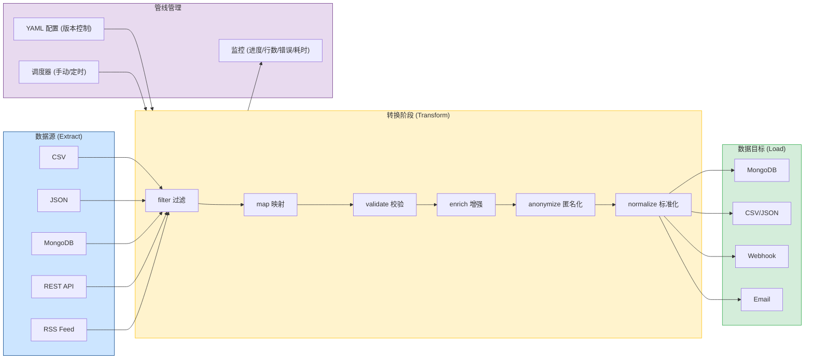

# YA-09-149: 数据管线与 ETL — 声明式管道 + 多源连接器 + 数据转换与校验

> 需求编号：YA-09-149 · 优先级：P2 · 人天：1.0d · 状态：需求已编写
> 依赖：无 · 前置需求：无

## 背景

YiAi 目前的数据导入/导出完全依赖手动编写的临时 Python 脚本。每次需要从 CSV 导入用户数据、从 RSS 抓取文章到 MongoDB、或导出缺陷数据为 JSON 报告时，开发者都需要编写一次性脚本。这些脚本缺乏错误处理、数据校验、进度监控和调度能力，且无法复用。随着数据源和数据量的增长，需要一套标准化的 ETL（Extract-Transform-Load）管线框架。

**问题：**

1. **数据导入无标准化**：每次数据导入都需编写新脚本，代码无法复用，质量参差不齐。
2. **无数据校验**：导入的数据不经校验直接写入 MongoDB，脏数据可能导致业务异常。
3. **无调度能力**：RSS 抓取、定期数据同步等场景需要手动触发，无法自动化。
4. **无进度监控**：长时间运行的数据导入任务缺乏进度跟踪和错误汇总。
5. **无错误恢复**：导入过程中遇到错误时，要么全部失败，要么部分成功但无记录。

**影响：**

- 数据导入效率低，每次都需要开发介入
- 脏数据入库后难以清理，影响业务查询和 RAG 检索质量
- 定期数据同步需要人工操作，容易遗漏

**挑战：**

- 需要支持多种数据源（CSV, JSON, MongoDB, REST API, RSS）和多种目标（MongoDB, 文件, Webhook, 邮件）
- 管线定义需要简单易用（YAML 配置），同时支持复杂的转换逻辑
- 需要与现有 apscheduler 调度器集成

---

## 一、现状分析

### 1.1 当前数据导入/导出方式

| 属性 | 当前值 | 说明 |
|------|--------|------|
| 导入方式 | 临时 Python 脚本 | 每个场景独立编写，无复用 |
| 数据校验 | 无 | 数据直接写入，不经验证 |
| 调度方式 | 手动触发 | 无自动调度 |
| 进度监控 | 无 | 仅在控制台查看 print 输出 |
| 错误处理 | 无 | 脚本崩溃即停止 |
| 管线定义 | 硬编码 | 无声明式配置 |

### 1.2 根因分析矩阵

| 问题 | 根因 | 影响 | 紧急程度 |
|------|------|------|----------|
| 导入脚本不可复用 | 缺乏 ETL 框架抽象，每个场景从零编写 | 开发效率低，重复劳动 | 中 |
| 无数据校验 | 缺乏管线中的数据校验阶段 | 脏数据入库，影响业务 | 高 |
| 无自动化调度 | ETL 任务未与调度器集成 | 定期任务需人工操作 | 中 |
| 无进度监控 | 无管线执行状态追踪 | 长时间任务无法预估进度 | 中 |

### 1.3 当前数据导入场景

| 场景 | 数据源 | 目标 | 频率 | 数据量 | 当前方式 |
|------|--------|------|------|--------|----------|
| RSS 文章抓取 | RSS Feed URL | MongoDB articles | 每小时 | 10-50 条/次 | 临时脚本 + 手动触发 |
| CSV 知识库导入 | CSV 文件 | MongoDB knowledge_files | 按需 | 100-1000 条/次 | 临时脚本 |
| 缺陷数据导出 | MongoDB bugs | JSON 文件 | 按需 | 50-200 条/次 | 手动 mongoexport |
| 会话数据备份 | MongoDB sessions | JSON 文件 | 每周 | 500-2000 条/次 | 手动操作 |

### 1.4 改造前数据导入流程

```
开发者编写临时脚本
  ├── 读取 CSV/JSON 文件
  ├── 简单字段映射
  ├── 直接 insert_many 到 MongoDB
  │     └── 无校验 / 无错误处理 / 无进度
  └── 脚本结束（无日志，无结果统计）
```

---

## 二、设计决策

### 决策 1：管线定义方式 — YAML 声明式 vs Python 代码式

| 维度 | YAML 声明式 | Python 代码式 |
|------|-----------|-------------|
| 学习成本 | 低（非开发者可编辑） | 中（需要 Python 知识） |
| 灵活性 | 中（复杂转换需 Python 函数） | 高（完全代码控制） |
| 版本控制 | 高（纯文本，Git 友好） | 中 |
| 实现复杂度 | 中 | 低 |

**选择：YAML 声明式为主，Python 函数为补充。** YAML 配置文件版本控制友好，非开发者也可编辑。对于复杂的数据转换逻辑，允许在 YAML 中引用 Python 函数名。

### 决策 2：连接器架构 — 内置固定 vs 插件化

**选择：内置固定连接器 + 清晰的扩展接口。** 当前 YiAi 需要的数据源和目标类型有限（5 种），全部内置实现。同时提供 `Connector` 抽象基类，未来可扩展为插件化。

### 决策 3：错误处理策略 — 分阶段配置

**选择：分阶段配置。** 每个转换阶段独立配置错误策略：`skip`（跳过并记录）、`stop`（停止整个管线）、`retry`（重试 N 次）。例如：数据清洗使用 `skip`，数据写入使用 `retry`。

### 设计决策汇总

| 决策 | 选项 A | 选项 B | 选择 | 理由 |
|------|--------|--------|------|------|
| 管线定义 | YAML 声明式 | Python 代码式 | YAML（主）+ Python（辅） | 版本控制友好 |
| 连接器架构 | 内置固定 | 插件化 | 内置 + 扩展接口 | 当前需求有限，未来可扩展 |
| 错误处理 | 全局统一 | 分阶段配置 | 分阶段配置 | 不同阶段不同容错需求 |
| 调度集成 | 内置 | 复用 apscheduler | 复用 apscheduler | 与备份调度器一致 |

---

## 三、目标架构

### 3.1 ETL 管线架构



### 3.2 管线 YAML 配置示例

```yaml
pipeline:
  name: "RSS 文章抓取到 MongoDB"
  version: "1.0"

source:
  type: rss
  config:
    url: "https://example.com/feed.xml"
    max_items: 50

transforms:
  - stage: filter
    config: { condition: "item.title is not None and len(item.title) > 0" }
    on_error: skip
  - stage: map
    config:
      mappings: { title: "item.title", content: "item.summary", url: "item.link", source: "'rss_feed'" }
    on_error: skip
  - stage: validate
    config:
      schema:
        title: { type: str, required: true, min_length: 1 }
        url: { type: str, required: true, pattern: "^https?://" }
    on_error: skip
  - stage: normalize
    config:
      operations:
        - { field: title, action: strip_html }
        - { field: published, action: parse_date, args: { format: "%Y-%m-%dT%H:%M:%S" } }
    on_error: skip

sink:
  type: mongodb
  config: { collection: articles, mode: upsert, upsert_key: url }
  on_error: retry
  retry_config: { max_retries: 3, backoff: exponential }

schedule: { trigger: cron, cron: "0 * * * *" }
error_handling: { on_pipeline_error: continue, max_errors: 100 }
```

---

## 四、具体改动

### 4.1 连接器抽象基类

**文件：** `services/etl/connectors/base.py`（新建）

```python
from abc import ABC, abstractmethod
from typing import AsyncIterator, Any, Dict


class SourceConnector(ABC):
    @abstractmethod
    async def connect(self, config: Dict[str, Any]): ...
    @abstractmethod
    async def extract(self) -> AsyncIterator[Dict[str, Any]]: ...
    @abstractmethod
    async def close(self): ...


class SinkConnector(ABC):
    @abstractmethod
    async def connect(self, config: Dict[str, Any]): ...
    @abstractmethod
    async def write(self, record: Dict[str, Any]) -> Dict[str, Any]: ...
    @abstractmethod
    async def write_batch(self, records: list) -> Dict[str, Any]: ...
    @abstractmethod
    async def close(self): ...
```

### 4.2 数据源连接器（关键实现）

**文件：** `services/etl/connectors/sources.py`（新建）

```python
import csv, json, io
from typing import AsyncIterator, Any, Dict
from pathlib import Path
import aiohttp, feedparser
from services.etl.connectors.base import SourceConnector
from shared.logging import get_logger

logger = get_logger(__name__)


class CsvSourceConnector(SourceConnector):
    async def connect(self, config):
        self._filepath = Path(config["filepath"])
        if not self._filepath.exists():
            raise FileNotFoundError(f"CSV 文件不存在: {self._filepath}")

    async def extract(self) -> AsyncIterator[Dict[str, Any]]:
        with open(self._filepath, "r", encoding="utf-8") as f:
            for row in csv.DictReader(f):
                yield dict(row)

    async def close(self): pass


class JsonSourceConnector(SourceConnector):
    """JSON 文件数据源。支持 data_path 嵌套路径（如 data.items）。"""
    async def connect(self, config):
        self._filepath = Path(config["filepath"]); self._data_path = config.get("data_path", "")

    async def extract(self) -> AsyncIterator[Dict[str, Any]]:
        with open(self._filepath, "r", encoding="utf-8") as f: data = json.load(f)
        items = data
        if self._data_path:
            for key in self._data_path.split("."):
                items = items.get(key, []) if isinstance(items, dict) else []
        if isinstance(items, list):
            for item in items: yield item
        elif isinstance(items, dict): yield items
    async def close(self): pass


class MongoSourceConnector(SourceConnector):
    async def connect(self, config):
        from motor.motor_asyncio import AsyncIOMotorClient
        self._db = AsyncIOMotorClient(config["uri"])[config["database"]]
        self._collection = config["collection"]
        self._filter = config.get("filter", {}); self._limit = config.get("limit", 0)

    async def extract(self) -> AsyncIterator[Dict[str, Any]]:
        cursor = self._db[self._collection].find(self._filter)
        if self._limit: cursor = cursor.limit(self._limit)
        async for doc in cursor: doc["_id"] = str(doc["_id"]); yield doc
    async def close(self): pass


class RestApiSourceConnector(SourceConnector):
    """REST API 数据源。支持 data_path 嵌套路径。"""
    async def connect(self, config):
        self._url = config["url"]; self._headers = config.get("headers", {})
        self._data_path = config.get("data_path", ""); self._session = aiohttp.ClientSession()

    async def extract(self) -> AsyncIterator[Dict[str, Any]]:
        async with self._session.get(self._url, headers=self._headers) as resp:
            resp.raise_for_status(); data = await resp.json()
        items = data
        if self._data_path:
            for key in self._data_path.split("."):
                items = items.get(key, []) if isinstance(items, dict) else []
        if isinstance(items, list):
            for item in items: yield item
        elif isinstance(items, dict): yield items
    async def close(self):
        if self._session: await self._session.close()


class RssSourceConnector(SourceConnector):
    async def connect(self, config):
        self._url = config["url"]; self._max_items = config.get("max_items", 50)

    async def extract(self) -> AsyncIterator[Dict[str, Any]]:
        import asyncio
        feed = await asyncio.get_event_loop().run_in_executor(None, feedparser.parse, self._url)
        for entry in feed.entries[:self._max_items]:
            yield {"title": entry.get("title",""), "summary": entry.get("summary",""),
                   "link": entry.get("link",""), "published": entry.get("published",""),
                   "author": entry.get("author",""), "tags": [t.get("term","") for t in entry.get("tags",[])]}
    async def close(self): pass


# 连接器注册表
SOURCE_REGISTRY = {
    "csv": CsvSourceConnector, "json": JsonSourceConnector,
    "mongodb": MongoSourceConnector, "rest_api": RestApiSourceConnector,
    "rss": RssSourceConnector,
}
```

### 4.3 数据目标连接器（关键实现）

**文件：** `services/etl/connectors/sinks.py`（新建）

```python
import csv, json
from typing import Any, Dict, List
from pathlib import Path
from datetime import datetime
import aiohttp
from services.etl.connectors.base import SinkConnector
from shared.logging import get_logger

logger = get_logger(__name__)


class MongoSinkConnector(SinkConnector):
    """MongoDB 目标。支持 insert/upsert/replace 三种模式。"""

    async def connect(self, config):
        from motor.motor_asyncio import AsyncIOMotorClient
        self._db = AsyncIOMotorClient(config["uri"])[config["database"]]
        self._collection = config["collection"]
        self._mode = config.get("mode", "insert")
        self._upsert_key = config.get("upsert_key", "key")

    async def write(self, record: Dict[str, Any]) -> Dict[str, Any]:
        record["_etl_imported_at"] = datetime.now()
        if self._mode == "upsert" and self._upsert_key in record:
            result = await self._db[self._collection].update_one(
                {self._upsert_key: record[self._upsert_key]},
                {"$set": record}, upsert=True,
            )
            return {"status": "upserted" if result.upserted_id else "updated"}
        else:
            await self._db[self._collection].insert_one(record)
            return {"status": "inserted"}

    async def write_batch(self, records: list) -> Dict[str, Any]:
        for r in records: r["_etl_imported_at"] = datetime.now()
        result = await self._db[self._collection].insert_many(records, ordered=False)
        return {"status": "inserted", "count": len(result.inserted_ids)}

    async def close(self): pass


class FileSinkConnector(SinkConnector):
    """CSV/JSON 文件目标基类。缓冲写入，close 时一次性落盘。"""

    async def connect(self, config):
        self._filepath = Path(config["filepath"])
        self._format = config.get("format", "json")
        self._buffer: List[Dict] = []
        self._filepath.parent.mkdir(parents=True, exist_ok=True)

    async def write(self, record): self._buffer.append(record); return {"status": "buffered"}
    async def write_batch(self, records): self._buffer.extend(records); return {"status": "buffered"}

    async def close(self):
        if not self._buffer: return
        with open(self._filepath, "w", encoding="utf-8") as f:
            if self._format == "csv":
                writer = csv.DictWriter(f, fieldnames=list(self._buffer[0].keys()), extrasaction="ignore")
                writer.writeheader(); writer.writerows(self._buffer)
            else:
                json.dump(self._buffer, f, ensure_ascii=False, indent=2, default=str)
        logger.info(f"[ETL] 文件写入: {self._filepath}, {len(self._buffer)} 行")


class WebhookSinkConnector(SinkConnector):
    async def connect(self, config):
        self._url = config["url"]
        self._headers = config.get("headers", {"Content-Type": "application/json"})
        self._session = aiohttp.ClientSession()

    async def write(self, record):
        async with self._session.post(self._url, json=record, headers=self._headers) as resp:
            return {"status": resp.status}
    async def write_batch(self, records):
        async with self._session.post(self._url, json=records, headers=self._headers) as resp:
            return {"status": resp.status, "count": len(records)}
    async def close(self):
        if self._session: await self._session.close()


class EmailSinkConnector(SinkConnector):
    """Email 报告目标。简化实现：记录日志，实际发送需 SMTP 配置。"""
    async def connect(self, config):
        self._to = config.get("to", []); self._subject = config.get("subject", "ETL Report")
        self._buffer: List[Dict] = []

    async def write(self, record): self._buffer.append(record); return {"status": "buffered"}
    async def write_batch(self, records): self._buffer.extend(records); return {"status": "buffered"}
    async def close(self):
        if self._buffer and self._to:
            logger.info(f"[ETL] Email: to={self._to}, subject={self._subject}, records={len(self._buffer)}")


SINK_REGISTRY = {
    "mongodb": MongoSinkConnector, "csv": FileSinkConnector,
    "json": FileSinkConnector, "webhook": WebhookSinkConnector,
    "email": EmailSinkConnector,
}
```

### 4.4 转换阶段实现

**文件：** `services/etl/transforms.py`（新建）

```python
import re
from typing import Any, Dict, Optional
from datetime import datetime
from enum import Enum
from shared.logging import get_logger

logger = get_logger(__name__)


class ErrorStrategy(str, Enum):
    SKIP = "skip"; STOP = "stop"; RETRY = "retry"


class TransformError(Exception):
    def __init__(self, stage: str, record: dict, message: str):
        self.stage = stage; self.record = record; self.message = message
        super().__init__(f"[{stage}] {message}")


class FilterStage:
    """过滤：根据条件过滤数据行。"""
    def __init__(self, name, config, on_error="skip"):
        self.name = name; self.config = config; self.on_error = ErrorStrategy(on_error)

    async def execute(self, record: Dict) -> Optional[Dict]:
        condition = self.config.get("condition", "")
        if not condition: return record
        try:
            ns = {"item": record, "re": re, "len": len, "None": None}
            return record if eval(condition, {"__builtins__": {}}, ns) else None
        except Exception as e:
            logger.warning(f"[ETL] Filter 失败: {condition}, error={e}"); return record


class MapStage:
    """映射：字段重命名和赋值。支持字面量 ('...')、字段引用 (item.field)、表达式。"""
    def __init__(self, name, config, on_error="skip"):
        self.name = name; self.config = config; self.on_error = ErrorStrategy(on_error)

    async def execute(self, record: Dict) -> Optional[Dict]:
        result = {}
        for target, expr in self.config.get("mappings", {}).items():
            try:
                if expr.startswith("'") and expr.endswith("'"): result[target] = expr[1:-1]
                elif expr.startswith("item."): result[target] = record.get(expr[5:])
                else: result[target] = eval(expr, {"__builtins__": {}}, {"item": record})
            except Exception as e:
                logger.warning(f"[ETL] Map 失败: {target}, error={e}"); result[target] = None
        return result


class ValidateStage:
    """校验：必填/类型/长度/正则四种校验。"""
    def __init__(self, name, config, on_error="skip"):
        self.name = name; self.config = config; self.on_error = ErrorStrategy(on_error)

    async def execute(self, record: Dict) -> Optional[Dict]:
        schema = self.config.get("schema", {}); errors = []
        for field, rules in schema.items():
            value = record.get(field)
            if rules.get("required") and value is None: errors.append(f"{field}: 必填字段缺失"); continue
            if value is None: continue
            if rules.get("type") == "str" and not isinstance(value, str): errors.append(f"{field}: 类型错误")
            if "min_length" in rules and isinstance(value, str) and len(value) < rules["min_length"]:
                errors.append(f"{field}: 最小长度 {rules['min_length']}")
            if "pattern" in rules and isinstance(value, str) and not re.match(rules["pattern"], value):
                errors.append(f"{field}: 不匹配正则 {rules['pattern']}")
        if errors: raise TransformError("validate", record, "; ".join(errors))
        return record


class EnrichStage:
    """增强：添加计算字段（如 `datetime.now()`）。"""
    def __init__(self, name, config, on_error="skip"):
        self.name = name; self.config = config; self.on_error = ErrorStrategy(on_error)

    async def execute(self, record: Dict) -> Optional[Dict]:
        for field, expr in self.config.get("fields", {}).items():
            try: record[field] = eval(expr, {"__builtins__": {}}, {"item": record, "datetime": datetime, "len": len})
            except Exception as e: logger.warning(f"[ETL] Enrich 失败: {field}, error={e}"); record[field] = None
        return record


class AnonymizeStage:
    """匿名化：mask（保留首尾）/hash（SHA256 截断）/remove（删除字段）。"""
    def __init__(self, name, config, on_error="skip"):
        self.name = name; self.config = config; self.on_error = ErrorStrategy(on_error)

    async def execute(self, record: Dict) -> Optional[Dict]:
        fields = self.config.get("fields", []); method = self.config.get("method", "mask")
        for field in fields:
            value = record.get(field)
            if value is None: continue
            if method == "mask" and isinstance(value, str):
                record[field] = value[:2] + "*" * max(0, len(value)-4) + value[-2:] if len(value) > 4 else "*" * len(value)
            elif method == "hash":
                import hashlib; record[field] = hashlib.sha256(str(value).encode()).hexdigest()[:16]
            elif method == "remove": record.pop(field, None)
        return record


class NormalizeStage:
    """标准化：strip_html/trim/lowercase/parse_date/default 等操作。"""
    def __init__(self, name, config, on_error="skip"):
        self.name = name; self.config = config; self.on_error = ErrorStrategy(on_error)

    async def execute(self, record: Dict) -> Optional[Dict]:
        for op in self.config.get("operations", []):
            field = op.get("field"); action = op.get("action"); args = op.get("args", {})
            if field not in record: continue
            try:
                v = record[field]
                if action == "strip_html": record[field] = re.sub(r"<[^>]+>", "", str(v))
                elif action == "trim": record[field] = str(v).strip()
                elif action == "lowercase": record[field] = str(v).lower()
                elif action == "parse_date": record[field] = datetime.strptime(str(v), args.get("format", "%Y-%m-%dT%H:%M:%S"))
                elif action == "default": record[field] = args.get("value") if v is None else v
            except Exception as e: logger.warning(f"[ETL] Normalize 失败: {field}.{action}, error={e}")
        return record


STAGE_REGISTRY = {
    "filter": FilterStage, "map": MapStage, "validate": ValidateStage,
    "enrich": EnrichStage, "anonymize": AnonymizeStage, "normalize": NormalizeStage,
}
```

### 4.5 管线引擎

**文件：** `services/etl/engine.py`（新建）

```python
import time, uuid, yaml
from datetime import datetime
from typing import Any, Dict, List, Optional
from pathlib import Path

from services.etl.connectors.sources import SOURCE_REGISTRY
from services.etl.connectors.sinks import SINK_REGISTRY
from services.etl.transforms import STAGE_REGISTRY, TransformError, ErrorStrategy
from services.etl.connectors.base import SourceConnector, SinkConnector
from shared.logging import get_logger

logger = get_logger(__name__)


class PipelineRun:
    """单次管线运行记录。"""
    def __init__(self, pipeline_name: str):
        self.run_id = str(uuid.uuid4())[:8]
        self.pipeline_name = pipeline_name
        self.started_at = datetime.now()
        self.finished_at: Optional[datetime] = None
        self.status = "running"
        self.total_rows = 0; self.success_rows = 0; self.error_rows = 0
        self.errors: List[Dict] = []
        self.duration_seconds: float = 0

    def to_dict(self) -> dict:
        return {
            "run_id": self.run_id, "pipeline_name": self.pipeline_name,
            "status": self.status, "started_at": self.started_at.isoformat(),
            "finished_at": self.finished_at.isoformat() if self.finished_at else None,
            "total_rows": self.total_rows, "success_rows": self.success_rows,
            "error_rows": self.error_rows, "duration_seconds": self.duration_seconds,
            "errors": self.errors[:10],
        }


class PipelineEngine:
    def __init__(self): self._runs: Dict[str, PipelineRun] = {}

    async def run_pipeline(self, config_path: str) -> PipelineRun:
        config = self._load_config(config_path)
        run = PipelineRun(config["pipeline"]["name"]); self._runs[run.run_id] = run
        logger.info(f"[ETL] 管线启动: {run.pipeline_name} (run_id={run.run_id})")

        source = None; sink = None; stages = []
        try:
            source = SOURCE_REGISTRY[config["source"]["type"]]()
            await source.connect(config["source"]["config"])
            for sc in config.get("transforms", []):
                stages.append(STAGE_REGISTRY[sc["stage"]](sc["stage"], sc.get("config", {}), sc.get("on_error", "skip")))
            sink = SINK_REGISTRY[config["sink"]["type"]]()
            await sink.connect(config["sink"]["config"])

            max_errors = config.get("error_handling", {}).get("max_errors", 100)
            start_time = time.perf_counter()

            async for record in source.extract():
                run.total_rows += 1
                try:
                    for stage in stages:
                        try:
                            record = await stage.execute(record)
                            if record is None: break
                        except TransformError as e:
                            if stage.on_error == ErrorStrategy.STOP: raise
                            run.error_rows += 1; record = None; break
                    if record is not None: await sink.write(record); run.success_rows += 1
                except Exception as e:
                    run.error_rows += 1
                    if run.error_rows >= max_errors:
                        logger.error(f"[ETL] 错误数超过阈值 {max_errors}, 停止管线"); break

            run.status = "completed"
            run.duration_seconds = round(time.perf_counter() - start_time, 2)
        except Exception as e:
            run.status = "failed"; run.errors.append({"stage": "pipeline", "message": str(e)})
            logger.error(f"[ETL] 管线失败: {run.pipeline_name}, error={e}")
        finally:
            run.finished_at = datetime.now()
            if source: await source.close()
            if sink: await sink.close()

        logger.info(f"[ETL] 管线完成: {run.pipeline_name}, total={run.total_rows}, "
                     f"success={run.success_rows}, error={run.error_rows}, duration={run.duration_seconds}s")
        return run

    def get_run(self, run_id: str) -> Optional[PipelineRun]: return self._runs.get(run_id)
    def list_runs(self, limit: int = 20) -> List[PipelineRun]:
        return sorted(self._runs.values(), key=lambda r: r.started_at, reverse=True)[:limit]

    def _load_config(self, config_path: str) -> dict:
        path = Path(config_path)
        if not path.exists(): raise FileNotFoundError(f"管线配置文件不存在: {config_path}")
        with open(path, "r", encoding="utf-8") as f: return yaml.safe_load(f)
```

### 4.6 RPC 端点

**文件：** `services/etl/routes.py`（新建）

```python
from fastapi import APIRouter
from pydantic import BaseModel
from services.etl.engine import PipelineEngine

router = APIRouter(prefix="/etl", tags=["etl"])
engine = PipelineEngine()


class RunPipelineRequest(BaseModel):
    config_path: str


@router.post("/run")
async def run_pipeline(request: RunPipelineRequest):
    try:
        run = await engine.run_pipeline(request.config_path)
        return {"code": 0, "data": run.to_dict()}
    except FileNotFoundError as e:
        return {"code": 3002, "message": str(e), "data": None}
    except Exception as e:
        return {"code": 9999, "message": str(e), "data": None}


@router.get("/runs/{run_id}")
async def get_run(run_id: str):
    run = engine.get_run(run_id)
    if not run:
        return {"code": 1002, "message": f"运行记录不存在: {run_id}", "data": None}
    return {"code": 0, "data": run.to_dict()}


@router.get("/runs")
async def list_runs(limit: int = 20):
    runs = engine.list_runs(limit)
    return {"code": 0, "data": {"runs": [r.to_dict() for r in runs]}}
```

### 4.7 涉及文件

```
YiAi/src/
├── services/etl/
│   ├── __init__.py               # 新建
│   ├── engine.py                 # 新建: 管线引擎
│   ├── transforms.py             # 新建: 6 个转换阶段
│   ├── routes.py                 # 新建: RPC 端点
│   └── connectors/
│       ├── __init__.py           # 新建
│       ├── base.py               # 新建: 连接器抽象基类
│       ├── sources.py            # 新建: 5 个数据源连接器
│       └── sinks.py              # 新建: 5 个数据目标连接器
├── pipelines/                    # 新建: 管线 YAML 配置目录
│   ├── rss_to_mongodb.yaml
│   ├── csv_import_knowledge.yaml
│   └── mongodb_export_bugs.yaml
├── requirements.txt              # 修改: 添加 pyyaml, feedparser, aiohttp
└── main.py                        # 修改: 注册 ETL 路由
```

---

## 五、实施步骤

| 步骤 | 内容 | 涉及文件 | 验证方式 | 人天 |
|------|------|---------|---------|------|
| 1 | 实现连接器抽象基类 | `connectors/base.py` | 抽象类定义完整，子类可正常继承 | 0.05 |
| 2 | 实现 5 个数据源连接器 | `connectors/sources.py` | 每个连接器读取真实数据源返回正确数据 | 0.2 |
| 3 | 实现 5 个数据目标连接器 | `connectors/sinks.py` | 每个连接器写入数据到目标成功 | 0.15 |
| 4 | 实现 6 个转换阶段 | `transforms.py` | 每个阶段独立测试，转换结果正确 | 0.2 |
| 5 | 实现管线引擎（YAML 加载、阶段编排、错误处理） | `engine.py` | 加载 YAML 配置执行完整管线 | 0.15 |
| 6 | 实现 RPC 端点 | `routes.py` | API 端点可正常调用 | 0.1 |
| 7 | 创建 3 个示例管线 YAML 配置 | `pipelines/` | 每个管线可成功执行 | 0.1 |
| 8 | 编写集成测试 | `tests/etl/` | 所有测试通过 | 0.05 |

**总计：1.0d**

---

## 六、测试规格

### Requirement: 管线执行 -- CSV 导入

#### Scenario: 从 CSV 文件导入数据到 MongoDB
- **Given** 存在 CSV 文件 `test_data.csv`，包含 100 行用户数据（name, email, role）
- **And** 管线 YAML 配置定义了 source=csv, transform=[map, validate], sink=mongodb
- **When** 执行 `engine.run_pipeline("pipelines/csv_import.yaml")`
- **Then** MongoDB users 集合中新增 100 条文档
- **And** PipelineRun 记录 `total_rows=100, success_rows=100, error_rows=0`

### Requirement: 数据校验

#### Scenario: 校验阶段拒绝无效数据
- **Given** CSV 包含 10 行数据，其中 3 行的 email 字段为空（必填）
- **And** 管线配置 validate 阶段，email 字段 `required: true`
- **When** 执行管线
- **Then** PipelineRun 记录 `total_rows=10, success_rows=7, error_rows=3`
- **And** 错误记录包含 `email: 必填字段缺失`

### Requirement: RSS 抓取

#### Scenario: 从 RSS Feed 抓取文章到 MongoDB
- **Given** 存在有效的 RSS Feed URL
- **And** 管线配置了 source=rss, transform=[filter, map, normalize], sink=mongodb (upsert)
- **When** 执行管线
- **Then** MongoDB articles 集合中新增文章，相同 url 的文章更新而非重复插入
- **And** 文章标题中的 HTML 标签已被移除

### Requirement: 错误处理 -- 跳过策略

#### Scenario: 单条数据转换失败时跳过并继续
- **Given** 管线配置 `on_error: skip`
- **When** 某条数据在 map 阶段转换失败
- **Then** 该条数据被跳过，后续数据正常处理，管线继续执行

### Requirement: 错误处理 -- 停止策略

#### Scenario: 错误数超过阈值时停止管线
- **Given** 管线配置 `max_errors: 5`
- **When** 第 6 条数据转换失败
- **Then** 管线停止执行，PipelineRun 状态为 `failed`

### Requirement: 数据导出

#### Scenario: 从 MongoDB 导出数据到 JSON 文件（含匿名化）
- **Given** MongoDB bugs 集合中有 50 条缺陷记录
- **And** 管线配置了 source=mongodb, transform=[anonymize], sink=json
- **When** 执行管线
- **Then** `export_bugs.json` 包含 50 条记录，敏感字段已被匿名化

---

## 七、风险与缓解

| 风险 | 概率 | 影响 | 等级 | 缓解措施 | 应急预案 |
|------|------|------|------|----------|----------|
| YAML 配置中的 `eval()` 执行恶意代码 | 低 | 高 | 高 | `eval()` 使用受限命名空间 `{"__builtins__": {}}` | 替换为 `simpleeval` 库 |
| 大文件导入导致内存溢出 | 中 | 中 | 中 | 异步迭代器逐行处理，不一次性加载 | 分片处理，增加 `batch_size` 配置 |
| 管线执行时间过长阻塞 API 线程 | 中 | 中 | 中 | 后台执行，API 即时返回 run_id，客户端轮询 | 添加管线超时配置（默认 30 分钟） |
| 管线配置错误导致数据丢失 | 低 | 高 | 中 | 支持"干运行"（dry-run）模式：执行转换但不写入 | 执行前备份目标集合 |
| 并发执行同一管线导致数据重复 | 低 | 中 | 低 | 使用 `asyncio.Lock` 防止同一管线并发执行 | 通过 run_id 追踪 |

---

## 八、回滚策略

| 场景 | 回滚方式 | 回滚时间 | 风险 |
|------|---------|---------|------|
| 管线引擎有 Bug 导致数据错误 | 从 MongoDB 备份恢复目标集合，或使用 `_etl_imported_at` 字段回滚 | < 30min | 中：依赖备份可用性 |
| 管线 YAML 配置错误 | 修复 YAML 配置，重新执行管线 | < 5min | 低：仅影响单次执行 |
| 连接器性能问题 | 管线在后台执行，不影响 API；如仍影响，禁用 ETL 路由 | < 1min | 低：ETL 独立于核心 API |

---

## 九、设计决策记录

### D-01: 为什么使用 `eval()` 进行表达式求值而非 AST 解析器？

`eval()` 在受限命名空间（`{"__builtins__": {}}`）中执行，仅能访问显式传入的变量（`item`、`re`、`len`），无法执行任意 Python 代码。对于管线配置中的简单表达式，这种受限 eval 足够安全且简单。未来可替换为 `simpleeval` 库增强安全性。

### D-02: 为什么管线配置使用 YAML 而非 JSON？

YAML 比 JSON 更易读，支持注释（`#`），对非开发者更友好。管线配置可能包含多行字符串和嵌套结构，YAML 的缩进语法更清晰。`pyyaml` 是 Python 生态中广泛使用的库。

### D-03: 为什么连接器使用类注册表而非插件发现？

当前 YiAi 需要的连接器类型有限（5 种），全部内置实现。类注册表（`SOURCE_REGISTRY`、`SINK_REGISTRY`）提供了清晰的扩展点，未来可扩展为 `importlib` 自动发现插件。

### D-04: 为什么管线在后台执行而非同步等待？

典型 ETL 管线可能处理数千条记录，耗时数分钟。同步等待会导致 HTTP 请求超时。后台执行 + 状态轮询模式与 YiAi 现有的 Agent 异步执行模式一致。

---

## 十、可观测性

### 关键指标

| 指标 | 采集方式 | 告警阈值 | 说明 |
|------|---------|---------|------|
| 管线执行成功率 | `status=completed` 占比 | < 95% | 管线频繁失败需排查 |
| 管线执行耗时 | PipelineRun.duration_seconds | P95 > 300s | 需优化 |
| 数据行错误率 | `error_rows / total_rows` | > 10% | 数据源质量差或转换规则有误 |
| 数据写入速率 | `success_rows / duration_seconds` | < 10 rows/s | 写入性能瓶颈 |

### 日志规范

| 日志级别 | 场景 | 示例 |
|---------|------|------|
| `INFO` | 管线启动/完成 | `[ETL] 管线启动: rss_to_mongodb (run_id=a1b2c3d4)` |
| `INFO` | 管线完成统计 | `[ETL] 管线完成: total=100, success=95, error=5, duration=12.5s` |
| `WARN` | 单条数据转换失败 | `[ETL] Filter 条件求值失败: ...` |
| `ERROR` | 管线执行失败 | `[ETL] 管线失败: rss_to_mongodb, error=ConnectionError` |

---

## 十一、代码审查检查清单

- [ ] `SourceConnector` 和 `SinkConnector` 抽象基类定义完整
- [ ] 所有连接器实现 `connect()`, `extract()`/`write()`, `close()` 方法
- [ ] `RssSourceConnector` 使用 `run_in_executor` 避免阻塞事件循环
- [ ] `MongoSinkConnector` 支持 insert/upsert/replace 三种模式
- [ ] `CsvSinkConnector` 和 `JsonSinkConnector` 在 `close()` 时写入文件
- [ ] `ValidateStage` 覆盖必填、类型、长度、正则四种校验
- [ ] `AnonymizeStage` 支持 mask/hash/remove 三种脱敏方式
- [ ] `PipelineEngine` 使用异步迭代器逐行处理，避免内存溢出
- [ ] `eval()` 使用受限命名空间 `{"__builtins__": {}}` 防止代码注入
- [ ] 管线执行有 `max_errors` 阈值保护
- [ ] `PipelineRun` 记录完整的运行统计
- [ ] `ruff` 代码规范通过 · `mypy` 类型检查通过

---

## 回归问题预测

| # | 问题 | 发现场景 | 根因 | 修复方式 |
|---|------|---------|------|---------|
| 1 | Windows 上 CSV 编码问题导致中文乱码 | CSV 导入管线在 Windows 环境执行时中文显示乱码 | CSV 文件默认编码为系统编码（GBK），`open()` 默认 UTF-8 | 支持 `encoding` 配置项 |
| 2 | `insert_many(ordered=False)` 部分失败时，成功文档已写入但计数不准确 | 批量导入 100 条，第 50 条唯一索引冲突，前 49 条已写入 | `BulkWriteError` 中成功文档已写入但未被计数 | 捕获 `BulkWriteError`，从 `details` 中提取成功/失败详情 |
| 3 | `feedparser.parse()` 对非 XML 内容不报错返回空结果 | 管线完成但 `total_rows=0`，无错误记录 | `feedparser.parse()` 对所有输入返回 `FeedParserDict`，不抛出异常 | 检查 `feed.bozo` 标志，记录警告日志 |
| 4 | `MapStage` 映射不存在的字段返回 `None`，下游校验误报 | 映射 `title: "item.name"` 但源数据无 `name` 字段，校验报 `title: 必填字段缺失` | `record.get(field)` 安全访问返回 `None` | 在校验错误信息中区分"源数据缺失"和"映射后缺失" |
| 5 | `finally` 块中 `sink.close()` 在 `sink.connect()` 失败时抛出 `AttributeError` | 管线配置错误导致 `sink.connect()` 失败，`sink` 变量未赋值 | `sink` 变量在 `try` 块中赋值，`connect()` 失败时未赋值 | 使用 `if sink:` 检查变量是否为 None |
| 6 | RSS 日期格式不匹配导致 `parse_date` 大量记录被跳过 | 不同 Feed 使用不同日期格式（RFC 2822 / ISO 8601），固定格式失败 | `strptime` 仅支持单一格式 | 使用 `dateutil.parser.parse` 或支持 `formats` 数组 |

---

## 性能分析

### 管线执行性能

| 操作 | 数据量 | 耗时 | 内存 | 说明 |
|------|--------|------|------|------|
| CSV 导入 (1000 行) | ~1MB | ~5s | ~10MB | 逐行处理，内存稳定 |
| JSON 导入 (1000 条) | ~2MB | ~8s | ~15MB | 一次性解析 JSON |
| RSS 抓取 (50 条) | ~200KB | ~3s | ~5MB | 网络请求耗时占主导 |
| MongoDB 导出 (1000 条) | ~5MB | ~10s | ~20MB | 异步迭代器，内存可控 |
| REST API 导入 (500 条) | ~1MB | ~15s | ~10MB | 网络延迟取决于 API |
| 批量写入 MongoDB (1000 条) | -- | ~2s | ~5MB | insert_many 批量写入 |

### 大文件处理预估

| 数据量 | 行数 | 预计耗时 | 内存峰值 | 建议 |
|------|------|---------|---------|------|
| 1MB CSV | ~1000 | ~5s | ~10MB | 直接执行 |
| 10MB CSV | ~10000 | ~30s | ~10MB | 直接执行 |
| 100MB CSV | ~100000 | ~5min | ~10MB | 后台执行，设置合理超时 |
| 1GB CSV | ~1000000 | ~50min | ~10MB | 分片处理 |

### 资源消耗

| 资源 | 空闲 | 单管线执行 | 峰值 (3 管线并发) | 说明 |
|------|------|-----------|-----------------|------|
| CPU | < 1% | 10-20% | 30-50% | 主要为 IO 等待 |
| 内存 | ~50MB | +10-20MB | +30-60MB | 异步迭代器控制内存 |
| 网络 | 0 | 1-5Mbps | 3-15Mbps | 取决于数据源 |
| 磁盘 IO | 0 | 10-50MB/s | 30-100MB/s | 文件读写 |

---

*PRD 来源: `projects/yiai/requirements/2026-09/00-需求-需求总览.md`*

## 影响范围

- **影响模块**：待补充
- **涉及文件**：
- `routes.py`
- `engine.py`
- `transforms.py`
- **是否影响 API 契约**：否
- **是否影响其他项目（YiVad/YiPet）**：否
- **用户感知**：待确认

## 预防措施

| 层面 | 措施 |
|------|------|
| 代码 | 在相关函数中添加参数校验和边界检查 |
| 测试 | 为 `routes.py` 添加单元测试 |
| 流程 | 代码审查时重点检查此类模式 |
| 监控 | 添加日志告警，异常发生时及时发现 |
| 文档 | 在编码规范中记录此类反模式 |

## 经验教训

1. **根本原因**：开发过程中对边界情况和异常路径的考虑不足是此类问题的共同根因
2. **设计阶段**：在接口设计和模块实现时，应主动考虑异常输入、空值、超时等边界场景
3. **代码审查**：审查时应检查是否存在类似的反模式（如未捕获异常、无超时控制、缺少参数校验等）
4. **测试覆盖**：异常路径的测试覆盖率应与正常路径同等重视
5. **团队分享**：此类问题应在团队周会或技术分享中讨论，形成团队共识
