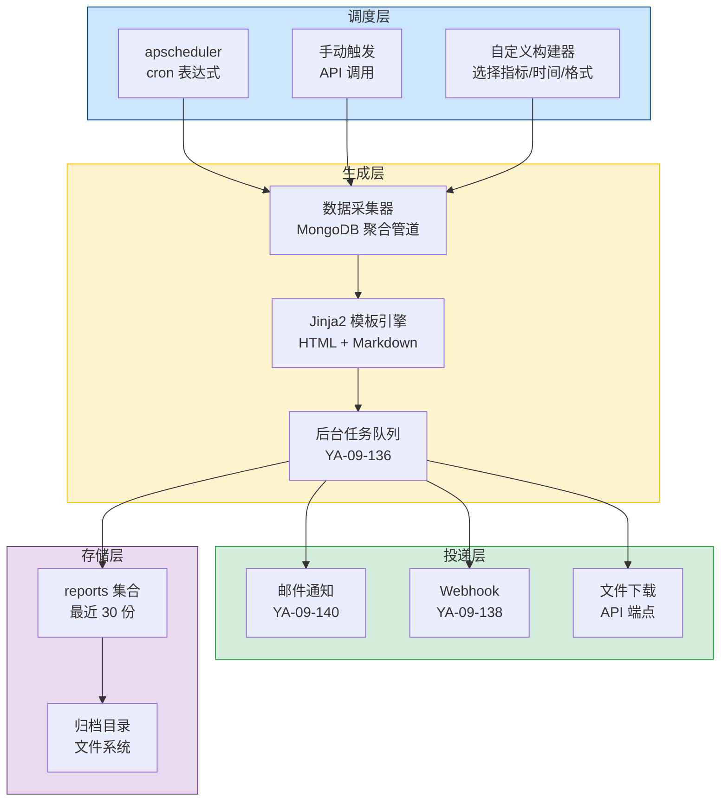
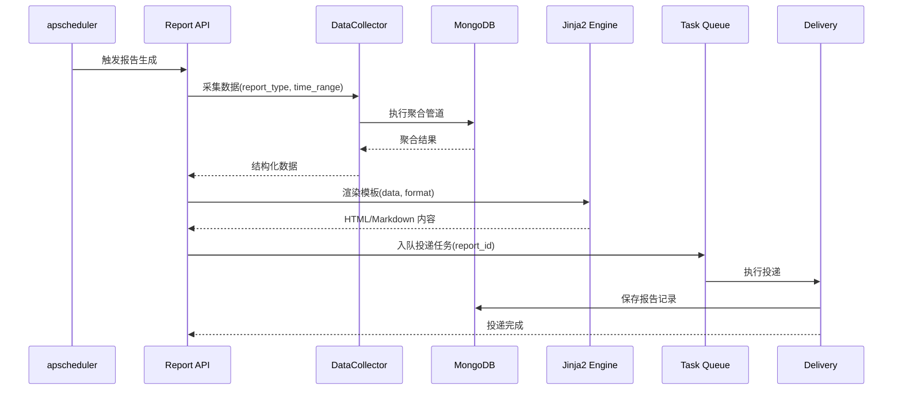
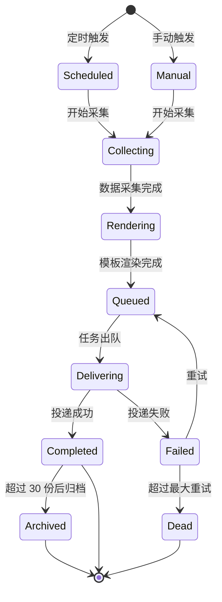

# YA-09-150: 定时报告生成 — 多类型报告 + Jinja2 双格式渲染 + 多通道投递 + 异步队列

> 需求编号：YA-09-150 · 优先级：P2 · 人天：0.5d · 状态：需求已编写
> 依赖：YA-09-136（后台任务队列）、YA-09-138（Webhook）、YA-09-140（邮件通知） · 前置需求：YA-09-101（监控体系）

## 背景

YiAi 作为核心后端服务，每天产生大量运行数据：请求量、错误率、RAG 检索质量、存储使用量、Agent 任务执行情况等。目前这些数据分散在 MongoDB 各集合和日志文件中，运维人员和产品经理需要手动编写查询语句或查看多个 Dashboard 才能了解系统整体状况。对于周报、月报等周期性汇报场景，每次都需要人工汇总数据，效率低下且容易遗漏关键指标。

**问题：**

1. **无自动化报告能力**：系统运行数据无法自动汇总为结构化报告，所有报告依赖人工编写。
2. **数据分散**：系统健康、使用统计、RAG 质量、错误摘要、存储使用等数据分散在不同集合和日志中，缺乏统一视图。
3. **无定时投递**：即使生成了报告，也无法自动定时投递给相关人员。
4. **格式单一**：缺乏 HTML（可视化）和 Markdown（可编辑）双格式支持，无法满足不同场景需求。
5. **无历史追溯**：历史报告无法保存和检索，无法对比不同周期的系统状态。

**影响：**

| 场景 | 影响 | 严重程度 |
|------|------|----------|
| 每周运维汇报需要人工汇总数据 | 每次耗时 1-2 小时，效率低下 | 中 |
| 系统异常无法及时发现 | 依赖人工巡检，响应延迟 | 高 |
| RAG 质量下降无感知 | 检索准确率持续下降，用户体验恶化 | 中 |
| 存储使用无定期报告 | 磁盘可能被写满才被发现 | 高 |
| 管理层无法快速了解系统状态 | 决策缺乏数据支撑 | 低 |

**挑战：**

- 需要设计灵活的报告模板系统，支持不同类型报告的自定义指标
- 需要 MongoDB 聚合管道高效提取统计数据，避免全表扫描
- 需要 Jinja2 模板引擎同时渲染 HTML 和 Markdown 格式
- 需要通过后台任务队列（YA-09-136）处理大型报告的异步生成
- 需要支持报告预览、历史归档和自定义报告构建器

---

## 一、现状分析

### 1.1 当前报告相关状态

| 属性 | 当前值 | 说明 |
|------|--------|------|
| 自动报告生成 | 无 | 所有报告依赖人工编写 |
| 报告模板 | 无 | 无 Jinja2 模板或任何结构化模板 |
| 定时调度 | 无 | 无 cron 或 apscheduler 定时任务 |
| 报告投递 | 无 | 无邮件、Webhook 或文件下载能力 |
| 报告历史 | 无 | 无历史报告存储和检索 |
| 数据聚合 | 手动 | 运维人员手动编写 MongoDB 查询 |
| 自定义报告 | 无 | 无法自定义指标、时间范围、格式 |

### 1.2 根因分析矩阵

| 问题 | 根因 | 影响 | 紧急程度 |
|------|------|------|----------|
| 无自动化报告 | 项目初期聚焦核心功能，未考虑运维报告需求 | 运维效率低，人工成本高 | 中 |
| 数据分散 | 各模块独立存储数据，缺乏统一数据视图 | 报告需要跨多集合查询，实现复杂 | 中 |
| 无定时投递 | 未集成调度框架和通知渠道 | 无法实现无人值守的定期报告 | 中 |
| 无历史追溯 | 未设计报告存储和归档机制 | 无法对比不同周期的系统状态 | 低 |

### 1.3 报告类型定义

| 报告类型 | 触发周期 | 内容 | 目标读者 | 优先级 |
|---------|---------|------|---------|--------|
| 系统健康报告 | 每日 | CPU/内存/磁盘使用率、服务可用性、关键错误数、请求成功率 | 运维工程师 | 高 |
| 使用统计报告 | 每周 | API 调用量、活跃用户数、会话数、各模块使用分布 | 产品经理、管理层 | 中 |
| RAG 质量报告 | 每周 | 检索准确率、召回率、索引更新频率、知识库覆盖率 | AI 工程师 | 中 |
| 错误摘要报告 | 每日 | 错误类型分布、错误率趋势、TOP 10 高频错误、未解决错误 | 开发工程师 | 高 |
| 存储使用报告 | 每月 | 各集合文档数、存储空间占用、增长趋势、碎片率 | 运维工程师 | 中 |

### 1.4 改造前数据流

```
运维人员
  └── 手动连接 MongoDB
  └── 编写查询语句
  └── 复制数据到 Excel/Markdown
  └── 手动发送邮件或粘贴到群聊
  └── 无历史归档
```

---

## 二、设计决策

### 决策 1：模板引擎 — Jinja2 vs WeasyPrint vs 纯字符串拼接

| 维度 | Jinja2 | WeasyPrint (PDF) | 纯字符串拼接 |
|------|--------|-------------------|-------------|
| 实现复杂度 | 低（Python 标准库风格） | 高（需要系统依赖） | 最低 |
| HTML 渲染 | 优秀 | 优秀（PDF 输出） | 差 |
| Markdown 渲染 | 中等 | 不适用 | 差 |
| 模板可维护性 | 高 | 中 | 低 |
| 部署依赖 | 无额外依赖 | 需要 Cairo/Pango 等系统库 | 无 |
| 适合当前场景 | 是 | 否（过度设计） | 否（不可维护） |

**选择：Jinja2。** Jinja2 是 Python 生态中最成熟的模板引擎，FastAPI 已内置支持。HTML 模板可直接在浏览器中预览，Markdown 模板可满足可编辑需求。对于 PDF 需求，未来可基于 HTML 模板通过 WeasyPrint 转换，架构上预留扩展点。

### 决策 2：报告调度 — apscheduler vs Celery Beat vs 系统 cron

| 维度 | apscheduler | Celery Beat | 系统 cron |
|------|-------------|-------------|-----------|
| 实现复杂度 | 低（进程内） | 高（需要 Redis + Worker） | 低（系统级） |
| 动态管理 | 支持（运行时增删改） | 支持 | 不支持（需修改 crontab） |
| 与 YiAi 集成 | 优秀（已使用 apscheduler） | 需要额外基础设施 | 差（独立进程） |
| 持久化 | 支持（MongoDB JobStore） | 支持 | 不支持 |
| 适合当前场景 | 是 | 否（过度设计） | 否（不灵活） |

**选择：apscheduler + MongoDB JobStore。** YiAi 已使用 apscheduler 进行知识库监控，无需引入新依赖。通过 MongoDB JobStore 持久化调度任务，进程重启后自动恢复。支持 cron 表达式，可灵活配置每日/每周/每月的报告生成时间。

### 决策 3：报告投递通道 — 邮件 vs Webhook vs 文件下载

不选择单一通道，三种通道并行支持。邮件（YA-09-140）作为主要投递方式，Webhook（YA-09-138）支持集成到外部系统（如企业微信机器人），文件下载作为备选和归档方式。用户可在创建报告任务时选择投递通道组合。

### 决策 4：大型报告生成方式 — 同步 vs 异步队列

| 维度 | 同步生成 | 异步队列（YA-09-136） |
|------|---------|----------------------|
| 响应体验 | 阻塞 API 请求 | 立即返回任务 ID |
| 超时风险 | 高（大报告可能超时） | 低（后台执行） |
| 进度反馈 | 无 | 支持（轮询任务状态） |
| 资源占用 | 阻塞事件循环 | 独立 Worker 执行 |
| 适合当前场景 | 仅小型报告 | 所有报告 |

**选择：异步队列（YA-09-136）。** 所有报告生成任务通过后台任务队列异步执行。API 调用后立即返回 `task_id`，前端轮询任务状态。对于快速预览（< 5s），支持同步模式。

### 设计决策记录

| 决策 | 选项 A | 选项 B | 选择 | 理由 |
|------|--------|--------|------|------|
| 模板引擎 | 纯字符串拼接 | Jinja2 | Jinja2 | 可维护性高，支持 HTML/Markdown 双格式 |
| 调度框架 | 系统 cron | apscheduler | apscheduler | 已集成，支持动态管理和持久化 |
| 投递通道 | 单一通道 | 多通道并行 | 邮件 + Webhook + 文件下载 | 覆盖不同场景需求 |
| 生成方式 | 同步 | 异步队列 | 异步队列（YA-09-136） | 避免超时，支持进度反馈 |

---

## 三、目标架构

### 3.1 报告生成系统架构总览



### 3.2 报告生成时序



### 3.3 报告生命周期



---

## 四、具体改动

### 4.1 报告数据模型

**文件：** `services/report/models.py`（新建）

```python
from datetime import datetime
from enum import Enum
from typing import Optional
from pydantic import BaseModel, Field


class ReportType(str, Enum):
    """报告类型枚举。"""
    SYSTEM_HEALTH = "system_health"       # 系统健康报告
    USAGE_STATS = "usage_stats"           # 使用统计报告
    RAG_QUALITY = "rag_quality"           # RAG 质量报告
    ERROR_SUMMARY = "error_summary"       # 错误摘要报告
    STORAGE_USAGE = "storage_usage"       # 存储使用报告


class ReportFormat(str, Enum):
    """报告格式枚举。"""
    HTML = "html"
    MARKDOWN = "markdown"


class ReportPeriod(str, Enum):
    """报告周期枚举。"""
    DAILY = "daily"
    WEEKLY = "weekly"
    MONTHLY = "monthly"


class DeliveryChannel(str, Enum):
    """投递通道枚举。"""
    EMAIL = "email"
    WEBHOOK = "webhook"
    FILE_DOWNLOAD = "file_download"


class ReportTaskCreate(BaseModel):
    """创建报告任务请求体。"""
    report_type: ReportType = Field(..., description="报告类型")
    period: ReportPeriod = Field(default=ReportPeriod.DAILY, description="报告周期")
    formats: list[ReportFormat] = Field(
        default=[ReportFormat.HTML, ReportFormat.MARKDOWN],
        description="输出格式"
    )
    channels: list[DeliveryChannel] = Field(
        default=[DeliveryChannel.EMAIL],
        description="投递通道"
    )
    cron_expression: Optional[str] = Field(
        default=None, description="cron 表达式，不提供则使用默认值"
    )
    recipients: list[str] = Field(
        default=[], description="邮件接收人列表"
    )
    custom_metrics: Optional[list[str]] = Field(
        default=None, description="自定义指标列表（仅自定义报告）"
    )
    time_range_days: Optional[int] = Field(
        default=None, description="自定义时间范围（天），仅手动报告"
    )
    enabled: bool = Field(default=True, description="是否启用定时任务")


class ReportTaskUpdate(BaseModel):
    """更新报告任务请求体。"""
    formats: Optional[list[ReportFormat]] = None
    channels: Optional[list[DeliveryChannel]] = None
    cron_expression: Optional[str] = None
    recipients: Optional[list[str]] = None
    enabled: Optional[bool] = None


class ReportRecord(BaseModel):
    """报告记录。"""
    task_id: str = Field(..., description="任务 ID")
    report_type: ReportType
    period: ReportPeriod
    format: ReportFormat
    content: str = Field(..., description="报告内容")
    summary: str = Field(default="", description="报告摘要（前 200 字符）")
    data_snapshot: dict = Field(default_factory=dict, description="数据快照")
    file_size_bytes: int = Field(default=0, description="文件大小")
    generated_at: datetime = Field(default_factory=datetime.utcnow)
    delivery_status: str = Field(default="pending", description="投递状态")
    delivery_error: Optional[str] = Field(default=None, description="投递错误信息")
```

### 4.2 数据采集器

**文件：** `services/report/collectors.py`（新建）

```python
from datetime import datetime, timedelta
from typing import Any
from motor.motor_asyncio import AsyncIOMotorDatabase

from shared.logging import get_logger

logger = get_logger(__name__)


class DataCollector:
    """从 MongoDB 聚合管道采集报告数据。"""

    def __init__(self, db: AsyncIOMotorDatabase):
        self.db = db

    async def collect_system_health(self, time_range_days: int = 1) -> dict[str, Any]:
        """采集系统健康数据。"""
        since = datetime.utcnow() - timedelta(days=time_range_days)
        # 请求统计
        req_pipeline = [
            {"$match": {"timestamp": {"$gte": since}}},
            {"$group": {
                "_id": None,
                "total_requests": {"$sum": 1},
                "success_requests": {"$sum": {"$cond": [{"$lt": ["$status_code", 400]}, 1, 0]}},
                "error_requests": {"$sum": {"$cond": [{"$gte": ["$status_code", 400]}, 1, 0]}},
                "avg_latency_ms": {"$avg": "$latency_ms"},
                "p95_latency_ms": {"$max": "$latency_p95"},
            }}
        ]
        # 错误统计
        err_pipeline = [
            {"$match": {"timestamp": {"$gte": since}, "level": "ERROR"}},
            {"$group": {
                "_id": "$module",
                "count": {"$sum": 1},
                "last_occurred": {"$max": "$timestamp"},
            }},
            {"$sort": {"count": -1}},
            {"$limit": 10},
        ]
        # 系统资源（从监控集合获取）
        sys_pipeline = [
            {"$match": {"timestamp": {"$gte": since}}},
            {"$group": {
                "_id": None,
                "avg_cpu_percent": {"$avg": "$cpu_percent"},
                "max_cpu_percent": {"$max": "$cpu_percent"},
                "avg_memory_mb": {"$avg": "$memory_mb"},
                "max_memory_mb": {"$max": "$memory_mb"},
                "avg_disk_percent": {"$avg": "$disk_percent"},
            }}
        ]

        req_stats = await self._run_pipeline("request_logs", req_pipeline)
        err_stats = await self._run_pipeline("logs", err_pipeline)
        sys_stats = await self._run_pipeline("system_metrics", sys_pipeline)

        return {
            "requests": req_stats[0] if req_stats else {},
            "top_errors": err_stats,
            "system": sys_stats[0] if sys_stats else {},
            "generated_at": datetime.utcnow().isoformat(),
            "time_range_days": time_range_days,
        }

    async def collect_usage_stats(self, time_range_days: int = 7) -> dict[str, Any]:
        """采集使用统计数据。"""
        since = datetime.utcnow() - timedelta(days=time_range_days)
        pipeline = [
            {"$match": {"timestamp": {"$gte": since}}},
            {"$group": {
                "_id": {"$dateToString": {"format": "%Y-%m-%d", "date": "$timestamp"}},
                "api_calls": {"$sum": 1},
                "unique_users": {"$addToSet": "$user_id"},
                "total_tokens": {"$sum": "$tokens_used"},
            }},
            {"$sort": {"_id": 1}},
        ]
        daily_stats = await self._run_pipeline("request_logs", pipeline)

        # 会话统计
        session_count = await self.db.sessions.count_documents({"created_at": {"$gte": since}})
        active_sessions = await self.db.sessions.count_documents({
            "last_activity": {"$gte": datetime.utcnow() - timedelta(hours=24)}
        })

        return {
            "daily_breakdown": daily_stats,
            "total_sessions": session_count,
            "active_sessions_24h": active_sessions,
            "generated_at": datetime.utcnow().isoformat(),
            "time_range_days": time_range_days,
        }

    async def collect_rag_quality(self, time_range_days: int = 7) -> dict[str, Any]:
        """采集 RAG 质量数据。"""
        since = datetime.utcnow() - timedelta(days=time_range_days)
        pipeline = [
            {"$match": {"timestamp": {"$gte": since}}},
            {"$group": {
                "_id": None,
                "total_queries": {"$sum": 1},
                "avg_relevance_score": {"$avg": "$relevance_score"},
                "avg_retrieval_count": {"$avg": "$retrieved_count"},
                "low_relevance_count": {
                    "$sum": {"$cond": [{"$lt": ["$relevance_score", 0.5]}, 1, 0]}
                },
            }}
        ]
        quality = await self._run_pipeline("rag_queries", pipeline)

        # 知识库统计
        knowledge_count = await self.db.knowledge_files.count_documents({})
        knowledge_updated = await self.db.knowledge_files.count_documents({
            "updated_at": {"$gte": since}
        })

        return {
            "quality": quality[0] if quality else {},
            "knowledge_file_count": knowledge_count,
            "knowledge_files_updated": knowledge_updated,
            "generated_at": datetime.utcnow().isoformat(),
            "time_range_days": time_range_days,
        }

    async def collect_error_summary(self, time_range_days: int = 1) -> dict[str, Any]:
        """采集错误摘要数据。"""
        since = datetime.utcnow() - timedelta(days=time_range_days)
        pipeline = [
            {"$match": {"timestamp": {"$gte": since}, "level": {"$in": ["ERROR", "WARNING"]}}},
            {"$group": {
                "_id": {"level": "$level", "module": "$module", "error_type": "$error_type"},
                "count": {"$sum": 1},
                "first_seen": {"$min": "$timestamp"},
                "last_seen": {"$max": "$timestamp"},
                "sample_message": {"$first": "$message"},
            }},
            {"$sort": {"count": -1}},
            {"$limit": 20},
        ]
        error_stats = await self._run_pipeline("logs", pipeline)

        # 未解决错误（bugs 集合中 status != closed）
        unresolved = await self.db.bugs.count_documents({"status": {"$ne": "closed"}})

        return {
            "error_breakdown": error_stats,
            "unresolved_bugs": unresolved,
            "generated_at": datetime.utcnow().isoformat(),
            "time_range_days": time_range_days,
        }

    async def collect_storage_usage(self, time_range_days: int = 30) -> dict[str, Any]:
        """采集存储使用数据。"""
        collections = [
            "sessions", "bugs", "static_files", "knowledge_files",
            "webhooks", "webhook_deliveries", "reports", "request_logs",
            "logs", "system_metrics", "users", "menus",
        ]
        stats = {}
        for cname in collections:
            count = await self.db[cname].count_documents({})
            stats[cname] = {"document_count": count}

        # 集合大小（通过 collStats）
        try:
            for cname in collections:
                coll_stats = await self.db.command("collStats", cname)
                stats[cname]["size_bytes"] = coll_stats.get("size", 0)
                stats[cname]["avg_obj_size"] = coll_stats.get("avgObjSize", 0)
        except Exception as e:
            logger.warning(f"无法获取集合 {cname} 统计信息: {e}")

        return {
            "collections": stats,
            "total_collections": len(collections),
            "generated_at": datetime.utcnow().isoformat(),
            "time_range_days": time_range_days,
        }

    async def _run_pipeline(self, collection: str, pipeline: list[dict]) -> list[dict]:
        """执行聚合管道并返回结果。"""
        try:
            cursor = self.db[collection].aggregate(pipeline)
            return [doc async for doc in cursor]
        except Exception as e:
            logger.error(f"聚合管道执行失败 [{collection}]: {e}")
            return []
```

### 4.3 报告生成服务

**文件：** `services/report/report_service.py`（新建）

```python
import os
from datetime import datetime
from typing import Optional

from jinja2 import Environment, FileSystemLoader
from motor.motor_asyncio import AsyncIOMotorDatabase

from shared.logging import get_logger
from services.report.models import (
    ReportType, ReportFormat, ReportPeriod, DeliveryChannel,
    ReportTaskCreate, ReportTaskUpdate, ReportRecord,
)
from services.report.collectors import DataCollector

logger = get_logger(__name__)

# 默认 cron 表达式
DEFAULT_CRON = {
    ReportPeriod.DAILY: "0 8 * * *",       # 每天 8:00
    ReportPeriod.WEEKLY: "0 9 * * 1",      # 每周一 9:00
    ReportPeriod.MONTHLY: "0 9 1 * *",     # 每月 1 日 9:00
}

MAX_REPORT_HISTORY = 30  # 每种类型保留最近 30 份报告

# 模板目录
TEMPLATE_DIR = os.path.join(os.path.dirname(__file__), "templates")


class ReportService:
    """报告生成、调度、投递服务。"""

    def __init__(self, db: AsyncIOMotorDatabase):
        self.db = db
        self.collector = DataCollector(db)
        self.tasks_col = db.report_tasks
        self.reports_col = db.reports
        self._jinja_env = Environment(
            loader=FileSystemLoader(TEMPLATE_DIR),
            autoescape=True,
        )

    # ─── 报告任务 CRUD ─────────────────────────────────

    async def create_task(self, data: ReportTaskCreate) -> dict:
        """创建报告任务。"""
        cron = data.cron_expression or DEFAULT_CRON[data.period]
        doc = {
            "report_type": data.report_type.value,
            "period": data.period.value,
            "formats": [f.value for f in data.formats],
            "channels": [c.value for c in data.channels],
            "cron_expression": cron,
            "recipients": data.recipients,
            "custom_metrics": data.custom_metrics or [],
            "enabled": data.enabled,
            "created_at": datetime.utcnow(),
            "updated_at": datetime.utcnow(),
            "last_run_at": None,
            "run_count": 0,
            "success_count": 0,
            "failure_count": 0,
        }
        result = await self.tasks_col.insert_one(doc)
        doc["_id"] = str(result.inserted_id)
        return doc

    async def list_tasks(self) -> list[dict]:
        """列出所有报告任务。"""
        cursor = self.tasks_col.find().sort("created_at", -1)
        tasks = []
        async for doc in cursor:
            doc["_id"] = str(doc["_id"])
            tasks.append(doc)
        return tasks

    async def update_task(self, task_id: str, data: ReportTaskUpdate) -> Optional[dict]:
        """更新报告任务。"""
        from bson import ObjectId
        update = {"updated_at": datetime.utcnow()}
        if data.formats is not None:
            update["formats"] = [f.value for f in data.formats]
        if data.channels is not None:
            update["channels"] = [c.value for c in data.channels]
        if data.cron_expression is not None:
            update["cron_expression"] = data.cron_expression
        if data.recipients is not None:
            update["recipients"] = data.recipients
        if data.enabled is not None:
            update["enabled"] = data.enabled

        result = await self.tasks_col.find_one_and_update(
            {"_id": ObjectId(task_id)}, {"$set": update}, return_document=True
        )
        if result:
            result["_id"] = str(result["_id"])
        return result

    async def delete_task(self, task_id: str) -> bool:
        """删除报告任务。"""
        from bson import ObjectId
        result = await self.tasks_col.delete_one({"_id": ObjectId(task_id)})
        return result.deleted_count > 0

    # ─── 报告生成 ───────────────────────────────────────

    async def generate_report(
        self,
        report_type: ReportType,
        time_range_days: int = 1,
        formats: list[ReportFormat] | None = None,
    ) -> dict:
        """生成报告。"""
        if formats is None:
            formats = [ReportFormat.HTML, ReportFormat.MARKDOWN]

        # 采集数据
        collector_map = {
            ReportType.SYSTEM_HEALTH: self.collector.collect_system_health,
            ReportType.USAGE_STATS: self.collector.collect_usage_stats,
            ReportType.RAG_QUALITY: self.collector.collect_rag_quality,
            ReportType.ERROR_SUMMARY: self.collector.collect_error_summary,
            ReportType.STORAGE_USAGE: self.collector.collect_storage_usage,
        }
        collect_fn = collector_map.get(report_type)
        if not collect_fn:
            raise ValueError(f"未知报告类型: {report_type}")

        data = await collect_fn(time_range_days)

        # 渲染模板
        results = {}
        template_name = f"{report_type.value}.html.j2"
        for fmt in formats:
            content = self._render_template(template_name, data, fmt)
            results[fmt.value] = content

        return {
            "report_type": report_type.value,
            "data": data,
            "contents": results,
            "generated_at": datetime.utcnow().isoformat(),
        }

    async def generate_and_deliver(
        self, task_id: str, report_type: ReportType, time_range_days: int
    ):
        """生成报告并投递（异步任务入口）。"""
        task = await self.tasks_col.find_one({"_id": task_id})
        if not task:
            logger.error(f"报告任务不存在: {task_id}")
            return

        formats = [ReportFormat(f) for f in task.get("formats", ["html", "markdown"])]
        channels = task.get("channels", ["email"])

        try:
            result = await self.generate_report(report_type, time_range_days, formats)

            for fmt in formats:
                content = result["contents"][fmt.value]
                record = {
                    "task_id": task_id,
                    "report_type": report_type.value,
                    "period": task.get("period", "daily"),
                    "format": fmt.value,
                    "content": content,
                    "summary": content[:200] if content else "",
                    "data_snapshot": result["data"],
                    "file_size_bytes": len(content.encode("utf-8")),
                    "generated_at": datetime.utcnow(),
                    "delivery_status": "pending",
                    "delivery_error": None,
                }
                record_result = await self.reports_col.insert_one(record)
                record["_id"] = str(record_result.inserted_id)

                # 投递
                await self._deliver_report(record, channels, task.get("recipients", []))

            # 更新任务统计
            from bson import ObjectId
            await self.tasks_col.update_one(
                {"_id": ObjectId(task_id)},
                {"$set": {"last_run_at": datetime.utcnow()}, "$inc": {"run_count": 1, "success_count": 1}}
            )

            # 清理旧报告
            await self._cleanup_old_reports(report_type.value)

        except Exception as e:
            logger.error(f"报告生成失败 [task={task_id}]: {e}")
            from bson import ObjectId
            await self.tasks_col.update_one(
                {"_id": ObjectId(task_id)},
                {"$inc": {"run_count": 1, "failure_count": 1}}
            )

    async def preview_report(
        self, report_type: ReportType, time_range_days: int = 1, fmt: ReportFormat = ReportFormat.HTML
    ) -> str:
        """生成报告预览（同步，仅返回内容）。"""
        result = await self.generate_report(report_type, time_range_days, [fmt])
        return result["contents"][fmt.value]

    async def build_custom_report(
        self, metrics: list[str], time_range_days: int, formats: list[ReportFormat]
    ) -> dict:
        """构建自定义报告（选择指标、时间范围、格式）。"""
        data = {}
        collector_map = {
            "system_health": self.collector.collect_system_health,
            "usage_stats": self.collector.collect_usage_stats,
            "rag_quality": self.collector.collect_rag_quality,
            "error_summary": self.collector.collect_error_summary,
            "storage_usage": self.collector.collect_storage_usage,
        }
        for metric in metrics:
            if metric in collector_map:
                data[metric] = await collector_map[metric](time_range_days)

        results = {}
        for fmt in formats:
            content = self._render_template("custom_report.html.j2", data, fmt)
            results[fmt.value] = content

        return {"data": data, "contents": results}

    # ─── 模板渲染 ───────────────────────────────────────

    def _render_template(self, template_name: str, data: dict, fmt: ReportFormat) -> str:
        """使用 Jinja2 渲染报告模板。"""
        try:
            template = self._jinja_env.get_template(template_name)
            rendered = template.render(**data, format=fmt.value)
            return rendered
        except Exception as e:
            logger.error(f"模板渲染失败 [{template_name}]: {e}")
            return f"<h1>报告渲染失败</h1><p>{e}</p>"

    # ─── 投递 ───────────────────────────────────────────

    async def _deliver_report(self, record: dict, channels: list[str], recipients: list[str]):
        """投递报告到指定通道。"""
        from bson import ObjectId

        for channel in channels:
            try:
                if channel == "email" and recipients:
                    await self._deliver_email(record, recipients)
                elif channel == "webhook":
                    await self._deliver_webhook(record)
                elif channel == "file_download":
                    pass  # 文件下载通过 API 端点提供，无需主动投递
            except Exception as e:
                logger.error(f"报告投递失败 [channel={channel}]: {e}")
                record["delivery_status"] = "failed"
                record["delivery_error"] = str(e)
                await self.reports_col.update_one(
                    {"_id": ObjectId(record["_id"])},
                    {"$set": {"delivery_status": "failed", "delivery_error": str(e)}}
                )
                return

        await self.reports_col.update_one(
            {"_id": ObjectId(record["_id"])},
            {"$set": {"delivery_status": "delivered"}}
        )

    async def _deliver_email(self, record: dict, recipients: list[str]):
        """通过邮件投递报告。"""
        from services.email.email_service import EmailService
        email_service = EmailService(self.db)
        subject = f"[YiAi] {record['report_type']} 报告 - {record['generated_at'].strftime('%Y-%m-%d')}"
        await email_service.send_email(
            to=recipients,
            subject=subject,
            body=record["content"],
            is_html=(record["format"] == "html"),
        )

    async def _deliver_webhook(self, record: dict):
        """通过 Webhook 投递报告。"""
        from services.webhook import emit, EventType
        await emit(EventType.DOCUMENT_CREATED, {
            "type": "report_generated",
            "report_type": record["report_type"],
            "format": record["format"],
            "summary": record["summary"],
            "generated_at": record["generated_at"].isoformat(),
        })

    # ─── 报告历史 ───────────────────────────────────────

    async def get_report_history(
        self, report_type: Optional[str] = None, limit: int = 30
    ) -> list[dict]:
        """获取报告历史记录。"""
        query = {}
        if report_type:
            query["report_type"] = report_type
        cursor = self.reports_col.find(query).sort("generated_at", -1).limit(limit)
        reports = []
        async for doc in cursor:
            doc["_id"] = str(doc["_id"])
            doc.pop("content", None)  # 列表不返回完整内容
            reports.append(doc)
        return reports

    async def get_report_content(self, report_id: str) -> Optional[dict]:
        """获取完整报告内容。"""
        from bson import ObjectId
        report = await self.reports_col.find_one({"_id": ObjectId(report_id)})
        if report:
            report["_id"] = str(report["_id"])
        return report

    async def _cleanup_old_reports(self, report_type: str):
        """清理旧报告，每种类型保留最近 30 份。"""
        count = await self.reports_col.count_documents({"report_type": report_type})
        if count > MAX_REPORT_HISTORY:
            excess = count - MAX_REPORT_HISTORY
            cursor = self.reports_col.find({"report_type": report_type}).sort("generated_at", 1).limit(excess)
            old_ids = [doc["_id"] async for doc in cursor]
            if old_ids:
                await self.reports_col.delete_many({"_id": {"$in": old_ids}})
                logger.info(f"清理 {len(old_ids)} 份旧报告 [{report_type}]")
```

### 4.4 Jinja2 模板示例

**文件：** `services/report/templates/system_health.html.j2`（新建）

```html
<!DOCTYPE html>
<html lang="zh-CN">
<head>
  <meta charset="UTF-8">
  <title>YiAi 系统健康报告</title>
  <style>
    body { font-family: -apple-system, sans-serif; max-width: 800px; margin: 0 auto; padding: 20px; }
    h1 { color: #1a73e8; border-bottom: 2px solid #1a73e8; padding-bottom: 10px; }
    .metric { background: #f8f9fa; border-radius: 8px; padding: 16px; margin: 12px 0; }
    .metric-label { color: #5f6368; font-size: 14px; }
    .metric-value { font-size: 28px; font-weight: bold; color: #202124; }
    .metric-value.warning { color: #f9ab00; }
    .metric-value.critical { color: #ea4335; }
    table { width: 100%; border-collapse: collapse; margin: 16px 0; }
    th { background: #f1f3f4; text-align: left; padding: 8px 12px; }
    td { padding: 8px 12px; border-bottom: 1px solid #e8eaed; }
    .footer { color: #9aa0a6; font-size: 12px; margin-top: 40px; border-top: 1px solid #e8eaed; padding-top: 12px; }
  </style>
</head>
<body>
  <h1>YiAi 系统健康报告</h1>
  <p>生成时间: {{ generated_at }} | 统计周期: 过去 {{ time_range_days }} 天</p>

  <h2>请求统计</h2>
  <div class="metric">
    <div class="metric-label">总请求数</div>
    <div class="metric-value">{{ requests.total_requests | default(0) }}</div>
  </div>
  <div class="metric">
    <div class="metric-label">请求成功率</div>
    <div class="metric-value criticalwarning">
      {{ "%.1f" | format(requests.success_rate | default(100)) }}%
    </div>
  </div>
  <div class="metric">
    <div class="metric-label">平均延迟</div>
    <div class="metric-value">{{ "%.1f" | format(requests.avg_latency_ms | default(0)) }}ms</div>
  </div>

  <h2>系统资源</h2>
  <table>
    <tr><th>指标</th><th>平均值</th><th>最大值</th></tr>
    <tr><td>CPU 使用率</td><td>{{ "%.1f" | format(system.avg_cpu_percent | default(0)) }}%</td><td>{{ "%.1f" | format(system.max_cpu_percent | default(0)) }}%</td></tr>
    <tr><td>内存使用</td><td>{{ "%.0f" | format(system.avg_memory_mb | default(0)) }}MB</td><td>{{ "%.0f" | format(system.max_memory_mb | default(0)) }}MB</td></tr>
    <tr><td>磁盘使用率</td><td colspan="2">{{ "%.1f" | format(system.avg_disk_percent | default(0)) }}%</td></tr>
  </table>

  
  <h2>TOP 错误</h2>
  <table>
    <tr><th>模块</th><th>错误次数</th><th>最后发生时间</th></tr>
    
    <tr><td>{{ err._id }}</td><td>{{ err.count }}</td><td>{{ err.last_occurred }}</td></tr>
    
  </table>
  

  <div class="footer">
    <p>此报告由 YiAi 报告系统自动生成 · {{ generated_at }}</p>
  </div>
</body>
</html>
```

### 4.5 涉及文件

```
YiAi/src/
├── services/report/
│   ├── __init__.py              # 新建: 模块导出
│   ├── models.py                # 新建: 数据模型 (ReportType, ReportFormat, ReportRecord 等)
│   ├── collectors.py            # 新建: 数据采集器 (MongoDB 聚合管道)
│   ├── report_service.py        # 新建: 报告生成/调度/投递核心服务
│   ├── report_routes.py         # 新建: RPC 端点
│   └── templates/
│       ├── system_health.html.j2   # 新建: 系统健康报告模板
│       ├── usage_stats.html.j2     # 新建: 使用统计报告模板
│       ├── rag_quality.html.j2     # 新建: RAG 质量报告模板
│       ├── error_summary.html.j2   # 新建: 错误摘要报告模板
│       ├── storage_usage.html.j2   # 新建: 存储使用报告模板
│       └── custom_report.html.j2   # 新建: 自定义报告模板
├── services/email/
│   └── email_service.py         # 依赖: 邮件投递 (YA-09-140)
├── services/webhook/
│   └── webhook_service.py       # 依赖: Webhook 投递 (YA-09-138)
├── services/task_queue/
│   └── task_queue_service.py    # 依赖: 后台任务队列 (YA-09-136)
└── main.py                      # 修改: 注册报告路由，初始化 apscheduler 定时任务
```

---

## 五、实施步骤

| 步骤 | 内容 | 涉及文件 | 验证方式 | 人天 |
|------|------|---------|---------|------|
| 1 | 定义报告数据模型和枚举类型 | `models.py` | Pydantic 模型验证通过，枚举类型完整 | 0.03 |
| 2 | 实现 MongoDB 聚合管道数据采集器 | `collectors.py` | 5 种报告类型数据采集正常返回 | 0.1 |
| 3 | 创建 Jinja2 模板（HTML 格式） | `templates/*.html.j2` | 模板渲染输出正确 HTML | 0.1 |
| 4 | 实现报告生成核心逻辑（采集 + 渲染） | `report_service.py` | 生成报告内容非空，HTML 结构完整 | 0.08 |
| 5 | 实现报告任务 CRUD 和 apscheduler 调度 | `report_service.py` | 创建/编辑/删除任务，定时触发正常 | 0.08 |
| 6 | 实现报告投递（邮件 + Webhook + 文件下载） | `report_service.py` | 三种通道投递均可正常执行 | 0.05 |
| 7 | 实现报告历史管理和归档 | `report_service.py` | 历史记录查询正常，超过 30 份自动清理 | 0.03 |
| 8 | 实现 RPC 端点 | `report_routes.py` | 所有端点可正常调用 | 0.03 |

**总计：0.5d**

---

## 六、测试规格

### Requirement: 报告生成

#### Scenario: 成功生成系统健康报告
- **Given** 系统有近 24 小时的运行数据（请求日志、错误日志、系统指标）
- **When** 调用 `generate_report(ReportType.SYSTEM_HEALTH, time_range_days=1)`
- **Then** 返回包含 `data` 和 `contents` 的结果对象
- **And** `contents.html` 包含完整的 HTML 文档结构
- **And** `contents.markdown` 包含 Markdown 格式的报告文本
- **And** `data.requests` 包含总请求数、成功率、平均延迟

#### Scenario: 数据采集为空时报告仍正常生成
- **Given** 系统在指定时间范围内无任何数据
- **When** 调用 `generate_report(ReportType.USAGE_STATS, time_range_days=1)`
- **Then** 返回的结果 `data.daily_breakdown` 为空列表
- **And** `contents.html` 显示"暂无数据"提示
- **And** 不抛出异常

### Requirement: 报告任务调度

#### Scenario: 定时任务按 cron 表达式触发
- **Given** 创建一个每日报告任务，cron 表达式为 `0 8 * * *`
- **When** apscheduler 在 8:00 触发该任务
- **Then** 报告生成并投递到配置的通道
- **And** 任务的 `last_run_at` 更新为触发时间
- **And** 任务的 `run_count` 增加 1

#### Scenario: 禁用的任务不会被触发
- **Given** 一个已禁用的报告任务（`enabled: false`）
- **When** apscheduler 到达触发时间
- **Then** 该任务不被执行
- **And** 日志中无相关生成记录

### Requirement: 报告投递

#### Scenario: 邮件投递成功
- **Given** 一个配置了邮件通道和接收人的报告任务
- **When** 报告生成完成
- **Then** 接收人收到包含报告内容的邮件
- **And** 邮件主题包含报告类型和日期
- **And** 投递状态为 `delivered`

#### Scenario: 投递失败时记录错误
- **Given** 邮件服务不可用
- **When** 报告生成完成并尝试邮件投递
- **Then** 报告的 `delivery_status` 为 `failed`
- **And** `delivery_error` 包含错误信息
- **And** 日志输出 ERROR 级别信息

### Requirement: 报告历史

#### Scenario: 报告历史按类型过滤
- **Given** 系统中有多种类型的报告记录
- **When** 调用 `get_report_history(report_type="system_health")`
- **Then** 仅返回 `report_type` 为 `system_health` 的报告
- **And** 按生成时间降序排列
- **And** 列表项不包含完整 `content` 字段

#### Scenario: 超过 30 份时自动清理旧报告
- **Given** 某类型报告已有 35 份
- **When** 新报告生成完成
- **Then** 最早生成的 5 份报告被删除
- **And** 该类型报告总数保持 30 份

---

## 七、风险与缓解

| 风险 | 概率 | 影响 | 等级 | 缓解措施 | 应急预案 |
|------|------|------|------|----------|----------|
| 聚合管道在大数据集上执行缓慢 | 中 | 中 | 中 | 限制时间范围，使用索引优化聚合查询 | 减小报告时间范围，拆分为多个小报告 |
| Jinja2 模板语法错误导致渲染失败 | 低 | 中 | 低 | 模板变更需通过测试验证，提供模板语法检查工具 | 回滚模板到上一个可用版本 |
| 邮件投递失败导致报告无法送达 | 中 | 中 | 中 | 支持多通道投递，邮件失败时 Webhook 仍可投递 | 手动从报告历史中下载报告 |
| 大报告生成阻塞事件循环 | 低 | 高 | 中 | 通过后台任务队列异步生成，设置超时限制 | 暂停非关键报告，优先保证核心报告 |
| 报告存储占用过大 | 中 | 低 | 低 | 每种类型限制 30 份，自动清理旧报告 | 手动清理报告集合 |
| 自定义报告构建器参数校验不足 | 低 | 中 | 低 | 严格校验 metrics 参数白名单，限制 time_range_days 最大值 | 返回参数校验错误，拒绝执行 |

---

## 八、回滚策略

| 场景 | 回滚方式 | 回滚时间 | 风险 |
|------|---------|---------|------|
| 报告生成影响主业务性能 | 全局禁用报告调度 `ENABLE_REPORTS=false` | < 1min | 低：报告暂停，不影响核心业务 |
| 特定报告类型模板有问题 | 禁用该报告任务 `PATCH /report-tasks/:id {enabled: false}` | < 1min | 低：仅影响该类型报告 |
| 新报告功能有 bug | 回滚代码到上一版本 | < 5min | 低：不影响已有数据 |
| 报告集合过大 | 清理报告记录 `db.reports.deleteMany({})` | < 1min | 低：仅丢失历史报告 |

---

## 九、设计决策记录

### D-01: 为什么选择 Jinja2 而非直接使用 Python 字符串格式化？

Jinja2 提供模板继承、条件渲染、循环、过滤器等特性，比 Python 字符串格式化更适合复杂报告场景。模板文件独立于代码，非开发人员也可修改报告样式。FastAPI 已内置 Jinja2 支持，无需额外依赖。

### D-02: 为什么每种报告类型保留 30 份历史？

30 份对于每日报告相当于 1 个月，对于每周报告相当于约 7 个月，对于每月报告相当于 2.5 年。这个数量足以覆盖大多数对比分析需求，同时控制存储成本。历史报告内容可能较大（HTML 格式），30 份约 5-15MB，可接受。

### D-03: 为什么默认投递时间是早上 8:00（每日）/ 周一 9:00（每周）/ 每月 1 日 9:00（每月）？

这些时间在工作日开始前，确保运维和产品人员一上班就能看到最新报告。每日报告 8:00 覆盖前一天的完整数据，每周报告周一 9:00 覆盖上一周的完整数据，每月报告 1 日 9:00 覆盖上一个月的完整数据。

### D-04: 为什么自定义报告构建器使用白名单而非自由选择指标？

自由选择指标可能导致不合理的指标组合（如将 RAG 质量指标和存储使用指标混合），渲染结果难以阅读。白名单机制确保指标组合的合理性，同时降低模板设计复杂度。未来可通过扩展白名单支持更多指标组合。

---

## 十、可观测性

### 关键指标

| 指标 | 采集方式 | 告警阈值 | 说明 |
|------|---------|---------|------|
| 报告生成成功率 | 统计任务 `success_count / run_count` | < 90% | 报告生成失败率过高 |
| 报告生成耗时 | 记录生成开始到结束的时间差 | P95 > 30s | 大报告生成可能影响性能 |
| 报告投递成功率 | 统计 `delivery_status = delivered` 占比 | < 90% | 投递通道异常 |
| 聚合管道执行时间 | 记录 `collect_*` 方法耗时 | P95 > 5s | 数据库查询性能问题 |
| 报告存储总量 | 统计 `reports` 集合大小 | > 50MB | 报告存储占用过大 |
| 活跃报告任务数 | 统计 `enabled=true` 的任务数 | > 20 | 任务过多可能影响调度 |

### 日志规范

| 日志级别 | 场景 | 示例 |
|---------|------|------|
| `INFO` | 报告生成成功 | `[Report] 报告生成成功: type=system_health task=abc123 size=45KB` |
| `INFO` | 报告投递成功 | `[Report] 报告投递成功: type=system_health channel=email recipients=3` |
| `WARN` | 聚合管道无数据 | `[Report] 数据采集为空: type=usage_stats collection=request_logs` |
| `ERROR` | 报告生成失败 | `[Report] 报告生成失败: task=abc123 error=timeout` |

---

## 十一、代码审查检查清单

- [ ] `ReportType` 枚举包含 5 种报告类型，值与规格一致
- [ ] `ReportFormat` 枚举包含 HTML 和 Markdown
- [ ] `DeliveryChannel` 枚举包含 email、webhook、file_download
- [ ] `DataCollector` 中每种报告类型对应一个采集方法
- [ ] 聚合管道使用 `$match` + `$group` 模式，避免全表扫描
- [ ] 聚合管道执行失败时返回空列表，不抛出异常
- [ ] Jinja2 模板目录路径正确，模板文件存在
- [ ] 模板渲染失败时返回错误信息 HTML，不抛出异常
- [ ] 报告生成通过后台任务队列异步执行
- [ ] 邮件投递复用 `EmailService`（YA-09-140）
- [ ] Webhook 投递复用 `emit` 函数（YA-09-138）
- [ ] 每种报告类型保留最近 30 份，自动清理旧报告
- [ ] 报告列表 API 不返回完整 `content` 字段
- [ ] 报告详情 API 返回完整 `content` 字段
- [ ] 自定义报告构建器校验 metrics 参数白名单
- [ ] `ruff` 代码规范通过
- [ ] `mypy` 类型检查通过

---

## 回归问题预测

| # | 问题 | 发现场景 | 根因 | 修复方式 |
|---|------|---------|------|---------|
| 1 | 聚合管道在大数据集上超时，报告生成失败 | 系统运行 3 个月后，`request_logs` 集合积累数百万条记录，`$group` 操作扫描全表超时 | 聚合管道缺少 `$limit` 或索引支持，全表扫描随着数据增长越来越慢 | 为 `request_logs.timestamp` 创建索引，聚合管道中 `$match` 作为第一阶段使用索引；添加 `allowDiskUse: true` 选项 |
| 2 | Jinja2 模板中引用了不存在的变量，渲染抛出 `UndefinedError` | 某类报告的数据采集返回空时，模板中 `{{ requests.success_rate }}` 访问 `None` 的属性 | 模板中直接访问嵌套属性，未使用 `| default()` 过滤器 | 所有模板变量使用 `| default()` 过滤器提供默认值；或使用 `jinja2.StrictUndefined` 在开发环境捕获未定义变量 |
| 3 | 邮件投递时 HTML 内容过大，被邮件服务器拒绝 | 存储使用报告的 HTML 包含大量表格数据，超过邮件服务器 10MB 限制 | 未对报告大小进行限制，大报告直接投递邮件 | 邮件投递前检查内容大小，超过 5MB 时仅投递摘要 + 下载链接 |
| 4 | apscheduler 在进程重启后任务重复执行 | 服务重启时，apscheduler 从 MongoDB 恢复任务，但上一个实例的正在执行任务未标记完成 | apscheduler MongoDB JobStore 的 `misfire_grace_time` 设置过大，导致过期任务被重新执行 | 设置 `misfire_grace_time=300`（5 分钟），超过此时限的过期任务自动跳过 |
| 5 | 自定义报告的 metrics 参数数组为空时，渲染空报告 | 用户调用自定义报告 API 但未选择任何指标，渲染结果为空 HTML | 未对 `metrics` 参数最小值进行校验 | 在 `build_custom_report` 方法开头校验 `len(metrics) >= 1`，为空时返回错误 |
| 6 | 报告内容包含特殊字符导致 Markdown 格式错乱 | 错误摘要报告中的错误消息包含 `#`、`*`、`[` 等 Markdown 特殊字符，破坏文档结构 | 未对报告数据进行 Markdown 转义处理 | 在 Markdown 模板中对数据字段使用 `| e` 过滤器或自定义 `markdown_escape` 过滤器 |

---

## 性能分析

### 6.1 报告生成操作性能

| 操作 | 数据量 | 耗时 | 资源消耗 | 说明 |
|------|--------|------|----------|------|
| 数据采集（单聚合） | 1 个集合，10 万条记录 | 50-500ms | MongoDB IO | 取决于索引和数据量 |
| 数据采集（5 个聚合） | 5 个集合并行 | 200ms-2s | MongoDB IO | 并行执行多个聚合 |
| Jinja2 模板渲染 | 10KB 数据 | 5-20ms | CPU | 极快，内存占用低 |
| HTML 报告生成（完整） | 采集 + 渲染 | 500ms-3s | 中等 | 大部分时间在数据采集 |
| Markdown 报告生成 | 采集 + 渲染 | 500ms-3s | 中等 | 与 HTML 相同的数据采集 |
| 报告投递（邮件） | 50KB HTML | 1-5s | 网络 IO | 取决于 SMTP 服务器 |
| 报告投递（Webhook） | 10KB JSON | 100-500ms | 网络 IO | 取决于下游响应速度 |

### 6.2 容量预估

| 场景 | 当前规模 | 6 个月后 | 12 个月后 | 说明 |
|------|---------|----------|-----------|------|
| 活跃报告任务数 | 3-5 个 | 8-12 个 | 15-20 个 | 随报告需求增加 |
| 每日报告生成量 | 2-3 份 | 5-8 份 | 10-15 份 | 每日 + 每周 + 手动 |
| 报告存储总量 | 5MB/月 | 15MB/月 | 30MB/月 | 每种类型 30 份 |
| 聚合管道数据量 | 10 万条/天 | 50 万条/天 | 100 万条/天 | 随业务增长 |

---

*PRD 来源: `projects/yiai/requirements/2026-09/00-需求-需求总览.md`*

## 影响范围

- **影响模块**：待补充
- **涉及文件**：
- `collectors.py`
- `report_routes.py`
- `models.py`
- `report_service.py`
- **是否影响 API 契约**：否
- **是否影响其他项目（YiVad/YiPet）**：否
- **用户感知**：待确认

## 预防措施

| 层面 | 措施 |
|------|------|
| 代码 | 在相关函数中添加参数校验和边界检查 |
| 测试 | 为 `collectors.py` 添加单元测试 |
| 流程 | 代码审查时重点检查此类模式 |
| 监控 | 添加日志告警，异常发生时及时发现 |
| 文档 | 在编码规范中记录此类反模式 |

## 经验教训

1. **根本原因**：开发过程中对边界情况和异常路径的考虑不足是此类问题的共同根因
2. **设计阶段**：在接口设计和模块实现时，应主动考虑异常输入、空值、超时等边界场景
3. **代码审查**：审查时应检查是否存在类似的反模式（如未捕获异常、无超时控制、缺少参数校验等）
4. **测试覆盖**：异常路径的测试覆盖率应与正常路径同等重视
5. **团队分享**：此类问题应在团队周会或技术分享中讨论，形成团队共识
