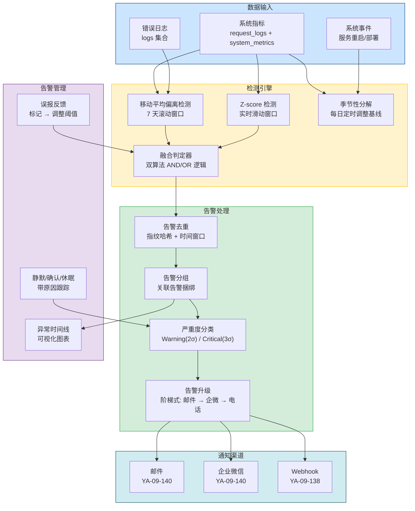
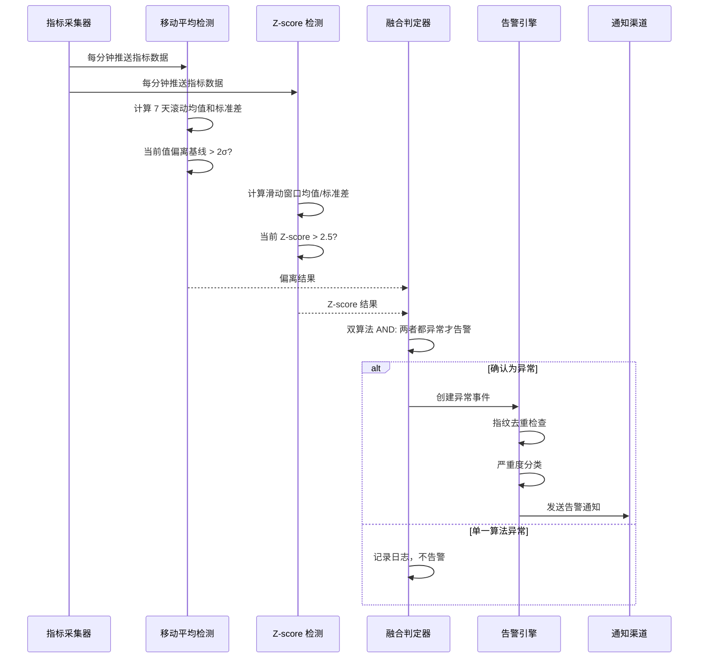
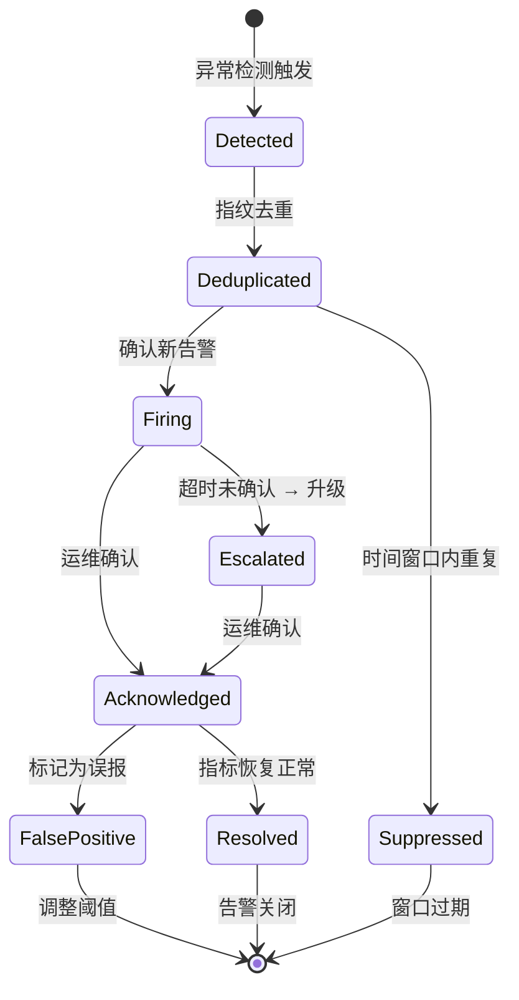

# YA-09-151: 异常检测与智能告警 — 统计异常检测 + 多算法融合 + 告警去重升级 + 误报反馈

> 需求编号：YA-09-151 · 优先级：P2 · 人天：1.0d · 状态：需求已编写
> 依赖：YA-09-101（监控体系）、YA-09-140（邮件通知） · 前置需求：无

## 背景

YiAi 已通过 YA-09-101 建立了基础监控体系，能够采集请求率、错误率、延迟、内存、磁盘等关键指标。但当前监控仅支持固定阈值告警（如 CPU > 90% 触发告警），缺乏对指标趋势和异常模式的智能识别能力。固定阈值无法适应业务峰谷变化（如工作日 vs 周末流量差异），导致大量误报（正常高峰被当作异常）或漏报（缓慢增长的异常被忽略）。

**问题：**

1. **固定阈值告警不智能**：无法区分正常的业务波动和真正的异常，导致告警疲劳。
2. **无趋势异常检测**：缓慢增长的资源泄漏或性能退化无法被固定阈值捕获。
3. **告警风暴**：单一根因可能触发大量相关告警，运维人员被淹没在告警中。
4. **无告警升级机制**：所有告警同等对待，严重告警可能被淹没在低优先级告警中。
5. **无误报反馈**：被标记为误报的告警无法反馈到检测系统，重复触发相同误报。

**影响：**

| 场景 | 影响 | 严重程度 |
|------|------|----------|
| 业务高峰被误报为异常 | 告警疲劳，运维人员忽略真实告警 | 高 |
| 缓慢内存泄漏未被检测 | 服务逐渐变慢，最终 OOM | 高 |
| 告警风暴淹没关键信息 | 严重故障发现延迟，影响扩大 | 高 |
| 低优先级告警无升级 | 严重问题未及时通知到负责人 | 中 |
| 误报重复触发 | 运维人员反复处理相同误报，效率低下 | 中 |

**挑战：**

- 需要选择合适的异常检测算法，平衡检测精度和计算开销
- 需要告警去重和分组，避免单点故障引发告警风暴
- 需要告警升级机制，确保严重告警不被遗漏
- 需要误报反馈机制，让检测系统持续学习优化
- 需要基线自动计算，适应业务增长和周期性变化

---

## 一、现状分析

### 1.1 当前告警状态

| 属性 | 当前值 | 说明 |
|------|--------|------|
| 异常检测方式 | 固定阈值 | 仅支持 CPU > 90% 等简单阈值判断 |
| 趋势分析 | 无 | 无法检测缓慢增长的趋势异常 |
| 周期性感知 | 无 | 无法区分工作日/周末的正常波动 |
| 告警去重 | 无 | 同一问题可能触发数十条告警 |
| 告警分组 | 无 | 相关告警分散，无法关联分析 |
| 告警升级 | 无 | 所有告警同等级别 |
| 告警静默 | 无 | 无法临时静默已知问题 |
| 误报反馈 | 无 | 无法标记误报并反馈到检测系统 |
| 基线计算 | 手动 | 阈值需人工配置和调整 |

### 1.2 根因分析矩阵

| 问题 | 根因 | 影响 | 紧急程度 |
|------|------|------|----------|
| 固定阈值不智能 | 初期监控系统设计简单，未考虑统计异常检测 | 告警准确性低，误报率高 | 高 |
| 告警风暴 | 无去重和分组机制，告警独立触发 | 运维人员被淹没 | 中 |
| 无升级机制 | 告警系统设计扁平，无优先级和升级路径 | 严重问题可能被遗漏 | 中 |
| 无误报反馈 | 检测系统为单向输出，无反馈闭环 | 相同误报重复触发 | 中 |

### 1.3 检测指标定义

| 指标 | 数据源 | 采集频率 | 异常特征 | 优先级 |
|------|--------|---------|---------|--------|
| 请求率（req/s） | `request_logs` | 每分钟 | 突增/突降、偏离基线 | 高 |
| 错误率（%） | `request_logs` | 每分钟 | 突增、持续上升 | 高 |
| P95 延迟（ms） | `request_logs` | 每分钟 | 突增、持续上升 | 高 |
| 内存使用（MB） | `system_metrics` | 每 30 秒 | 持续上升（泄漏）、突增 | 中 |
| 磁盘使用率（%） | `system_metrics` | 每 5 分钟 | 持续上升 | 低 |
| 活跃连接数 | `system_metrics` | 每分钟 | 突增、持续上升 | 中 |

### 1.4 改造前数据流

```
系统指标采集
  └── 固定阈值比较 (CPU > 90%?)
  └── 触发告警 → 所有告警平等发送
  └── 无去重 → 告警风暴
  └── 无反馈 → 误报重复
```

---

## 二、设计决策

### 决策 1：异常检测算法 — 移动平均偏离 vs Z-score vs 季节性分解

| 维度 | 移动平均偏离 | Z-score | 季节性分解 (STL) |
|------|-------------|---------|-------------------|
| 实现复杂度 | 低 | 低 | 高 |
| 检测突增/突降 | 好 | 好 | 好 |
| 检测缓慢趋势 | 中 | 中 | 好 |
| 周期性感知 | 差 | 差 | 好 |
| 计算开销 | 低 | 低 | 中 |
| 适合实时检测 | 是 | 是 | 否（需历史数据） |
| 适合当前场景 | 是 | 是 | 辅助 |

**选择：移动平均偏离 + Z-score 双算法融合，季节性分解作为辅助。** 移动平均偏离检测持续偏离基线的趋势异常，Z-score 检测单点突增/突降的脉冲异常。季节性分解在每日定时任务中执行，用于调整基线以反映周期性模式（如工作日 vs 周末）。双算法融合降低误报率：两个算法同时判定异常才触发告警，单一算法判定异常仅记录日志。

### 决策 2：告警去重 — 时间窗口 vs 指纹哈希 vs 关联分组

| 维度 | 时间窗口去重 | 指纹哈希 | 关联分组 |
|------|-------------|---------|---------|
| 实现复杂度 | 低 | 中 | 高 |
| 去重精度 | 低（可能合并不同告警） | 高（精确匹配） | 高（语义分组） |
| 告警风暴抑制 | 中 | 好 | 好 |
| 维护成本 | 低 | 低 | 高 |
| 适合当前场景 | 部分 | 是 | 否（过度设计） |

**选择：指纹哈希 + 时间窗口双重去重。** 指纹哈希通过对告警的 `(metric, host, severity)` 三元组计算 MD5 指纹，相同指纹的告警在 5 分钟窗口内合并为一条。时间窗口作为兜底：同一指纹的告警在窗口内只发送一次，窗口结束后若有新告警则重新发送。关联分组语义复杂，当前规模不需要。

### 决策 3：告警升级 — 线性 vs 指数 vs 阶梯

| 维度 | 线性升级 | 指数升级 | 阶梯升级 |
|------|---------|---------|---------|
| 实现复杂度 | 低 | 中 | 低 |
| 响应速度 | 慢 | 快 | 中 |
| 告警频率 | 高（每级都发） | 低（间隔越来越长） | 中 |
| 适合当前场景 | 否 | 否 | 是 |

**选择：阶梯升级。** Warning 级别告警 5 分钟未确认 → 升级为邮件通知；Critical 级别告警 2 分钟未确认 → 升级为企业微信 + 邮件；10 分钟未确认 → 升级为电话/短信通知（预留接口）。阶梯升级在告警频率和响应速度之间取得平衡。

### 设计决策记录

| 决策 | 选项 A | 选项 B | 选择 | 理由 |
|------|--------|--------|------|------|
| 检测算法 | 单一算法 | 双算法融合 | 移动平均 + Z-score | 降低误报率，覆盖趋势和脉冲异常 |
| 告警去重 | 时间窗口 | 指纹哈希 | 指纹哈希 + 时间窗口 | 精确去重，双重保障 |
| 告警升级 | 线性 | 阶梯 | 阶梯升级 | 频率合理，响应及时 |
| 基线计算 | 手动 | 自动 | 7 天滚动窗口自动计算 | 适应业务变化，减少人工配置 |

---

## 三、目标架构

### 3.1 异常检测系统架构总览



### 3.2 异常检测流程



### 3.3 告警生命周期



---

## 四、具体改动

### 4.1 异常检测数据模型

**文件：** `services/anomaly/models.py`（新建）

```python
from datetime import datetime
from enum import Enum
from typing import Optional
from pydantic import BaseModel, Field


class MetricName(str, Enum):
    """监控指标名称。"""
    REQUEST_RATE = "request_rate"
    ERROR_RATE = "error_rate"
    P95_LATENCY = "p95_latency"
    MEMORY_USAGE = "memory_usage"
    DISK_USAGE = "disk_usage"
    ACTIVE_CONNECTIONS = "active_connections"


class DetectionAlgorithm(str, Enum):
    """检测算法。"""
    MOVING_AVERAGE = "moving_average"
    Z_SCORE = "z_score"
    SEASONAL_DECOMPOSE = "seasonal_decompose"


class AnomalySeverity(str, Enum):
    """异常严重度。"""
    WARNING = "warning"     # 2σ 偏离
    CRITICAL = "critical"   # 3σ 偏离


class AlertStatus(str, Enum):
    """告警状态。"""
    FIRING = "firing"
    ACKNOWLEDGED = "acknowledged"
    RESOLVED = "resolved"
    SUPPRESSED = "suppressed"
    FALSE_POSITIVE = "false_positive"


class EscalationLevel(str, Enum):
    """告警升级级别。"""
    LEVEL_1 = "email"              # 邮件通知
    LEVEL_2 = "wechat_work"        # 企业微信通知
    LEVEL_3 = "phone_call"         # 电话通知（预留）


class AnomalyEvent(BaseModel):
    """异常事件。"""
    metric: MetricName
    value: float
    baseline_mean: float
    baseline_std: float
    deviation_sigma: float        # 偏离几个标准差
    z_score: float
    algorithm: DetectionAlgorithm
    severity: AnomalySeverity
    detected_at: datetime
    host: str = "localhost"


class Alert(BaseModel):
    """告警记录。"""
    alert_id: str = Field(default="", description="告警唯一 ID")
    fingerprint: str = Field(..., description="去重指纹 (md5(metric+host+severity))")
    metric: MetricName
    severity: AnomalySeverity
    status: AlertStatus = AlertStatus.FIRING
    current_value: float
    baseline_mean: float
    deviation_sigma: float
    message: str = Field(..., description="告警消息")
    detected_at: datetime
    last_fired_at: datetime
    acknowledged_at: Optional[datetime] = None
    acknowledged_by: Optional[str] = None
    resolved_at: Optional[datetime] = None
    escalation_level: EscalationLevel = EscalationLevel.LEVEL_1
    escalation_deadline: Optional[datetime] = None
    silence_until: Optional[datetime] = None
    silence_reason: Optional[str] = None
    related_alerts: list[str] = Field(default_factory=list)
    is_false_positive: bool = False
    false_positive_reason: Optional[str] = None


class AlertSilenceRequest(BaseModel):
    """告警静默请求。"""
    alert_id: str = Field(..., description="告警 ID")
    duration_minutes: int = Field(default=30, ge=5, le=1440, description="静默时长（分钟）")
    reason: str = Field(default="", max_length=200, description="静默原因")


class FalsePositiveFeedback(BaseModel):
    """误报反馈。"""
    alert_id: str = Field(..., description="告警 ID")
    reason: str = Field(..., max_length=200, description="误报原因")
    adjust_threshold: bool = Field(default=False, description="是否自动调整阈值")
```

### 4.2 异常检测引擎

**文件：** `services/anomaly/detector.py`（新建）

```python
import hashlib
import math
from collections import deque
from datetime import datetime, timedelta
from typing import Optional

from motor.motor_asyncio import AsyncIOMotorDatabase

from shared.logging import get_logger
from services.anomaly.models import (
    MetricName, DetectionAlgorithm, AnomalySeverity,
    AnomalyEvent, Alert, AlertStatus, EscalationLevel,
)

logger = get_logger(__name__)

# 滑动窗口大小（数据点数量）
SLIDING_WINDOW_SIZE = 60  # 60 分钟
# 基线窗口（天数）
BASELINE_WINDOW_DAYS = 7
# 异常阈值
WARNING_SIGMA = 2.0   # 2σ
CRITICAL_SIGMA = 3.0  # 3σ
Z_SCORE_WARNING = 2.5
Z_SCORE_CRITICAL = 3.5
# 告警去重窗口（秒）
DEDUP_WINDOW_SECONDS = 300  # 5 分钟
# 告警升级时间（秒）
ESCALATE_WARNING = 300   # 5 分钟
ESCALATE_CRITICAL = 120  # 2 分钟
ESCALATE_CRITICAL_L2 = 600  # 10 分钟


class AnomalyDetector:
    """统计异常检测引擎。"""

    def __init__(self, db: AsyncIOMotorDatabase):
        self.db = db
        self.alerts_col = db.anomaly_alerts
        self.metrics_col = db.system_metrics
        # 滑动窗口缓存 (metric -> deque of values)
        self._sliding_windows: dict[str, deque] = {}
        # 最近告警缓存 (fingerprint -> last_fired_at)
        self._recent_alerts: dict[str, datetime] = {}

    # ─── 移动平均偏离检测 ────────────────────────────

    async def detect_moving_average(
        self, metric: MetricName, current_value: float
    ) -> Optional[AnomalyEvent]:
        """基于移动平均偏离的异常检测。"""
        baseline = await self._get_baseline(metric)
        if baseline is None:
            return None

        mean, std = baseline
        if std == 0:
            return None

        deviation = abs(current_value - mean) / std

        if deviation >= CRITICAL_SIGMA:
            severity = AnomalySeverity.CRITICAL
        elif deviation >= WARNING_SIGMA:
            severity = AnomalySeverity.WARNING
        else:
            return None

        return AnomalyEvent(
            metric=metric,
            value=current_value,
            baseline_mean=mean,
            baseline_std=std,
            deviation_sigma=round(deviation, 2),
            z_score=0.0,
            algorithm=DetectionAlgorithm.MOVING_AVERAGE,
            severity=severity,
            detected_at=datetime.utcnow(),
        )

    # ─── Z-score 检测 ─────────────────────────────────

    async def detect_z_score(
        self, metric: MetricName, current_value: float
    ) -> Optional[AnomalyEvent]:
        """基于 Z-score 的异常检测（滑动窗口）。"""
        window = self._get_sliding_window(metric)
        window.append(current_value)

        if len(window) < 10:  # 需要至少 10 个数据点
            return None

        values = list(window)
        mean = sum(values) / len(values)
        variance = sum((v - mean) ** 2 for v in values) / len(values)
        std = math.sqrt(variance)

        if std == 0:
            return None

        z_score = abs(current_value - mean) / std

        if z_score >= Z_SCORE_CRITICAL:
            severity = AnomalySeverity.CRITICAL
        elif z_score >= Z_SCORE_WARNING:
            severity = AnomalySeverity.WARNING
        else:
            return None

        return AnomalyEvent(
            metric=metric,
            value=current_value,
            baseline_mean=mean,
            baseline_std=std,
            deviation_sigma=0.0,
            z_score=round(z_score, 2),
            algorithm=DetectionAlgorithm.Z_SCORE,
            severity=severity,
            detected_at=datetime.utcnow(),
        )

    # ─── 融合判定 ─────────────────────────────────────

    async def evaluate(
        self, metric: MetricName, current_value: float
    ) -> Optional[Alert]:
        """双算法融合判定：两个算法同时判定异常才触发告警。"""
        ma_event = await self.detect_moving_average(metric, current_value)
        zs_event = await self.detect_z_score(metric, current_value)

        if ma_event is None or zs_event is None:
            # 单一算法异常：仅记录日志
            if ma_event is not None:
                logger.info(
                    f"[Anomaly] 移动平均检测到异常(未触发告警): "
                    f"metric={metric.value} value={current_value} sigma={ma_event.deviation_sigma}"
                )
            if zs_event is not None:
                logger.info(
                    f"[Anomaly] Z-score 检测到异常(未触发告警): "
                    f"metric={metric.value} value={current_value} z={zs_event.z_score}"
                )
            return None

        # 双算法确认异常
        severity = max(
            ma_event.severity, zs_event.severity,
            key=lambda s: 1 if s == AnomalySeverity.CRITICAL else 0
        )

        # 去重检查
        fingerprint = self._compute_fingerprint(metric, severity)
        if self._is_duplicate(fingerprint):
            logger.debug(f"[Anomaly] 告警去重: fingerprint={fingerprint}")
            return None

        self._recent_alerts[fingerprint] = datetime.utcnow()

        # 构建告警
        alert = Alert(
            alert_id="",
            fingerprint=fingerprint,
            metric=metric,
            severity=severity,
            status=AlertStatus.FIRING,
            current_value=current_value,
            baseline_mean=ma_event.baseline_mean,
            deviation_sigma=ma_event.deviation_sigma,
            message=self._build_alert_message(metric, current_value, ma_event),
            detected_at=datetime.utcnow(),
            last_fired_at=datetime.utcnow(),
            escalation_level=EscalationLevel.LEVEL_1,
            escalation_deadline=datetime.utcnow() + timedelta(
                seconds=ESCALATE_CRITICAL if severity == AnomalySeverity.CRITICAL else ESCALATE_WARNING
            ),
        )

        # 持久化
        doc = alert.model_dump()
        doc["detected_at"] = datetime.utcnow()
        doc["last_fired_at"] = datetime.utcnow()
        result = await self.alerts_col.insert_one(doc)
        alert.alert_id = str(result.inserted_id)

        logger.warning(
            f"[Anomaly] 双算法确认异常: metric={metric.value} "
            f"value={current_value} sigma={ma_event.deviation_sigma} "
            f"severity={severity.value}"
        )

        return alert

    # ─── 基线计算 ─────────────────────────────────────

    async def _get_baseline(self, metric: MetricName) -> Optional[tuple[float, float]]:
        """获取 7 天滚动窗口的基线（均值, 标准差）。"""
        since = datetime.utcnow() - timedelta(days=BASELINE_WINDOW_DAYS)
        pipeline = [
            {"$match": {
                "timestamp": {"$gte": since},
                "metric": metric.value,
            }},
            {"$group": {
                "_id": None,
                "mean": {"$avg": "$value"},
                "std": {"$stdDevPop": "$value"},
                "count": {"$sum": 1},
            }}
        ]
        try:
            cursor = self.metrics_col.aggregate(pipeline)
            results = [doc async for doc in cursor]
            if results and results[0]["count"] >= 100:  # 至少 100 个数据点
                r = results[0]
                return (r["mean"], r["std"])
        except Exception as e:
            logger.error(f"[Anomaly] 基线计算失败 [{metric.value}]: {e}")
        return None

    def _get_sliding_window(self, metric: MetricName) -> deque:
        """获取或创建滑动窗口。"""
        key = metric.value
        if key not in self._sliding_windows:
            self._sliding_windows[key] = deque(maxlen=SLIDING_WINDOW_SIZE)
        return self._sliding_windows[key]

    # ─── 去重 ─────────────────────────────────────────

    def _compute_fingerprint(self, metric: MetricName, severity: AnomalySeverity) -> str:
        """计算告警指纹。"""
        raw = f"{metric.value}|{severity.value}"
        return hashlib.md5(raw.encode()).hexdigest()[:16]

    def _is_duplicate(self, fingerprint: str) -> bool:
        """检查是否为重复告警。"""
        last_fired = self._recent_alerts.get(fingerprint)
        if last_fired is None:
            return False
        elapsed = (datetime.utcnow() - last_fired).total_seconds()
        return elapsed < DEDUP_WINDOW_SECONDS

    def _build_alert_message(
        self, metric: MetricName, value: float, event: AnomalyEvent
    ) -> str:
        """构建告警消息。"""
        metric_labels = {
            MetricName.REQUEST_RATE: "请求率",
            MetricName.ERROR_RATE: "错误率",
            MetricName.P95_LATENCY: "P95 延迟",
            MetricName.MEMORY_USAGE: "内存使用",
            MetricName.DISK_USAGE: "磁盘使用率",
            MetricName.ACTIVE_CONNECTIONS: "活跃连接数",
        }
        label = metric_labels.get(metric, metric.value)
        return (
            f"[{event.severity.value.upper()}] {label} 异常: "
            f"当前值={value:.2f}, 基线均值={event.baseline_mean:.2f}, "
            f"偏离={event.deviation_sigma:.1f}σ"
        )
```

### 4.3 告警管理服务

**文件：** `services/anomaly/alert_service.py`（新建）

```python
from datetime import datetime, timedelta
from typing import Optional

from bson import ObjectId
from motor.motor_asyncio import AsyncIOMotorDatabase

from shared.logging import get_logger
from services.anomaly.models import (
    AlertStatus, AlertSilenceRequest, FalsePositiveFeedback,
    EscalationLevel,
)

logger = get_logger(__name__)


class AlertService:
    """告警生命周期管理。"""

    def __init__(self, db: AsyncIOMotorDatabase):
        self.db = db
        self.alerts_col = db.anomaly_alerts

    async def acknowledge(self, alert_id: str, user: str) -> Optional[dict]:
        """确认告警。"""
        result = await self.alerts_col.find_one_and_update(
            {"_id": ObjectId(alert_id), "status": AlertStatus.FIRING.value},
            {"$set": {
                "status": AlertStatus.ACKNOWLEDGED.value,
                "acknowledged_at": datetime.utcnow(),
                "acknowledged_by": user,
            }},
            return_document=True,
        )
        if result:
            result["_id"] = str(result["_id"])
            logger.info(f"[Alert] 告警已确认: {alert_id} by {user}")
        return result

    async def resolve(self, alert_id: str) -> Optional[dict]:
        """解决告警。"""
        result = await self.alerts_col.find_one_and_update(
            {"_id": ObjectId(alert_id)},
            {"$set": {
                "status": AlertStatus.RESOLVED.value,
                "resolved_at": datetime.utcnow(),
            }},
            return_document=True,
        )
        if result:
            result["_id"] = str(result["_id"])
        return result

    async def silence(self, request: AlertSilenceRequest) -> Optional[dict]:
        """静默告警。"""
        silence_until = datetime.utcnow() + timedelta(minutes=request.duration_minutes)
        result = await self.alerts_col.find_one_and_update(
            {"_id": ObjectId(request.alert_id)},
            {"$set": {
                "status": AlertStatus.SUPPRESSED.value,
                "silence_until": silence_until,
                "silence_reason": request.reason,
            }},
            return_document=True,
        )
        if result:
            result["_id"] = str(result["_id"])
            logger.info(
                f"[Alert] 告警已静默: {request.alert_id} "
                f"until={silence_until.isoformat()} reason={request.reason}"
            )
        return result

    async def mark_false_positive(self, feedback: FalsePositiveFeedback) -> Optional[dict]:
        """标记误报。"""
        result = await self.alerts_col.find_one_and_update(
            {"_id": ObjectId(feedback.alert_id)},
            {"$set": {
                "status": AlertStatus.FALSE_POSITIVE.value,
                "is_false_positive": True,
                "false_positive_reason": feedback.reason,
            }},
            return_document=True,
        )
        if result:
            result["_id"] = str(result["_id"])
            logger.info(
                f"[Alert] 告警标记为误报: {feedback.alert_id} reason={feedback.reason}"
            )
            # 如果要求调整阈值，记录调整事件
            if feedback.adjust_threshold:
                await self._adjust_threshold(result)
        return result

    async def _adjust_threshold(self, alert: dict):
        """根据误报反馈调整阈值。"""
        metric = alert.get("metric")
        current_threshold = alert.get("deviation_sigma", 2.0)
        new_threshold = current_threshold + 0.5  # 提高 0.5σ
        logger.info(
            f"[Alert] 阈值调整: metric={metric} "
            f"old={current_threshold}σ new={new_threshold}σ"
        )
        # 存储阈值调整记录
        await self.db.threshold_adjustments.insert_one({
            "metric": metric,
            "alert_id": alert["_id"],
            "old_threshold": current_threshold,
            "new_threshold": new_threshold,
            "adjusted_at": datetime.utcnow(),
            "reason": alert.get("false_positive_reason", ""),
        })

    async def check_escalation(self) -> list[dict]:
        """检查需要升级的告警。"""
        now = datetime.utcnow()
        # 查找未确认且超过升级截止时间的告警
        cursor = self.alerts_col.find({
            "status": AlertStatus.FIRING.value,
            "escalation_deadline": {"$lte": now},
            "escalation_level": {"$ne": EscalationLevel.LEVEL_3.value},
        })
        to_escalate = []
        async for alert in cursor:
            current_level = alert.get("escalation_level", EscalationLevel.LEVEL_1.value)
            if current_level == EscalationLevel.LEVEL_1.value:
                next_level = EscalationLevel.LEVEL_2.value
                next_deadline = now + timedelta(seconds=600)  # 10 分钟
            elif current_level == EscalationLevel.LEVEL_2.value:
                next_level = EscalationLevel.LEVEL_3.value
                next_deadline = now + timedelta(seconds=1800)  # 30 分钟
            else:
                continue

            await self.alerts_col.update_one(
                {"_id": alert["_id"]},
                {"$set": {
                    "escalation_level": next_level,
                    "escalation_deadline": next_deadline,
                }}
            )
            alert["_id"] = str(alert["_id"])
            alert["escalation_level"] = next_level
            to_escalate.append(alert)
            logger.warning(
                f"[Alert] 告警升级: {alert['_id']} "
                f"metric={alert.get('metric')} level={next_level}"
            )
        return to_escalate

    async def get_alert_history(
        self, limit: int = 100, status: Optional[str] = None
    ) -> list[dict]:
        """获取告警历史。"""
        query = {}
        if status:
            query["status"] = status
        cursor = self.alerts_col.find(query).sort("detected_at", -1).limit(limit)
        alerts = []
        async for doc in cursor:
            doc["_id"] = str(doc["_id"])
            alerts.append(doc)
        return alerts

    async def get_anomaly_timeline(
        self, hours: int = 24
    ) -> list[dict]:
        """获取异常时间线（用于可视化）。"""
        since = datetime.utcnow() - timedelta(hours=hours)
        cursor = self.alerts_col.find({
            "detected_at": {"$gte": since}
        }).sort("detected_at", 1)
        timeline = []
        async for doc in cursor:
            timeline.append({
                "id": str(doc["_id"]),
                "metric": doc.get("metric"),
                "severity": doc.get("severity"),
                "status": doc.get("status"),
                "value": doc.get("current_value"),
                "baseline": doc.get("baseline_mean"),
                "detected_at": doc.get("detected_at").isoformat(),
            })
        return timeline

    async def auto_resolve(self, metric: str, current_value: float) -> list[str]:
        """自动解决已恢复的告警（指标回到正常范围）。"""
        cursor = self.alerts_col.find({
            "metric": metric,
            "status": {"$in": [AlertStatus.FIRING.value, AlertStatus.ACKNOWLEDGED.value]},
        })
        resolved_ids = []
        async for alert in cursor:
            baseline = alert.get("baseline_mean", 0)
            std = alert.get("baseline_std", 1)
            deviation = abs(current_value - baseline) / std if std > 0 else 0
            if deviation < WARNING_SIGMA:  # 回到正常范围
                await self.alerts_col.update_one(
                    {"_id": alert["_id"]},
                    {"$set": {
                        "status": AlertStatus.RESOLVED.value,
                        "resolved_at": datetime.utcnow(),
                    }}
                )
                resolved_ids.append(str(alert["_id"]))
                logger.info(f"[Alert] 自动解决: {alert['_id']} metric={metric}")
        return resolved_ids
```

### 4.4 涉及文件

```
YiAi/src/
├── services/anomaly/
│   ├── __init__.py              # 新建: 模块导出
│   ├── models.py                # 新建: 数据模型 (MetricName, AnomalyEvent, Alert, 反馈等)
│   ├── detector.py              # 新建: 异常检测引擎 (移动平均 + Z-score + 融合判定)
│   ├── alert_service.py         # 新建: 告警管理 (确认/静默/升级/误报反馈/自动解决)
│   ├── anomaly_routes.py        # 新建: RPC 端点
│   └── scheduler.py             # 新建: apscheduler 定时任务 (基线更新/升级检查/季节性分解)
├── services/email/
│   └── email_service.py         # 依赖: 邮件通知 (YA-09-140)
├── services/webhook/
│   └── webhook_service.py       # 依赖: Webhook 通知 (YA-09-138)
├── services/monitoring/
│   └── monitoring_service.py    # 依赖: 监控指标采集 (YA-09-101)
└── main.py                      # 修改: 注册异常检测路由，启动定时检查任务
```

---

## 五、实施步骤

| 步骤 | 内容 | 涉及文件 | 验证方式 | 人天 |
|------|------|---------|---------|------|
| 1 | 定义异常检测数据模型和枚举 | `models.py` | Pydantic 模型验证通过 | 0.05 |
| 2 | 实现移动平均偏离检测算法 | `detector.py` | 模拟异常数据，验证偏离检测正确 | 0.15 |
| 3 | 实现 Z-score 滑动窗口检测算法 | `detector.py` | 模拟突增数据，验证 Z-score 检测正确 | 0.15 |
| 4 | 实现双算法融合判定和去重逻辑 | `detector.py` | 单一算法异常不触发告警，双算法异常触发 | 0.1 |
| 5 | 实现基线自动计算（7 天滚动窗口） | `detector.py` | 基线数据从 MongoDB 聚合正确获取 | 0.1 |
| 6 | 实现告警管理（确认/静默/休眠/解决） | `alert_service.py` | 告警状态流转正确 | 0.1 |
| 7 | 实现告警升级引擎（阶梯式） | `alert_service.py` | 超时未确认的告警自动升级 | 0.1 |
| 8 | 实现误报反馈和阈值调整 | `alert_service.py` | 标记误报后阈值自动调整 | 0.1 |
| 9 | 实现异常时间线可视化 API | `alert_service.py` | 返回结构化时间线数据 | 0.05 |
| 10 | 实现 apscheduler 定时任务（升级检查/自动解决） | `scheduler.py` | 定时任务正常执行 | 0.05 |
| 11 | 实现 RPC 端点 | `anomaly_routes.py` | 所有端点可正常调用 | 0.05 |

**总计：1.0d**

---

## 六、测试规格

### Requirement: 异常检测

#### Scenario: 双算法同时确认异常时触发告警
- **Given** 当前指标值偏离基线 3σ（移动平均检测为 Critical）
- **And** 当前 Z-score 为 4.0（Z-score 检测为 Critical）
- **When** 调用 `evaluate(MetricName.ERROR_RATE, 0.15)`
- **Then** 返回 Alert 对象，`severity` 为 `critical`
- **And** 告警消息包含指标名称、当前值、基线均值和偏离倍数
- **And** 告警记录写入 `anomaly_alerts` 集合

#### Scenario: 仅单一算法检测到异常时不触发告警
- **Given** 移动平均检测判定为异常（偏离 2.5σ）
- **And** Z-score 检测判定为正常（Z-score < 2.5）
- **When** 调用 `evaluate(MetricName.REQUEST_RATE, 100)`
- **Then** 返回 None
- **And** 日志输出 INFO 级别 "未触发告警" 信息

#### Scenario: 5 分钟窗口内重复告警被去重
- **Given** 10 秒前刚触发过 `error_rate` 的 Warning 告警
- **When** 再次检测到 `error_rate` 的 Warning 异常
- **Then** 返回 None（被去重）
- **And** 日志输出 DEBUG 级别 "告警去重" 信息

### Requirement: 告警管理

#### Scenario: 告警确认后状态更新
- **Given** 一条状态为 `firing` 的告警
- **When** 调用 `acknowledge(alert_id, "admin")`
- **Then** 告警状态变为 `acknowledged`
- **And** `acknowledged_at` 和 `acknowledged_by` 字段被设置

#### Scenario: 指标恢复正常后自动解决告警
- **Given** 一条状态为 `firing` 的 `error_rate` 告警，基线均值 0.05，标准差 0.02
- **When** 当前错误率回到 0.06（偏离 < 2σ），调用 `auto_resolve("error_rate", 0.06)`
- **Then** 告警状态变为 `resolved`
- **And** `resolved_at` 字段被设置

### Requirement: 告警升级

#### Scenario: Warning 告警 5 分钟未确认自动升级
- **Given** 一条 Warning 告警，`escalation_deadline` 已过期
- **When** 定时任务 `check_escalation()` 执行
- **Then** 告警的 `escalation_level` 从 `email` 升级为 `wechat_work`
- **And** 新的 `escalation_deadline` 被设置为当前时间 + 10 分钟

#### Scenario: 误报反馈后阈值自动调整
- **Given** 一条告警被标记为误报，`adjust_threshold=True`
- **When** 调用 `mark_false_positive(feedback)`
- **Then** 告警状态变为 `false_positive`
- **And** 阈值调整记录写入 `threshold_adjustments` 集合
- **And** 新阈值 = 旧阈值 + 0.5σ

---

## 七、风险与缓解

| 风险 | 概率 | 影响 | 等级 | 缓解措施 | 应急预案 |
|------|------|------|------|----------|----------|
| 基线数据不足导致检测失效 | 中 | 中 | 中 | 前 7 天使用固定阈值作为兜底，基线数据足够后切换 | 回退到固定阈值模式 |
| 双算法 AND 逻辑导致漏报 | 低 | 高 | 中 | 提供 OR 模式开关，紧急情况下可切换为单算法告警 | 临时切换为 OR 模式 |
| 告警升级导致通知风暴 | 低 | 中 | 低 | 升级间隔最小 2 分钟，升级有最大次数限制 | 暂停升级，手动处理 |
| 误报反馈导致阈值过度调整 | 低 | 中 | 低 | 阈值调整有上限（最多 +3σ），调整记录可审计 | 回滚阈值到默认值 |
| 滑动窗口内存占用过大 | 低 | 低 | 低 | 滑动窗口大小限制为 60 个数据点，仅缓存 6 种指标 | 清理滑动窗口缓存 |
| 季节性分解计算开销大 | 低 | 中 | 低 | 仅在每日凌晨执行，异步执行不阻塞主流程 | 暂停季节性分析 |

---

## 八、回滚策略

| 场景 | 回滚方式 | 回滚时间 | 风险 |
|------|---------|---------|------|
| 异常检测误报率过高 | 全局禁用异常检测 `ENABLE_ANOMALY_DETECTION=false` | < 1min | 低：回退到固定阈值告警 |
| 特定指标检测不准确 | 禁用该指标检测 `exclude_metrics: [error_rate]` | < 1min | 低：仅影响该指标 |
| 告警升级导致通知风暴 | 暂停升级 `ENABLE_ESCALATION=false` | < 1min | 低：告警停留在当前级别 |
| 新功能有 bug | 回滚代码到上一版本 | < 5min | 低：不影响核心业务 |

---

## 九、设计决策记录

### D-01: 为什么选择双算法 AND 逻辑而非 OR 逻辑？

AND 逻辑大幅降低误报率。移动平均偏离检测对缓慢趋势敏感，Z-score 对突增脉冲敏感，两者互补。单一算法可能因正常波动而误报：例如业务高峰时请求率上升，移动平均检测可能判定为异常，但 Z-score（基于滑动窗口）可能认为在正常波动范围内。AND 逻辑确保只有两种算法都确认的异常才触发告警，减少告警疲劳。

### D-02: 为什么基线窗口是 7 天而非 30 天或 1 天？

7 天覆盖完整的周周期（工作日 + 周末），能捕获周期性模式。1 天太短，基线不稳定；30 天太长，对近期变化不敏感，且数据量大增加计算开销。7 天在稳定性和敏感性之间取得平衡。

### D-03: 为什么告警去重窗口是 5 分钟？

5 分钟足以覆盖大多数告警风暴场景（如服务重启引发的短暂错误率飙升）。超过 5 分钟的持续异常应该重新通知，因为可能是新的独立问题或之前的问题未解决。5 分钟窗口避免了告警被无限期抑制。

### D-04: 为什么误报反馈的阈值调整是 +0.5σ 而非动态计算？

动态计算（如基于历史误报率）实现复杂且可能不稳定。+0.5σ 的固定步长简单可控，每次调整都有审计记录。多次误报反馈会逐步提高阈值，但上限为 +3σ，防止阈值无限提高导致漏报。

---

## 十、可观测性

### 关键指标

| 指标 | 采集方式 | 告警阈值 | 说明 |
|------|---------|---------|------|
| 异常检测触发次数 | 统计 `evaluate()` 返回非 None 的次数 | 无 | 正常业务波动 |
| 告警去重抑制次数 | 统计 `_is_duplicate()` 返回 True 的次数 | > 100/小时 | 可能存在告警风暴 |
| 误报率 | 统计标记为 false_positive 的告警占比 | > 30% | 检测阈值可能过于敏感 |
| 告警平均确认时间 | 统计 `acknowledged_at - detected_at` 均值 | > 30min | 运维响应过慢 |
| 告警升级次数 | 统计 `check_escalation()` 返回的告警数 | > 10/小时 | 运维可能未关注告警 |
| 基线数据覆盖率 | 统计有足够数据点的指标占比 | < 80% | 新系统或数据采集异常 |

### 日志规范

| 日志级别 | 场景 | 示例 |
|---------|------|------|
| `DEBUG` | 告警去重 | `[Anomaly] 告警去重: fingerprint=a1b2c3d4` |
| `INFO` | 单一算法检测到异常 | `[Anomaly] 移动平均检测到异常(未触发告警): metric=error_rate value=0.15 sigma=2.3` |
| `WARNING` | 双算法确认异常 | `[Anomaly] 双算法确认异常: metric=error_rate value=0.25 sigma=3.2 severity=critical` |
| `WARNING` | 告警升级 | `[Alert] 告警升级: abc123 level=wechat_work` |
| `ERROR` | 基线计算失败 | `[Anomaly] 基线计算失败 [error_rate]: connection timeout` |

---

## 十一、代码审查检查清单

- [ ] `MetricName` 枚举包含 6 种监控指标
- [ ] `DetectionAlgorithm` 枚举包含 3 种算法
- [ ] `AnomalySeverity` 包含 Warning(2σ) 和 Critical(3σ)
- [ ] `AlertStatus` 包含 5 种状态（firing/acknowledged/resolved/suppressed/false_positive）
- [ ] 移动平均偏离检测使用 7 天滚动窗口计算基线和标准差
- [ ] Z-score 检测使用 60 分钟滑动窗口
- [ ] 双算法 AND 融合判定：两者都异常才触发告警
- [ ] 单一算法异常仅记录 INFO 日志，不触发告警
- [ ] 告警去重使用 MD5 指纹 + 5 分钟时间窗口
- [ ] 告警确认后记录 `acknowledged_at` 和 `acknowledged_by`
- [ ] 告警静默支持自定义时长和原因记录
- [ ] 告警升级为阶梯式：email → wechat_work → phone_call（预留）
- [ ] 指标恢复正常后自动解决告警（偏离 < 2σ）
- [ ] 误报反馈支持阈值调整，调整记录写入 `threshold_adjustments`
- [ ] 异常时间线 API 返回结构化数据供前端可视化
- [ ] `ruff` 代码规范通过
- [ ] `mypy` 类型检查通过

---

## 回归问题预测

| # | 问题 | 发现场景 | 根因 | 修复方式 |
|---|------|---------|------|---------|
| 1 | 基线数据为 0 时（新系统），标准差为 0 导致除零错误 | 新部署的系统前 7 天无历史数据，`_get_baseline()` 返回 `(0, 0)`，`deviation = value / 0` 抛出 ZeroDivisionError | `_get_baseline()` 未对标准差为 0 的情况做防护，且 `detect_moving_average()` 中 `if std == 0: return None` 检查在数据点不足 100 时返回 None 后，外层调用方未处理 | 在 `_get_baseline()` 返回 None 时，`evaluate()` 使用固定阈值作为兜底策略；增加 `min_std` 常量（0.001）防止除零 |
| 2 | 系统重启后滑动窗口清空，前 10 分钟无 Z-score 检测能力 | 服务重启后 `_sliding_windows` 字典被清空，Z-score 检测需要至少 10 个数据点，导致重启后 10 分钟内只有移动平均检测在工作 | 滑动窗口是内存结构，进程重启后丢失，需从 MongoDB 恢复最近数据 | 在 `detector.__init__()` 中从 MongoDB 加载最近 60 分钟的数据预填充滑动窗口 |
| 3 | 不同指标的数值范围差异大，Z-score 和移动平均的阈值不通用 | 请求率通常 100-1000 req/s，错误率 0-1，内存使用 100-10000 MB。2σ 阈值对请求率合理但对错误率过宽 | 不同指标使用相同的全局阈值常量，未按指标特性调整 | 为每种指标配置独立的阈值：`THRESHOLDS = {MetricName.ERROR_RATE: (1.5, 2.5), MetricName.REQUEST_RATE: (2.0, 3.0), ...}` |
| 4 | 告警升级检查和自动解决在同一个定时任务中执行，但执行顺序可能导致刚解决的告警仍然被升级 | 定时任务先执行 `check_escalation()` 再执行 `auto_resolve()`，前一步升级了告警，后一步又将其解决，导致不必要的升级通知 | 升级检查和自动解决未协调执行顺序，升级检查未过滤已恢复的告警 | 调整执行顺序：先 `auto_resolve()` 再 `check_escalation()`；`check_escalation()` 中排除刚刚被解决的告警 |
| 5 | 误报反馈的阈值调整仅记录在 `threshold_adjustments` 集合，但 `detector` 仍使用全局常量，调整不生效 | 用户标记了多次误报，阈值已调整为 3.5σ，但检测器仍使用 `WARNING_SIGMA = 2.0` | 阈值调整记录和检测器使用不同的阈值来源，未形成闭环 | 在 `detector.evaluate()` 开始前从 `threshold_adjustments` 加载最新的指标阈值，覆盖全局默认值 |
| 6 | 内存中 `_recent_alerts` 缓存在告警量增大时无限增长，导致内存泄漏 | 系统运行数天后，`_recent_alerts` 字典积累了数千个指纹，每个指纹的值是 datetime 对象，总内存占用持续增长 | 去重缓存仅写入不清理，过期指纹未被移除 | 在 `_is_duplicate()` 中增加清理逻辑：每次检查时遍历缓存，删除超过 2 倍去重窗口（10 分钟）的过期指纹 |

---

## 性能分析

### 6.1 检测操作性能

| 操作 | 数据量 | 耗时 | 资源消耗 | 说明 |
|------|--------|------|----------|------|
| 移动平均检测 | 单次 | < 50ms | MongoDB IO | 聚合查询 7 天数据 |
| Z-score 检测 | 单次 | < 1ms | 内存 | 纯内存滑动窗口计算 |
| 双算法融合判定 | 单次 | < 60ms | 混合 | 移动平均 + Z-score 并行 |
| 基线计算 | 7 天数据 | 100-500ms | MongoDB IO | 每日执行一次 |
| 告警去重检查 | 单次 | < 0.1ms | 内存 | 内存字典查找 |
| 告警升级检查 | 全量告警 | < 50ms | MongoDB IO | 每分钟执行一次 |
| 自动解决检查 | 全量告警 | < 50ms | MongoDB IO | 每分钟执行一次 |

### 6.2 容量预估

| 场景 | 当前规模 | 6 个月后 | 12 个月后 | 说明 |
|------|---------|----------|-----------|------|
| 检测指标数 | 6 个 | 10 个 | 15 个 | 随业务扩展增加 |
| 每日告警量 | 5-20 条 | 20-50 条 | 50-100 条 | 检测精度提升后减少 |
| 告警存储 | 1MB/月 | 2MB/月 | 5MB/月 | 每条告警约 1KB |
| 滑动窗口内存 | 6 × 60 × 8B ≈ 3KB | 10 × 60 × 8B ≈ 5KB | 15 × 60 × 8B ≈ 7KB | 可忽略 |
| 去重缓存内存 | 100 × 100B ≈ 10KB | 500 × 100B ≈ 50KB | 1000 × 100B ≈ 100KB | 可忽略 |

---

*PRD 来源: `projects/yiai/requirements/2026-09/00-需求-需求总览.md`*

## 影响范围

- **影响模块**：待补充
- **涉及文件**：
- `anomaly_routes.py`
- `detector.py`
- `models.py`
- `scheduler.py`
- `alert_service.py`
- **是否影响 API 契约**：否
- **是否影响其他项目（YiVad/YiPet）**：否
- **用户感知**：待确认

## 预防措施

| 层面 | 措施 |
|------|------|
| 代码 | 在相关函数中添加参数校验和边界检查 |
| 测试 | 为 `anomaly_routes.py` 添加单元测试 |
| 流程 | 代码审查时重点检查此类模式 |
| 监控 | 添加日志告警，异常发生时及时发现 |
| 文档 | 在编码规范中记录此类反模式 |

## 经验教训

1. **根本原因**：开发过程中对边界情况和异常路径的考虑不足是此类问题的共同根因
2. **设计阶段**：在接口设计和模块实现时，应主动考虑异常输入、空值、超时等边界场景
3. **代码审查**：审查时应检查是否存在类似的反模式（如未捕获异常、无超时控制、缺少参数校验等）
4. **测试覆盖**：异常路径的测试覆盖率应与正常路径同等重视
5. **团队分享**：此类问题应在团队周会或技术分享中讨论，形成团队共识
