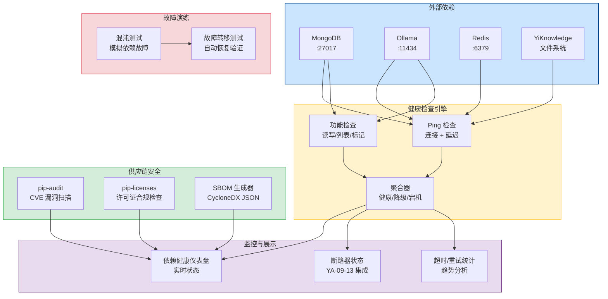
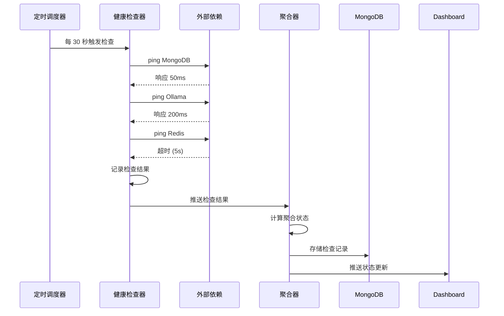
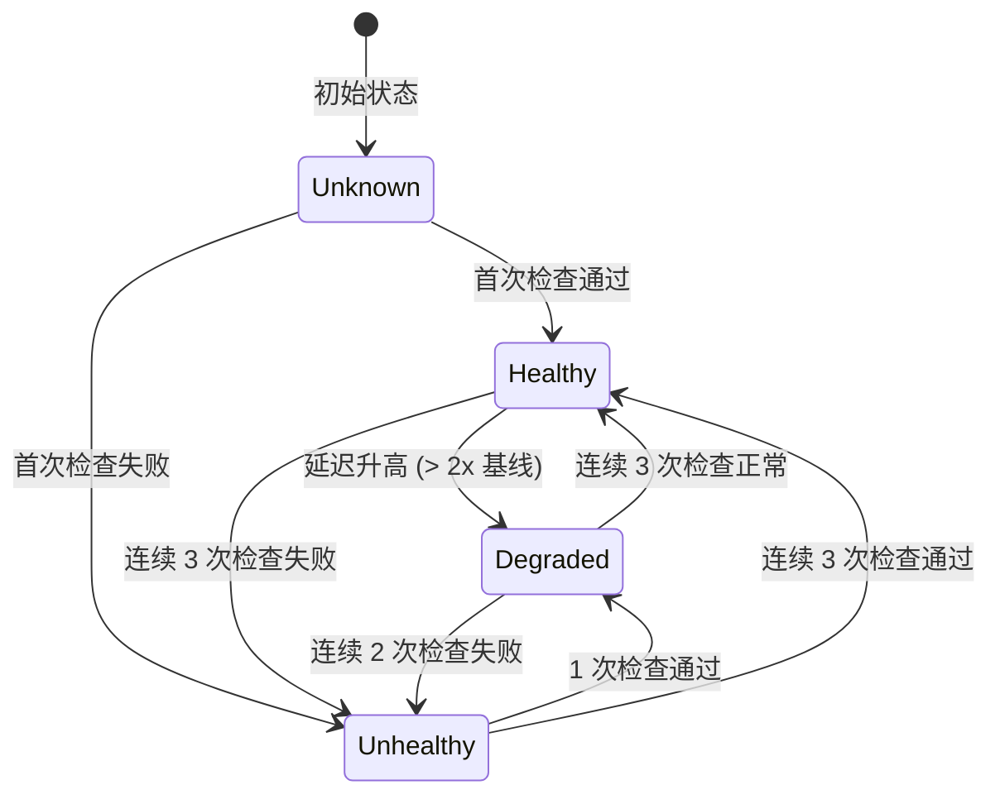

# YA-09-152: 依赖健康检查与供应链安全 — 外部依赖监控 + 漏洞扫描 + 许可证合规 + SBOM

> 需求编号：YA-09-152 · 优先级：P2 · 人天：0.5d · 状态：需求已编写
> 依赖：YA-09-13（断路器）、YA-09-101（监控体系） · 前置需求：无

## 背景

YiAi 作为 FastAPI 后端服务，依赖多个外部组件正常运行：MongoDB（数据存储）、Ollama（LLM 推理）、Redis（可选缓存）、YiKnowledge 文件系统（RAG 数据源）。当前缺乏对这些外部依赖的统一健康监控，运维人员无法快速了解整体依赖状态。此外，Python 生态的供应链安全问题日益突出——依赖包可能存在已知漏洞（CVE）、许可证不合规（GPL 传染性）、版本过时等问题。缺乏 SBOM（软件物料清单）使得安全审计和合规检查难以进行。

**问题：**

1. **无依赖健康聚合视图**：无法一眼看出所有依赖的整体状态（健康/降级/宕机）。
2. **依赖故障不可见**：MongoDB 慢查询、Ollama 超时等问题缺乏统一监控。
3. **无漏洞扫描**：Python 依赖包可能包含已知 CVE 漏洞，无自动检测机制。
4. **无许可证合规检查**：可能无意中引入 GPL/AGPL 等传染性许可证的依赖包。
5. **无 SBOM**：无法提供完整的软件物料清单，安全审计和合规检查困难。
6. **无断路器状态监控**：已实现的断路器（YA-09-13）状态缺乏统一监控 Dashboard。

**影响：**

| 场景 | 影响 | 严重程度 |
|------|------|----------|
| MongoDB 故障无感知 | 服务不可用，用户报错才发现 | 高 |
| 依赖包存在已知 CVE | 系统存在安全漏洞，可能被利用 | 高 |
| 依赖包许可证违规 | 法律风险，尤其在商业分发场景 | 中 |
| 依赖版本过时 | 无法享受新特性，安全补丁缺失 | 中 |
| 无 SBOM 无法通过安全审计 | 客户或合规要求无法满足 | 中 |

**挑战：**

- 需要设计统一的依赖健康检查框架，支持多种依赖类型的检查
- 需要健康状态聚合算法，将多个依赖的状态合并为整体状态
- 需要集成 pip-audit/safety 进行漏洞扫描，但不阻塞正常开发流程
- 需要许可证合规检查，识别传染性许可证
- 需要 SBOM 自动生成，支持 CycloneDX/SPDX 标准格式
- 需要集成断路器状态监控（YA-09-13）

---

## 一、现状分析

### 1.1 当前依赖管理状态

| 属性 | 当前值 | 说明 |
|------|--------|------|
| 依赖健康检查 | 无统一检查 | 各模块独立检查，无聚合视图 |
| 漏洞扫描 | 无 | 未集成 pip-audit 或 safety |
| 许可证检查 | 无 | 未检查依赖包许可证 |
| 版本跟踪 | 手动 | 通过 `pip list --outdated` 手动检查 |
| 断路器监控 | 分散 | 各断路器独立运行，无统一监控 |
| SBOM | 无 | 无软件物料清单 |
| 混沌测试 | 无 | 无依赖故障演练 |

### 1.2 根因分析矩阵

| 问题 | 根因 | 影响 | 紧急程度 |
|------|------|------|----------|
| 无健康聚合视图 | 项目初期未建立依赖监控体系 | 故障发现延迟 | 高 |
| 无漏洞扫描 | CI/CD 流程不包含安全检查 | 安全风险 | 高 |
| 无许可证检查 | 开发阶段未关注许可证合规 | 法律风险 | 中 |
| 无 SBOM | 未建立物料清单生成流程 | 审计困难 | 中 |

### 1.3 外部依赖清单

| 依赖 | 类型 | 关键程度 | 健康检查方式 | 超时阈值 | 重试建议 |
|------|------|---------|-------------|---------|---------|
| MongoDB | 数据库 | 关键 | ping + 读写延迟 | 5s | 3 次 |
| Ollama | LLM 服务 | 关键 | `/api/tags` 端点 | 10s | 2 次 |
| Redis | 缓存 | 可选 | PING 命令 | 2s | 3 次 |
| YiKnowledge | 文件系统 | 关键 | 目录可读性 + 文件数量 | 3s | 2 次 |
| Ollama API | HTTP 服务 | 关键 | `/api/version` | 5s | 2 次 |

### 1.4 改造前数据流

```
各模块独立健康检查
  ├── MongoDB: motor 连接检查（分散在 data_service）
  ├── Ollama: 无专门检查（仅在 LLM 调用时报错）
  ├── Redis: 无检查
  ├── YiKnowledge: apscheduler 轮询检查（分散在 knowledge_monitor）
  └── 断路器: 独立状态，无聚合

无漏洞扫描、无许可证检查、无 SBOM
```

---

## 二、设计决策

### 决策 1：依赖健康聚合 — 简单多数 vs 加权评分 vs 关键依赖优先

| 维度 | 简单多数 | 加权评分 | 关键依赖优先 |
|------|---------|---------|-------------|
| 实现复杂度 | 低 | 中 | 低 |
| 准确性 | 低（同等对待所有依赖） | 高 | 中 |
| 故障感知 | 中 | 高 | 高（关键依赖故障立即感知） |
| 适合当前场景 | 否 | 是 | 部分 |

**选择：关键依赖优先 + 加权评分。** 整体状态定义：所有关键依赖（MongoDB、Ollama、YiKnowledge）健康 → 健康；任一关键依赖不健康 → 降级；任一关键依赖宕机 → 宕机。可选依赖（Redis）故障不影响整体状态，仅标记为降级。加权评分作为辅助指标展示在 Dashboard 中。

### 决策 2：漏洞扫描工具 — pip-audit vs safety vs 手动解析

| 维度 | pip-audit | safety | 手动解析 |
|------|-----------|--------|---------|
| 实现复杂度 | 低（pip install + 子进程调用） | 低 | 高 |
| CVE 数据库 | PyPI Advisory Database | Safety DB（部分商业） | 自建 |
| 社区活跃度 | 高（PyPA 官方） | 中 | 不适用 |
| 离线支持 | 需要缓存 | 需要 API key | 不需要 |
| 适合当前场景 | 是 | 否（商业限制） | 否（重复造轮子） |

**选择：pip-audit。** pip-audit 是 PyPA 官方维护的工具，使用 PyPI Advisory Database，免费且开源。通过 `subprocess` 调用，解析 JSON 输出。结果缓存 24 小时，避免频繁扫描。对于离线环境，支持预下载漏洞数据库。

### 决策 3：SBOM 格式 — CycloneDX vs SPDX vs 自定义

| 维度 | CycloneDX | SPDX | 自定义 |
|------|-----------|------|--------|
| 行业标准 | OWASP 标准 | Linux Foundation 标准 | 非标准 |
| 工具支持 | 广泛 | 广泛 | 无 |
| 生成复杂度 | 低（pip-audit 支持） | 中 | 低 |
| 企业采用率 | 高 | 高 | 无 |
| 适合当前场景 | 是 | 是 | 否 |

**选择：CycloneDX。** CycloneDX 是 OWASP 标准，专为软件供应链安全设计。pip-audit 可直接输出 CycloneDX 格式。JSON 格式便于解析和存储。同时支持 SPDX 格式转换（通过 pip-audit 参数）。

### 设计决策记录

| 决策 | 选项 A | 选项 B | 选择 | 理由 |
|------|--------|--------|------|------|
| 健康聚合 | 简单多数 | 关键依赖优先 | 关键依赖优先 + 加权评分 | 准确反映系统可用性 |
| 漏洞扫描 | safety | pip-audit | pip-audit | PyPA 官方，免费开源 |
| SBOM 格式 | SPDX | CycloneDX | CycloneDX | OWASP 标准，pip-audit 原生支持 |
| 许可证检查 | 手动 | 自动化 | 自动化（pip-licenses） | 高效，集成到 CI/CD |

---

## 三、目标架构

### 3.1 依赖健康检查系统架构



### 3.2 健康检查流程



### 3.3 依赖状态转换



---

## 四、具体改动

### 4.1 依赖健康数据模型

**文件：** `services/dependency/models.py`（新建）

```python
from datetime import datetime
from enum import Enum
from typing import Optional
from pydantic import BaseModel, Field


class DependencyType(str, Enum):
    """依赖类型。"""
    MONGODB = "mongodb"
    OLLAMA = "ollama"
    REDIS = "redis"
    FILESYSTEM = "filesystem"


class DependencyStatus(str, Enum):
    """依赖健康状态。"""
    HEALTHY = "healthy"       # 健康
    DEGRADED = "degraded"     # 降级（延迟升高或部分功能异常）
    UNHEALTHY = "unhealthy"   # 不健康（连续检查失败）
    UNKNOWN = "unknown"       # 未知（初始状态）


class AggregateStatus(str, Enum):
    """聚合健康状态。"""
    ALL_HEALTHY = "all_healthy"     # 所有依赖健康
    DEGRADED = "degraded"           # 有依赖降级
    DOWN = "down"                   # 有依赖宕机


class HealthCheckResult(BaseModel):
    """单次健康检查结果。"""
    dependency: DependencyType
    status: DependencyStatus
    check_type: str = Field(..., description="检查类型: ping/read/write/list")
    latency_ms: float = Field(default=0, description="检查延迟")
    error_message: Optional[str] = Field(default=None)
    checked_at: datetime = Field(default_factory=datetime.utcnow)


class DependencyHealth(BaseModel):
    """依赖健康状态。"""
    dependency: DependencyType
    status: DependencyStatus
    last_check_at: Optional[datetime] = None
    last_latency_ms: float = 0
    avg_latency_ms_1h: float = 0
    consecutive_failures: int = 0
    consecutive_successes: int = 0
    total_checks: int = 0
    success_rate_24h: float = 100.0
    is_critical: bool = True


class VulnerabilityInfo(BaseModel):
    """漏洞信息。"""
    package_name: str
    installed_version: str
    cve_id: Optional[str] = None
    severity: str = Field(default="UNKNOWN", description="CRITICAL/HIGH/MEDIUM/LOW/UNKNOWN")
    description: str = ""
    fixed_version: Optional[str] = None
    advisory_url: Optional[str] = None


class LicenseInfo(BaseModel):
    """许可证信息。"""
    package_name: str
    version: str
    license: str
    is_compliant: bool = True
    risk_level: str = Field(default="low", description="low/medium/high/critical")
    notes: str = ""


class SBOMInfo(BaseModel):
    """SBOM 信息。"""
    format: str = Field(default="CycloneDX", description="SBOM 格式")
    version: str = Field(default="1.4", description="规范版本")
    generated_at: datetime = Field(default_factory=datetime.utcnow)
    total_packages: int = 0
    packages: list[dict] = Field(default_factory=list)
    vulnerabilities: list[VulnerabilityInfo] = Field(default_factory=list)
    licenses: list[LicenseInfo] = Field(default_factory=list)
```

### 4.2 依赖健康检查服务

**文件：** `services/dependency/health_checker.py`（新建）

```python
import os
import time
import asyncio
from datetime import datetime, timedelta
from typing import Optional

import httpx
from motor.motor_asyncio import AsyncIOMotorDatabase

from shared.logging import get_logger
from services.dependency.models import (
    DependencyType, DependencyStatus, AggregateStatus,
    HealthCheckResult, DependencyHealth,
)

logger = get_logger(__name__)

# 健康检查超时（秒）
CHECK_TIMEOUTS = {
    DependencyType.MONGODB: 5.0,
    DependencyType.OLLAMA: 10.0,
    DependencyType.REDIS: 2.0,
    DependencyType.FILESYSTEM: 3.0,
}

# 连续失败阈值
CONSECUTIVE_FAILURE_DEGRADED = 2
CONSECUTIVE_FAILURE_UNHEALTHY = 3

# 关键依赖列表
CRITICAL_DEPENDENCIES = {
    DependencyType.MONGODB, DependencyType.OLLAMA, DependencyType.FILESYSTEM
}


class DependencyHealthChecker:
    """外部依赖健康检查服务。"""

    def __init__(self, db: AsyncIOMotorDatabase):
        self.db = db
        self.health_col = db.dependency_health
        self.check_results_col = db.dependency_check_results
        self._http_client: Optional[httpx.AsyncClient] = None

    async def _get_http_client(self) -> httpx.AsyncClient:
        if self._http_client is None:
            self._http_client = httpx.AsyncClient(timeout=httpx.Timeout(10.0))
        return self._http_client

    # ─── 健康检查方法 ─────────────────────────────────

    async def check_mongodb(self) -> HealthCheckResult:
        """检查 MongoDB 健康状态。"""
        start = time.monotonic()
        try:
            await asyncio.wait_for(
                self.db.command("ping"),
                timeout=CHECK_TIMEOUTS[DependencyType.MONGODB],
            )
            latency = (time.monotonic() - start) * 1000
            return HealthCheckResult(
                dependency=DependencyType.MONGODB,
                status=DependencyStatus.HEALTHY,
                check_type="ping",
                latency_ms=round(latency, 2),
            )
        except asyncio.TimeoutError:
            return HealthCheckResult(
                dependency=DependencyType.MONGODB,
                status=DependencyStatus.UNHEALTHY,
                check_type="ping",
                error_message=f"超时 ({CHECK_TIMEOUTS[DependencyType.MONGODB]}s)",
            )
        except Exception as e:
            return HealthCheckResult(
                dependency=DependencyType.MONGODB,
                status=DependencyStatus.UNHEALTHY,
                check_type="ping",
                error_message=str(e)[:200],
            )

    async def check_ollama(self) -> HealthCheckResult:
        """检查 Ollama 健康状态。"""
        start = time.monotonic()
        try:
            client = await self._get_http_client()
            response = await client.get(
                "http://localhost:11434/api/tags",
                timeout=CHECK_TIMEOUTS[DependencyType.OLLAMA],
            )
            latency = (time.monotonic() - start) * 1000
            if response.status_code == 200:
                return HealthCheckResult(
                    dependency=DependencyType.OLLAMA,
                    status=DependencyStatus.HEALTHY,
                    check_type="api",
                    latency_ms=round(latency, 2),
                )
            else:
                return HealthCheckResult(
                    dependency=DependencyType.OLLAMA,
                    status=DependencyStatus.DEGRADED,
                    check_type="api",
                    latency_ms=round(latency, 2),
                    error_message=f"HTTP {response.status_code}",
                )
        except asyncio.TimeoutError:
            return HealthCheckResult(
                dependency=DependencyType.OLLAMA,
                status=DependencyStatus.UNHEALTHY,
                check_type="api",
                error_message=f"超时 ({CHECK_TIMEOUTS[DependencyType.OLLAMA]}s)",
            )
        except Exception as e:
            return HealthCheckResult(
                dependency=DependencyType.OLLAMA,
                status=DependencyStatus.UNHEALTHY,
                check_type="api",
                error_message=str(e)[:200],
            )

    async def check_redis(self) -> HealthCheckResult:
        """检查 Redis 健康状态（可选依赖）。"""
        start = time.monotonic()
        try:
            import redis.asyncio as aioredis
            r = aioredis.Redis(host="localhost", port=6379, socket_connect_timeout=2)
            await asyncio.wait_for(
                r.ping(), timeout=CHECK_TIMEOUTS[DependencyType.REDIS]
            )
            latency = (time.monotonic() - start) * 1000
            await r.close()
            return HealthCheckResult(
                dependency=DependencyType.REDIS,
                status=DependencyStatus.HEALTHY,
                check_type="ping",
                latency_ms=round(latency, 2),
            )
        except asyncio.TimeoutError:
            return HealthCheckResult(
                dependency=DependencyType.REDIS,
                status=DependencyStatus.UNHEALTHY,
                check_type="ping",
                error_message="超时",
            )
        except Exception as e:
            # Redis 不可用视为降级（非关键依赖）
            return HealthCheckResult(
                dependency=DependencyType.REDIS,
                status=DependencyStatus.DEGRADED,
                check_type="ping",
                error_message=str(e)[:200],
            )

    async def check_filesystem(self) -> HealthCheckResult:
        """检查 YiKnowledge 文件系统健康状态。"""
        start = time.monotonic()
        try:
            from shared.config import settings
            yiknowledge_path = getattr(settings, "YIKNOWLEDGE_PATH", "../YiKnowledge")
            if not os.path.exists(yiknowledge_path):
                return HealthCheckResult(
                    dependency=DependencyType.FILESYSTEM,
                    status=DependencyStatus.UNHEALTHY,
                    check_type="exists",
                    error_message=f"路径不存在: {yiknowledge_path}",
                )
            if not os.access(yiknowledge_path, os.R_OK):
                return HealthCheckResult(
                    dependency=DependencyType.FILESYSTEM,
                    status=DependencyStatus.UNHEALTHY,
                    check_type="readable",
                    error_message=f"路径不可读: {yiknowledge_path}",
                )
            latency = (time.monotonic() - start) * 1000
            return HealthCheckResult(
                dependency=DependencyType.FILESYSTEM,
                status=DependencyStatus.HEALTHY,
                check_type="exists",
                latency_ms=round(latency, 2),
            )
        except Exception as e:
            return HealthCheckResult(
                dependency=DependencyType.FILESYSTEM,
                status=DependencyStatus.UNHEALTHY,
                check_type="exists",
                error_message=str(e)[:200],
            )

    # ─── 聚合逻辑 ─────────────────────────────────────

    async def check_all(self) -> dict:
        """检查所有依赖并返回聚合状态。"""
        results = await asyncio.gather(
            self.check_mongodb(),
            self.check_ollama(),
            self.check_redis(),
            self.check_filesystem(),
            return_exceptions=True,
        )

        health_results: list[HealthCheckResult] = []
        for r in results:
            if isinstance(r, Exception):
                logger.error(f"[Dependency] 健康检查异常: {r}")
            elif isinstance(r, HealthCheckResult):
                health_results.append(r)
                await self._update_health(r)

        aggregate = self._aggregate_status(health_results)
        return {
            "aggregate_status": aggregate.value,
            "dependencies": [r.model_dump() for r in health_results],
            "checked_at": datetime.utcnow().isoformat(),
        }

    def _aggregate_status(self, results: list[HealthCheckResult]) -> AggregateStatus:
        """聚合依赖健康状态。"""
        critical_unhealthy = False
        any_degraded = False

        for r in results:
            is_critical = r.dependency in CRITICAL_DEPENDENCIES
            if r.status == DependencyStatus.UNHEALTHY and is_critical:
                critical_unhealthy = True
            elif r.status in (DependencyStatus.DEGRADED, DependencyStatus.UNHEALTHY):
                any_degraded = True

        if critical_unhealthy:
            return AggregateStatus.DOWN
        elif any_degraded:
            return AggregateStatus.DEGRADED
        return AggregateStatus.ALL_HEALTHY

    async def _update_health(self, result: HealthCheckResult):
        """更新依赖健康记录。"""
        dep = result.dependency.value
        existing = await self.health_col.find_one({"dependency": dep})

        if existing:
            # 更新连续计数
            is_healthy = result.status == DependencyStatus.HEALTHY
            update = {
                "$set": {
                    "status": result.status.value,
                    "last_check_at": result.checked_at,
                    "last_latency_ms": result.latency_ms,
                },
                "$inc": {"total_checks": 1},
            }
            if is_healthy:
                update["$inc"]["consecutive_successes"] = 1
                update["$set"]["consecutive_failures"] = 0
            else:
                update["$inc"]["consecutive_failures"] = 1
                update["$set"]["consecutive_successes"] = 0

            await self.health_col.update_one({"dependency": dep}, update)
        else:
            doc = {
                "dependency": dep,
                "status": result.status.value,
                "last_check_at": result.checked_at,
                "last_latency_ms": result.latency_ms,
                "avg_latency_ms_1h": result.latency_ms,
                "consecutive_failures": 0 if result.status == DependencyStatus.HEALTHY else 1,
                "consecutive_successes": 1 if result.status == DependencyStatus.HEALTHY else 0,
                "total_checks": 1,
                "success_rate_24h": 100.0,
                "is_critical": result.dependency in CRITICAL_DEPENDENCIES,
            }
            await self.health_col.insert_one(doc)

        # 存储检查结果
        await self.check_results_col.insert_one(result.model_dump())

    # ─── 查询接口 ─────────────────────────────────────

    async def get_all_health(self) -> list[dict]:
        """获取所有依赖的健康状态。"""
        cursor = self.health_col.find()
        deps = []
        async for doc in cursor:
            doc["_id"] = str(doc["_id"])
            deps.append(doc)
        return deps

    async def get_dependency_stats(self, dependency: DependencyType) -> dict:
        """获取指定依赖的统计数据（超时/重试/延迟）。"""
        since = datetime.utcnow() - timedelta(hours=24)
        cursor = self.check_results_col.find({
            "dependency": dependency.value,
            "checked_at": {"$gte": since},
        }).sort("checked_at", -1)

        results = [doc async for doc in cursor]
        if not results:
            return {"dependency": dependency.value, "message": "无检查记录"}

        latencies = [r["latency_ms"] for r in results if r.get("latency_ms", 0) > 0]
        failures = [r for r in results if r["status"] != "healthy"]
        timeouts = [r for r in results if "超时" in (r.get("error_message") or "")]

        return {
            "dependency": dependency.value,
            "total_checks_24h": len(results),
            "success_rate": round((len(results) - len(failures)) / len(results) * 100, 1),
            "avg_latency_ms": round(sum(latencies) / len(latencies), 2) if latencies else 0,
            "p95_latency_ms": round(sorted(latencies)[int(len(latencies) * 0.95)], 2) if latencies else 0,
            "failure_count": len(failures),
            "timeout_count": len(timeouts),
            "top_errors": self._top_errors(failures),
        }

    def _top_errors(self, failures: list[dict], limit: int = 5) -> list[dict]:
        """统计 TOP 错误。"""
        error_counts: dict[str, int] = {}
        for f in failures:
            msg = (f.get("error_message") or "unknown")[:50]
            error_counts[msg] = error_counts.get(msg, 0) + 1
        sorted_errors = sorted(error_counts.items(), key=lambda x: x[1], reverse=True)
        return [{"error": e, "count": c} for e, c in sorted_errors[:limit]]
```

### 4.3 供应链安全服务

**文件：** `services/dependency/security_scanner.py`（新建）

```python
import asyncio
import json
import subprocess
from datetime import datetime, timedelta
from typing import Optional

from motor.motor_asyncio import AsyncIOMotorDatabase

from shared.logging import get_logger
from services.dependency.models import VulnerabilityInfo, LicenseInfo, SBOMInfo

logger = get_logger(__name__)

# 漏洞扫描缓存时间（秒）
VULN_CACHE_TTL = 86400  # 24 小时


class SecurityScanner:
    """供应链安全扫描服务。"""

    def __init__(self, db: AsyncIOMotorDatabase):
        self.db = db
        self.vuln_cache_col = db.vulnerability_cache
        self.sbom_col = db.sbom_records

    # ─── 漏洞扫描 ─────────────────────────────────────

    async def scan_vulnerabilities(self, force: bool = False) -> list[VulnerabilityInfo]:
        """使用 pip-audit 扫描 Python 依赖漏洞。"""
        # 检查缓存
        if not force:
            cached = await self._get_cached_vulnerabilities()
            if cached is not None:
                return cached

        try:
            proc = await asyncio.create_subprocess_exec(
                "pip-audit", "--format", "json",
                stdout=asyncio.subprocess.PIPE,
                stderr=asyncio.subprocess.PIPE,
            )
            stdout, stderr = await asyncio.wait_for(
                proc.communicate(), timeout=120
            )

            if proc.returncode not in (0, 1):
                # returncode 1 表示发现漏洞（正常）
                logger.error(f"[Security] pip-audit 执行失败: {stderr.decode()}")
                return []

            results = json.loads(stdout.decode())
            vulnerabilities = []
            for vuln in results.get("dependencies", []):
                for v in vuln.get("vulns", []):
                    vulnerabilities.append(VulnerabilityInfo(
                        package_name=vuln["name"],
                        installed_version=vuln.get("version", "unknown"),
                        cve_id=v.get("id"),
                        severity=v.get("severity", "UNKNOWN"),
                        description=v.get("description", ""),
                        fixed_version=v.get("fixed_versions", [None])[0] if v.get("fixed_versions") else None,
                        advisory_url=v.get("url"),
                    ))

            # 缓存结果
            await self._cache_vulnerabilities(vulnerabilities)
            logger.info(
                f"[Security] 漏洞扫描完成: {len(vulnerabilities)} 个漏洞发现"
            )
            return vulnerabilities

        except asyncio.TimeoutError:
            logger.error("[Security] pip-audit 扫描超时")
            return []
        except FileNotFoundError:
            logger.error("[Security] pip-audit 未安装，请运行 pip install pip-audit")
            return []
        except Exception as e:
            logger.error(f"[Security] 漏洞扫描异常: {e}")
            return []

    async def _get_cached_vulnerabilities(self) -> Optional[list[VulnerabilityInfo]]:
        """获取缓存的漏洞扫描结果。"""
        cached = await self.vuln_cache_col.find_one(
            {"type": "pip-audit"},
            sort=[("scanned_at", -1)],
        )
        if cached:
            elapsed = (datetime.utcnow() - cached["scanned_at"]).total_seconds()
            if elapsed < VULN_CACHE_TTL:
                return [VulnerabilityInfo(**v) for v in cached.get("vulnerabilities", [])]
        return None

    async def _cache_vulnerabilities(self, vulnerabilities: list[VulnerabilityInfo]):
        """缓存漏洞扫描结果。"""
        await self.vuln_cache_col.delete_many({"type": "pip-audit"})
        await self.vuln_cache_col.insert_one({
            "type": "pip-audit",
            "scanned_at": datetime.utcnow(),
            "vulnerabilities": [v.model_dump() for v in vulnerabilities],
        })

    # ─── 许可证合规检查 ───────────────────────────────

    async def check_licenses(self) -> list[LicenseInfo]:
        """使用 pip-licenses 检查许可证合规。"""
        # 高风险许可证列表
        HIGH_RISK_LICENSES = {
            "GPL", "GPLv2", "GPLv3", "AGPL", "AGPLv3",
            "UNKNOWN", "Proprietary", "Commercial",
        }
        MEDIUM_RISK_LICENSES = {"LGPL", "LGPLv2", "LGPLv3", "MPL", "MPL 2.0"}

        try:
            proc = await asyncio.create_subprocess_exec(
                "pip-licenses", "--format", "json",
                stdout=asyncio.subprocess.PIPE,
                stderr=asyncio.subprocess.PIPE,
            )
            stdout, stderr = await asyncio.wait_for(
                proc.communicate(), timeout=60
            )

            if proc.returncode != 0:
                logger.error(f"[Security] pip-licenses 执行失败: {stderr.decode()}")
                return []

            results = json.loads(stdout.decode())
            licenses = []
            for pkg in results:
                lic = pkg.get("License", "UNKNOWN")
                if lic in HIGH_RISK_LICENSES:
                    risk = "critical"
                    compliant = False
                elif lic in MEDIUM_RISK_LICENSES:
                    risk = "medium"
                    compliant = True
                else:
                    risk = "low"
                    compliant = True

                licenses.append(LicenseInfo(
                    package_name=pkg["Name"],
                    version=pkg.get("Version", "unknown"),
                    license=lic,
                    is_compliant=compliant,
                    risk_level=risk,
                    notes=f"高风险许可证: {lic}" if not compliant else "",
                ))

            non_compliant = [l for l in licenses if not l.is_compliant]
            logger.info(
                f"[Security] 许可证检查完成: {len(licenses)} 个包, "
                f"{len(non_compliant)} 个不合规"
            )
            return licenses

        except asyncio.TimeoutError:
            logger.error("[Security] pip-licenses 检查超时")
            return []
        except FileNotFoundError:
            logger.error("[Security] pip-licenses 未安装，请运行 pip install pip-licenses")
            return []
        except Exception as e:
            logger.error(f"[Security] 许可证检查异常: {e}")
            return []

    # ─── SBOM 生成 ────────────────────────────────────

    async def generate_sbom(self) -> SBOMInfo:
        """生成 CycloneDX 格式的 SBOM。"""
        try:
            # 使用 pip-audit 生成 SBOM
            proc = await asyncio.create_subprocess_exec(
                "pip-audit", "--format", "cyclonedx-json",
                stdout=asyncio.subprocess.PIPE,
                stderr=asyncio.subprocess.PIPE,
            )
            stdout, stderr = await asyncio.wait_for(
                proc.communicate(), timeout=120
            )

            if proc.returncode not in (0, 1):
                logger.error(f"[Security] SBOM 生成失败: {stderr.decode()}")
                return SBOMInfo()

            cyclonedx_data = json.loads(stdout.decode())

            # 提取包列表
            packages = []
            for comp in cyclonedx_data.get("components", []):
                packages.append({
                    "name": comp.get("name"),
                    "version": comp.get("version"),
                    "type": comp.get("type"),
                    "purl": comp.get("purl"),
                })

            # 同时获取漏洞信息
            vulnerabilities = await self.scan_vulnerabilities()
            licenses = await self.check_licenses()

            sbom = SBOMInfo(
                format="CycloneDX",
                version="1.4",
                generated_at=datetime.utcnow(),
                total_packages=len(packages),
                packages=packages,
                vulnerabilities=vulnerabilities,
                licenses=licenses,
            )

            # 存储 SBOM
            await self.sbom_col.insert_one({
                **sbom.model_dump(),
                "generated_at": datetime.utcnow(),
            })

            logger.info(f"[Security] SBOM 生成完成: {len(packages)} 个包")
            return sbom

        except asyncio.TimeoutError:
            logger.error("[Security] SBOM 生成超时")
            return SBOMInfo()
        except Exception as e:
            logger.error(f"[Security] SBOM 生成异常: {e}")
            return SBOMInfo()

    async def get_sbom_history(self, limit: int = 10) -> list[dict]:
        """获取 SBOM 生成历史。"""
        cursor = self.sbom_col.find().sort("generated_at", -1).limit(limit)
        history = []
        async for doc in cursor:
            doc["_id"] = str(doc["_id"])
            history.append(doc)
        return history
```

### 4.4 涉及文件

```
YiAi/src/
├── services/dependency/
│   ├── __init__.py              # 新建: 模块导出
│   ├── models.py                # 新建: 数据模型 (DependencyType, HealthCheckResult, SBOMInfo 等)
│   ├── health_checker.py        # 新建: 依赖健康检查引擎 (ping + 聚合 + 统计)
│   ├── security_scanner.py      # 新建: 供应链安全 (漏洞扫描 + 许可证 + SBOM)
│   ├── dependency_routes.py     # 新建: RPC 端点
│   └── scheduler.py             # 新建: apscheduler 定时检查 + 每日安全扫描
├── services/circuit_breaker/
│   └── circuit_breaker.py       # 依赖: 断路器状态集成 (YA-09-13)
└── main.py                      # 修改: 注册依赖检查路由，启动定时检查任务
```

---

## 五、实施步骤

| 步骤 | 内容 | 涉及文件 | 验证方式 | 人天 |
|------|------|---------|---------|------|
| 1 | 定义依赖健康和安全数据模型 | `models.py` | Pydantic 模型验证通过 | 0.03 |
| 2 | 实现依赖健康检查引擎（MongoDB/Ollama/Redis/文件系统） | `health_checker.py` | 4 种依赖 ping 检查正常 | 0.1 |
| 3 | 实现健康状态聚合逻辑（关键依赖优先） | `health_checker.py` | 模拟依赖故障，验证聚合状态正确 | 0.05 |
| 4 | 实现依赖统计（超时/重试/延迟趋势） | `health_checker.py` | 24 小时统计数据正确 | 0.05 |
| 5 | 实现漏洞扫描（pip-audit 集成） | `security_scanner.py` | 漏洞扫描返回结果，缓存生效 | 0.08 |
| 6 | 实现许可证合规检查（pip-licenses 集成） | `security_scanner.py` | 许可证列表返回，高风险标记正确 | 0.05 |
| 7 | 实现 SBOM 生成（CycloneDX 格式） | `security_scanner.py` | SBOM JSON 格式正确，包含包和漏洞信息 | 0.07 |
| 8 | 实现 apscheduler 定时任务（健康检查 + 安全扫描） | `scheduler.py` | 定时任务正常执行 | 0.04 |
| 9 | 实现 RPC 端点 | `dependency_routes.py` | 所有端点可正常调用 | 0.03 |

**总计：0.5d**

---

## 六、测试规格

### Requirement: 依赖健康检查

#### Scenario: 所有依赖健康时聚合状态为 all_healthy
- **Given** MongoDB、Ollama、Redis、YiKnowledge 文件系统均可正常访问
- **When** 调用 `check_all()`
- **Then** 返回 `aggregate_status: "all_healthy"`
- **And** 每个依赖的 `status` 为 `healthy`
- **And** 检查结果存储到 `dependency_check_results` 集合

#### Scenario: 关键依赖故障时聚合状态为 down
- **Given** MongoDB 返回连接超时
- **And** 其他依赖正常
- **When** 调用 `check_all()`
- **Then** 返回 `aggregate_status: "down"`
- **And** MongoDB 的 `status` 为 `unhealthy`，`error_message` 包含超时信息

#### Scenario: 非关键依赖故障时聚合状态为 degraded
- **Given** Redis 不可用（端口未监听）
- **And** 所有关键依赖正常
- **When** 调用 `check_all()`
- **Then** 返回 `aggregate_status: "degraded"`
- **And** Redis 的 `status` 为 `degraded`

### Requirement: 漏洞扫描

#### Scenario: pip-audit 扫描发现漏洞
- **Given** Python 依赖中包含已知 CVE 漏洞的包
- **When** 调用 `scan_vulnerabilities()`
- **Then** 返回漏洞列表，每个包含 `package_name`、`cve_id`、`severity`、`fixed_version`
- **And** 结果缓存到 `vulnerability_cache` 集合

#### Scenario: pip-audit 未安装时返回空列表
- **Given** 系统中未安装 pip-audit
- **When** 调用 `scan_vulnerabilities()`
- **Then** 返回空列表
- **And** 日志输出 ERROR 级别 "pip-audit 未安装" 信息

### Requirement: 许可证合规

#### Scenario: 检测到高风险许可证
- **Given** 依赖中包含 GPL 许可证的包
- **When** 调用 `check_licenses()`
- **Then** 该包的 `is_compliant` 为 `false`
- **And** `risk_level` 为 `critical`
- **And** `notes` 包含许可证风险说明

### Requirement: SBOM 生成

#### Scenario: 成功生成 CycloneDX SBOM
- **Given** 系统中安装了 pip-audit
- **When** 调用 `generate_sbom()`
- **Then** 返回 `SBOMInfo` 对象，`format` 为 `CycloneDX`
- **And** `total_packages` 大于 0
- **And** `packages` 列表包含包名、版本、类型信息
- **And** SBOM 记录存储到 `sbom_records` 集合

---

## 七、风险与缓解

| 风险 | 概率 | 影响 | 等级 | 缓解措施 | 应急预案 |
|------|------|------|------|----------|----------|
| pip-audit 扫描超时（大型项目） | 中 | 低 | 低 | 设置 120s 超时，结果缓存 24 小时 | 手动执行离线扫描 |
| 健康检查过于频繁消耗依赖资源 | 低 | 低 | 低 | 30 秒间隔，仅 ping 不执行重型操作 | 降低检查频率为 60 秒 |
| MongoDB 聚合管道统计耗时 | 中 | 低 | 低 | 24 小时统计使用简单查询，限制扫描范围 | 减少统计时间范围 |
| 许可证检查结果不准确 | 低 | 中 | 低 | pip-licenses 依赖包元数据，准确性有限 | 人工复核高风险包 |
| 混沌测试导致生产中断 | 低 | 高 | 高 | 仅在开发/测试环境执行混沌测试 | 立即停止测试，恢复服务 |

---

## 八、回滚策略

| 场景 | 回滚方式 | 回滚时间 | 风险 |
|------|---------|---------|------|
| 健康检查影响依赖性能 | 全局禁用健康检查 `ENABLE_DEPENDENCY_CHECK=false` | < 1min | 低：监控暂停，不影响核心业务 |
| 漏洞扫描误报过多 | 禁用自动扫描，依赖手动触发 | < 1min | 低：安全扫描暂停 |
| 新功能有 bug | 回滚代码到上一版本 | < 5min | 低：不影响核心业务 |

---

## 九、设计决策记录

### D-01: 为什么选择关键依赖优先而非加权评分？

加权评分虽然精确，但权重设置主观且需要持续调整。关键依赖优先逻辑简单明确：MongoDB、Ollama、YiKnowledge 任一宕机 → 系统不可用。这符合实际运维认知——运维人员更关心"系统还能用吗"而非"依赖健康分数是多少"。加权评分作为辅助指标展示在 Dashboard 中。

### D-02: 为什么漏洞扫描缓存 24 小时而非实时扫描？

pip-audit 需要联网查询 PyPI Advisory Database，每次扫描耗时 10-30 秒。24 小时缓存在及时性和性能之间取得平衡。CVE 漏洞通常不会在数小时内发生变化，24 小时更新周期足够。安全扫描结果通过 `force=True` 参数支持手动刷新。

### D-03: 为什么选择 CycloneDX 而非 SPDX？

CycloneDX 是 OWASP 维护的标准，专为软件供应链安全设计，pip-audit 原生支持。SPDX 虽然也是行业标准，但更侧重于许可证信息，pip-audit 对其支持不如 CycloneDX 完善。同时保留 SPDX 扩展能力。

### D-04: 为什么健康检查间隔是 30 秒？

30 秒在故障发现的及时性和系统开销之间取得平衡。对于关键依赖，30 秒的故障检测延迟（最坏情况）是可接受的。更频繁的检查（如 10 秒）会增加依赖负载，更慢的检查（如 60 秒）会延迟故障发现。

---

## 十、可观测性

### 关键指标

| 指标 | 采集方式 | 告警阈值 | 说明 |
|------|---------|---------|------|
| 依赖健康聚合状态 | `check_all()` 返回的 `aggregate_status` | degraded / down | 整体依赖状态 |
| 各依赖响应延迟 | `HealthCheckResult.latency_ms` | > 2x 基线 | 依赖性能下降 |
| 依赖连续失败次数 | `DependencyHealth.consecutive_failures` | >= 3 | 依赖可能宕机 |
| 24 小时成功率 | `DependencyHealth.success_rate_24h` | < 95% | 依赖不稳定 |
| 漏洞总数（按严重度） | `scan_vulnerabilities()` 结果 | Critical > 0 | 存在严重安全漏洞 |
| 不合规许可证数 | `check_licenses()` 结果 | > 0 | 许可证风险 |
| SBOM 包总数 | `generate_sbom()` 结果 | — | 依赖规模 |

### 日志规范

| 日志级别 | 场景 | 示例 |
|---------|------|------|
| `INFO` | 健康检查通过 | `[Dependency] 健康检查通过: mongodb latency=12ms` |
| `WARNING` | 依赖降级 | `[Dependency] 依赖降级: redis 不可用 (非关键)` |
| `ERROR` | 依赖宕机 | `[Dependency] 关键依赖宕机: mongodb 超时 (5s)` |
| `INFO` | 安全扫描完成 | `[Security] 漏洞扫描完成: 3 个漏洞发现` |
| `ERROR` | 安全扫描失败 | `[Security] pip-audit 未安装，请运行 pip install pip-audit` |

---

## 十一、代码审查检查清单

- [ ] `DependencyType` 枚举包含 mongodb、ollama、redis、filesystem
- [ ] `DependencyStatus` 枚举包含 healthy/degraded/unhealthy/unknown
- [ ] `AggregateStatus` 枚举包含 all_healthy/degraded/down
- [ ] 4 种依赖的 ping 检查方法均实现超时保护
- [ ] 健康状态聚合使用关键依赖优先策略
- [ ] 连续失败/成功计数器正确递增/重置
- [ ] 检查结果持久化到 `dependency_check_results` 集合
- [ ] 漏洞扫描集成 pip-audit，支持 JSON 格式输出解析
- [ ] 漏洞结果缓存 24 小时，支持 `force=True` 刷新
- [ ] 许可证检查标记高风险许可证（GPL/AGPL）为不合规
- [ ] SBOM 生成 CycloneDX JSON 格式，包含包、漏洞、许可证信息
- [ ] 健康检查定时任务 30 秒间隔
- [ ] 安全扫描定时任务每日执行
- [ ] Redis 作为非关键依赖，故障仅标记为降级
- [ ] `ruff` 代码规范通过
- [ ] `mypy` 类型检查通过

---

## 回归问题预测

| # | 问题 | 发现场景 | 根因 | 修复方式 |
|---|------|---------|------|---------|
| 1 | `asyncio.gather` 中一个检查抛出未捕获的异常，导致其他检查结果丢失 | 健康检查时 Redis 连接抛出 `ConnectionError`（非 `Exception` 子类），`gather` 默认传播异常，后续检查结果被丢弃 | `asyncio.gather` 默认 `return_exceptions=False`，第一个异常会取消其他任务 | 使用 `return_exceptions=True`，在结果中区分 `Exception` 和 `HealthCheckResult` |
| 2 | 健康检查与安全扫描使用相同的 MongoDB 连接池，安全扫描的子进程阻塞事件循环 | 安全扫描调用 `asyncio.create_subprocess_exec` 时，`proc.communicate()` 阻塞事件循环，导致健康检查超时 | 子进程 I/O 在实际执行期间占用事件循环，与健康检查的 MongoDB 查询竞争 | 将安全扫描任务通过后台任务队列（YA-09-136）异步执行，与健康检查分离 |
| 3 | 依赖健康记录的 `avg_latency_ms_1h` 计算不准确，单次写入覆盖了平均值 | 每次健康检查后直接用 `last_latency_ms` 覆盖 `avg_latency_ms_1h`，未做真正的滑动平均 | `_update_health` 中 `$set` 直接覆盖 `avg_latency_ms_1h`，而非计算指数移动平均 | 使用指数移动平均更新：`new_avg = old_avg * 0.9 + current_latency * 0.1` |
| 4 | SBOM 生成时同时调用 `scan_vulnerabilities()` 和 `check_licenses()`，导致 3 次子进程调用（重复扫描） | 生成 SBOM 时内部调用漏洞扫描和许可证检查，但这两个方法各自启动 pip-audit 子进程 | SBOM 生成、漏洞扫描、许可证检查三个方法独立调用子进程，总耗时是单次的三倍 | 合并为一次 pip-audit 调用，同时输出 CycloneDX SBOM 和漏洞信息；许可证检查使用 pip-licenses 独立调用 |
| 5 | 文件系统健康检查使用 `os.path.exists` 检查 NFS 挂载点，但 NFS 挂载点存在但无响应时 `exists` 阻塞 | YiKnowledge 路径挂载了 NFS，NFS 服务器宕机时 `os.path.exists()` 在操作系统层面阻塞（默认 hard mount），健康检查超时 | `os.path.exists()` 在 Python 中没有超时机制，NFS hard mount 时操作系统 I/O 阻塞不可中断 | 使用 `asyncio.to_thread` 或 `loop.run_in_executor` 将文件系统检查放入线程池，设置整体超时；或使用 `os.stat` 带超时的 wrapper |
| 6 | 漏洞缓存的 TTL 检查使用 `datetime.utcnow()` 与 MongoDB 中存储的 `scanned_at` 比较，时区不一致导致缓存永不过期 | MongoDB 存储的 `scanned_at` 是 naive datetime（无时区），而 `datetime.utcnow()` 也是 naive datetime，但两者可能因序列化精度丢失而不精确匹配 | 不同 Python 版本的 datetime 序列化精度不同，MongoDB 存储时可能丢失微秒精度 | 统一使用 `datetime.now(timezone.utc)` 替代 `datetime.utcnow()`，确保时区感知；TTL 比较使用秒级精度 |

---

## 性能分析

### 6.1 健康检查操作性能

| 操作 | 数据量 | 耗时 | 资源消耗 | 说明 |
|------|--------|------|----------|------|
| MongoDB ping | 1 次 | < 10ms | 网络 IO | 极快 |
| Ollama API 检查 | 1 次 HTTP GET | 10-200ms | 网络 IO | 取决于 Ollama 响应 |
| Redis ping | 1 次 | < 5ms | 网络 IO | 极快 |
| 文件系统检查 | 1 次 stat | < 1ms | 磁盘 IO | 本地文件系统 |
| 全量健康检查（并行） | 4 依赖并行 | < 200ms | 混合 IO | 最慢依赖决定总体时间 |
| 漏洞扫描 | 全量依赖 | 10-30s | 子进程 + 网络 | 24 小时缓存 |
| 许可证检查 | 全量依赖 | 5-15s | 子进程 | 独立执行 |
| SBOM 生成 | 全量依赖 | 15-45s | 子进程 + 网络 | 包含漏洞扫描 |

### 6.2 容量预估

| 场景 | 当前规模 | 6 个月后 | 12 个月后 | 说明 |
|------|---------|----------|-----------|------|
| 外部依赖数 | 4 个 | 4-6 个 | 5-8 个 | 随架构演进增加 |
| 每日检查次数 | 2,880 次 | 2,880 次 | 2,880 次 | 30 秒间隔不变 |
| 检查结果存储 | 5MB/月 | 5MB/月 | 5MB/月 | 每条结果约 200B |
| Python 依赖包数 | 50-80 个 | 80-120 个 | 100-150 个 | 随功能增长 |
| SBOM 存储 | 50KB/份 | 80KB/份 | 100KB/份 | 每日一份 |

---

*PRD 来源: `projects/yiai/requirements/2026-09/00-需求-需求总览.md`*

## 影响范围

- **影响模块**：待补充
- **涉及文件**：
- `security_scanner.py`
- `dependency_routes.py`
- `models.py`
- `health_checker.py`
- `scheduler.py`
- **是否影响 API 契约**：否
- **是否影响其他项目（YiVad/YiPet）**：否
- **用户感知**：待确认

## 预防措施

| 层面 | 措施 |
|------|------|
| 代码 | 在相关函数中添加参数校验和边界检查 |
| 测试 | 为 `security_scanner.py` 添加单元测试 |
| 流程 | 代码审查时重点检查此类模式 |
| 监控 | 添加日志告警，异常发生时及时发现 |
| 文档 | 在编码规范中记录此类反模式 |

## 经验教训

1. **根本原因**：开发过程中对边界情况和异常路径的考虑不足是此类问题的共同根因
2. **设计阶段**：在接口设计和模块实现时，应主动考虑异常输入、空值、超时等边界场景
3. **代码审查**：审查时应检查是否存在类似的反模式（如未捕获异常、无超时控制、缺少参数校验等）
4. **测试覆盖**：异常路径的测试覆盖率应与正常路径同等重视
5. **团队分享**：此类问题应在团队周会或技术分享中讨论，形成团队共识
