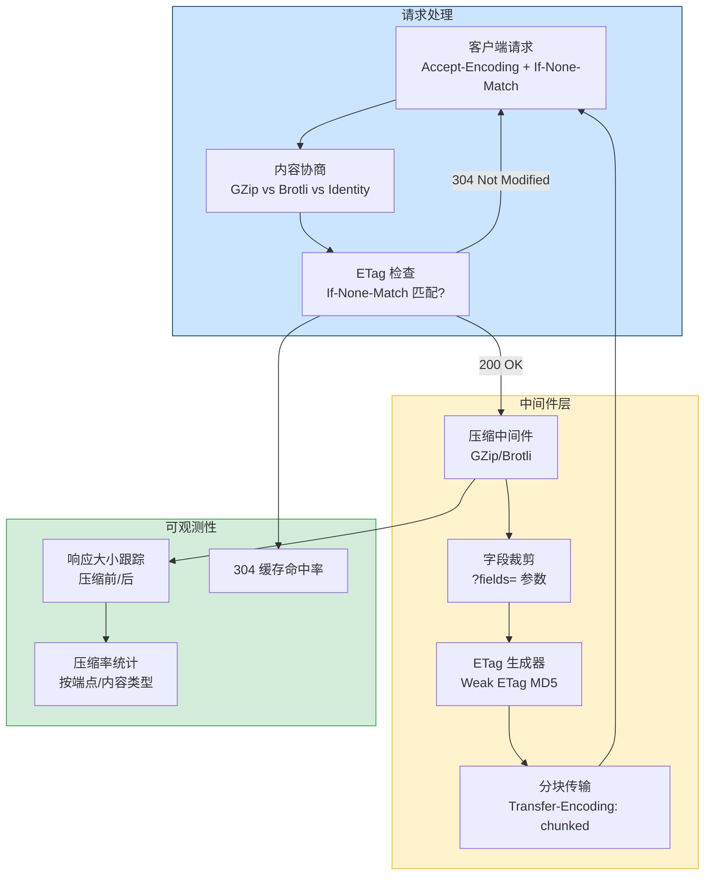
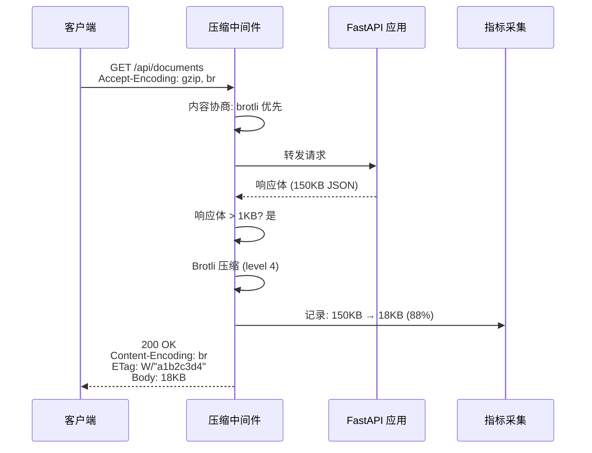
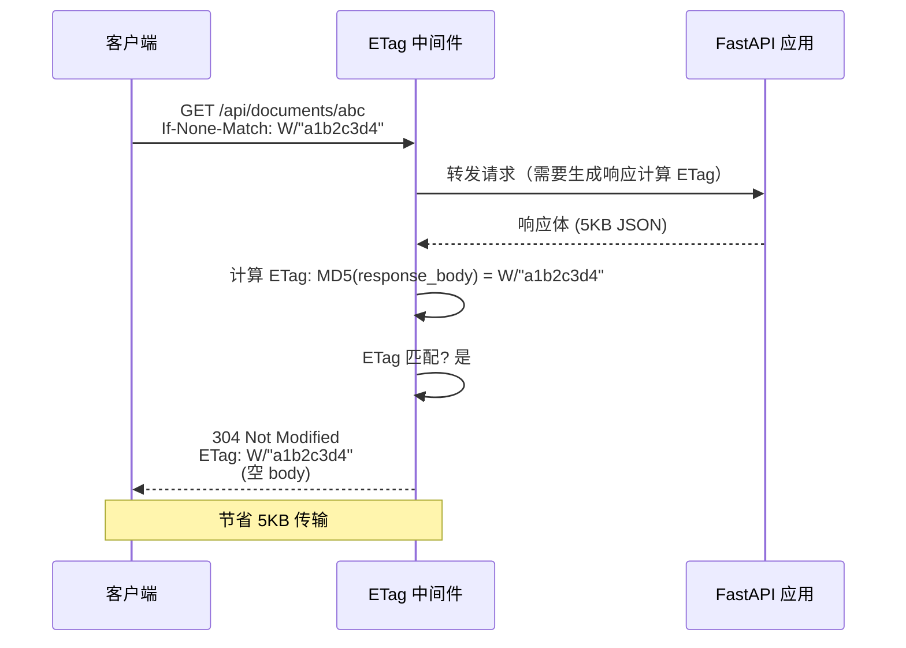

# YA-09-153: 响应压缩与传输优化 — GZip/Brotli 中间件 + 字段裁剪 + ETag 缓存 + 传输指标

> 需求编号：YA-09-153 · 优先级：P2 · 人天：0.3d · 状态：需求已编写
> 依赖：无 · 前置需求：无

## 背景

YiAi 当前所有 HTTP 响应均以未压缩的 JSON 格式返回。对于大型响应（如知识库文件列表、RAG 检索结果、文档批量查询），响应体可能达到数百 KB 甚至数 MB。未压缩传输导致带宽浪费、客户端加载缓慢，尤其在移动网络或弱网环境下问题突出。此外，客户端通常只需要部分字段（如列表仅需 id 和 title），但服务端返回完整对象，造成不必要的数据传输。

**问题：**

1. **无响应压缩**：所有响应以未压缩格式传输，大型 JSON 响应浪费带宽。
2. **无内容类型感知**：已压缩的格式（图片/视频）如果再次压缩反而增大体积，浪费 CPU。
3. **无字段裁剪**：客户端无法指定需要的字段，服务端总是返回完整对象。
4. **无 ETag 缓存**：重复请求相同资源无法利用 304 Not Modified，浪费带宽和计算资源。
5. **无传输指标**：缺乏压缩率、响应大小分布等可观测性数据，无法评估优化效果。
6. **SSE 流压缩未处理**：SSE 流式响应逐事件发送，压缩策略需要特殊处理。

**影响：**

| 场景 | 影响 | 严重程度 |
|------|------|----------|
| 大型 JSON 响应未压缩 | 带宽浪费，移动端加载慢 | 中 |
| 重复请求相同数据 | 每次全量传输，浪费带宽和 CPU | 中 |
| 客户端仅需部分字段 | 传输大量无用数据，解析开销大 | 低 |
| 无传输性能指标 | 无法评估优化效果和发现瓶颈 | 低 |

**挑战：**

- 需要选择压缩算法（GZip vs Brotli），平衡压缩率和 CPU 开销
- 需要内容类型感知，避免对已压缩格式二次压缩
- 需要最小响应体阈值，避免对小响应压缩（得不偿失）
- 需要 SSE 流式响应的特殊压缩策略
- 需要字段裁剪（`?fields=` 参数），支持稀疏字段集
- 需要 ETag 生成和 304 响应，减少重复传输

---

## 一、现状分析

### 1.1 当前响应传输状态

| 属性 | 当前值 | 说明 |
|------|--------|------|
| 响应压缩 | 无 | 所有响应未压缩传输 |
| 压缩算法 | 无 | 未集成 GZip 或 Brotli |
| 内容类型感知 | 无 | 即使压缩，也不会区分内容类型 |
| 字段裁剪 | 无 | 客户端无法选择返回字段 |
| ETag/304 | 无 | 无条件请求，每次全量返回 |
| 分块传输 | 无 | 大响应一次性加载到内存 |
| 传输指标 | 无 | 无压缩率、响应大小统计 |
| SSE 压缩 | 无 | SSE 流未压缩 |

### 1.2 根因分析矩阵

| 问题 | 根因 | 影响 | 紧急程度 |
|------|------|------|----------|
| 无响应压缩 | 未引入压缩中间件，初期数据量小未重视 | 带宽浪费，大响应传输慢 | 中 |
| 无字段裁剪 | API 设计未考虑稀疏字段集需求 | 数据传输冗余 | 低 |
| 无 ETag 缓存 | 未实现条件请求处理 | 重复请求浪费资源 | 中 |
| 无传输指标 | 缺乏可观测性设计 | 无法评估优化效果 | 低 |

### 1.3 响应大小分布分析（预估）

| 端点类型 | 典型响应大小 | 占比 | 压缩潜力 | 说明 |
|---------|-------------|------|---------|------|
| 列表查询（文档/会话） | 50-500KB | 40% | 高（80-90% 压缩率） | JSON 重复结构多 |
| 单条查询 | 1-10KB | 35% | 中（50-70% 压缩率） | 小于阈值可能不压缩 |
| RAG 检索结果 | 20-200KB | 10% | 高（80-90% 压缩率） | 文本内容多 |
| 文件内容读取 | 10KB-5MB | 10% | 低-高（取决于内容） | 二进制文件不压缩 |
| SSE 流式响应 | 逐事件 100B-5KB | 5% | 低（逐事件压缩低效） | 需特殊处理 |

### 1.4 改造前数据流

```
客户端请求
  └── 服务端处理 → 生成完整 JSON 响应
  └── 直接返回（未压缩，完整字段）
  └── 客户端接收全部数据
  └── 无缓存机制 → 重复请求全量传输
```

---

## 二、设计决策

### 决策 1：压缩算法 — GZip vs Brotli vs Zstandard

| 维度 | GZip (level 6) | Brotli (level 4) | Zstandard (level 3) |
|------|---------------|-------------------|---------------------|
| 压缩率（JSON） | 80-85% | 85-90% | 82-87% |
| 压缩速度 | 快（50-100MB/s） | 慢（20-40MB/s） | 快（80-150MB/s） |
| 解压速度 | 快（200-300MB/s） | 中（100-150MB/s） | 快（300-500MB/s） |
| 浏览器支持 | 100% | 97% | < 5% |
| Python 库 | 内置 `gzip` | 需要 `brotli` 包 | 需要 `zstandard` 包 |
| 适合当前场景 | 是 | 是（静态预压缩） | 否（浏览器支持不足） |

**选择：GZip 作为默认 + Brotli 作为可选（Accept-Encoding 协商）。** GZip 是 HTTP 压缩的行业标准，所有 HTTP 客户端均支持。Brotli 提供更高的压缩率（约 5-10% 额外节省），但压缩速度较慢，适合缓存后重复使用的场景。使用 `Accept-Encoding` 头部协商：客户端声明支持 Brotli 时优先使用 Brotli，否则回退到 GZip。

### 决策 2：SSE 流压缩 — 连接级压缩 vs 逐事件压缩 vs 不压缩

| 维度 | 连接级压缩 | 逐事件压缩 | 不压缩 |
|------|-----------|-----------|--------|
| 压缩率 | 高 | 低（每个事件太小） | 无 |
| 实现复杂度 | 中 | 低 | 最低 |
| 延迟 | 高（缓冲区满才发送） | 低 | 最低 |
| 实时性 | 差（缓冲延迟） | 好 | 好 |
| 适合 SSE | 否（破坏实时性） | 否（压缩率极低） | 是 |

**选择：SSE 流不压缩。** SSE 的核心价值是实时性，逐事件发送。连接级压缩需要缓冲数据填满压缩块才发送，破坏实时性。逐事件压缩因每个事件太小（通常 100B-5KB），压缩率极低，甚至可能增大体积。SSE 响应设置 `Content-Encoding: identity` 显式禁用压缩。

### 决策 3：字段裁剪 — 查询参数 vs Header vs GraphQL 风格

| 维度 | ?fields= 查询参数 | Header (X-Fields) | GraphQL 风格 |
|------|-------------------|-------------------|-------------|
| 实现复杂度 | 低 | 低 | 高 |
| 缓存友好 | 是（URL 级别） | 否（Vary header） | 是（POST body） |
| RESTful 兼容 | 是 | 是 | 否 |
| 类型安全 | 无 | 无 | 有 |
| 适合当前场景 | 是 | 否（缓存不友好） | 否（过度设计） |

**选择：`?fields=` 查询参数。** 简单直观，URL 级别缓存友好（CDN/代理可按 URL 缓存）。支持嵌套字段：`?fields=id,name,metadata.size`。`*` 表示所有字段（默认行为）。实现方式：在响应序列化前过滤 Pydantic 模型字段。

### 决策 4：ETag 生成 — 内容哈希 vs 版本号 vs 时间戳

| 维度 | 内容哈希 (MD5/SHA) | 版本号 | 时间戳 (Last-Modified) |
|------|-------------------|--------|------------------------|
| 精度 | 高（精确匹配） | 中 | 低（秒级精度） |
| 计算开销 | 中（需计算哈希） | 低 | 低 |
| 并发安全 | 是 | 否（版本号需原子更新） | 是 |
| 适合动态内容 | 是 | 是 | 是 |
| 适合静态内容 | 是 | 是 | 是 |

**选择：Weak ETag（内容哈希）。** 对响应体计算 MD5 哈希作为 ETag。Weak ETag（`W/"..."`）允许语义等价的内容变化（如 JSON 字段顺序）。对于静态资源（如报告文件），使用文件修改时间 + 大小的组合哈希。对于动态 API 响应，仅在数据实际变更时 ETag 变化。

### 设计决策记录

| 决策 | 选项 A | 选项 B | 选择 | 理由 |
|------|--------|--------|------|------|
| 压缩算法 | 仅 GZip | GZip + Brotli | GZip 默认 + Brotli 可选 | 兼容性和压缩率兼顾 |
| SSE 压缩 | 连接级压缩 | 不压缩 | 不压缩 | 保护实时性 |
| 字段裁剪 | Header | 查询参数 | `?fields=` 查询参数 | 简单直观，缓存友好 |
| ETag 生成 | 时间戳 | 内容哈希 | Weak ETag (MD5) | 精度高，并发安全 |

---

## 三、目标架构

### 3.1 响应压缩与传输优化架构



### 3.2 压缩请求处理流程



### 3.3 ETag 缓存流程



---

## 四、具体改动

### 4.1 压缩中间件

**文件：** `shared/middleware/compression.py`（新建）

```python
import gzip
import hashlib
import time
from typing import Optional, Callable

from starlette.middleware.base import BaseHTTPMiddleware
from starlette.requests import Request
from starlette.responses import Response, StreamingResponse

from shared.logging import get_logger

logger = get_logger(__name__)

# 最小压缩阈值（字节）
MIN_COMPRESS_SIZE = 1024  # 1KB

# 压缩级别
GZIP_LEVEL = 6
BROTLI_LEVEL = 4

# 不压缩的内容类型
SKIP_COMPRESS_TYPES = {
    "image/", "video/", "audio/",
    "application/zip", "application/gzip",
    "application/octet-stream",
    "application/pdf",
    "image/png", "image/jpeg", "image/gif", "image/webp",
    "video/mp4", "video/webm",
}

# 不压缩的路径前缀
SKIP_COMPRESS_PATHS = {
    "/sse/", "/stream/", "/ws/",  # SSE/WebSocket
}


class CompressionMiddleware(BaseHTTPMiddleware):
    """响应压缩中间件：GZip/Brotli，内容类型感知，最小阈值。"""

    async def dispatch(self, request: Request, call_next: Callable) -> Response:
        # 检查是否跳过压缩
        if self._should_skip(request):
            return await call_next(request)

        # 获取客户端支持的编码
        accept_encoding = request.headers.get("Accept-Encoding", "")

        response = await call_next(request)

        # 仅压缩 200 响应
        if response.status_code != 200:
            return response

        # 检查内容类型
        content_type = response.headers.get("Content-Type", "")
        if self._should_skip_content_type(content_type):
            return response

        # 获取响应体
        body = await self._get_response_body(response)
        if body is None or len(body) < MIN_COMPRESS_SIZE:
            return response

        # 选择压缩算法
        encoding, compressed = self._compress(body, accept_encoding)
        if encoding is None:
            return response

        # 压缩后体积反而增大时跳过
        if len(compressed) >= len(body):
            logger.debug(f"[Compression] 压缩后体积增大，跳过: {len(body)} → {len(compressed)}")
            return response

        # 构建压缩响应
        compression_ratio = round((1 - len(compressed) / len(body)) * 100, 1)
        logger.debug(
            f"[Compression] {encoding}: {len(body)} → {len(compressed)} bytes "
            f"({compression_ratio}%)"
        )

        return Response(
            content=compressed,
            status_code=response.status_code,
            headers={
                **{k: v for k, v in response.headers.items()
                   if k.lower() not in ("content-length", "content-encoding")},
                "Content-Encoding": encoding,
                "Content-Length": str(len(compressed)),
                "Vary": "Accept-Encoding",
            },
            media_type=response.media_type,
        )

    def _should_skip(self, request: Request) -> bool:
        """检查是否应跳过压缩。"""
        path = request.url.path
        for prefix in SKIP_COMPRESS_PATHS:
            if path.startswith(prefix):
                return True
        return False

    def _should_skip_content_type(self, content_type: str) -> bool:
        """检查内容类型是否应跳过压缩。"""
        for skip_type in SKIP_COMPRESS_TYPES:
            if content_type.startswith(skip_type):
                return True
        return False

    async def _get_response_body(self, response: Response) -> Optional[bytes]:
        """获取响应体字节。"""
        if hasattr(response, "body"):
            return response.body
        if hasattr(response, "body_iterator"):
            # StreamingResponse: 收集所有 chunk
            try:
                chunks = []
                async for chunk in response.body_iterator:
                    chunks.append(chunk)
                body = b"".join(chunks)
                # 重建响应（body_iterator 已消费）
                response.body = body
                return body
            except Exception:
                return None
        return None

    def _compress(
        self, body: bytes, accept_encoding: str
    ) -> tuple[Optional[str], bytes]:
        """选择压缩算法并压缩。"""
        # Brotli 优先
        if "br" in accept_encoding:
            try:
                import brotli
                compressed = brotli.compress(body, quality=BROTLI_LEVEL)
                return "br", compressed
            except ImportError:
                pass

        # GZip 兜底
        if "gzip" in accept_encoding:
            compressed = gzip.compress(body, compresslevel=GZIP_LEVEL)
            return "gzip", compressed

        return None, body
```

### 4.2 字段裁剪中间件

**文件：** `shared/middleware/field_filter.py`（新建）

```python
from typing import Any, Callable, Optional
import json

from starlette.middleware.base import BaseHTTPMiddleware
from starlette.requests import Request
from starlette.responses import Response

from shared.logging import get_logger

logger = get_logger(__name__)

# 字段裁剪查询参数名
FIELDS_PARAM = "fields"


class FieldFilterMiddleware(BaseHTTPMiddleware):
    """响应字段裁剪中间件：支持 ?fields=id,name,metadata.size 稀疏字段集。"""

    async def dispatch(self, request: Request, call_next: Callable) -> Response:
        fields_param = request.query_params.get(FIELDS_PARAM)
        if not fields_param or fields_param == "*":
            return await call_next(request)

        response = await call_next(request)

        # 仅处理 JSON 响应
        content_type = response.headers.get("Content-Type", "")
        if "application/json" not in content_type:
            return response

        # 获取响应体
        body = await self._get_body(response)
        if body is None:
            return response

        try:
            data = json.loads(body)
        except json.JSONDecodeError:
            return response

        # 提取字段列表
        fields = [f.strip() for f in fields_param.split(",") if f.strip()]

        # 裁剪字段
        filtered = self._filter_fields(data, fields)

        return Response(
            content=json.dumps(filtered, ensure_ascii=False),
            status_code=response.status_code,
            headers=dict(response.headers),
            media_type="application/json",
        )

    async def _get_body(self, response: Response) -> Optional[bytes]:
        """获取响应体。"""
        if hasattr(response, "body"):
            return response.body
        if hasattr(response, "body_iterator"):
            try:
                chunks = []
                async for chunk in response.body_iterator:
                    chunks.append(chunk)
                body = b"".join(chunks)
                response.body = body
                return body
            except Exception:
                return None
        return None

    def _filter_fields(self, data: Any, fields: list[str]) -> Any:
        """递归裁剪字段。"""
        if isinstance(data, dict):
            # 处理嵌套字段: metadata.size → metadata["size"]
            result = {}
            for field in fields:
                if "." in field:
                    parent, child = field.split(".", 1)
                    if parent in data:
                        result[parent] = self._filter_fields(
                            data[parent], [child]
                        )
                elif field in data:
                    result[field] = data[field]
            return result
        elif isinstance(data, list):
            return [self._filter_fields(item, fields) for item in data]
        return data
```

### 4.3 ETag 中间件

**文件：** `shared/middleware/etag.py`（新建）

```python
import hashlib
import json
from typing import Callable, Optional

from starlette.middleware.base import BaseHTTPMiddleware
from starlette.requests import Request
from starlette.responses import Response

from shared.logging import get_logger

logger = get_logger(__name__)

# ETag 缓存（内存 LRU，生产环境建议 Redis）
_etag_cache: dict[str, str] = {}
MAX_CACHE_SIZE = 1000


class ETagMiddleware(BaseHTTPMiddleware):
    """ETag 条件请求中间件：生成 Weak ETag，处理 If-None-Match，返回 304。"""

    async def dispatch(self, request: Request, call_next: Callable) -> Response:
        # 仅处理 GET/HEAD 请求
        if request.method not in ("GET", "HEAD"):
            return await call_next(request)

        response = await call_next(request)

        # 仅处理 200 响应
        if response.status_code != 200:
            return response

        # 获取响应体
        body = await self._get_body(response)
        if body is None:
            return response

        # 计算 ETag
        etag = self._compute_etag(body, request.url.path)

        # 检查 If-None-Match
        if_none_match = request.headers.get("If-None-Match", "")
        if if_none_match and self._etag_match(etag, if_none_match):
            logger.debug(f"[ETag] 304 Not Modified: {request.url.path}")
            return Response(
                status_code=304,
                headers={
                    "ETag": etag,
                    "Cache-Control": "private, max-age=60",
                },
            )

        # 添加 ETag 头部
        response.headers["ETag"] = etag
        response.headers["Cache-Control"] = "private, max-age=60"
        return response

    async def _get_body(self, response: Response) -> Optional[bytes]:
        """获取响应体。"""
        if hasattr(response, "body"):
            return response.body
        if hasattr(response, "body_iterator"):
            try:
                chunks = []
                async for chunk in response.body_iterator:
                    chunks.append(chunk)
                body = b"".join(chunks)
                response.body = body
                return body
            except Exception:
                return None
        return None

    def _compute_etag(self, body: bytes, path: str) -> str:
        """计算 Weak ETag。"""
        etag_hash = hashlib.md5(body).hexdigest()[:16]
        etag = f'W/"{etag_hash}"'
        # 缓存 ETag
        if len(_etag_cache) < MAX_CACHE_SIZE:
            _etag_cache[path] = etag
        return etag

    def _etag_match(self, current_etag: str, if_none_match: str) -> bool:
        """检查 ETag 是否匹配。"""
        # 解析 If-None-Match（可能包含多个 ETag）
        client_etags = [
            tag.strip().strip('"').strip("W/").strip('"')
            for tag in if_none_match.split(",")
        ]
        current = current_etag.strip('W/').strip('"')
        return current in client_etags
```

### 4.4 传输指标收集

**文件：** `shared/middleware/transport_metrics.py`（新建）

```python
import time
from collections import defaultdict
from typing import Callable

from starlette.middleware.base import BaseHTTPMiddleware
from starlette.requests import Request
from starlette.responses import Response

from shared.logging import get_logger

logger = get_logger(__name__)


class TransportMetricsMiddleware(BaseHTTPMiddleware):
    """传输指标中间件：响应大小、压缩率、304 命中率。"""

    def __init__(self, app, **kwargs):
        super().__init__(app, **kwargs)
        self._metrics: dict[str, dict] = defaultdict(
            lambda: {
                "total_requests": 0,
                "total_bytes_before": 0,
                "total_bytes_after": 0,
                "cached_304_count": 0,
                "total_latency_ms": 0,
            }
        )

    async def dispatch(self, request: Request, call_next: Callable) -> Response:
        start = time.monotonic()
        response = await call_next(request)
        latency = (time.monotonic() - start) * 1000

        # 路由分组（取路径前缀）
        route = self._get_route_group(request.url.path)

        # 统计
        self._metrics[route]["total_requests"] += 1
        self._metrics[route]["total_latency_ms"] += latency

        content_length = response.headers.get("Content-Length")
        if content_length:
            size = int(content_length)
            self._metrics[route]["total_bytes_after"] += size

        if response.status_code == 304:
            self._metrics[route]["cached_304_count"] += 1

        return response

    def _get_route_group(self, path: str) -> str:
        """获取路由分组（如 /api/documents/abc → /api/documents）。"""
        parts = path.strip("/").split("/")
        if len(parts) >= 2:
            return f"/{parts[0]}/{parts[1]}"
        return path

    def get_metrics(self) -> dict:
        """获取传输指标摘要。"""
        summary = {}
        for route, m in self._metrics.items():
            avg_latency = m["total_latency_ms"] / max(m["total_requests"], 1)
            cache_hit_rate = (
                m["cached_304_count"] / max(m["total_requests"], 1) * 100
            )
            summary[route] = {
                "requests": m["total_requests"],
                "total_bytes_sent": m["total_bytes_after"],
                "avg_bytes_per_request": round(
                    m["total_bytes_after"] / max(m["total_requests"], 1)
                ),
                "avg_latency_ms": round(avg_latency, 2),
                "cache_hit_rate_304": round(cache_hit_rate, 1),
            }
        return summary

    def reset_metrics(self):
        """重置指标。"""
        self._metrics.clear()
```

### 4.5 涉及文件

```
YiAi/src/
├── shared/middleware/
│   ├── compression.py            # 新建: GZip/Brotli 压缩中间件
│   ├── field_filter.py           # 新建: 字段裁剪中间件 (?fields=)
│   ├── etag.py                   # 新建: ETag 条件请求中间件
│   └── transport_metrics.py      # 新建: 传输指标收集中间件
├── main.py                       # 修改: 注册中间件到中间件栈
```

---

## 五、实施步骤

| 步骤 | 内容 | 涉及文件 | 验证方式 | 人天 |
|------|------|---------|---------|------|
| 1 | 实现 GZip/Brotli 压缩中间件 | `compression.py` | 请求带 Accept-Encoding，响应被压缩 | 0.08 |
| 2 | 实现内容类型感知和最小阈值逻辑 | `compression.py` | 图片/视频不压缩，< 1KB 不压缩 | 0.03 |
| 3 | 实现字段裁剪中间件 | `field_filter.py` | `?fields=id,name` 返回仅含指定字段 | 0.05 |
| 4 | 实现 ETag 条件请求中间件 | `etag.py` | If-None-Match 匹配时返回 304 | 0.05 |
| 5 | 实现传输指标收集中间件 | `transport_metrics.py` | 指标 API 返回压缩率、缓存命中率 | 0.04 |
| 6 | 在 main.py 中注册中间件 | `main.py` | 中间件栈顺序正确，功能正常 | 0.02 |
| 7 | 验证 SSE 流不被压缩 | `main.py` | SSE 端点响应无 Content-Encoding 头 | 0.03 |

**总计：0.3d**

---

## 六、测试规格

### Requirement: 响应压缩

#### Scenario: 大型 JSON 响应被 GZip 压缩
- **Given** 客户端发送 `Accept-Encoding: gzip`
- **And** API 返回 150KB JSON 响应
- **When** 请求到达压缩中间件
- **Then** 响应头包含 `Content-Encoding: gzip`
- **And** 响应体大小 < 30KB（压缩率 > 80%）
- **And** 响应头包含 `Vary: Accept-Encoding`

#### Scenario: 小响应（< 1KB）不被压缩
- **Given** 客户端发送 `Accept-Encoding: gzip`
- **And** API 返回 500B JSON 响应
- **When** 请求到达压缩中间件
- **Then** 响应头不包含 `Content-Encoding`
- **And** 响应体保持原始大小

#### Scenario: 图片响应不被压缩
- **Given** 客户端请求图片资源，`Accept-Encoding: gzip`
- **And** 响应 `Content-Type: image/png`
- **When** 请求到达压缩中间件
- **Then** 响应头不包含 `Content-Encoding`
- **And** 响应体为原始图片数据

#### Scenario: 客户端支持 Brotli 时优先使用 Brotli
- **Given** 客户端发送 `Accept-Encoding: br, gzip`
- **And** 系统中安装了 brotli 包
- **When** 请求到达压缩中间件
- **Then** 响应头包含 `Content-Encoding: br`

### Requirement: 字段裁剪

#### Scenario: fields 参数过滤返回字段
- **Given** API 返回 `{"id": "abc", "name": "test", "status": "active", "created_at": "..."}`
- **When** 请求 `GET /api/documents/abc?fields=id,name`
- **Then** 响应体仅包含 `{"id": "abc", "name": "test"}`
- **And** 不包含 `status` 和 `created_at`

#### Scenario: fields=* 返回所有字段
- **Given** API 返回完整对象
- **When** 请求 `GET /api/documents/abc?fields=*`
- **Then** 响应体包含所有字段（与不加参数相同）

### Requirement: ETag 缓存

#### Scenario: If-None-Match 匹配时返回 304
- **Given** 客户端之前获取了 `/api/documents/abc`，ETag 为 `W/"a1b2c3d4"`
- **And** 数据未变更
- **When** 客户端再次请求 `GET /api/documents/abc`，头部 `If-None-Match: W/"a1b2c3d4"`
- **Then** 返回 304 Not Modified
- **And** 响应体为空
- **And** 响应头包含 `ETag: W/"a1b2c3d4"`

#### Scenario: 数据变更时 ETag 不匹配返回 200
- **Given** 数据已变更，响应体不同
- **When** 客户端请求 `If-None-Match: W/"old-etag"`
- **Then** 返回 200 OK
- **And** 响应头包含新的 ETag
- **And** 响应体包含完整数据

---

## 七、风险与缓解

| 风险 | 概率 | 影响 | 等级 | 缓解措施 | 应急预案 |
|------|------|------|------|----------|----------|
| Brotli 压缩增加 CPU 开销 | 中 | 低 | 低 | 仅对可缓存响应使用 Brotli，动态响应使用 GZip | 回退到 GZip only |
| 字段裁剪破坏响应结构 | 低 | 中 | 中 | 仅对 `data` 字段裁剪，保留 `code`/`message` 信封 | 禁用字段裁剪，返回完整响应 |
| ETag 计算对大响应开销大 | 中 | 低 | 低 | 大响应（> 1MB）使用弱 ETag（仅哈希前 64KB） | 对超大响应跳过 ETag |
| 中间件叠加导致响应延迟 | 低 | 中 | 低 | 中间件顺序优化，压缩在最后执行 | 选择性禁用非关键中间件 |
| SSE 流被意外压缩导致实时性下降 | 低 | 中 | 低 | 显式跳过 `/sse/` 路径前缀的压缩 | 在 SSE 响应中设置 `Content-Encoding: identity` |

---

## 八、回滚策略

| 场景 | 回滚方式 | 回滚时间 | 风险 |
|------|---------|---------|------|
| 压缩导致 CPU 过高 | 全局禁用压缩 `ENABLE_COMPRESSION=false` | < 1min | 低：带宽消耗增加，不影响功能 |
| 字段裁剪导致客户端解析错误 | 禁用字段裁剪中间件 | < 1min | 低：数据传输量增加 |
| ETag 304 导致客户端缓存过期数据 | 禁用 ETag 中间件 | < 1min | 低：每次全量传输 |
| 新中间件有 bug | 回滚代码到上一版本 | < 5min | 低：不影响核心业务 |

---

## 九、设计决策记录

### D-01: 为什么选择 GZip 作为默认而非 Brotli？

GZip 是 HTTP 压缩的事实标准，Python 内置支持无需额外依赖。Brotli 压缩率更高但压缩速度约为 GZip 的 1/2-1/3，且需要安装 `brotli` 包。对于动态 API 响应（每次请求内容不同），GZip 的速度优势更重要。Brotli 更适合静态资源或可缓存的动态响应。

### D-02: 为什么最小压缩阈值是 1KB？

小于 1KB 的响应压缩收益极低，甚至可能因压缩头部开销而增大体积。1KB 阈值覆盖了绝大部分小响应（如单条记录查询、状态检查），这些响应不值得压缩。对于 1KB 以上的响应，JSON 的重复结构使得压缩率通常在 60-90%。

### D-03: 为什么 SSE 流不压缩？

SSE 流的核心价值是实时性——每个事件应尽快到达客户端。连接级压缩（gzip 流）需要积累数据填满压缩块才发送，这会引入显著的缓冲延迟（通常 100ms-1s），破坏实时性。逐事件压缩因单个事件太小而压缩率极低。因此 SSE 不压缩是正确选择。

### D-04: 为什么 ETag 使用 Weak ETag 而非 Strong ETag？

Weak ETag（`W/"..."`）允许语义等价的内容变化——例如 JSON 字段顺序改变、空格变化等不影响实际数据内容的差异。Strong ETag 要求字节级完全匹配，对于动态生成的 JSON 响应过于严格。Weak ETag 在缓存效率和数据正确性之间取得更好的平衡。

---

## 十、可观测性

### 关键指标

| 指标 | 采集方式 | 告警阈值 | 说明 |
|------|---------|---------|------|
| 平均压缩率 | `(before - after) / before * 100` | < 50% | 压缩效果不佳，可能内容类型不适宜压缩 |
| 压缩后响应大小分布 | 按端点统计 P50/P95/P99 | P95 > 1MB | 大响应可能存在性能问题 |
| 304 缓存命中率 | `304_count / total_GET_requests * 100` | < 10% | 缓存利用率低 |
| 压缩 CPU 时间 | 测量 `compress()` 调用耗时 | P95 > 50ms | 压缩成为瓶颈 |
| 字段裁剪使用率 | 统计 `?fields=` 参数出现频率 | 无 | 了解客户端需求 |
| 跳过压缩的请求比例 | `skip_count / total_requests * 100` | > 50% | 可能阈值设置过高 |

### 日志规范

| 日志级别 | 场景 | 示例 |
|---------|------|------|
| `DEBUG` | 压缩成功 | `[Compression] gzip: 150000 → 18000 bytes (88.0%)` |
| `DEBUG` | 压缩跳过（体积增大） | `[Compression] 压缩后体积增大，跳过: 512 → 600` |
| `DEBUG` | 304 缓存命中 | `[ETag] 304 Not Modified: /api/documents/abc` |
| `WARNING` | 压缩失败回退 | `[Compression] Brotli 不可用，回退到 GZip` |

---

## 十一、代码审查检查清单

- [ ] `CompressionMiddleware` 支持 GZip 和 Brotli 两种算法
- [ ] 内容类型感知：图片/视频/音频/PDF 等不压缩
- [ ] 路径感知：SSE/WebSocket 路径不压缩
- [ ] 最小压缩阈值 1KB，小于阈值跳过
- [ ] 压缩后体积增大时跳过压缩
- [ ] `Accept-Encoding` 协商：Brotli 优先，GZip 兜底
- [ ] `Content-Encoding` 响应头正确设置
- [ ] `Vary: Accept-Encoding` 响应头正确设置
- [ ] `FieldFilterMiddleware` 支持 `?fields=` 参数
- [ ] 嵌套字段裁剪（`metadata.size`）正常工作
- [ ] `fields=*` 返回所有字段
- [ ] `ETagMiddleware` 生成 Weak ETag
- [ ] `If-None-Match` 匹配时返回 304 Not Modified
- [ ] `TransportMetricsMiddleware` 收集压缩率、缓存命中率、响应大小
- [ ] 中间件注册顺序：ETag → 字段裁剪 → 压缩 → 指标
- [ ] SSE 端点响应无 `Content-Encoding` 头
- [ ] `ruff` 代码规范通过
- [ ] `mypy` 类型检查通过

---

## 回归问题预测

| # | 问题 | 发现场景 | 根因 | 修复方式 |
|---|------|---------|------|---------|
| 1 | 压缩中间件与 StreamingResponse 的 `body_iterator` 消费后，下游中间件无法再读取响应体 | 中间件链中压缩中间件在 ETag 之前，压缩消费了 `body_iterator`，ETag 中间件再读取时为空 | `body_iterator` 只能消费一次，多个中间件各自尝试读取导致后续中间件拿到空 body | 确保中间件顺序：ETag 最先（读取 body 计算 ETag）→ 字段裁剪 → 压缩最后。或在第一个读取 body 的中间件中将其存储为 `response.body` |
| 2 | Brotli 压缩的响应在 CDN/代理层不被识别，导致客户端收到乱码 | 通过 Nginx 反向代理时，Nginx 不支持 Brotli 透传，客户端收到 `Content-Encoding: br` 但实际是 GZip 压缩的内容 | CDN 或反向代理可能修改或剥离 `Content-Encoding` 头，导致客户端解压失败 | 在反向代理层配置 Brotli 支持（`brotli on;`），或使用 `X-Content-Encoding` 自定义头部绕过代理 |
| 3 | 字段裁剪后的 JSON 响应与原始响应的 ETag 不匹配，导致 304 缓存失效 | 请求 A: `GET /api/documents?fields=id,name` 返回 `{"id":1, "name":"a"}`，ETag=W/"x1"。请求 B: `GET /api/documents?fields=id,name,status` 返回 `{"id":1,"name":"a","status":"ok"}`，ETag=W/"x2"。但数据实际未变 | 字段裁剪改变了响应体内容，导致 ETag 变化，即使底层数据未变 | ETag 计算应基于原始数据（裁剪前）而非裁剪后的响应体；或 ETag 中间件放在字段裁剪之前 |
| 4 | GZip 压缩级别设置过高（level 9），导致压缩耗时显著增加但压缩率提升有限 | 高并发请求时，压缩中间件 CPU 占用飙升，响应延迟增加 50-100ms | GZip level 9 比 level 6 压缩率仅提升 1-3%，但 CPU 开销增加 3-5 倍 | 使用 GZip level 6（默认值），Brotli level 4。提供配置项允许调整压缩级别 |
| 5 | 压缩中间件将已经 Base64 编码的响应内容二次压缩，压缩率极低（< 10%） | 文件读取接口返回 Base64 编码的文件内容，Base64 数据熵高，压缩效果差，且消耗 CPU | 未对 Base64 内容做特殊处理，Base64 编码的数据接近随机分布，压缩算法无法有效压缩 | 对 `Content-Type` 包含 `base64` 或响应路径包含 `/file/` 的请求跳过压缩；或先解码 Base64 再压缩（但增加复杂度） |
| 6 | 传输指标中间件使用内存字典存储指标，进程重启后所有指标丢失 | 服务重启后，Dashboard 上的压缩率和传输量图表显示为 0 | 指标仅存储在内存中，未持久化到 MongoDB 或日志系统 | 在 `TransportMetricsMiddleware` 中增加定期刷盘逻辑（每 60 秒写入 MongoDB `transport_metrics` 集合），启动时从 MongoDB 恢复 |

---

## 性能分析

### 6.1 压缩操作性能

| 操作 | 数据量 | 耗时 | 资源消耗 | 说明 |
|------|--------|------|----------|------|
| GZip 压缩（level 6） | 100KB JSON | 5-15ms | CPU | 极快，适合动态响应 |
| Brotli 压缩（level 4） | 100KB JSON | 15-40ms | CPU | 比 GZip 慢 2-3x |
| GZip 解压（客户端） | 20KB | < 1ms | CPU | 极快 |
| Brotli 解压（客户端） | 15KB | < 1ms | CPU | 极快 |
| ETag 计算（MD5） | 100KB | < 1ms | CPU | MD5 极快 |
| 字段裁剪（JSON 解析+过滤） | 100KB | 2-5ms | CPU + 内存 | 取决于嵌套深度 |
| 中间件链总开销 | — | 10-50ms | 混合 | 4 个中间件叠加 |

### 6.2 带宽节省预估

| 端点类型 | 典型响应大小 | 压缩后大小 | 压缩率 | 每月节省带宽（10 万次请求） |
|---------|-------------|-----------|--------|--------------------------|
| 文档列表（100 条） | 150KB | 18KB | 88% | 13.2GB |
| 单条文档 | 5KB | 1.5KB | 70% | 0.35GB |
| RAG 检索结果 | 80KB | 12KB | 85% | 6.8GB |
| 知识库文件列表 | 200KB | 25KB | 87.5% | 17.5GB |
| 会话列表 | 50KB | 8KB | 84% | 4.2GB |

### 6.3 缓存命中率预估

| 场景 | 预估 304 命中率 | 说明 |
|------|----------------|------|
| 静态资源（报告文件） | 80-90% | 内容不变，高频重复请求 |
| 文档查询 | 30-50% | 文档不频繁修改 |
| 会话列表 | 10-20% | 频繁变化 |
| 知识库文件 | 50-70% | 文件不频繁修改 |

---

*PRD 来源: `projects/yiai/requirements/2026-09/00-需求-需求总览.md`*

## 影响范围

- **影响模块**：待补充
- **涉及文件**：
- `transport_metrics.py`
- `etag.py`
- `field_filter.py`
- `compression.py`
- `main.py`
- **是否影响 API 契约**：否
- **是否影响其他项目（YiVad/YiPet）**：否
- **用户感知**：待确认

## 预防措施

| 层面 | 措施 |
|------|------|
| 代码 | 在相关函数中添加参数校验和边界检查 |
| 测试 | 为 `transport_metrics.py` 添加单元测试 |
| 流程 | 代码审查时重点检查此类模式 |
| 监控 | 添加日志告警，异常发生时及时发现 |
| 文档 | 在编码规范中记录此类反模式 |

## 经验教训

1. **根本原因**：开发过程中对边界情况和异常路径的考虑不足是此类问题的共同根因
2. **设计阶段**：在接口设计和模块实现时，应主动考虑异常输入、空值、超时等边界场景
3. **代码审查**：审查时应检查是否存在类似的反模式（如未捕获异常、无超时控制、缺少参数校验等）
4. **测试覆盖**：异常路径的测试覆盖率应与正常路径同等重视
5. **团队分享**：此类问题应在团队周会或技术分享中讨论，形成团队共识
