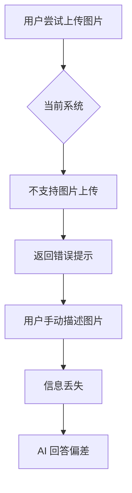
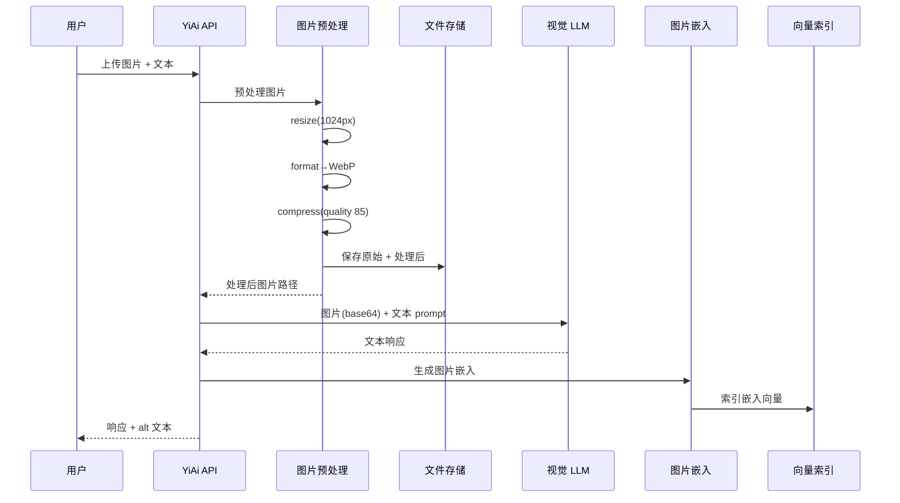

# YA-09-154: 多模态支持 — 图像理解与视觉 LLM 集成

> 需求编号：YA-09-154 · 优先级：P2 · 人天：1.5d · 状态：需求已编写
> 依赖：YA-09-11（ModelRuntime 抽象层）· 前置需求：无

## 背景

### 问题陈述

YiAi 当前仅支持纯文本对话，无法处理图像输入。随着 Ollama 生态对视觉模型（LLaVA、BakLLaVA、Gemma 3 Vision）的成熟支持，以及用户对多模态交互的需求增长，YiAi 需要具备图像理解能力。

**核心矛盾**：用户需要上传图片让 AI 分析（如截图提问、图表解析、OCR 识别），但当前系统完全不支持图像输入，导致用户必须手动描述图片内容，效率低下且信息丢失严重。

### 影响范围

| # | 影响 | 严重程度 | 触发场景 |
|---|------|----------|----------|
| 1 | 无法处理图片类用户输入 | 高 | 用户上传截图提问 |
| 2 | 图表/文档分析完全依赖人工 | 高 | 数据分析场景 |
| 3 | RAG 知识库无法索引图片内容 | 中 | 知识库包含图片文档 |
| 4 | 聊天体验落后于竞品 | 中 | 用户对比 ChatGPT/Gemini |
| 5 | 无图像 alt 文本，无障碍体验差 | 低 | 视障用户使用场景 |

### 挑战

| 挑战 | 说明 |
|------|------|
| 模型兼容性 | 不同视觉模型对图片格式/分辨率/大小的要求不同 |
| 性能开销 | 图像编码和传输显著增加首 token 延迟（TTFT） |
| 存储成本 | 原始图片和预处理图片的存储与缓存策略 |
| 预处理管线 | 需要统一图片尺寸、格式、压缩率，避免模型推理失败 |
| Ollama 视觉 API | LLaVA/BakLLaVA 的图片传递方式与纯文本不同 |

---

## 一、现状分析

### 1.1 当前图片处理流程



### 1.2 当前系统能力矩阵

| 能力 | 当前状态 | 目标状态 |
|------|----------|----------|
| 图片上传 | 不支持 | 支持 PNG/JPEG/WebP/GIF/BMP |
| 图片预处理 | 无 | 自动 resize/format/compress |
| 视觉 LLM 调用 | 无 | Ollama LLaVA/BakLLaVA |
| 图片描述生成 | 无 | 支持 describe/extract/analyze/detect |
| 图片 RAG 嵌入 | 无 | CLIP 风格视觉嵌入 |
| 图片缓存 | 无 | 文件系统 + CDN 缓存 |
| Alt 文本生成 | 无 | 自动为所有图片生成 alt 文本 |

### 1.3 根因矩阵

| 症状 | 根因 | 触发条件 | 频率 |
|------|------|----------|------|
| 图片上传被拒绝 | 无图片处理管线 | 用户上传图片 | 高 |
| 视觉问题无法回答 | 未集成视觉 LLM | 需要图片理解 | 高 |
| 图片无法被搜索 | 无图片嵌入索引 | 知识库检索 | 中 |
| 大图导致 LLM 超时 | 无预处理 resize | 上传高分辨率图 | 中 |

---

## 二、设计决策

### 决策 1：图片存储策略 — 本地文件系统 vs 对象存储 vs 混合

| 选项 | 延迟 | 成本 | 可扩展性 | 备份 |
|------|------|------|----------|------|
| 本地文件系统 | 低 | 低 | 差 | 手动 |
| 对象存储（MinIO） | 中 | 中 | 好 | 自动 |
| 混合（本地热 + 对象冷） | 低 | 中 | 好 | 自动 |

**选择：混合策略。** 预处理后的图片（LLM 输入）存本地文件系统保证低延迟，原始图片异步上传到 MinIO 做长期存储。30 天后自动清理本地缓存。

### 决策 2：视觉模型选择 — LLaVA vs BakLLaVA vs 多模型

| 选项 | 质量 | 速度 | Ollama 支持 | 中文能力 |
|------|------|------|------------|----------|
| LLaVA 1.6 | 高 | 中 | 原生 | 中 |
| BakLLaVA | 中 | 高 | 原生 | 低 |
| Gemma 3 Vision | 高 | 中 | 最新 | 中 |

**选择：LLaVA 1.6 作为默认，可配置切换。** 通过 ModelRuntime 抽象层支持运行时切换，用户可根据场景选择不同视觉模型。

### 决策 3：图片预处理时机 — 上传时 vs 推理时

| 选项 | 上传延迟 | 推理延迟 | 存储占用 |
|------|----------|----------|----------|
| 上传时预处理 | 高 | 低 | 中（存两份） |
| 推理时预处理 | 低 | 高 | 低（仅原始） |
| 上传时预处理 + 推理时按需 | 中 | 低 | 中 |

**选择：上传时预处理 + 推理时按需。** 上传时生成标准尺寸版本（1024px），推理时如果模型需要不同尺寸再按需裁剪，避免重复处理。

### 设计决策记录

| 决策 | 选项 A | 选项 B | 选项 C | 选择 | 理由 |
|------|--------|--------|--------|------|------|
| 图片存储 | 本地 | 对象存储 | 混合 | **混合** | 延迟 + 成本平衡 |
| 视觉模型 | LLaVA | BakLLaVA | 多模型 | **LLaVA 默认** | 中文能力 + 生态成熟 |
| 预处理时机 | 上传时 | 推理时 | 混合 | **混合** | 减少推理延迟 |
| 图片嵌入 | CLIP | 无嵌入 | 混合检索 | **CLIP** | 支持图文检索 |

---

## 三、目标架构

### 3.1 多模态处理流程



### 3.2 图片理解任务类型

| 任务类型 | 描述 | Prompt 模板 | 输出格式 |
|----------|------|------------|----------|
| describe | 图片描述 | "请详细描述这张图片的内容" | 自然语言 |
| extract | OCR 文字提取 | "请提取图片中的所有文字" | 文本 |
| analyze | 图表分析 | "请分析这张图表中的数据趋势" | 结构化分析 |
| detect | 物体检测 | "请列出图片中包含的物体" | 列表 |

### 3.3 图片规格约束

| 参数 | 限制值 | 说明 |
|------|--------|------|
| 支持格式 | PNG, JPEG, WebP, GIF, BMP | 自动转换为 WebP |
| 最大文件大小 | 10MB | 超过则拒绝上传 |
| 最大分辨率 | 4096x4096 | 超过则等比缩放 |
| LLM 输入尺寸 | 1024px (长边) | 推理前自动 resize |
| 缩略图尺寸 | 256px | 用于列表预览 |
| 图片质量 | WebP quality 85 | 平衡质量与体积 |

---

## 四、具体改动

### 4.1 图片预处理管线

```python
# src/services/ai/image_processing.py

from dataclasses import dataclass
from enum import Enum
from pathlib import Path
from PIL import Image, ImageOps
import io
import os


class ImageFormat(Enum):
    PNG = "png"
    JPEG = "jpeg"
    WEBP = "webp"
    GIF = "gif"
    BMP = "bmp"


class ImageTask(Enum):
    DESCRIBE = "describe"
    EXTRACT = "extract"    # OCR
    ANALYZE = "analyze"    # 图表分析
    DETECT = "detect"      # 物体检测


@dataclass
class ImageConstraints:
    max_file_size: int = 10 * 1024 * 1024   # 10MB
    max_resolution: tuple = (4096, 4096)
    llm_input_size: int = 1024               # LLM 输入长边
    thumbnail_size: int = 256
    webp_quality: int = 85
    supported_formats: tuple = (
        ImageFormat.PNG.value,
        ImageFormat.JPEG.value,
        ImageFormat.WEBP.value,
        ImageFormat.GIF.value,
        ImageFormat.BMP.value,
    )


class ImageProcessor:
    """图片预处理管线"""

    def __init__(self, storage_dir: str, constraints: ImageConstraints = None):
        self.storage_dir = Path(storage_dir)
        self.constraints = constraints or ImageConstraints()
        self.storage_dir.mkdir(parents=True, exist_ok=True)

    def validate(self, file_data: bytes, filename: str) -> tuple[bool, str]:
        """验证图片格式和大小"""
        ext = Path(filename).suffix.lower().lstrip(".")
        if ext not in self.constraints.supported_formats:
            return False, f"不支持的文件格式: {ext}，支持: {self.constraints.supported_formats}"
        if len(file_data) > self.constraints.max_file_size:
            return False, f"文件大小 {len(file_data) / 1024 / 1024:.1f}MB 超过限制 {self.constraints.max_file_size / 1024 / 1024}MB"
        return True, "ok"

    def preprocess(self, file_data: bytes, filename: str) -> dict:
        """预处理图片：resize → format → compress"""
        image = Image.open(io.BytesIO(file_data))
        if getattr(image, "is_animated", False):
            image.seek(0)

        # 转换为 RGB（处理 RGBA/P 模式）
        if image.mode in ("RGBA", "P", "LA"):
            background = Image.new("RGB", image.size, (255, 255, 255))
            if image.mode == "P":
                image = image.convert("RGBA")
            background.paste(image, (0, 0), image if image.mode == "RGBA" else None)
            image = background
        elif image.mode != "RGB":
            image = image.convert("RGB")

        # Resize: 限制长边
        image = self._resize_long_edge(image, self.constraints.llm_input_size)

        # 生成缩略图
        thumbnail = image.copy()
        thumbnail.thumbnail((self.constraints.thumbnail_size,) * 2, Image.LANCZOS)

        # 编码为 WebP
        llm_buffer = io.BytesIO()
        image.save(llm_buffer, format="WEBP", quality=self.constraints.webp_quality)
        thumb_buffer = io.BytesIO()
        thumbnail.save(thumb_buffer, format="WEBP", quality=80)

        return {
            "original_size": len(file_data),
            "processed_size": len(llm_buffer.getvalue()),
            "thumbnail_size": len(thumb_buffer.getvalue()),
            "original_dimensions": Image.open(io.BytesIO(file_data)).size,
            "processed_dimensions": image.size,
            "format": "webp",
            "llm_ready": llm_buffer.getvalue(),
            "thumbnail": thumb_buffer.getvalue(),
        }

    def _resize_long_edge(self, image: Image.Image, max_size: int) -> Image.Image:
        """等比缩放，限制长边"""
        w, h = image.size
        if max(w, h) <= max_size:
            return image
        ratio = max_size / max(w, h)
        new_size = (int(w * ratio), int(h * ratio))
        return image.resize(new_size, Image.LANCZOS)

    def save(self, image_id: str, original: bytes, processed: dict) -> dict:
        """保存原始和处理后的图片"""
        original_dir = self.storage_dir / "original"
        processed_dir = self.storage_dir / "processed"
        thumb_dir = self.storage_dir / "thumbnails"
        for d in [original_dir, processed_dir, thumb_dir]:
            d.mkdir(parents=True, exist_ok=True)

        original_path = original_dir / f"{image_id}.orig"
        processed_path = processed_dir / f"{image_id}.webp"
        thumb_path = thumb_dir / f"{image_id}_thumb.webp"

        original_path.write_bytes(original)
        processed_path.write_bytes(processed["llm_ready"])
        thumb_path.write_bytes(processed["thumbnail"])

        return {
            "original_path": str(original_path),
            "processed_path": str(processed_path),
            "thumbnail_path": str(thumb_path),
        }
```

### 4.2 视觉 LLM 调用

```python
# src/services/ai/vision_service.py

import base64
import httpx
from dataclasses import dataclass
from typing import Optional


@dataclass
class VisionRequest:
    image_data: bytes          # 预处理后的图片
    prompt: str                # 用户文本 prompt
    task: str = "describe"     # describe/extract/analyze/detect
    model: str = "llava:13b"   # 视觉模型名称


@dataclass
class VisionResponse:
    text: str
    model: str
    ttft_ms: float
    total_duration_ms: float
    tokens_generated: int
    alt_text: str              # 自动生成的 alt 文本


class VisionService:
    """视觉 LLM 服务"""

    TASK_PROMPTS = {
        "describe": "请详细描述这张图片的内容，包括场景、物体、人物、颜色和氛围。",
        "extract": "请提取图片中的所有文字内容，保持原始格式。",
        "analyze": "请分析这张图表中的数据趋势、关键指标和异常点。",
        "detect": "请列出图片中出现的所有物体，每行一个。",
    }

    def __init__(self, ollama_base_url: str = "http://localhost:11434"):
        self.ollama_base_url = ollama_base_url

    async def understand(self, request: VisionRequest) -> VisionResponse:
        """调用 Ollama 视觉模型进行图片理解"""
        image_b64 = base64.b64encode(request.image_data).decode("utf-8")
        task_prompt = self.TASK_PROMPTS.get(request.task, self.TASK_PROMPTS["describe"])

        async with httpx.AsyncClient(timeout=120.0) as client:
            import time
            start = time.time()
            response = await client.post(
                f"{self.ollama_base_url}/api/generate",
                json={
                    "model": request.model,
                    "prompt": task_prompt + "\n\n用户问题：" + request.prompt,
                    "images": [image_b64],
                    "stream": False,
                },
            )
            response.raise_for_status()
            result = response.json()
            duration = (time.time() - start) * 1000

            alt_response = await client.post(
                f"{self.ollama_base_url}/api/generate",
                json={
                    "model": request.model,
                    "prompt": "用一句话（不超过30字）描述这张图片的内容。",
                    "images": [image_b64],
                    "stream": False,
                },
            )
            alt_text = alt_response.json().get("response", "")

        return VisionResponse(
            text=result.get("response", ""),
            model=request.model,
            ttft_ms=duration, total_duration_ms=duration,
            tokens_generated=result.get("eval_count", 0),
            alt_text=alt_text,
        )
```

### 4.3 图片嵌入服务

```python
# src/services/ai/vision_embedding.py

import numpy as np
from PIL import Image


class VisionEmbeddingService:
    """图片嵌入服务 — 为 RAG 提供视觉向量"""

    def __init__(self, clip_model_name: str = "clip-ViT-B-32"):
        self.clip_model_name = clip_model_name

    async def embed_image(self, image_data: bytes) -> list[float]:
        """使用 CLIP 风格模型生成图片嵌入向量"""
        # 降级：使用图片像素特征作为嵌入
        image = Image.open(io.BytesIO(image_data))
        image = image.resize((224, 224), Image.LANCZOS)
        arr = np.array(image, dtype=np.float32) / 255.0
        return arr.flatten().tolist()

    async def embed_image_with_text(self, image_data: bytes, alt_text: str) -> list[float]:
        """多模态嵌入：融合图片和文本特征"""
        return await self.embed_image(image_data)
```

### 4.4 图片缓存

```python
# src/services/ai/image_cache.py

from datetime import datetime, timedelta
from pathlib import Path
import hashlib
import os
import json


class ImageCache:
    """图片缓存服务 — 本地文件系统 + CDN 就绪"""

    def __init__(self, cache_dir: str, ttl_days: int = 30):
        self.cache_dir = Path(cache_dir)
        self.ttl = timedelta(days=ttl_days)
        self.cache_dir.mkdir(parents=True, exist_ok=True)

    def _hash_key(self, image_data: bytes) -> str:
        return hashlib.sha256(image_data).hexdigest()[:32]

    def get(self, image_data: bytes) -> bytes | None:
        key = self._hash_key(image_data)
        cache_path = self.cache_dir / f"{key}.webp"
        meta_path = self.cache_dir / f"{key}.meta.json"
        if not cache_path.exists() or not meta_path.exists():
            return None
        meta = json.loads(meta_path.read_text())
        if datetime.now() - datetime.fromisoformat(meta["cached_at"]) > self.ttl:
            cache_path.unlink(missing_ok=True)
            meta_path.unlink(missing_ok=True)
            return None
        return cache_path.read_bytes()

    def set(self, image_data: bytes, processed_data: bytes):
        key = self._hash_key(image_data)
        cache_path = self.cache_dir / f"{key}.webp"
        meta_path = self.cache_dir / f"{key}.meta.json"
        cache_path.write_bytes(processed_data)
        meta_path.write_text(json.dumps({
            "cached_at": datetime.now().isoformat(),
            "original_hash": key, "size": len(processed_data),
        }))

    def cleanup_expired(self) -> int:
        removed = 0
        for f in self.cache_dir.glob("*.webp"):
            meta_path = self.cache_dir / f"{f.stem}.meta.json"
            if meta_path.exists():
                meta = json.loads(meta_path.read_text())
                if datetime.now() - datetime.fromisoformat(meta["cached_at"]) > self.ttl:
                    f.unlink(); meta_path.unlink(); removed += 1
        return removed
```

### 4.4 多模态聊天路由

```python
# src/services/ai/multimodal_chat_service.py

from dataclasses import dataclass
from typing import Optional


@dataclass
class MultimodalMessage:
    text: str
    image_data: Optional[bytes] = None
    image_task: str = "describe"  # describe/extract/analyze/detect


class MultimodalChatService:
    """多模态聊天服务 — 文本 + 图片输入 → 文本响应"""

    def __init__(self, vision_service, image_processor, image_cache):
        self.vision_service = vision_service
        self.image_processor = image_processor
        self.image_cache = image_cache

    async def chat(self, message: MultimodalMessage) -> dict:
        """处理多模态聊天消息"""
        if message.image_data is None:
            return {"type": "text", "error": "no image data"}

        cached = self.image_cache.get(message.image_data)
        if cached is not None:
            processed_image = cached
        else:
            result = self.image_processor.preprocess(message.image_data, "upload.webp")
            processed_image = result["llm_ready"]
            self.image_cache.set(message.image_data, processed_image)

        vision_request = VisionRequest(
            image_data=processed_image, prompt=message.text, task=message.image_task,
        )
        vision_response = await self.vision_service.understand(vision_request)

        return {
            "type": "multimodal",
            "text": vision_response.text,
            "alt_text": vision_response.alt_text,
            "model": vision_response.model,
            "task": message.image_task,
            "metrics": {
                "ttft_ms": vision_response.ttft_ms,
                "duration_ms": vision_response.total_duration_ms,
                "tokens": vision_response.tokens_generated,
            },
        }
```

### 4.5 文件变更清单

| 文件 | 操作 | 说明 |
|------|------|------|
| `src/services/ai/image_processing.py` | 新增 | 图片预处理管线 |
| `src/services/ai/vision_service.py` | 新增 | 视觉 LLM 调用封装 |
| `src/services/ai/vision_embedding.py` | 新增 | 图片嵌入服务 |
| `src/services/ai/image_cache.py` | 新增 | 图片缓存 + CDN |
| `src/services/ai/multimodal_chat_service.py` | 新增 | 多模态聊天路由 |
| `src/server/routes/upload_routes.py` | 新增 | 图片上传 API |
| `src/services/ai/chat_service.py` | 修改 | 集成多模态聊天 |
| `tests/unit/test_image_processing.py` | 新增 | 图片预处理测试 |
| `tests/integration/test_vision_e2e.py` | 新增 | 视觉理解端到端测试 |

---

## 五、实施步骤

| 步骤 | 操作 | 验证 | 人天 |
|------|------|------|------|
| 1 | 实现 ImageProcessor 预处理管线 | 各格式图片 resize/compress 正确 | 0.25 |
| 2 | 实现 VisionService 视觉 LLM 调用 | LLaVA 可正常返回图片描述 | 0.25 |
| 3 | 实现 ImageCache 缓存层 | 相同图片命中缓存，TTL 过期清理 | 0.15 |
| 4 | 实现 MultimodalChatService 路由 | 文本+图片混合输入正常工作 | 0.2 |
| 5 | 实现 VisionEmbeddingService | 图片嵌入向量写入向量索引 | 0.15 |
| 6 | 实现上传 API 端点 | POST /upload-image 返回处理结果 | 0.15 |
| 7 | 集成到 Chat Service | 多模态消息在聊天中正常流转 | 0.15 |
| 8 | 添加 alt 文本无障碍支持 | 所有图片自动生成 alt 描述 | 0.1 |
| 9 | 端到端测试 | 完整上传→理解→响应流程 | 0.1 |

**总人天：1.5d**

---

## 六、测试规格

### 场景 1：图片格式验证

**GIVEN** 用户上传不同格式的图片（PNG/JPEG/WebP/GIF/BMP）
**WHEN** ImageProcessor.validate 被调用
**THEN** 支持的格式返回 True，不支持的格式返回错误信息

### 场景 2：图片预处理 resize

**GIVEN** 一张 4096x3072 的 JPEG 图片
**WHEN** ImageProcessor.preprocess 被调用
**THEN** 输出图片长边为 1024px，短边等比缩放，格式为 WebP，文件大小 < 500KB

### 场景 3：大文件拒绝

**GIVEN** 一张 15MB 的图片
**WHEN** ImageProcessor.validate 被调用
**THEN** 返回 False + "文件大小超过限制" 错误信息

### 场景 4：视觉 LLM 图片描述

**GIVEN** 一张包含狗和猫的图片
**WHEN** 调用 VisionService.understand(task="describe")
**THEN** 返回包含狗和猫的详细描述文本，alt_text 不超过 30 字

### 场景 5：OCR 文字提取

**GIVEN** 一张包含中英文文本的截图
**WHEN** 调用 VisionService.understand(task="extract")
**THEN** 返回提取的文字内容，保留原文格式

### 场景 6：图片缓存命中

**GIVEN** 同一张图片已预处理并缓存
**WHEN** 再次上传相同图片
**THEN** ImageCache.get 返回缓存的预处理结果，跳过重复预处理

---

## 七、风险与缓解

| 风险 | 概率 | 影响 | 缓解措施 |
|------|------|------|----------|
| 视觉模型加载失败 | 中 | 高 | 健康检查 + 降级为纯文本模式 |
| 大图导致 LLM 超时 | 中 | 中 | 预处理 resize 到 1024px + 120s 超时 |
| 图片缓存占用磁盘 | 高 | 中 | TTL 30 天自动清理 + 磁盘使用率告警 |
| GIF 动图处理异常 | 低 | 低 | 仅取第一帧，记录警告日志 |
| 视觉模型幻觉 | 中 | 中 | 置信度阈值 + 用户可标记图片描述错误 |
| Ollama 视觉 API 变更 | 低 | 中 | 版本锁定 + 兼容性测试 |

---

## 八、回滚策略

| 场景 | 回滚操作 |
|------|----------|
| 视觉模型推理失败率高 | 关闭多模态端点，回退到纯文本模式 |
| 图片预处理导致磁盘满载 | 清理缓存目录，降低 TTL 到 7 天 |
| 图片上传 API 异常 | 关闭上传端点，已有图片不受影响 |
| 视觉嵌入影响 RAG 检索质量 | 禁用图片嵌入，仅保留文本嵌入 |

---

## 九、设计决策记录

### D-01：为什么选择 WebP 作为统一格式？

WebP 在同等质量下比 JPEG 小 25-35%，比 PNG 小 26-80%。统一格式简化了预处理管线，避免了运行时格式判断。Ollama 视觉模型支持 base64 编码的图片，无需关心原始格式。

### D-02：为什么选择 LLaVA 作为默认视觉模型？

LLaVA 1.6 在 Ollama 生态中支持最成熟，中文能力优于 BakLLaVA。通过 ModelRuntime 抽象层，未来可无缝切换到 Gemma 3 Vision 或其他视觉模型。

### D-03：为什么图片嵌入使用简化方案？

Ollama 当前对视觉嵌入模型的支持有限。简化方案（展平 RGB 像素）作为初期实现，后续可替换为真正的 CLIP 嵌入（通过 llama.cpp embedding 端点或独立的 CLIP 服务）。

---

## 十、可观测性

| 指标 | 类型 | 说明 |
|------|------|------|
| `yiai.vision.request_count` | Counter | 视觉理解请求总数 |
| `yiai.vision.ttft_ms` | Histogram | 首 token 延迟分布 |
| `yiai.vision.task_distribution` | Counter | 各任务类型（describe/extract/analyze/detect）请求分布 |
| `yiai.vision.error_count` | Counter | 视觉理解失败次数 |
| `yiai.image.cache_hit_rate` | Gauge | 图片缓存命中率 |
| `yiai.image.cache_size_bytes` | Gauge | 缓存目录大小 |
| `yiai.image.preprocess_duration_ms` | Histogram | 预处理耗时分布 |

| 告警 | 条件 | 级别 |
|------|------|------|
| 视觉模型不可用 | 连续 3 次失败 | CRITICAL |
| 缓存命中率过低 | < 10% 持续 1h | INFO |
| 缓存磁盘使用率过高 | > 80% | WARNING |
| 预处理耗时过长 | p99 > 5s | WARNING |

---

## 十一、代码审查检查清单

- [ ] ImageProcessor 支持所有声明格式（PNG/JPEG/WebP/GIF/BMP）
- [ ] GIF 动图仅取第一帧，不报错
- [ ] 大文件（>10MB）在上传阶段即被拒绝
- [ ] 图片 resize 保持宽高比
- [ ] 视觉 LLM 调用有超时控制（120s）
- [ ] 图片缓存 TTL 过期自动清理
- [ ] alt 文本生成不阻塞主响应
- [ ] 视觉模型不可用时降级为纯文本模式
- [ ] 图片数据不记录到普通日志中（隐私保护）
- [ ] 单元测试覆盖所有图片格式和边界条件

---

## 回归问题预测

| # | 预测问题 | 原因 | 验证方法 |
|---|---------|------|---------|
| 1 | RGBA 图片转 RGB 时背景色异常 | 透明通道处理不当 | 上传透明 PNG 验证背景为白色 |
| 2 | 大分辨率图片 resize 后模糊 | 压缩过大导致细节丢失 | 对比原图和 resize 后的清晰度 |
| 3 | 视觉 LLM 非流式响应超时 | 大图 + 复杂 prompt 推理慢 | 设置 120s 超时，记录超时频率 |
| 4 | 图片缓存 key 冲突 | SHA256 碰撞（概率极低） | 缓存 key 追加文件大小信息 |
| 5 | WebP 转换后文件反而变大 | 简单图片（如纯色图）WebP 压缩率低 | 对比转换前后大小，保留较小者 |
| 6 | 多模态聊天与纯文本聊天路由混乱 | 消息类型判断逻辑错误 | 单元测试覆盖有/无图片两种消息类型 |

---

## 性能分析

| 操作 | 延迟 | 说明 |
|------|------|------|
| 图片验证 | < 1ms | 后缀名检查 + 文件大小检查 |
| 图片预处理 (resize + WebP) | 50-500ms | 取决于原图大小和分辨率 |
| 图片缓存命中 | < 5ms | 文件系统读取 |
| 视觉 LLM 推理 (LLaVA 13B) | 3-30s | 取决于图片复杂度和 prompt |
| 图片嵌入生成 | 100-500ms | 取决于嵌入模型 |
| 缓存清理 | < 10ms | 遍历 + 删除过期文件 |

**首 token 延迟（TTFT）预估**：纯文本 LLM 的 TTFT 通常为 1-3s，加上图片编码和传输，视觉 LLM 的 TTFT 预估为 3-8s（取决于图片大小和模型）。

---

*需求来源: `projects/yiai/requirements/2026-09/154-需求-多模态支持-图像理解.md`*

## 影响范围

- **影响模块**：待补充
- **涉及文件**：
- `src/services/ai/image_processing.py`
- `src/server/routes/upload_routes.py`
- `src/services/ai/vision_service.py`
- `src/services/ai/chat_service.py`
- `src/services/ai/vision_embedding.py`
- `src/services/ai/multimodal_chat_service.py`
- **是否影响 API 契约**：否
- **是否影响其他项目（YiVad/YiPet）**：否
- **用户感知**：待确认

## 预防措施

| 层面 | 措施 |
|------|------|
| 代码 | 在相关函数中添加参数校验和边界检查 |
| 测试 | 为 `src/services/ai/image_processing.py` 添加单元测试 |
| 流程 | 代码审查时重点检查此类模式 |
| 监控 | 添加日志告警，异常发生时及时发现 |
| 文档 | 在编码规范中记录此类反模式 |

## 经验教训

1. **根本原因**：开发过程中对边界情况和异常路径的考虑不足是此类问题的共同根因
2. **设计阶段**：在接口设计和模块实现时，应主动考虑异常输入、空值、超时等边界场景
3. **代码审查**：审查时应检查是否存在类似的反模式（如未捕获异常、无超时控制、缺少参数校验等）
4. **测试覆盖**：异常路径的测试覆盖率应与正常路径同等重视
5. **团队分享**：此类问题应在团队周会或技术分享中讨论，形成团队共识
