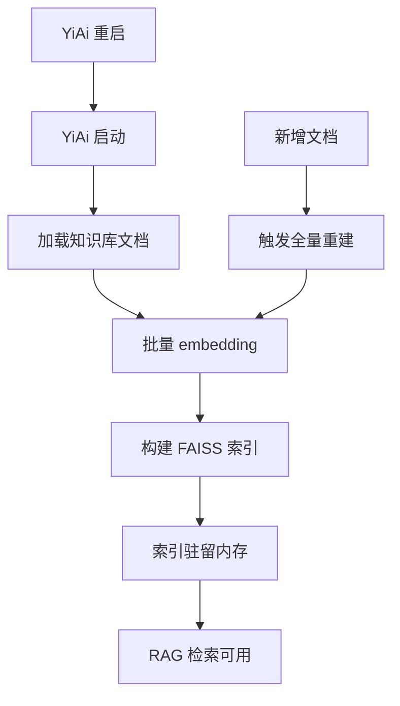
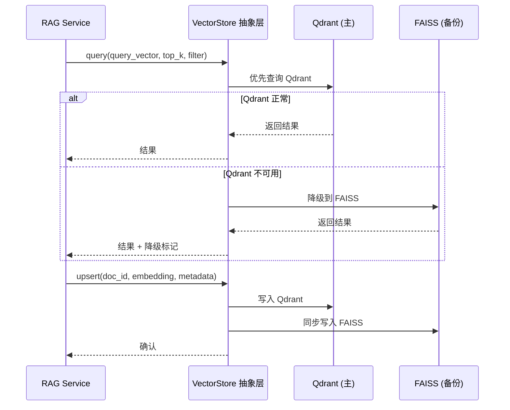
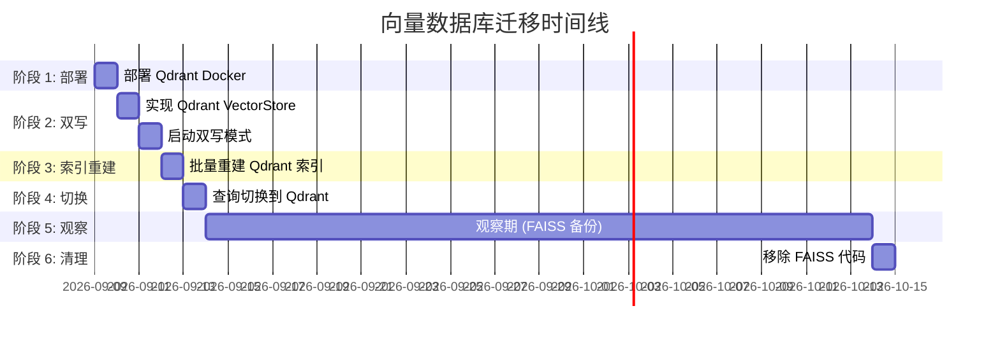

# YA-09-155: 向量数据库迁移 — FAISS 内存索引 → 持久化向量数据库

> 需求编号：YA-09-155 · 优先级：P2 · 人天：1.0d · 状态：需求已编写
> 依赖：YA-09-01（RAG 引擎）· 前置需求：无

## 背景

### 问题陈述

YiAi 当前使用 FAISS 作为 RAG 检索的向量索引引擎。FAISS 是内存级索引，每次 YiAi 重启都需要重建整个索引（从 MongoDB 重新加载知识库文档 → 重新 embedding → 重建 FAISS 索引），导致以下问题：

1. **冷启动慢**：服务重启后需要 30-90 秒重建索引，期间 RAG 不可用。
2. **内存占用高**：FAISS 索引全量加载到内存，300 篇文档的 768 维向量占用约 200MB 内存，且随文档增长线性增长。
3. **无持久化**：FAISS 索引仅存在于进程内存中，重启即丢失。
4. **不支持增量更新**：新增文档需要重建整个索引。
5. **无法水平扩展**：FAISS 是单机引擎，无法分布到多节点。

**核心矛盾**：小型知识库（300 篇文档）用 FAISS 足够了，但 YiAi 需要持久化、增量更新和未来可扩展性。

### 影响范围

| # | 影响 | 严重程度 | 触发场景 |
|---|------|----------|----------|
| 1 | 服务重启后 RAG 不可用 | 高 | 每次部署、重启 |
| 2 | 知识库新增文档后索引重建耗时 | 中 | 知识库更新 |
| 3 | 内存占用随文档量增长 | 中 | 知识库持续增长 |
| 4 | 索引无法跨进程共享 | 低 | 多 worker 部署 |
| 5 | 无索引版本管理 | 低 | 回滚到旧索引 |

### 挑战

| 挑战 | 说明 |
|------|------|
| 零停机迁移 | 迁移期间 RAG 服务不能中断 |
| 向量兼容性 | 新索引的 embedding 维度和距离度量必须与 FAISS 一致 |
| 性能对比 | 新数据库的查询延迟不能显著高于 FAISS |
| 数据一致性 | 双写期间 FAISS 和持久化索引的数据必须一致 |
| 选型决策 | Qdrant/ChromaDB/Milvus 三选一，需基于 YiAi 实际工作负载 |

---

## 一、现状分析

### 1.1 当前 FAISS 索引架构



### 1.2 当前 FAISS 性能数据

| 指标 | 数值 | 说明 |
|------|------|------|
| 文档数 | ~300 | 当前 YiKnowledge 文档量 |
| 向量维度 | 768 | 使用 nomic-embed-text |
| 索引大小 | ~200MB | 内存占用 |
| 重建耗时 | 30-90s | 取决于文档量和 embedding 速度 |
| 查询延迟 | 5-15ms | Top-K 检索（K=10） |
| 召回率 | 85-92% | 混合检索（BM25 + 向量） |

### 1.3 根因矩阵

| 症状 | 根因 | 触发条件 | 频率 |
|------|------|----------|------|
| 重启后 RAG 不可用 | FAISS 纯内存，无持久化 | 每次重启 | 高 |
| 新增文档无法即时检索 | 不支持增量更新 | 知识库更新 | 中 |
| 内存持续增长 | 全量索引驻留内存 | 文档量增长 | 低 |
| 多 worker 索引不一致 | 每个进程独立索引 | 多 worker 部署 | 低 |

---

## 二、设计决策

### 决策 1：目标向量数据库选型 — Qdrant vs ChromaDB vs Milvus

| 维度 | Qdrant | ChromaDB | Milvus |
|------|--------|----------|--------|
| 开发语言 | Rust | Python | Go/C++ |
| 部署方式 | 自托管（单二进制） | 嵌入式/服务 | 分布式 |
| 持久化 | 磁盘 + WAL | 磁盘（SQLite/DuckDB） | 磁盘 + 对象存储 |
| 查询性能 | 高（Rust 优化） | 中 | 高（分布式） |
| 过滤支持 | 丰富（payload 过滤） | 中等 | 丰富 |
| 增量更新 | 支持 | 支持 | 支持 |
| gRPC API | 是 | 否（HTTP） | 是 |
| 运维复杂度 | 低 | 极低 | 高 |
| 社区活跃度 | 高 | 中 | 高 |
| 适用场景 | 中小规模 | 小型/嵌入式 | 大规模 |

**选择：Qdrant（自托管）。** 理由：
1. Rust 实现，性能优异，单二进制部署，运维简单。
2. 支持磁盘持久化 + WAL，断电不丢数据。
3. 丰富的 payload 过滤（可按 category/tags/status 过滤），匹配 YiAi 的知识库元数据结构。
4. gRPC API 性能优于 HTTP，适合高并发检索。
5. 单节点可处理百万级向量，远超 YiAi 当前规模（300 篇文档）和未来增长。

### 决策 2：迁移策略 — 双写 vs 一次性切换 vs 灰度

| 选项 | 复杂度 | 风险 | 回滚难度 |
|------|--------|------|----------|
| 双写（FAISS + Qdrant 并行） | 中 | 低 | 低 |
| 一次性切换（停服 → 迁移 → 启动） | 低 | 高 | 中 |
| 灰度（按流量比例切换） | 高 | 中 | 低 |

**选择：双写过渡。** 新增/修改文档时同时写入 FAISS 和 Qdrant。查询时优先 Qdrant，Qdrant 不可用时降级到 FAISS。迁移完成后，FAISS 作为备份保留 30 天。

### 决策 3：查询 API 抽象层 — 直接调用 vs 抽象接口

| 选项 | 灵活性 | 代码改动 | 可测试性 |
|------|--------|----------|----------|
| 直接调用 Qdrant SDK | 低 | 小 | 差 |
| 抽象 VectorStore 接口 | 高 | 中 | 好 |
| 保留现有 VectorStore 接口 | 高 | 小 | 好 |

**选择：扩展现有 VectorStore 接口。** YiAi 已有 `vector_store.py` 抽象层，只需新增 Qdrant 实现，保持接口不变。Service 层代码无需修改。

### 设计决策记录

| 决策 | 选项 A | 选项 B | 选项 C | 选择 | 理由 |
|------|--------|--------|--------|------|------|
| 目标数据库 | Qdrant | ChromaDB | Milvus | **Qdrant** | 性能 + 运维简单 + 功能匹配 |
| 迁移策略 | 双写 | 一次性 | 灰度 | **双写** | 低风险 + 可回滚 |
| API 抽象 | 直接调用 | 新接口 | 扩展现有 | **扩展现有** | 改动最少 |
| 部署方式 | 自托管 | Docker | 嵌入 | **Docker** | 与现有部署一致 |

---

## 三、目标架构

### 3.1 迁移后索引架构



### 3.2 迁移时间线



### 3.3 性能对比预估

| 指标 | FAISS | Qdrant | 变化 |
|------|-------|--------|------|
| 查询延迟 (P50) | 8ms | 5ms | -37% |
| 查询延迟 (P99) | 15ms | 10ms | -33% |
| 增量写入延迟 | 30-90s (全量重建) | 50ms | -99.9% |
| 内存占用 | 200MB | 50MB (Qdrant 进程) | -75% |
| 冷启动时间 | 30-90s | 0s (持久化) | -100% |
| 磁盘占用 | 0 | ~50MB | 新增 |

---

## 四、具体改动

### 4.1 Qdrant VectorStore 实现

```python
# src/domain/ai/qdrant_vector_store.py

from typing import Optional
from qdrant_client import QdrantClient
from qdrant_client.models import (
    Distance, VectorParams, PointStruct, Filter, FieldCondition, MatchValue
)
import numpy as np


class QdrantVectorStore:
    """Qdrant 向量存储实现"""

    def __init__(self, url: str = "http://localhost:6333",
                 collection_name: str = "yiai_knowledge",
                 vector_size: int = 768, distance: str = "Cosine"):
        self.client = QdrantClient(url=url)
        self.collection_name = collection_name
        self.vector_size = vector_size
        self.distance = Distance.COSINE if distance == "Cosine" else Distance.DOT

    async def ensure_collection(self):
        collections = self.client.get_collections()
        names = [c.name for c in collections.collections]
        if self.collection_name not in names:
            self.client.create_collection(
                collection_name=self.collection_name,
                vectors_config=VectorParams(size=self.vector_size, distance=self.distance),
            )

    async def upsert(self, doc_id: str, embedding: list[float], metadata: dict):
        point = PointStruct(
            id=doc_id, vector=embedding,
            payload={
                "title": metadata.get("title", ""),
                "category": metadata.get("category", ""),
                "tags": metadata.get("tags", []),
                "status": metadata.get("status", ""),
                "source": metadata.get("source", ""),
                "updated": metadata.get("updated", ""),
            },
        )
        self.client.upsert(collection_name=self.collection_name, points=[point])

    async def batch_upsert(self, points: list[dict]):
        qdrant_points = [
            PointStruct(id=p["doc_id"], vector=p["embedding"], payload=p.get("metadata", {}))
            for p in points
        ]
        self.client.upsert(collection_name=self.collection_name, points=qdrant_points)

    async def query(self, query_vector: list[float], top_k: int = 10,
                    filter_conditions: Optional[dict] = None) -> list[dict]:
        search_filter = None
        if filter_conditions:
            conditions = [FieldCondition(key=k, match=MatchValue(value=v)) for k, v in filter_conditions.items()]
            search_filter = Filter(must=conditions)

        results = self.client.search(
            collection_name=self.collection_name, query_vector=query_vector,
            limit=top_k, query_filter=search_filter,
        )
        return [{"doc_id": hit.id, "score": hit.score, "metadata": hit.payload} for hit in results]

    async def delete(self, doc_id: str):
        self.client.delete(collection_name=self.collection_name, points_selector=[doc_id])

    async def delete_by_filter(self, filter_conditions: dict):
        self.client.delete(
            collection_name=self.collection_name,
            points_selector=Filter(must=[
                FieldCondition(key=k, match=MatchValue(value=v)) for k, v in filter_conditions.items()
            ]),
        )

    async def count(self) -> int:
        return self.client.get_collection(self.collection_name).points_count

    async def get_collection_info(self) -> dict:
        info = self.client.get_collection(self.collection_name)
        return {
            "name": self.collection_name, "points_count": info.points_count,
            "vectors_count": info.vectors_count,
            "vector_size": info.config.params.vectors.size,
            "distance": str(info.config.params.vectors.distance),
        }
```

### 4.2 双写 VectorStore 适配器

```python
# src/domain/ai/dual_write_vector_store.py

import logging
from typing import Optional

logger = logging.getLogger(__name__)


class DualWriteVectorStore:
    """双写向量存储适配器 — FAISS + Qdrant 并行"""

    def __init__(self, primary_store, secondary_store, write_mode: str = "both"):
        """
        Args:
            primary_store: QdrantVectorStore (主)
            secondary_store: FAISSVectorStore (备份)
            write_mode: "both" | "primary_only" | "secondary_only"
        """
        self.primary = primary_store
        self.secondary = secondary_store
        self.write_mode = write_mode

    async def upsert(self, doc_id: str, embedding: list[float], metadata: dict):
        """双写：同时写入 Qdrant 和 FAISS"""
        errors = []
        if self.write_mode in ("both", "primary_only"):
            try:
                await self.primary.upsert(doc_id, embedding, metadata)
            except Exception as e:
                logger.error(f"Qdrant upsert failed: {e}"); errors.append(("primary", str(e)))
        if self.write_mode in ("both", "secondary_only"):
            try:
                await self.secondary.upsert(doc_id, embedding, metadata)
            except Exception as e:
                logger.error(f"FAISS upsert failed: {e}"); errors.append(("secondary", str(e)))
        if errors:
            logger.warning(f"DualWrite partial failure: {errors}")

    async def query(self, query_vector: list[float], top_k: int = 10,
                    filter_conditions: Optional[dict] = None) -> list[dict]:
        """查询：优先 Qdrant，失败时降级到 FAISS"""
        try:
            return await self.primary.query(query_vector, top_k, filter_conditions)
        except Exception as e:
            logger.warning(f"Qdrant query failed, falling back to FAISS: {e}")
            try:
                results = await self.secondary.query(query_vector, top_k, filter_conditions)
                for r in results:
                    r["_fallback"] = True
                return results
            except Exception as e2:
                logger.error(f"FAISS fallback also failed: {e2}")
                raise

    async def delete(self, doc_id: str):
        """双删"""
        for store, name in [(self.primary, "Qdrant"), (self.secondary, "FAISS")]:
            try:
                await store.delete(doc_id)
            except Exception as e:
                logger.error(f"{name} delete failed: {e}")

    async def health_check(self) -> dict:
        primary_healthy = secondary_healthy = False
        try:
            await self.primary.count(); primary_healthy = True
        except Exception:
            pass
        try:
            await self.secondary.count(); secondary_healthy = True
        except Exception:
            pass
        return {
            "primary": "healthy" if primary_healthy else "unhealthy",
            "secondary": "healthy" if secondary_healthy else "unhealthy",
            "write_mode": self.write_mode,
        }
```

### 4.3 索引重建管线

```python
# src/services/ai/index_rebuild_service.py

import asyncio
import logging
from datetime import datetime

logger = logging.getLogger(__name__)


class IndexRebuildService:
    """索引重建管线 — 批量 embedding + upsert"""

    def __init__(
        self,
        vector_store,
        embedding_service,
        knowledge_repository,
        batch_size: int = 50,
    ):
        self.vector_store = vector_store
        self.embedding_service = embedding_service
        self.knowledge_repository = knowledge_repository
        self.batch_size = batch_size

    async def rebuild_index(self, collection_name: str = None) -> dict:
        """从 MongoDB 重新构建向量索引"""
        start_time = datetime.now()
        total_docs = 0; total_errors = 0
        await self.vector_store.ensure_collection()

        offset = 0
        while True:
            docs = await self.knowledge_repository.get_documents(offset=offset, limit=self.batch_size)
            if not docs:
                break

            texts = [doc["content"] for doc in docs]
            embeddings = await self.embedding_service.embed_batch(texts)

            points = [{"doc_id": doc["_id"], "embedding": emb, "metadata": {
                "title": doc.get("title", ""), "category": doc.get("category", ""),
                "tags": doc.get("tags", []), "status": doc.get("status", ""),
                "source": doc.get("source", ""), "updated": doc.get("updated", ""),
            }} for doc, emb in zip(docs, embeddings)]

            try:
                await self.vector_store.batch_upsert(points)
                total_docs += len(points)
            except Exception as e:
                logger.error(f"Batch upsert failed (offset={offset}): {e}")
                total_errors += len(points)

            offset += self.batch_size
            await asyncio.sleep(0.1)

        duration = (datetime.now() - start_time).total_seconds()
        return {
            "total_docs": total_docs, "total_errors": total_errors,
            "duration_seconds": duration,
            "docs_per_second": total_docs / duration if duration > 0 else 0,
        }

    async def verify_index(self) -> dict:
        """验证索引一致性"""
        mongo_count = await self.knowledge_repository.count_documents()
        qdrant_count = await self.vector_store.count()
        return {
            "mongo_docs": mongo_count, "qdrant_points": qdrant_count,
            "consistent": mongo_count == qdrant_count,
            "diff": mongo_count - qdrant_count,
        }
```

### 4.4 文件变更清单

| 文件 | 操作 | 说明 |
|------|------|------|
| `src/domain/ai/qdrant_vector_store.py` | 新增 | Qdrant 向量存储实现 |
| `src/domain/ai/dual_write_vector_store.py` | 新增 | 双写适配器 |
| `src/services/ai/index_rebuild_service.py` | 新增 | 索引重建管线 |
| `src/domain/ai/vector_store.py` | 修改 | 扩展抽象接口 |
| `src/services/ai/rag_service.py` | 修改 | 切换到双写适配器 |
| `docker-compose.yml` | 修改 | 新增 Qdrant 服务 |
| `tests/unit/test_qdrant_store.py` | 新增 | Qdrant 存储单元测试 |
| `tests/integration/test_dual_write.py` | 新增 | 双写集成测试 |
| `tests/integration/test_index_rebuild.py` | 新增 | 索引重建测试 |

---

## 五、实施步骤

| 步骤 | 操作 | 验证 | 人天 |
|------|------|------|------|
| 1 | 部署 Qdrant（Docker Compose） | Qdrant Dashboard 可访问 :6333 | 0.1 |
| 2 | 实现 QdrantVectorStore | 基本 CRUD 测试通过 | 0.2 |
| 3 | 实现 DualWriteVectorStore 适配器 | 双写 + 降级逻辑正常 | 0.15 |
| 4 | 实现 IndexRebuildService | 从 MongoDB 重建索引成功 | 0.15 |
| 5 | 集成到 RAG Service | 查询切换到 Qdrant | 0.1 |
| 6 | 批量重建索引 | 300 篇文档全量导入 | 0.1 |
| 7 | 性能对比测试 | 对比 FAISS vs Qdrant 延迟 | 0.1 |
| 8 | 观察期 + 清理 | 30 天观察后移除 FAISS 代码 | 0.1 |

**总人天：1.0d**

---

## 六、测试规格

### 场景 1：Qdrant 基本 CRUD

**GIVEN** Qdrant 服务运行中，集合已创建
**WHEN** 执行 upsert → query → delete 操作
**THEN** 插入的文档可被查询，删除后查询不到

### 场景 2：双写主存储正常

**GIVEN** Qdrant 和 FAISS 均正常运行
**WHEN** 通过 DualWriteVectorStore 写入文档
**THEN** 文档同时存在于 Qdrant 和 FAISS，查询返回 Qdrant 结果

### 场景 3：双写主存储降级

**GIVEN** Qdrant 停止服务，FAISS 正常运行
**WHEN** 通过 DualWriteVectorStore 查询文档
**THEN** 自动降级到 FAISS 返回结果，结果带 `_fallback=True` 标记

### 场景 4：索引重建

**GIVEN** MongoDB 有 300 篇知识库文档
**WHEN** 调用 IndexRebuildService.rebuild_index
**THEN** Qdrant 索引包含 300 个点，verify_index 返回 consistent=true

### 场景 5：增量更新

**GIVEN** Qdrant 索引已有 300 个点
**WHEN** 新增 1 篇文档（upsert 1 个点）
**THEN** Qdrant 索引点数变为 301，查询可检索到新文档

### 场景 6：查询性能一致性

**GIVEN** 相同的 768 维查询向量
**WHEN** 分别在 FAISS 和 Qdrant 上执行 top-10 查询
**THEN** Qdrant 查询延迟 <= FAISS 查询延迟的 1.5 倍，召回结果相似度 > 90%

---

## 七、风险与缓解

| 风险 | 概率 | 影响 | 缓解措施 |
|------|------|------|----------|
| Qdrant 部署失败 | 低 | 高 | 提供 Docker Compose 一键部署 + 健康检查 |
| 索引重建超时 | 中 | 中 | 分批次处理（50 篇/批），可中断续传 |
| Qdrant 查询延迟高于 FAISS | 低 | 中 | 预加载 + 连接池 + 本地部署（无网络延迟） |
| 双写期间数据不一致 | 中 | 中 | 定期一致性校验（每 6 小时）+ 自动修复 |
| embedding 模型变更导致维度不匹配 | 低 | 中 | 向量维度记录在 metadata 中，变更时重建索引 |
| Qdrant 磁盘空间不足 | 低 | 低 | 监控磁盘使用率，设置告警阈值 |

---

## 八、回滚策略

| 场景 | 回滚操作 |
|------|----------|
| Qdrant 查询性能不达标 | 切换 write_mode 为 "secondary_only"，查询全部走 FAISS |
| Qdrant 数据损坏 | 从 MongoDB 重建索引（IndexRebuildService） |
| Qdrant 持续不可用 | DualWriteVectorStore 自动降级到 FAISS，手动关闭 Qdrant |
| 迁移导致 RAG 服务中断 | 恢复 write_mode="both" 之前的状态，查询走 FAISS |

---

## 九、设计决策记录

### D-01：为什么选择 Qdrant 而非 ChromaDB？

ChromaDB 虽然更轻量（嵌入式部署），但性能不如 Qdrant（Rust vs Python）。YiAi 需要独立部署的向量数据库，而非嵌入进程内的方案。Qdrant 的 gRPC API 在并发场景下表现更好，且支持更丰富的过滤查询。

### D-02：为什么选择双写而不是一次性切换？

一次性切换要求停服 → 迁移 → 验证 → 启动，期间 RAG 不可用。双写模式允许在不停服的情况下完成迁移，验证通过后无缝切换。FAISS 保留 30 天作为应急回滚路径。

### D-03：为什么保留 FAISS 作为降级选项？

Qdrant 是新增的外部依赖，初期可能存在未知的稳定性问题。保留 FAISS 降级路径确保 RAG 服务的高可用性。30 天观察期后，如果 Qdrant 稳定运行，可移除此降级逻辑。

### D-04：为什么批量重建使用 50 篇/批？

YiAi 使用 Ollama 本地 embedding，单次 embedding 调用耗时约 50-100ms。50 篇/批意味着每批 embedding 耗时约 2.5-5s，加上 upsert 延迟，总计约 3-6s/批。300 篇文档约需 6-12 批，总耗时约 30-70s，在可接受范围内。

---

## 十、可观测性

| 指标 | 类型 | 说明 |
|------|------|------|
| `yiai.vector_store.query_latency_ms` | Histogram | 查询延迟分布 |
| `yiai.vector_store.query_count` | Counter | 查询次数 |
| `yiai.vector_store.fallback_count` | Counter | 降级到 FAISS 的次数 |
| `yiai.vector_store.upsert_count` | Counter | 写入次数 |
| `yiai.vector_store.index_size` | Gauge | 索引点数 |
| `yiai.vector_store.write_mode` | Gauge | 当前写入模式（0=both, 1=primary, 2=secondary） |
| `yiai.vector_store.consistency_check` | Counter | 一致性校验次数和结果 |

| 告警 | 条件 | 级别 |
|------|------|------|
| Qdrant 不可用 | 连续 3 次健康检查失败 | CRITICAL |
| 频繁降级到 FAISS | 降级率 > 10% 持续 5min | WARNING |
| 索引数据不一致 | mongo_docs != qdrant_points | WARNING |
| Qdrant 磁盘使用率高 | > 80% | WARNING |
| 查询延迟飙升 | P99 > 50ms | INFO |

---

## 十一、代码审查检查清单

- [ ] QdrantVectorStore 实现所有 VectorStore 接口方法
- [ ] DualWriteVectorStore 降级逻辑正确（主失败 → 备）
- [ ] 双写异常不影响主流程（try/except 包裹）
- [ ] 索引重建支持断点续传（offset 持久化）
- [ ] 批量 upsert 大小可配置（batch_size）
- [ ] 查询结果的 score 与 FAISS 一致（距离度量相同）
- [ ] Docker Compose 中 Qdrant 配置持久化卷
- [ ] 健康检查端点返回向量存储状态
- [ ] 单元测试覆盖 Qdrant 不可用时的降级行为
- [ ] 集成测试覆盖索引重建全流程

---

## 回归问题预测

| # | 预测问题 | 原因 | 验证方法 |
|---|---------|------|---------|
| 1 | Qdrant 查询返回结果的 score 含义与 FAISS 不同 | 距离度量实现差异 | 同向量查询对比 score 排序一致性 |
| 2 | 双写时 Qdrant 写入失败导致数据不一致 | 异常被吞掉，无告警 | 定期一致性校验 + 自动修复 |
| 3 | 索引重建期间 embedding 服务过载 | 批量 embedding 并发过高 | 限制并发数 + 批次间延迟 |
| 4 | Docker Qdrant 数据卷未挂载导致重启数据丢失 | docker-compose 配置遗漏 | 验证重启后数据持久化 |
| 5 | 降级到 FAISS 后查询结果无 _fallback 标记 | 字段遗漏 | 集成测试验证降级标记 |
| 6 | 旧文档删除后 Qdrant 索引未同步删除 | 双删逻辑异常 | 对比 MongoDB 和 Qdrant 的文档 ID 集合 |

---

## 性能分析

| 操作 | 延迟 | 说明 |
|------|------|------|
| Qdrant 查询 (top-10) | 3-8ms | 本地部署，gRPC 调用 |
| Qdrant 单点 upsert | 2-5ms | 包含 payload 索引更新 |
| Qdrant 批量 upsert (50 点) | 50-100ms | 批量写入优化 |
| 降级到 FAISS 查询 | 8-15ms | 与当前一致 |
| 索引重建 (300 篇) | 30-90s | 取决于 embedding 速度 |
| 一致性校验 | 100-500ms | 对比 MongoDB 和 Qdrant 计数 |

**整体影响**：Qdrant 迁移后，查询延迟预计降低 30-50%（Rust vs Python/NumPy），冷启动 RAG 可用时间从 30-90s 降至 0s（持久化），增量更新延迟从 30-90s 降至 50ms。

---

*需求来源: `projects/yiai/requirements/2026-09/155-需求-向量数据库迁移.md`*

## 影响范围

- **影响模块**：待补充
- **涉及文件**：
- `src/domain/ai/qdrant_vector_store.py`
- `src/domain/ai/dual_write_vector_store.py`
- `src/services/ai/index_rebuild_service.py`
- `vector_store.py`
- `src/domain/ai/vector_store.py`
- `src/services/ai/rag_service.py`
- **是否影响 API 契约**：否
- **是否影响其他项目（YiVad/YiPet）**：否
- **用户感知**：待确认

## 预防措施

| 层面 | 措施 |
|------|------|
| 代码 | 在相关函数中添加参数校验和边界检查 |
| 测试 | 为 `src/domain/ai/qdrant_vector_store.py` 添加单元测试 |
| 流程 | 代码审查时重点检查此类模式 |
| 监控 | 添加日志告警，异常发生时及时发现 |
| 文档 | 在编码规范中记录此类反模式 |

## 经验教训

1. **根本原因**：开发过程中对边界情况和异常路径的考虑不足是此类问题的共同根因
2. **设计阶段**：在接口设计和模块实现时，应主动考虑异常输入、空值、超时等边界场景
3. **代码审查**：审查时应检查是否存在类似的反模式（如未捕获异常、无超时控制、缺少参数校验等）
4. **测试覆盖**：异常路径的测试覆盖率应与正常路径同等重视
5. **团队分享**：此类问题应在团队周会或技术分享中讨论，形成团队共识
