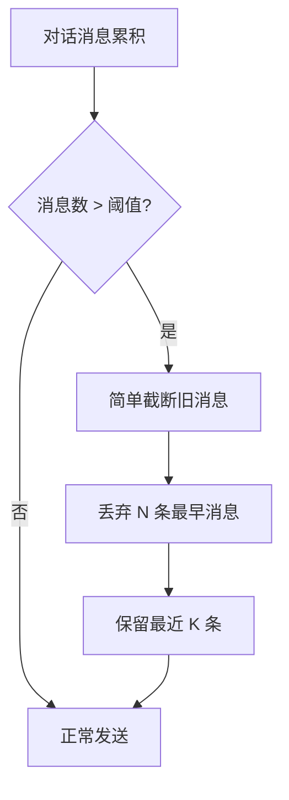
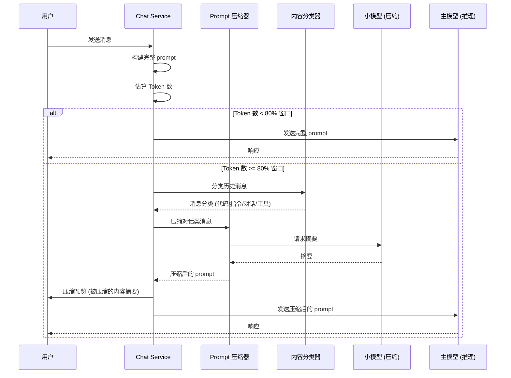

# YA-09-156: Prompt 压缩与优化服务 — 智能上下文压缩 + 关键信息保留 + 长对话优化

> 需求编号：YA-09-156 · 优先级：P2 · 人天：0.5d · 状态：需求已编写
> 依赖：YA-09-09（上下文压缩服务）· 前置需求：YA-09-09

## 背景

### 问题陈述

YiAi 的多轮对话场景中，随着对话轮次增加，prompt 上下文长度线性增长。当历史消息超过模型上下文窗口的 80% 时，会出现以下问题：

1. **Token 浪费**：大量重复或冗余的历史消息占用宝贵的上下文窗口。
2. **推理质量下降**：LLM 在长上下文中容易丢失关键信息（"Lost in the Middle" 问题）。
3. **成本增加**：Token 消耗与上下文长度成正比，长对话成本显著增加。
4. **延迟增加**：更长的 prompt 意味着更长的推理时间。

**核心矛盾**：用户希望保留完整对话历史以便回溯，但 LLM 的上下文窗口有限，且长上下文会降低推理质量和增加成本。

YA-09-09（上下文压缩服务）已实现基础的对话截断策略，但缺乏智能压缩能力——当前方案是简单丢弃旧消息，而非提取关键信息后压缩。

### 影响范围

| # | 影响 | 严重程度 | 触发场景 |
|---|------|----------|----------|
| 1 | 长对话超出上下文窗口，丢失关键信息 | 高 | 对话超过 20 轮 |
| 2 | Token 消耗过高导致成本增加 | 中 | 日常使用 |
| 3 | LLM 推理质量随上下文增长而下降 | 中 | 复杂多轮对话 |
| 4 | 用户无法知晓哪些内容被压缩 | 低 | 压缩后对 AI 行为困惑 |
| 5 | 代码/指令类内容被错误压缩 | 中 | 编程/指令类对话 |

### 挑战

| 挑战 | 说明 |
|------|------|
| 语义保留 | 压缩后必须保留 90% 以上的关键语义信息 |
| 内容分类 | 不同类型内容（代码/对话/指令）需要不同的压缩策略 |
| 压缩质量度量 | 如何量化"压缩后语义保留程度"？ |
| 压缩时机 | 何时触发压缩？频率过高浪费资源，频率过低压缩效果差 |
| 用户可控性 | 用户需要知道什么被压缩了，并可以禁用压缩 |

---

## 一、现状分析

### 1.1 当前上下文压缩流程



### 1.2 当前压缩策略问题

| 问题 | 说明 | 影响 |
|------|------|------|
| 简单截断 | 直接丢弃旧消息，无信息提取 | 丢失关键上下文 |
| 无内容分类 | 代码/指令/对话统一处理 | 重要指令可能被丢弃 |
| 无压缩预览 | 用户不知道丢弃了什么 | 对 AI 遗忘行为困惑 |
| 阈值固定 | 只按消息数判断，不考虑 Token 数 | 长消息和短消息处理不公平 |
| 无压缩记录 | 丢弃后无法回溯 | 调试困难 |

### 1.3 根因矩阵

| 症状 | 根因 | 触发条件 | 频率 |
|------|------|----------|------|
| AI 忘记早期对话内容 | 简单截断丢弃所有旧消息 | 对话 > 20 轮 | 高 |
| 代码片段被丢弃 | 无内容类型区分 | 编程对话 | 中 |
| Token 成本高 | 冗余消息未被压缩 | 日常对话 | 中 |
| 用户困惑 AI 为何遗忘 | 无压缩预览 | 压缩触发时 | 低 |

---

## 二、设计决策

### 决策 1：压缩方式 — 提取式摘要 vs 生成式摘要 vs 混合

| 选项 | 质量 | 延迟 | Token 节省 | 实现复杂度 |
|------|------|------|-----------|-----------|
| 提取式摘要（选关键句） | 中 | 低 | 50-60% | 低 |
| 生成式摘要（LLM 总结） | 高 | 高 | 70-80% | 中 |
| 混合（提取 + 生成） | 高 | 中 | 60-70% | 中 |

**选择：混合。** 先用提取式方法快速筛选关键消息（规则 + 关键词匹配），再对需要压缩的消息使用 LLM 生成摘要。快速筛选避免对所有消息调用 LLM 造成延迟。

### 决策 2：压缩触发条件 — 消息数 vs Token 数 vs 窗口占比

| 选项 | 精确性 | 计算成本 | 适用性 |
|------|--------|----------|--------|
| 消息数 > N | 低 | 低 | 简单场景 |
| Token 数 > N | 中 | 中 | 通用 |
| 上下文窗口占比 > 80% | 高 | 中 | 最准确 |

**选择：上下文窗口占比 > 80%。** 不同模型的上下文窗口不同（4K/8K/32K/128K），按占比判断更准确、更通用。同时保留消息数阈值作为兜底。

### 决策 3：内容分类策略 — 统一处理 vs 差异化处理

| 内容类型 | 策略 | 理由 |
|----------|------|------|
| 代码块 | 保留（不压缩） | 代码不可总结，丢失细节即失去价值 |
| 系统指令 | 保留原样 | 指令的措辞影响 LLM 行为 |
| 对话消息 | 摘要压缩 | 对话内容可概括，保留关键信息 |
| 用户问题 | 保留最近 3 轮 | 最近问题最相关 |
| 工具调用结果 | 摘要压缩 | 结果可概括，保留关键数据 |

**选择：差异化处理。** 按内容类型采用不同压缩策略，最大化保留有用信息。

### 设计决策记录

| 决策 | 选项 A | 选项 B | 选项 C | 选择 | 理由 |
|------|--------|--------|--------|------|------|
| 压缩方式 | 提取式 | 生成式 | 混合 | **混合** | 效率 + 质量平衡 |
| 触发条件 | 消息数 | Token 数 | 窗口占比 | **窗口占比** | 最准确通用 |
| 内容分类 | 统一处理 | 差异化 | — | **差异化** | 保留代码/指令 |
| 压缩模型 | 同模型 | 小模型 | 规则 | **小模型** | 成本低 + 速度快 |

---

## 三、目标架构

### 3.1 智能压缩流程



### 3.2 压缩策略矩阵

| 内容类型 | 识别方式 | 压缩策略 | 保留比例 | 示例 |
|----------|----------|----------|----------|------|
| 代码块 | ``` 标记 | 保留原样 | 100% | Python 函数、SQL 查询 |
| 系统指令 | role=system | 保留原样 | 100% | "你是一个专业的助手..." |
| 用户问题 | role=user, 最近 3 轮 | 保留原样 | 100% | 最近 3 个用户问题 |
| 对话消息 | role=user/assistant | LLM 摘要 | 20-30% | 闲聊、讨论 |
| 工具调用结果 | role=tool | 提取关键数据 | 30-50% | API 返回 JSON |

### 3.3 压缩目标

| 指标 | 目标值 | 测量方式 |
|------|--------|----------|
| Token 压缩率 | 50-70% | (压缩前 Token - 压缩后 Token) / 压缩前 Token |
| 语义保留率 | > 90% | LLM Judge 评分（1-5 分，目标 ≥ 4.5） |
| 压缩耗时 | < 2s | 小模型推理耗时 |
| 压缩触发频率 | 每次对话仅触发 1-2 次 | 增量压缩（仅压缩新增部分） |

---

## 四、具体改动

### 4.1 内容分类器

```python
# src/services/ai/content_classifier.py

import re
from enum import Enum
from dataclasses import dataclass


class ContentType(Enum):
    CODE = "code"                # 代码块
    SYSTEM_INSTRUCTION = "system"  # 系统指令
    USER_QUESTION = "user_question"  # 用户问题
    CONVERSATION = "conversation"  # 日常对话
    TOOL_RESULT = "tool_result"  # 工具调用结果
    UNKNOWN = "unknown"


@dataclass
class ClassifiedMessage:
    role: str
    content: str
    content_type: ContentType
    index: int  # 在消息列表中的位置
    token_count: int


class ContentClassifier:
    """内容分类器 — 识别消息类型以决定压缩策略"""

    CODE_PATTERN = re.compile(r"```[\s\S]*?```")
    TOOL_CALL_PATTERN = re.compile(r"\[toolu_\w+\]|\{[\s\S]*\"tool\"[\s\S]*\}")

    def classify(self, messages: list[dict]) -> list[ClassifiedMessage]:
        """分类消息列表"""
        classified = []
        for i, msg in enumerate(messages):
            role = msg.get("role", "")
            content = msg.get("content", "")
            token_count = self._estimate_tokens(content)
            content_type = self._classify_single(role, content, i, len(messages))
            classified.append(ClassifiedMessage(
                role=role, content=content, content_type=content_type,
                index=i, token_count=token_count,
            ))
        return classified

    def _classify_single(self, role: str, content: str, index: int, total: int) -> ContentType:
        if role == "system":
            return ContentType.SYSTEM_INSTRUCTION
        if self.CODE_PATTERN.search(content):
            return ContentType.CODE
        if role == "tool" or self.TOOL_CALL_PATTERN.search(content):
            return ContentType.TOOL_RESULT
        if role == "user" and index >= total - 6:
            return ContentType.USER_QUESTION
        return ContentType.CONVERSATION

    def _estimate_tokens(self, text: str) -> int:
        chinese_chars = len(re.findall(r"[\u4e00-\u9fff]", text))
        english_words = len(re.findall(r"[a-zA-Z]+", text))
        other = len(text) - chinese_chars - english_words
        return int(chinese_chars * 2 + english_words * 1.3 + other * 0.5)
```

### 4.2 Prompt 压缩器

```python
# src/services/ai/prompt_compressor.py

import logging
from dataclasses import dataclass
from typing import Optional

logger = logging.getLogger(__name__)


@dataclass
class CompressionResult:
    compressed_messages: list[dict]     # 压缩后的消息列表
    original_tokens: int                # 原始 Token 数
    compressed_tokens: int              # 压缩后 Token 数
    compression_ratio: float            # 压缩率
    summary: str                        # 压缩摘要（供用户预览）
    messages_compressed: int            # 被压缩的消息数
    messages_preserved: int             # 被保留的消息数


class PromptCompressor:
    """Prompt 压缩器 — 混合提取式 + 生成式压缩"""

    def __init__(
        self,
        classifier: ContentClassifier,
        llm_service,  # 小模型服务（用于生成摘要）
        compression_model: str = "qwen2.5:0.5b",
        window_ratio_threshold: float = 0.8,
        max_context_tokens: int = 8192,
    ):
        self.classifier = classifier
        self.llm_service = llm_service
        self.compression_model = compression_model
        self.window_ratio_threshold = window_ratio_threshold
        self.max_context_tokens = max_context_tokens

    def should_compress(self, messages: list[dict]) -> tuple[bool, int]:
        """判断是否需要压缩"""
        total_tokens = sum(
            self.classifier._estimate_tokens(m.get("content", ""))
            for m in messages
        )
        threshold = int(self.max_context_tokens * self.window_ratio_threshold)
        return total_tokens >= threshold, total_tokens

    async def compress(self, messages: list[dict]) -> CompressionResult:
        """执行智能压缩"""
        classified = self.classifier.classify(messages)
        original_tokens = sum(m.token_count for m in classified)

        to_preserve = []
        to_compress = []
        for cm in classified:
            if cm.content_type in (ContentType.CODE, ContentType.SYSTEM_INSTRUCTION, ContentType.USER_QUESTION):
                to_preserve.append(cm)
            else:
                to_compress.append(cm)

        extractive_summary = self._extractive_compress(to_compress)
        summary = await self._generate_summary(extractive_summary) if to_compress else ""

        compressed_messages = [{"role": cm.role, "content": cm.content} for cm in to_preserve]
        if summary:
            compressed_messages.insert(0, {"role": "system", "content": f"[对话历史摘要] {summary}"})

        compressed_tokens = sum(self.classifier._estimate_tokens(m["content"]) for m in compressed_messages)
        ratio = (original_tokens - compressed_tokens) / original_tokens if original_tokens > 0 else 0

        return CompressionResult(
            compressed_messages=compressed_messages,
            original_tokens=original_tokens, compressed_tokens=compressed_tokens,
            compression_ratio=ratio, summary=summary,
            messages_compressed=len(to_compress), messages_preserved=len(to_preserve),
        )

    def _extractive_compress(self, messages: list[ClassifiedMessage]) -> str:
        """提取式压缩：按关键词和位置权重筛选"""
        if not messages:
            return ""
        max_index = max(m.index for m in messages)
        weighted = []
        for cm in messages:
            pos_w = 0.5 + 0.5 * (cm.index / max_index) if max_index > 0 else 1.0
            kw_w = self._keyword_score(cm.content)
            weighted.append((cm, pos_w * 0.4 + kw_w * 0.6))
        weighted.sort(key=lambda x: x[1], reverse=True)
        top_n = max(1, len(weighted) // 2)
        selected = [wm[0] for wm in weighted[:top_n]]
        selected.sort(key=lambda x: x.index)
        return "\n".join(f"[{cm.role}]: {cm.content[:200]}" for cm in selected)

    def _keyword_score(self, text: str) -> float:
        important = ["决定", "结论", "结果", "问题", "答案", "错误",
                     "配置", "设置", "修改", "重要", "关键", "注意",
                     "error", "result", "config", "fix", "important"]
        score = sum(1.0 for kw in important if kw.lower() in text.lower())
        return min(score / len(important), 1.0)

    async def _generate_summary(self, extractive_text: str) -> str:
        """使用小模型生成对话摘要"""
        prompt = (
            "请将以下对话历史压缩为一段简洁的摘要（不超过 200 字），"
            "保留关键决策、结论和未解决的问题：\n\n"
            f"{extractive_text}\n\n摘要："
        )
        try:
            response = await self.llm_service.generate(
                model=self.compression_model, prompt=prompt, max_tokens=300,
            )
            return response.strip()
        except Exception as e:
            logger.warning(f"Summary generation failed: {e}")
            return extractive_text[:500]
```

### 4.3 压缩预览与用户控制

```python
# src/services/ai/compression_preview.py

from dataclasses import dataclass


@dataclass
class CompressionPreview:
    """压缩预览 — 告知用户被压缩的内容"""
    summary: str               # 压缩摘要
    messages_compressed: int   # 被压缩的消息数
    messages_preserved: int    # 被保留的消息数
    compression_ratio: float   # 压缩率
    original_tokens: int       # 原始 Token 数
    compressed_tokens: int     # 压缩后 Token 数
    can_disable: bool          # 用户是否可禁用压缩


class CompressionPreviewService:
    """压缩预览服务 — 生成用户可见的压缩通知"""

    def generate_preview(self, result: CompressionResult) -> CompressionPreview:
        return CompressionPreview(
            summary=result.summary,
            messages_compressed=result.messages_compressed,
            messages_preserved=result.messages_preserved,
            compression_ratio=result.compression_ratio,
            original_tokens=result.original_tokens,
            compressed_tokens=result.compressed_tokens,
            can_disable=True,
        )

    def format_user_message(self, preview: CompressionPreview) -> str:
        """生成展示给用户的压缩通知"""
        ratio_pct = preview.compression_ratio * 100
        return (
            f"[上下文已压缩] 原始 {preview.original_tokens} tokens → "
            f"{preview.compressed_tokens} tokens (节省 {ratio_pct:.0f}%)。"
            f"已压缩 {preview.messages_compressed} 条消息，"
            f"保留 {preview.messages_preserved} 条。\n"
            f"摘要: {preview.summary[:100]}..."
        )
```

### 4.4 压缩质量度量

```python
# src/services/ai/compression_quality.py

import numpy as np
from dataclasses import dataclass


@dataclass
class QualityMetrics:
    semantic_similarity: float     # 语义相似度 (0-1)
    keyword_retention: float       # 关键词保留率 (0-1)
    answer_consistency: float      # 回答一致性 (0-1)
    overall_score: float           # 综合评分 (0-1)


class CompressionQualityEvaluator:
    """压缩质量评估器"""

    def __init__(self, embedding_service, llm_judge_service):
        self.embedding_service = embedding_service
        self.llm_judge_service = llm_judge_service

    async def evaluate(
        self,
        original_messages: list[dict],
        compressed_messages: list[dict],
    ) -> QualityMetrics:
        """评估压缩质量"""

        # 1. 语义相似度：embedding 向量余弦相似度
        original_text = " ".join(m["content"] for m in original_messages)
        compressed_text = " ".join(m["content"] for m in compressed_messages)

        orig_embed = await self.embedding_service.embed(original_text)
        comp_embed = await self.embedding_service.embed(compressed_text)

        similarity = self._cosine_similarity(orig_embed, comp_embed)

        # 2. 关键词保留率
        kw_retention = self._keyword_retention(original_text, compressed_text)

        # 3. 回答一致性（使用 LLM Judge 评分）
        consistency = await self._llm_judge_consistency(
            original_text, compressed_text
        )

        overall = similarity * 0.4 + kw_retention * 0.3 + consistency * 0.3

        return QualityMetrics(
            semantic_similarity=similarity,
            keyword_retention=kw_retention,
            answer_consistency=consistency,
            overall_score=overall,
        )

    def _cosine_similarity(self, a: list[float], b: list[float]) -> float:
        a_arr = np.array(a)
        b_arr = np.array(b)
        dot = np.dot(a_arr, b_arr)
        norm = np.linalg.norm(a_arr) * np.linalg.norm(b_arr)
        return float(dot / norm) if norm > 0 else 0.0

    def _keyword_retention(self, original: str, compressed: str) -> float:
        """关键词保留率"""
        import re
        # 提取原始文本的关键词（简化：取长度 > 1 的词）
        orig_words = set(re.findall(r"[\u4e00-\u9fff]{2,}|[a-zA-Z]{3,}", original.lower()))
        comp_words = set(re.findall(r"[\u4e00-\u9fff]{2,}|[a-zA-Z]{3,}", compressed.lower()))
        if not orig_words:
            return 1.0
        return len(orig_words & comp_words) / len(orig_words)

    async def _llm_judge_consistency(self, original: str, compressed: str) -> float:
        """LLM Judge 评分（1-5 分，归一化到 0-1）"""
        prompt = (
            "评估以下压缩后的上下文是否保留了原始上下文的关键信息。"
            "1-5 分，5 分表示完全保留所有关键信息。\n\n"
            f"原始上下文: {original[:500]}\n\n"
            f"压缩后上下文: {compressed[:500]}\n\n"
            "评分（仅输出数字）："
        )
        try:
            response = await self.llm_judge_service.generate(
                prompt=prompt, max_tokens=10
            )
            score = float(response.strip()) / 5.0
            return max(0.0, min(1.0, score))
        except Exception:
            return 0.7  # 默认中等评分
```

### 4.5 文件变更清单

| 文件 | 操作 | 说明 |
|------|------|------|
| `src/services/ai/content_classifier.py` | 新增 | 内容分类器 |
| `src/services/ai/prompt_compressor.py` | 新增 | Prompt 压缩器 |
| `src/services/ai/compression_preview.py` | 新增 | 压缩预览服务 |
| `src/services/ai/compression_quality.py` | 新增 | 压缩质量评估 |
| `src/services/ai/chat_service.py` | 修改 | 集成智能压缩 |
| `src/services/ai/compaction_service.py` | 修改 | 与 YA-09-09 协作 |
| `tests/unit/test_content_classifier.py` | 新增 | 分类器测试 |
| `tests/unit/test_prompt_compressor.py` | 新增 | 压缩器测试 |
| `tests/integration/test_compression_e2e.py` | 新增 | 端到端压缩测试 |

---

## 五、实施步骤

| 步骤 | 操作 | 验证 | 人天 |
|------|------|------|------|
| 1 | 实现 ContentClassifier | 各类型消息正确分类 | 0.1 |
| 2 | 实现 PromptCompressor 提取式压缩 | 关键词提取 + 权重排序正确 | 0.1 |
| 3 | 实现 PromptCompressor 生成式压缩 | 小模型生成摘要质量可接受 | 0.1 |
| 4 | 实现 CompressionPreview 服务 | 压缩预览消息格式正确 | 0.05 |
| 5 | 实现 CompressionQualityEvaluator | 压缩质量指标计算正确 | 0.05 |
| 6 | 集成到 Chat Service | 压缩触发逻辑正确，不影响正常对话 | 0.05 |
| 7 | 与 YA-09-09 Compaction Service 协作 | 两个服务不冲突，协同工作 | 0.05 |

**总人天：0.5d**

---

## 六、测试规格

### 场景 1：内容分类正确性

**GIVEN** 包含代码块、系统指令、用户问题和对话的消息列表
**WHEN** ContentClassifier.classify 被调用
**THEN** 代码块分类为 CODE，系统指令分类为 SYSTEM_INSTRUCTION，最近 3 轮用户问题分类为 USER_QUESTION，其余为 CONVERSATION

### 场景 2：压缩触发阈值

**GIVEN** 消息列表的 Token 估算为 7000，max_context_tokens=8192，threshold=0.8
**WHEN** should_compress 被调用
**THEN** 返回 (True, 7000)，因为 7000 >= 6553 (8192*0.8)

### 场景 3：压缩不触发

**GIVEN** 消息列表的 Token 估算为 3000，max_context_tokens=8192
**WHEN** should_compress 被调用
**THEN** 返回 (False, 3000)，不触发压缩

### 场景 4：代码块保留

**GIVEN** 消息列表包含 3 个代码块和 10 条对话消息
**WHEN** PromptCompressor.compress 被调用
**THEN** 压缩结果中 3 个代码块原样保留，10 条对话消息被压缩为摘要

### 场景 5：压缩率达标

**GIVEN** 20 轮对话（约 8000 tokens）
**WHEN** PromptCompressor.compress 被调用
**THEN** compression_ratio >= 50%（Token 减少至少 50%）

### 场景 6：用户禁用压缩

**GIVEN** 用户通过 API 参数设置 disable_compression=true
**WHEN** 对话 Token 数超过 80% 窗口阈值
**THEN** 不触发压缩，使用原有截断逻辑（YA-09-09 的 Compaction Service）

---

## 七、风险与缓解

| 风险 | 概率 | 影响 | 缓解措施 |
|------|------|------|----------|
| 压缩摘要丢失关键信息 | 中 | 高 | 保留最近 3 轮用户问题 + 提供压缩预览 |
| 小模型生成摘要质量差 | 中 | 中 | 降级为提取式压缩（纯文本截断） |
| 压缩增加额外延迟 | 中 | 低 | 使用小模型（0.5B），目标 < 2s |
| 压缩触发过于频繁 | 低 | 低 | 增量压缩 + 冷却期（5 分钟内不重复触发） |
| 代码块被误判为对话 | 低 | 中 | 增强 Code 检测模式（``` 标记 + 缩进检测） |

---

## 八、回滚策略

| 场景 | 回滚操作 |
|------|----------|
| 压缩导致回答质量下降 | 禁用 PromptCompressor，回退到 YA-09-09 简单截断 |
| 小模型生成摘要不可用 | 降级为纯提取式压缩（不调用 LLM） |
| 压缩延迟过高 | 减小压缩模型（0.5B → 规则引擎）或禁用 |
| 用户投诉压缩丢失信息 | 提供会话级 disable_compression 选项 |

---

## 九、设计决策记录

### D-01：为什么使用小模型做摘要而不是主模型？

主模型（如 qwen2.5:14b）的推理延迟为 3-10s，而小模型（如 qwen2.5:0.5b）的推理延迟为 0.5-1s。压缩是辅助任务，不应显著增加用户感知的延迟。小模型生成摘要质量可能略低，但提取式压缩作为降级方案保证了基本可用性。

### D-02：为什么保留最近 3 轮用户问题？

"Lost in the Middle" 研究表明，LLM 对开头和结尾的内容关注度最高。最近 3 轮用户问题代表了当前对话的核心方向，保留它们能最大程度保证对话连贯性。

### D-03：为什么压缩阈值设为 80% 而非 100%？

在达到 100% 窗口上限之前提前压缩，避免了压缩期间新增消息导致超出窗口的风险。80% 是业界常用的安全阈值，给压缩执行和后续消息留出缓冲空间。

### D-04：与 YA-09-09（Compaction Service）的关系？

YA-09-09 的 Compaction Service 负责基础的消息截断（按消息数/Token 数），YA-09-156 的 PromptCompressor 是更智能的替代方案。当 PromptCompressor 启用时，Compaction Service 的截断逻辑被替代；当 PromptCompressor 禁用时，回退到 Compaction Service 的原有逻辑。

---

## 十、可观测性

| 指标 | 类型 | 说明 |
|------|------|------|
| `yiai.compression.trigger_count` | Counter | 压缩触发次数 |
| `yiai.compression.tokens_before` | Histogram | 压缩前 Token 数 |
| `yiai.compression.tokens_after` | Histogram | 压缩后 Token 数 |
| `yiai.compression.ratio` | Histogram | 压缩率分布 |
| `yiai.compression.duration_ms` | Histogram | 压缩耗时 |
| `yiai.compression.semantic_similarity` | Gauge | 语义保留率 |
| `yiai.compression.disabled_count` | Counter | 用户禁用压缩次数 |
| `yiai.compression.fallback_count` | Counter | 降级到提取式压缩次数 |

| 告警 | 条件 | 级别 |
|------|------|------|
| 压缩率过低 | < 20% 持续 5 次 | INFO |
| 语义保留率过低 | < 0.7 | WARNING |
| 压缩耗时过长 | P99 > 5s | WARNING |
| 小模型不可用 | 连续 3 次摘要生成失败 | WARNING |
| 压缩触发过于频繁 | 同一会话 1 分钟内触发 > 3 次 | INFO |

---

## 十一、代码审查检查清单

- [ ] ContentClassifier 正确识别所有 5 种内容类型
- [ ] 代码块（```）不被压缩
- [ ] 系统指令（role=system）原样保留
- [ ] 最近 3 轮用户问题不被压缩
- [ ] 压缩阈值按上下文窗口占比计算（非固定值）
- [ ] 压缩预览消息正确展示给用户
- [ ] 禁用压缩时正确回退到 YA-09-09 Compaction Service
- [ ] 小模型不可用时降级为提取式压缩
- [ ] 压缩质量指标正确记录
- [ ] 单元测试覆盖所有内容类型和压缩策略

---

## 回归问题预测

| # | 预测问题 | 原因 | 验证方法 |
|---|---------|------|---------|
| 1 | 代码块中嵌套 ``` 标记导致误判 | 代码块内包含 markdown 示例 | 测试嵌套代码块分类 |
| 2 | 压缩摘要与后续对话产生矛盾 | 摘要遗漏了关键约束条件 | LLM Judge 评分 + 人工抽检 |
| 3 | 小模型摘要生成超时阻塞主流程 | 小模型推理异常 | 设置 3s 超时 + 降级到提取式 |
| 4 | 压缩后 Tool 调用结果丢失 | 工具结果被分类为对话 | 增强 Tool 结果识别模式 |
| 5 | 用户频繁切换话题导致压缩摘要无关 | 摘要覆盖了早期话题，但当前话题已切换 | 考虑话题分割 + 分段摘要 |
| 6 | 压缩预览消息干扰用户阅读 | 预览消息过长或格式不佳 | 预览消息限制在 150 字以内 |

---

## 性能分析

| 操作 | 延迟 | 说明 |
|------|------|------|
| 内容分类 | < 5ms | 正则匹配 + 位置判断 |
| 提取式压缩 | < 10ms | 关键词评分 + 排序 |
| 生成式压缩（小模型 0.5B） | 500-2000ms | 取决于摘要长度 |
| 压缩质量评估（embedding） | 50-100ms | 向量化和余弦相似度 |
| 压缩质量评估（LLM Judge） | 500-1000ms | 异步执行，不阻塞 |
| 整体压缩流程 | 500-2000ms | 小模型推理主导 |

**用户感知延迟**：压缩仅在对话 Token 超过 80% 窗口时触发（长对话），此时用户已投入较多时间，对 1-2s 的额外延迟容忍度较高。压缩后，主模型推理延迟反而降低（更短的 prompt），整体延迟可能持平或更低。

---

*需求来源: `projects/yiai/requirements/2026-09/156-需求-Prompt压缩与优化服务.md`*

## 影响范围

- **影响模块**：待补充
- **涉及文件**：
- `src/services/ai/compression_quality.py`
- `src/services/ai/compression_preview.py`
- `src/services/ai/content_classifier.py`
- `src/services/ai/compaction_service.py`
- `src/services/ai/chat_service.py`
- `src/services/ai/prompt_compressor.py`
- **是否影响 API 契约**：否
- **是否影响其他项目（YiVad/YiPet）**：否
- **用户感知**：待确认

## 预防措施

| 层面 | 措施 |
|------|------|
| 代码 | 在相关函数中添加参数校验和边界检查 |
| 测试 | 为 `src/services/ai/compression_quality.py` 添加单元测试 |
| 流程 | 代码审查时重点检查此类模式 |
| 监控 | 添加日志告警，异常发生时及时发现 |
| 文档 | 在编码规范中记录此类反模式 |

## 经验教训

1. **根本原因**：开发过程中对边界情况和异常路径的考虑不足是此类问题的共同根因
2. **设计阶段**：在接口设计和模块实现时，应主动考虑异常输入、空值、超时等边界场景
3. **代码审查**：审查时应检查是否存在类似的反模式（如未捕获异常、无超时控制、缺少参数校验等）
4. **测试覆盖**：异常路径的测试覆盖率应与正常路径同等重视
5. **团队分享**：此类问题应在团队周会或技术分享中讨论，形成团队共识
