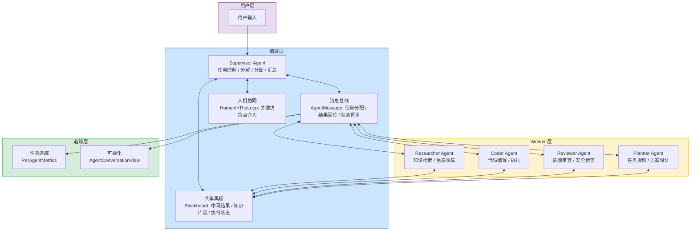
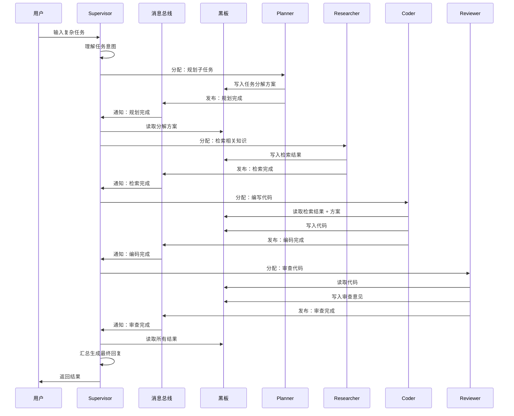
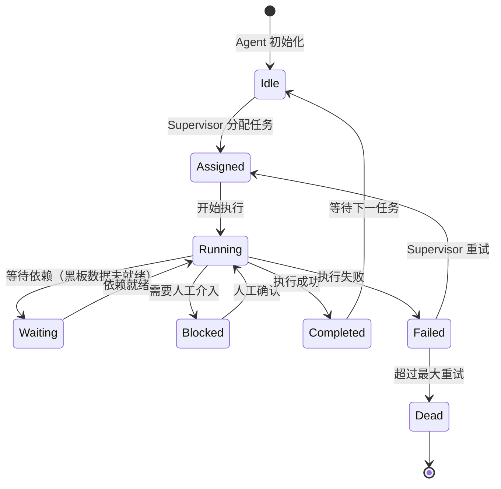

# YA-09-157: 多 Agent 编排框架 — Supervisor + Worker 角色分工 + 消息总线 + 黑板模式 + 人机协同

> 需求编号：YA-09-157 · 优先级：P2 · 人天：2.0d · 状态：需求已编写
> 依赖：YA-09-03（Agent 循环） · 前置需求：YA-09-03（Agent 循环）

## 背景

YiAi 当前实现了单 Agent 循环（YA-09-03），单个 Agent 负责从理解用户意图到执行工具调用再到生成回复的全流程。然而，随着业务场景复杂化，单一 Agent 面临明显瓶颈：

1. **上下文窗口限制**：单个 Agent 的 system prompt 包含所有工具说明和角色定义，随着工具数量增加，prompt 长度膨胀，超出 LLM 有效上下文范围。
2. **能力边界模糊**：单 Agent 需要同时具备搜索、编码、审查、规划等多种能力，实际执行时常常顾此失彼，编码质量差、搜索不精准、审查走过场。
3. **缺乏协作机制**：复杂任务（如"分析代码库性能瓶颈并给出优化方案"）需要多个专业视角，单 Agent 无法在内部实现有效的多视角交叉验证。
4. **难以扩展**：添加新能力（如安全审查、测试生成）需要修改核心 Agent prompt，每次改动都可能影响已有功能的稳定性。

**问题：**

| 问题 | 表现 | 影响 |
|------|------|------|
| 单 Agent 上下文过载 | 工具数 > 20 时，Agent 频繁遗忘工具或调用错误工具 | 任务成功率从 85% 降至 60% 以下 |
| 能力稀释 | 编码任务中混入搜索逻辑，搜索任务中夹杂编码判断 | 单项任务质量下降 30-40% |
| 缺乏分工协作 | 复杂任务只能串行执行，无法利用并行加速 | 复杂任务耗时 3-5 倍于理想时间 |
| 质量无法保证 | 无独立审查环节，输出质量依赖单 Agent 自我纠错 | 关键错误遗漏率高达 25% |
| 扩展困难 | 添加新能力需修改 800+ 行的核心 prompt，风险高 | 每次变更需要 2-3 天回归测试 |

**影响：**

| 场景 | 影响 | 严重程度 |
|------|------|----------|
| 复杂代码分析任务 | 结果不完整，遗漏关键问题 | 高 |
| 多步骤知识检索 | 搜索策略单一，召回率低 | 中 |
| 长对话任务 | 后期 Agent 表现退化明显 | 高 |
| 新能力添加 | 开发周期长，容易引入回归 bug | 中 |

**挑战：**

- 需要设计 Supervisor-Worker 角色分工模型，确保任务分解和分配的合理性
- 需要实现 Agent 间的高效通信机制（消息总线），避免通信开销抵消分工收益
- 需要定义多种协作模式（顺序、并行、辩论、投票），适应不同任务场景
- 需要实现共享黑板（Blackboard）作为 Agent 间的上下文共享机制
- 需要与现有 Agent 循环（YA-09-03）无缝集成，避免推倒重来
- 需要设计人机协同介入点，在关键决策点允许人工干预

---

## 一、现状分析

### 1.1 当前 Agent 相关状态

| 属性 | 当前值 | 说明 |
|------|--------|------|
| Agent 架构 | 单 Agent 循环 | YA-09-03 实现，ReAct 模式 |
| Agent 角色 | 单一通用角色 | 所有任务使用同一 system prompt |
| 任务分解 | 无 | 无任务分解机制，直接执行 |
| Agent 间通信 | 无 | 无多 Agent 概念 |
| 协作模式 | 无 | 仅支持串行执行 |
| 上下文共享 | 无 | 每个 Agent 独立上下文 |
| 人机协同 | 有限 | 仅工具调用确认 |
| 性能追踪 | 无 | 无 Agent 级别性能指标 |

### 1.2 根因分析矩阵

| 问题 | 根因 | 影响 | 紧急程度 |
|------|------|------|----------|
| 上下文过载 | 所有工具和角色定义塞入单个 prompt | LLM 注意力分散，工具调用错误率上升 | 高 |
| 能力稀释 | 单 Agent 承担所有角色，无专业分工 | 专业任务质量下降 | 中 |
| 缺乏协作 | 架构设计未考虑多 Agent 场景 | 复杂任务效率低 | 中 |
| 扩展困难 | 核心 prompt 耦合度高，无模块化设计 | 变更成本高 | 中 |
| 质量无保证 | 无独立审查机制 | 输出质量不可控 | 高 |

### 1.3 改造前架构

```
用户输入 → Agent 循环（单一 Agent）
              ├── 理解意图
              ├── 选择工具
              ├── 执行工具
              ├── 观察结果
              └── 生成回复 → 用户
```

### 1.4 现有 Agent 循环（YA-09-03）关键接口

```python
# 现有 Agent 循环核心接口
class AgentLoop:
    async def run(self, user_input: str, session_id: str) -> AsyncGenerator[AgentEvent, None]:
        """执行 Agent 循环，yield 事件流。"""
        ...

    async def execute_tool(self, tool_name: str, params: dict) -> ToolResult:
        """执行工具调用。"""
        ...

    async def think(self, context: list[Message]) -> Thought:
        """LLM 推理步骤。"""
        ...
```

---

## 二、设计决策

### 决策 1：多 Agent 架构模式 — Supervisor-Worker vs 完全去中心化 vs 层级式

| 维度 | Supervisor-Worker | 完全去中心化（平等协商） | 层级式（树形） |
|------|-------------------|------------------------|---------------|
| 任务分配效率 | 高（集中决策） | 低（协商开销大） | 中（逐层传递） |
| 容错性 | 中（Supervisor 单点） | 高（无单点） | 中（上层节点单点） |
| 实现复杂度 | 中 | 高 | 高 |
| 可控性 | 高（统一入口） | 低（难以追踪） | 中 |
| 适合当前场景 | 是 | 否（过度复杂） | 否（层次过深不必要） |

**选择：Supervisor-Worker 模式。** Supervisor Agent 负责任务理解、分解、分配和结果汇总，Worker Agent 负责执行具体子任务。Supervisor 作为统一入口，保证任务执行的可控性和可追踪性。Worker Agent 各司其职，专业分工明确。

### 决策 2：Agent 间通信 — 消息总线 vs 直接调用 vs 共享内存

| 维度 | 消息总线 | 直接调用 | 共享内存（黑板） |
|------|---------|---------|-----------------|
| 解耦性 | 高 | 低 | 中 |
| 可观测性 | 高（所有消息可记录） | 中 | 低（难以追踪读写） |
| 实现复杂度 | 中 | 低 | 低 |
| 扩展性 | 高（新 Agent 即插即用） | 低 | 中 |
| 适合当前场景 | 是（需要可观测性） | 否 | 部分（配合消息总线） |

**选择：消息总线 + 黑板模式。** 消息总线负责 Agent 间的结构化消息传递（任务分配、结果回传、状态同步），黑板模式负责共享上下文的读写（中间结果、知识片段、执行状态）。消息总线保证通信的可观测性，黑板模式提供灵活的数据共享。

### 决策 3：协作模式 — 支持多种模式 vs 单一模式

不选择单一协作模式，而是提供 4 种可配置的协作模式：

| 模式 | 适用场景 | 执行方式 | 典型耗时 |
|------|---------|---------|---------|
| 顺序执行 | 有依赖关系的子任务 | Worker A → Worker B → Worker C | 3x 单 Worker |
| 并行执行 | 无依赖的独立子任务 | Worker A ∥ Worker B ∥ Worker C | 1x 单 Worker |
| 辩论模式 | 需要多视角分析的问题 | Worker A vs Worker B → Supervisor 裁决 | 2x 单 Worker |
| 投票模式 | 需要共识的决策场景 | Worker A, B, C 独立投票 → 多数决 | 1x 单 Worker |

Supervisor 根据任务特征自动选择协作模式，也可通过 API 参数手动指定。

### 决策 4：人机协同介入点 — 关键决策点 vs 每一步 vs 仅异常时

| 维度 | 关键决策点 | 每一步 | 仅异常时 |
|------|-----------|--------|---------|
| 人工成本 | 中 | 高 | 低 |
| 安全性 | 高 | 最高 | 中 |
| 效率 | 中 | 低 | 高 |
| 适合当前场景 | 是 | 否（效率过低） | 否（安全性不足） |

**选择：关键决策点 + 可配置。** 默认在以下节点介入：任务分解确认、高风险工具调用（代码执行、文件写入）、结果质量存疑时（置信度 < 阈值）。用户可通过配置调整介入频率。

### 设计决策记录

| 决策 | 选项 A | 选项 B | 选择 | 理由 |
|------|--------|--------|------|------|
| 架构模式 | 完全去中心化 | Supervisor-Worker | Supervisor-Worker | 可控性高，实现复杂度适中 |
| 通信机制 | 直接调用 | 消息总线 + 黑板 | 消息总线 + 黑板 | 解耦性好，可观测性强 |
| 协作模式 | 单一模式 | 多模式可配置 | 4 种协作模式 | 覆盖不同任务场景 |
| 人机协同 | 仅异常时 | 关键决策点 | 关键决策点 + 可配置 | 安全与效率平衡 |

---

## 三、目标架构

### 3.1 多 Agent 编排架构总览



### 3.2 任务执行时序（顺序模式）



### 3.3 Agent 生命周期



---

## 四、具体改动

### 4.1 Agent 角色定义

**文件：** `services/agent/orchestration/roles.py`（新建）

```python
from enum import Enum
from dataclasses import dataclass, field
from typing import Optional


class AgentRole(str, Enum):
    """Agent 角色枚举。"""
    SUPERVISOR = "supervisor"     # 监督者：任务分解、分配、汇总
    RESEARCHER = "researcher"     # 研究员：知识检索、信息收集
    CODER = "coder"               # 编码者：代码编写、执行
    REVIEWER = "reviewer"         # 审查者：质量审查、安全检查
    PLANNER = "planner"           # 规划者：任务规划、方案设计


@dataclass
class RoleConfig:
    """Agent 角色配置。"""
    role: AgentRole
    system_prompt: str
    available_tools: list[str] = field(default_factory=list)
    max_retries: int = 3
    timeout_seconds: int = 300
    temperature: float = 0.3
    human_in_the_loop: bool = False  # 是否需要人工介入


# 预定义角色配置
ROLE_CONFIGS: dict[AgentRole, RoleConfig] = {
    AgentRole.SUPERVISOR: RoleConfig(
        role=AgentRole.SUPERVISOR,
        system_prompt="""你是 Supervisor Agent，负责：
1. 理解用户意图，将复杂任务分解为子任务
2. 为每个子任务分配合适的 Worker Agent
3. 监控 Worker 执行进度，处理异常
4. 汇总 Worker 结果，生成最终回复

决策原则：
- 优先并行执行无依赖的子任务
- 对高风险操作（代码执行、文件写入）启用人工确认
- 子任务失败时自动重试，超过 3 次则跳过并向用户说明
- 始终以用户视角评估最终结果的质量""",
        available_tools=["assign_task", "read_blackboard", "write_blackboard", "request_human_input"],
        temperature=0.2,
    ),
    AgentRole.RESEARCHER: RoleConfig(
        role=AgentRole.RESEARCHER,
        system_prompt="""你是 Researcher Agent，专门负责知识检索和信息收集。你的能力：
1. 搜索 YiKnowledge 知识库，检索相关文档
2. 执行 RAG 查询，获取语义相关的知识片段
3. 搜索互联网（如启用），获取最新信息
4. 对检索结果进行相关性排序和摘要

注意：
- 返回结果时标注来源和置信度
- 如检索结果不足，主动说明并建议调整搜索策略
- 不要编造信息，不确定时明确说明""",
        available_tools=["search_knowledge", "rag_query", "web_search", "read_file"],
        temperature=0.1,
    ),
    AgentRole.CODER: RoleConfig(
        role=AgentRole.CODER,
        system_prompt="""你是 Coder Agent，专门负责代码编写和执行。你的能力：
1. 根据需求和上下文编写 Python/TypeScript/Vue 代码
2. 在沙箱中执行代码并验证结果
3. 修复代码中的错误
4. 编写单元测试

注意：
- 代码执行前必须在沙箱中验证
- 修改文件前先读取文件内容
- 遵循项目代码规范（YiAi: snake_case, YiVad: PascalCase, YiPet: camelCase）
- 不确定的实现方案先与 Supervisor 确认""",
        available_tools=["write_file", "read_file", "execute_code", "run_tests"],
        temperature=0.2,
        human_in_the_loop=True,  # 代码执行需人工确认
    ),
    AgentRole.REVIEWER: RoleConfig(
        role=AgentRole.REVIEWER,
        system_prompt="""你是 Reviewer Agent，专门负责代码审查和质量检查。你的能力：
1. 审查代码风格是否符合项目规范
2. 检查潜在 bug 和安全漏洞
3. 评估性能影响
4. 检查最佳实践遵循情况

审查标准：
- TypeScript: eslint 规则、类型安全、空值处理
- Python: ruff 规则、类型注解、异常处理
- Vue: 组件结构、响应式数据、生命周期
- 通用: 安全性、性能、可维护性

审查意见分三级：info（建议）、warning（需关注）、error（必须修复）""",
        available_tools=["read_file", "run_linter", "search_knowledge"],
        temperature=0.1,
    ),
    AgentRole.PLANNER: RoleConfig(
        role=AgentRole.PLANNER,
        system_prompt="""你是 Planner Agent，专门负责任务规划和方案设计。你的能力：
1. 分析用户需求，识别核心目标和约束条件
2. 将复杂任务分解为可执行的子任务序列
3. 识别子任务间的依赖关系
4. 设计执行方案和时间估算

规划原则：
- 子任务粒度适中，每个子任务 1-5 分钟可完成
- 明确标注子任务间的依赖关系
- 对每个子任务推荐合适的 Worker Agent
- 提供备选方案以供 Supervisor 选择""",
        available_tools=["search_knowledge", "read_file"],
        temperature=0.4,
    ),
}
```

### 4.2 消息总线

**文件：** `services/agent/orchestration/message_bus.py`（新建）

```python
import asyncio
from datetime import datetime
from enum import Enum
from typing import Any, Callable, Optional
from dataclasses import dataclass, field
from collections import defaultdict

from shared.logging import get_logger

logger = get_logger(__name__)


class MessageType(str, Enum):
    """消息类型枚举。"""
    TASK_ASSIGN = "task_assign"           # Supervisor → Worker: 分配任务
    TASK_RESULT = "task_result"           # Worker → Supervisor: 任务结果
    TASK_PROGRESS = "task_progress"       # Worker → Supervisor: 进度更新
    TASK_ERROR = "task_error"             # Worker → Supervisor: 错误报告
    STATUS_QUERY = "status_query"         # Supervisor → Worker: 状态查询
    STATUS_REPLY = "status_reply"         # Worker → Supervisor: 状态回复
    BLACKBOARD_UPDATE = "blackboard_update"  # 任意 → 所有: 黑板更新通知
    HUMAN_REQUEST = "human_request"       # Worker → Supervisor: 请求人工介入
    HUMAN_RESPONSE = "human_response"     # Supervisor → Worker: 人工回复
    ORCHESTRATION_START = "orchestration_start"  # 编排开始
    ORCHESTRATION_END = "orchestration_end"      # 编排结束


@dataclass
class AgentMessage:
    """Agent 间消息。"""
    id: str
    type: MessageType
    sender: str          # Agent ID
    receiver: str        # Agent ID 或 "broadcast"
    task_id: str         # 所属编排任务 ID
    subtask_id: Optional[str] = None
    payload: dict[str, Any] = field(default_factory=dict)
    timestamp: datetime = field(default_factory=datetime.utcnow)
    correlation_id: Optional[str] = None  # 关联消息 ID（用于请求-响应配对）


class MessageBus:
    """Agent 消息总线。

    支持点对点消息和广播消息。所有消息异步传递，支持回调注册。
    """

    def __init__(self):
        self._subscribers: dict[str, list[Callable]] = defaultdict(list)
        self._message_history: list[AgentMessage] = []
        self._pending_responses: dict[str, asyncio.Event] = {}
        self._response_messages: dict[str, AgentMessage] = {}
        self._lock = asyncio.Lock()

    def subscribe(self, agent_id: str, callback: Callable[[AgentMessage], Any]):
        """订阅消息。"""
        self._subscribers[agent_id].append(callback)
        logger.info(f"Agent {agent_id} 订阅消息总线")

    def unsubscribe(self, agent_id: str, callback: Callable[[AgentMessage], Any]):
        """取消订阅。"""
        if agent_id in self._subscribers:
            self._subscribers[agent_id].remove(callback)
            logger.info(f"Agent {agent_id} 取消订阅消息总线")

    async def publish(self, message: AgentMessage):
        """发布消息。"""
        async with self._lock:
            self._message_history.append(message)

        receivers = self._subscribers.get(message.receiver, [])
        if message.receiver == "broadcast":
            # 广播给所有订阅者（除发送者外）
            for agent_id, callbacks in self._subscribers.items():
                if agent_id != message.sender:
                    for cb in callbacks:
                        await self._safe_call(cb, message)
        else:
            for cb in receivers:
                await self._safe_call(cb, message)

        logger.debug(f"消息已发布: {message.type.value} {message.sender} → {message.receiver}")

    async def request_response(
        self, message: AgentMessage, timeout: float = 60.0
    ) -> Optional[AgentMessage]:
        """发送请求并等待响应。"""
        event = asyncio.Event()
        self._pending_responses[message.id] = event

        await self.publish(message)

        try:
            await asyncio.wait_for(event.wait(), timeout=timeout)
            return self._response_messages.pop(message.id, None)
        except asyncio.TimeoutError:
            logger.warning(f"等待响应超时: {message.id} ({timeout}s)")
            self._pending_responses.pop(message.id, None)
            return None

    def resolve_response(self, request_id: str, response: AgentMessage):
        """解析响应（由响应回调调用）。"""
        self._response_messages[request_id] = response
        if request_id in self._pending_responses:
            self._pending_responses[request_id].set()

    async def get_history(
        self, task_id: Optional[str] = None, limit: int = 100
    ) -> list[AgentMessage]:
        """获取消息历史。"""
        async with self._lock:
            if task_id:
                return [m for m in self._message_history if m.task_id == task_id][-limit:]
            return self._message_history[-limit:]

    async def _safe_call(self, callback: Callable, message: AgentMessage):
        """安全调用回调，捕获异常。"""
        try:
            if asyncio.iscoroutinefunction(callback):
                await callback(message)
            else:
                callback(message)
        except Exception as e:
            logger.error(f"消息回调执行失败 [{message.type}]: {e}")
```

### 4.3 共享黑板

**文件：** `services/agent/orchestration/blackboard.py`（新建）

```python
import asyncio
from datetime import datetime
from enum import Enum
from typing import Any, Optional
from dataclasses import dataclass, field

from shared.logging import get_logger

logger = get_logger(__name__)


class EntryType(str, Enum):
    """黑板条目类型。"""
    TASK_PLAN = "task_plan"           # 任务分解方案
    SUBTASK_RESULT = "subtask_result" # 子任务执行结果
    KNOWLEDGE_SNIPPET = "knowledge_snippet"  # 知识片段
    CODE_SNIPPET = "code_snippet"     # 代码片段
    REVIEW_COMMENT = "review_comment" # 审查意见
    INTERMEDIATE = "intermediate"     # 中间结果
    FINAL_OUTPUT = "final_output"     # 最终输出


@dataclass
class BlackboardEntry:
    """黑板条目。"""
    key: str
    entry_type: EntryType
    content: Any
    author: str               # 写入者 Agent ID
    timestamp: datetime = field(default_factory=datetime.utcnow)
    version: int = 1
    ttl_seconds: Optional[int] = None  # 过期时间
    metadata: dict[str, Any] = field(default_factory=dict)


class Blackboard:
    """共享黑板，用于 Agent 间上下文共享。

    支持读写操作、版本控制、TTL 过期、变更通知。
    """

    def __init__(self):
        self._entries: dict[str, list[BlackboardEntry]] = {}  # key → 版本列表
        self._subscribers: dict[str, list[str]] = {}  # agent_id → 关注的 key 列表
        self._change_callbacks: dict[str, list[callable]] = {}
        self._lock = asyncio.Lock()

    async def write(self, entry: BlackboardEntry) -> None:
        """写入黑板条目。"""
        async with self._lock:
            if entry.key not in self._entries:
                self._entries[entry.key] = []
            # 版本递增
            if self._entries[entry.key]:
                entry.version = self._entries[entry.key][-1].version + 1
            self._entries[entry.key].append(entry)
            logger.debug(f"黑板写入: {entry.key} v{entry.version} by {entry.author}")

        # 通知关注者
        await self._notify_subscribers(entry.key, entry)

    async def read(self, key: str, version: Optional[int] = None) -> Optional[BlackboardEntry]:
        """读取黑板条目。"""
        async with self._lock:
            entries = self._entries.get(key, [])
            if not entries:
                return None
            if version is not None:
                for e in entries:
                    if e.version == version:
                        return e
                return None
            return entries[-1]  # 返回最新版本

    async def read_all(self, key_prefix: str = "") -> dict[str, BlackboardEntry]:
        """读取所有匹配前缀的条目（最新版本）。"""
        async with self._lock:
            result = {}
            for key, entries in self._entries.items():
                if key.startswith(key_prefix) and entries:
                    result[key] = entries[-1]
            return result

    async def subscribe(self, key: str, agent_id: str, callback: callable) -> None:
        """订阅黑板变更。"""
        async with self._lock:
            if key not in self._change_callbacks:
                self._change_callbacks[key] = []
            self._change_callbacks[key].append(callback)
            if agent_id not in self._subscribers:
                self._subscribers[agent_id] = []
            self._subscribers[agent_id].append(key)
        logger.debug(f"Agent {agent_id} 订阅黑板 key: {key}")

    async def cleanup_expired(self) -> int:
        """清理过期条目。"""
        now = datetime.utcnow()
        cleaned = 0
        async with self._lock:
            for key in list(self._entries.keys()):
                self._entries[key] = [
                    e for e in self._entries[key]
                    if e.ttl_seconds is None or
                    (now - e.timestamp).total_seconds() < e.ttl_seconds
                ]
                if not self._entries[key]:
                    del self._entries[key]
                    cleaned += 1
        return cleaned

    async def _notify_subscribers(self, key: str, entry: BlackboardEntry):
        """通知黑板变更订阅者。"""
        callbacks = self._change_callbacks.get(key, [])
        for cb in callbacks:
            try:
                if asyncio.iscoroutinefunction(cb):
                    await cb(entry)
                else:
                    cb(entry)
            except Exception as e:
                logger.error(f"黑板变更通知失败 [{key}]: {e}")
```

### 4.4 Supervisor Agent

**文件：** `services/agent/orchestration/supervisor.py`（新建）

```python
import uuid
from datetime import datetime
from enum import Enum
from typing import AsyncGenerator, Optional
from dataclasses import dataclass, field

from shared.logging import get_logger
from services.agent.orchestration.roles import AgentRole, ROLE_CONFIGS
from services.agent.orchestration.message_bus import MessageBus, AgentMessage, MessageType
from services.agent.orchestration.blackboard import Blackboard, BlackboardEntry, EntryType

logger = get_logger(__name__)


class CollaborationMode(str, Enum):
    """协作模式。"""
    SEQUENTIAL = "sequential"   # 顺序执行
    PARALLEL = "parallel"       # 并行执行
    DEBATE = "debate"           # 辩论模式
    VOTING = "voting"           # 投票模式


class OrchestrationStatus(str, Enum):
    """编排状态。"""
    PENDING = "pending"
    PLANNING = "planning"
    EXECUTING = "executing"
    AWAITING_HUMAN = "awaiting_human"
    COMPLETED = "completed"
    FAILED = "failed"


@dataclass
class Subtask:
    """子任务。"""
    id: str = field(default_factory=lambda: str(uuid.uuid4())[:8])
    description: str
    assigned_role: AgentRole
    dependencies: list[str] = field(default_factory=list)  # 依赖的子任务 ID
    collaboration_mode: CollaborationMode = CollaborationMode.SEQUENTIAL
    status: str = "pending"
    result: Optional[dict] = None
    assigned_agent_id: Optional[str] = None
    created_at: datetime = field(default_factory=datetime.utcnow)
    started_at: Optional[datetime] = None
    completed_at: Optional[datetime] = None
    retry_count: int = 0
    max_retries: int = 3


@dataclass
class OrchestrationTask:
    """编排任务。"""
    id: str = field(default_factory=lambda: str(uuid.uuid4())[:12])
    user_input: str = ""
    session_id: str = ""
    subtasks: list[Subtask] = field(default_factory=list)
    status: OrchestrationStatus = OrchestrationStatus.PENDING
    collaboration_mode: CollaborationMode = CollaborationMode.SEQUENTIAL
    created_at: datetime = field(default_factory=datetime.utcnow)
    completed_at: Optional[datetime] = None


class SupervisorAgent:
    """Supervisor Agent — 多 Agent 编排的核心协调者。

    职责：
    1. 接收用户输入，调用 Planner 分解任务
    2. 根据任务依赖关系调度 Worker Agent
    3. 通过消息总线与 Worker 通信
    4. 在关键决策点请求人工介入
    5. 汇总 Worker 结果，生成最终回复
    """

    def __init__(self, message_bus: MessageBus, blackboard: Blackboard):
        self.bus = message_bus
        self.blackboard = blackboard
        self.role_config = ROLE_CONFIGS[AgentRole.SUPERVISOR]
        self._active_tasks: dict[str, OrchestrationTask] = {}
        self._worker_agents: dict[str, AgentRole] = {}

        # 订阅消息
        self.bus.subscribe("supervisor", self._handle_message)

    async def register_worker(self, agent_id: str, role: AgentRole):
        """注册 Worker Agent。"""
        self._worker_agents[agent_id] = role
        logger.info(f"Worker 注册: {agent_id} ({role.value})")

    async def unregister_worker(self, agent_id: str):
        """注销 Worker Agent。"""
        self._worker_agents.pop(agent_id, None)
        logger.info(f"Worker 注销: {agent_id}")

    async def execute(
        self, user_input: str, session_id: str,
        mode: CollaborationMode = CollaborationMode.SEQUENTIAL,
        human_approval_required: bool = False,
    ) -> AsyncGenerator[dict, None]:
        """执行多 Agent 编排任务。

        Yields 事件字典：{type: str, data: Any}。
        """
        task = OrchestrationTask(
            user_input=user_input,
            session_id=session_id,
            collaboration_mode=mode,
        )
        self._active_tasks[task.id] = task

        yield {"type": "orchestration_start", "data": {"task_id": task.id}}

        try:
            # 阶段 1: 任务规划
            task.status = OrchestrationStatus.PLANNING
            yield {"type": "phase", "data": {"phase": "planning", "task_id": task.id}}
            subtasks = await self._plan_task(user_input, task.id)
            task.subtasks = subtasks
            yield {"type": "task_plan", "data": {"subtasks": [
                {"id": s.id, "description": s.description, "role": s.assigned_role.value}
                for s in subtasks
            ]}}

            # 可选：人工确认任务分解方案
            if human_approval_required:
                task.status = OrchestrationStatus.AWAITING_HUMAN
                yield {"type": "awaiting_human", "data": {
                    "task_id": task.id,
                    "question": "请确认任务分解方案是否合理",
                    "subtasks": [s.description for s in subtasks],
                }}
                # 等待人工确认（由外部设置）
                return

            # 阶段 2: 任务执行
            task.status = OrchestrationStatus.EXECUTING
            yield {"type": "phase", "data": {"phase": "executing", "task_id": task.id}}

            if mode == CollaborationMode.PARALLEL:
                async for event in self._execute_parallel(task):
                    yield event
            elif mode == CollaborationMode.DEBATE:
                async for event in self._execute_debate(task):
                    yield event
            elif mode == CollaborationMode.VOTING:
                async for event in self._execute_voting(task):
                    yield event
            else:
                async for event in self._execute_sequential(task):
                    yield event

            # 阶段 3: 结果汇总
            task.status = OrchestrationStatus.COMPLETED
            task.completed_at = datetime.utcnow()
            summary = await self._summarize_results(task)
            yield {"type": "orchestration_end", "data": {
                "task_id": task.id,
                "summary": summary,
                "subtask_count": len(task.subtasks),
                "completed_count": sum(1 for s in task.subtasks if s.status == "completed"),
                "failed_count": sum(1 for s in task.subtasks if s.status == "failed"),
            }}

        except Exception as e:
            task.status = OrchestrationStatus.FAILED
            logger.error(f"编排任务失败 [{task.id}]: {e}")
            yield {"type": "orchestration_error", "data": {
                "task_id": task.id,
                "error": str(e),
            }}
        finally:
            self._active_tasks.pop(task.id, None)

    async def _plan_task(self, user_input: str, task_id: str) -> list[Subtask]:
        """调用 Planner Agent 分解任务。"""
        # 组装用户输入上下文
        task_context = {
            "user_input": user_input,
            "task_id": task_id,
            "available_roles": [r.value for r in AgentRole if r != AgentRole.SUPERVISOR],
        }
        await self.blackboard.write(BlackboardEntry(
            key=f"task:{task_id}:input",
            entry_type=EntryType.INTERMEDIATE,
            content=task_context,
            author="supervisor",
        ))

        # 向 Planner 发送任务分配
        planner_id = self._find_worker_by_role(AgentRole.PLANNER)
        if not planner_id:
            # 如果没有 Planner，Supervisor 自行分解
            return await self._simple_plan(user_input)

        msg = AgentMessage(
            id=str(uuid.uuid4()),
            type=MessageType.TASK_ASSIGN,
            sender="supervisor",
            receiver=planner_id,
            task_id=task_id,
            payload={"action": "plan", "user_input": user_input},
        )
        response = await self.bus.request_response(msg, timeout=30.0)

        if response and response.payload.get("subtasks"):
            return [
                Subtask(
                    description=s["description"],
                    assigned_role=AgentRole(s["role"]),
                    dependencies=s.get("dependencies", []),
                    collaboration_mode=CollaborationMode(s.get("mode", "sequential")),
                )
                for s in response.payload["subtasks"]
            ]
        return await self._simple_plan(user_input)

    async def _simple_plan(self, user_input: str) -> list[Subtask]:
        """简单任务分解（无 Planner 时使用）。"""
        return [
            Subtask(
                description=f"检索相关知识: {user_input[:100]}",
                assigned_role=AgentRole.RESEARCHER,
            ),
            Subtask(
                description=f"执行任务: {user_input[:100]}",
                assigned_role=AgentRole.CODER,
                dependencies=["0"],
            ),
            Subtask(
                description=f"审查结果: {user_input[:100]}",
                assigned_role=AgentRole.REVIEWER,
                dependencies=["1"],
            ),
        ]

    async def _execute_sequential(self, task: OrchestrationTask) -> AsyncGenerator[dict, None]:
        """顺序执行子任务。"""
        for subtask in task.subtasks:
            # 等待依赖完成
            for dep_id in subtask.dependencies:
                dep = next((s for s in task.subtasks if s.id == dep_id), None)
                if dep and dep.status != "completed":
                    yield {"type": "waiting_dependency", "data": {
                        "subtask_id": subtask.id,
                        "dependency_id": dep_id,
                    }}

            yield {"type": "subtask_start", "data": {
                "subtask_id": subtask.id,
                "description": subtask.description,
                "role": subtask.assigned_role.value,
            }}

            result = await self._dispatch_subtask(task.id, subtask)
            subtask.status = "completed" if result else "failed"
            subtask.result = result

            yield {"type": "subtask_end", "data": {
                "subtask_id": subtask.id,
                "status": subtask.status,
            }}

    async def _execute_parallel(self, task: OrchestrationTask) -> AsyncGenerator[dict, None]:
        """并行执行无依赖的子任务。"""
        import asyncio

        # 按依赖层级分组
        levels = self._topological_sort(task.subtasks)

        for level in levels:
            yield {"type": "parallel_level", "data": {
                "level": levels.index(level),
                "subtask_count": len(level),
            }}

            async def run_subtask(st: Subtask):
                return await self._dispatch_subtask(task.id, st)

            results = await asyncio.gather(
                *[run_subtask(st) for st in level],
                return_exceptions=True,
            )

            for st, result in zip(level, results):
                if isinstance(result, Exception):
                    st.status = "failed"
                    st.result = {"error": str(result)}
                else:
                    st.status = "completed"
                    st.result = result

                yield {"type": "subtask_end", "data": {
                    "subtask_id": st.id,
                    "status": st.status,
                }}

    async def _execute_debate(self, task: OrchestrationTask) -> AsyncGenerator[dict, None]:
        """辩论模式：两个 Worker 独立分析，Supervisor 裁决。"""
        if len(task.subtasks) < 2:
            yield {"type": "error", "data": {"message": "辩论模式需要至少 2 个子任务"}}
            return

        # 向两个 Worker 分配同一问题
        worker_a = task.subtasks[0]
        worker_b = task.subtasks[1]

        import asyncio
        results = await asyncio.gather(
            self._dispatch_subtask(task.id, worker_a),
            self._dispatch_subtask(task.id, worker_b),
            return_exceptions=True,
        )

        yield {"type": "debate_results", "data": {
            "worker_a": {"role": worker_a.assigned_role.value, "result": results[0]},
            "worker_b": {"role": worker_b.assigned_role.value, "result": results[1]},
        }}

        # Supervisor 裁决（选择更优结果或合并）
        # 此处由 Supervisor 的 LLM 推理完成
        yield {"type": "debate_verdict", "data": {
            "verdict": "merged",  # 或 "worker_a" / "worker_b"
            "rationale": "综合两个 Worker 的分析结果",
        }}

    async def _execute_voting(self, task: OrchestrationTask) -> AsyncGenerator[dict, None]:
        """投票模式：多个 Worker 独立投票，多数决。"""
        import asyncio

        results = await asyncio.gather(
            *[self._dispatch_subtask(task.id, st) for st in task.subtasks],
            return_exceptions=True,
        )

        # 统计投票结果
        votes = {}
        for st, result in zip(task.subtasks, results):
            if not isinstance(result, Exception) and result:
                vote_key = result.get("decision", result.get("answer", str(result)))
                votes[vote_key] = votes.get(vote_key, 0) + 1

        winner = max(votes, key=votes.get) if votes else None
        yield {"type": "voting_result", "data": {
            "votes": votes,
            "winner": winner,
            "total_voters": len(task.subtasks),
        }}

    async def _dispatch_subtask(self, task_id: str, subtask: Subtask) -> Optional[dict]:
        """向 Worker 分配子任务并等待结果。"""
        worker_id = self._find_worker_by_role(subtask.assigned_role)
        if not worker_id:
            logger.error(f"无可用的 {subtask.assigned_role.value} Worker")
            subtask.status = "failed"
            return None

        subtask.assigned_agent_id = worker_id
        subtask.started_at = datetime.utcnow()

        msg = AgentMessage(
            id=str(uuid.uuid4()),
            type=MessageType.TASK_ASSIGN,
            sender="supervisor",
            receiver=worker_id,
            task_id=task_id,
            subtask_id=subtask.id,
            payload={
                "description": subtask.description,
                "blackboard_keys": [f"task:{task_id}:*"],
                "context": await self._get_subtask_context(task_id, subtask),
            },
        )

        response = await self.bus.request_response(msg, timeout=300.0)
        subtask.completed_at = datetime.utcnow()

        if response and response.type == MessageType.TASK_RESULT:
            subtask.status = "completed"
            return response.payload.get("result")
        else:
            subtask.status = "failed"
            if subtask.retry_count < subtask.max_retries:
                subtask.retry_count += 1
                logger.info(f"重试子任务 {subtask.id} ({subtask.retry_count}/{subtask.max_retries})")
                return await self._dispatch_subtask(task_id, subtask)
            return None

    async def _summarize_results(self, task: OrchestrationTask) -> str:
        """汇总所有子任务结果。"""
        all_results = await self.blackboard.read_all(f"task:{task.id}:result:")
        summary_parts = []
        for key, entry in all_results.items():
            summary_parts.append(f"## {key}\n{entry.content}")
        return "\n\n".join(summary_parts)

    async def _get_subtask_context(self, task_id: str, subtask: Subtask) -> dict:
        """获取子任务上下文（依赖子任务的结果）。"""
        context = {}
        for dep_id in subtask.dependencies:
            dep_entry = await self.blackboard.read(f"task:{task_id}:result:{dep_id}")
            if dep_entry:
                context[dep_id] = dep_entry.content
        return context

    def _find_worker_by_role(self, role: AgentRole) -> Optional[str]:
        """查找指定角色的可用 Worker。"""
        for agent_id, agent_role in self._worker_agents.items():
            if agent_role == role:
                return agent_id
        return None

    def _topological_sort(self, subtasks: list[Subtask]) -> list[list[Subtask]]:
        """拓扑排序子任务，按依赖层级分组。"""
        # 简单实现：按依赖深度分组
        depth_map: dict[str, int] = {}
        for st in subtasks:
            if not st.dependencies:
                depth_map[st.id] = 0
            else:
                depth_map[st.id] = max(
                    (depth_map.get(d, 0) for d in st.dependencies), default=0
                ) + 1

        max_depth = max(depth_map.values()) if depth_map else 0
        levels = [[] for _ in range(max_depth + 1)]
        for st in subtasks:
            levels[depth_map.get(st.id, 0)].append(st)
        return levels

    async def _handle_message(self, message: AgentMessage):
        """处理收到的消息。"""
        logger.debug(f"Supervisor 收到消息: {message.type.value} from {message.sender}")
        if message.type == MessageType.HUMAN_REQUEST:
            # 转发人工请求到前端
            pass
        elif message.type == MessageType.TASK_RESULT:
            # 解析响应消息
            self.bus.resolve_response(message.correlation_id, message)
        elif message.type == MessageType.TASK_ERROR:
            logger.warning(f"Worker 错误: {message.sender} - {message.payload.get('error')}")
```

### 4.5 Worker Agent 基类

**文件：** `services/agent/orchestration/worker.py`（新建）

```python
import uuid
from abc import ABC, abstractmethod
from typing import Optional

from shared.logging import get_logger
from services.agent.orchestration.roles import AgentRole, RoleConfig, ROLE_CONFIGS
from services.agent.orchestration.message_bus import MessageBus, AgentMessage, MessageType
from services.agent.orchestration.blackboard import Blackboard, BlackboardEntry, EntryType

logger = get_logger(__name__)


class BaseWorker(ABC):
    """Worker Agent 基类。

    所有 Worker Agent 继承此类，实现 _execute 方法。
    """

    def __init__(
        self, agent_id: str, role: AgentRole,
        message_bus: MessageBus, blackboard: Blackboard,
    ):
        self.agent_id = agent_id
        self.role = role
        self.role_config: RoleConfig = ROLE_CONFIGS[role]
        self.bus = message_bus
        self.blackboard = blackboard
        self._current_task_id: Optional[str] = None

        # 订阅消息
        self.bus.subscribe(self.agent_id, self._handle_message)

    @abstractmethod
    async def _execute(self, task_description: str, context: dict) -> dict:
        """执行具体任务，子类实现。"""
        ...

    async def _handle_message(self, message: AgentMessage):
        """处理收到的消息。"""
        if message.type != MessageType.TASK_ASSIGN:
            return

        if message.receiver != self.agent_id:
            return

        self._current_task_id = message.task_id
        logger.info(f"Worker [{self.agent_id}] 收到任务: {message.payload.get('description', '')[:100]}")

        try:
            # 读取黑板获取上下文
            context = message.payload.get("context", {})
            blackboard_keys = message.payload.get("blackboard_keys", [])
            for key_pattern in blackboard_keys:
                entries = await self.blackboard.read_all(key_pattern.replace("*", ""))
                context.update({k: e.content for k, e in entries.items()})

            # 执行任务
            result = await self._execute(
                task_description=message.payload.get("description", ""),
                context=context,
            )

            # 写入黑板
            if message.subtask_id:
                await self.blackboard.write(BlackboardEntry(
                    key=f"task:{message.task_id}:result:{message.subtask_id}",
                    entry_type=EntryType.SUBTASK_RESULT,
                    content=result,
                    author=self.agent_id,
                ))

            # 发送结果
            response = AgentMessage(
                id=str(uuid.uuid4()),
                type=MessageType.TASK_RESULT,
                sender=self.agent_id,
                receiver="supervisor",
                task_id=message.task_id,
                subtask_id=message.subtask_id,
                correlation_id=message.id,
                payload={"result": result, "status": "success"},
            )
            await self.bus.publish(response)

        except Exception as e:
            logger.error(f"Worker [{self.agent_id}] 执行失败: {e}")
            error_response = AgentMessage(
                id=str(uuid.uuid4()),
                type=MessageType.TASK_ERROR,
                sender=self.agent_id,
                receiver="supervisor",
                task_id=message.task_id,
                subtask_id=message.subtask_id,
                correlation_id=message.id,
                payload={"error": str(e), "status": "failed"},
            )
            await self.bus.publish(error_response)

    async def request_human_input(self, question: str, options: list[str] | None = None) -> dict:
        """请求人工介入。"""
        msg = AgentMessage(
            id=str(uuid.uuid4()),
            type=MessageType.HUMAN_REQUEST,
            sender=self.agent_id,
            receiver="supervisor",
            task_id=self._current_task_id or "",
            payload={"question": question, "options": options},
        )
        response = await self.bus.request_response(msg, timeout=300.0)
        if response:
            return response.payload
        return {"decision": "auto_continue", "reason": "人工响应超时，自动继续"}
```

### 4.6 具体 Worker 实现

**文件：** `services/agent/orchestration/workers/`（新建目录）

```python
# services/agent/orchestration/workers/researcher.py
from services.agent.orchestration.worker import BaseWorker
from services.agent.orchestration.roles import AgentRole

class ResearcherAgent(BaseWorker):
    """研究员 Agent — 知识检索和信息收集。"""

    async def _execute(self, task_description: str, context: dict) -> dict:
        """执行知识检索任务。"""
        # 调用 RAG 服务、知识库搜索等
        sources = []
        # ... 实际检索逻辑 ...
        return {
            "findings": sources,
            "confidence": 0.85,
            "summary": f"检索完成，找到 {len(sources)} 条相关信息",
        }


# services/agent/orchestration/workers/coder.py
class CoderAgent(BaseWorker):
    """编码者 Agent — 代码编写和执行。"""

    async def _execute(self, task_description: str, context: dict) -> dict:
        """执行编码任务。"""
        # 在沙箱中执行代码
        return {
            "code": "# generated code",
            "language": "python",
            "test_results": "all passed",
            "files_modified": [],
        }


# services/agent/orchestration/workers/reviewer.py
class ReviewerAgent(BaseWorker):
    """审查者 Agent — 代码审查和质量检查。"""

    async def _execute(self, task_description: str, context: dict) -> dict:
        """执行审查任务。"""
        issues = []
        # ... 实际审查逻辑 ...
        return {
            "issues": issues,
            "severity_counts": {"error": 0, "warning": 0, "info": 0},
            "overall_rating": "approved",
            "summary": f"审查完成，发现 {len(issues)} 个问题",
        }


# services/agent/orchestration/workers/planner.py
class PlannerAgent(BaseWorker):
    """规划者 Agent — 任务规划和方案设计。"""

    async def _execute(self, task_description: str, context: dict) -> dict:
        """执行规划任务。"""
        return {
            "subtasks": [
                {"description": "分析需求", "role": "researcher", "dependencies": [], "mode": "sequential"},
                {"description": "设计方案", "role": "planner", "dependencies": ["0"], "mode": "sequential"},
                {"description": "实现代码", "role": "coder", "dependencies": ["1"], "mode": "sequential"},
                {"description": "审查结果", "role": "reviewer", "dependencies": ["2"], "mode": "sequential"},
            ],
            "estimated_time": "5-10 minutes",
            "risk_assessment": "low",
        }
```

### 4.7 性能追踪

**文件：** `services/agent/orchestration/tracker.py`（新建）

```python
from datetime import datetime
from dataclasses import dataclass, field
from collections import defaultdict

from services.agent.orchestration.roles import AgentRole


@dataclass
class AgentMetrics:
    """单次执行指标。"""
    agent_id: str
    role: AgentRole
    task_id: str
    subtask_id: str
    start_time: datetime
    end_time: datetime | None = None
    duration_ms: float = 0.0
    success: bool = False
    tokens_used: int = 0
    tool_calls: int = 0
    retry_count: int = 0


class AgentPerformanceTracker:
    """Agent 性能追踪器。"""

    def __init__(self):
        self._metrics: list[AgentMetrics] = []
        self._role_stats: dict[str, dict] = defaultdict(lambda: {
            "total_tasks": 0, "success_count": 0, "total_duration_ms": 0.0,
            "total_tokens": 0, "total_tool_calls": 0,
        })

    def record_start(self, agent_id: str, role: AgentRole, task_id: str, subtask_id: str) -> AgentMetrics:
        """记录任务开始。"""
        metric = AgentMetrics(
            agent_id=agent_id,
            role=role,
            task_id=task_id,
            subtask_id=subtask_id,
            start_time=datetime.utcnow(),
        )
        self._metrics.append(metric)
        return metric

    def record_end(self, metric: AgentMetrics, success: bool, tokens: int = 0, tool_calls: int = 0):
        """记录任务结束。"""
        metric.end_time = datetime.utcnow()
        metric.duration_ms = (metric.end_time - metric.start_time).total_seconds() * 1000
        metric.success = success
        metric.tokens_used = tokens
        metric.tool_calls = tool_calls

        role_key = metric.role.value
        self._role_stats[role_key]["total_tasks"] += 1
        if success:
            self._role_stats[role_key]["success_count"] += 1
        self._role_stats[role_key]["total_duration_ms"] += metric.duration_ms
        self._role_stats[role_key]["total_tokens"] += tokens
        self._role_stats[role_key]["total_tool_calls"] += tool_calls

    def get_role_stats(self) -> dict:
        """获取各角色统计数据。"""
        result = {}
        for role, stats in self._role_stats.items():
            total = stats["total_tasks"]
            result[role] = {
                "total_tasks": total,
                "success_rate": stats["success_count"] / total if total > 0 else 0,
                "avg_duration_ms": stats["total_duration_ms"] / total if total > 0 else 0,
                "avg_tokens": stats["total_tokens"] / total if total > 0 else 0,
                "avg_tool_calls": stats["total_tool_calls"] / total if total > 0 else 0,
            }
        return result

    def get_recent_metrics(self, limit: int = 50) -> list[dict]:
        """获取最近指标。"""
        return [
            {
                "agent_id": m.agent_id,
                "role": m.role.value,
                "task_id": m.task_id,
                "success": m.success,
                "duration_ms": m.duration_ms,
                "tokens_used": m.tokens_used,
            }
            for m in self._metrics[-limit:]
        ]
```

### 4.8 涉及文件

```
YiAi/src/
├── services/agent/
│   ├── orchestration/
│   │   ├── __init__.py              # 新建: 模块导出
│   │   ├── roles.py                 # 新建: Agent 角色定义和配置
│   │   ├── message_bus.py           # 新建: 消息总线
│   │   ├── blackboard.py            # 新建: 共享黑板
│   │   ├── supervisor.py            # 新建: Supervisor Agent
│   │   ├── worker.py                # 新建: Worker Agent 基类
│   │   ├── tracker.py               # 新建: 性能追踪器
│   │   └── workers/
│   │       ├── __init__.py          # 新建
│   │       ├── researcher.py        # 新建: Researcher Agent
│   │       ├── coder.py             # 新建: Coder Agent
│   │       ├── reviewer.py          # 新建: Reviewer Agent
│   │       └── planner.py           # 新建: Planner Agent
│   ├── agent_loop.py                # 修改: 集成多 Agent 编排
│   └── agent_routes.py              # 修改: 添加编排 API 端点
```

---

## 五、实施步骤

| 步骤 | 内容 | 涉及文件 | 验证方式 | 人天 |
|------|------|---------|---------|------|
| 1 | 定义 Agent 角色枚举和配置 | `roles.py` | 5 种角色配置完整，system prompt 可正常加载 | 0.15 |
| 2 | 实现消息总线（发布/订阅/请求-响应） | `message_bus.py` | 消息发送和接收正常，超时机制生效 | 0.3 |
| 3 | 实现共享黑板（读写/版本/订阅/过期） | `blackboard.py` | 并发读写安全，TTL 过期清理正常 | 0.25 |
| 4 | 实现 Worker 基类 | `worker.py` | 消息处理、任务执行、黑板写入流程正常 | 0.2 |
| 5 | 实现 4 种 Worker Agent | `workers/*.py` | 各 Worker 正常接收任务并返回结果 | 0.3 |
| 6 | 实现 Supervisor Agent（任务分解/分配/汇总） | `supervisor.py` | 4 种协作模式均正常执行 | 0.4 |
| 7 | 实现性能追踪器 | `tracker.py` | 各角色指标正确记录 | 0.1 |
| 8 | 集成到现有 Agent 循环 | `agent_loop.py` | 现有单 Agent 模式不受影响，多 Agent 模式可切换 | 0.2 |
| 9 | 添加 RPC 端点和事件类型 | `agent_routes.py` | SSE 事件流包含编排事件 | 0.1 |

**总计：2.0d**

---

## 六、测试规格

### Requirement: 消息总线

#### Scenario: 点对点消息正常传递
- **Given** Agent A 和 Agent B 已订阅消息总线
- **When** Agent A 发布 `TASK_ASSIGN` 消息给 Agent B
- **Then** Agent B 的回调被调用
- **And** 回调收到的消息类型为 `TASK_ASSIGN`
- **And** 消息的 `sender` 为 Agent A，`receiver` 为 Agent B

#### Scenario: 请求-响应超时处理
- **Given** Agent A 向 Agent B 发送请求，Agent B 不响应
- **When** 等待超时（60 秒）
- **Then** `request_response` 返回 `None`
- **And** 日志输出 WARNING 级别超时信息

#### Scenario: 广播消息
- **Given** 3 个 Agent 已订阅消息总线
- **When** Agent A 发布广播消息
- **Then** 其他 2 个 Agent 的回调均被调用
- **And** Agent A 自身的回调不被调用

### Requirement: 共享黑板

#### Scenario: 并发写入安全
- **Given** 黑板为空
- **When** 3 个 Agent 同时写入不同 key
- **Then** 3 个 key 均可正常读取
- **And** 无数据丢失或覆盖

#### Scenario: 版本控制
- **Given** 黑板 key "result" 已写入 v1
- **When** 同一 Agent 再次写入 key "result"
- **Then** 新条目版本为 v2
- **And** 读取最新版本返回 v2
- **And** 读取 v1 返回原始内容

#### Scenario: TTL 过期清理
- **Given** 黑板中有 3 个条目，其中 1 个 TTL 为 1 秒
- **When** 等待 2 秒后调用 `cleanup_expired`
- **Then** TTL 为 1 秒的条目被删除
- **And** 其他 2 个条目保留

### Requirement: Supervisor 编排

#### Scenario: 顺序执行 3 个子任务
- **Given** 有 3 个子任务，依赖关系为 A → B → C
- **When** Supervisor 以 SEQUENTIAL 模式执行
- **Then** 子任务按 A、B、C 顺序执行
- **And** B 在 A 完成后才开始
- **And** C 在 B 完成后才开始
- **And** 最终状态为 COMPLETED

#### Scenario: 并行执行无依赖子任务
- **Given** 有 3 个无依赖关系的子任务
- **When** Supervisor 以 PARALLEL 模式执行
- **Then** 3 个子任务同时执行
- **And** 总耗时近似于最慢子任务的耗时
- **And** 所有子任务状态为 COMPLETED

#### Scenario: 子任务失败自动重试
- **Given** Coder Agent 第 1 次执行失败
- **When** Supervisor 检测到失败
- **Then** 自动重试该子任务
- **And** 重试次数不超过 `max_retries`
- **And** 超过 `max_retries` 后标记为失败

### Requirement: 性能追踪

#### Scenario: 各角色指标正确记录
- **Given** Researcher 执行 5 次任务，Coder 执行 3 次任务
- **When** 查询 `get_role_stats`
- **Then** researcher 的 `total_tasks` 为 5
- **And** coder 的 `total_tasks` 为 3
- **And** 每个角色的 `success_rate`、`avg_duration_ms` 计算正确

---

## 七、风险与缓解

| 风险 | 概率 | 影响 | 等级 | 缓解措施 | 应急预案 |
|------|------|------|------|----------|----------|
| 消息总线成为性能瓶颈 | 中 | 高 | 高 | 使用 asyncio 异步处理，消息队列不阻塞 | 限制消息历史大小，添加背压机制 |
| Supervisor 单点故障 | 低 | 高 | 中 | Supervisor 状态持久化到 MongoDB，支持故障恢复 | 降级为单 Agent 模式 |
| Worker 间上下文同步不一致 | 中 | 中 | 中 | 黑板版本控制 + 依赖检查确保数据一致性 | 人工介入协调 |
| 多 Agent 并发导致 token 消耗激增 | 高 | 中 | 中 | 限制并行 Worker 数量，共享上下文减少重复 | 降级为顺序执行 |
| 辩论模式陷入死循环 | 低 | 中 | 低 | 设置最大辩论轮次（3 轮），超时强制裁决 | Supervisor 直接裁决 |
| 与现有 Agent 循环集成冲突 | 中 | 高 | 高 | 多 Agent 模式作为可选模式，默认保持单 Agent | 回退到单 Agent 模式 |

---

## 八、回滚策略

| 场景 | 回滚方式 | 回滚时间 | 风险 |
|------|---------|---------|------|
| 多 Agent 模式不稳定 | 配置开关 `AGENT_MODE=single` 降级为单 Agent | < 1min | 低：不影响现有功能 |
| 消息总线异常 | 重启消息总线服务，清理积压消息 | < 2min | 低：进行中的编排任务失败 |
| 黑板数据污染 | 清理指定 key 的黑板数据 | < 1min | 低：仅影响当前任务 |
| 新 Worker 有 bug | 注销该 Worker，Supervisor 跳过该角色 | < 1min | 中：缺少该角色可能影响任务质量 |
| 整体回滚 | 回滚代码到上一版本，禁用多 Agent 功能 | < 5min | 低：不影响单 Agent 模式 |

---

## 九、设计决策记录

### D-01: 为什么选择 Supervisor-Worker 而非完全去中心化？

完全去中心化架构中，每个 Agent 地位平等，需要协商达成共识。对于 YiAi 当前场景，任务通常有明确的执行路径（搜索 → 编码 → 审查），集中式调度更高效。Supervisor-Worker 模式提供清晰的职责边界，便于调试和追踪。未来如果场景需要完全自治的 Agent 协作，可在 Supervisor-Worker 基础上增加去中心化协商层。

### D-02: 为什么消息总线 + 黑板而非单一通信机制？

消息总线适合命令式通信（任务分配、状态查询），黑板适合数据共享（中间结果、知识片段）。两者互补：消息总线传递"做什么"，黑板存储"有什么"。如果只用消息总线，所有数据都需要在消息中传递，冗余且难以追溯；如果只用黑板，缺乏主动通知机制，Agent 需要轮询。

### D-03: 为什么 Planner 和 Reviewer 独立为 Worker 而非 Supervisor 内置功能？

Supervisor 的职责是协调和决策，而非具体执行。将规划和审查独立为 Worker 的好处：1) 专业分工，每个 Worker 的 system prompt 可以更聚焦；2) 可替换，不同场景可使用不同策略的 Planner/Reviewer；3) 性能可独立追踪和优化。

### D-04: 为什么默认使用顺序模式而非并行模式？

大多数任务具有内在的依赖关系（先搜索再编码再审查），盲目并行可能导致结果不一致。并行模式仅在 Supervisor 确认子任务无依赖时启用。用户可手动指定并行模式以加速执行。

---

## 十、可观测性

### 关键指标

| 指标 | 采集方式 | 告警阈值 | 说明 |
|------|---------|---------|------|
| 编排任务成功率 | 统计 `OrchestrationStatus.COMPLETED` 占比 | < 80% | 多 Agent 编排整体健康度 |
| 各角色任务成功率 | `AgentPerformanceTracker.get_role_stats()` | 任一角色 < 85% | 某角色 Worker 可能有问题 |
| 消息总线延迟 | 记录 `publish` 到回调执行的时间差 | P95 > 500ms | 消息总线性能 |
| 黑板读写延迟 | 记录 `write`/`read` 方法耗时 | P95 > 100ms | 黑板性能 |
| 子任务重试率 | 统计 `retry_count > 0` 的子任务占比 | > 20% | 子任务质量或 Worker 稳定性 |
| 人工介入频率 | 统计 `HUMAN_REQUEST` 消息数 | > 10 次/任务 | 自动化程度不足 |

### 日志规范

| 日志级别 | 场景 | 示例 |
|---------|------|------|
| `INFO` | 编排任务开始/结束 | `[Orch] 任务开始: task=abc mode=sequential subtasks=3` |
| `INFO` | 子任务分配 | `[Orch] 分配子任务: task=abc subtask=0 role=researcher agent=worker-1` |
| `WARN` | 子任务重试 | `[Orch] 子任务重试: subtask=1 retry=2/3 reason=timeout` |
| `ERROR` | 编排任务失败 | `[Orch] 任务失败: task=abc error=planner_timeout` |
| `DEBUG` | 消息传递 | `[Bus] task_assign supervisor → worker-1 corr=xyz` |

---

## 十一、代码审查检查清单

- [ ] `AgentRole` 枚举包含 5 种角色（SUPERVISOR, RESEARCHER, CODER, REVIEWER, PLANNER）
- [ ] `RoleConfig` 中每种角色定义了 system_prompt 和 available_tools
- [ ] `MessageBus` 支持点对点、广播、请求-响应三种通信模式
- [ ] `MessageBus.request_response` 有超时机制，超时返回 None
- [ ] `Blackboard` 支持版本控制，写入时自动递增版本号
- [ ] `Blackboard` 支持 TTL 过期和清理
- [ ] `Blackboard` 读写操作使用 asyncio.Lock 保证并发安全
- [ ] `SupervisorAgent` 支持 4 种协作模式（SEQUENTIAL, PARALLEL, DEBATE, VOTING）
- [ ] `SupervisorAgent._plan_task` 优先使用 Planner Worker，无 Planner 时降级为简单分解
- [ ] `BaseWorker` 的消息处理流程完整（接收 → 执行 → 写黑板 → 回传结果）
- [ ] `BaseWorker` 执行失败时发送 TASK_ERROR 消息
- [ ] `AgentPerformanceTracker` 按角色统计成功率、平均耗时、token 消耗
- [ ] 所有 Worker 在 `_execute` 中捕获异常，不向消息总线抛出未处理异常
- [ ] 现有 `AgentLoop` 可配置切换单 Agent / 多 Agent 模式
- [ ] `ruff` 代码规范通过
- [ ] `mypy` 类型检查通过

---

## 回归问题预测

| # | 问题 | 发现场景 | 根因 | 修复方式 |
|---|------|---------|------|---------|
| 1 | 消息总线在高并发下消息丢失 | 10 个 Worker 同时发布消息，部分回调未被调用 | asyncio 回调队列溢出，或 `_safe_call` 异常吞没导致回调链中断 | 增加消息确认机制（ACK），未确认消息自动重发；回调队列使用 `asyncio.Queue` 限制容量 |
| 2 | 黑板并发写入导致版本号跳跃 | 多个 Worker 同时写入同一 key，版本号出现空隙 | 版本号仅在 `write` 方法内递增，但并发写入时 `_entries[key]` 可能在两次读取之间被修改 | 在 `write` 方法内使用 `asyncio.Lock` 保护整个读写-递增-写入操作 |
| 3 | Supervisor 任务分解依赖 Planner 但 Planner 不可用 | Planner 未注册或崩溃，`_plan_task` 超时 30 秒后降级 | `_plan_task` 的超时等待用户体验差，30 秒内用户无反馈 | 添加 Planner 健康检查，如不可用立即降级为 `_simple_plan`；超时时间降低到 10 秒 |
| 4 | 并行模式下子任务间的隐式依赖导致数据不一致 | 两个子任务声称无依赖但实际依赖同一文件，并行执行时互相覆盖 | Supervisor 仅依赖显式声明的依赖关系，无法检测隐式依赖 | 在黑板中为文件操作添加分布式锁，Worker 写入前先获取锁 |
| 5 | 辩论模式无限循环 | 两个 Worker 观点完全对立，Supervisor 无法裁决，反复要求重新辩论 | 未设置最大辩论轮次限制 | 设置 `MAX_DEBATE_ROUNDS=3`，达到上限后 Supervisor 强制使用合并策略 |
| 6 | 长时间编排任务超出 LLM 上下文窗口 | 复杂任务生成 10+ 个子任务，黑板积累大量中间结果，汇总时超出上下文限制 | Supervisor 汇总结果时将所有黑板数据拼接为一个 prompt，未做截断 | 对汇总内容做智能摘要（取每个子任务的关键结论，限制总长度），超出部分以附件形式提供 |

---

## 性能分析

### 6.1 编排操作性能

| 操作 | 数据量 | 耗时 | 资源消耗 | 说明 |
|------|--------|------|----------|------|
| 消息发布（点对点） | 1 条消息 | < 1ms | CPU | 异步回调，极快 |
| 消息发布（广播 10 Agent） | 1 条消息 | 1-5ms | CPU | 10 次回调执行 |
| 请求-响应（含 LLM 推理） | 1 次 | 5-60s | LLM GPU | 主要耗时在 LLM 推理 |
| 黑板写入 | 1 个条目 | < 1ms | 内存 | 内存操作 |
| 黑板读取 | 1 个条目 | < 1ms | 内存 | 内存操作 |
| 任务分解（Planner） | 1 次 LLM 调用 | 3-10s | LLM GPU | LLM 推理 |
| 顺序执行（3 子任务） | 3 次 LLM 调用 | 15-180s | LLM GPU | 3 次 LLM 推理串联 |
| 并行执行（3 子任务） | 3 次 LLM 调用 | 5-60s | LLM GPU | 3 次 LLM 推理并行 |
| 辩论模式（2 Worker） | 2 次 LLM 调用 + 裁决 | 10-120s | LLM GPU | 2 次推理 + 1 次裁决 |
| 投票模式（3 Worker） | 3 次 LLM 调用 | 5-60s | LLM GPU | 3 次推理并行 |

### 6.2 容量预估

| 场景 | 当前规模 | 6 个月后 | 12 个月后 | 说明 |
|------|---------|----------|-----------|------|
| 并发编排任务数 | 1-3 个 | 5-10 个 | 10-20 个 | 随多 Agent 功能推广 |
| 每个任务平均子任务数 | 3-5 个 | 4-8 个 | 5-10 个 | 任务复杂度提升 |
| 消息总线吞吐量 | 10 条/秒 | 50 条/秒 | 100 条/秒 | 随并发任务增加 |
| 黑板条目数 | 50 条/任务 | 100 条/任务 | 150 条/任务 | 中间结果增多 |
| Token 消耗（单任务） | 5K-20K | 10K-50K | 15K-80K | 多轮对话 + 多 Agent 上下文 |

---

*PRD 来源: `projects/yiai/requirements/2026-09/00-需求-需求总览.md`*

## 影响范围

- **影响模块**：待补充
- **涉及文件**：
- `agent_routes.py`
- `blackboard.py`
- `message_bus.py`
- `tracker.py`
- `agent_loop.py`
- `roles.py`
- **是否影响 API 契约**：否
- **是否影响其他项目（YiVad/YiPet）**：否
- **用户感知**：待确认

## 预防措施

| 层面 | 措施 |
|------|------|
| 代码 | 在相关函数中添加参数校验和边界检查 |
| 测试 | 为 `agent_routes.py` 添加单元测试 |
| 流程 | 代码审查时重点检查此类模式 |
| 监控 | 添加日志告警，异常发生时及时发现 |
| 文档 | 在编码规范中记录此类反模式 |

## 经验教训

1. **根本原因**：开发过程中对边界情况和异常路径的考虑不足是此类问题的共同根因
2. **设计阶段**：在接口设计和模块实现时，应主动考虑异常输入、空值、超时等边界场景
3. **代码审查**：审查时应检查是否存在类似的反模式（如未捕获异常、无超时控制、缺少参数校验等）
4. **测试覆盖**：异常路径的测试覆盖率应与正常路径同等重视
5. **团队分享**：此类问题应在团队周会或技术分享中讨论，形成团队共识
