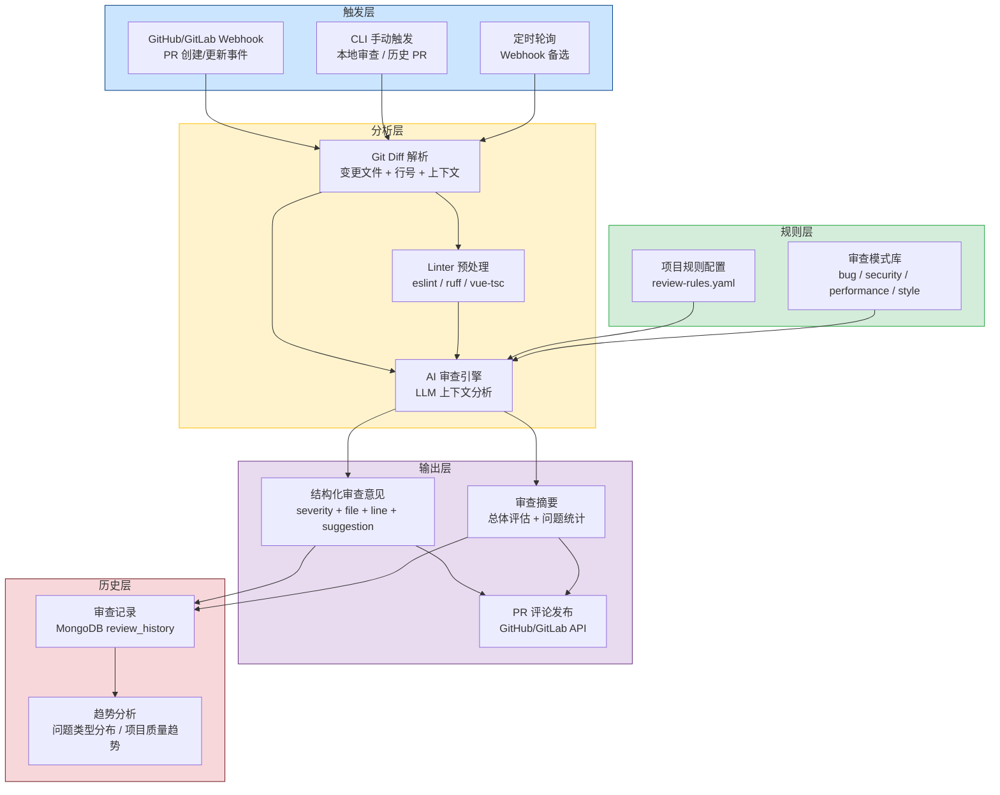
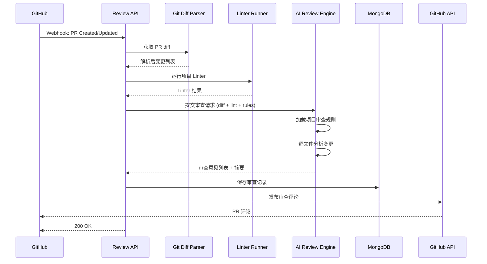
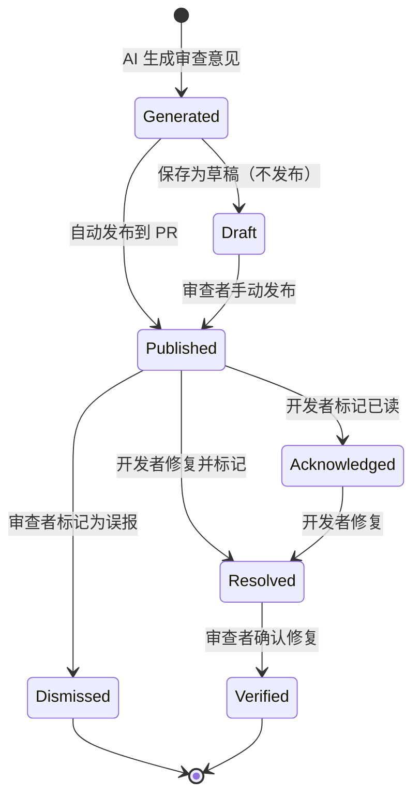

# YA-09-159: 代码审查自动化 — AI 驱动 PR 审查 + 多语言规则 + 严重度分级 + GitHub 集成

> 需求编号：YA-09-159 · 优先级：P2 · 人天：0.5d · 状态：需求已编写
> 依赖：YA-09-03（Agent 循环）、YA-09-157（多 Agent 编排框架） · 前置需求：无

## 背景

YiAi 作为 YrY 单体仓库的核心后端，同时服务于 YiVad（Vue 3.5）、YiPet（Chrome MV3 扩展）和自身（Python FastAPI）三个项目。每个项目都有独立的代码仓库和 PR 流程。目前，代码审查完全依赖人工，存在以下问题：

**问题：**

1. **审查效率低**：人工审查每个 PR 需要 15-30 分钟，每天 3-5 个 PR 消耗 1-2 小时。
2. **审查标准不统一**：不同审查者对代码风格、安全规范、最佳实践的理解不一致，同一段代码可能得到不同评价。
3. **低级错误遗漏**：拼写错误、空值处理缺失、类型注解遗漏等低级问题经常被忽略。
4. **缺乏审查历史**：无系统化的审查记录，无法追踪审查趋势和常见问题模式。
5. **跨语言审查困难**：YiVad（TypeScript/Vue）、YiPet（TypeScript/Vue）、YiAi（Python）三个项目的代码风格和最佳实践差异大，审查者难以全面掌握。

**影响：**

| 场景 | 影响 | 严重程度 |
|------|------|----------|
| 低级错误流入主分支 | 增加后续修复成本，影响代码质量 | 高 |
| 审查延迟导致 PR 堆积 | 开发效率下降，合并冲突增多 | 中 |
| 安全漏洞被忽略 | 潜在安全风险 | 高 |
| 代码风格不统一 | 代码可维护性下降 | 中 |
| 审查者疲劳 | 审查质量随时间下降，后审查的 PR 质量低于先审查的 | 中 |

**挑战：**

- 需要支持 TypeScript（eslint 规则）、Python（ruff 规则）和 Vue（组件最佳实践）三种语言/框架的审查
- 需要从 Git diff 中提取变更文件列表和具体变更行
- 需要生成结构化审查意见（严重度、文件、行号、建议）
- 需要与 GitHub/GitLab PR 工作流集成（Webhook 触发、评论发布）
- 需要可配置的审查规则，不同项目可能有不同的审查重点
- 审查速度和准确性需要平衡（AI 审查不能比人工审查更慢）

---

## 一、现状分析

### 1.1 当前代码审查状态

| 属性 | 当前值 | 说明 |
|------|--------|------|
| 自动化审查 | 无 | 完全依赖人工审查 |
| 审查规则 | 无系统化规则 | 依赖审查者个人经验 |
| CI/CD 集成 | 无 | 无自动化审查流水线 |
| 审查历史 | 无 | 审查意见仅在 PR 评论中，无法检索 |
| 审查趋势 | 无 | 无法统计审查数据和问题趋势 |
| 跨项目审查 | 人工 | 审查者需要切换不同项目的代码规范 |

### 1.2 根因分析矩阵

| 问题 | 根因 | 影响 | 紧急程度 |
|------|------|------|----------|
| 审查效率低 | 无自动化工具辅助 | 人工审查耗时过长 | 高 |
| 标准不统一 | 无系统化审查规则 | 审查质量不一致 | 中 |
| 低级错误遗漏 | 人工审查注意力有限 | 代码质量下降 | 高 |
| 缺乏历史 | 未建立审查记录系统 | 无法改进审查流程 | 中 |
| 跨语言困难 | 审查者知识覆盖不全 | 跨项目审查质量低 | 中 |

### 1.3 改造前流程

```
开发者提交 PR → 人工审查者自行阅读 diff → 手动添加评论 → 人工判断是否通过
                                                  ↓
                                         依赖个人经验，无系统化辅助
```

### 1.4 审查项目清单

| 项目 | 语言 | 框架 | 主要审查关注点 |
|------|------|------|-------------|
| YiVad | TypeScript 5.x | Vue 3.5 | 组件结构、响应式数据、ProTable 规范、v-auth 权限、Pinia store |
| YiPet | TypeScript 5.x | Vue 3 + Chrome MV3 | 双世界边界、ApiClient 分层、chrome.storage 使用、content/service worker 隔离 |
| YiAi | Python 3.10+ | FastAPI | 类型注解、RPC 信封规范、异常处理、MongoDB 聚合管道、Ollama 集成 |

---

## 二、设计决策

### 决策 1：审查方式 — 纯脚本分析 vs AI 驱动 vs 混合模式

| 维度 | 纯脚本分析（Linter） | AI 驱动 | 混合模式（Linter + AI） |
|------|---------------------|---------|------------------------|
| 检测覆盖 | 中（仅规则可描述的问题） | 高（可理解上下文） | 高 |
| 误报率 | 中 | 低（理解上下文） | 低 |
| 审查速度 | 快（秒级） | 中（10-30 秒） | 中 |
| 可解释性 | 高 | 中（依赖 LLM 输出质量） | 高 |
| 实现复杂度 | 低 | 中 | 中 |
| 适合当前场景 | 否（无法理解上下文） | 否（浪费 LLM 能力） | 是 |

**选择：混合模式（Linter 预处理 + AI 深度分析）。** Linter 负责快速检测语法和风格问题（类型错误、未使用变量、代码格式），AI 负责需要上下文理解的审查（逻辑错误、安全漏洞、最佳实践、架构一致性）。Linter 结果作为 AI 审查的输入上下文，帮助 AI 做出更精准的判断。

### 决策 2：Git Diff 分析方式 — 全量文件 vs 仅变更行 vs 变更行 + 上下文

| 维度 | 全量文件 | 仅变更行 | 变更行 + 上下文 |
|------|---------|---------|----------------|
| 上下文完整性 | 高 | 低 | 中 |
| Token 消耗 | 高 | 低 | 中 |
| 审查准确性 | 高 | 低 | 中-高 |
| 适合当前场景 | 否（Token 消耗大） | 否（缺乏上下文） | 是 |

**选择：变更行 + 上下文（前后各 10 行）。** 仅分析变更行可最小化 token 消耗，但缺乏上下文会导致误判。前后各 10 行上下文提供了足够的代码理解基础，同时保持 token 消耗可控。对于涉及跨文件引用的变更，额外提供引用文件的摘要。

### 决策 3：审查规则配置 — 硬编码 vs 配置文件 vs 数据库存储

| 维度 | 硬编码 | 配置文件 | 数据库存储 |
|------|--------|---------|-----------|
| 灵活性 | 低 | 中 | 高 |
| 版本控制 | 是 | 是 | 否（需额外机制） |
| 动态更新 | 否 | 需重启 | 是 |
| 实现复杂度 | 低 | 低 | 中 |
| 适合当前场景 | 否 | 是 | 否（过度设计） |

**选择：配置文件（YAML）。** 每个项目一个 `review-rules.yaml` 配置文件，存储在项目根目录。支持版本控制、Code Review 可见。未来如果需要动态配置，可迁移到 MongoDB 存储。

### 决策 4：GitHub 集成方式 — Webhook 触发 vs 定时轮询 vs CLI 手动触发

不选择单一方式，三种方式并行支持。Webhook 作为主要触发方式（PR 创建/更新时自动审查），CLI 手动触发作为补充（本地审查、历史 PR 审查），定时轮询作为备选（Webhook 不可用时）。

### 设计决策记录

| 决策 | 选项 A | 选项 B | 选择 | 理由 |
|------|--------|--------|------|------|
| 审查方式 | 纯脚本分析 | 混合模式 | Linter + AI 混合 | 兼顾速度和深度 |
| Diff 分析 | 全量文件 | 变更行 + 上下文 | 变更行 + 上下文 | Token 和准确性平衡 |
| 规则配置 | 硬编码 | YAML 配置文件 | YAML 配置文件 | 可版本控制，实现简单 |
| GitHub 集成 | 仅 Webhook | 三种方式并行 | Webhook + CLI + 轮询 | 覆盖不同使用场景 |

---

## 三、目标架构

### 3.1 代码审查自动化架构总览



### 3.2 审查执行时序



### 3.3 审查意见生命周期



---

## 四、具体改动

### 4.1 审查规则配置

**文件：** `services/code_review/rules.py`（新建）

```python
from enum import Enum
from typing import Optional
from dataclasses import dataclass, field
from pathlib import Path

import yaml


class Severity(str, Enum):
    """审查意见严重度。"""
    INFO = "info"         # 建议性改进
    WARNING = "warning"   # 需要注意的问题
    ERROR = "error"       # 必须修复的问题


class ReviewCategory(str, Enum):
    """审查类别。"""
    CODE_STYLE = "code_style"         # 代码风格
    POTENTIAL_BUG = "potential_bug"   # 潜在 bug
    SECURITY = "security"             # 安全问题
    PERFORMANCE = "performance"       # 性能问题
    BEST_PRACTICE = "best_practice"   # 最佳实践
    TYPE_SAFETY = "type_safety"       # 类型安全
    ARCHITECTURE = "architecture"     # 架构一致性


@dataclass
class ReviewRule:
    """单个审查规则。"""
    id: str
    category: ReviewCategory
    severity: Severity
    description: str
    language: str  # typescript / python / vue
    pattern: Optional[str] = None  # 正则匹配模式
    message_template: str = ""  # 审查意见模板
    enabled: bool = True


@dataclass
class ProjectReviewConfig:
    """项目审查配置。"""
    project_name: str
    language: str
    framework: str  # vue / fastapi / chrome_extension
    enabled_categories: list[ReviewCategory] = field(default_factory=list)
    ignore_patterns: list[str] = field(default_factory=list)  # 忽略的文件模式
    custom_rules: list[ReviewRule] = field(default_factory=list)
    max_file_review_size: int = 500  # 最大审查文件行数
    context_lines: int = 10  # diff 上下文行数


# 预定义审查规则
DEFAULT_RULES = {
    "typescript": [
        ReviewRule(
            id="ts-001", category=ReviewCategory.TYPE_SAFETY, severity=Severity.ERROR,
            language="typescript",
            description="禁止使用 any 类型",
            pattern=r":\s*any\b",
            message_template="避免使用 `any` 类型，请使用具体类型或 `unknown`",
        ),
        ReviewRule(
            id="ts-002", category=ReviewCategory.POTENTIAL_BUG, severity=Severity.ERROR,
            language="typescript",
            description="检查空值访问",
            pattern=r"(?<!\.)\w+\.\w+(?!\?)",
            message_template="对可能为 null/undefined 的值使用可选链 `?.` 或空值检查",
        ),
        ReviewRule(
            id="ts-003", category=ReviewCategory.BEST_PRACTICE, severity=Severity.WARNING,
            language="typescript",
            description="避免使用 console.log",
            pattern=r"console\.(log|debug|info)\(",
            message_template="生产代码中避免使用 `console.log`，使用项目的日志工具",
        ),
        ReviewRule(
            id="ts-004", category=ReviewCategory.CODE_STYLE, severity=Severity.INFO,
            language="typescript",
            description="函数参数过多",
            pattern=None,  # AI 判断
            message_template="函数参数超过 4 个，建议使用对象参数或拆分为多个函数",
        ),
        ReviewRule(
            id="ts-005", category=ReviewCategory.PERFORMANCE, severity=Severity.WARNING,
            language="typescript",
            description="Vue 组件中未使用 computed 缓存",
            pattern=None,
            message_template="模板中的复杂表达式应使用 `computed` 缓存",
        ),
    ],
    "python": [
        ReviewRule(
            id="py-001", category=ReviewCategory.TYPE_SAFETY, severity=Severity.WARNING,
            language="python",
            description="缺少类型注解",
            pattern=r"def\s+\w+\([^)]*\)\s*(?:->\s*\w+)?\s*:",
            message_template="函数缺少返回类型注解，请添加 `-> ReturnType`",
        ),
        ReviewRule(
            id="py-002", category=ReviewCategory.POTENTIAL_BUG, severity=Severity.ERROR,
            language="python",
            description="裸 except 捕获所有异常",
            pattern=r"except\s*:",
            message_template="避免使用裸 `except:`，请指定具体的异常类型",
        ),
        ReviewRule(
            id="py-003", category=ReviewCategory.SECURITY, severity=Severity.ERROR,
            language="python",
            description="硬编码密钥",
            pattern=r"(?:api_key|secret|password|token)\s*=\s*['\"][^'\"]+['\"]",
            message_template="禁止硬编码密钥/密码，使用环境变量或配置管理",
        ),
        ReviewRule(
            id="py-004", category=ReviewCategory.BEST_PRACTICE, severity=Severity.WARNING,
            language="python",
            description="使用 mutable 默认参数",
            pattern=r"def\s+\w+\([^)]*=\s*\[\]",
            message_template="避免使用可变对象作为默认参数，使用 `None` 并在函数体内初始化",
        ),
        ReviewRule(
            id="py-005", category=ReviewCategory.PERFORMANCE, severity=Severity.INFO,
            language="python",
            description="列表推导中使用不必要的方法调用",
            pattern=None,
            message_template="检查列表推导中是否有不必要的函数调用，可提取到循环外",
        ),
    ],
    "vue": [
        ReviewRule(
            id="vue-001", category=ReviewCategory.BEST_PRACTICE, severity=Severity.WARNING,
            language="vue",
            description="组件缺少 name 属性",
            pattern=None,
            message_template="Vue 组件建议添加 `name` 属性，便于调试和递归组件",
        ),
        ReviewRule(
            id="vue-002", category=ReviewCategory.PERFORMANCE, severity=Severity.WARNING,
            language="vue",
            description="大组件未拆分",
            pattern=None,
            message_template="组件超过 300 行，建议拆分为子组件",
        ),
        ReviewRule(
            id="vue-003", category=ReviewCategory.CODE_STYLE, severity=Severity.INFO,
            language="vue",
            description="Props 缺少验证",
            pattern=r"props:\s*\[",
            message_template="Props 建议使用对象语法并添加类型验证",
        ),
        ReviewRule(
            id="vue-004", category=ReviewCategory.POTENTIAL_BUG, severity=Severity.ERROR,
            language="vue",
            description="v-for 缺少 key",
            pattern=r"v-for\s*=\s*['\"][^'\"]+['\"]\s*(?!.*:key)",
            message_template="`v-for` 必须绑定唯一的 `:key` 属性",
        ),
        ReviewRule(
            id="vue-005", category=ReviewCategory.BEST_PRACTICE, severity=Severity.WARNING,
            language="vue",
            description="直接修改 prop",
            pattern=None,
            message_template="避免直接修改 prop，使用 `emit` 通知父组件或使用本地副本",
        ),
    ],
}

# 项目配置
PROJECT_CONFIGS: dict[str, ProjectReviewConfig] = {
    "yivad": ProjectReviewConfig(
        project_name="YiVad",
        language="typescript",
        framework="vue",
        enabled_categories=[
            ReviewCategory.CODE_STYLE, ReviewCategory.POTENTIAL_BUG,
            ReviewCategory.SECURITY, ReviewCategory.PERFORMANCE,
            ReviewCategory.BEST_PRACTICE, ReviewCategory.TYPE_SAFETY,
        ],
        ignore_patterns=["*.test.ts", "*.spec.ts", "node_modules/**", "dist/**"],
    ),
    "yipet": ProjectReviewConfig(
        project_name="YiPet",
        language="typescript",
        framework="chrome_extension",
        enabled_categories=[
            ReviewCategory.CODE_STYLE, ReviewCategory.POTENTIAL_BUG,
            ReviewCategory.SECURITY, ReviewCategory.PERFORMANCE,
            ReviewCategory.BEST_PRACTICE, ReviewCategory.TYPE_SAFETY,
            ReviewCategory.ARCHITECTURE,
        ],
        ignore_patterns=["*.test.ts", "*.spec.ts", "node_modules/**", "dist/**"],
        custom_rules=[
            ReviewRule(
                id="yipet-001", category=ReviewCategory.ARCHITECTURE, severity=Severity.ERROR,
                language="typescript",
                description="content script 和 service worker 状态隔离",
                pattern=None,
                message_template="确保 content script 和 service worker 状态隔离，不要跨上下文共享可变状态",
            ),
            ReviewRule(
                id="yipet-002", category=ReviewCategory.ARCHITECTURE, severity=Severity.WARNING,
                language="typescript",
                description="ApiClient 分层",
                pattern=None,
                message_template="确保使用 ApiClient 封装层调用 API，不要直接使用 fetch",
            ),
        ],
    ),
    "yiai": ProjectReviewConfig(
        project_name="YiAi",
        language="python",
        framework="fastapi",
        enabled_categories=[
            ReviewCategory.CODE_STYLE, ReviewCategory.POTENTIAL_BUG,
            ReviewCategory.SECURITY, ReviewCategory.PERFORMANCE,
            ReviewCategory.BEST_PRACTICE, ReviewCategory.TYPE_SAFETY,
        ],
        ignore_patterns=["test_*.py", "*_test.py", "__pycache__/**", ".venv/**"],
    ),
}


def load_rules_from_yaml(project_name: str, yaml_path: str) -> ProjectReviewConfig:
    """从 YAML 文件加载自定义审查规则。"""
    with open(yaml_path, "r", encoding="utf-8") as f:
        data = yaml.safe_load(f)

    config = PROJECT_CONFIGS.get(project_name, PROJECT_CONFIGS["yivad"])
    if data.get("enabled_categories"):
        config.enabled_categories = [
            ReviewCategory(c) for c in data["enabled_categories"]
        ]
    if data.get("ignore_patterns"):
        config.ignore_patterns = data["ignore_patterns"]
    if data.get("custom_rules"):
        for rule_data in data["custom_rules"]:
            config.custom_rules.append(ReviewRule(**rule_data))

    return config
```

### 4.2 Git Diff 解析器

**文件：** `services/code_review/diff_parser.py`（新建）

```python
import re
import subprocess
from pathlib import Path
from typing import Optional
from dataclasses import dataclass, field
from enum import Enum


class ChangeType(str, Enum):
    """变更类型。"""
    ADDED = "added"
    MODIFIED = "modified"
    DELETED = "deleted"
    RENAMED = "renamed"


@dataclass
class DiffHunk:
    """单个 diff hunk。"""
    header: str  # @@ -1,5 +1,7 @@
    old_start: int
    old_count: int
    new_start: int
    new_count: int
    lines: list[str] = field(default_factory=list)


@dataclass
class FileChange:
    """文件变更。"""
    file_path: str
    change_type: ChangeType
    old_path: Optional[str] = None  # 重命名时的旧路径
    language: str = ""  # typescript / python / vue
    hunks: list[DiffHunk] = field(default_factory=list)
    added_lines: int = 0
    deleted_lines: int = 0
    full_content: Optional[str] = None  # 文件完整内容（可选）


@dataclass
class DiffResult:
    """Diff 解析结果。"""
    files: list[FileChange] = field(default_factory=list)
    total_added: int = 0
    total_deleted: int = 0
    total_files: int = 0
    branch_name: str = ""
    base_branch: str = ""


class GitDiffParser:
    """Git Diff 解析器。

    从 Git diff 输出中提取变更文件、行号和上下文。
    """

    HUNK_HEADER_RE = re.compile(r"^@@ -(\d+),?(\d*) \+(\d+),?(\d*) @@(.*)$")
    FILE_HEADER_RE = re.compile(r"^diff --git a/(.+) b/(.+)$")
    CHANGE_TYPE_RE = re.compile(r"^(new file|deleted file|renamed|copy)")
    LANGUAGE_MAP = {
        ".ts": "typescript",
        ".tsx": "typescript",
        ".vue": "vue",
        ".py": "python",
        ".js": "typescript",
        ".jsx": "typescript",
    }

    def __init__(self, repo_path: str = "."):
        self.repo_path = Path(repo_path)

    def parse_diff(self, diff_text: str) -> DiffResult:
        """解析 diff 文本。"""
        result = DiffResult()
        current_file: Optional[FileChange] = None
        current_hunk: Optional[DiffHunk] = None

        for line in diff_text.split("\n"):
            # 文件头
            file_match = self.FILE_HEADER_RE.match(line)
            if file_match:
                if current_file and current_hunk:
                    current_file.hunks.append(current_hunk)
                if current_file:
                    result.files.append(current_file)

                old_path = file_match.group(1)
                new_path = file_match.group(2)
                current_file = FileChange(
                    file_path=new_path,
                    old_path=old_path if old_path != new_path else None,
                    change_type=ChangeType.MODIFIED,
                    language=self._detect_language(new_path),
                )
                current_hunk = None
                continue

            # 变更类型
            if line.startswith("new file"):
                if current_file:
                    current_file.change_type = ChangeType.ADDED
                continue
            elif line.startswith("deleted file"):
                if current_file:
                    current_file.change_type = ChangeType.DELETED
                continue
            elif line.startswith("renamed"):
                if current_file:
                    current_file.change_type = ChangeType.RENAMED
                continue

            # Hunk 头
            hunk_match = self.HUNK_HEADER_RE.match(line)
            if hunk_match and current_file:
                if current_hunk:
                    current_file.hunks.append(current_hunk)
                current_hunk = DiffHunk(
                    header=line,
                    old_start=int(hunk_match.group(1)),
                    old_count=int(hunk_match.group(2) or 0),
                    new_start=int(hunk_match.group(3)),
                    new_count=int(hunk_match.group(4) or 0),
                )
                continue

            # 变更行
            if current_hunk:
                current_hunk.lines.append(line)
                if line.startswith("+") and not line.startswith("+++"):
                    current_file.added_lines += 1
                    result.total_added += 1
                elif line.startswith("-") and not line.startswith("---"):
                    current_file.deleted_lines += 1
                    result.total_deleted += 1

        # 保存最后一个文件和 hunk
        if current_file:
            if current_hunk:
                current_file.hunks.append(current_hunk)
            result.files.append(current_file)

        result.total_files = len(result.files)
        return result

    def get_diff_from_git(
        self, base_branch: str = "main", target_branch: str = "HEAD",
        context_lines: int = 10,
    ) -> DiffResult:
        """从 Git 仓库获取 diff。"""
        try:
            cmd = [
                "git", "diff",
                f"{base_branch}...{target_branch}",
                f"--unified={context_lines}",
            ]
            output = subprocess.check_output(
                cmd, cwd=str(self.repo_path), text=True
            )
            result = self.parse_diff(output)
            result.base_branch = base_branch
            result.branch_name = target_branch
            return result
        except subprocess.CalledProcessError as e:
            raise RuntimeError(f"Git diff 失败: {e}")

    def get_diff_from_pr(
        self, owner: str, repo: str, pr_number: int,
        context_lines: int = 10,
    ) -> DiffResult:
        """通过 GitHub API 获取 PR diff。"""
        import requests
        url = f"https://api.github.com/repos/{owner}/{repo}/pulls/{pr_number}.diff"
        response = requests.get(
            url,
            headers={"Accept": "application/vnd.github.v3.diff"},
        )
        response.raise_for_status()
        return self.parse_diff(response.text)

    def get_changed_lines_with_context(self, file_change: FileChange) -> list[dict]:
        """提取变更行及其上下文。

        Returns:
            [{"line_number": int, "type": "added"|"deleted"|"context", "content": str}]
        """
        lines = []
        for hunk in file_change.hunks:
            current_line = hunk.new_start
            for line in hunk.lines:
                if line.startswith("+") and not line.startswith("+++"):
                    lines.append({
                        "line_number": current_line,
                        "type": "added",
                        "content": line[1:],
                    })
                    current_line += 1
                elif line.startswith("-") and not line.startswith("---"):
                    lines.append({
                        "line_number": current_line,
                        "type": "deleted",
                        "content": line[1:],
                    })
                elif line.startswith(" "):
                    lines.append({
                        "line_number": current_line,
                        "type": "context",
                        "content": line[1:],
                    })
                    current_line += 1
        return lines

    def _detect_language(self, file_path: str) -> str:
        """根据文件扩展名检测语言。"""
        suffix = Path(file_path).suffix
        return self.LANGUAGE_MAP.get(suffix, "unknown")

    def _run_linter(self, file_path: str, language: str) -> list[dict]:
        """运行语言特定的 Linter。"""
        linter_results = []
        full_path = self.repo_path / file_path

        if language == "typescript":
            # eslint
            try:
                output = subprocess.check_output(
                    ["npx", "eslint", str(full_path), "--format", "json"],
                    cwd=str(self.repo_path), text=True, stderr=subprocess.DEVNULL,
                )
                import json
                results = json.loads(output)
                for result in results:
                    for msg in result.get("messages", []):
                        linter_results.append({
                            "file": file_path,
                            "line": msg.get("line", 0),
                            "column": msg.get("column", 0),
                            "severity": "error" if msg.get("severity") == 2 else "warning",
                            "rule": msg.get("ruleId", ""),
                            "message": msg.get("message", ""),
                        })
            except (subprocess.CalledProcessError, FileNotFoundError):
                pass

        elif language == "python":
            # ruff
            try:
                output = subprocess.check_output(
                    ["ruff", "check", str(full_path), "--output-format", "json"],
                    cwd=str(self.repo_path), text=True, stderr=subprocess.DEVNULL,
                )
                import json
                results = json.loads(output)
                for result in results:
                    linter_results.append({
                        "file": file_path,
                        "line": result.get("location", {}).get("row", 0),
                        "column": result.get("location", {}).get("column", 0),
                        "severity": "error",
                        "rule": result.get("code", ""),
                        "message": result.get("message", ""),
                    })
            except (subprocess.CalledProcessError, FileNotFoundError):
                pass

        return linter_results
```

### 4.3 AI 审查引擎

**文件：** `services/code_review/ai_reviewer.py`（新建）

```python
from typing import Optional
from dataclasses import dataclass, field

from shared.logging import get_logger
from services.code_review.rules import (
    Severity, ReviewCategory, ReviewRule, ProjectReviewConfig,
    DEFAULT_RULES, PROJECT_CONFIGS,
)
from services.code_review.diff_parser import FileChange, DiffResult, GitDiffParser

logger = get_logger(__name__)


@dataclass
class ReviewComment:
    """审查意见。"""
    file_path: str
    line_number: int
    severity: Severity
    category: ReviewCategory
    message: str
    suggestion: str = ""
    rule_id: str = ""
    code_snippet: str = ""


@dataclass
class ReviewSummary:
    """审查摘要。"""
    total_files: int
    reviewed_files: int
    total_comments: int
    error_count: int
    warning_count: int
    info_count: int
    overall_assessment: str  # approved / needs_work / requires_changes
    summary_text: str
    category_breakdown: dict[str, int] = field(default_factory=dict)


@dataclass
class ReviewResult:
    """审查结果。"""
    review_id: str
    project_name: str
    pr_number: Optional[int] = None
    branch_name: str = ""
    base_branch: str = ""
    comments: list[ReviewComment] = field(default_factory=list)
    summary: Optional[ReviewSummary] = None
    linter_results: list[dict] = field(default_factory=list)


class AIReviewer:
    """AI 代码审查引擎。

    使用 LLM 对代码变更进行深度分析，生成结构化审查意见。
    """

    REVIEW_PROMPT_TEMPLATE = """你是一位资深代码审查专家。请审查以下代码变更。

## 项目信息
- 项目: {project_name}
- 语言: {language}
- 框架: {framework}

## 审查规则
请重点关注以下类别：
{categories}

## 审查标准
{review_standards}

## Linter 预处理结果
{linter_results}

## 代码变更
{file_changes}

## 输出格式
请以 JSON 数组格式输出审查意见，每条意见包含：
- file_path: 文件路径
- line_number: 行号（新增行的行号）
- severity: info | warning | error
- category: code_style | potential_bug | security | performance | best_practice | type_safety | architecture
- message: 问题描述（中文）
- suggestion: 修复建议（中文，如无可留空）
- rule_id: 关联的规则 ID（如无则留空）
- code_snippet: 相关代码片段（不超过 3 行）

{additional_instructions}

仅输出 JSON 数组，不要包含其他内容。
"""

    def __init__(
        self,
        project_name: str,
        diff_parser: GitDiffParser,
        config: Optional[ProjectReviewConfig] = None,
    ):
        self.project_name = project_name
        self.diff_parser = diff_parser
        self.config = config or PROJECT_CONFIGS.get(project_name, PROJECT_CONFIGS["yivad"])
        self.rules = self._load_rules()

    def _load_rules(self) -> list[ReviewRule]:
        """加载审查规则。"""
        rules = DEFAULT_RULES.get(self.config.language, [])
        rules.extend(self.config.custom_rules)
        return [r for r in rules if r.enabled and r.category in self.config.enabled_categories]

    async def review_diff(self, diff: DiffResult) -> ReviewResult:
        """审查 Git diff。"""
        import uuid
        from datetime import datetime

        review_id = str(uuid.uuid4())[:12]
        result = ReviewResult(
            review_id=review_id,
            project_name=self.project_name,
            branch_name=diff.branch_name,
            base_branch=diff.base_branch,
        )

        # 过滤文件
        files_to_review = self._filter_files(diff.files)

        # 对每个文件运行 Linter
        for file_change in files_to_review:
            linter_results = self.diff_parser._run_linter(
                file_change.file_path, file_change.language
            )
            result.linter_results.extend(linter_results)

        # 分批审查（每批最多 3 个文件）
        all_comments = []
        batch_size = 3
        for i in range(0, len(files_to_review), batch_size):
            batch = files_to_review[i:i + batch_size]
            batch_comments = await self._review_file_batch(batch, result.linter_results)
            all_comments.extend(batch_comments)

        result.comments = all_comments

        # 生成摘要
        result.summary = self._generate_summary(result)

        return result

    async def _review_file_batch(
        self, files: list[FileChange], linter_results: list[dict],
    ) -> list[ReviewComment]:
        """审查一批文件。"""
        # 构建 prompt
        file_changes_text = self._format_file_changes(files)
        linter_text = self._format_linter_results(linter_results, files)

        review_standards = self._get_review_standards()
        categories = "\n".join([f"- {c.value}: {self._category_description(c)}" for c in self.config.enabled_categories])

        additional = ""
        if self.config.framework == "chrome_extension":
            additional = """
特别注意：
- content script 和 service worker 之间的状态隔离
- ApiClient 分层调用是否正确
- chrome.storage API 使用是否规范
"""
        elif self.config.framework == "vue":
            additional = """
特别注意：
- 组件是否使用 Composition API（不使用 Options API）
- 是否通过 v-auth 指令控制权限
- Pinia store 的持久化配置是否正确
"""
        elif self.config.framework == "fastapi":
            additional = """
特别注意：
- RPC 信封格式是否正确（module_name, method_name, parameters）
- 参数名称是否符合契约（filter 而非 query, target_file 而非 path）
- 异常处理是否完整
"""

        prompt = self.REVIEW_PROMPT_TEMPLATE.format(
            project_name=self.project_name,
            language=self.config.language,
            framework=self.config.framework,
            categories=categories,
            review_standards=review_standards,
            linter_results=linter_text,
            file_changes=file_changes_text,
            additional_instructions=additional,
        )

        # 调用 LLM
        try:
            response = await self._call_llm(prompt)
            return self._parse_review_response(response)
        except Exception as e:
            logger.error(f"AI 审查失败: {e}")
            return []

    def _format_file_changes(self, files: list[FileChange]) -> str:
        """格式化文件变更内容。"""
        parts = []
        for f in files:
            parts.append(f"\n### 文件: {f.file_path} ({f.change_type.value})")
            parts.append(f"语言: {f.language} | 新增: {f.added_lines} 行 | 删除: {f.deleted_lines} 行\n")
            parts.append("```")
            lines = self.diff_parser.get_changed_lines_with_context(f)
            for line in lines:
                prefix = {"added": "+", "deleted": "-", "context": " "}[line["type"]]
                parts.append(f"{prefix} {line['line_number']:4d} | {line['content']}")
            parts.append("```\n")
        return "\n".join(parts)

    def _format_linter_results(
        self, linter_results: list[dict], files: list[FileChange]
    ) -> str:
        """格式化 Linter 结果。"""
        file_paths = {f.file_path for f in files}
        relevant = [r for r in linter_results if r.get("file") in file_paths]
        if not relevant:
            return "无 Linter 问题"

        parts = []
        for r in relevant:
            parts.append(
                f"- {r['file']}:{r['line']} [{r['severity']}] {r.get('rule', '')}: {r['message']}"
            )
        return "\n".join(parts)

    def _get_review_standards(self) -> str:
        """获取审查标准文本。"""
        standards = {
            "typescript": """
- 使用 TypeScript 严格模式，禁止 any 类型
- 空值检查：使用可选链 ?. 和空值合并 ??
- 遵循 eslint 规则
- 导入顺序：第三方 > 项目内部 > 相对路径
- 函数命名：camelCase，组件命名：PascalCase
""",
            "python": """
- 所有函数必须有类型注解
- 使用 ruff 代码规范
- 异常处理：捕获具体异常类型，不使用裸 except
- 使用 async/await 进行异步 I/O 操作
- 模块命名：snake_case
""",
            "vue": """
- 使用 Composition API（<script setup>）
- 组件命名：PascalCase
- Props 使用对象语法并添加类型验证
- v-for 必须绑定 :key
- 避免直接修改 prop
- 大组件应拆分为子组件（< 300 行）
""",
        }
        return standards.get(self.config.language, "")

    def _category_description(self, category: ReviewCategory) -> str:
        """获取审查类别描述。"""
        descriptions = {
            ReviewCategory.CODE_STYLE: "代码风格和格式",
            ReviewCategory.POTENTIAL_BUG: "潜在 bug 和逻辑错误",
            ReviewCategory.SECURITY: "安全漏洞和风险",
            ReviewCategory.PERFORMANCE: "性能问题和优化建议",
            ReviewCategory.BEST_PRACTICE: "最佳实践和设计模式",
            ReviewCategory.TYPE_SAFETY: "类型安全和空值处理",
            ReviewCategory.ARCHITECTURE: "架构一致性和模块边界",
        }
        return descriptions.get(category, "")

    async def _call_llm(self, prompt: str) -> str:
        """调用 LLM 进行审查。"""
        from services.ai.llm_service import LLMService
        llm = LLMService()
        response = await llm.chat(
            messages=[{"role": "user", "content": prompt}],
            temperature=0.1,
            max_tokens=4096,
        )
        return response

    def _parse_review_response(self, response: str) -> list[ReviewComment]:
        """解析 LLM 返回的审查意见 JSON。"""
        import json
        import re

        # 提取 JSON 数组
        json_match = re.search(r"\[[\s\S]*\]", response)
        if not json_match:
            logger.warning("无法从 LLM 响应中提取 JSON")
            return []

        try:
            data = json.loads(json_match.group())
        except json.JSONDecodeError as e:
            logger.error(f"JSON 解析失败: {e}")
            return []

        comments = []
        for item in data:
            try:
                comments.append(ReviewComment(
                    file_path=item.get("file_path", ""),
                    line_number=item.get("line_number", 0),
                    severity=Severity(item.get("severity", "info")),
                    category=ReviewCategory(item.get("category", "code_style")),
                    message=item.get("message", ""),
                    suggestion=item.get("suggestion", ""),
                    rule_id=item.get("rule_id", ""),
                    code_snippet=item.get("code_snippet", ""),
                ))
            except (ValueError, KeyError) as e:
                logger.warning(f"审查意见解析跳过: {e}")

        return comments

    def _generate_summary(self, result: ReviewResult) -> ReviewSummary:
        """生成审查摘要。"""
        error_count = sum(1 for c in result.comments if c.severity == Severity.ERROR)
        warning_count = sum(1 for c in result.comments if c.severity == Severity.WARNING)
        info_count = sum(1 for c in result.comments if c.severity == Severity.INFO)

        # 类别分布
        category_breakdown = {}
        for c in result.comments:
            cat = c.category.value
            category_breakdown[cat] = category_breakdown.get(cat, 0) + 1

        # 总体评估
        if error_count > 0:
            assessment = "requires_changes"
        elif warning_count > 5:
            assessment = "needs_work"
        elif warning_count > 0:
            assessment = "approved_with_suggestions"
        else:
            assessment = "approved"

        # 摘要文本
        summary_parts = [
            f"## 代码审查摘要",
            f"",
            f"**总体评估**: {self._assessment_text(assessment)}",
            f"**审查文件**: {len(result.comments)} 条意见",
            f"**问题分布**: {error_count} 个错误, {warning_count} 个警告, {info_count} 个建议",
        ]

        if category_breakdown:
            summary_parts.append("")
            summary_parts.append("### 问题类别分布")
            for cat, count in sorted(category_breakdown.items(), key=lambda x: -x[1]):
                summary_parts.append(f"- {cat}: {count} 个")

        return ReviewSummary(
            total_files=0,
            reviewed_files=0,
            total_comments=len(result.comments),
            error_count=error_count,
            warning_count=warning_count,
            info_count=info_count,
            overall_assessment=assessment,
            summary_text="\n".join(summary_parts),
            category_breakdown=category_breakdown,
        )

    def _assessment_text(self, assessment: str) -> str:
        """评估文本映射。"""
        texts = {
            "approved": ":white_check_mark: 通过 — 未发现需要修复的问题",
            "approved_with_suggestions": ":white_check_mark: 通过（有建议）— 建议关注警告项",
            "needs_work": ":warning: 需要改进 — 存在较多需要关注的问题",
            "requires_changes": ":x: 需要修改 — 存在必须修复的错误",
        }
        return texts.get(assessment, assessment)

    def _filter_files(self, files: list[FileChange]) -> list[FileChange]:
        """过滤不需要审查的文件。"""
        import fnmatch
        filtered = []
        for f in files:
            # 跳过忽略模式
            should_ignore = False
            for pattern in self.config.ignore_patterns:
                if fnmatch.fnmatch(f.file_path, pattern):
                    should_ignore = True
                    break
            if should_ignore:
                continue

            # 跳过不支持的语言
            if f.language == "unknown":
                continue

            # 跳过删除的文件
            if f.change_type == "deleted":
                continue

            # 跳过过大的文件
            if f.added_lines + f.deleted_lines > self.config.max_file_review_size:
                logger.info(f"跳过过大的文件: {f.file_path} ({f.added_lines + f.deleted_lines} 行)")
                continue

            filtered.append(f)
        return filtered
```

### 4.4 审查历史和趋势分析

**文件：** `services/code_review/review_history.py`（新建）

```python
from datetime import datetime, timedelta
from typing import Optional
from dataclasses import dataclass

from motor.motor_asyncio import AsyncIOMotorDatabase

from shared.logging import get_logger

logger = get_logger(__name__)


@dataclass
class ReviewRecord:
    """审查记录。"""
    review_id: str
    project_name: str
    pr_number: Optional[int] = None
    pr_title: str = ""
    branch_name: str = ""
    base_branch: str = ""
    author: str = ""
    total_files: int = 0
    total_comments: int = 0
    error_count: int = 0
    warning_count: int = 0
    info_count: int = 0
    overall_assessment: str = ""
    triggered_by: str = ""  # webhook / manual / cron
    created_at: datetime = None


class ReviewHistory:
    """审查历史管理。"""

    COLLECTION = "review_history"

    def __init__(self, db: AsyncIOMotorDatabase):
        self.db = db

    async def save_review(self, record: ReviewRecord) -> str:
        """保存审查记录。"""
        doc = {
            "review_id": record.review_id,
            "project_name": record.project_name,
            "pr_number": record.pr_number,
            "pr_title": record.pr_title,
            "branch_name": record.branch_name,
            "base_branch": record.base_branch,
            "author": record.author,
            "total_files": record.total_files,
            "total_comments": record.total_comments,
            "error_count": record.error_count,
            "warning_count": record.warning_count,
            "info_count": record.info_count,
            "overall_assessment": record.overall_assessment,
            "triggered_by": record.triggered_by,
            "created_at": record.created_at or datetime.utcnow(),
        }
        result = await self.db[self.COLLECTION].insert_one(doc)
        return str(result.inserted_id)

    async def get_review_history(
        self, project_name: str, limit: int = 30,
    ) -> list[dict]:
        """获取项目审查历史。"""
        cursor = self.db[self.COLLECTION].find(
            {"project_name": project_name}
        ).sort("created_at", -1).limit(limit)
        records = []
        async for doc in cursor:
            doc["_id"] = str(doc["_id"])
            records.append(doc)
        return records

    async def get_trend_analysis(
        self, project_name: str, days: int = 30,
    ) -> dict:
        """获取审查趋势分析。"""
        since = datetime.utcnow() - timedelta(days=days)

        # 问题趋势
        pipeline = [
            {"$match": {
                "project_name": project_name,
                "created_at": {"$gte": since},
            }},
            {"$group": {
                "_id": {"$dateToString": {"format": "%Y-%m-%d", "date": "$created_at"}},
                "review_count": {"$sum": 1},
                "avg_error_count": {"$avg": "$error_count"},
                "avg_warning_count": {"$avg": "$warning_count"},
                "avg_info_count": {"$avg": "$info_count"},
                "total_comments": {"$sum": "$total_comments"},
            }},
            {"$sort": {"_id": 1}},
        ]
        daily_trends = []
        cursor = self.db[self.COLLECTION].aggregate(pipeline)
        async for doc in cursor:
            daily_trends.append(doc)

        # 评估分布
        assessment_pipeline = [
            {"$match": {
                "project_name": project_name,
                "created_at": {"$gte": since},
            }},
            {"$group": {
                "_id": "$overall_assessment",
                "count": {"$sum": 1},
            }},
        ]
        assessment_dist = {}
        cursor = self.db[self.COLLECTION].aggregate(assessment_pipeline)
        async for doc in cursor:
            assessment_dist[doc["_id"]] = doc["count"]

        # 最近评估趋势
        recent = await self.get_review_history(project_name, limit=5)
        recent_trend = [
            {"assessment": r["overall_assessment"], "errors": r["error_count"]}
            for r in recent
        ]

        return {
            "project_name": project_name,
            "period_days": days,
            "daily_trends": daily_trends,
            "assessment_distribution": assessment_dist,
            "recent_5_reviews": recent_trend,
            "improvement_trend": self._calculate_improvement(recent_trend),
        }

    def _calculate_improvement(self, recent: list[dict]) -> str:
        """计算改进趋势。"""
        if len(recent) < 2:
            return "insufficient_data"
        first_half = recent[:len(recent)//2]
        second_half = recent[len(recent)//2:]
        first_avg = sum(r["errors"] for r in first_half) / len(first_half)
        second_avg = sum(r["errors"] for r in second_half) / len(second_half)
        if second_avg < first_avg * 0.8:
            return "improving"
        elif second_avg > first_avg * 1.2:
            return "declining"
        else:
            return "stable"
```

### 4.5 涉及文件

```
YiAi/src/
├── services/code_review/
│   ├── __init__.py              # 新建: 模块导出
│   ├── rules.py                 # 新建: 审查规则和项目配置
│   ├── diff_parser.py           # 新建: Git Diff 解析器
│   ├── ai_reviewer.py           # 新建: AI 审查引擎
│   ├── review_history.py        # 新建: 审查历史和趋势分析
│   ├── review_routes.py         # 新建: RPC 端点和 Webhook 处理
│   └── review-rules.yaml        # 新建: 默认审查规则配置
├── services/ai/
│   └── llm_service.py           # 依赖: LLM 推理服务
└── main.py                      # 修改: 注册审查路由和 Webhook
```

---

## 五、实施步骤

| 步骤 | 内容 | 涉及文件 | 验证方式 | 人天 |
|------|------|---------|---------|------|
| 1 | 定义审查规则和项目配置 | `rules.py` | 3 个项目配置正确，规则加载正常 | 0.08 |
| 2 | 实现 Git Diff 解析器 | `diff_parser.py` | 能正确解析 diff 输出，提取变更行和上下文 | 0.08 |
| 3 | 实现 Linter 集成（eslint + ruff） | `diff_parser.py` | 能运行项目 Linter 并获取结果 | 0.06 |
| 4 | 实现 AI 审查引擎（prompt 构建 + LLM 调用 + 结果解析） | `ai_reviewer.py` | 能生成结构化审查意见，JSON 解析正确 | 0.12 |
| 5 | 实现审查历史和趋势分析 | `review_history.py` | 记录能正确保存和查询，趋势计算正确 | 0.06 |
| 6 | 实现 RPC 端点和 Webhook 处理 | `review_routes.py` | API 调用正常，Webhook 能触发审查 | 0.07 |
| 7 | 编写测试用例 | `tests/` | 测试覆盖 diff 解析、规则匹配、AI 审查流程 | 0.03 |

**总计：0.5d**

---

## 六、测试规格

### Requirement: Diff 解析

#### Scenario: 解析标准 diff 输出
- **Given** 一段标准的 git diff 输出（包含 2 个文件变更）
- **When** 调用 `parser.parse_diff(diff_text)`
- **Then** `result.files` 包含 2 个 `FileChange`
- **And** 每个文件包含正确的 `hunks` 和行统计
- **And** `result.total_added` 和 `result.total_deleted` 计算正确

#### Scenario: 忽略的文件模式
- **Given** 变更文件包含 `node_modules/vue/dist/vue.js`
- **When** 调用 `_filter_files` 过滤
- **Then** 该文件被过滤掉
- **And** 其他正常文件保留

### Requirement: AI 审查

#### Scenario: 生成审查意见
- **Given** 一个包含 3 个文件变更的 diff
- **When** 调用 `reviewer.review_diff(diff)`
- **Then** `result.comments` 包含审查意见列表
- **And** 每条意见包含 `file_path`、`line_number`、`severity`、`category`、`message`
- **And** `result.summary` 包含总体评估和统计

#### Scenario: 审查意见严重度分布
- **Given** diff 中包含类型错误和代码风格问题
- **When** 审查完成
- **Then** 类型错误标记为 ERROR
- **And** 代码风格问题标记为 INFO 或 WARNING
- **And** `result.summary.error_count >= 0`

### Requirement: 审查历史

#### Scenario: 保存审查记录
- **Given** 一次审查完成
- **When** 调用 `save_review(record)`
- **Then** 记录写入 MongoDB `review_history` 集合
- **And** 记录包含所有必要字段

#### Scenario: 趋势分析
- **Given** 过去 30 天有 10 条审查记录
- **When** 调用 `get_trend_analysis(project_name, days=30)`
- **Then** 返回每日趋势和评估分布
- **And** `improvement_trend` 计算正确

### Requirement: Webhook 触发

#### Scenario: PR 创建时自动审查
- **Given** GitHub 发送 PR 创建 Webhook 事件
- **When** API 端点接收 Webhook 请求
- **Then** 自动触发 AI 审查
- **And** 审查结果通过 GitHub API 发布到 PR 评论
- **And** 审查记录保存到 MongoDB

---

## 七、风险与缓解

| 风险 | 概率 | 影响 | 等级 | 缓解措施 | 应急预案 |
|------|------|------|------|----------|----------|
| AI 审查误报率过高 | 中 | 中 | 中 | 人工审查者确认 AI 意见，可标记为误报；配置严重度阈值 | 降低 AI 审查严重度，仅作为建议 |
| 大 PR diff 超出 LLM 上下文限制 | 中 | 中 | 中 | 分批审查（每批 3 个文件），超过限制的文件跳过 | 对大 PR 仅审查关键文件（如非测试文件） |
| LLM 响应格式不符合预期 | 中 | 中 | 中 | JSON 解析容错，支持从文本中提取 JSON | 返回空审查结果，记录错误日志 |
| Linter 运行失败（未安装或配置错误） | 低 | 低 | 低 | Linter 失败不阻塞 AI 审查，仅记录警告 | 手动运行 Linter |
| Webhook 认证失败 | 低 | 高 | 中 | 验证 Webhook 签名（HMAC），支持手动触发 | 切换到定时轮询模式 |
| 审查历史集合过大 | 低 | 低 | 低 | 设置 TTL 索引，90 天自动清理 | 手动清理旧记录 |

---

## 八、回滚策略

| 场景 | 回滚方式 | 回滚时间 | 风险 |
|------|---------|---------|------|
| 审查结果误报率高 | 调整配置 `AUTO_REVIEW_STRICTNESS=low` 降低严重度 | < 1min | 低：仅影响审查意见 |
| AI 审查服务不可用 | 关闭自动审查 `AUTO_REVIEW_ENABLED=false` | < 1min | 低：恢复人工审查 |
| Webhook 处理异常 | 切换到定时轮询模式 | < 1min | 低：审查延迟增加 |
| 特定项目审查规则有问题 | 禁用该项目审查 `PROJECT_REVIEW_{name}=false` | < 1min | 低：仅影响该项目 |
| 整体回滚 | 回滚代码到上一版本 | < 5min | 低：不影响代码仓库 |

---

## 九、设计决策记录

### D-01: 为什么选择 Linter + AI 混合模式而非纯 AI 审查？

纯 AI 审查在检测语法和风格问题上效率低且成本高（每个 PR 需要大量 token 来检测 `console.log` 这类简单问题）。Linter 在处理这类规则性问题上速度快（秒级）、成本低（免费），而 AI 在处理需要上下文理解的逻辑问题、架构一致性问题上更有优势。两者互补：Linter 做粗筛，AI 做精审。

### D-02: 为什么分批审查（每批 3 个文件）？

单个文件变更的 diff 可能在 100-500 行，加上上下文后约 200-1000 行。3 个文件约 600-3000 行 diff，加上 prompt 模板约 500-1000 行，总 prompt 长度约 1500-4000 行，对应约 2000-8000 tokens。这在一个 8K token 上下文窗口内是安全的。如果 PR 超过 10 个文件，分批审查也能保证每批都在上下文限制内。

### D-03: 为什么审查规则使用 YAML 文件而非代码硬编码？

YAML 文件可被代码审查流程本身版本控制，开发者可以在 PR 中修改审查规则。此外，YAML 格式对非开发人员（如 QA、安全工程师）更友好，便于跨团队协作定义审查标准。

### D-04: 为什么 3 个项目使用不同的审查规则而非统一规则？

YiVad（Vue 3.5）、YiPet（Chrome MV3）、YiAi（FastAPI）的技术栈和约束差异很大。例如，YiPet 有严格的"content script 和 service worker 状态隔离"要求，YiAi 有"RPC 信封参数名称契约"要求，这些在其他项目中不存在。统一规则会导致大量不相关的审查意见，降低审查价值。

---

## 十、可观测性

### 关键指标

| 指标 | 采集方式 | 告警阈值 | 说明 |
|------|---------|---------|------|
| 审查成功率 | 统计 `review_result` 非空占比 | < 90% | AI 审查引擎异常 |
| 审查平均耗时 | 记录审查开始到结束的时间差 | P95 > 60s | 审查性能下降 |
| 误报率（被标记为 Dismissed 的比例） | 统计 `Dismissed` 的审查意见占比 | > 20% | 审查规则过于严格 |
| 问题检出率 | 对比 AI 审查意见和人工审查意见 | 差异 > 30% | 审查规则需要调整 |
| 各项目问题趋势 | `review_history.get_trend_analysis()` | errors 连续上升 | 代码质量下降 |
| Webhook 处理成功率 | 统计 Webhook 响应的状态码 | < 95% | Webhook 处理异常 |

### 日志规范

| 日志级别 | 场景 | 示例 |
|---------|------|------|
| `INFO` | 审查开始 | `[CodeReview] 审查开始: project=YiVad pr=123 files=5` |
| `INFO` | 审查完成 | `[CodeReview] 审查完成: review_id=abc errors=2 warnings=5 info=3` |
| `WARN` | Linter 失败 | `[CodeReview] Linter 不可用: eslint not found, 跳过预处理` |
| `WARN` | 文件跳过 | `[CodeReview] 跳过过大文件: src/large-component.vue (1500 行)` |
| `ERROR` | 审查失败 | `[CodeReview] 审查失败: review_id=abc error=llm_timeout` |

---

## 十一、代码审查检查清单

- [ ] `ProjectReviewConfig` 包含 3 个项目的完整配置（YiVad, YiPet, YiAi）
- [ ] `DEFAULT_RULES` 包含 TypeScript、Python、Vue 三种语言的规则
- [ ] 每条规则定义了 `id`、`category`、`severity`、`language`、`description`
- [ ] `GitDiffParser` 能正确解析 `diff --git`、`@@ hunk @@`、文件变更
- [ ] `get_changed_lines_with_context` 正确标注每行的类型（added/deleted/context）
- [ ] `_detect_language` 根据文件扩展名正确识别语言
- [ ] `_run_linter` 对 TypeScript 运行 eslint，对 Python 运行 ruff，失败不抛异常
- [ ] `AIReviewer.REVIEW_PROMPT_TEMPLATE` 包含项目信息、审查规则、Linter 结果、代码变更
- [ ] `_parse_review_response` 对 JSON 解析失败有容错处理
- [ ] `_filter_files` 过滤忽略模式、不支持的语言、删除的文件、过大的文件
- [ ] `_generate_summary` 正确计算总体评估（approved/needs_work/requires_changes）
- [ ] `ReviewHistory` 的 `get_trend_analysis` 支持每日趋势和评估分布
- [ ] Webhook 端点验证签名，防止伪造请求
- [ ] `ruff` 代码规范通过
- [ ] `mypy` 类型检查通过

---

## 回归问题预测

| # | 问题 | 发现场景 | 根因 | 修复方式 |
|---|------|---------|------|---------|
| 1 | 大 PR 的 diff 超出 LLM 上下文窗口，审查失败 | PR 包含 50+ 个文件变更，diff 文本超过 50K tokens | 分批审查逻辑未生效，或批次大小过大 | 严格限制每批 3 个文件，单个文件超过 500 行跳过；添加 token 计数和截断逻辑 |
| 2 | LLM 返回的 JSON 格式不正确，审查意见全部丢失 | LLM 在 JSON 数组前后添加了额外文本，或使用了非标准 JSON 格式（如注释） | `_parse_review_response` 的 JSON 提取逻辑不够鲁棒 | 使用更宽松的 JSON 提取正则（允许多行 JSON），添加 JSON 修复逻辑（如移除尾逗号）；失败时使用默认空结果 |
| 3 | 文件重命名导致 diff 解析错误 | PR 中包含 `git mv` 操作，diff 输出中 old_path 和 new_path 不同 | `GitDiffParser` 对重命名文件的处理逻辑不完整 | 在 `FileChange` 中正确处理 `old_path` 和 `change_type=RENAMED`，审查时使用 `file_path`（新路径） |
| 4 | Webhook 并发处理导致 GitHub API 限流 | 多个 PR 同时触发 Webhook，短时间内发送大量 GitHub API 请求 | 未实现请求限流，直接调用 GitHub API | 添加请求队列和速率限制（每秒最多 5 个 GitHub API 请求），使用指数退避重试 |
| 5 | 审查历史中存储了完整的 diff 内容导致集合过大 | 每次审查记录包含完整的 diff 文本，随着审查次数增加，集合大小快速增长 | 历史记录中不应存储完整 diff，仅存储统计摘要 | 审查记录仅存储 `ReviewRecord` 的摘要字段，完整 diff 在审查完成后丢弃 |
| 6 | 不同项目的 TypeScript 版本差异导致 eslint 规则不一致 | YiVad 使用 TypeScript 5.x，YiPet 使用 TypeScript 5.x，但 eslint 配置不同 | `_run_linter` 使用全局 eslint 而非项目本地 eslint | 在项目根目录查找并使用项目本地的 `node_modules/.bin/eslint`，读取项目 `.eslintrc` 配置 |

---

## 性能分析

### 6.1 审查操作性能

| 操作 | 数据量 | 耗时 | 资源消耗 | 说明 |
|------|--------|------|----------|------|
| Diff 解析 | 1000 行 diff | < 10ms | CPU | 纯文本解析 |
| Linter 预处理（eslint） | 1 个文件 | 500ms-2s | CPU + IO | 取决于文件大小和规则数量 |
| Linter 预处理（ruff） | 1 个文件 | 50-200ms | CPU | ruff 比 eslint 快 10-50x |
| AI 审查（1 批 3 文件） | 600-3000 行 diff | 10-30s | LLM GPU | 主要耗时在 LLM 推理 |
| AI 审查（5 批 15 文件） | 3000-15000 行 diff | 50-150s | LLM GPU | 5 次 LLM 调用串联 |
| 审查记录保存 | 1 条记录 | 1-5ms | MongoDB IO | 异步写入 |
| GitHub 评论发布 | 1 条评论 | 200-500ms | 网络 IO | GitHub API 调用 |
| 完整审查（典型 PR） | 5 个文件 | 30-90s | CPU + GPU + IO | 含 Linter + AI + 发布 |

### 6.2 容量预估

| 场景 | 当前规模 | 6 个月后 | 12 个月后 | 说明 |
|------|---------|----------|-----------|------|
| 每日 PR 审查量 | 3-5 个 | 5-10 个 | 10-20 个 | 随团队和项目增长 |
| 每个 PR 平均文件变更 | 5-8 个 | 5-10 个 | 5-12 个 | 相对稳定 |
| 每日 LLM token 消耗 | 15K-50K | 30K-100K | 60K-200K | 12 tokens/文件行 |
| 审查历史记录量 | 100 条/月 | 200 条/月 | 400 条/月 | 90 天 TTL 约 300-1200 条 |
| GitHub API 请求量 | 30 次/天 | 60 次/天 | 120 次/天 | 含获取 diff + 发布评论 |

---

*PRD 来源: `projects/yiai/requirements/2026-09/00-需求-需求总览.md`*

## 影响范围

- **影响模块**：待补充
- **涉及文件**：
- `rules.py`
- `ai_reviewer.py`
- `review_routes.py`
- `review_history.py`
- `diff_parser.py`
- **是否影响 API 契约**：否
- **是否影响其他项目（YiVad/YiPet）**：否
- **用户感知**：待确认

## 预防措施

| 层面 | 措施 |
|------|------|
| 代码 | 在相关函数中添加参数校验和边界检查 |
| 测试 | 为 `rules.py` 添加单元测试 |
| 流程 | 代码审查时重点检查此类模式 |
| 监控 | 添加日志告警，异常发生时及时发现 |
| 文档 | 在编码规范中记录此类反模式 |

## 经验教训

1. **根本原因**：开发过程中对边界情况和异常路径的考虑不足是此类问题的共同根因
2. **设计阶段**：在接口设计和模块实现时，应主动考虑异常输入、空值、超时等边界场景
3. **代码审查**：审查时应检查是否存在类似的反模式（如未捕获异常、无超时控制、缺少参数校验等）
4. **测试覆盖**：异常路径的测试覆盖率应与正常路径同等重视
5. **团队分享**：此类问题应在团队周会或技术分享中讨论，形成团队共识
