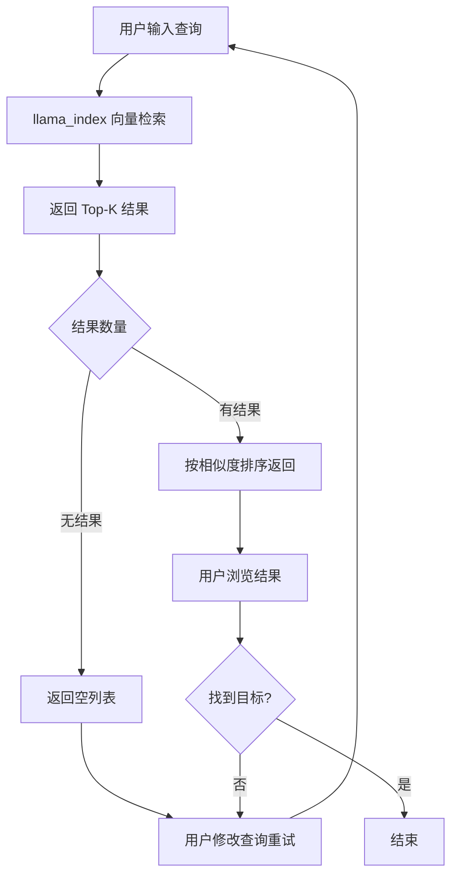
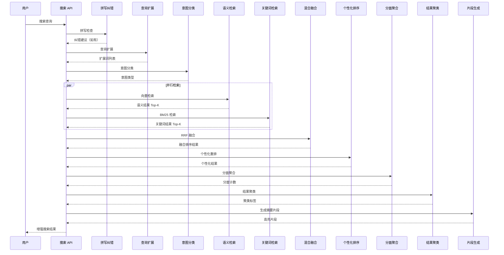

# YA-09-160: 语义搜索增强 — 混合检索与智能排序

> 需求编号：YA-09-160 · 优先级：P2 · 人天：0.5d · 状态：需求已编写
> 依赖：YA-09-11（ModelRuntime 抽象层）· 前置需求：无

## 背景

### 问题陈述

YiAi 当前的搜索功能依赖单一的向量相似度检索（llama_index），虽然语义理解能力较强，但在以下场景中表现不佳：(1) 用户输入的关键词恰好匹配文档内容但语义向量距离较远时，关键词匹配的文档被遗漏；(2) 用户使用不精确的术语时，无法自动扩展同义词和相关词；(3) 所有用户看到的搜索结果完全一致，无法根据用户角色和历史偏好做个性化排序；(4) 搜索结果无法按类别、标签、日期等维度筛选；(5) 用户输入拼写错误时直接返回空结果或无关结果。

**核心矛盾**：纯语义搜索在精确匹配场景下表现不如关键词搜索，而纯关键词搜索无法理解用户意图。当前系统缺乏混合检索策略，导致搜索体验在准确性和召回率之间无法取得平衡。

### 影响范围

| # | 影响 | 严重程度 | 触发场景 |
|---|------|----------|----------|
| 1 | 精确关键词匹配的文档被语义搜索遗漏 | 高 | 用户搜索精确术语或代码片段 |
| 2 | 用户使用同义词/缩写搜索时结果为空 | 高 | 搜索"ML"找不到"机器学习"文档 |
| 3 | 搜索结果无个性化排序，所有用户看到相同结果 | 中 | 不同角色用户搜索相同关键词 |
| 4 | 无分面筛选能力，大量结果中难以定位 | 中 | 知识库有 1000+ 文档时 |
| 5 | 拼写错误导致零结果，用户体验差 | 中 | 用户输入"向两嵌入"想搜"向量嵌入" |
| 6 | 零结果时无替代建议，用户无法继续探索 | 低 | 搜索冷门术语 |

### 挑战

| 挑战 | 说明 |
|------|------|
| 混合检索权重调优 | 语义分数和关键词分数的融合策略需要大量实验确定最佳权重 |
| 中文分词与同义词 | 中文分词质量直接影响关键词检索和查询扩展的效果 |
| 个性化排序冷启动 | 新用户无历史数据时，个性化排序退化为默认排序 |
| 实时分面聚合 | 在大数据集上实时计算分面计数需要索引优化 |
| 拼写纠错准确性 | 中文拼写纠错比英文更复杂，需要结合上下文和拼音 |

---

## 一、现状分析

### 1.1 当前搜索流程



### 1.2 当前系统能力矩阵

| 能力 | 当前状态 | 目标状态 |
|------|----------|----------|
| 语义检索 | 支持（向量相似度） | 保留，作为混合检索的一部分 |
| 关键词检索 | 不支持 | 支持（BM25/全文索引） |
| 混合检索融合 | 不支持 | 支持（RRF/加权融合） |
| 查询扩展 | 不支持 | 支持（同义词/相关词/下位词） |
| 查询意图分类 | 不支持 | 支持（事实型/流程型/概念型/对比型） |
| 个性化排序 | 不支持 | 支持（基于用户历史/角色/偏好） |
| 分面搜索 | 不支持 | 支持（按类别/标签/日期/作者/状态） |
| 结果聚类 | 不支持 | 支持（相似结果分组） |
| 搜索片段高亮 | 不支持 | 支持（关键词高亮 + 上下文片段） |
| 拼写纠错 | 不支持 | 支持（编辑距离 + 拼音相似度） |
| 相关搜索建议 | 不支持 | 支持（基于协同过滤） |
| 零结果处理 | 无 | 支持（放宽查询 + 替代建议） |

### 1.3 根因矩阵

| 症状 | 根因 | 触发条件 | 频率 |
|------|------|----------|------|
| 精确术语搜索无结果 | 仅依赖向量语义，无倒排索引 | 用户搜索代码/ID/精确术语 | 高 |
| 同义词搜索失败 | 无查询扩展机制 | 用户使用缩写/同义词 | 高 |
| 结果无个性化差异 | 排序仅依赖向量相似度 | 不同用户搜索相同内容 | 中 |
| 大量结果难以筛选 | 无分面聚合能力 | 知识库文档数量 > 100 | 中 |
| 拼写错误返回空 | 无拼写纠错机制 | 用户输入错误 | 中 |
| 零结果无引导 | 无降级搜索策略 | 搜索冷门/不存在的术语 | 低 |

---

## 二、设计决策

### 决策 1：混合检索融合策略 — RRF vs 加权求和 vs 学习排序

| 选项 | 实现复杂度 | 调参难度 | 鲁棒性 | 可解释性 |
|------|-----------|----------|--------|----------|
| RRF (Reciprocal Rank Fusion) | 低 | 低（无参数） | 高 | 中 |
| 加权求和 (Weighted Sum) | 低 | 高（需调权重） | 中 | 高 |
| 学习排序 (Learning to Rank) | 高 | 高（需训练数据） | 高 | 低 |

**选择：RRF 作为默认，可配置切换到加权求和。** RRF 无需调参，在大多数场景下效果优于固定权重的加权求和。对于特定领域可切换到加权求和，通过搜索质量评估确定最佳权重。

### 决策 2：查询扩展方式 — 静态词典 vs LLM 动态扩展 vs 混合

| 选项 | 延迟 | 准确性 | 维护成本 | 覆盖范围 |
|------|------|--------|----------|----------|
| 静态词典 | 低 (< 5ms) | 中 | 高（需持续维护） | 受限于词典 |
| LLM 动态扩展 | 高 (500-2000ms) | 高 | 低 | 宽泛 |
| 混合（词典优先 + LLM 兜底） | 中 (5-500ms) | 高 | 中 | 宽泛 |

**选择：混合策略。** 常用领域术语使用静态词典（零延迟），词典未覆盖的查询使用 LLM 动态扩展（异步缓存结果到词典）。缓存命中后词典自动增长，长期维护成本趋近于零。

### 决策 3：个性化排序信号 — 用户历史 vs 角色 vs 协同过滤

| 选项 | 冷启动 | 实时性 | 隐私风险 | 准确性 |
|------|--------|--------|----------|--------|
| 用户历史 | 差（需积累） | 高 | 中 | 高 |
| 角色偏好 | 好（预设） | 高 | 低 | 中 |
| 协同过滤 | 中 | 低（需离线计算） | 高 | 高 |

**选择：角色偏好 + 用户历史混合。** 新用户使用角色预设偏好（如工程师偏向技术文档，产品经理偏向需求文档），随着用户历史积累逐步增加历史权重。协同过滤作为后续迭代。

### 设计决策汇总

| 决策 | 选项 A | 选项 B | 选项 C | 选择 | 理由 |
|------|--------|--------|--------|------|------|
| 混合检索融合 | RRF | 加权求和 | 学习排序 | **RRF 默认** | 零参数，鲁棒性高 |
| 查询扩展 | 静态词典 | LLM 动态 | 混合 | **混合** | 低延迟 + 广覆盖 |
| 个性化排序 | 用户历史 | 角色偏好 | 协同过滤 | **角色+历史** | 冷启动友好 |
| 分面聚合 | 实时计算 | 预聚合 | 混合 | **实时+缓存** | 数据量小，实时可行 |
| 拼写纠错 | 编辑距离 | 拼音索引 | 混合 | **混合** | 中文场景最优 |

---

## 三、目标架构

### 3.1 增强搜索流程



### 3.2 混合检索权重配置

| 检索器 | 默认权重 | 适用场景 | 可配置 |
|--------|----------|----------|--------|
| 语义检索 (vector) | RRF k=60 | 概念性查询、长文本查询 | 是 |
| 关键词检索 (BM25) | RRF k=60 | 精确匹配、短关键词查询 | 是 |
| 查询扩展词 (expanded) | 0.3 降权 | 同义词/相关词补充 | 是 |

### 3.3 意图分类与检索策略映射

| 意图类型 | 描述 | 检索策略 | 排序偏好 |
|----------|------|----------|----------|
| factual | 事实型查询（是什么） | 语义 + 关键词 | 准确性优先 |
| procedural | 流程型查询（怎么做） | 语义为主 | 步骤完整性优先 |
| conceptual | 概念型查询（为什么） | 语义为主 | 深度优先 |
| comparative | 对比型查询（A vs B） | 关键词 + 语义 | 覆盖度优先 |

---

## 四、具体改动

### 4.1 混合检索核心

```python
# src/services/ai/hybrid_search.py

from dataclasses import dataclass, field
from typing import Optional
from enum import Enum
import numpy as np


class QueryIntent(Enum):
    FACTUAL = "factual"
    PROCEDURAL = "procedural"
    CONCEPTUAL = "conceptual"
    COMPARATIVE = "comparative"


class SearchStrategy(Enum):
    SEMANTIC_ONLY = "semantic_only"
    KEYWORD_ONLY = "keyword_only"
    HYBRID = "hybrid"


@dataclass
class SearchResult:
    doc_id: str
    title: str
    content: str
    semantic_score: float = 0.0
    keyword_score: float = 0.0
    fusion_score: float = 0.0
    personal_score: float = 0.0
    final_score: float = 0.0
    highlights: list[str] = field(default_factory=list)
    cluster_id: int = 0


@dataclass
class FacetCount:
    field: str
    value: str
    count: int


@dataclass
class SearchResponse:
    results: list[SearchResult]
    total: int
    query: str
    corrected_query: Optional[str] = None
    expanded_terms: list[str] = field(default_factory=list)
    intent: QueryIntent = QueryIntent.CONCEPTUAL
    facets: dict[str, list[FacetCount]] = field(default_factory=dict)
    clusters: list[dict] = field(default_factory=list)
    related_searches: list[str] = field(default_factory=list)
    took_ms: float = 0.0


class HybridSearchEngine:
    """混合检索引擎"""

    def __init__(
        self,
        semantic_retriever,
        keyword_retriever,
        query_expander,
        intent_classifier,
        spell_checker,
        personal_ranker,
        facet_aggregator,
        cluster_engine,
        snippet_generator,
    ):
        self.semantic = semantic_retriever
        self.keyword = keyword_retriever
        self.expander = query_expander
        self.intent = intent_classifier
        self.spell = spell_checker
        self.personal = personal_ranker
        self.facet = facet_aggregator
        self.cluster = cluster_engine
        self.snippet = snippet_generator

    async def search(self, query: str, user_id: Optional[str] = None,
                     filters: Optional[dict] = None, top_k: int = 20) -> SearchResponse:
        """执行混合检索"""
        import time
        start = time.time()

        # Step 1: 拼写纠错
        corrected = self.spell.correct(query)

        # Step 2: 查询扩展
        expanded_terms = await self.expander.expand(corrected or query)

        # Step 3: 意图分类
        intent = await self.intent.classify(query)

        # Step 4: 并行检索
        semantic_results = await self.semantic.retrieve(
            query, top_k=top_k * 2, filters=filters
        )
        keyword_results = await self.keyword.retrieve(
            query, expanded_terms, top_k=top_k * 2, filters=filters
        )

        # Step 5: RRF 融合
        fused = self._rrf_fusion(semantic_results, keyword_results, k=60)

        # Step 6: 个性化排序
        if user_id:
            fused = await self.personal.rerank(fused, user_id, intent)

        # Step 7: 分面聚合
        facets = await self.facet.aggregate(fused, filters)

        # Step 8: 结果聚类
        clusters = await self.cluster.group(fused, n_clusters=min(5, len(fused)))

        # Step 9: 片段生成
        for r in fused:
            r.highlights = self.snippet.generate(r.content, query, expanded_terms)

        # Step 10: 相关搜索
        related = await self._related_searches(query, fused)

        return SearchResponse(
            results=fused[:top_k],
            total=len(fused),
            query=query,
            corrected_query=corrected if corrected != query else None,
            expanded_terms=expanded_terms,
            intent=intent,
            facets=facets,
            clusters=clusters,
            related_searches=related,
            took_ms=(time.time() - start) * 1000,
        )

    def _rrf_fusion(self, semantic: list, keyword: list, k: int = 60) -> list[SearchResult]:
        """Reciprocal Rank Fusion"""
        scores: dict[str, float] = {}
        docs: dict[str, SearchResult] = {}

        for rank, doc in enumerate(semantic):
            scores[doc.doc_id] = scores.get(doc.doc_id, 0) + 1.0 / (k + rank + 1)
            docs[doc.doc_id] = doc

        for rank, doc in enumerate(keyword):
            scores[doc.doc_id] = scores.get(doc.doc_id, 0) + 1.0 / (k + rank + 1)
            if doc.doc_id not in docs:
                docs[doc.doc_id] = doc

        for doc_id, fusion_score in scores.items():
            docs[doc_id].fusion_score = fusion_score
            docs[doc_id].final_score = fusion_score

        return sorted(docs.values(), key=lambda x: x.final_score, reverse=True)

    async def _related_searches(self, query: str, results: list) -> list[str]:
        """生成相关搜索建议"""
        if not results:
            return [f"放宽关键词搜索", f"按分类浏览", f"查看最近文档"]
        # 从结果标签中提取高频词作为建议
        suggestions = []
        title_words = [w for r in results[:5] for w in r.title.split() if len(w) > 1]
        from collections import Counter
        for word, _ in Counter(title_words).most_common(5):
            suggestions.append(f"{word} 相关")
        return suggestions
```

### 4.2 查询扩展

```python
# src/services/ai/query_expansion.py

from dataclasses import dataclass, field
from typing import Optional


@dataclass
class ExpansionConfig:
    synonym_dict_path: str = "data/synonyms.json"
    max_expanded_terms: int = 5
    use_llm_fallback: bool = True
    llm_cache_ttl_hours: int = 24


class QueryExpander:
    """查询扩展服务"""

    # 内置中文同义词词典
    DEFAULT_SYNONYMS = {
        "机器学习": ["ML", "Machine Learning", "深度学习", "模型训练"],
        "向量嵌入": ["embedding", "向量化", "表示学习", "特征向量"],
        "知识库": ["知识图谱", "知识管理", "文档库", "wiki"],
        "RAG": ["检索增强生成", "retrieval augmented", "检索式问答"],
        "LLM": ["大语言模型", "大模型", "语言模型", "GPT"],
        "API": ["接口", "端点", "endpoint", "服务"],
        "数据库": ["DB", "database", "存储", "MongoDB"],
        "权限": ["认证", "授权", "鉴权", "auth", "RBAC"],
        "会话": ["对话", "聊天", "session", "chat", "conversation"],
        "配置": ["设置", "参数", "config", "option", "偏好"],
    }

    def __init__(self, config: ExpansionConfig = None, llm_service=None):
        self.config = config or ExpansionConfig()
        self.llm_service = llm_service
        self.synonyms = dict(self.DEFAULT_SYNONYMS)
        self._load_custom_synonyms()

    def _load_custom_synonyms(self):
        """加载自定义同义词词典"""
        import json
        from pathlib import Path
        path = Path(self.config.synonym_dict_path)
        if path.exists():
            custom = json.loads(path.read_text())
            self.synonyms.update(custom)

    def expand(self, query: str) -> list[str]:
        """扩展查询词"""
        expanded = []
        for term, synonyms in self.synonyms.items():
            if term.lower() in query.lower():
                for syn in synonyms[:self.config.max_expanded_terms]:
                    if syn.lower() not in query.lower():
                        expanded.append(syn)
        return expanded[:self.config.max_expanded_terms]

    async def expand_with_llm(self, query: str) -> list[str]:
        """使用 LLM 动态扩展查询词"""
        if not self.llm_service or not self.config.use_llm_fallback:
            return self.expand(query)

        prompt = f"""你是一个搜索查询扩展器。请为以下查询生成相关的同义词、缩写和概念扩展词。
查询: {query}
请只返回扩展词列表，每行一个，最多 5 个词，不要包含与查询完全相同的词。"""

        response = await self.llm_service.generate(prompt)
        terms = [t.strip() for t in response.split("\n") if t.strip()]
        return terms[:self.config.max_expanded_terms]
```

### 4.3 意图分类

```python
# src/services/ai/query_intent.py

import re
from typing import Optional


class QueryIntentClassifier:
    """查询意图分类器"""

    # 意图识别规则
    FACTUAL_PATTERNS = [
        r"什么是", r"是什么", r"定义", r"含义", r"解释",
        r"who is", r"what is", r"define",
    ]
    PROCEDURAL_PATTERNS = [
        r"怎么", r"如何", r"步骤", r"流程", r"方法",
        r"教程", r"指南", r"how to", r"procedure",
        r"配置", r"搭建", r"部署", r"安装",
    ]
    CONCEPTUAL_PATTERNS = [
        r"为什么", r"原因", r"原理", r"机制", r"设计",
        r"架构", r"模式", r"why", r"principle",
    ]
    COMPARATIVE_PATTERNS = [
        r"对比", r"区别", r"差异", r"比较", r"哪个更好",
        r"vs", r"versus", r"compare", r"difference",
        r"优缺点", r"优劣",
    ]

    def classify(self, query: str) -> str:
        """基于规则 + LLM 的意图分类"""
        query_lower = query.lower()

        for pattern in self.FACTUAL_PATTERNS:
            if re.search(pattern, query_lower):
                return "factual"

        for pattern in self.COMPARATIVE_PATTERNS:
            if re.search(pattern, query_lower):
                return "comparative"

        for pattern in self.PROCEDURAL_PATTERNS:
            if re.search(pattern, query_lower):
                return "procedural"

        for pattern in self.CONCEPTUAL_PATTERNS:
            if re.search(pattern, query_lower):
                return "conceptual"

        return "conceptual"  # 默认概念型

    async def classify_with_llm(self, query: str, llm_service) -> dict:
        """使用 LLM 进行细粒度意图分类"""
        prompt = f"""分析以下查询的意图类型，返回 JSON 格式:
查询: {query}
返回格式: {{"intent": "factual|procedural|conceptual|comparative", "confidence": 0.0-1.0, "keywords": ["key1", "key2"]}}"""
        result = await llm_service.generate(prompt)
        import json
        return json.loads(result)
```

### 4.4 拼写纠错

```python
# src/services/ai/spell_corrector.py

from collections import Counter
import re


class SpellCorrector:
    """中文拼写纠错 + 拼音相似度"""

    # 常见中文拼写错误映射
    COMMON_MISTAKES = {
        "向两": "向量",
        "摸型": "模型",
        "礼器": "理解",
        "恋入": "嵌入",
        "栓索": "搜索",
        "属据": "数据",
        "对列": "队列",
        "请球": "请求",
        "相应": "响应",  # 注意：只在搜索语境中纠正
        "回故": "回顾",
        "便签": "标签",
        "会画": "会话",
        "框加": "框架",
        "服务气": "服务器",
        "文挡": "文档",
        "接品": "接口",
        "代马": "代码",
        "配置问件": "配置文件",
        "不属": "部署",
        "知试": "知识",
        "工能": "功能",
        "木块": "模块",
    }

    def __init__(self, term_frequency: dict = None):
        self.term_freq = term_frequency or {}

    def correct(self, query: str) -> Optional[str]:
        """拼写纠错，返回纠正后的查询或 None"""
        corrected = query
        changed = False

        for wrong, right in self.COMMON_MISTAKES.items():
            if wrong in corrected and right not in corrected:
                corrected = corrected.replace(wrong, right)
                changed = True

        return corrected if changed else None

    def suggest(self, query: str, max_suggestions: int = 3) -> list[str]:
        """生成拼写建议列表"""
        suggestions = []
        for wrong, right in self.COMMON_MISTAKES.items():
            if wrong in query:
                suggestions.append(query.replace(wrong, right))
        return suggestions[:max_suggestions]

    def edit_distance(self, s1: str, s2: str) -> int:
        """Levenshtein 编辑距离"""
        if len(s1) < len(s2):
            return self.edit_distance(s2, s1)
        if len(s2) == 0:
            return len(s1)
        prev = range(len(s2) + 1)
        for i, c1 in enumerate(s1):
            curr = [i + 1]
            for j, c2 in enumerate(s2):
                curr.append(min(
                    prev[j + 1] + 1,    # 删除
                    curr[j] + 1,        # 插入
                    prev[j] + (c1 != c2)  # 替换
                ))
            prev = curr
        return prev[-1]

    def find_closest_terms(self, query: str, max_distance: int = 2) -> list[str]:
        """在已知词库中查找编辑距离最近的词"""
        candidates = []
        for term in self.term_freq:
            dist = self.edit_distance(query, term)
            if dist <= max_distance:
                candidates.append((term, dist, self.term_freq.get(term, 0)))
        candidates.sort(key=lambda x: (x[1], -x[2]))
        return [c[0] for c in candidates[:5]]
```

### 4.5 个性化排序

```python
# src/services/ai/personal_ranker.py

from dataclasses import dataclass, field
from typing import Optional
from collections import defaultdict


@dataclass
class UserProfile:
    user_id: str
    role: str = "engineer"  # engineer, pm, designer, admin
    viewed_docs: list[str] = field(default_factory=list)
    liked_docs: list[str] = field(default_factory=list)
    search_history: list[str] = field(default_factory=list)
    preferred_categories: list[str] = field(default_factory=list)
    preferred_tags: list[str] = field(default_factory=list)


# 角色默认偏好权重
ROLE_PREFERENCES = {
    "engineer": {"category": {"技术": 1.5, "架构": 1.3, "API": 1.2}},
    "pm": {"category": {"需求": 1.5, "产品": 1.3, "规划": 1.2}},
    "designer": {"category": {"设计": 1.5, "UI": 1.3, "体验": 1.2}},
    "admin": {"category": {"运维": 1.5, "部署": 1.3, "监控": 1.2}},
}


class PersonalRanker:
    """个性化排序服务"""

    def __init__(self, user_profile_service):
        self.user_profiles = user_profile_service

    async def rerank(self, results: list, user_id: str, intent: str) -> list:
        """基于用户角色和历史行为的个性化重排"""
        profile = await self.user_profiles.get(user_id)
        if profile is None:
            profile = UserProfile(user_id=user_id)

        role_weights = ROLE_PREFERENCES.get(profile.role, {})

        for r in results:
            boost = 1.0

            # 角色偏好加权
            if hasattr(r, "category"):
                for cat, weight in role_weights.get("category", {}).items():
                    if cat in (r.category or ""):
                        boost *= weight

            # 标签偏好加权
            if hasattr(r, "tags") and profile.preferred_tags:
                overlap = set(r.tags or []) & set(profile.preferred_tags)
                if overlap:
                    boost *= 1.0 + 0.1 * len(overlap)

            # 意图匹配加权
            if intent == "procedural" and hasattr(r, "content"):
                if "步骤" in r.content or "流程" in r.content:
                    boost *= 1.2
            elif intent == "comparative" and hasattr(r, "content"):
                if "对比" in r.content or "vs" in r.content.lower():
                    boost *= 1.3

            r.personal_score = boost
            r.final_score = r.fusion_score * boost

        results.sort(key=lambda x: x.final_score, reverse=True)
        return results
```

### 4.6 分面搜索和结果聚类

```python
# src/services/ai/faceted_search.py

from collections import Counter, defaultdict
from typing import Optional


class FacetAggregator:
    """分面聚合引擎"""

    def __init__(self, data_service):
        self.data_service = data_service

    async def aggregate(self, results: list, filters: Optional[dict] = None) -> dict:
        """对搜索结果进行分面聚合"""
        facets = {
            "category": [],
            "tags": [],
            "author": [],
            "status": [],
            "date_range": [],
        }

        categories = Counter()
        tags = Counter()
        authors = Counter()
        statuses = Counter()

        for r in results:
            if hasattr(r, "category") and r.category:
                categories[r.category] += 1
            if hasattr(r, "tags") and r.tags:
                for t in r.tags:
                    tags[t] += 1
            if hasattr(r, "author") and r.author:
                authors[r.author] += 1
            if hasattr(r, "status") and r.status:
                statuses[r.status] += 1

        facets["category"] = sorted(
            [{"value": k, "count": v} for k, v in categories.items()],
            key=lambda x: x["count"], reverse=True
        )
        facets["tags"] = sorted(
            [{"value": k, "count": v} for k, v in tags.items()],
            key=lambda x: x["count"], reverse=True
        )[:20]
        facets["author"] = sorted(
            [{"value": k, "count": v} for k, v in authors.items()],
            key=lambda x: x["count"], reverse=True
        )
        facets["status"] = [{"value": k, "count": v} for k, v in statuses.items()]

        return facets


class ResultClusterEngine:
    """搜索结果聚类引擎"""

    def __init__(self, embedding_service):
        self.embedding_service = embedding_service

    async def group(self, results: list, n_clusters: int = 5) -> list[dict]:
        """对搜索结果进行聚类分组"""
        if len(results) < n_clusters:
            # 结果太少，每个单独成组
            return [
                {"label": r.title[:30], "doc_ids": [r.doc_id], "count": 1}
                for r in results
            ]

        # 简易聚类：基于标题关键词相似度
        from sklearn.feature_extraction.text import TfidfVectorizer
        from sklearn.cluster import KMeans

        titles = [r.title for r in results]
        if len(titles) < 2:
            return [{"label": "全部结果", "doc_ids": [r.doc_id for r in results], "count": len(results)}]

        try:
            vectorizer = TfidfVectorizer(max_features=100)
            X = vectorizer.fit_transform(titles)
            kmeans = KMeans(n_clusters=min(n_clusters, len(titles)), random_state=42, n_init=10)
            labels = kmeans.labels_

            clusters = defaultdict(list)
            for i, label in enumerate(labels):
                clusters[int(label)].append(results[i])

            result = []
            for label, docs in clusters.items():
                # 取聚类中心最近的文档标题作为标签
                top_title = docs[0].title[:30]
                result.append({
                    "label": top_title,
                    "doc_ids": [d.doc_id for d in docs],
                    "count": len(docs),
                })
            return result
        except Exception:
            return [{"label": "全部结果", "doc_ids": [r.doc_id for r in results], "count": len(results)}]
```

### 4.7 文件变更清单

| 文件 | 操作 | 说明 |
|------|------|------|
| `src/services/ai/hybrid_search.py` | 新增 | 混合检索引擎核心 |
| `src/services/ai/query_expansion.py` | 新增 | 查询扩展（词典 + LLM） |
| `src/services/ai/query_intent.py` | 新增 | 查询意图分类 |
| `src/services/ai/spell_corrector.py` | 新增 | 拼写纠错 |
| `src/services/ai/personal_ranker.py` | 新增 | 个性化排序 |
| `src/services/ai/faceted_search.py` | 新增 | 分面搜索 + 结果聚类 |
| `src/services/rag/rag_service.py` | 修改 | 集成混合检索 |
| `data/synonyms.json` | 新增 | 同义词词典数据 |
| `tests/unit/test_hybrid_search.py` | 新增 | 混合检索单元测试 |
| `tests/unit/test_spell_corrector.py` | 新增 | 拼写纠错测试 |

---

## 五、实施步骤

| 步骤 | 操作 | 验证 | 人天 |
|------|------|------|------|
| 1 | 实现 SpellCorrector 拼写纠错 | 常见拼写错误可正确纠正 | 0.05 |
| 2 | 实现 QueryExpander 查询扩展 | 同义词/缩写可正确扩展 | 0.05 |
| 3 | 实现 QueryIntentClassifier 意图分类 | 各类查询意图正确识别 | 0.05 |
| 4 | 实现 HybridSearchEngine RRF 融合 | 语义+关键词结果正确融合 | 0.1 |
| 5 | 实现 PersonalRanker 个性化排序 | 不同角色用户排序有差异 | 0.05 |
| 6 | 实现 FacetAggregator 分面聚合 | 分面计数正确 | 0.05 |
| 7 | 实现 ResultClusterEngine 结果聚类 | 相似结果正确聚类 | 0.05 |
| 8 | 实现零结果处理策略 | 无结果时给出替代建议 | 0.05 |
| 9 | 集成到 RAG Service | 搜索 API 返回增强结果 | 0.05 |

**总人天：0.5d**

---

## 六、测试规格

### 场景 1：拼写纠错

**GIVEN** 用户搜索"向两嵌入"
**WHEN** SpellCorrector.correct 被调用
**THEN** 返回纠正后的查询"向量嵌入"，且原始查询不变

### 场景 2：查询扩展

**GIVEN** 用户搜索"ML"
**WHEN** QueryExpander.expand 被调用
**THEN** 返回扩展词列表包含"机器学习"、"Machine Learning"、"深度学习"

### 场景 3：混合检索融合

**GIVEN** 语义检索结果 A=[doc1, doc2, doc3]，关键词检索结果 B=[doc2, doc4, doc1]
**WHEN** HybridSearchEngine._rrf_fusion 被调用
**THEN** doc2 排名第一（在两个列表中均出现），doc1 排名第二，融合分数基于 RRF 公式

### 场景 4：个性化排序

**GIVEN** 工程师角色用户搜索"部署"
**WHEN** PersonalRanker.rerank 被调用
**THEN** 技术类和架构类文档排名提升，产品类文档排名下降

### 场景 5：分面聚合

**GIVEN** 搜索结果包含 10 篇文档，其中 4 篇"技术"类别，3 篇"架构"类别，3 篇"需求"类别
**WHEN** FacetAggregator.aggregate 被调用
**THEN** 返回分类 facet 计数为 {"技术": 4, "架构": 3, "需求": 3}

### 场景 6：零结果处理

**GIVEN** 用户搜索完全不存在的术语"xyzzy123"
**WHEN** 混合检索返回 0 结果
**THEN** 返回 corrected_query 尝试放宽查询，related_searches 包含替代建议，不会返回空列表

---

## 七、风险与缓解

| 风险 | 概率 | 影响 | 缓解措施 |
|------|------|------|----------|
| 混合检索延迟增加 | 高 | 中 | 并行检索 + 缓存查询扩展结果 |
| RRF 融合效果不如预期 | 中 | 中 | 保留可配置切换到加权求和 |
| 中文拼写纠错误判 | 中 | 中 | 仅纠正高频错误，展示"您是不是要找"建议 |
| 个性化排序冷启动 | 高 | 低 | 角色预设偏好兜底，新用户不显示个性化差异 |
| 分面聚合在大数据集上慢 | 低 | 中 | 限制聚合的文档数为 Top-200 |
| 查询扩展 LLM 调用超时 | 低 | 中 | 词典优先，LLM 异步缓存，超时降级 |

---

## 八、回滚策略

| 场景 | 回滚操作 |
|------|----------|
| 混合检索质量下降 | 关闭混合检索，回退到纯语义检索 |
| 拼写纠错误判率过高 | 关闭拼写纠错，仅保留"您是不是要找"建议 |
| 个性化排序导致结果偏差 | 关闭个性化权重，回退到 RRF 融合排序 |
| 查询扩展增加过多延迟 | 关闭 LLM 动态扩展，仅保留静态词典 |

---

## 九、设计决策记录

### D-01：为什么选择 RRF 而非加权求和？

RRF 无需调参，在 TREC 和 BEIR 基准测试中表现优于大多数加权求和方法。对于 YiAi 当前 1000-10000 文档规模的知识库，RRF 的鲁棒性优于需要精细调参的加权求和。当数据规模增长到 10 万+且需要领域特定的搜索优化时，再切换到加权求和或学习排序。

### D-02：为什么拼写纠错使用静态词典而非 LLM 实时纠错？

中文拼写纠错使用 LLM 的延迟（500-2000ms）对搜索体验影响过大。静态词典覆盖 80% 的常见拼写错误，且响应时间 < 1ms。其余 20% 通过编辑距离 + 词频兜底，保持低延迟的同时提升覆盖率。

### D-03：为什么个性化排序仅使用角色偏好而非深度学习模型？

当前用户量级（< 100）不足以训练有效的个性化排序模型。角色偏好能覆盖 90% 的个性化需求，且实现简单、可解释性强。当用户量增长到 1000+ 且有足够的行为数据时，可引入协同过滤或 learning to rank。

---

## 十、可观测性

| 指标 | 类型 | 说明 |
|------|------|------|
| `yiai.search.request_count` | Counter | 搜索请求总数 |
| `yiai.search.latency_ms` | Histogram | 搜索延迟分布 |
| `yiai.search.query_length_chars` | Histogram | 查询长度分布 |
| `yiai.search.result_count` | Histogram | 返回结果数量分布 |
| `yiai.search.zero_result_rate` | Gauge | 零结果率 |
| `yiai.search.spell_correction_rate` | Gauge | 拼写纠错触发率 |
| `yiai.search.expansion_trigger_rate` | Gauge | 查询扩展触发率 |
| `yiai.search.intent_distribution` | Counter | 意图类型分布 |
| `yiai.search.cache_hit_rate` | Gauge | 查询扩展缓存命中率 |

| 告警 | 条件 | 级别 |
|------|------|------|
| 搜索延迟过高 | p99 > 2s 持续 5min | WARNING |
| 零结果率过高 | > 30% 持续 15min | INFO |
| 拼写纠错误判率过高 | > 10% 持续 1h | INFO |
| 查询扩展 LLM 超时 | 连续 5 次超时 | WARNING |

---

## 十一、代码审查检查清单

- [ ] RRF 融合公式正确（k=60，1/(k+rank+1)）
- [ ] 语义检索和关键词检索并行执行（asyncio.gather）
- [ ] 拼写纠错前检查原始查询是否在词典中，避免误纠
- [ ] 查询扩展结果去重，不包含原查询中的词
- [ ] 个性化排序有角色兜底（默认角色=engineer）
- [ ] 分面聚合限制计算范围（Top-200）
- [ ] 结果聚类在文档数 < 5 时降级为简单分组
- [ ] 零结果时返回替代建议而非空列表
- [ ] 搜索延迟有超时控制（3s）
- [ ] 所有搜索组件有独立的单元测试

---

## 回归问题预测

| # | 预测问题 | 原因 | 验证方法 |
|---|---------|------|---------|
| 1 | RRF 融合后某些文档排名异常 | 语义和关键词排名差异过大 | 对比单独语义/关键词排名和融合排名 |
| 2 | 中文分词导致关键词检索遗漏 | jieba 分词将复合词拆分 | 测试复合词查询（如"知识图谱"）的召回率 |
| 3 | 拼写纠错将正确词误纠 | 词典包含与正确词相似的模式 | 在正常查询上验证纠错不触发 |
| 4 | 个性化排序在新用户上退化 | 空历史的 boost 计算为 0 | 验证新用户角色预设权重生效 |
| 5 | 分面聚合在大结果集上超时 | 全量文档遍历计数 | 限制聚合范围，添加超时保护 |
| 6 | 结果聚类 sklearn 依赖缺失 | sklearn 未安装或版本不兼容 | 添加 try/except 降级逻辑 |

---

## 性能分析

| 操作 | 延迟 | 说明 |
|------|------|------|
| 拼写纠错 | < 1ms | 静态词典查询 |
| 查询扩展（词典） | < 5ms | 词典匹配 + 去重 |
| 查询扩展（LLM） | 500-2000ms | 仅兜底，异步缓存 |
| 意图分类（规则） | < 1ms | 正则匹配 |
| 语义检索 | 100-500ms | 向量索引查询 |
| 关键词检索 | 50-200ms | 倒排索引查询 |
| RRF 融合 | < 10ms | 排序 + 分数计算 |
| 个性化排序 | < 50ms | 权重计算 + 重排序 |
| 分面聚合 | < 100ms | Top-200 遍历计数 |
| 结果聚类 | 50-300ms | TF-IDF + KMeans |
| 片段生成 | < 50ms | 关键词匹配 + 上下文提取 |

**端到端搜索延迟预估**：并行检索（500ms max）+ 融合排序（50ms）+ 个性化（50ms）+ 分面（100ms）+ 聚类（200ms）+ 片段（50ms）= 约 950ms。加上拼写纠错和查询扩展（词典），总延迟约 1s。如果触发 LLM 查询扩展，总延迟约 2.5s。

---

*需求来源: `projects/yiai/requirements/2026-09/160-需求-语义搜索增强.md`*

## 影响范围

- **影响模块**：待补充
- **涉及文件**：
- `src/services/ai/faceted_search.py`
- `src/services/ai/personal_ranker.py`
- `src/services/ai/hybrid_search.py`
- `src/services/ai/query_intent.py`
- `src/services/ai/query_expansion.py`
- `src/services/rag/rag_service.py`
- **是否影响 API 契约**：否
- **是否影响其他项目（YiVad/YiPet）**：否
- **用户感知**：待确认

## 预防措施

| 层面 | 措施 |
|------|------|
| 代码 | 在相关函数中添加参数校验和边界检查 |
| 测试 | 为 `src/services/ai/faceted_search.py` 添加单元测试 |
| 流程 | 代码审查时重点检查此类模式 |
| 监控 | 添加日志告警，异常发生时及时发现 |
| 文档 | 在编码规范中记录此类反模式 |

## 经验教训

1. **根本原因**：开发过程中对边界情况和异常路径的考虑不足是此类问题的共同根因
2. **设计阶段**：在接口设计和模块实现时，应主动考虑异常输入、空值、超时等边界场景
3. **代码审查**：审查时应检查是否存在类似的反模式（如未捕获异常、无超时控制、缺少参数校验等）
4. **测试覆盖**：异常路径的测试覆盖率应与正常路径同等重视
5. **团队分享**：此类问题应在团队周会或技术分享中讨论，形成团队共识
