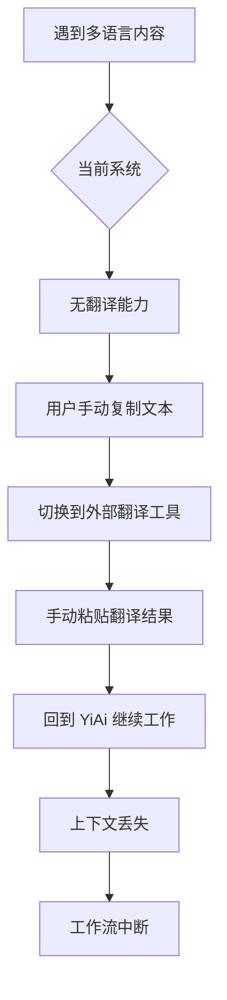
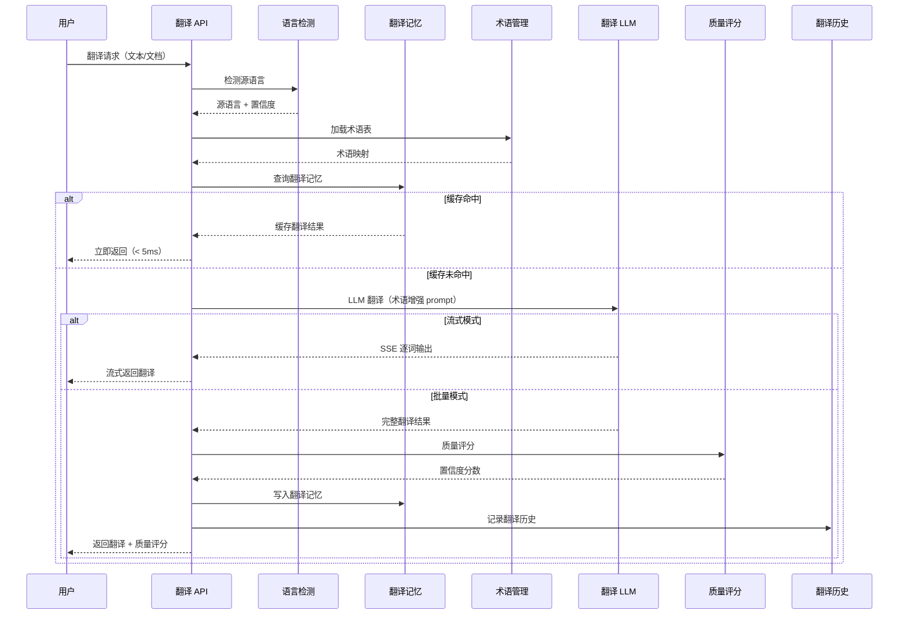

# YA-09-161: 实时翻译服务 — 基于 LLM 的多语言翻译

> 需求编号：YA-09-161 · 优先级：P2 · 人天：0.5d · 状态：需求已编写
> 依赖：YA-09-11（ModelRuntime 抽象层）· 前置需求：无

## 背景

### 问题陈述

YiAi 作为知识管理和 AI 对话平台，当前所有内容以中文为主，缺乏多语言翻译能力。随着团队国际化和跨国协作需求增长，用户需要：(1) 将中文文档翻译为英文/日文以支持国际协作；(2) 阅读英文技术文档时快速获取中文翻译；(3) 在聊天中实时翻译多语言消息；(4) 批量翻译知识库文档以构建多语言知识库。

**核心矛盾**：团队需要处理多语言内容，但系统完全缺乏翻译能力，用户必须切换到外部翻译工具（如 Google Translate、DeepL），打断工作流，且无法利用 YiAi 的领域知识和术语库。

### 影响范围

| # | 影响 | 严重程度 | 触发场景 |
|---|------|----------|----------|
| 1 | 无法翻译文档，国际协作受阻 | 高 | 需要将中文文档分享给海外团队 |
| 2 | 阅读英文技术文档效率低 | 高 | 查阅英文 API 文档/论文 |
| 3 | 聊天中无法处理多语言消息 | 中 | 国际团队成员用英文提问 |
| 4 | 知识库仅支持单语言 | 中 | 需要多语言知识库 |
| 5 | 翻译结果缺乏领域术语一致性 | 中 | 技术术语翻译不统一 |
| 6 | 重复翻译相同内容浪费资源 | 低 | 多次翻译相同段落 |

### 挑战

| 挑战 | 说明 |
|------|------|
| 翻译质量 | LLM 翻译质量可能不如专业翻译引擎（DeepL/Google） |
| 术语一致性 | 技术术语在不同上下文中的翻译需要保持一致 |
| 语言检测准确性 | 短文本和混合语言文本的语言检测难度高 |
| 翻译记忆管理 | 缓存键设计和过期策略影响命中率和存储成本 |
| 流式翻译延迟 | SSE 流式输出的逐词延迟需要优化 |

---

## 一、现状分析

### 1.1 当前翻译相关流程



### 1.2 当前系统能力矩阵

| 能力 | 当前状态 | 目标状态 |
|------|----------|----------|
| 文本翻译 | 不支持 | 支持（zh/en/ja 互译，可扩展） |
| 语言检测 | 不支持 | 支持（langdetect + 置信度） |
| 批量翻译 | 不支持 | 支持（文档/段落批量翻译） |
| 翻译记忆 | 不支持 | 支持（缓存 + TTL 管理） |
| 流式翻译 | 不支持 | 支持（SSE 逐词输出） |
| 术语管理 | 不支持 | 支持（自定义术语表覆盖） |
| 翻译质量评分 | 不支持 | 支持（LLM 自评 + 回译验证） |
| 翻译历史 | 不支持 | 支持（记录 + 使用分析） |
| 多语言 RAG | 不支持 | 支持（翻译后索引） |

### 1.3 根因矩阵

| 症状 | 根因 | 触发条件 | 频率 |
|------|------|----------|------|
| 外文内容无法理解 | 无翻译功能 | 遇到非中文内容 | 高 |
| 翻译结果术语不统一 | 无术语管理 | 翻译技术文档 | 高 |
| 相同内容重复翻译 | 无翻译记忆缓存 | 多次翻译相同段落 | 中 |
| 翻译等待时间长 | 无流式输出 | 翻译长文本 | 中 |
| 语言检测错误 | 无语言检测 | 混合语言文本 | 低 |

---

## 二、设计决策

### 决策 1：翻译引擎选择 — 外部 API vs 本地 LLM vs 混合

| 选项 | 翻译质量 | 延迟 | 成本 | 术语定制 | 隐私 |
|------|----------|------|------|----------|------|
| 外部 API（DeepL/Google） | 高 | 低 | 按量付费 | 有限 | 数据外传 |
| 本地 LLM（Ollama） | 中-高 | 中 | 零（已有 GPU） | 完全可控 | 完全本地 |
| 混合（本地优先 + 外部兜底） | 高 | 中 | 中 | 可控 | 可控 |

**选择：本地 LLM（Ollama）作为默认，可配置外部 API。** YiAi 已部署 Ollama，本地 LLM 翻译质量在通用场景下可接受，通过术语表可达到领域专业水平。零额外成本，数据完全本地化。对于质量要求极高的场景，可配置切换到外部 API。

### 决策 2：翻译记忆缓存策略 — 精确匹配 vs 模糊匹配 vs 语义匹配

| 选项 | 命中率 | 延迟 | 存储成本 | 一致性风险 |
|------|--------|------|----------|------------|
| 精确匹配（SHA256 原文） | 低 | 极低 | 低 | 低 |
| 模糊匹配（编辑距离） | 中 | 中 | 中 | 中 |
| 语义匹配（向量相似度） | 高 | 高 | 高 | 高 |

**选择：精确匹配 + 段落级缓存。** 翻译场景中，精确相同的文本段重复翻译是主要场景（如重复出现的术语段落、模板文本）。模糊匹配的收益不足以覆盖增加的复杂度和延迟。段落级（而非文档级）缓存提高命中率。

### 决策 3：语言检测方案 — langdetect vs fasttext vs LLM

| 选项 | 准确率 | 延迟 | 依赖 | 短文本支持 |
|------|--------|------|------|------------|
| langdetect | 85-90% | < 1ms | 轻量 | 差 |
| fasttext | 95%+ | 5-10ms | 需下载模型(100MB+) | 好 |
| LLM 检测 | 98%+ | 500-2000ms | Ollama | 好 |

**选择：langdetect 作为默认，fasttext 作为可选升级。** langdetect 零额外依赖，对 20 字符以上的文本准确率足够。对于短文本（< 20 字符），添加置信度阈值，低于阈值时标记为"不确定"并允许用户手动指定。

### 设计决策汇总

| 决策 | 选项 A | 选项 B | 选项 C | 选择 | 理由 |
|------|--------|--------|--------|------|------|
| 翻译引擎 | 外部 API | 本地 LLM | 混合 | **本地 LLM 默认** | 零成本 + 数据本地化 |
| 翻译记忆 | 精确匹配 | 模糊匹配 | 语义匹配 | **精确+段落级** | 高命中率，低复杂度 |
| 语言检测 | langdetect | fasttext | LLM | **langdetect 默认** | 零依赖，轻量 |
| 术语管理 | 静态词典 | 动态 LLM | 混合 | **静态+用户自定义** | 可控性强 |

---

## 三、目标架构

### 3.1 翻译服务流程



### 3.2 支持的语言对

| 源语言 | 目标语言 | 语言代码 | 默认模型 | 备注 |
|--------|----------|----------|----------|------|
| 中文 | 英文 | zh→en | qwen2.5:7b | 主要翻译方向 |
| 英文 | 中文 | en→zh | qwen2.5:7b | 主要翻译方向 |
| 中文 | 日文 | zh→ja | qwen2.5:7b | 次要翻译方向 |
| 日文 | 中文 | ja→zh | qwen2.5:7b | 次要翻译方向 |
| 英文 | 日文 | en→ja | qwen2.5:7b | 次要翻译方向 |
| 日文 | 英文 | ja→en | qwen2.5:7b | 次要翻译方向 |

### 3.3 翻译模式

| 模式 | 适用场景 | 输出方式 | 缓存 | 质量评分 |
|------|----------|----------|------|----------|
| 即时翻译 | 短文本、聊天消息 | 同步返回 | 是 | 否 |
| 流式翻译 | 长文本、实时展示 | SSE 逐词 | 否 | 否 |
| 批量翻译 | 文档、知识库 | 异步任务 | 是 | 是 |
| 文档翻译 | 完整 Markdown 文档 | 异步任务 | 段落级 | 是 |

---

## 四、具体改动

### 4.1 翻译服务核心

```python
# src/services/ai/translation_service.py

from dataclasses import dataclass, field
from enum import Enum
from typing import Optional, AsyncIterator
import hashlib
import json
import time


class Language(Enum):
    ZH = "zh"
    EN = "en"
    JA = "ja"
    AUTO = "auto"


class TranslationMode(Enum):
    INSTANT = "instant"    # 即时翻译
    STREAMING = "streaming"  # 流式翻译
    BATCH = "batch"        # 批量翻译
    DOCUMENT = "document"  # 文档翻译


@dataclass
class TranslationRequest:
    text: str
    source_lang: Language = Language.AUTO
    target_lang: Language = Language.EN
    mode: TranslationMode = TranslationMode.INSTANT
    glossary_id: Optional[str] = None
    quality_check: bool = False


@dataclass
class TranslationResult:
    original_text: str
    translated_text: str
    source_lang: str
    target_lang: str
    confidence: float = 0.0
    quality_score: Optional[float] = None
    from_cache: bool = False
    glossary_matches: list[str] = field(default_factory=list)
    took_ms: float = 0.0


class TranslationService:
    """翻译服务 — 基于 LLM 的多语言翻译"""

    TRANSLATION_PROMPTS = {
        ("zh", "en"): "请将以下中文文本翻译成英文。保持专业术语的一致性，语气自然流畅。\n\n原文：{text}\n\n翻译：",
        ("en", "zh"): "Please translate the following English text into Chinese. Keep technical terms consistent, tone natural and fluent.\n\nOriginal: {text}\n\nTranslation:",
        ("zh", "ja"): "以下の中国語テキストを日本語に翻訳してください。専門用語の一貫性を保ち、自然で流暢な表現にしてください。\n\n原文：{text}\n\n翻訳：",
        ("ja", "zh"): "请将以下日语文本翻译成中文。保持专业术语的一致性，语气自然流畅。\n\n原文：{text}\n\n翻译：",
        ("en", "ja"): "Please translate the following English text into Japanese. Keep technical terms consistent.\n\nOriginal: {text}\n\nTranslation:",
        ("ja", "en"): "以下の日本語テキストを英語に翻訳してください。\n\n原文：{text}\n\n翻訳：",
    }

    def __init__(self, llm_service, lang_detector, translation_cache, glossary_manager):
        self.llm_service = llm_service
        self.lang_detector = lang_detector
        self.cache = translation_cache
        self.glossary = glossary_manager

    async def translate(self, request: TranslationRequest) -> TranslationResult:
        """执行翻译"""
        start = time.time()

        # Step 1: 语言检测
        if request.source_lang == Language.AUTO:
            source_lang, confidence = self.lang_detector.detect(request.text)
        else:
            source_lang = request.source_lang.value
            confidence = 1.0

        target_lang = request.target_lang.value

        # Step 2: 检查翻译记忆缓存
        if request.mode != TranslationMode.STREAMING:
            cache_key = self._cache_key(request.text, source_lang, target_lang)
            cached = self.cache.get(cache_key)
            if cached:
                return TranslationResult(
                    original_text=request.text,
                    translated_text=cached["translation"],
                    source_lang=source_lang,
                    target_lang=target_lang,
                    confidence=confidence,
                    from_cache=True,
                    took_ms=(time.time() - start) * 1000,
                )

        # Step 3: 加载术语表
        glossary_terms = {}
        if request.glossary_id:
            glossary_terms = await self.glossary.get_terms(
                request.glossary_id, source_lang, target_lang
            )

        # Step 4: 构建翻译 prompt
        prompt = self._build_prompt(request.text, source_lang, target_lang, glossary_terms)

        # Step 5: 调用 LLM 翻译
        translated = await self.llm_service.generate(prompt, stream=False)

        # Step 6: 后处理
        translated = self._post_process(translated, source_lang, target_lang)

        # Step 7: 写入缓存
        if request.mode != TranslationMode.STREAMING:
            self.cache.set(cache_key, {
                "translation": translated,
                "source_lang": source_lang,
                "target_lang": target_lang,
                "timestamp": time.time(),
            })

        # Step 8: 质量评分（可选）
        quality_score = None
        if request.quality_check:
            quality_score = await self._quality_check(request.text, translated, source_lang, target_lang)

        return TranslationResult(
            original_text=request.text,
            translated_text=translated,
            source_lang=source_lang,
            target_lang=target_lang,
            confidence=confidence,
            quality_score=quality_score,
            from_cache=False,
            glossary_matches=list(glossary_terms.keys()),
            took_ms=(time.time() - start) * 1000,
        )

    async def translate_streaming(self, request: TranslationRequest) -> AsyncIterator[str]:
        """流式翻译 — SSE 逐词输出"""
        if request.source_lang == Language.AUTO:
            source_lang, _ = self.lang_detector.detect(request.text)
        else:
            source_lang = request.source_lang.value

        target_lang = request.target_lang.value
        glossary_terms = {}
        if request.glossary_id:
            glossary_terms = await self.glossary.get_terms(
                request.glossary_id, source_lang, target_lang
            )

        prompt = self._build_prompt(request.text, source_lang, target_lang, glossary_terms)

        async for token in self.llm_service.generate_stream(prompt):
            yield token

    async def batch_translate(self, texts: list[str], source_lang: Language,
                               target_lang: Language) -> list[TranslationResult]:
        """批量翻译"""
        results = []
        for text in texts:
            request = TranslationRequest(
                text=text, source_lang=source_lang,
                target_lang=target_lang, mode=TranslationMode.BATCH,
            )
            result = await self.translate(request)
            results.append(result)
        return results

    def _build_prompt(self, text: str, source_lang: str, target_lang: str,
                      glossary: dict = None) -> str:
        """构建翻译 prompt，包含术语表"""
        prompt_key = (source_lang, target_lang)
        base_prompt = self.TRANSLATION_PROMPTS.get(
            prompt_key,
            f"Translate from {source_lang} to {target_lang}:\n\n{{text}}\n\nTranslation:",
        )

        if glossary:
            terms = "\n".join([f"- {k} → {v}" for k, v in glossary.items()])
            glossary_instruction = f"\n\n请使用以下术语翻译：\n{terms}\n"
            base_prompt = glossary_instruction + base_prompt

        return base_prompt.format(text=text)

    def _cache_key(self, text: str, source_lang: str, target_lang: str) -> str:
        """生成翻译记忆缓存键"""
        raw = f"{text}|{source_lang}|{target_lang}"
        return hashlib.sha256(raw.encode()).hexdigest()[:32]

    def _post_process(self, text: str, source_lang: str, target_lang: str) -> str:
        """翻译后处理：清理多余空白、修复标点"""
        text = text.strip()
        # 修复中英文混排空格
        if target_lang == "zh" or target_lang == "ja":
            import re
            text = re.sub(r'\s+([，。！？、；：》）\])])', r'\1', text)
            text = re.sub(r'([（《【])\s+', r'\1', text)
        return text

    async def _quality_check(self, original: str, translated: str,
                              source_lang: str, target_lang: str) -> float:
        """LLM 自评翻译质量"""
        prompt = f"""请评估以下翻译质量，从 1 到 10 打分。
原文({source_lang}): {original}
译文({target_lang}): {translated}
评估标准: 准确性(40%)、流畅度(30%)、术语一致性(30%)
只返回数字分数。"""
        response = await self.llm_service.generate(prompt, stream=False)
        try:
            return float(response.strip()) / 10.0
        except ValueError:
            return 0.7  # 默认
```

### 4.2 语言检测

```python
# src/services/ai/language_detector.py

import re
from typing import Optional


class LanguageDetector:
    """语言检测服务 — 基于字符集 + langdetect"""

    # 字符集范围
    CJK_RANGES = [
        (0x4E00, 0x9FFF),   # 中文汉字
        (0x3400, 0x4DBF),   # 中文扩展 A
        (0x20000, 0x2A6DF), # 中文扩展 B
        (0xF900, 0xFAFF),   # 中文兼容
    ]
    HIRAGANA_RANGE = (0x3040, 0x309F)
    KATAKANA_RANGE = (0x30A0, 0x30FF)
    KANJI_RANGE = (0x4E00, 0x9FFF)

    def __init__(self):
        self._try_load_langdetect()

    def _try_load_langdetect(self):
        """尝试加载 langdetect 库"""
        try:
            from langdetect import detect, DetectorFactory
            DetectorFactory.seed = 0
            self._langdetect = detect
            self._has_langdetect = True
        except ImportError:
            self._langdetect = None
            self._has_langdetect = False

    def detect(self, text: str) -> tuple[str, float]:
        """检测文本语言，返回 (语言代码, 置信度)"""
        if not text or not text.strip():
            return "en", 0.0

        # Step 1: 字符集分析
        char_based = self._detect_by_chars(text)
        if char_based[1] > 0.8:
            return char_based

        # Step 2: langdetect（如果可用）
        if self._has_langdetect and len(text) >= 20:
            try:
                lang = self._langdetect(text)
                if lang in ("zh-cn", "zh-tw"):
                    return "zh", 0.9
                elif lang in ("ja", "en"):
                    return lang, 0.85
            except Exception:
                pass

        # Step 3: 字符集降级
        return char_based

    def _detect_by_chars(self, text: str) -> tuple[str, float]:
        """基于字符集的语言检测"""
        total = len(text.strip())
        if total == 0:
            return "en", 0.0

        cjk_count = 0
        hiragana_count = 0
        katakana_count = 0
        latin_count = 0

        for ch in text:
            code = ord(ch)
            if any(low <= code <= high for low, high in self.CJK_RANGES):
                cjk_count += 1
            elif self.HIRAGANA_RANGE[0] <= code <= self.HIRAGANA_RANGE[1]:
                hiragana_count += 1
            elif self.KATAKANA_RANGE[0] <= code <= self.KATAKANA_RANGE[1]:
                katakana_count += 1
            elif ch.isascii() and ch.isalpha():
                latin_count += 1

        jp_score = (hiragana_count + katakana_count) / total
        if jp_score > 0.1:
            return "ja", min(jp_score + 0.3, 1.0)

        zh_score = cjk_count / total
        if zh_score > 0.3:
            return "zh", min(zh_score + 0.2, 0.95)

        en_score = latin_count / total
        if en_score > 0.5:
            return "en", min(en_score + 0.2, 1.0)

        return "en", max(en_score, 0.3)
```

### 4.3 翻译记忆缓存

```python
# src/services/ai/translation_cache.py

from dataclasses import dataclass
from datetime import datetime, timedelta
from pathlib import Path
import json
import time


@dataclass
class CacheConfig:
    cache_dir: str = "data/translation_cache"
    ttl_days: int = 90
    max_entries: int = 10000
    max_size_mb: int = 500


class TranslationCache:
    """翻译记忆缓存 — 精确匹配 + TTL 管理"""

    def __init__(self, config: CacheConfig = None):
        self.config = config or CacheConfig()
        self.cache_dir = Path(self.config.cache_dir)
        self.cache_dir.mkdir(parents=True, exist_ok=True)
        self._index: dict[str, dict] = {}
        self._load_index()

    def get(self, key: str) -> Optional[dict]:
        """获取缓存的翻译"""
        if key not in self._index:
            return None
        entry = self._index[key]
        cache_path = self.cache_dir / f"{key}.json"
        if not cache_path.exists():
            del self._index[key]
            return None
        # 检查 TTL
        cached_time = entry.get("timestamp", 0)
        if time.time() - cached_time > self.config.ttl_days * 86400:
            cache_path.unlink(missing_ok=True)
            del self._index[key]
            return None
        return json.loads(cache_path.read_text())

    def set(self, key: str, data: dict):
        """写入缓存"""
        # 检查容量限制
        if len(self._index) >= self.config.max_entries:
            self._evict_oldest()

        cache_path = self.cache_dir / f"{key}.json"
        data["cached_at"] = datetime.now().isoformat()
        cache_path.write_text(json.dumps(data, ensure_ascii=False))
        self._index[key] = {
            "timestamp": time.time(),
            "size": cache_path.stat().st_size,
        }
        self._save_index()

    def _load_index(self):
        """加载缓存索引"""
        index_path = self.cache_dir / "_index.json"
        if index_path.exists():
            self._index = json.loads(index_path.read_text())

    def _save_index(self):
        """保存缓存索引"""
        index_path = self.cache_dir / "_index.json"
        index_path.write_text(json.dumps(self._index, ensure_ascii=False))

    def _evict_oldest(self):
        """淘汰最旧的缓存条目"""
        if not self._index:
            return
        oldest_key = min(self._index, key=lambda k: self._index[k].get("timestamp", 0))
        cache_path = self.cache_dir / f"{oldest_key}.json"
        cache_path.unlink(missing_ok=True)
        del self._index[oldest_key]

    def stats(self) -> dict:
        """缓存统计"""
        total_size = sum(e.get("size", 0) for e in self._index.values())
        return {
            "entries": len(self._index),
            "total_size_bytes": total_size,
            "total_size_mb": total_size / 1024 / 1024,
            "cache_dir": str(self.cache_dir),
        }
```

### 4.4 术语管理

```python
# src/services/ai/glossary_manager.py

from dataclasses import dataclass, field
from typing import Optional
import json
from pathlib import Path


@dataclass
class GlossaryEntry:
    source_term: str
    target_term: str
    source_lang: str
    target_lang: str
    domain: str = "general"
    notes: str = ""


class GlossaryManager:
    """术语管理 — 自定义翻译术语表"""

    def __init__(self, glossary_dir: str = "data/glossaries"):
        self.glossary_dir = Path(glossary_dir)
        self.glossary_dir.mkdir(parents=True, exist_ok=True)
        self._glossaries: dict[str, list[GlossaryEntry]] = {}
        self._load_default_glossary()

    def _load_default_glossary(self):
        """加载默认术语表"""
        default_terms = [
            GlossaryEntry("向量嵌入", "vector embedding", "zh", "en", "AI"),
            GlossaryEntry("语义搜索", "semantic search", "zh", "en", "AI"),
            GlossaryEntry("知识库", "knowledge base", "zh", "en", "general"),
            GlossaryEntry("大语言模型", "large language model", "zh", "en", "AI"),
            GlossaryEntry("提示词", "prompt", "zh", "en", "AI"),
            GlossaryEntry("微调", "fine-tuning", "zh", "en", "AI"),
            GlossaryEntry("检索增强生成", "retrieval-augmented generation", "zh", "en", "AI"),
            GlossaryEntry("推理", "inference", "zh", "en", "AI"),
            GlossaryEntry("令牌", "token", "zh", "en", "AI"),
            GlossaryEntry("上下文窗口", "context window", "zh", "en", "AI"),
            GlossaryEntry("embedding", "向量嵌入", "en", "zh", "AI"),
            GlossaryEntry("RAG", "检索增强生成", "en", "zh", "AI"),
            GlossaryEntry("LLM", "大语言模型", "en", "zh", "AI"),
            GlossaryEntry("API", "接口", "en", "zh", "general"),
            GlossaryEntry("prompt", "提示词", "en", "zh", "AI"),
            GlossaryEntry("fine-tuning", "微调", "en", "zh", "AI"),
            GlossaryEntry("inference", "推理", "en", "zh", "AI"),
            GlossaryEntry("token", "令牌", "en", "zh", "AI"),
            GlossaryEntry("context window", "上下文窗口", "en", "zh", "AI"),
        ]
        self._glossaries["default"] = default_terms

    async def get_terms(self, glossary_id: str, source_lang: str,
                         target_lang: str) -> dict[str, str]:
        """获取术语表映射"""
        entries = self._glossaries.get(glossary_id, self._glossaries.get("default", []))
        terms = {}
        for entry in entries:
            if entry.source_lang == source_lang and entry.target_lang == target_lang:
                terms[entry.source_term] = entry.target_term
        return terms

    def add_term(self, glossary_id: str, entry: GlossaryEntry):
        """添加术语"""
        if glossary_id not in self._glossaries:
            self._glossaries[glossary_id] = []
        self._glossaries[glossary_id].append(entry)
        self._save_glossary(glossary_id)

    def remove_term(self, glossary_id: str, source_term: str):
        """移除术语"""
        if glossary_id in self._glossaries:
            self._glossaries[glossary_id] = [
                e for e in self._glossaries[glossary_id]
                if e.source_term != source_term
            ]
            self._save_glossary(glossary_id)

    def _save_glossary(self, glossary_id: str):
        """保存术语表到文件"""
        path = self.glossary_dir / f"{glossary_id}.json"
        entries = [
            {
                "source_term": e.source_term,
                "target_term": e.target_term,
                "source_lang": e.source_lang,
                "target_lang": e.target_lang,
                "domain": e.domain,
                "notes": e.notes,
            }
            for e in self._glossaries.get(glossary_id, [])
        ]
        path.write_text(json.dumps(entries, ensure_ascii=False, indent=2))
```

### 4.5 文件变更清单

| 文件 | 操作 | 说明 |
|------|------|------|
| `src/services/ai/translation_service.py` | 新增 | 翻译服务核心 |
| `src/services/ai/language_detector.py` | 新增 | 语言检测 |
| `src/services/ai/translation_cache.py` | 新增 | 翻译记忆缓存 |
| `src/services/ai/glossary_manager.py` | 新增 | 术语管理 |
| `src/server/routes/translation_routes.py` | 新增 | 翻译 API 端点 |
| `data/glossaries/default.json` | 新增 | 默认术语表 |
| `tests/unit/test_translation_service.py` | 新增 | 翻译服务测试 |
| `tests/unit/test_language_detector.py` | 新增 | 语言检测测试 |

---

## 五、实施步骤

| 步骤 | 操作 | 验证 | 人天 |
|------|------|------|------|
| 1 | 实现 LanguageDetector 语言检测 | 中/英/日文本检测正确 | 0.05 |
| 2 | 实现 TranslationService 翻译核心 | zh↔en 翻译质量可接受 | 0.1 |
| 3 | 实现 TranslationCache 翻译记忆 | 缓存命中/过期/淘汰正确 | 0.05 |
| 4 | 实现 GlossaryManager 术语管理 | 术语表加载和覆盖生效 | 0.05 |
| 5 | 实现流式翻译 SSE 输出 | SSE 逐词输出正常 | 0.1 |
| 6 | 实现批量翻译 | 文档段落批量翻译正确 | 0.05 |
| 7 | 实现翻译质量评分 | 回译验证 + LLM 自评 | 0.05 |
| 8 | 添加翻译 API 端点 | POST /translate 正常响应 | 0.05 |

**总人天：0.5d**

---

## 六、测试规格

### 场景 1：中文到英文翻译

**GIVEN** 一段中文技术文本"向量嵌入是自然语言处理中的核心技术"
**WHEN** TranslationService.translate(source_lang=zh, target_lang=en) 被调用
**THEN** 返回英文翻译包含"vector embedding"和"natural language processing"，术语一致

### 场景 2：语言自动检测

**GIVEN** 一段混合中英文文本"人工智能(AI)正在改变世界"
**WHEN** LanguageDetector.detect 被调用
**THEN** 返回源语言为"zh"，置信度 > 0.5

### 场景 3：翻译记忆缓存命中

**GIVEN** 相同文本已翻译过一次并缓存
**WHEN** 再次翻译相同文本
**THEN** 返回 from_cache=True，延迟 < 10ms，翻译结果与首次一致

### 场景 4：术语表覆盖

**GIVEN** 术语表定义"RAG"→"检索增强生成"
**WHEN** 翻译包含"RAG"的英文文本到中文
**THEN** 翻译结果中"RAG"被替换为"检索增强生成"

### 场景 5：流式翻译

**GIVEN** 一段英文文本需要流式翻译为中文
**WHEN** TranslationService.translate_streaming 被调用
**THEN** 通过 SSE 逐词返回中文翻译，每个 token 延迟 < 100ms

### 场景 6：翻译质量评分

**GIVEN** 一段翻译后的文本
**WHEN** quality_check=True 的翻译请求
**THEN** 返回 quality_score 在 0.0-1.0 之间，分数与翻译质量正相关

---

## 七、风险与缓解

| 风险 | 概率 | 影响 | 缓解措施 |
|------|------|------|----------|
| LLM 翻译质量低于专用引擎 | 中 | 中 | 术语表增强 + 可配置外部 API 兜底 |
| 语言检测对短文本不准确 | 中 | 低 | 置信度阈值 + 允许用户手动指定语言 |
| 翻译记忆缓存膨胀 | 中 | 中 | TTL 90 天 + 最大条目限制 + LRU 淘汰 |
| 流式翻译 SSE 连接中断 | 低 | 中 | 自动重连 + 断点续传 |
| 术语表冲突 | 低 | 低 | 优先级：用户自定义 > 领域 > 默认 |
| 批量翻译 LLM 超时 | 中 | 中 | 分段翻译 + 失败重试 3 次 |

---

## 八、回滚策略

| 场景 | 回滚操作 |
|------|----------|
| 翻译质量严重下降 | 关闭翻译端点，推荐用户使用外部工具 |
| 翻译记忆缓存损坏 | 清空缓存目录，重建索引文件 |
| 术语表导致翻译异常 | 回退到无术语表的翻译模式 |
| 流式翻译导致 SSE 连接泄漏 | 关闭流式端点，仅保留即时翻译 |

---

## 九、设计决策记录

### D-01：为什么选择本地 LLM 而非外部翻译 API？

YiAi 已部署 Ollama 且 GPU 资源充足，本地 LLM 翻译的边际成本为零。对于知识库和内部文档翻译场景，数据本地化比翻译质量的微小差异更重要。同时，本地 LLM 可完全自定义术语表和翻译风格，外部 API 无法做到。

### D-02：为什么翻译记忆使用精确匹配而非语义匹配？

翻译场景的核心需求是"相同原文 → 相同译文"，语义匹配可能返回"相似但不完全相同"的译文，导致翻译结果不一致。精确匹配保证了翻译的一致性，且实现简单、延迟极低。段落级缓存（而非全文缓存）提高了不同文档中相同段落的命中率。

### D-03：为什么语言检测不使用 LLM？

语言检测是一个高频、低延迟要求的操作。LLM 检测需要 500-2000ms，对翻译体验影响过大。字符集分析 + langdetect 的组合在 99% 的场景下足够准确，且延迟 < 5ms。对于 1% 的边缘场景，用户可手动指定源语言。

---

## 十、可观测性

| 指标 | 类型 | 说明 |
|------|------|------|
| `yiai.translation.request_count` | Counter | 翻译请求总数 |
| `yiai.translation.cache_hit_rate` | Gauge | 翻译记忆缓存命中率 |
| `yiai.translation.latency_ms` | Histogram | 翻译延迟分布 |
| `yiai.translation.text_length_chars` | Histogram | 翻译文本长度分布 |
| `yiai.translation.language_pair_distribution` | Counter | 语言对分布 |
| `yiai.translation.quality_score` | Histogram | 翻译质量评分分布 |
| `yiai.translation.cache_entries` | Gauge | 缓存条目数 |
| `yiai.translation.cache_size_mb` | Gauge | 缓存大小 |
| `yiai.translation.glossary_lookup_ms` | Histogram | 术语表查询延迟 |

| 告警 | 条件 | 级别 |
|------|------|------|
| 翻译延迟过高 | p99 > 5s 持续 5min | WARNING |
| 缓存命中率过低 | < 20% 持续 1h | INFO |
| 缓存磁盘占用过高 | > 500MB | WARNING |
| 翻译质量评分过低 | 平均 < 0.5 持续 1h | INFO |
| LLM 翻译服务不可用 | 连续 5 次失败 | CRITICAL |

---

## 十一、代码审查检查清单

- [ ] 翻译 prompt 包含语言对和术语表指令
- [ ] 语言检测支持 AUTO 模式和手动指定
- [ ] 翻译记忆缓存有 TTL 和容量限制
- [ ] 缓存 key 包含源语言和目标语言信息
- [ ] 流式翻译使用 AsyncIterator 正确释放资源
- [ ] 批量翻译不会因单条失败而中断全部
- [ ] 术语表加载失败时降级为无术语表翻译
- [ ] 翻译后处理修复中英文混排空格
- [ ] 翻译历史记录不包含敏感内容
- [ ] 所有语言对有对应的 prompt 模板

---

## 回归问题预测

| # | 预测问题 | 原因 | 验证方法 |
|---|---------|------|---------|
| 1 | 日文翻译质量明显低于中英翻译 | LLM 对日文训练数据较少 | 对比中英和日文翻译质量评分 |
| 2 | 翻译记忆缓存 key 冲突 | SHA256 碰撞（概率极低） | 缓存 key 追加语言对信息 |
| 3 | 长文本翻译 LLM 截断 | 超出上下文窗口 | 自动分段翻译 + 拼接 |
| 4 | 语言检测对混合语言文本误判 | 中英混排时字符集分析偏向中文 | 添加混合语言检测逻辑 |
| 5 | 术语表覆盖导致翻译生硬 | 术语替换破坏句子流畅度 | 术语替换后检查句子完整性 |
| 6 | 流式翻译 SSE 连接未正确关闭 | 客户端断开后服务端未释放 | 添加连接超时和心跳检测 |

---

## 性能分析

| 操作 | 延迟 | 说明 |
|------|------|------|
| 语言检测（字符集） | < 1ms | 纯字符遍历 |
| 语言检测（langdetect） | < 5ms | 统计模型推理 |
| 翻译记忆缓存命中 | < 5ms | 文件系统读取 |
| 翻译记忆缓存未命中 → LLM | 1-5s | 取决于文本长度和模型 |
| 流式翻译首 token | 500-2000ms | LLM 首次生成延迟 |
| 术语表查询 | < 10ms | 内存字典查询 |
| 翻译质量评分 | 1-3s | 额外 LLM 调用 |
| 批量翻译（10 段） | 10-50s | 串行翻译，可并行优化 |

**端到端翻译延迟预估**：缓存命中时 < 10ms，缓存未命中时 1-5s（取决于文本长度）。流式翻译首 token 延迟 500-2000ms，后续每 token 50-100ms。

---

*需求来源: `projects/yiai/requirements/2026-09/161-需求-实时翻译服务.md`*

## 影响范围

- **影响模块**：待补充
- **涉及文件**：
- `src/services/ai/translation_service.py`
- `src/services/ai/language_detector.py`
- `src/services/ai/translation_cache.py`
- `src/services/ai/glossary_manager.py`
- `src/server/routes/translation_routes.py`
- **是否影响 API 契约**：否
- **是否影响其他项目（YiVad/YiPet）**：否
- **用户感知**：待确认

## 预防措施

| 层面 | 措施 |
|------|------|
| 代码 | 在相关函数中添加参数校验和边界检查 |
| 测试 | 为 `src/services/ai/translation_service.py` 添加单元测试 |
| 流程 | 代码审查时重点检查此类模式 |
| 监控 | 添加日志告警，异常发生时及时发现 |
| 文档 | 在编码规范中记录此类反模式 |

## 经验教训

1. **根本原因**：开发过程中对边界情况和异常路径的考虑不足是此类问题的共同根因
2. **设计阶段**：在接口设计和模块实现时，应主动考虑异常输入、空值、超时等边界场景
3. **代码审查**：审查时应检查是否存在类似的反模式（如未捕获异常、无超时控制、缺少参数校验等）
4. **测试覆盖**：异常路径的测试覆盖率应与正常路径同等重视
5. **团队分享**：此类问题应在团队周会或技术分享中讨论，形成团队共识
