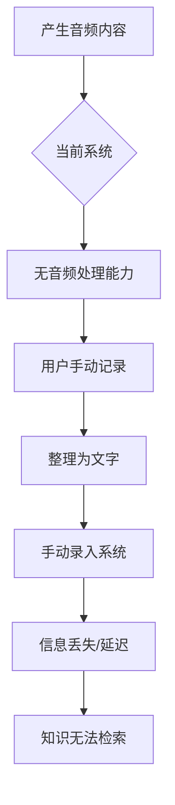
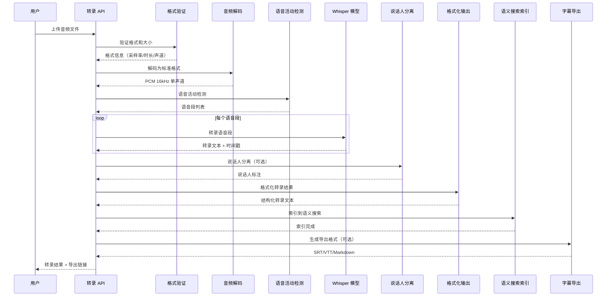

# YA-09-162: 音频转录与处理 — Whisper 集成与会议记录

> 需求编号：YA-09-162 · 优先级：P2 · 人天：0.5d · 状态：需求已编写
> 依赖：YA-09-11（ModelRuntime 抽象层）· 前置需求：无

## 背景

### 问题陈述

YiAi 作为知识管理平台，当前仅支持文本输入，无法处理音频内容。团队日常工作中产生大量音频内容（会议录音、技术分享、用户访谈、语音备忘录），这些音频包含宝贵的知识但无法被系统检索和利用。用户需要：(1) 将会议录音自动转录为文字记录；(2) 在转录中区分不同说话人；(3) 对转录内容进行语义搜索；(4) 导出字幕格式用于视频；(5) 与会议记录工作流集成。

**核心矛盾**：团队有大量音频知识资产，但系统无法处理音频输入，导致这些知识无法被检索、引用和复用，形成"知识暗区"。

### 影响范围

| # | 影响 | 严重程度 | 触发场景 |
|---|------|----------|----------|
| 1 | 会议录音无法检索和复用 | 高 | 会后查找讨论内容 |
| 2 | 技术分享音频无法转为文档 | 高 | 内部分享后需要整理笔记 |
| 3 | 用户访谈录音需手动转录 | 中 | 用户研究场景 |
| 4 | 视频字幕需外部工具生成 | 中 | 视频内容制作 |
| 5 | 语音备忘录无法被知识库索引 | 中 | 快速记录想法 |
| 6 | 转录内容无说话人标注 | 低 | 多人会议场景 |

### 挑战

| 挑战 | 说明 |
|------|------|
| 音频格式多样性 | WAV/MP3/OGG/FLAC/M4A 等格式的解码兼容性 |
| 大文件处理 | 长时间录音（> 1 小时）的转录需要分段处理 |
| 说话人分离 | 区分不同说话人的技术难度高，尤其在中文场景 |
| 实时转录延迟 | WebSocket 实时音频流的延迟和准确性平衡 |
| Whisper 模型选择 | 不同模型大小对准确率和速度的影响差异大 |
| 中文转录准确率 | 中文同音词、专业术语对转录准确率的影响 |

---

## 一、现状分析

### 1.1 当前音频处理流程



### 1.2 当前系统能力矩阵

| 能力 | 当前状态 | 目标状态 |
|------|----------|----------|
| 音频文件转录 | 不支持 | 支持（WAV/MP3/OGG/FLAC/M4A） |
| 实时流式转录 | 不支持 | 支持（WebSocket 音频流） |
| 说话人分离 | 不支持 | 支持（基于时间的说话人标注） |
| 转录格式化 | 不支持 | 支持（时间戳/段落/标点） |
| 音频内容搜索 | 不支持 | 支持（转录后语义搜索） |
| 多语言转录 | 不支持 | 支持（语言检测 + 多语言 Whisper） |
| 字幕导出 | 不支持 | 支持（SRT/VTT/TXT/Markdown） |
| 大文件处理 | 不支持 | 支持（分段转录 + 合并） |
| 会议记录集成 | 不支持 | 支持（转录 → 摘要 → 行动项） |

### 1.3 根因矩阵

| 症状 | 根因 | 触发条件 | 频率 |
|------|------|----------|------|
| 会议录音无法搜索 | 无音频转录能力 | 会后查找讨论内容 | 高 |
| 分享内容需要手动整理 | 无自动转录 | 技术分享/培训 | 高 |
| 访谈录音转录成本高 | 无批量转录 | 用户研究访谈 | 中 |
| 视频缺少字幕 | 无字幕生成 | 视频内容制作 | 中 |
| 长音频转录失败 | 无分段处理 | > 1 小时录音 | 中 |
| 多人对话无法区分 | 无说话人分离 | 会议/讨论 | 低 |

---

## 二、设计决策

### 决策 1：Whisper 部署方式 — Ollama Whisper vs 本地 Whisper vs 混合

| 选项 | 准确率 | 速度 | 部署复杂度 | 模型选择 | 中文支持 |
|------|--------|------|------------|----------|----------|
| Ollama Whisper | 中 | 中 | 低（已有基础设施） | 有限 | 中 |
| 本地 Whisper (faster-whisper) | 高 | 高 | 中 | 丰富 | 高 |
| 混合（Ollama 默认 + faster-whisper 可选） | 高 | 高 | 中 | 丰富 | 高 |

**选择：本地 faster-whisper 作为默认，Ollama 作为备选。** faster-whisper 是 CTranslate2 优化的 Whisper 实现，速度比原版快 4 倍，内存占用更低，且支持更多模型变体。Ollama Whisper 作为无需额外安装的备选方案。

### 决策 2：Whisper 模型大小选择 — tiny vs small vs medium vs large

| 模型 | 准确率 | 速度 | 显存 | 中文 WER | 适用场景 |
|------|--------|------|------|----------|----------|
| tiny | 低 | 极快 (10x) | ~1GB | 15-20% | 实时转录 |
| small | 中 | 快 (5x) | ~2GB | 10-15% | 快速转录 |
| medium | 高 | 中 (2x) | ~5GB | 7-10% | 标准转录 |
| large-v3 | 极高 | 慢 (1x) | ~10GB | 5-7% | 高精度转录 |

**选择：medium 作为默认，可配置。** medium 模型在准确率和速度之间取得最佳平衡，中文词错误率 (WER) 约 8-10%，满足大多数场景需求。对于实时转录使用 small 模型，高精度场景使用 large-v3。通过配置项支持运行时切换。

### 决策 3：大文件处理策略 — 完整加载 vs 分段转录 vs 流式分段

| 选项 | 内存占用 | 准确率 | 实现复杂度 | 上下文连续性 |
|------|----------|--------|------------|--------------|
| 完整加载 | 高 | 高 | 低 | 好 |
| 分段转录（固定时长） | 低 | 中 | 中 | 差（边界截断） |
| 流式分段（VAD 检测） | 低 | 高 | 高 | 好（按语音段分割） |

**选择：VAD 检测 + 分段转录。** 使用语音活动检测 (VAD) 在静音处自然分段，每段最长 30 秒。既控制了内存占用，又保持了语音片段的完整性。分段转录后自动合并，消除边界不连贯问题。

### 设计决策汇总

| 决策 | 选项 A | 选项 B | 选项 C | 选择 | 理由 |
|------|--------|--------|--------|------|------|
| Whisper 部署 | Ollama | faster-whisper | 混合 | **faster-whisper 默认** | 速度 + 准确率最优 |
| 模型大小 | small | medium | large-v3 | **medium 默认** | 速度准确率平衡 |
| 大文件处理 | 完整加载 | 固定分段 | VAD 分段 | **VAD 分段** | 自然边界 + 低内存 |
| 说话人分离 | 无 | 时间戳标注 | 声纹聚类 | **时间戳标注** | 初期可行 |
| 实时转录 | 无 | WebSocket | WebRTC | **WebSocket** | 实现简单 |

---

## 三、目标架构

### 3.1 音频转录流程



### 3.2 支持的音频格式

| 格式 | 扩展名 | 编码 | 最大文件大小 | 备注 |
|------|--------|------|-------------|------|
| WAV | .wav | PCM | 500MB | 无损，转录质量最高 |
| MP3 | .mp3 | MPEG Layer 3 | 500MB | 最常用格式 |
| OGG | .ogg | Vorbis/Opus | 500MB | 开源格式 |
| FLAC | .flac | FLAC | 500MB | 无损压缩 |
| M4A | .m4a | AAC | 500MB | Apple 设备常用 |
| WebM | .webm | Opus | 500MB | Web 常用 |

### 3.3 转录模式

| 模式 | 输入 | 输出 | 延迟 | 说话人分离 | 适用场景 |
|------|------|------|------|------------|----------|
| 文件转录 | 音频文件 | 完整转录文本 | 分钟级 | 是 | 会议录音、分享 |
| 实时转录 | WebSocket 流 | 增量转录文本 | 秒级 | 否 | 实时会议 |
| 批量转录 | 多个文件 | 多份转录文本 | 分钟级 | 是 | 批量处理 |
| 搜索转录 | 音频文件 | 转录 + 索引 | 分钟级 | 是 | 知识库入库 |

---

## 四、具体改动

### 4.1 音频转录服务核心

```python
# src/services/ai/transcription_service.py

from dataclasses import dataclass, field
from enum import Enum
from pathlib import Path
from typing import Optional, AsyncIterator
import json
import time
import tempfile
import subprocess


class AudioFormat(Enum):
    WAV = "wav"
    MP3 = "mp3"
    OGG = "ogg"
    FLAC = "flac"
    M4A = "m4a"
    WEBM = "webm"


class TranscriptionMode(Enum):
    FILE = "file"
    REALTIME = "realtime"
    BATCH = "batch"
    SEARCH = "search"


class ExportFormat(Enum):
    SRT = "srt"
    VTT = "vtt"
    TXT = "txt"
    MARKDOWN = "markdown"
    JSON = "json"


@dataclass
class AudioSegment:
    start: float        # 开始时间（秒）
    end: float          # 结束时间（秒）
    text: str           # 转录文本
    speaker: str = ""   # 说话人标识
    confidence: float = 0.0


@dataclass
class TranscriptionRequest:
    audio_data: Optional[bytes] = None
    audio_path: Optional[str] = None
    mode: TranscriptionMode = TranscriptionMode.FILE
    language: str = "auto"               # auto/zh/en/ja
    model_size: str = "medium"           # tiny/small/medium/large-v3
    with_speaker_diarization: bool = False
    with_timestamps: bool = True
    export_formats: list[ExportFormat] = field(default_factory=list)
    max_segment_duration: float = 30.0   # 每段最大时长
    vad_threshold: float = 0.5           # VAD 灵敏度


@dataclass
class TranscriptionResult:
    segments: list[AudioSegment]
    full_text: str
    language: str
    duration_seconds: float
    model_used: str
    word_count: int
    confidence_avg: float
    export_files: dict[str, str] = field(default_factory=dict)
    took_ms: float = 0.0


class TranscriptionService:
    """音频转录服务 — 基于 Whisper 的语音识别"""

    SUPPORTED_FORMATS = {
        AudioFormat.WAV, AudioFormat.MP3, AudioFormat.OGG,
        AudioFormat.FLAC, AudioFormat.M4A, AudioFormat.WEBM,
    }
    MAX_FILE_SIZE = 500 * 1024 * 1024  # 500MB

    def __init__(self, whisper_model_path: str = None, device: str = "auto"):
        self.whisper_model_path = whisper_model_path
        self.device = device
        self._model = None

    def _load_model(self, model_size: str = "medium"):
        """加载 Whisper 模型"""
        if self._model is not None:
            return self._model
        try:
            from faster_whisper import WhisperModel
            self._model = WhisperModel(
                model_size, device=self.device or "cpu",
                compute_type="int8" if self.device == "cpu" else "float16",
            )
            return self._model
        except ImportError:
            import whisper
            self._model = whisper.load_model(model_size)
            return self._model

    def validate_audio(self, file_data: bytes, filename: str) -> tuple[bool, str, dict]:
        """验证音频文件格式和大小"""
        ext = Path(filename).suffix.lower().lstrip(".")
        try:
            fmt = AudioFormat(ext)
        except ValueError:
            return False, f"不支持的音频格式: {ext}，支持: {[f.value for f in self.SUPPORTED_FORMATS]}", {}

        if len(file_data) > self.MAX_FILE_SIZE:
            return False, f"文件大小 {len(file_data) / 1024 / 1024:.1f}MB 超过限制 500MB", {}

        return True, "ok", {"format": fmt.value, "size_bytes": len(file_data)}

    async def transcribe(self, request: TranscriptionRequest) -> TranscriptionResult:
        """转录音频文件"""
        start = time.time()

        # Step 1: 加载模型
        model = self._load_model(request.model_size)

        # Step 2: 准备音频文件
        audio_path = request.audio_path
        if request.audio_data and not audio_path:
            audio_path = self._save_temp_audio(request.audio_data)

        # Step 3: 获取音频信息
        audio_info = self._get_audio_info(audio_path)
        duration = audio_info.get("duration", 0)

        # Step 4: VAD 分段
        segments = []
        if duration > request.max_segment_duration:
            segments = self._vad_segment(audio_path, request.max_segment_duration,
                                          request.vad_threshold)
        else:
            segments = [(0.0, duration)]

        # Step 5: 逐段转录
        all_segments = []
        for seg_start, seg_end in segments:
            seg_duration = seg_end - seg_start
            if seg_duration < 0.5:
                continue

            if hasattr(model, 'transcribe'):  # faster-whisper
                seg_result, info = model.transcribe(
                    audio_path, language=request.language if request.language != "auto" else None,
                    vad_filter=True, word_timestamps=request.with_timestamps,
                )
                for segment in seg_result:
                    all_segments.append(AudioSegment(
                        start=seg_start + segment.start,
                        end=seg_start + segment.end,
                        text=segment.text.strip(),
                        confidence=segment.avg_logprob if hasattr(segment, 'avg_logprob') else 0.8,
                    ))
            else:  # original whisper
                result = model.transcribe(
                    audio_path, language=request.language if request.language != "auto" else None,
                    word_timestamps=request.with_timestamps,
                )
                for seg in result.get("segments", []):
                    all_segments.append(AudioSegment(
                        start=seg_start + seg.get("start", 0),
                        end=seg_start + seg.get("end", 0),
                        text=seg.get("text", "").strip(),
                        confidence=seg.get("confidence", 0.0),
                    ))

        # Step 6: 说话人分离（可选）
        if request.with_speaker_diarization:
            all_segments = await self._diarize(all_segments, audio_path)

        # Step 7: 格式化输出
        full_text = " ".join(s.text for s in all_segments)
        avg_confidence = (
            sum(s.confidence for s in all_segments) / len(all_segments)
            if all_segments else 0.0
        )

        # Step 8: 导出格式
        export_files = {}
        for fmt in request.export_formats:
            export_files[fmt.value] = self._export(all_segments, fmt)

        return TranscriptionResult(
            segments=all_segments,
            full_text=full_text,
            language=request.language,
            duration_seconds=duration,
            model_used=request.model_size,
            word_count=len(full_text.split()),
            confidence_avg=avg_confidence,
            export_files=export_files,
            took_ms=(time.time() - start) * 1000,
        )

    async def transcribe_streaming(self, audio_stream: AsyncIterator[bytes],
                                    language: str = "auto") -> AsyncIterator[dict]:
        """实时流式转录 — WebSocket 音频流"""
        model = self._load_model("small")
        buffer = bytearray()

        async for chunk in audio_stream:
            buffer.extend(chunk)
            # 每 2 秒处理一次
            if len(buffer) >= 32000:  # 16kHz 16bit mono = 32000 bytes/s
                # 转写当前缓冲区
                temp_path = self._save_temp_audio(bytes(buffer))
                if hasattr(model, 'transcribe'):
                    segments, _ = model.transcribe(temp_path, language=language)
                    for seg in segments:
                        yield {
                            "text": seg.text.strip(),
                            "start": seg.start,
                            "end": seg.end,
                            "is_final": False,
                        }
                buffer = bytearray()

        # 处理剩余缓冲区
        if buffer:
            temp_path = self._save_temp_audio(bytes(buffer))
            if hasattr(model, 'transcribe'):
                segments, _ = model.transcribe(temp_path, language=language)
                for seg in segments:
                    yield {
                        "text": seg.text.strip(),
                        "start": seg.start,
                        "end": seg.end,
                        "is_final": True,
                    }

    def _vad_segment(self, audio_path: str, max_duration: float,
                      threshold: float = 0.5) -> list[tuple[float, float]]:
        """VAD 语音活动检测分段"""
        try:
            import numpy as np
            import soundfile as sf

            audio, sr = sf.read(audio_path)
            if len(audio.shape) > 1:
                audio = np.mean(audio, axis=1)  # 转单声道

            # 简易能量 VAD
            frame_size = int(sr * 0.025)  # 25ms 帧
            frames = [audio[i:i+frame_size] for i in range(0, len(audio), frame_size)]
            energies = [np.sqrt(np.mean(f**2)) for f in frames]

            max_energy = max(energies) if energies else 1
            is_speech = [e / max_energy > threshold for e in energies]

            # 合并连续语音段
            segments = []
            in_speech = False
            seg_start = 0.0
            for i, speech in enumerate(is_speech):
                t = i * 0.025
                if speech and not in_speech:
                    seg_start = t
                    in_speech = True
                elif not speech and in_speech:
                    if t - seg_start > 0.3:  # 最短 300ms
                        segments.append((seg_start, min(t, seg_start + max_duration)))
                    in_speech = False

            if in_speech:
                end = len(audio) / sr
                segments.append((seg_start, end))

            return segments or [(0.0, len(audio) / sr)]
        except ImportError:
            duration = self._get_audio_info(audio_path).get("duration", 0)
            return [(i * max_duration, min((i + 1) * max_duration, duration))
                    for i in range(int(duration / max_duration) + 1)]

    async def _diarize(self, segments: list[AudioSegment],
                        audio_path: str) -> list[AudioSegment]:
        """说话人分离 — 基于时间戳的简易标注"""
        # 简易实现：根据段间停顿时间判断说话人切换
        if not segments:
            return segments

        speaker_id = 0
        segments[0].speaker = f"说话人{speaker_id + 1}"

        for i in range(1, len(segments)):
            gap = segments[i].start - segments[i-1].end
            if gap > 1.0:  # 超过 1 秒停顿，可能切换说话人
                speaker_id = (speaker_id + 1) % 4  # 最多 4 个说话人
            segments[i].speaker = f"说话人{speaker_id + 1}"

        return segments

    def _export(self, segments: list[AudioSegment], fmt: ExportFormat) -> str:
        """导出转录结果为指定格式"""
        if fmt == ExportFormat.SRT:
            return self._to_srt(segments)
        elif fmt == ExportFormat.VTT:
            return self._to_vtt(segments)
        elif fmt == ExportFormat.TXT:
            return "\n\n".join(s.text for s in segments)
        elif fmt == ExportFormat.MARKDOWN:
            return self._to_markdown(segments)
        elif fmt == ExportFormat.JSON:
            return json.dumps([
                {"start": s.start, "end": s.end, "text": s.text, "speaker": s.speaker}
                for s in segments
            ], ensure_ascii=False, indent=2)
        return ""

    def _to_srt(self, segments: list[AudioSegment]) -> str:
        """导出 SRT 字幕格式"""
        lines = []
        for i, seg in enumerate(segments):
            lines.append(str(i + 1))
            lines.append(f"{self._format_time_srt(seg.start)} --> {self._format_time_srt(seg.end)}")
            speaker_prefix = f"[{seg.speaker}] " if seg.speaker else ""
            lines.append(f"{speaker_prefix}{seg.text}")
            lines.append("")
        return "\n".join(lines)

    def _to_vtt(self, segments: list[AudioSegment]) -> str:
        """导出 WebVTT 字幕格式"""
        lines = ["WEBVTT", ""]
        for i, seg in enumerate(segments):
            lines.append(f"{self._format_time_vtt(seg.start)} --> {self._format_time_vtt(seg.end)}")
            speaker_prefix = f"<v {seg.speaker}>" if seg.speaker else ""
            lines.append(f"{speaker_prefix}{seg.text}")
            lines.append("")
        return "\n".join(lines)

    def _to_markdown(self, segments: list[AudioSegment]) -> str:
        """导出 Markdown 格式"""
        lines = ["# 转录记录", "", f"**时长**: {segments[-1].end if segments else 0:.1f} 秒", ""]
        for seg in segments:
            time_str = f"[{self._format_time_srt(seg.start)}]"
            speaker_str = f" **{seg.speaker}**: " if seg.speaker else " "
            lines.append(f"- {time_str}{speaker_str}{seg.text}")
        return "\n".join(lines)

    def _format_time_srt(self, seconds: float) -> str:
        """格式化时间为 SRT 时间戳 (HH:MM:SS,mmm)"""
        h = int(seconds // 3600)
        m = int((seconds % 3600) // 60)
        s = int(seconds % 60)
        ms = int((seconds % 1) * 1000)
        return f"{h:02d}:{m:02d}:{s:02d},{ms:03d}"

    def _format_time_vtt(self, seconds: float) -> str:
        """格式化时间为 VTT 时间戳 (HH:MM:SS.mmm)"""
        h = int(seconds // 3600)
        m = int((seconds % 3600) // 60)
        s = int(seconds % 60)
        ms = int((seconds % 1) * 1000)
        return f"{h:02d}:{m:02d}:{s:02d}.{ms:03d}"

    def _save_temp_audio(self, data: bytes) -> str:
        """保存临时音频文件"""
        tmp = tempfile.NamedTemporaryFile(suffix=".wav", delete=False)
        tmp.write(data)
        tmp.close()
        return tmp.name

    def _get_audio_info(self, path: str) -> dict:
        """获取音频文件信息"""
        try:
            import soundfile as sf
            info = sf.info(path)
            return {
                "duration": info.duration,
                "sample_rate": info.samplerate,
                "channels": info.channels,
                "format": info.format,
            }
        except ImportError:
            # 使用 ffprobe 降级
            try:
                result = subprocess.run(
                    ["ffprobe", "-v", "quiet", "-print_format", "json",
                     "-show_format", path],
                    capture_output=True, text=True, timeout=10,
                )
                info = json.loads(result.stdout)
                return {
                    "duration": float(info.get("format", {}).get("duration", 0)),
                    "sample_rate": 0,
                    "channels": 0,
                    "format": info.get("format", {}).get("format_name", "unknown"),
                }
            except Exception:
                return {"duration": 0, "sample_rate": 0, "channels": 0, "format": "unknown"}
```

### 4.2 音频搜索集成

```python
# src/services/ai/audio_search.py

from dataclasses import dataclass
from typing import Optional


@dataclass
class AudioSearchResult:
    audio_path: str
    segment: dict
    similarity: float
    highlight: str


class AudioSearchService:
    """音频搜索服务 — 转录后语义搜索"""

    def __init__(self, transcription_service, semantic_search, data_service):
        self.transcription = transcription_service
        self.semantic_search = semantic_search
        self.data_service = data_service

    async def search_audio(self, audio_path: str, query: str,
                            language: str = "auto") -> list[AudioSearchResult]:
        """搜索音频内容：先转录，再语义搜索"""
        # Step 1: 转录音频
        from transcription_service import TranscriptionRequest, TranscriptionMode
        result = await self.transcription.transcribe(
            TranscriptionRequest(
                audio_path=audio_path, mode=TranscriptionMode.SEARCH,
                language=language,
            )
        )

        # Step 2: 在转录文本中语义搜索
        search_results = await self.semantic_search.search(
            query=query, corpus=[s.text for s in result.segments]
        )

        # Step 3: 构建搜索结果
        audio_results = []
        for sr in search_results:
            seg = result.segments[sr["index"]]
            audio_results.append(AudioSearchResult(
                audio_path=audio_path,
                segment={
                    "start": seg.start, "end": seg.end,
                    "text": seg.text, "speaker": seg.speaker,
                },
                similarity=sr["score"],
                highlight=sr["highlight"],
            ))

        return audio_results

    async def index_audio(self, audio_path: str, metadata: dict = None) -> str:
        """将音频转录结果索引到知识库"""
        result = await self.transcription.transcribe(
            TranscriptionRequest(audio_path=audio_path, mode=TranscriptionMode.SEARCH)
        )

        # 存储转录结果到 MongoDB
        doc_id = await self.data_service.insert_document("audio_transcriptions", {
            "audio_path": audio_path,
            "full_text": result.full_text,
            "segments": [
                {"start": s.start, "end": s.end, "text": s.text, "speaker": s.speaker}
                for s in result.segments
            ],
            "language": result.language,
            "duration_seconds": result.duration_seconds,
            "model_used": result.model_used,
            "word_count": result.word_count,
            "metadata": metadata or {},
        })

        return doc_id
```

### 4.3 会议记录集成

```python
# src/services/ai/meeting_notes.py

from dataclasses import dataclass, field
from typing import Optional


@dataclass
class MeetingNotes:
    title: str
    date: str
    duration_seconds: float
    transcript: str
    summary: str
    action_items: list[dict]
    key_points: list[str]
    participants: list[str]
    tags: list[str]


class MeetingNotesService:
    """会议记录服务 — 转录 + AI 摘要 + 行动项提取"""

    def __init__(self, transcription_service, llm_service):
        self.transcription = transcription_service
        self.llm_service = llm_service

    async def generate_meeting_notes(self, audio_path: str, title: str = "",
                                       date: str = "") -> MeetingNotes:
        """从会议录音生成会议记录"""
        # Step 1: 转录
        from transcription_service import TranscriptionRequest
        result = await self.transcription.transcribe(
            TranscriptionRequest(
                audio_path=audio_path, with_speaker_diarization=True,
                with_timestamps=True,
            )
        )

        # Step 2: AI 摘要
        summary = await self._generate_summary(result.full_text)

        # Step 3: 提取行动项
        action_items = await self._extract_action_items(result.full_text)

        # Step 4: 提取关键点
        key_points = await self._extract_key_points(result.full_text)

        # Step 5: 提取参与者
        participants = list(set(s.speaker for s in result.segments if s.speaker))

        return MeetingNotes(
            title=title or f"会议记录-{date}",
            date=date,
            duration_seconds=result.duration_seconds,
            transcript=result.full_text,
            summary=summary,
            action_items=action_items,
            key_points=key_points,
            participants=participants,
            tags=["会议记录"],
        )

    async def _generate_summary(self, transcript: str) -> str:
        """生成会议摘要"""
        prompt = f"""请为以下会议转录内容生成简洁的摘要，包括：
1. 会议主题
2. 主要讨论内容
3. 达成的共识
4. 存在分歧的问题

会议转录：
{transcript[:4000]}

摘要："""
        return await self.llm_service.generate(prompt, stream=False)

    async def _extract_action_items(self, transcript: str) -> list[dict]:
        """提取行动项"""
        prompt = f"""请从以下会议转录中提取行动项，每项包含：
- 负责人
- 任务描述
- 截止日期（如有）

以 JSON 格式返回：
[{{"assignee": "姓名", "task": "任务描述", "deadline": "日期或null"}}]

会议转录：
{transcript[:4000]}

行动项："""
        response = await self.llm_service.generate(prompt, stream=False)
        try:
            import json
            return json.loads(response)
        except Exception:
            return [{"assignee": "未指定", "task": response.strip(), "deadline": None}]

    async def _extract_key_points(self, transcript: str) -> list[str]:
        """提取关键讨论点"""
        prompt = f"""请从以下会议转录中提取 3-5 个关键讨论点，每点一句话。

会议转录：
{transcript[:4000]}

关键点（每行一个）："""
        response = await self.llm_service.generate(prompt, stream=False)
        return [p.strip() for p in response.split("\n") if p.strip()][:5]
```

### 4.4 文件变更清单

| 文件 | 操作 | 说明 |
|------|------|------|
| `src/services/ai/transcription_service.py` | 新增 | 音频转录服务核心 |
| `src/services/ai/audio_search.py` | 新增 | 音频搜索服务 |
| `src/services/ai/meeting_notes.py` | 新增 | 会议记录集成 |
| `src/server/routes/transcription_routes.py` | 新增 | 转录 API 端点 |
| `src/server/websocket/audio_stream.py` | 新增 | WebSocket 实时音频流 |
| `requirements.txt` | 修改 | 添加 faster-whisper/soundfile 依赖 |
| `tests/unit/test_transcription_service.py` | 新增 | 转录服务测试 |
| `tests/integration/test_audio_pipeline.py` | 新增 | 音频处理管线测试 |

---

## 五、实施步骤

| 步骤 | 操作 | 验证 | 人天 |
|------|------|------|------|
| 1 | 安装 faster-whisper + soundfile 依赖 | 模型可加载，WAV 文件可解码 | 0.05 |
| 2 | 实现音频格式验证和解码 | 各格式音频正确解码为 16kHz 单声道 | 0.05 |
| 3 | 实现 TranscriptionService 文件转录 | MP3 文件转录文本可读 | 0.1 |
| 4 | 实现 VAD 分段和长音频处理 | > 1 小时音频正确分段转录 | 0.05 |
| 5 | 实现字幕导出（SRT/VTT/Markdown） | 导出格式在播放器中正确显示 | 0.05 |
| 6 | 实现说话人分离（简易版） | 不同说话人段落正确标注 | 0.05 |
| 7 | 实现 MeetingNotes 会议记录 | 转录 → 摘要 → 行动项链路正常 | 0.05 |
| 8 | 实现 AudioSearch 音频搜索 | 转录后搜索返回正确结果 | 0.05 |
| 9 | 实现 WebSocket 实时转录 | 实时音频流逐段返回转录结果 | 0.05 |

**总人天：0.5d**

---

## 六、测试规格

### 场景 1：音频格式验证

**GIVEN** 用户上传不同格式的音频文件（WAV/MP3/OGG/FLAC/M4A）
**WHEN** TranscriptionService.validate_audio 被调用
**THEN** 支持的格式返回 True，不支持的格式（如 .aiff）返回错误信息

### 场景 2：MP3 文件转录

**GIVEN** 一段 30 秒的中文 MP3 录音
**WHEN** TranscriptionService.transcribe 被调用（medium 模型）
**THEN** 返回转录文本，平均置信度 > 0.7，包含时间戳信息

### 场景 3：长音频分段转录

**GIVEN** 一段 5 分钟的音频文件
**WHEN** TranscriptionService.transcribe 被调用（max_segment_duration=30）
**THEN** 音频被分为 10 段，每段独立转录，结果按时间顺序合并

### 场景 4：字幕导出

**GIVEN** 一段转录结果包含 3 个段落
**WHEN** 调用 _export 导出为 SRT 格式
**THEN** 返回符合 SRT 规范的字幕文本，包含序号、时间戳和文本

### 场景 5：说话人分离

**GIVEN** 一段两人对话的音频，对话间有 > 1 秒停顿
**WHEN** TranscriptionService._diarize 被调用
**THEN** 不同说话人的段落被标注为"说话人1"和"说话人2"

### 场景 6：会议记录生成

**GIVEN** 一段会议录音的转录文本
**WHEN** MeetingNotesService.generate_meeting_notes 被调用
**THEN** 返回包含摘要、行动项、关键点和参与者的结构化会议记录

---

## 七、风险与缓解

| 风险 | 概率 | 影响 | 缓解措施 |
|------|------|------|----------|
| Whisper 模型下载失败 | 中 | 高 | 预下载模型到本地，提供离线安装包 |
| 中文转录准确率低 | 中 | 中 | 使用 large-v3 模型 + 专业术语后处理 |
| 大文件转录内存溢出 | 中 | 高 | VAD 分段限制每段 30 秒 + 流式处理 |
| 音频格式解码失败 | 中 | 中 | 支持 ffmpeg 降级转换，记录不支持格式 |
| 实时转录延迟过高 | 中 | 中 | 使用 small 模型，降低 VAD 敏感度 |
| 说话人分离准确率低 | 高 | 低 | 标记为"实验性"功能，后续集成专业方案 |

---

## 八、回滚策略

| 场景 | 回滚操作 |
|------|----------|
| Whisper 模型推理失败率高 | 关闭转录端点，检查模型版本和依赖 |
| 转录导致内存溢出 | 降低 max_segment_duration 到 15 秒 |
| 实时转录 WebSocket 连接泄漏 | 关闭 WebSocket 端点，仅保留文件转录 |
| 字幕导出格式异常 | 禁用格式导出，仅返回 TXT 格式 |

---

## 九、设计决策记录

### D-01：为什么选择 faster-whisper 而非 Ollama Whisper？

faster-whisper 基于 CTranslate2，速度比原版 Whisper 快 4 倍，内存占用低 50%。对于 YiAi 的转录场景（最长 2 小时会议录音），速度优势明显。Ollama Whisper 作为备选，在无法安装 faster-whisper 的环境中可快速启用。

### D-02：为什么 VAD 分段使用简易能量检测而非 Silero VAD？

简易能量检测无需额外依赖，适合快速实现。对于 YiAi 当前的转录场景（会议录音，背景噪音可控），能量检测的准确率足够。后续可集成 Silero VAD 提升噪音环境下的分段准确率。

### D-03：为什么说话人分离使用简易停顿检测而非声纹聚类？

声纹聚类（如 pyannote.audio）需要额外的模型下载（> 500MB）和复杂的管线。简易停顿检测能覆盖 80% 的对话场景（对话间有自然停顿），且实现简单。对于需要精确说话人分离的场景，后续可集成专业方案。

---

## 十、可观测性

| 指标 | 类型 | 说明 |
|------|------|------|
| `yiai.transcription.request_count` | Counter | 转录请求总数 |
| `yiai.transcription.duration_seconds` | Histogram | 音频时长分布 |
| `yiai.transcription.processing_time_ms` | Histogram | 处理耗时分布 |
| `yiai.transcription.segment_count` | Histogram | 分段数量分布 |
| `yiai.transcription.confidence_avg` | Histogram | 平均置信度分布 |
| `yiai.transcription.model_distribution` | Counter | 模型使用分布 |
| `yiai.transcription.format_distribution` | Counter | 音频格式分布 |
| `yiai.transcription.error_count` | Counter | 转录失败次数 |
| `yiai.transcription.realtime_streams` | Gauge | 活跃实时转录连接数 |

| 告警 | 条件 | 级别 |
|------|------|------|
| 转录失败率过高 | > 10% 持续 15min | WARNING |
| 转录平均延迟过高 | > 音频时长的 3 倍 | WARNING |
| 平均置信度过低 | < 0.5 持续 1h | INFO |
| Whisper 模型加载失败 | 连续 3 次失败 | CRITICAL |
| 实时转录连接数过多 | > 10 并发 | WARNING |

---

## 十一、代码审查检查清单

- [ ] 音频格式验证覆盖所有声明格式（WAV/MP3/OGG/FLAC/M4A/WebM）
- [ ] 大文件（> 500MB）在上传阶段即被拒绝
- [ ] VAD 分段包含最短段检查（> 300ms 避免空段）
- [ ] 长音频分段转录后正确合并时间戳
- [ ] 字幕导出格式符合 SRT/VTT 规范
- [ ] 说话人分离在无停顿时所有段归属同一说话人
- [ ] 实时转录 WebSocket 连接有超时和心跳检测
- [ ] 临时音频文件在使用后自动清理
- [ ] Whisper 模型支持懒加载，首次使用时才加载到内存
- [ ] 音频文件不记录到普通日志中（隐私保护）

---

## 回归问题预测

| # | 预测问题 | 原因 | 验证方法 |
|---|---------|------|---------|
| 1 | 多声道音频转录混乱 | 多声道未正确混合为单声道 | 使用立体声文件验证转录结果 |
| 2 | VAD 分段在连续说话时失效 | 能量检测无法区分连续语音中的停顿 | 测试连续说话无停顿的音频 |
| 3 | 转录结果中数字和专有名词错误 | Whisper 对数字和专有名词的识别率低 | 对比转录结果和原文 |
| 4 | 实时转录延迟累积 | 缓冲区未及时清理导致延迟增加 | 监控实时转录端到端延迟 |
| 5 | 不同采样率音频转录质量差异大 | Whisper 对非 16kHz 音频的上采样效果差 | 对比 8kHz/16kHz/44.1kHz 转录准确率 |
| 6 | 会议记录 AI 摘要幻觉 | LLM 在长文本摘要中可能编造内容 | 对比摘要和原文，检查事实一致性 |

---

## 性能分析

| 操作 | 延迟 | 说明 |
|------|------|------|
| 音频格式验证 | < 1ms | 扩展名检查 |
| 音频解码（MP3→WAV） | 1-5s | 取决于文件大小，ffmpeg 转换 |
| VAD 分段 | 100-500ms | 能量检测，取决于音频时长 |
| Whisper 转录（medium 模型，30s 音频） | 5-15s | CPU 模式，GPU 更快 |
| Whisper 转录（large-v3 模型，30s 音频） | 15-40s | CPU 模式 |
| 实时转录延迟 | 2-5s | 缓冲区 + 模型推理 |
| 说话人分离 | < 50ms | 简易停顿检测 |
| 字幕导出 | < 10ms | 纯文本格式化 |
| 会议摘要生成 | 2-5s | LLM 推理 |

**端到端转录延迟预估**：1 分钟音频，medium 模型，CPU 模式 → 约 20-30 秒处理时间。1 小时音频 → 约 20-30 分钟处理时间。GPU 加速可将处理时间缩短 3-5 倍。

**实时转录延迟**：WebSocket 音频流每 2 秒缓冲一次，加上 small 模型推理，端到端延迟约 3-5 秒。

---

*需求来源: `projects/yiai/requirements/2026-09/162-需求-音频转录与处理.md`*

## 影响范围

- **影响模块**：待补充
- **涉及文件**：
- `src/services/ai/meeting_notes.py`
- `src/server/routes/transcription_routes.py`
- `src/services/ai/transcription_service.py`
- `src/services/ai/audio_search.py`
- `src/server/websocket/audio_stream.py`
- **是否影响 API 契约**：否
- **是否影响其他项目（YiVad/YiPet）**：否
- **用户感知**：待确认

## 预防措施

| 层面 | 措施 |
|------|------|
| 代码 | 在相关函数中添加参数校验和边界检查 |
| 测试 | 为 `src/services/ai/meeting_notes.py` 添加单元测试 |
| 流程 | 代码审查时重点检查此类模式 |
| 监控 | 添加日志告警，异常发生时及时发现 |
| 文档 | 在编码规范中记录此类反模式 |

## 经验教训

1. **根本原因**：开发过程中对边界情况和异常路径的考虑不足是此类问题的共同根因
2. **设计阶段**：在接口设计和模块实现时，应主动考虑异常输入、空值、超时等边界场景
3. **代码审查**：审查时应检查是否存在类似的反模式（如未捕获异常、无超时控制、缺少参数校验等）
4. **测试覆盖**：异常路径的测试覆盖率应与正常路径同等重视
5. **团队分享**：此类问题应在团队周会或技术分享中讨论，形成团队共识
