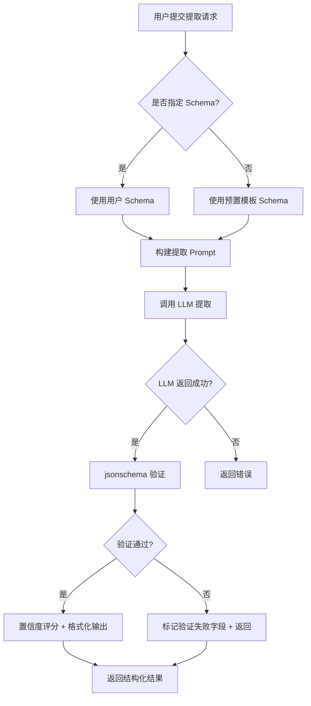

# YA-09-163: 结构化数据提取 — LLM 驱动的非结构化文本信息抽取

> 需求编号：YA-09-163 · 优先级：P2 · 人天：0.5d · 状态：需求已编写
> 依赖：AI 聊天服务（chat_service）、ModelRuntime 抽象层

## 背景

YiAi 当前仅支持自由对话式 AI 交互，缺乏从非结构化文本中自动提取结构化数据的能力。用户在以下场景中需要手动解析文本：

- **会议纪要提取**：从长篇会议记录中提取行动项、负责人、截止日期
- **聊天日志分析**：从客服对话中提取 Bug 描述、复现步骤、期望结果
- **邮件信息提取**：从邮件正文中提取需求描述、优先级、相关方
- **代码审查摘要**：从代码审查评论中提取问题分类、严重程度、修复建议

这些场景的共同需求是：给定一段非结构化文本和结构化 Schema，LLM 自动填充 Schema 字段并返回结构化数据。当前用户只能通过手动构造 prompt 在聊天中完成，效率低且格式不可控。

需要一个独立的**结构化数据提取服务**，支持 Schema 定义、置信度评分、批量处理、流式输出，并附带预置模板库以覆盖常见提取场景。

---

## 一、现状分析

### 1.1 当前问题

| # | 问题 | 严重程度 | 影响 |
|---|------|----------|------|
| 1 | 无非结构化文本自动提取能力 | 高 | 用户需手动从长文本中提取结构化信息，耗时且易遗漏 |
| 2 | 提取格式不统一 | 中 | 不同用户手动构造 prompt 提取结果格式各异，无法自动化处理 |
| 3 | 无置信度评估 | 中 | 用户无法判断提取结果的可靠性，需人工逐条验证 |
| 4 | 无批量处理能力 | 中 | 多文档提取需逐个处理，无法批量提交 |
| 5 | 无预置模板 | 低 | 每次提取需重新编写 prompt，重复工作多 |

### 1.2 改造前数据流

```
用户需要从文本中提取结构化信息
  → 在聊天中手动编写 prompt："请从以下会议记录中提取行动项..."
  → 粘贴文本内容
  → LLM 返回自然语言格式的结果
  → 用户手动复制结果，粘贴到表格/文档中
  → 格式不统一，需手动整理
  → 无置信度，需人工验证每条提取结果
  → 多文档场景下逐个处理，耗时数小时
```

### 1.3 改造前 API 依赖

| # | 接口 | 调用方 | 说明 |
|---|------|--------|------|
| 1 | `services.ai.chat_service.chat` | YiVad/YiPet | 聊天接口（改造前用户通过聊天手动提取，无独立提取服务） |

> 改造前仅 1 个间接 API 依赖。结构化提取完全依赖用户在聊天中手动构造 prompt，无 Schema 约束、无置信度、无批量处理。

### 1.4 设计灵感

参考 LangChain 的 `StructuredOutputParser` 和 instructor 库的 `response_model` 模式，结合 JSON Schema 作为提取协议。核心思路：用户定义 Schema → LLM 按 Schema 提取 → 校验 + 置信度评分 → 返回结构化结果。

---

## 二、设计决策

### 决策 1：提取协议 — JSON Schema vs 自定义 DSL

| 维度 | JSON Schema | 自定义 DSL |
|------|-------------|------------|
| 标准化程度 | 高（JSON Schema Draft 7） | 低（需学习新语法） |
| 生态兼容 | 广泛支持（Pydantic、OpenAI Function Calling） | 无生态 |
| 表达能力 | 强（类型、约束、嵌套、引用） | 取决于设计 |
| LLM 理解 | 中（需在 prompt 中解释） | 中 |
| 实现复杂度 | 低（Python `jsonschema` 库验证） | 高（需实现解析器） |

**选择：JSON Schema。** 标准化程度高，Python 生态有成熟的 `jsonschema` 验证库，且与 OpenAI Function Calling 的 `parameters` 格式一致，未来可复用。

### 决策 2：置信度评分机制 — LLM 自评 vs 规则计算

| 维度 | LLM 自评 | 规则计算 |
|------|----------|----------|
| 准确性 | 中（LLM 可能过度自信或不自信） | 低（无法理解语义） |
| 额外开销 | 高（需额外 LLM 调用） | 低（纯计算） |
| 实现复杂度 | 低（在一次调用中让 LLM 同时返回 confidence） | 中（需设计规则） |

**选择：LLM 自评。** 要求 LLM 在提取每个字段时同时返回 `confidence`（0-1 浮点数），在一次调用中完成提取和评分。LLM 对语义理解准确，能给出有意义的置信度。

### 决策 3：提取模板库 — 内置 vs 动态加载

| 维度 | 内置模板（代码中） | 动态加载（MongoDB/JSON 文件） |
|------|-------------------|------------------------------|
| 维护成本 | 低（代码版本控制） | 中（需管理模板数据） |
| 扩展性 | 低（需修改代码） | 高（用户可自定义模板） |
| 实现复杂度 | 低 | 中 |

**选择：内置模板 + 动态加载。** 初始版本内置 5 个常用模板（会议纪要、Bug 提取、需求提取、简历解析、合同要素），后续支持用户通过 API 上传自定义模板存储到 MongoDB。

### 设计决策记录

| 决策 | 选项 A | 选项 B | 选择 | 理由 |
|------|--------|--------|------|------|
| 提取协议 | JSON Schema | 自定义 DSL | **JSON Schema** | 标准化，生态兼容，Pydantic 验证 |
| 置信度评分 | LLM 自评 | 规则计算 | **LLM 自评** | 语义理解准确，一次调用完成 |
| 模板管理 | 内置模板 | 动态加载 | **内置 + 动态加载** | 初始内置常用模板，后续支持自定义 |

---

## 三、目标架构

### 3.1 提取流程



### 3.2 核心数据模型

```python
# domain/extraction/models.py

from enum import Enum
from pydantic import BaseModel, Field

class OutputFormat(str, Enum):
    JSON = "json"
    CSV = "csv"
    YAML = "yaml"

class ExtractedField(BaseModel):
    field_name: str
    value: str
    confidence: float = Field(ge=0.0, le=1.0)
    source_span: str | None = None  # 原文中的引用片段

class ExtractionResult(BaseModel):
    success: bool
    fields: list[ExtractedField]
    raw_output: str           # LLM 原始输出
    validation_errors: list[str] = []
    token_usage: int = 0
    duration_ms: float = 0.0

class ExtractionTemplate(BaseModel):
    name: str
    description: str
    schema: dict              # JSON Schema
    prompt_template: str      # 提取 prompt 模板
    category: str             # 模板分类
    version: str = "1.0.0"
```

### 3.3 实体提取类型

```python
class EntityType(str, Enum):
    PERSON = "person"           # 人名
    ORGANIZATION = "organization"  # 组织/公司
    DATE = "date"              # 日期
    LOCATION = "location"      # 地点
    EMAIL = "email"            # 邮箱
    PHONE = "phone"            # 电话
    URL = "url"                # 网址
    CODE = "code"              # 代码片段
    ERROR_MESSAGE = "error_message"  # 错误信息
```

---

## 四、具体改动

### 4.1 新增文件

| 文件 | 行数 | 说明 |
|------|------|------|
| `src/domain/extraction/__init__.py` | 8 | 模块导出 |
| `src/domain/extraction/models.py` | 60 | 数据模型：ExtractionResult、ExtractionTemplate、EntityType |
| `src/domain/extraction/schema_validator.py` | 50 | JSON Schema 校验器 |
| `src/domain/extraction/templates.py` | 150 | 预置模板库（5 个模板） |
| `src/domain/extraction/formatter.py` | 80 | 输出格式化：JSON/CSV/YAML |
| `src/services/extraction/extraction_service.py` | 200 | 提取服务：RPC 接口 + 核心逻辑 |

### 4.2 核心实现

**提取 Prompt 构建：**

```python
# domain/extraction/prompt_builder.py

EXTRACTION_SYSTEM_PROMPT = """You are a structured data extraction assistant.
Given a text and a JSON Schema, extract matching fields from the text.

Rules:
1. For each field in the schema, extract the matching value from the text.
2. Provide a confidence score (0.0-1.0) for each extracted field.
3. If a field cannot be found in the text, set value to null and confidence to 0.0.
4. Include a "source_span" for each field — the exact text fragment that supports the extraction.
5. Return ONLY valid JSON matching the output schema.

Output format:
{
  "fields": [
    {
      "field_name": "<schema field name>",
      "value": "<extracted value or null>",
      "confidence": 0.95,
      "source_span": "<exact text from source>"
    }
  ]
}"""

def build_extraction_prompt(
    text: str,
    schema: dict,
    template: ExtractionTemplate | None = None,
) -> list[dict]:
    """构建提取 prompt 消息列表。"""
    schema_str = json.dumps(schema, indent=2, ensure_ascii=False)

    user_prompt = f"""Extract structured data from the following text according to the JSON Schema.

## JSON Schema
```json
{schema_str}
```

## Text to Extract From
```
{text[:8000]}  # 截断至 8000 字符，防止超出 context window
```

Extract all matching fields. Return ONLY the JSON result."""

    if template and template.prompt_template:
        system_prompt = template.prompt_template
    else:
        system_prompt = EXTRACTION_SYSTEM_PROMPT

    return [
        {"role": "system", "content": system_prompt},
        {"role": "user", "content": user_prompt},
    ]
```

**Schema 校验器：**

```python
# domain/extraction/schema_validator.py

import jsonschema
from jsonschema import validate, ValidationError

def validate_schema(schema: dict) -> list[str]:
    """验证 JSON Schema 是否合法，返回错误列表。"""
    errors = []
    try:
        # 检查必需字段
        if "type" not in schema:
            errors.append("Schema must have a 'type' field")
        if schema.get("type") != "object":
            errors.append("Schema root type must be 'object'")
        if "properties" not in schema:
            errors.append("Schema must have 'properties' field")
        # 验证 Schema 本身是否合法
        jsonschema.Draft7Validator.check_schema(schema)
    except Exception as e:
        errors.append(f"Schema validation error: {e}")
    return errors

def validate_result(result: dict, schema: dict) -> list[str]:
    """验证提取结果是否符合 Schema，返回错误列表。"""
    errors = []
    try:
        validate(instance=result, schema=schema)
    except ValidationError as e:
        errors.append(f"Result validation error: {e.message}")
    return errors
```

**输出格式化器：**

```python
# domain/extraction/formatter.py

import json
import csv
import io
import yaml

def format_output(
    result: ExtractionResult,
    output_format: str = "json",
) -> str:
    """将提取结果格式化为指定格式。"""
    if output_format == "json":
        return json.dumps(
            {f.field_name: {"value": f.value, "confidence": f.confidence}
             for f in result.fields},
            indent=2,
            ensure_ascii=False,
        )

    if output_format == "csv":
        output = io.StringIO()
        writer = csv.writer(output)
        writer.writerow(["field_name", "value", "confidence", "source_span"])
        for f in result.fields:
            writer.writerow([f.field_name, f.value, f.confidence, f.source_span])
        return output.getvalue()

    if output_format == "yaml":
        data = {
            f.field_name: {"value": f.value, "confidence": f.confidence}
            for f in result.fields
        }
        return yaml.dump(data, allow_unicode=True, default_flow_style=False)

    raise ValueError(f"Unsupported output format: {output_format}")
```

**提取服务 RPC 接口：**

```python
# services/extraction/extraction_service.py

class ExtractionService:
    """结构化数据提取服务。"""

    def __init__(self):
        self.templates = load_builtin_templates()

    async def extract(self, parameters: dict) -> dict:
        """RPC 方法: 从文本中提取结构化数据。

        parameters:
            text: str          — 待提取的非结构化文本
            schema: dict|null  — 用户自定义 JSON Schema（可选）
            template_name: str|null — 预置模板名称（可选，schema 和 template 二选一）
            output_format: str — "json"|"csv"|"yaml"，默认 "json"
            model: str         — 使用的 LLM 模型，默认 "qwen3.5:4b"
        """
        text = parameters.get("text", "")
        schema = parameters.get("schema")
        template_name = parameters.get("template_name")
        output_format = parameters.get("output_format", "json")
        model = parameters.get("model", "qwen3.5:4b")

        if not text:
            return {"code": 1001, "message": "text is required", "data": None}

        # 确定 Schema
        if schema:
            errors = validate_schema(schema)
            if errors:
                return {"code": 1001, "message": f"Invalid schema: {errors}", "data": None}
        elif template_name:
            template = self.templates.get(template_name)
            if not template:
                return {"code": 1002, "message": f"Template not found: {template_name}", "data": None}
            schema = template.schema
        else:
            return {"code": 1001, "message": "Either schema or template_name is required", "data": None}

        # 构建 prompt 并调用 LLM
        template = self.templates.get(template_name) if template_name else None
        messages = build_extraction_prompt(text, schema, template)

        start = time.time()
        runtime = OllamaRuntime()
        llm_result = await runtime.complete(messages=messages, model=model)
        duration_ms = (time.time() - start) * 1000

        if not llm_result.get("success"):
            return {"code": 2001, "message": f"LLM extraction failed: {llm_result.get('error')}", "data": None}

        # 解析 LLM 输出
        try:
            raw_output = llm_result["message"]
            parsed = json.loads(raw_output)
        except json.JSONDecodeError:
            # 尝试从 LLM 输出中提取 JSON
            parsed = _extract_json_from_text(raw_output)
            if not parsed:
                return {"code": 9999, "message": "Failed to parse LLM output as JSON", "data": None}

        # 验证结果
        validation_errors = validate_result(parsed, schema)

        # 构建返回结果
        fields = []
        for f in parsed.get("fields", []):
            fields.append(ExtractedField(
                field_name=f["field_name"],
                value=f.get("value"),
                confidence=f.get("confidence", 0.0),
                source_span=f.get("source_span"),
            ))

        result = ExtractionResult(
            success=len(validation_errors) == 0,
            fields=fields,
            raw_output=raw_output,
            validation_errors=validation_errors,
            token_usage=llm_result.get("token_usage", 0),
            duration_ms=duration_ms,
        )

        formatted = format_output(result, output_format)

        return {
            "code": 0,
            "message": "ok",
            "data": {
                "result": result.model_dump(),
                "formatted": formatted,
                "format": output_format,
            },
        }

    async def batch_extract(self, parameters: dict) -> dict:
        """RPC 方法: 批量提取多篇文档。

        parameters:
            documents: list[dict]  — [{text: str, id: str}]
            schema: dict           — JSON Schema
            output_format: str     — 输出格式
            model: str             — LLM 模型
        """
        documents = parameters.get("documents", [])
        schema = parameters.get("schema")
        output_format = parameters.get("output_format", "json")
        model = parameters.get("model", "qwen3.5:4b")

        if not documents or not schema:
            return {"code": 1001, "message": "documents and schema are required", "data": None}

        results = []
        for doc in documents:
            params = {
                "text": doc["text"],
                "schema": schema,
                "output_format": output_format,
                "model": model,
            }
            r = await self.extract(params)
            results.append({"doc_id": doc.get("id"), "result": r["data"]})

        return {"code": 0, "message": "ok", "data": {"results": results, "total": len(results)}}

    async def list_templates(self, parameters: dict = None) -> dict:
        """RPC 方法: 列出所有可用提取模板。"""
        template_list = []
        for name, t in self.templates.items():
            template_list.append({
                "name": name,
                "description": t.description,
                "category": t.category,
                "version": t.version,
                "schema_fields": list(t.schema.get("properties", {}).keys()),
            })
        return {"code": 0, "message": "ok", "data": {"templates": template_list}}

    async def stream_extract(self, parameters: dict):
        """SSE 方法: 流式提取，实时返回已提取字段。"""
        text = parameters.get("text", "")
        schema = parameters.get("schema")
        template_name = parameters.get("template_name")

        # 与 extract 类似，但使用 SSE 流式输出
        # 每提取一个字段即 yield 一条 SSE 事件
        ...
```

### 4.3 预置模板库

```python
# domain/extraction/templates.py

BUILTIN_TEMPLATES = {
    "meeting_action_items": ExtractionTemplate(
        name="meeting_action_items",
        description="从会议纪要中提取行动项、负责人、截止日期",
        category="会议",
        schema={
            "type": "object",
            "properties": {
                "action_items": {
                    "type": "array",
                    "items": {
                        "type": "object",
                        "properties": {
                            "task": {"type": "string", "description": "行动项描述"},
                            "assignee": {"type": "string", "description": "负责人"},
                            "deadline": {"type": "string", "description": "截止日期"},
                            "priority": {"type": "string", "enum": ["high", "medium", "low"]},
                        },
                        "required": ["task"],
                    },
                },
                "meeting_date": {"type": "string"},
                "meeting_topic": {"type": "string"},
                "participants": {"type": "array", "items": {"type": "string"}},
            },
        },
        prompt_template="""You are a meeting minutes analyst. Extract action items, deadlines, and assignees from meeting notes.
For each action item, identify the task description, responsible person, deadline, and priority level.
Only include items explicitly mentioned in the text. Do not fabricate data.""",
        category="会议",
    ),

    "bug_report": ExtractionTemplate(
        name="bug_report",
        description="从聊天日志或用户反馈中提取 Bug 描述",
        category="缺陷管理",
        schema={
            "type": "object",
            "properties": {
                "bug_title": {"type": "string", "description": "Bug 标题"},
                "severity": {"type": "string", "enum": ["critical", "major", "minor", "trivial"]},
                "steps_to_reproduce": {"type": "string", "description": "复现步骤"},
                "expected_behavior": {"type": "string", "description": "期望行为"},
                "actual_behavior": {"type": "string", "description": "实际行为"},
                "environment": {"type": "string", "description": "环境信息"},
                "affected_module": {"type": "string", "description": "受影响的模块"},
            },
        },
        prompt_template="""You are a QA engineer. Extract bug reports from user feedback or chat logs.
Identify the bug title, severity, reproduction steps, expected vs actual behavior, and affected module.
Only extract information that is explicitly stated in the text.""",
        category="缺陷管理",
    ),

    "requirement_extraction": ExtractionTemplate(
        name="requirement_extraction",
        description="从邮件或文档中提取需求描述",
        category="需求管理",
        schema={
            "type": "object",
            "properties": {
                "requirement_title": {"type": "string"},
                "description": {"type": "string"},
                "priority": {"type": "string", "enum": ["P0", "P1", "P2", "P3"]},
                "stakeholders": {"type": "array", "items": {"type": "string"}},
                "acceptance_criteria": {"type": "array", "items": {"type": "string"}},
                "dependencies": {"type": "array", "items": {"type": "string"}},
            },
        },
        prompt_template="""You are a product manager. Extract requirements from emails or documents.
Identify the requirement title, description, priority, stakeholders, acceptance criteria, and dependencies.
Only extract information that is explicitly mentioned in the text.""",
        category="需求管理",
    ),

    "resume_parser": ExtractionTemplate(
        name="resume_parser",
        description="从简历中提取候选人信息",
        category="人力资源",
        schema={
            "type": "object",
            "properties": {
                "name": {"type": "string"},
                "email": {"type": "string"},
                "phone": {"type": "string"},
                "skills": {"type": "array", "items": {"type": "string"}},
                "education": {
                    "type": "array",
                    "items": {
                        "type": "object",
                        "properties": {
                            "school": {"type": "string"},
                            "degree": {"type": "string"},
                            "major": {"type": "string"},
                            "graduation_year": {"type": "string"},
                        },
                    },
                },
                "work_experience_years": {"type": "number"},
                "current_company": {"type": "string"},
                "current_title": {"type": "string"},
            },
        },
        prompt_template="""You are a recruiter. Extract candidate information from resumes.
Identify name, contact info, skills, education history, and work experience.
Only extract information that is explicitly stated in the resume text.""",
        category="人力资源",
    ),

    "contract_elements": ExtractionTemplate(
        name="contract_elements",
        description="从合同中提取关键要素",
        category="法务",
        schema={
            "type": "object",
            "properties": {
                "contract_type": {"type": "string"},
                "parties": {"type": "array", "items": {"type": "string"}},
                "effective_date": {"type": "string"},
                "expiration_date": {"type": "string"},
                "total_amount": {"type": "string"},
                "payment_terms": {"type": "string"},
                "termination_clause": {"type": "string"},
                "governing_law": {"type": "string"},
            },
        },
        prompt_template="""You are a legal assistant. Extract key elements from contracts.
Identify contract type, parties involved, dates, amounts, payment terms, and governing law.
Only extract information that is explicitly stated in the contract text.""",
        category="法务",
    ),
}
```

### 4.4 涉及文件

```
YiAi/src/
├── domain/extraction/
│   ├── __init__.py              # 新增: 模块导出
│   ├── models.py                # 新增: 数据模型 (60行)
│   ├── prompt_builder.py        # 新增: 提取 Prompt 构建 (50行)
│   ├── schema_validator.py      # 新增: Schema 校验器 (50行)
│   ├── templates.py             # 新增: 预置模板库 (150行)
│   └── formatter.py             # 新增: 输出格式化器 (80行)
├── services/extraction/
│   └── extraction_service.py    # 新增: 提取服务 RPC 接口 (200行)
└── server/
    └── routes/
        └── extraction_routes.py # 新增: SSE 流式提取路由 (40行)
```

---

## 五、实施步骤

按依赖顺序排列，每步可独立验证和提交：

| 步骤 | 内容 | 涉及文件 | 验证方式 | 人天 |
|------|------|---------|---------|------|
| 1 | 定义数据模型（ExtractionResult、ExtractionTemplate、EntityType） | `domain/extraction/models.py` | 模型字段完整，Pydantic 校验通过 | 0.05 |
| 2 | 实现 Schema 校验器（validate_schema + validate_result） | `domain/extraction/schema_validator.py` | 合法 Schema 通过，非法 Schema 返回错误列表 | 0.05 |
| 3 | 实现提取 Prompt 构建器 | `domain/extraction/prompt_builder.py` | 构建的 prompt 包含 Schema 和文本，格式正确 | 0.05 |
| 4 | 实现预置模板库（5 个模板） | `domain/extraction/templates.py` | 模板 Schema 合法，prompt_template 完整 | 0.05 |
| 5 | 实现输出格式化器（JSON/CSV/YAML） | `domain/extraction/formatter.py` | 三种格式输出正确，字段完整 | 0.05 |
| 6 | 实现提取服务 RPC 接口（extract + batch_extract + list_templates） | `services/extraction/extraction_service.py` | 单文档提取、批量提取、模板列表查询正常 | 0.15 |
| 7 | 实现 SSE 流式提取路由 | `server/routes/extraction_routes.py` | 流式输出每个字段的提取结果 | 0.05 |
| 8 | 回归测试 | 全模块 | 所有模板正常提取，Schema 校验正确，格式化输出正确 | 0.05 |

**总计：0.5d**

---

## 六、测试规格

### Requirement: 单文档结构化提取

#### Scenario: 使用预置模板提取会议行动项
- **Given** 一段会议纪要文本，包含 3 个行动项
- **When** 调用 `extract` 接口，指定 `template_name="meeting_action_items"`
- **Then** 返回 3 个 action_items，每个包含 task、assignee、deadline
- **And** 每个字段的 confidence > 0.5
- **And** 输出格式为 JSON

#### Scenario: 使用自定义 Schema 提取
- **Given** 一段文本和自定义 JSON Schema
- **When** 调用 `extract` 接口，指定自定义 `schema`
- **Then** LLM 按 Schema 提取字段，返回结构化结果
- **And** 结果通过 jsonschema 验证

#### Scenario: 文本中缺少某些字段
- **Given** 一段文本中不包含 Schema 要求的某些字段
- **When** 调用 `extract` 接口
- **Then** 缺失字段的 value 为 null，confidence 为 0.0
- **And** 返回 success=true，但 validation_errors 包含缺失字段信息

### Requirement: 批量提取

#### Scenario: 批量处理多篇文档
- **Given** 3 篇文档，每篇包含不同行动项
- **When** 调用 `batch_extract` 接口
- **Then** 返回 3 个提取结果，每个对应一篇文档
- **And** 每个结果包含 doc_id 与原文对应

### Requirement: 模板管理

#### Scenario: 列出所有可用模板
- **Given** 系统内置 5 个模板
- **When** 调用 `list_templates` 接口
- **Then** 返回 5 个模板，每个包含 name、description、category、schema_fields

### Requirement: 输出格式

#### Scenario: JSON 格式输出
- **Given** 提取成功
- **When** 指定 `output_format="json"`
- **Then** 返回格式化后的 JSON 字符串

#### Scenario: CSV 格式输出
- **Given** 提取成功
- **When** 指定 `output_format="csv"`
- **Then** 返回 CSV 格式字符串，包含 field_name、value、confidence 列

#### Scenario: YAML 格式输出
- **Given** 提取成功
- **When** 指定 `output_format="yaml"`
- **Then** 返回 YAML 格式字符串

---

## 七、风险与缓解

| 风险 | 概率 | 影响 | 等级 | 缓解措施 | 应急预案 |
|------|------|------|------|----------|----------|
| LLM 输出格式不合法（非 JSON 或字段缺失） | 中 | 中 | 中 | System prompt 强调输出格式，增加 `_extract_json_from_text` 正则提取 | 降级为原始文本输出，标记 extraction_failed=true |
| Schema 过于复杂导致 LLM 理解错误 | 低 | 中 | 低 | 限制 Schema 层级最大 3 层，字段数最大 20 个 | 建议用户拆分 Schema 为多个简单提取 |
| 大文本超出 context window | 中 | 中 | 中 | 文本截断至 8000 字符，超过部分提示用户 | 实现分段提取 + 结果合并 |
| 置信度评分不准确 | 低 | 低 | 低 | 在 prompt 中明确置信度评分标准 | 提供置信度阈值过滤选项 |
| 用户自定义 Schema 包含注入风险 | 低 | 中 | 低 | Schema 校验时检查字段名不包含特殊字符 | 拒绝包含危险字符的 Schema |

---

## 八、回滚策略

| 回滚场景 | 回滚方式 | 影响范围 | 恢复时间 |
|----------|----------|----------|----------|
| 提取服务导致 LLM 调用异常增加 | 移除 RPC 路由，停止 extraction_service 注册 | 结构化提取功能 | 5min |
| 模板 Schema 存在缺陷导致提取错误 | 下线问题模板，修复后重新上线 | 特定模板用户 | 10min |
| SSE 流式提取导致连接泄漏 | 关闭 SSE 路由，保留非流式 extract 接口 | 流式提取功能 | 5min |

**回滚验证：**
- 聊天服务正常，不受影响
- 提取服务接口返回 404
- `ruff` + `mypy` 检查通过

---

## 九、设计决策记录

### D-01: 为什么选择 JSON Schema 作为提取协议？

JSON Schema 是行业标准，Python 生态有成熟的 `jsonschema` 验证库，LLM 对 JSON Schema 的理解能力已被 OpenAI Function Calling 验证。自定义 DSL 虽然更灵活，但需要额外的学习成本和解析器实现。

### D-02: 为什么文本截断至 8000 字符？

当前默认模型 `qwen3.5:4b` 的 context window 为 8192 tokens。提取 prompt（system + user + schema）约占 500-1000 tokens，为文本留出 7000 tokens 空间。8000 字符约 2000-4000 tokens（中英文混合），留有足够余量。

### D-03: 为什么预置模板内置在代码中而非数据库？

初始版本 5 个模板，代码内置即可满足需求。数据量小，版本控制方便。后续模板数量增加（> 20 个）且用户需要自定义模板时，再迁移到 MongoDB 存储。

---

## 十、可观测性

### 10.1 关键指标

| 指标 | 采集方式 | 告警阈值 | 说明 |
|------|---------|---------|------|
| 提取请求量 | 计数器 | — | 按模板/模型分组 |
| 提取成功率 | `success / total` | < 95% | LLM 输出解析失败率 |
| 提取耗时 | `duration_ms` 分布 | P95 > 10s | LLM 响应慢 |
| Schema 校验失败率 | 计数器 | > 5% | LLM 输出质量差 |
| 置信度分布 | 直方图 | 中位数 < 0.6 | 提取质量下降 |
| 批量提取队列长度 | 计数器 | > 100 | 批量任务堆积 |

### 10.2 日志规范

| 日志级别 | 场景 | 示例 |
|---------|------|------|
| `INFO` | 提取请求 | `[Extraction] extract: template={t}, text_len={n}, model={m}` |
| `INFO` | 提取完成 | `[Extraction] extracted: fields={n}, confidence_avg={c}, {ms}ms` |
| `WARN` | JSON 解析失败 | `[Extraction] JSON parse failed, raw_output={text[:100]}` |
| `WARN` | Schema 校验失败 | `[Extraction] schema validation failed: {errors}` |
| `ERROR` | LLM 调用失败 | `[Extraction] LLM failed: {error}` |

---

## 十一、代码审查检查清单

- [ ] `ExtractionResult` 模型字段完整（fields、confidence、validation_errors、token_usage、duration_ms）
- [ ] Schema 校验器正确处理合法/非法 Schema
- [ ] 提取 prompt 明确要求 JSON 格式输出
- [ ] 文本截断至 8000 字符，防止 context window 溢出
- [ ] `_extract_json_from_text` 正则提取兜底解析 LLM 输出
- [ ] 5 个预置模板 Schema 完整，prompt_template 语义清晰
- [ ] 输出格式化器支持 JSON/CSV/YAML 三种格式
- [ ] 批量提取接口正确处理空文档列表
- [ ] 置信度评分范围为 0.0-1.0
- [ ] `ruff` 代码规范通过
- [ ] `mypy` 类型检查通过

---

## 十二、回归问题预测

| # | 问题 | 发现场景 | 根因 | 修复方式 |
|---|------|---------|------|---------|
| 1 | LLM 输出 JSON 中包含注释或尾逗号 | 模型 `qwen3.5` 在 JSON 输出中偶尔添加 `// comment` 注释 | `json.loads` 不支持注释和尾逗号 | 使用 `json5` 或正则清理注释后再解析 |
| 2 | 中文 Schema 字段名导致 LLM 输出英文 key | 用户定义 Schema 中使用中文 field_name，LLM 输出英文 key | System prompt 未明确要求保持字段名一致 | 在 prompt 中增加 "field_name must match exactly the property name in the schema" |
| 3 | 批量提取中某文档失败导致整个批次中断 | 批量提取 10 篇文档，第 3 篇 LLM 超时，后 7 篇未处理 | `batch_extract` 使用 `for` 循环顺序处理，异常未捕获 | 每个文档提取用 try/except 包裹，失败文档返回 error 标记，不影响其他文档 |
| 4 | 大文本截断后丢失关键信息 | 用户传入 15000 字符文本，截断至 8000 字符后丢失了后半部分的行动项 | 固定截断前 8000 字符，未考虑文本尾部信息 | 实现文本分段提取：将文本分为 8000 字符段，分别提取后合并去重 |
| 5 | 置信度评分与字段值的 JSON 结构冲突 | LLM 输出 `{"fields": [{"field_name": "tags", "value": ["a", "b"], "confidence": 0.9}]}`，但 `value` 为数组时 `confidence` 是数组整体置信度还是单个元素置信度 | Schema 未定义数组字段的置信度语义 | 在 prompt 中明确：数组字段的 confidence 为整体置信度，如需单个元素置信度，使用嵌套对象 |
| 6 | 模板 `prompt_template` 与 `EXTRACTION_SYSTEM_PROMPT` 冲突 | 用户使用模板时，模板的 `prompt_template` 覆盖了 system prompt，但模板中未包含 JSON 格式要求 | 模板 prompt 和默认 system prompt 存在职责重叠 | 合并策略：模板 prompt 作为 system prompt，默认 JSON 格式要求作为 user prompt 的固定后缀 |

---

## 十三、性能分析

### 13.1 提取性能特征

| 指标 | 值 | 说明 |
|------|------|------|
| Prompt 构建耗时 | < 1ms | 字符串拼接 |
| Schema 校验耗时 | < 1ms | jsonschema 验证 |
| LLM 提取耗时 | 2-8s | 取决于文本长度和 Schema 复杂度 |
| 格式化输出耗时 | < 1ms | JSON/CSV/YAML 序列化 |
| 单次提取总耗时 | 2-8s | 端到端 |
| 提取 token 消耗 | ~500-2000 tokens | 取决于 Schema 字段数和文本长度 |

### 13.2 性能瓶颈

| 瓶颈 | 严重程度 | 表现 | 优化方向 |
|------|----------|------|----------|
| LLM 推理延迟 | 高 | 每次提取 2-8s | 使用轻量模型（如 1.5B），或实现缓存 |
| 大文本 context window | 中 | 超 8000 字符文本被截断 | 分段提取 + 合并 |
| 批量提取串行处理 | 中 | 10 文档需 40-80s | 使用 `asyncio.gather` 并发提取 |
| 复杂 Schema 导致 LLM 输出 token 增加 | 低 | 20+ 字段的 Schema 输出 token 超过 1000 | 限制 Schema 字段数 |

### 13.3 容量规划

| 场景 | 文本长度 | Schema 字段数 | 提取耗时 | Token 消耗 |
|------|---------|-------------|---------|-----------|
| 会议纪要提取 | 2000-5000 字符 | 5-8 | 3-5s | ~800-1200 |
| Bug 提取 | 500-2000 字符 | 5-7 | 2-3s | ~500-800 |
| 简历解析 | 3000-8000 字符 | 10-15 | 5-8s | ~1200-2000 |
| 合同要素提取 | 5000-8000 字符 | 8-12 | 5-8s | ~1000-1800 |

---

*PRD 来源: `projects/yiai/requirements/2026-09/00-需求-需求总览.md`*

## 影响范围

- **影响模块**：待补充
- **涉及文件**：
- `src/domain/extraction/__init__.py`
- `src/domain/extraction/templates.py`
- `src/services/extraction/extraction_service.py`
- `src/domain/extraction/models.py`
- `src/domain/extraction/schema_validator.py`
- `src/domain/extraction/formatter.py`
- **是否影响 API 契约**：否
- **是否影响其他项目（YiVad/YiPet）**：否
- **用户感知**：待确认

## 预防措施

| 层面 | 措施 |
|------|------|
| 代码 | 在相关函数中添加参数校验和边界检查 |
| 测试 | 为 `src/domain/extraction/__init__.py` 添加单元测试 |
| 流程 | 代码审查时重点检查此类模式 |
| 监控 | 添加日志告警，异常发生时及时发现 |
| 文档 | 在编码规范中记录此类反模式 |

## 经验教训

1. **根本原因**：开发过程中对边界情况和异常路径的考虑不足是此类问题的共同根因
2. **设计阶段**：在接口设计和模块实现时，应主动考虑异常输入、空值、超时等边界场景
3. **代码审查**：审查时应检查是否存在类似的反模式（如未捕获异常、无超时控制、缺少参数校验等）
4. **测试覆盖**：异常路径的测试覆盖率应与正常路径同等重视
5. **团队分享**：此类问题应在团队周会或技术分享中讨论，形成团队共识
