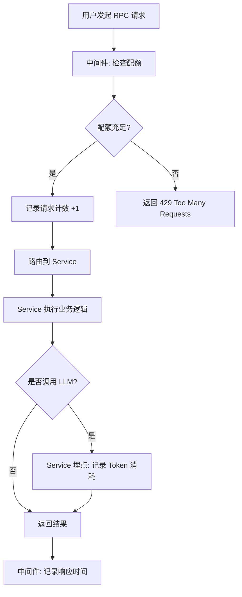

# YA-09-164: 用量计费与配额管理 — 多维度资源追踪与配额控制

> 需求编号：YA-09-164 · 优先级：P2 · 人天：0.5d · 状态：需求已编写
> 依赖：审计日志服务（audit_service）、用户管理服务（user_service）

## 背景

YiAi 当前对所有用户提供无差别的 AI 服务，缺乏用量追踪和配额控制机制。随着用户数量增长和模型调用成本上升，以下问题日益突出：

- **成本不可控**：无法知道每个用户/团队消耗了多少 API 调用和 Token，成本归属不清
- **资源滥用风险**：单个用户可能无限调用 LLM，影响其他用户体验
- **缺乏计费基础**：未来需要按用量计费或分 tier 提供服务，但当前无用量数据
- **无法预警**：用量异常（如突然暴增）无法及时发现，可能导致成本失控

需要一个**用量计费与配额管理系统**，支持按用户/团队/项目维度追踪资源消耗，设置软硬配额限制，提供用量面板和告警，并为未来计费场景奠定数据基础。

---

## 一、现状分析

### 1.1 当前问题

| # | 问题 | 严重程度 | 影响 |
|---|------|----------|------|
| 1 | 无用量追踪 | 高 | 无法知道谁消耗了多少资源，成本归属不清 |
| 2 | 无配额限制 | 高 | 单个用户可无限调用，存在资源滥用风险 |
| 3 | 无用量告警 | 中 | 用量异常无法及时发现，成本可能失控 |
| 4 | 无计费基础 | 中 | 未来按量计费无法实施，缺乏数据支撑 |
| 5 | 无免费层定义 | 低 | 新用户体验与付费用户无差异，缺乏分层策略 |

### 1.2 改造前数据流

```
用户发起 API 请求（聊天、RAG、数据查询等）
  → RPC 信封路由到对应 Service
  → Service 执行逻辑，调用 LLM
  → 返回结果给用户
  → 无用量记录：谁调用了什么？消耗了多少 token？
  → 无限配额：用户可无限次调用，无任何限制
  → 无成本核算：月底无法统计各用户/团队的资源消耗
  → 无用量告警：用量异常暴增无法及时发现
```

### 1.3 改造前 API 依赖

| # | 接口 | 调用方 | 说明 |
|---|------|--------|------|
| 1 | `services.ai.chat_service.chat` | YiVad/YiPet | 聊天接口（改造前无用量记录，每次调用 token 消耗不可追踪） |
| 2 | `services.ai.agent_service.run_agent` | YiVad | Agent 接口（改造前无用量记录，工具调用次数不可追踪） |
| 3 | `services.rag.rag_service.query` | YiVad/YiPet | RAG 查询接口（改造前无用量记录） |
| 4 | `data_service.query_documents` | YiVad/YiPet | 数据查询接口（改造前无调用次数记录） |

> 改造前 4 个 API 依赖，均无用量追踪。用户调用次数、Token 消耗、存储使用量均不可见。

---

## 二、设计决策

### 决策 1：用量记录方式 — 中间件拦截 vs Service 层埋点

| 维度 | 中间件拦截 | Service 层埋点 |
|------|-----------|---------------|
| 覆盖范围 | 全（所有 RPC 请求） | 需逐 Service 添加 |
| 精度 | 低（仅请求次数，无法获取 Token 数） | 高（可获取 Token 消耗、模型名等细节） |
| 实现复杂度 | 低（一个中间件） | 中（需在各 Service 中埋点） |
| 对业务侵入 | 无 | 低（埋点调用） |

**选择：中间件 + Service 埋点结合。** 中间件记录所有 RPC 请求的基础信息（调用次数、响应时间），Service 层在 LLM 调用后记录 Token 消耗。两者互补，中间件保证覆盖范围，Service 埋点保证精度。

### 决策 2：配额检查时机 — 请求前 vs 请求后

| 维度 | 请求前检查 | 请求后扣除 |
|------|-----------|-----------|
| 资源保护 | 强（超配额请求直接拒绝） | 弱（可能超配额后仍执行） |
| 并发安全 | 高（先检查后执行） | 低（可能并发超配额） |
| 实现复杂度 | 中（需原子操作） | 低 |

**选择：请求前检查。** 在中间件中检查配额，超配额直接拒绝（返回 429 Too Many Requests），避免浪费 LLM 资源。使用 MongoDB 原子操作（`$inc` + 条件检查）保证并发安全。

### 决策 3：配额存储 — MongoDB vs Redis

| 维度 | MongoDB | Redis |
|------|---------|-------|
| 持久化 | 强（数据不丢失） | 弱（需配置持久化） |
| 原子操作 | 支持（`$inc`） | 支持（`INCR`） |
| 查询能力 | 强（聚合管道） | 弱（仅 key-value） |
| 部署复杂度 | 已有（复用现有 MongoDB） | 需额外部署 |
| 性能 | 中（~1ms 写入） | 高（~0.1ms 写入） |

**选择：MongoDB。** 复用现有基础设施，无需额外部署 Redis。配额检查频率不高（每次请求），MongoDB 的 ~1ms 写入延迟在中间件中可接受。`$inc` 原子操作满足并发安全需求。

### 决策 4：配额重置策略 — 固定时间 vs 滑动窗口

| 维度 | 固定时间重置（每日 00:00） | 滑动窗口（最近 24 小时） |
|------|--------------------------|------------------------|
| 实现复杂度 | 低（定时任务重置计数器） | 中（需查询时间窗口内记录） |
| 用户体验 | 中（23:59 和 00:01 可连续大量调用） | 好（平滑限制） |
| 准确性 | 低（边界时间可绕过） | 高 |

**选择：固定时间重置。** 实现简单，定时任务每日 00:00 重置计数器。边界时间问题通过软配额提前预警缓解。月度配额在每月 1 日 00:00 重置。后续可升级为滑动窗口。

### 设计决策记录

| 决策 | 选项 A | 选项 B | 选择 | 理由 |
|------|--------|--------|------|------|
| 用量记录 | 中间件拦截 | Service 埋点 | **中间件 + 埋点结合** | 中间件保证覆盖，埋点保证精度 |
| 配额检查 | 请求前检查 | 请求后扣除 | **请求前检查** | 超配额拒绝，避免浪费 LLM 资源 |
| 配额存储 | MongoDB | Redis | **MongoDB** | 复用现有基础设施，原子操作 |
| 配额重置 | 固定时间 | 滑动窗口 | **固定时间** | 实现简单，后续可升级 |

---

## 三、目标架构

### 3.1 用量追踪流程



### 3.2 核心数据模型

```python
# domain/usage/models.py

from enum import Enum
from datetime import datetime
from pydantic import BaseModel, Field

class ResourceType(str, Enum):
    API_CALLS = "api_calls"       # API 调用次数
    TOKENS_INPUT = "tokens_input"  # 输入 Token
    TOKENS_OUTPUT = "tokens_output"  # 输出 Token
    TOKENS_TOTAL = "tokens_total"  # 总 Token
    STORAGE_BYTES = "storage_bytes"  # 存储使用量
    AGENT_RUNS = "agent_runs"     # Agent 运行次数

class QuotaType(str, Enum):
    DAILY = "daily"
    MONTHLY = "monthly"

class QuotaPeriod(str, Enum):
    DAILY = "daily"
    MONTHLY = "monthly"

class UsageRecord(BaseModel):
    """用量记录（每次请求一条）。"""
    record_id: str = Field(default_factory=lambda: str(uuid.uuid4()))
    user_id: str
    team_id: str | None = None
    project_id: str | None = None
    resource_type: ResourceType
    amount: float
    timestamp: datetime = Field(default_factory=datetime.now)
    endpoint: str              # RPC 方法名
    model: str | None = None   # LLM 模型名
    request_id: str | None = None

class QuotaConfig(BaseModel):
    """配额配置。"""
    user_id: str | None = None        # None 表示默认配额
    team_id: str | None = None
    resource_type: ResourceType
    period: QuotaPeriod
    soft_limit: float                  # 软配额（触发告警）
    hard_limit: float                  # 硬配额（拒绝请求）
    used: float = 0.0                  # 当前周期已用量
    last_reset: datetime | None = None

class UsageSummary(BaseModel):
    """用量汇总（聚合查询结果）。"""
    user_id: str
    period: QuotaPeriod
    period_start: datetime
    period_end: datetime
    resources: dict[str, float]  # {resource_type: amount}
    quotas: dict[str, QuotaConfig]

class UsageAlert(BaseModel):
    """用量告警。"""
    alert_id: str
    user_id: str
    resource_type: ResourceType
    threshold_pct: float         # 80/90/100
    current_usage: float
    limit: float
    timestamp: datetime
    acknowledged: bool = False

class FreeTier(BaseModel):
    """免费层定义。"""
    tier_name: str = "free"
    daily_api_calls: int = 100
    monthly_api_calls: int = 3000
    daily_tokens: int = 100000
    monthly_tokens: int = 3000000
    max_storage_bytes: int = 100 * 1024 * 1024  # 100MB
    max_models: list[str] = ["qwen3.5:4b"]
```

### 3.3 配额检查中间件

```python
# server/middleware/usage_middleware.py

class UsageMiddleware:
    """用量追踪与配额检查中间件。"""

    async def check_quota(
        self,
        user_id: str,
        resource_type: ResourceType,
        amount: float = 1,
    ) -> QuotaCheckResult:
        """检查配额是否充足。"""
        quota = await self._get_quota(user_id, resource_type)

        if quota.used + amount > quota.hard_limit:
            return QuotaCheckResult(
                allowed=False,
                reason=f"Hard quota exceeded: {quota.used}/{quota.hard_limit}",
                code=429,
            )

        if quota.used + amount > quota.soft_limit:
            await self._send_alert(user_id, resource_type, quota)
            # 软配额不拒绝，仅告警

        return QuotaCheckResult(allowed=True)

    async def record_usage(self, record: UsageRecord):
        """记录用量。"""
        # 写入 UsageRecord 文档
        await self.usage_collection.insert_one(record.model_dump())

        # 原子更新配额计数器
        await self.quota_collection.update_one(
            {
                "user_id": record.user_id,
                "resource_type": record.resource_type,
                "period": self._current_period(),
            },
            {"$inc": {"used": record.amount}},
            upsert=True,
        )
```

---

## 四、具体改动

### 4.1 新增文件

| 文件 | 行数 | 说明 |
|------|------|------|
| `src/domain/usage/__init__.py` | 10 | 模块导出 |
| `src/domain/usage/models.py` | 100 | 数据模型：UsageRecord、QuotaConfig、UsageSummary、FreeTier |
| `src/domain/usage/quota_manager.py` | 80 | 配额管理器：检查、扣除、重置 |
| `src/domain/usage/alert_manager.py` | 60 | 告警管理器：阈值检查、通知 |
| `src/server/middleware/usage_middleware.py` | 120 | 用量中间件：请求拦截、配额检查、用量记录 |
| `src/services/usage/usage_service.py` | 150 | 用量查询服务：RPC 接口 |
| `src/domain/usage/quota_scheduler.py` | 50 | 配额重置定时任务 |

### 4.2 核心实现

**配额管理器：**

```python
# domain/usage/quota_manager.py

class QuotaManager:
    """配额管理器 — 检查、扣除、重置。"""

    def __init__(self, db):
        self.quota_collection = db["usage_quotas"]
        self.usage_collection = db["usage_records"]

    async def check_and_deduct(
        self,
        user_id: str,
        resource_type: ResourceType,
        amount: float = 1,
    ) -> QuotaCheckResult:
        """原子检查并扣除配额。"""
        quota = await self._get_effective_quota(user_id, resource_type)

        if quota.used + amount > quota.hard_limit:
            return QuotaCheckResult(
                allowed=False,
                reason=f"daily {resource_type.value} quota exceeded: {quota.used}/{quota.hard_limit}",
                code=429,
            )

        await self._inc_usage(user_id, resource_type, amount)
        return QuotaCheckResult(allowed=True, current_usage=quota.used + amount, limit=quota.hard_limit)

    async def _get_effective_quota(
        self, user_id: str, resource_type: ResourceType
    ) -> QuotaConfig:
        """获取用户的有效配额（用户自定义 > 团队配额 > 默认配额）。"""
        # 1. 检查用户自定义配额
        user_quota = await self.quota_collection.find_one({
            "user_id": user_id,
            "resource_type": resource_type,
        })
        if user_quota:
            return QuotaConfig(**user_quota)

        # 2. 检查团队配额
        user = await self.db["users"].find_one({"user_id": user_id})
        if user and user.get("team_id"):
            team_quota = await self.quota_collection.find_one({
                "team_id": user["team_id"],
                "resource_type": resource_type,
            })
            if team_quota:
                return QuotaConfig(**team_quota)

        # 3. 返回默认配额
        return self._get_default_quota(resource_type)

    def _get_default_quota(self, resource_type: ResourceType) -> QuotaConfig:
        """获取默认配额（免费层）。"""
        defaults = {
            ResourceType.API_CALLS: QuotaConfig(
                resource_type=resource_type,
                period=QuotaPeriod.DAILY,
                soft_limit=100,
                hard_limit=200,
            ),
            ResourceType.TOKENS_TOTAL: QuotaConfig(
                resource_type=resource_type,
                period=QuotaPeriod.DAILY,
                soft_limit=100000,
                hard_limit=200000,
            ),
            ResourceType.AGENT_RUNS: QuotaConfig(
                resource_type=resource_type,
                period=QuotaPeriod.DAILY,
                soft_limit=20,
                hard_limit=50,
            ),
        }
        return defaults.get(resource_type, QuotaConfig(
            resource_type=resource_type,
            period=QuotaPeriod.DAILY,
            soft_limit=100,
            hard_limit=200,
        ))

    async def _inc_usage(self, user_id: str, resource_type: ResourceType, amount: float):
        """原子递增用量计数。"""
        period_key = self._current_period_key()
        await self.quota_collection.update_one(
            {
                "user_id": user_id,
                "resource_type": resource_type,
                "period_key": period_key,
            },
            {"$inc": {"used": amount}},
            upsert=True,
        )

    async def reset_quotas(self, period: QuotaPeriod):
        """重置指定周期的所有配额。"""
        result = await self.quota_collection.update_many(
            {"period": period},
            {"$set": {"used": 0, "last_reset": datetime.now()}},
        )
        logger.info(f"[Quota] Reset {result.modified_count} quotas for {period}")

    def _current_period_key(self) -> str:
        """生成当前周期 key（如 "2026-09-09" 或 "2026-09"）。"""
        now = datetime.now()
        return f"{now.year}-{now.month:02d}-{now.day:02d}"
```

**用量中间件：**

```python
# server/middleware/usage_middleware.py

class UsageMiddleware(BaseHTTPMiddleware):
    """用量追踪与配额检查中间件。"""

    def __init__(self, app, quota_manager: QuotaManager, alert_manager: AlertManager):
        super().__init__(app)
        self.quota_manager = quota_manager
        self.alert_manager = alert_manager

    async def dispatch(self, request: Request, call_next):
        # 提取用户信息
        user_id = getattr(request.state, "user_id", "anonymous")
        endpoint = request.url.path

        # 配额检查
        check_result = await self.quota_manager.check_and_deduct(
            user_id=user_id,
            resource_type=ResourceType.API_CALLS,
            amount=1,
        )

        if not check_result.allowed:
            return JSONResponse(
                status_code=429,
                content={
                    "code": 429,
                    "message": f"Quota exceeded. {check_result.reason}",
                    "data": {
                        "current_usage": check_result.current_usage,
                        "limit": check_result.limit,
                        "reset_time": self._next_reset_time(),
                    },
                },
            )

        # 软配额告警
        usage_pct = check_result.current_usage / check_result.limit * 100
        if usage_pct >= 80:
            await self.alert_manager.check_and_alert(
                user_id, ResourceType.API_CALLS, usage_pct, check_result
            )

        # 执行请求
        start = time.time()
        response = await call_next(request)
        duration_ms = (time.time() - start) * 1000

        # 记录用量
        await self.quota_manager.record_usage(UsageRecord(
            user_id=user_id,
            resource_type=ResourceType.API_CALLS,
            amount=1,
            endpoint=endpoint,
            duration_ms=duration_ms,
        ))

        # 添加用量头部
        response.headers["X-RateLimit-Remaining"] = str(
            int(check_result.limit - check_result.current_usage)
        )
        response.headers["X-RateLimit-Limit"] = str(int(check_result.limit))
        response.headers["X-RateLimit-Reset"] = self._next_reset_time()

        return response
```

**用量查询服务：**

```python
# services/usage/usage_service.py

class UsageService:
    """用量查询服务 — 为 YiVad 使用面板提供数据。"""

    def __init__(self, db):
        self.usage_collection = db["usage_records"]
        self.quota_collection = db["usage_quotas"]

    async def get_usage_summary(self, parameters: dict) -> dict:
        """RPC 方法: 获取用量汇总。

        parameters:
            user_id: str       — 用户 ID（必填）
            period: str        — "daily"|"monthly"
            start_date: str    — 起始日期 "2026-09-01"
            end_date: str      — 结束日期 "2026-09-09"
        """
        user_id = parameters.get("user_id")
        period = parameters.get("period", "daily")

        pipeline = [
            {"$match": {
                "user_id": user_id,
                "timestamp": {
                    "$gte": start_date,
                    "$lte": end_date,
                },
            }},
            {"$group": {
                "_id": "$resource_type",
                "total": {"$sum": "$amount"},
                "count": {"$sum": 1},
            }},
        ]

        cursor = self.usage_collection.aggregate(pipeline)
        results = await cursor.to_list(length=100)

        usage_by_resource = {}
        for r in results:
            usage_by_resource[r["_id"]] = {
                "total": r["total"],
                "count": r["count"],
            }

        return {
            "code": 0,
            "message": "ok",
            "data": {
                "user_id": user_id,
                "period": period,
                "resources": usage_by_resource,
            },
        }

    async def get_quota_status(self, parameters: dict) -> dict:
        """RPC 方法: 获取当前配额状态。"""
        user_id = parameters.get("user_id")

        quotas = await self.quota_collection.find({
            "user_id": user_id,
        }).to_list(length=100)

        quota_list = []
        for q in quotas:
            pct = (q["used"] / q["hard_limit"] * 100) if q["hard_limit"] > 0 else 0
            quota_list.append({
                "resource_type": q["resource_type"],
                "period": q["period"],
                "used": q["used"],
                "soft_limit": q["soft_limit"],
                "hard_limit": q["hard_limit"],
                "usage_pct": round(pct, 1),
                "status": "exceeded" if pct >= 100 else ("warning" if pct >= 80 else "normal"),
            })

        return {"code": 0, "message": "ok", "data": {"quotas": quota_list}}

    async def request_quota_increase(self, parameters: dict) -> dict:
        """RPC 方法: 提交配额提升申请。"""
        user_id = parameters.get("user_id")
        resource_type = parameters.get("resource_type")
        requested_limit = parameters.get("requested_limit")
        reason = parameters.get("reason", "")

        # 创建申请记录
        request_doc = {
            "request_id": str(uuid.uuid4()),
            "user_id": user_id,
            "resource_type": resource_type,
            "requested_limit": requested_limit,
            "reason": reason,
            "status": "pending",
            "created_at": datetime.now(),
        }
        await self.db["quota_requests"].insert_one(request_doc)

        return {"code": 0, "message": "Quota increase request submitted", "data": request_doc}

    async def get_usage_trend(self, parameters: dict) -> dict:
        """RPC 方法: 获取用量趋势（按天聚合）。"""
        user_id = parameters.get("user_id")
        days = parameters.get("days", 7)

        pipeline = [
            {"$match": {
                "user_id": user_id,
                "timestamp": {"$gte": datetime.now() - timedelta(days=days)},
            }},
            {"$group": {
                "_id": {
                    "date": {"$dateToString": {"format": "%Y-%m-%d", "date": "$timestamp"}},
                    "resource_type": "$resource_type",
                },
                "total": {"$sum": "$amount"},
            }},
            {"$sort": {"_id.date": 1}},
        ]

        cursor = self.usage_collection.aggregate(pipeline)
        results = await cursor.to_list(length=days * 5)

        return {"code": 0, "message": "ok", "data": {"trend": results}}

    async def export_usage(self, parameters: dict) -> dict:
        """RPC 方法: 导出用量数据（CSV/JSON）。"""
        user_id = parameters.get("user_id")
        start_date = parameters.get("start_date")
        end_date = parameters.get("end_date")
        export_format = parameters.get("format", "json")

        records = await self.usage_collection.find({
            "user_id": user_id,
            "timestamp": {"$gte": start_date, "$lte": end_date},
        }).to_list(length=10000)

        if export_format == "csv":
            output = io.StringIO()
            writer = csv.writer(output)
            writer.writerow(["timestamp", "resource_type", "amount", "endpoint", "model"])
            for r in records:
                writer.writerow([
                    r["timestamp"].isoformat(),
                    r["resource_type"],
                    r["amount"],
                    r.get("endpoint", ""),
                    r.get("model", ""),
                ])
            return {"code": 0, "message": "ok", "data": {"csv": output.getvalue()}}

        return {"code": 0, "message": "ok", "data": {"records": records}}
```

### 4.3 配额重置定时任务

```python
# domain/usage/quota_scheduler.py

from apscheduler.schedulers.asyncio import AsyncIOScheduler

class QuotaResetScheduler:
    """配额重置定时任务。"""

    def __init__(self, quota_manager: QuotaManager):
        self.quota_manager = quota_manager
        self.scheduler = AsyncIOScheduler()

    def start(self):
        """启动定时任务。"""
        # 每日 00:00 重置每日配额
        self.scheduler.add_job(
            self.quota_manager.reset_daily_quotas,
            trigger="cron",
            hour=0,
            minute=0,
            id="reset_daily_quotas",
        )
        # 每月 1 日 00:00 重置月度配额
        self.scheduler.add_job(
            self.quota_manager.reset_monthly_quotas,
            trigger="cron",
            day=1,
            hour=0,
            minute=0,
            id="reset_monthly_quotas",
        )
        self.scheduler.start()

    def stop(self):
        self.scheduler.shutdown()
```

### 4.4 涉及文件

```
YiAi/src/
├── domain/usage/
│   ├── __init__.py              # 新增: 模块导出
│   ├── models.py                # 新增: 数据模型 (100行)
│   ├── quota_manager.py         # 新增: 配额管理器 (80行)
│   ├── alert_manager.py         # 新增: 告警管理器 (60行)
│   └── quota_scheduler.py       # 新增: 重置定时任务 (50行)
├── server/middleware/
│   └── usage_middleware.py      # 新增: 用量中间件 (120行)
├── services/usage/
│   └── usage_service.py         # 新增: 用量查询服务 (150行)
└── server/
    └── app.py                   # 修改: 注册中间件 + 定时任务
```

---

## 五、实施步骤

按依赖顺序排列，每步可独立验证和提交：

| 步骤 | 内容 | 涉及文件 | 验证方式 | 人天 |
|------|------|---------|---------|------|
| 1 | 定义数据模型（UsageRecord、QuotaConfig、FreeTier） | `domain/usage/models.py` | 模型字段完整，Pydantic 校验通过 | 0.05 |
| 2 | 实现配额管理器（check_and_deduct、reset） | `domain/usage/quota_manager.py` | 原子扣除正确，并发安全 | 0.10 |
| 3 | 实现用量中间件（请求拦截 + 配额检查） | `server/middleware/usage_middleware.py` | 超配额返回 429，正常请求放行 | 0.10 |
| 4 | 实现告警管理器（80%/90%/100% 阈值） | `domain/usage/alert_manager.py` | 达阈值触发告警记录 | 0.05 |
| 5 | 实现配额重置定时任务 | `domain/usage/quota_scheduler.py` | 每日 00:00 和每月 1 日正确重置 | 0.05 |
| 6 | 实现用量查询服务（summary/trend/export/quota_status） | `services/usage/usage_service.py` | 面板数据正确，导出格式正确 | 0.10 |
| 7 | 集成到 app.py（注册中间件 + 定时任务） | `server/app.py` | 中间件生效，定时任务运行 | 0.05 |

**总计：0.5d**

---

## 六、测试规格

### Requirement: 配额检查

#### Scenario: 正常请求在配额内放行
- **Given** 用户 API 调用配额为 100/200（已用/硬限制）
- **When** 用户发起一次 API 请求
- **Then** 请求正常放行
- **And** 响应头包含 `X-RateLimit-Remaining: 99`

#### Scenario: 超硬配额请求被拒绝
- **Given** 用户 API 调用配额为 200/200（已用/硬限制）
- **When** 用户发起一次 API 请求
- **Then** 返回 429 状态码
- **And** 响应体包含 `code: 429` 和配额超限信息

#### Scenario: 软配额告警触发
- **Given** 用户 API 调用配额为 160/200（已用/硬限制，软配额 100）
- **When** 用户发起一次 API 请求
- **Then** 请求正常放行
- **And** 触发 80% 用量告警记录

### Requirement: 用量查询

#### Scenario: 获取用量汇总
- **Given** 用户在本周有 50 次 API 调用和 30000 token 消耗
- **When** 调用 `get_usage_summary` 接口
- **Then** 返回 `api_calls: 50, tokens_total: 30000`

#### Scenario: 获取配额状态
- **Given** 用户 API 调用已用 150/200
- **When** 调用 `get_quota_status` 接口
- **Then** 返回 `usage_pct: 75.0, status: "normal"`

### Requirement: 配额重置

#### Scenario: 每日配额在 00:00 重置
- **Given** 用户当天 API 调用已用 150/200
- **When** 系统时间到达次日 00:00
- **Then** 配额定时任务触发，已用量重置为 0

#### Scenario: 月度配额在 1 日 00:00 重置
- **Given** 用户当月 token 已用 500000/1000000
- **When** 系统时间到达下月 1 日 00:00
- **Then** 月度配额重置为 0

### Requirement: 用量导出

#### Scenario: 导出 JSON 格式用量
- **Given** 用户有 30 条用量记录
- **When** 调用 `export_usage` 接口，指定 `format="json"`
- **Then** 返回 JSON 数组，包含全部 30 条记录

#### Scenario: 导出 CSV 格式用量
- **Given** 用户有 30 条用量记录
- **When** 调用 `export_usage` 接口，指定 `format="csv"`
- **Then** 返回 CSV 字符串，包含表头和 30 行数据

---

## 七、风险与缓解

| 风险 | 概率 | 影响 | 等级 | 缓解措施 | 应急预案 |
|------|------|------|------|----------|----------|
| 配额检查增加请求延迟 | 中 | 中 | 中 | MongoDB 查询使用索引（user_id + resource_type），预期 < 1ms | 关配额检查中间件，恢复无限制模式 |
| 并发请求导致配额超扣 | 低 | 高 | 中 | MongoDB `$inc` 原子操作，条件检查 `used + amount <= hard_limit` | 定时任务矫正超扣数据 |
| 配额重置失败（定时任务异常） | 低 | 高 | 中 | 定时任务异常重试 + 手动重置接口 | 管理员手动调用重置 API |
| 用量记录写入失败（MongoDB 不可用） | 低 | 低 | 低 | 写入失败不影响请求，仅记录 ERROR 日志 | MongoDB 恢复后从应用日志补录 |
| 免费层配额设置不合理 | 中 | 中 | 中 | 配额可配置，根据实际使用数据调整 | 临时提高默认配额 |

---

## 八、回滚策略

| 回滚场景 | 回滚方式 | 影响范围 | 恢复时间 |
|----------|----------|----------|----------|
| 中间件导致所有请求被拒绝 | 移除中间件注册，恢复无限制模式 | 全部 API 请求 | 5min |
| 配额重置异常导致计数器混乱 | 停用定时任务，手动重置所有配额 | 配额数据 | 10min |
| 用量记录写入影响性能 | 关闭用量记录，仅保留配额检查 | 用量数据 | 5min |

**回滚验证：**
- 所有 API 请求正常响应，不返回 429
- 配额计数器停止更新
- `ruff` + `mypy` 检查通过

---

## 九、设计决策记录

### D-01: 为什么选择请求前检查而非请求后扣除？

请求前检查确保超配额请求不会浪费 LLM 资源。如果用请求后扣除，超配额请求仍会执行 LLM 调用（消耗 Token），但最终无法返回结果给用户。请求前检查可以在中间件层直接拒绝，节省计算资源。

### D-02: 为什么免费层配额设为 100 次/天？

参考业界 AI API 免费层标准（OpenAI 免费层 ~100 次/天，Claude 免费层 ~50 次/天）。100 次/天可满足个人轻度使用，同时防止滥用。配额可通过配置调整，后续可根据实际使用数据优化。

### D-03: 为什么配额重置使用定时任务而非惰性计算？

定时任务（每日 00:00）实现简单，配额状态提前计算好，查询时无需聚合历史用量数据。惰性计算（每次查询时计算当日用量）虽然更准确，但每次查询都需聚合当天所有用量记录，性能开销大。

---

## 十、可观测性

### 10.1 关键指标

| 指标 | 采集方式 | 告警阈值 | 说明 |
|------|---------|---------|------|
| 配额拒绝次数 | 中间件计数器 | > 10/min | 大量用户超配额 |
| 配额使用率分布 | 聚合查询 | P95 > 90% | 配额设置偏低 |
| 用量记录写入延迟 | 计时器 | P95 > 10ms | MongoDB 写入慢 |
| 配额重置成功率 | 定时任务日志 | < 100% | 重置任务异常 |
| 活跃用户数 | 用量记录去重 user_id | — | 按天/周/月统计 |
| 总 Token 消耗 | 用量记录聚合 | 日环比增长 > 50% | 用量异常增长 |

### 10.2 日志规范

| 日志级别 | 场景 | 示例 |
|---------|------|------|
| `INFO` | 配额检查 | `[Quota] check: user={u}, resource={r}, used={u}/{h}` |
| `WARN` | 软配额告警 | `[Quota] soft limit reached: user={u}, resource={r}, {pct}%` |
| `WARN` | 硬配额拒绝 | `[Quota] hard limit exceeded: user={u}, resource={r}, 429 returned` |
| `INFO` | 配额重置 | `[Quota] reset {period}: {n} quotas reset` |
| `ERROR` | 用量记录失败 | `[Usage] record failed: {error}` |

### 10.3 告警规则

| 告警 | 条件 | 严重程度 | 处理建议 |
|------|------|----------|----------|
| 用量 80% | 任一资源用量达硬配额的 80% | 低 | 通知用户，建议申请配额提升 |
| 用量 90% | 任一资源用量达硬配额的 90% | 中 | 通知用户，自动创建配额提升建议 |
| 用量 100% | 任一资源用量达硬配额 100% | 高 | 通知用户 + 管理员，评估是否需要调整配额 |
| 配额重置失败 | 定时任务异常 | 高 | 管理员手动重置，排查定时任务 |

---

## 十一、代码审查检查清单

- [ ] `UsageRecord` 模型包含 user_id、resource_type、amount、timestamp、endpoint、model
- [ ] 配额检查使用 MongoDB `$inc` 原子操作
- [ ] 软配额（80%）触发告警，硬配额（100%）返回 429
- [ ] 响应头包含 `X-RateLimit-Remaining`、`X-RateLimit-Limit`、`X-RateLimit-Reset`
- [ ] 配额重置定时任务（每日 00:00 + 每月 1 日 00:00）
- [ ] 免费层配额定义合理（100 次/天，100000 token/天）
- [ ] 用量查询支持 summary/trend/export/quota_status
- [ ] 用量导出支持 JSON 和 CSV 格式
- [ ] 中间件不影响非配额请求（静态文件、健康检查）
- [ ] `ruff` 代码规范通过
- [ ] `mypy` 类型检查通过

---

## 十二、回归问题预测

| # | 问题 | 发现场景 | 根因 | 修复方式 |
|---|------|---------|------|---------|
| 1 | 未认证用户（anonymous）配额与认证用户共享计数器 | 匿名用户调用 API 被计入 `anonymous` 配额，但匿名用户可能是多个不同的人 | 中间件使用 `user_id = "anonymous"` 作为未认证用户的标识，所有匿名请求共享同一配额 | 对未认证用户，使用 IP 地址作为 user_id 进行配额区分 |
| 2 | 配额重置时 `$inc` 未重置 period_key 导致旧周期数据累积 | 新周期开始时，配额记录中 `used` 被重置为 0，但 `period_key` 仍为旧周期 | `reset_quotas` 只更新 `used=0`，未更新 `period_key` | 在重置时同时更新 `period_key` 为新周期值 |
| 3 | 配额检查中间件短路导致健康检查端点也被限制 | 健康检查 `/health` 被中间件拦截，超配额后返回 429，Kubernetes 误判 Pod 不健康 | 中间件未配置白名单路径，所有请求均被检查 | 添加 `EXEMPT_PATHS = ["/health", "/read-file", "/static"]` 白名单 |
| 4 | 用量记录写入过于频繁导致 MongoDB 写入压力 | 高并发场景（100 QPS）下，每条请求写入一条 UsageRecord，MongoDB insert 队列积压 | 每次请求同步写入一条记录，无缓冲 | 使用批量写入：中间件缓存用量记录，每 5 秒或 100 条批量 `insert_many` |
| 5 | 定时任务在多个 Worker 进程中重复执行 | 使用 `gunicorn` 多 Worker 部署时，每个 Worker 都启动定时任务，配额被重复重置 | APScheduler 在内存中运行，每个进程独立，无分布式锁 | 使用 `APScheduler` 的 `MongoDBJobStore` 或只在主 Worker 中启动定时任务 |
| 6 | 月度配额与每日配额互斥问题 | 用户月度配额 3000 次/月，但每天配额 200 次/天，30 天累计可达 6000 次，超过月度配额 | 每日配额和月度配额独立检查，未联动 | 增加月度配额检查：每日配额放行后，再检查月度配额是否充足 |

---

## 十三、性能分析

### 13.1 中间件性能开销

| 指标 | 值 | 说明 |
|------|------|------|
| 配额检查 MongoDB 查询 | < 1ms | 索引 `user_id + resource_type + period_key` |
| 配额原子递增 `$inc` | < 1ms | 单文档更新，无锁竞争 |
| 用量记录写入 | < 1ms | 异步 `insert_one` |
| 中间件总延迟增量 | < 3ms | 配额检查 + 递增 + 记录 |
| 中间件内存占用 | < 5MB | 无内存缓存，纯数据库操作 |

### 13.2 容量规划

| 场景 | 日请求数 | 用量记录/天 | 月存储量 | 配额记录数 |
|------|---------|-----------|---------|-----------|
| 小型部署（10 用户） | 500 | 500 | ~15000 | 10 |
| 中型部署（50 用户） | 2500 | 2500 | ~75000 | 50 |
| 大型部署（200 用户） | 10000 | 10000 | ~300000 | 200 |

### 13.3 性能指标汇总

| 指标 | 改造前 | 改造后 | 测量方式 |
|------|--------|--------|----------|
| 用量可见性 | 0% | 100%（所有 API 请求） | 中间件覆盖 |
| 请求延迟增量 | 0ms | < 3ms | 中间件计时 |
| 配额拒绝响应 | N/A | < 5ms | 429 响应时间 |
| 用量数据查询 | 不可用 | < 100ms | 聚合查询 |
| 配额重置时间 | N/A | < 1s（定时任务） | 任务执行耗时 |

---

*PRD 来源: `projects/yiai/requirements/2026-09/00-需求-需求总览.md`*

## 影响范围

- **影响模块**：待补充
- **涉及文件**：
- `src/domain/usage/quota_manager.py`
- `src/domain/usage/models.py`
- `src/services/usage/usage_service.py`
- `src/server/middleware/usage_middleware.py`
- `src/domain/usage/__init__.py`
- `src/domain/usage/alert_manager.py`
- **是否影响 API 契约**：否
- **是否影响其他项目（YiVad/YiPet）**：否
- **用户感知**：待确认

## 预防措施

| 层面 | 措施 |
|------|------|
| 代码 | 在相关函数中添加参数校验和边界检查 |
| 测试 | 为 `src/domain/usage/quota_manager.py` 添加单元测试 |
| 流程 | 代码审查时重点检查此类模式 |
| 监控 | 添加日志告警，异常发生时及时发现 |
| 文档 | 在编码规范中记录此类反模式 |

## 经验教训

1. **根本原因**：开发过程中对边界情况和异常路径的考虑不足是此类问题的共同根因
2. **设计阶段**：在接口设计和模块实现时，应主动考虑异常输入、空值、超时等边界场景
3. **代码审查**：审查时应检查是否存在类似的反模式（如未捕获异常、无超时控制、缺少参数校验等）
4. **测试覆盖**：异常路径的测试覆盖率应与正常路径同等重视
5. **团队分享**：此类问题应在团队周会或技术分享中讨论，形成团队共识
