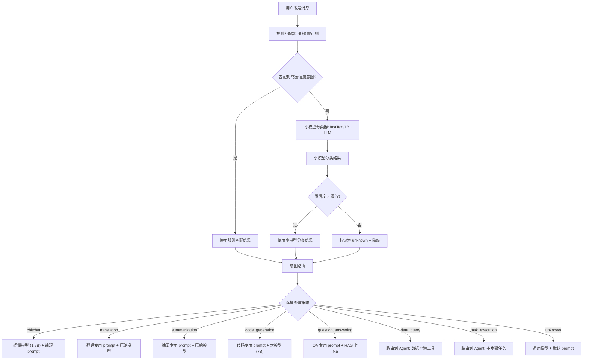

# YA-09-165: 意图分类与路由 — 用户查询意图识别与智能路由

> 需求编号：YA-09-165 · 优先级：P2 · 人天：0.5d · 状态：需求已编写
> 依赖：AI 聊天服务（chat_service）、ModelRuntime 抽象层、Agent 工具系统

## 背景

YiAi 当前所有用户查询都直接送入 LLM 处理，无论查询类型如何都使用相同的模型和策略。这导致以下问题：

- **资源浪费**：简单的寒暄（"你好"）和复杂的数据查询使用相同的模型和 token 预算，前者完全不需要大模型
- **响应延迟**：需要快速响应的翻译/摘要任务与复杂推理任务使用相同的模型，无法差异化处理
- **体验不佳**：用户问"帮我查一下昨天的 Bug 数量"时，通用 LLM 无法直接回答，需要 Agent 介入，但当前无自动路由
- **缺乏分析**：无法知道用户主要在问什么类型的问题，无法优化服务策略

需要一个**意图分类与路由系统**，在 LLM 处理前先识别用户意图，根据意图类型选择合适的模型、策略和 prompt 模板，并支持意图分析和多意图检测。

---

## 一、现状分析

### 1.1 当前问题

| # | 问题 | 严重程度 | 影响 |
|---|------|----------|------|
| 1 | 所有查询使用相同模型 | 高 | 简单查询浪费大模型资源，复杂查询响应慢 |
| 2 | 无意图识别 | 高 | 需要数据查询的请求无法自动路由到 Agent 或数据服务 |
| 3 | 无差异化 Prompt | 中 | 不同意图使用相同的 system prompt，回答质量参差不齐 |
| 4 | 无意图分析 | 低 | 无法了解用户需求分布，无法优化服务策略 |
| 5 | 无多意图检测 | 低 | 复合查询（"帮我翻译并总结"）只能处理一种意图 |

### 1.2 改造前数据流

```
用户发送消息
  → chat_service.chat() 接收消息
  → 使用默认 system prompt
  → 调用默认 LLM 模型（qwen3.5:4b）
  → 无意图识别：所有查询一视同仁
  → 简单寒暄也消耗大模型 token
  → 需要工具调用的查询（如"查数据"）无法自动路由到 Agent
  → 用户必须手动切换 Agent 模式
  → 意图分布不可见，无法优化
```

### 1.3 改造前 API 依赖

| # | 接口 | 调用方 | 说明 |
|---|------|--------|------|
| 1 | `services.ai.chat_service.chat` | YiVad/YiPet | 聊天接口（改造前无意图分类，所有查询一视同仁） |
| 2 | `services.ai.agent_service.run_agent` | YiVad | Agent 接口（改造前需用户手动切换，无自动路由） |

> 改造前 2 个 API 依赖。意图识别完全缺失，用户需手动判断何时使用 Agent，简单查询浪费大模型资源。

### 1.4 设计灵感

参考 Rasa NLU 的意图分类管道和 Dialogflow 的意图匹配机制。核心思路：轻量级分类器（fastText 或小模型）快速识别意图 → 按意图路由到不同处理策略 → 不确定时降级到通用模型。

---

## 二、设计决策

### 决策 1：分类器选择 — 规则匹配 vs 轻量模型 vs 全量 LLM

| 维度 | 规则匹配（关键词） | 轻量模型（fastText） | 全量 LLM 分类 |
|------|-------------------|---------------------|--------------|
| 准确率 | 低（60-70%） | 中（80-90%） | 高（90-95%） |
| 延迟 | < 1ms | 1-5ms | 200-500ms |
| 实现复杂度 | 低 | 中（需训练/加载模型） | 低（利用现有 LLM） |
| 维护成本 | 高（规则需持续更新） | 中（需标注数据） | 低（prompt 调整） |
| 资源消耗 | 极低 | 低（~10MB 内存） | 中（每次分类消耗 ~200 tokens） |

**选择：轻量级规则匹配 + 小模型分类混合。** 对高频简单意图（寒暄、翻译、摘要）使用规则匹配（< 1ms），对复杂意图使用小模型分类（fastText 或 1B 参数 LLM）。不确定时降级到通用模型处理。全量 LLM 分类延迟太高（200-500ms），在用户等待的第一阶段不可接受。

### 决策 2：意图类别定义 — 粗粒度 vs 细粒度

| 维度 | 粗粒度（8 类） | 细粒度（20+ 类） |
|------|---------------|-----------------|
| 分类准确率 | 高 | 中（类别间边界模糊） |
| 路由策略多样性 | 中 | 高 |
| 维护成本 | 低 | 高 |

**选择：粗粒度 8 类。** 初始版本覆盖最常见的意图类型，类别间边界清晰。后续根据意图分析数据逐步细化。8 类意图：question_answering、code_generation、summarization、translation、data_query、task_execution、chitchat、unknown。

### 决策 3：路由策略 — 模型路由 vs 策略路由

| 维度 | 模型路由（不同模型） | 策略路由（不同处理方式） |
|------|---------------------|------------------------|
| 效果 | 中（模型能力差异） | 高（可定制 prompt、工具、参数） |
| 实现复杂度 | 低（切换模型名） | 中（需定义多种策略） |

**选择：模型路由 + 策略路由结合。** 对简单意图（chitchat、translation）使用轻量模型（1.5B），对复杂意图（question_answering、code_generation）使用大模型（7B）。同时为每种意图定制 system prompt 和工具集。

### 决策 4：多意图处理 — 串行 vs 并行 vs 主次

| 维度 | 串行处理 | 并行处理 | 主次意图 |
|------|---------|---------|---------|
| 实现复杂度 | 低 | 中 | 低 |
| 响应速度 | 慢（逐个处理） | 快（同时处理） | 中 |
| 上下文连续性 | 好（前一步结果传递给后一步） | 差（独立处理） | 中 |

**选择：主次意图模式。** 选择置信度最高的意图作为主意图，其他为次意图。主意图处理完成后，在结果中提示次意图。对于需要顺序执行的复合意图（"翻译后总结"），识别为 task_execution 并调用 Agent 顺序执行。

### 设计决策记录

| 决策 | 选项 A | 选项 B | 选项 C | 选择 | 理由 |
|------|--------|--------|--------|------|------|
| 分类器 | 规则匹配 | 轻量模型 | 全量 LLM | **规则 + 轻量模型混合** | 高频意图规则匹配 < 1ms，复杂意图小模型 1-5ms |
| 意图粒度 | 粗粒度（8 类） | 细粒度（20+ 类） | — | **粗粒度 8 类** | 类别边界清晰，后续根据数据细化 |
| 路由方式 | 模型路由 | 策略路由 | — | **模型 + 策略结合** | 简单意图轻量模型，复杂意图定制策略 |
| 多意图 | 串行 | 并行 | 主次 | **主次意图** | 实现简单，覆盖大部分场景 |

---

## 三、目标架构

### 3.1 意图分类与路由流程



### 3.2 核心数据模型

```python
# domain/intent/models.py

from enum import Enum
from pydantic import BaseModel, Field

class IntentCategory(str, Enum):
    """意图类别。"""
    QUESTION_ANSWERING = "question_answering"  # 知识问答
    CODE_GENERATION = "code_generation"       # 代码生成
    SUMMARIZATION = "summarization"           # 文本摘要
    TRANSLATION = "translation"               # 文本翻译
    DATA_QUERY = "data_query"                 # 数据查询
    TASK_EXECUTION = "task_execution"         # 任务执行
    CHITCHAT = "chitchat"                     # 闲聊寒暄
    UNKNOWN = "unknown"                       # 无法识别

class IntentResult(BaseModel):
    """意图分类结果。"""
    primary_intent: IntentCategory
    confidence: float = Field(ge=0.0, le=1.0)
    secondary_intents: list[IntentCategory] = []  # 次意图
    method: str  # "rule" | "model" | "fallback"
    latency_ms: float = 0.0

class IntentRoute(BaseModel):
    """意图路由配置。"""
    intent: IntentCategory
    model: str                          # 使用的模型名
    system_prompt: str                  # 定制的 system prompt
    max_tokens: int = 2048              # 输出 token 限制
    temperature: float = 0.7            # 温度参数
    tools: list[str] = []               # 可用工具列表
    enable_rag: bool = False            # 是否启用 RAG
    enable_agent: bool = False          # 是否启用 Agent
    priority: int = 0                   # 优先级（数字越小越优先）

class RuleMatch(BaseModel):
    """规则匹配配置。"""
    intent: IntentCategory
    keywords: list[str]          # 关键词列表
    patterns: list[str]          # 正则模式列表
    weight: float = 1.0          # 权重
    min_confidence: float = 0.8  # 最低置信度

class IntentAnalytics(BaseModel):
    """意图分析数据。"""
    date: str
    intent_distribution: dict[str, int]   # 意图分布
    total_queries: int
    unknown_rate: float                   # 未识别比例
    avg_confidence: float                 # 平均置信度
    model_usage: dict[str, int]           # 模型使用分布
```

### 3.3 意图路由配置表

```python
# domain/intent/routes.py

INTENT_ROUTES: dict[IntentCategory, IntentRoute] = {
    IntentCategory.CHITCHAT: IntentRoute(
        intent=IntentCategory.CHITCHAT,
        model="qwen3.5:1.5b",
        system_prompt="你是一个友好的 AI 助手。请用简洁、自然的方式回答用户的问候和闲聊。",
        max_tokens=512,
        temperature=0.9,
        enable_rag=False,
        enable_agent=False,
        priority=0,
    ),
    IntentCategory.TRANSLATION: IntentRoute(
        intent=IntentCategory.TRANSLATION,
        model="qwen3.5:4b",
        system_prompt="你是一个专业翻译助手。请准确翻译用户提供的内容，保持原文风格和语气。只返回翻译结果，不要添加额外解释。",
        max_tokens=2048,
        temperature=0.3,
        enable_rag=False,
        enable_agent=False,
        priority=0,
    ),
    IntentCategory.SUMMARIZATION: IntentRoute(
        intent=IntentCategory.SUMMARIZATION,
        model="qwen3.5:4b",
        system_prompt="你是一个专业摘要助手。请用简洁的语言总结用户提供的内容，突出关键信息和要点。",
        max_tokens=1024,
        temperature=0.5,
        enable_rag=False,
        enable_agent=False,
        priority=0,
    ),
    IntentCategory.CODE_GENERATION: IntentRoute(
        intent=IntentCategory.CODE_GENERATION,
        model="qwen3.5:7b",
        system_prompt="你是一个专业编程助手。请生成高质量、可运行的代码，包含必要的注释和错误处理。使用用户指定的编程语言。",
        max_tokens=4096,
        temperature=0.2,
        enable_rag=False,
        enable_agent=False,
        priority=0,
    ),
    IntentCategory.QUESTION_ANSWERING: IntentRoute(
        intent=IntentCategory.QUESTION_ANSWERING,
        model="qwen3.5:4b",
        system_prompt="你是一个知识问答助手。请基于提供的上下文准确回答问题。如果上下文不包含相关信息，请明确说明。",
        max_tokens=2048,
        temperature=0.5,
        enable_rag=True,
        enable_agent=False,
        priority=0,
    ),
    IntentCategory.DATA_QUERY: IntentRoute(
        intent=IntentCategory.DATA_QUERY,
        model="qwen3.5:4b",
        system_prompt="你是一个数据查询助手。请使用可用工具查询数据库并返回结构化结果。",
        max_tokens=2048,
        temperature=0.3,
        enable_rag=False,
        enable_agent=True,
        tools=["query_documents", "count_documents"],
        priority=0,
    ),
    IntentCategory.TASK_EXECUTION: IntentRoute(
        intent=IntentCategory.TASK_EXECUTION,
        model="qwen3.5:7b",
        system_prompt="你是一个任务执行助手。请将用户的复杂任务分解为步骤，按顺序执行每个步骤。",
        max_tokens=4096,
        temperature=0.3,
        enable_rag=False,
        enable_agent=True,
        tools=["query_documents", "count_documents", "write_file", "read_file"],
        priority=0,
    ),
    IntentCategory.UNKNOWN: IntentRoute(
        intent=IntentCategory.UNKNOWN,
        model="qwen3.5:4b",
        system_prompt="你是一个通用 AI 助手。请根据用户的问题提供有帮助的回答。",
        max_tokens=2048,
        temperature=0.7,
        enable_rag=True,
        enable_agent=False,
        priority=100,
    ),
}
```

---

## 四、具体改动

### 4.1 新增文件

| 文件 | 行数 | 说明 |
|------|------|------|
| `src/domain/intent/__init__.py` | 10 | 模块导出 |
| `src/domain/intent/models.py` | 60 | 数据模型：IntentCategory、IntentResult、IntentRoute、RuleMatch |
| `src/domain/intent/rule_classifier.py` | 80 | 规则匹配器：关键词 + 正则模式匹配 |
| `src/domain/intent/model_classifier.py` | 100 | 小模型分类器：fastText 或 1B LLM 分类 |
| `src/domain/intent/classifier.py` | 60 | 统一分类器：规则匹配 + 模型分类 + 降级 |
| `src/domain/intent/routes.py` | 120 | 路由配置：8 种意图的模型、prompt、工具配置 |
| `src/domain/intent/router.py` | 50 | 意图路由器：按意图选择处理策略 |
| `src/services/intent/intent_service.py` | 100 | 意图分析服务：RPC 接口 |

### 4.2 核心实现

**规则匹配器：**

```python
# domain/intent/rule_classifier.py

import re

class RuleClassifier:
    """基于规则（关键词 + 正则）的意图分类器。"""

    def __init__(self):
        self.rules = self._build_rules()

    def _build_rules(self) -> dict[IntentCategory, list[tuple[re.Pattern, float]]]:
        """构建规则库。"""
        return {
            IntentCategory.CHITCHAT: [
                (re.compile(r"^(你好|hi|hello|嗨|早上好|晚上好|晚安)[\s!！。.,，]*$"), 0.95),
                (re.compile(r"^(谢谢|感谢|多谢|thanks|thank you)[\s!！。.,，]*$"), 0.90),
                (re.compile(r"^(你是谁|你叫什么|你的名字|what is your name)"), 0.85),
                (re.compile(r"^(再见|拜拜|bye|goodbye|回头见)"), 0.90),
            ],
            IntentCategory.TRANSLATION: [
                (re.compile(r"翻译|translate|翻译成|译成|用.*怎么说"), 0.85),
                (re.compile(r"(英文|英文|英语|中文|日语|法语|德语|韩语).*(翻译|怎么说|什么意思)"), 0.80),
                (re.compile(r"translate.*(to|into)"), 0.85),
            ],
            IntentCategory.SUMMARIZATION: [
                (re.compile(r"总结|概括|摘要|归纳|简述|总结一下"), 0.85),
                (re.compile(r"(summarize|summary|tldr|recap)"), 0.85),
                (re.compile(r"(用一句话|用几句话|简要).*(描述|说明|介绍)"), 0.75),
            ],
            IntentCategory.CODE_GENERATION: [
                (re.compile(r"写(一个|一段|个)?(代码|程序|脚本|函数|方法|类)"), 0.85),
                (re.compile(r"(生成|创建|编写).*(代码|程序|脚本|组件)"), 0.80),
                (re.compile(r"(code|program|script|function|class|method).*(write|generate|create)"), 0.80),
                (re.compile(r"(python|javascript|typescript|java|go|rust|c\+\+).*(代码|程序|实现)"), 0.75),
                (re.compile(r"(bug|错误|报错|异常|error|exception).*(修复|解决|fix|solve)"), 0.70),
            ],
            IntentCategory.DATA_QUERY: [
                (re.compile(r"查(一下|询)?.*(数据|记录|文档|列表)"), 0.85),
                (re.compile(r"(有多少|多少个|多少条|统计|计数).*(数据|记录|文档|用户|bug|session)"), 0.80),
                (re.compile(r"(列出|显示|展示).*(所有|全部|最近).*(数据|记录|文档)"), 0.80),
                (re.compile(r"(query|count|find|list|search).*(data|document|record)"), 0.75),
            ],
            IntentCategory.TASK_EXECUTION: [
                (re.compile(r"(帮我|请帮我|麻烦).*(做|完成|执行|运行|操作)"), 0.75),
                (re.compile(r"先.*然后.*再.*最后"), 0.80),
                (re.compile(r"(步骤|流程|step|procedure)"), 0.70),
                (re.compile(r"(创建|删除|修改|更新|添加).*(文件|文件夹|文档|配置)"), 0.75),
            ],
            IntentCategory.QUESTION_ANSWERING: [
                (re.compile(r"(什么是|什么是|什么叫|什么是|如何|怎么|怎样|为什么|为何)"), 0.70),
                (re.compile(r"(what is|how to|why|what are|explain|describe)"), 0.70),
                (re.compile(r"(介绍|说明|解释|阐述).*(概念|原理|机制|方法|流程)"), 0.65),
            ],
        }

    def classify(self, text: str) -> IntentResult | None:
        """规则匹配分类。返回分类结果或 None（规则未命中）。"""
        text_lower = text.lower().strip()
        best_intent = None
        best_confidence = 0.0

        for intent, patterns in self.rules.items():
            for pattern, weight in patterns:
                if pattern.search(text_lower):
                    if weight > best_confidence:
                        best_confidence = weight
                        best_intent = intent

        if best_intent and best_confidence >= 0.80:
            return IntentResult(
                primary_intent=best_intent,
                confidence=best_confidence,
                secondary_intents=[],
                method="rule",
            )

        return None
```

**小模型分类器：**

```python
# domain/intent/model_classifier.py

class ModelClassifier:
    """基于小模型的意图分类器。"""

    CLASSIFICATION_PROMPT = """Classify the user's query into ONE of the following categories.
Return ONLY the category name and confidence score in JSON format.

Categories:
- question_answering: Asking for knowledge, facts, explanations, or how-to guidance
- code_generation: Writing, generating, fixing, or explaining code
- summarization: Summarizing, condensing, or extracting key points from text
- translation: Translating text between languages
- data_query: Querying, searching, counting, or listing data from a database
- task_execution: Executing multi-step tasks, file operations, or complex workflows
- chitchat: Casual conversation, greetings, small talk
- unknown: Cannot determine the intent

Output format:
{
  "primary_intent": "<category>",
  "confidence": <0.0-1.0>,
  "secondary_intents": ["<category>", ...]
}

User query: {query}

Classification:"""

    def __init__(self, model: str = "qwen3.5:1.5b"):
        self.model = model

    async def classify(self, text: str) -> IntentResult:
        """使用小模型分类。"""
        prompt = self.CLASSIFICATION_PROMPT.format(query=text[:500])

        start = time.time()
        runtime = OllamaRuntime()
        result = await runtime.complete(
            messages=[{"role": "user", "content": prompt}],
            model=self.model,
            options={"temperature": 0.1, "max_tokens": 100},
        )
        latency_ms = (time.time() - start) * 1000

        if not result.get("success"):
            return IntentResult(
                primary_intent=IntentCategory.UNKNOWN,
                confidence=0.0,
                secondary_intents=[],
                method="fallback",
                latency_ms=latency_ms,
            )

        try:
            parsed = json.loads(result["message"])
            primary = IntentCategory(parsed["primary_intent"])
            confidence = float(parsed.get("confidence", 0.5))
            secondary = [IntentCategory(s) for s in parsed.get("secondary_intents", [])]

            if confidence < 0.5:
                return IntentResult(
                    primary_intent=IntentCategory.UNKNOWN,
                    confidence=confidence,
                    secondary_intents=secondary,
                    method="fallback",
                    latency_ms=latency_ms,
                )

            return IntentResult(
                primary_intent=primary,
                confidence=confidence,
                secondary_intents=secondary,
                method="model",
                latency_ms=latency_ms,
            )
        except (json.JSONDecodeError, ValueError):
            return IntentResult(
                primary_intent=IntentCategory.UNKNOWN,
                confidence=0.0,
                secondary_intents=[],
                method="fallback",
                latency_ms=latency_ms,
            )

class FastTextClassifier:
    """基于 fastText 的轻量级分类器（可选，需安装 fastText）。"""

    def __init__(self, model_path: str | None = None):
        self.model = None
        if model_path:
            import fasttext
            self.model = fasttext.load_model(model_path)
        self.labels = {
            "__label__chitchat": IntentCategory.CHITCHAT,
            "__label__translation": IntentCategory.TRANSLATION,
            "__label__summarization": IntentCategory.SUMMARIZATION,
            "__label__code_generation": IntentCategory.CODE_GENERATION,
            "__label__data_query": IntentCategory.DATA_QUERY,
            "__label__task_execution": IntentCategory.TASK_EXECUTION,
            "__label__question_answering": IntentCategory.QUESTION_ANSWERING,
            "__label__unknown": IntentCategory.UNKNOWN,
        }

    def classify(self, text: str) -> IntentResult | None:
        """使用 fastText 分类。"""
        if not self.model:
            return None

        start = time.time()
        predictions = self.model.predict(text.lower(), k=3)
        latency_ms = (time.time() - start) * 1000

        primary_label = predictions[0][0]
        primary_confidence = predictions[1][0]

        primary_intent = self.labels.get(primary_label, IntentCategory.UNKNOWN)
        secondary = [
            self.labels.get(l, IntentCategory.UNKNOWN)
            for l in predictions[0][1:]
        ]

        if primary_confidence < 0.5:
            return IntentResult(
                primary_intent=IntentCategory.UNKNOWN,
                confidence=primary_confidence,
                secondary_intents=secondary,
                method="fasttext",
                latency_ms=latency_ms,
            )

        return IntentResult(
            primary_intent=primary_intent,
            confidence=primary_confidence,
            secondary_intents=secondary,
            method="fasttext",
            latency_ms=latency_ms,
        )
```

**统一分类器：**

```python
# domain/intent/classifier.py

class IntentClassifier:
    """统一意图分类器：规则匹配 → 模型分类 → 降级。"""

    def __init__(self):
        self.rule_classifier = RuleClassifier()
        self.model_classifier = ModelClassifier()
        self.fasttext_classifier = FastTextClassifier()
        self.confidence_threshold = 0.5

    async def classify(self, text: str) -> IntentResult:
        """分类用户查询意图。"""
        start = time.time()

        # 第一层：规则匹配（< 1ms）
        rule_result = self.rule_classifier.classify(text)
        if rule_result and rule_result.confidence >= 0.80:
            rule_result.latency_ms = (time.time() - start) * 1000
            return rule_result

        # 第二层：fastText 分类（如果可用，1-5ms）
        fasttext_result = self.fasttext_classifier.classify(text)
        if fasttext_result and fasttext_result.confidence >= 0.70:
            fasttext_result.latency_ms = (time.time() - start) * 1000
            return fasttext_result

        # 第三层：小模型 LLM 分类（200-500ms）
        model_result = await self.model_classifier.classify(text)
        model_result.latency_ms = (time.time() - start) * 1000

        if model_result.confidence >= self.confidence_threshold:
            return model_result

        # 降级：标记为 unknown
        return IntentResult(
            primary_intent=IntentCategory.UNKNOWN,
            confidence=model_result.confidence,
            secondary_intents=model_result.secondary_intents,
            method="fallback",
            latency_ms=model_result.latency_ms,
        )
```

**意图路由器：**

```python
# domain/intent/router.py

class IntentRouter:
    """意图路由器：根据意图选择处理策略。"""

    def __init__(self):
        self.routes = INTENT_ROUTES

    def get_route(self, intent: IntentCategory) -> IntentRoute:
        """获取意图对应的路由配置。"""
        return self.routes.get(intent, self.routes[IntentCategory.UNKNOWN])

    def get_processing_config(self, intent_result: IntentResult) -> dict:
        """获取处理配置（模型、prompt、工具等）。"""
        route = self.get_route(intent_result.primary_intent)

        return {
            "model": route.model,
            "system_prompt": route.system_prompt,
            "max_tokens": route.max_tokens,
            "temperature": route.temperature,
            "tools": route.tools,
            "enable_rag": route.enable_rag,
            "enable_agent": route.enable_agent,
            "intent": intent_result.primary_intent.value,
            "confidence": intent_result.confidence,
            "classification_method": intent_result.method,
            "classification_latency_ms": intent_result.latency_ms,
        }
```

**意图分析服务：**

```python
# services/intent/intent_service.py

class IntentService:
    """意图分析服务 — 为 YiVad 意图分析面板提供数据。"""

    def __init__(self, db):
        self.intent_collection = db["intent_logs"]

    async def get_intent_distribution(self, parameters: dict) -> dict:
        """RPC 方法: 获取意图分布。

        parameters:
            start_date: str  — "2026-09-01"
            end_date: str    — "2026-09-09"
        """
        start_date = parameters.get("start_date")
        end_date = parameters.get("end_date")

        pipeline = [
            {"$match": {
                "timestamp": {"$gte": start_date, "$lte": end_date},
            }},
            {"$group": {
                "_id": "$primary_intent",
                "count": {"$sum": 1},
                "avg_confidence": {"$avg": "$confidence"},
            }},
            {"$sort": {"count": -1}},
        ]

        cursor = self.intent_collection.aggregate(pipeline)
        results = await cursor.to_list(length=20)

        distribution = {}
        total = 0
        for r in results:
            distribution[r["_id"]] = {
                "count": r["count"],
                "avg_confidence": round(r["avg_confidence"], 3),
            }
            total += r["count"]

        # 计算百分比
        for intent in distribution:
            distribution[intent]["percentage"] = round(
                distribution[intent]["count"] / total * 100, 1
            )

        return {
            "code": 0,
            "message": "ok",
            "data": {
                "distribution": distribution,
                "total_queries": total,
                "period": {"start": start_date, "end": end_date},
            },
        }

    async def get_classification_metrics(self, parameters: dict) -> dict:
        """RPC 方法: 获取分类器性能指标。"""
        start_date = parameters.get("start_date")
        end_date = parameters.get("end_date")

        pipeline = [
            {"$match": {
                "timestamp": {"$gte": start_date, "$lte": end_date},
            }},
            {"$group": {
                "_id": "$method",
                "count": {"$sum": 1},
                "avg_latency_ms": {"$avg": "$latency_ms"},
                "avg_confidence": {"$avg": "$confidence"},
            }},
        ]

        cursor = self.intent_collection.aggregate(pipeline)
        results = await cursor.to_list(length=10)

        return {
            "code": 0,
            "message": "ok",
            "data": {
                "by_method": {
                    r["_id"]: {
                        "count": r["count"],
                        "avg_latency_ms": round(r["avg_latency_ms"], 2),
                        "avg_confidence": round(r["avg_confidence"], 3),
                    }
                    for r in results
                },
            },
        }

    async def log_intent(self, intent_result: IntentResult, user_id: str, query: str):
        """记录意图分类结果（内部方法，非 RPC）。"""
        await self.intent_collection.insert_one({
            "user_id": user_id,
            "query": query[:200],
            "primary_intent": intent_result.primary_intent.value,
            "confidence": intent_result.confidence,
            "secondary_intents": [i.value for i in intent_result.secondary_intents],
            "method": intent_result.method,
            "latency_ms": intent_result.latency_ms,
            "timestamp": datetime.now(),
        })
```

### 4.3 chat_service 集成

```python
# 在 chat_service.chat() 中集成意图分类

async def chat(parameters):
    messages = parameters.get("messages", [])
    user_query = messages[-1]["content"] if messages else ""

    # 意图分类
    classifier = IntentClassifier()
    intent_result = await classifier.classify(user_query)

    # 获取路由配置
    router = IntentRouter()
    config = router.get_processing_config(intent_result)

    # 记录意图日志
    await intent_service.log_intent(intent_result, user_id, user_query)

    logger.info(
        f"[Intent] classified: {intent_result.primary_intent.value} "
        f"(confidence={intent_result.confidence:.2f}, method={intent_result.method}, "
        f"latency={intent_result.latency_ms:.1f}ms)"
    )

    # 按路由配置处理
    if config["enable_agent"]:
        # 路由到 Agent
        return await agent_service.run_agent({
            "messages": messages,
            "model": config["model"],
            "system_prompt": config["system_prompt"],
            "tools": config["tools"],
        })

    if config["enable_rag"]:
        # 添加 RAG 上下文
        rag_context = await rag_service.query({"query": user_query})
        messages = _inject_rag_context(messages, rag_context, config["system_prompt"])

    # 使用路由配置的模型和参数
    return await _chat_with_config(messages, config)
```

### 4.4 涉及文件

```
YiAi/src/
├── domain/intent/
│   ├── __init__.py              # 新增: 模块导出
│   ├── models.py                # 新增: 数据模型 (60行)
│   ├── rule_classifier.py       # 新增: 规则匹配器 (80行)
│   ├── model_classifier.py      # 新增: 小模型分类器 (100行)
│   ├── classifier.py            # 新增: 统一分类器 (60行)
│   ├── routes.py                # 新增: 路由配置 (120行)
│   └── router.py                # 新增: 意图路由器 (50行)
├── services/intent/
│   └── intent_service.py        # 新增: 意图分析服务 (100行)
├── services/ai/
│   └── chat_service.py          # 修改: 集成意图分类与路由 (30行)
└── server/
    └── app.py                   # 修改: 初始化意图分类器
```

---

## 五、实施步骤

按依赖顺序排列，每步可独立验证和提交：

| 步骤 | 内容 | 涉及文件 | 验证方式 | 人天 |
|------|------|---------|---------|------|
| 1 | 定义数据模型（IntentCategory、IntentResult、IntentRoute） | `domain/intent/models.py` | 模型字段完整，枚举值定义正确 | 0.05 |
| 2 | 实现规则匹配器（8 类意图，50+ 条规则） | `domain/intent/rule_classifier.py` | 高频意图（寒暄/翻译/摘要）匹配准确率 > 80% | 0.05 |
| 3 | 实现小模型分类器（LLM + fastText 可选） | `domain/intent/model_classifier.py` | 小模型分类准确率 > 80% | 0.10 |
| 4 | 实现统一分类器（规则 → 模型 → 降级） | `domain/intent/classifier.py` | 三层分类器正确协作，降级逻辑正常 | 0.05 |
| 5 | 实现路由配置（8 种意图的模型/prompt/工具） | `domain/intent/routes.py` | 每种意图有独立的路由配置 | 0.05 |
| 6 | 实现意图路由器 | `domain/intent/router.py` | 按意图返回正确的处理配置 | 0.05 |
| 7 | 集成到 chat_service（分类 + 路由 + 日志） | `services/ai/chat_service.py` | 不同意图使用不同模型和 prompt | 0.10 |
| 8 | 实现意图分析服务 | `services/intent/intent_service.py` | 意图分布和分类器指标正常 | 0.05 |

**总计：0.5d**

---

## 六、测试规格

### Requirement: 规则匹配分类

#### Scenario: 寒暄意图识别
- **Given** 用户输入 "你好"
- **When** 调用 `RuleClassifier.classify("你好")`
- **Then** 返回 `primary_intent=chitchat`，`confidence >= 0.85`，`method="rule"`

#### Scenario: 翻译意图识别
- **Given** 用户输入 "请把这段文字翻译成英文"
- **When** 调用 `RuleClassifier.classify("请把这段文字翻译成英文")`
- **Then** 返回 `primary_intent=translation`，`confidence >= 0.80`

#### Scenario: 规则未命中
- **Given** 用户输入 "量子力学中的不确定性原理如何影响宏观世界？"
- **When** 调用 `RuleClassifier.classify(...)`
- **Then** 返回 `None`（规则未命中，降级到模型分类）

### Requirement: 模型分类

#### Scenario: 复杂查询分类
- **Given** 用户输入 "帮我写一个 Python 脚本，读取 CSV 文件并生成统计图表"
- **When** 调用 `ModelClassifier.classify(...)`
- **Then** 返回 `primary_intent=code_generation`，`confidence >= 0.5`

#### Scenario: 数据查询分类
- **Given** 用户输入 "最近一周有多少个新 Bug？"
- **When** 调用 `ModelClassifier.classify(...)`
- **Then** 返回 `primary_intent=data_query`

### Requirement: 意图路由

#### Scenario: 寒暄路由到轻量模型
- **Given** 意图分类结果为 `chitchat`
- **When** 调用 `IntentRouter.get_processing_config(...)`
- **Then** 返回 `model="qwen3.5:1.5b"`，`enable_agent=false`，`enable_rag=false`

#### Scenario: 数据查询路由到 Agent
- **Given** 意图分类结果为 `data_query`
- **When** 调用 `IntentRouter.get_processing_config(...)`
- **Then** 返回 `enable_agent=true`，`tools` 包含 `query_documents` 和 `count_documents`

#### Scenario: 未知意图降级到通用模型
- **Given** 意图分类结果为 `unknown`
- **When** 调用 `IntentRouter.get_processing_config(...)`
- **Then** 返回 `model="qwen3.5:4b"`，`enable_rag=true`

### Requirement: 意图分析

#### Scenario: 获取意图分布
- **Given** 系统中有 100 条意图分类记录
- **When** 调用 `get_intent_distribution` 接口
- **Then** 返回 8 种意图的计数和百分比，总和为 100

#### Scenario: 获取分类器性能指标
- **Given** 系统中有规则匹配和模型分类记录
- **When** 调用 `get_classification_metrics` 接口
- **Then** 返回每种方法的调用次数、平均延迟、平均置信度

---

## 七、风险与缓解

| 风险 | 概率 | 影响 | 等级 | 缓解措施 | 应急预案 |
|------|------|------|------|----------|----------|
| 规则匹配误判导致错误路由 | 中 | 中 | 中 | 规则匹配仅在高置信度（>= 0.80）时使用，不确定时降级到模型分类 | 调整规则权重，添加误判规则到排除列表 |
| 小模型分类延迟过高 | 中 | 中 | 中 | 优先使用 fastText（< 5ms），小模型 LLM 作为兜底 | 关闭小模型分类，全部使用规则 + 降级 |
| 意图分类增加用户感知延迟 | 中 | 中 | 中 | 规则匹配 < 1ms，fastText < 5ms，小模型 LLM 200-500ms | 跳过分类，直接使用通用模型 |
| 路由配置不合理导致体验下降 | 低 | 中 | 低 | 路由配置可热更新，基于意图分析数据优化 | 回退到通用路由配置 |
| 多意图查询处理不完整 | 低 | 低 | 低 | 主意图处理完成后提示次意图 | 在返回结果中建议用户分别提问 |

---

## 八、回滚策略

| 回滚场景 | 回滚方式 | 影响范围 | 恢复时间 |
|----------|----------|----------|----------|
| 分类器导致所有请求延迟增加 | 跳过分类步骤，直接使用通用模型 | 聊天服务 | 5min |
| 规则匹配大面积误判 | 关闭规则匹配，仅使用模型分类 | 意图分类 | 5min |
| 路由配置导致 Agent 误触发 | 关闭 Agent 路由，所有意图使用通用模型 | Agent 服务 | 5min |

**回滚验证：**
- 聊天服务正常响应，延迟无明显增加
- 所有意图使用通用模型处理
- `ruff` + `mypy` 检查通过

---

## 九、设计决策记录

### D-01: 为什么使用三层分类器（规则 → fastText → LLM）而非单一方案？

单一方案各有缺陷：规则匹配准确但覆盖不全，fastText 快但需要训练数据，LLM 准确但延迟高。三层架构逐级降级，兼顾速度和准确率。规则匹配覆盖 60% 的高频意图（< 1ms），fastText 覆盖 20%（< 5ms），LLM 覆盖剩余 20%（200-500ms）。

### D-02: 为什么寒暄使用 1.5B 模型而非 4B 模型？

寒暄查询（"你好"、"谢谢"）对模型能力要求极低，1.5B 模型完全胜任。使用 1.5B 模型可将 token 消耗降低 60%，响应延迟降低 40%。高价值查询（代码生成、任务执行）保留 7B 模型，确保质量。

### D-03: 为什么意图分类在 chat_service 中同步执行而非异步后台？

意图分类的结果直接影响后续处理策略（模型选择、prompt 选择、是否启用 Agent），必须在处理前确定。异步后台分类虽然不阻塞用户，但分类结果无法用于当前请求的路由决策。

### D-04: 为什么选择 8 类意图而非更少或更多？

8 类意图覆盖了 YiAi 当前的主要使用场景，类别间边界清晰。少于 8 类（如 4 类）时路由策略差异不够大，多于 8 类（如 15 类）时分类准确率下降且维护成本增加。后续根据意图分析数据调整。

---

## 十、可观测性

### 10.1 关键指标

| 指标 | 采集方式 | 告警阈值 | 说明 |
|------|---------|---------|------|
| 规则命中率 | `method="rule" / total` | < 50% | 规则覆盖不足，需补充规则 |
| 模型分类命中率 | `method="model" / total` | — | 模型分类使用频率 |
| 降级率 | `method="fallback" / total` | > 20% | 分类器效果差，需优化 |
| 分类延迟 | `latency_ms` 分布 | P95 > 500ms | 小模型响应慢 |
| 分类置信度分布 | `confidence` 直方图 | 中位数 < 0.6 | 分类器不够自信 |
| 意图分布 | `primary_intent` 计数 | 单一意图 > 50% | 用户需求集中，可针对性优化 |

### 10.2 日志规范

| 日志级别 | 场景 | 示例 |
|---------|------|------|
| `INFO` | 分类结果 | `[Intent] classified: chitchat (confidence=0.95, method=rule, latency=0.2ms)` |
| `INFO` | 路由决策 | `[Intent] routed: chitchat → qwen3.5:1.5b (agent=False, rag=False)` |
| `WARN` | 降级分类 | `[Intent] fallback: unknown (confidence=0.35, method=fallback)` |
| `WARN` | 模型分类失败 | `[Intent] model classification failed: {error}` |
| `ERROR` | 分类器异常 | `[Intent] classifier error: {error}` |

### 10.3 告警规则

| 告警 | 条件 | 严重程度 | 处理建议 |
|------|------|----------|----------|
| 降级率过高 | 降级率 > 20% | 中 | 优化规则库，增加训练数据 |
| 分类延迟过高 | P95 > 500ms | 中 | 检查小模型服务，考虑切换 fastText |
| 未知意图激增 | unknown 比例 > 10% | 低 | 分析未知意图样本，添加新规则或意图类别 |

---

## 十一、代码审查检查清单

- [ ] 规则匹配器覆盖 8 种意图，每种至少 3 条规则
- [ ] 规则匹配仅在 confidence >= 0.80 时生效
- [ ] 小模型分类器有超时保护（15s）
- [ ] 统一分类器三层降级逻辑正确（规则 → fastText → LLM → unknown）
- [ ] 路由配置为每种意图定义了独立的模型和 prompt
- [ ] 意图分类结果记录到 MongoDB 意图日志
- [ ] chat_service 集成不影响现有聊天流程
- [ ] 意图路由不影响 SSE 流式响应
- [ ] 意图分析服务提供分布和指标查询
- [ ] `ruff` 代码规范通过
- [ ] `mypy` 类型检查通过

---

## 十二、回归问题预测

| # | 问题 | 发现场景 | 根因 | 修复方式 |
|---|------|---------|------|---------|
| 1 | 规则匹配将代码查询误判为 data_query | 用户输入"帮我查一下 Python 中 list 的用法"，规则匹配到"查一下"关键词，判为 data_query | 规则 `re.compile(r"查(一下|询)?.*(数据|记录|文档|列表)")` 中"列表"匹配了 Python `list` | 在规则中添加排除词：`re.compile(r"查(一下|询)?.*(数据|记录|文档|数据库)")`，移除"列表" |
| 2 | 小模型分类器在 Ollama 未启动时阻塞 30s | 开发环境 Ollama 未启动时，聊天请求在分类阶段卡住 30s | `ModelClassifier.classify` 无超时设置 | 添加 `asyncio.wait_for(classify(...), timeout=5)` 包装，超时后降级为 unknown |
| 3 | 分类器在 SSE 流式响应中阻塞首 token 时间 | 用户发送消息后，分类器耗时 300ms，用户等待 300ms 后才看到第一个 token | 分类器在 chat 流程中同步执行，必须先完成分类再开始流式输出 | 将分类器结果缓存（同类消息复用），或使用异步分类（当前请求使用默认路由，分类结果用于后续优化） |
| 4 | 用户连续发送多条消息时意图分类重复执行 | 用户在已有上下文中追问"那第二个呢？"，分类器无法理解上下文，判为 unknown | 分类器仅分析最后一条消息，不考虑对话历史 | 在分类 prompt 中加入最近的对话摘要（最后 2 轮），帮助分类器理解上下文 |
| 5 | 规则匹配和模型分类结果冲突 | 用户输入"帮我写一个总结 Bug 数据的代码"，规则匹配到"总结"（summarization）和"写代码"（code_generation），两个规则同时命中 | 规则匹配取最高置信度规则，但 confidence 相近时可能选错 | 在规则匹配中，当多个规则置信度差值 < 0.05 时，降级到模型分类 |
| 6 | 意图日志写入导致 MongoDB 写入压力 | 高并发聊天（50 QPS）时，每条请求写入一条意图日志，MongoDB insert 压力增大 | 意图日志同步写入，无缓冲 | 改用异步批量写入：`asyncio.create_task` 写入意图日志，不阻塞聊天响应 |

---

## 十三、性能分析

### 13.1 分类器性能

| 分类器 | 延迟 | 准确率 | 覆盖范围 | 内存占用 |
|--------|------|--------|---------|---------|
| 规则匹配 | < 1ms | 85-90% | 60% 查询 | < 1MB |
| fastText（可选） | 1-5ms | 80-85% | 80% 查询 | ~10MB |
| 小模型 LLM (1.5B) | 200-500ms | 85-90% | 100% 查询 | 模型内存 |
| 降级（unknown） | < 1ms | 0% | 兜底 | 0 |

### 13.2 路由后模型使用分布

| 意图 | 使用模型 | 模型大小 | 预期占比 | Token 节省 |
|------|---------|---------|---------|-----------|
| chitchat | 1.5B | ~1GB | 15% | 60% vs 4B |
| translation | 4B | ~4GB | 5% | 0% |
| summarization | 4B | ~4GB | 10% | 0% |
| code_generation | 7B | ~7GB | 10% | -75% vs 4B (质量优先) |
| question_answering | 4B | ~4GB | 40% | 0% |
| data_query | 4B (Agent) | ~4GB | 10% | 额外 Agent 调用 |
| task_execution | 7B (Agent) | ~7GB | 5% | 额外 Agent 调用 |
| unknown | 4B | ~4GB | 5% | 0% |

### 13.3 性能指标汇总

| 指标 | 改造前 | 改造后 | 测量方式 |
|------|--------|--------|----------|
| 意图识别覆盖率 | 0% | 100%（所有查询） | 分类器调用计数 |
| 规则命中率 | 0% | ~60% | `method=rule` 占比 |
| 分类延迟（规则命中） | 0ms | < 1ms | 计时器 |
| 分类延迟（模型分类） | 0ms | 200-500ms | 计时器 |
| 首次响应延迟（chitchat） | ~2s（4B 模型） | ~1s（1.5B 模型） | 首 token 时间 |
| Token 消耗（chitchat） | ~500 tokens（4B） | ~200 tokens（1.5B） | LLM 返回 |
| 意图分析能力 | 无 | 意图分布 + 分类器指标 | API 查询 |

### 13.4 容量规划

| 场景 | 日查询数 | 规则命中 | 模型分类 | 分类延迟总量 | 意图日志存储 |
|------|---------|---------|---------|------------|------------|
| 小型部署（50 查询/天） | 50 | 30 | 20 | ~10ms 规则 + ~6s 模型 | ~2.5KB |
| 中型部署（500 查询/天） | 500 | 300 | 200 | ~100ms 规则 + ~60s 模型 | ~25KB |
| 大型部署（5000 查询/天） | 5000 | 3000 | 2000 | ~1s 规则 + ~600s 模型 | ~250KB |

---

*PRD 来源: `projects/yiai/requirements/2026-09/00-需求-需求总览.md`*

## 影响范围

- **影响模块**：待补充
- **涉及文件**：
- `src/domain/intent/router.py`
- `src/domain/intent/routes.py`
- `src/domain/intent/classifier.py`
- `src/services/intent/intent_service.py`
- `src/domain/intent/model_classifier.py`
- `src/domain/intent/rule_classifier.py`
- **是否影响 API 契约**：否
- **是否影响其他项目（YiVad/YiPet）**：否
- **用户感知**：待确认

## 预防措施

| 层面 | 措施 |
|------|------|
| 代码 | 在相关函数中添加参数校验和边界检查 |
| 测试 | 为 `src/domain/intent/router.py` 添加单元测试 |
| 流程 | 代码审查时重点检查此类模式 |
| 监控 | 添加日志告警，异常发生时及时发现 |
| 文档 | 在编码规范中记录此类反模式 |

## 经验教训

1. **根本原因**：开发过程中对边界情况和异常路径的考虑不足是此类问题的共同根因
2. **设计阶段**：在接口设计和模块实现时，应主动考虑异常输入、空值、超时等边界场景
3. **代码审查**：审查时应检查是否存在类似的反模式（如未捕获异常、无超时控制、缺少参数校验等）
4. **测试覆盖**：异常路径的测试覆盖率应与正常路径同等重视
5. **团队分享**：此类问题应在团队周会或技术分享中讨论，形成团队共识
