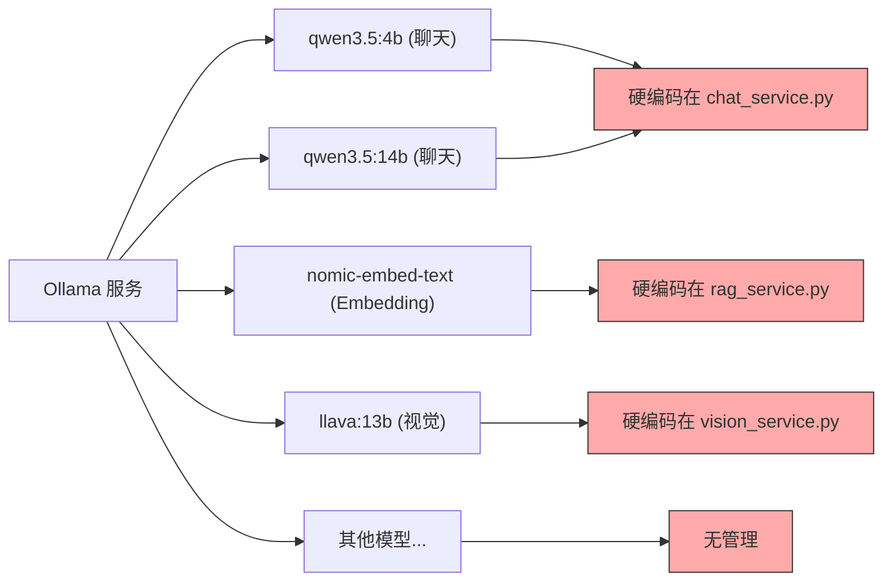
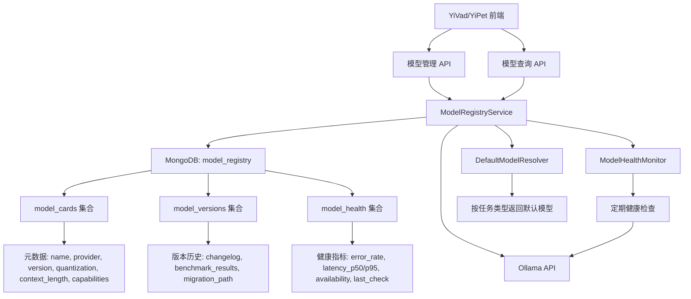
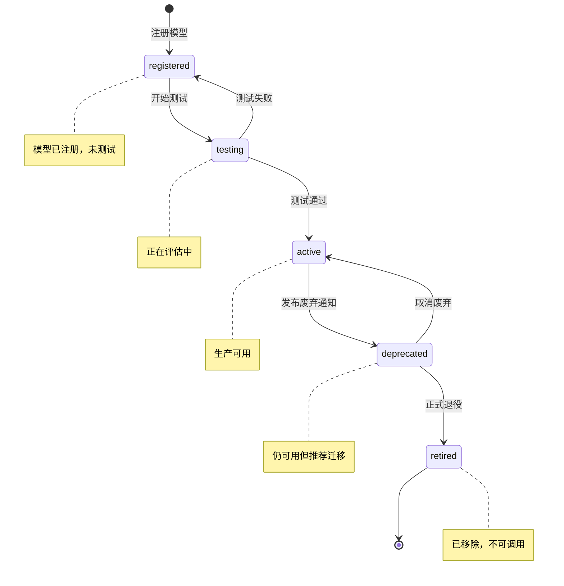

# YA-09-166: 模型注册与版本管理 — 集中式模型元数据管理与生命周期治理

> 需求编号：YA-09-166 · 优先级：P2 · 人天：0.5d · 状态：需求已编写
> 依赖：ModelRuntime 抽象层、Ollama API

## 背景

YiAi 当前通过 Ollama 管理多个 LLM 和 Embedding 模型，但缺乏统一的模型元数据管理和生命周期治理机制。模型信息分散在配置文件和代码中，存在以下问题：

- **模型信息碎片化**：模型名称、版本、量化方式、context_length 等信息散落在代码注释、配置文件、环境变量中，无统一查询入口
- **无版本历史**：模型升级后，旧版本信息丢失，无法追溯模型的变更历史
- **无生命周期管理**：模型的注册、测试、激活、废弃、退役过程无标准化流程，全凭开发者手动操作
- **无默认模型配置**：不同任务类型（聊天、Embedding、视觉）各自硬编码模型名称，切换模型需修改代码
- **无模型对比能力**：无法并排比较不同模型的规格参数和基准测试结果，选型依赖主观判断
- **无健康监控**：缺乏模型运行时的错误率、延迟、可用性等健康指标

需要一个**集中式模型注册中心**，提供模型元数据管理、版本历史追踪、生命周期治理、默认模型配置、模型对比和健康监控能力，使模型管理规范化、可追溯、可观测。

---

## 一、现状分析

### 1.1 当前模型分布



### 1.2 当前问题

| # | 问题 | 严重程度 | 影响 |
|---|------|----------|------|
| 1 | 模型信息无统一管理 | 高 | 模型名称、版本、能力等元数据散落各处，无法快速查询当前可用模型列表 |
| 2 | 无版本历史追踪 | 高 | 模型升级后旧版本信息丢失，无法回滚到已知良好版本 |
| 3 | 无生命周期管理 | 中 | 模型废弃后仍被调用，或在测试阶段即被生产使用 |
| 4 | 默认模型硬编码 | 中 | 切换聊天模型需修改代码并重启服务，无法动态切换 |
| 5 | 无模型对比能力 | 中 | 选型依赖经验，缺乏量化数据支撑决策 |
| 6 | 无健康监控 | 中 | 模型运行异常无法及时发现，错误率升高无告警 |
| 7 | 模型变更无通知 | 低 | 模型废弃或升级时，下游服务无感知，可能导致调用失败 |

### 1.3 改造前 API 依赖

| # | 接口 | 调用方 | 说明 |
|---|------|--------|------|
| 1 | `ollama.list()` | chat_service / rag_service / vision_service | 直接调用 Ollama API 获取模型列表，无元数据管理 |
| 2 | `ollama.show(model_name)` | 各服务 | 获取模型详细信息，但信息不完整且无缓存 |

> 改造前仅依赖 Ollama 原生 API，模型元数据由 Ollama 管理，YiAi 无自有模型注册中心。

### 1.4 设计灵感

参考 HuggingFace Model Hub 的模型卡片（Model Card）概念和 MLflow Model Registry 的生命周期管理。核心思路：每个模型一张"模型卡片"记录元数据，通过状态机管理生命周期，提供统一的模型查询和切换接口。

---

## 二、设计决策

### 决策 1：模型注册存储 — MongoDB vs SQLite vs 配置文件

| 维度 | MongoDB | SQLite | YAML 配置文件 |
|------|---------|--------|---------------|
| 查询能力 | 强（聚合查询、索引） | 中（SQL 查询） | 弱（文件读取） |
| 版本历史 | 容易（独立集合或嵌套数组） | 容易（独立表） | 困难（需 git 管理） |
| 修改便利性 | 需 API 操作 | 需 API 操作 | 直接编辑文件即可 |
| 运维复杂度 | 低（已有 MongoDB） | 中（新依赖） | 低（无新依赖） |
| 并发安全 | 高（原子操作） | 中（文件锁） | 低（无锁） |

**选择：MongoDB。** YiAi 已有 MongoDB 基础设施，无需引入新依赖。MongoDB 的文档模型适合存储模型卡片的嵌套结构，聚合查询支持模型对比和健康统计。

### 决策 2：模型生命周期 — 简单状态机 vs 完整审批流程

| 维度 | 简单状态机（5 状态） | 完整审批流程 |
|------|---------------------|-------------|
| 状态数量 | 5（registered → testing → active → deprecated → retired） | 7+（含 pending_review, approved, rejected 等） |
| 实现复杂度 | 低 | 高 |
| 适用场景 | 小团队，快速迭代 | 大团队，合规要求高 |
| 当前需求匹配 | 高 | 低（过度设计） |

**选择：简单状态机。** 5 个状态覆盖模型从注册到退役的完整生命周期，满足当前需求。完整审批流程属于过度设计，需求不明确时不实现。

### 决策 3：默认模型配置 — 按任务类型配置 vs 全局默认

| 维度 | 按任务类型 | 全局默认 |
|------|----------|---------|
| 灵活性 | 高（聊天用 A，Embedding 用 B） | 低（所有任务同一模型） |
| 实现复杂度 | 中 | 低 |
| 实际需求 | 不同任务确实需要不同模型 | 不现实 |

**选择：按任务类型配置。** 聊天、Embedding、视觉、代码生成等任务对模型的要求完全不同，必须支持按任务类型指定默认模型。

### 设计决策记录

| 决策 | 选项 A | 选项 B | 选择 | 理由 |
|------|--------|--------|------|------|
| 存储方式 | MongoDB | 配置文件 | **MongoDB** | 已有基础设施，查询能力强，版本历史易管理 |
| 生命周期 | 简单状态机 | 审批流程 | **简单状态机** | 5 状态覆盖完整生命周期，避免过度设计 |
| 默认模型 | 按任务类型 | 全局默认 | **按任务类型** | 不同任务对模型要求不同，必须按类型配置 |

---

## 三、目标架构

### 3.1 模型注册中心架构



### 3.2 模型生命周期状态机



### 3.3 核心数据模型

```python
# domain/models/registry.py

from enum import Enum
from pydantic import BaseModel, Field
from datetime import datetime

class ModelStatus(str, Enum):
    REGISTERED = "registered"
    TESTING = "testing"
    ACTIVE = "active"
    DEPRECATED = "deprecated"
    RETIRED = "retired"

class ModelCapability(str, Enum):
    CHAT = "chat"
    EMBEDDING = "embedding"
    VISION = "vision"
    CODE = "code"
    TOOL_USE = "tool_use"
    STREAMING = "streaming"

class ModelCard(BaseModel):
    """模型卡片: 完整的模型元数据。"""
    name: str                              # 模型名称（如 qwen3.5）
    provider: str                          # 提供方（ollama/openai/anthropic）
    version: str                           # 版本号（如 4b, 14b）
    quantization: str                      # 量化方式（Q4_K_M, Q5_K_M, fp16）
    context_length: int                    # 上下文窗口大小（tokens）
    capabilities: list[ModelCapability]    # 模型能力列表
    status: ModelStatus = ModelStatus.REGISTERED
    description: str = ""                  # 模型描述
    parameters: dict = {}                  # 模型参数（temperature, top_p 等默认值）
    tags: list[str] = []                   # 标签
    created_at: datetime = Field(default_factory=datetime.now)
    updated_at: datetime = Field(default_factory=datetime.now)
    deprecated_at: datetime | None = None
    retired_at: datetime | None = None
    migration_path: str | None = None      # 废弃后的迁移建议模型名称

class ModelVersion(BaseModel):
    """模型版本: 记录模型变更历史。"""
    model_name: str
    version: str
    changelog: str                         # 变更说明
    benchmark_results: dict = {}           # 基准测试结果
    created_at: datetime = Field(default_factory=datetime.now)
    created_by: str = "system"

class ModelHealth(BaseModel):
    """模型健康: 运行时健康指标。"""
    model_name: str
    error_rate: float = 0.0                # 错误率（0-1）
    latency_p50_ms: float = 0.0            # 中位数延迟
    latency_p95_ms: float = 0.0            # P95 延迟
    availability: float = 1.0              # 可用性（0-1）
    total_requests: int = 0                # 总请求数
    total_errors: int = 0                  # 总错误数
    last_check: datetime = Field(default_factory=datetime.now)
    consecutive_failures: int = 0          # 连续失败次数
```

---

## 四、具体改动

### 4.1 新增文件

| 文件 | 行数 | 说明 |
|------|------|------|
| `src/domain/models/registry.py` | 100 | 数据模型：ModelCard、ModelVersion、ModelHealth、ModelStatus |
| `src/domain/models/registry_repository.py` | 120 | MongoDB 数据访问层：CRUD、查询、聚合 |
| `src/services/model_registry/model_registry_service.py` | 180 | 模型注册服务：RPC 接口 + 核心逻辑 |
| `src/services/model_registry/model_health_monitor.py` | 80 | 模型健康监控：定时检查 + 指标采集 |
| `src/services/model_registry/default_model_resolver.py` | 60 | 默认模型解析器：按任务类型返回默认模型 |

### 4.2 核心实现

**模型注册服务 RPC 接口：**

```python
# services/model_registry/model_registry_service.py

class ModelRegistryService:
    """模型注册中心服务。"""

    def __init__(self):
        self.repo = ModelRegistryRepository()
        self.health_monitor = ModelHealthMonitor()
        self.default_resolver = DefaultModelResolver()

    async def register_model(self, parameters: dict) -> dict:
        """RPC: 注册新模型。

        parameters:
            name: str              — 模型名称
            provider: str          — 提供方
            version: str           — 版本号
            quantization: str      — 量化方式
            context_length: int    — 上下文窗口大小
            capabilities: list[str]— 模型能力列表
            description: str       — 模型描述
            parameters: dict       — 默认参数
            tags: list[str]        — 标签
        """
        name = parameters.get("name")
        if not name:
            return {"code": 1001, "message": "name is required", "data": None}

        # 检查是否已存在
        existing = await self.repo.find_by_name(name)
        if existing:
            return {"code": 1003, "message": f"Model '{name}' already exists", "data": None}

        card = ModelCard(
            name=name,
            provider=parameters.get("provider", "ollama"),
            version=parameters.get("version", ""),
            quantization=parameters.get("quantization", ""),
            context_length=parameters.get("context_length", 4096),
            capabilities=[ModelCapability(c) for c in parameters.get("capabilities", ["chat"])],
            description=parameters.get("description", ""),
            parameters=parameters.get("parameters", {}),
            tags=parameters.get("tags", []),
        )

        await self.repo.insert(card)

        # 创建初始版本记录
        version = ModelVersion(
            model_name=name,
            version=card.version,
            changelog="Initial registration",
        )
        await self.repo.insert_version(version)

        return {"code": 0, "message": "ok", "data": {"model": card.model_dump()}}

    async def list_models(self, parameters: dict = None) -> dict:
        """RPC: 列出所有模型。

        parameters:
            status: str   — 按状态过滤（可选）
            capability: str— 按能力过滤（可选）
            provider: str — 按提供方过滤（可选）
        """
        filter_dict = {}
        if parameters:
            if "status" in parameters:
                filter_dict["status"] = parameters["status"]
            if "capability" in parameters:
                filter_dict["capabilities"] = parameters["capability"]
            if "provider" in parameters:
                filter_dict["provider"] = parameters["provider"]

        cards = await self.repo.find_all(filter_dict)
        return {
            "code": 0,
            "message": "ok",
            "data": {"models": [c.model_dump() for c in cards], "total": len(cards)},
        }

    async def get_model(self, parameters: dict) -> dict:
        """RPC: 获取单个模型详情。

        parameters:
            name: str — 模型名称
        """
        name = parameters.get("name")
        if not name:
            return {"code": 1001, "message": "name is required", "data": None}

        card = await self.repo.find_by_name(name)
        if not card:
            return {"code": 1002, "message": f"Model '{name}' not found", "data": None}

        # 附带版本历史和健康指标
        versions = await self.repo.find_versions(name)
        health = await self.repo.find_health(name)

        return {
            "code": 0,
            "message": "ok",
            "data": {
                "model": card.model_dump(),
                "versions": [v.model_dump() for v in versions],
                "health": health.model_dump() if health else None,
            },
        }

    async def update_model_status(self, parameters: dict) -> dict:
        """RPC: 更新模型生命周期状态。

        parameters:
            name: str          — 模型名称
            status: str        — 目标状态 (testing/active/deprecated/retired)
            migration_path: str— 废弃/退役时的迁移建议（可选）
            changelog: str     — 变更说明
        """
        name = parameters.get("name")
        status = parameters.get("status")
        if not name or not status:
            return {"code": 1001, "message": "name and status are required", "data": None}

        card = await self.repo.find_by_name(name)
        if not card:
            return {"code": 1002, "message": f"Model '{name}' not found", "data": None}

        # 状态转换校验
        valid_transitions = {
            ModelStatus.REGISTERED: [ModelStatus.TESTING, ModelStatus.RETIRED],
            ModelStatus.TESTING: [ModelStatus.ACTIVE, ModelStatus.REGISTERED, ModelStatus.RETIRED],
            ModelStatus.ACTIVE: [ModelStatus.DEPRECATED, ModelStatus.RETIRED],
            ModelStatus.DEPRECATED: [ModelStatus.ACTIVE, ModelStatus.RETIRED],
            ModelStatus.RETIRED: [],  # 不可逆
        }

        target_status = ModelStatus(status)
        if target_status not in valid_transitions.get(card.status, []):
            return {
                "code": 1001,
                "message": f"Invalid transition: {card.status} -> {status}",
                "data": None,
            }

        card.status = target_status
        card.updated_at = datetime.now()

        if target_status == ModelStatus.DEPRECATED:
            card.deprecated_at = datetime.now()
            card.migration_path = parameters.get("migration_path")
        elif target_status == ModelStatus.RETIRED:
            card.retired_at = datetime.now()

        await self.repo.update(card)

        # 记录版本变更
        version = ModelVersion(
            model_name=name,
            version=card.version,
            changelog=parameters.get("changelog", f"Status changed to {status}"),
        )
        await self.repo.insert_version(version)

        return {"code": 0, "message": "ok", "data": {"model": card.model_dump()}}

    async def compare_models(self, parameters: dict) -> dict:
        """RPC: 并排比较多个模型。

        parameters:
            model_names: list[str] — 要比较的模型名称列表
        """
        names = parameters.get("model_names", [])
        if not names or len(names) < 2:
            return {"code": 1001, "message": "At least 2 model names required", "data": None}

        cards = []
        for name in names:
            card = await self.repo.find_by_name(name)
            if card:
                cards.append(card)

        # 构建比较表
        comparison = {
            "models": [c.model_dump() for c in cards],
            "dimensions": [
                "context_length",
                "quantization",
                "capabilities",
                "status",
            ],
        }

        # 附带最新的基准测试结果
        benchmarks = {}
        for card in cards:
            versions = await self.repo.find_versions(card.name, limit=1)
            if versions:
                benchmarks[card.name] = versions[0].benchmark_results
        comparison["benchmarks"] = benchmarks

        return {"code": 0, "message": "ok", "data": {"comparison": comparison}}

    async def get_default_model(self, parameters: dict) -> dict:
        """RPC: 获取指定任务类型的默认模型。

        parameters:
            task_type: str — 任务类型 (chat/embedding/vision/code)
        """
        task_type = parameters.get("task_type", "chat")
        model_name = await self.default_resolver.resolve(task_type)

        if not model_name:
            return {"code": 1002, "message": f"No default model for task: {task_type}", "data": None}

        card = await self.repo.find_by_name(model_name)
        return {"code": 0, "message": "ok", "data": {"model": card.model_dump() if card else None}}

    async def set_default_model(self, parameters: dict) -> dict:
        """RPC: 设置指定任务类型的默认模型。

        parameters:
            task_type: str   — 任务类型
            model_name: str  — 模型名称
        """
        task_type = parameters.get("task_type")
        model_name = parameters.get("model_name")
        if not task_type or not model_name:
            return {"code": 1001, "message": "task_type and model_name are required", "data": None}

        # 验证模型存在且状态为 active
        card = await self.repo.find_by_name(model_name)
        if not card:
            return {"code": 1002, "message": f"Model '{model_name}' not found", "data": None}
        if card.status != ModelStatus.ACTIVE:
            return {"code": 1001, "message": f"Model '{model_name}' is not active", "data": None}

        await self.default_resolver.set_default(task_type, model_name)
        return {"code": 0, "message": "ok", "data": {"task_type": task_type, "default_model": model_name}}

    async def get_model_health(self, parameters: dict) -> dict:
        """RPC: 获取模型健康指标。

        parameters:
            model_name: str — 模型名称（可选，不传则返回所有模型健康）
        """
        model_name = parameters.get("model_name") if parameters else None

        if model_name:
            health = await self.repo.find_health(model_name)
            if not health:
                return {"code": 1002, "message": f"No health data for model: {model_name}", "data": None}
            return {"code": 0, "message": "ok", "data": {"health": health.model_dump()}}
        else:
            all_health = await self.repo.find_all_health()
            return {
                "code": 0,
                "message": "ok",
                "data": {"health": [h.model_dump() for h in all_health]},
            }
```

**默认模型解析器：**

```python
# services/model_registry/default_model_resolver.py

DEFAULT_MODELS = {
    "chat": "qwen3.5:4b",
    "embedding": "nomic-embed-text",
    "vision": "llava:13b",
    "code": "qwen3.5:4b",
}

class DefaultModelResolver:
    """按任务类型解析默认模型。"""

    def __init__(self):
        self._defaults: dict[str, str] = DEFAULT_MODELS.copy()

    async def resolve(self, task_type: str) -> str | None:
        """解析指定任务类型的默认模型名称。"""
        return self._defaults.get(task_type)

    async def set_default(self, task_type: str, model_name: str):
        """设置默认模型。"""
        self._defaults[task_type] = model_name
```

**模型健康监控：**

```python
# services/model_registry/model_health_monitor.py

class ModelHealthMonitor:
    """定期检查模型健康状态并更新指标。"""

    CHECK_INTERVAL_SECONDS = 60

    async def check_model(self, model_name: str) -> ModelHealth:
        """检查单个模型健康状态。"""
        start = time.time()
        try:
            # 发送轻量请求验证模型可用
            runtime = OllamaRuntime()
            result = await runtime.complete(
                messages=[{"role": "user", "content": "ping"}],
                model=model_name,
                max_tokens=1,
            )
            success = result.get("success", False)
            latency_ms = (time.time() - start) * 1000
        except Exception:
            success = False
            latency_ms = (time.time() - start) * 1000

        # 更新健康指标
        health = await self.repo.find_health(model_name)
        if not health:
            health = ModelHealth(model_name=model_name)

        health.total_requests += 1
        if not success:
            health.total_errors += 1
            health.consecutive_failures += 1
        else:
            health.consecutive_failures = 0

        health.error_rate = health.total_errors / health.total_requests
        health.availability = 1.0 - (health.consecutive_failures / 10)  # 简化可用性计算
        health.latency_p50_ms = latency_ms  # 简化：使用最近一次延迟
        health.last_check = datetime.now()

        await self.repo.upsert_health(health)
        return health

    async def check_all_models(self):
        """检查所有 active 模型的健康状态。"""
        cards = await self.repo.find_all({"status": "active"})
        for card in cards:
            await self.check_model(card.name)
```

### 4.3 涉及文件

```
YiAi/src/
├── domain/models/
│   ├── registry.py                     # 新增: 数据模型 (100行)
│   └── registry_repository.py          # 新增: 数据访问层 (120行)
├── services/model_registry/
│   ├── model_registry_service.py       # 新增: 注册服务 RPC 接口 (180行)
│   ├── model_health_monitor.py         # 新增: 健康监控 (80行)
│   └── default_model_resolver.py       # 新增: 默认模型解析器 (60行)
└── server/
    └── routes/
        └── model_registry_routes.py    # 新增: 模型管理路由 (40行)
```

---

## 五、实施步骤

按依赖顺序排列，每步可独立验证和提交：

| 步骤 | 内容 | 涉及文件 | 验证方式 | 人天 |
|------|------|---------|---------|------|
| 1 | 定义数据模型（ModelCard、ModelVersion、ModelHealth、ModelStatus） | `domain/models/registry.py` | Pydantic 校验通过，枚举值完整 | 0.05 |
| 2 | 实现数据访问层（CRUD、聚合查询、版本管理） | `domain/models/registry_repository.py` | MongoDB 读写正常，索引创建成功 | 0.05 |
| 3 | 实现默认模型解析器 | `services/model_registry/default_model_resolver.py` | 按任务类型返回正确默认模型 | 0.02 |
| 4 | 实现模型注册服务 RPC（register、list、get、update_status、compare、get_default、set_default、get_health） | `services/model_registry/model_registry_service.py` | 所有 RPC 接口正常响应 | 0.15 |
| 5 | 实现模型健康监控 | `services/model_registry/model_health_monitor.py` | 定时检查正常，健康指标更新 | 0.08 |
| 6 | 实现模型管理路由 | `server/routes/model_registry_routes.py` | 路由注册正常，RPC 调用成功 | 0.05 |
| 7 | 迁移现有模型到注册中心 | 全模块 | 所有现有模型成功注册，状态为 active | 0.05 |
| 8 | 回归测试 | 全模块 | 聊天/Embedding/视觉服务正常，默认模型解析正确 | 0.05 |

**总计：0.5d**

---

## 六、测试规格

### Requirement: 模型注册

#### Scenario: 注册新模型
- **Given** Ollama 中有一个新模型 `qwen3.5:14b`
- **When** 调用 `register_model` 接口，提供完整的模型元数据
- **Then** 返回 `code=0`，模型卡片已创建
- **And** 模型状态为 `registered`
- **And** 创建了初始版本记录

#### Scenario: 注册已存在的模型
- **Given** 模型 `qwen3.5:4b` 已注册
- **When** 再次调用 `register_model` 接口注册同名模型
- **Then** 返回 `code=1003`（资源已存在）

### Requirement: 模型列表查询

#### Scenario: 列出所有模型
- **Given** 系统中已注册 5 个模型
- **When** 调用 `list_models` 接口，无过滤条件
- **Then** 返回 5 个模型卡片

#### Scenario: 按状态过滤模型
- **Given** 系统中有 3 个 active 模型和 2 个 testing 模型
- **When** 调用 `list_models`，参数 `status="active"`
- **Then** 返回 3 个 active 模型

#### Scenario: 按能力过滤模型
- **Given** 系统中有 2 个支持 vision 的模型
- **When** 调用 `list_models`，参数 `capability="vision"`
- **Then** 返回 2 个支持 vision 的模型

### Requirement: 生命周期管理

#### Scenario: 正常生命周期流转
- **Given** 模型状态为 `registered`
- **When** 依次调用 `update_model_status`：registered → testing → active → deprecated → retired
- **Then** 每次状态转换成功，返回 `code=0`
- **And** 每次转换创建版本记录

#### Scenario: 非法状态转换被拒绝
- **Given** 模型状态为 `active`
- **When** 调用 `update_model_status`，目标状态为 `testing`
- **Then** 返回 `code=1001`，提示非法转换

#### Scenario: 废弃模型提供迁移路径
- **Given** 模型 `qwen-old:1b` 状态为 `active`
- **When** 调用 `update_model_status`，状态为 `deprecated`，`migration_path="qwen3.5:4b"`
- **Then** 模型状态变为 `deprecated`，`migration_path` 已设置

### Requirement: 模型对比

#### Scenario: 并排比较两个模型
- **Given** 系统中有 `qwen3.5:4b` 和 `qwen3.5:14b`
- **When** 调用 `compare_models`，参数 `model_names=["qwen3.5:4b", "qwen3.5:14b"]`
- **Then** 返回两个模型的规格对比
- **And** 包含 context_length、quantization、capabilities 等维度
- **And** 包含最新的基准测试结果

### Requirement: 默认模型管理

#### Scenario: 获取聊天默认模型
- **Given** 聊天任务默认模型为 `qwen3.5:4b`
- **When** 调用 `get_default_model`，参数 `task_type="chat"`
- **Then** 返回 `qwen3.5:4b` 的模型卡片

#### Scenario: 切换默认模型
- **Given** 聊天任务默认模型为 `qwen3.5:4b`
- **When** 调用 `set_default_model`，参数 `task_type="chat"`，`model_name="qwen3.5:14b"`
- **Then** 聊天默认模型切换为 `qwen3.5:14b`
- **And** 后续 `get_default_model("chat")` 返回 `qwen3.5:14b`

### Requirement: 模型健康监控

#### Scenario: 获取单个模型健康指标
- **Given** 模型 `qwen3.5:4b` 运行正常
- **When** 调用 `get_model_health`，参数 `model_name="qwen3.5:4b"`
- **Then** 返回健康指标，包含 error_rate、latency、availability

---

## 七、风险与缓解

| 风险 | 概率 | 影响 | 等级 | 缓解措施 | 应急预案 |
|------|------|------|------|----------|----------|
| 模型注册信息与 Ollama 实际状态不一致 | 中 | 中 | 中 | 定期同步 Ollama 模型列表，标记不一致项 | 手动触发全量同步 |
| 默认模型切换后下游服务未感知 | 中 | 高 | 高 | 切换时记录变更日志，通知下游服务 | 回滚默认模型配置 |
| 健康监控请求增加模型负载 | 低 | 低 | 低 | 使用最小 token 的 ping 请求，间隔 60s | 降低检查频率或关闭监控 |
| 状态转换导致模型不可用 | 低 | 中 | 低 | 状态转换前检查是否有活跃调用 | 立即回滚状态 |
| 版本历史数据膨胀 | 低 | 低 | 低 | 限制每个模型保留最近 100 条版本记录 | 归档旧版本到独立集合 |

---

## 八、回滚策略

| 回滚场景 | 回滚方式 | 影响范围 | 恢复时间 |
|----------|----------|----------|----------|
| 模型注册服务异常 | 移除 RPC 路由，各服务回退到硬编码模型 | 模型管理功能 | 5min |
| 默认模型配置错误导致服务异常 | 恢复默认模型配置到上次已知良好值 | 聊天/Embedding/视觉服务 | 3min |
| 健康监控导致性能问题 | 关闭健康监控定时任务 | 健康指标采集 | 2min |

**回滚验证：**
- 聊天/Embedding/视觉服务正常，不受影响
- 模型注册服务接口返回 404
- `ruff` + `mypy` 检查通过

---

## 九、设计决策记录

### D-01: 为什么用 MongoDB 而非配置文件管理模型？

配置文件适合简单场景，但无法满足版本历史、健康监控、聚合查询等需求。MongoDB 是 YiAi 已有基础设施，无额外运维成本。文档模型天然适合存储模型卡片的嵌套结构。

### D-02: 为什么生命周期只设 5 个状态？

5 个状态（registered → testing → active → deprecated → retired）覆盖了模型从注册到退役的完整生命周期。增加更多状态（如 pending_review）属于过度设计，当前团队规模不需要审批流程。

### D-03: 为什么默认模型配置存储在内存而非数据库？

默认模型配置是高频读取（每次请求都可能需要）、低频写入的数据。存储在内存中通过 DefaultModelResolver 提供服务，读取零延迟。通过 set_default_model 接口修改时同步更新内存，服务重启后从硬编码默认值恢复。

### D-04: 为什么健康监控用 ping 而非真实请求？

健康检查的目标是快速验证模型可用性，而非评估模型质量。使用 `max_tokens=1` 的 ping 请求最小化对模型服务的负载，60 秒间隔确保不影响正常请求。

---

## 十、可观测性

### 10.1 关键指标

| 指标 | 采集方式 | 告警阈值 | 说明 |
|------|---------|---------|------|
| 注册模型总数 | 计数器 | — | 按状态分组 |
| 模型状态变更次数 | 计数器 | — | 按来源状态和目标状态分组 |
| 模型错误率 | 健康监控 | > 5% | 连续 3 次检查超过阈值触发告警 |
| 模型延迟 P95 | 健康监控 | > 10s | 模型响应变慢 |
| 模型可用性 | 健康监控 | < 99% | 模型不可用 |
| 连续失败次数 | 健康监控 | >= 3 | 模型可能已下线 |
| 默认模型切换事件 | 事件日志 | — | 每次切换记录 |

### 10.2 日志规范

| 日志级别 | 场景 | 示例 |
|---------|------|------|
| `INFO` | 模型注册 | `[ModelRegistry] registered: {name}, provider={p}, capabilities={c}` |
| `INFO` | 状态变更 | `[ModelRegistry] status: {name} {old} -> {new}` |
| `INFO` | 默认模型切换 | `[ModelRegistry] default: {task_type} -> {model_name}` |
| `WARN` | 健康检查失败 | `[ModelRegistry] health check failed: {name}, consecutive={n}` |
| `WARN` | 废弃模型被调用 | `[ModelRegistry] deprecated model used: {name}, migration={path}` |
| `ERROR` | 模型同步失败 | `[ModelRegistry] sync failed: {error}` |

---

## 十一、代码审查检查清单

- [ ] `ModelCard` 模型字段完整（name, provider, version, quantization, context_length, capabilities, status）
- [ ] `ModelStatus` 枚举包含所有 5 个状态
- [ ] 状态转换校验逻辑正确，非法转换被拒绝
- [ ] 废弃模型提供 `migration_path` 建议
- [ ] `compare_models` 至少需要 2 个模型名称
- [ ] `set_default_model` 验证目标模型为 active 状态
- [ ] 健康监控使用最小 token 的 ping 请求
- [ ] 健康监控间隔 60 秒，避免增加模型负载
- [ ] 版本记录持久化到 MongoDB
- [ ] 默认模型解析器线程安全
- [ ] `ruff` 代码规范通过
- [ ] `mypy` 类型检查通过

---

## 十二、回归问题预测

| # | 问题 | 发现场景 | 根因 | 修复方式 |
|---|------|---------|------|---------|
| 1 | 模型注册后 Ollama 中模型被删除，注册中心不知情 | 用户通过 Ollama CLI 删除模型，注册中心仍显示模型为 active | 注册中心与 Ollama 无实时同步机制 | 增加定期同步任务，标记不在 Ollama 中的模型为 `retired` |
| 2 | 默认模型切换后，部分服务使用缓存的旧模型名称 | 调用 `set_default_model` 切换默认模型，但 chat_service 已缓存旧模型名称 | 服务在启动时加载默认模型，运行期间不刷新 | 切换默认模型时发送事件通知，各服务监听并刷新缓存 |
| 3 | 健康监控的 ping 请求被 Ollama 计入 token 使用量 | 用户发现 token 使用量异常增加 | 每次 ping 消耗 1 token，60s 间隔意味着每天 1440 次 ping | 使用 Ollama 的 `/api/tags` 端点检查模型可用性，不消耗 token |
| 4 | 版本历史查询性能下降 | 模型已注册 200+ 个版本记录，查询全量版本历史耗时增加 | 未对版本历史集合创建索引 | 为 `model_versions` 集合添加 `model_name + created_at` 复合索引 |
| 5 | 模型对比时，某个模型无基准测试结果导致 KeyError | 调用 `compare_models` 比较 3 个模型，其中 1 个无基准测试 | `benchmarks[card.name]` 访问时该 key 可能不存在 | 使用 `benchmarks.get(card.name, {})` |
| 6 | 并发状态转换导致状态不一致 | 两个管理员同时将同一模型从 testing 改为 active 和 retired | 无并发控制，后写入覆盖先写入 | 使用 MongoDB `find_one_and_update` 原子操作，带状态前置条件 |

---

## 十三、性能分析

### 13.1 模型注册中心性能特征

| 指标 | 值 | 说明 |
|------|------|------|
| 模型注册耗时 | < 50ms | MongoDB 写入 + 初始版本创建 |
| 模型列表查询耗时 | < 20ms | MongoDB 查询，带索引 |
| 模型详情查询耗时 | < 50ms | 含版本历史和健康指标查询 |
| 模型对比耗时 | < 100ms | 多个模型并行查询 |
| 健康检查耗时 | 100-500ms | 取决于模型响应速度 |
| 默认模型解析耗时 | < 1ms | 内存查找 |

### 13.2 性能瓶颈

| 瓶颈 | 严重程度 | 表现 | 优化方向 |
|------|----------|------|----------|
| 健康检查增加模型负载 | 低 | 每次检查消耗少量 token | 使用 `/api/tags` 端点，不消耗 token |
| 版本历史全量查询 | 低 | 数百条版本记录时查询变慢 | 分页查询 + 索引优化 |
| 健康监控单线程串行检查 | 低 | 10 个模型需 5-10 秒检查完成 | 使用 `asyncio.gather` 并发检查 |

### 13.3 容量规划

| 场景 | 模型数量 | 版本记录/模型 | 健康检查间隔 | 预估负载 |
|------|---------|-------------|------------|---------|
| 当前规模 | 5-10 | 10-20 | 60s | 极低 |
| 中期规模 | 20-50 | 50-100 | 60s | 低 |
| 长期规模 | 50-100 | 100-200 | 120s | 中 |

---

*PRD 来源: `projects/yiai/requirements/2026-09/00-需求-需求总览.md`*

## 影响范围

- **影响模块**：待补充
- **涉及文件**：
- `src/domain/models/registry.py`
- `src/domain/models/registry_repository.py`
- `src/services/model_registry/default_model_resolver.py`
- `src/services/model_registry/model_registry_service.py`
- `src/services/model_registry/model_health_monitor.py`
- **是否影响 API 契约**：否
- **是否影响其他项目（YiVad/YiPet）**：否
- **用户感知**：待确认

## 预防措施

| 层面 | 措施 |
|------|------|
| 代码 | 在相关函数中添加参数校验和边界检查 |
| 测试 | 为 `src/domain/models/registry.py` 添加单元测试 |
| 流程 | 代码审查时重点检查此类模式 |
| 监控 | 添加日志告警，异常发生时及时发现 |
| 文档 | 在编码规范中记录此类反模式 |

## 经验教训

1. **根本原因**：开发过程中对边界情况和异常路径的考虑不足是此类问题的共同根因
2. **设计阶段**：在接口设计和模块实现时，应主动考虑异常输入、空值、超时等边界场景
3. **代码审查**：审查时应检查是否存在类似的反模式（如未捕获异常、无超时控制、缺少参数校验等）
4. **测试覆盖**：异常路径的测试覆盖率应与正常路径同等重视
5. **团队分享**：此类问题应在团队周会或技术分享中讨论，形成团队共识
