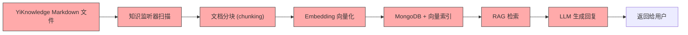
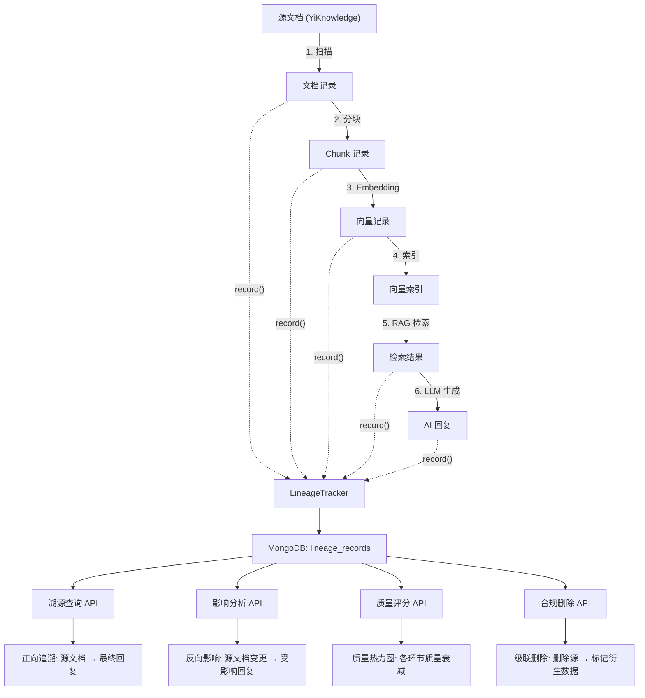

# YA-09-167: 数据血缘追踪 — AI 生成内容的端到端溯源与影响分析

> 需求编号：YA-09-167 · 优先级：P2 · 人天：0.5d · 状态：需求已编写
> 依赖：数据服务（data_service）、RAG 引擎、聊天服务（chat_service）

## 背景

YiAi 的 AI 生成内容（聊天回复、RAG 检索结果、文档摘要）经过多层数据流转：源文档 → 分块 → Embedding → 向量检索 → RAG 上下文 → LLM 生成。当前系统缺乏对这条数据流转链路的追踪能力，导致以下问题：

- **无法溯源**：用户看到 AI 回复中包含某个事实，但无法确认事实来源于哪个文档的哪个段落
- **无法影响分析**：源文档更新后，无法判断哪些历史回复可能受影响
- **无法验证准确性**：AI 回复中的引用无法追溯到原始数据源，准确性无法验证
- **无法满足合规要求**：GDPR 等法规要求能够追溯数据的来源和处理过程，删除源数据时需级联处理衍生数据
- **数据质量不可见**：无法评估数据在流转各阶段的质量衰减情况

需要一个**数据血缘追踪系统**，记录数据在 AI 管线中的每一次转换，支持从最终输出反向追溯到原始数据源，并支持影响分析和合规删除。

---

## 一、现状分析

### 1.1 当前数据流



每个环节都是黑盒，转换关系不记录，无法追踪。

### 1.2 当前问题

| # | 问题 | 严重程度 | 影响 |
|---|------|----------|------|
| 1 | AI 回复无引用来源 | 高 | 用户无法验证回复中的事实准确性，信任度低 |
| 2 | 源文档变更无法追踪影响 | 高 | 知识库更新后，旧的 RAG 回复可能过时，但无法识别 |
| 3 | 无法满足 GDPR 合规 | 中 | 用户要求删除数据时，无法定位所有衍生数据 |
| 4 | 数据质量无量化评估 | 中 | 无法判断是源文档质量差还是 Embedding/RAG 环节导致回复质量差 |
| 5 | 调试困难 | 中 | 回复质量差时，无法定位是哪个环节出了问题 |
| 6 | 无数据资产视图 | 低 | 不清楚系统中流转的数据量、来源分布、质量分布 |

### 1.3 改造前数据流

```
源文档 (YiKnowledge)
  ↓ 知识监听器扫描 → 文档记录 (knowledge_files)
  ↓ 分块 → 无分块记录
  ↓ Embedding → 无向量生成记录
  ↓ 向量索引 → 无索引记录
  ↓ RAG 检索 → 检索结果保存到会话消息中，但无溯源信息
  ↓ LLM 生成 → 回复保存到会话中，无来源引用
  ↓ 用户看到回复 → 无法追溯事实来源
```

### 1.4 设计灵感

参考 OpenLineage 的数据血缘标准和 Apache Atlas 的数据治理模型。核心思路：每次数据转换生成一条 `LineageRecord`，记录输入、输出、转换类型、时间戳，形成有向无环图（DAG），支持正向追溯和反向影响分析。

---

## 二、设计决策

### 决策 1：血缘存储 — MongoDB 图结构 vs 专用图数据库

| 维度 | MongoDB（邻接表） | Neo4j / 专用图数据库 |
|------|------------------|---------------------|
| 运维复杂度 | 低（已有 MongoDB） | 高（新服务） |
| 图查询性能 | 中（聚合查询，需手动递归） | 高（Cypher 原生图遍历） |
| 当前数据量 | 适配（数千条血缘记录） | 过度 |
| 学习成本 | 低 | 高 |

**选择：MongoDB 邻接表。** 当前血缘数据量在数千条级别，MongoDB 的聚合管道和 `$graphLookup` 足以支撑图遍历。专用图数据库在当前规模下属于过度工程。

### 决策 2：血缘粒度 — 文档级 vs 段落级 vs 句子级

| 维度 | 文档级 | 段落级 | 句子级 |
|------|--------|--------|--------|
| 追踪精度 | 低 | 中 | 高 |
| 存储开销 | 低 | 中 | 高 |
| 实现复杂度 | 低 | 中 | 高 |
| 溯源实用价值 | 低 | 高 | 中 |

**选择：段落级。** 文档级太粗（无法定位具体段落），句子级太细（存储开销大，实现复杂）。段落级（chunk 级别）是 RAG 的天然粒度，每个 chunk 即一个数据节点。

### 决策 3：血缘收集方式 — 自动拦截 vs 显式调用

| 维度 | 自动拦截（中间件/AOP） | 显式调用 |
|------|----------------------|---------|
| 侵入性 | 低（不修改业务代码） | 高（每个服务需显式记录） |
| 灵活性 | 低（统一格式，难以定制） | 高（每个环节可自定义元数据） |
| 覆盖完整性 | 高（自动记录所有转换） | 中（可能遗漏） |
| 调试难度 | 中 | 低 |

**选择：显式调用 + 装饰器辅助。** 核心转换节点（分块、Embedding、RAG 检索、LLM 生成）显式调用 `LineageTracker.record()`，同时提供 `@trace_lineage` 装饰器减少样板代码。自动拦截虽然覆盖完整但灵活性不足，不适合多变的 AI 管线。

### 设计决策记录

| 决策 | 选项 A | 选项 B | 选择 | 理由 |
|------|--------|--------|------|------|
| 存储方式 | MongoDB 邻接表 | 图数据库 | **MongoDB** | 已有基础设施，数据量小，$graphLookup 够用 |
| 血缘粒度 | 段落级 | 文档级/句子级 | **段落级** | RAG 的天然粒度，溯源精度和存储开销的最佳平衡 |
| 收集方式 | 显式调用 + 装饰器 | 自动拦截 | **显式调用** | 灵活性高，每个环节可自定义元数据 |

---

## 三、目标架构

### 3.1 血缘追踪架构



### 3.2 血缘数据模型

```python
# domain/lineage/models.py

from enum import Enum
from pydantic import BaseModel, Field
from datetime import datetime

class DataNodeType(str, Enum):
    SOURCE_DOCUMENT = "source_document"       # 源文档
    DOCUMENT_CHUNK = "document_chunk"         # 文档分块
    EMBEDDING_VECTOR = "embedding_vector"     # Embedding 向量
    VECTOR_INDEX = "vector_index"             # 向量索引
    RAG_RESULT = "rag_result"                 # RAG 检索结果
    LLM_RESPONSE = "llm_response"             # LLM 生成回复
    USER_FEEDBACK = "user_feedback"           # 用户反馈
    HUMAN_ANNOTATION = "human_annotation"     # 人工标注

class TransformationType(str, Enum):
    DOCUMENT_SCAN = "document_scan"           # 文档扫描
    TEXT_CHUNKING = "text_chunking"           # 文本分块
    EMBEDDING_GENERATION = "embedding_generation"  # 向量生成
    VECTOR_INDEXING = "vector_indexing"       # 向量索引
    RAG_RETRIEVAL = "rag_retrieval"           # RAG 检索
    LLM_GENERATION = "llm_generation"         # LLM 生成
    DATA_DELETION = "data_deletion"           # 数据删除
    QUALITY_ANNOTATION = "quality_annotation" # 质量标注

class LineageRecord(BaseModel):
    """血缘记录: 记录一次数据转换。"""
    record_id: str                            # 唯一标识
    transformation_type: TransformationType   # 转换类型
    inputs: list[str]                         # 输入数据节点 ID
    outputs: list[str]                        # 输出数据节点 ID
    metadata: dict = {}                       # 转换元数据
    timestamp: datetime = Field(default_factory=datetime.now)
    service_name: str = ""                    # 执行转换的服务
    duration_ms: float = 0.0                  # 转换耗时
    quality_score: float | None = None        # 该环节的质量评分（0-1）

class DataNode(BaseModel):
    """数据节点: 血缘图中的节点。"""
    node_id: str                              # 节点唯一标识
    node_type: DataNodeType                   # 节点类型
    data_ref: str                             # 数据引用（文档路径、chunk ID、消息 ID 等）
    content_hash: str = ""                    # 内容哈希（用于变更检测）
    metadata: dict = {}                       # 节点元数据
    created_at: datetime = Field(default_factory=datetime.now)
    quality_score: float | None = None        # 质量评分

class LineageGraph(BaseModel):
    """血缘图: 查询结果。"""
    nodes: list[DataNode]                     # 图中节点
    edges: list[LineageRecord]                # 图中边
    root_node_id: str                         # 查询起点
    direction: str                            # 遍历方向: upstream / downstream
```

---

## 四、具体改动

### 4.1 新增文件

| 文件 | 行数 | 说明 |
|------|------|------|
| `src/domain/lineage/__init__.py` | 8 | 模块导出 |
| `src/domain/lineage/models.py` | 80 | 数据模型：LineageRecord、DataNode、LineageGraph、枚举类型 |
| `src/domain/lineage/lineage_repository.py` | 100 | MongoDB 数据访问层：血缘记录 CRUD、图遍历 |
| `src/domain/lineage/lineage_tracker.py` | 120 | 血缘追踪器：record()、trace() 装饰器、质量评分 |
| `src/services/lineage/lineage_service.py` | 180 | 血缘服务 RPC：溯源、影响分析、合规删除、质量报告 |
| `src/services/lineage/quality_scorer.py` | 80 | 数据质量评分计算 |

### 4.2 核心实现

**血缘追踪器：**

```python
# domain/lineage/lineage_tracker.py

import hashlib
import uuid
import time
from functools import wraps
from datetime import datetime

class LineageTracker:
    """数据血缘追踪器。记录每次数据转换的输入输出关系。"""

    def __init__(self):
        self.repo = LineageRepository()

    def generate_node_id(self) -> str:
        """生成唯一节点 ID。"""
        return f"node_{uuid.uuid4().hex[:12]}"

    def compute_content_hash(self, content: str) -> str:
        """计算内容哈希（SHA256）。"""
        return hashlib.sha256(content.encode("utf-8")).hexdigest()[:16]

    async def record(
        self,
        transformation_type: TransformationType,
        inputs: list[DataNode],
        outputs: list[DataNode],
        metadata: dict = None,
        duration_ms: float = 0.0,
        quality_score: float = None,
    ) -> LineageRecord:
        """记录一次数据转换的血缘关系。

        Args:
            transformation_type: 转换类型
            inputs: 输入数据节点列表
            outputs: 输出数据节点列表
            metadata: 转换元数据
            duration_ms: 转换耗时
            quality_score: 质量评分
        """
        record = LineageRecord(
            record_id=f"lineage_{uuid.uuid4().hex[:12]}",
            transformation_type=transformation_type,
            inputs=[n.node_id for n in inputs],
            outputs=[n.node_id for n in outputs],
            metadata=metadata or {},
            duration_ms=duration_ms,
            quality_score=quality_score,
            service_name="YiAi",
        )

        # 保存所有节点（如果尚未存在）
        for node in inputs + outputs:
            await self.repo.upsert_node(node)

        # 保存血缘记录
        await self.repo.insert_record(record)

        return record

    async def trace_upstream(self, node_id: str, max_depth: int = 10) -> LineageGraph:
        """正向追溯: 从指定节点向上追溯到源数据。

        Args:
            node_id: 起始节点 ID
            max_depth: 最大追溯深度
        """
        nodes = {}
        edges = []

        current_ids = [node_id]
        for _ in range(max_depth):
            if not current_ids:
                break
            # 查找所有以当前节点为输出的血缘记录
            records = await self.repo.find_by_outputs(current_ids)
            if not records:
                break

            next_ids = []
            for record in records:
                edges.append(record)
                for input_id in record.inputs:
                    if input_id not in nodes:
                        node = await self.repo.find_node(input_id)
                        if node:
                            nodes[input_id] = node
                    next_ids.append(input_id)
            current_ids = list(set(next_ids))

        # 添加起始节点
        start_node = await self.repo.find_node(node_id)
        if start_node:
            nodes[node_id] = start_node

        return LineageGraph(
            nodes=list(nodes.values()),
            edges=edges,
            root_node_id=node_id,
            direction="upstream",
        )

    async def trace_downstream(self, node_id: str, max_depth: int = 10) -> LineageGraph:
        """反向追溯: 从指定节点向下追溯到所有衍生数据。

        Args:
            node_id: 起始节点 ID
            max_depth: 最大追溯深度
        """
        nodes = {}
        edges = []

        current_ids = [node_id]
        for _ in range(max_depth):
            if not current_ids:
                break
            records = await self.repo.find_by_inputs(current_ids)
            if not records:
                break

            next_ids = []
            for record in records:
                edges.append(record)
                for output_id in record.outputs:
                    if output_id not in nodes:
                        node = await self.repo.find_node(output_id)
                        if node:
                            nodes[output_id] = node
                    next_ids.append(output_id)
            current_ids = list(set(next_ids))

        start_node = await self.repo.find_node(node_id)
        if start_node:
            nodes[node_id] = start_node

        return LineageGraph(
            nodes=list(nodes.values()),
            edges=edges,
            root_node_id=node_id,
            direction="downstream",
        )


def trace_lineage(transformation_type: TransformationType):
    """装饰器: 自动记录函数调用的血缘关系。

    被装饰函数的第一个参数应为 inputs (list[DataNode])，
    返回值应为 outputs (list[DataNode])。
    """
    def decorator(func):
        @wraps(func)
        async def wrapper(*args, **kwargs):
            tracker = get_lineage_tracker()
            start = time.time()

            result = await func(*args, **kwargs)

            duration_ms = (time.time() - start) * 1000

            # 尝试从参数和返回值中提取输入输出节点
            inputs = kwargs.get("inputs", args[0] if args else [])
            outputs = result if isinstance(result, list) else []

            if inputs and outputs:
                await tracker.record(
                    transformation_type=transformation_type,
                    inputs=inputs,
                    outputs=outputs,
                    duration_ms=duration_ms,
                )

            return result
        return wrapper
    return decorator
```

**血缘服务 RPC 接口：**

```python
# services/lineage/lineage_service.py

class LineageService:
    """数据血缘服务。"""

    def __init__(self):
        self.tracker = LineageTracker()
        self.scorer = QualityScorer()

    async def trace_upstream(self, parameters: dict) -> dict:
        """RPC: 正向追溯——从数据节点追溯到源数据。

        parameters:
            node_id: str       — 起始节点 ID
            data_ref: str      — 数据引用（与 node_id 二选一）
            max_depth: int     — 最大追溯深度，默认 10
        """
        node_id = parameters.get("node_id")
        data_ref = parameters.get("data_ref")
        max_depth = parameters.get("max_depth", 10)

        # 如果提供 data_ref，先查找对应的 node_id
        if not node_id and data_ref:
            node = await self.tracker.repo.find_node_by_ref(data_ref)
            if node:
                node_id = node.node_id

        if not node_id:
            return {"code": 1001, "message": "node_id or data_ref is required", "data": None}

        graph = await self.tracker.trace_upstream(node_id, max_depth)
        return {
            "code": 0,
            "message": "ok",
            "data": {
                "graph": graph.model_dump(),
                "summary": self._summarize_graph(graph),
            },
        }

    async def trace_downstream(self, parameters: dict) -> dict:
        """RPC: 反向追溯——从数据节点追溯到所有衍生数据。

        parameters:
            node_id: str       — 起始节点 ID
            data_ref: str      — 数据引用（与 node_id 二选一）
            max_depth: int     — 最大追溯深度，默认 10
        """
        node_id = parameters.get("node_id")
        data_ref = parameters.get("data_ref")
        max_depth = parameters.get("max_depth", 10)

        if not node_id and data_ref:
            node = await self.tracker.repo.find_node_by_ref(data_ref)
            if node:
                node_id = node.node_id

        if not node_id:
            return {"code": 1001, "message": "node_id or data_ref is required", "data": None}

        graph = await self.tracker.trace_downstream(node_id, max_depth)
        return {
            "code": 0,
            "message": "ok",
            "data": {
                "graph": graph.model_dump(),
                "summary": self._summarize_graph(graph),
            },
        }

    async def impact_analysis(self, parameters: dict) -> dict:
        """RPC: 影响分析——源文档变更后，分析哪些回复受影响。

        parameters:
            source_path: str   — 源文档路径
        """
        source_path = parameters.get("source_path")
        if not source_path:
            return {"code": 1001, "message": "source_path is required", "data": None}

        # 查找源文档节点
        node = await self.tracker.repo.find_node_by_ref(source_path)
        if not node:
            return {"code": 1002, "message": f"Source not found: {source_path}", "data": None}

        # 下游追溯
        graph = await self.tracker.trace_downstream(node.node_id, max_depth=20)

        # 提取受影响的 LLM 回复
        affected_responses = []
        for n in graph.nodes:
            if n.node_type == DataNodeType.LLM_RESPONSE:
                affected_responses.append({
                    "node_id": n.node_id,
                    "data_ref": n.data_ref,
                    "created_at": n.created_at.isoformat(),
                })

        return {
            "code": 0,
            "message": "ok",
            "data": {
                "source_path": source_path,
                "source_content_hash": node.content_hash,
                "affected_responses": affected_responses,
                "total_affected": len(affected_responses),
                "full_graph": graph.model_dump(),
            },
        }

    async def compliance_delete(self, parameters: dict) -> dict:
        """RPC: 合规删除——删除源数据及所有衍生数据。

        parameters:
            source_path: str   — 要删除的源文档路径
            mode: str          — "cascade"（级联删除）| "reverify"（标记待验证）
        """
        source_path = parameters.get("source_path")
        mode = parameters.get("mode", "reverify")

        if not source_path:
            return {"code": 1001, "message": "source_path is required", "data": None}

        # 查找所有下游衍生数据
        node = await self.tracker.repo.find_node_by_ref(source_path)
        if not node:
            return {"code": 1002, "message": f"Source not found: {source_path}", "data": None}

        graph = await self.tracker.trace_downstream(node.node_id, max_depth=20)

        affected = []
        for n in graph.nodes:
            if n.node_id == node.node_id:
                continue

            if mode == "cascade":
                # 级联删除：标记所有衍生数据为已删除
                await self.tracker.repo.mark_node_deleted(n.node_id)
            else:
                # 重新验证：标记衍生数据待验证
                await self.tracker.repo.mark_node_unverified(n.node_id)

            affected.append({
                "node_id": n.node_id,
                "node_type": n.node_type,
                "data_ref": n.data_ref,
                "action": "deleted" if mode == "cascade" else "marked_unverified",
            })

        # 删除源节点
        await self.tracker.repo.mark_node_deleted(node.node_id)

        return {
            "code": 0,
            "message": "ok",
            "data": {
                "source_path": source_path,
                "mode": mode,
                "affected_nodes": affected,
                "total_affected": len(affected),
            },
        }

    async def get_quality_report(self, parameters: dict) -> dict:
        """RPC: 获取数据质量报告。

        parameters:
            source_path: str   — 源文档路径（可选，不传则返回全局报告）
        """
        source_path = parameters.get("source_path") if parameters else None

        if source_path:
            node = await self.tracker.repo.find_node_by_ref(source_path)
            if not node:
                return {"code": 1002, "message": f"Source not found: {source_path}", "data": None}
            report = await self.scorer.compute_pipeline_quality(node.node_id)
        else:
            report = await self.scorer.compute_global_quality()

        return {"code": 0, "message": "ok", "data": {"report": report}}

    def _summarize_graph(self, graph: LineageGraph) -> dict:
        """生成血缘图摘要。"""
        node_types = {}
        for node in graph.nodes:
            node_types[node.node_type] = node_types.get(node.node_type, 0) + 1

        return {
            "total_nodes": len(graph.nodes),
            "total_edges": len(graph.edges),
            "depth": len(graph.edges),
            "node_types": node_types,
            "direction": graph.direction,
        }
```

**质量评分器：**

```python
# services/lineage/quality_scorer.py

class QualityScorer:
    """数据质量评分器。"""

    async def compute_pipeline_quality(self, node_id: str) -> dict:
        """计算单个源文档的管线质量评分。"""
        tracker = LineageTracker()
        graph = await tracker.trace_downstream(node_id, max_depth=20)

        scores = {}
        for edge in graph.edges:
            stage = edge.transformation_type
            if edge.quality_score is not None:
                if stage not in scores:
                    scores[stage] = []
                scores[stage].append(edge.quality_score)

        stage_averages = {}
        for stage, score_list in scores.items():
            stage_averages[stage] = sum(score_list) / len(score_list)

        overall = sum(stage_averages.values()) / len(stage_averages) if stage_averages else 0.0

        return {
            "source_node_id": node_id,
            "overall_quality": round(overall, 3),
            "stage_quality": stage_averages,
            "total_transformations": len(graph.edges),
        }

    async def compute_global_quality(self) -> dict:
        """计算全局数据质量报告。"""
        repo = LineageRepository()
        all_scores = await repo.get_all_quality_scores()

        by_stage = {}
        for score in all_scores:
            stage = score["transformation_type"]
            if stage not in by_stage:
                by_stage[stage] = []
            by_stage[stage].append(score["quality_score"])

        stage_averages = {}
        for stage, score_list in by_stage.items():
            stage_averages[stage] = {
                "average": round(sum(score_list) / len(score_list), 3),
                "count": len(score_list),
                "min": round(min(score_list), 3),
                "max": round(max(score_list), 3),
            }

        return {
            "stage_quality": stage_averages,
            "total_records": len(all_scores),
        }
```

### 4.3 涉及文件

```
YiAi/src/
├── domain/lineage/
│   ├── __init__.py                  # 新增: 模块导出
│   ├── models.py                    # 新增: 数据模型 (80行)
│   ├── lineage_repository.py        # 新增: 数据访问层 (100行)
│   └── lineage_tracker.py           # 新增: 血缘追踪器 (120行)
├── services/lineage/
│   ├── lineage_service.py           # 新增: 血缘服务 RPC (180行)
│   └── quality_scorer.py            # 新增: 质量评分器 (80行)
└── server/
    └── routes/
        └── lineage_routes.py        # 新增: 血缘路由 (40行)
```

---

## 五、实施步骤

按依赖顺序排列，每步可独立验证和提交：

| 步骤 | 内容 | 涉及文件 | 验证方式 | 人天 |
|------|------|---------|---------|------|
| 1 | 定义数据模型（LineageRecord、DataNode、LineageGraph、枚举） | `domain/lineage/models.py` | Pydantic 校验通过，枚举值完整 | 0.05 |
| 2 | 实现数据访问层（血缘记录 CRUD、节点管理、图查询） | `domain/lineage/lineage_repository.py` | MongoDB 读写正常，索引创建成功 | 0.05 |
| 3 | 实现血缘追踪器（record、trace_upstream、trace_downstream、装饰器） | `domain/lineage/lineage_tracker.py` | 追溯图结构正确，包含所有节点和边 | 0.08 |
| 4 | 实现质量评分器 | `services/lineage/quality_scorer.py` | 管线质量评分计算正确，全局报告格式正确 | 0.05 |
| 5 | 实现血缘服务 RPC（trace_upstream、trace_downstream、impact_analysis、compliance_delete、get_quality_report） | `services/lineage/lineage_service.py` | 所有 RPC 接口正常响应 | 0.12 |
| 6 | 集成到现有管线（RAG 检索、LLM 生成时记录血缘） | chat_service、rag_service | 每次 RAG 检索和 LLM 生成自动创建血缘记录 | 0.08 |
| 7 | 回归测试 | 全模块 | 聊天/RAG 服务正常，血缘记录创建无误 | 0.07 |

**总计：0.5d**

---

## 六、测试规格

### Requirement: 血缘记录

#### Scenario: 记录 RAG 检索的血缘关系
- **Given** 知识库中有文档 `docs/test.md`，已分块和向量化
- **When** 用户发起 RAG 查询，检索到 3 个 chunk
- **Then** 创建一条 `rag_retrieval` 类型的血缘记录
- **And** 输入节点为 3 个 chunk 节点，输出节点为 RAG 检索结果节点

#### Scenario: 记录 LLM 生成的血缘关系
- **Given** RAG 检索返回了 3 个 chunk 作为上下文
- **When** LLM 基于上下文生成回复
- **Then** 创建一条 `llm_generation` 类型的血缘记录
- **And** 输入节点为 RAG 检索结果节点，输出节点为 LLM 回复节点

### Requirement: 正向追溯

#### Scenario: 从 LLM 回复追溯到源文档
- **Given** 完整的血缘链路：源文档 → chunk → embedding → RAG → LLM 回复
- **When** 调用 `trace_upstream`，传入 LLM 回复的 node_id
- **Then** 返回包含所有上游节点的血缘图
- **And** 最上游节点为源文档，类型为 `source_document`

#### Scenario: 追溯深度限制
- **Given** 血缘链路深度为 15 层
- **When** 调用 `trace_upstream`，参数 `max_depth=5`
- **Then** 返回 5 层深度的血缘图
- **And** 不包含第 6 层及以上的节点

### Requirement: 影响分析

#### Scenario: 源文档变更后分析受影响回复
- **Given** 源文档 `docs/test.md` 被 5 个 LLM 回复引用
- **When** 调用 `impact_analysis`，参数 `source_path="docs/test.md"`
- **Then** 返回 5 个受影响的 LLM 回复
- **And** 每个回复包含 data_ref 和 created_at

### Requirement: 合规删除

#### Scenario: 级联删除源文档及衍生数据
- **Given** 源文档 `docs/test.md` 有 10 个衍生节点
- **When** 调用 `compliance_delete`，参数 `source_path="docs/test.md"`，`mode="cascade"`
- **Then** 源文档和所有 10 个衍生节点标记为已删除
- **And** 返回 affected_nodes 列表

#### Scenario: 重新验证模式删除
- **Given** 源文档 `docs/test.md` 有 10 个衍生节点
- **When** 调用 `compliance_delete`，参数 `source_path="docs/test.md"`，`mode="reverify"`
- **Then** 源文档标记为已删除，衍生节点标记为待验证
- **And** 衍生节点不被删除，等待后续验证

### Requirement: 质量报告

#### Scenario: 获取管线质量评分
- **Given** 源文档的管线中有 5 个环节，每个环节有质量评分
- **When** 调用 `get_quality_report`，参数 `source_path="docs/test.md"`
- **Then** 返回 overall_quality 和 stage_quality（每个环节的平均分）

---

## 七、风险与缓解

| 风险 | 概率 | 影响 | 等级 | 缓解措施 | 应急预案 |
|------|------|------|------|----------|----------|
| 血缘记录数据膨胀 | 中 | 中 | 中 | 设置 TTL 索引（90 天），定期清理旧记录 | 手动清理历史数据 |
| 血缘记录增加请求延迟 | 低 | 低 | 低 | 异步记录（fire-and-forget），不阻塞主流程 | 关闭血缘记录功能 |
| 追溯深度过大导致性能问题 | 低 | 中 | 低 | 默认 max_depth=10，限制最大深度 20 | 降低默认深度 |
| 图查询结果不完整（遗漏节点） | 中 | 中 | 中 | 关键节点使用唯一 data_ref 索引，避免重复创建 | 手动修复缺失的血缘记录 |
| 合规删除误删数据 | 低 | 高 | 中 | 默认使用 `reverify` 模式，仅标记不删除 | 从备份恢复数据 |

---

## 八、回滚策略

| 回滚场景 | 回滚方式 | 影响范围 | 恢复时间 |
|----------|----------|----------|----------|
| 血缘记录导致性能下降 | 关闭血缘记录功能（配置开关） | 血缘追踪功能 | 2min |
| 合规删除误操作 | 恢复被标记的节点（从备份） | 数据节点 | 30min |
| 血缘服务异常 | 移除 RPC 路由 | 血缘查询功能 | 5min |

**回滚验证：**
- 聊天/RAG 服务正常，不受影响
- 血缘服务接口返回 404
- `ruff` + `mypy` 检查通过

---

## 九、设计决策记录

### D-01: 为什么血缘记录采用异步写入？

血缘记录是旁路功能，不应阻塞主流程（RAG 检索、LLM 生成）。采用 `fire-and-forget` 模式异步写入，即使血缘记录失败也不影响核心业务。代价是少量记录可能丢失，但可接受。

### D-02: 为什么合规删除默认为 `reverify` 而非 `cascade`？

`cascade` 级联删除是不可逆操作，误操作后果严重。默认 `reverify` 模式仅标记衍生数据为待验证，由人工或自动化流程确认后再执行删除。这是安全优先的设计选择。

### D-03: 为什么血缘图查询使用应用层遍历而非图数据库？

MongoDB 的 `$graphLookup` 聚合管道支持递归图查询，但深度和灵活性有限。应用层实现 `trace_upstream`/`trace_downstream` 使用 BFS 遍历，虽然需要多次数据库查询，但逻辑清晰、易于调试，且当前数据量下性能可接受。

---

## 十、可观测性

### 10.1 关键指标

| 指标 | 采集方式 | 告警阈值 | 说明 |
|------|---------|---------|------|
| 每日血缘记录数 | 计数器 | — | 按转换类型分组 |
| 平均追溯深度 | 直方图 | — | 上游/下游 |
| 管线质量评分 | 仪表盘 | < 0.6 | 整体数据质量下降 |
| 合规删除操作数 | 计数器 | — | 按模式分组 |
| 血缘记录失败数 | 计数器 | > 10/hr | 异步写入失败 |
| 图查询耗时 | 直方图 | P95 > 5s | 血缘查询性能 |

### 10.2 日志规范

| 日志级别 | 场景 | 示例 |
|---------|------|------|
| `INFO` | 血缘记录 | `[Lineage] recorded: {type}, inputs={n}, outputs={m}, {ms}ms` |
| `INFO` | 合规删除 | `[Lineage] compliance_delete: {path}, mode={m}, affected={n}` |
| `WARN` | 追溯深度超限 | `[Lineage] trace truncated: max_depth={d}, actual_depth={a}` |
| `WARN` | 节点未找到 | `[Lineage] node not found: {node_id}` |
| `ERROR` | 血缘记录失败 | `[Lineage] record failed: {error}` |

---

## 十一、代码审查检查清单

- [ ] `LineageRecord` 模型字段完整（record_id、transformation_type、inputs、outputs、metadata、quality_score）
- [ ] `DataNode` 模型包含 content_hash（用于变更检测）
- [ ] `DataNodeType` 和 `TransformationType` 枚举覆盖所有管线环节
- [ ] `trace_upstream` 和 `trace_downstream` 使用 BFS 遍历，有深度限制
- [ ] 血缘记录异步写入，不阻塞主流程
- [ ] `impact_analysis` 正确提取受影响的 LLM 回复
- [ ] `compliance_delete` 默认 `reverify` 模式，避免误删
- [ ] 质量评分器正确处理空管线
- [ ] MongoDB 索引覆盖 `node_id`、`data_ref`、`inputs`、`outputs`
- [ ] `ruff` 代码规范通过
- [ ] `mypy` 类型检查通过

---

## 十二、回归问题预测

| # | 问题 | 发现场景 | 根因 | 修复方式 |
|---|------|---------|------|---------|
| 1 | 相同 chunk 重复创建节点 | 同一文档被多次 RAG 检索，每次创建新的 chunk 节点 | 未使用 content_hash 去重 | 创建节点前检查 content_hash，相同则复用已有节点 |
| 2 | 追溯时环形依赖导致死循环 | 两个血缘记录互相引用（A 输入 B，B 输入 A） | 数据写入错误或并发导致 | BFS 遍历时使用 visited 集合，避免重复访问 |
| 3 | 溯源图中节点类型不完整 | 某次 RAG 检索未记录 chunk 节点 | 旧代码未集成血缘追踪 | 对缺失的节点类型进行回填，添加默认节点 |
| 4 | 质量评分因缺失数据而偏差 | 管线中部分环节未记录质量评分 | 质量评分是可选的，部分环节未实现 | 计算时跳过 None 评分，在报告中标注数据缺失 |
| 5 | GDPR 删除后衍生数据仍被引用 | 合规删除后，前端缓存仍显示已删除数据 | 前端未同步删除状态 | 在查询接口中过滤已删除节点，前端重新加载数据 |
| 6 | 大量血缘记录导致 MongoDB 查询变慢 | 运行 3 个月后积累 10 万+ 血缘记录 | 未设置 TTL 索引 | 添加 `created_at` 的 TTL 索引（90 天），定期清理 |

---

## 十三、性能分析

### 13.1 血缘追踪性能特征

| 指标 | 值 | 说明 |
|------|------|------|
| 单次血缘记录写入 | < 5ms | 异步写入，不阻塞主流程 |
| 追溯查询（深度 5） | < 50ms | 5 次数据库查询 |
| 追溯查询（深度 10） | < 100ms | 10 次数据库查询 |
| 影响分析（受影响的回复 < 50） | < 200ms | 下游追溯 + 过滤 |
| 合规删除（受影响节点 < 100） | < 500ms | 批量更新节点状态 |
| 质量报告生成 | < 100ms | 聚合查询 |

### 13.2 性能瓶颈

| 瓶颈 | 严重程度 | 表现 | 优化方向 |
|------|----------|------|----------|
| 图遍历多次数据库查询 | 中 | 深度 10 的追溯需 10 次查询 | 使用 MongoDB `$graphLookup` 单次查询 |
| 血缘记录写入逐条插入 | 低 | 批量操作时性能下降 | 使用 `insert_many` 批量写入 |
| 影响分析下游节点过多 | 中 | 热门文档被 1000+ 回复引用 | 分页返回，限制 max_depth |

### 13.3 容量规划

| 场景 | 源文档数 | 日均血缘记录 | 存储（90 天） | 预估追溯耗时 |
|------|---------|------------|-------------|------------|
| 当前规模 | 50 | 500 | 45,000 | < 50ms |
| 中期规模 | 200 | 2,000 | 180,000 | < 100ms |
| 长期规模 | 1,000 | 10,000 | 900,000 | < 200ms |

---

*PRD 来源: `projects/yiai/requirements/2026-09/00-需求-需求总览.md`*

## 影响范围

- **影响模块**：待补充
- **涉及文件**：
- `src/domain/lineage/__init__.py`
- `src/services/lineage/quality_scorer.py`
- `src/domain/lineage/lineage_tracker.py`
- `src/services/lineage/lineage_service.py`
- `src/domain/lineage/models.py`
- `src/domain/lineage/lineage_repository.py`
- **是否影响 API 契约**：否
- **是否影响其他项目（YiVad/YiPet）**：否
- **用户感知**：待确认

## 预防措施

| 层面 | 措施 |
|------|------|
| 代码 | 在相关函数中添加参数校验和边界检查 |
| 测试 | 为 `src/domain/lineage/__init__.py` 添加单元测试 |
| 流程 | 代码审查时重点检查此类模式 |
| 监控 | 添加日志告警，异常发生时及时发现 |
| 文档 | 在编码规范中记录此类反模式 |

## 经验教训

1. **根本原因**：开发过程中对边界情况和异常路径的考虑不足是此类问题的共同根因
2. **设计阶段**：在接口设计和模块实现时，应主动考虑异常输入、空值、超时等边界场景
3. **代码审查**：审查时应检查是否存在类似的反模式（如未捕获异常、无超时控制、缺少参数校验等）
4. **测试覆盖**：异常路径的测试覆盖率应与正常路径同等重视
5. **团队分享**：此类问题应在团队周会或技术分享中讨论，形成团队共识
