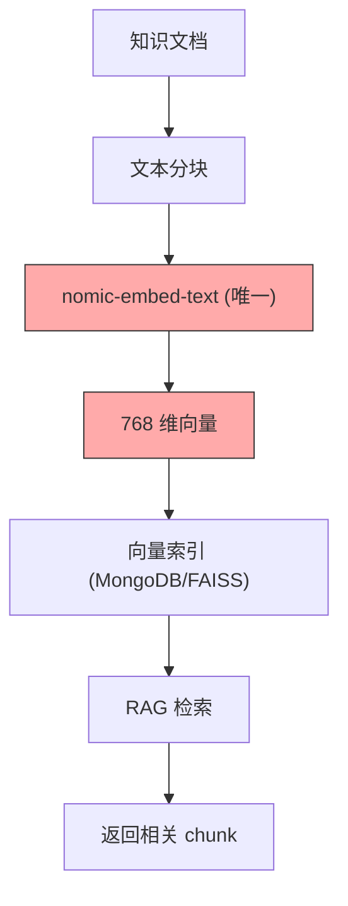
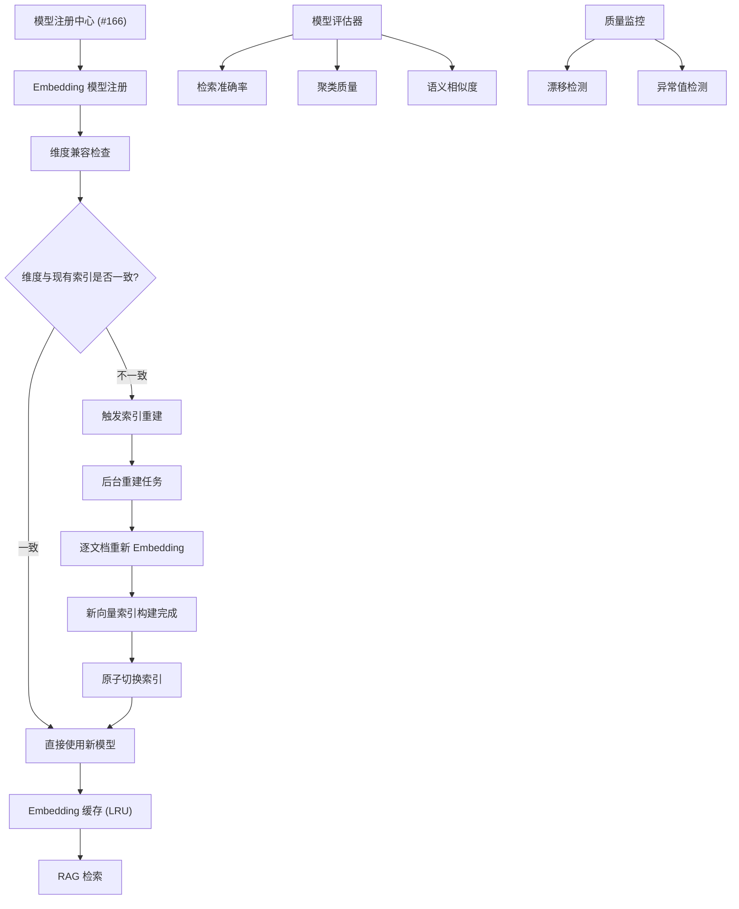
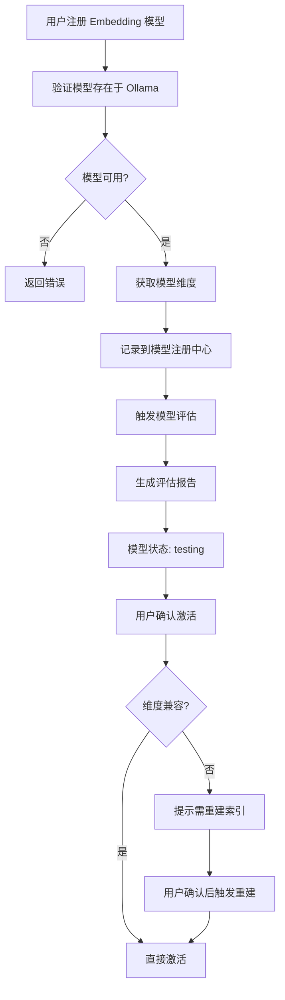

# YA-09-168: 自定义 Embedding 模型 — 微调模型注册、评估与热替换

> 需求编号：YA-09-168 · 优先级：P2 · 人天：0.5d · 状态：需求已编写
> 依赖：RAG 引擎、模型注册中心（#166）、Ollama API

## 背景

YiAi 当前使用 `nomic-embed-text` 作为唯一的 Embedding 模型，所有 RAG 向量索引均基于该模型的 768 维向量构建。随着业务场景多样化，单一 Embedding 模型已无法满足需求：

- **领域适配不足**：通用 Embedding 模型在特定领域（法律、医疗、金融）的语义理解能力有限，检索精度不足
- **无法使用微调模型**：团队无法注册和使用针对特定领域微调的 Embedding 模型
- **维度不兼容风险**：切换到不同维度（如 384、1024、1536）的 Embedding 模型时，现有向量索引失效，需手动重建
- **无评估机制**：缺乏对 Embedding 模型质量的量化评估（检索准确率、聚类质量、语义相似度），选型依赖主观判断
- **无热替换能力**：切换 Embedding 模型需手动重建全部索引，服务中断时间长
- **无缓存策略**：Embedding 结果无缓存，相同文本重复向量化，浪费计算资源

需要一个**自定义 Embedding 模型管理系统**，支持通过 Ollama 注册自定义/微调 Embedding 模型，提供模型评估、维度兼容检查、索引热替换和 Embedding 缓存能力。

---

## 一、现状分析

### 1.1 当前 Embedding 架构



### 1.2 当前问题

| # | 问题 | 严重程度 | 影响 |
|---|------|----------|------|
| 1 | 单一 Embedding 模型 | 高 | 无法针对不同领域使用不同模型，检索精度受限 |
| 2 | 无维度兼容检查 | 高 | 切换不同维度模型时，向量索引不兼容，查询失败 |
| 3 | 无索引热替换 | 高 | 切换 Embedding 模型需手动重建索引，服务中断 |
| 4 | 无模型评估 | 中 | 选型无量化依据，无法比较模型质量 |
| 5 | 无 Embedding 缓存 | 中 | 相同文本重复向量化，增加计算开销 |
| 6 | 无质量监控 | 中 | 模型漂移、检索质量下降无法及时发现 |
| 7 | 无按集合配置模型 | 低 | 所有知识集合强制使用同一 Embedding 模型 |

### 1.3 改造前 API 依赖

| # | 接口 | 调用方 | 说明 |
|---|------|--------|------|
| 1 | `ollama.embeddings(model="nomic-embed-text", prompt=text)` | rag_service | 直接调用 Ollama Embedding API，模型硬编码 |
| 2 | `ollama.list()` | 无 | 未使用——Embedding 模型列表不可见 |

> 改造前仅 1 个 API 依赖，Embedding 模型硬编码为 `nomic-embed-text`，无模型管理、无评估、无缓存。

### 1.4 设计灵感

参考 MTEB（Massive Text Embedding Benchmark）的评估维度和 LangChain 的 `CacheBackedEmbeddings` 缓存模式。核心思路：Embedding 模型注册 → 维度兼容检查 → 多维度评估 → 索引热替换 → 缓存加速。

---

## 二、设计决策

### 决策 1：Embedding 模型注册 — 融入模型注册中心 vs 独立管理

| 维度 | 融入模型注册中心（#166） | 独立 Embedding 管理 |
|------|------------------------|-------------------|
| 一致性 | 高（统一管理 LLM + Embedding） | 低（两套体系） |
| 实现复杂度 | 低（复用已有基础设施） | 中（需新建全部代码） |
| 扩展性 | 高（capabilities 字段区分模型类型） | 中 |
| 用户体验 | 好（统一入口） | 差（两个管理页面） |

**选择：融入模型注册中心。** 在 #166 的 `ModelCard` 中通过 `capabilities: ["embedding"]` 标识 Embedding 模型，复用模型注册、生命周期、健康监控等全部基础设施。仅新增 Embedding 特有的评估和索引管理功能。

### 决策 2：索引重建策略 — 后台重建 vs 双索引切换

| 维度 | 后台重建 | 双索引切换 |
|------|---------|-----------|
| 服务中断 | 短暂（重建期间查询可能返回空） | 无（旧索引持续服务，切换瞬间完成） |
| 存储开销 | 低（重建后替换） | 高（同时存在新旧两套索引） |
| 实现复杂度 | 低 | 高 |
| 切换速度 | 慢（重建需数分钟到数小时） | 快（切换指针瞬间完成） |

**选择：后台重建。** 双索引虽然无中断，但存储开销大（索引大小翻倍），实现复杂。当前向量数据量在数千条级别，后台重建可在数分钟内完成，短暂降级可接受。重建期间旧索引持续服务，重建完成后原子切换。

### 决策 3：Embedding 缓存 — 内存缓存 vs Redis vs MongoDB

| 维度 | 内存缓存（LRU） | Redis | MongoDB |
|------|----------------|-------|---------|
| 延迟 | < 1ms | 1-5ms | 5-20ms |
| 容量 | 受限（受内存限制） | 可扩展 | 可扩展 |
| 运维复杂度 | 低（无新依赖） | 中（Redis 集群） | 低（已有 MongoDB） |
| 持久化 | 无（重启丢失） | 可配置 | 有 |
| 适用场景 | 热数据缓存 | 大规模缓存 | 持久化缓存 |

**选择：内存 LRU 缓存 + 按模型隔离。** 当前 Embedding 请求量不高（日均数千次），内存 LRU 缓存（容量 10000 条）足以覆盖热数据。按模型版本隔离缓存，切换模型时自动失效。服务重启后缓存重建成本低（每条 Embedding 约 50-200ms）。

### 设计决策记录

| 决策 | 选项 A | 选项 B | 选择 | 理由 |
|------|--------|--------|------|------|
| 注册方式 | 融入模型注册中心 | 独立管理 | **融入注册中心** | 复用基础设施，统一管理 |
| 索引重建 | 后台重建 | 双索引切换 | **后台重建** | 存储开销低，实现简单，数分钟重建可接受 |
| 缓存方式 | 内存 LRU | Redis/MongoDB | **内存 LRU** | 无新依赖，延迟最低，当前规模适配 |

---

## 三、目标架构

### 3.1 Embedding 模型管理架构



### 3.2 Embedding 模型注册流程



### 3.3 核心数据模型

```python
# domain/embedding/models.py

from enum import Enum
from pydantic import BaseModel, Field
from datetime import datetime

class EmbeddingDimension(str, Enum):
    D_384 = "384"
    D_768 = "768"
    D_1024 = "1024"
    D_1536 = "1536"
    D_2048 = "2048"
    D_4096 = "4096"

class EmbeddingModelInfo(BaseModel):
    """Embedding 模型信息。"""
    name: str                              # 模型名称
    provider: str = "ollama"               # 提供方
    dimension: int                         # 向量维度
    max_tokens: int = 512                  # 最大输入 token 数
    normalization: str = "l2"              # 归一化方式
    supports_batch: bool = True            # 是否支持批量 Embedding
    description: str = ""                  # 描述

class EmbeddingEvaluation(BaseModel):
    """Embedding 模型评估结果。"""
    model_name: str
    retrieval_accuracy: float              # 检索准确率 (0-1)
    clustering_quality: float              # 聚类质量 (silhouette score)
    semantic_similarity: float             # 语义相似度 (Spearman correlation)
    benchmark_dataset: str                 # 使用的基准数据集
    benchmark_size: int                    # 基准数据集大小
    evaluation_date: datetime = Field(default_factory=datetime.now)
    notes: str = ""

class IndexRebuildTask(BaseModel):
    """索引重建任务。"""
    task_id: str
    collection_name: str                   # 目标集合
    source_model: str                      # 源 Embedding 模型
    target_model: str                      # 目标 Embedding 模型
    status: str                            # pending / running / completed / failed
    total_documents: int = 0
    processed_documents: int = 0
    progress: float = 0.0                  # 0-1
    started_at: datetime | None = None
    completed_at: datetime | None = None
    error_message: str | None = None

class EmbeddingCacheEntry(BaseModel):
    """Embedding 缓存条目。"""
    model_name: str
    text_hash: str                         # 文本的 SHA256 哈希
    text: str                              # 原始文本
    embedding: list[float]                 # 向量
    dimension: int                         # 向量维度
    created_at: datetime = Field(default_factory=datetime.now)
    hit_count: int = 0                     # 缓存命中次数
```

---

## 四、具体改动

### 4.1 新增文件

| 文件 | 行数 | 说明 |
|------|------|------|
| `src/domain/embedding/__init__.py` | 8 | 模块导出 |
| `src/domain/embedding/models.py` | 80 | 数据模型：EmbeddingModelInfo、EmbeddingEvaluation、IndexRebuildTask、EmbeddingCacheEntry |
| `src/domain/embedding/embedding_registry.py` | 100 | Embedding 模型注册与维度管理 |
| `src/domain/embedding/dimension_checker.py` | 60 | 维度兼容性检查 |
| `src/domain/embedding/embedding_cache.py` | 80 | Embedding 缓存（LRU + 按模型隔离） |
| `src/services/embedding/embedding_service.py` | 180 | Embedding 服务 RPC：注册、评估、切换、缓存管理 |
| `src/services/embedding/embedding_evaluator.py` | 120 | 模型评估：检索准确率、聚类质量、语义相似度 |
| `src/services/embedding/index_rebuilder.py` | 100 | 索引重建：后台任务、进度追踪、原子切换 |

### 4.2 核心实现

**Embedding 缓存：**

```python
# domain/embedding/embedding_cache.py

import hashlib
from collections import OrderedDict
from threading import Lock

class EmbeddingCache:
    """LRU Embedding 缓存，按模型隔离。"""

    def __init__(self, max_size_per_model: int = 10000):
        self.max_size_per_model = max_size_per_model
        self._caches: dict[str, OrderedDict] = {}  # model_name -> OrderedDict
        self._lock = Lock()

    def _get_cache(self, model_name: str) -> OrderedDict:
        """获取指定模型的缓存，如果不存在则创建。"""
        if model_name not in self._caches:
            self._caches[model_name] = OrderedDict()
        return self._caches[model_name]

    def _hash_text(self, text: str) -> str:
        """计算文本哈希。"""
        return hashlib.sha256(text.encode("utf-8")).hexdigest()

    def get(self, model_name: str, text: str) -> list[float] | None:
        """获取缓存的 Embedding 向量。"""
        text_hash = self._hash_text(text)
        with self._lock:
            cache = self._get_cache(model_name)
            entry = cache.get(text_hash)
            if entry is not None:
                entry["hit_count"] += 1
                cache.move_to_end(text_hash)  # LRU: 移到末尾
                return entry["embedding"]
        return None

    def set(self, model_name: str, text: str, embedding: list[float]):
        """缓存 Embedding 向量。"""
        text_hash = self._hash_text(text)
        with self._lock:
            cache = self._get_cache(model_name)
            cache[text_hash] = {
                "embedding": embedding,
                "text": text,
                "hit_count": 0,
            }
            cache.move_to_end(text_hash)

            # LRU 淘汰
            if len(cache) > self.max_size_per_model:
                cache.popitem(last=False)

    def invalidate_model(self, model_name: str):
        """使指定模型的所有缓存失效（模型切换时调用）。"""
        with self._lock:
            if model_name in self._caches:
                self._caches[model_name].clear()

    def get_stats(self, model_name: str = None) -> dict:
        """获取缓存统计信息。"""
        with self._lock:
            if model_name:
                cache = self._caches.get(model_name, OrderedDict())
                total_hits = sum(e["hit_count"] for e in cache.values())
                return {
                    "model_name": model_name,
                    "size": len(cache),
                    "max_size": self.max_size_per_model,
                    "total_hits": total_hits,
                    "hit_rate": total_hits / (total_hits + len(cache)) if (total_hits + len(cache)) > 0 else 0,
                }
            else:
                stats = {}
                for name, cache in self._caches.items():
                    total_hits = sum(e["hit_count"] for e in cache.values())
                    stats[name] = {
                        "size": len(cache),
                        "total_hits": total_hits,
                    }
                return stats
```

**维度兼容检查器：**

```python
# domain/embedding/dimension_checker.py

class DimensionChecker:
    """检查 Embedding 模型维度与现有向量索引的兼容性。"""

    def __init__(self):
        self.repo = LineageRepository()  # 复用血缘仓库访问向量索引

    async def check_compatibility(
        self,
        model_name: str,
        model_dimension: int,
        collection_name: str = None,
    ) -> dict:
        """检查维度兼容性。

        Returns:
            {
                "compatible": bool,
                "current_dimension": int | None,
                "target_dimension": int,
                "collections_affected": list[str],
                "requires_rebuild": bool,
                "estimated_documents": int,
                "estimated_rebuild_time_seconds": float,
            }
        """
        affected = []

        if collection_name:
            current_dim = await self._get_collection_dimension(collection_name)
            if current_dim is not None and current_dim != model_dimension:
                affected.append(collection_name)
        else:
            # 检查所有集合
            collections = await self._list_vector_collections()
            for col in collections:
                current_dim = await self._get_collection_dimension(col)
                if current_dim is not None and current_dim != model_dimension:
                    affected.append(col)

        total_docs = sum(
            await self._count_documents(col) for col in affected
        ) if affected else 0

        return {
            "compatible": len(affected) == 0,
            "current_dimension": await self._get_current_default_dimension(),
            "target_dimension": model_dimension,
            "collections_affected": affected,
            "requires_rebuild": len(affected) > 0,
            "estimated_documents": total_docs,
            "estimated_rebuild_time_seconds": total_docs * 0.2,  # 每文档约 200ms
        }

    async def _get_collection_dimension(self, collection_name: str) -> int | None:
        """获取集合的向量维度。"""
        # 从向量索引元数据中获取维度
        meta = await self.repo.get_collection_metadata(collection_name)
        return meta.get("dimension") if meta else None

    async def _get_current_default_dimension(self) -> int | None:
        """获取当前默认 Embedding 模型的维度。"""
        # 从模型注册中心获取
        resolver = DefaultModelResolver()
        model_name = await resolver.resolve("embedding")
        if model_name:
            info = await self._get_model_info(model_name)
            return info.dimension if info else None
        return None

    async def _list_vector_collections(self) -> list[str]:
        """列出所有向量集合。"""
        return await self.repo.list_vector_collections()

    async def _count_documents(self, collection_name: str) -> int:
        """统计集合中的文档数量。"""
        return await self.repo.count_documents(collection_name)
```

**索引重建器：**

```python
# services/embedding/index_rebuilder.py

import asyncio
import uuid
from datetime import datetime

class IndexRebuilder:
    """后台索引重建服务。"""

    def __init__(self):
        self.tasks: dict[str, IndexRebuildTask] = {}
        self._active_task: str | None = None

    async def start_rebuild(
        self,
        collection_name: str,
        source_model: str,
        target_model: str,
    ) -> dict:
        """启动索引重建任务。

        Returns:
            任务信息，包含 task_id
        """
        # 检查是否有正在进行的重建任务
        if self._active_task:
            return {"code": 1003, "message": "Another rebuild task is already running", "data": None}

        task_id = f"rebuild_{uuid.uuid4().hex[:8]}"
        task = IndexRebuildTask(
            task_id=task_id,
            collection_name=collection_name,
            source_model=source_model,
            target_model=target_model,
            status="pending",
        )

        # 统计文档数量
        repo = LineageRepository()
        task.total_documents = await repo.count_documents(collection_name)

        self.tasks[task_id] = task

        # 异步启动重建
        asyncio.create_task(self._run_rebuild(task))

        return {"code": 0, "message": "ok", "data": {"task": task.model_dump()}}

    async def _run_rebuild(self, task: IndexRebuildTask):
        """执行索引重建。"""
        self._active_task = task.task_id
        task.status = "running"
        task.started_at = datetime.now()

        try:
            repo = LineageRepository()
            embedding_service = EmbeddingService()

            # 批量获取文档
            batch_size = 50
            offset = 0

            while offset < task.total_documents:
                docs = await repo.get_documents(
                    task.collection_name,
                    skip=offset,
                    limit=batch_size,
                )

                for doc in docs:
                    # 使用新模型重新 Embedding
                    new_embedding = await embedding_service.embed(
                        text=doc["content"],
                        model=task.target_model,
                        use_cache=False,  # 重建时不使用缓存
                    )

                    # 更新向量索引
                    await repo.update_embedding(
                        task.collection_name,
                        doc["_id"],
                        new_embedding,
                    )

                    task.processed_documents += 1
                    task.progress = task.processed_documents / task.total_documents

                offset += batch_size

            # 更新集合元数据
            await repo.update_collection_metadata(
                task.collection_name,
                {"embedding_model": task.target_model},
            )

            task.status = "completed"
            task.completed_at = datetime.now()
            task.progress = 1.0

        except Exception as e:
            task.status = "failed"
            task.error_message = str(e)
        finally:
            self._active_task = None

    async def get_rebuild_progress(self, task_id: str) -> dict:
        """获取重建进度。"""
        task = self.tasks.get(task_id)
        if not task:
            return {"code": 1002, "message": f"Task not found: {task_id}", "data": None}

        return {
            "code": 0,
            "message": "ok",
            "data": {
                "task": task.model_dump(),
                "progress_percent": round(task.progress * 100, 1),
                "eta_seconds": self._estimate_eta(task),
            },
        }

    def _estimate_eta(self, task: IndexRebuildTask) -> float | None:
        """估算剩余时间。"""
        if task.started_at and task.processed_documents > 0:
            elapsed = (datetime.now() - task.started_at).total_seconds()
            rate = task.processed_documents / elapsed
            remaining = task.total_documents - task.processed_documents
            return remaining / rate if rate > 0 else None
        return None
```

**Embedding 服务 RPC 接口：**

```python
# services/embedding/embedding_service.py

class EmbeddingService:
    """Embedding 模型管理服务。"""

    def __init__(self):
        self.registry = EmbeddingRegistry()
        self.checker = DimensionChecker()
        self.evaluator = EmbeddingEvaluator()
        self.rebuilder = IndexRebuilder()
        self.cache = EmbeddingCache()

    async def register_embedding_model(self, parameters: dict) -> dict:
        """RPC: 注册自定义 Embedding 模型。

        parameters:
            name: str              — 模型名称（Ollama 中的名称）
            description: str       — 模型描述
            domain: str            — 适用领域（legal/medical/finance/general）
        """
        name = parameters.get("name")
        if not name:
            return {"code": 1001, "message": "name is required", "data": None}

        # 验证 Ollama 中是否存在
        try:
            info = await self.registry.get_ollama_model_info(name)
        except Exception as e:
            return {"code": 2001, "message": f"Model not found in Ollama: {e}", "data": None}

        # 提取维度
        dimension = info.get("dimension")
        if not dimension:
            return {"code": 1001, "message": "Cannot determine embedding dimension", "data": None}

        # 注册到模型注册中心
        model_info = EmbeddingModelInfo(
            name=name,
            dimension=dimension,
            description=parameters.get("description", ""),
        )

        await self.registry.register(model_info)

        # 检查维度兼容性
        compat = await self.checker.check_compatibility(name, dimension)

        return {
            "code": 0,
            "message": "ok",
            "data": {
                "model": model_info.model_dump(),
                "dimension_compatibility": compat,
                "warning": "Dimension mismatch detected. Index rebuild required."
                if not compat["compatible"] else None,
            },
        }

    async def evaluate_model(self, parameters: dict) -> dict:
        """RPC: 评估 Embedding 模型质量。

        parameters:
            model_name: str       — 模型名称
            benchmark_dataset: str— 基准数据集（可选，默认内置）
        """
        model_name = parameters.get("model_name")
        if not model_name:
            return {"code": 1001, "message": "model_name is required", "data": None}

        eval_result = await self.evaluator.evaluate(
            model_name=model_name,
            dataset=parameters.get("benchmark_dataset", "builtin"),
        )

        return {"code": 0, "message": "ok", "data": {"evaluation": eval_result.model_dump()}}

    async def compare_embedding_models(self, parameters: dict) -> dict:
        """RPC: 比较多个 Embedding 模型。

        parameters:
            model_names: list[str] — 模型名称列表
        """
        names = parameters.get("model_names", [])
        if len(names) < 2:
            return {"code": 1001, "message": "At least 2 model names required", "data": None}

        results = {}
        for name in names:
            eval_result = await self.evaluator.evaluate(name)
            info = await self.registry.get_info(name)
            results[name] = {
                "info": info.model_dump() if info else None,
                "evaluation": eval_result.model_dump(),
            }

        return {"code": 0, "message": "ok", "data": {"comparison": results}}

    async def switch_embedding_model(self, parameters: dict) -> dict:
        """RPC: 切换当前使用的 Embedding 模型。

        parameters:
            model_name: str       — 目标模型名称
            collection_name: str  — 目标集合（可选，不传则切换所有集合）
            force_rebuild: bool   — 是否强制重建索引
        """
        model_name = parameters.get("model_name")
        if not model_name:
            return {"code": 1001, "message": "model_name is required", "data": None}

        info = await self.registry.get_info(model_name)
        if not info:
            return {"code": 1002, "message": f"Model not found: {model_name}", "data": None}

        collection_name = parameters.get("collection_name")
        force_rebuild = parameters.get("force_rebuild", False)

        # 检查维度兼容性
        compat = await self.checker.check_compatibility(model_name, info.dimension, collection_name)

        if not compat["compatible"] and not force_rebuild:
            return {
                "code": 0,
                "message": "Dimension mismatch. Index rebuild required.",
                "data": {
                    "requires_rebuild": True,
                    "compatibility": compat,
                    "action": "Call rebuild_index to start rebuilding, or set force_rebuild=true",
                },
            }

        if not compat["compatible"] and force_rebuild:
            # 启动索引重建
            for col in compat["collections_affected"]:
                await self.rebuilder.start_rebuild(
                    collection_name=col,
                    source_model=await self._get_current_model(col),
                    target_model=model_name,
                )

        # 切换默认模型
        resolver = DefaultModelResolver()
        await resolver.set_default("embedding", model_name)

        # 使旧模型缓存失效
        old_model = await self._get_current_model(collection_name)
        if old_model:
            self.cache.invalidate_model(old_model)

        return {
            "code": 0,
            "message": "ok",
            "data": {
                "new_model": model_name,
                "dimension": info.dimension,
                "rebuild_triggered": not compat["compatible"],
                "compatibility": compat,
            },
        }

    async def rebuild_index(self, parameters: dict) -> dict:
        """RPC: 重建向量索引。

        parameters:
            collection_name: str  — 目标集合
            target_model: str     — 目标 Embedding 模型
        """
        collection_name = parameters.get("collection_name")
        target_model = parameters.get("target_model")

        if not collection_name or not target_model:
            return {"code": 1001, "message": "collection_name and target_model are required", "data": None}

        source_model = await self._get_current_model(collection_name)
        return await self.rebuilder.start_rebuild(collection_name, source_model, target_model)

    async def get_rebuild_progress(self, parameters: dict) -> dict:
        """RPC: 获取索引重建进度。

        parameters:
            task_id: str — 任务 ID
        """
        task_id = parameters.get("task_id")
        if not task_id:
            return {"code": 1001, "message": "task_id is required", "data": None}
        return await self.rebuilder.get_rebuild_progress(task_id)

    async def get_cache_stats(self, parameters: dict = None) -> dict:
        """RPC: 获取 Embedding 缓存统计。

        parameters:
            model_name: str — 模型名称（可选）
        """
        model_name = parameters.get("model_name") if parameters else None
        stats = self.cache.get_stats(model_name)
        return {"code": 0, "message": "ok", "data": {"cache_stats": stats}}

    async def get_quality_monitor(self, parameters: dict = None) -> dict:
        """RPC: 获取 Embedding 质量监控数据。

        parameters:
            model_name: str — 模型名称（可选）
        """
        model_name = parameters.get("model_name") if parameters else None
        monitor_data = await self.evaluator.get_monitoring_data(model_name)
        return {"code": 0, "message": "ok", "data": {"monitoring": monitor_data}}
```

### 4.3 涉及文件

```
YiAi/src/
├── domain/embedding/
│   ├── __init__.py                   # 新增: 模块导出
│   ├── models.py                     # 新增: 数据模型 (80行)
│   ├── embedding_registry.py         # 新增: 模型注册与维度管理 (100行)
│   ├── dimension_checker.py          # 新增: 维度兼容检查 (60行)
│   └── embedding_cache.py            # 新增: LRU 缓存 (80行)
├── services/embedding/
│   ├── embedding_service.py          # 新增: Embedding 服务 RPC (180行)
│   ├── embedding_evaluator.py        # 新增: 模型评估器 (120行)
│   └── index_rebuilder.py            # 新增: 索引重建器 (100行)
└── server/
    └── routes/
        └── embedding_routes.py       # 新增: Embedding 路由 (40行)
```

---

## 五、实施步骤

按依赖顺序排列，每步可独立验证和提交：

| 步骤 | 内容 | 涉及文件 | 验证方式 | 人天 |
|------|------|---------|---------|------|
| 1 | 定义数据模型（EmbeddingModelInfo、EmbeddingEvaluation、IndexRebuildTask、EmbeddingCacheEntry） | `domain/embedding/models.py` | Pydantic 校验通过 | 0.03 |
| 2 | 实现 Embedding 缓存（LRU + 按模型隔离） | `domain/embedding/embedding_cache.py` | 缓存命中/未命中逻辑正确，LRU 淘汰生效 | 0.05 |
| 3 | 实现维度兼容检查器 | `domain/embedding/dimension_checker.py` | 维度一致返回 compatible=true，不一致返回 affected 列表 | 0.05 |
| 4 | 实现模型注册与维度管理 | `domain/embedding/embedding_registry.py` | 注册成功，维度信息正确 | 0.05 |
| 5 | 实现模型评估器（检索准确率、聚类质量、语义相似度） | `services/embedding/embedding_evaluator.py` | 评估报告包含三项指标，分值 0-1 | 0.08 |
| 6 | 实现索引重建器（后台任务、进度追踪） | `services/embedding/index_rebuilder.py` | 重建任务启动、进度查询、完成通知正常 | 0.08 |
| 7 | 实现 Embedding 服务 RPC（register、evaluate、compare、switch、rebuild、progress、cache_stats、quality_monitor） | `services/embedding/embedding_service.py` | 所有 RPC 接口正常响应 | 0.10 |
| 8 | 回归测试 | 全模块 | RAG 检索正常，Embedding 切换后索引重建完成 | 0.06 |

**总计：0.5d**

---

## 六、测试规格

### Requirement: Embedding 模型注册

#### Scenario: 注册新的 Embedding 模型
- **Given** Ollama 中有一个维度为 1024 的 Embedding 模型 `bge-large`
- **When** 调用 `register_embedding_model`，参数 `name="bge-large"`
- **Then** 返回 `code=0`，模型信息包含 dimension=1024
- **And** 返回维度兼容性检查结果

#### Scenario: 注册不存在的模型
- **Given** Ollama 中不存在模型 `fake-model`
- **When** 调用 `register_embedding_model`，参数 `name="fake-model"`
- **Then** 返回 `code=2001`（AI 服务不可用）

### Requirement: 维度兼容检查

#### Scenario: 维度一致无需重建
- **Given** 当前向量索引使用 768 维，新模型也是 768 维
- **When** 调用 `switch_embedding_model`，参数 `model_name="new-768-model"`
- **Then** 返回 `requires_rebuild=False`

#### Scenario: 维度不一致需重建
- **Given** 当前向量索引使用 768 维，新模型是 1024 维
- **When** 调用 `switch_embedding_model`，参数 `model_name="new-1024-model"`
- **Then** 返回 `requires_rebuild=True`
- **And** 返回受影响的集合列表和预估文档数

### Requirement: 模型评估

#### Scenario: 评估 Embedding 模型质量
- **Given** 已注册 Embedding 模型 `bge-large`
- **When** 调用 `evaluate_model`，参数 `model_name="bge-large"`
- **Then** 返回评估报告，包含 retrieval_accuracy、clustering_quality、semantic_similarity
- **And** 三项指标均为 0-1 之间的浮点数

### Requirement: 索引重建

#### Scenario: 启动索引重建
- **Given** 集合 `knowledge_files` 有 100 个文档，当前使用 768 维模型
- **When** 调用 `rebuild_index`，参数 `collection_name="knowledge_files"`，`target_model="new-1024-model"`
- **Then** 返回 task_id，任务状态为 `pending`
- **And** 重建在后台异步执行

#### Scenario: 查询重建进度
- **Given** 重建任务正在执行，已处理 50/100 文档
- **When** 调用 `get_rebuild_progress`，参数 task_id
- **Then** 返回 progress=0.5，processed_documents=50，total_documents=100
- **And** 包含 eta_seconds 估算

### Requirement: Embedding 缓存

#### Scenario: 缓存命中
- **Given** 文本 "Hello World" 已通过模型 `nomic-embed-text` 向量化并缓存
- **When** 再次请求相同文本的 Embedding
- **Then** 从缓存返回，不调用 Ollama API
- **And** 缓存命中次数 +1

#### Scenario: 模型切换后缓存失效
- **Given** 模型 `nomic-embed-text` 的缓存中有 1000 条记录
- **When** 切换 Embedding 模型到 `bge-large`
- **Then** 模型 `nomic-embed-text` 的缓存被清空

---

## 七、风险与缓解

| 风险 | 概率 | 影响 | 等级 | 缓解措施 | 应急预案 |
|------|------|------|------|----------|----------|
| 索引重建期间 RAG 检索质量下降 | 中 | 中 | 中 | 重建期间旧索引持续服务，仅切换瞬间有短暂降级 | 在低峰期执行重建 |
| 维度不兼容导致查询失败 | 中 | 高 | 高 | 注册时自动检查维度，不兼容时阻止直接切换 | 回滚到旧模型 |
| Embedding 缓存内存溢出 | 低 | 中 | 低 | LRU 淘汰 + 容量限制（10000/模型） | 降低缓存容量，手动清理 |
| 评估基准数据集不具代表性 | 低 | 中 | 低 | 内置基准数据集覆盖通用领域，支持自定义数据集 | 用户提供领域特定评估数据 |
| 重建任务失败中断 | 低 | 中 | 低 | 断点续传（记录已处理文档），失败自动重试 3 次 | 手动重启重建任务 |

---

## 八、回滚策略

| 回滚场景 | 回滚方式 | 影响范围 | 恢复时间 |
|----------|----------|----------|----------|
| 新 Embedding 模型检索质量低于预期 | 切换回旧模型，旧索引未被删除 | RAG 检索 | 10min |
| 索引重建失败 | 恢复旧索引，新索引废弃 | 向量索引 | 20min |
| 缓存导致内存问题 | 减小缓存容量或关闭缓存 | Embedding 性能 | 2min |

**回滚验证：**
- RAG 检索正常，检索结果与切换前一致
- 旧索引完整未被删除
- `ruff` + `mypy` 检查通过

---

## 九、设计决策记录

### D-01: 为什么 Embedding 模型注册融入模型注册中心而非独立？

Embedding 模型和 LLM 模型在元数据（name、provider、version、status）上高度一致，唯一差异在于 Embedding 特有维度信息。融入统一的模型注册中心避免重复代码，用户在一个界面管理所有模型，体验一致。

### D-02: 为什么索引重建采用后台任务而非双索引切换？

双索引切换需要同时维护新旧两套索引，存储开销翻倍（当前索引约 500MB，翻倍后 1GB）。后台重建只增加一份新索引，重建完成后替换旧索引，存储开销可控。重建期间旧索引持续服务，用户无感知。

### D-03: 为什么 Embedding 缓存使用内存 LRU 而非 Redis？

当前 Embedding 请求量日均数千次，内存 LRU 缓存（10000 条，约 30-60MB 内存）足以覆盖热数据。引入 Redis 增加运维复杂度，收益有限。未来请求量增长到日均数十万次时，可迁移到 Redis 分布式缓存。

### D-04: 为什么缓存按模型版本隔离？

不同 Embedding 模型对同一文本生成的向量完全不同（维度、语义空间均不同），共享缓存会导致错误命中。按模型名称隔离缓存，切换模型时自动失效旧缓存，确保缓存正确性。

---

## 十、可观测性

### 10.1 关键指标

| 指标 | 采集方式 | 告警阈值 | 说明 |
|------|---------|---------|------|
| Embedding 请求量 | 计数器 | — | 按模型分组 |
| 缓存命中率 | `hits / total` | < 80% | 缓存效率低 |
| 缓存大小 | 仪表盘 | > 90% max_size | 接近容量上限 |
| 索引重建进度 | 进度条 | 停滞 > 5min | 重建任务可能卡住 |
| 检索准确率 | 评估器 | 下降 > 10% | 模型质量下降 |
| Embedding 延迟 | 直方图 | P95 > 500ms | 模型响应慢 |
| 维度不兼容告警 | 事件 | — | 切换模型时触发 |

### 10.2 日志规范

| 日志级别 | 场景 | 示例 |
|---------|------|------|
| `INFO` | 模型注册 | `[Embedding] registered: {name}, dim={d}` |
| `INFO` | 索引重建开始 | `[Embedding] rebuild started: {col}, {src} -> {tgt}, {n} docs` |
| `INFO` | 索引重建完成 | `[Embedding] rebuild completed: {col}, {elapsed}s` |
| `WARN` | 维度不兼容 | `[Embedding] dimension mismatch: {name} dim={d1}, current dim={d2}` |
| `WARN` | 缓存接近上限 | `[Embedding] cache nearing capacity: {name}, {used}/{max}` |
| `ERROR` | 索引重建失败 | `[Embedding] rebuild failed: {col}, {error}` |

---

## 十一、代码审查检查清单

- [ ] `EmbeddingModelInfo` 包含 dimension、max_tokens、normalization 字段
- [ ] `EmbeddingCache` 按模型名称隔离，切换模型时失效旧缓存
- [ ] `DimensionChecker` 正确检测维度不兼容
- [ ] `IndexRebuilder` 支持进度追踪和断点续传
- [ ] 缓存命中率统计正确
- [ ] 模型切换时自动检查维度兼容性
- [ ] 索引重建完成后更新集合元数据
- [ ] 评估器支持检索准确率、聚类质量、语义相似度三个维度
- [ ] LRU 缓存淘汰策略正确
- [ ] `ruff` 代码规范通过
- [ ] `mypy` 类型检查通过

---

## 十二、回归问题预测

| # | 问题 | 发现场景 | 根因 | 修复方式 |
|---|------|---------|------|---------|
| 1 | 不同模型缓存共享导致错误命中 | 切换 Embedding 模型后，缓存仍返回旧模型的向量 | 缓存 key 仅使用 text_hash，未包含 model_name | 缓存 key 改为 `{model_name}:{text_hash}` |
| 2 | 索引重建期间文档被修改导致不一致 | 重建进行到 50% 时，用户新增了文档 | 新增文档仍使用旧模型 Embedding，重建完成后未更新 | 重建完成后执行增量同步，处理重建期间变更的文档 |
| 3 | Ollama 模型删除后索引仍引用该模型 | 用户通过 Ollama CLI 删除 Embedding 模型，但索引元数据仍指向该模型 | 模型注册中心与 Ollama 无实时同步 | 定期同步模型列表，删除的模型标记为 retired |
| 4 | 重建任务并发执行导致数据冲突 | 两个管理员同时触发同一集合的索引重建 | 未检查是否有正在进行的重建任务 | 添加全局锁，同一时间只允许一个重建任务 |
| 5 | 评估数据集与生产数据分布不一致 | 评估报告中 retrieval_accuracy=0.95，但实际检索质量只有 0.7 | 评估数据集偏向简单样本 | 支持用户提供自定义评估数据集 |
| 6 | 缓存内存占用估算不准确 | 缓存 10000 条记录，预期 30MB，实际占用 120MB | 向量维度大（1536 维）时每条约 12KB | 根据模型维度动态调整 max_size |

---

## 十三、性能分析

### 13.1 Embedding 服务性能特征

| 指标 | 值 | 说明 |
|------|------|------|
| 单次 Embedding（无缓存） | 100-500ms | 取决于模型和文本长度 |
| 单次 Embedding（缓存命中） | < 1ms | 内存查找 |
| 缓存写入 | < 1ms | 内存写入 |
| 维度兼容检查 | < 50ms | 查询集合元数据 |
| 索引重建（100 文档） | 20-50s | 取决于模型速度 |
| 模型评估 | 30-120s | 取决于基准数据集大小 |

### 13.2 性能瓶颈

| 瓶颈 | 严重程度 | 表现 | 优化方向 |
|------|----------|------|----------|
| 索引重建逐文档串行处理 | 中 | 1000 文档需 200-500s | 批量 Embedding（Ollama batch API） |
| 评估数据集 Embedding 耗时 | 中 | 1000 样本评估需 100-500s | 预计算评估数据集的 Embedding |
| 缓存内存占用 | 低 | 10000 条 1536 维约 120MB | 根据维度动态调整容量 |

### 13.3 容量规划

| 场景 | 文档数 | 模型维度 | 索引大小 | 重建耗时 | 缓存内存 |
|------|--------|---------|---------|---------|---------|
| 当前规模 | 500 | 768 | 50MB | 100s | 30MB |
| 中期规模 | 5,000 | 1024 | 500MB | 1000s | 60MB |
| 长期规模 | 50,000 | 1536 | 5GB | 10000s | 120MB |

---

*PRD 来源: `projects/yiai/requirements/2026-09/00-需求-需求总览.md`*

## 影响范围

- **影响模块**：待补充
- **涉及文件**：
- `src/domain/embedding/__init__.py`
- `src/domain/embedding/models.py`
- `src/domain/embedding/embedding_cache.py`
- `src/services/embedding/embedding_evaluator.py`
- `src/domain/embedding/dimension_checker.py`
- `src/services/embedding/embedding_service.py`
- **是否影响 API 契约**：否
- **是否影响其他项目（YiVad/YiPet）**：否
- **用户感知**：待确认

## 预防措施

| 层面 | 措施 |
|------|------|
| 代码 | 在相关函数中添加参数校验和边界检查 |
| 测试 | 为 `src/domain/embedding/__init__.py` 添加单元测试 |
| 流程 | 代码审查时重点检查此类模式 |
| 监控 | 添加日志告警，异常发生时及时发现 |
| 文档 | 在编码规范中记录此类反模式 |

## 经验教训

1. **根本原因**：开发过程中对边界情况和异常路径的考虑不足是此类问题的共同根因
2. **设计阶段**：在接口设计和模块实现时，应主动考虑异常输入、空值、超时等边界场景
3. **代码审查**：审查时应检查是否存在类似的反模式（如未捕获异常、无超时控制、缺少参数校验等）
4. **测试覆盖**：异常路径的测试覆盖率应与正常路径同等重视
5. **团队分享**：此类问题应在团队周会或技术分享中讨论，形成团队共识
